# io\_uring 异步 I/O

相关源文件

-   [Documentation/networking/iou-zcrx.rst](https://github.com/torvalds/linux/blob/fcb70a56/Documentation/networking/iou-zcrx.rst)
-   [drivers/nvme/host/ioctl.c](https://github.com/torvalds/linux/blob/fcb70a56/drivers/nvme/host/ioctl.c)
-   [include/linux/io\_uring/cmd.h](https://github.com/torvalds/linux/blob/fcb70a56/include/linux/io_uring/cmd.h)
-   [include/linux/io\_uring\_types.h](https://github.com/torvalds/linux/blob/fcb70a56/include/linux/io_uring_types.h)
-   [include/uapi/linux/io\_uring.h](https://github.com/torvalds/linux/blob/fcb70a56/include/uapi/linux/io_uring.h)
-   [include/uapi/linux/io\_uring/query.h](https://github.com/torvalds/linux/blob/fcb70a56/include/uapi/linux/io_uring/query.h)
-   [io\_uring/Makefile](https://github.com/torvalds/linux/blob/fcb70a56/io_uring/Makefile)
-   [io\_uring/advise.c](https://github.com/torvalds/linux/blob/fcb70a56/io_uring/advise.c)
-   [io\_uring/alloc\_cache.c](https://github.com/torvalds/linux/blob/fcb70a56/io_uring/alloc_cache.c)
-   [io\_uring/alloc\_cache.h](https://github.com/torvalds/linux/blob/fcb70a56/io_uring/alloc_cache.h)
-   [io\_uring/cancel.c](https://github.com/torvalds/linux/blob/fcb70a56/io_uring/cancel.c)
-   [io\_uring/cancel.h](https://github.com/torvalds/linux/blob/fcb70a56/io_uring/cancel.h)
-   [io\_uring/cmd\_net.c](https://github.com/torvalds/linux/blob/fcb70a56/io_uring/cmd_net.c)
-   [io\_uring/epoll.c](https://github.com/torvalds/linux/blob/fcb70a56/io_uring/epoll.c)
-   [io\_uring/epoll.h](https://github.com/torvalds/linux/blob/fcb70a56/io_uring/epoll.h)
-   [io\_uring/fdinfo.c](https://github.com/torvalds/linux/blob/fcb70a56/io_uring/fdinfo.c)
-   [io\_uring/filetable.c](https://github.com/torvalds/linux/blob/fcb70a56/io_uring/filetable.c)
-   [io\_uring/filetable.h](https://github.com/torvalds/linux/blob/fcb70a56/io_uring/filetable.h)
-   [io\_uring/fs.c](https://github.com/torvalds/linux/blob/fcb70a56/io_uring/fs.c)
-   [io\_uring/futex.c](https://github.com/torvalds/linux/blob/fcb70a56/io_uring/futex.c)
-   [io\_uring/io-wq.c](https://github.com/torvalds/linux/blob/fcb70a56/io_uring/io-wq.c)
-   [io\_uring/io\_uring.c](https://github.com/torvalds/linux/blob/fcb70a56/io_uring/io_uring.c)
-   [io\_uring/io\_uring.h](https://github.com/torvalds/linux/blob/fcb70a56/io_uring/io_uring.h)
-   [io\_uring/kbuf.c](https://github.com/torvalds/linux/blob/fcb70a56/io_uring/kbuf.c)
-   [io\_uring/kbuf.h](https://github.com/torvalds/linux/blob/fcb70a56/io_uring/kbuf.h)
-   [io\_uring/memmap.c](https://github.com/torvalds/linux/blob/fcb70a56/io_uring/memmap.c)
-   [io\_uring/memmap.h](https://github.com/torvalds/linux/blob/fcb70a56/io_uring/memmap.h)
-   [io\_uring/msg\_ring.c](https://github.com/torvalds/linux/blob/fcb70a56/io_uring/msg_ring.c)
-   [io\_uring/net.c](https://github.com/torvalds/linux/blob/fcb70a56/io_uring/net.c)
-   [io\_uring/net.h](https://github.com/torvalds/linux/blob/fcb70a56/io_uring/net.h)
-   [io\_uring/nop.c](https://github.com/torvalds/linux/blob/fcb70a56/io_uring/nop.c)
-   [io\_uring/notif.c](https://github.com/torvalds/linux/blob/fcb70a56/io_uring/notif.c)
-   [io\_uring/opdef.c](https://github.com/torvalds/linux/blob/fcb70a56/io_uring/opdef.c)
-   [io\_uring/openclose.c](https://github.com/torvalds/linux/blob/fcb70a56/io_uring/openclose.c)
-   [io\_uring/poll.c](https://github.com/torvalds/linux/blob/fcb70a56/io_uring/poll.c)
-   [io\_uring/poll.h](https://github.com/torvalds/linux/blob/fcb70a56/io_uring/poll.h)
-   [io\_uring/query.c](https://github.com/torvalds/linux/blob/fcb70a56/io_uring/query.c)
-   [io\_uring/query.h](https://github.com/torvalds/linux/blob/fcb70a56/io_uring/query.h)
-   [io\_uring/register.c](https://github.com/torvalds/linux/blob/fcb70a56/io_uring/register.c)
-   [io\_uring/rsrc.c](https://github.com/torvalds/linux/blob/fcb70a56/io_uring/rsrc.c)
-   [io\_uring/rsrc.h](https://github.com/torvalds/linux/blob/fcb70a56/io_uring/rsrc.h)
-   [io\_uring/rw.c](https://github.com/torvalds/linux/blob/fcb70a56/io_uring/rw.c)
-   [io\_uring/rw.h](https://github.com/torvalds/linux/blob/fcb70a56/io_uring/rw.h)
-   [io\_uring/splice.c](https://github.com/torvalds/linux/blob/fcb70a56/io_uring/splice.c)
-   [io\_uring/sqpoll.c](https://github.com/torvalds/linux/blob/fcb70a56/io_uring/sqpoll.c)
-   [io\_uring/sqpoll.h](https://github.com/torvalds/linux/blob/fcb70a56/io_uring/sqpoll.h)
-   [io\_uring/tctx.c](https://github.com/torvalds/linux/blob/fcb70a56/io_uring/tctx.c)
-   [io\_uring/timeout.c](https://github.com/torvalds/linux/blob/fcb70a56/io_uring/timeout.c)
-   [io\_uring/uring\_cmd.c](https://github.com/torvalds/linux/blob/fcb70a56/io_uring/uring_cmd.c)
-   [io\_uring/uring\_cmd.h](https://github.com/torvalds/linux/blob/fcb70a56/io_uring/uring_cmd.h)
-   [io\_uring/waitid.c](https://github.com/torvalds/linux/blob/fcb70a56/io_uring/waitid.c)
-   [io\_uring/zcrx.c](https://github.com/torvalds/linux/blob/fcb70a56/io_uring/zcrx.c)
-   [io\_uring/zcrx.h](https://github.com/torvalds/linux/blob/fcb70a56/io_uring/zcrx.h)

本文档涵盖了 io\_uring 异步 I/O 框架，这是一个用于在 Linux 内核中提交和完成 I/O 操作的高性能接口。io\_uring 系统通过用户空间和内核之间的共享内存环提供高效的异步 I/O，支持文件 I/O、网络操作和各种其他系统调用。

有关更广泛的 I/O 子系统基础设施的信息，请参阅 [I/O 子系统](#2.4)。有关存储驱动程序和块层组件的详细信息，请参阅 [块层和存储驱动程序](#2.4.2)。

## 系统架构

io\_uring 框架实现了基于环的异步 I/O 接口，通过用户空间和内核之间的共享内存环来最小化系统调用开销。该系统通过无锁环形缓冲区允许 I/O 操作的批量提交和完成，从而消除了大多数系统调用。

### 高级架构

**图表：带有代码符号的 io\_uring 系统架构**

```mermaid
flowchart TD
    APP["应用程序"]
    LIBURING["liburingio_uring_setup()io_uring_enter()"]
    RINGS["struct io_rings*ctx->rings(mmap IORING_OFF_CQ_RING)"]
    SQ_RING["sq: struct io_uringhead, tail, ring_mask"]
    CQ_RING["cq: struct io_uringhead, tail, ring_mask"]
    SQ_ARRAY["sq_array[sq_entries](if !NO_SQARRAY)"]
    SQES["struct io_uring_sqe*ctx->sq_sqes(mmap IORING_OFF_SQES)"]
    CQES["struct io_uring_cqe[]rings->cqes"]
    CTX["struct io_ring_ctxio_ring_ctx_alloc()"]
    SUBMIT_STATE["submit_state:free_list (wq_stack)compl_reqs (wq_list)"]
    KIOCB_CACHE["req_cachep(kmem_cache)"]
    ALLOC_CACHES["分配缓存:apoll_cachenetmsg_cacherw_cachecmd_cache"]
    FILE_TABLE["file_table:io_file_tablenodes[], bitmap[]"]
    BUF_TABLE["buf_table:io_rsrc_data"]
    IO_BL_XA["io_bl_xa:xarraybgid -> io_buffer_list"]
    KIOCB["struct io_kiocbio_alloc_req()"]
    ASYNC_DATA["async_data:io_async_rwio_async_msghdrio_async_cmd"]
    OPDEF["io_issue_defs[opcode]->prep(), ->issue()"]
    COLD_DEF["io_cold_defs[opcode]->cleanup(), ->fail()"]
    INLINE["io_issue_sqe()直接发布路径"]
    IO_WQ["struct io_wqio_queue_iowq()io_wq_submit_work()"]
    TASK_WORK["tctx->task_list (llist)io_req_task_work_add()tctx_task_work()"]
    DEFER_TW["DEFER_TASKRUN:ctx->work_llistio_req_local_work_add()"]
    SQPOLL["SQPOLL 线程:io_sq_thread()io_sqd_handle_event()"]

    APP --> LIBURING
    LIBURING --> RINGS
    RINGS --> SQ_RING
    RINGS --> CQ_RING
    RINGS --> SQ_ARRAY
    RINGS --> SQES
    RINGS --> CQES
    CTX --> RINGS
    CTX --> SUBMIT_STATE
    CTX --> FILE_TABLE
    CTX --> BUF_TABLE
    CTX --> IO_BL_XA
    SUBMIT --> STATE_KIOCB_CACHE
    KIOCB --> ASYNC_DATA
    KIOCB --> OPDEF
    OPDEF --> COLD_DEF
    KIOCB --> INLINE
    KIOCB --> IO_WQ
    KIOCB --> TASK_WORK
    KIOCB --> DEFER_TW
    KIOCB --> SQPOLL
    INLINE --> CQES
    IO --> WQ_TASK_WORK
    TASK --> WORK_CQES
    DEFER --> TW_CQES
    SQPOLL --> CQES
    CQES --> LIBURING
```
**来源：** [io\_uring/io\_uring.c1-100](https://github.com/torvalds/linux/blob/fcb70a56/io_uring/io_uring.c#L1-L100) [include/linux/io\_uring\_types.h111-202](https://github.com/torvalds/linux/blob/fcb70a56/include/linux/io_uring_types.h#L111-L202) [include/linux/io\_uring\_types.h239-400](https://github.com/torvalds/linux/blob/fcb70a56/include/linux/io_uring_types.h#L239-L400) [io\_uring/io\_uring.c284-366](https://github.com/torvalds/linux/blob/fcb70a56/io_uring/io_uring.c#L284-L366) [io\_uring/io\_uring.c1205-1273](https://github.com/torvalds/linux/blob/fcb70a56/io_uring/io_uring.c#L1205-L1273)

### 内存布局与共享区域

io\_uring 接口使用通过 `mmap()` 映射到用户空间的多个共享内存区域。映射偏移量在 `include/uapi/linux/io_uring.h` 中定义。

| 区域 | 偏移量常量 | 类型 | 内容 | 设置函数 |
| --- | --- | --- | --- | --- |
| Rings + CQEs | `IORING_OFF_CQ_RING` | `struct io_rings` | SQ/CQ 头, 尾, 标志, CQE 数组 | `io_create_region()` 在 `io_uring/memmap.c` |
| SQEs | `IORING_OFF_SQES` | `struct io_uring_sqe[]` | 提交队列条目 | `io_create_region()` |
| Ring Buffers | `IORING_OFF_PBUF_RING` + offset | `struct io_uring_buf_ring` | 提供的缓冲区环 | `io_pbuf_mmap()` 在 `io_uring/kbuf.c` |
| ZCRX Regions | `IORING_OFF_ZCRX_REGION` + offset | `struct io_uring` + `io_uring_zcrx_rqe[]` | 零拷贝 RX 补充队列 | `io_allocate_rbuf_ring()` 在 `io_uring/zcrx.c` |

在 `io_uring_register_region()` 期间，内核可以通过 `IORING_SETUP_NO_MMAP` 标志和 `IORING_MEM_REGION_TYPE_USER` 可选地使用用户提供的内存作为环。

**来源：** [io\_uring/io\_uring.c1-41](https://github.com/torvalds/linux/blob/fcb70a56/io_uring/io_uring.c#L1-L41) [include/linux/io\_uring\_types.h133-202](https://github.com/torvalds/linux/blob/fcb70a56/include/linux/io_uring_types.h#L133-L202) [include/uapi/linux/io\_uring.h391-404](https://github.com/torvalds/linux/blob/fcb70a56/include/uapi/linux/io_uring.h#L391-L404) [io\_uring/memmap.c61-151](https://github.com/torvalds/linux/blob/fcb70a56/io_uring/memmap.c#L61-L151)

## 核心数据结构

io\_uring 系统围绕几个关键数据结构构建，这些数据结构管理环接口、请求和上下文。

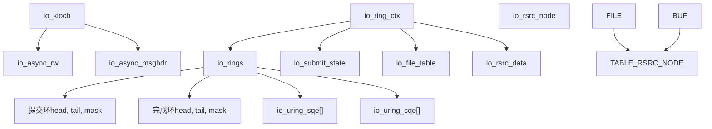
**来源：** [include/linux/io\_uring\_types.h239-400](https://github.com/torvalds/linux/blob/fcb70a56/include/linux/io_uring_types.h#L239-L400) [io\_uring/io\_uring.c297-378](https://github.com/torvalds/linux/blob/fcb70a56/io_uring/io_uring.c#L297-L378)

### 环上下文结构

`io_ring_ctx` 充当 io\_uring 实例的中心上下文，包含所有环状态、资源表和操作队列。该结构被组织成缓存行对齐的部分，以获得最佳性能。

| 组件 | 类型 | 用途 | 关键操作 |
| --- | --- | --- | --- |
| `rings` | `struct io_rings*` | 共享内存环结构 | `io_cqe_cache_refill()`, `io_get_cqe()` |
| `file_table` | `struct io_file_table` | 带有位图的固定文件描述符表 | `io_file_get_fixed()`, `io_fixed_file_set()` |
| `buf_table` | `struct io_rsrc_data` | 注册缓冲区表 | `io_import_reg_buf()` |
| `submit_state` | `struct io_submit_state` | 提交批处理和空闲列表 | `io_alloc_req()`, `io_req_add_to_cache()` |
| `uring_lock` | `struct mutex` | 主要上下文锁 | 保护大多数 ctx 操作 |
| `completion_lock` | `spinlock_t` | CQ 发布锁 (if !lockless\_cq) | `io_cq_lock()`, `io_cq_unlock_post()` |
| `cached_cq_tail` | `unsigned int` | 缓存的完成队列尾部 | 由 `io_commit_cqring()` 更新 |
| `io_bl_xa` | `struct xarray` | 缓冲区列表查找 (bgid → io\_buffer\_list) | `io_buffer_get_list()` |
| `work_llist` | `struct llist_head` | DEFER\_TASKRUN 工作列表 | `io_req_local_work_add()` |
| `cancel_table` | `struct io_hash_table` | 请求取消哈希表 | `io_cancel_req_match()` |
| `apoll_cache` | `struct io_alloc_cache` | 异步轮询结构缓存 | `io_alloc_cache_get()` |
| `netmsg_cache` | `struct io_alloc_cache` | 网络消息缓存 | `io_msg_alloc_async()` |
| `rw_cache` | `struct io_alloc_cache` | 读/写异步数据缓存 | `io_rw_alloc_async()` |
| `cmd_cache` | `struct io_alloc_cache` | uring\_cmd 异步数据缓存 | `io_uring_alloc_async_data()` |
| `zcrx_ctxs` | `struct xarray` | 零拷贝 RX 接口队列 | `io_register_zcrx_ifq()` |

**来源：** [include/linux/io\_uring\_types.h239-400](https://github.com/torvalds/linux/blob/fcb70a56/include/linux/io_uring_types.h#L239-L400) [io\_uring/io\_uring.c284-366](https://github.com/torvalds/linux/blob/fcb70a56/io_uring/io_uring.c#L284-L366) [io\_uring/io\_uring.c549-580](https://github.com/torvalds/linux/blob/fcb70a56/io_uring/io_uring.c#L549-L580)

### 请求生命周期

每个 I/O 请求由一个 `io_kiocb` 结构表示，并遵循从提交到完成的结构化生命周期。根据操作类型、文件特征和系统状态，请求可以采取多种执行路径。

#### 请求生命周期图

**图表：带有代码符号的 io\_kiocb 生命周期**

```mermaid
flowchart TD
    SQE["struct io_uring_sqe来自 rings->sqes[]"]
    GET_SQE["io_get_sqe()读取 sq_array[head]"]
    ALLOC_REQ["io_alloc_req()来自 submit_state.free_list"]
    PREP["io_issue_defs[opcode].prep()例如 io_prep_rw()"]
    ISSUE["io_issue_sqe()"]
    OPDEF["io_issue_defs[opcode].issue()例如 io_read()"]
    CHECK_INLINE["检查返回值"]
    INLINE_EXEC["IOU_COMPLETE内联成功"]
    NEED_POLL["IOU_RETRYio_arm_poll_handler()"]
    QUEUE_WQ["IOU_RETRYio_queue_iowq()"]
    ASYNC_ARM["IOU_ISSUE_SKIP_COMPLETE-EIOCBQUEUED"]
    TASK_WORK["io_req_task_work_add()tctx->task_list"]
    TW_HANDLER["req->io_task_work.func例如 io_req_rw_complete()"]
    FILL_CQE["io_fill_cqe_req()ctx->cqe_cached"]
    POST_CQE["写入 rings->cqes[]"]
    FREE_REQ["io_req_add_to_cache()或 io_free_req()"]

    SQE --> GET_SQE
    GET --> SQE_ALLOC_REQ
    ALLOC --> REQ_PREP
    PREP --> ISSUE
    ISSUE --> OPDEF
    OPDEF --> CHECK_INLINE
    CHECK --> INLINE_INLINE_EXEC
    CHECK --> INLINE_NEED_POLL
    CHECK --> INLINE_QUEUE_WQ
    CHECK --> INLINE_ASYNC_ARM
    INLINE --> EXEC_FILL_CQE
    NEED --> POLL_TASK_WORK
    QUEUE --> WQ_TW_HANDLER
    ASYNC --> ARM_TW_HANDLER
    TASK --> WORK_TW_HANDLER
    TW --> HANDLER_FILL_CQE
    FILL --> CQE_POST_CQE
    POST --> CQE_FREE_REQ
```
**来源：** [io\_uring/io\_uring.c1836-1927](https://github.com/torvalds/linux/blob/fcb70a56/io_uring/io_uring.c#L1836-L1927) [io\_uring/io\_uring.c996-1025](https://github.com/torvalds/linux/blob/fcb70a56/io_uring/io_uring.c#L996-L1025) [io\_uring/rw.c680-730](https://github.com/torvalds/linux/blob/fcb70a56/io_uring/rw.c#L680-L730) [io\_uring/io\_uring.h92-111](https://github.com/torvalds/linux/blob/fcb70a56/io_uring/io_uring.h#L92-L111)

#### 请求状态与标志

`io_kiocb->flags` 中跟踪的关键标志：

| 标志 | 值 | 含义 |
| --- | --- | --- |
| `REQ_F_FIXED_FILE` | Bit 0 | 使用固定文件表 |
| `REQ_F_LINK` | Bit 1 | 链接链的一部分 |
| `REQ_F_HARDLINK` | Bit 2 | 硬链接（失败整个链） |
| `REQ_F_FORCE_ASYNC` | Bit 3 | 必须在异步上下文中执行 |
| `REQ_F_BUFFER_SELECT` | Bit 4 | 从组中选择缓冲区 |
| `REQ_F_CQE_SKIP` | Bit 5 | 成功时不发布 CQE |
| `REQ_F_FAIL` | Bit 6 | 请求失败 |
| `REQ_F_INFLIGHT` | Bit 7 | 跟踪为进行中 |
| `REQ_F_CREDS` | Bit 8 | 携带任务凭证 |
| `REQ_F_REFCOUNT` | Bit 9 | 具有显式引用计数 |
| `REQ_F_ASYNC_DATA` | Bit 10 | 已分配 async\_data |
| `REQ_F_BUFFER_RING` | Bit 11 | 来自环提供者的缓冲区 |

**来源：** [io\_uring/io\_uring.h21-40](https://github.com/torvalds/linux/blob/fcb70a56/io_uring/io_uring.h#L21-L40) [io\_uring/io\_uring.c108-122](https://github.com/torvalds/linux/blob/fcb70a56/io_uring/io_uring.c#L108-L122)

## 提交和完成队列

io\_uring 接口使用一对在用户空间和内核之间共享的无锁环形缓冲区，以最小化系统调用开销。环实现了具有内存屏障的生产者-消费者模式以确保正确性。

### 提交队列 (SQ)

提交队列允许用户空间通过写入 `io_uring_sqe` 条目并更新尾指针来提交 I/O 请求。内核从头指针读取并推进它。

#### SQE 结构布局

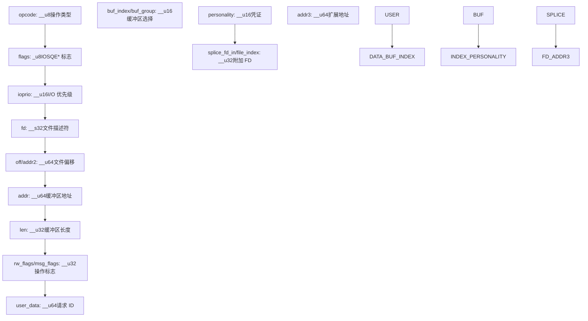
**SQE 字段详情：**

| 字段 | 类型 | 描述 |
| --- | --- | --- |
| `opcode` | `__u8` | 来自 `enum io_uring_op` 的操作类型 |
| `flags` | `__u8` | SQE 标志 (IOSQE\_FIXED\_FILE, IOSQE\_IO\_LINK 等) |
| `ioprio` | `__u16` | I/O 优先级或某些操作的特殊标志 |
| `fd` | `__s32` | 文件描述符 (或固定文件索引，如果 IOSQE\_FIXED\_FILE) |
| `off` / `addr2` | `__u64` | 文件偏移或辅助地址 |
| `addr` | `__u64` | 缓冲区地址或 iovec 指针 |
| `len` | `__u32` | 缓冲区长度或 iovec 计数 |
| `rw_flags` / `msg_flags` | `__u32` | 操作特定标志 (例如 RWF\_*, MSG\_*) |
| `user_data` | `__u64` | 在 CQE 中回显的不透明用户标识符 |
| `buf_index` / `buf_group` | `__u16` | 缓冲区选择 (固定索引或组 ID) |
| `personality` | `__u16` | 用于凭证的注册人格 ID |
| `splice_fd_in` / `file_index` | `__u32` | 附加文件描述符字段 |

**来源：** [include/uapi/linux/io\_uring.h30-118](https://github.com/torvalds/linux/blob/fcb70a56/include/uapi/linux/io_uring.h#L30-L118)

#### SQ 的内存排序

提交协议需要仔细的内存排序：

1.  用户空间在 `sqes[sq_array[tail & mask]]` 写入 SQE 条目
2.  用户空间发出 `smp_wmb()` (或 `smp_store_release()`)
3.  用户空间推进 `rings->sq.tail`
4.  内核使用 `smp_load_acquire()` 读取 tail
5.  内核处理 SQE 并推进 `rings->sq.head`

**来源：** [io\_uring/io\_uring.c1-28](https://github.com/torvalds/linux/blob/fcb70a56/io_uring/io_uring.c#L1-L28)

### 完成队列 (CQ)

完成队列通过 `io_uring_cqe` 条目将 I/O 完成事件从内核传递到用户空间。内核写入尾部，用户空间从头部读取。

#### CQE 结构布局

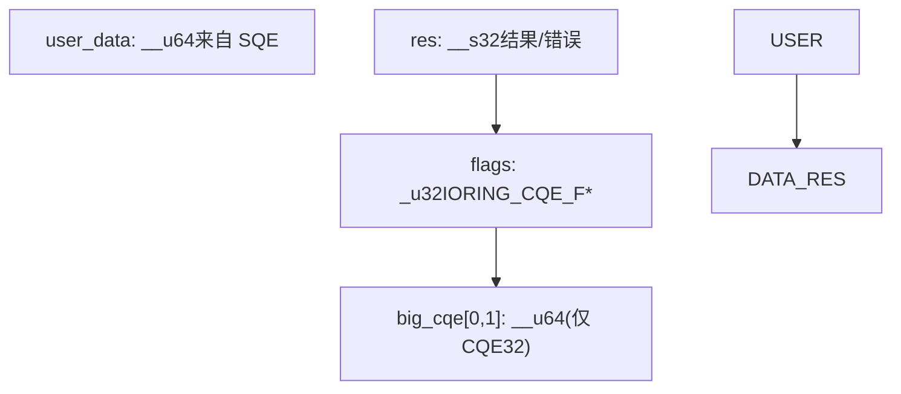
**CQE 字段详情：**

| 字段 | 类型 | 描述 |
| --- | --- | --- |
| `user_data` | `__u64` | 来自匹配 SQE 的请求标识符 |
| `res` | `__s32` | 操作结果 (传输的字节数或 -errno) |
| `flags` | `__u32` | 完成标志 (IORING\_CQE\_F\_BUFFER, IORING\_CQE\_F\_MORE 等) |
| `big_cqe[0,1]` | `__u64[2]` | CQE32 模式的额外数据 (例如 uring\_cmd 结果) |

**常见 CQE 标志：**

| 标志 | 值 | 含义 |
| --- | --- | --- |
| `IORING_CQE_F_BUFFER` | 0x0001 | 标志高 16 位中的缓冲区 ID |
| `IORING_CQE_F_MORE` | 0x0002 | 更多完成即将到来 (multishot) |
| `IORING_CQE_F_SOCK_NONEMPTY` | 0x0004 | 套接字有更多数据可用 |
| `IORING_CQE_F_NOTIF` | 0x0008 | 通知 CQE (零拷贝发送) |

**来源：** [include/uapi/linux/io\_uring.h245-273](https://github.com/torvalds/linux/blob/fcb70a56/include/uapi/linux/io_uring.h#L245-L273) [io\_uring/io\_uring.c750-785](https://github.com/torvalds/linux/blob/fcb70a56/io_uring/io_uring.c#L750-L785)

#### CQ 的内存排序

完成协议内存排序：

1.  内核在 `rings->cqes[tail & mask]` 写入 CQE 条目
2.  内核发出 `smp_wmb()` (或 `smp_store_release()`)
3.  内核推进 `rings->cq.tail`
4.  用户空间使用 `smp_load_acquire()` 读取 tail
5.  用户空间处理 CQE
6.  用户空间发出 `smp_mb()` (或 `smp_store_release()`)
7.  用户空间推进 `rings->cq.head`

**来源：** [io\_uring/io\_uring.c1-28](https://github.com/torvalds/linux/blob/fcb70a56/io_uring/io_uring.c#L1-L28) [io\_uring/io\_uring.c755-785](https://github.com/torvalds/linux/blob/fcb70a56/io_uring/io_uring.c#L755-L785)

### CQE 缓存与批处理

为了减少开销，内核维护一个缓存的 CQE 槽范围：

-   `ctx->cqe_cached`：指向下一个可用 CQE 的指针
-   `ctx->cqe_sentinel`：缓存范围的末尾
-   `io_cqe_cache_refill()`：当缓存耗尽时重新填充

**来源：** [io\_uring/io\_uring.c755-785](https://github.com/torvalds/linux/blob/fcb70a56/io_uring/io_uring.c#L755-L785) [include/linux/io\_uring\_types.h335-349](https://github.com/torvalds/linux/blob/fcb70a56/include/linux/io_uring_types.h#L335-L349)

## I/O 操作类型

io\_uring 框架支持全面的 I/O 操作集，每种操作都有专门的准备和执行路径。操作行为在 `io_uring/opdef.c` 中的 `io_issue_defs[]` 和 `io_cold_defs[]` 数组中定义。每个操作具有：

-   `prep()`：验证 SQE 并准备请求特定数据
-   `issue()`：执行操作
-   `cleanup()`：清理操作特定资源
-   `fail()`：处理链接操作的失败情况

**支持的操作类别：**

| 类别 | 操作码 | 关键文件 |
| --- | --- | --- |
| 文件 I/O | `IORING_OP_READ`, `IORING_OP_WRITE`, `IORING_OP_READV`, `IORING_OP_WRITEV`, `IORING_OP_READ_FIXED`, `IORING_OP_WRITE_FIXED` | `io_uring/rw.c` |
| 网络 I/O | `IORING_OP_SEND`, `IORING_OP_RECV`, `IORING_OP_SENDMSG`, `IORING_OP_RECVMSG`, `IORING_OP_SEND_ZC`, `IORING_OP_RECV_ZC` | `io_uring/net.c`, `io_uring/zcrx.c` |
| 套接字操作 | `IORING_OP_ACCEPT`, `IORING_OP_CONNECT`, `IORING_OP_SOCKET`, `IORING_OP_SHUTDOWN` | `io_uring/net.c` |
| 文件操作 | `IORING_OP_OPENAT`, `IORING_OP_OPENAT2`, `IORING_OP_CLOSE`, `IORING_OP_STATX` | `io_uring/openclose.c` |
| 同步操作 | `IORING_OP_FSYNC`, `IORING_OP_SYNC_FILE_RANGE`, `IORING_OP_FDATASYNC` | `io_uring/sync.c` |
| 轮询 | `IORING_OP_POLL_ADD`, `IORING_OP_POLL_REMOVE` | `io_uring/poll.c` |
| 透传 | `IORING_OP_URING_CMD`, `IORING_OP_URING_CMD128` | `io_uring/uring_cmd.c` |
| 超时 | `IORING_OP_TIMEOUT`, `IORING_OP_TIMEOUT_REMOVE`, `IORING_OP_LINK_TIMEOUT` | `io_uring/timeout.c` |
| 缓冲区管理 | `IORING_OP_PROVIDE_BUFFERS`, `IORING_OP_REMOVE_BUFFERS` | `io_uring/kbuf.c` |
| Futex | `IORING_OP_FUTEX_WAIT`, `IORING_OP_FUTEX_WAKE`, `IORING_OP_FUTEX_WAITV` | `io_uring/futex.c` |

**来源：** [io\_uring/opdef.c1-500](https://github.com/torvalds/linux/blob/fcb70a56/io_uring/opdef.c#L1-L500)

### 读/写操作

文件读写操作构成了 io\_uring 功能的核心，支持缓冲 I/O、直接 I/O 和固定缓冲区。

#### 读/写执行流


**来源：** [io\_uring/rw.c252-325](https://github.com/torvalds/linux/blob/fcb70a56/io_uring/rw.c#L252-L325) [io\_uring/rw.c680-891](https://github.com/torvalds/linux/blob/fcb70a56/io_uring/rw.c#L680-L891) [io\_uring/rw.c585-614](https://github.com/torvalds/linux/blob/fcb70a56/io_uring/rw.c#L585-L614)

#### 读/写变体

| 操作码 | 准备函数 | 发出函数 | 描述 |
| --- | --- | --- | --- |
| `IORING_OP_READ` | `io_prep_read()` | `io_read()` | 单缓冲区读取 |
| `IORING_OP_WRITE` | `io_prep_write()` | `io_write()` | 单缓冲区写入 |
| `IORING_OP_READV` | `io_prep_readv()` | `io_read()` | 向量读取 (iovec 数组) |
| `IORING_OP_WRITEV` | `io_prep_writev()` | `io_write()` | 向量写入 (iovec 数组) |
| `IORING_OP_READ_FIXED` | `io_prep_read_fixed()` | `io_read()` | 读入预注册缓冲区 |
| `IORING_OP_WRITE_FIXED` | `io_prep_write_fixed()` | `io_write()` | 从预注册缓冲区写入 |

**来源：** [io\_uring/rw.c327-436](https://github.com/torvalds/linux/blob/fcb70a56/io_uring/rw.c#L327-L436) [io\_uring/opdef.c1-500](https://github.com/torvalds/linux/blob/fcb70a56/io_uring/opdef.c#L1-L500)

#### 异步数据结构

`io_async_rw` 结构体持有异步读/写操作的状态：

```
struct io_async_rw {
    struct iov_iter iter;           // 当前迭代器状态
    struct iov_iter_state iter_state;  // 保存的迭代器状态
    struct iovec fast_iov;          // 内联 iovec (优化)
    struct iou_vec vec;             // 动态 iovec 数组
    size_t bytes_done;              // 迄今传输的字节数
    struct wait_page_queue wpq;     // 用于异步缓冲读取
};
```
**来源：** [io\_uring/rw.c1-50](https://github.com/torvalds/linux/blob/fcb70a56/io_uring/rw.c#L1-L50) [io\_uring/io\_uring.c287-295](https://github.com/torvalds/linux/blob/fcb70a56/io_uring/io_uring.c#L287-L295)

### 网络操作

网络 I/O 操作提供高性能套接字通信，支持向量 I/O、multishot 模式和零拷贝技术。

#### 网络操作矩阵

| 操作码 | 准备函数 | 发出函数 | Multishot | Bundle 支持 |
| --- | --- | --- | --- | --- |
| `IORING_OP_SENDMSG` | `io_sendmsg_prep()` | `io_sendmsg()` | 否 | 是 |
| `IORING_OP_RECVMSG` | `io_recvmsg_prep()` | `io_recvmsg()` | 是 | 否 |
| `IORING_OP_SEND` | `io_sendmsg_prep()` | `io_send()` | 否 | 是 |
| `IORING_OP_RECV` | `io_recvmsg_prep()` | `io_recv()` | 是 | 是 |
| `IORING_OP_ACCEPT` | `io_accept_prep()` | `io_accept()` | 是 | 否 |
| `IORING_OP_CONNECT` | `io_connect_prep()` | `io_connect()` | 否 | 否 |
| `IORING_OP_SEND_ZC` | `io_send_zc_prep()` | `io_send_zc()` | 否 | 否 |
| `IORING_OP_RECV_ZC` | `io_recvzc_prep()` | `io_recvzc()` | 是 | 否 |

**来源：** [io\_uring/net.c418-449](https://github.com/torvalds/linux/blob/fcb70a56/io_uring/net.c#L418-L449) [io\_uring/net.c778-837](https://github.com/torvalds/linux/blob/fcb70a56/io_uring/net.c#L778-L837) [io\_uring/net.c540-701](https://github.com/torvalds/linux/blob/fcb70a56/io_uring/net.c#L540-L701)

#### 网络消息结构

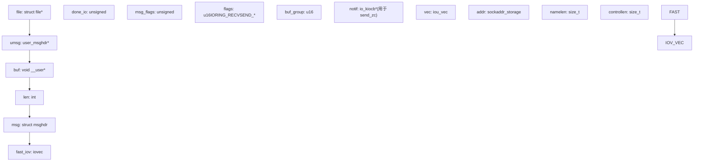
**来源：** [io\_uring/net.c64-86](https://github.com/torvalds/linux/blob/fcb70a56/io_uring/net.c#L64-L86) [io\_uring/net.c160-200](https://github.com/torvalds/linux/blob/fcb70a56/io_uring/net.c#L160-L200)

## 资源管理

io\_uring 系统通过预注册文件和缓冲区提供高效的资源管理，通过避免重复的文件查找和内存固定来减少每次操作的开销。

### 固定文件

固定文件注册允许应用程序注册一次文件描述符，并在后续操作中通过索引引用它们，从而消除 `fget()` 开销。

#### 固定文件架构

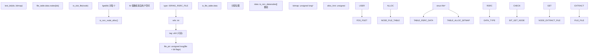
**来源：** [io\_uring/rsrc.c541-609](https://github.com/torvalds/linux/blob/fcb70a56/io_uring/rsrc.c#L541-L609) [io\_uring/filetable.h1-100](https://github.com/torvalds/linux/blob/fcb70a56/io_uring/filetable.h#L1-L100) [include/linux/io\_uring\_types.h61-70](https://github.com/torvalds/linux/blob/fcb70a56/include/linux/io_uring_types.h#L61-L70)

#### 文件表操作

| 函数 | 用途 |
| --- | --- |
| `io_sqe_files_register()` | 注册初始文件表 |
| `io_sqe_files_unregister()` | 注销所有文件 |
| `io_files_update()` | 更新固定文件子集 |
| `io_file_get_fixed()` | 从索引获取文件指针 |
| `io_fixed_file_set()` | 在槽中设置文件 |
| `io_file_bitmap_set()` | 将槽标记为已占用 |
| `io_file_bitmap_clear()` | 将槽标记为空闲 |

**来源：** [io\_uring/rsrc.c223-286](https://github.com/torvalds/linux/blob/fcb70a56/io_uring/rsrc.c#L223-L286) [io\_uring/rsrc.c426-509](https://github.com/torvalds/linux/blob/fcb70a56/io_uring/rsrc.c#L426-L509)

### 缓冲区注册

预注册缓冲区通过在注册时一次性固定用户内存页面，避免重复的 `get_user_pages()` 调用，从而实现零拷贝 I/O。

#### 缓冲区注册流程

```mermaid
flowchart TD
    FIND_NODE["io_rsrc_node_lookup()"]
    GET_IMU["node->buf (io_mapped_ubuf*)"]
    VALIDATE_OFFSET["检查 offset + len"]
    INIT_ITER["iov_iter_bvec()来自 bvec 数组"]
    USER_IOV["struct iovec[]来自用户空间"]
    VALIDATE["io_buffer_validate()"]
    PIN_PAGES["io_pin_pages()pin_user_pages()"]
    ALLOC_IMU["io_alloc_imu()"]
    ACCOUNT["io_buffer_account_pin()"]
    BUILD_BVEC["构建 bio_vec 数组"]
    UBUF["ubuf: unsigned long原始用户地址"]
    LENGTH["len: unsigned int"]
    NR_BVECS["nr_bvecs: unsigned int"]
    FOLIO_SHIFT["folio_shift: unsigned int"]
    REFS_IMU["refs: refcount_t"]
    ACCT_PAGES["acct_pages: unsigned long"]
    RELEASE["release(): void ()(void)"]
    BVEC_ARRAY["bvec[]: struct bio_vec[]"]

    USER --> IOV_VALIDATE
    VALIDATE --> PIN_PAGES
    PIN --> PAGES_ALLOC_IMU
    ALLOC --> IMU_ACCOUNT
    ACCOUNT --> BUILD_BVEC
    BUILD --> BVEC_UBUF
    UBUF --> LENGTH
    LENGTH --> BVEC_ARRAY
    FIND --> NODE_GET_IMU
    GET --> IMU_VALIDATE_OFFSET
    VALIDATE --> OFFSET_INIT_ITER
```
**来源：** [io\_uring/rsrc.c777-862](https://github.com/torvalds/linux/blob/fcb70a56/io_uring/rsrc.c#L777-L862) [io\_uring/rsrc.c864-931](https://github.com/torvalds/linux/blob/fcb70a56/io_uring/rsrc.c#L864-L931) [io\_uring/rsrc.h31-43](https://github.com/torvalds/linux/blob/fcb70a56/io_uring/rsrc.h#L31-L43)

#### 缓冲区合并优化

对于大页分配 (huge pages)，io\_uring 可以将连续页面合并为更少的 bio\_vec 条目：

-   `io_check_coalesce_buffer()`：检测缓冲区是否在统一的大 folio 上
-   `io_coalesce_buffer()`：通过合并连续 folio 页面减少 nr\_bvecs
-   在 `io_imu_folio_data` 中跟踪 `nr_pages_head`, `nr_pages_mid`, 和 `folio_shift`

**来源：** [io\_uring/rsrc.c692-775](https://github.com/torvalds/linux/blob/fcb70a56/io_uring/rsrc.c#L692-L775)

### 资源节点管理

`io_rsrc_node` 结构体用于文件和缓冲区：

```
struct io_rsrc_node {
    unsigned char type;      // IORING_RSRC_FILE 或 IORING_RSRC_BUFFER
    int refs;                // 引用计数
    u64 tag;                 // 可选的用户标签用于跟踪
    union {
        unsigned long file_ptr;      // 用于 IORING_RSRC_FILE
        struct io_mapped_ubuf *buf;  // 用于 IORING_RSRC_BUFFER
    };
};
```
**来源：** [io\_uring/rsrc.h15-24](https://github.com/torvalds/linux/blob/fcb70a56/io_uring/rsrc.h#L15-L24) [io\_uring/rsrc.c152-164](https://github.com/torvalds/linux/blob/fcb70a56/io_uring/rsrc.c#L152-L164)

#### 资源清理

当资源被注销或上下文被销毁时：

1.  `io_free_rsrc_node()`：调用特定类型的清理
2.  对于文件：`fput(io_slot_file(node))`
3.  对于缓冲区：`io_buffer_unmap()` 取消固定页面并减少核算
4.  如果注册期间设置了标签，则发布带有标签的 CQE
5.  将节点返回缓存：`io_cache_free(&ctx->node_cache, node)`

**来源：** [io\_uring/rsrc.c511-529](https://github.com/torvalds/linux/blob/fcb70a56/io_uring/rsrc.c#L511-L529) [io\_uring/rsrc.c139-150](https://github.com/torvalds/linux/blob/fcb70a56/io_uring/rsrc.c#L139-L150)

## 缓冲区选择与管理

io\_uring 框架通过提供的缓冲区组为高性能 I/O 操作提供了复杂的缓冲区管理。应用程序可以使用传统列表或高性能环形缓冲区提供缓冲区。

### 缓冲区提供者架构

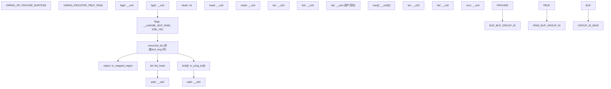
**来源：** [io\_uring/kbuf.h15-38](https://github.com/torvalds/linux/blob/fcb70a56/io_uring/kbuf.h#L15-L38) [io\_uring/kbuf.c82-93](https://github.com/torvalds/linux/blob/fcb70a56/io_uring/kbuf.c#L82-L93) [include/uapi/linux/io\_uring.h649-676](https://github.com/torvalds/linux/blob/fcb70a56/include/uapi/linux/io_uring.h#L649-L676)

### 缓冲区选择过程

当请求设置了 `IOSQE_BUFFER_SELECT` 标志时，io\_uring 自动从指定组中选择一个缓冲区。

```mermaid
flowchart TD
    CHECK_FLAG["req->flags & REQ_F_BUFFER_SELECT"]
    GET_GROUP["buf_group from sqe->buf_group"]
    LOOKUP_BL["io_buffer_get_list(ctx, bgid)"]
    CHECK_TYPE["bl->flags & IOBL_BUF_RING?"]
    RING_SELECT["io_ring_buffer_select()"]
    PROVIDED_SELECT["io_provided_buffer_select()"]
    LOAD_TAIL["tail = smp_load_acquire(&br->tail)"]
    CHECK_AVAIL["head != tail?"]
    GET_BUF["buf = &br->bufs[head & mask]"]
    READ_LEN["len = READ_ONCE(buf->len)"]
    SET_FLAGS["req->flags |= REQ_F_BUFFER_RING"]
    COMMIT_LATER["Mark for commit"]
    GET_FIRST["list_first_entry(&bl->buf_list)"]
    LIST_DEL["list_del(&kbuf->list)"]
    DEC_COUNT["bl->nbufs--"]
    SET_KBUF["req->kbuf = kbuf"]

    CHECK --> FLAG_GET_GROUP
    GET --> GROUP_LOOKUP_BL
    LOOKUP --> BL_CHECK_TYPE
    CHECK --> TYPE_RING_SELECT
    CHECK --> TYPE_PROVIDED_SELECT
    RING --> SELECT_LOAD_TAIL
    LOAD --> TAIL_CHECK_AVAIL
    CHECK --> AVAIL_GET_BUF
    GET --> BUF_READ_LEN
    READ --> LEN_SET_FLAGS
    SET --> FLAGS_COMMIT_LATER
    PROVIDED --> SELECT_GET_FIRST
    GET --> FIRST_LIST_DEL
    LIST --> DEL_DEC_COUNT
    DEC --> COUNT_SET_KBUF
```
**来源：** [io\_uring/kbuf.c201-219](https://github.com/torvalds/linux/blob/fcb70a56/io_uring/kbuf.c#L201-L219) [io\_uring/kbuf.c158-199](https://github.com/torvalds/linux/blob/fcb70a56/io_uring/kbuf.c#L158-L199) [io\_uring/kbuf.c122-156](https://github.com/torvalds/linux/blob/fcb70a56/io_uring/kbuf.c#L122-L156)

### 缓冲区提交协议

对于环形缓冲区，选择是一个两阶段过程，以处理故障：

1.  **选择**：选择缓冲区，`req->flags |= REQ_F_BUFFER_RING | REQ_F_BUFFERS_COMMIT`
2.  **提交**：成功完成时，`io_kbuf_commit()` 推进 `bl->head`

对于捆绑操作 (multishot receive)，可能会消耗多个缓冲区：

-   `io_put_kbufs()`：返回缓冲区 ID 和计数
-   `io_kbuf_commit()`：提交指定数量的缓冲区

**来源：** [io\_uring/kbuf.c58-72](https://github.com/torvalds/linux/blob/fcb70a56/io_uring/kbuf.c#L58-L72) [io\_uring/kbuf.h83-110](https://github.com/torvalds/linux/blob/fcb70a56/io_uring/kbuf.h#L83-L110)

### 向量操作的缓冲区窥视

某些操作（如向量发送/接收）需要窥视多个缓冲区：

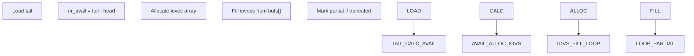
**来源：** [io\_uring/kbuf.c224-305](https://github.com/torvalds/linux/blob/fcb70a56/io_uring/kbuf.c#L224-L305) [io\_uring/kbuf.c340-361](https://github.com/torvalds/linux/blob/fcb70a56/io_uring/kbuf.c#L340-L361)

### 增量缓冲区消耗

`IOBL_INC` 标志为流协议启用部分缓冲区消耗：

-   在部分读取时，不消耗整个缓冲区，而是调整 `buf->addr` 和 `buf->len`
-   仅当缓冲区完全消耗时推进 `bl->head`
-   通过注册期间的 `IORING_PBUF_RING_INC` 标志启用

**来源：** [io\_uring/kbuf.c35-56](https://github.com/torvalds/linux/blob/fcb70a56/io_uring/kbuf.c#L35-L56) [io\_uring/kbuf.h8-13](https://github.com/torvalds/linux/blob/fcb70a56/io_uring/kbuf.h#L8-L13)

## 性能特性

### 任务工作和完成批处理

io\_uring 系统使用任务工作 (task work) 来批量处理完成并减少上下文切换开销。根据设置标志，有多种任务工作机制可用。

**图表：任务工作执行路径**


**任务工作模式：**

| 模式 | 设置标志 | 添加函数 | 运行函数 | 特征 |
| --- | --- | --- | --- | --- |
| DEFER\_TASKRUN | `IORING_SETUP_DEFER_TASKRUN` | `io_req_local_work_add()` | `io_run_local_work()` | 无 task\_work，提交者轮询 ctx->work\_llist |
| Normal | 默认 | `io_req_normal_work_add()` | `tctx_task_work()` | 标准 Linux task\_work 机制 |
| SQPOLL | `IORING_SETUP_SQPOLL` | N/A | `io_sq_thread()` | 专用内核线程 |
| COOP\_TASKRUN | `IORING_SETUP_COOP_TASKRUN` | 类似于 normal | `tctx_task_work()` | 协作运行 task\_work |

**完成批处理函数：**

-   `io_submit_flush_completions()`：刷新 `ctx->submit_state.compl_reqs` 列表
-   `io_req_complete_defer()`：将请求添加到延迟完成列表
-   `__io_submit_flush_completions()`：内部刷新实现
-   `io_cqring_wake()`：在发布 CQE 后唤醒 CQ 上的等待者

**来源：** [io\_uring/io\_uring.c1205-1273](https://github.com/torvalds/linux/blob/fcb70a56/io_uring/io_uring.c#L1205-L1273) [io\_uring/io\_uring.c1173-1203](https://github.com/torvalds/linux/blob/fcb70a56/io_uring/io_uring.c#L1173-L1203) [io\_uring/io\_uring.c1280-1293](https://github.com/torvalds/linux/blob/fcb70a56/io_uring/io_uring.c#L1280-L1293) [io\_uring/io\_uring.h176-177](https://github.com/torvalds/linux/blob/fcb70a56/io_uring/io_uring.h#L176-L177)

### io-wq 工作池

对于无法内联完成的操作（例如，阻塞文件 I/O），io\_uring 使用由 `io-wq` 管理的每任务工作池。

**图表：io-wq 架构**

```mermaid
flowchart TD
    ISSUE["io_issue_sqe()"]
    CHECK_ASYNC["返回 IOU_RETRY"]
    QUEUE_WQ["io_queue_iowq()"]
    PREP_ASYNC["io_prep_async_link()"]
    IO_WQ["struct io_wq(tctx->io_wq)"]
    ACCT["acct[2]:IO_WQ_ACCT_BOUNDIO_WQ_ACCT_UNBOUND"]
    WORKER_LIST["workers: list_head"]
    FREE_LIST["free_list: list_head"]
    HASH["hash: io_wq_hash"]
    WORKER["struct io_worker"]
    WORK_LIST["work_list: io_wq_work_list"]
    WQ_WORKER["io_wq_worker()"]
    SUBMIT_WORK["io_wq_submit_work()"]
    ISSUE_OP["io_issue_defs[opcode].issue()"]
    COMPLETE["io_req_complete_post()"]
    ENQUEUE["io_wq_enqueue()"]
    SELECT_ACCT["绑定 vs 未绑定IO_WQ_WORK_UNBOUND"]
    HASH_WORK["io_wq_hash_work()文件 inode 哈希"]
    CREATE_WORKER["io_wq_create_worker()"]

    ISSUE --> CHECK_ASYNC
    CHECK --> ASYNC_QUEUE_WQ
    QUEUE --> WQ_PREP_ASYNC
    PREP --> ASYNC_ENQUEUE
    ENQUEUE --> IO_WQ
    IO --> WQ_ACCT
    ACCT --> SELECT_ACCT
    SELECT --> ACCT_HASH_WORK
    HASH --> WORK_HASH
    HASH --> WORKER_LIST
    WORKER --> LIST_WORKER
    WORKER --> WORK_LIST
    WORK --> LIST_WQ_WORKER
    WQ --> WORKER_SUBMIT_WORK
    SUBMIT --> WORK_ISSUE_OP
    ISSUE --> OP_COMPLETE
    SELECT --> ACCT_CREATE_WORKER
    CREATE --> WORKER_WORKER
```
**io-wq 关键结构：**

-   `struct io_wq`：`tctx->io_wq` 中的每任务工作队列
-   `struct io_worker`：单个工作线程
-   `struct io_wq_work`：嵌入在 `io_kiocb->work` 中的工作项
-   `struct io_wq_hash`：用于序列化哈希工作的哈希表

**工作类型：**

| 标志 | 值 | 含义 |
| --- | --- | --- |
| `IO_WQ_WORK_CONCURRENT` | Bit 0 | 可以并发运行 (例如 O\_DIRECT) |
| `IO_WQ_WORK_UNBOUND` | Bit 1 | 不绑定到 CPU (例如网络，块 I/O) |
| `IO_WQ_WORK_CANCEL` | Bit 2 | 工作正在被取消 |

**来源：** [io\_uring/io-wq.c1-1000](https://github.com/torvalds/linux/blob/fcb70a56/io_uring/io-wq.c#L1-L1000) [io\_uring/io\_uring.c417-493](https://github.com/torvalds/linux/blob/fcb70a56/io_uring/io_uring.c#L417-L493) [io\_uring/io-wq.h1-200](https://github.com/torvalds/linux/blob/fcb70a56/io_uring/io-wq.h#L1-L200)

### SQPOLL 模式

SQPOLL 模式运行一个专用的内核线程来轮询提交队列，从而完全消除提交系统调用。

**SQPOLL 线程生命周期：**

```mermaid
flowchart TD
    REG_SQPOLL["io_uring_setup()IORING_SETUP_SQPOLL"]
    ALLOC_SQD["io_init_sq_data()"]
    SQ_DATA["struct io_sq_data"]
    THREAD["io_sq_thread_park()"]
    SQ_THREAD["io_sq_thread()"]
    CHECK_STOP["检查 IO_SQ_THREAD_SHOULD_STOP"]
    HANDLE_EVENT["io_sqd_handle_event()"]
    CHECK_SQ["io_sqring_entries()"]
    SUBMIT["io_submit_sqes()"]
    IOPOLL["io_do_iopoll()(如果 IOPOLL)"]
    IDLE_CHECK["空闲超时检查"]
    PARK["io_sq_thread_park()"]
    USER_ENTER["io_uring_enter()IORING_ENTER_SQ_WAKEUP"]
    NEED_WAKEUP["检查 IORING_SQ_NEED_WAKEUP"]
    WAKE["wake_up(&sqd->wait)"]
    SQ_FLAGS["rings->sq_flags"]

    REG --> SQPOLL_ALLOC_SQD
    ALLOC --> SQD_SQ_DATA
    SQ --> DATA_THREAD
    THREAD --> SQ_THREAD
    SQ --> THREAD_CHECK_STOP
    CHECK --> STOP_HANDLE_EVENT
    HANDLE --> EVENT_CHECK_SQ
    CHECK --> SQ_SUBMIT
    SUBMIT --> IOPOLL
    IOPOLL --> IDLE_CHECK
    IDLE --> CHECK_PARK
    PARK --> SQ_THREAD
    USER --> ENTER_NEED_WAKEUP
    NEED --> WAKEUP_WAKE
    WAKE --> SQ_FLAGS
    SQ --> FLAGS_SQ_THREAD
```
**SQPOLL 配置：**

-   `sq_thread_idle`：以毫秒为单位的空闲超时 (来自参数)
-   `sq_thread_cpu`：SQPOLL 线程的 CPU 亲和性 (使用 `IORING_SETUP_SQ_AFF`)
-   `IORING_SQ_NEED_WAKEUP`：当线程空闲并需要显式唤醒时设置的标志

**来源：** [io\_uring/sqpoll.c1-400](https://github.com/torvalds/linux/blob/fcb70a56/io_uring/sqpoll.c#L1-L400) [io\_uring/sqpoll.c194-386](https://github.com/torvalds/linux/blob/fcb70a56/io_uring/sqpoll.c#L194-L386)

### IOPOLL 模式

IOPOLL 模式对低延迟块 I/O 设备使用忙轮询，绕过基于中断的完成。

**IOPOLL 执行：**

1.  发出的请求带有 `kiocb->ki_complete = io_complete_rw_iopoll`
2.  `io_do_iopoll()` 轮询设备，而不是等待中断
3.  轮询发生在 `io_uring_enter()` 或 SQPOLL 线程中
4.  对于 NVMe，使用 `nvme_ns->poll()` → `blk_mq_poll()`

**IOPOLL 配置标志：**

-   `IORING_SETUP_IOPOLL`：启用 IOPOLL 模式
-   `IORING_SETUP_HYBRID_IOPOLL`：混合忙轮询，回退到阻塞

**来源：** [io\_uring/io\_uring.c1559-1640](https://github.com/torvalds/linux/blob/fcb70a56/io_uring/io_uring.c#L1559-L1640) [io\_uring/rw.c680-730](https://github.com/torvalds/linux/blob/fcb70a56/io_uring/rw.c#L680-L730)

### 零拷贝网络

通过 zcrx 子系统为高性能网络应用程序提供高级零拷贝接收功能。

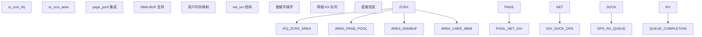
**来源：** [io\_uring/zcrx.c31-50](https://github.com/torvalds/linux/blob/fcb70a56/io_uring/zcrx.c#L31-L50) [io\_uring/zcrx.c155-293](https://github.com/torvalds/linux/blob/fcb70a56/io_uring/zcrx.c#L155-L293)
