# Btrfs 写时复制文件系统

相关源文件

-   [fs/afs/callback.c](https://github.com/torvalds/linux/blob/fcb70a56/fs/afs/callback.c)
-   [fs/btrfs/accessors.h](https://github.com/torvalds/linux/blob/fcb70a56/fs/btrfs/accessors.h)
-   [fs/btrfs/backref.c](https://github.com/torvalds/linux/blob/fcb70a56/fs/btrfs/backref.c)
-   [fs/btrfs/bio.c](https://github.com/torvalds/linux/blob/fcb70a56/fs/btrfs/bio.c)
-   [fs/btrfs/bio.h](https://github.com/torvalds/linux/blob/fcb70a56/fs/btrfs/bio.h)
-   [fs/btrfs/block-group.c](https://github.com/torvalds/linux/blob/fcb70a56/fs/btrfs/block-group.c)
-   [fs/btrfs/block-group.h](https://github.com/torvalds/linux/blob/fcb70a56/fs/btrfs/block-group.h)
-   [fs/btrfs/btrfs\_inode.h](https://github.com/torvalds/linux/blob/fcb70a56/fs/btrfs/btrfs_inode.h)
-   [fs/btrfs/compression.c](https://github.com/torvalds/linux/blob/fcb70a56/fs/btrfs/compression.c)
-   [fs/btrfs/compression.h](https://github.com/torvalds/linux/blob/fcb70a56/fs/btrfs/compression.h)
-   [fs/btrfs/ctree.c](https://github.com/torvalds/linux/blob/fcb70a56/fs/btrfs/ctree.c)
-   [fs/btrfs/defrag.c](https://github.com/torvalds/linux/blob/fcb70a56/fs/btrfs/defrag.c)
-   [fs/btrfs/delayed-inode.c](https://github.com/torvalds/linux/blob/fcb70a56/fs/btrfs/delayed-inode.c)
-   [fs/btrfs/delayed-inode.h](https://github.com/torvalds/linux/blob/fcb70a56/fs/btrfs/delayed-inode.h)
-   [fs/btrfs/delayed-ref.c](https://github.com/torvalds/linux/blob/fcb70a56/fs/btrfs/delayed-ref.c)
-   [fs/btrfs/delayed-ref.h](https://github.com/torvalds/linux/blob/fcb70a56/fs/btrfs/delayed-ref.h)
-   [fs/btrfs/dev-replace.c](https://github.com/torvalds/linux/blob/fcb70a56/fs/btrfs/dev-replace.c)
-   [fs/btrfs/dir-item.c](https://github.com/torvalds/linux/blob/fcb70a56/fs/btrfs/dir-item.c)
-   [fs/btrfs/direct-io.c](https://github.com/torvalds/linux/blob/fcb70a56/fs/btrfs/direct-io.c)
-   [fs/btrfs/disk-io.c](https://github.com/torvalds/linux/blob/fcb70a56/fs/btrfs/disk-io.c)
-   [fs/btrfs/disk-io.h](https://github.com/torvalds/linux/blob/fcb70a56/fs/btrfs/disk-io.h)
-   [fs/btrfs/extent-tree.c](https://github.com/torvalds/linux/blob/fcb70a56/fs/btrfs/extent-tree.c)
-   [fs/btrfs/extent-tree.h](https://github.com/torvalds/linux/blob/fcb70a56/fs/btrfs/extent-tree.h)
-   [fs/btrfs/extent\_io.c](https://github.com/torvalds/linux/blob/fcb70a56/fs/btrfs/extent_io.c)
-   [fs/btrfs/extent\_io.h](https://github.com/torvalds/linux/blob/fcb70a56/fs/btrfs/extent_io.h)
-   [fs/btrfs/file-item.c](https://github.com/torvalds/linux/blob/fcb70a56/fs/btrfs/file-item.c)
-   [fs/btrfs/file-item.h](https://github.com/torvalds/linux/blob/fcb70a56/fs/btrfs/file-item.h)
-   [fs/btrfs/file.c](https://github.com/torvalds/linux/blob/fcb70a56/fs/btrfs/file.c)
-   [fs/btrfs/free-space-cache.c](https://github.com/torvalds/linux/blob/fcb70a56/fs/btrfs/free-space-cache.c)
-   [fs/btrfs/free-space-cache.h](https://github.com/torvalds/linux/blob/fcb70a56/fs/btrfs/free-space-cache.h)
-   [fs/btrfs/free-space-tree.c](https://github.com/torvalds/linux/blob/fcb70a56/fs/btrfs/free-space-tree.c)
-   [fs/btrfs/fs.h](https://github.com/torvalds/linux/blob/fcb70a56/fs/btrfs/fs.h)
-   [fs/btrfs/inode-item.c](https://github.com/torvalds/linux/blob/fcb70a56/fs/btrfs/inode-item.c)
-   [fs/btrfs/inode.c](https://github.com/torvalds/linux/blob/fcb70a56/fs/btrfs/inode.c)
-   [fs/btrfs/ioctl.c](https://github.com/torvalds/linux/blob/fcb70a56/fs/btrfs/ioctl.c)
-   [fs/btrfs/messages.c](https://github.com/torvalds/linux/blob/fcb70a56/fs/btrfs/messages.c)
-   [fs/btrfs/messages.h](https://github.com/torvalds/linux/blob/fcb70a56/fs/btrfs/messages.h)
-   [fs/btrfs/misc.h](https://github.com/torvalds/linux/blob/fcb70a56/fs/btrfs/misc.h)
-   [fs/btrfs/ordered-data.c](https://github.com/torvalds/linux/blob/fcb70a56/fs/btrfs/ordered-data.c)
-   [fs/btrfs/qgroup.c](https://github.com/torvalds/linux/blob/fcb70a56/fs/btrfs/qgroup.c)
-   [fs/btrfs/raid-stripe-tree.c](https://github.com/torvalds/linux/blob/fcb70a56/fs/btrfs/raid-stripe-tree.c)
-   [fs/btrfs/raid56.c](https://github.com/torvalds/linux/blob/fcb70a56/fs/btrfs/raid56.c)
-   [fs/btrfs/raid56.h](https://github.com/torvalds/linux/blob/fcb70a56/fs/btrfs/raid56.h)
-   [fs/btrfs/ref-verify.c](https://github.com/torvalds/linux/blob/fcb70a56/fs/btrfs/ref-verify.c)
-   [fs/btrfs/reflink.c](https://github.com/torvalds/linux/blob/fcb70a56/fs/btrfs/reflink.c)
-   [fs/btrfs/relocation.c](https://github.com/torvalds/linux/blob/fcb70a56/fs/btrfs/relocation.c)
-   [fs/btrfs/relocation.h](https://github.com/torvalds/linux/blob/fcb70a56/fs/btrfs/relocation.h)
-   [fs/btrfs/root-tree.c](https://github.com/torvalds/linux/blob/fcb70a56/fs/btrfs/root-tree.c)
-   [fs/btrfs/scrub.c](https://github.com/torvalds/linux/blob/fcb70a56/fs/btrfs/scrub.c)
-   [fs/btrfs/send.c](https://github.com/torvalds/linux/blob/fcb70a56/fs/btrfs/send.c)
-   [fs/btrfs/space-info.c](https://github.com/torvalds/linux/blob/fcb70a56/fs/btrfs/space-info.c)
-   [fs/btrfs/space-info.h](https://github.com/torvalds/linux/blob/fcb70a56/fs/btrfs/space-info.h)
-   [fs/btrfs/subpage.c](https://github.com/torvalds/linux/blob/fcb70a56/fs/btrfs/subpage.c)
-   [fs/btrfs/subpage.h](https://github.com/torvalds/linux/blob/fcb70a56/fs/btrfs/subpage.h)
-   [fs/btrfs/super.c](https://github.com/torvalds/linux/blob/fcb70a56/fs/btrfs/super.c)
-   [fs/btrfs/transaction.c](https://github.com/torvalds/linux/blob/fcb70a56/fs/btrfs/transaction.c)
-   [fs/btrfs/tree-checker.c](https://github.com/torvalds/linux/blob/fcb70a56/fs/btrfs/tree-checker.c)
-   [fs/btrfs/tree-log.c](https://github.com/torvalds/linux/blob/fcb70a56/fs/btrfs/tree-log.c)
-   [fs/btrfs/tree-log.h](https://github.com/torvalds/linux/blob/fcb70a56/fs/btrfs/tree-log.h)
-   [fs/btrfs/volumes.c](https://github.com/torvalds/linux/blob/fcb70a56/fs/btrfs/volumes.c)
-   [fs/btrfs/volumes.h](https://github.com/torvalds/linux/blob/fcb70a56/fs/btrfs/volumes.h)
-   [fs/btrfs/xattr.c](https://github.com/torvalds/linux/blob/fcb70a56/fs/btrfs/xattr.c)
-   [fs/btrfs/zoned.c](https://github.com/torvalds/linux/blob/fcb70a56/fs/btrfs/zoned.c)
-   [include/linux/io\_uring/cmd.h](https://github.com/torvalds/linux/blob/fcb70a56/include/linux/io_uring/cmd.h)
-   [include/linux/io\_uring\_types.h](https://github.com/torvalds/linux/blob/fcb70a56/include/linux/io_uring_types.h)
-   [include/uapi/linux/btrfs.h](https://github.com/torvalds/linux/blob/fcb70a56/include/uapi/linux/btrfs.h)
-   [include/uapi/linux/io\_uring.h](https://github.com/torvalds/linux/blob/fcb70a56/include/uapi/linux/io_uring.h)
-   [include/uapi/linux/io\_uring/query.h](https://github.com/torvalds/linux/blob/fcb70a56/include/uapi/linux/io_uring/query.h)
-   [include/ufs/ufs.h](https://github.com/torvalds/linux/blob/fcb70a56/include/ufs/ufs.h)
-   [include/ufs/ufs\_quirks.h](https://github.com/torvalds/linux/blob/fcb70a56/include/ufs/ufs_quirks.h)
-   [include/ufs/ufshcd.h](https://github.com/torvalds/linux/blob/fcb70a56/include/ufs/ufshcd.h)
-   [include/ufs/ufshci.h](https://github.com/torvalds/linux/blob/fcb70a56/include/ufs/ufshci.h)
-   [include/ufs/unipro.h](https://github.com/torvalds/linux/blob/fcb70a56/include/ufs/unipro.h)
-   [io\_uring/Makefile](https://github.com/torvalds/linux/blob/fcb70a56/io_uring/Makefile)
-   [io\_uring/advise.c](https://github.com/torvalds/linux/blob/fcb70a56/io_uring/advise.c)
-   [io\_uring/alloc\_cache.c](https://github.com/torvalds/linux/blob/fcb70a56/io_uring/alloc_cache.c)
-   [io\_uring/alloc\_cache.h](https://github.com/torvalds/linux/blob/fcb70a56/io_uring/alloc_cache.h)
-   [io\_uring/cancel.c](https://github.com/torvalds/linux/blob/fcb70a56/io_uring/cancel.c)
-   [io\_uring/cancel.h](https://github.com/torvalds/linux/blob/fcb70a56/io_uring/cancel.h)
-   [io\_uring/cmd\_net.c](https://github.com/torvalds/linux/blob/fcb70a56/io_uring/cmd_net.c)
-   [io\_uring/epoll.c](https://github.com/torvalds/linux/blob/fcb70a56/io_uring/epoll.c)
-   [io\_uring/epoll.h](https://github.com/torvalds/linux/blob/fcb70a56/io_uring/epoll.h)
-   [io\_uring/fdinfo.c](https://github.com/torvalds/linux/blob/fcb70a56/io_uring/fdinfo.c)
-   [io\_uring/filetable.c](https://github.com/torvalds/linux/blob/fcb70a56/io_uring/filetable.c)
-   [io\_uring/filetable.h](https://github.com/torvalds/linux/blob/fcb70a56/io_uring/filetable.h)
-   [io\_uring/fs.c](https://github.com/torvalds/linux/blob/fcb70a56/io_uring/fs.c)
-   [io\_uring/futex.c](https://github.com/torvalds/linux/blob/fcb70a56/io_uring/futex.c)
-   [io\_uring/io-wq.c](https://github.com/torvalds/linux/blob/fcb70a56/io_uring/io-wq.c)
-   [io\_uring/io\_uring.c](https://github.com/torvalds/linux/blob/fcb70a56/io_uring/io_uring.c)
-   [io\_uring/io\_uring.h](https://github.com/torvalds/linux/blob/fcb70a56/io_uring/io_uring.h)
-   [io\_uring/kbuf.c](https://github.com/torvalds/linux/blob/fcb70a56/io_uring/kbuf.c)
-   [io\_uring/kbuf.h](https://github.com/torvalds/linux/blob/fcb70a56/io_uring/kbuf.h)
-   [io\_uring/memmap.c](https://github.com/torvalds/linux/blob/fcb70a56/io_uring/memmap.c)
-   [io\_uring/memmap.h](https://github.com/torvalds/linux/blob/fcb70a56/io_uring/memmap.h)
-   [io\_uring/msg\_ring.c](https://github.com/torvalds/linux/blob/fcb70a56/io_uring/msg_ring.c)
-   [io\_uring/net.c](https://github.com/torvalds/linux/blob/fcb70a56/io_uring/net.c)
-   [io\_uring/net.h](https://github.com/torvalds/linux/blob/fcb70a56/io_uring/net.h)
-   [io\_uring/nop.c](https://github.com/torvalds/linux/blob/fcb70a56/io_uring/nop.c)
-   [io\_uring/notif.c](https://github.com/torvalds/linux/blob/fcb70a56/io_uring/notif.c)
-   [io\_uring/opdef.c](https://github.com/torvalds/linux/blob/fcb70a56/io_uring/opdef.c)
-   [io\_uring/openclose.c](https://github.com/torvalds/linux/blob/fcb70a56/io_uring/openclose.c)
-   [io\_uring/poll.c](https://github.com/torvalds/linux/blob/fcb70a56/io_uring/poll.c)
-   [io\_uring/poll.h](https://github.com/torvalds/linux/blob/fcb70a56/io_uring/poll.h)
-   [io\_uring/query.c](https://github.com/torvalds/linux/blob/fcb70a56/io_uring/query.c)
-   [io\_uring/query.h](https://github.com/torvalds/linux/blob/fcb70a56/io_uring/query.h)
-   [io\_uring/register.c](https://github.com/torvalds/linux/blob/fcb70a56/io_uring/register.c)
-   [io\_uring/rsrc.c](https://github.com/torvalds/linux/blob/fcb70a56/io_uring/rsrc.c)
-   [io\_uring/rsrc.h](https://github.com/torvalds/linux/blob/fcb70a56/io_uring/rsrc.h)
-   [io\_uring/rw.c](https://github.com/torvalds/linux/blob/fcb70a56/io_uring/rw.c)
-   [io\_uring/rw.h](https://github.com/torvalds/linux/blob/fcb70a56/io_uring/rw.h)
-   [io\_uring/splice.c](https://github.com/torvalds/linux/blob/fcb70a56/io_uring/splice.c)
-   [io\_uring/sqpoll.c](https://github.com/torvalds/linux/blob/fcb70a56/io_uring/sqpoll.c)
-   [io\_uring/sqpoll.h](https://github.com/torvalds/linux/blob/fcb70a56/io_uring/sqpoll.h)
-   [io\_uring/tctx.c](https://github.com/torvalds/linux/blob/fcb70a56/io_uring/tctx.c)
-   [io\_uring/timeout.c](https://github.com/torvalds/linux/blob/fcb70a56/io_uring/timeout.c)
-   [io\_uring/uring\_cmd.c](https://github.com/torvalds/linux/blob/fcb70a56/io_uring/uring_cmd.c)
-   [io\_uring/uring\_cmd.h](https://github.com/torvalds/linux/blob/fcb70a56/io_uring/uring_cmd.h)
-   [io\_uring/waitid.c](https://github.com/torvalds/linux/blob/fcb70a56/io_uring/waitid.c)
-   [io\_uring/zcrx.c](https://github.com/torvalds/linux/blob/fcb70a56/io_uring/zcrx.c)
-   [io\_uring/zcrx.h](https://github.com/torvalds/linux/blob/fcb70a56/io_uring/zcrx.h)

## 目的与范围

本文档描述了 Linux 内核中的 Btrfs (B-tree 文件系统) 实现，重点介绍了其写时复制 (COW) 架构、基于 B-tree 的存储结构、extent 管理以及包括快照、RAID、压缩和数据完整性机制在内的高级功能。Btrfs 被设计为一种现代文件系统，具有内置的卷管理、校验和以及对包括分区设备在内的高级存储场景的支持。

有关 Btrfs 集成的 VFS 层的信息，请参阅 [虚拟文件系统层](/torvalds/linux/5.2-btrfs-copy-on-write-filesystem)。有关闪存优化的文件系统，请参阅 [F2FS 闪存文件系统](#5.3.1)。有关可以使用 Btrfs 作为后备存储的分层文件系统，请参阅 [OverlayFS 和分层文件系统](#5.3.3)。

## 架构概览

Btrfs 实现了一个具有集成卷管理的写时复制 B-tree 文件系统。该架构由多个相互连接的 B-tree 组成，管理文件系统的不同方面，所有修改都使用 COW 语义。

### 高级组件结构

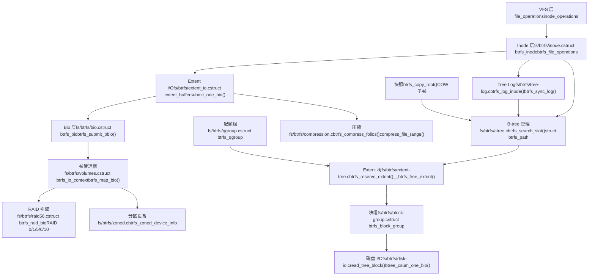
来源：[fs/btrfs/inode.c1-100](https://github.com/torvalds/linux/blob/fcb70a56/fs/btrfs/inode.c#L1-L100) [fs/btrfs/ctree.c1-50](https://github.com/torvalds/linux/blob/fcb70a56/fs/btrfs/ctree.c#L1-L50) [fs/btrfs/extent-tree.c1-50](https://github.com/torvalds/linux/blob/fcb70a56/fs/btrfs/extent-tree.c#L1-L50) [fs/btrfs/extent\_io.c1-50](https://github.com/torvalds/linux/blob/fcb70a56/fs/btrfs/extent_io.c#L1-L50) [fs/btrfs/bio.c1-50](https://github.com/torvalds/linux/blob/fcb70a56/fs/btrfs/bio.c#L1-L50) [fs/btrfs/tree-log.c1-100](https://github.com/torvalds/linux/blob/fcb70a56/fs/btrfs/tree-log.c#L1-L100)

## 核心数据结构

### B-tree 管理 (ctree)

Btrfs 使用多个 B-tree 来组织文件系统元数据。中心树结构由 `ctree.c` 管理，提供搜索、插入和删除操作。

**关键 B-tree 类型：**

| 树类型 | 用途 | 根位置 |
| --- | --- | --- |
| FS 树 | 文件和目录元数据 | 每子卷 |
| Extent 树 | Extent 分配跟踪 | 全局 |
| Chunk 树 | 设备 extent 映射 | 全局 |
| 设备树 | 设备信息 | 全局 |
| 根树 | 子卷根指针 | 全局 |
| 日志树 | 快速 fsync 操作 | 每子卷 |
| 校验和树 | 数据校验和 | 全局 |

**主要 B-tree 操作：**

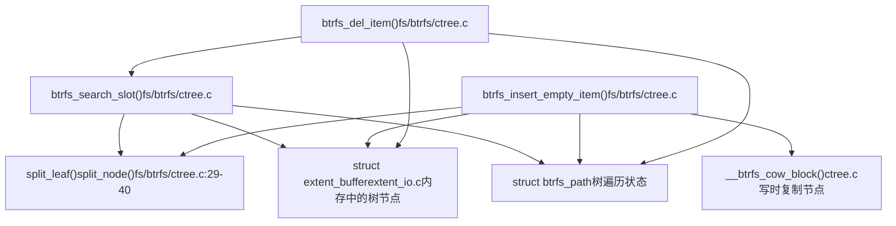
`struct btrfs_path` 用于树遍历，维护每一层树节点的锁和引用：

```
struct btrfs_path
├── nodes[BTRFS_MAX_LEVEL] - 每层树的 extent_buffer 指针
├── slots[BTRFS_MAX_LEVEL] - 每个节点中的当前槽位
├── locks[BTRFS_MAX_LEVEL] - 每层的锁状态 (读/写)
└── Functions: btrfs_alloc_path(), btrfs_free_path(), btrfs_release_path()
```
来源：[fs/btrfs/ctree.c27-175](https://github.com/torvalds/linux/blob/fcb70a56/fs/btrfs/ctree.c#L27-L175) [fs/btrfs/ctree.c138-153](https://github.com/torvalds/linux/blob/fcb70a56/fs/btrfs/ctree.c#L138-L153) [fs/btrfs/ctree.c160-175](https://github.com/torvalds/linux/blob/fcb70a56/fs/btrfs/ctree.c#L160-L175)

### Extent 缓冲区

Extent 缓冲区（`extent_io.c` 中的 `struct extent_buffer`）表示内存中的树节点，是 B-tree 操作的基本单元。它们由 extent I/O 子系统管理。

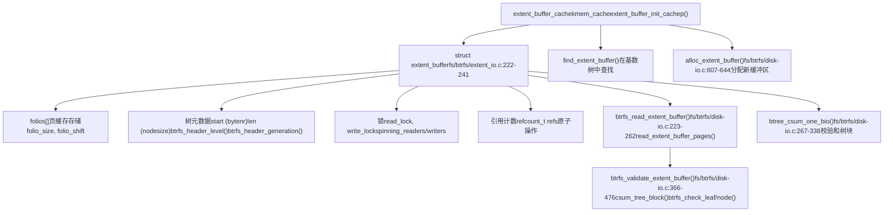
来源：[fs/btrfs/extent\_io.c222-241](https://github.com/torvalds/linux/blob/fcb70a56/fs/btrfs/extent_io.c#L222-L241) [fs/btrfs/disk-io.c223-262](https://github.com/torvalds/linux/blob/fcb70a56/fs/btrfs/disk-io.c#L223-L262) [fs/btrfs/disk-io.c267-338](https://github.com/torvalds/linux/blob/fcb70a56/fs/btrfs/disk-io.c#L267-L338) [fs/btrfs/disk-io.c366-476](https://github.com/torvalds/linux/blob/fcb70a56/fs/btrfs/disk-io.c#L366-L476) [fs/btrfs/disk-io.c607-644](https://github.com/torvalds/linux/blob/fcb70a56/fs/btrfs/disk-io.c#L607-L644)

### Inode 结构

`struct btrfs_inode` (定义在 `fs/btrfs/btrfs_inode.h` 中) 使用 Btrfs 特有的元数据扩展了 VFS inode：

```
struct btrfs_inode (btrfs_inode.h:45-350)
├── vfs_inode - 标准 VFS inode (struct inode)
├── root - 指向包含子卷的 struct btrfs_root 指针
├── io_tree - 用于 extent 状态跟踪的 struct extent_io_tree
│   ├── EXTENT_DELALLOC - 延迟分配范围
│   ├── EXTENT_LOCKED - I/O 期间的锁定范围
│   ├── EXTENT_UPTODATE - 缓存数据
│   └── EXTENT_DIRTY - 脏范围
├── file_extent_tree - 用于文件 extent 映射的 struct extent_io_tree
├── ordered_tree - 用于有序 extent 跟踪的 struct rb_root
├── disk_i_size - 磁盘上的 u64 大小 (写入期间可能落后于 i_size)
├── flags - u32 inode 标志：
│   ├── BTRFS_INODE_NODATACOW - 不对数据进行 COW
│   ├── BTRFS_INODE_COMPRESS - 启用压缩
│   ├── BTRFS_INODE_NOCOMPRESS - 禁用压缩
│   ├── BTRFS_INODE_PREALLOC - 预分配 extents
│   └── BTRFS_INODE_SYNC - 同步 I/O
├── delalloc_bytes - delalloc 状态下的 u64 字节数
├── csum_bytes - 需要校验和的 u64 字节数
├── defrag_compress - 用于碎片整理的压缩
└── ordered_extents - struct btrfs_ordered_extent 列表
```
来源：[fs/btrfs/btrfs\_inode.h1-350](https://github.com/torvalds/linux/blob/fcb70a56/fs/btrfs/btrfs_inode.h#L1-L350)

## 写时复制机制

Btrfs 在多个层级实现写时复制：数据 extents、元数据块和整个 B-tree 节点。这实现了快照、崩溃恢复和高效克隆。

### COW 数据写入路径

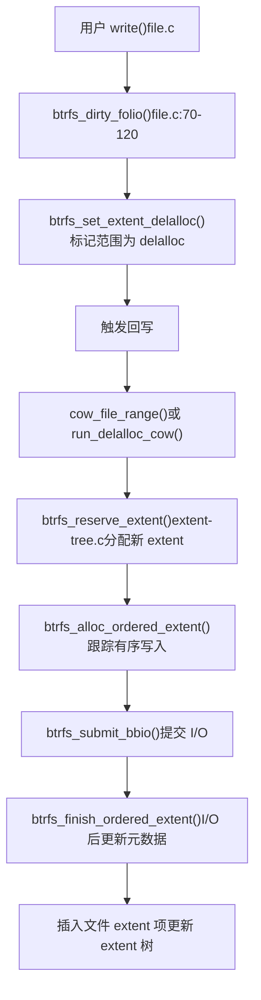
**文件数据的 COW 流程：**

1.  **Delalloc 阶段** [fs/btrfs/inode.c77-120](https://github.com/torvalds/linux/blob/fcb70a56/fs/btrfs/inode.c#L77-L120) - 用户写入将页面标记为脏，并在 `io_tree` 中设置 `EXTENT_DELALLOC` 位
2.  **Extent 预留** [fs/btrfs/extent-tree.c](https://github.com/torvalds/linux/blob/fcb70a56/fs/btrfs/extent-tree.c) - 在回写期间，分配新 extents 而不修改旧数据
3.  **有序 Extent 创建** - 使用 `btrfs_ordered_extent` 跟踪写入以保持一致性
4.  **Bio 提交** [fs/btrfs/bio.c](https://github.com/torvalds/linux/blob/fcb70a56/fs/btrfs/bio.c) - 将数据写入新位置
5.  **元数据更新** - 写入成功后，在事务中插入新的文件 extent 项

### COW 元数据写入路径

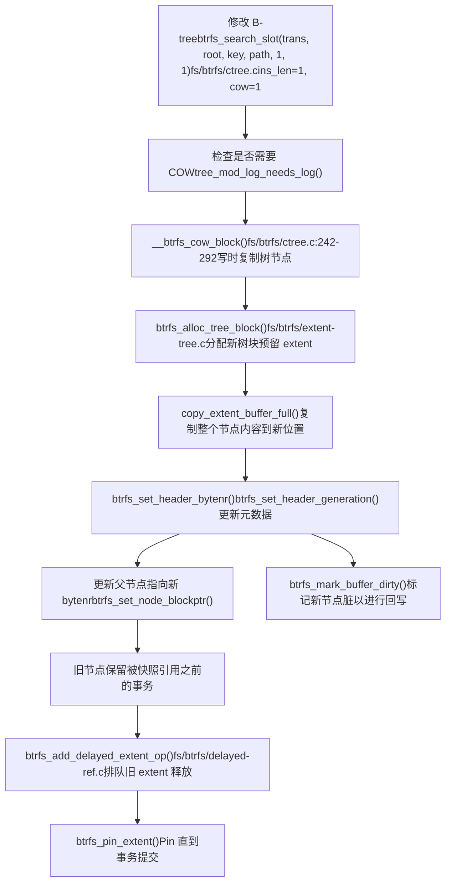
元数据的 COW 机制确保：

-   快照通过未更改的旧树块看到一致的时间点视图
-   崩溃恢复可以回滚到存储在超级块中的最后提交的事务
-   并发读取器可以访问旧版本，而写入器修改新副本
-   旧 extents 仅在新事务提交后通过延迟引用释放

来源：[fs/btrfs/ctree.c242-292](https://github.com/torvalds/linux/blob/fcb70a56/fs/btrfs/ctree.c#L242-L292) [fs/btrfs/extent-tree.c1-100](https://github.com/torvalds/linux/blob/fcb70a56/fs/btrfs/extent-tree.c#L1-L100) [fs/btrfs/delayed-ref.c1-50](https://github.com/torvalds/linux/blob/fcb70a56/fs/btrfs/delayed-ref.c#L1-L50)

## Extent 管理

Btrfs 通过在 extent 分配树中跟踪 extents 来管理磁盘空间。每个 extent 表示磁盘块的连续范围。

### Extent 分配树结构

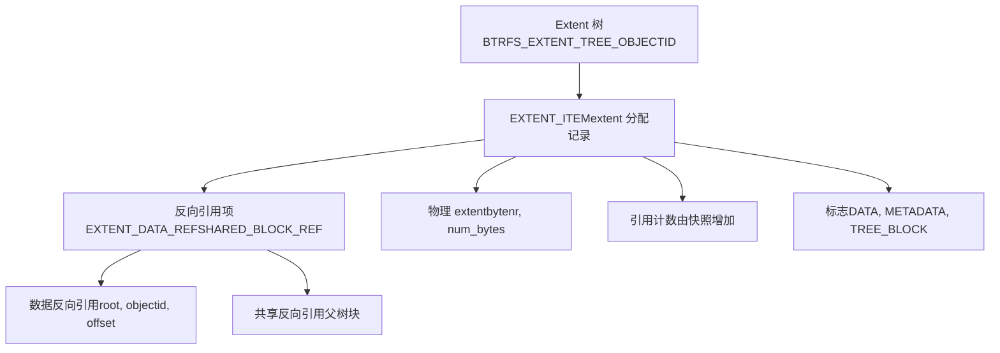
**Extent 分配流程：**

函数 `btrfs_reserve_extent()` [fs/btrfs/extent-tree.c](https://github.com/torvalds/linux/blob/fcb70a56/fs/btrfs/extent-tree.c) 分配空间：

1.  根据数据/元数据类型和 RAID 配置文件选择适当的块组
2.  使用空闲空间缓存或空闲空间树在块组中搜索空闲空间
3.  在内存结构中预留 extent
4.  在事务提交期间将 extent 项插入 extent 树

**文件 Extent 项：**

文件数据 extents 在 FS 树中使用 `EXTENT_DATA` 项跟踪：

```
File Extent Item
├── disk_bytenr - 物理位置 (或 0 用于空洞/内联)
├── disk_num_bytes - 磁盘上 extent 的大小
├── offset - 磁盘 extent 内的偏移量 (用于共享 extents)
├── num_bytes - 文件中的逻辑大小
├── compression - 压缩类型 (NONE, ZLIB, LZO, ZSTD)
└── encryption - 加密类型 (当前未使用)
```
来源：[fs/btrfs/extent-tree.c1-100](https://github.com/torvalds/linux/blob/fcb70a56/fs/btrfs/extent-tree.c#L1-L100) [fs/btrfs/file.c137-248](https://github.com/torvalds/linux/blob/fcb70a56/fs/btrfs/file.c#L137-L248)

### 延迟引用

Btrfs 使用延迟引用来批量处理 extent 树更新以提高效率：

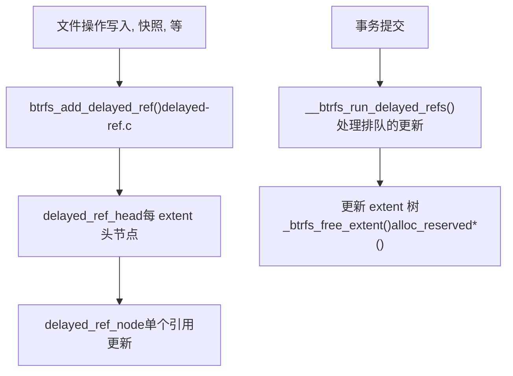
延迟引用累积引用计数更改 (+1 用于新引用，-1 用于删除) 并在事务提交期间批量应用，从而减少 B-tree 修改。

来源：[fs/btrfs/delayed-ref.c1-50](https://github.com/torvalds/linux/blob/fcb70a56/fs/btrfs/delayed-ref.c#L1-L50) [fs/btrfs/extent-tree.c48-61](https://github.com/torvalds/linux/blob/fcb70a56/fs/btrfs/extent-tree.c#L48-L61)

## 快照和子卷

快照和子卷是 COW 启用的核心特性。每个子卷都是具有自己根的独立 B-tree 命名空间。

### 子卷结构

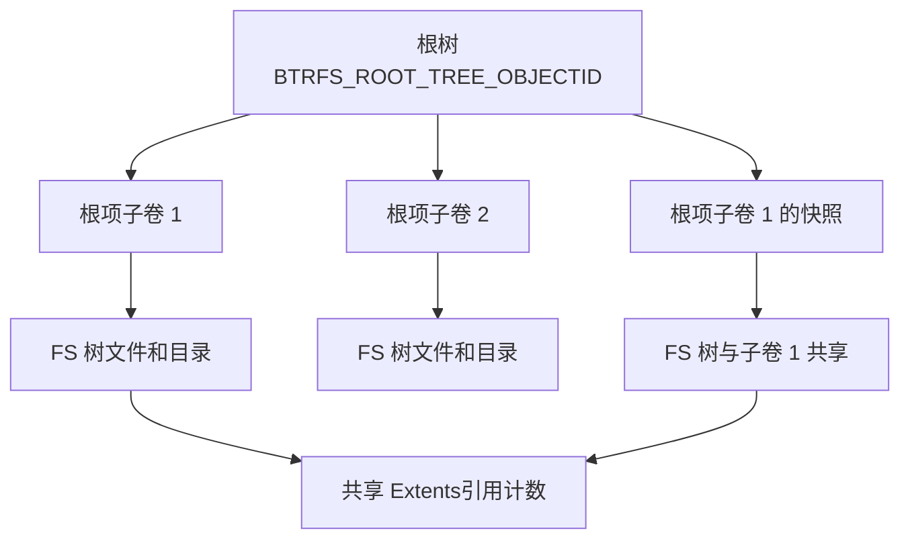
**快照创建：**

创建快照涉及：

1.  源子卷的根树块的 COW
2.  创建指向 COW 后树的新根项
3.  增加所有共享 extents 的引用计数 (通过延迟引用)
4.  两个子卷现在共享相同的树块和 extents

所有后续修改都使用 COW，因此快照保持不变，而原始子卷随之演变。

来源：[fs/btrfs/ioctl.c1-100](https://github.com/torvalds/linux/blob/fcb70a56/fs/btrfs/ioctl.c#L1-L100) [fs/btrfs/ctree.c177-186](https://github.com/torvalds/linux/blob/fcb70a56/fs/btrfs/ctree.c#L177-L186)

### 引用计数

Btrfs 在 extent 树中维护 extents 的引用计数。当一个 extent 被多个快照引用时，其引用计数反映了这一点：

-   **简单引用**：单个所有者，ref\_count = 1
-   **共享引用**：多个所有者 (快照)，ref\_count > 1
-   **反向引用遍历**：[fs/btrfs/backref.c](https://github.com/torvalds/linux/blob/fcb70a56/fs/btrfs/backref.c) 提供了查找 extent 所有引用的函数

## RAID 支持

Btrfs 实现软件 RAID，支持 RAID 0, 1, 10, 5, 和 6。RAID 层集成到卷管理器中。

### RAID 架构

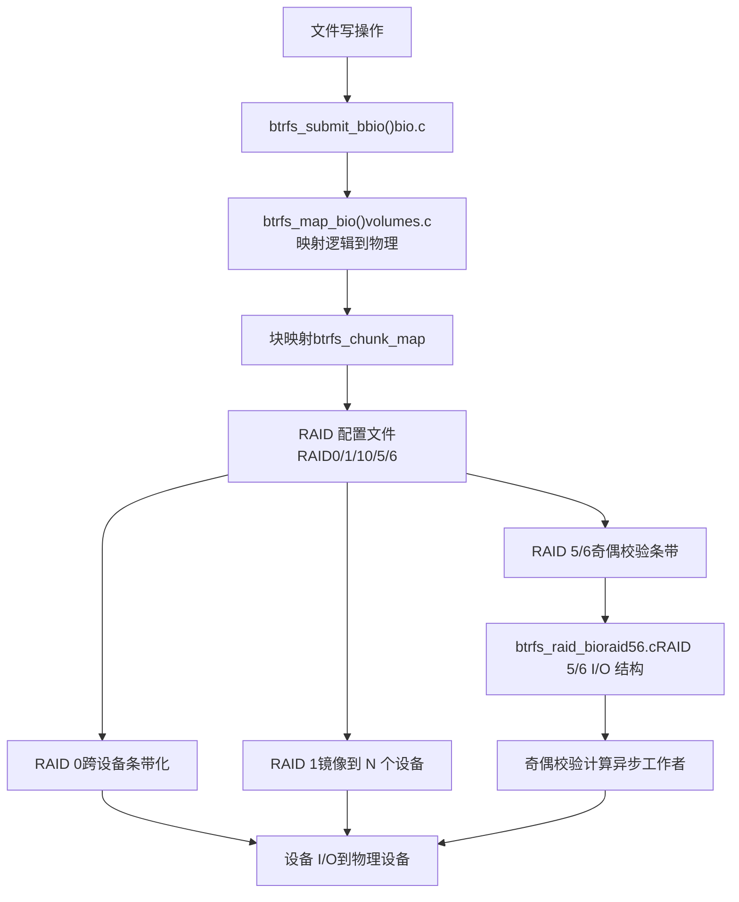
**RAID 配置文件：**

| 配置文件 | 冗余 | 最小设备 | 描述 |
| --- | --- | --- | --- |
| RAID0 | 无 | 2 | 条带化以提高性能 |
| RAID1 | 1 份副本 | 2 | 镜像 (2 路或 N 路) |
| RAID10 | 1 份副本 | 4 | 条带化镜像 |
| RAID5 | 1 个奇偶校验 | 3 | 单奇偶校验条带 |
| RAID6 | 2 个奇偶校验 | 4 | 双奇偶校验条带 |

RAID 5/6 实现在 [fs/btrfs/raid56.c1-150](https://github.com/torvalds/linux/blob/fcb70a56/fs/btrfs/raid56.c#L1-L150)，支持：

-   使用 CPU 或异步工作者进行奇偶校验计算
-   部分条带更新的读-修改-写
-   设备故障时的重建
-   清理以验证奇偶校验正确性

来源：[fs/btrfs/volumes.c1-100](https://github.com/torvalds/linux/blob/fcb70a56/fs/btrfs/volumes.c#L1-L100) [fs/btrfs/raid56.c1-150](https://github.com/torvalds/linux/blob/fcb70a56/fs/btrfs/raid56.c#L1-L150)

## 压缩

Btrfs 支持使用多种算法对文件数据进行透明压缩。压缩在回写期间按 extent 应用。

### 压缩流程

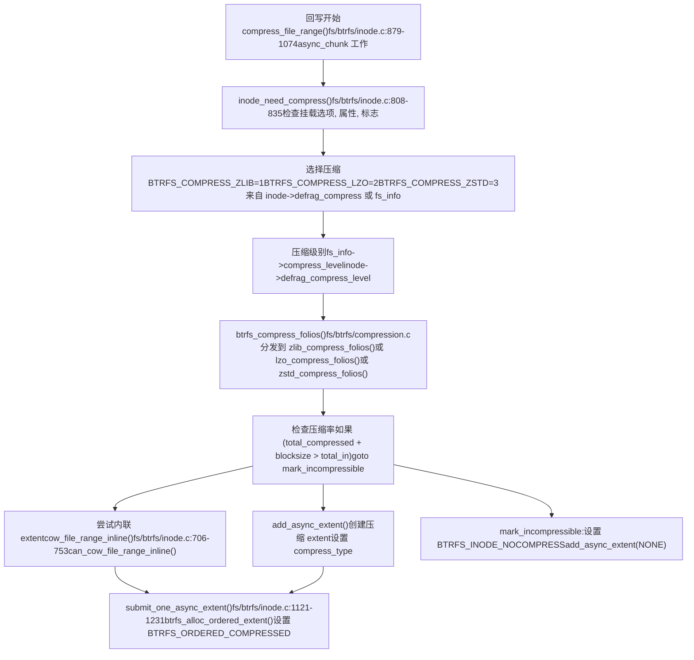
**压缩算法：**

Btrfs 支持多种压缩算法 [fs/btrfs/compression.c1-100](https://github.com/torvalds/linux/blob/fcb70a56/fs/btrfs/compression.c#L1-L100)：

-   **ZLIB** (`BTRFS_COMPRESS_ZLIB`)：默认，使用 deflate 的平衡压缩比
-   **LZO** (`BTRFS_COMPRESS_LZO`)：快速压缩但压缩比低，适用于 CPU 受限系统
-   **ZSTD** (`BTRFS_COMPRESS_ZSTD`)：现代算法，具有可配置级别 (1-15)，速度和比率的最佳平衡

压缩由以下控制：

1.  挂载选项：`compress=zlib`, `compress=lzo`, `compress=zstd:level`
2.  每文件属性：`btrfs.compression` 扩展属性
3.  Inode 标志：`BTRFS_INODE_COMPRESS`, `BTRFS_INODE_NOCOMPRESS` [fs/btrfs/btrfs\_inode.h](https://github.com/torvalds/linux/blob/fcb70a56/fs/btrfs/btrfs_inode.h)
4.  碎片整理设置：`inode->defrag_compress` 和 `inode->defrag_compress_level`

**读取时解压：**

压缩 extents 在读取期间通过 `btrfs_submit_compressed_read()` [fs/btrfs/compression.c](https://github.com/torvalds/linux/blob/fcb70a56/fs/btrfs/compression.c) 解压，该函数：

1.  分配解压页面
2.  提交压缩数据的读取 bio
3.  在完成时排队异步解压工作
4.  将解压数据复制到页缓存

来源：[fs/btrfs/inode.c808-835](https://github.com/torvalds/linux/blob/fcb70a56/fs/btrfs/inode.c#L808-L835) [fs/btrfs/inode.c879-1074](https://github.com/torvalds/linux/blob/fcb70a56/fs/btrfs/inode.c#L879-L1074) [fs/btrfs/inode.c706-753](https://github.com/torvalds/linux/blob/fcb70a56/fs/btrfs/inode.c#L706-L753) [fs/btrfs/inode.c1121-1231](https://github.com/torvalds/linux/blob/fcb70a56/fs/btrfs/inode.c#L1121-L1231) [fs/btrfs/compression.c1-100](https://github.com/torvalds/linux/blob/fcb70a56/fs/btrfs/compression.c#L1-L100)

## 数据完整性和校验和

Btrfs 对所有数据和元数据进行校验和计算以检测损坏。校验和与数据分开存储在校验和树中。

### 校验和架构

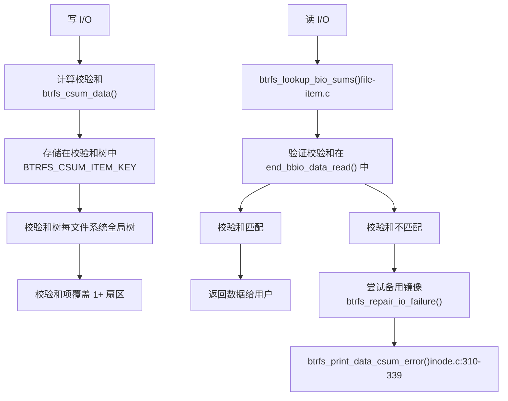
**校验和类型：**

Btrfs 支持多种在文件系统创建时配置的校验和算法：

-   CRC32C (默认)
-   XXHASH
-   SHA256
-   BLAKE2

**元数据校验和：**

树块在写入前在 `btree_csum_one_bio()` [fs/btrfs/disk-io.c267-338](https://github.com/torvalds/linux/blob/fcb70a56/fs/btrfs/disk-io.c#L267-L338) 中进行校验和计算。读取时，`btrfs_validate_extent_buffer()` [fs/btrfs/disk-io.c366-476](https://github.com/torvalds/linux/blob/fcb70a56/fs/btrfs/disk-io.c#L366-L476) 验证校验和。

**错误检测和修复：**

当检测到校验和不匹配时：

1.  尝试从备用镜像读取 (RAID1/10)
2.  如果成功，通过 `btrfs_repair_io_failure()` 修复损坏的副本 [fs/btrfs/disk-io.c182-214](https://github.com/torvalds/linux/blob/fcb70a56/fs/btrfs/disk-io.c#L182-L214)
3.  如果所有副本都损坏，则向用户返回错误

来源：[fs/btrfs/disk-io.c74-112](https://github.com/torvalds/linux/blob/fcb70a56/fs/btrfs/disk-io.c#L74-L112) [fs/btrfs/disk-io.c267-338](https://github.com/torvalds/linux/blob/fcb70a56/fs/btrfs/disk-io.c#L267-L338) [fs/btrfs/inode.c310-339](https://github.com/torvalds/linux/blob/fcb70a56/fs/btrfs/inode.c#L310-L339) [fs/btrfs/extent\_io.c574-622](https://github.com/torvalds/linux/blob/fcb70a56/fs/btrfs/extent_io.c#L574-L622)

## 用于快速 Fsync 的 Tree Logging

Btrfs 使用每子卷日志树来优化 `fsync()` 操作，避免大多数情况下的完整事务提交。

### Tree Log 架构

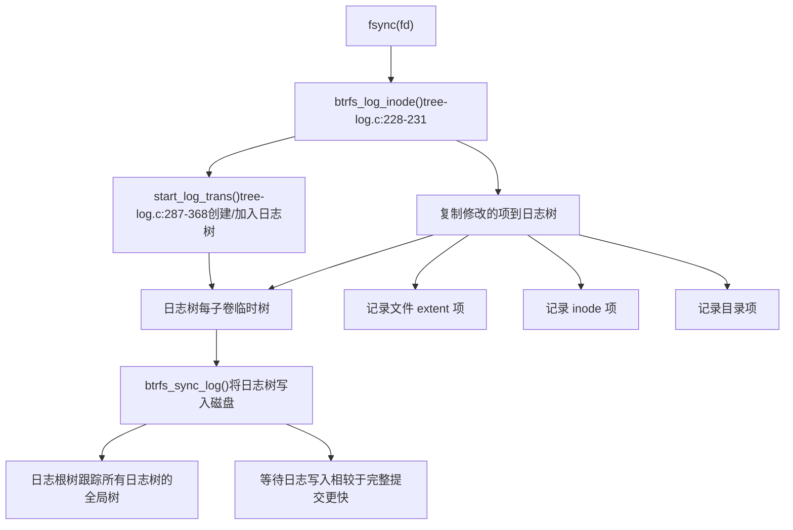
**挂载时的日志重放：**

崩溃后，`btrfs_recover_log_trees()` [fs/btrfs/tree-log.c](https://github.com/torvalds/linux/blob/fcb70a56/fs/btrfs/tree-log.c) 重放记录的操作：

1.  **PIN 阶段** [fs/btrfs/tree-log.c99-104](https://github.com/torvalds/linux/blob/fcb70a56/fs/btrfs/tree-log.c#L99-L104) - Pin 记录的 extents 以防止重用
2.  **REPLAY\_INODES 阶段** [fs/btrfs/tree-log.c101](https://github.com/torvalds/linux/blob/fcb70a56/fs/btrfs/tree-log.c#L101-L101) - 重新创建 inodes
3.  **REPLAY\_DIR\_INDEX 阶段** [fs/btrfs/tree-log.c102](https://github.com/torvalds/linux/blob/fcb70a56/fs/btrfs/tree-log.c#L102-L102) - 重新创建目录条目
4.  **REPLAY\_ALL 阶段** [fs/btrfs/tree-log.c103](https://github.com/torvalds/linux/blob/fcb70a56/fs/btrfs/tree-log.c#L103-L103) - 应用所有剩余更改

日志树设计为最小化 - 仅记录崩溃一致性所需的内容，使得 fsync 比提交整个文件系统事务快得多。

来源：[fs/btrfs/tree-log.c1-258](https://github.com/torvalds/linux/blob/fcb70a56/fs/btrfs/tree-log.c#L1-L258) [fs/btrfs/tree-log.c287-368](https://github.com/torvalds/linux/blob/fcb70a56/fs/btrfs/tree-log.c#L287-L368)

## 多设备和卷管理

Btrfs 包含集成的卷管理，允许将多个设备组合成具有各种 RAID 配置文件的单个文件系统。

### 卷管理结构

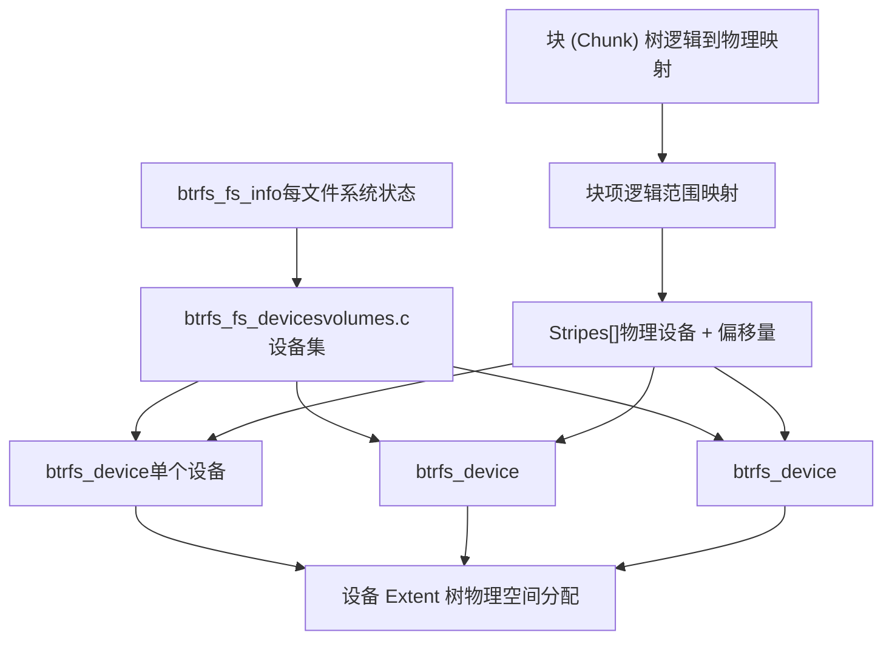
**块 (Chunk) 分配：**

Chunk 是大的连续分配（通常数据为 1GB，元数据为 256MB），将逻辑地址映射到物理设备位置：

```
btrfs_chunk_map
├── start - 逻辑地址
├── length - 块大小
├── type - DATA, METADATA, 或 SYSTEM + RAID 配置文件
├── num_stripes - 块中的条带数
└── stripes[] - (设备, 偏移量) 对数组
```
函数 `btrfs_map_block()` [fs/btrfs/volumes.c](https://github.com/torvalds/linux/blob/fcb70a56/fs/btrfs/volumes.c) 使用块映射将逻辑地址转换为物理设备位置。

**设备操作：**

-   **添加设备**：扩展文件系统容量
-   **移除设备**：重新定位数据并重新平衡
-   **替换设备**：用于故障驱动器更换
-   **调整大小**：增加或缩小设备上的文件系统

来源：[fs/btrfs/volumes.c1-100](https://github.com/torvalds/linux/blob/fcb70a56/fs/btrfs/volumes.c#L1-L100) [fs/btrfs/volumes.c37-96](https://github.com/torvalds/linux/blob/fcb70a56/fs/btrfs/volumes.c#L37-L96)

## 分区设备支持

Btrfs 支持具有顺序写入约束的分区块设备 (ZBC/ZNS)。分区模式确保所有写入在分区内是顺序的。

### 分区设备架构

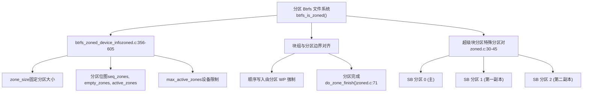
**关键分区约束：**

1.  **顺序写入**：分区内的所有写入必须是顺序的，由分区写指针强制执行
2.  **分区对齐**：块组与分区边界对齐
3.  **活动分区限制**：设备限制并发活动分区的数量
4.  **无就地更新**：COW 是强制性的 (不支持 NODATACOW)

**分区操作：**

-   **分区分配**：跟踪分区写指针并从空闲/活动分区分配
-   **分区完成**：当块组满时关闭分区 [fs/btrfs/zoned.c71](https://github.com/torvalds/linux/blob/fcb70a56/fs/btrfs/zoned.c#L71-L71)
-   **重置分区**：释放块组时重置写指针
-   **超级块分区**：对超级块使用分区对，具有日志结构更新 [fs/btrfs/zoned.c88-161](https://github.com/torvalds/linux/blob/fcb70a56/fs/btrfs/zoned.c#L88-L161)

来源：[fs/btrfs/zoned.c1-70](https://github.com/torvalds/linux/blob/fcb70a56/fs/btrfs/zoned.c#L1-L70) [fs/btrfs/zoned.c355-605](https://github.com/torvalds/linux/blob/fcb70a56/fs/btrfs/zoned.c#L355-L605) [fs/btrfs/zoned.c88-161](https://github.com/torvalds/linux/blob/fcb70a56/fs/btrfs/zoned.c#L88-L161)

## I/O 路径

### 读取路径

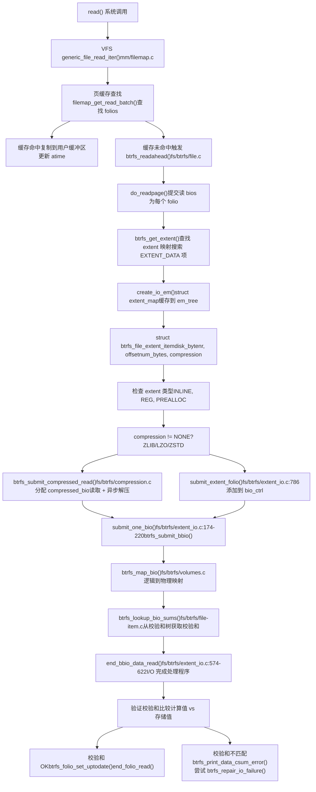
来源：[fs/btrfs/extent\_io.c574-622](https://github.com/torvalds/linux/blob/fcb70a56/fs/btrfs/extent_io.c#L574-L622) [fs/btrfs/extent\_io.c786](https://github.com/torvalds/linux/blob/fcb70a56/fs/btrfs/extent_io.c#L786-L786) [fs/btrfs/extent\_io.c174-220](https://github.com/torvalds/linux/blob/fcb70a56/fs/btrfs/extent_io.c#L174-L220) [fs/btrfs/compression.c1-100](https://github.com/torvalds/linux/blob/fcb70a56/fs/btrfs/compression.c#L1-L100) [fs/btrfs/file-item.c](https://github.com/torvalds/linux/blob/fcb70a56/fs/btrfs/file-item.c) [fs/btrfs/volumes.c](https://github.com/torvalds/linux/blob/fcb70a56/fs/btrfs/volumes.c)

### 写入路径

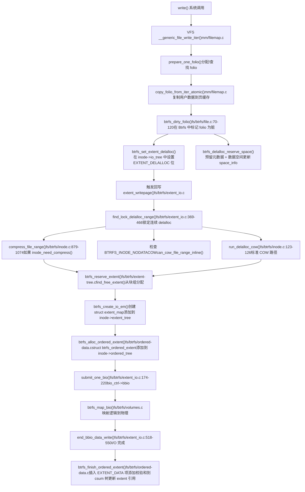
写入路径使用 **延迟分配 (delalloc)** 来批量处理 extent 分配并允许更好的空间打包。这通过 `inode->io_tree` 中的 `EXTENT_DELALLOC` 位进行跟踪 [fs/btrfs/extent\_io.c](https://github.com/torvalds/linux/blob/fcb70a56/fs/btrfs/extent_io.c)

**有序 Extents** (`struct btrfs_ordered_extent`) 确保数据在元数据更新之前到达磁盘，保持崩溃一致性。有序 extent 跟踪：

-   文件偏移范围
-   磁盘 bytenr 和 num\_bytes
-   标志：`BTRFS_ORDERED_COMPRESSED`, `BTRFS_ORDERED_PREALLOC` 等
-   用于同步的完成状态

来源：[fs/btrfs/file.c70-120](https://github.com/torvalds/linux/blob/fcb70a56/fs/btrfs/file.c#L70-L120) [fs/btrfs/inode.c123-126](https://github.com/torvalds/linux/blob/fcb70a56/fs/btrfs/inode.c#L123-L126) [fs/btrfs/inode.c879-1074](https://github.com/torvalds/linux/blob/fcb70a56/fs/btrfs/inode.c#L879-L1074) [fs/btrfs/extent\_io.c369-466](https://github.com/torvalds/linux/blob/fcb70a56/fs/btrfs/extent_io.c#L369-L466) [fs/btrfs/extent\_io.c174-220](https://github.com/torvalds/linux/blob/fcb70a56/fs/btrfs/extent_io.c#L174-L220) [fs/btrfs/extent\_io.c518-550](https://github.com/torvalds/linux/blob/fcb70a56/fs/btrfs/extent_io.c#L518-L550) [fs/btrfs/ordered-data.c](https://github.com/torvalds/linux/blob/fcb70a56/fs/btrfs/ordered-data.c)

## 事务管理

Btrfs 中的所有修改都在事务内发生。事务对相关更改进行分组并提供原子性。

### 事务生命周期

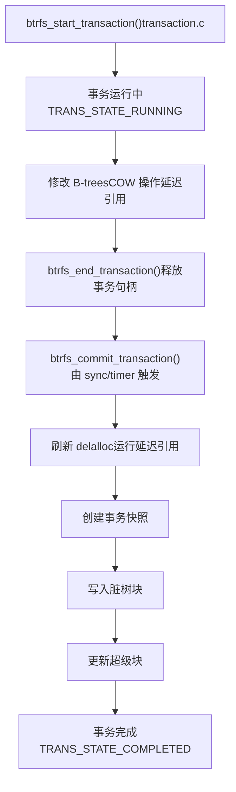
**事务句柄：**

```
struct btrfs_trans_handle
├── transid - 事务 ID
├── blocks_reserved - 预留的元数据空间
├── block_rsv - 块预留跟踪
├── fs_info - 文件系统信息
└── type - 事务类型标志
```
事务提交方式：

-   通过 `sync()` 或 `fsync()` 显式提交
-   定期提交 (默认 30 秒)
-   当元数据空间不足时
-   当累积了太多延迟引用时

来源：[fs/btrfs/transaction.c1-100](https://github.com/torvalds/linux/blob/fcb70a56/fs/btrfs/transaction.c#L1-L100)

## 块组与空间管理

Btrfs 将设备空间划分为块组，每个块组具有特定类型 (DATA, METADATA, SYSTEM) 和 RAID 配置文件。

### 块组结构

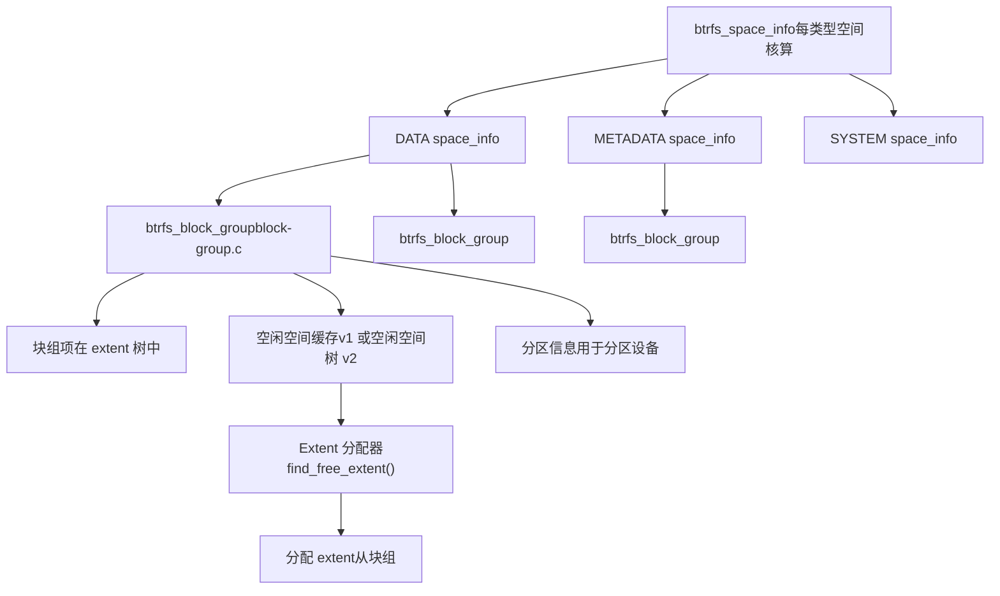
**块组类型：**

-   **DATA**：文件数据 extents
-   **METADATA**：B-tree 节点、inode 项等
-   **SYSTEM**：Chunk 树和设备树 (关键元数据)

每个块组可以有不同的 RAID 配置文件，例如 METADATA 用 RAID1，DATA 用 RAID0。

**空间分配：**

分配器 [fs/btrfs/extent-tree.c](https://github.com/torvalds/linux/blob/fcb70a56/fs/btrfs/extent-tree.c) 基于以下条件选择块组：

1.  类型 (数据 vs 元数据)
2.  可用空闲空间
3.  RAID 配置文件
4.  局部性 (优先选择有最近分配的块组)

来源：[fs/btrfs/block-group.c1-100](https://github.com/torvalds/linux/blob/fcb70a56/fs/btrfs/block-group.c#L1-L100) [fs/btrfs/extent-tree.c](https://github.com/torvalds/linux/blob/fcb70a56/fs/btrfs/extent-tree.c)

## 配额组 (Qgroups)

Qgroups 为子卷和快照提供分层配额管理。

### Qgroup 层次结构

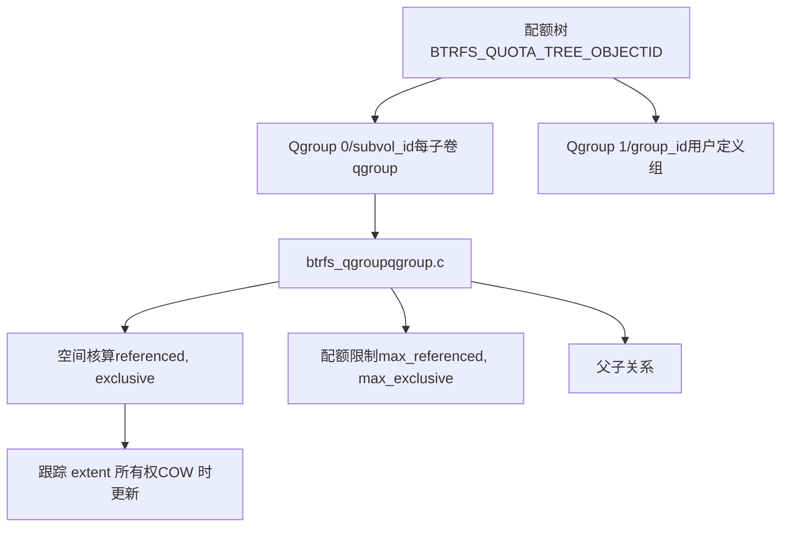
**Qgroup 核算：**

-   **Referenced**：此 qgroup 引用的总空间 (可能共享)
-   **Exclusive**：此 qgroup 独占拥有的空间
-   **Rfer\_cmpr**：引用的压缩空间
-   **Excl\_cmpr**：独占的压缩空间

Qgroups 更新时机：

-   Extents 被分配或释放时
-   创建快照时 (影响独占性)
-   通过 COW 更改 extent 所有权时

来源：[fs/btrfs/qgroup.c1-100](https://github.com/torvalds/linux/blob/fcb70a56/fs/btrfs/qgroup.c#L1-L100)

## 总结

Btrfs 是一个具有集成卷管理的综合写时复制文件系统。其关键架构组件包括：

1.  **B-tree 存储引擎** (`ctree.c`) 管理多个树命名空间
2.  **所有层级的写时复制** 启用快照和崩溃恢复
3.  **基于 Extent 的分配** 具有延迟引用更新以提高效率
4.  **集成 RAID** 支持多种冗余配置文件
5.  **压缩和校验和** 用于空间效率和数据完整性
6.  **Tree logging** 用于快速 fsync 操作
7.  **多设备支持** 具有灵活的块分配
8.  **分区设备支持** 用于顺序写入存储
9.  **分层配额组** 用于空间核算

文件系统通过精心设计的 COW 语义、延迟操作和事务管理来平衡性能、功能和数据完整性。
