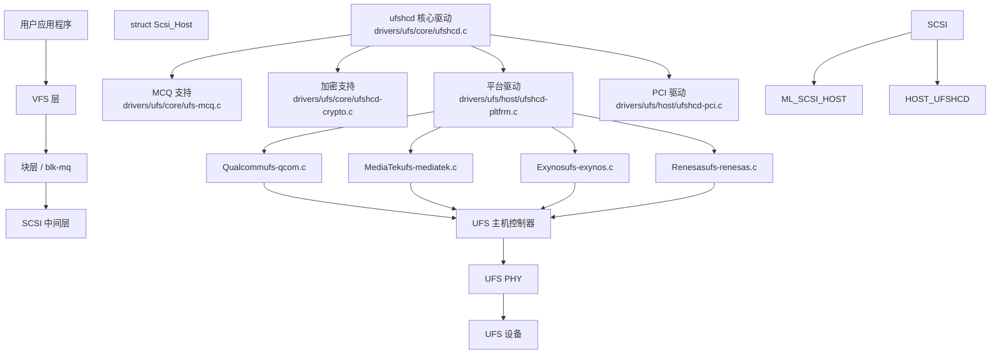
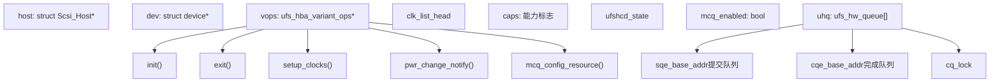
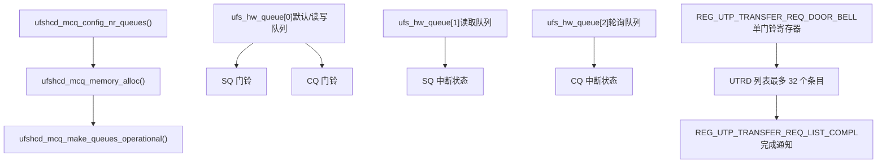
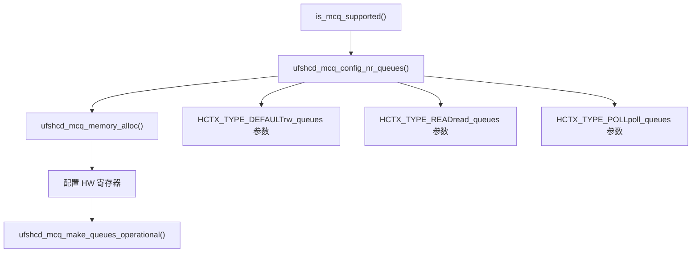
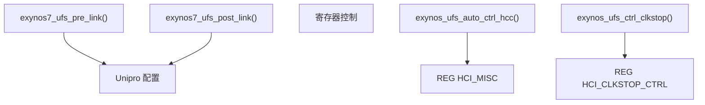
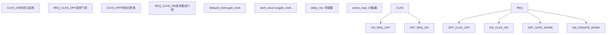
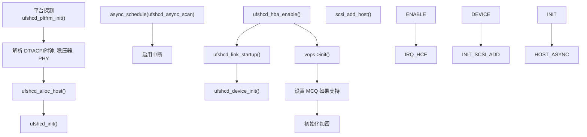
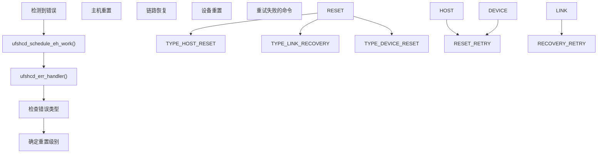
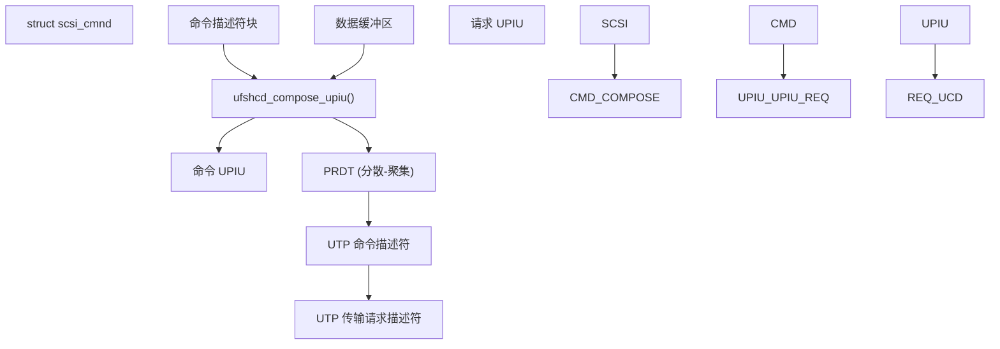

# UFS 存储控制器

相关源文件

-   [Documentation/ABI/testing/sysfs-driver-ufs](https://github.com/torvalds/linux/blob/fcb70a56/Documentation/ABI/testing/sysfs-driver-ufs)
-   [drivers/ufs/core/ufs-mcq.c](https://github.com/torvalds/linux/blob/fcb70a56/drivers/ufs/core/ufs-mcq.c)
-   [drivers/ufs/core/ufs-sysfs.c](https://github.com/torvalds/linux/blob/fcb70a56/drivers/ufs/core/ufs-sysfs.c)
-   [drivers/ufs/core/ufs-sysfs.h](https://github.com/torvalds/linux/blob/fcb70a56/drivers/ufs/core/ufs-sysfs.h)
-   [drivers/ufs/core/ufs\_bsg.c](https://github.com/torvalds/linux/blob/fcb70a56/drivers/ufs/core/ufs_bsg.c)
-   [drivers/ufs/core/ufs\_trace.h](https://github.com/torvalds/linux/blob/fcb70a56/drivers/ufs/core/ufs_trace.h)
-   [drivers/ufs/core/ufs\_trace\_types.h](https://github.com/torvalds/linux/blob/fcb70a56/drivers/ufs/core/ufs_trace_types.h)
-   [drivers/ufs/core/ufshcd-crypto.c](https://github.com/torvalds/linux/blob/fcb70a56/drivers/ufs/core/ufshcd-crypto.c)
-   [drivers/ufs/core/ufshcd-crypto.h](https://github.com/torvalds/linux/blob/fcb70a56/drivers/ufs/core/ufshcd-crypto.h)
-   [drivers/ufs/core/ufshcd-priv.h](https://github.com/torvalds/linux/blob/fcb70a56/drivers/ufs/core/ufshcd-priv.h)
-   [drivers/ufs/core/ufshcd.c](https://github.com/torvalds/linux/blob/fcb70a56/drivers/ufs/core/ufshcd.c)
-   [drivers/ufs/host/Kconfig](https://github.com/torvalds/linux/blob/fcb70a56/drivers/ufs/host/Kconfig)
-   [drivers/ufs/host/Makefile](https://github.com/torvalds/linux/blob/fcb70a56/drivers/ufs/host/Makefile)
-   [drivers/ufs/host/cdns-pltfrm.c](https://github.com/torvalds/linux/blob/fcb70a56/drivers/ufs/host/cdns-pltfrm.c)
-   [drivers/ufs/host/tc-dwc-g210-pci.c](https://github.com/torvalds/linux/blob/fcb70a56/drivers/ufs/host/tc-dwc-g210-pci.c)
-   [drivers/ufs/host/tc-dwc-g210-pltfrm.c](https://github.com/torvalds/linux/blob/fcb70a56/drivers/ufs/host/tc-dwc-g210-pltfrm.c)
-   [drivers/ufs/host/ti-j721e-ufs.c](https://github.com/torvalds/linux/blob/fcb70a56/drivers/ufs/host/ti-j721e-ufs.c)
-   [drivers/ufs/host/ufs-amd-versal2.c](https://github.com/torvalds/linux/blob/fcb70a56/drivers/ufs/host/ufs-amd-versal2.c)
-   [drivers/ufs/host/ufs-exynos.c](https://github.com/torvalds/linux/blob/fcb70a56/drivers/ufs/host/ufs-exynos.c)
-   [drivers/ufs/host/ufs-exynos.h](https://github.com/torvalds/linux/blob/fcb70a56/drivers/ufs/host/ufs-exynos.h)
-   [drivers/ufs/host/ufs-hisi.c](https://github.com/torvalds/linux/blob/fcb70a56/drivers/ufs/host/ufs-hisi.c)
-   [drivers/ufs/host/ufs-mediatek.c](https://github.com/torvalds/linux/blob/fcb70a56/drivers/ufs/host/ufs-mediatek.c)
-   [drivers/ufs/host/ufs-mediatek.h](https://github.com/torvalds/linux/blob/fcb70a56/drivers/ufs/host/ufs-mediatek.h)
-   [drivers/ufs/host/ufs-qcom.c](https://github.com/torvalds/linux/blob/fcb70a56/drivers/ufs/host/ufs-qcom.c)
-   [drivers/ufs/host/ufs-qcom.h](https://github.com/torvalds/linux/blob/fcb70a56/drivers/ufs/host/ufs-qcom.h)
-   [drivers/ufs/host/ufs-renesas.c](https://github.com/torvalds/linux/blob/fcb70a56/drivers/ufs/host/ufs-renesas.c)
-   [drivers/ufs/host/ufs-sprd.c](https://github.com/torvalds/linux/blob/fcb70a56/drivers/ufs/host/ufs-sprd.c)
-   [drivers/ufs/host/ufshcd-dwc.h](https://github.com/torvalds/linux/blob/fcb70a56/drivers/ufs/host/ufshcd-dwc.h)
-   [drivers/ufs/host/ufshcd-pci.c](https://github.com/torvalds/linux/blob/fcb70a56/drivers/ufs/host/ufshcd-pci.c)
-   [drivers/ufs/host/ufshcd-pltfrm.c](https://github.com/torvalds/linux/blob/fcb70a56/drivers/ufs/host/ufshcd-pltfrm.c)
-   [drivers/ufs/host/ufshcd-pltfrm.h](https://github.com/torvalds/linux/blob/fcb70a56/drivers/ufs/host/ufshcd-pltfrm.h)
-   [include/ufs/ufs.h](https://github.com/torvalds/linux/blob/fcb70a56/include/ufs/ufs.h)
-   [include/ufs/ufs\_quirks.h](https://github.com/torvalds/linux/blob/fcb70a56/include/ufs/ufs_quirks.h)
-   [include/ufs/ufshcd.h](https://github.com/torvalds/linux/blob/fcb70a56/include/ufs/ufshcd.h)
-   [include/ufs/ufshci.h](https://github.com/torvalds/linux/blob/fcb70a56/include/ufs/ufshci.h)
-   [include/ufs/unipro.h](https://github.com/torvalds/linux/blob/fcb70a56/include/ufs/unipro.h)

## 目的与范围

本文档描述了 Linux 内核中的通用闪存存储 (UFS) 主机控制器驱动程序子系统。UFS 是为移动和嵌入式系统设计的高性能存储接口，提供命令队列、电源管理和内联加密等功能。

本页涵盖：

-   核心 UFS 主机控制器驱动程序 (`ufshcd`)
-   特定平台的变体实现 (MediaTek, Qualcomm, Exynos 等)
-   现代 UFS 控制器的多循环队列 (MCQ) 架构
-   电源管理和链路状态
-   与 SCSI 和块层的集成

有关使用 UFS 存储的异步 I/O 机制，请参阅 [io\_uring 异步 I/O](/torvalds/linux/5.1-io_uring-asynchronous-io)。有关基于块设备的文件系统实现，请参阅 [Btrfs 写时复制文件系统](/torvalds/linux/5.2-btrfs-copy-on-write-filesystem)。

来源：[drivers/ufs/core/ufshcd.c1-50](https://github.com/torvalds/linux/blob/fcb70a56/drivers/ufs/core/ufshcd.c#L1-50) [include/ufs/ufshcd.h1-30](https://github.com/torvalds/linux/blob/fcb70a56/include/ufs/ufshcd.h#L1-30)

## 架构概览

### 层栈

UFS 子系统位于 SCSI 层和硬件之间，管理 UFS 主机控制器及其特定平台的怪癖 (quirks)。


来源：[drivers/ufs/core/ufshcd.c1-50](https://github.com/torvalds/linux/blob/fcb70a56/drivers/ufs/core/ufshcd.c#L1-50) [drivers/ufs/host/ufshcd-pltfrm.c1-30](https://github.com/torvalds/linux/blob/fcb70a56/drivers/ufs/host/ufshcd-pltfrm.c#L1-30) [include/ufs/ufshcd.h31-40](https://github.com/torvalds/linux/blob/fcb70a56/include/ufs/ufshcd.h#L31-40)

## 核心组件

### 主主机控制器结构

`struct ufs_hba` 是表示 UFS 主机控制器实例的中心数据结构。它包含所有状态、配置和操作数据。


来源：[include/ufs/ufshcd.h519-789](https://github.com/torvalds/linux/blob/fcb70a56/include/ufs/ufshcd.h#L519-789) [drivers/ufs/core/ufshcd.c200-250](https://github.com/torvalds/linux/blob/fcb70a56/drivers/ufs/core/ufshcd.c#L200-250)

### 变体操作模式

UFS 子系统使用 `ufs_hba_variant_ops` 结构体来允许特定平台的定制。每个平台 (Qualcomm, MediaTek 等) 实现这些操作以处理硬件特定的要求。

| 操作 | 用途 | 示例实现 |
| --- | --- | --- |
| `init` | 初始化特定平台的资源 | [drivers/ufs/host/ufs-qcom.c877-1018](https://github.com/torvalds/linux/blob/fcb70a56/drivers/ufs/host/ufs-qcom.c#L877-1018) |
| `setup_clocks` | 控制时钟门控/非门控 | [drivers/ufs/host/ufs-mediatek.c794-842](https://github.com/torvalds/linux/blob/fcb70a56/drivers/ufs/host/ufs-mediatek.c#L794-842) |
| `pwr_change_notify` | 定制电源模式更改 | [drivers/ufs/host/ufs-exynos.c395-418](https://github.com/torvalds/linux/blob/fcb70a56/drivers/ufs/host/ufs-exynos.c#L395-418) |
| `hce_enable_notify` | 挂钩主机控制器启用 | [drivers/ufs/host/ufs-mediatek.c251-300](https://github.com/torvalds/linux/blob/fcb70a56/drivers/ufs/host/ufs-mediatek.c#L251-300) |
| `mcq_config_resource` | 配置 MCQ 资源 | [drivers/ufs/host/ufs-qcom.c1431-1507](https://github.com/torvalds/linux/blob/fcb70a56/drivers/ufs/host/ufs-qcom.c#L1431-1507) |
| `device_reset` | 重置 UFS 设备 | [drivers/ufs/host/ufs-qcom.h181-186](https://github.com/torvalds/linux/blob/fcb70a56/drivers/ufs/host/ufs-qcom.h#L181-186) |

来源：[include/ufs/ufshcd.h335-383](https://github.com/torvalds/linux/blob/fcb70a56/include/ufs/ufshcd.h#L335-383) [drivers/ufs/core/ufshcd-priv.h106-230](https://github.com/torvalds/linux/blob/fcb70a56/drivers/ufs/core/ufshcd-priv.h#L106-230)

## 命令排队架构

### 传统 vs. MCQ 模式

UFS 控制器支持两种命令排队模式：

**传统模式 (单门铃)：**

-   使用单个提交和完成队列
-   支持最多 32 个未完成命令
-   中断聚合以提高效率
-   硬件实现更简单

**MCQ 模式 (多循环队列)：**

-   多个硬件队列 (最多 32 个)
-   更高的命令吞吐量
-   每队列中断或组合中断
-   在 UFSHCI 4.0+ 中支持


来源：[drivers/ufs/core/ufs-mcq.c1-100](https://github.com/torvalds/linux/blob/fcb70a56/drivers/ufs/core/ufs-mcq.c#L1-100) [drivers/ufs/core/ufshcd.c110-120](https://github.com/torvalds/linux/blob/fcb70a56/drivers/ufs/core/ufshcd.c#L110-120) [include/ufs/ufshcd.h890-916](https://github.com/torvalds/linux/blob/fcb70a56/include/ufs/ufshcd.h#L890-916)

### MCQ 队列设置

MCQ 设置过程涉及配置具有不同类型的多个硬件队列：


**MCQ 模块参数：**

-   `rw_queues`：中断驱动的读写队列数量 (默认: nr\_cpus)
-   `read_queues`：专用读取队列数量 (默认: 0)
-   `poll_queues`：轮询队列数量 (默认: 1)

来源：[drivers/ufs/core/ufs-mcq.c39-85](https://github.com/torvalds/linux/blob/fcb70a56/drivers/ufs/core/ufs-mcq.c#L39-85) [drivers/ufs/core/ufs-mcq.c167-221](https://github.com/torvalds/linux/blob/fcb70a56/drivers/ufs/core/ufs-mcq.c#L167-221) [drivers/ufs/core/ufs-mcq.c347-376](https://github.com/torvalds/linux/blob/fcb70a56/drivers/ufs/core/ufs-mcq.c#L347-376)

### 命令处理流程

> **[Mermaid sequence]**
> *(图表结构无法解析)*

来源：[drivers/ufs/core/ufshcd.c2800-3000](https://github.com/torvalds/linux/blob/fcb70a56/drivers/ufs/core/ufshcd.c#L2800-3000) [drivers/ufs/core/ufs-mcq.c293-344](https://github.com/torvalds/linux/blob/fcb70a56/drivers/ufs/core/ufs-mcq.c#L293-344)

## 平台变体

### MediaTek 实现

MediaTek UFS 控制器具有独特的功能，包括参考时钟控制、mphy 电源控制和 MCQ 中断处理。

**关键特性：**

-   带握手协议的参考时钟门控
-   用于 M-PHY 的 VA09 电源轨控制
-   加密引擎增强
-   多主机支持 (虚拟主机)
-   特定平台的时钟缩放

```mermaid
flowchart TD
    CAPS["主机能力"]
    REFCLK["ufs_mtk_setup_ref_clk()"]
    MPHY["ufs_mtk_mphy_power_on()"]
    BOOST["ufs_mtk_boost_crypt()"]
    CLKSCALE["_ufs_mtk_clk_scale()"]
    CAP_VA09["UFS_MTK_CAP_VA09_PWR_CTRL"]
    CAP_BOOST["UFS_MTK_CAP_BOOST_CRYPT_ENGINE"]
    CAP_AH8["UFS_MTK_CAP_DISABLE_AH8"]
    CAP_MCQ["UFS_MTK_CAP_DISABLE_MCQ"]
    CAP_RTFF["UFS_MTK_CAP_RTFF_MTCMOS"]
    SEL["ufs_sel 时钟"]
    SEL_MAX["ufs_sel_max_src"]
    SEL_MIN["ufs_sel_min_src"]
    FDE["ufs_fde 加密时钟"]

    CAPS --> CAP_VA09
    CAPS --> CAP_BOOST
    CAPS --> CAP_AH8
    CAPS --> CAP_MCQ
    CAPS --> CAP_RTFF
    REFCLK --> MPHY
    CLKSCALE --> SEL
    CLKSCALE --> SEL_MAX
    CLKSCALE --> SEL_MIN
    BOOST --> FDE
```


**参考时钟控制：** MediaTek 实现使用请求-确认协议进行参考时钟控制：

1.  将 `REFCLK_REQUEST` 写入 `REG_UFS_REFCLK_CTRL`
2.  轮询 `REFCLK_ACK` 位
3.  等待配置的门控/非门控延迟

来源：[drivers/ufs/host/ufs-mediatek.c340-395](https://github.com/torvalds/linux/blob/fcb70a56/drivers/ufs/host/ufs-mediatek.c#L340-395) [drivers/ufs/host/ufs-mediatek.c690-723](https://github.com/torvalds/linux/blob/fcb70a56/drivers/ufs/host/ufs-mediatek.c#L690-723) [drivers/ufs/host/ufs-mediatek.h124-142](https://github.com/torvalds/linux/blob/fcb70a56/drivers/ufs/host/ufs-mediatek.h#L124-142)

### Qualcomm 实现

Qualcomm UFS 控制器与 ICE (内联加密引擎) 集成，并使用特定平台的 PHY 配置。

**关键组件：**

| 组件 | 用途 | 实现 |
| --- | --- | --- |
| ICE 集成 | 硬件内联加密 | [drivers/ufs/host/ufs-qcom.c137-222](https://github.com/torvalds/linux/blob/fcb70a56/drivers/ufs/host/ufs-qcom.c#L137-222) |
| PHY 管理 | M-PHY 初始化和校准 | [drivers/ufs/host/ufs-qcom.c487-548](https://github.com/torvalds/linux/blob/fcb70a56/drivers/ufs/host/ufs-qcom.c#L487-548) |
| 互连投票 | 内存带宽缩放 | [drivers/ufs/host/ufs-qcom.c863-920](https://github.com/torvalds/linux/blob/fcb70a56/drivers/ufs/host/ufs-qcom.c#L863-920) |
| 测试总线 | 调试寄存器访问 | [drivers/ufs/host/ufs-qcom.c1509-1607](https://github.com/torvalds/linux/blob/fcb70a56/drivers/ufs/host/ufs-qcom.c#L1509-1607) |
| 重置控制器 | 通过 GPIO 或 DSM 重置设备 | [drivers/ufs/host/ufs-qcom.c719-728](https://github.com/torvalds/linux/blob/fcb70a56/drivers/ufs/host/ufs-qcom.c#L719-728) |

**ICE 加密配置：**

```
// 加密引擎的分配器配置
config = get_unaligned_le32(val); // NUM_RX_R1W0, NUM_TX_R0W1, 等
ufshcd_writel(hba, ICE_ALLOCATOR_TYPE, REG_UFS_MEM_ICE_CONFIG);
ufshcd_writel(hba, config, REG_UFS_MEM_ICE_NUM_CORE);
```
来源：[drivers/ufs/host/ufs-qcom.c137-342](https://github.com/torvalds/linux/blob/fcb70a56/drivers/ufs/host/ufs-qcom.c#L137-342) [drivers/ufs/host/ufs-qcom.h1-100](https://github.com/torvalds/linux/blob/fcb70a56/drivers/ufs/host/ufs-qcom.h#L1-100)

### Exynos 实现

Samsung Exynos 控制器专注于 Unipro 配置和硬件时钟门控。

**关键特性：**

-   自动硬件时钟控制 (`HCI_CORECLK_CTRL_EN`)
-   用于省电的时钟停止控制
-   带虚拟主机消息传递的多主机支持
-   IO 一致性的共享配置


来源：[drivers/ufs/host/ufs-exynos.c176-210](https://github.com/torvalds/linux/blob/fcb70a56/drivers/ufs/host/ufs-exynos.c#L176-210) [drivers/ufs/host/ufs-exynos.c426-448](https://github.com/torvalds/linux/blob/fcb70a56/drivers/ufs/host/ufs-exynos.c#L426-448) [drivers/ufs/host/ufs-exynos.c342-418](https://github.com/torvalds/linux/blob/fcb70a56/drivers/ufs/host/ufs-exynos.c#L342-418)

## 电源管理

### 链路状态和电源模式

UFS 支持多种链路状态和设备电源模式，以进行细粒度的电源管理：

> **[Mermaid stateDiagram]**
> *(图表结构无法解析)*

**电源管理级别：**

`ufs_pm_lvl_states` 数组定义了链路和设备状态的组合：

| 级别 | 设备状态 | 链路状态 | 用例 |
| --- | --- | --- | --- |
| `UFS_PM_LVL_0` | ACTIVE | ACTIVE | 最大性能 |
| `UFS_PM_LVL_1` | ACTIVE | HIBERN8 | 快速恢复 |
| `UFS_PM_LVL_3` | SLEEP | HIBERN8 | 平衡省电 |
| `UFS_PM_LVL_5` | POWERDOWN | OFF | 最大省电 |
| `UFS_PM_LVL_6` | DEEPSLEEP | OFF | 深度睡眠模式 |

来源：[drivers/ufs/core/ufshcd.c236-248](https://github.com/torvalds/linux/blob/fcb70a56/drivers/ufs/core/ufshcd.c#L236-248) [include/ufs/ufshcd.h86-152](https://github.com/torvalds/linux/blob/fcb70a56/include/ufs/ufshcd.h#L86-152)

### 时钟门控

时钟门控允许主机控制器在空闲时自动禁用时钟：


**关键函数：**

-   `ufshcd_hold()`：增加活动请求计数器，如果需要则取消门控
-   `ufshcd_release()`：减少计数器，如果为零则调度门控
-   `ufshcd_gate_work()`：执行实际的时钟门控
-   `ufshcd_ungate_work()`：在工作队列上下文中取消时钟门控

来源：[include/ufs/ufshcd.h393-428](https://github.com/torvalds/linux/blob/fcb70a56/include/ufs/ufshcd.h#L393-428) [drivers/ufs/core/ufshcd.c1700-2000](https://github.com/torvalds/linux/blob/fcb70a56/drivers/ufs/core/ufshcd.c#L1700-2000)

### 运行时 PM 集成

运行时 PM 允许整个主机控制器进入低功耗状态：

> **[Mermaid sequence]**
> *(图表结构无法解析)*

来源：[drivers/ufs/core/ufshcd.c9500-9700](https://github.com/torvalds/linux/blob/fcb70a56/drivers/ufs/core/ufshcd.c#L9500-9700) [drivers/ufs/host/ufs-qcom.c730-790](https://github.com/torvalds/linux/blob/fcb70a56/drivers/ufs/host/ufs-qcom.c#L730-790)

## 关键数据结构

### struct ufs\_hba

主主机控制器结构体：

```
struct ufs_hba {
    // 硬件和设备引用
    void __iomem *mmio_base;
    struct Scsi_Host *host;
    struct device *dev;

    // 能力和版本
    u32 capabilities;
    u32 caps;
    u32 ufs_version;

    // 变体操作
    const struct ufs_hba_variant_ops *vops;
    void *priv;

    // MCQ 支持
    bool mcq_enabled;
    struct ufs_hw_queue *uhq;
    u32 nr_hw_queues;

    // 命令跟踪
    struct ufshcd_lrb *lrb;
    unsigned long outstanding_reqs;

    // 状态和电源管理
    enum ufshcd_state ufshcd_state;
    enum ufs_pm_level rpm_lvl;
    enum ufs_pm_level spm_lvl;

    // 时钟门控
    struct ufs_clk_gating clk_gating;
    struct list_head clk_list_head;
};
```
来源：[include/ufs/ufshcd.h519-789](https://github.com/torvalds/linux/blob/fcb70a56/include/ufs/ufshcd.h#L519-789)

### struct ufshcd\_lrb

跟踪单个命令的本地参考块 (Local Reference Block)：

```
struct ufshcd_lrb {
    // UTRD 和 UCD 指针
    struct utp_transfer_req_desc *utr_descriptor_ptr;
    struct utp_upiu_req *ucd_req_ptr;
    struct utp_upiu_rsp *ucd_rsp_ptr;
    struct ufshcd_sg_entry *ucd_prdt_ptr;

    // 用于调试的 DMA 地址
    dma_addr_t utrd_dma_addr;
    dma_addr_t ucd_req_dma_addr;
    dma_addr_t ucd_rsp_dma_addr;

    // 命令元数据
    int command_type;
    u8 lun;
    int scsi_status;

    // 计时信息
    ktime_t issue_time_stamp;
    u64 issue_time_stamp_local_clock;

    // 加密字段
    int crypto_key_slot;
    u64 data_unit_num;
};
```
来源：[include/ufs/ufshcd.h177-202](https://github.com/torvalds/linux/blob/fcb70a56/include/ufs/ufshcd.h#L177-202)

### struct ufs\_hw\_queue

MCQ 硬件队列结构体：

```
struct ufs_hw_queue {
    // 队列标识
    u32 id;
    u32 max_entries;

    // 提交队列
    struct utp_transfer_req_desc *sqe_base_addr;
    dma_addr_t sqe_dma_addr;
    u32 sq_tail_slot;

    // 完成队列
    struct cq_entry *cqe_base_addr;
    dma_addr_t cqe_dma_addr;
    u32 cq_tail_slot;
    u32 cq_head_slot;

    // 同步
    spinlock_t sq_lock;
    spinlock_t cq_lock;
};
```
来源：[include/ufs/ufshcd.h890-916](https://github.com/torvalds/linux/blob/fcb70a56/include/ufs/ufshcd.h#L890-916)

## 初始化和设备探测

### 探测流程


来源：[drivers/ufs/host/ufshcd-pltfrm.c300-450](https://github.com/torvalds/linux/blob/fcb70a56/drivers/ufs/host/ufshcd-pltfrm.c#L300-450) [drivers/ufs/core/ufshcd.c8800-9000](https://github.com/torvalds/linux/blob/fcb70a56/drivers/ufs/core/ufshcd.c#L8800-9000)

### 主机控制器启用序列

主机控制器启用 (HCE) 序列涉及多个步骤：

1.  **重置 UFS 主机控制器**

    -   将 `CONTROLLER_ENABLE` 位写入 `REG_CONTROLLER_ENABLE`
    -   轮询 `CONTROLLER_ENABLE` 位是否设置
2.  **变体变更前通知**

    -   调用 `vops->hce_enable_notify(PRE_CHANGE)`
    -   平台执行 PHY 初始化
    -   重置序列 (例如 MediaTek 的多次重置)
3.  **等待设备就绪**

    -   轮询 `REG_CONTROLLER_STATUS` 中的 `DEVICE_PRESENT` 位
    -   轮询 `UIC_POWER_MODE` 达到预期状态
4.  **变体变更后通知**

    -   调用 `vops->hce_enable_notify(POST_CHANGE)`
    -   启用硬件时钟门控
    -   配置 ICE (内联加密引擎)

来源：[drivers/ufs/core/ufshcd.c4400-4550](https://github.com/torvalds/linux/blob/fcb70a56/drivers/ufs/core/ufshcd.c#L4400-4550) [drivers/ufs/host/ufs-mediatek.c251-300](https://github.com/torvalds/linux/blob/fcb70a56/drivers/ufs/host/ufs-mediatek.c#L251-300)

## 错误处理与恢复

### 错误处理程序

UFS 错误处理程序处理各种错误情况：


**错误类别：**

| 错误类型 | 寄存器 | 处理函数 |
| --- | --- | --- |
| UIC 错误 | `REG_UIC_ERROR_CODE_*` | `ufshcd_update_uic_error()` |
| 主机控制器错误 | `REG_INTERRUPT_STATUS` | `ufshcd_check_errors()` |
| 设备错误 | UPIU 响应 | `ufshcd_handle_device_error()` |
| 任务管理错误 | TMR 响应 | `ufshcd_tmc_handler()` |

来源：[drivers/ufs/core/ufshcd.c6200-6600](https://github.com/torvalds/linux/blob/fcb70a56/drivers/ufs/core/ufshcd.c#L6200-6600) [drivers/ufs/core/ufshcd.c213-227](https://github.com/torvalds/linux/blob/fcb70a56/drivers/ufs/core/ufshcd.c#L213-227)

### MCQ 中止处理

MCQ 模式需要特殊处理命令中止：

```
// MCQ 中止流程
int ufshcd_mcq_abort(struct scsi_cmnd *cmd)
{
    // 1. 检查命令是否仍在传输中
    if (!ufshcd_cmd_inflight(cmd))
        return SUCCESS;

    // 2. 尝试软件清理
    err = ufshcd_mcq_sq_cleanup(hba, tag);
    if (!err)
        return SUCCESS;

    // 3. 回退到任务管理命令
    err = ufshcd_try_to_abort_task(hba, tag);

    // 4. 清理完成队列
    hwq = ufshcd_mcq_req_to_hwq(hba, req);
    ufshcd_mcq_poll_cqe_lock(hba, hwq);

    return err ? FAILED : SUCCESS;
}
```
来源：[drivers/ufs/core/ufs-mcq.c564-645](https://github.com/torvalds/linux/blob/fcb70a56/drivers/ufs/core/ufs-mcq.c#L564-645)

## SCSI 集成

### 命令转换

UFS 使用 UPIU (UFS 协议信息单元) 格式处理命令：


**UPIU 类型：**

-   `UPIU_TRANSACTION_COMMAND`：常规 SCSI 命令
-   `UPIU_TRANSACTION_QUERY_REQ`：查询请求 (描述符/属性)
-   `UPIU_TRANSACTION_TASK_REQ`：任务管理请求
-   `UPIU_TRANSACTION_NOP_OUT`：用于链路测试的 NOP

来源：[drivers/ufs/core/ufshcd.c2400-2700](https://github.com/torvalds/linux/blob/fcb70a56/drivers/ufs/core/ufshcd.c#L2400-2700) [include/ufs/ufs.h400-500](https://github.com/torvalds/linux/blob/fcb70a56/include/ufs/ufs.h#L400-500)

### 队列深度和标签管理

```
// 队列深度计算
static inline int ufshcd_can_queue_tm_rqs(struct ufs_hba *hba)
{
    return hba->nutrs - hba->dev_cmd.slots_in_use;
}

// MCQ 模式下的标签分配
struct request *req = scsi_cmd_to_rq(cmd);
int tag = req->tag;  // 来自 blk-mq

// 传统模式标签跟踪
unsigned long outstanding = hba->outstanding_reqs;
int free_slot = ffz(outstanding);
```
来源：[drivers/ufs/core/ufshcd.c2900-3100](https://github.com/torvalds/linux/blob/fcb70a56/drivers/ufs/core/ufshcd.c#L2900-3100)

## Sysfs 接口

UFS 驱动程序暴露广泛的 sysfs 属性用于监控和配置：

| 属性路径 | 用途 |
| --- | --- |
| `/sys/class/scsi_host/host*/rpm_lvl` | 运行时 PM 级别 (0-6) |
| `/sys/class/scsi_host/host*/spm_lvl` | 系统 PM 级别 (0-6) |
| `/sys/class/scsi_host/host*/auto_hibern8` | 自动休眠定时器 (微秒) |
| `/sys/class/scsi_host/host*/clkgate_delay_ms` | 时钟门控延迟 |
| `/sys/class/scsi_host/host*/wb_on` | 写入增强器启用/禁用 |
| `/sys/class/scsi_host/host*/monitor_enable` | 性能监控 |
| `/sys/class/ufs/*/device_descriptor/*` | 设备描述符字段 |
| `/sys/class/ufs/*/string_descriptors/*` | 字符串描述符 |
| `/sys/class/ufs/*/flags/*` | 设备标志 |
| `/sys/class/ufs/*/attributes/*` | 设备属性 |

来源：[drivers/ufs/core/ufs-sysfs.c1-100](https://github.com/torvalds/linux/blob/fcb70a56/drivers/ufs/core/ufs-sysfs.c#L1-100) [Documentation/ABI/testing/sysfs-driver-ufs1-50](https://github.com/torvalds/linux/blob/fcb70a56/Documentation/ABI/testing/sysfs-driver-ufs#L1-50)

## 配置与调优

### 模块参数

**核心参数：**

```
// MCQ 模式控制 (UFSHCI 4.0+)
module_param(use_mcq_mode, bool, 0644);  // 默认: true

// UIC 命令超时
module_param_cb(uic_cmd_timeout, ...);   // 默认: 500ms, 范围: 500-5000ms

// 设备命令超时
module_param_cb(dev_cmd_timeout, ...);   // 默认: 1500ms, 范围: 1-30000ms
```
**MCQ 队列配置：**

```
// 中断驱动的读写队列
module_param_cb(rw_queues, ...);         // 默认: nr_cpus

// 专用读取队列
module_param_cb(read_queues, ...);       // 默认: 0

// 轮询队列 (无中断)
module_param_cb(poll_queues, ...);       // 默认: 1
```
来源：[drivers/ufs/core/ufshcd.c111-154](https://github.com/torvalds/linux/blob/fcb70a56/drivers/ufs/core/ufshcd.c#L111-154) [drivers/ufs/core/ufs-mcq.c39-85](https://github.com/torvalds/linux/blob/fcb70a56/drivers/ufs/core/ufs-mcq.c#L39-85)

### 性能调优

**时钟缩放：**

-   通过 `UFSHCD_CAP_CLK_SCALING` 能力启用
-   使用 devfreq 框架进行动态频率调整
-   通过 `vops->clk_scale_notify()` 实现平台特定实现

**中断聚合：**

-   合并中断以减少 CPU 开销
-   通过 `REG_UTP_TRANSFER_REQ_INT_AGG_CONTROL` 配置
-   计数器阈值和超时值

**写入增强器 (Write Booster)：**

-   用于写入操作的设备侧易失性缓存
-   通过 `fWriteBoosterEn` 标志控制
-   自动或手动刷新模式

来源：[drivers/ufs/core/ufshcd.c1200-1400](https://github.com/torvalds/linux/blob/fcb70a56/drivers/ufs/core/ufshcd.c#L1200-1400) [include/ufs/ufshcd.h457-479](https://github.com/torvalds/linux/blob/fcb70a56/include/ufs/ufshcd.h#L457-479)
