# 图形与显示

相关源文件

-   [MAINTAINERS](https://github.com/torvalds/linux/blob/fcb70a56/MAINTAINERS)
-   [drivers/gpu/drm/amd/amdgpu/amdgpu.h](https://github.com/torvalds/linux/blob/fcb70a56/drivers/gpu/drm/amd/amdgpu/amdgpu.h)
-   [drivers/gpu/drm/amd/amdgpu/amdgpu\_acpi.c](https://github.com/torvalds/linux/blob/fcb70a56/drivers/gpu/drm/amd/amdgpu/amdgpu_acpi.c)
-   [drivers/gpu/drm/amd/amdgpu/amdgpu\_amdkfd\_gpuvm.c](https://github.com/torvalds/linux/blob/fcb70a56/drivers/gpu/drm/amd/amdgpu/amdgpu_amdkfd_gpuvm.c)
-   [drivers/gpu/drm/amd/amdgpu/amdgpu\_bo\_list.h](https://github.com/torvalds/linux/blob/fcb70a56/drivers/gpu/drm/amd/amdgpu/amdgpu_bo_list.h)
-   [drivers/gpu/drm/amd/amdgpu/amdgpu\_connectors.c](https://github.com/torvalds/linux/blob/fcb70a56/drivers/gpu/drm/amd/amdgpu/amdgpu_connectors.c)
-   [drivers/gpu/drm/amd/amdgpu/amdgpu\_cs.c](https://github.com/torvalds/linux/blob/fcb70a56/drivers/gpu/drm/amd/amdgpu/amdgpu_cs.c)
-   [drivers/gpu/drm/amd/amdgpu/amdgpu\_dev\_coredump.c](https://github.com/torvalds/linux/blob/fcb70a56/drivers/gpu/drm/amd/amdgpu/amdgpu_dev_coredump.c)
-   [drivers/gpu/drm/amd/amdgpu/amdgpu\_device.c](https://github.com/torvalds/linux/blob/fcb70a56/drivers/gpu/drm/amd/amdgpu/amdgpu_device.c)
-   [drivers/gpu/drm/amd/amdgpu/amdgpu\_dma\_buf.c](https://github.com/torvalds/linux/blob/fcb70a56/drivers/gpu/drm/amd/amdgpu/amdgpu_dma_buf.c)
-   [drivers/gpu/drm/amd/amdgpu/amdgpu\_drv.c](https://github.com/torvalds/linux/blob/fcb70a56/drivers/gpu/drm/amd/amdgpu/amdgpu_drv.c)
-   [drivers/gpu/drm/amd/amdgpu/amdgpu\_fence.c](https://github.com/torvalds/linux/blob/fcb70a56/drivers/gpu/drm/amd/amdgpu/amdgpu_fence.c)
-   [drivers/gpu/drm/amd/amdgpu/amdgpu\_gem.c](https://github.com/torvalds/linux/blob/fcb70a56/drivers/gpu/drm/amd/amdgpu/amdgpu_gem.c)
-   [drivers/gpu/drm/amd/amdgpu/amdgpu\_gfx.c](https://github.com/torvalds/linux/blob/fcb70a56/drivers/gpu/drm/amd/amdgpu/amdgpu_gfx.c)
-   [drivers/gpu/drm/amd/amdgpu/amdgpu\_gfx.h](https://github.com/torvalds/linux/blob/fcb70a56/drivers/gpu/drm/amd/amdgpu/amdgpu_gfx.h)
-   [drivers/gpu/drm/amd/amdgpu/amdgpu\_hmm.c](https://github.com/torvalds/linux/blob/fcb70a56/drivers/gpu/drm/amd/amdgpu/amdgpu_hmm.c)
-   [drivers/gpu/drm/amd/amdgpu/amdgpu\_hmm.h](https://github.com/torvalds/linux/blob/fcb70a56/drivers/gpu/drm/amd/amdgpu/amdgpu_hmm.h)
-   [drivers/gpu/drm/amd/amdgpu/amdgpu\_ib.c](https://github.com/torvalds/linux/blob/fcb70a56/drivers/gpu/drm/amd/amdgpu/amdgpu_ib.c)
-   [drivers/gpu/drm/amd/amdgpu/amdgpu\_ids.c](https://github.com/torvalds/linux/blob/fcb70a56/drivers/gpu/drm/amd/amdgpu/amdgpu_ids.c)
-   [drivers/gpu/drm/amd/amdgpu/amdgpu\_ids.h](https://github.com/torvalds/linux/blob/fcb70a56/drivers/gpu/drm/amd/amdgpu/amdgpu_ids.h)
-   [drivers/gpu/drm/amd/amdgpu/amdgpu\_isp.c](https://github.com/torvalds/linux/blob/fcb70a56/drivers/gpu/drm/amd/amdgpu/amdgpu_isp.c)
-   [drivers/gpu/drm/amd/amdgpu/amdgpu\_isp.h](https://github.com/torvalds/linux/blob/fcb70a56/drivers/gpu/drm/amd/amdgpu/amdgpu_isp.h)
-   [drivers/gpu/drm/amd/amdgpu/amdgpu\_job.c](https://github.com/torvalds/linux/blob/fcb70a56/drivers/gpu/drm/amd/amdgpu/amdgpu_job.c)
-   [drivers/gpu/drm/amd/amdgpu/amdgpu\_kms.c](https://github.com/torvalds/linux/blob/fcb70a56/drivers/gpu/drm/amd/amdgpu/amdgpu_kms.c)
-   [drivers/gpu/drm/amd/amdgpu/amdgpu\_mes.c](https://github.com/torvalds/linux/blob/fcb70a56/drivers/gpu/drm/amd/amdgpu/amdgpu_mes.c)
-   [drivers/gpu/drm/amd/amdgpu/amdgpu\_mes.h](https://github.com/torvalds/linux/blob/fcb70a56/drivers/gpu/drm/amd/amdgpu/amdgpu_mes.h)
-   [drivers/gpu/drm/amd/amdgpu/amdgpu\_object.c](https://github.com/torvalds/linux/blob/fcb70a56/drivers/gpu/drm/amd/amdgpu/amdgpu_object.c)
-   [drivers/gpu/drm/amd/amdgpu/amdgpu\_rap.c](https://github.com/torvalds/linux/blob/fcb70a56/drivers/gpu/drm/amd/amdgpu/amdgpu_rap.c)
-   [drivers/gpu/drm/amd/amdgpu/amdgpu\_ring.c](https://github.com/torvalds/linux/blob/fcb70a56/drivers/gpu/drm/amd/amdgpu/amdgpu_ring.c)
-   [drivers/gpu/drm/amd/amdgpu/amdgpu\_ring.h](https://github.com/torvalds/linux/blob/fcb70a56/drivers/gpu/drm/amd/amdgpu/amdgpu_ring.h)
-   [drivers/gpu/drm/amd/amdgpu/amdgpu\_securedisplay.c](https://github.com/torvalds/linux/blob/fcb70a56/drivers/gpu/drm/amd/amdgpu/amdgpu_securedisplay.c)
-   [drivers/gpu/drm/amd/amdgpu/amdgpu\_sync.c](https://github.com/torvalds/linux/blob/fcb70a56/drivers/gpu/drm/amd/amdgpu/amdgpu_sync.c)
-   [drivers/gpu/drm/amd/amdgpu/amdgpu\_sync.h](https://github.com/torvalds/linux/blob/fcb70a56/drivers/gpu/drm/amd/amdgpu/amdgpu_sync.h)
-   [drivers/gpu/drm/amd/amdgpu/amdgpu\_ttm.h](https://github.com/torvalds/linux/blob/fcb70a56/drivers/gpu/drm/amd/amdgpu/amdgpu_ttm.h)
-   [drivers/gpu/drm/amd/amdgpu/amdgpu\_userq.c](https://github.com/torvalds/linux/blob/fcb70a56/drivers/gpu/drm/amd/amdgpu/amdgpu_userq.c)
-   [drivers/gpu/drm/amd/amdgpu/amdgpu\_userq.h](https://github.com/torvalds/linux/blob/fcb70a56/drivers/gpu/drm/amd/amdgpu/amdgpu_userq.h)
-   [drivers/gpu/drm/amd/amdgpu/amdgpu\_userq\_fence.c](https://github.com/torvalds/linux/blob/fcb70a56/drivers/gpu/drm/amd/amdgpu/amdgpu_userq_fence.c)
-   [drivers/gpu/drm/amd/amdgpu/amdgpu\_userq\_fence.h](https://github.com/torvalds/linux/blob/fcb70a56/drivers/gpu/drm/amd/amdgpu/amdgpu_userq_fence.h)
-   [drivers/gpu/drm/amd/amdgpu/amdgpu\_uvd.c](https://github.com/torvalds/linux/blob/fcb70a56/drivers/gpu/drm/amd/amdgpu/amdgpu_uvd.c)
-   [drivers/gpu/drm/amd/amdgpu/amdgpu\_vm.c](https://github.com/torvalds/linux/blob/fcb70a56/drivers/gpu/drm/amd/amdgpu/amdgpu_vm.c)
-   [drivers/gpu/drm/amd/amdgpu/amdgpu\_vm.h](https://github.com/torvalds/linux/blob/fcb70a56/drivers/gpu/drm/amd/amdgpu/amdgpu_vm.h)
-   [drivers/gpu/drm/amd/amdgpu/amdgpu\_vm\_pt.c](https://github.com/torvalds/linux/blob/fcb70a56/drivers/gpu/drm/amd/amdgpu/amdgpu_vm_pt.c)
-   [drivers/gpu/drm/amd/amdgpu/gmc\_v10\_0.c](https://github.com/torvalds/linux/blob/fcb70a56/drivers/gpu/drm/amd/amdgpu/gmc_v10_0.c)
-   [drivers/gpu/drm/amd/amdgpu/gmc\_v11\_0.c](https://github.com/torvalds/linux/blob/fcb70a56/drivers/gpu/drm/amd/amdgpu/gmc_v11_0.c)
-   [drivers/gpu/drm/amd/amdgpu/gmc\_v12\_0.c](https://github.com/torvalds/linux/blob/fcb70a56/drivers/gpu/drm/amd/amdgpu/gmc_v12_0.c)
-   [drivers/gpu/drm/amd/amdgpu/gmc\_v7\_0.c](https://github.com/torvalds/linux/blob/fcb70a56/drivers/gpu/drm/amd/amdgpu/gmc_v7_0.c)
-   [drivers/gpu/drm/amd/amdgpu/gmc\_v8\_0.c](https://github.com/torvalds/linux/blob/fcb70a56/drivers/gpu/drm/amd/amdgpu/gmc_v8_0.c)
-   [drivers/gpu/drm/amd/amdgpu/gmc\_v9\_0.c](https://github.com/torvalds/linux/blob/fcb70a56/drivers/gpu/drm/amd/amdgpu/gmc_v9_0.c)
-   [drivers/gpu/drm/amd/amdgpu/isp\_v4\_1\_1.c](https://github.com/torvalds/linux/blob/fcb70a56/drivers/gpu/drm/amd/amdgpu/isp_v4_1_1.c)
-   [drivers/gpu/drm/amd/amdgpu/mes\_userqueue.c](https://github.com/torvalds/linux/blob/fcb70a56/drivers/gpu/drm/amd/amdgpu/mes_userqueue.c)
-   [drivers/gpu/drm/amd/amdgpu/mes\_v11\_0.c](https://github.com/torvalds/linux/blob/fcb70a56/drivers/gpu/drm/amd/amdgpu/mes_v11_0.c)
-   [drivers/gpu/drm/amd/amdgpu/mes\_v12\_0.c](https://github.com/torvalds/linux/blob/fcb70a56/drivers/gpu/drm/amd/amdgpu/mes_v12_0.c)
-   [drivers/gpu/drm/amd/amdgpu/sdma\_v4\_0.c](https://github.com/torvalds/linux/blob/fcb70a56/drivers/gpu/drm/amd/amdgpu/sdma_v4_0.c)
-   [drivers/gpu/drm/amd/amdkfd/kfd\_events.c](https://github.com/torvalds/linux/blob/fcb70a56/drivers/gpu/drm/amd/amdkfd/kfd_events.c)
-   [drivers/gpu/drm/amd/amdkfd/kfd\_smi\_events.c](https://github.com/torvalds/linux/blob/fcb70a56/drivers/gpu/drm/amd/amdkfd/kfd_smi_events.c)
-   [drivers/gpu/drm/amd/amdkfd/kfd\_svm.c](https://github.com/torvalds/linux/blob/fcb70a56/drivers/gpu/drm/amd/amdkfd/kfd_svm.c)
-   [drivers/gpu/drm/amd/amdxcp/amdgpu\_xcp\_drv.c](https://github.com/torvalds/linux/blob/fcb70a56/drivers/gpu/drm/amd/amdxcp/amdgpu_xcp_drv.c)
-   [drivers/gpu/drm/amd/display/amdgpu\_dm/amdgpu\_dm.c](https://github.com/torvalds/linux/blob/fcb70a56/drivers/gpu/drm/amd/display/amdgpu_dm/amdgpu_dm.c)
-   [drivers/gpu/drm/amd/display/amdgpu\_dm/amdgpu\_dm.h](https://github.com/torvalds/linux/blob/fcb70a56/drivers/gpu/drm/amd/display/amdgpu_dm/amdgpu_dm.h)
-   [drivers/gpu/drm/amd/display/amdgpu\_dm/amdgpu\_dm\_crc.c](https://github.com/torvalds/linux/blob/fcb70a56/drivers/gpu/drm/amd/display/amdgpu_dm/amdgpu_dm_crc.c)
-   [drivers/gpu/drm/amd/display/amdgpu\_dm/amdgpu\_dm\_crc.h](https://github.com/torvalds/linux/blob/fcb70a56/drivers/gpu/drm/amd/display/amdgpu_dm/amdgpu_dm_crc.h)
-   [drivers/gpu/drm/amd/display/amdgpu\_dm/amdgpu\_dm\_crtc.c](https://github.com/torvalds/linux/blob/fcb70a56/drivers/gpu/drm/amd/display/amdgpu_dm/amdgpu_dm_crtc.c)
-   [drivers/gpu/drm/amd/display/amdgpu\_dm/amdgpu\_dm\_crtc.h](https://github.com/torvalds/linux/blob/fcb70a56/drivers/gpu/drm/amd/display/amdgpu_dm/amdgpu_dm_crtc.h)
-   [drivers/gpu/drm/amd/display/amdgpu\_dm/amdgpu\_dm\_debugfs.c](https://github.com/torvalds/linux/blob/fcb70a56/drivers/gpu/drm/amd/display/amdgpu_dm/amdgpu_dm_debugfs.c)
-   [drivers/gpu/drm/amd/display/amdgpu\_dm/amdgpu\_dm\_mst\_types.c](https://github.com/torvalds/linux/blob/fcb70a56/drivers/gpu/drm/amd/display/amdgpu_dm/amdgpu_dm_mst_types.c)
-   [drivers/gpu/drm/amd/display/amdgpu\_dm/amdgpu\_dm\_mst\_types.h](https://github.com/torvalds/linux/blob/fcb70a56/drivers/gpu/drm/amd/display/amdgpu_dm/amdgpu_dm_mst_types.h)
-   [drivers/gpu/drm/amd/display/amdgpu\_dm/amdgpu\_dm\_psr.c](https://github.com/torvalds/linux/blob/fcb70a56/drivers/gpu/drm/amd/display/amdgpu_dm/amdgpu_dm_psr.c)
-   [drivers/gpu/drm/amd/display/amdgpu\_dm/amdgpu\_dm\_psr.h](https://github.com/torvalds/linux/blob/fcb70a56/drivers/gpu/drm/amd/display/amdgpu_dm/amdgpu_dm_psr.h)
-   [drivers/gpu/drm/amd/include/mes\_v11\_api\_def.h](https://github.com/torvalds/linux/blob/fcb70a56/drivers/gpu/drm/amd/include/mes_v11_api_def.h)
-   [drivers/gpu/drm/amd/include/mes\_v12\_api\_def.h](https://github.com/torvalds/linux/blob/fcb70a56/drivers/gpu/drm/amd/include/mes_v12_api_def.h)
-   [drivers/gpu/drm/drm\_panic\_qr.rs](https://github.com/torvalds/linux/blob/fcb70a56/drivers/gpu/drm/drm_panic_qr.rs)
-   [drivers/gpu/drm/nova/Kconfig](https://github.com/torvalds/linux/blob/fcb70a56/drivers/gpu/drm/nova/Kconfig)
-   [drivers/gpu/drm/nova/Makefile](https://github.com/torvalds/linux/blob/fcb70a56/drivers/gpu/drm/nova/Makefile)
-   [drivers/gpu/drm/nova/driver.rs](https://github.com/torvalds/linux/blob/fcb70a56/drivers/gpu/drm/nova/driver.rs)
-   [drivers/gpu/drm/nova/file.rs](https://github.com/torvalds/linux/blob/fcb70a56/drivers/gpu/drm/nova/file.rs)
-   [drivers/gpu/drm/nova/gem.rs](https://github.com/torvalds/linux/blob/fcb70a56/drivers/gpu/drm/nova/gem.rs)
-   [drivers/gpu/drm/nova/nova.rs](https://github.com/torvalds/linux/blob/fcb70a56/drivers/gpu/drm/nova/nova.rs)
-   [include/drm/amd/isp.h](https://github.com/torvalds/linux/blob/fcb70a56/include/drm/amd/isp.h)
-   [include/linux/rwlock\_rt.h](https://github.com/torvalds/linux/blob/fcb70a56/include/linux/rwlock_rt.h)
-   [include/linux/spinlock\_rt.h](https://github.com/torvalds/linux/blob/fcb70a56/include/linux/spinlock_rt.h)
-   [include/uapi/drm/amdgpu\_drm.h](https://github.com/torvalds/linux/blob/fcb70a56/include/uapi/drm/amdgpu_drm.h)
-   [include/uapi/drm/nova\_drm.h](https://github.com/torvalds/linux/blob/fcb70a56/include/uapi/drm/nova_drm.h)
-   [rust/bindings/bindings\_helper.h](https://github.com/torvalds/linux/blob/fcb70a56/rust/bindings/bindings_helper.h)
-   [rust/helpers/barrier.c](https://github.com/torvalds/linux/blob/fcb70a56/rust/helpers/barrier.c)
-   [rust/helpers/bitmap.c](https://github.com/torvalds/linux/blob/fcb70a56/rust/helpers/bitmap.c)
-   [rust/helpers/bitops.c](https://github.com/torvalds/linux/blob/fcb70a56/rust/helpers/bitops.c)
-   [rust/helpers/drm.c](https://github.com/torvalds/linux/blob/fcb70a56/rust/helpers/drm.c)
-   [rust/helpers/helpers.c](https://github.com/torvalds/linux/blob/fcb70a56/rust/helpers/helpers.c)
-   [rust/helpers/mutex.c](https://github.com/torvalds/linux/blob/fcb70a56/rust/helpers/mutex.c)
-   [rust/helpers/pid\_namespace.c](https://github.com/torvalds/linux/blob/fcb70a56/rust/helpers/pid_namespace.c)
-   [rust/helpers/poll.c](https://github.com/torvalds/linux/blob/fcb70a56/rust/helpers/poll.c)
-   [rust/helpers/security.c](https://github.com/torvalds/linux/blob/fcb70a56/rust/helpers/security.c)
-   [rust/helpers/spinlock.c](https://github.com/torvalds/linux/blob/fcb70a56/rust/helpers/spinlock.c)
-   [rust/helpers/sync.c](https://github.com/torvalds/linux/blob/fcb70a56/rust/helpers/sync.c)
-   [rust/helpers/task.c](https://github.com/torvalds/linux/blob/fcb70a56/rust/helpers/task.c)
-   [rust/kernel/block/mq/tag\_set.rs](https://github.com/torvalds/linux/blob/fcb70a56/rust/kernel/block/mq/tag_set.rs)
-   [rust/kernel/cred.rs](https://github.com/torvalds/linux/blob/fcb70a56/rust/kernel/cred.rs)
-   [rust/kernel/drm/device.rs](https://github.com/torvalds/linux/blob/fcb70a56/rust/kernel/drm/device.rs)
-   [rust/kernel/drm/driver.rs](https://github.com/torvalds/linux/blob/fcb70a56/rust/kernel/drm/driver.rs)
-   [rust/kernel/drm/file.rs](https://github.com/torvalds/linux/blob/fcb70a56/rust/kernel/drm/file.rs)
-   [rust/kernel/drm/gem/mod.rs](https://github.com/torvalds/linux/blob/fcb70a56/rust/kernel/drm/gem/mod.rs)
-   [rust/kernel/drm/mod.rs](https://github.com/torvalds/linux/blob/fcb70a56/rust/kernel/drm/mod.rs)
-   [rust/kernel/lib.rs](https://github.com/torvalds/linux/blob/fcb70a56/rust/kernel/lib.rs)
-   [rust/kernel/pid\_namespace.rs](https://github.com/torvalds/linux/blob/fcb70a56/rust/kernel/pid_namespace.rs)
-   [rust/kernel/security.rs](https://github.com/torvalds/linux/blob/fcb70a56/rust/kernel/security.rs)
-   [rust/kernel/sync.rs](https://github.com/torvalds/linux/blob/fcb70a56/rust/kernel/sync.rs)
-   [rust/kernel/sync/barrier.rs](https://github.com/torvalds/linux/blob/fcb70a56/rust/kernel/sync/barrier.rs)
-   [rust/kernel/sync/condvar.rs](https://github.com/torvalds/linux/blob/fcb70a56/rust/kernel/sync/condvar.rs)
-   [rust/kernel/sync/lock.rs](https://github.com/torvalds/linux/blob/fcb70a56/rust/kernel/sync/lock.rs)
-   [rust/kernel/sync/lock/global.rs](https://github.com/torvalds/linux/blob/fcb70a56/rust/kernel/sync/lock/global.rs)
-   [rust/kernel/sync/lock/mutex.rs](https://github.com/torvalds/linux/blob/fcb70a56/rust/kernel/sync/lock/mutex.rs)
-   [rust/kernel/sync/lock/spinlock.rs](https://github.com/torvalds/linux/blob/fcb70a56/rust/kernel/sync/lock/spinlock.rs)
-   [rust/kernel/sync/poll.rs](https://github.com/torvalds/linux/blob/fcb70a56/rust/kernel/sync/poll.rs)
-   [rust/kernel/sync/set\_once.rs](https://github.com/torvalds/linux/blob/fcb70a56/rust/kernel/sync/set_once.rs)
-   [rust/kernel/task.rs](https://github.com/torvalds/linux/blob/fcb70a56/rust/kernel/task.rs)

## 目的与范围

本页记录了 Linux 内核中的图形与显示子系统，重点是 DRM (Direct Rendering Manager) 框架和 GPU 驱动程序。这涵盖了管理图形硬件、显示输出和渲染操作的基础设施。主要重点是作为 DRM 驱动程序实现综合示例的 AMDGPU 驱动程序。

有关基于 Rust 的 NVIDIA GPU Nova 驱动程序信息，请参阅 [Nova DRM 图形驱动](/torvalds/linux/2.2-nova-drm-graphics-driver)。有关通用内核驱动程序基础设施，请参阅 [核心内核基础设施](/torvalds/linux/4-core-kernel-infrastructure)。

## DRM 子系统架构

DRM 子系统为 Linux 中的 GPU 和显示管理提供了统一的框架。它由提供通用抽象的 DRM 核心和实现设备操作的硬件特定驱动程序组成。

### 高级架构

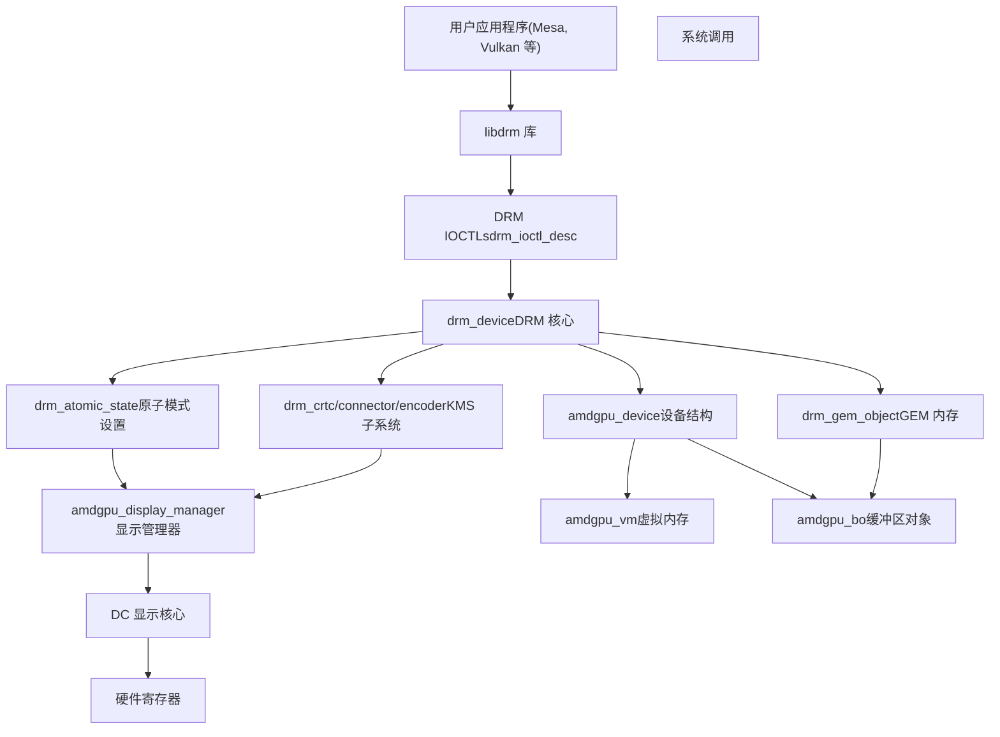
**来源：** [drivers/gpu/drm/amd/amdgpu/amdgpu\_drv.c1-303](https://github.com/torvalds/linux/blob/fcb70a56/drivers/gpu/drm/amd/amdgpu/amdgpu_drv.c#L1-303) [drivers/gpu/drm/amd/display/amdgpu\_dm/amdgpu\_dm.c1-170](https://github.com/torvalds/linux/blob/fcb70a56/drivers/gpu/drm/amd/display/amdgpu_dm/amdgpu_dm.c#L1-170)

### DRM 核心组件

DRM 核心提供了所有 DRM 驱动程序使用的基本抽象：

| 组件 | 结构体 | 用途 |
| --- | --- | --- |
| 设备 | `drm_device` | 代表 GPU 硬件的根设备结构 |
| GEM | `drm_gem_object` | 图形执行管理器 (Graphics Execution Manager)，用于内存对象 |
| KMS | `drm_crtc`, `drm_connector`, `drm_encoder` | 内核模式设置 (Kernel Mode Setting) 显示管理 |
| 原子 | `drm_atomic_state` | 用于无闪烁更新的原子模式设置 |
| 文件 | `drm_file` | 每个进程的文件句柄跟踪 |

**来源：** [drivers/gpu/drm/amd/amdgpu/amdgpu\_drv.c1-303](https://github.com/torvalds/linux/blob/fcb70a56/drivers/gpu/drm/amd/amdgpu/amdgpu_drv.c#L1-303) [rust/bindings/bindings\_helper.h32-36](https://github.com/torvalds/linux/blob/fcb70a56/rust/bindings/bindings_helper.h#L32-36)

## AMDGPU 驱动结构

AMDGPU 驱动是支持现代 AMD GPU 的综合 DRM 驱动程序。它实现了显示管理、GPU 虚拟内存、计算功能和电源管理。

### 驱动初始化流程

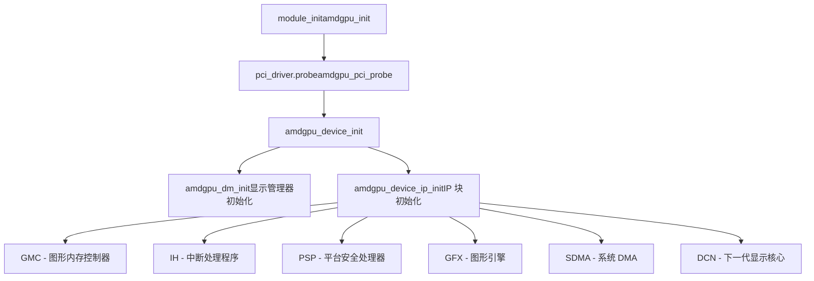
**来源：** [drivers/gpu/drm/amd/amdgpu/amdgpu\_drv.c1-303](https://github.com/torvalds/linux/blob/fcb70a56/drivers/gpu/drm/amd/amdgpu/amdgpu_drv.c#L1-303) [drivers/gpu/drm/amd/amdgpu/amdgpu\_device.c183-211](https://github.com/torvalds/linux/blob/fcb70a56/drivers/gpu/drm/amd/amdgpu/amdgpu_device.c#L183-211)

### AMDGPU 设备结构

`amdgpu_device` 结构 [drivers/gpu/drm/amd/amdgpu/amdgpu.h1-100](https://github.com/torvalds/linux/blob/fcb70a56/drivers/gpu/drm/amd/amdgpu/amdgpu.h#L1-100) 是管理 GPU 的中心数据结构：

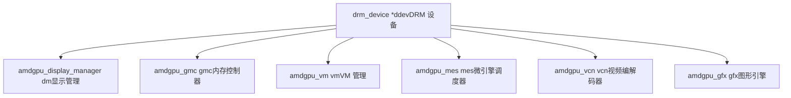
**来源：** [drivers/gpu/drm/amd/amdgpu/amdgpu.h1-100](https://github.com/torvalds/linux/blob/fcb70a56/drivers/gpu/drm/amd/amdgpu/amdgpu.h#L1-100)

## 显示管理器 (amdgpu\_dm)

AMD 显示管理器 (`amdgpu_dm`) 位于 DRM 层和 AMD 专有的显示核心 (Display Core, DC) 库之间。它将 DRM 请求转换为 DC 操作，反之亦然。

### 显示管理器架构

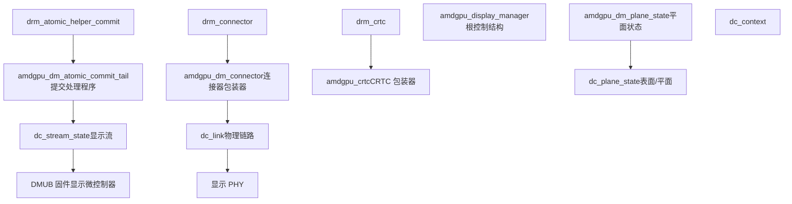
**来源：** [drivers/gpu/drm/amd/display/amdgpu\_dm/amdgpu\_dm.c162-170](https://github.com/torvalds/linux/blob/fcb70a56/drivers/gpu/drm/amd/display/amdgpu_dm/amdgpu_dm.c#L162-170) [drivers/gpu/drm/amd/display/amdgpu\_dm/amdgpu\_dm.h1-100](https://github.com/torvalds/linux/blob/fcb70a56/drivers/gpu/drm/amd/display/amdgpu_dm/amdgpu_dm.h#L1-100)

### 显示管理器初始化

显示管理器初始化 [drivers/gpu/drm/amd/display/amdgpu\_dm/amdgpu\_dm.c172-224](https://github.com/torvalds/linux/blob/fcb70a56/drivers/gpu/drm/amd/display/amdgpu_dm/amdgpu_dm.c#L172-224) 建立了 DRM 和 DC 之间的连接：

1.  **DC 上下文创建** - 创建 `dc_context` 并初始化 DC 库
2.  **DRM 设备设置** - 初始化 `drm_device` 结构（CRTC、连接器、编码器）
3.  **中断设置** - 通过 `amdgpu_dm_irq_init` 配置显示中断处理
4.  **原子助手** - 注册原子模式设置回调
5.  **背光注册** - 设置背光控制接口

**来源：** [drivers/gpu/drm/amd/display/amdgpu\_dm/amdgpu\_dm.c172-224](https://github.com/torvalds/linux/blob/fcb70a56/drivers/gpu/drm/amd/display/amdgpu_dm/amdgpu_dm.c#L172-224)

### 原子模式设置流程

> **[Mermaid sequence]**
> *(图表结构无法解析)*

**来源：** [drivers/gpu/drm/amd/display/amdgpu\_dm/amdgpu\_dm.c236-241](https://github.com/torvalds/linux/blob/fcb70a56/drivers/gpu/drm/amd/display/amdgpu_dm/amdgpu_dm.c#L236-241)

### 关键显示管理器函数

| 函数 | 位置 | 用途 |
| --- | --- | --- |
| `amdgpu_dm_init` | [drivers/gpu/drm/amd/display/amdgpu\_dm/amdgpu\_dm.c172](https://github.com/torvalds/linux/blob/fcb70a56/drivers/gpu/drm/amd/display/amdgpu_dm/amdgpu_dm.c#L172) | 初始化显示管理器 |
| `amdgpu_dm_fini` | [drivers/gpu/drm/amd/display/amdgpu\_dm/amdgpu\_dm.c173](https://github.com/torvalds/linux/blob/fcb70a56/drivers/gpu/drm/amd/display/amdgpu_dm/amdgpu_dm.c#L173) | 清理显示管理器 |
| `amdgpu_dm_atomic_check` | [drivers/gpu/drm/amd/display/amdgpu\_dm/amdgpu\_dm.c239-240](https://github.com/torvalds/linux/blob/fcb70a56/drivers/gpu/drm/amd/display/amdgpu_dm/amdgpu_dm.c#L239-240) | 验证原子状态 |
| `amdgpu_dm_atomic_commit_tail` | [drivers/gpu/drm/amd/display/amdgpu\_dm/amdgpu\_dm.c237](https://github.com/torvalds/linux/blob/fcb70a56/drivers/gpu/drm/amd/display/amdgpu_dm/amdgpu_dm.c#L237) | 应用原子状态更改 |
| `dm_vblank_get_counter` | [drivers/gpu/drm/amd/display/amdgpu\_dm/amdgpu\_dm.c265-281](https://github.com/torvalds/linux/blob/fcb70a56/drivers/gpu/drm/amd/display/amdgpu_dm/amdgpu_dm.c#L265-281) | 读取 vblank 计数器 |
| `dm_crtc_high_irq` | [drivers/gpu/drm/amd/display/amdgpu\_dm/amdgpu\_dm.c649-756](https://github.com/torvalds/linux/blob/fcb70a56/drivers/gpu/drm/amd/display/amdgpu_dm/amdgpu_dm.c#L649-756) | 处理 CRTC/vblank 中断 |
| `dm_pflip_high_irq` | [drivers/gpu/drm/amd/display/amdgpu\_dm/amdgpu\_dm.c437-532](https://github.com/torvalds/linux/blob/fcb70a56/drivers/gpu/drm/amd/display/amdgpu_dm/amdgpu_dm.c#L437-532) | 处理页面翻转中断 |

**来源：** [drivers/gpu/drm/amd/display/amdgpu\_dm/amdgpu\_dm.c172-532](https://github.com/torvalds/linux/blob/fcb70a56/drivers/gpu/drm/amd/display/amdgpu_dm/amdgpu_dm.c#L172-532)

## 显示连接和输出

### 连接器类型和管理

显示管理器创建和管理代表物理显示输出的不同连接器类型：

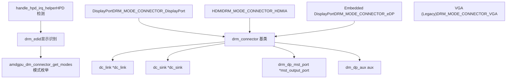
**来源：** [drivers/gpu/drm/amd/display/amdgpu\_dm/amdgpu\_dm.c179-213](https://github.com/torvalds/linux/blob/fcb70a56/drivers/gpu/drm/amd/display/amdgpu_dm/amdgpu_dm.c#L179-213) [drivers/gpu/drm/amd/display/amdgpu\_dm/amdgpu\_dm.c226-234](https://github.com/torvalds/linux/blob/fcb70a56/drivers/gpu/drm/amd/display/amdgpu_dm/amdgpu_dm.c#L226-234)

### 多流传输 (MST)

DisplayPort MST 允许通过单个 DisplayPort 连接共享多个显示器：

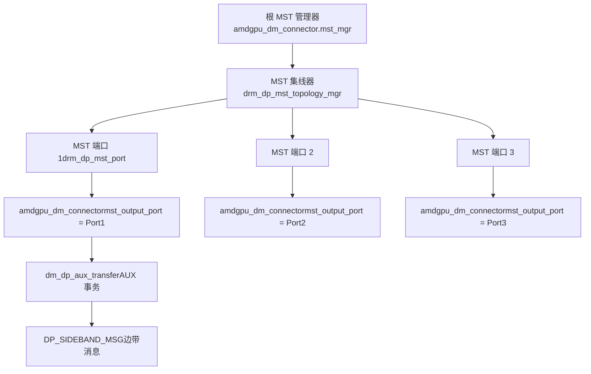
**来源：** [drivers/gpu/drm/amd/display/amdgpu\_dm/amdgpu\_dm\_mst\_types.c58-145](https://github.com/torvalds/linux/blob/fcb70a56/drivers/gpu/drm/amd/display/amdgpu_dm/amdgpu_dm_mst_types.c#L58-145) [drivers/gpu/drm/amd/display/amdgpu\_dm/amdgpu\_dm\_mst\_types.c230-232](https://github.com/torvalds/linux/blob/fcb70a56/drivers/gpu/drm/amd/display/amdgpu_dm/amdgpu_dm_mst_types.c#L230-232)

### MST 关键函数

| 函数 | 位置 | 用途 |
| --- | --- | --- |
| `dm_dp_aux_transfer` | [drivers/gpu/drm/amd/display/amdgpu\_dm/amdgpu\_dm\_mst\_types.c58-145](https://github.com/torvalds/linux/blob/fcb70a56/drivers/gpu/drm/amd/display/amdgpu_dm/amdgpu_dm_mst_types.c#L58-145) | 处理 DP AUX 事务 |
| `dm_dp_mst_connector_destroy` | [drivers/gpu/drm/amd/display/amdgpu\_dm/amdgpu\_dm\_mst\_types.c148-164](https://github.com/torvalds/linux/blob/fcb70a56/drivers/gpu/drm/amd/display/amdgpu_dm/amdgpu_dm_mst_types.c#L148-164) | 清理 MST 连接器 |
| `amdgpu_dm_mst_connector_early_unregister` | [drivers/gpu/drm/amd/display/amdgpu\_dm/amdgpu\_dm\_mst\_types.c197-228](https://github.com/torvalds/linux/blob/fcb70a56/drivers/gpu/drm/amd/display/amdgpu_dm/amdgpu_dm_mst_types.c#L197-228) | 注销 MST 连接器 |

**来源：** [drivers/gpu/drm/amd/display/amdgpu\_dm/amdgpu\_dm\_mst\_types.c58-228](https://github.com/torvalds/linux/blob/fcb70a56/drivers/gpu/drm/amd/display/amdgpu_dm/amdgpu_dm_mst_types.c#L58-228)

## GPU 虚拟内存 (GPUVM)

GPUVM 为 GPU 内存访问提供每个进程的虚拟地址空间，类似于 CPU 虚拟内存。

### GPUVM 架构

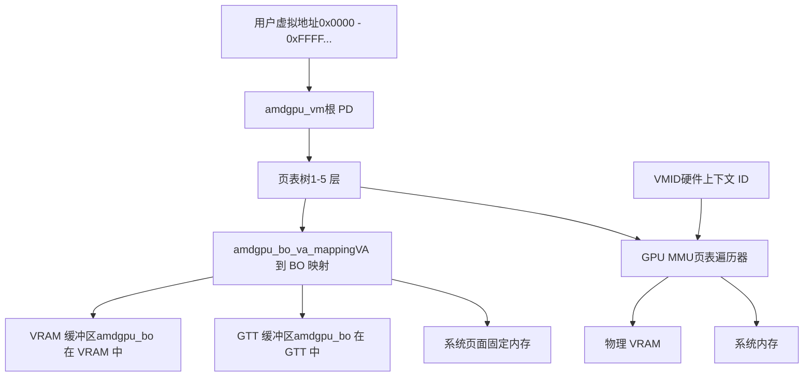
**来源：** [drivers/gpu/drm/amd/amdgpu/amdgpu\_vm.c48-88](https://github.com/torvalds/linux/blob/fcb70a56/drivers/gpu/drm/amd/amdgpu/amdgpu_vm.c#L48-88)

### GPUVM 文档

GPUVM 子系统 [drivers/gpu/drm/amd/amdgpu/amdgpu\_vm.c48-88](https://github.com/torvalds/linux/blob/fcb70a56/drivers/gpu/drm/amd/amdgpu/amdgpu_vm.c#L48-88) 提供了详细文档：

-   **每个进程地址空间**：每个 GPU 客户端获得自己的 GPUVM 地址空间
-   **多级页表**：支持 1-2 或 1-5 级页表，取决于 ASIC 系列
-   **RWX 属性**：页面级读/写/执行权限
-   **VMID 管理**：多达 16 个活动 GPUVM，具有硬件 VMID 分配
-   **缺页处理**：GPU 缺页异常类似于 CPU 缺页异常
-   **特殊 VMID 0**：内核驱动程序使用 VMID 0，具有直接 VRAM 和 AGP 孔径

**来源：** [drivers/gpu/drm/amd/amdgpu/amdgpu\_vm.c48-88](https://github.com/torvalds/linux/blob/fcb70a56/drivers/gpu/drm/amd/amdgpu/amdgpu_vm.c#L48-88)

### GPUVM 关键函数

| 函数 | 位置 | 用途 |
| --- | --- | --- |
| `amdgpu_vm_lock_pd` | [drivers/gpu/drm/amd/amdgpu/amdgpu\_vm.c459-465](https://github.com/torvalds/linux/blob/fcb70a56/drivers/gpu/drm/amd/amdgpu/amdgpu_vm.c#L459-465) | 锁定 VM 根页目录 |
| `amdgpu_vm_bo_base_init` | [drivers/gpu/drm/amd/amdgpu/amdgpu\_vm.c409-448](https://github.com/torvalds/linux/blob/fcb70a56/drivers/gpu/drm/amd/amdgpu/amdgpu_vm.c#L409-448) | 初始化 BO-VM 关联 |
| `amdgpu_vm_update_stats` | [drivers/gpu/drm/amd/amdgpu/amdgpu\_vm.c389-397](https://github.com/torvalds/linux/blob/fcb70a56/drivers/gpu/drm/amd/amdgpu/amdgpu_vm.c#L389-397) | 更新 VM 内存统计信息 |
| `amdgpu_vm_bo_update_shared` | [drivers/gpu/drm/amd/amdgpu/amdgpu\_vm.c332-338](https://github.com/torvalds/linux/blob/fcb70a56/drivers/gpu/drm/amd/amdgpu/amdgpu_vm.c#L332-338) | 更新共享内存统计信息 |

**来源：** [drivers/gpu/drm/amd/amdgpu/amdgpu\_vm.c332-465](https://github.com/torvalds/linux/blob/fcb70a56/drivers/gpu/drm/amd/amdgpu/amdgpu_vm.c#L332-465)

### VM 状态机

GPUVM 缓冲区对象在其生命周期中经历状态转换：

> **[Mermaid stateDiagram]**
> *(图表结构无法解析)*

**来源：** [drivers/gpu/drm/amd/amdgpu/amdgpu\_vm.c149-291](https://github.com/torvalds/linux/blob/fcb70a56/drivers/gpu/drm/amd/amdgpu/amdgpu_vm.c#L149-291)

## GEM 缓冲区对象

GEM (图形执行管理器) 为 GPU 可访问的缓冲区提供内存管理框架。

### AMDGPU 缓冲区对象结构

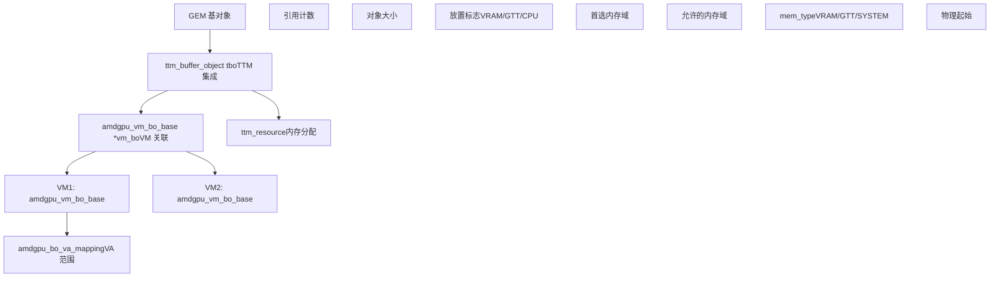
**来源：** [drivers/gpu/drm/amd/amdgpu/amdgpu\_vm.c409-448](https://github.com/torvalds/linux/blob/fcb70a56/drivers/gpu/drm/amd/amdgpu/amdgpu_vm.c#L409-448) [drivers/gpu/drm/amd/amdgpu/amdgpu\_dma\_buf.c27-33](https://github.com/torvalds/linux/blob/fcb70a56/drivers/gpu/drm/amd/amdgpu/amdgpu_dma_buf.c#L27-33)

### DMA-BUF 共享

AMDGPU 实现了 DMA-BUF 以在设备和进程之间共享缓冲区：

> **[Mermaid sequence]**
> *(图表结构无法解析)*

**来源：** [drivers/gpu/drm/amd/amdgpu/amdgpu\_dma\_buf.c27-33](https://github.com/torvalds/linux/blob/fcb70a56/drivers/gpu/drm/amd/amdgpu/amdgpu_dma_buf.c#L27-33)

## 显示中断处理

显示中断对于垂直同步、页面翻转和热插拔检测至关重要。

### 中断流程

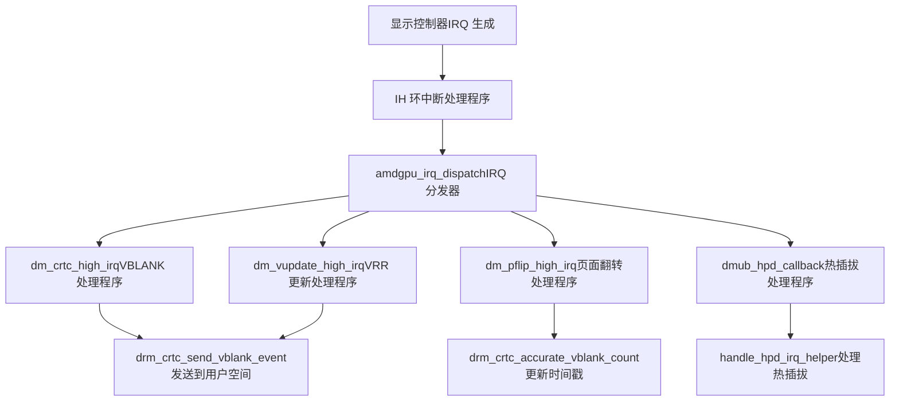
**来源：** [drivers/gpu/drm/amd/display/amdgpu\_dm/amdgpu\_dm.c437-756](https://github.com/torvalds/linux/blob/fcb70a56/drivers/gpu/drm/amd/display/amdgpu_dm/amdgpu_dm.c#L437-756) [drivers/gpu/drm/amd/display/amdgpu\_dm/amdgpu\_dm.c830-853](https://github.com/torvalds/linux/blob/fcb70a56/drivers/gpu/drm/amd/display/amdgpu_dm/amdgpu_dm.c#L830-853)

### VBLANK 和页面翻转处理

vblank 中断处理程序 [drivers/gpu/drm/amd/display/amdgpu\_dm/amdgpu\_dm.c649-756](https://github.com/torvalds/linux/blob/fcb70a56/drivers/gpu/drm/amd/display/amdgpu_dm/amdgpu_dm.c#L649-756) 管理垂直消隐期：

1.  **处理 VRR 模式**：在可变刷新率模式下，将 vblank 处理推迟到 `dm_vupdate_high_irq`
2.  **处理回写**：检查回写完成并发出完成事件信号
3.  **发送事件**：向用户空间发送页面翻转完成事件
4.  **BTR 更新**：处理较新 ASIC 的低于范围帧率更新
5.  **处理无平面情况**：对没有活动平面时的页面翻转进行特殊处理

**来源：** [drivers/gpu/drm/amd/display/amdgpu\_dm/amdgpu\_dm.c649-756](https://github.com/torvalds/linux/blob/fcb70a56/drivers/gpu/drm/amd/display/amdgpu_dm/amdgpu_dm.c#L649-756)

### 热插拔检测 (HPD)

> **[Mermaid sequence]**
> *(图表结构无法解析)*

**来源：** [drivers/gpu/drm/amd/display/amdgpu\_dm/amdgpu\_dm.c830-853](https://github.com/torvalds/linux/blob/fcb70a56/drivers/gpu/drm/amd/display/amdgpu_dm/amdgpu_dm.c#L830-853) [drivers/gpu/drm/amd/display/amdgpu\_dm/amdgpu\_dm.c242-243](https://github.com/torvalds/linux/blob/fcb70a56/drivers/gpu/drm/amd/display/amdgpu_dm/amdgpu_dm.c#L242-243)

## CRTC 管理

CRTC (阴极射线管控制器) 代表将帧缓冲区扫描输出到显示器的显示管道。

### CRTC 结构与操作

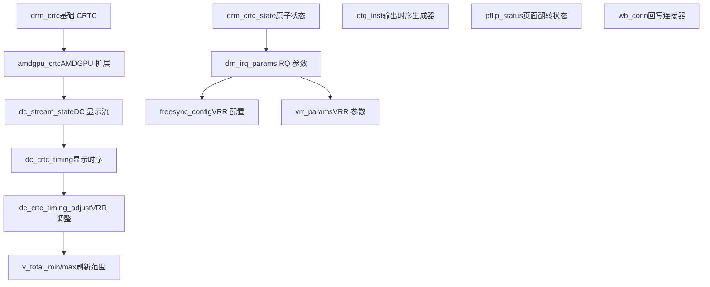
**来源：** [drivers/gpu/drm/amd/display/amdgpu\_dm/amdgpu\_dm\_crtc.c41-100](https://github.com/torvalds/linux/blob/fcb70a56/drivers/gpu/drm/amd/display/amdgpu_dm/amdgpu_dm_crtc.c#L41-100) [drivers/gpu/drm/amd/display/amdgpu\_dm/amdgpu\_dm.h131-180](https://github.com/torvalds/linux/blob/fcb70a56/drivers/gpu/drm/amd/display/amdgpu_dm/amdgpu_dm.h#L131-180)

### CRTC 关键函数

| 函数 | 位置 | 用途 |
| --- | --- | --- |
| `amdgpu_dm_crtc_handle_vblank` | [drivers/gpu/drm/amd/display/amdgpu\_dm/amdgpu\_dm\_crtc.c41-59](https://github.com/torvalds/linux/blob/fcb70a56/drivers/gpu/drm/amd/display/amdgpu_dm/amdgpu_dm_crtc.c#L41-59) | 处理 vblank 事件 |
| `amdgpu_dm_crtc_modeset_required` | [drivers/gpu/drm/amd/display/amdgpu\_dm/amdgpu\_dm\_crtc.c61-66](https://github.com/torvalds/linux/blob/fcb70a56/drivers/gpu/drm/amd/display/amdgpu_dm/amdgpu_dm_crtc.c#L61-66) | 检查是否需要模式设置 |
| `amdgpu_dm_crtc_vrr_active` | [drivers/gpu/drm/amd/display/amdgpu\_dm/amdgpu\_dm\_crtc.c96-100](https://github.com/torvalds/linux/blob/fcb70a56/drivers/gpu/drm/amd/display/amdgpu_dm/amdgpu_dm_crtc.c#L96-100) | 检查 VRR 活动状态 |
| `amdgpu_dm_crtc_set_vupdate_irq` | [drivers/gpu/drm/amd/display/amdgpu\_dm/amdgpu\_dm\_crtc.c77-94](https://github.com/torvalds/linux/blob/fcb70a56/drivers/gpu/drm/amd/display/amdgpu_dm/amdgpu_dm_crtc.c#L77-94) | 启用/禁用 VRR 更新 IRQ |

**来源：** [drivers/gpu/drm/amd/display/amdgpu\_dm/amdgpu\_dm\_crtc.c41-100](https://github.com/torvalds/linux/blob/fcb70a56/drivers/gpu/drm/amd/display/amdgpu_dm/amdgpu_dm_crtc.c#L41-100)

## Rust DRM 抽象

内核为 DRM 提供了 Rust 抽象，以支持安全的 GPU 驱动程序开发。

### Rust DRM 模块结构

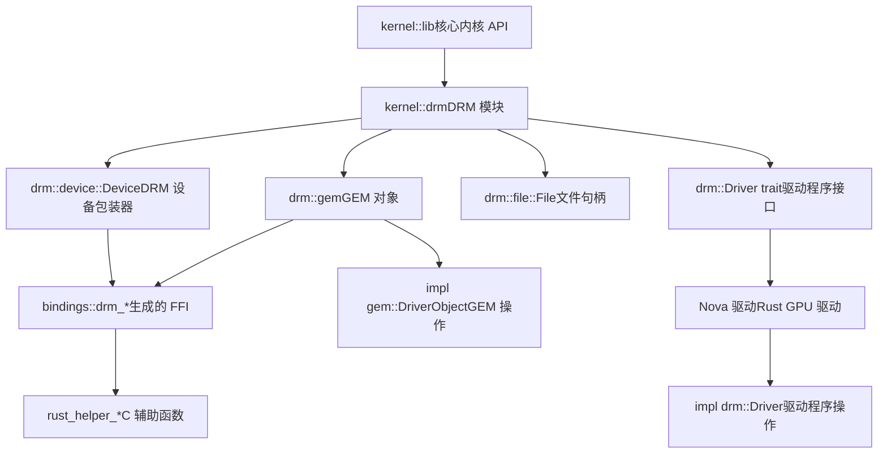
**来源：** [rust/kernel/lib.rs92-93](https://github.com/torvalds/linux/blob/fcb70a56/rust/kernel/lib.rs#L92-93) [rust/kernel/drm/device.rs1-10](https://github.com/torvalds/linux/blob/fcb70a56/rust/kernel/drm/device.rs#L1-10) [rust/kernel/drm/gem/mod.rs1-30](https://github.com/torvalds/linux/blob/fcb70a56/rust/kernel/drm/gem/mod.rs#L1-30)

### DRM 设备包装器

Rust DRM 设备包装器 [rust/kernel/drm/device.rs1-10](https://github.com/torvalds/linux/blob/fcb70a56/rust/kernel/drm/device.rs#L1-10) 提供对 DRM 功能的安全访问：

-   **类型安全**：将原始 C `drm_device` 指针包装在安全的 Rust 类型中
-   **生命周期管理**：使用 Rust 的 `ARef` 进行引用计数的设备访问
-   **错误处理**：将 C 错误代码转换为 Rust `Result` 类型
-   **基于 Trait 的设计**：驱动程序实现 `drm::Driver` trait

**来源：** [rust/kernel/drm/device.rs1-10](https://github.com/torvalds/linux/blob/fcb70a56/rust/kernel/drm/device.rs#L1-10)

### GEM 对象抽象

Rust GEM 模块 [rust/kernel/drm/gem/mod.rs1-30](https://github.com/torvalds/linux/blob/fcb70a56/rust/kernel/drm/gem/mod.rs#L1-30) 提供 GPU 内存抽象：

```
// 概念示例结构 (非实际代码)
// pub trait DriverObject {
//     type Driver: drm::Driver;
//     fn new(dev: &Device, size: usize) -> Result<Self>;
// }
```
关键抽象包括：

-   用于实现特定驱动程序 GEM 对象的 `DriverObject` trait
-   围绕 `drm_gem_object` 生命周期管理的安全包装器
-   与 Rust `ARef` 集成以进行引用计数
-   类型安全的内存分配标志

**来源：** [rust/kernel/drm/gem/mod.rs1-30](https://github.com/torvalds/linux/blob/fcb70a56/rust/kernel/drm/gem/mod.rs#L1-30) [rust/bindings/bindings\_helper.h32-36](https://github.com/torvalds/linux/blob/fcb70a56/rust/bindings/bindings_helper.h#L32-36)

## 用户队列管理

用户队列提供从用户空间直接提交 GPU 命令的功能，绕过内核调度开销，适用于低延迟应用程序。

### 用户队列架构

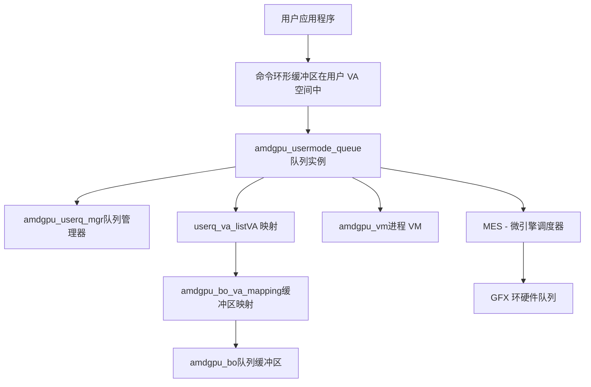
**来源：** [drivers/gpu/drm/amd/amdgpu/amdgpu\_userq.c37-48](https://github.com/torvalds/linux/blob/fcb70a56/drivers/gpu/drm/amd/amdgpu/amdgpu_userq.c#L37-48) [drivers/gpu/drm/amd/amdgpu/amdgpu\_userq.c151-202](https://github.com/torvalds/linux/blob/fcb70a56/drivers/gpu/drm/amd/amdgpu/amdgpu_userq.c#L151-202)

### 用户队列函数

| 函数 | 位置 | 用途 |
| --- | --- | --- |
| `amdgpu_userq_get_supported_ip_mask` | [drivers/gpu/drm/amd/amdgpu/amdgpu\_userq.c37-48](https://github.com/torvalds/linux/blob/fcb70a56/drivers/gpu/drm/amd/amdgpu/amdgpu_userq.c#L37-48) | 查询支持的队列类型 |
| `amdgpu_userq_input_va_validate` | [drivers/gpu/drm/amd/amdgpu/amdgpu\_userq.c169-202](https://github.com/torvalds/linux/blob/fcb70a56/drivers/gpu/drm/amd/amdgpu/amdgpu_userq.c#L169-202) | 验证队列的用户 VA |
| `amdgpu_userq_detect_and_reset_queues` | [drivers/gpu/drm/amd/amdgpu/amdgpu\_userq.c96-149](https://github.com/torvalds/linux/blob/fcb70a56/drivers/gpu/drm/amd/amdgpu/amdgpu_userq.c#L96-149) | 检测并重置挂起的队列 |
| `amdgpu_userq_buffer_vas_mapped` | [drivers/gpu/drm/amd/amdgpu/amdgpu\_userq.c222-238](https://github.com/torvalds/linux/blob/fcb70a56/drivers/gpu/drm/amd/amdgpu/amdgpu_userq.c#L222-238) | 检查队列 VA 是否映射 |

**来源：** [drivers/gpu/drm/amd/amdgpu/amdgpu\_userq.c37-238](https://github.com/torvalds/linux/blob/fcb70a56/drivers/gpu/drm/amd/amdgpu/amdgpu_userq.c#L37-238)

### 用户队列重置流程

> **[Mermaid sequence]**
> *(图表结构无法解析)*

**来源：** [drivers/gpu/drm/amd/amdgpu/amdgpu\_userq.c85-149](https://github.com/torvalds/linux/blob/fcb70a56/drivers/gpu/drm/amd/amdgpu/amdgpu_userq.c#L85-149)

## 显示核心 (DC) 集成

显示核心 (DC) 是 AMD 显示控制器的硬件抽象层。

### DC 架构

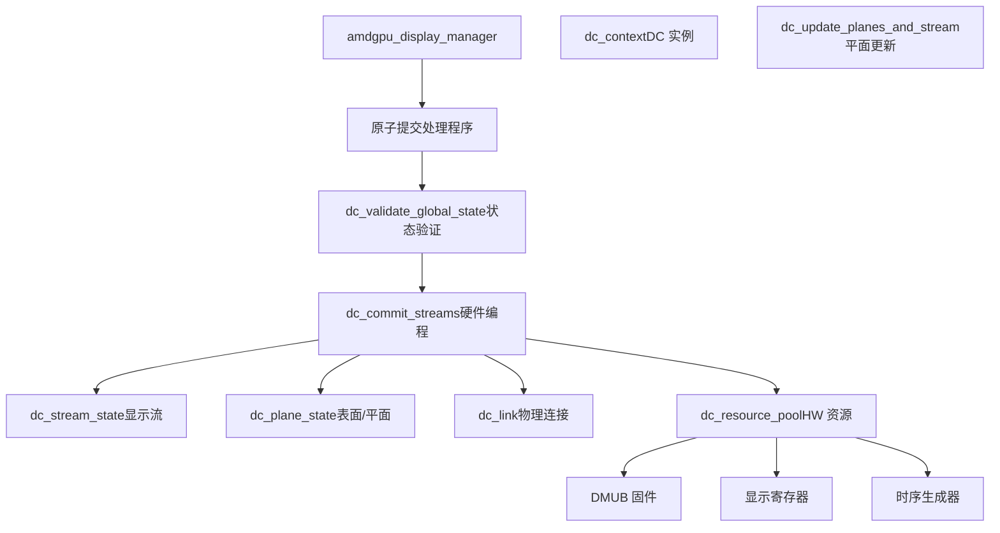
**来源：** [drivers/gpu/drm/amd/display/amdgpu\_dm/amdgpu\_dm.c391-428](https://github.com/torvalds/linux/blob/fcb70a56/drivers/gpu/drm/amd/display/amdgpu_dm/amdgpu_dm.c#L391-428)

### DC 更新流程

DC 更新过程 [drivers/gpu/drm/amd/display/amdgpu\_dm/amdgpu\_dm.c391-428](https://github.com/torvalds/linux/blob/fcb70a56/drivers/gpu/drm/amd/display/amdgpu_dm/amdgpu_dm.c#L391-428) 涉及：

1.  **平面排序**：按降序层索引 (z-order) 对 `dc_surface_update` 数组进行排序
2.  **发布更新**：调用 `dc_post_update_surfaces_to_stream` 进行优化
3.  **应用更新**：调用 `dc_update_planes_and_stream` 对硬件进行编程
4.  **协调多个平面**：原子地处理多个平面更新

**来源：** [drivers/gpu/drm/amd/display/amdgpu\_dm/amdgpu\_dm.c391-428](https://github.com/torvalds/linux/blob/fcb70a56/drivers/gpu/drm/amd/display/amdgpu_dm/amdgpu_dm.c#L391-428)

## 内存统计和核算

驱动程序跟踪每个 VM 的内存使用情况，以进行调试和资源管理。

### 内存统计结构

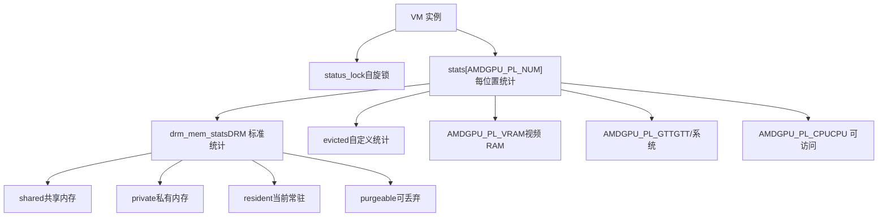
**来源：** [drivers/gpu/drm/amd/amdgpu/amdgpu\_vm.c294-397](https://github.com/torvalds/linux/blob/fcb70a56/drivers/gpu/drm/amd/amdgpu/amdgpu_vm.c#L294-397)

### 统计更新函数

| 函数 | 位置 | 用途 |
| --- | --- | --- |
| `amdgpu_vm_update_stats` | [drivers/gpu/drm/amd/amdgpu/amdgpu\_vm.c389-397](https://github.com/torvalds/linux/blob/fcb70a56/drivers/gpu/drm/amd/amdgpu/amdgpu_vm.c#L389-397) | 更新内存统计信息 (公开) |
| `amdgpu_vm_update_stats_locked` | [drivers/gpu/drm/amd/amdgpu/amdgpu\_vm.c350-378](https://github.com/torvalds/linux/blob/fcb70a56/drivers/gpu/drm/amd/amdgpu/amdgpu_vm.c#L350-378) | 更新统计信息 (持有锁) |
| `amdgpu_vm_update_shared` | [drivers/gpu/drm/amd/amdgpu/amdgpu\_vm.c301-323](https://github.com/torvalds/linux/blob/fcb70a56/drivers/gpu/drm/amd/amdgpu/amdgpu_vm.c#L301-323) | 更新共享内存标志 |
| `amdgpu_vm_bo_update_shared` | [drivers/gpu/drm/amd/amdgpu/amdgpu\_vm.c332-338](https://github.com/torvalds/linux/blob/fcb70a56/drivers/gpu/drm/amd/amdgpu/amdgpu_vm.c#L332-338) | 更新所有 VM 的共享 |

**来源：** [drivers/gpu/drm/amd/amdgpu/amdgpu\_vm.c301-397](https://github.com/torvalds/linux/blob/fcb70a56/drivers/gpu/drm/amd/amdgpu/amdgpu_vm.c#L301-397)

## 同步原语

图形子系统使用各种内核同步机制，Rust 提供了安全包装器。

### Rust 同步抽象

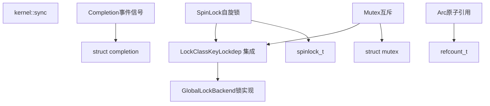
**来源：** [rust/kernel/sync.rs1-34](https://github.com/torvalds/linux/blob/fcb70a56/rust/kernel/sync.rs#L1-34) [rust/kernel/sync/lock.rs1-20](https://github.com/torvalds/linux/blob/fcb70a56/rust/kernel/sync/lock.rs#L1-20)

### 显示管理器中的同步

显示管理器使用多种同步机制：

-   **`dc_lock` Mutex**：在提交期间保护 DC 状态 [drivers/gpu/drm/amd/display/amdgpu\_dm/amdgpu\_dm.c541-543](https://github.com/torvalds/linux/blob/fcb70a56/drivers/gpu/drm/amd/display/amdgpu_dm/amdgpu_dm.c#L541-543)
-   **Event Lock Spinlock**：保护 vblank 事件处理 [drivers/gpu/drm/amd/display/amdgpu\_dm/amdgpu\_dm.c457-527](https://github.com/torvalds/linux/blob/fcb70a56/drivers/gpu/drm/amd/display/amdgpu_dm/amdgpu_dm.c#L457-527)
-   **Status Lock Spinlock**：保护 VM 状态列表 [drivers/gpu/drm/amd/amdgpu/amdgpu\_vm.c156-161](https://github.com/torvalds/linux/blob/fcb70a56/drivers/gpu/drm/amd/amdgpu/amdgpu_vm.c#L156-161)
-   **DMUB Completion**：等待 DMUB AUX 传输 [drivers/gpu/drm/amd/display/amdgpu\_dm/amdgpu\_dm.c796](https://github.com/torvalds/linux/blob/fcb70a56/drivers/gpu/drm/amd/display/amdgpu_dm/amdgpu_dm.c#L796)

**来源：** [drivers/gpu/drm/amd/display/amdgpu\_dm/amdgpu\_dm.c457-796](https://github.com/torvalds/linux/blob/fcb70a56/drivers/gpu/drm/amd/display/amdgpu_dm/amdgpu_dm.c#L457-796)
