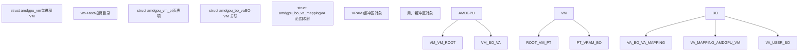
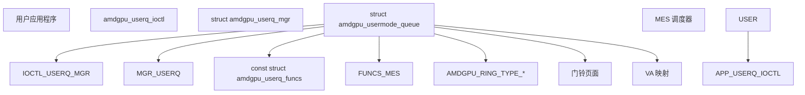
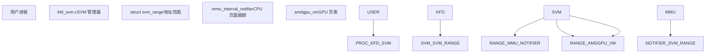
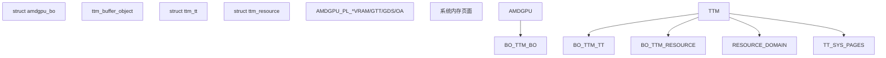
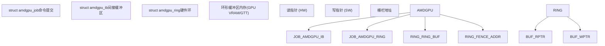
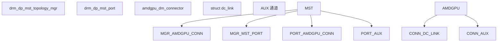

# AMDGPU 驱动

相关源文件

-   [drivers/gpu/drm/amd/amdgpu/amdgpu.h](https://github.com/torvalds/linux/blob/fcb70a56/drivers/gpu/drm/amd/amdgpu/amdgpu.h)
-   [drivers/gpu/drm/amd/amdgpu/amdgpu\_acpi.c](https://github.com/torvalds/linux/blob/fcb70a56/drivers/gpu/drm/amd/amdgpu/amdgpu_acpi.c)
-   [drivers/gpu/drm/amd/amdgpu/amdgpu\_amdkfd\_gpuvm.c](https://github.com/torvalds/linux/blob/fcb70a56/drivers/gpu/drm/amd/amdgpu/amdgpu_amdkfd_gpuvm.c)
-   [drivers/gpu/drm/amd/amdgpu/amdgpu\_bo\_list.h](https://github.com/torvalds/linux/blob/fcb70a56/drivers/gpu/drm/amd/amdgpu/amdgpu_bo_list.h)
-   [drivers/gpu/drm/amd/amdgpu/amdgpu\_connectors.c](https://github.com/torvalds/linux/blob/fcb70a56/drivers/gpu/drm/amd/amdgpu/amdgpu_connectors.c)
-   [drivers/gpu/drm/amd/amdgpu/amdgpu\_cs.c](https://github.com/torvalds/linux/blob/fcb70a56/drivers/gpu/drm/amd/amdgpu/amdgpu_cs.c)
-   [drivers/gpu/drm/amd/amdgpu/amdgpu\_dev\_coredump.c](https://github.com/torvalds/linux/blob/fcb70a56/drivers/gpu/drm/amd/amdgpu/amdgpu_dev_coredump.c)
-   [drivers/gpu/drm/amd/amdgpu/amdgpu\_device.c](https://github.com/torvalds/linux/blob/fcb70a56/drivers/gpu/drm/amd/amdgpu/amdgpu_device.c)
-   [drivers/gpu/drm/amd/amdgpu/amdgpu\_dma\_buf.c](https://github.com/torvalds/linux/blob/fcb70a56/drivers/gpu/drm/amd/amdgpu/amdgpu_dma_buf.c)
-   [drivers/gpu/drm/amd/amdgpu/amdgpu\_drv.c](https://github.com/torvalds/linux/blob/fcb70a56/drivers/gpu/drm/amd/amdgpu/amdgpu_drv.c)
-   [drivers/gpu/drm/amd/amdgpu/amdgpu\_fence.c](https://github.com/torvalds/linux/blob/fcb70a56/drivers/gpu/drm/amd/amdgpu/amdgpu_fence.c)
-   [drivers/gpu/drm/amd/amdgpu/amdgpu\_gem.c](https://github.com/torvalds/linux/blob/fcb70a56/drivers/gpu/drm/amd/amdgpu/amdgpu_gem.c)
-   [drivers/gpu/drm/amd/amdgpu/amdgpu\_gfx.c](https://github.com/torvalds/linux/blob/fcb70a56/drivers/gpu/drm/amd/amdgpu/amdgpu_gfx.c)
-   [drivers/gpu/drm/amd/amdgpu/amdgpu\_gfx.h](https://github.com/torvalds/linux/blob/fcb70a56/drivers/gpu/drm/amd/amdgpu/amdgpu_gfx.h)
-   [drivers/gpu/drm/amd/amdgpu/amdgpu\_hmm.c](https://github.com/torvalds/linux/blob/fcb70a56/drivers/gpu/drm/amd/amdgpu/amdgpu_hmm.c)
-   [drivers/gpu/drm/amd/amdgpu/amdgpu\_hmm.h](https://github.com/torvalds/linux/blob/fcb70a56/drivers/gpu/drm/amd/amdgpu/amdgpu_hmm.h)
-   [drivers/gpu/drm/amd/amdgpu/amdgpu\_ib.c](https://github.com/torvalds/linux/blob/fcb70a56/drivers/gpu/drm/amd/amdgpu/amdgpu_ib.c)
-   [drivers/gpu/drm/amd/amdgpu/amdgpu\_ids.c](https://github.com/torvalds/linux/blob/fcb70a56/drivers/gpu/drm/amd/amdgpu/amdgpu_ids.c)
-   [drivers/gpu/drm/amd/amdgpu/amdgpu\_ids.h](https://github.com/torvalds/linux/blob/fcb70a56/drivers/gpu/drm/amd/amdgpu/amdgpu_ids.h)
-   [drivers/gpu/drm/amd/amdgpu/amdgpu\_isp.c](https://github.com/torvalds/linux/blob/fcb70a56/drivers/gpu/drm/amd/amdgpu/amdgpu_isp.c)
-   [drivers/gpu/drm/amd/amdgpu/amdgpu\_isp.h](https://github.com/torvalds/linux/blob/fcb70a56/drivers/gpu/drm/amd/amdgpu/amdgpu_isp.h)
-   [drivers/gpu/drm/amd/amdgpu/amdgpu\_job.c](https://github.com/torvalds/linux/blob/fcb70a56/drivers/gpu/drm/amd/amdgpu/amdgpu_job.c)
-   [drivers/gpu/drm/amd/amdgpu/amdgpu\_kms.c](https://github.com/torvalds/linux/blob/fcb70a56/drivers/gpu/drm/amd/amdgpu/amdgpu_kms.c)
-   [drivers/gpu/drm/amd/amdgpu/amdgpu\_mes.c](https://github.com/torvalds/linux/blob/fcb70a56/drivers/gpu/drm/amd/amdgpu/amdgpu_mes.c)
-   [drivers/gpu/drm/amd/amdgpu/amdgpu\_mes.h](https://github.com/torvalds/linux/blob/fcb70a56/drivers/gpu/drm/amd/amdgpu/amdgpu_mes.h)
-   [drivers/gpu/drm/amd/amdgpu/amdgpu\_object.c](https://github.com/torvalds/linux/blob/fcb70a56/drivers/gpu/drm/amd/amdgpu/amdgpu_object.c)
-   [drivers/gpu/drm/amd/amdgpu/amdgpu\_rap.c](https://github.com/torvalds/linux/blob/fcb70a56/drivers/gpu/drm/amd/amdgpu/amdgpu_rap.c)
-   [drivers/gpu/drm/amd/amdgpu/amdgpu\_ring.c](https://github.com/torvalds/linux/blob/fcb70a56/drivers/gpu/drm/amd/amdgpu/amdgpu_ring.c)
-   [drivers/gpu/drm/amd/amdgpu/amdgpu\_ring.h](https://github.com/torvalds/linux/blob/fcb70a56/drivers/gpu/drm/amd/amdgpu/amdgpu_ring.h)
-   [drivers/gpu/drm/amd/amdgpu/amdgpu\_securedisplay.c](https://github.com/torvalds/linux/blob/fcb70a56/drivers/gpu/drm/amd/amdgpu/amdgpu_securedisplay.c)
-   [drivers/gpu/drm/amd/amdgpu/amdgpu\_sync.c](https://github.com/torvalds/linux/blob/fcb70a56/drivers/gpu/drm/amd/amdgpu/amdgpu_sync.c)
-   [drivers/gpu/drm/amd/amdgpu/amdgpu\_sync.h](https://github.com/torvalds/linux/blob/fcb70a56/drivers/gpu/drm/amd/amdgpu/amdgpu_sync.h)
-   [drivers/gpu/drm/amd/amdgpu/amdgpu\_ttm.h](https://github.com/torvalds/linux/blob/fcb70a56/drivers/gpu/drm/amd/amdgpu/amdgpu_ttm.h)
-   [drivers/gpu/drm/amd/amdgpu/amdgpu\_userq.c](https://github.com/torvalds/linux/blob/fcb70a56/drivers/gpu/drm/amd/amdgpu/amdgpu_userq.c)
-   [drivers/gpu/drm/amd/amdgpu/amdgpu\_userq.h](https://github.com/torvalds/linux/blob/fcb70a56/drivers/gpu/drm/amd/amdgpu/amdgpu_userq.h)
-   [drivers/gpu/drm/amd/amdgpu/amdgpu\_userq\_fence.c](https://github.com/torvalds/linux/blob/fcb70a56/drivers/gpu/drm/amd/amdgpu/amdgpu_userq_fence.c)
-   [drivers/gpu/drm/amd/amdgpu/amdgpu\_userq\_fence.h](https://github.com/torvalds/linux/blob/fcb70a56/drivers/gpu/drm/amd/amdgpu/amdgpu_userq_fence.h)
-   [drivers/gpu/drm/amd/amdgpu/amdgpu\_uvd.c](https://github.com/torvalds/linux/blob/fcb70a56/drivers/gpu/drm/amd/amdgpu/amdgpu_uvd.c)
-   [drivers/gpu/drm/amd/amdgpu/amdgpu\_vm.c](https://github.com/torvalds/linux/blob/fcb70a56/drivers/gpu/drm/amd/amdgpu/amdgpu_vm.c)
-   [drivers/gpu/drm/amd/amdgpu/amdgpu\_vm.h](https://github.com/torvalds/linux/blob/fcb70a56/drivers/gpu/drm/amd/amdgpu/amdgpu_vm.h)
-   [drivers/gpu/drm/amd/amdgpu/amdgpu\_vm\_pt.c](https://github.com/torvalds/linux/blob/fcb70a56/drivers/gpu/drm/amd/amdgpu/amdgpu_vm_pt.c)
-   [drivers/gpu/drm/amd/amdgpu/gmc\_v10\_0.c](https://github.com/torvalds/linux/blob/fcb70a56/drivers/gpu/drm/amd/amdgpu/gmc_v10_0.c)
-   [drivers/gpu/drm/amd/amdgpu/gmc\_v11\_0.c](https://github.com/torvalds/linux/blob/fcb70a56/drivers/gpu/drm/amd/amdgpu/gmc_v11_0.c)
-   [drivers/gpu/drm/amd/amdgpu/gmc\_v12\_0.c](https://github.com/torvalds/linux/blob/fcb70a56/drivers/gpu/drm/amd/amdgpu/gmc_v12_0.c)
-   [drivers/gpu/drm/amd/amdgpu/gmc\_v7\_0.c](https://github.com/torvalds/linux/blob/fcb70a56/drivers/gpu/drm/amd/amdgpu/gmc_v7_0.c)
-   [drivers/gpu/drm/amd/amdgpu/gmc\_v8\_0.c](https://github.com/torvalds/linux/blob/fcb70a56/drivers/gpu/drm/amd/amdgpu/gmc_v8_0.c)
-   [drivers/gpu/drm/amd/amdgpu/gmc\_v9\_0.c](https://github.com/torvalds/linux/blob/fcb70a56/drivers/gpu/drm/amd/amdgpu/gmc_v9_0.c)
-   [drivers/gpu/drm/amd/amdgpu/isp\_v4\_1\_1.c](https://github.com/torvalds/linux/blob/fcb70a56/drivers/gpu/drm/amd/amdgpu/isp_v4_1_1.c)
-   [drivers/gpu/drm/amd/amdgpu/mes\_userqueue.c](https://github.com/torvalds/linux/blob/fcb70a56/drivers/gpu/drm/amd/amdgpu/mes_userqueue.c)
-   [drivers/gpu/drm/amd/amdgpu/mes\_v11\_0.c](https://github.com/torvalds/linux/blob/fcb70a56/drivers/gpu/drm/amd/amdgpu/mes_v11_0.c)
-   [drivers/gpu/drm/amd/amdgpu/mes\_v12\_0.c](https://github.com/torvalds/linux/blob/fcb70a56/drivers/gpu/drm/amd/amdgpu/mes_v12_0.c)
-   [drivers/gpu/drm/amd/amdgpu/sdma\_v4\_0.c](https://github.com/torvalds/linux/blob/fcb70a56/drivers/gpu/drm/amd/amdgpu/sdma_v4_0.c)
-   [drivers/gpu/drm/amd/amdkfd/kfd\_events.c](https://github.com/torvalds/linux/blob/fcb70a56/drivers/gpu/drm/amd/amdkfd/kfd_events.c)
-   [drivers/gpu/drm/amd/amdkfd/kfd\_smi\_events.c](https://github.com/torvalds/linux/blob/fcb70a56/drivers/gpu/drm/amd/amdkfd/kfd_smi_events.c)
-   [drivers/gpu/drm/amd/amdkfd/kfd\_svm.c](https://github.com/torvalds/linux/blob/fcb70a56/drivers/gpu/drm/amd/amdkfd/kfd_svm.c)
-   [drivers/gpu/drm/amd/amdxcp/amdgpu\_xcp\_drv.c](https://github.com/torvalds/linux/blob/fcb70a56/drivers/gpu/drm/amd/amdxcp/amdgpu_xcp_drv.c)
-   [drivers/gpu/drm/amd/display/amdgpu\_dm/amdgpu\_dm.c](https://github.com/torvalds/linux/blob/fcb70a56/drivers/gpu/drm/amd/display/amdgpu_dm/amdgpu_dm.c)
-   [drivers/gpu/drm/amd/display/amdgpu\_dm/amdgpu\_dm.h](https://github.com/torvalds/linux/blob/fcb70a56/drivers/gpu/drm/amd/display/amdgpu_dm/amdgpu_dm.h)
-   [drivers/gpu/drm/amd/display/amdgpu\_dm/amdgpu\_dm\_crc.c](https://github.com/torvalds/linux/blob/fcb70a56/drivers/gpu/drm/amd/display/amdgpu_dm/amdgpu_dm_crc.c)
-   [drivers/gpu/drm/amd/display/amdgpu\_dm/amdgpu\_dm\_crc.h](https://github.com/torvalds/linux/blob/fcb70a56/drivers/gpu/drm/amd/display/amdgpu_dm/amdgpu_dm_crc.h)
-   [drivers/gpu/drm/amd/display/amdgpu\_dm/amdgpu\_dm\_crtc.c](https://github.com/torvalds/linux/blob/fcb70a56/drivers/gpu/drm/amd/display/amdgpu_dm/amdgpu_dm_crtc.c)
-   [drivers/gpu/drm/amd/display/amdgpu\_dm/amdgpu\_dm\_crtc.h](https://github.com/torvalds/linux/blob/fcb70a56/drivers/gpu/drm/amd/display/amdgpu_dm/amdgpu_dm_crtc.h)
-   [drivers/gpu/drm/amd/display/amdgpu\_dm/amdgpu\_dm\_debugfs.c](https://github.com/torvalds/linux/blob/fcb70a56/drivers/gpu/drm/amd/display/amdgpu_dm/amdgpu_dm_debugfs.c)
-   [drivers/gpu/drm/amd/display/amdgpu\_dm/amdgpu\_dm\_mst\_types.c](https://github.com/torvalds/linux/blob/fcb70a56/drivers/gpu/drm/amd/display/amdgpu_dm/amdgpu_dm_mst_types.c)
-   [drivers/gpu/drm/amd/display/amdgpu\_dm/amdgpu\_dm\_mst\_types.h](https://github.com/torvalds/linux/blob/fcb70a56/drivers/gpu/drm/amd/display/amdgpu_dm/amdgpu_dm_mst_types.h)
-   [drivers/gpu/drm/amd/display/amdgpu\_dm/amdgpu\_dm\_psr.c](https://github.com/torvalds/linux/blob/fcb70a56/drivers/gpu/drm/amd/display/amdgpu_dm/amdgpu_dm_psr.c)
-   [drivers/gpu/drm/amd/display/amdgpu\_dm/amdgpu\_dm\_psr.h](https://github.com/torvalds/linux/blob/fcb70a56/drivers/gpu/drm/amd/display/amdgpu_dm/amdgpu_dm_psr.h)
-   [drivers/gpu/drm/amd/include/mes\_v11\_api\_def.h](https://github.com/torvalds/linux/blob/fcb70a56/drivers/gpu/drm/amd/include/mes_v11_api_def.h)
-   [drivers/gpu/drm/amd/include/mes\_v12\_api\_def.h](https://github.com/torvalds/linux/blob/fcb70a56/drivers/gpu/drm/amd/include/mes_v12_api_def.h)
-   [include/drm/amd/isp.h](https://github.com/torvalds/linux/blob/fcb70a56/include/drm/amd/isp.h)
-   [include/uapi/drm/amdgpu\_drm.h](https://github.com/torvalds/linux/blob/fcb70a56/include/uapi/drm/amdgpu_drm.h)

## 目的与范围

AMDGPU 驱动程序是 AMD Radeon GPU 和 APU 的统一内核驱动程序。本文档涵盖了驱动程序的架构，包括通过显示管理器 (DM) 进行的显示管理、GPU 虚拟内存 (GPUVM) 管理、通过用于 ROCm 的内核融合驱动程序 (KFD) 进行的计算工作负载集成、通过微引擎调度器 (MES) 进行的用户模式队列调度以及电源管理子系统。

有关 NVIDIA GPU 的基于 Rust 的 Nova 驱动程序信息，请参阅 [Nova DRM 图形驱动](/torvalds/linux/2.2-nova-drm-graphics-driver)。有关通用 DRM 框架概念，请参阅 [图形与显示](/torvalds/linux/6-graphics-and-display)。

## 架构概览

AMDGPU 驱动程序充当 Direct Rendering Manager (DRM) 子系统与底层 Display Core (DC) 硬件抽象层之间的桥梁。驱动程序被组织成几个主要的子系统，分别处理 GPU 功能的不同方面。

### 主要组件

```mermaid
flowchart TD
    AMDGPU_RING["amdgpu_ring.c环形缓冲区"]
    DRM["DRM 核心(drm_driver)"]
    AMDGPU_DRV["amdgpu_drv.c驱动程序入口点"]
    AMDGPU_DEVICE["amdgpu_device.c设备管理"]
    AMDGPU_DM["amdgpu_dm.c显示管理器"]
    AMDGPU_VM["amdgpu_vm.cGPU 虚拟内存"]
    AMDGPU_MES["amdgpu_mes.cMES 调度器"]
    DC["dc.h显示核心 HAL"]
    DMUB["dmub_srv显示微控制器"]
    AMDGPU_TTM["amdgpu_ttm.cTTM 集成"]
    AMDGPU_GEM["amdgpu_gem.cGEM 对象"]
    AMDGPU_USERQ["amdgpu_userq.c用户模式队列"]
    AMDGPU_KFD["amdgpu_amdkfd.hKFD 集成"]
    AMDGPU_FENCE["amdgpu_fence.c同步"]
    AMDGPU_JOB["amdgpu_job.c命令提交"]

    DRM --> AMDGPU_DRV
    AMDGPU --> DRV_AMDGPU_DEVICE
    AMDGPU --> DEVICE_AMDGPU_DM
    AMDGPU --> DEVICE_AMDGPU_VM
    AMDGPU --> DEVICE_AMDGPU_MES
    AMDGPU --> DM_DC
    AMDGPU --> DM_DMUB
    AMDGPU --> VM_AMDGPU_TTM
    AMDGPU --> VM_AMDGPU_GEM
    AMDGPU --> MES_AMDGPU_USERQ
    AMDGPU --> KFD_AMDGPU_VM
    AMDGPU --> USERQ_AMDGPU_RING
    AMDGPU --> RING_AMDGPU_FENCE
    AMDGPU --> JOB_AMDGPU_RING
```

来源：[drivers/gpu/drm/amd/amdgpu/amdgpu.h1-200](https://github.com/torvalds/linux/blob/fcb70a56/drivers/gpu/drm/amd/amdgpu/amdgpu.h#L1-L200) [drivers/gpu/drm/amd/amdgpu/amdgpu\_drv.c1-100](https://github.com/torvalds/linux/blob/fcb70a56/drivers/gpu/drm/amd/amdgpu/amdgpu_drv.c#L1-L100) [drivers/gpu/drm/amd/display/amdgpu\_dm/amdgpu\_dm.h1-100](https://github.com/torvalds/linux/blob/fcb70a56/drivers/gpu/drm/amd/display/amdgpu_dm/amdgpu_dm.h#L1-L100)

### 设备初始化流程

驱动程序初始化遵循由 `amdgpu_device` 子系统协调的多阶段过程：

```mermaid
flowchart TD
    PCI_PROBE["pci_driver.probe()amdgpu_pci_probe()"]
    DEVICE_INIT["amdgpu_device_init()"]
    EARLY_INIT["dm_early_init()IP 块注册"]
    SW_INIT["amdgpu_device_ip_init()软件初始化"]
    HW_INIT["amdgpu_device_ip_resume()硬件初始化"]
    DM_INIT["amdgpu_dm_init()显示管理器设置"]
    VM_INIT["amdgpu_vm_manager_init()VM 设置"]
    DC_CREATE["dc_create()显示核心初始化"]
    DMUB_INIT["dmub_srv_create()DMUB 服务"]
    VM_ENTITIES["amdgpu_vm_init_entities()调度器实体"]

    PCI --> PROBE_DEVICE_INIT
    DEVICE --> INIT_EARLY_INIT
    EARLY --> INIT_SW_INIT
    SW --> INIT_HW_INIT
    HW --> INIT_DM_INIT
    HW --> INIT_VM_INIT
    DM --> INIT_DC_CREATE
    DM --> INIT_DMUB_INIT
    VM --> INIT_VM_ENTITIES
```

来源：[drivers/gpu/drm/amd/amdgpu/amdgpu\_device.c183-211](https://github.com/torvalds/linux/blob/fcb70a56/drivers/gpu/drm/amd/amdgpu/amdgpu_device.c#L183-L211) [drivers/gpu/drm/amd/display/amdgpu\_dm/amdgpu\_dm.c172-173](https://github.com/torvalds/linux/blob/fcb70a56/drivers/gpu/drm/amd/display/amdgpu_dm/amdgpu_dm.c#L172-L173)

## 显示管理器 (amdgpu\_dm)

显示管理器 (`amdgpu_dm`) 位于 DRM 和 DC (显示核心) 之间，充当将 DRM 请求转换为 DC 请求以及将 DC 响应转换为 DRM 响应的联络人。根控制结构是 `struct amdgpu_display_manager`。

### 显示管理器结构

| 组件 | 结构体 | 用途 |
| --- | --- | --- |
| 显示管理器 | `struct amdgpu_display_manager` | 根显示管理结构 |
| DC 上下文 | `struct dc` | 显示核心硬件抽象 |
| DMUB 服务 | `struct dmub_srv` | 显示微控制器服务 |
| IRQ 管理 | `struct amdgpu_dm_irq_handler_data` | 中断处理 |
| 背光控制 | `struct amdgpu_dm_backlight_caps` | 背光功能和控制 |

来源：[drivers/gpu/drm/amd/display/amdgpu\_dm/amdgpu\_dm.h246-450](https://github.com/torvalds/linux/blob/fcb70a56/drivers/gpu/drm/amd/display/amdgpu_dm/amdgpu_dm.h#L246-L450)

### 显示核心集成

显示管理器通过 `amdgpu_dm_init()` 初始化显示核心：

> **[Mermaid sequence]**
> *(图表结构无法解析)*

来源：[drivers/gpu/drm/amd/display/amdgpu\_dm/amdgpu\_dm.c161-169](https://github.com/torvalds/linux/blob/fcb70a56/drivers/gpu/drm/amd/display/amdgpu_dm/amdgpu_dm.c#L161-L169) [drivers/gpu/drm/amd/display/amdgpu\_dm/amdgpu\_dm.c172-173](https://github.com/torvalds/linux/blob/fcb70a56/drivers/gpu/drm/amd/display/amdgpu_dm/amdgpu_dm.c#L172-L173)

### DMUB (显示微控制器) 服务

DMUB 固件处理从主 CPU 卸载的各种显示相关任务。针对不同 GPU 代次加载固件文件：

-   Renoir: `amdgpu/renoir_dmcub.bin`
-   Sienna Cichlid: `amdgpu/sienna_cichlid_dmcub.bin`
-   Navy Flounder: `amdgpu/navy_flounder_dmcub.bin`
-   Van Gogh: `amdgpu/vangogh_dmcub.bin`
-   Yellow Carp: `amdgpu/yellow_carp_dmcub.bin`
-   DCN 3.1.4-3.1.6, 3.2.0-3.2.1, 3.5, 3.6, 4.0.1: 各种 `dcn_*_dmcub.bin` 文件

DMUB 通知通过 `register_dmub_notify_callback()` 注册的回调进行处理：

来源：[drivers/gpu/drm/amd/display/amdgpu\_dm/amdgpu\_dm.c109-154](https://github.com/torvalds/linux/blob/fcb70a56/drivers/gpu/drm/amd/display/amdgpu_dm/amdgpu_dm.c#L109-L154) [drivers/gpu/drm/amd/display/amdgpu\_dm/amdgpu\_dm.c923-935](https://github.com/torvalds/linux/blob/fcb70a56/drivers/gpu/drm/amd/display/amdgpu_dm/amdgpu_dm.c#L923-L935)

### 中断处理

显示中断通过几个处理程序进行管理：

| IRQ 类型 | 处理函数 | 用途 |
| --- | --- | --- |
| VBLANK | `dm_crtc_high_irq()` | 垂直消隐中断 |
| VUPDATE | `dm_vupdate_high_irq()` | 用于 VRR 的垂直更新 |
| PFLIP | `dm_pflip_high_irq()` | 页面翻转完成 |
| HPD | `dmub_hpd_callback()` | 热插拔检测 |
| HPD\_RX | `handle_hpd_rx_irq()` | HPD 接收中断 |

VRR (可变刷新率) 支持通过 vupdate 处理程序实现，该处理程序管理自适应同步时序调整：

来源：[drivers/gpu/drm/amd/display/amdgpu\_dm/amdgpu\_dm.c437-532](https://github.com/torvalds/linux/blob/fcb70a56/drivers/gpu/drm/amd/display/amdgpu_dm/amdgpu_dm.c#L437-L532) [drivers/gpu/drm/amd/display/amdgpu\_dm/amdgpu\_dm.c578-640](https://github.com/torvalds/linux/blob/fcb70a56/drivers/gpu/drm/amd/display/amdgpu_dm/amdgpu_dm.c#L578-L640) [drivers/gpu/drm/amd/display/amdgpu\_dm/amdgpu\_dm.c649-756](https://github.com/torvalds/linux/blob/fcb70a56/drivers/gpu/drm/amd/display/amdgpu_dm/amdgpu_dm.c#L649-L756)

### 原子模式设置

显示管理器实现了 DRM 原子模式设置操作：

-   `amdgpu_dm_atomic_check()`：验证原子状态更改
-   `amdgpu_dm_atomic_commit_tail()`：将验证后的状态应用于硬件
-   `update_planes_and_stream_adapter()`：在 DC 中更新平面和流状态

来源：[drivers/gpu/drm/amd/display/amdgpu\_dm/amdgpu\_dm.c236-240](https://github.com/torvalds/linux/blob/fcb70a56/drivers/gpu/drm/amd/display/amdgpu_dm/amdgpu_dm.c#L236-L240) [drivers/gpu/drm/amd/display/amdgpu\_dm/amdgpu\_dm.c408-428](https://github.com/torvalds/linux/blob/fcb70a56/drivers/gpu/drm/amd/display/amdgpu_dm/amdgpu_dm.c#L408-L428)

## GPU 虚拟内存 (GPUVM)

GPUVM 在 GPU 上提供 MMU 功能，可以同时激活多个页表。每个 GPUVM 都有一个关联的 VMID 和页表。

### GPUVM 架构

GPUVM 子系统在 [drivers/gpu/drm/amd/amdgpu/amdgpu\_vm.c48-88](https://github.com/torvalds/linux/blob/fcb70a56/drivers/gpu/drm/amd/amdgpu/amdgpu_vm.c#L48-L88) 中有文档说明：

-   **多级页表**：1-2 或 1-5 级，取决于 ASIC 系列
-   **每 VMID 页表**：硬件支持多达 16 个活动 GPUVM
-   **RWX 属性**：每页读/写/执行权限
-   **加密和缓存**：用于安全和性能的每页属性
-   **混合内存类型**：VRAM 页面和系统页面 (snooped/unsnooped)

### VM 结构层次

来源：[drivers/gpu/drm/amd/amdgpu/amdgpu\_vm.c89-98](https://github.com/torvalds/linux/blob/fcb70a56/drivers/gpu/drm/amd/amdgpu/amdgpu_vm.c#L89-L98) [drivers/gpu/drm/amd/amdgpu/amdgpu\_vm.h1-100](https://github.com/torvalds/linux/blob/fcb70a56/drivers/gpu/drm/amd/amdgpu/amdgpu_vm.h#L1-L100)

### VM 初始化与管理

关键 VM 操作定义在 `amdgpu_vm` 函数中：

| 函数 | 用途 |
| --- | --- |
| `amdgpu_vm_init_entities()` | 为页表更新创建调度器实体 |
| `amdgpu_vm_lock_pd()` | 在 drm\_exec 上下文中锁定 VM 根页目录 |
| `amdgpu_vm_validate()` | 验证 VM 中跟踪的被逐出 BO |
| `amdgpu_vm_bo_base_init()` | 将 BO 与 VM 关联 |
| `amdgpu_vm_flush()` | 必要时发出 VM 刷新 |

来源：[drivers/gpu/drm/amd/amdgpu/amdgpu\_vm.c525-543](https://github.com/torvalds/linux/blob/fcb70a56/drivers/gpu/drm/amd/amdgpu/amdgpu_vm.c#L525-L543) [drivers/gpu/drm/amd/amdgpu/amdgpu\_vm.c459-465](https://github.com/torvalds/linux/blob/fcb70a56/drivers/gpu/drm/amd/amdgpu/amdgpu_vm.c#L459-L465) [drivers/gpu/drm/amd/amdgpu/amdgpu\_vm.c592-656](https://github.com/torvalds/linux/blob/fcb70a56/drivers/gpu/drm/amd/amdgpu/amdgpu_vm.c#L592-L656) [drivers/gpu/drm/amd/amdgpu/amdgpu\_vm.c409-448](https://github.com/torvalds/linux/blob/fcb70a56/drivers/gpu/drm/amd/amdgpu/amdgpu_vm.c#L409-L448) [drivers/gpu/drm/amd/amdgpu/amdgpu\_vm.c771-856](https://github.com/torvalds/linux/blob/fcb70a56/drivers/gpu/drm/amd/amdgpu/amdgpu_vm.c#L771-L856)

### VM 状态机

VM 通过状态机管理缓冲区对象，以跟踪它们的位置和有效性：

> **[Mermaid stateDiagram]**
> *(图表结构无法解析)*

来源：[drivers/gpu/drm/amd/amdgpu/amdgpu\_vm.c149-194](https://github.com/torvalds/linux/blob/fcb70a56/drivers/gpu/drm/amd/amdgpu/amdgpu_vm.c#L149-L194) [drivers/gpu/drm/amd/amdgpu/amdgpu\_vm.c197-261](https://github.com/torvalds/linux/blob/fcb70a56/drivers/gpu/drm/amd/amdgpu/amdgpu_vm.c#L197-L261)

### VMID 管理

VMID 是在命令提交期间动态分配的。VMID 0 是特殊的，保留给内核驱动程序使用，具有直接 VRAM 和传统 AGP 孔径：

来源：[drivers/gpu/drm/amd/amdgpu/amdgpu\_vm.c73-80](https://github.com/torvalds/linux/blob/fcb70a56/drivers/gpu/drm/amd/amdgpu/amdgpu_vm.c#L73-L80)

## 用户模式队列调度

用户模式队列允许应用程序直接向 GPU 提交工作，而无需为每次提交进行内核干预，从而减少开销和延迟。

### 用户队列架构

来源：[drivers/gpu/drm/amd/amdgpu/amdgpu\_userq.c1-50](https://github.com/torvalds/linux/blob/fcb70a56/drivers/gpu/drm/amd/amdgpu/amdgpu_userq.c#L1-L50) [drivers/gpu/drm/amd/amdgpu/amdgpu\_userq.h1-100](https://github.com/torvalds/linux/blob/fcb70a56/drivers/gpu/drm/amd/amdgpu/amdgpu_userq.h#L1-L100)

### 用户队列状态管理

用户队列在其生命周期中会经历多个状态：

| 状态 | 枚举值 | 描述 |
| --- | --- | --- |
| 未映射 | `AMDGPU_USERQ_STATE_UNMAPPED` | 队列已创建但尚未映射到硬件 |
| 已映射 | `AMDGPU_USERQ_STATE_MAPPED` | 队列处于活动状态并接受提交 |
| 被抢占 | `AMDGPU_USERQ_STATE_PREEMPTED` | 队列暂时挂起 |
| 挂起 | `AMDGPU_USERQ_STATE_HUNG` | 检测到队列挂起，需要重置 |

状态转换通过辅助函数管理：

来源：[drivers/gpu/drm/amd/amdgpu/amdgpu\_userq.c274-368](https://github.com/torvalds/linux/blob/fcb70a56/drivers/gpu/drm/amd/amdgpu/amdgpu_userq.c#L274-L368)

### 用户队列的 VA 验证

用户模式队列验证虚拟地址映射，以确保队列缓冲区正确驻留在 VM 中：

> **[Mermaid sequence]**
> *(图表结构无法解析)*

来源：[drivers/gpu/drm/amd/amdgpu/amdgpu\_userq.c169-202](https://github.com/torvalds/linux/blob/fcb70a56/drivers/gpu/drm/amd/amdgpu/amdgpu_userq.c#L169-L202) [drivers/gpu/drm/amd/amdgpu/amdgpu\_userq.c151-167](https://github.com/torvalds/linux/blob/fcb70a56/drivers/gpu/drm/amd/amdgpu/amdgpu_userq.c#L151-L167) [drivers/gpu/drm/amd/amdgpu/amdgpu\_userq.c222-238](https://github.com/torvalds/linux/blob/fcb70a56/drivers/gpu/drm/amd/amdgpu/amdgpu_userq.c#L222-L238)

### 门铃管理

门铃提供了一种机制，供用户空间向 GPU 发出有工作可用的信号。每个用户队列都有一个关联的门铃：

来源：[drivers/gpu/drm/amd/amdgpu/amdgpu\_userq.c508-598](https://github.com/torvalds/linux/blob/fcb70a56/drivers/gpu/drm/amd/amdgpu/amdgpu_userq.c#L508-L598)

## 微引擎调度器 (MES)

MES 是一个基于硬件的调度器，在微码级别管理 GPU 队列，从而实现更高效的用户模式队列调度。

### MES 架构

```mermaid
flowchart TD
    MES_FW["MES 微码"]
    MES_SCHQ["调度队列"]
    MES_EVENT["事件日志"]
    AMDGPU_MES["struct amdgpu_mes"]
    MES_RING["struct amdgpu_mes_ring"]
    MES_CTX["struct amdgpu_mes_ctx"]
    ADD_QUEUE["MES_ADD_QUEUE"]
    REMOVE_QUEUE["MES_REMOVE_QUEUE"]
    SUSPEND["MES_SUSPEND"]
    RESUME["MES_RESUME"]

    AMDGPU --> MES_MES_RING
    AMDGPU --> MES_MES_CTX
    MES --> RING_MES_SCHQ
    ADD --> QUEUE_MES_SCHQ
    REMOVE --> QUEUE_MES_SCHQ
    SUSPEND --> MES_SCHQ
    RESUME --> MES_SCHQ
    MES --> FW_MES_EVENT
```

来源：[drivers/gpu/drm/amd/amdgpu/amdgpu\_mes.h1-50](https://github.com/torvalds/linux/blob/fcb70a56/drivers/gpu/drm/amd/amdgpu/amdgpu_mes.h#L1-L50) [drivers/gpu/drm/amd/amdgpu/amdgpu\_mes.c91-155](https://github.com/torvalds/linux/blob/fcb70a56/drivers/gpu/drm/amd/amdgpu/amdgpu_mes.c#L91-L155)

### MES 初始化

MES 子系统通过几个阶段进行初始化：

1.  **门铃初始化**：为动态分配分配门铃位图
2.  **事件日志初始化**：为 MES 事件日志创建 GPU 缓冲区
3.  **PASID/Gang/Queue ID 管理器**：初始化用于跟踪的 IDR 结构
4.  **环初始化**：设置与 MES 固件的通信环

来源：[drivers/gpu/drm/amd/amdgpu/amdgpu\_mes.c42-61](https://github.com/torvalds/linux/blob/fcb70a56/drivers/gpu/drm/amd/amdgpu/amdgpu_mes.c#L42-L61) [drivers/gpu/drm/amd/amdgpu/amdgpu\_mes.c63-84](https://github.com/torvalds/linux/blob/fcb70a56/drivers/gpu/drm/amd/amdgpu/amdgpu_mes.c#L63-L84) [drivers/gpu/drm/amd/amdgpu/amdgpu\_mes.c91-155](https://github.com/torvalds/linux/blob/fcb70a56/drivers/gpu/drm/amd/amdgpu/amdgpu_mes.c#L91-L155)

### MES 通信

与 MES 固件的通信通过环形缓冲区进行：

| 结构体 | 用途 |
| --- | --- |
| `struct amdgpu_mes_ring` | 用于向 MES 发送命令的环形缓冲区 |
| `struct mes_add_queue_input` | 添加队列的参数 |
| `struct mes_remove_queue_input` | 删除队列的参数 |
| `struct mes_suspend_gang_input` | 挂起 gang 的参数 |
| `struct mes_resume_gang_input` | 恢复 gang 的参数 |

来源：[drivers/gpu/drm/amd/amdgpu/amdgpu\_mes.h150-300](https://github.com/torvalds/linux/blob/fcb70a56/drivers/gpu/drm/amd/amdgpu/amdgpu_mes.h#L150-L300)

### MES 版本

不同的 GPU 代次使用不同的 MES 实现：

-   **MES v11.0**：用于 RDNA2 GPU (Navi 2x 系列)
-   **MES v12.0**：用于 RDNA3 GPU (Navi 3x 系列)

来源：[drivers/gpu/drm/amd/amdgpu/mes\_v11\_0.c1-50](https://github.com/torvalds/linux/blob/fcb70a56/drivers/gpu/drm/amd/amdgpu/mes_v11_0.c#L1-L50) [drivers/gpu/drm/amd/amdgpu/mes\_v12\_0.c1-50](https://github.com/torvalds/linux/blob/fcb70a56/drivers/gpu/drm/amd/amdgpu/mes_v12_0.c#L1-L50)

## 内核融合驱动程序 (KFD) 集成

KFD 为 GPU 计算工作负载提供计算功能和 ROCm 集成。它将 AMDGPU 驱动程序与计算聚焦的 API 桥接起来。

### KFD-GPUVM 集成

KFD 通过 [drivers/gpu/drm/amd/amdgpu/amdgpu\_amdkfd\_gpuvm.c](https://github.com/torvalds/linux/blob/fcb70a56/drivers/gpu/drm/amd/amdgpu/amdgpu_amdkfd_gpuvm.c) 中的专用函数使用 AMDGPU VM 基础设施进行计算工作负载内存管理：

| 函数 | 用途 |
| --- | --- |
| `amdgpu_amdkfd_gpuvm_create_process_vm()` | 为计算进程创建 VM |
| `amdgpu_amdkfd_gpuvm_acquire_process_vm()` | 获取现有进程 VM |
| `amdgpu_amdkfd_gpuvm_alloc_memory_of_gpu()` | 分配 GPU 计算内存 |
| `amdgpu_amdkfd_gpuvm_map_memory_to_gpu()` | 将内存映射到 GPU 地址空间 |

来源：[drivers/gpu/drm/amd/amdgpu/amdgpu\_amdkfd\_gpuvm.c1-100](https://github.com/torvalds/linux/blob/fcb70a56/drivers/gpu/drm/amd/amdgpu/amdgpu_amdkfd_gpuvm.c#L1-L100)

### SVM (共享虚拟内存) 支持

KFD SVM 实现提供 CPU 和 GPU 之间的统一地址空间：

来源：[drivers/gpu/drm/amd/amdkfd/kfd\_svm.c1-100](https://github.com/torvalds/linux/blob/fcb70a56/drivers/gpu/drm/amd/amdkfd/kfd_svm.c#L1-L100) [drivers/gpu/drm/amd/amdkfd/kfd\_svm.c73-81](https://github.com/torvalds/linux/blob/fcb70a56/drivers/gpu/drm/amd/amdkfd/kfd_svm.c#L73-L81)

### SVM 范围管理

SVM 范围跟踪共享内存区域：

来源：[drivers/gpu/drm/amd/amdkfd/kfd\_svm.c84-106](https://github.com/torvalds/linux/blob/fcb70a56/drivers/gpu/drm/amd/amdkfd/kfd_svm.c#L84-L106) [drivers/gpu/drm/amd/amdkfd/kfd\_svm.c109-137](https://github.com/torvalds/linux/blob/fcb70a56/drivers/gpu/drm/amd/amdkfd/kfd_svm.c#L109-L137)

## 内存管理集成

AMDGPU 驱动程序与多个内存管理子系统集成。

### TTM (转换表管理器) 集成

AMDGPU 使用 TTM 进行 GPU 内存管理，具有自定义放置和迁移：

来源：[drivers/gpu/drm/amd/amdgpu/amdgpu\_ttm.h1-100](https://github.com/torvalds/linux/blob/fcb70a56/drivers/gpu/drm/amd/amdgpu/amdgpu_ttm.h#L1-L100) [drivers/gpu/drm/amd/amdgpu/amdgpu.h54-56](https://github.com/torvalds/linux/blob/fcb70a56/drivers/gpu/drm/amd/amdgpu/amdgpu.h#L54-L56)

### GEM (图形执行管理器) 对象

AMDGPU 通过 DRM 框架将缓冲区公开为 GEM 对象：

来源：[drivers/gpu/drm/amd/amdgpu/amdgpu\_gem.c1-100](https://github.com/torvalds/linux/blob/fcb70a56/drivers/gpu/drm/amd/amdgpu/amdgpu_gem.c#L1-L100)

### DMA-BUF 共享

AMDGPU 支持通过 DMA-BUF 在设备之间共享缓冲区：

来源：[drivers/gpu/drm/amd/amdgpu/amdgpu\_dma\_buf.c27-67](https://github.com/torvalds/linux/blob/fcb70a56/drivers/gpu/drm/amd/amdgpu/amdgpu_dma_buf.c#L27-L67)

## 命令提交和同步

工作通过带有栅栏 (fences) 同步的环 (命令队列) 提交给 GPU。

### 环形缓冲区架构

来源：[drivers/gpu/drm/amd/amdgpu/amdgpu\_ring.h1-100](https://github.com/torvalds/linux/blob/fcb70a56/drivers/gpu/drm/amd/amdgpu/amdgpu_ring.h#L1-L100) [drivers/gpu/drm/amd/amdgpu/amdgpu\_ring.c1-100](https://github.com/torvalds/linux/blob/fcb70a56/drivers/gpu/drm/amd/amdgpu/amdgpu_ring.c#L1-L100) [drivers/gpu/drm/amd/amdgpu/amdgpu\_job.c1-50](https://github.com/torvalds/linux/blob/fcb70a56/drivers/gpu/drm/amd/amdgpu/amdgpu_job.c#L1-L50)

### 基于栅栏的同步

AMDGPU 通过 DMA 栅栏实现 GPU 同步：

| 栅栏类型 | 实现 | 用途 |
| --- | --- | --- |
| 硬件栅栏 | `struct amdgpu_fence` | GPU 写入的序列号 |
| DMA 栅栏 | `struct dma_fence` | 通用内核栅栏原语 |
| 用户队列栅栏 | `struct amdgpu_userq_fence` | 用户模式队列同步 |

来源：[drivers/gpu/drm/amd/amdgpu/amdgpu\_fence.c1-100](https://github.com/torvalds/linux/blob/fcb70a56/drivers/gpu/drm/amd/amdgpu/amdgpu_fence.c#L1-L100) [drivers/gpu/drm/amd/amdgpu/amdgpu\_userq\_fence.c1-50](https://github.com/torvalds/linux/blob/fcb70a56/drivers/gpu/drm/amd/amdgpu/amdgpu_userq_fence.c#L1-L50)

### 作业提交流程

> **[Mermaid sequence]**
> *(图表结构无法解析)*

来源：[drivers/gpu/drm/amd/amdgpu/amdgpu\_job.c1-100](https://github.com/torvalds/linux/blob/fcb70a56/drivers/gpu/drm/amd/amdgpu/amdgpu_job.c#L1-L100) [drivers/gpu/drm/amd/amdgpu/amdgpu\_ring.c1-100](https://github.com/torvalds/linux/blob/fcb70a56/drivers/gpu/drm/amd/amdgpu/amdgpu_ring.c#L1-L100)

## 电源管理

AMDGPU 驱动程序实现了全面的电源管理，包括运行时 PM、显示面板自刷新和空闲优化。

### 运行时电源管理模式

驱动程序支持在 `amdgpu_device_detect_runtime_pm_mode()` 中检测到的多种运行时 PM 模式：

| 模式 | 枚举 | 描述 |
| --- | --- | --- |
| None | `AMDGPU_RUNPM_NONE` | 运行时 PM 已禁用 |
| PX | `AMDGPU_RUNPM_PX` | PowerXpress (混合显卡) |
| BOCO | `AMDGPU_RUNPM_BOCO` | 基于 BIOS 的电源控制 |
| BACO | `AMDGPU_RUNPM_BACO` | 总线活动，芯片关闭 |
| BAMACO | `AMDGPU_RUNPM_BAMACO` | BACO 内存保持 |

来源：[drivers/gpu/drm/amd/amdgpu/amdgpu\_device.c471-545](https://github.com/torvalds/linux/blob/fcb70a56/drivers/gpu/drm/amd/amdgpu/amdgpu_device.c#L471-L545)

### 面板自刷新特性

显示电源管理包括通过 `amdgpu_dm_crtc_set_panel_sr_feature()` 管理的 PSR (面板自刷新) 和面板重放特性：

-   **PSR1**：在 vblank 启用时禁用，在 vblank 禁用时启用
-   **PSR SU (选择性更新)**：即使在 vblank 计数器启用时也保持启用
-   **Panel Replay**：类似于 PSR SU 行为

来源：[drivers/gpu/drm/amd/display/amdgpu\_dm/amdgpu\_dm\_crtc.c102-166](https://github.com/torvalds/linux/blob/fcb70a56/drivers/gpu/drm/amd/display/amdgpu_dm/amdgpu_dm_crtc.c#L102-L166)

### 空闲优化

该驱动程序包括用于在空闲期间降低功耗的空闲工作队列管理：

来源：[drivers/gpu/drm/amd/display/amdgpu\_dm/amdgpu\_dm.h146-158](https://github.com/torvalds/linux/blob/fcb70a56/drivers/gpu/drm/amd/display/amdgpu_dm/amdgpu_dm.h#L146-158)

## 重置与恢复

AMDGPU 驱动程序实现了全面的重置机制，用于从 GPU 挂起和错误中恢复。

### 重置类型

不同的硬件块支持不同的重置粒度：

-   **每队列重置**：`AMDGPU_RESET_TYPE_PER_QUEUE` - 重置单个队列
-   **每管道重置**：`AMDGPU_RESET_TYPE_PER_PIPE` - 重置计算管道
-   **完全重置**：设备范围重置

来源：[drivers/gpu/drm/amd/amdgpu/amdgpu\_userq.c50-83](https://github.com/torvalds/linux/blob/fcb70a56/drivers/gpu/drm/amd/amdgpu/amdgpu_userq.c#L50-83)

### 用户队列重置流程

> **[Mermaid sequence]**
> *(图表结构无法解析)*

来源：[drivers/gpu/drm/amd/amdgpu/amdgpu\_userq.c85-149](https://github.com/torvalds/linux/blob/fcb70a56/drivers/gpu/drm/amd/amdgpu/amdgpu_userq.c#L85-149)

### 挂起时的核心转储

当检测到 GPU 挂起时，驱动程序可以生成核心转储以进行调试：

来源：[drivers/gpu/drm/amd/amdgpu/amdgpu\_job.c36-83](https://github.com/torvalds/linux/blob/fcb70a56/drivers/gpu/drm/amd/amdgpu/amdgpu_job.c#L36-83)

## 硬件抽象

AMDGPU 驱动程序通过版本化的 IP 块和函数表来抽象硬件差异。

### IP 块系统

每个硬件功能都封装在一个 IP 块中：

```mermaid
flowchart TD
    AMDGPU_DEVICE["struct amdgpu_device"]
    IP_BLOCK["struct amdgpu_ip_block"]
    IP_VERSION["struct amdgpu_ip_block_version"]
    IP_FUNCS["struct amd_ip_funcs"]
    EARLY_INIT["early_init()"]
    SW_INIT["sw_init()"]
    HW_INIT["hw_init()"]
    SUSPEND["suspend()"]
    RESUME["resume()"]
    SW_FINI["sw_fini()"]
    HW_FINI["hw_fini()"]

    AMDGPU --> DEVICE_IP_BLOCK
    IP --> BLOCK_IP_VERSION
    IP --> VERSION_IP_FUNCS
    IP --> FUNCS_EARLY_INIT
    IP --> FUNCS_SW_INIT
    IP --> FUNCS_HW_INIT
    IP --> FUNCS_SUSPEND
    IP --> FUNCS_RESUME
    IP --> FUNCS_SW_FINI
    IP --> FUNCS_HW_FINI
```

来源：[drivers/gpu/drm/amd/amdgpu/amdgpu\_device.c316-350](https://github.com/torvalds/linux/blob/fcb70a56/drivers/gpu/drm/amd/amdgpu/amdgpu_device.c#L316-350)

### GMC (图形内存控制器) 版本

不同的 GPU 代次使用不同的 GMC 版本：

-   **GMC v9.0**：用于 Vega, RDNA1
-   **GMC v12.0**：用于 RDNA3

来源：[drivers/gpu/drm/amd/amdgpu/gmc\_v9\_0.c1-50](https://github.com/torvalds/linux/blob/fcb70a56/drivers/gpu/drm/amd/amdgpu/gmc_v9_0.c#L1-50) [drivers/gpu/drm/amd/amdgpu/gmc\_v12\_0.c1-50](https://github.com/torvalds/linux/blob/fcb70a56/drivers/gpu/drm/amd/amdgpu/gmc_v12_0.c#L1-50)

## 设备特性与能力

### 硬件能力查询

驱动程序通过 info ioctl 公开硬件能力：

| 信息查询 | 结构体 | 用途 |
| --- | --- | --- |
| `AMDGPU_INFO_DEV_INFO` | `struct drm_amdgpu_info_device` | 设备信息 |
| `AMDGPU_INFO_MEMORY` | `struct drm_amdgpu_memory_info` | 内存配置 |
| `AMDGPU_INFO_HW_IP_INFO` | `struct drm_amdgpu_info_hw_ip` | 硬件 IP 能力 |
| `AMDGPU_INFO_NUM_HANDLES` | 计数 | 已分配句柄数 |
| `AMDGPU_INFO_USERQ` | 位掩码 | 支持的用户队列类型 |

来源：[drivers/gpu/drm/amd/amdgpu/amdgpu\_kms.c1-100](https://github.com/torvalds/linux/blob/fcb70a56/drivers/gpu/drm/amd/amdgpu/amdgpu_kms.c#L1-100) [drivers/gpu/drm/amd/amdgpu/amdgpu\_userq.c37-48](https://github.com/torvalds/linux/blob/fcb70a56/drivers/gpu/drm/amd/amdgpu/amdgpu_userq.c#L37-48)

### 虚拟显示支持

驱动程序支持虚拟显示，用于无头操作和测试：

来源：[drivers/gpu/drm/amd/amdgpu/amdgpu\_drv.c185](https://github.com/torvalds/linux/blob/fcb70a56/drivers/gpu/drm/amd/amdgpu/amdgpu_drv.c#L185)

## MST (多流传输) 支持

DisplayPort MST 允许从单个 DP 连接器连接多个显示器：

来源：[drivers/gpu/drm/amd/display/amdgpu\_dm/amdgpu\_dm\_mst\_types.c1-100](https://github.com/torvalds/linux/blob/fcb70a56/drivers/gpu/drm/amd/display/amdgpu_dm/amdgpu_dm_mst_types.c#L1-100) [drivers/gpu/drm/amd/display/amdgpu\_dm/amdgpu\_dm\_mst\_types.c242-311](https://github.com/torvalds/linux/blob/fcb70a56/drivers/gpu/drm/amd/display/amdgpu_dm/amdgpu_dm_mst_types.c#L242-311)

### 基于 MST 的 DSC (显示流压缩)

MST 集线器可能支持 DSC 以提高带宽效率：

来源：[drivers/gpu/drm/amd/display/amdgpu\_dm/amdgpu\_dm\_mst\_types.c242-250](https://github.com/torvalds/linux/blob/fcb70a56/drivers/gpu/drm/amd/display/amdgpu_dm/amdgpu_dm_mst_types.c#L242-250) [drivers/gpu/drm/amd/display/amdgpu\_dm/amdgpu\_dm\_mst\_types.c252-311](https://github.com/torvalds/linux/blob/fcb70a56/drivers/gpu/drm/amd/display/amdgpu_dm/amdgpu_dm_mst_types.c#L252-311)

## 模块参数

AMDGPU 驱动程序公开了许多用于配置的模块参数：

| 参数 | 类型 | 默认值 | 用途 |
| --- | --- | --- | --- |
| `amdgpu_dc` | int | \-1 (自动) | 启用/禁用显示核心 |
| `amdgpu_dpm` | int | \-1 (自动) | 动态电源管理 |
| `amdgpu_vm_size` | int | \-1 (自动) | VM 地址空间大小 (GiB) |
| `amdgpu_vm_fragment_size` | int | \-1 (自动) | VM 碎片大小 (以位为单位) |
| `amdgpu_mes` | int | 0 | 启用 MES 调度器 |
| `amdgpu_user_queue` | int | \-1 (自动) | 启用用户模式队列 |
| `amdgpu_runtime_pm` | int | \-1 (自动) | 运行时电源管理模式 |

来源：[drivers/gpu/drm/amd/amdgpu/amdgpu\_drv.c152-250](https://github.com/torvalds/linux/blob/fcb70a56/drivers/gpu/drm/amd/amdgpu/amdgpu_drv.c#L152-250)
