# Overview

Relevant source files

-   [README.md](https://github.com/infiniflow/ragflow/blob/80a16e71/README.md)
-   [README\_id.md](https://github.com/infiniflow/ragflow/blob/80a16e71/README_id.md)
-   [README\_ja.md](https://github.com/infiniflow/ragflow/blob/80a16e71/README_ja.md)
-   [README\_ko.md](https://github.com/infiniflow/ragflow/blob/80a16e71/README_ko.md)
-   [README\_pt\_br.md](https://github.com/infiniflow/ragflow/blob/80a16e71/README_pt_br.md)
-   [README\_tzh.md](https://github.com/infiniflow/ragflow/blob/80a16e71/README_tzh.md)
-   [README\_zh.md](https://github.com/infiniflow/ragflow/blob/80a16e71/README_zh.md)
-   [api/apps/chunk\_app.py](https://github.com/infiniflow/ragflow/blob/80a16e71/api/apps/chunk_app.py)
-   [api/apps/conversation\_app.py](https://github.com/infiniflow/ragflow/blob/80a16e71/api/apps/conversation_app.py)
-   [api/apps/document\_app.py](https://github.com/infiniflow/ragflow/blob/80a16e71/api/apps/document_app.py)
-   [api/apps/file2document\_app.py](https://github.com/infiniflow/ragflow/blob/80a16e71/api/apps/file2document_app.py)
-   [api/apps/file\_app.py](https://github.com/infiniflow/ragflow/blob/80a16e71/api/apps/file_app.py)
-   [api/apps/kb\_app.py](https://github.com/infiniflow/ragflow/blob/80a16e71/api/apps/kb_app.py)
-   [api/apps/llm\_app.py](https://github.com/infiniflow/ragflow/blob/80a16e71/api/apps/llm_app.py)
-   [api/db/db\_models.py](https://github.com/infiniflow/ragflow/blob/80a16e71/api/db/db_models.py)
-   [api/db/init\_data.py](https://github.com/infiniflow/ragflow/blob/80a16e71/api/db/init_data.py)
-   [api/db/services/dialog\_service.py](https://github.com/infiniflow/ragflow/blob/80a16e71/api/db/services/dialog_service.py)
-   [api/db/services/document\_service.py](https://github.com/infiniflow/ragflow/blob/80a16e71/api/db/services/document_service.py)
-   [api/db/services/file\_service.py](https://github.com/infiniflow/ragflow/blob/80a16e71/api/db/services/file_service.py)
-   [api/db/services/knowledgebase\_service.py](https://github.com/infiniflow/ragflow/blob/80a16e71/api/db/services/knowledgebase_service.py)
-   [api/db/services/llm\_service.py](https://github.com/infiniflow/ragflow/blob/80a16e71/api/db/services/llm_service.py)
-   [api/db/services/task\_service.py](https://github.com/infiniflow/ragflow/blob/80a16e71/api/db/services/task_service.py)
-   [conf/llm\_factories.json](https://github.com/infiniflow/ragflow/blob/80a16e71/conf/llm_factories.json)
-   [docker/.env](https://github.com/infiniflow/ragflow/blob/80a16e71/docker/.env)
-   [docker/README.md](https://github.com/infiniflow/ragflow/blob/80a16e71/docker/README.md)
-   [docs/configurations.md](https://github.com/infiniflow/ragflow/blob/80a16e71/docs/configurations.md)
-   [docs/guides/manage\_files.md](https://github.com/infiniflow/ragflow/blob/80a16e71/docs/guides/manage_files.md)
-   [docs/guides/upgrade\_ragflow.mdx](https://github.com/infiniflow/ragflow/blob/80a16e71/docs/guides/upgrade_ragflow.mdx)
-   [docs/quickstart.mdx](https://github.com/infiniflow/ragflow/blob/80a16e71/docs/quickstart.mdx)
-   [docs/references/supported\_models.mdx](https://github.com/infiniflow/ragflow/blob/80a16e71/docs/references/supported_models.mdx)
-   [rag/llm/\_\_init\_\_.py](https://github.com/infiniflow/ragflow/blob/80a16e71/rag/llm/__init__.py)
-   [rag/llm/chat\_model.py](https://github.com/infiniflow/ragflow/blob/80a16e71/rag/llm/chat_model.py)
-   [rag/llm/cv\_model.py](https://github.com/infiniflow/ragflow/blob/80a16e71/rag/llm/cv_model.py)
-   [rag/llm/embedding\_model.py](https://github.com/infiniflow/ragflow/blob/80a16e71/rag/llm/embedding_model.py)
-   [rag/llm/rerank\_model.py](https://github.com/infiniflow/ragflow/blob/80a16e71/rag/llm/rerank_model.py)
-   [rag/llm/sequence2txt\_model.py](https://github.com/infiniflow/ragflow/blob/80a16e71/rag/llm/sequence2txt_model.py)
-   [rag/llm/tts\_model.py](https://github.com/infiniflow/ragflow/blob/80a16e71/rag/llm/tts_model.py)
-   [rag/nlp/search.py](https://github.com/infiniflow/ragflow/blob/80a16e71/rag/nlp/search.py)
-   [rag/svr/task\_executor.py](https://github.com/infiniflow/ragflow/blob/80a16e71/rag/svr/task_executor.py)
-   [web/src/assets/svg/llm/n1n.svg](https://github.com/infiniflow/ragflow/blob/80a16e71/web/src/assets/svg/llm/n1n.svg)
-   [web/src/constants/llm.ts](https://github.com/infiniflow/ragflow/blob/80a16e71/web/src/constants/llm.ts)
-   [web/src/pages/user-setting/setting-model/constant.ts](https://github.com/infiniflow/ragflow/blob/80a16e71/web/src/pages/user-setting/setting-model/constant.ts)
-   [web/src/utils/common-util.ts](https://github.com/infiniflow/ragflow/blob/80a16e71/web/src/utils/common-util.ts)

## Purpose and Scope

RAGFlow is an open-source Retrieval-Augmented Generation (RAG) engine that combines deep document understanding with agentic capabilities to provide a production-ready context layer for Large Language Models (LLMs). This document provides a comprehensive overview of RAGFlow's architecture, core subsystems, and system design principles.

This overview covers the entire system at a high level. For detailed information about specific subsystems:

-   Deployment instructions: See [Docker Compose Deployment](/infiniflow/ragflow/2.1-docker-compose-deployment)
-   Document processing pipeline: See [Document Processing Pipeline](/infiniflow/ragflow/6-document-processing-pipeline)
-   LLM integration: See [LLM Integration System](/infiniflow/ragflow/5-llm-integration-system)
-   Agent workflows: See [Agent and Workflow System](/infiniflow/ragflow/9-agent-and-workflow-system)
-   API architecture: See [Backend API System](/infiniflow/ragflow/8-backend-api-system)

Sources: [README.md73-75](https://github.com/infiniflow/ragflow/blob/80a16e71/README.md#L73-L75) [README\_zh.md75-76](https://github.com/infiniflow/ragflow/blob/80a16e71/README_zh.md#L75-L76)

## System Architecture

RAGFlow employs a 6-layer modular architecture designed to handle the complete RAG lifecycle from document ingestion to context-aware response generation with agentic capabilities.

### Overall System Architecture

**Six-Layer Architecture Overview:**

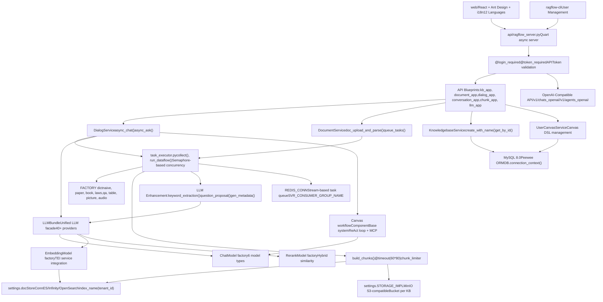
**Key Architectural Patterns:**

| Pattern | Implementation | Purpose |
| --- | --- | --- |
| Factory Pattern | `FACTORY` dict in [rag/svr/task\_executor.py83-100](https://github.com/infiniflow/ragflow/blob/80a16e71/rag/svr/task_executor.py#L83-L100) | Dynamic parser selection based on `ParserType` |
| Facade Pattern | `LLMBundle` class in [api/db/services/llm\_service.py](https://github.com/infiniflow/ragflow/blob/80a16e71/api/db/services/llm_service.py) | Unified interface for 40+ LLM providers |
| Service Layer | `*Service` classes inheriting from `CommonService` | Business logic encapsulation with Peewee ORM |
| Producer-Consumer | Redis Streams with `queue_producer()` / `queue_consumer()` | Decoupled async task processing |
| Repository Pattern | `CommonService.model` attribute pattern | Generic CRUD operations |
| Strategy Pattern | `ComponentBase` with `invoke()` / `invoke_async()` | Pluggable agent components |

**Layer-to-Code Mapping:**

| Layer | Primary Modules | Key Classes/Functions |
| --- | --- | --- |
| Frontend | `web/src/` | React components, `locales/` for i18n |
| API Gateway | `api/apps/*.py`, `api/ragflow_server.py` | `@manager.route()` blueprints, Quart app |
| Application | `api/db/services/*_service.py` | `DialogService`, `DocumentService`, `KnowledgebaseService` |
| Processing | `rag/svr/task_executor.py`, `rag/app/` | `collect()`, `build_chunks()`, parser modules |
| Intelligence | `rag/llm/`, `agent/` | `LLMBundle`, `ChatModel`, `Canvas` |
| Storage | `common/settings.py`, `api/db/db_models.py` | `docStoreConn`, `STORAGE_IMPL`, `REDIS_CONN` |

Sources: [rag/svr/task\_executor.py83-100](https://github.com/infiniflow/ragflow/blob/80a16e71/rag/svr/task_executor.py#L83-L100) [api/db/services/dialog\_service.py50-52](https://github.com/infiniflow/ragflow/blob/80a16e71/api/db/services/dialog_service.py#L50-L52) [api/db/services/llm\_service.py](https://github.com/infiniflow/ragflow/blob/80a16e71/api/db/services/llm_service.py) [api/ragflow\_server.py](https://github.com/infiniflow/ragflow/blob/80a16e71/api/ragflow_server.py) [README.md137-141](https://github.com/infiniflow/ragflow/blob/80a16e71/README.md#L137-L141) [common/settings.py](https://github.com/infiniflow/ragflow/blob/80a16e71/common/settings.py)

### Application Bootstrap and Service Discovery

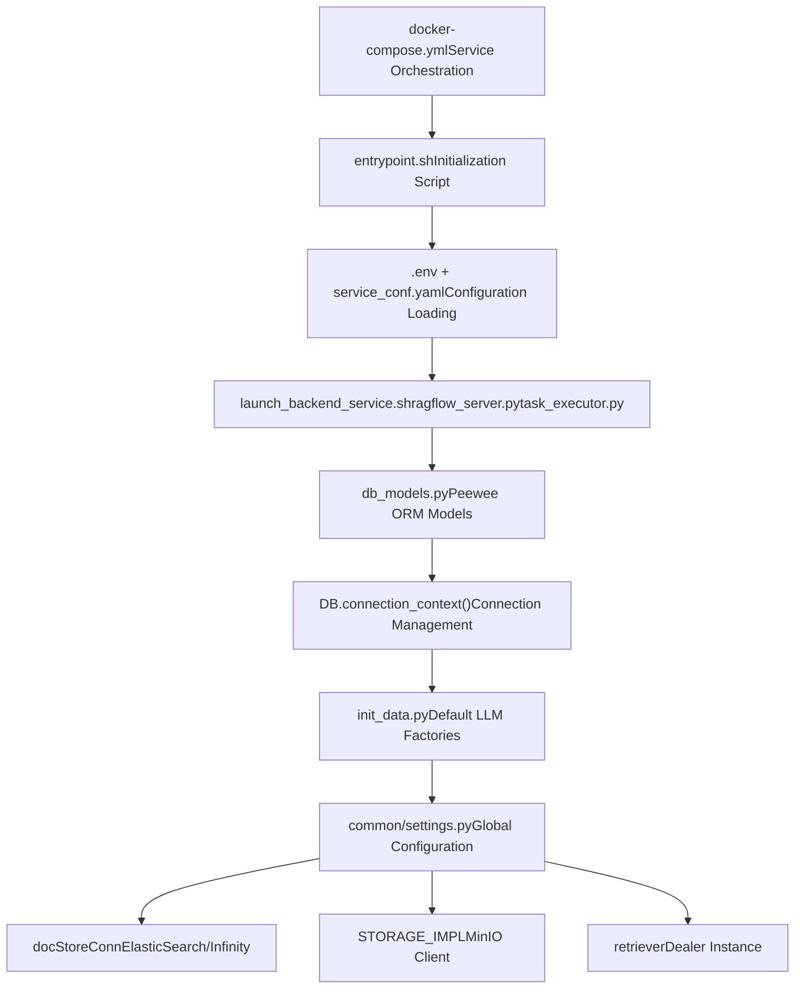
The system bootstraps through a multi-stage process:

1.  **Docker Compose** orchestrates service startup using `docker-compose.yml` with environment variables from `.env`
2.  **Entrypoint Script** (`entrypoint.sh`) initializes the runtime environment and waits for dependencies
3.  **Configuration Loading** merges `.env` variables into `service_conf.yaml.template`
4.  **Database Models** establish Peewee ORM connections to MySQL via `DB.connection_context()`
5.  **Service Discovery** populates `common/settings.py` with globally accessible service connections

Sources: [docker/docker-compose.yml](https://github.com/infiniflow/ragflow/blob/80a16e71/docker/docker-compose.yml) [docker/.env1-20](https://github.com/infiniflow/ragflow/blob/80a16e71/docker/.env#L1-L20) [api/db/db\_models.py30-43](https://github.com/infiniflow/ragflow/blob/80a16e71/api/db/db_models.py#L30-L43) [common/settings.py](https://github.com/infiniflow/ragflow/blob/80a16e71/common/settings.py)

## Core Data Flow

### Document Ingestion and Indexing Pipeline

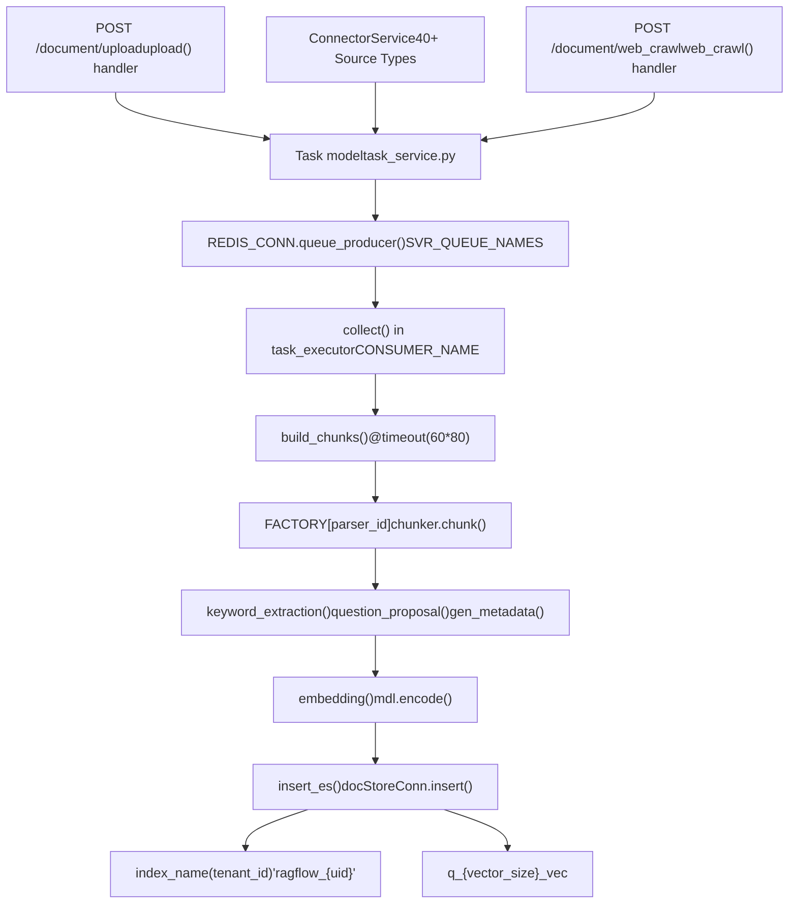
**Processing Stages:**

| Stage | Function | Concurrency Control | Timeout |
| --- | --- | --- | --- |
| Chunk Building | `build_chunks()` | `chunk_limiter` (Semaphore) | 80 minutes |
| Embedding | `embedding()` | `embed_limiter` (Semaphore) | 60 seconds |
| MinIO Upload | `upload_to_minio()` | `minio_limiter` (Semaphore) | 60 seconds |
| LLM Enhancement | `keyword_extraction()` | `chat_limiter` (Semaphore) | Configurable |

Sources: [rag/svr/task\_executor.py238-283](https://github.com/infiniflow/ragflow/blob/80a16e71/rag/svr/task_executor.py#L238-L283) [rag/svr/task\_executor.py564-615](https://github.com/infiniflow/ragflow/blob/80a16e71/rag/svr/task_executor.py#L564-L615) [rag/svr/task\_executor.py836-879](https://github.com/infiniflow/ragflow/blob/80a16e71/rag/svr/task_executor.py#L836-L879) [api/apps/document\_app.py52-96](https://github.com/infiniflow/ragflow/blob/80a16e71/api/apps/document_app.py#L52-L96)

### Query Processing and Response Generation

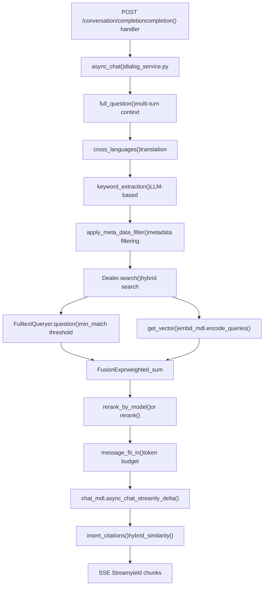
**Retrieval Configuration:**

The retrieval system uses hybrid search with configurable weights:

-   **Vector Similarity Weight** (`vector_similarity_weight`): Default 0.3
-   **Token Weight** (`tkweight`): Default 0.3 for text matching
-   **Similarity Threshold** (`similarity_threshold`): Default 0.2
-   **Top-K** (`top_k`): Number of chunks to retrieve before reranking
-   **Top-N** (`top_n`): Final number of chunks after reranking

Sources: [api/db/services/dialog\_service.py276-281](https://github.com/infiniflow/ragflow/blob/80a16e71/api/db/services/dialog_service.py#L276-L281) [api/db/services/dialog\_service.py342-362](https://github.com/infiniflow/ragflow/blob/80a16e71/api/db/services/dialog_service.py#L342-L362) [rag/nlp/search.py75-172](https://github.com/infiniflow/ragflow/blob/80a16e71/rag/nlp/search.py#L75-L172) [rag/nlp/search.py295-355](https://github.com/infiniflow/ragflow/blob/80a16e71/rag/nlp/search.py#L295-L355)

## Storage and Persistence

### Database Schema Organization

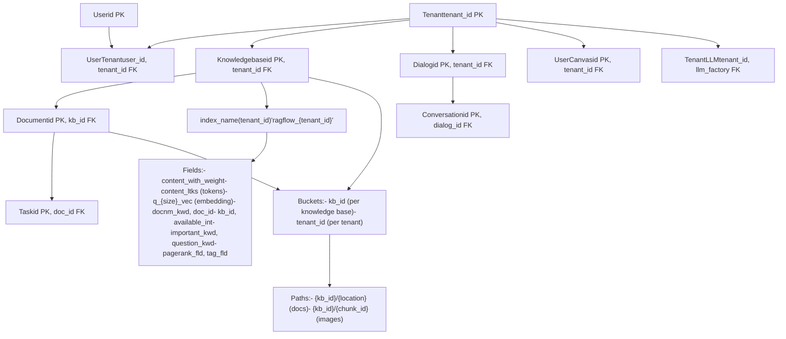
**Key Database Models:**

| Model | Primary Key | Key Fields | Purpose |
| --- | --- | --- | --- |
| `Knowledgebase` | `id` | `tenant_id`, `parser_id`, `embd_id` | Dataset configuration |
| `Document` | `id` | `kb_id`, `parser_config`, `chunk_num` | File metadata |
| `Task` | `id` | `doc_id`, `progress`, `from_page`, `to_page` | Processing status |
| `Dialog` | `id` | `kb_ids[]`, `llm_id`, `prompt_config` | Chat assistant config |
| `TenantLLM` | `(tenant_id, llm_factory, llm_name)` | `api_key`, `model_type` | LLM credentials |

Sources: [api/db/db\_models.py354-461](https://github.com/infiniflow/ragflow/blob/80a16e71/api/db/db_models.py#L354-L461) [rag/nlp/search.py34](https://github.com/infiniflow/ragflow/blob/80a16e71/rag/nlp/search.py#L34-L34) [common/settings.py](https://github.com/infiniflow/ragflow/blob/80a16e71/common/settings.py)

### Document Store Abstraction

RAGFlow supports multiple vector database backends through the `DocStoreConnection` abstraction:

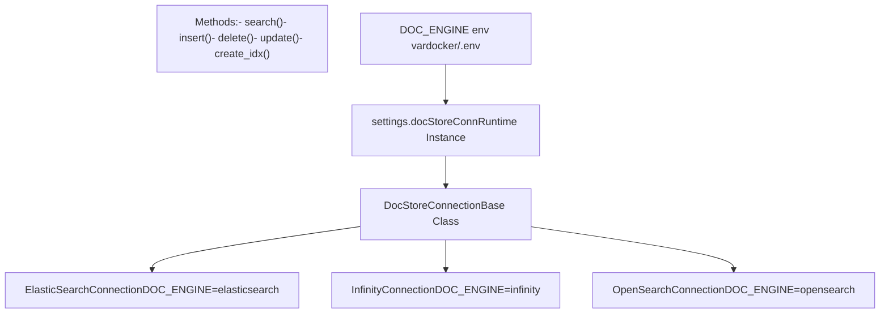
**Backend Selection:**

The document engine is selected at startup via the `DOC_ENGINE` environment variable in `.env`:

-   `elasticsearch` (default): Full-text + vector search via Elasticsearch 8.11.3
-   `infinity`: High-performance vector database
-   `opensearch`: AWS OpenSearch compatible

Sources: [docker/.env13-19](https://github.com/infiniflow/ragflow/blob/80a16e71/docker/.env#L13-L19) [common/doc\_store/doc\_store\_base.py](https://github.com/infiniflow/ragflow/blob/80a16e71/common/doc_store/doc_store_base.py) [README.md273-295](https://github.com/infiniflow/ragflow/blob/80a16e71/README.md#L273-L295)

## LLM Integration Architecture

### LLMBundle Facade and Multi-Provider System

**40+ Provider Integration via Factory Pattern:**

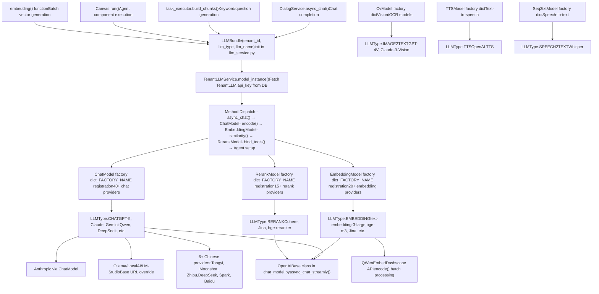
**Error Handling and Retry Logic:**

The `Base` class in [rag/llm/chat\_model.py65-244](https://github.com/infiniflow/ragflow/blob/80a16e71/rag/llm/chat_model.py#L65-L244) implements sophisticated error handling:

| Error Type | `LLMErrorCode` | Retry? | Backoff Strategy |
| --- | --- | --- | --- |
| Rate limit (429) | `ERROR_RATE_LIMIT` | Yes | Exponential with jitter |
| Server error (5xx) | `ERROR_SERVER` | Yes | Exponential with jitter |
| Auth error (401) | `ERROR_AUTHENTICATION` | No | Immediate fail |
| Invalid request (400) | `ERROR_INVALID_REQUEST` | No | Immediate fail |
| Timeout | `ERROR_TIMEOUT` | No | Immediate fail |
| Max retries exceeded | `ERROR_MAX_RETRIES` | No | After 5 attempts |

**Key Implementation Details:**

-   **Retry Configuration**: `max_retries=5`, `base_delay=2.0` seconds (configurable via `LLM_MAX_RETRIES`, `LLM_BASE_DELAY` env vars)
-   **Timeout**: Default 600 seconds per request (`LLM_TIMEOUT_SECONDS` env var)
-   **Tool Calling**: `bind_tools()` enables ReAct agent workflows with function calling
-   **Streaming**: `async_chat_streamly_delta()` yields incremental tokens via SSE
-   **Token Tracking**: `increase_usage()` updates per-tenant consumption in `TenantLLM` table

**Factory Registration Pattern:**

Each provider module defines a `_FACTORY_NAME` class attribute for auto-registration:

```
# Example from rag/llm/chat_model.py
class OpenAI_APIChat(Base):
    _FACTORY_NAME = ["VLLM", "OpenAI-API-Compatible"]

class QWenEmbed(Base):
    _FACTORY_NAME = "Tongyi-Qianwen"
```
The `rag/llm/__init__.py` module dynamically builds factory dictionaries via `MODULE_MAPPING`.

Sources: [api/db/services/llm\_service.py](https://github.com/infiniflow/ragflow/blob/80a16e71/api/db/services/llm_service.py) [rag/llm/chat\_model.py40-244](https://github.com/infiniflow/ragflow/blob/80a16e71/rag/llm/chat_model.py#L40-L244) [rag/llm/\_\_init\_\_.py25-145](https://github.com/infiniflow/ragflow/blob/80a16e71/rag/llm/__init__.py#L25-L145) [rag/llm/embedding\_model.py37-90](https://github.com/infiniflow/ragflow/blob/80a16e71/rag/llm/embedding_model.py#L37-L90) [api/db/services/tenant\_llm\_service.py](https://github.com/infiniflow/ragflow/blob/80a16e71/api/db/services/tenant_llm_service.py)

### Model Configuration and Initialization

The system initializes LLM factories from `llm_factories.json` during database setup:

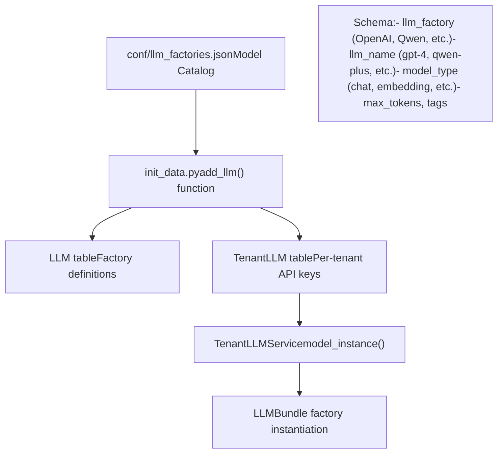
Sources: [conf/llm\_factories.json](https://github.com/infiniflow/ragflow/blob/80a16e71/conf/llm_factories.json) [api/db/init\_data.py](https://github.com/infiniflow/ragflow/blob/80a16e71/api/db/init_data.py) [api/db/services/tenant\_llm\_service.py](https://github.com/infiniflow/ragflow/blob/80a16e71/api/db/services/tenant_llm_service.py)

## Asynchronous Task Processing

### Redis-Based Task Queue

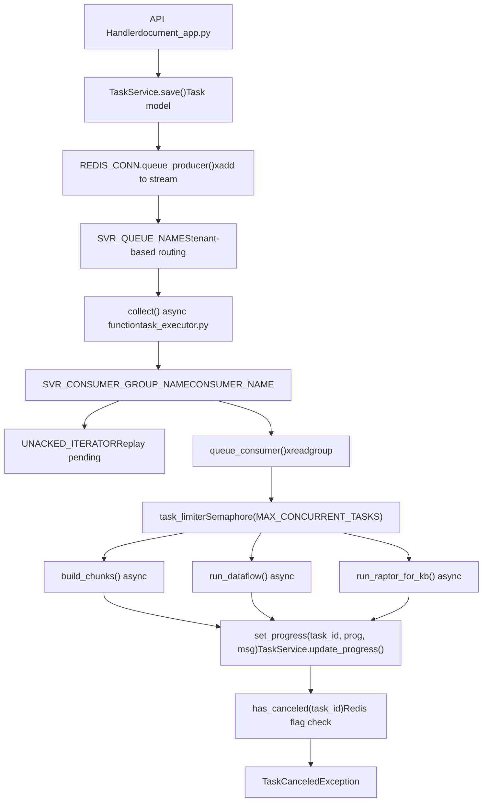
**Task Types and Routing:**

| Task Type | Queue Name | Handler Function | Purpose |
| --- | --- | --- | --- |
| `dataflow` | `PipelineTaskType.PARSE` | `run_dataflow()` | Custom pipeline execution |
| `raptor` | `PipelineTaskType.RAPTOR` | `run_raptor_for_kb()` | Hierarchical summarization |
| `graphrag` | `PipelineTaskType.GRAPH_RAG` | `run_graphrag_for_kb()` | Knowledge graph extraction |
| `mindmap` | `PipelineTaskType.MINDMAP` | `gen_mindmap()` | Mind map generation |
| `memory` | `PipelineTaskType.MEMORY` | `handle_save_to_memory_task()` | Conversation memory |

Sources: [rag/svr/task\_executor.py98-104](https://github.com/infiniflow/ragflow/blob/80a16e71/rag/svr/task_executor.py#L98-L104) [rag/svr/task\_executor.py169-230](https://github.com/infiniflow/ragflow/blob/80a16e71/rag/svr/task_executor.py#L169-L230) [rag/svr/task\_executor.py118-127](https://github.com/infiniflow/ragflow/blob/80a16e71/rag/svr/task_executor.py#L118-L127) [api/db/services/task\_service.py](https://github.com/infiniflow/ragflow/blob/80a16e71/api/db/services/task_service.py)

### Concurrency Control and Resource Management

The task executor implements fine-grained concurrency control:

```
# Semaphore-based rate limiting
task_limiter = asyncio.Semaphore(MAX_CONCURRENT_TASKS)  # Default: 5
chunk_limiter = asyncio.Semaphore(MAX_CONCURRENT_CHUNK_BUILDERS)  # Default: 1
embed_limiter = asyncio.Semaphore(MAX_CONCURRENT_CHUNK_BUILDERS)  # Default: 1
minio_limiter = asyncio.Semaphore(MAX_CONCURRENT_MINIO)  # Default: 10
kg_limiter = asyncio.Semaphore(2)  # Knowledge graph operations
chat_limiter = asyncio.Semaphore(...)  # LLM API calls

# Usage in async tasks
async with chunk_limiter:
    chunks = await asyncio.to_thread(chunker.chunk, ...)

async with embed_limiter:
    vectors, count = await asyncio.to_thread(mdl.encode, texts)
```
Sources: [rag/svr/task\_executor.py118-125](https://github.com/infiniflow/ragflow/blob/80a16e71/rag/svr/task_executor.py#L118-L125) [rag/svr/task\_executor.py264-276](https://github.com/infiniflow/ragflow/blob/80a16e71/rag/svr/task_executor.py#L264-L276) [rag/svr/task\_executor.py591-592](https://github.com/infiniflow/ragflow/blob/80a16e71/rag/svr/task_executor.py#L591-L592)

## Deployment and Infrastructure

### Docker Compose Service Topology

**Multi-Profile Container Orchestration:**

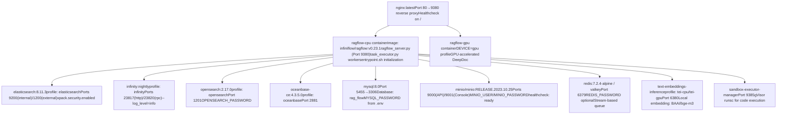
**Profile-Based Service Selection:**

The `COMPOSE_PROFILES` environment variable in [docker/.env13-28](https://github.com/infiniflow/ragflow/blob/80a16e71/docker/.env#L13-L28) determines which services start:

```
# docker/.env configuration
DOC_ENGINE=${DOC_ENGINE:-elasticsearch}  # elasticsearch|infinity|opensearch|oceanbase
DEVICE=${DEVICE:-cpu}                    # cpu|gpu
COMPOSE_PROFILES=${DOC_ENGINE},${DEVICE} # Comma-separated active profiles
```
**Service Dependencies and Healthchecks:**

| Service | Depends On | Health Check | Volume Mounts |
| --- | --- | --- | --- |
| `ragflow` | `mysql`, `redis`, `${DOC_ENGINE}`, `minio` | `/` endpoint | `./conf`, `./rag`, `./api` |
| `elasticsearch` | None | `curl -s http://localhost:9200` | `./es/data`, `./es/plugins` |
| `mysql` | None | `mysqladmin ping -h localhost` | `./mysql/data`, `./mysql/conf` |
| `minio` | None | `curl -f http://localhost:9000/minio/health/ready` | `./minio/data` |
| `redis` | None | `redis-cli ping` | `./redis/data` |

### Build Pipeline and Multi-Stage Docker

**Three-Stage Build Process:**

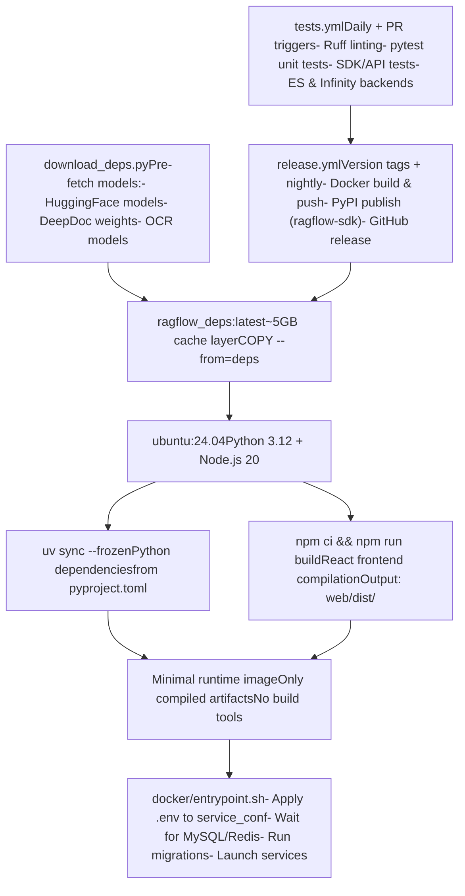
**Key Build Optimizations:**

-   **Dependency Caching**: `download_deps.py` creates a `ragflow_deps:latest` image with all models pre-fetched, avoiding repeated downloads
-   **Layer Reuse**: Multi-stage build separates compile-time dependencies from runtime
-   **Mirror Support**: For China deployments, use `HF_ENDPOINT=https://hf-mirror.com` to redirect HuggingFace downloads
-   **Platform Targeting**: `--platform linux/amd64` ensures x86 compatibility (ARM64 requires manual build)

**Dockerfile Structure:**

1.  **FROM deps**: Copy cached models and binaries
2.  **RUN uv sync**: Install Python dependencies via `uv` (faster than pip)
3.  **RUN npm ci**: Install exact frontend dependencies from lock file
4.  **RUN npm run build**: Compile React app with Vite bundler
5.  **COPY**: Copy only runtime files to final stage
6.  **ENTRYPOINT**: Execute `entrypoint.sh` initialization script

Sources: [docker/docker-compose.yml](https://github.com/infiniflow/ragflow/blob/80a16e71/docker/docker-compose.yml) [docker/.env13-28](https://github.com/infiniflow/ragflow/blob/80a16e71/docker/.env#L13-L28) [Dockerfile](https://github.com/infiniflow/ragflow/blob/80a16e71/Dockerfile) [docker/entrypoint.sh](https://github.com/infiniflow/ragflow/blob/80a16e71/docker/entrypoint.sh) [.github/workflows/tests.yml](https://github.com/infiniflow/ragflow/blob/80a16e71/.github/workflows/tests.yml) [.github/workflows/release.yml](https://github.com/infiniflow/ragflow/blob/80a16e71/.github/workflows/release.yml) [download\_deps.py](https://github.com/infiniflow/ragflow/blob/80a16e71/download_deps.py)

### Configuration Hierarchy

RAGFlow uses a three-tier configuration system:

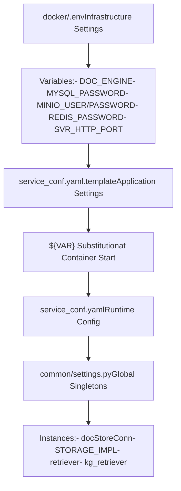
**Configuration Update Workflow:**

1.  Modify `.env` for infrastructure changes (ports, passwords)
2.  Update `service_conf.yaml.template` for application settings (LLM defaults, chunking)
3.  Restart containers: `docker compose -f docker-compose.yml up -d`
4.  Changes in `settings.py` require application code reload

Sources: [docker/.env1-10](https://github.com/infiniflow/ragflow/blob/80a16e71/docker/.env#L1-L10) [docker/service\_conf.yaml.template](https://github.com/infiniflow/ragflow/blob/80a16e71/docker/service_conf.yaml.template) [docker/README.md40-149](https://github.com/infiniflow/ragflow/blob/80a16e71/docker/README.md#L40-L149) [README.md252-271](https://github.com/infiniflow/ragflow/blob/80a16e71/README.md#L252-L271)

## Key Technologies and Integrations

### Technology Stack Summary

**Complete Technology Matrix:**

| Layer | Technologies | Key Libraries/Versions | Code Location |
| --- | --- | --- | --- |
| **Frontend** | React 18.3, TypeScript, Vite 6.0 | Ant Design 5.22, Tailwind CSS 3.4, i18next (12 languages) | `web/src/`, `web/locales/` |
| **Backend Framework** | Python 3.12, Quart 0.20.0 (async Flask) | Peewee 3.18 ORM, asyncio event loops | `api/ragflow_server.py`, `api/apps/` |
| **Task Processing** | Redis 7.2.4 Streams, asyncio.Semaphore | Consumer groups, concurrent.futures.ThreadPoolExecutor | `rag/svr/task_executor.py`, `rag/utils/redis_conn.py` |
| **LLM Integration** | 40+ providers across 6 model types | OpenAI SDK, httpx, litellm routing | `rag/llm/*.py`, `conf/llm_factories.json` |
| **Document Parsing** | 12 specialized parsers | DeepDoc (PyTorch), PaddleOCR, python-docx, pdfplumber | `rag/app/`, `deepdoc/` |
| **Embedding & Retrieval** | Text Embeddings Inference (TEI), FAISS | sentence-transformers, bge-m3 model | `rag/llm/embedding_model.py`, `rag/nlp/search.py` |
| **Vector Database** | Elasticsearch 8.11.3 / Infinity / OpenSearch 2.17 | Pluggable via `DocStoreConnection` interface | `common/doc_store/` |
| **Object Storage** | MinIO (S3-compatible) | boto3 client, multipart uploads | `common/settings.py`, `STORAGE_IMPL` |
| **Database** | MySQL 8.0 (Peewee ORM) | Connection pooling, migration support | `api/db/db_models.py` |
| **Agent Framework** | Canvas DSL executor, 20+ components | ReAct loop, MCP protocol support | `agent/`, `rag/flow/` |
| **Observability** | Langfuse tracing | OpenTelemetry compatible | `api/db/services/langfuse_service.py` |
| **Deployment** | Docker Compose, Kubernetes Helm charts | Multi-stage builds, profile-based orchestration | `docker/`, `helm/` |

**Version Compatibility:**

-   **Python**: 3.12+ (uses `asyncio` features from 3.11+)
-   **Node.js**: 20.x LTS (for web frontend build)
-   **Docker**: 24.0.0+ with Compose v2.26.1+
-   **gVisor**: Required only for sandbox code execution feature

Sources: [README.md108-136](https://github.com/infiniflow/ragflow/blob/80a16e71/README.md#L108-L136) [web/package.json](https://github.com/infiniflow/ragflow/blob/80a16e71/web/package.json) [pyproject.toml](https://github.com/infiniflow/ragflow/blob/80a16e71/pyproject.toml) [docker/docker-compose.yml](https://github.com/infiniflow/ragflow/blob/80a16e71/docker/docker-compose.yml) [README.md145-151](https://github.com/infiniflow/ragflow/blob/80a16e71/README.md#L145-L151)

### External Service Integrations

RAGFlow integrates with external services across multiple dimensions:

**Data Sources (40+ Connectors):**

-   Cloud storage: S3, R2, GCS, Azure Blob, Box, Dropbox
-   Collaboration: Confluence, Notion, Discord, Slack, Google Drive
-   Development: GitHub, GitLab, Jira, Bitbucket
-   Email: Gmail, IMAP
-   Other: Airtable, Asana, Zendesk, WebDAV

**AI Services:**

-   Embedding providers: OpenAI, Voyage, Cohere, Jina, etc.
-   LLM APIs: GPT-4, Claude, Gemini, Qwen, DeepSeek, etc.
-   Reranking: Cohere, Jina, Voyage, BGE
-   Local inference: Ollama, Xinference, LocalAI

**Observability:**

-   Langfuse integration for LLM tracing
-   Token usage tracking per tenant
-   Progress monitoring via Redis

Sources: [api/db/services/connector\_service.py](https://github.com/infiniflow/ragflow/blob/80a16e71/api/db/services/connector_service.py) [conf/llm\_factories.json](https://github.com/infiniflow/ragflow/blob/80a16e71/conf/llm_factories.json) [api/db/services/langfuse\_service.py](https://github.com/infiniflow/ragflow/blob/80a16e71/api/db/services/langfuse_service.py)

### Document Parser Ecosystem

RAGFlow implements a **12-strategy template-based chunking system** through the `FACTORY` dictionary mapping in [rag/svr/task\_executor.py83-100](https://github.com/infiniflow/ragflow/blob/80a16e71/rag/svr/task_executor.py#L83-L100):

**Parser Type System:**

| Parser Type | Module | `ParserType` Enum | Best For | Key Method |
| --- | --- | --- | --- | --- |
| `naive` | `rag.app.naive` | `NAIVE` | Plain text, simple PDFs | `chunk(binary, lang)` |
| `paper` | `rag.app.paper` | `PAPER` | Academic papers | Section detection, formula handling |
| `book` | `rag.app.book` | `BOOK` | Books, long-form | Chapter detection, TOC via `build_TOC()` |
| `presentation` | `rag.app.presentation` | `PRESENTATION` | PPT, PPTX, Keynote | Slide-by-slide parsing |
| `manual` | `rag.app.manual` | `MANUAL` | Technical manuals | Hierarchical structure |
| `laws` | `rag.app.laws` | `LAWS` | Legal documents | Article/clause numbering |
| `qa` | `rag.app.qa` | `QA` | FAQ, Q&A pairs | Question-answer extraction |
| `table` | `rag.app.table` | `TABLE` | Spreadsheets, CSV | Structured data extraction |
| `resume` | `rag.app.resume` | `RESUME` | CVs, resumes | Entity extraction (skills, experience) |
| `picture` | `rag.app.picture` | `PICTURE` | Images | OCR + vision model via `CvModel` |
| `one` | `rag.app.one` | `ONE` | OneNote | Notebook section parsing |
| `audio` | `rag.app.audio` | `AUDIO` | MP3, WAV | ASR via `Seq2txtModel` |
| `email` | `rag.app.email` | `EMAIL` | EML files | Header + body parsing |
| `tag` | `rag.app.tag` | `TAG` | Auto-tagging | `label_question()` for classification |

**Layout Recognition Backends:**

Each parser leverages vision models through the `CvModel` factory in [rag/llm/cv\_model.py](https://github.com/infiniflow/ragflow/blob/80a16e71/rag/llm/cv_model.py):

| Backend | Implementation | Purpose | Configuration |
| --- | --- | --- | --- |
| **DeepDoc** | In-house vision model | Default layout analysis | `deepdoc/` module |
| **MinerU** | External layout model | High-accuracy extraction | `parser_config.layout_recognize` |
| **Docling** | IBM Research analyzer | PDF document understanding | MinerU backend option |
| **PaddleOCR** | Baidu OCR engine | Text detection/recognition | `TextDetector`, `TextRecognizer` |
| **Vision LLMs** | GPT-4V, Claude-3-Vision | Image description | `CvModel.describe()` via `vision_llm_describe_prompt()` |

**Chunking Strategies:**

The system uses three text merging algorithms in parser implementations:

-   **`naive_merge()`**: Simple concatenation with token limits
-   **`hierarchical_merge()`**: XGBoost model-guided merging based on layout features
-   **`tree_merge()`**: Hierarchical tree-based chunk assembly

Sources: [rag/svr/task\_executor.py83-100](https://github.com/infiniflow/ragflow/blob/80a16e71/rag/svr/task_executor.py#L83-L100) [common/constants.py](https://github.com/infiniflow/ragflow/blob/80a16e71/common/constants.py) [rag/llm/cv\_model.py42-57](https://github.com/infiniflow/ragflow/blob/80a16e71/rag/llm/cv_model.py#L42-L57) [deepdoc/README.md](https://github.com/infiniflow/ragflow/blob/80a16e71/deepdoc/README.md) [rag/app/](https://github.com/infiniflow/ragflow/blob/80a16e71/rag/app/)

## System Scalability and Performance

### Horizontal Scaling Strategy

RAGFlow supports horizontal scaling through multiple mechanisms:

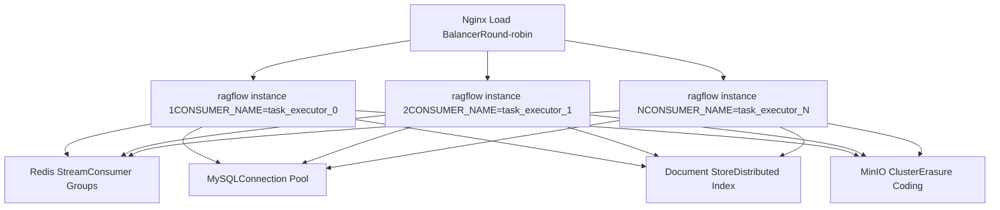
**Scaling Considerations:**

-   **Stateless API servers**: Multiple `ragflow_server.py` instances behind load balancer
-   **Consumer group coordination**: Redis Streams ensure each task processed once via `SVR_CONSUMER_GROUP_NAME`
-   **Database connection pooling**: Peewee with `PooledMySQLDatabase` / `PooledPostgresqlDatabase`
-   **Document store sharding**: Index-per-tenant pattern (`ragflow_{tenant_id}`) enables horizontal partitioning
-   **Object storage**: MinIO distributed mode with erasure coding

Sources: [rag/svr/task\_executor.py108-109](https://github.com/infiniflow/ragflow/blob/80a16e71/rag/svr/task_executor.py#L108-L109) [api/db/db\_models.py32](https://github.com/infiniflow/ragflow/blob/80a16e71/api/db/db_models.py#L32-L32) [rag/nlp/search.py34](https://github.com/infiniflow/ragflow/blob/80a16e71/rag/nlp/search.py#L34-L34) [docker/README.md](https://github.com/infiniflow/ragflow/blob/80a16e71/docker/README.md)

### Performance Optimization Techniques

**Batch Processing:**

-   Embedding batches: `EMBEDDING_BATCH_SIZE` chunks processed together
-   Document store bulk insert: `DOC_BULK_SIZE` for batch indexing
-   Concurrent uploads: `minio_limiter` allows parallel object storage

**Caching:**

-   LLM response cache: `get_llm_cache()` / `set_llm_cache()` for keyword extraction, questions
-   Tag cache: `get_tags_from_cache()` / `set_tags_to_cache()` for content tagging
-   Redis-based: Shared across consumer instances

**Resource Limits:**

-   Timeout decorators: `@timeout(seconds)` for critical functions
-   Memory limits: `MEM_LIMIT` in Docker Compose
-   Token budget: `message_fit_in()` truncates context to fit model limits

Sources: [rag/svr/task\_executor.py77](https://github.com/infiniflow/ragflow/blob/80a16e71/rag/svr/task_executor.py#L77-L77) [rag/svr/task\_executor.py341-348](https://github.com/infiniflow/ragflow/blob/80a16e71/rag/svr/task_executor.py#L341-L348) [api/db/services/dialog\_service.py458](https://github.com/infiniflow/ragflow/blob/80a16e71/api/db/services/dialog_service.py#L458-L458) [docker/.env63-64](https://github.com/infiniflow/ragflow/blob/80a16e71/docker/.env#L63-L64)
