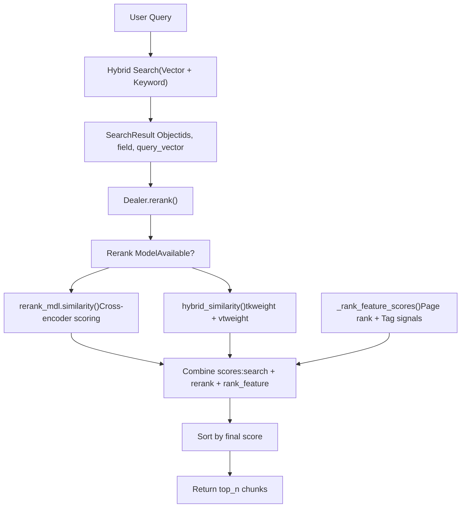
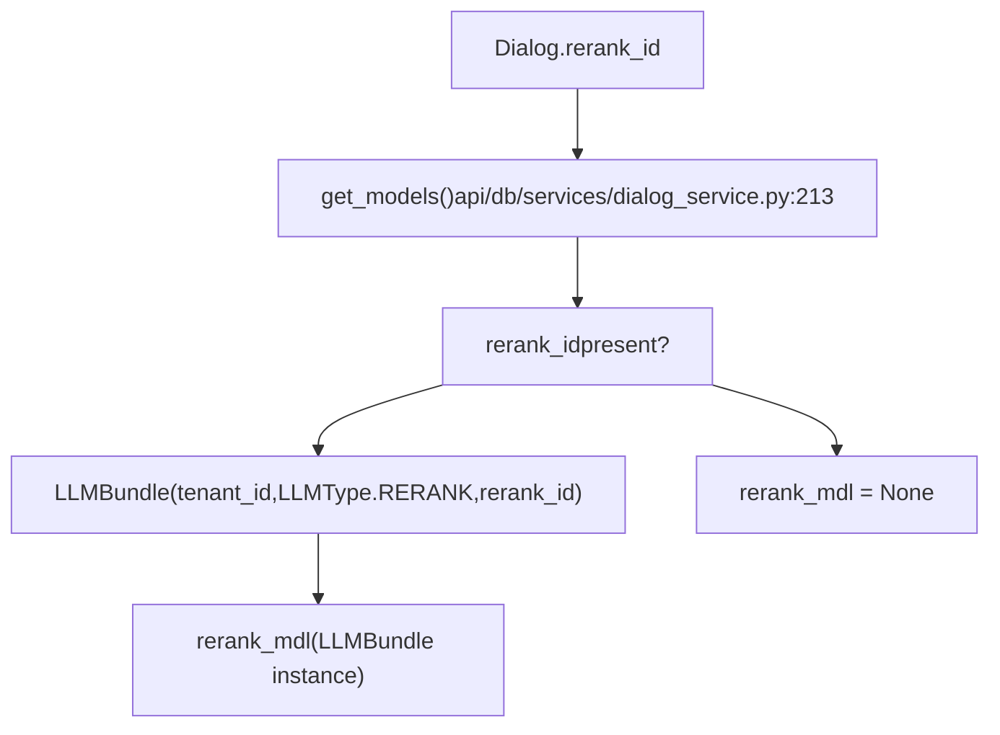
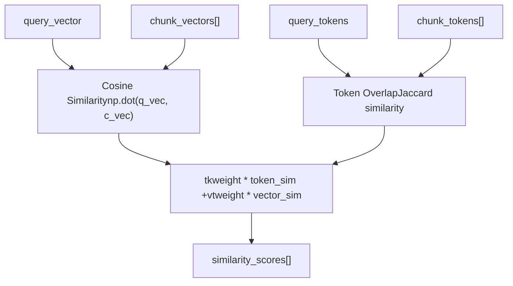
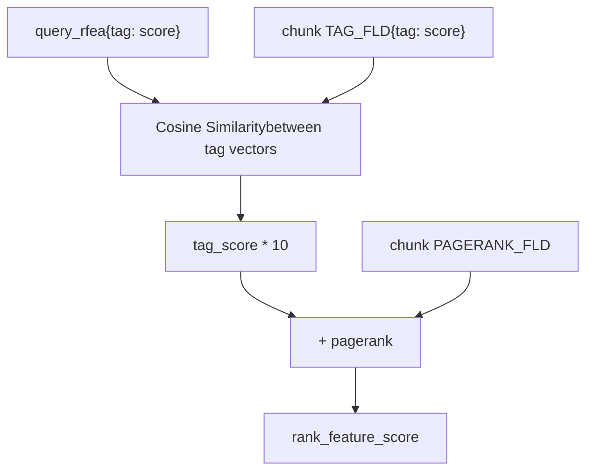
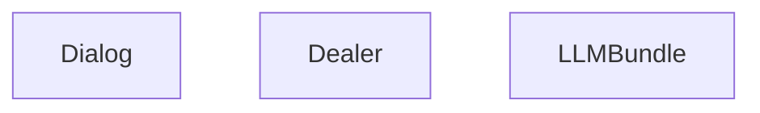
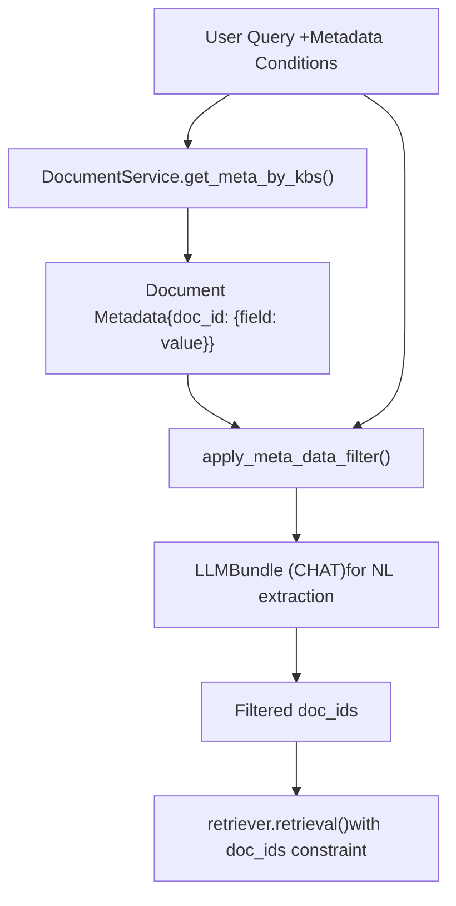
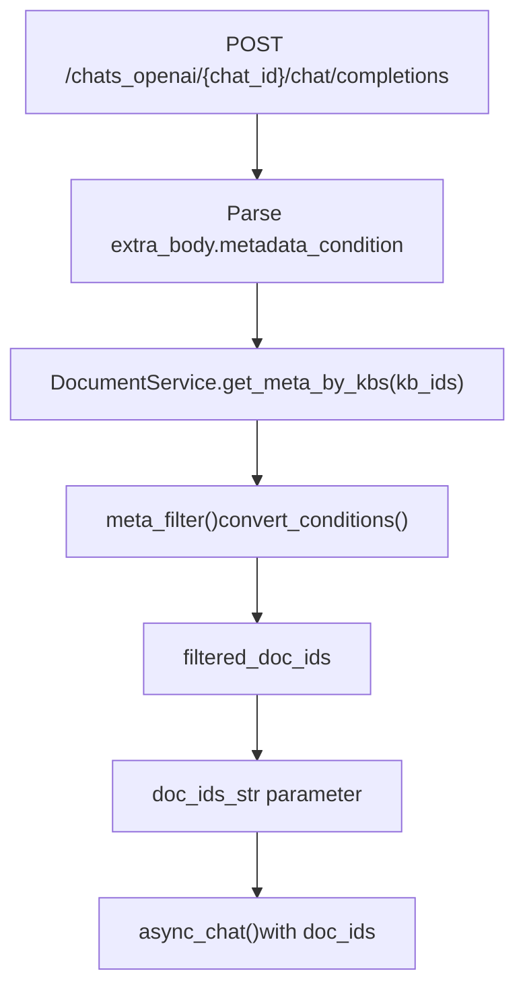
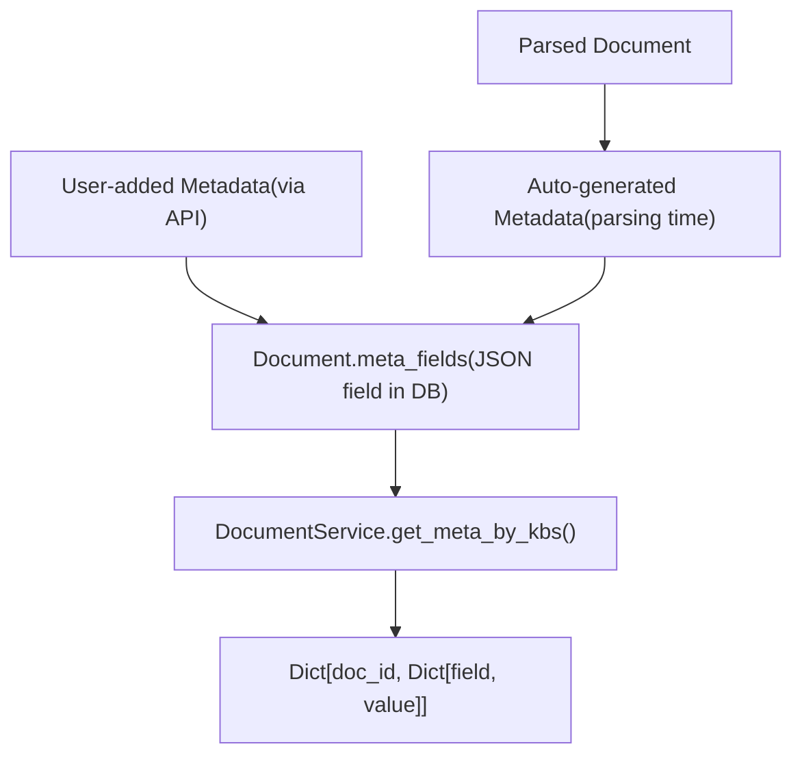
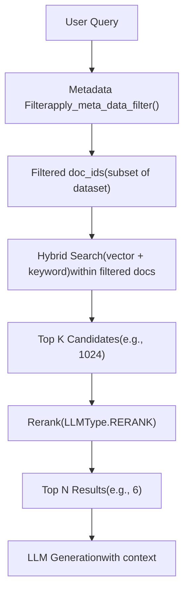

# Reranking and Metadata Filtering

Relevant source files

-   [agent/tools/retrieval.py](https://github.com/infiniflow/ragflow/blob/80a16e71/agent/tools/retrieval.py)
-   [api/apps/chunk\_app.py](https://github.com/infiniflow/ragflow/blob/80a16e71/api/apps/chunk_app.py)
-   [api/apps/conversation\_app.py](https://github.com/infiniflow/ragflow/blob/80a16e71/api/apps/conversation_app.py)
-   [api/apps/document\_app.py](https://github.com/infiniflow/ragflow/blob/80a16e71/api/apps/document_app.py)
-   [api/apps/file2document\_app.py](https://github.com/infiniflow/ragflow/blob/80a16e71/api/apps/file2document_app.py)
-   [api/apps/file\_app.py](https://github.com/infiniflow/ragflow/blob/80a16e71/api/apps/file_app.py)
-   [api/apps/kb\_app.py](https://github.com/infiniflow/ragflow/blob/80a16e71/api/apps/kb_app.py)
-   [api/apps/sdk/chat.py](https://github.com/infiniflow/ragflow/blob/80a16e71/api/apps/sdk/chat.py)
-   [api/apps/sdk/dataset.py](https://github.com/infiniflow/ragflow/blob/80a16e71/api/apps/sdk/dataset.py)
-   [api/apps/sdk/dify\_retrieval.py](https://github.com/infiniflow/ragflow/blob/80a16e71/api/apps/sdk/dify_retrieval.py)
-   [api/apps/sdk/doc.py](https://github.com/infiniflow/ragflow/blob/80a16e71/api/apps/sdk/doc.py)
-   [api/apps/sdk/session.py](https://github.com/infiniflow/ragflow/blob/80a16e71/api/apps/sdk/session.py)
-   [api/db/db\_models.py](https://github.com/infiniflow/ragflow/blob/80a16e71/api/db/db_models.py)
-   [api/db/services/canvas\_service.py](https://github.com/infiniflow/ragflow/blob/80a16e71/api/db/services/canvas_service.py)
-   [api/db/services/conversation\_service.py](https://github.com/infiniflow/ragflow/blob/80a16e71/api/db/services/conversation_service.py)
-   [api/db/services/dialog\_service.py](https://github.com/infiniflow/ragflow/blob/80a16e71/api/db/services/dialog_service.py)
-   [api/db/services/document\_service.py](https://github.com/infiniflow/ragflow/blob/80a16e71/api/db/services/document_service.py)
-   [api/db/services/file\_service.py](https://github.com/infiniflow/ragflow/blob/80a16e71/api/db/services/file_service.py)
-   [api/db/services/knowledgebase\_service.py](https://github.com/infiniflow/ragflow/blob/80a16e71/api/db/services/knowledgebase_service.py)
-   [api/db/services/task\_service.py](https://github.com/infiniflow/ragflow/blob/80a16e71/api/db/services/task_service.py)
-   [api/utils/api\_utils.py](https://github.com/infiniflow/ragflow/blob/80a16e71/api/utils/api_utils.py)
-   [docs/references/http\_api\_reference.md](https://github.com/infiniflow/ragflow/blob/80a16e71/docs/references/http_api_reference.md)
-   [docs/references/python\_api\_reference.md](https://github.com/infiniflow/ragflow/blob/80a16e71/docs/references/python_api_reference.md)
-   [docs/release\_notes.md](https://github.com/infiniflow/ragflow/blob/80a16e71/docs/release_notes.md)
-   [rag/advanced\_rag/\_\_init\_\_.py](https://github.com/infiniflow/ragflow/blob/80a16e71/rag/advanced_rag/__init__.py)
-   [rag/benchmark.py](https://github.com/infiniflow/ragflow/blob/80a16e71/rag/benchmark.py)
-   [rag/nlp/search.py](https://github.com/infiniflow/ragflow/blob/80a16e71/rag/nlp/search.py)
-   [rag/svr/task\_executor.py](https://github.com/infiniflow/ragflow/blob/80a16e71/rag/svr/task_executor.py)
-   [sdk/python/ragflow\_sdk/modules/chat.py](https://github.com/infiniflow/ragflow/blob/80a16e71/sdk/python/ragflow_sdk/modules/chat.py)
-   [sdk/python/ragflow\_sdk/ragflow.py](https://github.com/infiniflow/ragflow/blob/80a16e71/sdk/python/ragflow_sdk/ragflow.py)

## Purpose and Scope

This document describes RAGFlow's reranking and metadata filtering mechanisms, which are applied after hybrid vector-keyword search to refine retrieval results. Reranking reorders chunks by relevance using specialized LLM models, while metadata filtering allows selective retrieval based on document attributes. Together, these features improve answer precision by focusing on the most relevant and contextually appropriate content.

For information about the initial hybrid search that precedes reranking, see [Hybrid Search Architecture](/infiniflow/ragflow/10.2-hybrid-search-architecture). For the final response generation using filtered results, see [Response Generation and Citations](/infiniflow/ragflow/10.4-response-generation-and-citations).

---

## Reranking System

### Overview

Reranking is an optional post-retrieval step that reorders chunks returned by hybrid search. RAGFlow supports two reranking approaches:

1.  **Model-based Reranking**: Uses dedicated rerank models (cross-encoders) via `LLMBundle` with `LLMType.RERANK`
2.  **Hybrid Similarity Reranking**: Combines token-based and vector-based similarity scoring without external models

The reranking logic is implemented in the `Dealer.rerank()` method in [rag/nlp/search.py294-337](https://github.com/infiniflow/ragflow/blob/80a16e71/rag/nlp/search.py#L294-L337)

**Reranking Flow**


Sources: [rag/nlp/search.py294-337](https://github.com/infiniflow/ragflow/blob/80a16e71/rag/nlp/search.py#L294-L337) [api/db/services/dialog\_service.py398-411](https://github.com/infiniflow/ragflow/blob/80a16e71/api/db/services/dialog_service.py#L398-L411)

### Model-Based Reranking

RAGFlow supports rerank models through the `LLMBundle` abstraction with `LLMType.RERANK`. Supported rerankers include:

| Provider | Example Models |
| --- | --- |
| Jina | `jina-reranker-v2-base-multilingual` |
| Xinference | Local deployment |
| LocalAI | Self-hosted models |
| Cohere | `rerank-english-v3.0` |
| Voyage | `rerank-2` |
| BaiduYiyan | `bce-reranker-base_v1` |

**Model Instantiation Flow**


The rerank model provides a `similarity(query, texts)` method that returns:

-   `rank`: NumPy array of relevance scores (one per text)
-   `token_count`: Number of tokens consumed

**Rerank Model Interface**

All rerank models implement the `Base` class in [rag/llm/rerank\_model.py28-38](https://github.com/infiniflow/ragflow/blob/80a16e71/rag/llm/rerank_model.py#L28-L38):

```
class Base(ABC):
    def similarity(self, query: str, texts: list):
        # Returns: (rank_scores, token_count)
        raise NotImplementedError("Please implement encode method!")
```
Sources: [rag/llm/rerank\_model.py40-58](https://github.com/infiniflow/ragflow/blob/80a16e71/rag/llm/rerank_model.py#L40-L58) [rag/llm/rerank\_model.py61-90](https://github.com/infiniflow/ragflow/blob/80a16e71/rag/llm/rerank_model.py#L61-L90) [api/db/services/dialog\_service.py230-231](https://github.com/infiniflow/ragflow/blob/80a16e71/api/db/services/dialog_service.py#L230-L231)

### Hybrid Similarity Reranking

When no rerank model is configured, RAGFlow uses hybrid similarity scoring that combines token overlap and vector similarity. This method is implemented in `FulltextQueryer.hybrid_similarity()` [rag/nlp/search.py155-182](https://github.com/infiniflow/ragflow/blob/80a16e71/rag/nlp/search.py#L155-L182)

**Hybrid Similarity Calculation**


**Parameters**

| Parameter | Type | Default | Description |
| --- | --- | --- | --- |
| `tkweight` | `float` | `0.3` | Token similarity weight |
| `vtweight` | `float` | `0.7` | Vector similarity weight |
| `cfield` | `str` | `"content_ltks"` | Content field to rerank |

The weights are derived from `dialog.vector_similarity_weight`:

-   `vtweight = vector_similarity_weight`
-   `tkweight = 1 - vector_similarity_weight`

Sources: [rag/nlp/search.py294-337](https://github.com/infiniflow/ragflow/blob/80a16e71/rag/nlp/search.py#L294-L337) [api/db/services/dialog\_service.py467-468](https://github.com/infiniflow/ragflow/blob/80a16e71/api/db/services/dialog_service.py#L467-L468)

### Integration Points

Reranking is integrated at three primary levels:

#### 1\. Chat Retrieval (async\_chat)

In the `async_chat()` function, the rerank model is passed to the retriever's `retrieval()` method:

| Parameter | Type | Description |
| --- | --- | --- |
| `rerank_mdl` | `LLMBundle` or `None` | Rerank model instance |
| `rank_feature` | `dict` | Tag-based ranking features from `label_question()` |

The retriever calls `Dealer.rerank()` internally to apply reranking.

Sources: [api/db/services/dialog\_service.py391-411](https://github.com/infiniflow/ragflow/blob/80a16e71/api/db/services/dialog_service.py#L391-L411)

#### 2\. Direct Search (async\_ask)

The `async_ask()` function provides a standalone search interface with optional reranking:

```
rerank_mdl = None
if rerank_id:
    rerank_mdl = LLMBundle(tenant_id, LLMType.RERANK, rerank_id)

kbinfos = retriever.retrieval(
    question=question,
    embd_mdl=embd_mdl,
    tenant_ids=tenant_ids,
    kb_ids=kb_ids,
    page=1,
    page_size=12,
    similarity_threshold=search_config.get("similarity_threshold", 0.1),
    vector_similarity_weight=search_config.get("vector_similarity_weight", 0.3),
    top=search_config.get("top_k", 1024),
    doc_ids=doc_ids,
    aggs=True,
    rerank_mdl=rerank_mdl,
    rank_feature=label_question(question, kbs)
)
```
Sources: [api/db/services/dialog\_service.py736-775](https://github.com/infiniflow/ragflow/blob/80a16e71/api/db/services/dialog_service.py#L736-L775)

#### 3\. Agent Retrieval Component

The Retrieval component in the Agent system supports reranking through the `rerank_id` parameter:

**Retrieval Component Parameters**

| Field | Type | Default | Description |
| --- | --- | --- | --- |
| `rerank_id` | `str` | `""` | Rerank model identifier |
| `similarity_threshold` | `float` | `0.2` | Minimum similarity score |
| `top_n` | `int` | `8` | Number of chunks to return |
| `top_k` | `int` | `1024` | Candidate pool size before reranking |

Sources: [agent/tools/retrieval.py36-70](https://github.com/infiniflow/ragflow/blob/80a16e71/agent/tools/retrieval.py#L36-L70)

### Page Rank and Tag Signals

Beyond reranking, RAGFlow adds two additional signals to improve result ranking:

#### 1\. Page Rank Scoring

Documents can have a `pagerank` value stored in the `PAGERANK_FLD` field. This is a static document-level quality score that's added to the final ranking.

#### 2\. Tag-Based Ranking

The `_rank_feature_scores()` method [rag/nlp/search.py267-292](https://github.com/infiniflow/ragflow/blob/80a16e71/rag/nlp/search.py#L267-L292) computes tag-based relevance:

**Tag Scoring Algorithm**


Query tags (`rank_feature`) are generated by `label_question()` from [rag/app/tag.py](https://github.com/infiniflow/ragflow/blob/80a16e71/rag/app/tag.py) which:

1.  Tokenizes the question
2.  Extracts important terms
3.  Assigns weights based on IDF and POS tags

The final ranking combines three components:

```
final_score = search_score + rerank_score + rank_feature_score
```
Sources: [rag/nlp/search.py267-292](https://github.com/infiniflow/ragflow/blob/80a16e71/rag/nlp/search.py#L267-L292) [api/db/services/dialog\_service.py405](https://github.com/infiniflow/ragflow/blob/80a16e71/api/db/services/dialog_service.py#L405-L405)

### Configuration

Reranking is configured at the dialog/chat level:

**Dialog Configuration Structure**


**API Configuration Examples**

Via HTTP API:

```
{
  "name": "My Chat",
  "llm": {
    "model_name": "gpt-4o"
  },
  "prompt": {
    "similarity_threshold": 0.2,
    "keywords_similarity_weight": 0.3,
    "top_n": 6,
    "top_k": 1024,
    "rerank_model": "BAAI/bge-reranker-v2-m3"
  }
}
```
Via Python SDK:

```
rag.create_chat(
    name="My Chat",
    llm={"model_name": "gpt-4"},
    prompt={
        "rerank_model": "BAAI/bge-reranker-v2-m3",
        "top_n": 6,
        "keywords_similarity_weight": 0.3
    }
)
```
Sources: [api/apps/sdk/chat.py27-89](https://github.com/infiniflow/ragflow/blob/80a16e71/api/apps/sdk/chat.py#L27-L89) [docs/references/http\_api\_reference.md48-77](https://github.com/infiniflow/ragflow/blob/80a16e71/docs/references/http_api_reference.md#L48-L77) [rag/nlp/search.py294-337](https://github.com/infiniflow/ragflow/blob/80a16e71/rag/nlp/search.py#L294-L337)

---

## Metadata Filtering System

### Overview

Metadata filtering allows selective document/chunk retrieval based on structured attributes (metadata fields) extracted during parsing or manually added. Filters are expressed as logical conditions that can be evaluated against document metadata before retrieval or applied to filter search results.

**Metadata Filter Architecture**


Sources: [api/db/services/dialog\_service.py351-359](https://github.com/infiniflow/ragflow/blob/80a16e71/api/db/services/dialog_service.py#L351-L359)

### Filter Structure

Metadata filters consist of conditions combined with boolean logic:

**Filter Schema**

| Field | Type | Description |
| --- | --- | --- |
| `logic` | `"and"` or `"or"` | How to combine conditions |
| `conditions` | `list[Condition]` | List of individual conditions |

**Condition Schema**

| Field | Type | Description |
| --- | --- | --- |
| `name` | `str` | Metadata field name |
| `comparison_operator` | `str` | Operator (see below) |
| `value` | `str` or `list` | Comparison value(s) |

**Supported Operators**

| Operator | Description | Example |
| --- | --- | --- |
| `is` | Exact match | `{"name": "author", "comparison_operator": "is", "value": "bob"}` |
| `is_not` | Not equal | `{"name": "category", "comparison_operator": "is_not", "value": "draft"}` |
| `contains` | Substring match | `{"name": "title", "comparison_operator": "contains", "value": "report"}` |
| `not_contains` | Not a substring | `{"name": "title", "comparison_operator": "not_contains", "value": "archive"}` |
| `is_any_of` | In list | `{"name": "status", "comparison_operator": "is_any_of", "value": ["active", "pending"]}` |
| `is_not_any_of` | Not in list | `{"name": "type", "comparison_operator": "is_not_any_of", "value": ["draft", "deleted"]}` |

Sources: [docs/references/http\_api\_reference.md66-77](https://github.com/infiniflow/ragflow/blob/80a16e71/docs/references/http_api_reference.md#L66-L77)

### Application Points

Metadata filtering is applied at three distinct stages:

#### 1\. Pre-Retrieval Filtering (Dialog Level)

Filters stored in `dialog.meta_data_filter` are applied before retrieval to constrain the search space:

```
if dialog.meta_data_filter:
    metas = DocumentService.get_meta_by_kbs(dialog.kb_ids)
    attachments = await apply_meta_data_filter(
        dialog.meta_data_filter,
        metas,
        questions[-1],
        chat_mdl,
        attachments,
    )
```
The `apply_meta_data_filter()` function:

1.  Retrieves all document metadata for the specified knowledge bases
2.  Evaluates filter conditions against metadata
3.  Optionally uses the chat model to extract values from natural language queries
4.  Returns a list of `doc_ids` that match the filter
5.  These `doc_ids` are passed to `retriever.retrieval()` as a constraint

Sources: [api/db/services/dialog\_service.py351-359](https://github.com/infiniflow/ragflow/blob/80a16e71/api/db/services/dialog_service.py#L351-L359) [api/db/services/dialog\_service.py757-759](https://github.com/infiniflow/ragflow/blob/80a16e71/api/db/services/dialog_service.py#L757-L759)

#### 2\. API-Level Filtering (OpenAI-Compatible API)

The `/chats_openai/{chat_id}/chat/completions` endpoint accepts metadata conditions in `extra_body`:

```
{
  "model": "model",
  "messages": [{"role": "user", "content": "Query"}],
  "extra_body": {
    "metadata_condition": {
      "logic": "and",
      "conditions": [
        {
          "name": "author",
          "comparison_operator": "is",
          "value": "bob"
        }
      ]
    }
  }
}
```
**Processing Flow**


The conversion happens in two steps:

1.  `convert_conditions()`: Transforms API format to internal format
2.  `meta_filter()`: Evaluates conditions and returns matching doc\_ids

Sources: [api/apps/sdk/session.py271-286](https://github.com/infiniflow/ragflow/blob/80a16e71/api/apps/sdk/session.py#L271-L286) [api/apps/sdk/session.py140-157](https://github.com/infiniflow/ragflow/blob/80a16e71/api/apps/sdk/session.py#L140-L157)

#### 3\. Document Listing Filters

Document list endpoints support metadata filtering to show only matching documents:

```
metadata_condition_raw = q.get("metadata_condition")
metadata_condition = {}
if metadata_condition_raw:
    try:
        metadata_condition = json.loads(metadata_condition_raw)
    except Exception:
        return get_error_data_result(message="metadata_condition must be valid JSON.")

doc_ids_filter = None
if metadata_condition:
    metas = DocumentService.get_flatted_meta_by_kbs([dataset_id])
    doc_ids_filter = meta_filter(metas, convert_conditions(metadata_condition), metadata_condition.get("logic", "and"))
    if metadata_condition.get("conditions") and not doc_ids_filter:
        return get_result(data={"total": 0, "docs": []})
```
Sources: [api/apps/sdk/doc.py555-574](https://github.com/infiniflow/ragflow/blob/80a16e71/api/apps/sdk/doc.py#L555-L574)

#### 4\. Chunk Retrieval Filters

The chunk retrieval API (`/api/v1/retrieval`) supports metadata filtering directly:

```
metadata_condition = req.get("metadata_condition", {})
if metadata_condition:
    metas = DocumentService.get_meta_by_kbs(kb_ids)
    doc_ids = meta_filter(
        metas,
        convert_conditions(metadata_condition),
        metadata_condition.get("logic", "and"),
    )
    if metadata_condition.get("conditions") and not doc_ids:
        doc_ids = ["-999"]  # No matches
```
Sources: [api/apps/chunk\_app.py244-259](https://github.com/infiniflow/ragflow/blob/80a16e71/api/apps/chunk_app.py#L244-L259)

### Metadata Extraction

Document metadata can come from multiple sources:

**Metadata Sources**


**Updating Metadata via API**

```
# HTTP API
PUT /api/v1/datasets/{dataset_id}/documents/{document_id}
{
  "meta_fields": {
    "author": "John Doe",
    "department": "Engineering",
    "classification": "internal"
  }
}
```
The system validates that `meta_fields` is a dictionary and updates it via `DocumentService.update_meta_fields()` [api/db/services/document\_service.py](https://github.com/infiniflow/ragflow/blob/80a16e71/api/db/services/document_service.py)

**Metadata Retrieval**

The `DocumentService.get_meta_by_kbs()` method retrieves all metadata for documents in specified knowledge bases. It returns a dictionary structure:

```
{
  "doc_id_1": {
    "author": "John Doe",
    "department": "Engineering"
  },
  "doc_id_2": {
    "author": "Jane Smith",
    "category": "policy"
  }
}
```
Sources: [api/apps/sdk/doc.py255-258](https://github.com/infiniflow/ragflow/blob/80a16e71/api/apps/sdk/doc.py#L255-L258) [api/db/services/dialog\_service.py346](https://github.com/infiniflow/ragflow/blob/80a16e71/api/db/services/dialog_service.py#L346-L346)

---

## Combined Usage: Reranking + Metadata Filtering

Reranking and metadata filtering work together in the retrieval pipeline:

**Complete Retrieval Flow**


**Execution Order**

1.  **Metadata Filtering**: Applied first to constrain search space
    -   Evaluates `meta_data_filter` conditions
    -   Produces `doc_ids` list
2.  **Hybrid Search**: Searches within filtered documents
    -   Vector similarity on embeddings
    -   Keyword matching on tokenized content
    -   Combines scores with `vector_similarity_weight`
3.  **Top-K Selection**: Retrieves candidate pool
    -   Default `top_k=1024` candidates
4.  **Reranking**: Reorders candidates by relevance
    -   Cross-encoder scoring
    -   Computationally expensive, applied to top-k only
5.  **Top-N Selection**: Final result set
    -   Default `top_n=6` chunks returned
    -   Used for LLM context

Sources: [api/db/services/dialog\_service.py351-412](https://github.com/infiniflow/ragflow/blob/80a16e71/api/db/services/dialog_service.py#L351-L412)

### Configuration Example

**Full Configuration with Both Features**

```
{
  "name": "Filtered Reranked Chat",
  "dataset_ids": ["kb1", "kb2"],
  "llm": {
    "model_name": "gpt-4o"
  },
  "prompt": {
    "similarity_threshold": 0.2,
    "keywords_similarity_weight": 0.3,
    "top_n": 6,
    "top_k": 1024,
    "rerank_model": "BAAI/bge-reranker-v2-m3"
  },
  "meta_data_filter": {
    "logic": "and",
    "conditions": [
      {
        "name": "department",
        "comparison_operator": "is",
        "value": "engineering"
      },
      {
        "name": "status",
        "comparison_operator": "is_any_of",
        "value": ["active", "pending"]
      }
    ]
  }
}
```
This configuration:

-   Filters to only documents where `department="engineering"` AND `status` is either "active" or "pending"
-   Performs hybrid search with 30% keyword weight
-   Retrieves top 1024 candidates
-   Reranks using BGE reranker
-   Returns top 6 chunks for generation

Sources: [api/apps/sdk/chat.py27-89](https://github.com/infiniflow/ragflow/blob/80a16e71/api/apps/sdk/chat.py#L27-L89) [docs/references/http\_api\_reference.md64-77](https://github.com/infiniflow/ragflow/blob/80a16e71/docs/references/http_api_reference.md#L64-L77)

---

## API Interface Summary

### HTTP API Endpoints

| Endpoint | Method | Metadata Support | Reranking Support |
| --- | --- | --- | --- |
| `/api/v1/chats_openai/{chat_id}/chat/completions` | POST | ✓ (extra\_body) | ✓ (chat config) |
| `/api/v1/chats/{chat_id}/completions` | POST | ✓ (body) | ✓ (chat config) |
| `/api/v1/retrieval` | POST | ✓ (body) | ✓ (params) |
| `/api/v1/datasets/{id}/documents` | GET | ✓ (query param) | ✗ |

**Metadata Condition Format (Consistent Across APIs)**

```
{
  "metadata_condition": {
    "logic": "and",
    "conditions": [
      {
        "name": "field_name",
        "comparison_operator": "is",
        "value": "field_value"
      }
    ]
  }
}
```
Sources: [docs/references/http\_api\_reference.md64-95](https://github.com/infiniflow/ragflow/blob/80a16e71/docs/references/http_api_reference.md#L64-L95) [api/apps/sdk/session.py271-286](https://github.com/infiniflow/ragflow/blob/80a16e71/api/apps/sdk/session.py#L271-L286)

### Python SDK

**Chunk Retrieval with Filters**

```
from ragflow_sdk import RAGFlow

rag = RAGFlow(api_key="<KEY>", base_url="http://localhost:9380")
dataset = rag.get_dataset(name="my_dataset")

# Retrieve with metadata filter and reranking
chunks = dataset.retrieve(
    question="What is the policy?",
    similarity_threshold=0.2,
    vector_similarity_weight=0.3,
    top_k=1024,
    rerank_id="BAAI/bge-reranker-v2-m3",
    metadata_condition={
        "logic": "and",
        "conditions": [
            {"name": "category", "comparison_operator": "is", "value": "policy"}
        ]
    }
)
```
Sources: [sdk/python/ragflow\_sdk/ragflow.py51-99](https://github.com/infiniflow/ragflow/blob/80a16e71/sdk/python/ragflow_sdk/ragflow.py#L51-L99) [docs/references/python\_api\_reference.md515-581](https://github.com/infiniflow/ragflow/blob/80a16e71/docs/references/python_api_reference.md#L515-L581)

### Agent Retrieval Component

The Retrieval component supports both features through its parameter interface:

**Component Parameters**

```
similarity_threshold: 0.2
keywords_similarity_weight: 0.5
top_n: 8
top_k: 1024
kb_ids: ["kb1", "kb2"]
rerank_id: "BAAI/bge-reranker-v2-m3"
meta_data_filter:
  logic: "and"
  conditions:
    - name: "author"
      comparison_operator: "is"
      value: "smith"
```
The component's `_retrieve_kb()` method:

1.  Applies metadata filter if configured
2.  Calls retrieval with rerank model
3.  Returns filtered and reranked chunks

Sources: [agent/tools/retrieval.py36-120](https://github.com/infiniflow/ragflow/blob/80a16e71/agent/tools/retrieval.py#L36-L120)

---

## Performance Considerations

### Reranking Impact

| Aspect | Model-Based Reranking | Hybrid Similarity Reranking |
| --- | --- | --- |
| **Latency** | +200-500ms per query | ~10-50ms |
| **Accuracy** | +5-15% precision improvement | +2-5% precision improvement |
| **Cost** | Additional API calls for cloud models | No additional cost |
| **When to Use** | High-precision requirements | All scenarios (fallback) |

**Optimization Strategies**

1.  **Candidate Pool Size**: Reranking is applied only to `top_k` candidates (default 1024) returned by hybrid search, not the entire corpus
2.  **Batch Processing**: Rerank models process multiple chunks in a single API call
3.  **Caching**: Query vectors are reused if available in `SearchResult.query_vector`
4.  **Score Normalization**: Scores are normalized to \[0, 1\] range before combination [rag/nlp/search.py320-327](https://github.com/infiniflow/ragflow/blob/80a16e71/rag/nlp/search.py#L320-L327)

The `Dealer.rerank()` method handles score combination:

```
# Pseudo-code from rag/nlp/search.py:320-327
final_scores = []
for i, chunk_id in enumerate(chunk_ids):
    search_score = search_result.scores[i]
    rerank_score = rerank_scores[i] if rerank_mdl else hybrid_sim[i]
    rank_feature = rank_feature_scores[i]
    final_scores.append(search_score + rerank_score * 0.5 + rank_feature)
```
Sources: [rag/nlp/search.py294-337](https://github.com/infiniflow/ragflow/blob/80a16e71/rag/nlp/search.py#L294-L337) [rag/nlp/search.py267-292](https://github.com/infiniflow/ragflow/blob/80a16e71/rag/nlp/search.py#L267-L292)

### Metadata Filtering Impact

| Aspect | Effect |
| --- | --- |
| **Latency** | Minimal (<50ms) for simple filters |
| **Accuracy** | Eliminates irrelevant documents entirely |
| **Index Size** | Reduces effective search space |
| **When to Use** | Multi-tenant scenarios, time-based filtering, access control |

**Optimization**:

-   Metadata filters are evaluated in-memory after loading metadata
-   For large datasets, consider indexing metadata fields
-   Use `logic: "and"` for faster evaluation (short-circuits on first failure)

Sources: [api/db/services/dialog\_service.py351-412](https://github.com/infiniflow/ragflow/blob/80a16e71/api/db/services/dialog_service.py#L351-L412) [docs/release\_notes.md275-277](https://github.com/infiniflow/ragflow/blob/80a16e71/docs/release_notes.md#L275-L277)

---

## Error Handling

### Reranking Errors

If rerank model initialization fails:

-   System logs warning
-   `rerank_mdl` remains `None`
-   Retrieval continues without reranking
-   No error returned to user

### Metadata Filtering Errors

**Invalid Filter Structure**

```
{
  "code": 102,
  "message": "metadata_condition must be an object."
}
```
**No Matching Documents**

-   If conditions match zero documents, system sets `doc_ids = ["-999"]`
-   Retrieval returns empty results
-   User receives empty answer with `empty_response` message

**Malformed JSON**

```
{
  "code": 102,
  "message": "metadata_condition must be valid JSON."
}
```
Sources: [api/apps/sdk/session.py271-274](https://github.com/infiniflow/ragflow/blob/80a16e71/api/apps/sdk/session.py#L271-L274) [api/apps/sdk/doc.py558-562](https://github.com/infiniflow/ragflow/blob/80a16e71/api/apps/sdk/doc.py#L558-L562)
