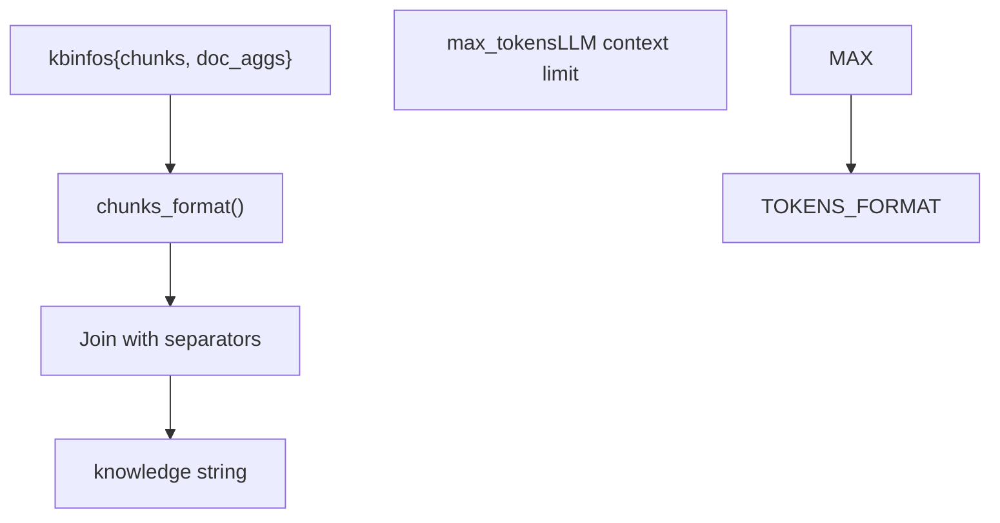
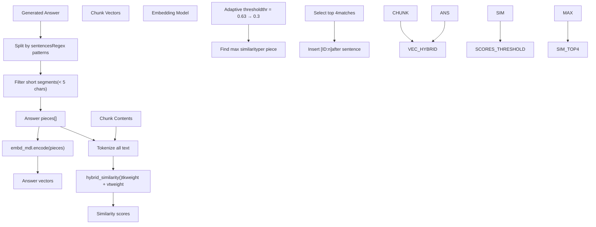
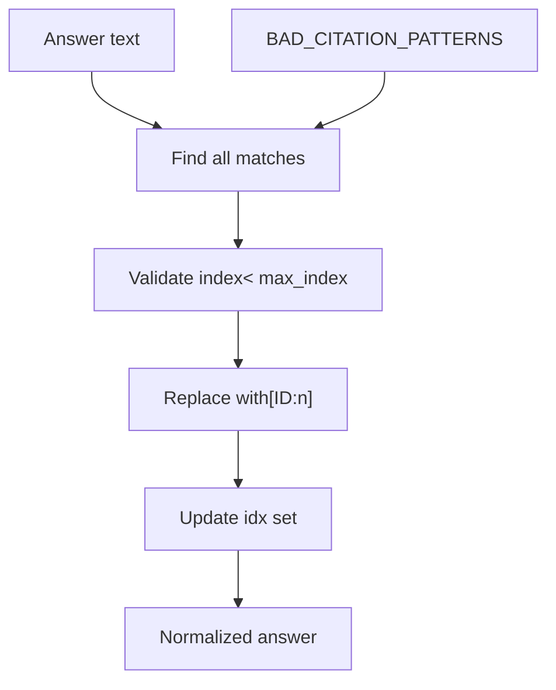
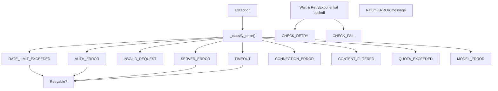

# Response Generation and Citations

Relevant source files

-   [agent/tools/retrieval.py](https://github.com/infiniflow/ragflow/blob/80a16e71/agent/tools/retrieval.py)
-   [api/apps/chunk\_app.py](https://github.com/infiniflow/ragflow/blob/80a16e71/api/apps/chunk_app.py)
-   [api/apps/conversation\_app.py](https://github.com/infiniflow/ragflow/blob/80a16e71/api/apps/conversation_app.py)
-   [api/apps/document\_app.py](https://github.com/infiniflow/ragflow/blob/80a16e71/api/apps/document_app.py)
-   [api/apps/file2document\_app.py](https://github.com/infiniflow/ragflow/blob/80a16e71/api/apps/file2document_app.py)
-   [api/apps/file\_app.py](https://github.com/infiniflow/ragflow/blob/80a16e71/api/apps/file_app.py)
-   [api/apps/kb\_app.py](https://github.com/infiniflow/ragflow/blob/80a16e71/api/apps/kb_app.py)
-   [api/apps/sdk/chat.py](https://github.com/infiniflow/ragflow/blob/80a16e71/api/apps/sdk/chat.py)
-   [api/apps/sdk/dataset.py](https://github.com/infiniflow/ragflow/blob/80a16e71/api/apps/sdk/dataset.py)
-   [api/apps/sdk/dify\_retrieval.py](https://github.com/infiniflow/ragflow/blob/80a16e71/api/apps/sdk/dify_retrieval.py)
-   [api/apps/sdk/doc.py](https://github.com/infiniflow/ragflow/blob/80a16e71/api/apps/sdk/doc.py)
-   [api/apps/sdk/session.py](https://github.com/infiniflow/ragflow/blob/80a16e71/api/apps/sdk/session.py)
-   [api/db/db\_models.py](https://github.com/infiniflow/ragflow/blob/80a16e71/api/db/db_models.py)
-   [api/db/services/canvas\_service.py](https://github.com/infiniflow/ragflow/blob/80a16e71/api/db/services/canvas_service.py)
-   [api/db/services/conversation\_service.py](https://github.com/infiniflow/ragflow/blob/80a16e71/api/db/services/conversation_service.py)
-   [api/db/services/dialog\_service.py](https://github.com/infiniflow/ragflow/blob/80a16e71/api/db/services/dialog_service.py)
-   [api/db/services/document\_service.py](https://github.com/infiniflow/ragflow/blob/80a16e71/api/db/services/document_service.py)
-   [api/db/services/file\_service.py](https://github.com/infiniflow/ragflow/blob/80a16e71/api/db/services/file_service.py)
-   [api/db/services/knowledgebase\_service.py](https://github.com/infiniflow/ragflow/blob/80a16e71/api/db/services/knowledgebase_service.py)
-   [api/db/services/task\_service.py](https://github.com/infiniflow/ragflow/blob/80a16e71/api/db/services/task_service.py)
-   [api/utils/api\_utils.py](https://github.com/infiniflow/ragflow/blob/80a16e71/api/utils/api_utils.py)
-   [docs/references/http\_api\_reference.md](https://github.com/infiniflow/ragflow/blob/80a16e71/docs/references/http_api_reference.md)
-   [docs/references/python\_api\_reference.md](https://github.com/infiniflow/ragflow/blob/80a16e71/docs/references/python_api_reference.md)
-   [docs/release\_notes.md](https://github.com/infiniflow/ragflow/blob/80a16e71/docs/release_notes.md)
-   [rag/advanced\_rag/\_\_init\_\_.py](https://github.com/infiniflow/ragflow/blob/80a16e71/rag/advanced_rag/__init__.py)
-   [rag/benchmark.py](https://github.com/infiniflow/ragflow/blob/80a16e71/rag/benchmark.py)
-   [rag/nlp/search.py](https://github.com/infiniflow/ragflow/blob/80a16e71/rag/nlp/search.py)
-   [rag/svr/task\_executor.py](https://github.com/infiniflow/ragflow/blob/80a16e71/rag/svr/task_executor.py)
-   [sdk/python/ragflow\_sdk/modules/chat.py](https://github.com/infiniflow/ragflow/blob/80a16e71/sdk/python/ragflow_sdk/modules/chat.py)
-   [sdk/python/ragflow\_sdk/ragflow.py](https://github.com/infiniflow/ragflow/blob/80a16e71/sdk/python/ragflow_sdk/ragflow.py)

This page documents the final stage of RAGFlow's RAG pipeline: generating responses from the LLM using retrieved context and inserting citations that link generated text back to source chunks. This includes prompt construction, LLM invocation (streaming and non-streaming), automatic citation insertion through embedding similarity, citation format normalization, and answer decoration with metadata.

For information about the retrieval and reranking stages that precede response generation, see [Hybrid Search Architecture](/infiniflow/ragflow/10.2-hybrid-search-architecture) and [Reranking and Metadata Filtering](/infiniflow/ragflow/10.3-reranking-and-metadata-filtering). For details on how prompts are structured and templates are managed, see [Model Factory Pattern and Registration](/infiniflow/ragflow/5.1-model-factory-pattern-and-registration).

---

## Response Generation Pipeline

The response generation process in RAGFlow follows a multi-stage pipeline that transforms retrieved chunks and user queries into coherent, cited answers.

**Response Generation Flow Diagram**

Sources: [api/db/services/dialog\_service.py276-524](https://github.com/infiniflow/ragflow/blob/80a16e71/api/db/services/dialog_service.py#L276-L524)

---

## Prompt Construction and Knowledge Formatting

Before invoking the LLM, RAGFlow constructs a comprehensive prompt that includes system instructions, retrieved knowledge, and citation guidance.

### Knowledge Chunk Formatting

Retrieved chunks are formatted using the `kb_prompt()` function which converts raw chunk data into a structured format suitable for the LLM:


**Knowledge Formatting Process**

The formatting process includes:

-   Content extraction from `content_with_weight` field
-   Image handling for visual chunks
-   Token counting to respect context limits
-   Separator insertion between chunks

### Message Construction

The final message list is constructed by combining system prompts, knowledge, and conversation history:

| Component | Source | Processing |
| --- | --- | --- |
| System Prompt | `dialog.prompt_config["system"]` | Template rendering with `{knowledge}` placeholder |
| Citation Instructions | `citation_prompt()` | Added if `quote=True` in config |
| Knowledge Context | Retrieved chunks | Formatted via `kb_prompt()` |
| Conversation History | Previous messages | Filtered through `message_fit_in()` |
| User Query | Latest user message | Appended last |

The `message_fit_in()` function ensures the entire conversation fits within the LLM's token budget:

```
used_token_count, msg = message_fit_in(msg, int(max_tokens * 0.95))
```
Sources: [api/db/services/dialog\_service.py440-464](https://github.com/infiniflow/ragflow/blob/80a16e71/api/db/services/dialog_service.py#L440-L464) [rag/prompts/generator.py](https://github.com/infiniflow/ragflow/blob/80a16e71/rag/prompts/generator.py)

---

## LLM Response Generation

RAGFlow supports both streaming and non-streaming response generation modes, with automatic handling of tool calls, reasoning models, and error recovery.

### Streaming Response Generation

**Streaming Response Flow with Thinking Tags**

The streaming implementation yields partial responses incrementally:

```
async for kind, value, state in _stream_with_think_delta(stream_iter):
    if kind == "marker":
        flags = {"start_to_think": True} if value == "<think>" else {"end_to_think": True}
        yield {"answer": "", "reference": {}, "audio_binary": None, "final": False, **flags}
    else:
        yield {"answer": value, "reference": {}, "audio_binary": tts(tts_mdl, value), "final": False}
```
Sources: [api/db/services/dialog\_service.py183-212](https://github.com/infiniflow/ragflow/blob/80a16e71/api/db/services/dialog_service.py#L183-L212) [rag/llm/chat\_model.py138-196](https://github.com/infiniflow/ragflow/blob/80a16e71/rag/llm/chat_model.py#L138-L196)

### Non-Streaming Response Generation

For non-streaming mode, the `async_chat()` method waits for the complete response:

```
async def _async_chat(self, history, gen_conf, **kwargs):
    response = await self.async_client.chat.completions.create(
        model=self.model_name,
        messages=history,
        **gen_conf,
        **kwargs
    )
    ans = response.choices[0].message.content.strip()
    if response.choices[0].finish_reason == "length":
        ans = self._length_stop(ans)
    return ans, total_token_count_from_response(response)
```
The method handles special cases:

-   **Reasoning models** (QWQ models): Use streaming internally to filter `<think>` tags
-   **Length truncation**: Append language-specific truncation notice
-   **Empty responses**: Return error message

Sources: [rag/llm/chat\_model.py444-486](https://github.com/infiniflow/ragflow/blob/80a16e71/rag/llm/chat_model.py#L444-L486)

---

## Citation Insertion Mechanisms

RAGFlow employs two primary mechanisms for inserting citations into generated answers: regex-based detection for existing citations and embedding-based insertion for uncited text.

### Regex-Based Citation Detection

When the LLM already includes `[ID:n]` citations in its response, these are extracted and validated:

```
for match in re.finditer(r"\[ID:([0-9]+)\]", answer):
    i = int(match.group(1))
    if i < len(kbinfos["chunks"]):
        idx.add(i)
```
### Embedding-Based Citation Insertion

When citations are missing, the `insert_citations()` method uses hybrid similarity matching:


**Embedding-Based Citation Insertion Flow**

The hybrid similarity calculation combines:

-   **Vector similarity**: Cosine similarity between embeddings (controlled by `vtweight`)
-   **Token similarity**: Term overlap using tokenization (controlled by `tkweight`)

```
sim, tksim, vtsim = self.qryr.hybrid_similarity(
    ans_v[i],
    chunk_v,
    rag_tokenizer.tokenize(self.qryr.rmWWW(pieces_[i])).split(),
    chunks_tks,
    tkweight,
    vtweight
)
```
The algorithm uses adaptive thresholding:

```
thr = 0.63
while thr > 0.3 and len(cites.keys()) == 0:
    # Try to find citations with current threshold
    # If none found, reduce threshold by 20%
    thr *= 0.8
```
Sources: [rag/nlp/search.py178-266](https://github.com/infiniflow/ragflow/blob/80a16e71/rag/nlp/search.py#L178-L266) [api/db/services/dialog\_service.py475-492](https://github.com/infiniflow/ragflow/blob/80a16e71/api/db/services/dialog_service.py#L475-L492)

---

## Citation Format Normalization

RAGFlow normalizes various citation formats that LLMs might generate into the standard `[ID:n]` format.

### Recognized Citation Patterns

The system recognizes and repairs these bad citation formats:

| Pattern | Example | Regex |
| --- | --- | --- |
| Parenthesized ID | `(ID: 12)` or `(ID:12)` | `\(\s*ID\s*[: ]*\s*(\d+)\s*\)` |
| Bracketed ID | `[ID: 12]` or `[ID:12]` | `\[\s*ID\s*[: ]*\s*(\d+)\s*\]` |
| Chinese brackets | `【ID: 12】` | `【\s*ID\s*[: ]*\s*(\d+)\s*】` |
| Ref notation | `ref12` or `REF 12` | `ref\s*(\d+)` (case-insensitive) |

```
BAD_CITATION_PATTERNS = [
    re.compile(r"\(\s*ID\s*[: ]*\s*(\d+)\s*\)"),
    re.compile(r"\[\s*ID\s*[: ]*\s*(\d+)\s*\]"),
    re.compile(r"【\s*ID\s*[: ]*\s*(\d+)\s*】"),
    re.compile(r"ref\s*(\d+)", flags=re.IGNORECASE),
]
```
### Repair Process

The `repair_bad_citation_formats()` function performs in-place replacement:


**Citation Format Repair Flow**

For each pattern, the function:

1.  Finds all matches in the answer
2.  Extracts the numeric ID
3.  Validates the ID is within bounds (`0 <= i < len(chunks)`)
4.  Replaces with canonical `[ID:n]` format
5.  Adds the index to the citation set

Sources: [api/db/services/dialog\_service.py239-273](https://github.com/infiniflow/ragflow/blob/80a16e71/api/db/services/dialog_service.py#L239-L273)

---

## Answer Decoration and Metadata

After citation insertion, the `decorate_answer()` function enriches the response with references and performance metrics.

### Reference Filtering

Citations are used to filter the document list to only relevant sources:

```
idx = set([kbinfos["chunks"][int(i)]["doc_id"] for i in idx])
recall_docs = [d for d in kbinfos["doc_aggs"] if d["doc_id"] in idx]
if not recall_docs:
    recall_docs = kbinfos["doc_aggs"]  # Fallback to all docs
kbinfos["doc_aggs"] = recall_docs
```
This ensures that the returned references (`doc_aggs`) only include documents that were actually cited in the answer.

### Response Structure

The final response dictionary includes:

| Field | Type | Description |
| --- | --- | --- |
| `answer` | string | Generated text with citations |
| `reference` | dict | `{chunks: [...], doc_aggs: [...]}` with cited sources |
| `audio_binary` | bytes/None | TTS audio if enabled |
| `prompt` | string | Complete prompt sent to LLM (debug) |
| `created_at` | float | Timestamp |
| `final` | boolean | True for last message in stream |

### Performance Metrics

Timing information is added to the prompt field for debugging:

```
prompt = (
    f"{prompt}\n\n"
    "## Time elapsed:\n"
    f"  - Total: {total_time_cost:.1f}ms\n"
    f"  - Check LLM: {check_llm_time_cost:.1f}ms\n"
    f"  - Check Langfuse tracer: {check_langfuse_tracer_cost:.1f}ms\n"
    f"  - Bind embedding: {bind_embedding_time_cost:.1f}ms\n"
    f"  - Refine question: {refine_question_time_cost:.1f}ms\n"
    f"  - Retrieval: {retrieval_time_cost:.1f}ms\n"
    f"  - Generate result: {generate_result_time_cost:.1f}ms\n"
)
```
Sources: [api/db/services/dialog\_service.py465-541](https://github.com/infiniflow/ragflow/blob/80a16e71/api/db/services/dialog_service.py#L465-L541)

---

## Streaming Response Handling

RAGFlow's streaming implementation provides real-time feedback during long-running operations like Deep Research and tool calls.

### Stream Event Types

```mermaid
flowchart TD
    START_THINK["start_to_think: trueBegin reasoning"]
    END_THINK["end_to_think: trueEnd reasoning"]
    DELTA["answer: textContent delta"]
    FINAL["final: trueLast message"]
    TOKENS["answer: token_countUsage stats"]
    TOOL_START["Tool call started"]
    TOOL_RESULT["Tool execution result"]
    RESEARCH_START["Deep research begins"]
    RESEARCH_STEP["Research step update"]

    START --> THINK_DELTA
    DELTA --> TOOL_START
    TOOL --> START_TOOL_RESULT
    TOOL --> RESULT_RESEARCH_START
    RESEARCH --> START_RESEARCH_STEP
    RESEARCH --> STEP_END_THINK
    END --> THINK_FINAL
    FINAL --> TOKENS
```


**Streaming Event Sequence**

### Deep Research Streaming

For reasoning-intensive queries, the Deep Research mode streams progress updates:

```
await callback("<START_DEEP_RESEARCH>")
task = asyncio.create_task(reasoner.research(...))
while True:
    msg = await queue.get()
    if msg.find("<START_DEEP_RESEARCH>") == 0:
        yield {"answer": "", "reference": {}, "start_to_think": True}
    elif msg.find("<END_DEEP_RESEARCH>") == 0:
        yield {"answer": "", "reference": {}, "end_to_think": True}
        break
    else:
        yield {"answer": msg, "reference": {}, "final": False}
```
### Tool Call Streaming

When tool calling is enabled, the system streams tool execution details:

```
yield self._verbose_tool_use(name, args, "Begin to call...")
tool_response = await asyncio.to_thread(self.toolcall_session.tool_call, name, args)
yield self._verbose_tool_use(name, args, tool_response)
```
The `_verbose_tool_use()` method formats tool calls as JSON:

```
{
  "name": "tool_name",
  "args": {"param": "value"},
  "result": "tool output"
}
```
Sources: [api/db/services/dialog\_service.py388-405](https://github.com/infiniflow/ragflow/blob/80a16e71/api/db/services/dialog_service.py#L388-L405) [rag/llm/chat\_model.py333-442](https://github.com/infiniflow/ragflow/blob/80a16e71/rag/llm/chat_model.py#L333-L442)

---

## Error Handling and Recovery

The response generation system includes comprehensive error handling with retry logic and user-friendly error messages.

### Error Classification


**Error Classification and Retry Logic**

### Retryable Errors

Only specific error types trigger automatic retry:

```
@property
def _retryable_errors(self) -> set[str]:
    return {
        LLMErrorCode.ERROR_RATE_LIMIT,
        LLMErrorCode.ERROR_SERVER,
    }
```
The retry mechanism uses exponential backoff with jitter:

```
def _get_delay(self):
    return self.base_delay * random.uniform(10, 150)
```
### Error Message Format

Failed responses are prefixed with `**ERROR**` and include the error code and description:

```
msg = f"{ERROR_PREFIX}: {error_code} - {str(e)}"
```
For API key issues, a helpful hint is automatically appended:

```
if answer.lower().find("invalid key") >= 0 or answer.lower().find("invalid api") >= 0:
    answer += " Please set LLM API-Key in 'User Setting -> Model providers -> API-Key'"
```
### Length Truncation Handling

When responses are truncated due to token limits, a language-specific notice is added:

```
if response.choices[0].finish_reason == "length":
    if is_chinese(ans):
        ans += LENGTH_NOTIFICATION_CN
    else:
        ans += LENGTH_NOTIFICATION_EN
```
Where:

-   `LENGTH_NOTIFICATION_CN = "······\n由于大模型的上下文窗口大小限制，回答已经被大模型截断。"`
-   `LENGTH_NOTIFICATION_EN = "...\nThe answer is truncated by your chosen LLM due to its limitation on context length."`

Sources: [rag/llm/chat\_model.py81-243](https://github.com/infiniflow/ragflow/blob/80a16e71/rag/llm/chat_model.py#L81-L243) [api/db/services/dialog\_service.py505-507](https://github.com/infiniflow/ragflow/blob/80a16e71/api/db/services/dialog_service.py#L505-L507)

---

## Integration with Conversation Management

The response generation system integrates with conversation management for multi-turn dialogues.

### Message Structure

Conversations are stored with a structured message format:

```
conv = {
    "id": conv_id,
    "dialog_id": dialog_id,
    "name": name,
    "message": [
        {"role": "assistant", "content": dia.prompt_config["prologue"]},
        {"role": "user", "content": "User question"},
        {"role": "assistant", "content": "AI response with citations"}
    ],
    "reference": [
        {
            "chunks": [...],
            "doc_aggs": [...],
            "total": n
        }
    ]
}
```
### Citation Persistence

Citations are preserved across conversation turns by:

1.  Storing the full `reference` object with each assistant message
2.  Maintaining document IDs in the citation set
3.  Filtering `doc_aggs` to only include cited documents

This allows the UI to display source references alongside historical messages.

### Multi-Turn Context

For multi-turn conversations, the `message_fit_in()` function ensures older messages are preserved:

```
def message_fit_in(msg, max_length):
    # Keep system message and last user message
    # Truncate middle messages if needed
    # Return used_token_count and trimmed message list
```
Sources: [api/db/services/dialog\_service.py458-461](https://github.com/infiniflow/ragflow/blob/80a16e71/api/db/services/dialog_service.py#L458-L461) [api/db/services/conversation\_service.py](https://github.com/infiniflow/ragflow/blob/80a16e71/api/db/services/conversation_service.py)

---

## Code Entity Reference

### Key Classes and Functions

| Entity | Location | Purpose |
| --- | --- | --- |
| `async_chat()` | [api/db/services/dialog\_service.py276-541](https://github.com/infiniflow/ragflow/blob/80a16e71/api/db/services/dialog_service.py#L276-L541) | Main orchestration function |
| `decorate_answer()` | [api/db/services/dialog\_service.py465-541](https://github.com/infiniflow/ragflow/blob/80a16e71/api/db/services/dialog_service.py#L465-L541) | Add citations and metadata |
| `insert_citations()` | [rag/nlp/search.py178-266](https://github.com/infiniflow/ragflow/blob/80a16e71/rag/nlp/search.py#L178-L266) | Embedding-based citation insertion |
| `repair_bad_citation_formats()` | [api/db/services/dialog\_service.py247-273](https://github.com/infiniflow/ragflow/blob/80a16e71/api/db/services/dialog_service.py#L247-L273) | Normalize citation formats |
| `kb_prompt()` | [rag/prompts/generator.py](https://github.com/infiniflow/ragflow/blob/80a16e71/rag/prompts/generator.py) | Format retrieved chunks |
| `citation_prompt()` | [rag/prompts/generator.py](https://github.com/infiniflow/ragflow/blob/80a16e71/rag/prompts/generator.py) | Generate citation instructions |
| `Base.async_chat()` | [rag/llm/chat\_model.py474-486](https://github.com/infiniflow/ragflow/blob/80a16e71/rag/llm/chat_model.py#L474-L486) | Non-streaming LLM call |
| `Base.async_chat_streamly()` | [rag/llm/chat\_model.py174-196](https://github.com/infiniflow/ragflow/blob/80a16e71/rag/llm/chat_model.py#L174-L196) | Streaming LLM call |
| `LLMBundle` | [api/db/services/llm\_service.py](https://github.com/infiniflow/ragflow/blob/80a16e71/api/db/services/llm_service.py) | LLM abstraction facade |

### Key Configuration Fields

| Field | Location | Description |
| --- | --- | --- |
| `dialog.prompt_config["system"]` | [api/db/db\_models.py](https://github.com/infiniflow/ragflow/blob/80a16e71/api/db/db_models.py) | System prompt template |
| `dialog.prompt_config["quote"]` | [api/db/db\_models.py](https://github.com/infiniflow/ragflow/blob/80a16e71/api/db/db_models.py) | Enable/disable citations |
| `dialog.llm_setting` | [api/db/db\_models.py](https://github.com/infiniflow/ragflow/blob/80a16e71/api/db/db_models.py) | Temperature, max\_tokens, etc. |
| `dialog.vector_similarity_weight` | [api/db/db\_models.py](https://github.com/infiniflow/ragflow/blob/80a16e71/api/db/db_models.py) | Citation matching weights |
| `BAD_CITATION_PATTERNS` | [api/db/services/dialog\_service.py239-244](https://github.com/infiniflow/ragflow/blob/80a16e71/api/db/services/dialog_service.py#L239-L244) | Citation repair patterns |

Sources: [api/db/services/dialog\_service.py1-649](https://github.com/infiniflow/ragflow/blob/80a16e71/api/db/services/dialog_service.py#L1-L649) [rag/llm/chat\_model.py1-1952](https://github.com/infiniflow/ragflow/blob/80a16e71/rag/llm/chat_model.py#L1-L1952) [rag/nlp/search.py1-466](https://github.com/infiniflow/ragflow/blob/80a16e71/rag/nlp/search.py#L1-L466)
