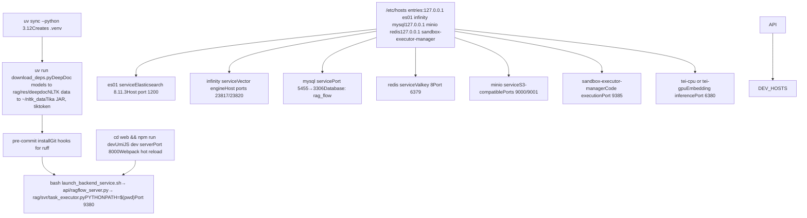

# Getting Started and Deployment

Relevant source files

-   [.github/workflows/release.yml](https://github.com/infiniflow/ragflow/blob/80a16e71/.github/workflows/release.yml)
-   [.github/workflows/tests.yml](https://github.com/infiniflow/ragflow/blob/80a16e71/.github/workflows/tests.yml)
-   [Dockerfile](https://github.com/infiniflow/ragflow/blob/80a16e71/Dockerfile)
-   [Dockerfile.deps](https://github.com/infiniflow/ragflow/blob/80a16e71/Dockerfile.deps)
-   [README.md](https://github.com/infiniflow/ragflow/blob/80a16e71/README.md)
-   [README\_id.md](https://github.com/infiniflow/ragflow/blob/80a16e71/README_id.md)
-   [README\_ja.md](https://github.com/infiniflow/ragflow/blob/80a16e71/README_ja.md)
-   [README\_ko.md](https://github.com/infiniflow/ragflow/blob/80a16e71/README_ko.md)
-   [README\_pt\_br.md](https://github.com/infiniflow/ragflow/blob/80a16e71/README_pt_br.md)
-   [README\_tzh.md](https://github.com/infiniflow/ragflow/blob/80a16e71/README_tzh.md)
-   [README\_zh.md](https://github.com/infiniflow/ragflow/blob/80a16e71/README_zh.md)
-   [api/db/runtime\_config.py](https://github.com/infiniflow/ragflow/blob/80a16e71/api/db/runtime_config.py)
-   [docker/.env](https://github.com/infiniflow/ragflow/blob/80a16e71/docker/.env)
-   [docker/README.md](https://github.com/infiniflow/ragflow/blob/80a16e71/docker/README.md)
-   [docs/configurations.md](https://github.com/infiniflow/ragflow/blob/80a16e71/docs/configurations.md)
-   [docs/guides/manage\_files.md](https://github.com/infiniflow/ragflow/blob/80a16e71/docs/guides/manage_files.md)
-   [docs/guides/upgrade\_ragflow.mdx](https://github.com/infiniflow/ragflow/blob/80a16e71/docs/guides/upgrade_ragflow.mdx)
-   [docs/quickstart.mdx](https://github.com/infiniflow/ragflow/blob/80a16e71/docs/quickstart.mdx)
-   [download\_deps.py](https://github.com/infiniflow/ragflow/blob/80a16e71/download_deps.py)

This page guides you through deploying RAGFlow, from prerequisites to your first running instance. RAGFlow deploys as a containerized application stack orchestrated by Docker Compose, with the main container running both the Flask API server ([api/ragflow\_server.py](https://github.com/infiniflow/ragflow/blob/80a16e71/api/ragflow_server.py)) and async task executor ([rag/svr/task\_executor.py](https://github.com/infiniflow/ragflow/blob/80a16e71/rag/svr/task_executor.py)).

For detailed information on specific deployment topics:

-   Docker Compose service definitions and orchestration: See page 2.1
-   Environment variables and runtime configuration: See page 2.2
-   Document storage backend selection (Elasticsearch/Infinity/OpenSearch): See page 2.3
-   Docker build process and CI/CD pipelines: See page 2.4

For the overall system architecture, see page 3.

## Prerequisites

Before deploying RAGFlow, ensure your system meets these requirements:

| Resource | Minimum Requirement | Notes |
| --- | --- | --- |
| **CPU** | 4 cores (x86\_64) | ARM64 support available but requires custom build |
| **RAM** | 16 GB | Elasticsearch requires ~8GB, see `MEM_LIMIT` in [docker/.env64](https://github.com/infiniflow/ragflow/blob/80a16e71/docker/.env#L64-L64) |
| **Disk** | 50 GB free | Includes Docker images, volumes, and document storage |
| **Docker** | ≥ 24.0.0 | Check: `docker --version` |
| **Docker Compose** | ≥ v2.26.1 | Check: `docker compose version` |
| **gVisor** (optional) | Latest | Only required for code executor sandbox feature |

**Platform-Specific Notes:**

-   **ARM64 Platforms**: Official Docker images are x86\_64 only. ARM64 users must build custom images following [Dockerfile1-207](https://github.com/infiniflow/ragflow/blob/80a16e71/Dockerfile#L1-L207) instructions (see page 2.4).
-   **Windows**: Requires Docker Desktop with WSL2 backend.
-   **macOS**: Requires Docker Desktop. Apple Silicon users need custom ARM64 build.

**System Tuning for Elasticsearch:**

Elasticsearch requires `vm.max_map_count ≥ 262144` on the Docker host. This kernel parameter limits the number of memory-mapped areas a process can allocate.

```
# Check current value
sysctl vm.max_map_count

# Set temporarily (lost on reboot)
sudo sysctl -w vm.max_map_count=262144

# Persist permanently in /etc/sysctl.conf
echo "vm.max_map_count=262144" | sudo tee -a /etc/sysctl.conf
```
If this value is insufficient, Elasticsearch will fail to start with errors like `Can't connect to ES cluster` or `max virtual memory areas vm.max_map_count [65530] is too low`.

**Sources:** [README.md136-152](https://github.com/infiniflow/ragflow/blob/80a16e71/README.md#L136-L152) [docs/quickstart.mdx28-90](https://github.com/infiniflow/ragflow/blob/80a16e71/docs/quickstart.mdx#L28-L90) [docker/.env64](https://github.com/infiniflow/ragflow/blob/80a16e71/docker/.env#L64-L64)

## Quick Start: Deploy with Docker Compose

**Quick Start Deployment Flow**

> **[Mermaid sequence]**
> *(图表结构无法解析)*

**Sources:** [README.md180-235](https://github.com/infiniflow/ragflow/blob/80a16e71/README.md#L180-L235) [docs/quickstart.mdx186-234](https://github.com/infiniflow/ragflow/blob/80a16e71/docs/quickstart.mdx#L186-L234)

### Step-by-Step Deployment

1.  **Clone the repository:**

    ```
    git clone https://github.com/infiniflow/ragflow.git
    cd ragflow/docker
    ```

2.  **Check out a stable release (recommended):**

    ```
    git checkout v0.23.1
    ```

    This ensures the [docker/entrypoint.sh](https://github.com/infiniflow/ragflow/blob/80a16e71/docker/entrypoint.sh) script matches the Docker image version.

3.  **Start the services:**

    ```
    docker compose -f docker-compose.yml up -d
    ```

    This command:

    -   Reads configuration from [docker/.env1-258](https://github.com/infiniflow/ragflow/blob/80a16e71/docker/.env#L1-L258)
    -   Pulls Docker images: `infiniflow/ragflow:v0.23.1` (~2GB compressed), `elasticsearch:8.11.3`, `mysql:8.0`, `redis`, `minio`, `nginx`
    -   Creates Docker networks and volumes
    -   Starts containers in dependency order
4.  **Verify startup:**

    ```
    docker logs -f docker-ragflow-cpu-1
    ```

    Wait for this output confirming successful initialization:

    ```
         ____   ___    ______ ______ __
        / __ \ /   |  / ____// ____// /____  _      __
       / /_/ // /| | / / __ / /_   / // __ \| | /| / /
      / _, _// ___ |/ /_/ // __/  / // /_/ /| |/ |/ /
     /_/ |_|/_/  |_|\____//_/    /_/ \____/ |__/|__/

     * Running on all addresses (0.0.0.0)
    ```

    **Warning:** Logging in before seeing this message may result in `network abnormal` errors because initialization is incomplete.

5.  **Access the web interface:**

    Open your browser and navigate to:

    ```
    http://YOUR_SERVER_IP
    ```

    With default settings, port 80 is used, so no port number is needed in the URL (see `SVR_WEB_HTTP_PORT` in [docker/.env133](https://github.com/infiniflow/ragflow/blob/80a16e71/docker/.env#L133-L133)).

6.  **Configure LLM providers:**

    After logging in, click your profile icon → **Model Providers** to configure API keys for LLM services. At minimum, you need:

    -   A chat model (e.g., OpenAI GPT-4, Anthropic Claude)
    -   An embedding model (e.g., OpenAI text-embedding-ada-002, BAAI/bge-m3)

    Then click **System Model Settings** to select default models for chat, embedding, and other tasks.


**Sources:** [README.md180-250](https://github.com/infiniflow/ragflow/blob/80a16e71/README.md#L180-L250) [docs/quickstart.mdx186-267](https://github.com/infiniflow/ragflow/blob/80a16e71/docs/quickstart.mdx#L186-L267)

## Deployment Options

### Standard Docker Deployment

The default deployment uses pre-built Docker images with CPU-based document processing:

```
cd ragflow/docker
docker compose -f docker-compose.yml up -d
```
Key containers started:

-   `docker-ragflow-cpu-1`: Main application (nginx + Flask API + task executor)
-   `docker-es01-1`: Elasticsearch 8.11.3 for document storage
-   `docker-mysql-1`: MySQL 8.0 for metadata (users, datasets, conversations)
-   `docker-redis-1`: Redis for caching and task queues
-   `docker-minio-1`: MinIO for object storage (uploaded files)

**Sources:** [README.md193-206](https://github.com/infiniflow/ragflow/blob/80a16e71/README.md#L193-L206) [docker/docker-compose.yml1-100](https://github.com/infiniflow/ragflow/blob/80a16e71/docker/docker-compose.yml#L1-L100)

### GPU-Accelerated Deployment

For faster document processing using GPU:

```
cd ragflow/docker
sed -i '1i DEVICE=gpu' .env
docker compose -f docker-compose.yml up -d
```
This changes:

-   Container name: `docker-ragflow-gpu-1` instead of `docker-ragflow-cpu-1`
-   DeepDoc inference runs on GPU via CUDA
-   Requires NVIDIA Docker runtime installed on host

The `DEVICE` variable in [docker/.env25](https://github.com/infiniflow/ragflow/blob/80a16e71/docker/.env#L25-L25) controls which Docker Compose profile activates, switching between CPU and GPU variants of the DeepDoc processing pipeline.

**Sources:** [README.md200-206](https://github.com/infiniflow/ragflow/blob/80a16e71/README.md#L200-L206) [docker/.env21-27](https://github.com/infiniflow/ragflow/blob/80a16e71/docker/.env#L21-L27)

### Development Deployment from Source

For development workflows, run RAGFlow from source code with backing services in Docker:

```
# Start only backing services (no RAGFlow container)
docker compose -f docker/docker-compose-base.yml up -d

# Map container hostnames to localhost
echo "127.0.0.1 es01 mysql minio redis" | sudo tee -a /etc/hosts

# Install Python dependencies
uv sync --python 3.12
uv run download_deps.py

# Start backend services
source .venv/bin/activate
export PYTHONPATH=$(pwd)
bash docker/launch_backend_service.sh

# Start frontend dev server (in separate terminal)
cd web
npm install
npm run dev  # http://localhost:8000
```
This setup:

-   Runs [api/ragflow\_server.py](https://github.com/infiniflow/ragflow/blob/80a16e71/api/ragflow_server.py) and [rag/svr/task\_executor.py](https://github.com/infiniflow/ragflow/blob/80a16e71/rag/svr/task_executor.py) directly on the host
-   Uses [docker/docker-compose-base.yml1-249](https://github.com/infiniflow/ragflow/blob/80a16e71/docker/docker-compose-base.yml#L1-L249) to start only MySQL, Elasticsearch, Redis, and MinIO
-   Enables hot-reload for both backend (Python) and frontend (React/UmiJS)
-   Useful for debugging and rapid iteration

**Sources:** [README.md315-377](https://github.com/infiniflow/ragflow/blob/80a16e71/README.md#L315-L377) [docker/docker-compose-base.yml1-249](https://github.com/infiniflow/ragflow/blob/80a16e71/docker/docker-compose-base.yml#L1-L249)

## Initial Configuration

After deployment, RAGFlow requires minimal configuration to start processing documents:

### Configuration Files

| File | Purpose | Modification Required |
| --- | --- | --- |
| [docker/.env](https://github.com/infiniflow/ragflow/blob/80a16e71/docker/.env) | Docker Compose environment variables (ports, passwords, image tags) | Optional: Change default passwords, ports |
| [docker/service\_conf.yaml.template](https://github.com/infiniflow/ragflow/blob/80a16e71/docker/service_conf.yaml.template) | Backend service configuration (databases, LLM factories) | Required: Add LLM API keys |
| [docker/docker-compose.yml](https://github.com/infiniflow/ragflow/blob/80a16e71/docker/docker-compose.yml) | Service definitions and container orchestration | Optional: Adjust resource limits |

The `.env` file contains variables like `MYSQL_PASSWORD`, `DOC_ENGINE`, `RAGFLOW_IMAGE` that Docker Compose uses to configure containers. At container startup, [docker/entrypoint.sh](https://github.com/infiniflow/ragflow/blob/80a16e71/docker/entrypoint.sh) processes `service_conf.yaml.template` using `envsubst` to replace `${VARIABLE}` placeholders with actual values from the environment.

**Sources:** [docker/.env1-258](https://github.com/infiniflow/ragflow/blob/80a16e71/docker/.env#L1-L258) [docker/service\_conf.yaml.template1-200](https://github.com/infiniflow/ragflow/blob/80a16e71/docker/service_conf.yaml.template#L1-L200) [README.md252-266](https://github.com/infiniflow/ragflow/blob/80a16e71/README.md#L252-L266)

### Essential Configuration Steps

1.  **Change default passwords (production deployments):**

    Edit [docker/.env](https://github.com/infiniflow/ragflow/blob/80a16e71/docker/.env) and update:

    ```
    MYSQL_PASSWORD=your_secure_password
    ELASTIC_PASSWORD=your_secure_password
    MINIO_PASSWORD=your_secure_password
    REDIS_PASSWORD=your_secure_password
    ```

    **Warning:** The default passwords in [docker/.env1-6](https://github.com/infiniflow/ragflow/blob/80a16e71/docker/.env#L1-L6) are insecure and should never be used in production.

2.  **Configure LLM API keys:**

    Edit [docker/service\_conf.yaml.template](https://github.com/infiniflow/ragflow/blob/80a16e71/docker/service_conf.yaml.template) in the `user_default_llm` section to add your LLM provider API keys. At minimum, configure:

    -   A chat model provider (e.g., OpenAI, Anthropic, Tongyi-Qianwen)
    -   An embedding model provider

    Alternatively, configure these via the web UI after login (Settings → Model Providers).

3.  **Apply configuration changes:**

    ```
    docker compose -f docker/docker-compose.yml up -d
    ```

    This recreates containers with updated configuration.


**Sources:** [docker/.env1-6](https://github.com/infiniflow/ragflow/blob/80a16e71/docker/.env#L1-L6) [docker/service\_conf.yaml.template](https://github.com/infiniflow/ragflow/blob/80a16e71/docker/service_conf.yaml.template) [README.md244-249](https://github.com/infiniflow/ragflow/blob/80a16e71/README.md#L244-L249)

## Common Deployment Scenarios

### Switching Document Storage Backend

By default, RAGFlow uses Elasticsearch for document storage. To switch to Infinity (optimized vector database):

```
# Stop services and remove volumes (WARNING: deletes all indexed documents)
docker compose -f docker/docker-compose.yml down -v

# Edit docker/.env
sed -i 's/DOC_ENGINE=elasticsearch/DOC_ENGINE=infinity/' docker/.env

# Restart with new backend
docker compose -f docker/docker-compose.yml up -d
```
The `DOC_ENGINE` variable ([docker/.env19](https://github.com/infiniflow/ragflow/blob/80a16e71/docker/.env#L19-L19)) controls which profile activates in [docker/docker-compose.yml](https://github.com/infiniflow/ragflow/blob/80a16e71/docker/docker-compose.yml) starting either the `es01`, `infinity`, or `opensearch01` service.

For detailed comparison of backends and configuration options, see page 2.3.

**Sources:** [docker/.env13-19](https://github.com/infiniflow/ragflow/blob/80a16e71/docker/.env#L13-L19) [README.md273-291](https://github.com/infiniflow/ragflow/blob/80a16e71/README.md#L273-L291)

### Enabling Optional Services

**TEI Embedding Service** (local embedding generation):

```
# Edit docker/.env, uncomment:
COMPOSE_PROFILES=${COMPOSE_PROFILES},tei-cpu

# Or for GPU acceleration:
COMPOSE_PROFILES=${COMPOSE_PROFILES},tei-gpu
```
The TEI service ([docker/docker-compose.yml](https://github.com/infiniflow/ragflow/blob/80a16e71/docker/docker-compose.yml)) provides local embedding model inference, removing dependency on external LLM APIs for vectorization.

**Sandbox Code Executor** (for agent Python/JS code execution):

```
# Install gVisor first
# Then edit docker/.env, uncomment:
SANDBOX_ENABLED=1
COMPOSE_PROFILES=${COMPOSE_PROFILES},sandbox
```
Requires gVisor runtime and pre-pulled base images ([docker/.env219-231](https://github.com/infiniflow/ragflow/blob/80a16e71/docker/.env#L219-L231)).

**Sources:** [docker/.env150-231](https://github.com/infiniflow/ragflow/blob/80a16e71/docker/.env#L150-L231) [README.md150](https://github.com/infiniflow/ragflow/blob/80a16e71/README.md#L150-L150)

## Next Steps

Now that RAGFlow is deployed:

1.  **Create your first dataset** and upload documents via the web UI
2.  **Configure chunking templates** appropriate for your document types
3.  **Set up a chat assistant** to query your documents

For production deployments:

-   Review detailed configuration options in page 2.2
-   Choose appropriate document storage backend in page 2.3
-   Implement monitoring and backup strategies

For development workflows:

-   Build custom Docker images following page 2.4
-   Configure CI/CD pipelines for automated testing

### Multi-Stage Docker Build Process

RAGFlow uses a three-stage Dockerfile to optimize the final image size while maintaining complete build reproducibility:

**Multi-Stage Build Pipeline**


The `base` stage ([Dockerfile1-136](https://github.com/infiniflow/ragflow/blob/80a16e71/Dockerfile#L1-L136)) starts from `ubuntu:24.04` and installs system-level dependencies including jemalloc for memory optimization, Java for Tika document parsing, Chrome/ChromeDriver for web crawling via Selenium, and MSSQL ODBC drivers (architecture-dependent: msodbcsql18 for ARM64, msodbcsql17 for x86\_64). It mounts `infiniflow/ragflow_deps:latest` to extract DeepDoc vision models, NLTK data, and tiktoken encodings. The `uv` package manager is installed and configured for Python 3.11 installation. Environment variables `PYTHONDONTWRITEBYTECODE=1` and `DOTNET_SYSTEM_GLOBALIZATION_INVARIANT=1` are set for optimization.

The `builder` stage ([Dockerfile138-167](https://github.com/infiniflow/ragflow/blob/80a16e71/Dockerfile#L138-L167)) uses `uv sync --python 3.12 --frozen` to install Python dependencies from [pyproject.toml1-283](https://github.com/infiniflow/ragflow/blob/80a16e71/pyproject.toml#L1-L283) and [uv.lock](https://github.com/infiniflow/ragflow/blob/80a16e71/uv.lock) The frontend is built by running `npm install && npm run build` in the `web/` directory, producing compiled assets in `web/dist/`. Version information is extracted via `git describe --tags --match=v* --first-parent --always` and written to a `VERSION` file for runtime version reporting.

The `production` stage ([Dockerfile169-204](https://github.com/infiniflow/ragflow/blob/80a16e71/Dockerfile#L169-L204)) assembles the final image by copying the Python virtual environment from `builder` (setting `VIRTUAL_ENV=/ragflow/.venv` and prepending it to `PATH`), copying compiled web assets to `web/dist/`, copying application code directories (`api/`, `rag/`, `agent/`, `deepdoc/`, `graphrag/`, `mcp/`, `agentic_reasoning/`, `common/`), and copying configuration templates. The `ENTRYPOINT` is set to `./entrypoint.sh` which processes `service_conf.yaml.template` at container startup.

**Sources:** [Dockerfile1-204](https://github.com/infiniflow/ragflow/blob/80a16e71/Dockerfile#L1-L204) [pyproject.toml1-283](https://github.com/infiniflow/ragflow/blob/80a16e71/pyproject.toml#L1-L283) [README.md295-303](https://github.com/infiniflow/ragflow/blob/80a16e71/README.md#L295-L303)

## Configuration Management System

RAGFlow configuration uses a two-tier approach: deployment-time variables in `.env` and runtime service configuration in `service_conf.yaml.template`.

### Configuration File Hierarchy

| File | Purpose | When Processed | Environment Variable Substitution |
| --- | --- | --- | --- |
| [docker/.env1-247](https://github.com/infiniflow/ragflow/blob/80a16e71/docker/.env#L1-L247) | Docker Compose variables, external port mappings, profile selection | `docker compose up` | Used by Docker Compose directly |
| [docker/service\_conf.yaml.template](https://github.com/infiniflow/ragflow/blob/80a16e71/docker/service_conf.yaml.template) | Backend service config (MySQL, Redis, MinIO, LLM factories, RAG settings) | Container startup via [docker/entrypoint.sh](https://github.com/infiniflow/ragflow/blob/80a16e71/docker/entrypoint.sh) | Yes, all `${VAR}` replaced via `envsubst` |
| [docker/docker-compose.yml](https://github.com/infiniflow/ragflow/blob/80a16e71/docker/docker-compose.yml) | Service definitions, volume mounts, network topology, dependency ordering | `docker compose up` | References `.env` variables |
| [docker/docker-compose-base.yml1-249](https://github.com/infiniflow/ragflow/blob/80a16e71/docker/docker-compose-base.yml#L1-L249) | Base services only (ES, MySQL, Redis, MinIO) for development | `docker compose -f docker-compose-base.yml up` | References `.env` variables |

The entrypoint script ([docker/entrypoint.sh](https://github.com/infiniflow/ragflow/blob/80a16e71/docker/entrypoint.sh)) processes the template at container startup using `envsubst` (environment variable substitution utility):

```
# Actual template processing from entrypoint.sh:
envsubst < /ragflow/conf/service_conf.yaml.template > /ragflow/conf/service_conf.yaml
```
This enables deployment-specific values (like `MYSQL_PASSWORD`, `DOC_ENGINE`, `REDIS_HOST` from `.env`) to be injected into the runtime configuration file `conf/service_conf.yaml`, which is then loaded by the application at startup. The configuration is consumed by initialization code in the `rag/` and `api/` modules during service bootstrap.

**Sources:** [docker/.env1-245](https://github.com/infiniflow/ragflow/blob/80a16e71/docker/.env#L1-L245) [docker/README.md1-11](https://github.com/infiniflow/ragflow/blob/80a16e71/docker/README.md#L1-L11) [docs/configurations.md10-28](https://github.com/infiniflow/ragflow/blob/80a16e71/docs/configurations.md#L10-L28)

### Core Environment Variables


**Key Configuration Variables:**

-   **`DOC_ENGINE`** ([docker/.env12](https://github.com/infiniflow/ragflow/blob/80a16e71/docker/.env#L12-L12)): Selects document storage backend. Valid values: `elasticsearch`, `infinity`, `opensearch`. This variable determines which Docker Compose profile activates.

-   **`DEVICE`** ([docker/.env18](https://github.com/infiniflow/ragflow/blob/80a16e71/docker/.env#L18-L18)): Specifies compute device for DeepDoc vision tasks. `cpu` or `gpu`. GPU mode requires NVIDIA Docker runtime.

-   **`RAGFLOW_IMAGE`** ([docker/.env131](https://github.com/infiniflow/ragflow/blob/80a16e71/docker/.env#L131-L131)): Docker image tag. Defaults to `infiniflow/ragflow:v0.22.1`. Mirrors available at `swr.cn-north-4.myhuaweicloud.com` and `registry.cn-hangzhou.aliyuncs.com` for restricted regions.

-   **Port Mappings:** All services use format `<HOST_PORT>:<CONTAINER_PORT>`. For example, `MYSQL_PORT=5455` maps container's MySQL port 3306 to host's 5455, avoiding conflicts with host-native MySQL instances.


**Sources:** [docker/.env1-245](https://github.com/infiniflow/ragflow/blob/80a16e71/docker/.env#L1-L245) [docker/README.md23-119](https://github.com/infiniflow/ragflow/blob/80a16e71/docker/README.md#L23-L119) [docs/configurations.md42-119](https://github.com/infiniflow/ragflow/blob/80a16e71/docs/configurations.md#L42-L119)

### Service Configuration Template Structure

The [service\_conf.yaml.template](https://github.com/infiniflow/ragflow/blob/80a16e71/service_conf.yaml.template) defines runtime configuration for backend services consumed by the API server and task executor:

```
# Pseudocode representation of key sections
ragflow:
  host: "0.0.0.0"  # API server bind address inside container
  port: ${SVR_HTTP_PORT}  # Defaults to 9380

mysql:
  name: ${MYSQL_DBNAME}  # Database name
  user: ${MYSQL_USER}
  password: ${MYSQL_PASSWORD}
  host: ${MYSQL_HOST}
  port: 3306  # Internal container port
  max_connections: 100

minio:
  user: ${MINIO_USER}
  password: ${MINIO_PASSWORD}
  host: "${MINIO_HOST}:9000"  # Internal S3 API endpoint

redis:
  host: ${REDIS_HOST}
  port: 6379
  password: ${REDIS_PASSWORD}
  db: 1  # Separate from default db=0

doc_engine: ${DOC_ENGINE}  # Controls ES/Infinity/OpenSearch selection
```
The `doc_engine` field is read by [rag/svr/es\_conn.py](https://github.com/infiniflow/ragflow/blob/80a16e71/rag/svr/es_conn.py) to instantiate the appropriate document storage client (Elasticsearch, Infinity, or OpenSearch).

**Sources:** [docker/service\_conf.yaml.template](https://github.com/infiniflow/ragflow/blob/80a16e71/docker/service_conf.yaml.template) [docker/README.md120-155](https://github.com/infiniflow/ragflow/blob/80a16e71/docker/README.md#L120-L155) [docs/configurations.md13-16](https://github.com/infiniflow/ragflow/blob/80a16e71/docs/configurations.md#L13-L16)

## Document Engine Selection and Setup

RAGFlow supports three document storage backends, each with different trade-offs for performance, resource usage, and feature support.

### Engine Comparison Matrix

| Engine | Default? | Hybrid Search | Vector Dimensions | Full-Text Language Support | Memory Requirements | ARM64 Support |
| --- | --- | --- | --- | --- | --- | --- |
| **Elasticsearch 8.11.3** | ✓ | ✓ | Any | 40+ via analyzers | ~2-4 GB | ✓ |
| **Infinity** |  | ✓ | Any | Basic | ~1-2 GB | Limited (not officially supported) |
| **OpenSearch** |  | ✓ | Any | 40+ via analyzers | ~2-4 GB | ✓ |

### Switching Document Engines

> **[Mermaid sequence]**
> *(图表结构无法解析)*

**Switching Steps:**

1.  **Stop services and remove volumes** ([README.md276-280](https://github.com/infiniflow/ragflow/blob/80a16e71/README.md#L276-L280)):

    ```
    docker compose -f docker/docker-compose.yml down -v
    ```

    The `-v` flag removes Docker volumes containing indexed documents and metadata. This is necessary because different engines use incompatible storage formats.

2.  **Update `DOC_ENGINE`** in [docker/.env12](https://github.com/infiniflow/ragflow/blob/80a16e71/docker/.env#L12-L12):

    ```
    DOC_ENGINE=infinity
    ```

3.  **Restart services** ([README.md286-289](https://github.com/infiniflow/ragflow/blob/80a16e71/README.md#L286-L289)):

    ```
    docker compose -f docker-compose.yml up -d
    ```

    Docker Compose reads `COMPOSE_PROFILES=${DOC_ENGINE},${DEVICE}` ([docker/.env20](https://github.com/infiniflow/ragflow/blob/80a16e71/docker/.env#L20-L20)) to activate the appropriate service profile.


**Sources:** [docker/.env6-12](https://github.com/infiniflow/ragflow/blob/80a16e71/docker/.env#L6-L12) [README.md272-293](https://github.com/infiniflow/ragflow/blob/80a16e71/README.md#L272-L293) [docs/quickstart.mdx42-90](https://github.com/infiniflow/ragflow/blob/80a16e71/docs/quickstart.mdx#L42-L90)

### Elasticsearch Configuration

Elasticsearch requires system-level tuning on the Docker host to configure the maximum number of memory-mapped areas:

```
# Check current value
sysctl vm.max_map_count

# Set temporarily (lost on reboot)
sudo sysctl -w vm.max_map_count=262144

# Persist across reboots in /etc/sysctl.conf
echo "vm.max_map_count=262144" | sudo tee -a /etc/sysctl.conf
```
The `vm.max_map_count` setting controls the maximum number of memory map areas a process may allocate. Elasticsearch uses `mmap` extensively for Lucene index file access, requiring at least 262144 for proper operation. Insufficient values cause startup failures with messages like `Can't connect to ES cluster` or `max virtual memory areas vm.max_map_count [65530] is too low`.

**Platform-Specific Configuration:**

-   **macOS with Docker Desktop** ([docs/quickstart.mdx81-86](https://github.com/infiniflow/ragflow/blob/80a16e71/docs/quickstart.mdx#L81-L86)):

    ```
    docker run --rm --privileged --pid=host alpine sysctl -w vm.max_map_count=262144
    ```

    For persistence, create `/Library/LaunchDaemons/com.user.vmmaxmap.plist` with a launchd job ([docs/quickstart.mdx94-131](https://github.com/infiniflow/ragflow/blob/80a16e71/docs/quickstart.mdx#L94-L131)).

-   **Windows with Docker Desktop WSL2** ([docs/quickstart.mdx146-163](https://github.com/infiniflow/ragflow/blob/80a16e71/docs/quickstart.mdx#L146-L163)):

    ```
    wsl -d docker-desktop -u root
    sysctl -w vm.max_map_count=262144
    ```

    For persistence, add to `%USERPROFILE%\.wslconfig`:

    ```
    [wsl2]
    kernelCommandLine = "sysctl.vm.max_map_count=262144"
    ```


**Key Elasticsearch Variables:**

-   `STACK_VERSION=8.11.3` ([docker/.env23](https://github.com/infiniflow/ragflow/blob/80a16e71/docker/.env#L23-L23)): Elasticsearch version, controls image tag `elasticsearch:${STACK_VERSION}`
-   `ES_HOST=es01` ([docker/.env26](https://github.com/infiniflow/ragflow/blob/80a16e71/docker/.env#L26-L26)): Container hostname used in service\_conf.yaml
-   `ES_PORT=1200` ([docker/.env30](https://github.com/infiniflow/ragflow/blob/80a16e71/docker/.env#L30-L30)): Host-accessible port (maps to container port 9200)
-   `ELASTIC_PASSWORD=infini_rag_flow` ([docker/.env33](https://github.com/infiniflow/ragflow/blob/80a16e71/docker/.env#L33-L33)): Authentication credential for x-pack security
-   `MEM_LIMIT=8073741824` ([docker/.env56](https://github.com/infiniflow/ragflow/blob/80a16e71/docker/.env#L56-L56)): 8GB memory limit per container in docker-compose-base.yml

The es01 service in [docker/docker-compose-base.yml2-34](https://github.com/infiniflow/ragflow/blob/80a16e71/docker/docker-compose-base.yml#L2-L34) configures Elasticsearch as a single-node cluster with security enabled, disk watermark thresholds (5GB low, 3GB high, 2GB flood stage), and a health check that polls `http://localhost:9200`.

**Sources:** [docker/.env22-56](https://github.com/infiniflow/ragflow/blob/80a16e71/docker/.env#L22-L56) [docker/docker-compose-base.yml2-34](https://github.com/infiniflow/ragflow/blob/80a16e71/docker/docker-compose-base.yml#L2-L34) [docs/quickstart.mdx42-180](https://github.com/infiniflow/ragflow/blob/80a16e71/docs/quickstart.mdx#L42-L180) [README.md157-177](https://github.com/infiniflow/ragflow/blob/80a16e71/README.md#L157-L177)

### Infinity Configuration

Infinity is RAGFlow's optimized document storage engine, offering reduced memory footprint and simplified deployment:

**Key Infinity Variables:**

-   `INFINITY_HOST=infinity` ([docker/.env59](https://github.com/infiniflow/ragflow/blob/80a16e71/docker/.env#L59-L59)): Container hostname
-   `INFINITY_THRIFT_PORT=23817` ([docker/.env62](https://github.com/infiniflow/ragflow/blob/80a16e71/docker/.env#L62-L62)): Thrift RPC interface
-   `INFINITY_HTTP_PORT=23820` ([docker/.env63](https://github.com/infiniflow/ragflow/blob/80a16e71/docker/.env#L63-L63)): HTTP API
-   `INFINITY_PSQL_PORT=5432` ([docker/.env64](https://github.com/infiniflow/ragflow/blob/80a16e71/docker/.env#L64-L64)): PostgreSQL-compatible interface

Infinity does **not** require `vm.max_map_count` tuning and uses approximately half the memory of Elasticsearch for equivalent workloads.

**ARM64 Limitation:** Infinity is not officially supported on Linux/ARM64 architectures ([README.md291-293](https://github.com/infiniflow/ragflow/blob/80a16e71/README.md#L291-L293)). Users on ARM64 must use Elasticsearch or OpenSearch.

**Sources:** [docker/.env58-64](https://github.com/infiniflow/ragflow/blob/80a16e71/docker/.env#L58-L64) [README.md272-293](https://github.com/infiniflow/ragflow/blob/80a16e71/README.md#L272-L293)

## Optional Services and Extensions

### TEI (Text Embeddings Inference) Service

TEI provides GPU-accelerated embedding generation for supported models:

**Activation:**

```
# In docker/.env, uncomment one of:
COMPOSE_PROFILES=${COMPOSE_PROFILES},tei-cpu    # CPU mode
COMPOSE_PROFILES=${COMPOSE_PROFILES},tei-gpu    # GPU mode (requires NVIDIA runtime)
```
**Configuration Variables:**

-   `TEI_IMAGE_CPU=infiniflow/text-embeddings-inference:cpu-1.8` ([docker/.env147](https://github.com/infiniflow/ragflow/blob/80a16e71/docker/.env#L147-L147))
-   `TEI_IMAGE_GPU=infiniflow/text-embeddings-inference:1.8` ([docker/.env148](https://github.com/infiniflow/ragflow/blob/80a16e71/docker/.env#L148-L148))
-   `TEI_MODEL=${TEI_MODEL:-Qwen/Qwen3-Embedding-0.6B}` ([docker/.env155](https://github.com/infiniflow/ragflow/blob/80a16e71/docker/.env#L155-L155)): Embedding model selection
-   `TEI_PORT=6380` ([docker/.env161](https://github.com/infiniflow/ragflow/blob/80a16e71/docker/.env#L161-L161)): Service exposure port

**Supported Models:**

-   `Qwen/Qwen3-Embedding-0.6B` (default, 25GB RAM/vRAM)
-   `BAAI/bge-m3` (21GB RAM/vRAM)
-   `BAAI/bge-small-en-v1.5` (1.2GB RAM/vRAM, lightweight)

When TEI is enabled, the API server can offload embedding generation to this dedicated service instead of using external LLM provider APIs.

**Sources:** [docker/.env141-161](https://github.com/infiniflow/ragflow/blob/80a16e71/docker/.env#L141-L161) [docker/README.md156-171](https://github.com/infiniflow/ragflow/blob/80a16e71/docker/README.md#L156-L171)

### Sandbox Code Executor

The sandbox service provides isolated Python/JavaScript code execution for agent workflows using gVisor:

**Prerequisites:**

1.  Install gVisor ([gvisor.dev](https://gvisor.dev/docs/user_guide/install/))
2.  Pull base images:

    ```
    docker pull infiniflow/sandbox-base-nodejs:latest
    docker pull infiniflow/sandbox-base-python:latest
    ```

3.  Add to `/etc/hosts`:

    ```
    127.0.0.1 sandbox-executor-manager
    ```


**Activation:**

```
# In docker/.env, uncomment:
SANDBOX_ENABLED=1
COMPOSE_PROFILES=${COMPOSE_PROFILES},sandbox
```
**Configuration Variables:**

-   `SANDBOX_HOST=sandbox-executor-manager` ([docker/.env223](https://github.com/infiniflow/ragflow/blob/80a16e71/docker/.env#L223-L223))
-   `SANDBOX_EXECUTOR_MANAGER_PORT=9385` ([docker/.env228](https://github.com/infiniflow/ragflow/blob/80a16e71/docker/.env#L228-L228))
-   `SANDBOX_EXECUTOR_MANAGER_POOL_SIZE=3` ([docker/.env225](https://github.com/infiniflow/ragflow/blob/80a16e71/docker/.env#L225-L225)): Concurrent executor pool
-   `SANDBOX_MAX_MEMORY=256m` ([docker/.env230](https://github.com/infiniflow/ragflow/blob/80a16e71/docker/.env#L230-L230)): Per-execution memory limit
-   `SANDBOX_TIMEOUT=10s` ([docker/.env231](https://github.com/infiniflow/ragflow/blob/80a16e71/docker/.env#L231-L231)): Execution timeout

The sandbox service is consumed by the Agent system when executing Python/JS code components. It provides kernel-level isolation via gVisor's `runsc` runtime.

**Sources:** [docker/.env210-231](https://github.com/infiniflow/ragflow/blob/80a16e71/docker/.env#L210-L231) [README.md150](https://github.com/infiniflow/ragflow/blob/80a16e71/README.md#L150-L150)

## Development Deployment from Source

For development workflows without Docker, RAGFlow can run from source with partial containerization of dependencies:

### Development Deployment Topology


**Setup Steps:**

1.  **Install tooling** ([README.md307-310](https://github.com/infiniflow/ragflow/blob/80a16e71/README.md#L307-L310)):

    ```
    pipx install uv pre-commit
    ```

2.  **Clone and install dependencies** ([README.md312-320](https://github.com/infiniflow/ragflow/blob/80a16e71/README.md#L312-L320)):

    ```
    git clone https://github.com/infiniflow/ragflow.git
    cd ragflow/
    uv sync --python 3.12  # Installs from pyproject.toml requires-python >=3.12,<3.15
    uv run download_deps.py  # Downloads DeepDoc models, NLTK data, Tika, Chrome
    pre-commit install  # Sets up ruff pre-commit hooks
    ```

3.  **Start backing services** ([README.md321-331](https://github.com/infiniflow/ragflow/blob/80a16e71/README.md#L321-L331)):

    ```
    docker compose -f docker/docker-compose-base.yml up -d

    # Map container hostnames to localhost for development
    echo "127.0.0.1 es01 infinity mysql minio redis sandbox-executor-manager" | sudo tee -a /etc/hosts
    ```

    This starts Elasticsearch (or Infinity based on `DOC_ENGINE` in [docker/.env12](https://github.com/infiniflow/ragflow/blob/80a16e71/docker/.env#L12-L12)), MySQL, Redis, MinIO, and optional services like TEI and sandbox-executor-manager using profiles from [docker/docker-compose-base.yml1-249](https://github.com/infiniflow/ragflow/blob/80a16e71/docker/docker-compose-base.yml#L1-L249)

4.  **Configure HuggingFace mirror (optional)** ([README.md332-336](https://github.com/infiniflow/ragflow/blob/80a16e71/README.md#L332-L336)):

    ```
    export HF_ENDPOINT=https://hf-mirror.com  # For restricted regions
    ```

5.  **Install jemalloc** ([README.md337-348](https://github.com/infiniflow/ragflow/blob/80a16e71/README.md#L337-L348)):

    ```
    # Ubuntu
    sudo apt-get install libjemalloc-dev
    # CentOS
    sudo yum install jemalloc
    # macOS
    sudo brew install jemalloc
    ```

6.  **Launch backend services** ([README.md349-355](https://github.com/infiniflow/ragflow/blob/80a16e71/README.md#L349-L355)):

    ```
    source .venv/bin/activate
    export PYTHONPATH=$(pwd)
    bash docker/launch_backend_service.sh
    ```

    The [docker/launch\_backend\_service.sh](https://github.com/infiniflow/ragflow/blob/80a16e71/docker/launch_backend_service.sh) script starts both `api/ragflow_server.py` (Flask/Quart API server on port 9380) and `rag/svr/task_executor.py` (background document processing worker) as background processes.

7.  **Launch frontend development server** ([README.md357-368](https://github.com/infiniflow/ragflow/blob/80a16e71/README.md#L357-L368)):

    ```
    cd web
    npm install
    npm run dev  # Starts UmiJS dev server on http://localhost:8000
    ```

8.  **Stop services after development** ([README.md371-375](https://github.com/infiniflow/ragflow/blob/80a16e71/README.md#L371-L375)):

    ```
    pkill -f "ragflow_server.py|task_executor.py"
    ```


**Sources:** [README.md305-376](https://github.com/infiniflow/ragflow/blob/80a16e71/README.md#L305-L376) [docker/docker-compose-base.yml1-249](https://github.com/infiniflow/ragflow/blob/80a16e71/docker/docker-compose-base.yml#L1-L249) [pyproject.toml8](https://github.com/infiniflow/ragflow/blob/80a16e71/pyproject.toml#L8-L8) [download\_deps.py1-71](https://github.com/infiniflow/ragflow/blob/80a16e71/download_deps.py#L1-L71)

## CI/CD Pipeline and Automated Testing

RAGFlow uses GitHub Actions for continuous integration, testing across multiple document engines, and automated releases.

### Test Workflow Architecture

```mermaid
flowchart TD
    PUSH["Push to main orversion branches..* pattern"]
    PR["Pull Requesttype: synchronizelabel: ci"]
    SCHEDULE["Schedulecron: 0 16 * * *Daily at 16:00 UTC"]
    RUFF["astral-sh/ruff-action@v3args: check>=0.11.x"]
    UNITTEST["uv sync --group testpython3 run_tests.pypytest markers: p1 p2 p3"]
    DOCKER_BUILD["DOCKER_BUILDKIT=1docker build --build-arg NEED_MIRROR=1-t infiniflow/ragflow:${GITHUB_RUN_ID}"]
    RUNNER["runs-on:self-hosted, ragflow-test"]
    PORT_CALC["RUNNER_NUM=$(docker inspect hostname--format com.docker.compose.container-number)ES_PORT=$((1200 + RUNNER_NUM * 10))MYSQL_PORT=$((5455 + RUNNER_NUM * 10))SVR_HTTP_PORT=$((9380 + RUNNER_NUM * 10))"]
    ENV_GEN["echo ES_PORT=${ES_PORT} >> docker/.envecho RAGFLOW_IMAGE=${RAGFLOW_IMAGE} >> docker/.envecho COMPOSE_PROFILES=elasticsearch,tei-cpu >> docker/.envecho TEI_MODEL=BAAI/bge-small-en-v1.5 >> docker/.env"]
    ES_START["docker compose -p ${GITHUB_RUN_ID}-f docker/docker-compose.yml up -dDOC_ENGINE=elasticsearch default"]
    ES_WAIT["until docker exec ${RAGFLOW_CONTAINER}curl ${HOST_ADDRESS}"]
    ES_SDK["source .venv/bin/activatepytest -s --tb=short--level=${HTTP_API_TEST_LEVEL}test/testcases/test_sdk_api"]
    ES_FRONTEND["pytest test_frontend_api/get_email.py test_dataset.py"]
    ES_HTTP["pytest test_http_api"]
    ES_CLEANUP["docker compose down -v"]
    INF_UPDATE["sed -i '1i DOC_ENGINE=infinity' docker/.envecho 1 to prepend"]
    INF_START["docker compose up -dInfinity service activated"]
    INF_WAIT["until curl ${HOST_ADDRESS}"]
    INF_SDK["pytest test_sdk_api--level=${HTTP_API_TEST_LEVEL}"]
    INF_FRONTEND["pytest test_frontend_api"]
    INF_HTTP["pytest test_http_api"]
    INF_CLEANUP["docker compose down -vdocker rmi ${RAGFLOW_IMAGE}"]

    PUSH --> RUFF
    PR --> RUFF
    SCHEDULE --> RUFF
    RUFF --> UNITTEST
    UNITTEST --> DOCKER_BUILD
    DOCKER --> BUILD_RUNNER
    RUNNER --> PORT_CALC
    PORT --> CALC_ENV_GEN
    ENV --> GEN_ES_START
    ES --> START_ES_WAIT
    ES --> WAIT_ES_SDK
    ES --> SDK_ES_FRONTEND
    ES --> FRONTEND_ES_HTTP
    ES --> HTTP_ES_CLEANUP
    ES --> CLEANUP_INF_UPDATE
    INF --> UPDATE_INF_START
    INF --> START_INF_WAIT
    INF --> WAIT_INF_SDK
    INF --> SDK_INF_FRONTEND
    INF --> FRONTEND_INF_HTTP
    INF --> HTTP_INF_CLEANUP
```


**Test Workflow Key Features:**

1.  **Concurrency Control** ([.github/workflows/tests.yml27-29](https://github.com/infiniflow/ragflow/blob/80a16e71/.github/workflows/tests.yml#L27-L29)):

    ```
    concurrency:
      group: ${{ github.workflow }}-${{ github.event.pull_request.number || github.ref }}
      cancel-in-progress: true
    ```

    Uses workflow name and PR number (or git ref) to create concurrency groups, canceling in-progress runs when new commits are pushed to the same PR.

2.  **Dynamic Port Allocation** ([.github/workflows/tests.yml154-195](https://github.com/infiniflow/ragflow/blob/80a16e71/.github/workflows/tests.yml#L154-L195)):

    ```
    RUNNER_NUM=$(docker inspect $(hostname) --format '{{index .Config.Labels "com.docker.compose.container-number"}}')
    RUNNER_NUM=${RUNNER_NUM:-1}
    ES_PORT=$((1200 + RUNNER_NUM * 10))
    MYSQL_PORT=$((5455 + RUNNER_NUM * 10))
    SVR_HTTP_PORT=$((9380 + RUNNER_NUM * 10))
    ```

    Extracts the runner's container number from Docker labels and offsets all ports by `RUNNER_NUM * 10` to prevent conflicts when multiple test jobs run on the same host. Example: Runner 2 uses `ES_PORT=1220`, `SVR_HTTP_PORT=9400`.

3.  **Multi-Backend Testing** ([.github/workflows/tests.yml205-269](https://github.com/infiniflow/ragflow/blob/80a16e71/.github/workflows/tests.yml#L205-L269)):

    -   Tests against Elasticsearch first (default `DOC_ENGINE`)
    -   Runs SDK tests (`test/testcases/test_sdk_api`), frontend API tests (`sdk/python/test/test_frontend_api`), and HTTP API tests
    -   Executes `docker compose down -v` to destroy volumes and clear indexed data
    -   Switches to Infinity by prepending `DOC_ENGINE=infinity` to `.env` using `sed -i '1i DOC_ENGINE=infinity' docker/.env`
    -   Re-runs the identical test suite against Infinity backend
4.  **Test Priority Levels** ([.github/workflows/tests.yml144-149](https://github.com/infiniflow/ragflow/blob/80a16e71/.github/workflows/tests.yml#L144-L149)):

    ```
    if [[ ${GITHUB_EVENT_NAME} == "schedule" ]]; then
      export HTTP_API_TEST_LEVEL=p3
    else
      export HTTP_API_TEST_LEVEL=p2
    fi
    ```

    -   `--level=p2`: Subset of tests for PR-triggered runs (markers defined in [pyproject.toml213-217](https://github.com/infiniflow/ragflow/blob/80a16e71/pyproject.toml#L213-L217))
    -   `--level=p3`: Comprehensive test suite for scheduled daily runs
    -   `p1`: High priority tests (always run)
5.  **Workflow Deduplication** ([.github/workflows/tests.yml52-88](https://github.com/infiniflow/ragflow/blob/80a16e71/.github/workflows/tests.yml#L52-L88)): Uses workspace content hashing (`git rev-parse HEAD^{tree}`) to detect if a push event duplicates a previously merged PR, automatically canceling redundant workflow runs to save CI resources.


**Sources:** [.github/workflows/tests.yml1-280](https://github.com/infiniflow/ragflow/blob/80a16e71/.github/workflows/tests.yml#L1-L280) [pyproject.toml203-233](https://github.com/infiniflow/ragflow/blob/80a16e71/pyproject.toml#L203-L233)

### Release Workflow

```mermaid
flowchart TD
    TAG_CREATE["Git Tag Createdv*.. or nightly"]
    SCHEDULE_RELEASE["Daily 13:00 UTCBuilds nightly"]
    VERSION_DETECT["Detect RELEASE_TAGPRERELEASE flag"]
    TAG_MOVE["Force-push mutable tag(nightly only)"]
    GH_RELEASE["Create GitHub Releasesoftprops/action-gh-release"]
    PYPI_SDK["Build ragflow-sdkuv publish to PyPI"]
    PYPI_CLI["Build ragflow-cliuv publish to PyPI"]
    DOCKER_PUSH["docker build & pushinfiniflow/ragflow:TAG+ :latest tag"]

    TAG --> CREATE_VERSION_DETECT
    SCHEDULE --> RELEASE_VERSION_DETECT
    VERSION --> DETECT_TAG_MOVE
    TAG --> MOVE_GH_RELEASE
    GH --> RELEASE_PYPI_SDK
    GH --> RELEASE_PYPI_CLI
    GH --> RELEASE_DOCKER_PUSH
```


**Release Workflow Logic:**

-   **Immutable Tags** (`v*.*.*`): Published releases that never move. Triggers SDK/CLI publication to PyPI ([.github/workflows/release.yml78-86](https://github.com/infiniflow/ragflow/blob/80a16e71/.github/workflows/release.yml#L78-L86)).

-   **Mutable Tag** (`nightly`): Updated daily by scheduled workflow. Force-pushed to latest commit via `git tag -f` and `git push -f` ([.github/workflows/release.yml52-66](https://github.com/infiniflow/ragflow/blob/80a16e71/.github/workflows/release.yml#L52-L66)).

-   **Docker Image Tags:** Both `RELEASE_TAG` and `latest` tags pushed to Docker Hub. For `v0.22.1` release, creates `infiniflow/ragflow:v0.22.1` and updates `infiniflow/ragflow:latest` ([.github/workflows/release.yml88-94](https://github.com/infiniflow/ragflow/blob/80a16e71/.github/workflows/release.yml#L88-L94)).


**Sources:** [.github/workflows/release.yml1-95](https://github.com/infiniflow/ragflow/blob/80a16e71/.github/workflows/release.yml#L1-L95)

## Resource Limits and Scaling Configuration

### Memory Limits

The `MEM_LIMIT` variable ([docker/.env56](https://github.com/infiniflow/ragflow/blob/80a16e71/docker/.env#L56-L56)) sets container memory constraints:

```
MEM_LIMIT=8073741824  # 8 GB in bytes
```
This limit applies to individual containers, not aggregate system memory. Elasticsearch and OpenSearch are memory-intensive and benefit most from this tuning.

### Batch Size Configuration

Two environment variables control processing throughput vs. memory usage:

-   **`DOC_BULK_SIZE=4`** ([docker/.env182](https://github.com/infiniflow/ragflow/blob/80a16e71/docker/.env#L182-L182)): Number of document chunks parsed in a single batch by `task_executor.py`. Higher values increase memory usage but reduce parsing time for large documents.

-   **`EMBEDDING_BATCH_SIZE=16`** ([docker/.env186](https://github.com/infiniflow/ragflow/blob/80a16e71/docker/.env#L186-L186)): Number of text chunks vectorized in a single API call to the embedding service. Tuning this balances between API rate limits and throughput.


**Sources:** [docker/.env54-186](https://github.com/infiniflow/ragflow/blob/80a16e71/docker/.env#L54-L186) [docker/README.md110-118](https://github.com/infiniflow/ragflow/blob/80a16e71/docker/README.md#L110-L118)

### Production Deployment Considerations

For production deployments, consider:

1.  **External Database:** Replace containerized MySQL with managed RDS/CloudSQL instance via `MYSQL_HOST` variable.

2.  **Object Storage:** Switch from MinIO to S3/GCS by setting `STORAGE_IMPL=OSS` and providing cloud credentials ([docker/.env197-203](https://github.com/infiniflow/ragflow/blob/80a16e71/docker/.env#L197-L203)).

3.  **Redis Clustering:** Use managed Redis cluster for high-availability caching and queue persistence.

4.  **Load Balancing:** Deploy multiple `ragflow` containers behind nginx/HAProxy, sharing same MySQL and Redis backends.

5.  **Volume Persistence:** Ensure Docker volumes (MySQL data, MinIO buckets) use persistent storage with backup strategy.


**Sources:** [docker/.env197-208](https://github.com/infiniflow/ragflow/blob/80a16e71/docker/.env#L197-L208) [docker/README.md150-155](https://github.com/infiniflow/ragflow/blob/80a16e71/docker/README.md#L150-L155)

## Troubleshooting Common Deployment Issues

### Port Conflicts

If services fail to start with "address already in use" errors, check for conflicts:

```
# Identify process using port 9380
sudo lsof -i :9380
netstat -tulpn | grep 9380

# Change port in docker/.env
SVR_HTTP_PORT=9381

# Restart services
docker compose -f docker/docker-compose.yml up -d
```
### Elasticsearch Startup Failures

If `docker logs` shows `Can't connect to ES cluster`:

1.  Verify `vm.max_map_count >= 262144` ([docs/quickstart.mdx42-90](https://github.com/infiniflow/ragflow/blob/80a16e71/docs/quickstart.mdx#L42-L90))
2.  Check Elasticsearch container logs: `docker logs docker-es01-1`
3.  Ensure sufficient disk space (Elasticsearch requires ~5GB for indices)

### Container Hostname Resolution

When running from source, if services cannot connect to `mysql` or `redis`:

1.  Verify `/etc/hosts` mappings ([README.md327-331](https://github.com/infiniflow/ragflow/blob/80a16e71/README.md#L327-L331)):

    ```
    grep "es01\|mysql\|minio\|redis" /etc/hosts
    ```

2.  Ensure `docker-compose-base.yml` containers are running:

    ```
    docker compose -f docker/docker-compose-base.yml ps
    ```


### Image Download Issues

For restricted regions unable to access Docker Hub, use mirror registries ([docker/.env133-139](https://github.com/infiniflow/ragflow/blob/80a16e71/docker/.env#L133-L139)):

```
# Huawei Cloud mirror
RAGFLOW_IMAGE=swr.cn-north-4.myhuaweicloud.com/infiniflow/ragflow:v0.22.1

# Alibaba Cloud mirror
RAGFLOW_IMAGE=registry.cn-hangzhou.aliyuncs.com/infiniflow/ragflow:v0.22.1
```
**Sources:** [README.md157-290](https://github.com/infiniflow/ragflow/blob/80a16e71/README.md#L157-L290) [docs/quickstart.mdx42-236](https://github.com/infiniflow/ragflow/blob/80a16e71/docs/quickstart.mdx#L42-L236) [docker/.env133-139](https://github.com/infiniflow/ragflow/blob/80a16e71/docker/.env#L133-L139)
