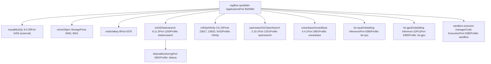
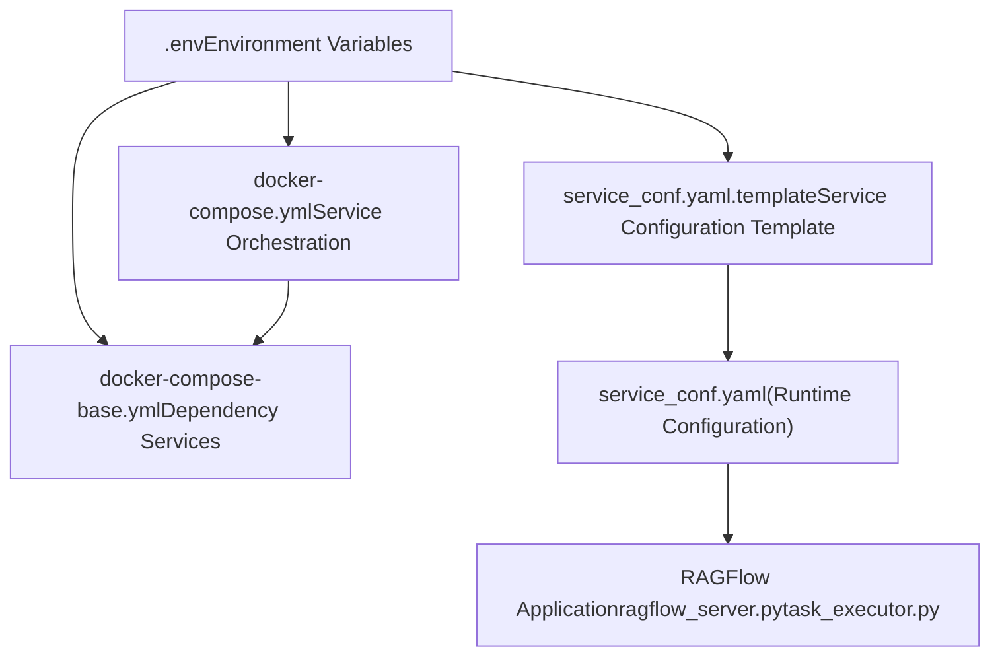
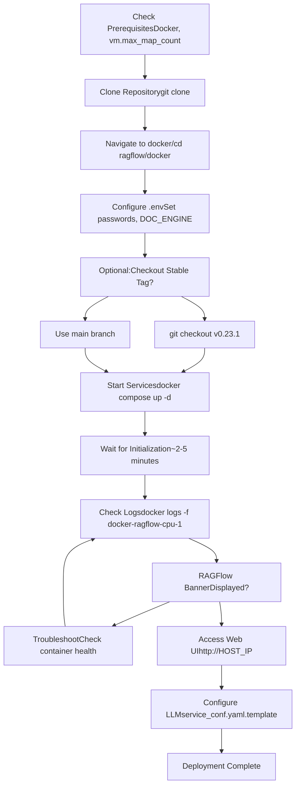
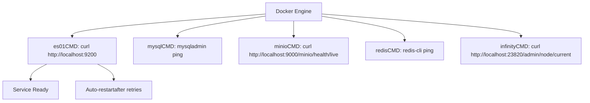

# Docker Compose Deployment

Relevant source files

-   [.github/workflows/release.yml](https://github.com/infiniflow/ragflow/blob/80a16e71/.github/workflows/release.yml)
-   [.github/workflows/tests.yml](https://github.com/infiniflow/ragflow/blob/80a16e71/.github/workflows/tests.yml)
-   [Dockerfile](https://github.com/infiniflow/ragflow/blob/80a16e71/Dockerfile)
-   [Dockerfile.deps](https://github.com/infiniflow/ragflow/blob/80a16e71/Dockerfile.deps)
-   [README.md](https://github.com/infiniflow/ragflow/blob/80a16e71/README.md)
-   [README\_id.md](https://github.com/infiniflow/ragflow/blob/80a16e71/README_id.md)
-   [README\_ja.md](https://github.com/infiniflow/ragflow/blob/80a16e71/README_ja.md)
-   [README\_ko.md](https://github.com/infiniflow/ragflow/blob/80a16e71/README_ko.md)
-   [README\_pt\_br.md](https://github.com/infiniflow/ragflow/blob/80a16e71/README_pt_br.md)
-   [README\_tzh.md](https://github.com/infiniflow/ragflow/blob/80a16e71/README_tzh.md)
-   [README\_zh.md](https://github.com/infiniflow/ragflow/blob/80a16e71/README_zh.md)
-   [api/db/runtime\_config.py](https://github.com/infiniflow/ragflow/blob/80a16e71/api/db/runtime_config.py)
-   [docker/.env](https://github.com/infiniflow/ragflow/blob/80a16e71/docker/.env)
-   [docker/README.md](https://github.com/infiniflow/ragflow/blob/80a16e71/docker/README.md)
-   [docs/configurations.md](https://github.com/infiniflow/ragflow/blob/80a16e71/docs/configurations.md)
-   [docs/guides/manage\_files.md](https://github.com/infiniflow/ragflow/blob/80a16e71/docs/guides/manage_files.md)
-   [docs/guides/upgrade\_ragflow.mdx](https://github.com/infiniflow/ragflow/blob/80a16e71/docs/guides/upgrade_ragflow.mdx)
-   [docs/quickstart.mdx](https://github.com/infiniflow/ragflow/blob/80a16e71/docs/quickstart.mdx)
-   [download\_deps.py](https://github.com/infiniflow/ragflow/blob/80a16e71/download_deps.py)

This document covers deploying RAGFlow using Docker Compose, including prerequisites, configuration management, service orchestration, and multi-engine profile selection. For Kubernetes deployment, see [2.3](/infiniflow/ragflow/2.3-document-engine-selection). For configuration details beyond Docker environment variables, see [Configuration Management](/infiniflow/ragflow/2.2-configuration-management). For document engine comparisons, see [Document Engine Selection](/infiniflow/ragflow/2.3-document-engine-selection).

---

## Purpose and Scope

Docker Compose provides the standard deployment method for RAGFlow, orchestrating all required services as containers on a single host. This deployment method supports:

-   **Single-server deployments** for development, testing, and small-to-medium production workloads
-   **Multiple document engine backends** (Elasticsearch, Infinity, OpenSearch, OceanBase) via Docker Compose profiles
-   **Optional services** including GPU-accelerated embedding inference (TEI), code execution sandboxes (gVisor), and monitoring (Kibana)
-   **Configurable resource limits** and port mappings suitable for various hardware configurations

This document assumes x86\_64 architecture. For ARM64 platforms, you must build Docker images locally following [Build System and CI/CD](/infiniflow/ragflow/2.4-build-system-and-cicd).

---

## Prerequisites

### Hardware Requirements

| Resource | Minimum | Recommended |
| --- | --- | --- |
| CPU | 4 cores (x86\_64) | 8+ cores |
| RAM | 16 GB | 32+ GB |
| Disk | 50 GB | 100+ GB SSD |

### Software Requirements

-   **Docker** >= 24.0.0
-   **Docker Compose** >= v2.26.1
-   **gVisor** (optional, required only for sandbox/code execution features)

The Docker installation must support the Compose V2 plugin (`docker compose` command, not `docker-compose`).

**Sources:** [README.md146-151](https://github.com/infiniflow/ragflow/blob/80a16e71/README.md#L146-L151) [docs/quickstart.mdx30-38](https://github.com/infiniflow/ragflow/blob/80a16e71/docs/quickstart.mdx#L30-L38)

---

## System Memory Configuration

### vm.max\_map\_count Requirement

RAGFlow's document engines (Elasticsearch, Infinity) require `vm.max_map_count` >= 262144. This kernel parameter controls the maximum number of memory map areas a process may allocate. The default value (65530) is insufficient for Elasticsearch's operation.

**Verification:**

```
sysctl vm.max_map_count
```
**Temporary Configuration (resets on reboot):**

```
sudo sysctl -w vm.max_map_count=262144
```
**Permanent Configuration:**

Add or update in `/etc/sysctl.conf`:

```
vm.max_map_count=262144
```
#### Platform-Specific Instructions

**macOS with Docker Desktop:**

```
docker run --rm --privileged --pid=host alpine sysctl -w vm.max_map_count=262144
```
For persistence, create `/Library/LaunchDaemons/com.user.vmmaxmap.plist` with appropriate settings.

**Windows with Docker Desktop WSL2:**

```
wsl -d docker-desktop -u root
sysctl -w vm.max_map_count=262144
```
For persistence, add to `%USERPROFILE%\.wslconfig`:

```
[wsl2]
kernelCommandLine = "sysctl.vm.max_map_count=262144"
```
**Sources:** [README.md158-178](https://github.com/infiniflow/ragflow/blob/80a16e71/README.md#L158-L178) [docs/quickstart.mdx45-183](https://github.com/infiniflow/ragflow/blob/80a16e71/docs/quickstart.mdx#L45-L183)

---

## Docker Compose Architecture

### Service Topology

The following diagram illustrates the complete service architecture managed by Docker Compose, showing core services, optional services, and their profiles.


### Service Definitions

**Core Services (docker-compose.yml):**

-   `ragflow-cpu`: Main application container running API server and task executor
-   `mysql`: Relational database for metadata (users, tenants, datasets, documents)
-   `minio`: S3-compatible object storage for file blobs
-   `redis`: Cache and task queue (128MB LRU cache, task messages)

**Document Engine Services (docker-compose-base.yml, profile-activated):**

-   `es01`: Elasticsearch for fulltext and vector storage
-   `infinity`: High-performance vector database (Infiniflow-developed)
-   `opensearch01`: Elasticsearch-compatible alternative
-   `oceanbase`: Distributed relational database with vector capabilities

**Optional Services (docker-compose-base.yml, profile-activated):**

-   `tei-cpu`/`tei-gpu`: Text Embeddings Inference for local embedding generation
-   `sandbox-executor-manager`: Isolated code execution environment using gVisor
-   `kibana`: Elasticsearch monitoring and management UI

**Sources:** [docker/docker-compose-base.yml1-220](https://github.com/infiniflow/ragflow/blob/80a16e71/docker/docker-compose-base.yml#L1-L220) [README.md186-206](https://github.com/infiniflow/ragflow/blob/80a16e71/README.md#L186-L206)

---

## Configuration Files

### File Hierarchy and Processing


### Configuration File Descriptions

| File | Purpose | Scope |
| --- | --- | --- |
| `docker/.env` | Docker environment variables, passwords, ports, image tags | Docker Compose |
| `docker/service_conf.yaml.template` | Backend service configuration template with `${VAR}` placeholders | RAGFlow Application |
| `docker/docker-compose.yml` | Main service definitions (ragflow-cpu) | Docker Compose |
| `docker/docker-compose-base.yml` | Dependency service definitions | Docker Compose |
| `docker/infinity_conf.toml` | Infinity-specific configuration | Infinity Service |
| `docker/entrypoint.sh` | Container startup script (generates service\_conf.yaml) | RAGFlow Container |

### Environment Variable Processing Flow

When the RAGFlow container starts, the `entrypoint.sh` script performs environment variable substitution:

1.  Reads `service_conf.yaml.template`
2.  Replaces `${VARIABLE_NAME}` placeholders with values from environment (`.env` file)
3.  Writes final `service_conf.yaml`
4.  Starts `ragflow_server.py` and `task_executor.py` using the generated configuration

**Example:**

Template:

```
mysql:
  host: ${MYSQL_HOST:-mysql}
  password: ${MYSQL_PASSWORD}
```
After substitution (with `MYSQL_HOST=mysql`, `MYSQL_PASSWORD=infini_rag_flow`):

```
mysql:
  host: mysql
  password: infini_rag_flow
```
**Sources:** [docker/README.md16-19](https://github.com/infiniflow/ragflow/blob/80a16e71/docker/README.md#L16-L19) [README.md254-262](https://github.com/infiniflow/ragflow/blob/80a16e71/README.md#L254-L262) [docs/configurations.md14-31](https://github.com/infiniflow/ragflow/blob/80a16e71/docs/configurations.md#L14-L31)

---

## Key Environment Variables

### Document Engine Selection

The `DOC_ENGINE` variable controls which document storage backend is activated via Docker Compose profiles:

```
# docker/.env
DOC_ENGINE=${DOC_ENGINE:-elasticsearch}
```
**Available Options:**

-   `elasticsearch` (default): Elasticsearch 8.11.3
-   `infinity`: Infinity 0.6.15 (high-performance vector DB)
-   `opensearch`: OpenSearch 2.19.1 (Elasticsearch fork)
-   `oceanbase`: OceanBase 4.4.1 (distributed RDBMS with vector support)

The `COMPOSE_PROFILES` variable is automatically constructed:

```
COMPOSE_PROFILES=${DOC_ENGINE},${DEVICE}
```
Where `DEVICE` is `cpu` (default) or `gpu` for DeepDoc inference acceleration.

**Sources:** [docker/.env13-27](https://github.com/infiniflow/ragflow/blob/80a16e71/docker/.env#L13-L27)

### Critical Connection Parameters

| Variable | Default | Description |
| --- | --- | --- |
| `MYSQL_HOST` | `mysql` | MySQL hostname (service name in Docker network) |
| `MYSQL_PORT` | `5455` | External MySQL port (internal: 3306) |
| `MYSQL_PASSWORD` | `infini_rag_flow` | MySQL root password |
| `MYSQL_DBNAME` | `rag_flow` | Primary database name |
| `MINIO_HOST` | `minio` | MinIO hostname |
| `MINIO_PORT` | `9000` | MinIO API port |
| `MINIO_USER` | `rag_flow` | MinIO root user |
| `MINIO_PASSWORD` | `infini_rag_flow` | MinIO root password |
| `REDIS_HOST` | `redis` | Redis hostname |
| `REDIS_PORT` | `6379` | Redis port |
| `REDIS_PASSWORD` | `infini_rag_flow` | Redis password |
| `ES_HOST` | `es01` | Elasticsearch hostname |
| `ES_PORT` | `1200` | External Elasticsearch port (internal: 9200) |
| `ELASTIC_PASSWORD` | `infini_rag_flow` | Elasticsearch password |
| `INFINITY_HOST` | `infinity` | Infinity hostname |
| `INFINITY_THRIFT_PORT` | `23817` | Infinity Thrift API port |
| `INFINITY_HTTP_PORT` | `23820` | Infinity HTTP API port |

**Security Warning:**

The default passwords (`infini_rag_flow`) are **insecure** for production deployments. Change all passwords before deploying to non-local environments:

```
# Generate secure password
openssl rand -hex 32
```
**Sources:** [docker/.env1-258](https://github.com/infiniflow/ragflow/blob/80a16e71/docker/.env#L1-L258) [docker/README.md23-64](https://github.com/infiniflow/ragflow/blob/80a16e71/docker/README.md#L23-L64)

### Service Ports

| Service | Internal Port | External Port (Default) | Environment Variable |
| --- | --- | --- | --- |
| RAGFlow HTTP | 80 | 80 | `SVR_WEB_HTTP_PORT` |
| RAGFlow HTTPS | 443 | 443 | `SVR_WEB_HTTPS_PORT` |
| RAGFlow API | 9380 | 9380 | `SVR_HTTP_PORT` |
| MySQL | 3306 | 5455 | `MYSQL_PORT` |
| MinIO API | 9000 | 9000 | `MINIO_PORT` |
| MinIO Console | 9001 | 9001 | `MINIO_CONSOLE_PORT` |
| Redis | 6379 | 6379 | `REDIS_PORT` |
| Elasticsearch | 9200 | 1200 | `ES_PORT` |
| OpenSearch | 9201 | 1201 | `OS_PORT` |
| Infinity Thrift | 23817 | 23817 | `INFINITY_THRIFT_PORT` |
| Infinity HTTP | 23820 | 23820 | `INFINITY_HTTP_PORT` |
| Kibana | 5601 | 6601 | `KIBANA_PORT` |
| TEI | 80 | 6380 | `TEI_PORT` |
| Sandbox Manager | 9385 | 9385 | `SANDBOX_EXECUTOR_MANAGER_PORT` |

**Sources:** [docker/.env131-237](https://github.com/infiniflow/ragflow/blob/80a16e71/docker/.env#L131-L237) [docker/README.md49-83](https://github.com/infiniflow/ragflow/blob/80a16e71/docker/README.md#L49-L83)

---

## Docker Compose Profiles

### Profile Selection Mechanism

Docker Compose profiles enable/disable service groups based on configuration. The `COMPOSE_PROFILES` environment variable determines which services start.

**Profile Composition:**

```
# From docker/.env
DOC_ENGINE=${DOC_ENGINE:-elasticsearch}
DEVICE=${DEVICE:-cpu}
COMPOSE_PROFILES=${DOC_ENGINE},${DEVICE}
```
**Example Configurations:**

| DOC\_ENGINE | DEVICE | COMPOSE\_PROFILES | Active Services |
| --- | --- | --- | --- |
| `elasticsearch` | `cpu` | `elasticsearch,cpu` | es01, mysql, minio, redis, ragflow-cpu |
| `infinity` | `cpu` | `infinity,cpu` | infinity, mysql, minio, redis, ragflow-cpu |
| `opensearch` | `cpu` | `opensearch,cpu` | opensearch01, mysql, minio, redis, ragflow-cpu |
| `elasticsearch` | `gpu` | `elasticsearch,gpu` | es01, mysql, minio, redis, ragflow-gpu |

### Adding Optional Services

Optional services are enabled by appending to `COMPOSE_PROFILES`:

**Enable TEI CPU:**

```
# docker/.env
COMPOSE_PROFILES=${COMPOSE_PROFILES},tei-cpu
```
**Enable Sandbox:**

```
# docker/.env
SANDBOX_ENABLED=1
COMPOSE_PROFILES=${COMPOSE_PROFILES},sandbox
```
**Enable Kibana:**

```
# docker/.env
COMPOSE_PROFILES=${COMPOSE_PROFILES},kibana
```
Multiple optional profiles can be combined:

```
COMPOSE_PROFILES=${DOC_ENGINE},${DEVICE},tei-cpu,sandbox
```
**Sources:** [docker/.env12-27](https://github.com/infiniflow/ragflow/blob/80a16e71/docker/.env#L12-L27) [docker/.env151-153](https://github.com/infiniflow/ragflow/blob/80a16e71/docker/.env#L151-L153) [docker/.env219-221](https://github.com/infiniflow/ragflow/blob/80a16e71/docker/.env#L219-L221) [docker/README.md84-125](https://github.com/infiniflow/ragflow/blob/80a16e71/docker/README.md#L84-L125)

### Service Profile Definitions

From [docker/docker-compose-base.yml1-267](https://github.com/infiniflow/ragflow/blob/80a16e71/docker/docker-compose-base.yml#L1-L267):

| Service | Profile | Lines | Purpose |
| --- | --- | --- | --- |
| `es01` | `elasticsearch` | 2-34 | Elasticsearch document engine |
| `opensearch01` | `opensearch` | 36-70 | OpenSearch document engine |
| `infinity` | `infinity` | 72-97 | Infinity vector database |
| `oceanbase` | `oceanbase` | 99-122 | OceanBase distributed database |
| `sandbox-executor-manager` | `sandbox` | 124-150 | Code execution sandbox |
| `tei-cpu` | `tei-cpu` | 220-231 | CPU-based embedding inference |
| `tei-gpu` | `tei-gpu` | 234-252 | GPU-accelerated embedding inference |
| `kibana` | `kibana` | 255-267 | Elasticsearch monitoring |
| `mysql` | (always) | 152-178 | Relational database |
| `minio` | (always) | 180-199 | Object storage |
| `redis` | (always) | 201-217 | Cache and queue |

---

## Deployment Procedures

### Standard Deployment Workflow


### Step-by-Step Instructions

#### 1\. System Preparation

Set `vm.max_map_count` (see [System Memory Configuration](https://github.com/infiniflow/ragflow/blob/80a16e71/System Memory Configuration) above).

#### 2\. Clone Repository

```
git clone https://github.com/infiniflow/ragflow.git
cd ragflow/docker
```
**Optional: Use Stable Release**

```
git checkout v0.23.1
```
This ensures the `entrypoint.sh` script matches the Docker image version.

**Sources:** [README.md180-199](https://github.com/infiniflow/ragflow/blob/80a16e71/README.md#L180-L199) [docs/quickstart.mdx187-193](https://github.com/infiniflow/ragflow/blob/80a16e71/docs/quickstart.mdx#L187-L193)

#### 3\. Configure Environment

Edit `docker/.env`:

```
# Change passwords (REQUIRED for production)
MYSQL_PASSWORD=your_secure_password_here
MINIO_PASSWORD=your_secure_password_here
REDIS_PASSWORD=your_secure_password_here
ELASTIC_PASSWORD=your_secure_password_here

# Select document engine
DOC_ENGINE=elasticsearch  # or infinity, opensearch, oceanbase

# Optional: Enable services
# COMPOSE_PROFILES=${COMPOSE_PROFILES},tei-cpu
# SANDBOX_ENABLED=1
# COMPOSE_PROFILES=${COMPOSE_PROFILES},sandbox
```
**Chinese Mirror Sites (if Docker Hub inaccessible):**

```
# Huawei Cloud
RAGFLOW_IMAGE=swr.cn-north-4.myhuaweicloud.com/infiniflow/ragflow:v0.23.1

# Alibaba Cloud
RAGFLOW_IMAGE=registry.cn-hangzhou.aliyuncs.com/infiniflow/ragflow:v0.23.1
```
**Sources:** [docker/.env1-6](https://github.com/infiniflow/ragflow/blob/80a16e71/docker/.env#L1-L6) [README\_zh.md218-221](https://github.com/infiniflow/ragflow/blob/80a16e71/README_zh.md#L218-L221) [docker/.env140-148](https://github.com/infiniflow/ragflow/blob/80a16e71/docker/.env#L140-L148)

#### 4\. Start Services

```
docker compose -f docker-compose.yml up -d
```
This command:

-   Downloads required Docker images (~2 GB compressed, ~7 GB unpacked)
-   Creates Docker volumes for persistent data
-   Starts services in dependency order
-   Returns control immediately (detached mode)

**GPU Acceleration (optional):**

```
# Enable GPU for DeepDoc tasks
sed -i '1i DEVICE=gpu' .env
docker compose -f docker-compose.yml up -d
```
**Sources:** [README.md194-206](https://github.com/infiniflow/ragflow/blob/80a16e71/README.md#L194-L206) [docs/quickstart.mdx197-200](https://github.com/infiniflow/ragflow/blob/80a16e71/docs/quickstart.mdx#L197-L200)

#### 5\. Verify Startup

Monitor the main container logs:

```
docker logs -f docker-ragflow-cpu-1
```
**Successful Startup Indicator:**

```
     ____   ___    ______ ______ __
    / __ \ /   |  / ____// ____// /____  _      __
   / /_/ // /| | / / __ / /_   / // __ \| | /| / /
  / _, _// ___ |/ /_/ // __/  / // /_/ /| |/ |/ /
 /_/ |_|/_/  |_|\____//_/    /_/ \____/ |__/|__/

 * Running on all addresses (0.0.0.0)
```
**Typical Startup Time:** 2-5 minutes (depends on hardware and document engine)

**Sources:** [README.md220-235](https://github.com/infiniflow/ragflow/blob/80a16e71/README.md#L220-L235) [docs/quickstart.mdx220-238](https://github.com/infiniflow/ragflow/blob/80a16e71/docs/quickstart.mdx#L220-L238)

#### 6\. Access Web Interface

Open browser to:

```
http://<YOUR_SERVER_IP>
```
Default port 80 is omitted. For custom ports, see [Changing the HTTP Port](https://github.com/infiniflow/ragflow/blob/80a16e71/Changing the HTTP Port)

**Warning:** Do not access the UI before seeing the startup banner in logs. The application may not be fully initialized, resulting in "network abnormal" errors.

**Sources:** [README.md239-245](https://github.com/infiniflow/ragflow/blob/80a16e71/README.md#L239-L245) [docs/quickstart.mdx242-245](https://github.com/infiniflow/ragflow/blob/80a16e71/docs/quickstart.mdx#L242-L245)

#### 7\. Configure LLM

Before using RAGFlow, configure at least one LLM provider:

1.  Access **Settings** > **Model Providers** in the web UI
2.  Add API key for your chosen provider (OpenAI, Anthropic, Google, etc.)
3.  Set default models in **System Model Settings**

Alternatively, edit `docker/service_conf.yaml.template` before starting:

```
user_default_llm:
  "OpenAI-API-Compatible":
    api_key: "your-api-key-here"
```
Restart containers after changes:

```
docker compose -f docker-compose.yml down
docker compose -f docker-compose.yml up -d
```
**Sources:** [README.md244-248](https://github.com/infiniflow/ragflow/blob/80a16e71/README.md#L244-L248) [docs/quickstart.mdx247-269](https://github.com/infiniflow/ragflow/blob/80a16e71/docs/quickstart.mdx#L247-L269)

---

## Switching Document Engines

### Procedure

Changing document engines **requires data deletion** because different engines use incompatible storage formats and indexing structures.

**Steps:**

1.  **Stop all containers and remove volumes:**

```
docker compose -f docker-compose.yml down -v
```
**Warning:** The `-v` flag deletes all Docker volumes, permanently removing uploaded files, parsed documents, and vector embeddings.

2.  **Update DOC\_ENGINE in docker/.env:**

```
# Switch to Infinity
DOC_ENGINE=infinity
```
3.  **Restart services:**

```
docker compose -f docker-compose.yml up -d
```
**Sources:** [README.md273-291](https://github.com/infiniflow/ragflow/blob/80a16e71/README.md#L273-L291) [docs/quickstart.mdx273-291](https://github.com/infiniflow/ragflow/blob/80a16e71/docs/quickstart.mdx#L273-L291)

### Document Engine Characteristics

| Engine | Type | Strengths | Limitations |
| --- | --- | --- | --- |
| Elasticsearch | Fulltext + Vector | Mature, full-featured, extensive tooling | Higher memory usage (~8GB) |
| Infinity | Vector-Optimized | High performance, lower resource usage | Newer, less tooling |
| OpenSearch | Fulltext + Vector | Elasticsearch-compatible, open governance | Similar resource requirements to ES |
| OceanBase | Relational + Vector | ACID transactions, distributed architecture | Complex setup, primarily for China market |

For detailed comparisons, see [Document Engine Selection](/infiniflow/ragflow/2.3-document-engine-selection).

**Sources:** [docker/.env13-19](https://github.com/infiniflow/ragflow/blob/80a16e71/docker/.env#L13-L19) [docker/README.md24-37](https://github.com/infiniflow/ragflow/blob/80a16e71/docker/README.md#L24-L37)

---

## Resource Management

### Memory Limits

Docker Compose enforces memory limits to prevent container overconsumption:

```
# docker/.env
MEM_LIMIT=8073741824  # 8 GB in bytes
```
This limit applies to:

-   Elasticsearch (`es01`)
-   OpenSearch (`opensearch01`)
-   Infinity (`infinity`)
-   OceanBase (`oceanbase`)

**Configuration in docker-compose-base.yml:**

```
es01:
  mem_limit: ${MEM_LIMIT}
  ulimits:
    memlock:
      soft: -1
      hard: -1
```
**Adjusting for Available Memory:**

Update `MEM_LIMIT` based on total system RAM:

| System RAM | Recommended MEM\_LIMIT |
| --- | --- |
| 16 GB | 8 GB (8073741824) |
| 32 GB | 16 GB (17179869184) |
| 64 GB | 32 GB (34359738368) |

**Sources:** [docker/.env63-64](https://github.com/infiniflow/ragflow/blob/80a16e71/docker/.env#L63-L64) [docker/docker-compose-base.yml22](https://github.com/infiniflow/ragflow/blob/80a16e71/docker/docker-compose-base.yml#L22-L22) [docker/README.md46-48](https://github.com/infiniflow/ragflow/blob/80a16e71/docker/README.md#L46-L48)

### Disk Watermarks (Elasticsearch/OpenSearch)

Elasticsearch and OpenSearch use disk watermark thresholds to prevent disk exhaustion:

```
environment:
  - cluster.routing.allocation.disk.watermark.low=5gb
  - cluster.routing.allocation.disk.watermark.high=3gb
  - cluster.routing.allocation.disk.watermark.flood_stage=2gb
```
-   **Low watermark (5GB):** No new shards allocated to node
-   **High watermark (3GB):** Shards relocated to other nodes
-   **Flood stage (2GB):** Index becomes read-only

Ensure at least 10GB free disk space for document engine operation.

**Sources:** [docker/docker-compose-base.yml19-21](https://github.com/infiniflow/ragflow/blob/80a16e71/docker/docker-compose-base.yml#L19-L21) [docker/docker-compose-base.yml54-56](https://github.com/infiniflow/ragflow/blob/80a16e71/docker/docker-compose-base.yml#L54-L56)

---

## Health Checks

### Container Health Monitoring

All critical services define health check commands that Docker monitors:


### Health Check Configuration

From [docker/docker-compose-base.yml27-33](https://github.com/infiniflow/ragflow/blob/80a16e71/docker/docker-compose-base.yml#L27-L33):

```
healthcheck:
  test: ["CMD-SHELL", "curl http://localhost:9200"]
  interval: 10s
  timeout: 10s
  retries: 120
```
**Parameters:**

-   `interval`: Check frequency (10 seconds)
-   `timeout`: Maximum check duration (10 seconds)
-   `retries`: Number of consecutive failures before marking unhealthy (120 = 20 minutes)

### Checking Service Health

**View all container statuses:**

```
docker compose ps
```
Output includes health status (healthy/unhealthy/starting).

**Inspect specific service:**

```
docker inspect docker-es01-1 | grep -A 10 Health
```
**Common Health Check Commands:**

| Service | Health Check Command |
| --- | --- |
| Elasticsearch | `curl http://localhost:9200` |
| OpenSearch | `curl http://localhost:9201` |
| Infinity | `curl http://localhost:23820/admin/node/current` |
| MySQL | `mysqladmin ping -uroot -p${MYSQL_PASSWORD}` |
| MinIO | `curl -f http://localhost:9000/minio/health/live` |
| Redis | `redis-cli -a ${REDIS_PASSWORD} ping` |
| Sandbox | `curl http://localhost:9385/healthz` |

**Sources:** [docker/docker-compose-base.yml27-217](https://github.com/infiniflow/ragflow/blob/80a16e71/docker/docker-compose-base.yml#L27-L217)

---

## Network Configuration

### Docker Network Topology

All services communicate via a dedicated Docker bridge network named `ragflow`:

```
networks:
  ragflow:
    name: ragflow
    driver: bridge
```
Services reference each other by container name (e.g., `mysql`, `minio`, `es01`) which Docker DNS resolves within the network.

### Changing the HTTP Port

To change RAGFlow's external HTTP port from default 80:

**Edit docker/docker-compose.yml:**

```
services:
  ragflow:
    ports:
      - "${SVR_WEB_HTTP_PORT}:80"  # Change left side only
```
**Update docker/.env:**

```
SVR_WEB_HTTP_PORT=8080  # New external port
```
**Restart:**

```
docker compose -f docker-compose.yml up -d
```
Access at `http://<HOST_IP>:8080`.

**Warning:** The internal port (right side of `:`) must remain `80`. Only change the external port (left side).

**Sources:** [README.md264-266](https://github.com/infiniflow/ragflow/blob/80a16e71/README.md#L264-L266) [docs/configurations.md20-22](https://github.com/infiniflow/ragflow/blob/80a16e71/docs/configurations.md#L20-L22)

### Hostname Resolution for Development

When running RAGFlow from source (not Docker), add service hostnames to `/etc/hosts`:

```
127.0.0.1  es01 infinity opensearch01 mysql minio redis sandbox-executor-manager oceanbase
```
This allows the RAGFlow application to resolve service names configured in `service_conf.yaml`.

**Sources:** [README.md337-341](https://github.com/infiniflow/ragflow/blob/80a16e71/README.md#L337-L341)

---

## Data Persistence

### Docker Volumes

Persistent data is stored in named Docker volumes:

| Volume Name | Service | Data Stored |
| --- | --- | --- |
| `esdata01` | Elasticsearch | Indices, documents, vectors |
| `osdata01` | OpenSearch | Indices, documents, vectors |
| `infinity_data` | Infinity | Vector database files |
| `mysql_data` | MySQL | Relational tables, metadata |
| `minio_data` | MinIO | Uploaded files, objects |
| `redis_data` | Redis | Cache, task queue messages |

**Listing Volumes:**

```
docker volume ls | grep ragflow
```
**Inspecting Volume Location:**

```
docker volume inspect docker_mysql_data
```
**Backup Considerations:**

-   **MySQL:** Use `mysqldump` or snapshot `mysql_data` volume
-   **MinIO:** Use `mc mirror` or snapshot `minio_data` volume
-   **Document Engine:** Export indices or snapshot data volumes

**Warning:** `docker compose down -v` deletes all volumes. Use `docker compose down` (without `-v`) to preserve data between restarts.

**Sources:** [docker/docker-compose-base.yml6-209](https://github.com/infiniflow/ragflow/blob/80a16e71/docker/docker-compose-base.yml#L6-L209)

---

## Troubleshooting

### Container Fails to Start

**Check container logs:**

```
docker logs docker-ragflow-cpu-1
docker logs docker-es01-1
docker logs docker-mysql-1
```
**Common Issues:**

1.  **vm.max\_map\_count too low:**

    -   Symptom: `max virtual memory areas vm.max_map_count [65530] is too low, increase to at least [262144]`
    -   Solution: Set `vm.max_map_count=262144` (see [System Memory Configuration](https://github.com/infiniflow/ragflow/blob/80a16e71/System Memory Configuration))
2.  **Insufficient memory:**

    -   Symptom: Elasticsearch/Infinity container exits immediately
    -   Solution: Increase `MEM_LIMIT` in `.env` or reduce other container memory usage
3.  **Port conflicts:**

    -   Symptom: `bind: address already in use`
    -   Solution: Change conflicting port in `.env` (e.g., `MYSQL_PORT`, `ES_PORT`)

**Sources:** [docs/quickstart.mdx73-76](https://github.com/infiniflow/ragflow/blob/80a16e71/docs/quickstart.mdx#L73-L76) [docs/quickstart.mdx157-159](https://github.com/infiniflow/ragflow/blob/80a16e71/docs/quickstart.mdx#L157-L159)

### Cannot Connect to Document Engine

**Error:** `Can't connect to ES cluster` or similar

**Checks:**

1.  **Verify service health:**

    ```
    docker compose ps
    ```

2.  **Check document engine logs:**

    ```
    docker logs docker-es01-1
    # or
    docker logs docker-infinity-1
    ```

3.  **Verify DOC\_ENGINE matches running service:**

    ```
    grep DOC_ENGINE .env
    docker ps | grep -E 'es01|infinity|opensearch|oceanbase'
    ```

4.  **Test connectivity from RAGFlow container:**

    ```
    docker exec docker-ragflow-cpu-1 curl http://es01:9200
    # or
    docker exec docker-ragflow-cpu-1 curl http://infinity:23820/admin/node/current
    ```


**Sources:** [docs/quickstart.mdx73-76](https://github.com/infiniflow/ragflow/blob/80a16e71/docs/quickstart.mdx#L73-L76)

### Document Parsing Stalls

**Symptom:** Parsing progress stuck at <1% or near completion

**Potential Causes:**

1.  **Redis queue issues:** Restart Redis container
2.  **Task executor not running:** Check `docker logs docker-ragflow-cpu-1 | grep task_executor`
3.  **Document engine overload:** Check memory usage and disk space

**Solutions:**

```
# Restart all services
docker compose -f docker-compose.yml restart

# Check task executor status
docker exec docker-ragflow-cpu-1 ps aux | grep task_executor
```
**Sources:** [docs/quickstart.mdx298-301](https://github.com/infiniflow/ragflow/blob/80a16e71/docs/quickstart.mdx#L298-L301)

### Permission Denied Errors

**Symptom:** `Permission denied` when accessing volumes

**Solution:**

Ensure Docker has permission to access volume mount points. On Linux, may require:

```
sudo chown -R $(id -u):$(id -g) docker/
```
Or run Docker commands with `sudo`.

---

## Upgrading RAGFlow

### Upgrade Procedure

To upgrade to a newer RAGFlow version:

1.  **Stop services:**

    ```
    docker compose -f docker-compose.yml down
    ```

2.  **Pull latest code:**

    ```
    git pull
    ```

3.  **Update image tag in .env:**

    ```
    RAGFLOW_IMAGE=infiniflow/ragflow:v0.24.0  # Example
    ```

4.  **Restart services:**

    ```
    docker compose -f docker-compose.yml up -d
    ```


**Important:** Do not use `-v` flag with `down` command unless you intend to delete all data.

For version-specific upgrade notes, see [Upgrading](https://github.com/infiniflow/ragflow/blob/80a16e71/Upgrading)

**Sources:** [docs/guides/upgrade\_ragflow.mdx14-30](https://github.com/infiniflow/ragflow/blob/80a16e71/docs/guides/upgrade_ragflow.mdx#L14-L30)

---

## Advanced Configurations

### Enabling Optional Services

**TEI Embedding Service (CPU):**

```
# docker/.env
COMPOSE_PROFILES=${COMPOSE_PROFILES},tei-cpu
TEI_MODEL=BAAI/bge-small-en-v1.5  # Optional: change model
```
**Sandbox Code Execution:**

```
# docker/.env
SANDBOX_ENABLED=1
COMPOSE_PROFILES=${COMPOSE_PROFILES},sandbox

# Pull base images first
docker pull infiniflow/sandbox-base-python:latest
docker pull infiniflow/sandbox-base-nodejs:latest
```
**Sources:** [docker/.env151-240](https://github.com/infiniflow/ragflow/blob/80a16e71/docker/.env#L151-L240)

### Storage Backend Alternatives

**AWS S3:**

```
# docker/.env
STORAGE_IMPL=S3
AWS_ACCESS_KEY=your_access_key
AWS_SECRET_KEY=your_secret_key
AWS_REGION=us-east-1
AWS_BUCKET=ragflow-data
```
**Aliyun OSS:**

```
# docker/.env
STORAGE_IMPL=OSS
ACCESS_KEY=your_access_key
SECRET_KEY=your_secret_key
ENDPOINT=http://oss-cn-hangzhou.aliyuncs.com
REGION=cn-hangzhou
BUCKET=ragflow65536
```
**Sources:** [docker/.env206-212](https://github.com/infiniflow/ragflow/blob/80a16e71/docker/.env#L206-L212)

### Custom Docker Networks

To integrate RAGFlow with existing Docker infrastructure, use external networks:

```
# docker-compose.yml
networks:
  ragflow:
    external: true
    name: my-existing-network
```
Ensure all dependent services (MySQL, MinIO, Redis, document engine) are on the same network.

---

## Sources Summary

**Primary Configuration Files:**

-   [docker/.env1-258](https://github.com/infiniflow/ragflow/blob/80a16e71/docker/.env#L1-L258) - Environment variables and defaults
-   [docker/docker-compose-base.yml1-267](https://github.com/infiniflow/ragflow/blob/80a16e71/docker/docker-compose-base.yml#L1-L267) - Dependency service definitions
-   [docker/README.md1-264](https://github.com/infiniflow/ragflow/blob/80a16e71/docker/README.md#L1-L264) - Docker configuration documentation
-   [docker/infinity\_conf.toml1-40](https://github.com/infiniflow/ragflow/blob/80a16e71/docker/infinity_conf.toml#L1-L40) - Infinity service configuration

**Deployment Documentation:**

-   [README.md143-291](https://github.com/infiniflow/ragflow/blob/80a16e71/README.md#L143-L291) - Main deployment instructions
-   [README\_zh.md143-293](https://github.com/infiniflow/ragflow/blob/80a16e71/README_zh.md#L143-L293) - Chinese deployment guide
-   [docs/quickstart.mdx1-363](https://github.com/infiniflow/ragflow/blob/80a16e71/docs/quickstart.mdx#L1-L363) - Detailed quickstart guide
-   [docs/configurations.md1-280](https://github.com/infiniflow/ragflow/blob/80a16e71/docs/configurations.md#L1-L280) - Configuration reference
-   [docs/guides/upgrade\_ragflow.mdx1-89](https://github.com/infiniflow/ragflow/blob/80a16e71/docs/guides/upgrade_ragflow.mdx#L1-L89) - Upgrade procedures

**Architecture References:**

-   [pyproject.toml1-9](https://github.com/infiniflow/ragflow/blob/80a16e71/pyproject.toml#L1-L9) - RAGFlow version and metadata
-   [helm/values.yaml1-185](https://github.com/infiniflow/ragflow/blob/80a16e71/helm/values.yaml#L1-L185) - Kubernetes equivalent configuration
-   [common/constants.py1-201](https://github.com/infiniflow/ragflow/blob/80a16e71/common/constants.py#L1-L201) - System constants and enums
-   [common/data\_source/config.py1-186](https://github.com/infiniflow/ragflow/blob/80a16e71/common/data_source/config.py#L1-L186) - Data source configuration
