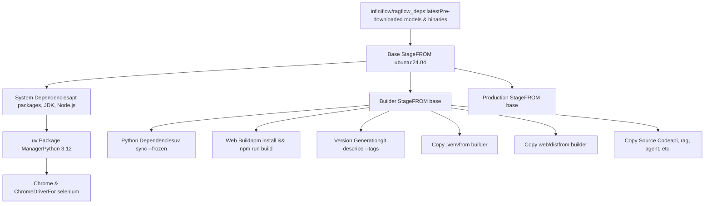
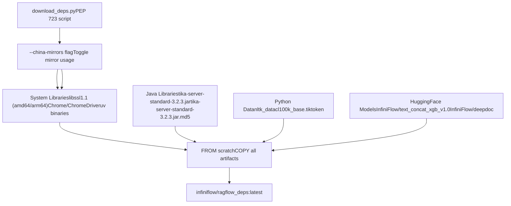
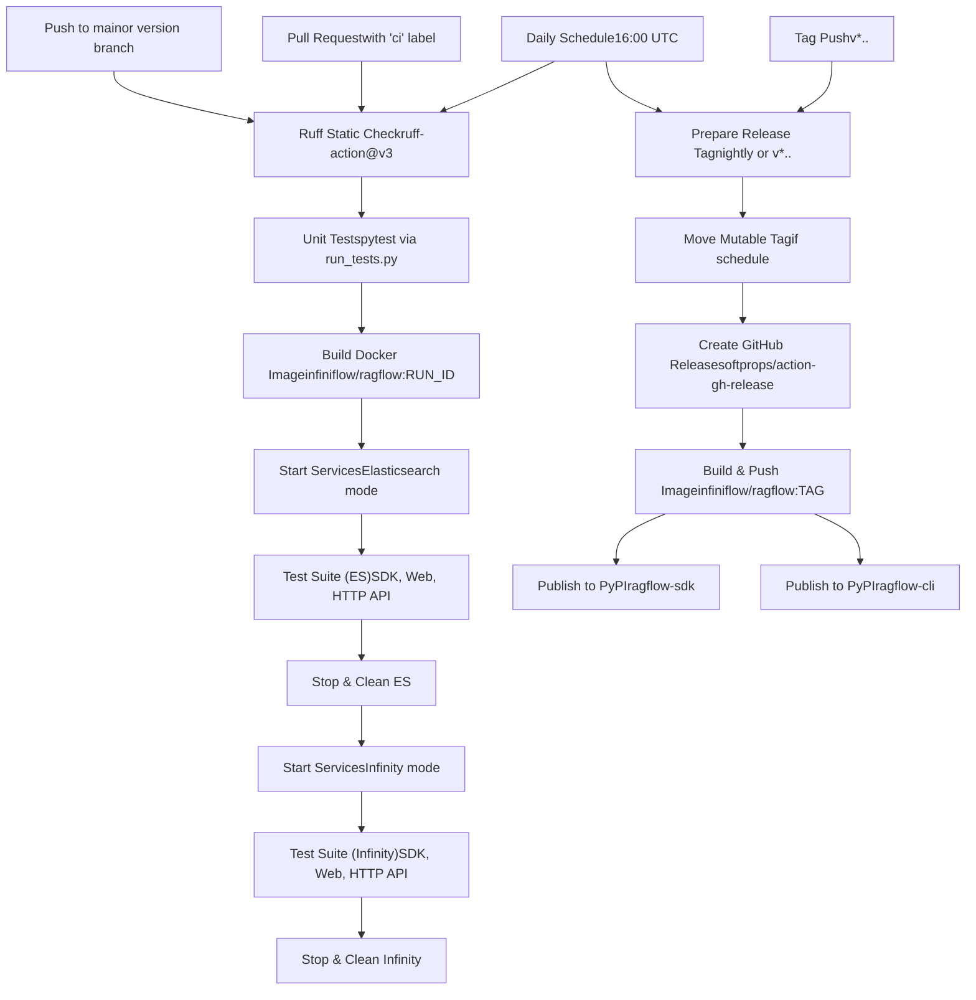

# Build System and CI/CD

Relevant source files

-   [.github/workflows/release.yml](https://github.com/infiniflow/ragflow/blob/80a16e71/.github/workflows/release.yml)
-   [.github/workflows/tests.yml](https://github.com/infiniflow/ragflow/blob/80a16e71/.github/workflows/tests.yml)
-   [Dockerfile](https://github.com/infiniflow/ragflow/blob/80a16e71/Dockerfile)
-   [Dockerfile.deps](https://github.com/infiniflow/ragflow/blob/80a16e71/Dockerfile.deps)
-   [api/apps/connector\_app.py](https://github.com/infiniflow/ragflow/blob/80a16e71/api/apps/connector_app.py)
-   [api/db/runtime\_config.py](https://github.com/infiniflow/ragflow/blob/80a16e71/api/db/runtime_config.py)
-   [api/db/services/connector\_service.py](https://github.com/infiniflow/ragflow/blob/80a16e71/api/db/services/connector_service.py)
-   [api/utils/common.py](https://github.com/infiniflow/ragflow/blob/80a16e71/api/utils/common.py)
-   [common/constants.py](https://github.com/infiniflow/ragflow/blob/80a16e71/common/constants.py)
-   [common/data\_source/\_\_init\_\_.py](https://github.com/infiniflow/ragflow/blob/80a16e71/common/data_source/__init__.py)
-   [common/data\_source/config.py](https://github.com/infiniflow/ragflow/blob/80a16e71/common/data_source/config.py)
-   [docker/docker-compose-base.yml](https://github.com/infiniflow/ragflow/blob/80a16e71/docker/docker-compose-base.yml)
-   [docker/infinity\_conf.toml](https://github.com/infiniflow/ragflow/blob/80a16e71/docker/infinity_conf.toml)
-   [download\_deps.py](https://github.com/infiniflow/ragflow/blob/80a16e71/download_deps.py)
-   [helm/values.yaml](https://github.com/infiniflow/ragflow/blob/80a16e71/helm/values.yaml)
-   [pyproject.toml](https://github.com/infiniflow/ragflow/blob/80a16e71/pyproject.toml)
-   [rag/svr/sync\_data\_source.py](https://github.com/infiniflow/ragflow/blob/80a16e71/rag/svr/sync_data_source.py)
-   [sdk/python/pyproject.toml](https://github.com/infiniflow/ragflow/blob/80a16e71/sdk/python/pyproject.toml)
-   [sdk/python/uv.lock](https://github.com/infiniflow/ragflow/blob/80a16e71/sdk/python/uv.lock)
-   [uv.lock](https://github.com/infiniflow/ragflow/blob/80a16e71/uv.lock)
-   [web/src/pages/user-setting/data-source/constant/index.tsx](https://github.com/infiniflow/ragflow/blob/80a16e71/web/src/pages/user-setting/data-source/constant/index.tsx)

This document describes the build system, dependency management, and continuous integration/delivery pipeline for RAGFlow. It covers the multi-stage Docker build process, dependency caching strategies, GitHub Actions workflows for testing and releases, and the automated publishing process for Docker images and Python packages.

For information about deployment and runtime configuration, see [Docker Compose Deployment](/infiniflow/ragflow/2.1-docker-compose-deployment) and [Configuration Management](/infiniflow/ragflow/2.2-configuration-management). For information about the document storage backends available at build time, see [Document Engine Selection](/infiniflow/ragflow/2.3-document-engine-selection).

---

## Build System Overview

RAGFlow uses a three-stage Docker build process with aggressive dependency caching to minimize build times. The build system is designed to work both in environments with free internet access and in restricted networks (e.g., China) through mirror support.

### Multi-Stage Docker Build Architecture


**Multi-Stage Build Process Diagram**

The build uses three distinct stages that share a common base to maximize layer reuse while minimizing final image size.

Sources: [Dockerfile1-211](https://github.com/infiniflow/ragflow/blob/80a16e71/Dockerfile#L1-L211) [Dockerfile.deps1-11](https://github.com/infiniflow/ragflow/blob/80a16e71/Dockerfile.deps#L1-L11)

### Base Stage: System Dependencies

The base stage installs all system-level dependencies required for both build and runtime. It copies pre-downloaded resources from the `infiniflow/ragflow_deps:latest` cache image to avoid repeated downloads.

**Key Components:**

-   **Operating System**: Ubuntu 24.04 [Dockerfile2](https://github.com/infiniflow/ragflow/blob/80a16e71/Dockerfile#L2-L2)
-   **Python**: Managed by `uv`, version 3.12 [Dockerfile73](https://github.com/infiniflow/ragflow/blob/80a16e71/Dockerfile#L73-L73)
-   **Node.js**: Version 20.x from NodeSource [Dockerfile79-84](https://github.com/infiniflow/ragflow/blob/80a16e71/Dockerfile#L79-L84)
-   **Rust/Cargo**: Required for building certain Python extensions [Dockerfile87-100](https://github.com/infiniflow/ragflow/blob/80a16e71/Dockerfile#L87-L100)
-   **Java**: default-jdk for Apache Tika [Dockerfile48](https://github.com/infiniflow/ragflow/blob/80a16e71/Dockerfile#L48-L48)
-   **Chrome/ChromeDriver**: For Selenium-based web scraping [Dockerfile122-129](https://github.com/infiniflow/ragflow/blob/80a16e71/Dockerfile#L122-L129)

The base stage uses mount caching for apt packages to speed up subsequent builds:

```
RUN --mount=type=cache,id=ragflow_apt,target=/var/cache/apt,sharing=locked \
    apt update && apt install -y <packages>
```
**Mirror Support**: When `NEED_MIRROR=1` is set, the build uses Chinese mirrors for Ubuntu, Rust, and Python packages [Dockerfile38-92](https://github.com/infiniflow/ragflow/blob/80a16e71/Dockerfile#L38-L92)

Sources: [Dockerfile1-139](https://github.com/infiniflow/ragflow/blob/80a16e71/Dockerfile#L1-L139)

### Builder Stage: Compilation and Assets

The builder stage performs all compilation tasks:

1.  **Python Dependencies**: Installs from `uv.lock` using `uv sync --frozen` [Dockerfile152-160](https://github.com/infiniflow/ragflow/blob/80a16e71/Dockerfile#L152-L160)
2.  **Web Assets**: Builds React frontend with `npm install && npm run build` [Dockerfile162-166](https://github.com/infiniflow/ragflow/blob/80a16e71/Dockerfile#L162-L166)
3.  **Version Information**: Extracts version from git tags using `git describe` [Dockerfile168-173](https://github.com/infiniflow/ragflow/blob/80a16e71/Dockerfile#L168-L173)

The builder uses mount caching for both `uv` and `npm`:

```
RUN --mount=type=cache,id=ragflow_uv,target=/root/.cache/uv,sharing=locked \
    uv sync --python 3.12 --frozen
```
Sources: [Dockerfile142-174](https://github.com/infiniflow/ragflow/blob/80a16e71/Dockerfile#L142-L174)

### Production Stage: Minimal Runtime

The production stage copies only the necessary artifacts from the builder:

-   Python virtual environment from `.venv` [Dockerfile182-184](https://github.com/infiniflow/ragflow/blob/80a16e71/Dockerfile#L182-L184)
-   Compiled web assets from `web/dist` [Dockerfile207](https://github.com/infiniflow/ragflow/blob/80a16e71/Dockerfile#L207-L207)
-   Source code (api, rag, agent, etc.) [Dockerfile188-200](https://github.com/infiniflow/ragflow/blob/80a16e71/Dockerfile#L188-L200)
-   Configuration templates [Dockerfile202-204](https://github.com/infiniflow/ragflow/blob/80a16e71/Dockerfile#L202-L204)

The final image size is minimized by excluding build tools, source maps, and intermediate artifacts.

Sources: [Dockerfile176-211](https://github.com/infiniflow/ragflow/blob/80a16e71/Dockerfile#L176-L211)

---

## Dependency Management

### Download Script Architecture


**Dependency Download and Caching Workflow**

Sources: [download\_deps.py1-82](https://github.com/infiniflow/ragflow/blob/80a16e71/download_deps.py#L1-L82) [Dockerfile.deps1-11](https://github.com/infiniflow/ragflow/blob/80a16e71/Dockerfile.deps#L1-L11)

### Dependency Categories

The `download_deps.py` script downloads four categories of dependencies:

**System Binaries** [download\_deps.py22-32](https://github.com/infiniflow/ragflow/blob/80a16e71/download_deps.py#L22-L32):

-   OpenSSL 1.1 libraries for x86\_64 and arm64 (required by aspose-slides)
-   Chrome and ChromeDriver version 121.0.6167.85
-   uv package manager for x86\_64 and aarch64

**Java Dependencies** [download\_deps.py26-27](https://github.com/infiniflow/ragflow/blob/80a16e71/download_deps.py#L26-L27):

-   Apache Tika server standard 3.2.3 and its MD5 checksum

**Python Data** [download\_deps.py28-77](https://github.com/infiniflow/ragflow/blob/80a16e71/download_deps.py#L28-L77):

-   OpenAI tiktoken encoding `cl100k_base.tiktoken`
-   NLTK data: wordnet, punkt, punkt\_tab

**HuggingFace Models** [download\_deps.py48-57](https://github.com/infiniflow/ragflow/blob/80a16e71/download_deps.py#L48-L57):

-   `InfiniFlow/text_concat_xgb_v1.0`: XGBoost model for chunk merging
-   `InfiniFlow/deepdoc`: OCR and layout recognition models

### Mirror Strategy

When `--china-mirrors` is passed, the script uses alternative URLs:

| Resource | Default | China Mirror |
| --- | --- | --- |
| Ubuntu packages | `archive.ubuntu.com` | `mirrors.tuna.tsinghua.edu.cn` |
| Chrome | `storage.googleapis.com` | `registry.npmmirror.com` |
| Maven | `repo1.maven.org` | `repo.huaweicloud.com` |

Sources: [download\_deps.py21-45](https://github.com/infiniflow/ragflow/blob/80a16e71/download_deps.py#L21-L45)

### Python Package Management with uv

RAGFlow uses `uv` as its Python package manager instead of pip for faster dependency resolution and installation. The `pyproject.toml` defines the project metadata and dependencies [pyproject.toml1-278](https://github.com/infiniflow/ragflow/blob/80a16e71/pyproject.toml#L1-L278)

**Key Configuration**:

```
[project]
name = "ragflow"
version = "0.23.1"
requires-python = ">=3.12,<3.15"
```
The `uv.lock` file pins exact versions of all transitive dependencies across multiple Python versions and platforms. The build uses `uv sync --frozen` to install from the lockfile without resolution [Dockerfile158](https://github.com/infiniflow/ragflow/blob/80a16e71/Dockerfile#L158-L158)

**Mirror Configuration**: When `NEED_MIRROR=1`, uv is configured to use Tsinghua PyPI mirror:

```
[[index]]
url = "https://pypi.tuna.tsinghua.edu.cn/simple"
default = true
```
Sources: [pyproject.toml1-278](https://github.com/infiniflow/ragflow/blob/80a16e71/pyproject.toml#L1-L278) [Dockerfile61-160](https://github.com/infiniflow/ragflow/blob/80a16e71/Dockerfile#L61-L160)

---

## CI/CD Pipeline

### GitHub Actions Workflows


**CI/CD Workflow Architecture**

Sources: [.github/workflows/tests.yml1-295](https://github.com/infiniflow/ragflow/blob/80a16e71/.github/workflows/tests.yml#L1-L295) [.github/workflows/release.yml1-102](https://github.com/infiniflow/ragflow/blob/80a16e71/.github/workflows/release.yml#L1-L102)

### Test Workflow (tests.yml)

The test workflow runs on three triggers:

1.  **Push** to main or version branches (excluding docs changes) [.github/workflows/tests.yml6-12](https://github.com/infiniflow/ragflow/blob/80a16e71/.github/workflows/tests.yml#L6-L12)
2.  **Pull Request** with `ci` label and not in draft [.github/workflows/tests.yml17-36](https://github.com/infiniflow/ragflow/blob/80a16e71/.github/workflows/tests.yml#L17-L36)
3.  **Daily schedule** at 16:00 UTC (midnight Beijing time) [.github/workflows/tests.yml23-24](https://github.com/infiniflow/ragflow/blob/80a16e71/.github/workflows/tests.yml#L23-L24)

**Concurrency Control**: Uses workflow-level concurrency with auto-cancellation to prevent duplicate runs [.github/workflows/tests.yml27-29](https://github.com/infiniflow/ragflow/blob/80a16e71/.github/workflows/tests.yml#L27-L29)

#### Test Execution Steps

**1\. Static Analysis** [.github/workflows/tests.yml94-98](https://github.com/infiniflow/ragflow/blob/80a16e71/.github/workflows/tests.yml#L94-L98):

```
- name: Static check with Ruff
  uses: astral-sh/ruff-action@v3
  with:
    version: ">=0.11.x"
    args: "check"
```
**2\. Unit Tests** [.github/workflows/tests.yml132-138](https://github.com/infiniflow/ragflow/blob/80a16e71/.github/workflows/tests.yml#L132-L138):

```
uv sync --python 3.12 --group test --frozen
source .venv/bin/activate
python3 run_tests.py
```
**3\. Build Docker Image** [.github/workflows/tests.yml140-153](https://github.com/infiniflow/ragflow/blob/80a16e71/.github/workflows/tests.yml#L140-L153):

-   Builds image tagged with `GITHUB_RUN_ID`
-   Uses `NEED_MIRROR=1` for China-based runners
-   Sets `HTTP_API_TEST_LEVEL` based on trigger (p2 for PRs, p3 for scheduled)

**4\. Document Engine Testing** [.github/workflows/tests.yml155-295](https://github.com/infiniflow/ragflow/blob/80a16e71/.github/workflows/tests.yml#L155-L295):

The workflow tests against both Elasticsearch and Infinity backends by:

1.  Starting services with Elasticsearch profile
2.  Running test suites (SDK, Web API, HTTP API)
3.  Collecting logs
4.  Stopping and cleaning up
5.  Restarting with Infinity profile (via `DOC_ENGINE=infinity` in docker/.env)
6.  Re-running all test suites

**Port Allocation for Parallel Runners**: The workflow dynamically allocates ports based on runner number to support parallel execution [.github/workflows/tests.yml157-198](https://github.com/infiniflow/ragflow/blob/80a16e71/.github/workflows/tests.yml#L157-L198):

```
RUNNER_NUM=$(docker inspect $(hostname) --format '{{index .Config.Labels "com.docker.compose.container-number"}}' || echo 1)
ES_PORT=$((1200 + RUNNER_NUM * 10))
SVR_HTTP_PORT=$((9380 + RUNNER_NUM * 10))
# ... etc
```
This ensures multiple test runs on the same host don't conflict.

Sources: [.github/workflows/tests.yml1-295](https://github.com/infiniflow/ragflow/blob/80a16e71/.github/workflows/tests.yml#L1-L295)

### Test Markers and Levels

Tests are organized using pytest markers defined in `pyproject.toml` [pyproject.toml208-212](https://github.com/infiniflow/ragflow/blob/80a16e71/pyproject.toml#L208-L212):

```
markers = [
    "p1: high priority test cases",
    "p2: medium priority test cases",
    "p3: low priority test cases",
]
```
The test level is set via `HTTP_API_TEST_LEVEL` environment variable:

-   **p2**: Default for pull requests (medium priority tests)
-   **p3**: Comprehensive tests for scheduled runs (includes low priority)

The pytest command filters by level:

```
pytest -s --tb=short --level=${HTTP_API_TEST_LEVEL} test/testcases/test_http_api
```
Sources: [pyproject.toml208-212](https://github.com/infiniflow/ragflow/blob/80a16e71/pyproject.toml#L208-L212) [.github/workflows/tests.yml148-233](https://github.com/infiniflow/ragflow/blob/80a16e71/.github/workflows/tests.yml#L148-L233)

### Workflow Deduplication

The workflow implements deduplication logic to avoid redundant runs when a PR is merged [.github/workflows/tests.yml52-91](https://github.com/infiniflow/ragflow/blob/80a16e71/.github/workflows/tests.yml#L52-L91):

1.  **For push events**: Find the PR that introduced the commit
2.  **Check workspace hash**: Compare `git rev-parse HEAD^{tree}` with stored PR hash
3.  **Cancel if duplicate**: If hashes match, cancel the current run
4.  **Store PR hash**: For PR events, store the workspace content hash in Redis-like artifact storage

This prevents double-testing when a PR is merged to main.

Sources: [.github/workflows/tests.yml52-91](https://github.com/infiniflow/ragflow/blob/80a16e71/.github/workflows/tests.yml#L52-L91)

---

## Release Workflow (release.yml)

The release workflow handles automated releases to Docker Hub and PyPI. It runs on two triggers:

1.  **Daily schedule** at 13:00 UTC (21:00 Beijing time) - Creates/updates `nightly` tag [.github/workflows/release.yml4-5](https://github.com/infiniflow/ragflow/blob/80a16e71/.github/workflows/release.yml#L4-L5)
2.  **Tag push** matching `v*.*.*` - Creates versioned release [.github/workflows/release.yml9-11](https://github.com/infiniflow/ragflow/blob/80a16e71/.github/workflows/release.yml#L9-L11)

### Release Process Flow

> **[Mermaid sequence]**
> *(图表结构无法解析)*

**Release Workflow Sequence Diagram**

Sources: [.github/workflows/release.yml1-102](https://github.com/infiniflow/ragflow/blob/80a16e71/.github/workflows/release.yml#L1-L102)

### Release Tag Logic

The workflow determines the release tag and prerelease status [.github/workflows/release.yml39-57](https://github.com/infiniflow/ragflow/blob/80a16e71/.github/workflows/release.yml#L39-L57):

```
if [[ ${GITHUB_EVENT_NAME} != "schedule" ]]; then
    RELEASE_TAG=${GITHUB_REF#refs/tags/}
    if [[ ${RELEASE_TAG} == v* ]]; then
        PRERELEASE=false  # Stable release
    else
        PRERELEASE=true   # RC or beta
    fi
else
    RELEASE_TAG=nightly
    PRERELEASE=true
fi
```
### Mutable Tag Handling

For scheduled releases, the workflow moves the `nightly` tag to the current commit [.github/workflows/release.yml59-73](https://github.com/infiniflow/ragflow/blob/80a16e71/.github/workflows/release.yml#L59-L73):

```
if [[ ${GITHUB_EVENT_NAME} == "schedule" ]]; then
    if [ "$(git rev-parse -q --verify "refs/tags/${RELEASE_TAG}")" = "${GITHUB_SHA}" ]; then
        echo "mutable tag ${RELEASE_TAG} exists and matches ${GITHUB_SHA}"
    else
        git tag -f ${RELEASE_TAG} ${GITHUB_SHA}
        git push -f origin ${RELEASE_TAG}:refs/tags/${RELEASE_TAG}
    fi
fi
```
This ensures `nightly` always points to the latest scheduled build.

Sources: [.github/workflows/release.yml59-73](https://github.com/infiniflow/ragflow/blob/80a16e71/.github/workflows/release.yml#L59-L73)

### Docker Image Publishing

The workflow builds and publishes two Docker images [.github/workflows/release.yml85-91](https://github.com/infiniflow/ragflow/blob/80a16e71/.github/workflows/release.yml#L85-L91):

```
docker build --build-arg NEED_MIRROR=1 -t infiniflow/ragflow:${RELEASE_TAG} -f Dockerfile .
docker tag infiniflow/ragflow:${RELEASE_TAG} infiniflow/ragflow:latest
docker push infiniflow/ragflow:${RELEASE_TAG}
docker push infiniflow/ragflow:latest
```
**Image tags**:

-   `infiniflow/ragflow:nightly` - Daily builds
-   `infiniflow/ragflow:v0.23.1` - Version-specific builds
-   `infiniflow/ragflow:latest` - Always points to the latest release

Sources: [.github/workflows/release.yml85-91](https://github.com/infiniflow/ragflow/blob/80a16e71/.github/workflows/release.yml#L85-L91)

### PyPI Package Publishing

For version tags (not nightly), the workflow publishes Python packages to PyPI [.github/workflows/release.yml93-102](https://github.com/infiniflow/ragflow/blob/80a16e71/.github/workflows/release.yml#L93-L102):

**ragflow-sdk** [.github/workflows/release.yml93-96](https://github.com/infiniflow/ragflow/blob/80a16e71/.github/workflows/release.yml#L93-L96):

```
cd sdk/python && uv build && uv publish --token ${{ secrets.PYPI_API_TOKEN }}
```
**ragflow-cli** [.github/workflows/release.yml98-101](https://github.com/infiniflow/ragflow/blob/80a16e71/.github/workflows/release.yml#L98-L101):

```
cd admin/client && uv build && uv publish --token ${{ secrets.PYPI_API_TOKEN }}
```
Both packages use `uv` for building and publishing, with version numbers synchronized to the main project version [sdk/python/pyproject.toml3](https://github.com/infiniflow/ragflow/blob/80a16e71/sdk/python/pyproject.toml#L3-L3)

Sources: [.github/workflows/release.yml93-102](https://github.com/infiniflow/ragflow/blob/80a16e71/.github/workflows/release.yml#L93-L102) [sdk/python/pyproject.toml1-32](https://github.com/infiniflow/ragflow/blob/80a16e71/sdk/python/pyproject.toml#L1-L32)

---

## Build Configuration Details

### Environment Variables and Build Args

The Dockerfile accepts build arguments that control mirror usage and proxy settings:

| Build Arg | Purpose | Example |
| --- | --- | --- |
| `NEED_MIRROR` | Enable China mirrors | `0` or `1` |
| `HTTP_PROXY` | HTTP proxy for builds | `http://proxy:8080` |
| `HTTPS_PROXY` | HTTPS proxy for builds | `http://proxy:8080` |

These are typically set in CI workflows [.github/workflows/tests.yml146](https://github.com/infiniflow/ragflow/blob/80a16e71/.github/workflows/tests.yml#L146-L146):

```
docker build --build-arg NEED_MIRROR=1 \
  --build-arg HTTPS_PROXY=${HTTPS_PROXY} \
  --build-arg HTTP_PROXY=${HTTP_PROXY} \
  -f Dockerfile -t ${RAGFLOW_IMAGE} .
```
Sources: [Dockerfile6-41](https://github.com/infiniflow/ragflow/blob/80a16e71/Dockerfile#L6-L41) [.github/workflows/tests.yml146](https://github.com/infiniflow/ragflow/blob/80a16e71/.github/workflows/tests.yml#L146-L146)

### Version Information Generation

The build extracts version information from git tags using `git describe` [Dockerfile170-173](https://github.com/infiniflow/ragflow/blob/80a16e71/Dockerfile#L170-L173):

```
RUN version_info=$(git describe --tags --match=v* --first-parent --always); \
    version_info="$version_info"; \
    echo "RAGFlow version: $version_info"; \
    echo $version_info > /ragflow/VERSION
```
This VERSION file is copied to the production image and read by `common.versions.get_ragflow_version()` at runtime.

Sources: [Dockerfile168-173](https://github.com/infiniflow/ragflow/blob/80a16e71/Dockerfile#L168-L173)

### Python Virtual Environment Setup

The builder stage creates a virtual environment using `uv` [Dockerfile152-160](https://github.com/infiniflow/ragflow/blob/80a16e71/Dockerfile#L152-L160):

```
RUN --mount=type=cache,id=ragflow_uv,target=/root/.cache/uv,sharing=locked \
    uv sync --python 3.12 --frozen && \
    .venv/bin/python3 -m ensurepip --upgrade
```
The `--frozen` flag ensures reproducible builds by preventing dependency resolution. The production stage sets environment variables to use this virtual environment [Dockerfile182-186](https://github.com/infiniflow/ragflow/blob/80a16e71/Dockerfile#L182-L186):

```
ENV VIRTUAL_ENV=/ragflow/.venv
COPY --from=builder ${VIRTUAL_ENV} ${VIRTUAL_ENV}
ENV PATH="${VIRTUAL_ENV}/bin:${PATH}"
ENV PYTHONPATH=/ragflow/
```
Sources: [Dockerfile152-186](https://github.com/infiniflow/ragflow/blob/80a16e71/Dockerfile#L152-L186)

---

## Test Infrastructure Details

### Test Suite Organization

Tests are organized in `test/testcases/` with three categories:

1.  **SDK Tests** (`test_sdk_api/`) - Test Python SDK functionality
2.  **Web API Tests** (`test_web_api/`) - Test Flask/Quart web endpoints
3.  **HTTP API Tests** (`test_http_api/`) - Test HTTP REST API compliance

Each test suite runs independently against both Elasticsearch and Infinity backends [.github/workflows/tests.yml208-278](https://github.com/infiniflow/ragflow/blob/80a16e71/.github/workflows/tests.yml#L208-L278)

### Test Execution Pattern

The workflow uses a consistent pattern for each test suite [.github/workflows/tests.yml208-215](https://github.com/infiniflow/ragflow/blob/80a16e71/.github/workflows/tests.yml#L208-L215):

```
# Wait for service readiness
until docker exec ${RAGFLOW_CONTAINER} curl -s --connect-timeout 5 ${HOST_ADDRESS}/v1/system/ping > /dev/null; do
    echo "Waiting for service to be available..."
    sleep 5
done

# Run tests with proper environment
export http_proxy=""; export https_proxy=""  # Clear proxies
source .venv/bin/activate
pytest -s --tb=short --level=${HTTP_API_TEST_LEVEL} test/testcases/test_sdk_api 2>&1 | tee es_sdk_test.log
```
The test logs are piped to separate files (`es_sdk_test.log`, `infinity_sdk_test.log`, etc.) for debugging.

Sources: [.github/workflows/tests.yml208-278](https://github.com/infiniflow/ragflow/blob/80a16e71/.github/workflows/tests.yml#L208-L278)

### Log Collection

After each test phase, the workflow collects RAGFlow logs for debugging [.github/workflows/tests.yml235-240](https://github.com/infiniflow/ragflow/blob/80a16e71/.github/workflows/tests.yml#L235-L240):

```
cp -r docker/ragflow-logs ${ARTIFACTS_DIR}/ragflow-logs-es
echo "ragflow log" && tail -n 200 docker/ragflow-logs/ragflow_server.log
sudo rm -rf docker/ragflow-logs
```
Artifacts are stored in `${ARTIFACTS_DIR}` which is computed per run [.github/workflows/tests.yml89-91](https://github.com/infiniflow/ragflow/blob/80a16e71/.github/workflows/tests.yml#L89-L91):

```
ARTIFACTS_DIR=${RUNNER_WORKSPACE_PREFIX}/artifacts/${GITHUB_REPOSITORY}/${GITHUB_RUN_ID}
rm -rf ${ARTIFACTS_DIR} && mkdir -p ${ARTIFACTS_DIR}
```
Sources: [.github/workflows/tests.yml89-240](https://github.com/infiniflow/ragflow/blob/80a16e71/.github/workflows/tests.yml#L89-L240)

---

## Coverage and Quality Metrics

### Test Coverage Configuration

Test coverage is configured in `pyproject.toml` [pyproject.toml231-277](https://github.com/infiniflow/ragflow/blob/80a16e71/pyproject.toml#L231-L277):

```
[tool.coverage.run]
source = ["../../common"]
omit = [
    "*/tests/*",
    "*/test_*",
    "*/__pycache__/*",
    # ... etc
]

[tool.coverage.report]
precision = 2
show_missing = true
skip_covered = false
fail_under = 0  # Currently no minimum threshold
```
The coverage report is generated in HTML format at `htmlcov/` directory [pyproject.toml274-277](https://github.com/infiniflow/ragflow/blob/80a16e71/pyproject.toml#L274-L277)

### Ruff Static Analysis Configuration

Ruff is configured with specific rules and exclusions [pyproject.toml190-196](https://github.com/infiniflow/ragflow/blob/80a16e71/pyproject.toml#L190-L196):

```
[tool.ruff]
line-length = 200
exclude = [".venv", "rag/svr/discord_svr.py"]

[tool.ruff.lint]
extend-select = ["ASYNC", "ASYNC1"]  # Enable async checks
ignore = ["E402"]  # Ignore module level import not at top of file
```
The CI workflow runs Ruff with version constraint `>=0.11.x` [.github/workflows/tests.yml94-98](https://github.com/infiniflow/ragflow/blob/80a16e71/.github/workflows/tests.yml#L94-L98)

Sources: [pyproject.toml190-277](https://github.com/infiniflow/ragflow/blob/80a16e71/pyproject.toml#L190-L277) [.github/workflows/tests.yml94-98](https://github.com/infiniflow/ragflow/blob/80a16e71/.github/workflows/tests.yml#L94-L98)
