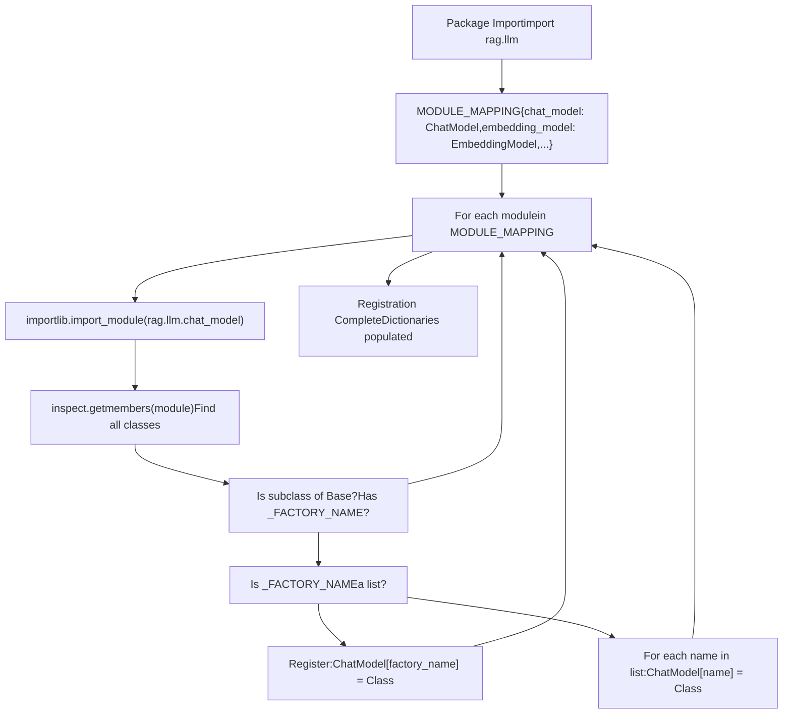
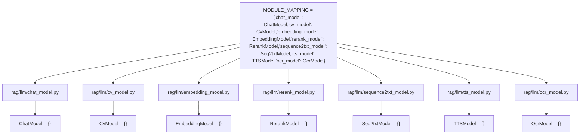
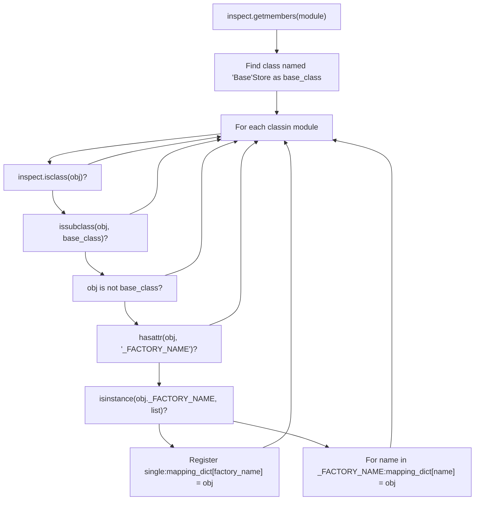

# Model Factory Pattern and Registration

Relevant source files

-   [api/apps/llm\_app.py](https://github.com/infiniflow/ragflow/blob/80a16e71/api/apps/llm_app.py)
-   [api/db/init\_data.py](https://github.com/infiniflow/ragflow/blob/80a16e71/api/db/init_data.py)
-   [api/db/services/llm\_service.py](https://github.com/infiniflow/ragflow/blob/80a16e71/api/db/services/llm_service.py)
-   [conf/llm\_factories.json](https://github.com/infiniflow/ragflow/blob/80a16e71/conf/llm_factories.json)
-   [docs/references/supported\_models.mdx](https://github.com/infiniflow/ragflow/blob/80a16e71/docs/references/supported_models.mdx)
-   [rag/llm/\_\_init\_\_.py](https://github.com/infiniflow/ragflow/blob/80a16e71/rag/llm/__init__.py)
-   [rag/llm/chat\_model.py](https://github.com/infiniflow/ragflow/blob/80a16e71/rag/llm/chat_model.py)
-   [rag/llm/cv\_model.py](https://github.com/infiniflow/ragflow/blob/80a16e71/rag/llm/cv_model.py)
-   [rag/llm/embedding\_model.py](https://github.com/infiniflow/ragflow/blob/80a16e71/rag/llm/embedding_model.py)
-   [rag/llm/rerank\_model.py](https://github.com/infiniflow/ragflow/blob/80a16e71/rag/llm/rerank_model.py)
-   [rag/llm/sequence2txt\_model.py](https://github.com/infiniflow/ragflow/blob/80a16e71/rag/llm/sequence2txt_model.py)
-   [rag/llm/tts\_model.py](https://github.com/infiniflow/ragflow/blob/80a16e71/rag/llm/tts_model.py)
-   [web/src/assets/svg/llm/n1n.svg](https://github.com/infiniflow/ragflow/blob/80a16e71/web/src/assets/svg/llm/n1n.svg)
-   [web/src/constants/llm.ts](https://github.com/infiniflow/ragflow/blob/80a16e71/web/src/constants/llm.ts)
-   [web/src/pages/user-setting/setting-model/constant.ts](https://github.com/infiniflow/ragflow/blob/80a16e71/web/src/pages/user-setting/setting-model/constant.ts)
-   [web/src/utils/common-util.ts](https://github.com/infiniflow/ragflow/blob/80a16e71/web/src/utils/common-util.ts)

This page documents the dynamic factory pattern used to register and instantiate LLM providers in RAGFlow. The system supports 40+ providers across 6 model types through a centralized registration mechanism that discovers and maps provider implementations at runtime.

For information about specific provider implementations, see [Provider Implementations](/infiniflow/ragflow/5.2-provider-implementations). For details on how models are configured per-tenant and used in the application, see [Tenant Configuration and Usage Tracking](/infiniflow/ragflow/5.4-tenant-configuration-and-usage-tracking).

---

## Purpose and Architecture

The factory pattern in RAGFlow enables pluggable LLM provider support without hardcoded dependencies. Each provider class declares its factory name via the `_FACTORY_NAME` attribute, and the `__init__.py` module automatically discovers and registers these classes into type-specific dictionaries at import time.

**Key Benefits:**

-   **Zero boilerplate**: Adding a new provider requires only implementing a class with `_FACTORY_NAME`
-   **Multi-alias support**: Providers can register under multiple names (e.g., "VLLM" and "OpenAI-API-Compatible")
-   **Type safety**: Separate dictionaries per model type (chat, embedding, rerank, etc.)
-   **Runtime inspection**: Uses Python's `inspect` module to scan for provider classes

**Model Type Dictionaries** (defined in [rag/llm/\_\_init\_\_.py126-143](https://github.com/infiniflow/ragflow/blob/80a16e71/rag/llm/__init__.py#L126-L143)):

| Dictionary Name | Model Type | Purpose |
| --- | --- | --- |
| `ChatModel` | LLM chat completion | Text generation with conversation history |
| `EmbeddingModel` | Text embeddings | Vector representations of text |
| `RerankModel` | Document reranking | Relevance scoring for search results |
| `CvModel` | Image-to-text | Vision model descriptions |
| `Seq2txtModel` | Speech-to-text | Audio transcription |
| `TTSModel` | Text-to-speech | Audio synthesis |
| `OcrModel` | OCR | Text extraction from images |

Sources: [rag/llm/\_\_init\_\_.py1-186](https://github.com/infiniflow/ragflow/blob/80a16e71/rag/llm/__init__.py#L1-L186) [rag/llm/chat\_model.py1-100](https://github.com/infiniflow/ragflow/blob/80a16e71/rag/llm/chat_model.py#L1-L100) [api/db/services/llm\_service.py32-34](https://github.com/infiniflow/ragflow/blob/80a16e71/api/db/services/llm_service.py#L32-L34)

---

## Factory Registration Flow

The registration process occurs automatically when the `rag.llm` package is imported, using module introspection to discover all provider classes.


**Registration Algorithm** (from [rag/llm/\_\_init\_\_.py147-175](https://github.com/infiniflow/ragflow/blob/80a16e71/rag/llm/__init__.py#L147-L175)):

1.  Iterate through `MODULE_MAPPING` entries (e.g., `"chat_model"` → `ChatModel` dict)
2.  Import the full module path (e.g., `rag.llm.chat_model`)
3.  Find the `Base` abstract class using `inspect.getmembers()`
4.  Scan all classes in the module that:
    -   Inherit from `Base` (but are not `Base` itself)
    -   Define a `_FACTORY_NAME` attribute
5.  Check if `_FACTORY_NAME` is a string or list:
    -   **String**: Register as `mapping_dict[factory_name] = Class`
    -   **List**: Register each name as `mapping_dict[name] = Class`
6.  Repeat for all 7 module types

Sources: [rag/llm/\_\_init\_\_.py135-175](https://github.com/infiniflow/ragflow/blob/80a16e71/rag/llm/__init__.py#L135-L175)

---

## Factory Name Attribute

The `_FACTORY_NAME` class attribute identifies how a provider class should be registered. It can be a single string or a list of strings for multi-alias support.

### Single Factory Name

Most providers use a single factory name:

```
# From chat_model.py
class XinferenceChat(Base):
    _FACTORY_NAME = "Xinference"

    def __init__(self, key, model_name, base_url, **kwargs):
        # Implementation
```
Result: `ChatModel["Xinference"] = XinferenceChat`

### Multiple Factory Names (Aliases)

Providers supporting multiple patterns can register under multiple names:

```
# From chat_model.py
class OpenAI_APIChat(Base):
    _FACTORY_NAME = ["VLLM", "OpenAI-API-Compatible"]

    def __init__(self, key, model_name, base_url, **kwargs):
        # Implementation
```
Result:

-   `ChatModel["VLLM"] = OpenAI_APIChat`
-   `ChatModel["OpenAI-API-Compatible"] = OpenAI_APIChat`

### Factory Name Examples by Model Type

**Chat Models** ([rag/llm/chat\_model.py490-743](https://github.com/infiniflow/ragflow/blob/80a16e71/rag/llm/chat_model.py#L490-L743)):

| Factory Name | Class | Line Range |
| --- | --- | --- |
| `"Xinference"` | `XinferenceChat` | 490-497 |
| `"HuggingFace"` | `HuggingFaceChat` | 500-507 |
| `"BaiChuan"` | `BaiChuanChat` | 520-593 |
| `"LM-Studio"` | `LmStudioChat` | 724-733 |
| `["VLLM", "OpenAI-API-Compatible"]` | `OpenAI_APIChat` | 736-743 |

**Embedding Models** ([rag/llm/embedding\_model.py91-643](https://github.com/infiniflow/ragflow/blob/80a16e71/rag/llm/embedding_model.py#L91-L643)):

| Factory Name | Class | Line Range |
| --- | --- | --- |
| `"OpenAI"` | `OpenAIEmbed` | 91-122 |
| `"LocalAI"` | `LocalAIEmbed` | 125-150 |
| `"Tongyi-Qianwen"` | `QWenEmbed` | 174-220 |
| `"Ollama"` | `OllamaEmbed` | 260-295 |
| `["VLLM", "OpenAI-API-Compatible"]` | `OpenAI_APIEmbed` | 634-642 |

**Rerank Models** ([rag/llm/rerank\_model.py56-443](https://github.com/infiniflow/ragflow/blob/80a16e71/rag/llm/rerank_model.py#L56-L443)):

| Factory Name | Class | Line Range |
| --- | --- | --- |
| `"Jina"` | `JinaRerank` | 56-74 |
| `["Cohere", "VLLM"]` | `CoHereRerank` | 231-259 |
| `"GPUStack"` | `GPUStackRerank` | 423-443 |

Sources: [rag/llm/chat\_model.py490-743](https://github.com/infiniflow/ragflow/blob/80a16e71/rag/llm/chat_model.py#L490-L743) [rag/llm/embedding\_model.py91-643](https://github.com/infiniflow/ragflow/blob/80a16e71/rag/llm/embedding_model.py#L91-L643) [rag/llm/rerank\_model.py56-443](https://github.com/infiniflow/ragflow/blob/80a16e71/rag/llm/rerank_model.py#L56-L443)

---

## Module Mapping Structure

The `MODULE_MAPPING` constant defines which modules contain which model types. This drives the registration loop.


**Definition** ([rag/llm/\_\_init\_\_.py135-143](https://github.com/infiniflow/ragflow/blob/80a16e71/rag/llm/__init__.py#L135-L143)):

```
MODULE_MAPPING = {
    "chat_model": ChatModel,
    "cv_model": CvModel,
    "embedding_model": EmbeddingModel,
    "rerank_model": RerankModel,
    "sequence2txt_model": Seq2txtModel,
    "tts_model": TTSModel,
    "ocr_model": OcrModel,
}
```
Each key is a module name (without the `rag.llm.` prefix), and each value is a reference to the global dictionary that will be populated with registered classes.

Sources: [rag/llm/\_\_init\_\_.py126-143](https://github.com/infiniflow/ragflow/blob/80a16e71/rag/llm/__init__.py#L126-L143)

---

## Base Class Requirements

All provider implementations must inherit from their respective `Base` abstract class. Each base class defines the interface that providers must implement.

### Chat Model Base

**Abstract Methods** ([rag/llm/chat\_model.py65-78](https://github.com/infiniflow/ragflow/blob/80a16e71/rag/llm/chat_model.py#L65-L78)):

```
class Base(ABC):
    def __init__(self, key, model_name, base_url, **kwargs):
        timeout = int(os.environ.get("LLM_TIMEOUT_SECONDS", 600))
        self.client = OpenAI(api_key=key, base_url=base_url, timeout=timeout)
        self.async_client = AsyncOpenAI(api_key=key, base_url=base_url, timeout=timeout)
        self.model_name = model_name
        self.max_retries = kwargs.get("max_retries", 5)
        self.base_delay = kwargs.get("retry_interval", 2.0)
        # ...
```
**Core Methods Providers Must Support:**

-   `async_chat(system, history, gen_conf, **kwargs)` - Async chat completion
-   `async_chat_streamly(system, history, gen_conf, **kwargs)` - Streaming chat
-   `bind_tools(toolcall_session, tools)` - Tool/function calling (optional)

### Embedding Model Base

**Abstract Methods** ([rag/llm/embedding\_model.py37-51](https://github.com/infiniflow/ragflow/blob/80a16e71/rag/llm/embedding_model.py#L37-L51)):

```
class Base(ABC):
    def __init__(self, key, model_name, **kwargs):
        pass  # Subclasses implement

    def encode(self, texts: list):
        raise NotImplementedError("Please implement encode method!")

    def encode_queries(self, text: str):
        raise NotImplementedError("Please implement encode method!")
```
### Rerank Model Base

**Abstract Methods** ([rag/llm/rerank\_model.py28-54](https://github.com/infiniflow/ragflow/blob/80a16e71/rag/llm/rerank_model.py#L28-L54)):

```
class Base(ABC):
    def __init__(self, key, model_name, **kwargs):
        pass  # Subclasses implement

    def similarity(self, query: str, texts: list):
        raise NotImplementedError("Please implement encode method!")

    @staticmethod
    def _normalize_rank(rank: np.ndarray) -> np.ndarray:
        # Normalize to 0-1 range
```
Sources: [rag/llm/chat\_model.py65-78](https://github.com/infiniflow/ragflow/blob/80a16e71/rag/llm/chat_model.py#L65-L78) [rag/llm/embedding\_model.py37-51](https://github.com/infiniflow/ragflow/blob/80a16e71/rag/llm/embedding_model.py#L37-L51) [rag/llm/rerank\_model.py28-54](https://github.com/infiniflow/ragflow/blob/80a16e71/rag/llm/rerank_model.py#L28-L54)

---

## Registration Detection Logic

The registration loop uses Python's `inspect` module to identify classes that should be registered. This section details the exact conditions checked.


**Code Implementation** ([rag/llm/\_\_init\_\_.py167-175](https://github.com/infiniflow/ragflow/blob/80a16e71/rag/llm/__init__.py#L167-L175)):

```
if base_class is not None:
    for _, obj in inspect.getmembers(module):
        if inspect.isclass(obj) and issubclass(obj, base_class) and obj is not base_class and hasattr(obj, "_FACTORY_NAME"):
            if isinstance(obj._FACTORY_NAME, list):
                for factory_name in obj._FACTORY_NAME:
                    mapping_dict[factory_name] = obj
            else:
                mapping_dict[obj._FACTORY_NAME] = obj
```
**Conditions for Registration:**

1.  `inspect.isclass(obj)` - Must be a class, not a function or variable
2.  `issubclass(obj, base_class)` - Must inherit from `Base`
3.  `obj is not base_class` - Cannot be the `Base` class itself
4.  `hasattr(obj, "_FACTORY_NAME")` - Must define `_FACTORY_NAME` attribute

Sources: [rag/llm/\_\_init\_\_.py147-175](https://github.com/infiniflow/ragflow/blob/80a16e71/rag/llm/__init__.py#L147-L175)

---

## LiteLLM Integration

Some providers are registered through a special `LiteLLMBase` class that uses the `litellm` library for unified API access. These providers follow a slightly different registration pattern.

**LiteLLM Configuration** ([rag/llm/\_\_init\_\_.py62-124](https://github.com/infiniflow/ragflow/blob/80a16e71/rag/llm/__init__.py#L62-L124)):

```
FACTORY_DEFAULT_BASE_URL = {
    SupportedLiteLLMProvider.Tongyi_Qianwen: "https://dashscope.aliyuncs.com/compatible-mode/v1",
    SupportedLiteLLMProvider.Moonshot: "https://api.moonshot.cn/v1",
    SupportedLiteLLMProvider.Anthropic: "https://api.anthropic.com/",
    # ... 20+ more providers
}

LITELLM_PROVIDER_PREFIX = {
    SupportedLiteLLMProvider.Tongyi_Qianwen: "dashscope/",
    SupportedLiteLLMProvider.Bedrock: "bedrock/",
    SupportedLiteLLMProvider.Gemini: "gemini/",
    # ... prefix mappings
}
```
**LiteLLMBase Registration** ([rag/llm/\_\_init\_\_.py152-166](https://github.com/infiniflow/ragflow/blob/80a16e71/rag/llm/__init__.py#L152-L166)):

The registration loop checks for both `Base` and `LiteLLMBase` classes:

```
for name, obj in inspect.getmembers(module):
    if inspect.isclass(obj):
        if name == "Base":
            base_class = obj
        elif name == "LiteLLMBase":
            lite_llm_base_class = obj
            if hasattr(obj, "_FACTORY_NAME"):
                if isinstance(obj._FACTORY_NAME, list):
                    for factory_name in obj._FACTORY_NAME:
                        mapping_dict[factory_name] = obj
                else:
                    mapping_dict[obj._FACTORY_NAME] = obj
```
This allows `LiteLLMBase` to register providers that use the `litellm` library for unified multi-provider support.

Sources: [rag/llm/\_\_init\_\_.py62-124](https://github.com/infiniflow/ragflow/blob/80a16e71/rag/llm/__init__.py#L62-L124) [rag/llm/\_\_init\_\_.py152-166](https://github.com/infiniflow/ragflow/blob/80a16e71/rag/llm/__init__.py#L152-L166)

---

## Usage Pattern: Model Instantiation

Once providers are registered, application code can instantiate them by indexing the appropriate dictionary with the factory name.

### Direct Instantiation

**Example from API Layer** ([api/apps/llm\_app.py69-76](https://github.com/infiniflow/ragflow/blob/80a16e71/api/apps/llm_app.py#L69-L76)):

```
# Instantiate an embedding model
factory = req["llm_factory"]  # e.g., "OpenAI"
assert factory in EmbeddingModel, f"Embedding model from {factory} is not supported yet."
mdl = EmbeddingModel<FileRef file-url="https://github.com/infiniflow/ragflow/blob/80a16e71/factory" undefined  file-path="factory">Hii</FileRef>)

# Test the model
arr, tc = mdl.encode(["Test if the api key is available"])
if len(arr[0]) == 0:
    raise Exception("Fail")
```
### Via LLMBundle Wrapper

The `LLMBundle` class provides a higher-level interface that handles tenant configuration and usage tracking:

**LLM4Tenant Base Class** ([api/db/services/tenant\_llm\_service.py](https://github.com/infiniflow/ragflow/blob/80a16e71/api/db/services/tenant_llm_service.py)):

```
class LLM4Tenant:
    def __init__(self, tenant_id, llm_type, llm_name=None, lang="Chinese", **kwargs):
        # Fetch tenant configuration
        objs = TenantLLMService.query(tenant_id=tenant_id, llm_factory=llm_factory, model_type=llm_type)

        # Instantiate from factory dictionaries
        if llm_type == LLMType.CHAT:
            self.mdl = ChatModel<FileRef file-url="https://github.com/infiniflow/ragflow/blob/80a16e71/llm_factory" undefined  file-path="llm_factory">Hii</FileRef>
        elif llm_type == LLMType.EMBEDDING:
            self.mdl = EmbeddingModel<FileRef file-url="https://github.com/infiniflow/ragflow/blob/80a16e71/llm_factory" undefined  file-path="llm_factory">Hii</FileRef>
        elif llm_type == LLMType.RERANK:
            self.mdl = RerankModel<FileRef file-url="https://github.com/infiniflow/ragflow/blob/80a16e71/llm_factory" undefined  file-path="llm_factory">Hii</FileRef>
        # ... other model types
```
**LLMBundle Usage** ([api/db/services/llm\_service.py85-118](https://github.com/infiniflow/ragflow/blob/80a16e71/api/db/services/llm_service.py#L85-L118)):

```
# Wrapper with usage tracking
class LLMBundle(LLM4Tenant):
    def encode(self, texts: list):
        embeddings, used_tokens = self.mdl.encode(texts)
        TenantLLMService.increase_usage(self.tenant_id, self.llm_type, used_tokens, self.llm_name)
        return embeddings, used_tokens
```
Sources: [api/apps/llm\_app.py69-76](https://github.com/infiniflow/ragflow/blob/80a16e71/api/apps/llm_app.py#L69-L76) [api/db/services/llm\_service.py85-118](https://github.com/infiniflow/ragflow/blob/80a16e71/api/db/services/llm_service.py#L85-L118)

---

## Configuration and Initialization

Provider metadata is stored in `conf/llm_factories.json` and loaded into the database during system initialization.

### Factory Configuration Format

**JSON Structure** ([conf/llm\_factories.json1-200](https://github.com/infiniflow/ragflow/blob/80a16e71/conf/llm_factories.json#L1-L200)):

```
{
    "factory_llm_infos": [
        {
            "name": "OpenAI",
            "logo": "",
            "tags": "LLM,TEXT EMBEDDING,TTS,TEXT RE-RANK,SPEECH2TEXT,MODERATION",
            "status": "1",
            "rank": "999",
            "llm": [
                {
                    "llm_name": "gpt-4o",
                    "tags": "LLM,CHAT,128K,IMAGE2TEXT",
                    "max_tokens": 128000,
                    "model_type": "chat",
                    "is_tools": true
                },
                {
                    "llm_name": "text-embedding-3-small",
                    "tags": "TEXT EMBEDDING,8K",
                    "max_tokens": 8191,
                    "model_type": "embedding",
                    "is_tools": false
                }
            ]
        }
    ]
}
```
**Fields:**

-   `name` - Factory name (matches `_FACTORY_NAME` in code)
-   `tags` - Supported model types (LLM, TEXT EMBEDDING, etc.)
-   `llm[]` - Array of specific models under this factory
    -   `llm_name` - Model identifier for API calls
    -   `model_type` - One of: chat, embedding, rerank, image2text, tts, speech2text, ocr
    -   `max_tokens` - Context window size
    -   `is_tools` - Whether function/tool calling is supported

### Database Initialization

**init\_llm\_factory Function** ([api/db/init\_data.py96-145](https://github.com/infiniflow/ragflow/blob/80a16e71/api/db/init_data.py#L96-L145)):

```
def init_llm_factory():
    # Load from JSON
    factory_llm_infos = settings.FACTORY_LLM_INFOS

    for factory_llm_info in factory_llm_infos:
        info = deepcopy(factory_llm_info)
        llm_infos = info.pop("llm")

        # Save factory metadata
        LLMFactoriesService.save(**info)

        # Save individual model records
        for llm_info in llm_infos:
            llm_info["fid"] = factory_llm_info["name"]
            LLMService.save(**llm_info)
```
This function:

1.  Reads `conf/llm_factories.json`
2.  Inserts records into `LLMFactories` table (one per provider)
3.  Inserts records into `LLM` table (one per model)

The `LLM` table is then queried by the API layer to validate which models are available for a given factory.

Sources: [conf/llm\_factories.json1-200](https://github.com/infiniflow/ragflow/blob/80a16e71/conf/llm_factories.json#L1-L200) [api/db/init\_data.py96-145](https://github.com/infiniflow/ragflow/blob/80a16e71/api/db/init_data.py#L96-L145)

---

## Factory-to-Class Mapping Table

The following table shows the complete mapping from factory names to implementation classes across all model types. This is the runtime result of the registration process.

**Chat Models:**

| Factory Name | Class | Module |
| --- | --- | --- |
| `"Xinference"` | `XinferenceChat` | chat\_model |
| `"HuggingFace"` | `HuggingFaceChat` | chat\_model |
| `"ModelScope"` | `ModelScopeChat` | chat\_model |
| `"BaiChuan"` | `BaiChuanChat` | chat\_model |
| `"LocalAI"` | `LocalAIChat` | chat\_model |
| `"VolcEngine"` | `VolcEngineChat` | chat\_model |
| `"Mistral"` | `MistralChat` | chat\_model |
| `"LM-Studio"` | `LmStudioChat` | chat\_model |
| `"VLLM"` | `OpenAI_APIChat` | chat\_model |
| `"OpenAI-API-Compatible"` | `OpenAI_APIChat` | chat\_model |
| `"LeptonAI"` | `LeptonAIChat` | chat\_model |
| `"Replicate"` | `ReplicateChat` | chat\_model |
| `"Tencent Hunyuan"` | `HunyuanChat` | chat\_model |
| `"XunFei Spark"` | `SparkChat` | chat\_model |
| `"BaiduYiyan"` | `BaiduYiyanChat` | chat\_model |

**Embedding Models:**

| Factory Name | Class | Module |
| --- | --- | --- |
| `"Builtin"` | `BuiltinEmbed` | embedding\_model |
| `"OpenAI"` | `OpenAIEmbed` | embedding\_model |
| `"LocalAI"` | `LocalAIEmbed` | embedding\_model |
| `"Azure-OpenAI"` | `AzureEmbed` | embedding\_model |
| `"BaiChuan"` | `BaiChuanEmbed` | embedding\_model |
| `"Tongyi-Qianwen"` | `QWenEmbed` | embedding\_model |
| `"ZHIPU-AI"` | `ZhipuEmbed` | embedding\_model |
| `"Ollama"` | `OllamaEmbed` | embedding\_model |
| `"Xinference"` | `XinferenceEmbed` | embedding\_model |
| `"Jina"` | `JinaMultiVecEmbed` | embedding\_model |
| `"Mistral"` | `MistralEmbed` | embedding\_model |
| `"Bedrock"` | `BedrockEmbed` | embedding\_model |
| `"Gemini"` | `GeminiEmbed` | embedding\_model |
| `"NVIDIA"` | `NvidiaEmbed` | embedding\_model |
| `"LM-Studio"` | `LmStudioEmbed` | embedding\_model |
| `"VLLM"` | `OpenAI_APIEmbed` | embedding\_model |
| `"OpenAI-API-Compatible"` | `OpenAI_APIEmbed` | embedding\_model |
| `"Cohere"` | `CoHereEmbed` | embedding\_model |

**Rerank Models:**

| Factory Name | Class | Module |
| --- | --- | --- |
| `"Jina"` | `JinaRerank` | rerank\_model |
| `"Xinference"` | `XInferenceRerank` | rerank\_model |
| `"LocalAI"` | `LocalAIRerank` | rerank\_model |
| `"NVIDIA"` | `NvidiaRerank` | rerank\_model |
| `"OpenAI-API-Compatible"` | `OpenAI_APIRerank` | rerank\_model |
| `"Cohere"` | `CoHereRerank` | rerank\_model |
| `"VLLM"` | `CoHereRerank` | rerank\_model |
| `"SILICONFLOW"` | `SILICONFLOWRerank` | rerank\_model |
| `"BaiduYiyan"` | `BaiduYiyanRerank` | rerank\_model |
| `"Voyage AI"` | `VoyageRerank` | rerank\_model |
| `"Tongyi-Qianwen"` | `QWenRerank` | rerank\_model |
| `"HuggingFace"` | `HuggingfaceRerank` | rerank\_model |
| `"GPUStack"` | `GPUStackRerank` | rerank\_model |

**Vision Models (Image2Text):**

| Factory Name | Class | Module |
| --- | --- | --- |
| `"OpenAI"` | `GptV4` | cv\_model |
| `"Azure-OpenAI"` | `AzureGptV4` | cv\_model |
| `"xAI"` | `xAICV` | cv\_model |
| `"Tongyi-Qianwen"` | `QWenCV` | cv\_model |
| `"Tencent Hunyuan"` | `HunyuanCV` | cv\_model |
| `"ZHIPU-AI"` | `Zhipu4V` | cv\_model |
| `"StepFun"` | `StepFunCV` | cv\_model |
| `"VolcEngine"` | `VolcEngineCV` | cv\_model |
| `"LM-Studio"` | `LmStudioCV` | cv\_model |
| `"VLLM"` | `OpenAI_APICV` | cv\_model |
| `"OpenAI-API-Compatible"` | `OpenAI_APICV` | cv\_model |
| `"TogetherAI"` | `TogetherAICV` | cv\_model |

Sources: [rag/llm/chat\_model.py490-743](https://github.com/infiniflow/ragflow/blob/80a16e71/rag/llm/chat_model.py#L490-L743) [rag/llm/embedding\_model.py53-643](https://github.com/infiniflow/ragflow/blob/80a16e71/rag/llm/embedding_model.py#L53-L643) [rag/llm/rerank\_model.py56-443](https://github.com/infiniflow/ragflow/blob/80a16e71/rag/llm/rerank_model.py#L56-L443) [rag/llm/cv\_model.py189-481](https://github.com/infiniflow/ragflow/blob/80a16e71/rag/llm/cv_model.py#L189-L481)

---

## Adding a New Provider

To add a new provider to RAGFlow, follow these steps:

### 1\. Create Provider Class

Create a new class in the appropriate model module (e.g., `chat_model.py`) that:

-   Inherits from `Base`
-   Defines `_FACTORY_NAME` class attribute
-   Implements required abstract methods

**Example:**

```
# In rag/llm/chat_model.py
class MyNewProviderChat(Base):
    _FACTORY_NAME = "MyProvider"

    def __init__(self, key, model_name, base_url=None, **kwargs):
        super().__init__(key, model_name, base_url, **kwargs)
        # Provider-specific initialization

    async def async_chat(self, system, history, gen_conf, **kwargs):
        # Implementation
        pass
```
### 2\. Add Factory Configuration

Add entry to `conf/llm_factories.json`:

```
{
    "name": "MyProvider",
    "tags": "LLM,TEXT EMBEDDING",
    "status": "1",
    "llm": [
        {
            "llm_name": "my-model-name",
            "model_type": "chat",
            "max_tokens": 8192,
            "is_tools": false
        }
    ]
}
```
### 3\. No Registration Code Needed

The factory pattern automatically discovers and registers your class when the module is imported. No changes to `__init__.py` are required.

### 4\. Update Documentation

Add your provider to [docs/references/supported\_models.mdx](https://github.com/infiniflow/ragflow/blob/80a16e71/docs/references/supported_models.mdx) to reflect the new capability.

Sources: [rag/llm/chat\_model.py65-78](https://github.com/infiniflow/ragflow/blob/80a16e71/rag/llm/chat_model.py#L65-L78) [conf/llm\_factories.json1-50](https://github.com/infiniflow/ragflow/blob/80a16e71/conf/llm_factories.json#L1-L50) [docs/references/supported\_models.mdx1-90](https://github.com/infiniflow/ragflow/blob/80a16e71/docs/references/supported_models.mdx#L1-L90)

---

## Error Handling in Registration

The registration process is designed to be fault-tolerant. Classes without `_FACTORY_NAME` or that don't inherit from `Base` are silently skipped.

**Safe Registration Checks** ([rag/llm/\_\_init\_\_.py167-175](https://github.com/infiniflow/ragflow/blob/80a16e71/rag/llm/__init__.py#L167-L175)):

```
if inspect.isclass(obj) and issubclass(obj, base_class) and obj is not base_class and hasattr(obj, "_FACTORY_NAME"):
    # Only register if all conditions met
```
**Common Registration Issues:**

| Issue | Symptom | Solution |
| --- | --- | --- |
| Missing `_FACTORY_NAME` | Class not registered | Add `_FACTORY_NAME` class attribute |
| Not inheriting from `Base` | Class not registered | Ensure class inherits from appropriate `Base` |
| Typo in factory name | Provider not found at runtime | Verify `_FACTORY_NAME` matches config |
| List vs string mismatch | Some aliases missing | Check if `_FACTORY_NAME` should be list |
| Import errors in module | Entire module skipped | Fix import statements and dependencies |

**Validation at API Layer** ([api/apps/llm\_app.py70-71](https://github.com/infiniflow/ragflow/blob/80a16e71/api/apps/llm_app.py#L70-L71)):

```
factory = req["llm_factory"]
assert factory in EmbeddingModel, f"Embedding model from {factory} is not supported yet."
```
This assertion provides clear feedback if a factory name is not registered.

Sources: [rag/llm/\_\_init\_\_.py167-175](https://github.com/infiniflow/ragflow/blob/80a16e71/rag/llm/__init__.py#L167-L175) [api/apps/llm\_app.py69-100](https://github.com/infiniflow/ragflow/blob/80a16e71/api/apps/llm_app.py#L69-L100)
