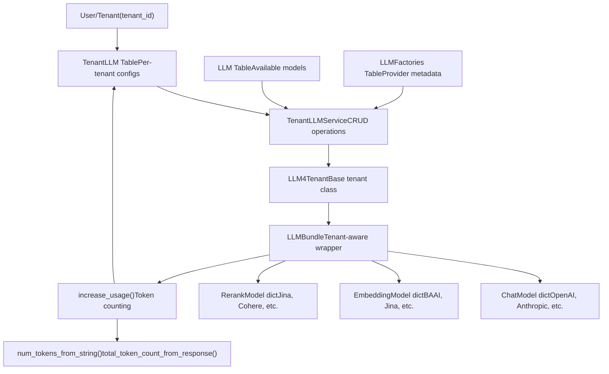
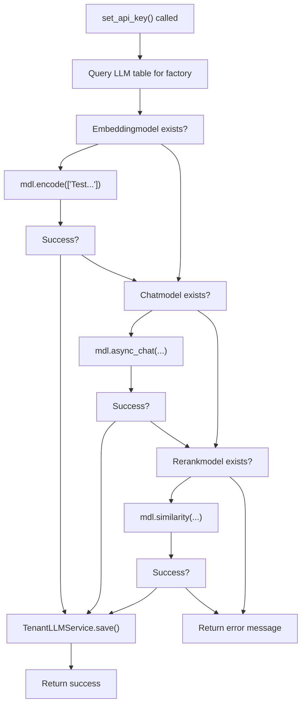
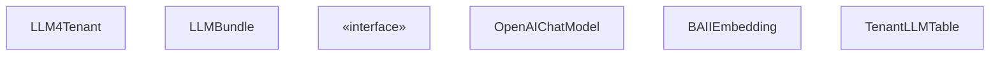
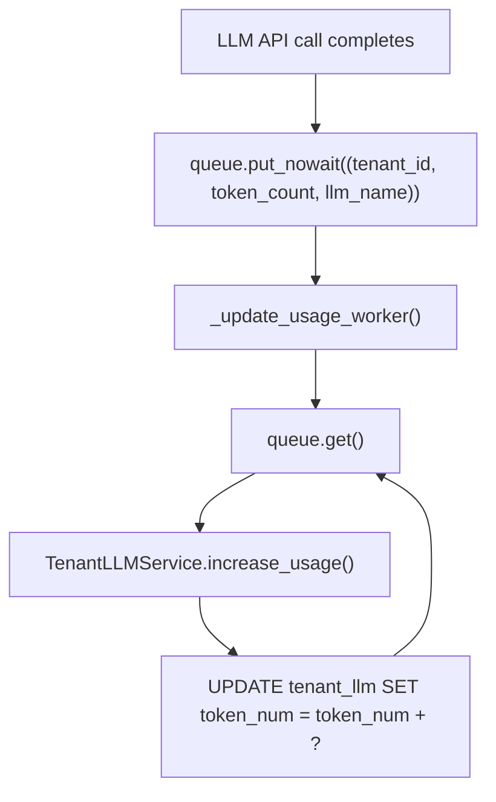
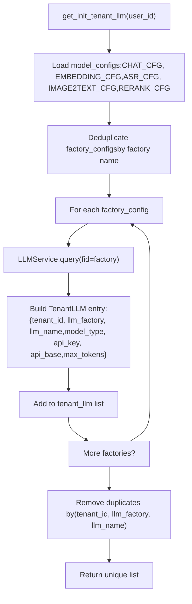
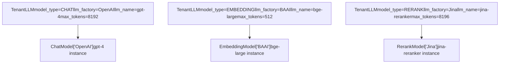

# Tenant Configuration and Usage Tracking

Relevant source files

-   [agent/tools/retrieval.py](https://github.com/infiniflow/ragflow/blob/80a16e71/agent/tools/retrieval.py)
-   [api/apps/llm\_app.py](https://github.com/infiniflow/ragflow/blob/80a16e71/api/apps/llm_app.py)
-   [api/apps/sdk/chat.py](https://github.com/infiniflow/ragflow/blob/80a16e71/api/apps/sdk/chat.py)
-   [api/apps/sdk/dataset.py](https://github.com/infiniflow/ragflow/blob/80a16e71/api/apps/sdk/dataset.py)
-   [api/apps/sdk/dify\_retrieval.py](https://github.com/infiniflow/ragflow/blob/80a16e71/api/apps/sdk/dify_retrieval.py)
-   [api/apps/sdk/doc.py](https://github.com/infiniflow/ragflow/blob/80a16e71/api/apps/sdk/doc.py)
-   [api/apps/sdk/session.py](https://github.com/infiniflow/ragflow/blob/80a16e71/api/apps/sdk/session.py)
-   [api/db/init\_data.py](https://github.com/infiniflow/ragflow/blob/80a16e71/api/db/init_data.py)
-   [api/db/services/canvas\_service.py](https://github.com/infiniflow/ragflow/blob/80a16e71/api/db/services/canvas_service.py)
-   [api/db/services/conversation\_service.py](https://github.com/infiniflow/ragflow/blob/80a16e71/api/db/services/conversation_service.py)
-   [api/db/services/llm\_service.py](https://github.com/infiniflow/ragflow/blob/80a16e71/api/db/services/llm_service.py)
-   [api/utils/api\_utils.py](https://github.com/infiniflow/ragflow/blob/80a16e71/api/utils/api_utils.py)
-   [conf/llm\_factories.json](https://github.com/infiniflow/ragflow/blob/80a16e71/conf/llm_factories.json)
-   [docs/references/http\_api\_reference.md](https://github.com/infiniflow/ragflow/blob/80a16e71/docs/references/http_api_reference.md)
-   [docs/references/python\_api\_reference.md](https://github.com/infiniflow/ragflow/blob/80a16e71/docs/references/python_api_reference.md)
-   [docs/references/supported\_models.mdx](https://github.com/infiniflow/ragflow/blob/80a16e71/docs/references/supported_models.mdx)
-   [docs/release\_notes.md](https://github.com/infiniflow/ragflow/blob/80a16e71/docs/release_notes.md)
-   [rag/advanced\_rag/\_\_init\_\_.py](https://github.com/infiniflow/ragflow/blob/80a16e71/rag/advanced_rag/__init__.py)
-   [rag/benchmark.py](https://github.com/infiniflow/ragflow/blob/80a16e71/rag/benchmark.py)
-   [rag/llm/\_\_init\_\_.py](https://github.com/infiniflow/ragflow/blob/80a16e71/rag/llm/__init__.py)
-   [rag/llm/chat\_model.py](https://github.com/infiniflow/ragflow/blob/80a16e71/rag/llm/chat_model.py)
-   [rag/llm/cv\_model.py](https://github.com/infiniflow/ragflow/blob/80a16e71/rag/llm/cv_model.py)
-   [rag/llm/embedding\_model.py](https://github.com/infiniflow/ragflow/blob/80a16e71/rag/llm/embedding_model.py)
-   [rag/llm/rerank\_model.py](https://github.com/infiniflow/ragflow/blob/80a16e71/rag/llm/rerank_model.py)
-   [rag/llm/sequence2txt\_model.py](https://github.com/infiniflow/ragflow/blob/80a16e71/rag/llm/sequence2txt_model.py)
-   [rag/llm/tts\_model.py](https://github.com/infiniflow/ragflow/blob/80a16e71/rag/llm/tts_model.py)
-   [sdk/python/ragflow\_sdk/modules/chat.py](https://github.com/infiniflow/ragflow/blob/80a16e71/sdk/python/ragflow_sdk/modules/chat.py)
-   [sdk/python/ragflow\_sdk/ragflow.py](https://github.com/infiniflow/ragflow/blob/80a16e71/sdk/python/ragflow_sdk/ragflow.py)
-   [web/src/assets/svg/llm/n1n.svg](https://github.com/infiniflow/ragflow/blob/80a16e71/web/src/assets/svg/llm/n1n.svg)
-   [web/src/constants/llm.ts](https://github.com/infiniflow/ragflow/blob/80a16e71/web/src/constants/llm.ts)
-   [web/src/pages/user-setting/setting-model/constant.ts](https://github.com/infiniflow/ragflow/blob/80a16e71/web/src/pages/user-setting/setting-model/constant.ts)
-   [web/src/utils/common-util.ts](https://github.com/infiniflow/ragflow/blob/80a16e71/web/src/utils/common-util.ts)

## Purpose and Scope

This document describes RAGFlow's multi-tenant LLM configuration system, which allows each tenant (user) to maintain their own API keys, model preferences, and usage statistics for LLM services. It covers the `TenantLLM` database table, the `LLMBundle` wrapper class, token usage tracking mechanisms, and API key validation workflows.

For information about the LLM model factory pattern and provider implementations, see [5.1](/infiniflow/ragflow/5.1-model-factory-pattern-and-registration) and [5.2](/infiniflow/ragflow/5.2-provider-implementations). For error handling and retry logic, see [5.3](/infiniflow/ragflow/5.3-error-handling-and-retry-logic). For tool calling functionality, see [5.5](/infiniflow/ragflow/5.5-tool-calling-and-function-use).

---

## Architecture Overview


**Diagram: Tenant LLM Configuration Architecture**

The system uses a three-tier architecture: tenant-specific configurations stored in `TenantLLM`, a service layer for CRUD operations, and the `LLMBundle` wrapper that adds tenant context and usage tracking to base model classes.

Sources: [api/db/services/llm\_service.py85-91](https://github.com/infiniflow/ragflow/blob/80a16e71/api/db/services/llm_service.py#L85-L91) [api/db/init\_data.py36-83](https://github.com/infiniflow/ragflow/blob/80a16e71/api/db/init_data.py#L36-L83) [api/apps/llm\_app.py58-126](https://github.com/infiniflow/ragflow/blob/80a16e71/api/apps/llm_app.py#L58-L126)

---

## TenantLLM Table Schema

The `TenantLLM` database table stores per-tenant LLM configurations. Each row represents one tenant's configuration for one specific model.

| Field | Type | Description |
| --- | --- | --- |
| `tenant_id` | String | User/tenant identifier (foreign key) |
| `llm_factory` | String | Provider name (e.g., "OpenAI", "Anthropic") |
| `llm_name` | String | Specific model name (e.g., "gpt-4", "claude-3") |
| `model_type` | Enum | Type: `CHAT`, `EMBEDDING`, `RERANK`, `IMAGE2TEXT`, `SPEECH2TEXT`, `TTS`, `OCR` |
| `api_key` | String | Encrypted API key or JSON configuration |
| `api_base` | String | Custom base URL (overrides factory default) |
| `max_tokens` | Integer | Maximum context window size |

**Table: TenantLLM Schema Fields**

The `api_key` field may store either a simple API key string or a JSON object for providers requiring complex authentication (e.g., AWS Bedrock, Azure OpenAI, VolcEngine).

Sources: [api/db/services/llm\_service.py36-83](https://github.com/infiniflow/ragflow/blob/80a16e71/api/db/services/llm_service.py#L36-L83) [api/apps/llm\_app.py128-210](https://github.com/infiniflow/ragflow/blob/80a16e71/api/apps/llm_app.py#L128-L210)

---

## Tenant Configuration Flow

> **[Mermaid sequence]**
> *(图表结构无法解析)*

**Diagram: API Key Validation and Storage Flow**

When a user sets an API key via [api/apps/llm\_app.py58-126](https://github.com/infiniflow/ragflow/blob/80a16e71/api/apps/llm_app.py#L58-L126) the system validates it by making a test call to the provider before storing the configuration.

Sources: [api/apps/llm\_app.py58-126](https://github.com/infiniflow/ragflow/blob/80a16e71/api/apps/llm_app.py#L58-L126) [api/apps/llm\_app.py128-294](https://github.com/infiniflow/ragflow/blob/80a16e71/api/apps/llm_app.py#L128-L294)

---

## API Key Validation Process

The API key validation process tests the provided credentials against actual LLM provider endpoints before persisting them to the database.

### Validation Logic

For each `llm_factory`, the system tests up to three model types until one succeeds:

1.  **Embedding Model Test**: Calls `encode(["Test if the api key is available"])` and verifies non-empty result
2.  **Chat Model Test**: Calls `async_chat()` with a simple greeting and checks for valid response
3.  **Rerank Model Test**: Calls `similarity()` with test query and documents


**Diagram: API Key Validation Flow**

Sources: [api/apps/llm\_app.py58-126](https://github.com/infiniflow/ragflow/blob/80a16e71/api/apps/llm_app.py#L58-L126)

### Special Authentication Formats

Some providers require JSON-encoded authentication parameters instead of simple API keys:

| Provider | JSON Fields | Storage Format |
| --- | --- | --- |
| **VolcEngine** | `ark_api_key`, `endpoint_id` | `{"ark_api_key": "...", "endpoint_id": "..."}` |
| **Tencent Hunyuan** | `hunyuan_sid`, `hunyuan_sk` | `{"hunyuan_sid": "...", "hunyuan_sk": "..."}` |
| **Bedrock** | `auth_mode`, `bedrock_ak`, `bedrock_sk`, `bedrock_region`, `aws_role_arn` | `{"auth_mode": "...", "bedrock_ak": "...", ...}` |
| **Azure-OpenAI** | `api_key`, `api_version` | `{"api_key": "...", "api_version": "2024-02-01"}` |
| **BaiduYiyan** | `yiyan_ak`, `yiyan_sk` | `{"yiyan_ak": "...", "yiyan_sk": "..."}` |
| **Fish Audio** | `fish_audio_ak`, `fish_audio_refid` | `{"fish_audio_ak": "...", "fish_audio_refid": "..."}` |

**Table: Provider-Specific Authentication Formats**

The `apikey_json()` helper at [api/apps/llm\_app.py140-142](https://github.com/infiniflow/ragflow/blob/80a16e71/api/apps/llm_app.py#L140-L142) constructs these JSON strings from request parameters.

Sources: [api/apps/llm\_app.py128-210](https://github.com/infiniflow/ragflow/blob/80a16e71/api/apps/llm_app.py#L128-L210) [rag/llm/chat\_model.py655-667](https://github.com/infiniflow/ragflow/blob/80a16e71/rag/llm/chat_model.py#L655-L667) [rag/llm/embedding\_model.py461-503](https://github.com/infiniflow/ragflow/blob/80a16e71/rag/llm/embedding_model.py#L461-L503)

---

## LLMBundle: Tenant-Aware Wrapper

The `LLMBundle` class extends `LLM4Tenant` to provide a tenant-aware interface to LLM models. It wraps base model classes from the factory registry and adds usage tracking.

### Class Hierarchy


**Diagram: LLMBundle Class Hierarchy**

Sources: [api/db/services/llm\_service.py85-233](https://github.com/infiniflow/ragflow/blob/80a16e71/api/db/services/llm_service.py#L85-L233)

### Initialization Flow

When `LLMBundle` is instantiated, it:

1.  Queries `TenantLLM` table for tenant-specific configuration
2.  Falls back to system defaults from `service_conf.yaml` if no tenant config exists
3.  Looks up the factory class from the dynamic model registry
4.  Instantiates the base model with tenant's `api_key` and `base_url`
5.  Stores the model instance in `self._mdl`

```
# Example from api/db/services/llm_service.py:85-91
class LLMBundle(LLM4Tenant):
    def __init__(self, tenant_id, llm_type, llm_name=None, lang="Chinese", **kwargs):
        super().__init__(tenant_id, llm_type, llm_name, lang, **kwargs)
```
The parent `LLM4Tenant.__init__()` performs the model instantiation by calling methods defined in the tenant LLM service.

Sources: [api/db/services/llm\_service.py85-91](https://github.com/infiniflow/ragflow/blob/80a16e71/api/db/services/llm_service.py#L85-L91)

---

## Token Usage Tracking

Token usage tracking is implemented via the `increase_usage()` method, which increments token counters in the `TenantLLM` table after each LLM call.

### Usage Tracking Flow

> **[Mermaid sequence]**
> *(图表结构无法解析)*

**Diagram: Token Usage Tracking Sequence**

Sources: [api/db/services/llm\_service.py144-233](https://github.com/infiniflow/ragflow/blob/80a16e71/api/db/services/llm_service.py#L144-L233)

### Token Counting Implementation

Token counting varies by model type:

| Model Type | Counting Method | Location |
| --- | --- | --- |
| **Chat** | `total_token_count_from_response(response)` extracts from API response | [rag/llm/chat\_model.py163-173](https://github.com/infiniflow/ragflow/blob/80a16e71/rag/llm/chat_model.py#L163-L173) |
| **Embedding** | `total_token_count_from_response(response)` or `num_tokens_from_string()` fallback | [rag/llm/embedding\_model.py100-114](https://github.com/infiniflow/ragflow/blob/80a16e71/rag/llm/embedding_model.py#L100-L114) |
| **Rerank** | `num_tokens_from_string(query) + sum(...)` for query and documents | [rag/llm/rerank\_model.py167-182](https://github.com/infiniflow/ragflow/blob/80a16e71/rag/llm/rerank_model.py#L167-L182) |
| **Vision** | `total_token_count_from_response(response)` | [rag/llm/cv\_model.py89-91](https://github.com/infiniflow/ragflow/blob/80a16e71/rag/llm/cv_model.py#L89-L91) |

**Table: Token Counting by Model Type**

The utility functions are defined in `common/token_utils.py`:

-   `num_tokens_from_string(text)`: Uses tiktoken to count tokens in a string
-   `total_token_count_from_response(response)`: Extracts `usage.total_tokens` from API responses

Sources: [rag/llm/chat\_model.py163-173](https://github.com/infiniflow/ragflow/blob/80a16e71/rag/llm/chat_model.py#L163-L173) [rag/llm/embedding\_model.py100-114](https://github.com/infiniflow/ragflow/blob/80a16e71/rag/llm/embedding_model.py#L100-L114) [rag/llm/rerank\_model.py167-182](https://github.com/infiniflow/ragflow/blob/80a16e71/rag/llm/rerank_model.py#L167-L182)

### increase\_usage() Implementation

The `increase_usage()` method is implemented as a queue-based asynchronous updater to avoid blocking the main thread:


**Diagram: Asynchronous Usage Update Architecture**

The background worker thread continuously processes usage updates from a queue, preventing database operations from blocking LLM API calls.

Sources: [api/db/services/llm\_service.py144-233](https://github.com/infiniflow/ragflow/blob/80a16e71/api/db/services/llm_service.py#L144-L233)

---

## Default Model Initialization

When a new tenant (user) is created, the system automatically provisions default LLM configurations based on `service_conf.yaml` settings.

### get\_init\_tenant\_llm() Function

The [api/db/services/llm\_service.py36-83](https://github.com/infiniflow/ragflow/blob/80a16e71/api/db/services/llm_service.py#L36-L83) function generates default `TenantLLM` entries for a new user:


**Diagram: Default Tenant LLM Initialization**

The function ensures that each new tenant has access to all available models from the configured default factories.

Sources: [api/db/services/llm\_service.py36-83](https://github.com/infiniflow/ragflow/blob/80a16e71/api/db/services/llm_service.py#L36-L83) [api/db/init\_data.py44-83](https://github.com/infiniflow/ragflow/blob/80a16e71/api/db/init_data.py#L44-L83)

### Configuration Sources

Default configurations come from multiple sources:

1.  **Environment Variables**: `LLM_TIMEOUT_SECONDS`, `LLM_MAX_RETRIES`, `LLM_BASE_DELAY`
2.  **service\_conf.yaml**: Factory names, base URLs, API keys for system defaults
3.  **LLM Table**: Available models with `max_tokens` and `model_type` metadata
4.  **LLMFactories Table**: Factory metadata like name, tags, status

The initialization logic at [api/db/init\_data.py44-83](https://github.com/infiniflow/ragflow/blob/80a16e71/api/db/init_data.py#L44-L83) merges these sources when creating the first superuser account.

Sources: [api/db/init\_data.py44-83](https://github.com/infiniflow/ragflow/blob/80a16e71/api/db/init_data.py#L44-L83) [api/db/services/llm\_service.py36-83](https://github.com/infiniflow/ragflow/blob/80a16e71/api/db/services/llm_service.py#L36-L83)

---

## Multi-Model Type Support

RAGFlow supports seven distinct model types, each with different interfaces and usage patterns:

| Model Type | Base Class | Key Methods | Token Counting | Use Case |
| --- | --- | --- | --- | --- |
| `CHAT` | `Base` (chat\_model) | `async_chat()`, `async_chat_streamly()` | `total_token_count_from_response()` | Conversational AI, RAG answers |
| `EMBEDDING` | `Base` (embedding\_model) | `encode()`, `encode_queries()` | `total_token_count_from_response()` | Document vectorization |
| `RERANK` | `Base` (rerank\_model) | `similarity()` | `num_tokens_from_string()` | Result reranking |
| `IMAGE2TEXT` | `Base` (cv\_model) | `describe()`, `describe_with_prompt()` | `total_token_count_from_response()` | OCR, image description |
| `SPEECH2TEXT` | `Base` (sequence2txt\_model) | `speech2text()` | Based on audio duration | ASR, transcription |
| `TTS` | `Base` (tts\_model) | `tts()` | Based on text length | Text-to-speech |
| `OCR` | `Base` (ocr\_model) | Various OCR methods | N/A | Document layout analysis |

**Table: Supported Model Types and Interfaces**

Each model type is registered in the `MODULE_MAPPING` dictionary at [rag/llm/\_\_init\_\_.py135-143](https://github.com/infiniflow/ragflow/blob/80a16e71/rag/llm/__init__.py#L135-L143) and dynamically loaded via the factory pattern.

Sources: [rag/llm/\_\_init\_\_.py126-143](https://github.com/infiniflow/ragflow/blob/80a16e71/rag/llm/__init__.py#L126-L143) [rag/llm/chat\_model.py40-52](https://github.com/infiniflow/ragflow/blob/80a16e71/rag/llm/chat_model.py#L40-L52) [rag/llm/embedding\_model.py37-51](https://github.com/infiniflow/ragflow/blob/80a16e71/rag/llm/embedding_model.py#L37-L51) [rag/llm/rerank\_model.py28-38](https://github.com/infiniflow/ragflow/blob/80a16e71/rag/llm/rerank_model.py#L28-L38)

### Per-Type Configuration

Each model type can have different configurations within the same tenant:


**Diagram: Per-Type Model Configuration**

A tenant can use different providers for different model types (e.g., OpenAI for chat, BAAI for embeddings, Jina for reranking).

Sources: [api/db/services/llm\_service.py36-83](https://github.com/infiniflow/ragflow/blob/80a16e71/api/db/services/llm_service.py#L36-L83) [api/apps/llm\_app.py128-294](https://github.com/infiniflow/ragflow/blob/80a16e71/api/apps/llm_app.py#L128-L294)

---

## Usage Statistics and Limits

### Current Implementation

The current implementation tracks cumulative token usage in the `TenantLLM` table but does not enforce hard limits. Usage statistics are stored in:

-   **`token_num` field**: Cumulative token count across all calls for this model
-   **Per-request tracking**: Each LLM call returns `(response, token_count)` tuple

### Future Quota System

While not currently enforced, the architecture supports adding quota limits:

1.  **Add `quota` field** to `TenantLLM` table
2.  **Check before API calls**: Compare `token_num` against `quota` in `LLMBundle.__init__()`
3.  **Reject if exceeded**: Return error code `ERROR_QUOTA` (defined at [rag/llm/chat\_model.py50](https://github.com/infiniflow/ragflow/blob/80a16e71/rag/llm/chat_model.py#L50-L50))
4.  **Admin override**: Allow superusers to bypass limits

The error classification system already includes `ERROR_QUOTA` detection for provider-side quota errors at [rag/llm/chat\_model.py86](https://github.com/infiniflow/ragflow/blob/80a16e71/rag/llm/chat_model.py#L86-L86)

Sources: [rag/llm/chat\_model.py40-52](https://github.com/infiniflow/ragflow/blob/80a16e71/rag/llm/chat_model.py#L40-L52) [rag/llm/chat\_model.py82-101](https://github.com/infiniflow/ragflow/blob/80a16e71/rag/llm/chat_model.py#L82-L101) [api/db/services/llm\_service.py144-233](https://github.com/infiniflow/ragflow/blob/80a16e71/api/db/services/llm_service.py#L144-L233)

---

## API Endpoints for Configuration

### Set API Key

**POST** `/api/v1/llm/set_api_key`

Sets or updates API key for a specific LLM factory. Tests the key before saving.

**Request Body:**

```
{
  "llm_factory": "OpenAI",
  "api_key": "sk-...",
  "base_url": "https://api.openai.com/v1"
}
```
**Implementation**: [api/apps/llm\_app.py58-126](https://github.com/infiniflow/ragflow/blob/80a16e71/api/apps/llm_app.py#L58-L126)

### Add Custom LLM

**POST** `/api/v1/llm/add_llm`

Adds a custom LLM configuration (e.g., local model, custom endpoint).

**Request Body:**

```
{
  "llm_factory": "OpenAI-API-Compatible",
  "llm_name": "my-local-model___OpenAI-API",
  "model_type": "chat",
  "api_key": "x",
  "api_base": "http://localhost:8000/v1",
  "max_tokens": 4096
}
```
**Implementation**: [api/apps/llm\_app.py128-294](https://github.com/infiniflow/ragflow/blob/80a16e71/api/apps/llm_app.py#L128-L294)

### List Factories

**GET** `/api/v1/llm/factories`

Returns available LLM factories with supported model types.

**Response:**

```
{
  "data": [
    {
      "name": "OpenAI",
      "model_types": ["chat", "embedding", "speech2text", "tts"],
      "status": "1",
      "logo": "...",
      "tags": "LLM,TEXT EMBEDDING,TTS,SPEECH2TEXT"
    }
  ]
}
```
**Implementation**: [api/apps/llm\_app.py31-55](https://github.com/infiniflow/ragflow/blob/80a16e71/api/apps/llm_app.py#L31-L55)

Sources: [api/apps/llm\_app.py31-294](https://github.com/infiniflow/ragflow/blob/80a16e71/api/apps/llm_app.py#L31-L294) [docs/references/http\_api\_reference.md1-200](https://github.com/infiniflow/ragflow/blob/80a16e71/docs/references/http_api_reference.md#L1-L200)

---

## Code Entity Reference

### Key Classes and Functions

| Entity | File | Purpose |
| --- | --- | --- |
| `TenantLLM` | `api/db/db_models.py` | Database model for tenant LLM configs |
| `TenantLLMService` | `api/db/services/tenant_llm_service.py` | CRUD service for TenantLLM |
| `LLM4Tenant` | `api/db/services/tenant_llm_service.py` | Base class for tenant-aware LLMs |
| `LLMBundle` | `api/db/services/llm_service.py` | Wrapper with usage tracking |
| `get_init_tenant_llm()` | `api/db/services/llm_service.py:36-83` | Generates default configs |
| `increase_usage()` | `api/db/services/llm_service.py` | Updates token usage |
| `set_api_key()` | `api/apps/llm_app.py:58-126` | API endpoint for key validation |
| `add_llm()` | `api/apps/llm_app.py:128-294` | API endpoint for custom models |
| `num_tokens_from_string()` | `common/token_utils.py` | Token counting utility |
| `total_token_count_from_response()` | `common/token_utils.py` | Extracts token count from API response |

**Table: Key Code Entities**

Sources: [api/db/services/llm\_service.py1-233](https://github.com/infiniflow/ragflow/blob/80a16e71/api/db/services/llm_service.py#L1-L233) [api/apps/llm\_app.py1-294](https://github.com/infiniflow/ragflow/blob/80a16e71/api/apps/llm_app.py#L1-L294)

---

## Configuration File Format

The `conf/llm_factories.json` file defines available models and their capabilities:

```
{
  "factory_llm_infos": [
    {
      "name": "OpenAI",
      "tags": "LLM,TEXT EMBEDDING,TTS,TEXT RE-RANK,SPEECH2TEXT",
      "llm": [
        {
          "llm_name": "gpt-4o",
          "tags": "LLM,CHAT,128K,IMAGE2TEXT",
          "max_tokens": 128000,
          "model_type": "chat",
          "is_tools": true
        }
      ]
    }
  ]
}
```
This configuration is loaded into the `LLM` and `LLMFactories` tables during system initialization at [api/db/init\_data.py74-156](https://github.com/infiniflow/ragflow/blob/80a16e71/api/db/init_data.py#L74-L156)

Sources: [conf/llm\_factories.json1-200](https://github.com/infiniflow/ragflow/blob/80a16e71/conf/llm_factories.json#L1-L200) [api/db/init\_data.py74-156](https://github.com/infiniflow/ragflow/blob/80a16e71/api/db/init_data.py#L74-L156)
