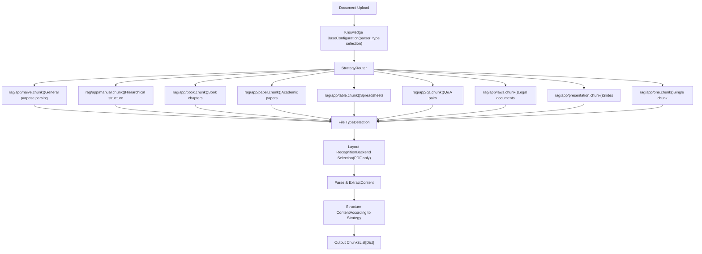
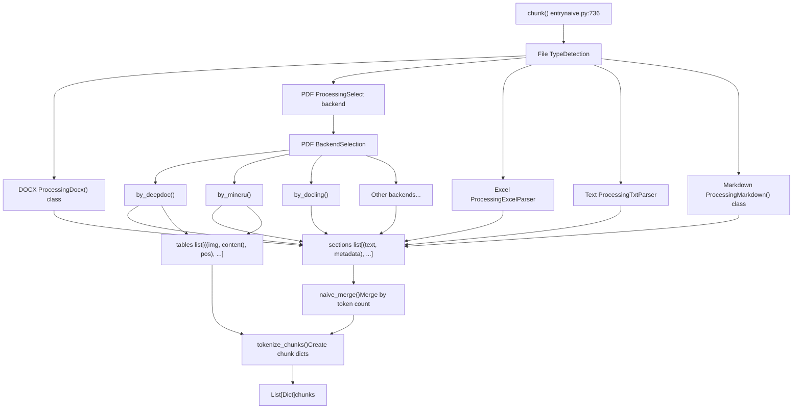
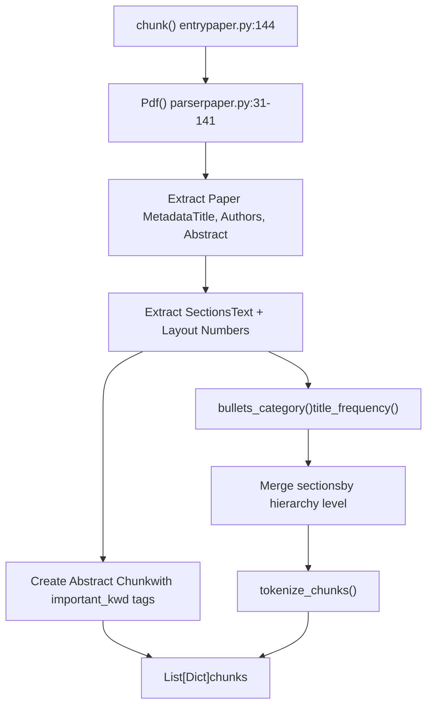
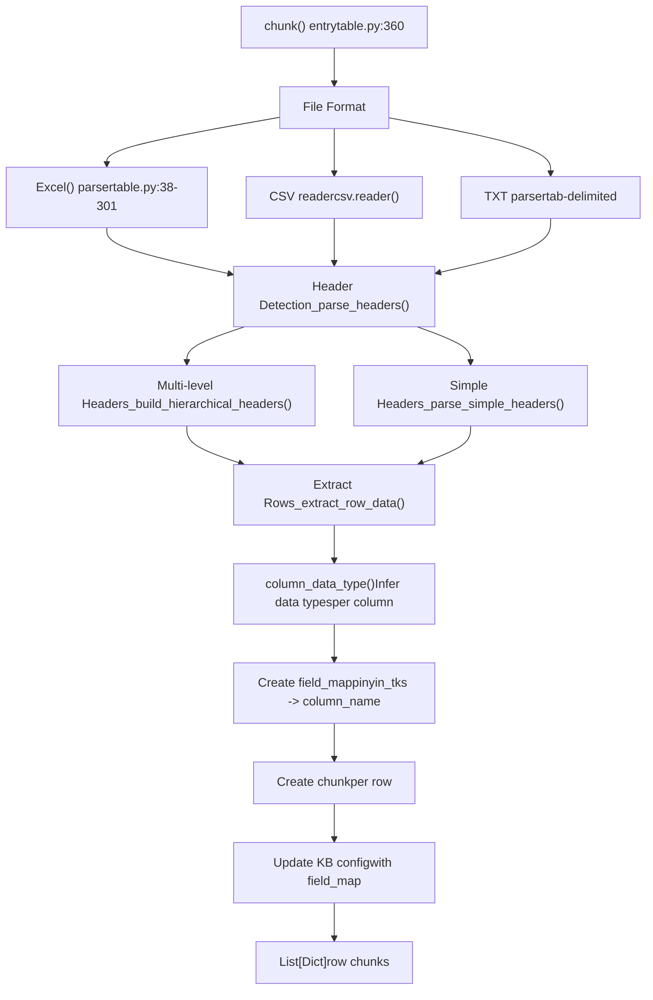
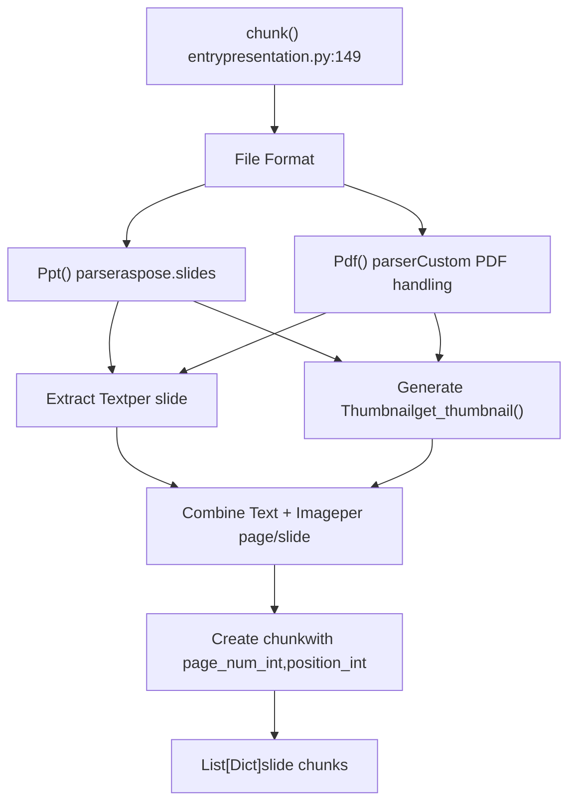
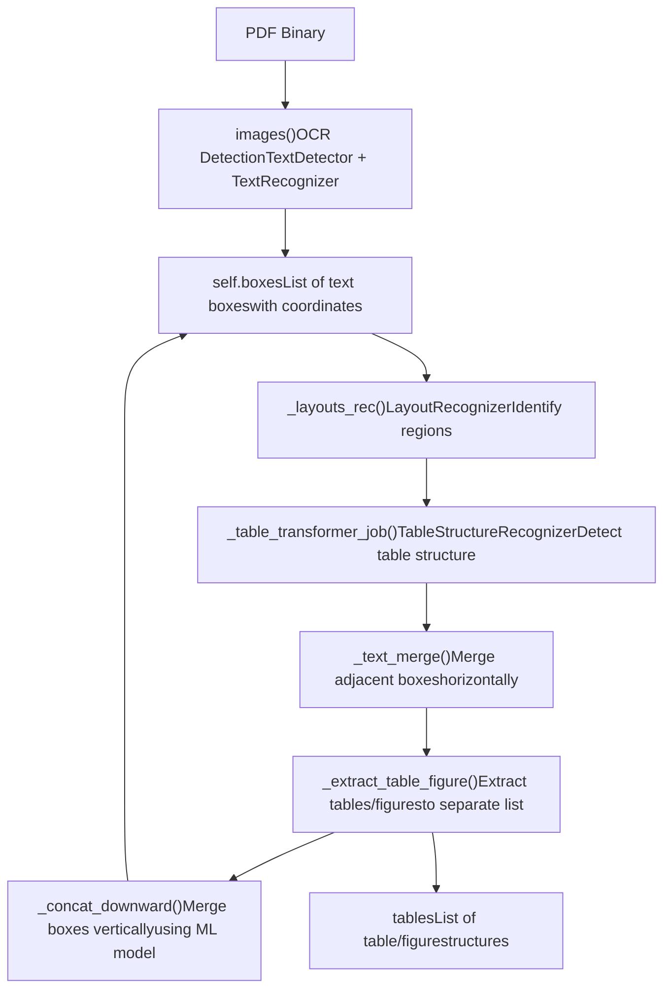
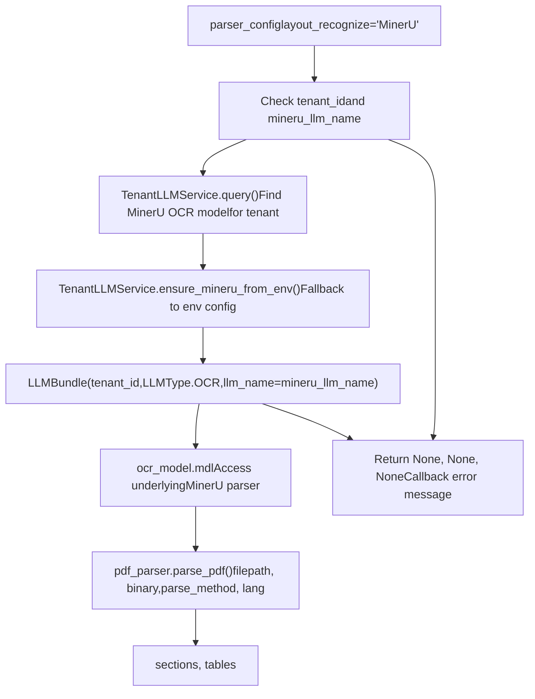
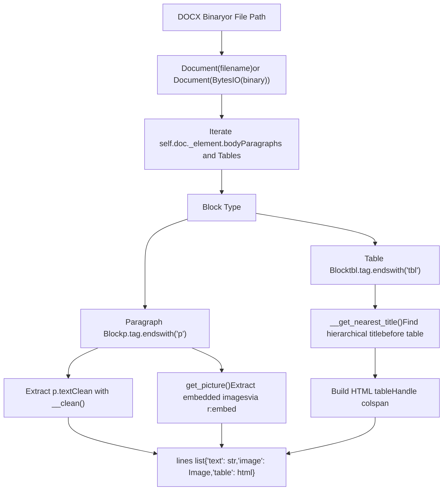
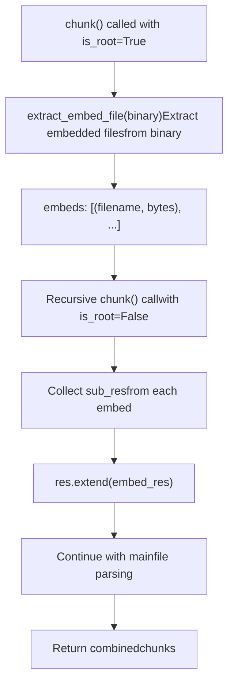

# Document Parsing Strategies

Relevant source files

-   [api/apps/chunk\_app.py](https://github.com/infiniflow/ragflow/blob/80a16e71/api/apps/chunk_app.py)
-   [api/apps/conversation\_app.py](https://github.com/infiniflow/ragflow/blob/80a16e71/api/apps/conversation_app.py)
-   [api/apps/document\_app.py](https://github.com/infiniflow/ragflow/blob/80a16e71/api/apps/document_app.py)
-   [api/apps/file2document\_app.py](https://github.com/infiniflow/ragflow/blob/80a16e71/api/apps/file2document_app.py)
-   [api/apps/file\_app.py](https://github.com/infiniflow/ragflow/blob/80a16e71/api/apps/file_app.py)
-   [api/apps/kb\_app.py](https://github.com/infiniflow/ragflow/blob/80a16e71/api/apps/kb_app.py)
-   [api/db/db\_models.py](https://github.com/infiniflow/ragflow/blob/80a16e71/api/db/db_models.py)
-   [api/db/services/dialog\_service.py](https://github.com/infiniflow/ragflow/blob/80a16e71/api/db/services/dialog_service.py)
-   [api/db/services/document\_service.py](https://github.com/infiniflow/ragflow/blob/80a16e71/api/db/services/document_service.py)
-   [api/db/services/file\_service.py](https://github.com/infiniflow/ragflow/blob/80a16e71/api/db/services/file_service.py)
-   [api/db/services/knowledgebase\_service.py](https://github.com/infiniflow/ragflow/blob/80a16e71/api/db/services/knowledgebase_service.py)
-   [api/db/services/task\_service.py](https://github.com/infiniflow/ragflow/blob/80a16e71/api/db/services/task_service.py)
-   [deepdoc/parser/excel\_parser.py](https://github.com/infiniflow/ragflow/blob/80a16e71/deepdoc/parser/excel_parser.py)
-   [rag/app/book.py](https://github.com/infiniflow/ragflow/blob/80a16e71/rag/app/book.py)
-   [rag/app/laws.py](https://github.com/infiniflow/ragflow/blob/80a16e71/rag/app/laws.py)
-   [rag/app/manual.py](https://github.com/infiniflow/ragflow/blob/80a16e71/rag/app/manual.py)
-   [rag/app/naive.py](https://github.com/infiniflow/ragflow/blob/80a16e71/rag/app/naive.py)
-   [rag/app/one.py](https://github.com/infiniflow/ragflow/blob/80a16e71/rag/app/one.py)
-   [rag/app/paper.py](https://github.com/infiniflow/ragflow/blob/80a16e71/rag/app/paper.py)
-   [rag/app/presentation.py](https://github.com/infiniflow/ragflow/blob/80a16e71/rag/app/presentation.py)
-   [rag/app/qa.py](https://github.com/infiniflow/ragflow/blob/80a16e71/rag/app/qa.py)
-   [rag/app/table.py](https://github.com/infiniflow/ragflow/blob/80a16e71/rag/app/table.py)
-   [rag/nlp/\_\_init\_\_.py](https://github.com/infiniflow/ragflow/blob/80a16e71/rag/nlp/__init__.py)
-   [rag/nlp/search.py](https://github.com/infiniflow/ragflow/blob/80a16e71/rag/nlp/search.py)
-   [rag/svr/task\_executor.py](https://github.com/infiniflow/ragflow/blob/80a16e71/rag/svr/task_executor.py)

## Purpose and Scope

This document details RAGFlow's **parsing strategies** — specialized approaches for extracting and structuring content from different document types. RAGFlow provides 9+ distinct parsing strategies optimized for specific document structures (books, papers, Q&A pairs, tables, legal documents, etc.), plus a general-purpose naive parser.

The parsing stage is the first step in the document processing pipeline, responsible for:

-   Detecting file types via filename patterns
-   Selecting the appropriate parsing strategy based on user configuration
-   Extracting raw text, layout information, tables, and images
-   Structuring content according to the document's inherent organization

**Key Distinction**: Parser strategies (defined in `rag/app/*.py`) determine *how* documents are chunked and structured, while layout recognition backends (DeepDOC, MinerU, etc.) are *tools* used within strategies to extract layout from PDFs.

For information about what happens after parsing (chunking, enhancement, embedding), see [Chunking Methods](/infiniflow/ragflow/6.2-chunking-methods). For details on layout recognition and OCR internals, see [Layout Recognition and OCR](/infiniflow/ragflow/6.4-layout-recognition-and-ocr).

**Sources**: [rag/app/naive.py1-932](https://github.com/infiniflow/ragflow/blob/80a16e71/rag/app/naive.py#L1-L932) [rag/app/manual.py1-338](https://github.com/infiniflow/ragflow/blob/80a16e71/rag/app/manual.py#L1-L338) [rag/app/book.py1-187](https://github.com/infiniflow/ragflow/blob/80a16e71/rag/app/book.py#L1-L187)

---

## File Type Detection

RAGFlow detects file types using regex patterns on filenames within each parser strategy's `chunk()` function. Each strategy handles a specific set of file formats.

**File Type Detection Patterns**:

| Pattern | File Types | Example Strategies |
| --- | --- | --- |
| `r"\.pdf$"` | PDF documents | naive, manual, book, paper, laws, presentation, one |
| `r"\.docx?$"` | Word documents | naive, manual, book, laws, qa, one |
| `r"\.xlsx?$"` | Excel spreadsheets | naive, table |
| `r"\.(csv)$"` | CSV files | table, qa |
| `r"\.(txt|py|js|java|c|cpp|h|php|go|ts|sh|cs|kt|sql)$"` | Plain text & code | naive, book, laws, one |
| `r"\.(md|markdown|mdx)$"` | Markdown files | naive, laws, qa, one |
| `r"\.(htm|html)$"` | HTML files | book, laws, one |
| `r"\.pptx?$"` | PowerPoint presentations | presentation |
| `r"\.doc$"` | Legacy Word documents | book, laws, one |

**Detection Implementation Example**:

```
# From rag/app/naive.py:789-823
if re.search(r"\.docx$", filename, re.IGNORECASE):
    # DOCX parsing logic...
elif re.search(r"\.pdf$", filename, re.IGNORECASE):
    # PDF parsing logic...
elif re.search(r"\.(csv|xlsx?)$", filename, re.IGNORECASE):
    # Excel/CSV parsing logic...
```
File type detection is case-insensitive and occurs at the beginning of each strategy's `chunk()` function. If a file type is not supported by the selected strategy, a `NotImplementedError` is raised.

**Sources**: [rag/app/naive.py789-932](https://github.com/infiniflow/ragflow/blob/80a16e71/rag/app/naive.py#L789-L932) [rag/app/table.py360-430](https://github.com/infiniflow/ragflow/blob/80a16e71/rag/app/table.py#L360-L430) [rag/app/qa.py319-472](https://github.com/infiniflow/ragflow/blob/80a16e71/rag/app/qa.py#L319-L472)

---

## Parser Strategy Architecture

RAGFlow uses 9+ specialized parsing strategies, each optimized for different document structures. Strategies are implemented as modules in `rag/app/` and selected by users when configuring knowledge bases.

**Parser Strategy Selection Flow**


Each strategy implements a `chunk()` function with signature:

```
def chunk(filename, binary=None, from_page=0, to_page=100000,
          lang="Chinese", callback=None, **kwargs):
    """
    Returns: List[Dict] - List of chunk dictionaries
    """
```
**Sources**: [rag/app/naive.py736-932](https://github.com/infiniflow/ragflow/blob/80a16e71/rag/app/naive.py#L736-L932) [rag/app/manual.py176-329](https://github.com/infiniflow/ragflow/blob/80a16e71/rag/app/manual.py#L176-L329) [rag/app/book.py61-178](https://github.com/infiniflow/ragflow/blob/80a16e71/rag/app/book.py#L61-L178)

---

## Parser Strategies Overview

The following table summarizes RAGFlow's parsing strategies and their characteristics:

| Strategy | Module | Supported Formats | Primary Use Case | Chunking Approach |
| --- | --- | --- | --- | --- |
| **Naive** | `naive.py` | PDF, DOCX, Excel, TXT, MD, Code | General documents | Token-based with delimiter splitting |
| **Manual** | `manual.py` | PDF, DOCX | Technical manuals, structured docs | Hierarchical title-based sections |
| **Book** | `book.py` | PDF, DOCX, TXT, HTML | Books, long-form content | Chapter/section hierarchy |
| **Paper** | `paper.py` | PDF | Academic papers | Title/abstract/sections structure |
| **Table** | `table.py` | Excel, CSV, TXT | Spreadsheets, tabular data | Row-by-row or column-based |
| **Q&A** | `qa.py` | Excel, CSV, TXT, PDF, DOCX, MD | Question-answer pairs | Q&A pair extraction |
| **Laws** | `laws.py` | PDF, DOCX, TXT, HTML, DOC | Legal documents, regulations | Hierarchical legal structure |
| **Presentation** | `presentation.py` | PDF, PPTX | Presentations, slides | One chunk per slide |
| **One** | `one.py` | PDF, DOCX, Excel, TXT, HTML, DOC | Short documents | Entire document as single chunk |

**Sources**: [rag/app/naive.py1-15](https://github.com/infiniflow/ragflow/blob/80a16e71/rag/app/naive.py#L1-L15) [rag/app/manual.py1-15](https://github.com/infiniflow/ragflow/blob/80a16e71/rag/app/manual.py#L1-L15) [rag/app/table.py1-15](https://github.com/infiniflow/ragflow/blob/80a16e71/rag/app/table.py#L1-L15) [rag/app/qa.py1-15](https://github.com/infiniflow/ragflow/blob/80a16e71/rag/app/qa.py#L1-L15) [rag/app/laws.py1-15](https://github.com/infiniflow/ragflow/blob/80a16e71/rag/app/laws.py#L1-L15) [rag/app/presentation.py1-15](https://github.com/infiniflow/ragflow/blob/80a16e71/rag/app/presentation.py#L1-L15) [rag/app/book.py1-15](https://github.com/infiniflow/ragflow/blob/80a16e71/rag/app/book.py#L1-L15) [rag/app/paper.py1-15](https://github.com/infiniflow/ragflow/blob/80a16e71/rag/app/paper.py#L1-L15) [rag/app/one.py1-15](https://github.com/infiniflow/ragflow/blob/80a16e71/rag/app/one.py#L1-L15)

---

## Naive Parser Strategy

The **naive parser** is the default, general-purpose strategy for most documents. It performs token-based chunking with configurable delimiters and supports the widest range of file formats.

**Naive Parser Characteristics**:

-   **Supported formats**: PDF, DOCX, Excel, TXT, Markdown, Code files
-   **Chunking approach**: Splits text by delimiters, merges to target token count
-   **Layout preservation**: Optional (configurable)
-   **Hyperlink extraction**: Optional (when `analyze_hyperlink=True`)
-   **Embedded file extraction**: Automatic for root documents

**Naive Parser Flow**:


**Key Implementation Details**:

-   Entry point: [rag/app/naive.py736](https://github.com/infiniflow/ragflow/blob/80a16e71/rag/app/naive.py#L736-L736)
-   DOCX parser: [rag/app/naive.py231-541](https://github.com/infiniflow/ragflow/blob/80a16e71/rag/app/naive.py#L231-L541)
-   PDF backend selection: [rag/app/naive.py825-862](https://github.com/infiniflow/ragflow/blob/80a16e71/rag/app/naive.py#L825-L862)
-   Text merging: [rag/nlp/\_\_init\_\_.py1015-1116](https://github.com/infiniflow/ragflow/blob/80a16e71/rag/nlp/__init__.py#L1015-L1116)

**Sources**: [rag/app/naive.py736-932](https://github.com/infiniflow/ragflow/blob/80a16e71/rag/app/naive.py#L736-L932) [rag/app/naive.py231-541](https://github.com/infiniflow/ragflow/blob/80a16e71/rag/app/naive.py#L231-L541) [rag/nlp/\_\_init\_\_.py1015-1116](https://github.com/infiniflow/ragflow/blob/80a16e71/rag/nlp/__init__.py#L1015-L1116)

---

## Manual Parser Strategy

The **manual parser** is designed for technical manuals and structured documents with clear hierarchical titles. It preserves section structure and treats each major section as a chunk.

**Manual Parser Characteristics**:

-   **Supported formats**: PDF, DOCX
-   **Chunking approach**: Hierarchical sections based on headings/outlines
-   **Structure preservation**: High (maintains document hierarchy)
-   **Best for**: User manuals, technical documentation, structured reports

**Implementation**:

```
# From rag/app/manual.py:176-329
def chunk(filename, binary=None, from_page=0, to_page=100000,
          lang="Chinese", callback=None, **kwargs):
    """
    Only pdf and docx supported.
    Chunks based on hierarchical structure.
    """
```
The manual parser:

1.  Extracts sections with layout numbers (for PDF) or heading styles (for DOCX)
2.  Uses `bullets_category()` and `title_frequency()` to identify hierarchy
3.  Merges content within each major section
4.  Preserves position metadata for citations

**Key Classes**:

-   `Pdf` at [rag/app/manual.py33-68](https://github.com/infiniflow/ragflow/blob/80a16e71/rag/app/manual.py#L33-L68) - Extends `PdfParser` with manual-specific layout handling
-   `Docx` at [rag/app/manual.py70-174](https://github.com/infiniflow/ragflow/blob/80a16e71/rag/app/manual.py#L70-L174) - Extracts hierarchical question-answer structure

**Sources**: [rag/app/manual.py176-329](https://github.com/infiniflow/ragflow/blob/80a16e71/rag/app/manual.py#L176-L329) [rag/app/manual.py33-68](https://github.com/infiniflow/ragflow/blob/80a16e71/rag/app/manual.py#L33-L68) [rag/app/manual.py70-174](https://github.com/infiniflow/ragflow/blob/80a16e71/rag/app/manual.py#L70-L174)

---

## Book Parser Strategy

The **book parser** handles long-form content like books, organized by chapters and sections.

**Book Parser Characteristics**:

-   **Supported formats**: PDF, DOCX, TXT, HTML, DOC
-   **Chunking approach**: Chapter/section hierarchy with bullet detection
-   **Structure preservation**: High (maintains chapter structure)
-   **Best for**: Books, long-form articles, thesis documents

**Implementation Details**:

-   Removes table of contents automatically via `remove_contents_table()`
-   Uses `bullets_category()` to identify chapter/section markers
-   Merges content hierarchically using `hierarchical_merge()` or `naive_merge()`
-   Supports vision figure parser for images in books

**Key Functions**:

-   Entry point: [rag/app/book.py61-178](https://github.com/infiniflow/ragflow/blob/80a16e71/rag/app/book.py#L61-L178)
-   Content cleanup: [rag/nlp/\_\_init\_\_.py847-876](https://github.com/infiniflow/ragflow/blob/80a16e71/rag/nlp/__init__.py#L847-L876)
-   Hierarchical merge: [rag/nlp/\_\_init\_\_.py1118-1194](https://github.com/infiniflow/ragflow/blob/80a16e71/rag/nlp/__init__.py#L1118-L1194)

**Sources**: [rag/app/book.py61-178](https://github.com/infiniflow/ragflow/blob/80a16e71/rag/app/book.py#L61-L178) [rag/nlp/\_\_init\_\_.py847-876](https://github.com/infiniflow/ragflow/blob/80a16e71/rag/nlp/__init__.py#L847-L876) [rag/nlp/\_\_init\_\_.py1118-1194](https://github.com/infiniflow/ragflow/blob/80a16e71/rag/nlp/__init__.py#L1118-L1194)

---

## Paper Parser Strategy

The **paper parser** is specialized for academic papers, extracting title, authors, abstract, and sections.

**Paper Parser Characteristics**:

-   **Supported formats**: PDF only
-   **Chunking approach**: Paper structure (abstract as whole chunk, then sections)
-   **Structure preservation**: Very high (paper-specific structure)
-   **Best for**: Academic papers, research articles

**Paper Parsing Flow**:


**Key Features**:

-   Abstract chunk tagged with `important_kwd: ["abstract", "summary", ...]`
-   Two-column layout detection for academic papers
-   Automatic title/author extraction from first pages
-   Section merging based on most frequent title level

**Sources**: [rag/app/paper.py144-256](https://github.com/infiniflow/ragflow/blob/80a16e71/rag/app/paper.py#L144-L256) [rag/app/paper.py31-141](https://github.com/infiniflow/ragflow/blob/80a16e71/rag/app/paper.py#L31-L141)

---

## Table Parser Strategy

The **table parser** is specialized for spreadsheets and tabular data, treating each row as a chunk.

**Table Parser Characteristics**:

-   **Supported formats**: Excel (.xlsx, .xls), CSV, TXT (tab-delimited)
-   **Chunking approach**: Row-by-row processing
-   **Data type inference**: Automatic (int, float, text, datetime, bool, keyword)
-   **Best for**: Spreadsheets, databases, structured tables

**Table Parsing Architecture**:


**Data Type Inference**: The table parser automatically infers column types at [rag/app/table.py319-357](https://github.com/infiniflow/ragflow/blob/80a16e71/rag/app/table.py#L319-L357):

-   **int**: Pure integers (no leading zeros)
-   **float**: Decimal numbers
-   **bool**: `true/false`, `yes/no`, checkmarks
-   **datetime**: Parseable date/time strings
-   **text**: Default fallback

Field names are normalized to pinyin for Chinese columns, and suffixed with type indicators (`_tks`, `_long`, `_flt`, `_dt`, `_kwd`).

**Sources**: [rag/app/table.py360-483](https://github.com/infiniflow/ragflow/blob/80a16e71/rag/app/table.py#L360-L483) [rag/app/table.py38-301](https://github.com/infiniflow/ragflow/blob/80a16e71/rag/app/table.py#L38-L301) [rag/app/table.py319-357](https://github.com/infiniflow/ragflow/blob/80a16e71/rag/app/table.py#L319-L357)

---

## Q&A Parser Strategy

The **Q&A parser** extracts question-answer pairs from various formats, treating each pair as a chunk.

**Q&A Parser Characteristics**:

-   **Supported formats**: Excel, CSV, TXT, PDF, DOCX, Markdown
-   **Chunking approach**: One chunk per Q&A pair
-   **Structure detection**: Automatic via pattern matching
-   **Best for**: FAQ documents, Q&A databases, training materials

**Q&A Detection Patterns**: The parser uses `qbullets_category()` at [rag/nlp/\_\_init\_\_.py151-166](https://github.com/infiniflow/ragflow/blob/80a16e71/rag/nlp/__init__.py#L151-L166) to detect Q&A patterns:

-   Chinese: `第[一二三...]问`, `第[0-9]+问`, `(一)`, `(1)`
-   English: `QUESTION ONE`, `QUESTION (I)`, `QUESTION [0-9]+`

**Format-Specific Handling**:

| Format | Q&A Detection | Implementation |
| --- | --- | --- |
| **Excel** | Column 1 = question, Column 2 = answer | [rag/app/qa.py36-76](https://github.com/infiniflow/ragflow/blob/80a16e71/rag/app/qa.py#L36-L76) |
| **CSV/TXT** | Delimiter-separated (`,` or `\t`) | [rag/app/qa.py383-413](https://github.com/infiniflow/ragflow/blob/80a16e71/rag/app/qa.py#L383-L413) |
| **PDF** | Pattern-based question detection | [rag/app/qa.py79-189](https://github.com/infiniflow/ragflow/blob/80a16e71/rag/app/qa.py#L79-L189) |
| **DOCX** | Heading-based hierarchy | [rag/app/qa.py191-265](https://github.com/infiniflow/ragflow/blob/80a16e71/rag/app/qa.py#L191-L265) |
| **Markdown** | Header-based (`#` markers) | [rag/app/qa.py424-459](https://github.com/infiniflow/ragflow/blob/80a16e71/rag/app/qa.py#L424-L459) |

**Sources**: [rag/app/qa.py319-472](https://github.com/infiniflow/ragflow/blob/80a16e71/rag/app/qa.py#L319-L472) [rag/app/qa.py79-189](https://github.com/infiniflow/ragflow/blob/80a16e71/rag/app/qa.py#L79-L189) [rag/nlp/\_\_init\_\_.py151-166](https://github.com/infiniflow/ragflow/blob/80a16e71/rag/nlp/__init__.py#L151-L166)

---

## Laws Parser Strategy

The **laws parser** handles legal documents with hierarchical article/section structure.

**Laws Parser Characteristics**:

-   **Supported formats**: PDF, DOCX, TXT, HTML, DOC
-   **Chunking approach**: Hierarchical tree structure with articles/sections
-   **Structure preservation**: Very high (legal hierarchy)
-   **Best for**: Laws, regulations, legal documents, contracts

**Hierarchical Tree Construction**: The laws parser uses `tree_merge()` at [rag/nlp/\_\_init\_\_.py](https://github.com/infiniflow/ragflow/blob/80a16e71/rag/nlp/__init__.py) to build a hierarchical tree:

1.  Detect bullet patterns via `bullets_category()`
2.  Build tree structure using `Node` class
3.  Merge content at appropriate hierarchy levels
4.  Preserve legal section references

**Implementation Details**:

-   Entry point: [rag/app/laws.py120-217](https://github.com/infiniflow/ragflow/blob/80a16e71/rag/app/laws.py#L120-L217)
-   DOCX tree building: [rag/app/laws.py31-94](https://github.com/infiniflow/ragflow/blob/80a16e71/rag/app/laws.py#L31-L94)
-   Uses `docx_question_level()` to detect heading levels
-   Removes table of contents automatically

**Sources**: [rag/app/laws.py120-217](https://github.com/infiniflow/ragflow/blob/80a16e71/rag/app/laws.py#L120-L217) [rag/app/laws.py31-94](https://github.com/infiniflow/ragflow/blob/80a16e71/rag/app/laws.py#L31-L94)

---

## Presentation Parser Strategy

The **presentation parser** treats each slide as a separate chunk with thumbnail images.

**Presentation Parser Characteristics**:

-   **Supported formats**: PDF, PPTX
-   **Chunking approach**: One chunk per slide/page
-   **Image preservation**: High (thumbnails for each slide)
-   **Best for**: Presentations, slide decks

**Presentation Parsing Flow**:


**Key Features**:

-   PPTX: Uses `aspose.slides` library at [rag/app/presentation.py32-53](https://github.com/infiniflow/ragflow/blob/80a16e71/rag/app/presentation.py#L32-L53)
-   PDF: Custom parser reassembles page content at [rag/app/presentation.py56-137](https://github.com/infiniflow/ragflow/blob/80a16e71/rag/app/presentation.py#L56-L137)
-   Each chunk includes thumbnail as `image` field
-   Marked with `doc_type_kwd: "image"`

**Sources**: [rag/app/presentation.py149-220](https://github.com/infiniflow/ragflow/blob/80a16e71/rag/app/presentation.py#L149-L220) [rag/app/presentation.py32-53](https://github.com/infiniflow/ragflow/blob/80a16e71/rag/app/presentation.py#L32-L53) [rag/app/presentation.py56-137](https://github.com/infiniflow/ragflow/blob/80a16e71/rag/app/presentation.py#L56-L137)

---

## One Parser Strategy

The **one parser** treats the entire document as a single chunk, useful for short documents.

**One Parser Characteristics**:

-   **Supported formats**: PDF, DOCX, Excel, TXT, Markdown, HTML, DOC
-   **Chunking approach**: Entire document = one chunk
-   **Structure preservation**: None (flattened)
-   **Best for**: Short documents, summaries, abstracts

**Implementation**:

```
# From rag/app/one.py:58-167
def chunk(filename, binary=None, from_page=0, to_page=100000,
          lang="Chinese", callback=None, **kwargs):
    """
    One file forms a chunk which maintains original text order.
    """
```
The one parser:

1.  Parses the document using appropriate format parser
2.  Concatenates all sections with `\n` separator
3.  Creates a single chunk dictionary
4.  Preserves original text order

**Sources**: [rag/app/one.py58-167](https://github.com/infiniflow/ragflow/blob/80a16e71/rag/app/one.py#L58-L167) [rag/app/one.py1-176](https://github.com/infiniflow/ragflow/blob/80a16e71/rag/app/one.py#L1-L176)

---

## Layout Recognition Backends (PDF)

For PDF parsing, several strategies (naive, manual, book, paper, laws, presentation, one) support configurable **layout recognition backends**. These backends are tools for extracting layout from PDFs, selected via the `layout_recognize` parameter.

**PDF Backend Registry**

The `PARSERS` dictionary in [rag/app/naive.py221-228](https://github.com/infiniflow/ragflow/blob/80a16e71/rag/app/naive.py#L221-L228) maps configuration names to parser factory functions:

| Parser Key | Function | Primary Use Case | OCR Support | Layout Analysis |
| --- | --- | --- | --- | --- |
| `deepdoc` | `by_deepdoc()` | Default PDF parsing with layout recognition | ✓ (DeepDOC OCR) | ✓ (LayoutRecognizer) |
| `mineru` | `by_mineru()` | Advanced PDF parsing via MinerU library | ✓ (Tenant-configurable) | ✓ (MinerU built-in) |
| `docling` | `by_docling()` | Alternative PDF parser using Docling | ✓ (Docling built-in) | ✓ (Docling built-in) |
| `tcadp` | `by_tcadp()` | Tencent Cloud API-based parsing | ✓ (Cloud API) | ✓ (Cloud API) |
| `paddleocr` | `by_paddleocr()` | PaddleOCR-based text extraction | ✓ (PaddleOCR) | ✓ (Tenant-configurable) |
| `plaintext` | `by_plaintext()` | Simple text extraction without layout | ✗ (PyPDF2 only) | Optional (VisionParser) |

The backend is selected using the `layout_recognize` parameter from `parser_config`, which is normalized through `normalize_layout_recognizer()` at [common/parser\_config\_utils.py](https://github.com/infiniflow/ragflow/blob/80a16e71/common/parser_config_utils.py)

For detailed information on layout recognition and OCR internals, see [Layout Recognition and OCR](/infiniflow/ragflow/6.4-layout-recognition-and-ocr).

**Sources**: [rag/app/naive.py221-228](https://github.com/infiniflow/ragflow/blob/80a16e71/rag/app/naive.py#L221-L228) [rag/app/naive.py57-69](https://github.com/infiniflow/ragflow/blob/80a16e71/rag/app/naive.py#L57-L69) [rag/app/naive.py72-118](https://github.com/infiniflow/ragflow/blob/80a16e71/rag/app/naive.py#L72-L118) [rag/app/naive.py121-137](https://github.com/infiniflow/ragflow/blob/80a16e71/rag/app/naive.py#L121-L137) [rag/app/naive.py140-148](https://github.com/infiniflow/ragflow/blob/80a16e71/rag/app/naive.py#L140-L148) [rag/app/naive.py151-198](https://github.com/infiniflow/ragflow/blob/80a16e71/rag/app/naive.py#L151-L198) [rag/app/naive.py201-218](https://github.com/infiniflow/ragflow/blob/80a16e71/rag/app/naive.py#L201-L218)

---

## PDF Backend Implementations

### DeepDOC Parser (Default)

The DeepDOC parser provides comprehensive PDF processing with layout analysis, OCR, and table detection using RAGFlow's proprietary models.

**DeepDOC Processing Pipeline**


**Key Classes and Methods**:

-   `Pdf` class in [rag/app/naive.py543-579](https://github.com/infiniflow/ragflow/blob/80a16e71/rag/app/naive.py#L543-L579) - Wrapper around `PdfParser`
-   `RAGFlowPdfParser` in [deepdoc/parser/pdf\_parser.py51-104](https://github.com/infiniflow/ragflow/blob/80a16e71/deepdoc/parser/pdf_parser.py#L51-L104) - Base class with OCR and layout recognition
-   `__images__()` at [deepdoc/parser/pdf\_parser.py281-344](https://github.com/infiniflow/ragflow/blob/80a16e71/deepdoc/parser/pdf_parser.py#L281-L344) - Performs OCR on PDF pages
-   `_layouts_rec()` at [deepdoc/parser/pdf\_parser.py346-352](https://github.com/infiniflow/ragflow/blob/80a16e71/deepdoc/parser/pdf_parser.py#L346-L352) - Runs layout recognition
-   `_table_transformer_job()` at [deepdoc/parser/pdf\_parser.py195-237](https://github.com/infiniflow/ragflow/blob/80a16e71/deepdoc/parser/pdf_parser.py#L195-L237) - Detects table components
-   `_text_merge()` at [deepdoc/parser/pdf\_parser.py440-476](https://github.com/infiniflow/ragflow/blob/80a16e71/deepdoc/parser/pdf_parser.py#L440-L476) - Merges horizontally adjacent text boxes
-   `_concat_downward()` at [deepdoc/parser/pdf\_parser.py581-683](https://github.com/infiniflow/ragflow/blob/80a16e71/deepdoc/parser/pdf_parser.py#L581-L683) - Uses XGBoost model to merge vertically

The DeepDOC parser uses three specialized models:

1.  **OCR** (`deepdoc/vision/ocr.py`): Text detection and recognition
2.  **LayoutRecognizer** (`deepdoc/vision/layout_recognizer.py`): Classifies regions as text, title, figure, table, etc.
3.  **TableStructureRecognizer** (`deepdoc/vision/table_structure_recognizer.py`): Identifies table rows, columns, headers

**Sources**: [rag/app/naive.py543-579](https://github.com/infiniflow/ragflow/blob/80a16e71/rag/app/naive.py#L543-L579) [deepdoc/parser/pdf\_parser.py51-104](https://github.com/infiniflow/ragflow/blob/80a16e71/deepdoc/parser/pdf_parser.py#L51-L104) [deepdoc/parser/pdf\_parser.py195-237](https://github.com/infiniflow/ragflow/blob/80a16e71/deepdoc/parser/pdf_parser.py#L195-L237) [deepdoc/parser/pdf\_parser.py346-352](https://github.com/infiniflow/ragflow/blob/80a16e71/deepdoc/parser/pdf_parser.py#L346-L352) [deepdoc/parser/pdf\_parser.py440-476](https://github.com/infiniflow/ragflow/blob/80a16e71/deepdoc/parser/pdf_parser.py#L440-L476) [deepdoc/parser/pdf\_parser.py581-683](https://github.com/infiniflow/ragflow/blob/80a16e71/deepdoc/parser/pdf_parser.py#L581-L683)

### MinerU Parser

The MinerU parser integrates with the MinerU library for advanced PDF parsing. It requires tenant-specific LLM configuration for OCR capabilities.

**MinerU Integration Flow**


Key implementation details:

-   MinerU models are registered as `LLMType.OCR` in the tenant's LLM configuration
-   The parser factory at [rag/app/naive.py72-118](https://github.com/infiniflow/ragflow/blob/80a16e71/rag/app/naive.py#L72-L118) handles tenant lookup and fallback
-   MinerU supports multiple `parse_method` values: `"raw"` or custom methods
-   Output directory controlled by `MINERU_OUTPUT_DIR` environment variable
-   Cleanup controlled by `MINERU_DELETE_OUTPUT` environment variable

**Sources**: [rag/app/naive.py72-118](https://github.com/infiniflow/ragflow/blob/80a16e71/rag/app/naive.py#L72-L118) [api/db/services/tenant\_llm\_service.py](https://github.com/infiniflow/ragflow/blob/80a16e71/api/db/services/tenant_llm_service.py)

### Docling Parser

The Docling parser provides an alternative PDF parsing backend using the Docling library.

**Implementation**:

```
# From rag/app/naive.py:121-137
def by_docling(filename, binary=None, from_page=0, to_page=100000,
               lang="Chinese", callback=None, pdf_cls=None, **kwargs):
    pdf_parser = DoclingParser()
    parse_method = kwargs.get("parse_method", "raw")

    if not pdf_parser.check_installation():
        callback(-1, "Docling not found.")
        return None, None, pdf_parser

    sections, tables = pdf_parser.parse_pdf(
        filepath=filename,
        binary=binary,
        callback=callback,
        output_dir=os.environ.get("MINERU_OUTPUT_DIR", ""),
        delete_output=bool(int(os.environ.get("MINERU_DELETE_OUTPUT", 1))),
        parse_method=parse_method,
    )
    return sections, tables, pdf_parser
```
The Docling parser:

-   Checks for Docling installation via `check_installation()`
-   Uses the same output directory configuration as MinerU
-   Supports configurable cleanup of intermediate files
-   Returns sections and tables in a standard format

**Sources**: [rag/app/naive.py121-137](https://github.com/infiniflow/ragflow/blob/80a16e71/rag/app/naive.py#L121-L137) [deepdoc/parser/docling\_parser.py](https://github.com/infiniflow/ragflow/blob/80a16e71/deepdoc/parser/docling_parser.py)

### TCADP Parser (Tencent Cloud)

The TCADP parser integrates with Tencent Cloud API for document parsing, supporting both PDF and Excel formats.

**Implementation**:

```
# From rag/app/naive.py:140-148
def by_tcadp(filename, binary=None, from_page=0, to_page=100000,
             lang="Chinese", callback=None, pdf_cls=None, **kwargs):
    tcadp_parser = TCADPParser()

    if not tcadp_parser.check_installation():
        callback(-1, "TCADP parser not available. Please check Tencent Cloud API configuration.")
        return None, None, tcadp_parser

    sections, tables = tcadp_parser.parse_pdf(
        filepath=filename,
        binary=binary,
        callback=callback,
        output_dir=os.environ.get("TCADP_OUTPUT_DIR", ""),
        file_type="PDF"
    )
    return sections, tables, tcadp_parser
```
The TCADP parser also handles Excel files at [rag/app/naive.py866-882](https://github.com/infiniflow/ragflow/blob/80a16e71/rag/app/naive.py#L866-L882):

-   Detects file type from extension (`.xlsx?$` → `"XLSX"`, `.csv$` → `"CSV"`)
-   Uses `table_result_type` and `markdown_image_response_type` configuration
-   Requires Tencent Cloud API credentials to be configured

**Sources**: [rag/app/naive.py140-148](https://github.com/infiniflow/ragflow/blob/80a16e71/rag/app/naive.py#L140-L148) [rag/app/naive.py866-882](https://github.com/infiniflow/ragflow/blob/80a16e71/rag/app/naive.py#L866-L882) [deepdoc/parser/tcadp\_parser.py](https://github.com/infiniflow/ragflow/blob/80a16e71/deepdoc/parser/tcadp_parser.py)

### PaddleOCR Parser

The PaddleOCR parser uses PaddlePaddle's OCR system for text extraction.

**Tenant Configuration Lookup**:

```
# From rag/app/naive.py:151-198
def by_paddleocr(filename, binary=None, from_page=0, to_page=100000,
                 lang="Chinese", callback=None, pdf_cls=None,
                 parse_method: str = "raw",
                 paddleocr_llm_name: str | None = None,
                 tenant_id: str | None = None, **kwargs):
    pdf_parser = None
    if tenant_id:
        if not paddleocr_llm_name:
            try:
                from api.db.services.tenant_llm_service import TenantLLMService

                env_name = TenantLLMService.ensure_paddleocr_from_env(tenant_id)
                candidates = TenantLLMService.query(
                    tenant_id=tenant_id,
                    llm_factory="PaddleOCR",
                    model_type=LLMType.OCR
                )
                if candidates:
                    paddleocr_llm_name = candidates[0].llm_name
                elif env_name:
                    paddleocr_llm_name = env_name
            except Exception as e:
                logging.warning(f"fallback to env paddleocr: {e}")

        if paddleocr_llm_name:
            try:
                ocr_model = LLMBundle(
                    tenant_id=tenant_id,
                    llm_type=LLMType.OCR,
                    llm_name=paddleocr_llm_name,
                    lang=lang
                )
                pdf_parser = ocr_model.mdl
                sections, tables = pdf_parser.parse_pdf(
                    filepath=filename,
                    binary=binary,
                    callback=callback,
                    parse_method=parse_method,
                    **kwargs
                )
                return sections, tables, pdf_parser
            except Exception as e:
                logging.error(f"Failed to parse pdf via LLMBundle PaddleOCR ({paddleocr_llm_name}): {e}")

    return None, None, None
```
Similar to MinerU, PaddleOCR requires tenant-level LLM configuration registered as `LLMType.OCR` with factory `"PaddleOCR"`.

**Sources**: [rag/app/naive.py151-198](https://github.com/infiniflow/ragflow/blob/80a16e71/rag/app/naive.py#L151-L198)

### PlainText Parser

The plaintext parser provides basic text extraction without layout analysis, optionally using vision models for layout recognition.

**Vision Model Integration**:

```
# From rag/app/naive.py:201-218
def by_plaintext(filename, binary=None, from_page=0, to_page=100000,
                 callback=None, **kwargs):
    layout_recognizer = (kwargs.get("layout_recognizer") or "").strip()
    if (not layout_recognizer) or (layout_recognizer == "Plain Text"):
        pdf_parser = PlainParser()
    else:
        tenant_id = kwargs.get("tenant_id")
        if not tenant_id:
            raise ValueError("tenant_id is required when using vision layout recognizer")
        vision_model = LLMBundle(
            tenant_id,
            LLMType.IMAGE2TEXT,
            llm_name=layout_recognizer,
            lang=kwargs.get("lang", "Chinese"),
        )
        pdf_parser = VisionParser(vision_model=vision_model, **kwargs)

    sections, tables = pdf_parser(
        filename if not binary else binary,
        from_page=from_page,
        to_page=to_page,
        callback=callback
    )
    return sections, tables, pdf_parser
```
The plaintext parser has two modes:

1.  **PlainParser**: Uses PyPDF2's `extract_text()` for simple text extraction at [deepdoc/parser/pdf\_parser.py](https://github.com/infiniflow/ragflow/blob/80a16e71/deepdoc/parser/pdf_parser.py)
2.  **VisionParser**: Uses a vision LLM (`LLMType.IMAGE2TEXT`) to perform layout analysis on PDF page images

**Sources**: [rag/app/naive.py201-218](https://github.com/infiniflow/ragflow/blob/80a16e71/rag/app/naive.py#L201-L218) [deepdoc/parser/pdf\_parser.py](https://github.com/infiniflow/ragflow/blob/80a16e71/deepdoc/parser/pdf_parser.py)

---

## Format-Specific Parser Components

While parsing strategies determine *how* documents are chunked, format-specific parser components handle the low-level extraction for each file type. These are used within strategies.

### DOCX Parser Component

The DOCX parser handles Microsoft Word documents using the `python-docx` library, extracting text, images, and tables while preserving hierarchical structure.

**DOCX Parsing Architecture**


**Key Methods**:

-   `__call__()` at [rag/app/naive.py384-497](https://github.com/infiniflow/ragflow/blob/80a16e71/rag/app/naive.py#L384-L497) - Main parsing loop
-   `get_picture()` at [rag/app/naive.py235-273](https://github.com/infiniflow/ragflow/blob/80a16e71/rag/app/naive.py#L235-L273) - Extracts images from paragraphs via relationship IDs
-   `__get_nearest_title()` at [rag/app/naive.py279-382](https://github.com/infiniflow/ragflow/blob/80a16e71/rag/app/naive.py#L279-L382) - Finds the hierarchical title structure before a table by:
    1.  Collecting all document blocks (paragraphs and tables) in order
    2.  Finding the target table position
    3.  Searching backwards for heading paragraphs (`Heading 1` through `Heading 7`)
    4.  Building a hierarchy path (e.g., "Document Name > Chapter 1 > Section 1.2")

**Special Handling**:

-   **Image Concatenation**: Adjacent images are merged using `concat_img()` at [rag/nlp/\_\_init\_\_.py](https://github.com/infiniflow/ragflow/blob/80a16e71/rag/nlp/__init__.py)
-   **Caption Detection**: Paragraphs with `Caption` style are associated with preceding images
-   **Page Break Detection**: Tracks page numbers via `lastRenderedPageBreak` and `w:br` XML elements
-   **Table Context**: Adds hierarchical location to table HTML via `<caption>` tag

**Sources**: [rag/app/naive.py231-541](https://github.com/infiniflow/ragflow/blob/80a16e71/rag/app/naive.py#L231-L541) [rag/app/naive.py384-497](https://github.com/infiniflow/ragflow/blob/80a16e71/rag/app/naive.py#L384-L497) [rag/app/naive.py235-273](https://github.com/infiniflow/ragflow/blob/80a16e71/rag/app/naive.py#L235-L273) [rag/app/naive.py279-382](https://github.com/infiniflow/ragflow/blob/80a16e71/rag/app/naive.py#L279-L382)

### Markdown Parser Component

The Markdown parser component is used within multiple strategies (naive, laws, qa, one) to handle `.md`, `.markdown`, and `.mdx` files with support for embedded images and table extraction.

**Markdown Processing Flow**

**Key Features**:

-   **Image Extraction**: At [rag/app/naive.py604-678](https://github.com/infiniflow/ragflow/blob/80a16e71/rag/app/naive.py#L604-L678)

    -   Supports markdown format: `!<FileRef file-url="https://github.com/infiniflow/ragflow/blob/80a16e71/alt" undefined file-path="alt">Hii</FileRef>`
    -   Supports HTML format: ``
    -   Handles cross-line HTML tags using BeautifulSoup
    -   Tracks line numbers for associating images with sections
    -   Caches downloaded images to avoid redundant fetches
-   **Table Extraction**: At [deepdoc/parser/markdown\_parser.py](https://github.com/infiniflow/ragflow/blob/80a16e71/deepdoc/parser/markdown_parser.py)

    -   Uses regex to identify markdown tables
    -   Converts to HTML using Python `markdown` library with `tables` extension
    -   Preserves table structure and formatting
-   **Element Extraction**: At [deepdoc/parser/markdown\_parser.py](https://github.com/infiniflow/ragflow/blob/80a16e71/deepdoc/parser/markdown_parser.py)

    -   `MarkdownElementExtractor` splits text by structural elements
    -   Supports custom delimiters via `delimiter` parameter
    -   Includes metadata (start\_line, end\_line) for tracking

**Image Loading**:

```
# From rag/app/naive.py:650-678
def load_images_from_urls(self, urls, cache=None):
    import requests
    from pathlib import Path

    cache = cache or {}
    images = []
    for url in urls:
        if url in cache:
            if cache[url]:
                images.append(cache[url])
            continue
        img_obj = None
        try:
            if url.startswith(("http://", "https://")):
                response = requests.get(url, stream=True, timeout=30)
                if response.status_code == 200 and response.headers.get("Content-Type", "").startswith("image/"):
                    img_obj = Image.open(BytesIO(response.content)).convert("RGB")
            else:
                local_path = Path(url)
                if local_path.exists():
                    img_obj = Image.open(url).convert("RGB")
                else:
                    logging.warning(f"Local image file not found: {url}")
        except Exception as e:
            logging.error(f"Failed to download/open image from {url}: {e}")
        cache[url] = img_obj
        if img_obj:
            images.append(img_obj)
    return images, cache
```
**Sources**: [rag/app/naive.py582-717](https://github.com/infiniflow/ragflow/blob/80a16e71/rag/app/naive.py#L582-L717) [rag/app/naive.py604-678](https://github.com/infiniflow/ragflow/blob/80a16e71/rag/app/naive.py#L604-L678) [rag/app/naive.py650-678](https://github.com/infiniflow/ragflow/blob/80a16e71/rag/app/naive.py#L650-L678) [deepdoc/parser/markdown\_parser.py](https://github.com/infiniflow/ragflow/blob/80a16e71/deepdoc/parser/markdown_parser.py)

### Excel Parser Component

The Excel parser component is used within the table and naive strategies to handle `.xlsx`, `.xls`, and `.csv` files with two output modes: HTML tables or row-by-row text.

**Excel Parsing Modes**:

| Mode | Configuration | Output Format | Use Case |
| --- | --- | --- | --- |
| HTML Mode | `html4excel=True` | HTML tables with structure | Preserving table layout |
| Row Mode | `html4excel=False` (default) | Plain text rows | Sequential reading |
| TCADP Mode | `layout_recognize="TCADP Parser"` | Cloud API parsing | Advanced table analysis |

**Implementation**:

```
# From rag/app/naive.py:863-891
elif re.search(r"\.(csv|xlsx?)$", filename, re.IGNORECASE):
    callback(0.1, "Start to parse.")

    # Check if tcadp_parser is selected for spreadsheet files
    layout_recognizer = parser_config.get("layout_recognize", "DeepDOC")
    if layout_recognizer == "TCADP Parser":
        table_result_type = parser_config.get("table_result_type", "1")
        markdown_image_response_type = parser_config.get("markdown_image_response_type", "1")
        tcadp_parser = TCADPParser(
            table_result_type=table_result_type,
            markdown_image_response_type=markdown_image_response_type
        )
        if not tcadp_parser.check_installation():
            callback(-1, "TCADP parser not available. Please check Tencent Cloud API configuration.")
            return res

        # Determine file type based on extension
        file_type = "XLSX" if re.search(r"\.xlsx?$", filename, re.IGNORECASE) else "CSV"

        sections, tables = tcadp_parser.parse_pdf(
            filepath=filename,
            binary=binary,
            callback=callback,
            output_dir=os.environ.get("TCADP_OUTPUT_DIR", ""),
            file_type=file_type
        )
        parser_config["chunk_token_num"] = 0
        res = tokenize_table(tables, doc, eng)
        callback(0.8, "Finish parsing.")
    else:
        # Default DeepDOC parser
        excel_parser = ExcelParser()
        if parser_config.get("html4excel"):
            sections = [(_, "") for _ in excel_parser.html(binary, 12) if _]
            parser_config["chunk_token_num"] = 0
        else:
            sections = [(_, "") for _ in excel_parser(binary) if _]
```
The `ExcelParser` at [deepdoc/parser/excel\_parser.py](https://github.com/infiniflow/ragflow/blob/80a16e71/deepdoc/parser/excel_parser.py):

-   Uses `openpyxl` to load workbooks
-   `html()` method: Converts cells to HTML with configurable max rows per table
-   `__call__()` method: Extracts text content row by row
-   Handles multiple sheets in a workbook

**Sources**: [rag/app/naive.py863-891](https://github.com/infiniflow/ragflow/blob/80a16e71/rag/app/naive.py#L863-L891) [deepdoc/parser/excel\_parser.py](https://github.com/infiniflow/ragflow/blob/80a16e71/deepdoc/parser/excel_parser.py)

### Text and Code File Parser Component

Text-based files (`.txt`, `.py`, `.js`, `.java`, `.c`, `.cpp`, `.h`, `.php`, `.go`, `.ts`, `.sh`, `.cs`, `.kt`, `.sql`) are handled by `TxtParser`, used within multiple strategies (naive, book, laws, one).

**Implementation**:

```
# From rag/app/naive.py:892-895
elif re.search(r"\.(txt|py|js|java|c|cpp|h|php|go|ts|sh|cs|kt|sql)$", filename, re.IGNORECASE):
    callback(0.1, "Start to parse.")
    sections = TxtParser()(
        filename,
        binary,
        parser_config.get("chunk_token_num", 128),
        parser_config.get("delimiter", "\n!?;。；！？")
    )
    callback(0.8, "Finish parsing.")
```
The `TxtParser` at [deepdoc/parser/txt\_parser.py](https://github.com/infiniflow/ragflow/blob/80a16e71/deepdoc/parser/txt_parser.py):

-   Detects encoding using `chardet` or iterating through common codecs
-   Pre-chunks text based on `chunk_token_num` and `delimiter`
-   Preserves code structure and formatting
-   Returns list of text sections

**Sources**: [rag/app/naive.py892-895](https://github.com/infiniflow/ragflow/blob/80a16e71/rag/app/naive.py#L892-L895) [deepdoc/parser/txt\_parser.py](https://github.com/infiniflow/ragflow/blob/80a16e71/deepdoc/parser/txt_parser.py) [rag/nlp/\_\_init\_\_.py54-72](https://github.com/infiniflow/ragflow/blob/80a16e71/rag/nlp/__init__.py#L54-L72)

---

## Parser Interface and Output Format

All parsers return a standardized tuple structure that is consumed by the chunking methods (see [Chunking Methods](/infiniflow/ragflow/6.2-chunking-methods)).

**Standard Parser Output**:

```
# PDF parsers (DeepDOC, MinerU, Docling, TCADP, PaddleOCR, PlainText)
sections, tables, pdf_parser = parser(
    filename=filename,
    binary=binary,
    from_page=from_page,
    to_page=to_page,
    lang=lang,
    callback=callback,
    **kwargs
)

# sections format varies by parser:
# - DeepDOC/PlainText: [(text, position_tag), ...]
# - MinerU/Docling/TCADP: parser-specific format
# - Manual parser: [(text, layoutno, positions), ...]

# tables format:
# [((image, content), positions), ...]
# where:
#   image: PIL.Image or None
#   content: str (HTML) or list[str] (rows)
#   positions: [(page, left, right, top, bottom), ...]

# DOCX parser
sections = docx_parser(filename, binary, from_page, to_page)
# [(text, image, table_html), ...]

# Excel parser
sections = excel_parser(binary)
# [row_text, ...]  or  [html_table, ...]

# Markdown parser
sections, tables, section_images = markdown_parser(filename, binary, ...)
# sections: [(text, ""), ...]
# tables: [((None, html), ""), ...]
# section_images: [Image | None, ...]

# Text parser
sections = txt_parser(filename, binary, chunk_token_num, delimiter)
# [text_chunk, ...]
```
**Position Tag Format**: Parsers that support position tracking (primarily PDF parsers) use a tag format:

```
@@{page}\t{left}\t{right}\t{top}\t{bottom}##
```
Multiple position tags can be concatenated for text spanning multiple locations:

```
@@1\t100.0\t500.0\t50.0\t100.0##@@1\t100.0\t500.0\t150.0\t200.0##
```
This format is parsed by `PdfParser.extract_positions()` at [deepdoc/parser/pdf\_parser.py](https://github.com/infiniflow/ragflow/blob/80a16e71/deepdoc/parser/pdf_parser.py) and used for:

-   Cropping images from PDF pages
-   Maintaining chunk provenance
-   Supporting citation features in retrieval

**Sources**: [rag/app/naive.py57-69](https://github.com/infiniflow/ragflow/blob/80a16e71/rag/app/naive.py#L57-L69) [rag/app/naive.py384-497](https://github.com/infiniflow/ragflow/blob/80a16e71/rag/app/naive.py#L384-L497) [deepdoc/parser/pdf\_parser.py](https://github.com/infiniflow/ragflow/blob/80a16e71/deepdoc/parser/pdf_parser.py)

---

## Parser Configuration

Parser behavior is controlled through the `parser_config` dictionary passed to the `chunk()` function at [rag/app/naive.py736](https://github.com/infiniflow/ragflow/blob/80a16e71/rag/app/naive.py#L736-L736)

**Common Configuration Parameters**:

| Parameter | Type | Default | Description |
| --- | --- | --- | --- |
| `layout_recognize` | str | `"DeepDOC"` | Selects PDF parser backend |
| `chunk_token_num` | int | 512 | Target token count per chunk (used by chunking, not parsing) |
| `delimiter` | str | `"\n!?。；！？"` | Text delimiter patterns for chunking |
| `children_delimiter` | str | `""` | Optional nested delimiter pattern |
| `html4excel` | bool | `False` | Excel output mode (HTML vs text) |
| `analyze_hyperlink` | bool | `False` | Extract and parse hyperlinks from documents |
| `table_context_size` | int | 0 | Number of tokens to include as context for tables |
| `image_context_size` | int | 0 | Number of tokens to include as context for images |

**Parser-Specific Parameters**:

| Parameter | Applicable Parsers | Description |
| --- | --- | --- |
| `mineru_llm_name` | MinerU | Tenant LLM name for MinerU OCR |
| `paddleocr_llm_name` | PaddleOCR | Tenant LLM name for PaddleOCR |
| `parse_method` | MinerU, Docling, PaddleOCR | Parser-specific method selection |
| `table_result_type` | TCADP | Tencent Cloud table result format |
| `markdown_image_response_type` | TCADP | Tencent Cloud image response format |

**Layout Recognizer Normalization**:

The `normalize_layout_recognizer()` function at [common/parser\_config\_utils.py](https://github.com/infiniflow/ragflow/blob/80a16e71/common/parser_config_utils.py) processes the `layout_recognize` parameter:

-   Handles boolean values: `True` → `"DeepDOC"`, `False` → `"Plain Text"`
-   Extracts model name from patterns like `"MinerU(model_name)"`
-   Returns tuple: `(recognizer_name, model_name)`

**Environment Variables**:

| Variable | Parsers | Description |
| --- | --- | --- |
| `MINERU_OUTPUT_DIR` | MinerU, Docling | Output directory for intermediate files |
| `MINERU_DELETE_OUTPUT` | MinerU, Docling | Delete intermediate files (0 or 1) |
| `TCADP_OUTPUT_DIR` | TCADP | Output directory for TCADP files |
| `LAYOUT_RECOGNIZER_TYPE` | DeepDOC | Layout recognizer backend (`onnx` or `ascend`) |
| `TABLE_STRUCTURE_RECOGNIZER_TYPE` | DeepDOC | Table recognizer backend (`onnx` or `ascend`) |
| `PARALLEL_DEVICES` | DeepDOC | Number of GPUs for parallel OCR |

**Sources**: [rag/app/naive.py736-762](https://github.com/infiniflow/ragflow/blob/80a16e71/rag/app/naive.py#L736-L762) [common/parser\_config\_utils.py](https://github.com/infiniflow/ragflow/blob/80a16e71/common/parser_config_utils.py) [rag/app/naive.py72-118](https://github.com/infiniflow/ragflow/blob/80a16e71/rag/app/naive.py#L72-L118) [rag/app/naive.py121-137](https://github.com/infiniflow/ragflow/blob/80a16e71/rag/app/naive.py#L121-L137) [rag/app/naive.py140-148](https://github.com/infiniflow/ragflow/blob/80a16e71/rag/app/naive.py#L140-L148)

---

## Embedded File Extraction

RAGFlow supports extracting and parsing embedded files within documents (e.g., attachments in PDFs, embedded OLE objects).

**Embedded File Processing**:


**Implementation**:

```
# From rag/app/naive.py:767-788
is_root = kwargs.get("is_root", True)
embed_res = []
if is_root:
    # Only extract embedded files at the root call
    embeds = []
    if binary is not None:
        embeds = extract_embed_file(binary)
    else:
        raise Exception("Embedding extraction from file path is not supported.")

    # Recursively chunk each embedded file and collect results
    for embed_filename, embed_bytes in embeds:
        try:
            sub_res = chunk(embed_filename, binary=embed_bytes, lang=lang,
                          callback=callback, is_root=False, **kwargs) or []
            embed_res.extend(sub_res)
        except Exception as e:
            error_msg = f"Failed to chunk embed {embed_filename}: {e}"
            logging.error(error_msg)
            if callback:
                callback(0.05, error_msg)
            continue
```
The `extract_embed_file()` function at [rag/utils/file\_utils.py](https://github.com/infiniflow/ragflow/blob/80a16e71/rag/utils/file_utils.py):

-   Scans PDF for embedded files using PyPDF2
-   Extracts OLE objects from Office documents
-   Returns list of (filename, binary\_data) tuples
-   Supports nested extraction (embeds within embeds)

**Sources**: [rag/app/naive.py767-788](https://github.com/infiniflow/ragflow/blob/80a16e71/rag/app/naive.py#L767-L788) [rag/utils/file\_utils.py](https://github.com/infiniflow/ragflow/blob/80a16e71/rag/utils/file_utils.py)

---

## Hyperlink Extraction and Processing

When `analyze_hyperlink=True` in `parser_config`, RAGFlow extracts and parses hyperlinked content from documents.

**Hyperlink Processing Flow**:

```
# From rag/app/naive.py:789-823 (DOCX example)
if re.search(r"\.docx$", filename, re.IGNORECASE):
    callback(0.1, "Start to parse.")
    if parser_config.get("analyze_hyperlink", False) and is_root:
        urls = extract_links_from_docx(binary)
        for index, url in enumerate(urls):
            html_bytes, metadata = extract_html(url)
            if not html_bytes:
                continue
            try:
                sub_url_res = chunk(url, html_bytes, callback=callback,
                                  lang=lang, is_root=False, **kwargs)
            except Exception as e:
                logging.info(f"Failed to chunk url in registered file type {url}: {e}")
                sub_url_res = chunk(f"{index}.html", html_bytes, callback=callback,
                                  lang=lang, is_root=False, **kwargs)
            url_res.extend(sub_url_res)

    # ... continue with main DOCX parsing ...

    res.extend(embed_res)
    res.extend(url_res)  # Add hyperlink results
    return res
```
**Hyperlink Extraction Functions**:

-   `extract_links_from_docx()` at [rag/utils/file\_utils.py](https://github.com/infiniflow/ragflow/blob/80a16e71/rag/utils/file_utils.py) - Extracts URLs from DOCX hyperlinks
-   `extract_links_from_pdf()` at [rag/utils/file\_utils.py](https://github.com/infiniflow/ragflow/blob/80a16e71/rag/utils/file_utils.py) - Extracts URLs from PDF annotations
-   `extract_html()` at [rag/utils/file\_utils.py](https://github.com/infiniflow/ragflow/blob/80a16e71/rag/utils/file_utils.py) - Downloads and converts web pages to parseable format

The extracted content is:

1.  Downloaded as HTML
2.  Recursively passed to `chunk()` with `is_root=False`
3.  Combined with the main document's chunks
4.  Indexed as part of the same document

**Sources**: [rag/app/naive.py789-823](https://github.com/infiniflow/ragflow/blob/80a16e71/rag/app/naive.py#L789-L823) [rag/app/naive.py828-829](https://github.com/infiniflow/ragflow/blob/80a16e71/rag/app/naive.py#L828-L829) [rag/utils/file\_utils.py](https://github.com/infiniflow/ragflow/blob/80a16e71/rag/utils/file_utils.py)
