# Chunking Methods

Relevant source files

-   [deepdoc/parser/excel\_parser.py](https://github.com/infiniflow/ragflow/blob/80a16e71/deepdoc/parser/excel_parser.py)
-   [rag/app/book.py](https://github.com/infiniflow/ragflow/blob/80a16e71/rag/app/book.py)
-   [rag/app/laws.py](https://github.com/infiniflow/ragflow/blob/80a16e71/rag/app/laws.py)
-   [rag/app/manual.py](https://github.com/infiniflow/ragflow/blob/80a16e71/rag/app/manual.py)
-   [rag/app/naive.py](https://github.com/infiniflow/ragflow/blob/80a16e71/rag/app/naive.py)
-   [rag/app/one.py](https://github.com/infiniflow/ragflow/blob/80a16e71/rag/app/one.py)
-   [rag/app/paper.py](https://github.com/infiniflow/ragflow/blob/80a16e71/rag/app/paper.py)
-   [rag/app/presentation.py](https://github.com/infiniflow/ragflow/blob/80a16e71/rag/app/presentation.py)
-   [rag/app/qa.py](https://github.com/infiniflow/ragflow/blob/80a16e71/rag/app/qa.py)
-   [rag/app/table.py](https://github.com/infiniflow/ragflow/blob/80a16e71/rag/app/table.py)
-   [rag/nlp/\_\_init\_\_.py](https://github.com/infiniflow/ragflow/blob/80a16e71/rag/nlp/__init__.py)

## Purpose and Scope

This document describes the chunking methods available in RAGFlow for splitting documents into retrievable chunks. Chunking is the process of breaking down parsed documents into semantically meaningful segments that can be indexed and retrieved during RAG operations.

For information about document parsing strategies that precede chunking, see [Document Parsing Strategies](/infiniflow/ragflow/6.1-document-parsing-strategies). For embedding generation that follows chunking, see [Content Enhancement and Embedding](/infiniflow/ragflow/6.3-content-enhancement-and-embedding).

---

## Overview

RAGFlow implements **8 core chunking strategies**, each optimized for different document types and structural patterns. The system routes documents to appropriate chunking strategies based on the `parser_id` field, applies sophisticated text merging algorithms (including column detection, vertical merge, and reading order analysis), and produces indexed chunks with positional metadata.

The chunking process occurs in the `TaskExecutor` after document parsing and before embedding generation, as shown in the system architecture:

```mermaid
flowchart TD
    ParsedDoc["Parsed Document(sections, tables, images)"]
    ChunkFactory["FACTORY Dictrag/svr/task_executor.py:76-93"]
    NaiveChunk["naive.chunk()rag/app/naive.py:649"]
    PaperChunk["paper.chunk()rag/app/paper.py"]
    BookChunk["book.chunk()rag/app/book.py"]
    ManualChunk["manual.chunk()rag/app/manual.py"]
    QAChunk["qa.chunk()rag/app/qa.py"]
    TableChunk["table.chunk()rag/app/table.py"]
    LawsChunk["laws.chunk()rag/app/laws.py"]
    PresentChunk["presentation.chunk()rag/app/presentation.py"]
    ResumeChunk["resume.chunk()rag/app/resume.py"]
    OneChunk["one.chunk()rag/app/one.py"]
    PictureChunk["picture.chunk()rag/app/picture.py"]
    OutputChunks["Chunk Documentswith metadata"]

    ChunkFactory --> NaiveChunk
    ChunkFactory --> PaperChunk
    ChunkFactory --> BookChunk
    ChunkFactory --> ManualChunk
    ChunkFactory --> QAChunk
    ChunkFactory --> TableChunk
    ChunkFactory --> LawsChunk
    ChunkFactory --> PresentChunk
    ChunkFactory --> ResumeChunk
    ChunkFactory --> OneChunk
    ChunkFactory --> PictureChunk
    ParsedDoc --> ChunkFactory
    NaiveChunk --> OutputChunks
    PaperChunk --> OutputChunks
    BookChunk --> OutputChunks
    ManualChunk --> OutputChunks
    QAChunk --> OutputChunks
    TableChunk --> OutputChunks
    LawsChunk --> OutputChunks
    PresentChunk --> OutputChunks
    ResumeChunk --> OutputChunks
    OneChunk --> OutputChunks
    PictureChunk --> OutputChunks
```
**Sources:** [rag/svr/task\_executor.py76-93](https://github.com/infiniflow/ragflow/blob/80a16e71/rag/svr/task_executor.py#L76-L93) [rag/app/naive.py649](https://github.com/infiniflow/ragflow/blob/80a16e71/rag/app/naive.py#L649-L649)

---

## Core Chunking Strategies

The system maintains a factory dictionary mapping parser identifiers to chunking implementations:

| Parser ID | Module | Primary Use Case | Merging Strategy | Key Algorithm |
| --- | --- | --- | --- | --- |
| `naive` | `rag.app.naive` | General documents (PDF, DOCX, TXT, Markdown) | Token-based with delimiter splitting | `naive_merge()` or `naive_merge_docx()` |
| `paper` | `rag.app.paper` | Academic papers with sections | Hierarchical by section headings, abstract preserved | `hierarchical_merge()` with column detection |
| `book` | `rag.app.book` | Long-form books with chapters | Hierarchical by chapter structure, TOC removal | `hierarchical_merge()` |
| `manual` | `rag.app.manual` | Technical manuals, user guides | Hierarchical by outline levels with section IDs | Section-based concatenation |
| `qa` | `rag.app.qa` | Question-answer pairs | Pattern-based Q&A extraction and pairing | `qbullets_category()` + pairing |
| `laws` | `rag.app.laws` | Legal documents with articles | Tree merge respecting article/clause hierarchy | `tree_merge()` |
| `presentation` | `rag.app.presentation` | PowerPoint, slide decks | Slide-by-slide with reading order sorting | Per-slide with position sorting |
| `one` | `rag.app.one` | Single-chunk documents | Entire document as one chunk, order preserved | Concatenate all sections |

**Additional Methods:** The system also supports specialized methods for `table` (structured data), `resume` (CV parsing), `picture` (image-only), `audio` (transcription), and `email` (message threading), though these are considered auxiliary to the 8 core strategies.

**Sources:** [rag/svr/task\_executor.py76-93](https://github.com/infiniflow/ragflow/blob/80a16e71/rag/svr/task_executor.py#L76-L93) [rag/app/naive.py](https://github.com/infiniflow/ragflow/blob/80a16e71/rag/app/naive.py) [rag/app/paper.py](https://github.com/infiniflow/ragflow/blob/80a16e71/rag/app/paper.py) [rag/app/book.py](https://github.com/infiniflow/ragflow/blob/80a16e71/rag/app/book.py) [rag/app/manual.py](https://github.com/infiniflow/ragflow/blob/80a16e71/rag/app/manual.py) [rag/app/qa.py](https://github.com/infiniflow/ragflow/blob/80a16e71/rag/app/qa.py) [rag/app/laws.py](https://github.com/infiniflow/ragflow/blob/80a16e71/rag/app/laws.py) [rag/app/presentation.py](https://github.com/infiniflow/ragflow/blob/80a16e71/rag/app/presentation.py) [rag/app/one.py](https://github.com/infiniflow/ragflow/blob/80a16e71/rag/app/one.py)

---

## Configuration Parameters

All chunking methods accept a `parser_config` dictionary with the following parameters:

### Core Parameters

```
parser_config = {
    "chunk_token_num": 128,              # Maximum tokens per chunk
    "delimiter": "\n!?。；！？",           # Primary delimiter characters
    "children_delimiter": "",             # Nested delimiter pattern
    "layout_recognize": "DeepDOC",       # Layout recognition method
    "filename_embd_weight": 0.1,         # Weight for filename in embeddings
}
```
**Sources:** [rag/app/naive.py660-662](https://github.com/infiniflow/ragflow/blob/80a16e71/rag/app/naive.py#L660-L662)

### Advanced Parameters

```
parser_config = {
    "auto_keywords": 0,                  # Number of keywords to extract per chunk
    "auto_questions": 0,                 # Number of questions to generate per chunk
    "enable_metadata": False,            # Extract structured metadata
    "metadata": {...},                   # Metadata schema definition
    "table_context_size": 0,             # Context tokens around tables
    "image_context_size": 0,             # Context tokens around images
    "analyze_hyperlink": False,          # Extract and process hyperlinks
}
```
**Sources:** [rag/svr/task\_executor.py327-435](https://github.com/infiniflow/ragflow/blob/80a16e71/rag/svr/task_executor.py#L327-L435) [rag/nlp/\_\_init\_\_.py372-539](https://github.com/infiniflow/ragflow/blob/80a16e71/rag/nlp/__init__.py#L372-L539)

---

## Chunking Workflow

The complete chunking workflow from document upload to indexed chunks:

> **[Mermaid sequence]**
> *(图表结构无法解析)*

**Sources:** [rag/svr/task\_executor.py234-502](https://github.com/infiniflow/ragflow/blob/80a16e71/rag/svr/task_executor.py#L234-L502) [rag/app/naive.py649-800](https://github.com/infiniflow/ragflow/blob/80a16e71/rag/app/naive.py#L649-L800) [rag/nlp/\_\_init\_\_.py290-369](https://github.com/infiniflow/ragflow/blob/80a16e71/rag/nlp/__init__.py#L290-L369)

---

## Detailed Method Descriptions

### Naive Method

**Purpose:** General-purpose chunking for unstructured documents.

**Algorithm:**

1.  Parse document to extract sections and tables
2.  Apply token-based splitting with configurable delimiters
3.  Merge adjacent sections until `chunk_token_num` threshold
4.  Preserve document structure with position metadata

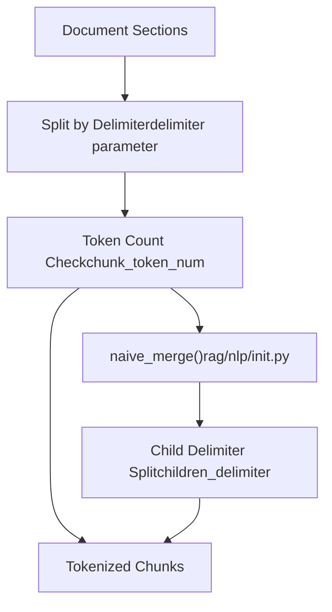
**Key Functions:**

-   `naive_merge(sections, token_num, delimiter)` - [rag/nlp/\_\_init\_\_.py710-749](https://github.com/infiniflow/ragflow/blob/80a16e71/rag/nlp/__init__.py#L710-L749)
-   `tokenize_chunks(chunks, doc, eng)` - [rag/nlp/\_\_init\_\_.py291-316](https://github.com/infiniflow/ragflow/blob/80a16e71/rag/nlp/__init__.py#L291-L316)

**Configuration Example:**

```
parser_config = {
    "chunk_token_num": 512,
    "delimiter": "\n!?。；！？",
    "children_delimiter": "|`heading`|`subheading`",
}
```
**Sources:** [rag/app/naive.py649-800](https://github.com/infiniflow/ragflow/blob/80a16e71/rag/app/naive.py#L649-L800) [rag/nlp/\_\_init\_\_.py710-749](https://github.com/infiniflow/ragflow/blob/80a16e71/rag/nlp/__init__.py#L710-L749)

---

### Hierarchical Methods (Paper, Book, Manual, Laws)

**Purpose:** Maintain document hierarchy for structured documents with sections, chapters, or articles.

**Common Algorithm:**

1.  Detect bullet/heading patterns using `bullets_category()`
2.  Calculate heading levels with `title_frequency()`
3.  Build hierarchical tree structure
4.  Merge within hierarchy levels respecting token limits

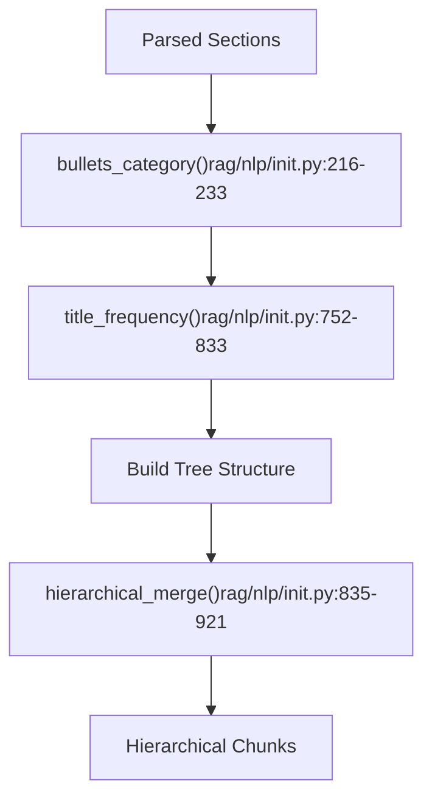
**Method-Specific Variations:**

| Method | Bullet Pattern | Typical Structure |
| --- | --- | --- |
| `paper` | Section headings (1., 1.1, I, II) | Abstract → Sections → Subsections |
| `book` | Chapter markers | Part → Chapter → Section |
| `manual` | Numbered lists, outline format | Chapter → Topic → Procedure |
| `laws` | Article/clause numbering | Chapter → Section → Article → Clause |

**Bullet Pattern Detection:**

The system maintains multiple bullet pattern categories in [rag/nlp/\_\_init\_\_.py169-201](https://github.com/infiniflow/ragflow/blob/80a16e71/rag/nlp/__init__.py#L169-L201):

```
BULLET_PATTERN = [
    [  # Category 0: Chinese formal structure
        r"第[零一二三四五六七八九十百0-9]+(分?编|部分)",  # 第一编, 第二部分
        r"第[零一二三四五六七八九十百0-9]+章",         # 第一章, 第二章
        r"第[零一二三四五六七八九十百0-9]+节",         # 第一节, 第二节
        r"第[零一二三四五六七八九十百0-9]+条",         # 第一条, 第二条
        r"[\(（][零一二三四五六七八九十百]+[\)）]",    # (一), (二)
    ],
    [  # Category 1: Numbered structure
        r"第[0-9]+章",                              # 第1章
        r"第[0-9]+节",                              # 第1节
        r"[0-9]{,2}[\. 、]",                       # 1., 2、
        r"[0-9]{,2}\.[0-9]{,2}[^a-zA-Z/%~-]",     # 1.1, 1.2
        r"[0-9]{,2}\.[0-9]{,2}\.[0-9]{,2}",       # 1.1.1
        r"[0-9]{,2}\.[0-9]{,2}\.[0-9]{,2}\.[0-9]{,2}",  # 1.1.1.1
    ],
    [  # Category 2: Mixed Chinese/numeric
        r"第[零一二三四五六七八九十百0-9]+章",
        r"第[零一二三四五六七八九十百0-9]+节",
        r"[零一二三四五六七八九十百]+[ 、]",
        r"[\(（][零一二三四五六七八九十百]+[\)）]",
        r"[\(（][0-9]{,2}[\)）]",
    ],
    [  # Category 3: English formal structure
        r"PART (ONE|TWO|THREE|FOUR|FIVE|SIX|SEVEN|EIGHT|NINE|TEN)",
        r"Chapter (I+V?|VI*|XI|IX|X)",           # Roman numerals
        r"Section [0-9]+",
        r"Article [0-9]+"
    ],
    [  # Category 4: Markdown headings
        r"^#[^#]",      # # Heading 1
        r"^##[^#]",     # ## Heading 2
        r"^###.*",      # ### Heading 3
        r"^####.*",     # #### Heading 4
        r"^#####.*",    # ##### Heading 5
        r"^######.*",   # ###### Heading 6
    ]
]
```
**Key Functions:**

-   `bullets_category(sections)` - [rag/nlp/\_\_init\_\_.py216-233](https://github.com/infiniflow/ragflow/blob/80a16e71/rag/nlp/__init__.py#L216-L233) - Detects which bullet pattern category best matches sections
-   `title_frequency(bullet_cat, sections)` - Calculates heading level distribution
-   `hierarchical_merge(sections, max_token)` - Merges sections within hierarchy boundaries

**Sources:** [rag/app/paper.py74-167](https://github.com/infiniflow/ragflow/blob/80a16e71/rag/app/paper.py#L74-L167) [rag/app/book.py69-159](https://github.com/infiniflow/ragflow/blob/80a16e71/rag/app/book.py#L69-L159) [rag/app/manual.py185-278](https://github.com/infiniflow/ragflow/blob/80a16e71/rag/app/manual.py#L185-L278) [rag/app/laws.py130-187](https://github.com/infiniflow/ragflow/blob/80a16e71/rag/app/laws.py#L130-L187)

---

### QA Method

**Purpose:** Extract question-answer pairs from FAQ documents or interview transcripts.

**Algorithm:**

1.  Detect Q&A pattern using `qbullets_category()`
2.  Identify question bullets (e.g., "Q1:", "问题1：")
3.  Associate following text as answer until next question
4.  Create paired Q→A chunks

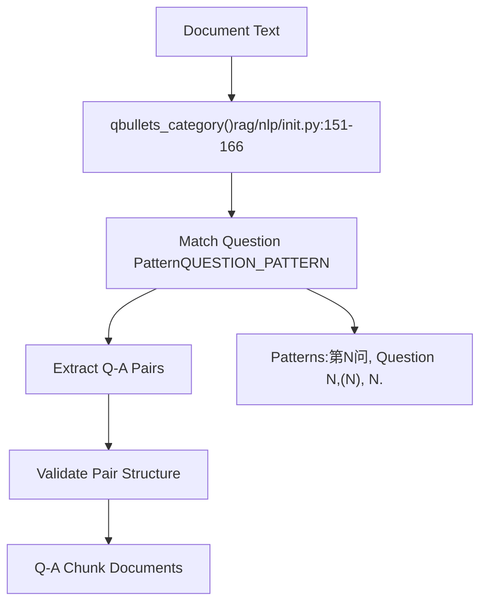
**Supported Question Patterns:**

The system maintains a comprehensive list of question patterns in [rag/nlp/\_\_init\_\_.py75-87](https://github.com/infiniflow/ragflow/blob/80a16e71/rag/nlp/__init__.py#L75-L87):

```
QUESTION_PATTERN = [
    r"第([零一二三四五六七八九十百0-9]+)问",    # Chinese: 第1问, 第二问
    r"第([零一二三四五六七八九十百0-9]+)条",    # Chinese: 第1条, 第二条
    r"<FileRef file-url="https://github.com/infiniflow/ragflow/blob/80a16e71/\\(（" undefined  file-path="\\(（">Hii</FileRef>[\)）]",  # Parenthesized: (一), (二)
    r"第([0-9]+)问",                          # Numbered: 第1问, 第2问
    r"第([0-9]+)条",                          # Articles: 第1条, 第2条
    r"([0-9]{1,2})[\. 、]",                   # Simple: 1., 2、
    r"([零一二三四五六七八九十百]+)[ 、]",        # Chinese numbers: 一、二、
    r"<FileRef file-url="https://github.com/infiniflow/ragflow/blob/80a16e71/\\(（" undefined  file-path="\\(（">Hii</FileRef>[\)）]",              # Numbered parentheses: (1), (2)
    r"QUESTION (ONE|TWO|THREE|FOUR|FIVE|SIX|SEVEN|EIGHT|NINE|TEN)",  # English words
    r"QUESTION (I+V?|VI*|XI|IX|X)",          # Roman numerals
    r"QUESTION ([0-9]+)",                     # English: Question 1, Question 2
]
```
**Pattern Matching Strategy:**

The `qbullets_category()` function tests all patterns against document sections and selects the most frequently matching pattern:

```
def qbullets_category(sections):
    hits = [0] * len(QUESTION_PATTERN)
    for i, pattern in enumerate(QUESTION_PATTERN):
        for section in sections:
            if re.match(pattern, section) and not not_bullet(section):
                hits[i] += 1
                break
    # Return index of pattern with most hits
    return hits.index(max(hits)), QUESTION_PATTERN[hits.index(max(hits))]
```
**Sources:** [rag/app/qa.py186-320](https://github.com/infiniflow/ragflow/blob/80a16e71/rag/app/qa.py#L186-L320) [rag/nlp/\_\_init\_\_.py75-87](https://github.com/infiniflow/ragflow/blob/80a16e71/rag/nlp/__init__.py#L75-L87) [rag/nlp/\_\_init\_\_.py151-166](https://github.com/infiniflow/ragflow/blob/80a16e71/rag/nlp/__init__.py#L151-L166)

---

### Table Method

**Purpose:** Process spreadsheets and tabular data with row/column awareness.

**Algorithm:**

1.  Parse Excel/CSV to DataFrame
2.  Detect header rows (simple or multi-level)
3.  Build hierarchical column headers if merged cells exist
4.  Chunk by row batches with configurable `batch_size`
5.  Convert to HTML or row-wise text representation

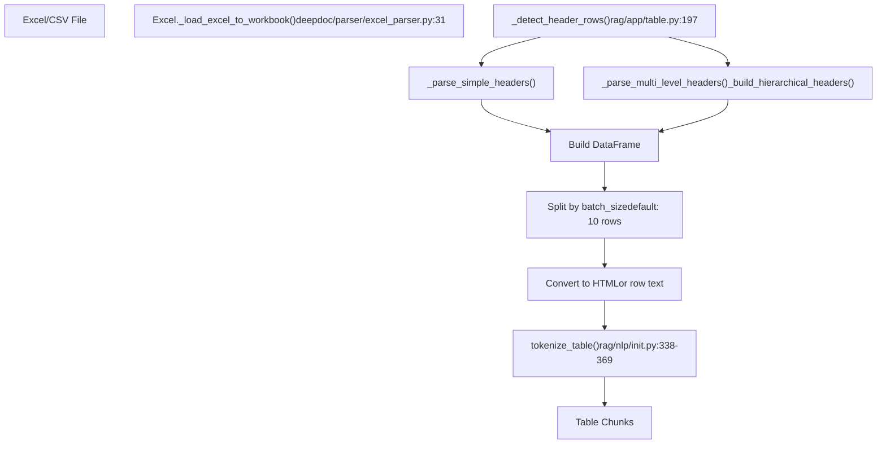
**Header Detection Logic:**

-   Checks for merged cells in first 2 rows
-   Analyzes cell content (header-like vs data-like)
-   Builds hierarchical column names (e.g., "Parent > Child")

**Sources:** [rag/app/table.py38-336](https://github.com/infiniflow/ragflow/blob/80a16e71/rag/app/table.py#L38-L336) [deepdoc/parser/excel\_parser.py29-169](https://github.com/infiniflow/ragflow/blob/80a16e71/deepdoc/parser/excel_parser.py#L29-L169) [rag/nlp/\_\_init\_\_.py338-369](https://github.com/infiniflow/ragflow/blob/80a16e71/rag/nlp/__init__.py#L338-L369)

---

### Presentation Method

**Purpose:** Chunk slide decks with slide-level granularity and thumbnail images, ensuring proper reading order.

**Algorithm:**

1.  Extract slide text using `PptParser` or PDF-based parsing
2.  Capture slide thumbnail images
3.  For PDF presentations, reassemble page content in reading order
4.  Create one chunk per slide with associated image

**PDF Presentation Processing (Pdf class):**

The `Pdf` class in [rag/app/presentation.py56-136](https://github.com/infiniflow/ragflow/blob/80a16e71/rag/app/presentation.py#L56-L136) implements sophisticated page content reassembly:

1.  **Extract Components:**

    ```
    # Text boxes from OCR/layout
    for b in self.boxes:
        page_items[page_num].append({
            "top": b["top"],
            "x0": b["x0"],
            "text": b["text"],
            "type": "text"
        })

    # Tables and figures with positions
    for (img, content), positions in tbls:
        page_items[page_num].append({
            "top": top,
            "x0": left,
            "text": content,
            "type": "table_or_figure"
        })
    ```

2.  **Sort by Reading Order:**

    ```
    # Sort items by vertical position (top), then horizontal (x0)
    items.sort(key=lambda x: (x["top"], x["x0"]))
    ```

3.  **Assemble Slide Text:**

    ```
    full_page_text = "\n\n".join([item["text"] for item in items])
    ```


**Slide Processing Example:**

```
for slide_num in range(from_page, to_page):
    # Extract and order all elements on slide
    items = page_items[slide_num]
    items.sort(key=lambda x: (x["top"], x["x0"]))

    # Combine in reading order
    text = "\n\n".join([item["text"] for item in items])
    image = page_images[slide_num]

    chunk = {
        "content_with_weight": text,
        "image": image,
        "page_num_int": [slide_num],
    }
```
**Sources:** [rag/app/presentation.py56-136](https://github.com/infiniflow/ragflow/blob/80a16e71/rag/app/presentation.py#L56-L136) [rag/app/presentation.py149-217](https://github.com/infiniflow/ragflow/blob/80a16e71/rag/app/presentation.py#L149-L217)

---

### One Method

**Purpose:** Treat entire document as a single chunk, preserving original order.

**Use Cases:**

-   Short documents that fit within token limits
-   Documents requiring complete context
-   Files where splitting would break semantic meaning

**Implementation:**

```
def chunk(...):
    # Parse entire document
    sections, tables = parse_document()

    # Concatenate all sections in order
    all_text = "\n".join([s[0] for s in sections])

    # Return as single chunk
    return [create_chunk(all_text)]
```
**Sources:** [rag/app/one.py66-140](https://github.com/infiniflow/ragflow/blob/80a16e71/rag/app/one.py#L66-L140)

---

### Picture Method

**Purpose:** Process images with vision model descriptions.

**Algorithm:**

1.  Extract embedded images from document
2.  Send images to vision LLM (configured via `tenant_id` and `LLMType.IMAGE2TEXT`)
3.  Generate descriptive text using vision prompt
4.  Create chunks from descriptions with image metadata

**Vision Pipeline:**

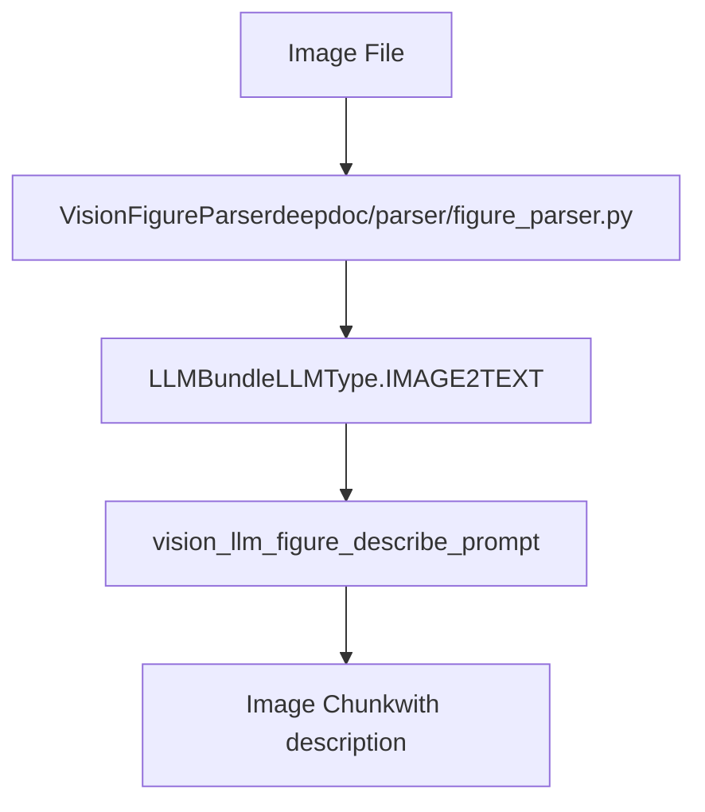
**Sources:** [rag/app/picture.py](https://github.com/infiniflow/ragflow/blob/80a16e71/rag/app/picture.py) [deepdoc/parser/figure\_parser.py1-150](https://github.com/infiniflow/ragflow/blob/80a16e71/deepdoc/parser/figure_parser.py#L1-L150)

---

## Text Merging Algorithms

RAGFlow implements sophisticated text merging algorithms that handle complex document layouts, including multi-column formats, vertical text relationships, and reading order determination.

### Naive Merge

**Function:** `naive_merge(sections, token_num, delimiter)`
**Location:** [rag/nlp/\_\_init\_\_.py1024-1084](https://github.com/infiniflow/ragflow/blob/80a16e71/rag/nlp/__init__.py#L1024-L1084)

**Strategy:** Greedy token-based concatenation with delimiter-based splitting.

**Algorithm:**

1.  Split each section by delimiter characters (e.g., `\n!?。；！？`)
2.  Accumulate text pieces until `token_num` threshold
3.  When threshold exceeded, finalize current chunk and start new one
4.  Join pieces with appropriate delimiter

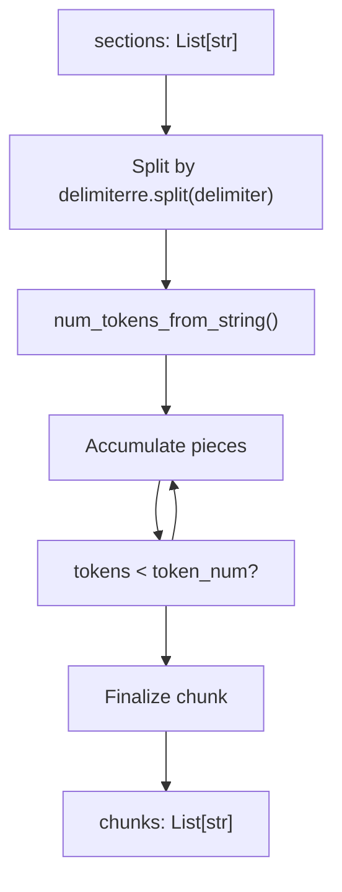
**Key Code Pattern:**

```
# From naive_merge implementation
for section, _ in sections:
    sentences = re.split(delimiter, section)
    for s in sentences:
        if num_tokens_from_string(current + s) <= token_num:
            current += delimiter_char + s
        else:
            chunks.append(current)
            current = s
```
**Sources:** [rag/nlp/\_\_init\_\_.py1024-1084](https://github.com/infiniflow/ragflow/blob/80a16e71/rag/nlp/__init__.py#L1024-L1084)

---

### Column Detection and Multi-Column Handling

**Context:** PDF documents often use multi-column layouts (e.g., academic papers, magazines). Proper column detection ensures text is read in the correct order rather than mixing columns.

**Implementation Location:** [rag/app/paper.py62-71](https://github.com/infiniflow/ragflow/blob/80a16e71/rag/app/paper.py#L62-L71)

**Algorithm:**

1.  **Detect Column Width:**

    ```
    column_width = np.median([b["x1"] - b["x0"] for b in self.boxes])
    ```

    -   Calculate median width of text blocks
    -   If `column_width < page_width / 2`, document is multi-column
2.  **Sort Boxes by Column:**

    ```
    def sort_X_by_page(boxes, column_threshold):
        # Group boxes by page
        # Within each page, assign column number based on x0 coordinate
        # Sort by: page → column → top → x0
    ```

3.  **Reading Order:**

    -   Single column: Sort by `(page, top, x0)`
    -   Multi-column: Sort by `(page, column_number, top, x0)`

**Diagram: Column Detection Logic**

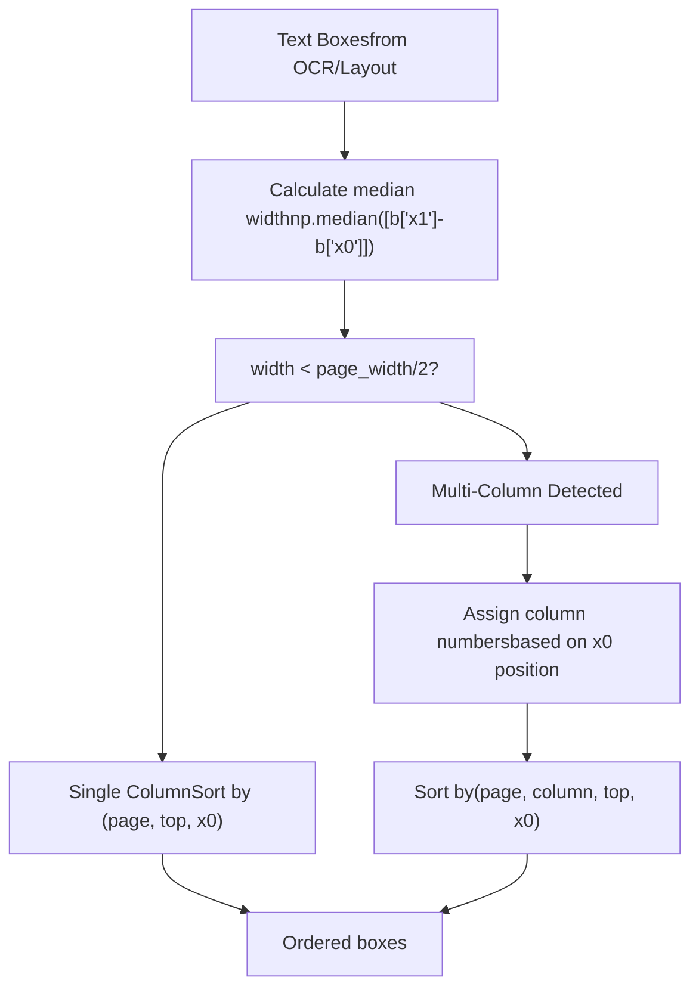
**Sources:** [rag/app/paper.py62-71](https://github.com/infiniflow/ragflow/blob/80a16e71/rag/app/paper.py#L62-L71) [deepdoc/parser/pdf\_parser.py](https://github.com/infiniflow/ragflow/blob/80a16e71/deepdoc/parser/pdf_parser.py)

---

### Vertical Merge (\_naive\_vertical\_merge)

**Purpose:** Merge text boxes that are vertically aligned and part of the same semantic unit (e.g., a paragraph broken across multiple lines).

**Implementation Location:** [deepdoc/parser/pdf\_parser.py](https://github.com/infiniflow/ragflow/blob/80a16e71/deepdoc/parser/pdf_parser.py)

**Algorithm:**

1.  **Identify Candidates:**

    -   Boxes on same page with similar x-coordinates (horizontal alignment)
    -   Vertical distance below threshold (e.g., 1.5x line height)
    -   Same or compatible layout types (both "text", not mixed with "title")
2.  **Merge Criteria:**

    ```
    def should_merge_vertically(box1, box2):
        same_page = box1["page_number"] == box2["page_number"]
        aligned_x = abs(box1["x0"] - box2["x0"]) < threshold
        close_y = box2["top"] - box1["bottom"] < line_height * 1.5
        compatible_layout = box1["layoutno"] == box2["layoutno"]
        return same_page and aligned_x and close_y and compatible_layout
    ```

3.  **Merge Operation:**

    -   Concatenate text with appropriate spacing
    -   Extend bounding box to encompass both boxes
    -   Remove merged box from list

**Diagram: Vertical Merge Process**

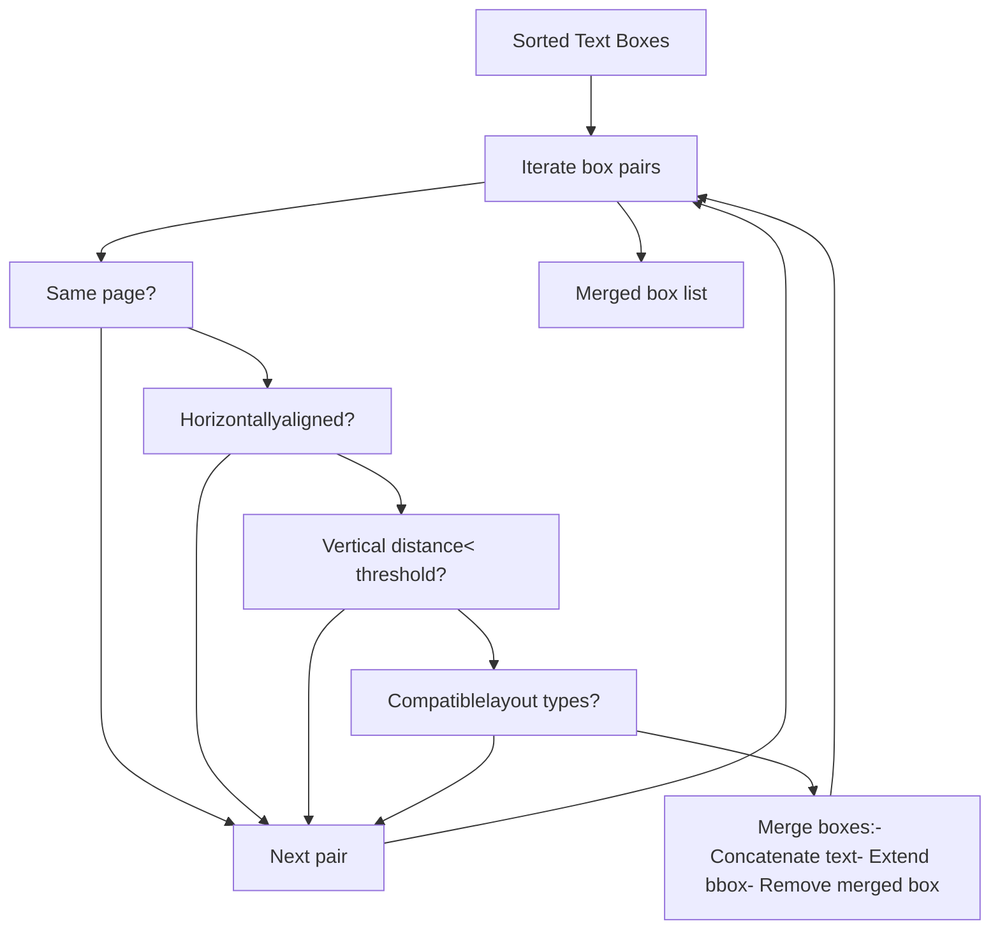
**Sources:** [deepdoc/parser/pdf\_parser.py](https://github.com/infiniflow/ragflow/blob/80a16e71/deepdoc/parser/pdf_parser.py) [rag/app/book.py53](https://github.com/infiniflow/ragflow/blob/80a16e71/rag/app/book.py#L53-L53) [rag/app/naive.py574](https://github.com/infiniflow/ragflow/blob/80a16e71/rag/app/naive.py#L574-L574)

---

### Reading Order Determination (\_concat\_downward)

**Purpose:** Establish proper reading order for text boxes, especially important after layout analysis which may detect boxes in arbitrary order.

**Implementation Location:** [deepdoc/parser/pdf\_parser.py](https://github.com/infiniflow/ragflow/blob/80a16e71/deepdoc/parser/pdf_parser.py)

**Algorithm:**

1.  **Initial Sort:**

    ```
    # Sort by page, then top coordinate, then left coordinate
    boxes.sort(key=lambda b: (b["page_number"], b["top"], b["x0"]))
    ```

2.  **Downward Concatenation:**

    -   Identify boxes that should be read sequentially
    -   Look for boxes that are:
        -   Below current box (higher `top` value)
        -   Within horizontal overlap range
        -   Close in vertical distance
3.  **Special Handling:**

    -   **Columns:** Handle multi-column layouts by column-aware sorting
    -   **Floats:** Skip around floating elements (tables, figures)
    -   **Indentation:** Preserve indentation for lists and code blocks

**Example Reading Order:**

```
Page Layout:          Reading Order:
┌─────────┬─────────┐   1 → 2
│    1    │    2    │   ↓   ↓
├─────────┴─────────┤   3 (full width)
│         3         │   ↓   ↓
├─────────┬─────────┤   4 → 5
│    4    │    5    │
└─────────┴─────────┘
```
**Sources:** [deepdoc/parser/pdf\_parser.py](https://github.com/infiniflow/ragflow/blob/80a16e71/deepdoc/parser/pdf_parser.py) [rag/app/paper.py63](https://github.com/infiniflow/ragflow/blob/80a16e71/rag/app/paper.py#L63-L63)

---

### Hierarchical Merge

**Function:** `hierarchical_merge(bull, sections, max_depth)`
**Location:** [rag/nlp/\_\_init\_\_.py1340-1429](https://github.com/infiniflow/ragflow/blob/80a16e71/rag/nlp/__init__.py#L1340-L1429)

**Strategy:** Build document hierarchy tree and merge within structural boundaries.

**Algorithm:**

1.  **Detect Section Levels:**

    -   Use `bullets_category()` to identify heading patterns
    -   Use `title_frequency()` to find most common heading level
    -   Assign level numbers to each section
2.  **Build Tree:**

    ```
    class Node:
        def __init__(self, level, text):
            self.level = level
            self.text = text
            self.children = []

    # Build tree by level relationships
    for section, level in sections:
        if level <= current_node.level:
            # Move up tree to appropriate parent
        current_node.add_child(Node(level, section))
    ```

3.  **Merge Strategy:**

    -   Merge siblings at same level if combined tokens < threshold
    -   Merge child content into parent only if it fits
    -   Preserve structure by never merging across major level boundaries

**Diagram: Hierarchical Merge Tree**

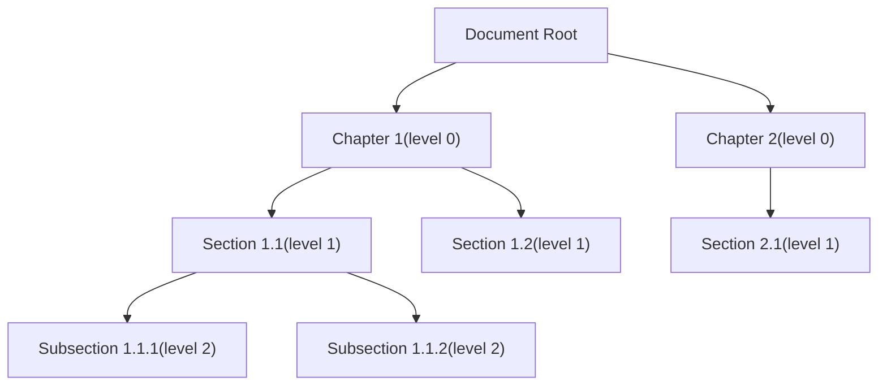
**Merge Rules:**

-   Can merge SS111 + SS112 → S11 (child into parent)
-   Can merge S11 + S12 → Ch1 (siblings into parent)
-   Cannot merge Ch1 + Ch2 (top-level preserved)

**Sources:** [rag/nlp/\_\_init\_\_.py1340-1429](https://github.com/infiniflow/ragflow/blob/80a16e71/rag/nlp/__init__.py#L1340-L1429) [rag/app/book.py158-164](https://github.com/infiniflow/ragflow/blob/80a16e71/rag/app/book.py#L158-L164)

---

### Tree Merge (Laws-Specific)

**Function:** `tree_merge(bull, sections, depth)`
**Location:** [rag/nlp/\_\_init\_\_.py920-1018](https://github.com/infiniflow/ragflow/blob/80a16e71/rag/nlp/__init__.py#L920-L1018)

**Strategy:** Recursive tree building with minimum token enforcement for legal documents.

**Key Features:**

1.  **Node Structure:**

    ```
    class Node:
        level: int      # Hierarchy level (0 = highest)
        texts: List[str]  # Accumulated text content
        children: List[Node]  # Child nodes

        def total_tokens(self):
            # Sum tokens in this node and all children
    ```

2.  **Building Rules:**

    -   If current text is higher/equal level than previous: create sibling
    -   If lower level: create child node
    -   Accumulate text within each node until token threshold
3.  **Output Generation:**

    -   Traverse tree depth-first
    -   Concatenate parent text with child texts
    -   Preserve hierarchical structure in output

**Example: Legal Document Structure**

```
Article 1: Definition      (level 0)
  Clause 1.1               (level 1)
  Clause 1.2               (level 1)
Article 2: Obligations     (level 0)
  Section 2.1              (level 1)
    Subsection 2.1.1       (level 2)
    Subsection 2.1.2       (level 2)
```
**Sources:** [rag/nlp/\_\_init\_\_.py920-1018](https://github.com/infiniflow/ragflow/blob/80a16e71/rag/nlp/__init__.py#L920-L1018) [rag/app/laws.py210-217](https://github.com/infiniflow/ragflow/blob/80a16e71/rag/app/laws.py#L210-L217)

---

### DOCX-Specific Merge (naive\_merge\_docx)

**Function:** `naive_merge_docx(sections, chunk_token_num, delimiter, table_context_size, image_context_size)`
**Location:** [rag/nlp/\_\_init\_\_.py1086-1145](https://github.com/infiniflow/ragflow/blob/80a16e71/rag/nlp/__init__.py#L1086-L1145) (implementation may vary by version)

**Strategy:** Image and table-aware merging for DOCX documents that handles the triple structure of (text, image, table) sections.

**Input Structure:**

DOCX sections are parsed as triples:

```
sections = [
    (text, image, table),  # From rag/app/naive.py Docx parser
    (text, None, None),    # Text-only section
    ("", image, None),     # Image-only section
    ("", None, table_html), # Table section
]
```
**Key Features:**

1.  **Context-Aware Chunking:**

    -   Text chunks accumulate until token threshold
    -   Images preserve surrounding text as context
    -   Tables preserve surrounding text as context
2.  **Token Counting:**

    ```
    for text, image, table in sections:
        if table:
            # Tables handled separately
            chunks.append({"text": text + str(table), "ck_type": "table"})
        elif image:
            # Images get context
            context_above = get_context_above(chunks, token_budget)
            context_below = get_context_below(sections, token_budget)
            chunks.append({
                "text": context_above + text + context_below,
                "image": image,
                "ck_type": "image"
            })
        else:
            # Regular text accumulation
            if current_tokens + len(text) <= chunk_token_num:
                current_chunk += text
            else:
                chunks.append({"text": current_chunk, "ck_type": "text"})
                current_chunk = text
    ```

3.  **Image Index Tracking:**

    -   Track which chunks contain images
    -   Pass image indices to vision parser wrapper
    -   Enable batch processing of images

**Diagram: DOCX Merge Algorithm**

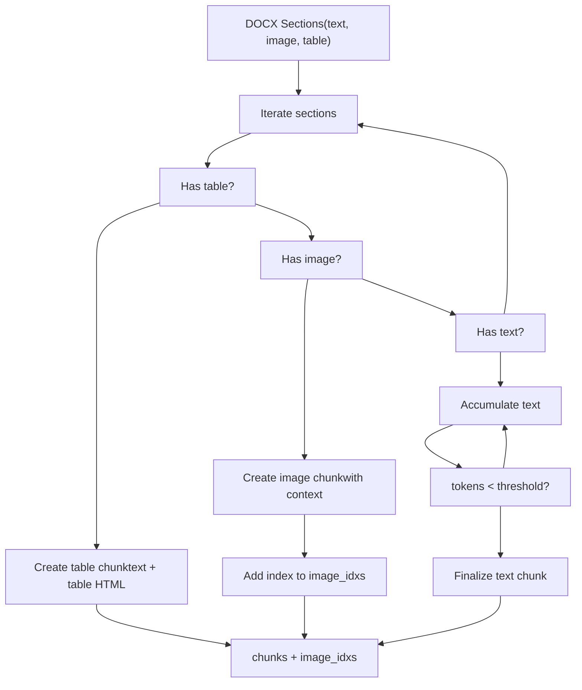
**Context Sizes:**

```
# From parser_config
table_context_size = 0    # Tokens of context around tables
image_context_size = 0    # Tokens of context around images

# Example with context enabled
parser_config = {
    "table_context_size": 200,
    "image_context_size": 100,
}
```
**Vision Processing Integration:**

After chunking, images are processed by vision models:

```
# From rag/app/naive.py:814
vision_figure_parser_docx_wrapper_naive(
    chunks=chunks,
    idx_lst=images,  # List of indices where images are
    callback=callback,
    **kwargs
)
```
This allows batch processing of all images in the document with vision models to generate descriptions.

**Sources:** [rag/app/naive.py808-823](https://github.com/infiniflow/ragflow/blob/80a16e71/rag/app/naive.py#L808-L823) [deepdoc/parser/figure\_parser.py](https://github.com/infiniflow/ragflow/blob/80a16e71/deepdoc/parser/figure_parser.py)

---

## Advanced Features

### Context Attachment

**Function:** `attach_media_context(chunks, table_context_size, image_context_size)`
**Location:** [rag/nlp/\_\_init\_\_.py409-704](https://github.com/infiniflow/ragflow/blob/80a16e71/rag/nlp/__init__.py#L409-L704)

Attaches surrounding text context to table and image chunks for better semantic understanding. This is a sophisticated algorithm that uses spatial relationships and positional metadata to find the most relevant context.

**Algorithm Overview:**

1.  **Position-Based Ordering:**

    -   If chunks have positional metadata (`page_num_int`, `top_int`, `position_int`), sort by `(page, top, left)`
    -   Otherwise, maintain original order
    -   This ensures spatial proximity is considered
2.  **Text Bounds Extraction:**

    ```
    # For each text chunk, extract bounding boxes per page
    text_bounds = []
    for text_chunk in chunks:
        bounds = get_bounds_by_page(chunk)  # {page: (top, bottom)}
        text_bounds.append((idx, bounds))
    ```

3.  **Nearest Text Finding:** For each media chunk (table/image):

    -   Extract its bounding box on the page
    -   Find text chunks with overlapping page and vertical range
    -   Calculate spatial distance using midpoint: `dist = abs(media_mid - text_mid)`
    -   Select text chunk with minimum distance
4.  **Sentence-Based Context Collection:**

    ```
    # Split text into sentences by delimiters
    sentences = split_sentences(text)  # Split on [.。！？!?；;：:\n]

    # Find sentence boundary closest to middle
    boundary_idx = find_mid_sentence_index(sentences)

    # Collect context before boundary (up to token_budget)
    prev_context = collect_sentences_backward(sentences[:boundary_idx+1], token_budget)

    # Collect context after boundary (up to token_budget)
    next_context = collect_sentences_forward(sentences[boundary_idx+1:], token_budget)
    ```

5.  **Context Assembly:**

    -   Combine: `prev_context + media_content + next_context`
    -   Update chunk's `content_with_weight` field
    -   Regenerate tokens: `content_ltks` and `content_sm_ltks`

**Diagram: Spatial Context Finding**

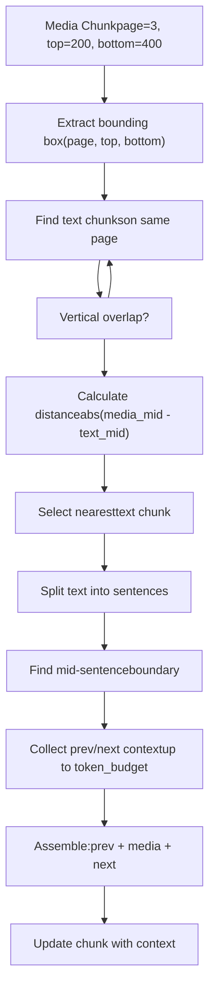
**Fallback Strategy:**

If no text chunks overlap spatially (no positional metadata or no overlap):

-   Find chunks on same page in document order
-   If media chunk is first on page, use text after it
-   If media chunk is last on page, use text before it
-   This ensures context is always provided when available

**Configuration:**

```
parser_config = {
    "table_context_size": 100,   # Tokens of context around tables
    "image_context_size": 50,    # Tokens of context around images
}
```
**Key Functions:**

-   `get_bounds_by_page(chunk)` - Extract page-wise bounding boxes [rag/nlp/\_\_init\_\_.py459-502](https://github.com/infiniflow/ragflow/blob/80a16e71/rag/nlp/__init__.py#L459-L502)
-   `split_sentences(text)` - Split on punctuation delimiters [rag/nlp/\_\_init\_\_.py441-457](https://github.com/infiniflow/ragflow/blob/80a16e71/rag/nlp/__init__.py#L441-L457)
-   `find_mid_sentence_index(sentences)` - Find middle by token count [rag/nlp/\_\_init\_\_.py528-544](https://github.com/infiniflow/ragflow/blob/80a16e71/rag/nlp/__init__.py#L528-L544)
-   `collect_context_from_sentences()` - Extract context with token budget [rag/nlp/\_\_init\_\_.py546-575](https://github.com/infiniflow/ragflow/blob/80a16e71/rag/nlp/__init__.py#L546-L575)
-   `trim_to_tokens(text, token_budget)` - Trim to fit token limit [rag/nlp/\_\_init\_\_.py504-526](https://github.com/infiniflow/ragflow/blob/80a16e71/rag/nlp/__init__.py#L504-L526)

**Sources:** [rag/nlp/\_\_init\_\_.py409-704](https://github.com/infiniflow/ragflow/blob/80a16e71/rag/nlp/__init__.py#L409-L704)

---

### Child Delimiter Pattern

Enables nested chunking with custom delimiters using regex patterns and escaped literals. This feature allows hierarchical splitting where parent chunks are first split by primary delimiters, then each parent is further split by child delimiters.

**Format:**

```
children_delimiter = "pattern1|pattern2|`literal text`|`more literal`"
```
**Syntax Rules:**

1.  **Regex Patterns:** Direct regex patterns separated by `|`
2.  **Escaped Literals:** Enclose literal strings in backticks `` `...` ``
3.  **Combination:** Mix regex and literals in same pattern

**Examples:**

```
# Split on markdown headings and custom markers
children_delimiter = r"|\n##\s|`Section:`|`Chapter:`"

# Split on numbered lists and bullets
children_delimiter = r"|\n[0-9]+\.|`•`|`-`|`  *`"

# Split on Chinese section markers
children_delimiter = "|`第.*?章`|`第.*?节`"
```
**Processing Algorithm:**

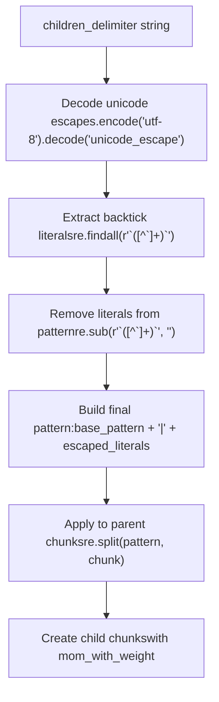
**Implementation:**

```
# From rag/app/naive.py:749-756
child_deli = parser_config.get("children_delimiter", "")
child_deli = child_deli.encode("utf-8").decode("unicode_escape") \
                       .encode("latin1").decode("utf-8")

# Extract literals
cust_child_deli = re.findall(r"`([^`]+)`", child_deli)

# Remove literals from base pattern
child_deli = re.sub(r"`([^`]+)`", "", child_deli)

# Add escaped literals
if cust_child_deli:
    cust_child_deli = sorted(set(cust_child_deli), key=lambda x: -len(x))
    cust_child_deli = "|".join(re.escape(t) for t in cust_child_deli if t)
    child_deli += cust_child_deli
```
**Usage in Tokenization:**

When `children_delimiter` is set, the `tokenize_chunks` function creates a two-level hierarchy:

```
# If child delimiter specified
if child_delimiters_pattern:
    d["mom_with_weight"] = ck  # Store parent chunk reference
    res.extend(split_with_pattern(d, child_delimiters_pattern, ck, eng))
```
Each child chunk inherits metadata from parent and adds `mom_with_weight` field pointing to the original parent text.

**Sources:** [rag/app/naive.py749-756](https://github.com/infiniflow/ragflow/blob/80a16e71/rag/app/naive.py#L749-L756) [rag/nlp/\_\_init\_\_.py276-299](https://github.com/infiniflow/ragflow/blob/80a16e71/rag/nlp/__init__.py#L276-L299) [rag/nlp/\_\_init\_\_.py302-327](https://github.com/infiniflow/ragflow/blob/80a16e71/rag/nlp/__init__.py#L302-L327)

---

### Position Tracking

All chunks include position metadata for precise document location:

**Position Format:**

```
position_int = [
    [page_num, x0, x1, top, bottom],  # Multiple positions per chunk
    [page_num, x0, x1, top, bottom],
]
```
**Functions:**

-   `add_positions(chunk_dict, positions)` - [rag/nlp/\_\_init\_\_.py540-616](https://github.com/infiniflow/ragflow/blob/80a16e71/rag/nlp/__init__.py#L540-L616)
-   `pdf_parser.get_position(box, zoomin)` - Used by PDF parsers
-   `pdf_parser.crop(positions)` - Extract image regions by position

**Sources:** [rag/nlp/\_\_init\_\_.py540-616](https://github.com/infiniflow/ragflow/blob/80a16e71/rag/nlp/__init__.py#L540-L616) [deepdoc/parser/pdf\_parser.py](https://github.com/infiniflow/ragflow/blob/80a16e71/deepdoc/parser/pdf_parser.py)

---

## Tokenization Process

All chunks undergo tokenization for indexing and retrieval:

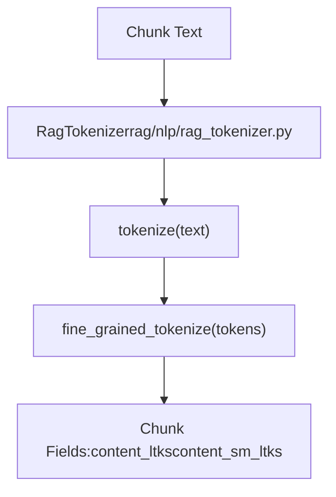
**Tokenization Fields:**

-   `content_with_weight` - Original text
-   `content_ltks` - Standard tokens (space-separated)
-   `content_sm_ltks` - Fine-grained tokens (for fuzzy matching)
-   `title_tks` - Document title tokens
-   `title_sm_tks` - Fine-grained title tokens

**Token Counting:**

```
from common.token_utils import num_tokens_from_string

token_count = num_tokens_from_string(text)
```
**Sources:** [rag/nlp/rag\_tokenizer.py21-58](https://github.com/infiniflow/ragflow/blob/80a16e71/rag/nlp/rag_tokenizer.py#L21-L58) [rag/nlp/\_\_init\_\_.py268-274](https://github.com/infiniflow/ragflow/blob/80a16e71/rag/nlp/__init__.py#L268-L274) [common/token\_utils.py](https://github.com/infiniflow/ragflow/blob/80a16e71/common/token_utils.py)

---

## Method Selection Guide

Choose chunking method based on document characteristics:

| Document Type | Recommended Method | Key Features | Merging Algorithm |
| --- | --- | --- | --- |
| General documents | `naive` | Token-based splitting, delimiter-aware | `naive_merge()` |
| Research papers | `paper` | Abstract preservation, multi-column support | `hierarchical_merge()` with column detection |
| Long books | `book` | Chapter hierarchy, TOC removal | `hierarchical_merge()` |
| Technical manuals | `manual` | Outline-based, section tracking | `hierarchical_merge()` with section IDs |
| FAQ documents | `qa` | Question-answer pairing | Pattern matching + pairing |
| Legal documents | `laws` | Article/clause tree structure | `tree_merge()` |
| Presentations | `presentation` | Slide-by-slide, reading order sorting | Per-slide with position-based sorting |
| Short documents | `one` | Entire document as single chunk | No merging (concatenate all) |

**Selection Factors:**

1.  **Document Structure:**

    -   Hierarchical (chapters/sections) → `paper`, `book`, `manual`, `laws`
    -   Flat/sequential → `naive`, `one`
    -   Paired (Q&A) → `qa`
    -   Paginated → `presentation`
2.  **Length:**

    -   < 1000 tokens → `one`
    -   1000-10000 tokens → `naive`
    -   > 10000 tokens → Structure-aware methods (`book`, `paper`, `manual`)

3.  **Layout Complexity:**

    -   Multi-column → `paper` (has column detection)
    -   Complex tables → `manual` or `naive` with table context
    -   Mixed media → `naive` or `presentation`

**Auto-Detection:** The system automatically selects method based on file extension and content analysis, configurable via `parser_id` in document metadata.

**Sources:** [rag/svr/task\_executor.py76-93](https://github.com/infiniflow/ragflow/blob/80a16e71/rag/svr/task_executor.py#L76-L93) [rag/app/naive.py](https://github.com/infiniflow/ragflow/blob/80a16e71/rag/app/naive.py) [rag/app/paper.py](https://github.com/infiniflow/ragflow/blob/80a16e71/rag/app/paper.py) [rag/app/book.py](https://github.com/infiniflow/ragflow/blob/80a16e71/rag/app/book.py) [rag/app/manual.py](https://github.com/infiniflow/ragflow/blob/80a16e71/rag/app/manual.py) [rag/app/qa.py](https://github.com/infiniflow/ragflow/blob/80a16e71/rag/app/qa.py) [rag/app/laws.py](https://github.com/infiniflow/ragflow/blob/80a16e71/rag/app/laws.py) [rag/app/presentation.py](https://github.com/infiniflow/ragflow/blob/80a16e71/rag/app/presentation.py) [rag/app/one.py](https://github.com/infiniflow/ragflow/blob/80a16e71/rag/app/one.py)

---

## Integration with Document Processing Pipeline

Chunking occurs within the broader document processing workflow:

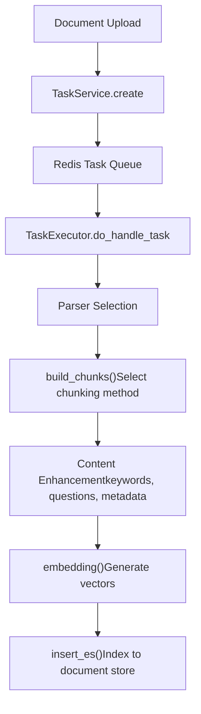
**Key Integration Points:**

1.  **Task Creation** - [api/db/services/task\_service.py382-426](https://github.com/infiniflow/ragflow/blob/80a16e71/api/db/services/task_service.py#L382-L426)
2.  **Queue Processing** - [rag/svr/task\_executor.py166-227](https://github.com/infiniflow/ragflow/blob/80a16e71/rag/svr/task_executor.py#L166-L227)
3.  **Chunking** - [rag/svr/task\_executor.py234-502](https://github.com/infiniflow/ragflow/blob/80a16e71/rag/svr/task_executor.py#L234-L502)
4.  **Enhancement** - [rag/svr/task\_executor.py327-500](https://github.com/infiniflow/ragflow/blob/80a16e71/rag/svr/task_executor.py#L327-L500)
5.  **Embedding** - [rag/svr/task\_executor.py546-597](https://github.com/infiniflow/ragflow/blob/80a16e71/rag/svr/task_executor.py#L546-L597)
6.  **Indexing** - [rag/svr/task\_executor.py818-880](https://github.com/infiniflow/ragflow/blob/80a16e71/rag/svr/task_executor.py#L818-L880)

**Sources:** [rag/svr/task\_executor.py166-880](https://github.com/infiniflow/ragflow/blob/80a16e71/rag/svr/task_executor.py#L166-L880) [api/db/services/task\_service.py](https://github.com/infiniflow/ragflow/blob/80a16e71/api/db/services/task_service.py)
