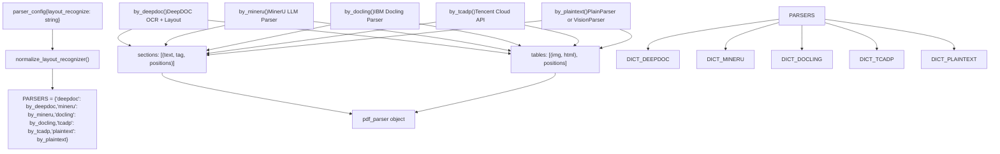
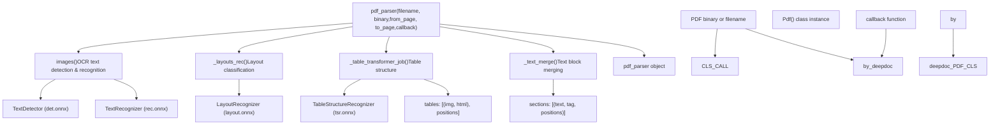
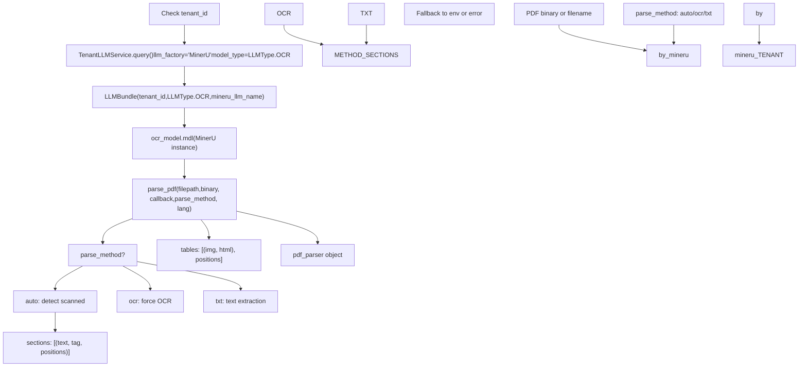
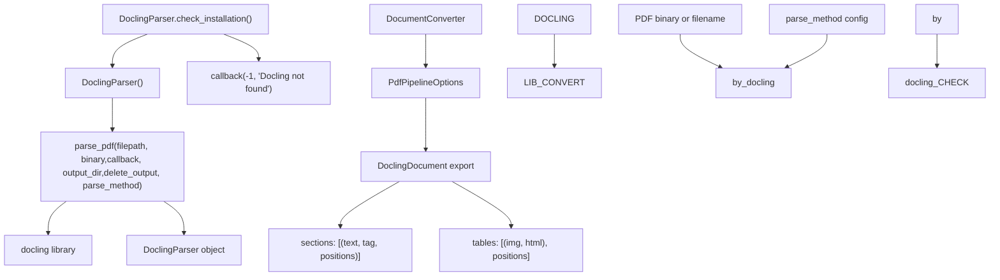
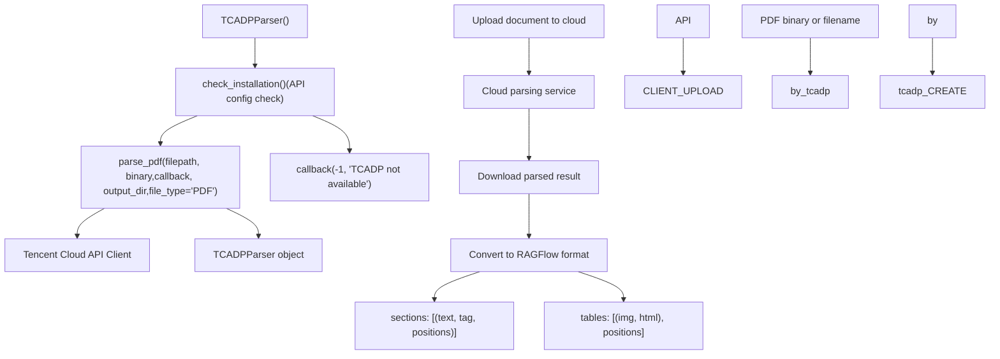
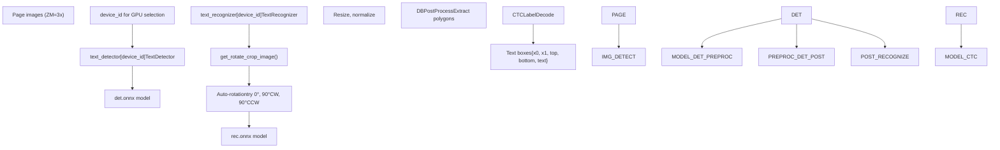

# Layout Recognition and OCR

Relevant source files

-   [api/utils/file\_utils.py](https://github.com/infiniflow/ragflow/blob/80a16e71/api/utils/file_utils.py)
-   [common/file\_utils.py](https://github.com/infiniflow/ragflow/blob/80a16e71/common/file_utils.py)
-   [deepdoc/parser/pdf\_parser.py](https://github.com/infiniflow/ragflow/blob/80a16e71/deepdoc/parser/pdf_parser.py)
-   [deepdoc/parser/ppt\_parser.py](https://github.com/infiniflow/ragflow/blob/80a16e71/deepdoc/parser/ppt_parser.py)
-   [deepdoc/vision/\_\_init\_\_.py](https://github.com/infiniflow/ragflow/blob/80a16e71/deepdoc/vision/__init__.py)
-   [deepdoc/vision/layout\_recognizer.py](https://github.com/infiniflow/ragflow/blob/80a16e71/deepdoc/vision/layout_recognizer.py)
-   [deepdoc/vision/ocr.py](https://github.com/infiniflow/ragflow/blob/80a16e71/deepdoc/vision/ocr.py)
-   [deepdoc/vision/operators.py](https://github.com/infiniflow/ragflow/blob/80a16e71/deepdoc/vision/operators.py)
-   [deepdoc/vision/postprocess.py](https://github.com/infiniflow/ragflow/blob/80a16e71/deepdoc/vision/postprocess.py)
-   [deepdoc/vision/recognizer.py](https://github.com/infiniflow/ragflow/blob/80a16e71/deepdoc/vision/recognizer.py)
-   [deepdoc/vision/t\_ocr.py](https://github.com/infiniflow/ragflow/blob/80a16e71/deepdoc/vision/t_ocr.py)
-   [deepdoc/vision/t\_recognizer.py](https://github.com/infiniflow/ragflow/blob/80a16e71/deepdoc/vision/t_recognizer.py)
-   [deepdoc/vision/table\_structure\_recognizer.py](https://github.com/infiniflow/ragflow/blob/80a16e71/deepdoc/vision/table_structure_recognizer.py)
-   [rag/settings.py](https://github.com/infiniflow/ragflow/blob/80a16e71/rag/settings.py)

## Purpose and Scope

This document describes the technical implementation of RAGFlow's OCR (Optical Character Recognition) and layout recognition systems. These components are part of the DeepDOC parser, which is one of several parsing backends available in RAGFlow (see page 6.1 for parser selection).

The OCR pipeline consists of two stages:

1.  **Text Detection**: Locating text regions in document images using DBNet-based detection
2.  **Text Recognition**: Converting detected regions to text using CTC-based recognition

The layout recognition system identifies structural document elements (text, title, figure, table, caption, header, footer, reference, equation) and determines reading order. Table structure recognition detects internal table components (rows, columns, headers, spanning cells) to enable accurate table extraction.

These systems work together within the `RAGFlowPdfParser` class to transform PDF pages into structured content. The output is then processed by chunking strategies (see page 6.2) to create final document chunks.

**Scope**: This page covers the vision-based OCR and layout recognition implementation. For information on alternative parsers (MinerU, Docling, TCADP), see page 6.1.

## Layout Recognition Options

RAGFlow provides four primary layout recognition methods, each implemented as a parser function in `rag/app/naive.py`. The parser selection occurs through the `normalize_layout_recognizer()` function which translates user-facing layout names into parser function references.

**Layout Recognition Architecture**


Sources: [rag/app/naive.py175-181](https://github.com/infiniflow/ragflow/blob/80a16e71/rag/app/naive.py#L175-L181) [rag/app/naive.py750-774](https://github.com/infiniflow/ragflow/blob/80a16e71/rag/app/naive.py#L750-L774) [common/parser\_config\_utils.py](https://github.com/infiniflow/ragflow/blob/80a16e71/common/parser_config_utils.py)

### Parser Dictionary and Selection

The `PARSERS` dictionary in `rag/app/naive.py:175-181` maps layout recognizer names to parser functions:

```
PARSERS = {
    "deepdoc": by_deepdoc,
    "mineru": by_mineru,
    "docling": by_docling,
    "tcadp": by_tcadp,
    "plaintext": by_plaintext,  # default
}
```
The `chunk()` function uses `normalize_layout_recognizer()` to parse the user-provided `layout_recognize` string [rag/app/naive.py750-761](https://github.com/infiniflow/ragflow/blob/80a16e71/rag/app/naive.py#L750-L761):

```
layout_recognizer, parser_model_name = normalize_layout_recognizer(
    parser_config.get("layout_recognize", "DeepDOC")
)

if isinstance(layout_recognizer, bool):
    layout_recognizer = "DeepDOC" if layout_recognizer else "Plain Text"

name = layout_recognizer.strip().lower()
parser = PARSERS.get(name, by_plaintext)
```
Sources: [rag/app/naive.py175-181](https://github.com/infiniflow/ragflow/blob/80a16e71/rag/app/naive.py#L175-L181) [rag/app/naive.py750-761](https://github.com/infiniflow/ragflow/blob/80a16e71/rag/app/naive.py#L750-L761) [common/parser\_config\_utils.py](https://github.com/infiniflow/ragflow/blob/80a16e71/common/parser_config_utils.py)

## DeepDOC Layout Recognition

DeepDOC is RAGFlow's built-in layout recognition system, combining deep learning-based OCR with layout analysis and table structure recognition. It uses ONNX models for text detection, recognition, layout classification, and table structure detection.

**DeepDOC Pipeline**


Sources: [rag/app/naive.py46-61](https://github.com/infiniflow/ragflow/blob/80a16e71/rag/app/naive.py#L46-L61) [deepdoc/parser/pdf\_parser.py51-101](https://github.com/infiniflow/ragflow/blob/80a16e71/deepdoc/parser/pdf_parser.py#L51-L101) [deepdoc/parser/pdf\_parser.py450-493](https://github.com/infiniflow/ragflow/blob/80a16e71/deepdoc/parser/pdf_parser.py#L450-L493)

### DeepDOC Implementation

The `by_deepdoc()` function in [rag/app/naive.py46-61](https://github.com/infiniflow/ragflow/blob/80a16e71/rag/app/naive.py#L46-L61) creates a `Pdf()` parser instance and invokes it:

```
def by_deepdoc(filename, binary=None, from_page=0, to_page=100000, lang="Chinese",
               callback=None, pdf_cls=None, **kwargs):
    callback = callback
    binary = binary
    pdf_parser = pdf_cls() if pdf_cls else Pdf()
    sections, tables = pdf_parser(
        filename if not binary else binary,
        from_page=from_page,
        to_page=to_page,
        callback=callback
    )

    tables = vision_figure_parser_pdf_wrapper(tbls=tables,
                                              callback=callback,
                                              **kwargs)
    return sections, tables, pdf_parser
```
The `Pdf` class from `deepdoc/parser/pdf_parser.py` inherits from `PdfParser` and implements the core OCR and layout recognition logic [deepdoc/parser/pdf\_parser.py450-493](https://github.com/infiniflow/ragflow/blob/80a16e71/deepdoc/parser/pdf_parser.py#L450-L493):

1.  **OCR Stage** (`__images__()` method): Detects and recognizes text boxes
2.  **Layout Recognition** (`_layouts_rec()` method): Classifies regions as text, title, table, figure, etc.
3.  **Table Analysis** (`_table_transformer_job()` method): Detects table structure
4.  **Text Merging** (`_text_merge()` method): Merges adjacent text boxes

Vision model initialization occurs in `RAGFlowPdfParser.__init__()` [deepdoc/parser/pdf\_parser.py65-85](https://github.com/infiniflow/ragflow/blob/80a16e71/deepdoc/parser/pdf_parser.py#L65-L85) creating instances of `OCR`, `LayoutRecognizer`, and `TableStructureRecognizer`.

Sources: [rag/app/naive.py46-61](https://github.com/infiniflow/ragflow/blob/80a16e71/rag/app/naive.py#L46-L61) [deepdoc/parser/pdf\_parser.py51-101](https://github.com/infiniflow/ragflow/blob/80a16e71/deepdoc/parser/pdf_parser.py#L51-L101) [deepdoc/parser/pdf\_parser.py450-493](https://github.com/infiniflow/ragflow/blob/80a16e71/deepdoc/parser/pdf_parser.py#L450-L493)

### DeepDOC Model Files

DeepDOC uses ONNX models stored in `rag/res/deepdoc/` directory:

| Model | File | Purpose |
| --- | --- | --- |
| Text Detection | `det.onnx` | Locate text bounding boxes using DBNet |
| Text Recognition | `rec.onnx`, `ocr.res` | Recognize characters, character dictionary |
| Layout Classification | `layout.onnx` | Identify document structure regions |
| Table Structure | `tsr.onnx` | Detect table rows, columns, headers |

Models are automatically downloaded from HuggingFace repository `InfiniFlow/deepdoc` if not present [deepdoc/vision/ocr.py567-569](https://github.com/infiniflow/ragflow/blob/80a16e71/deepdoc/vision/ocr.py#L567-L569)

Sources: [deepdoc/vision/ocr.py536-580](https://github.com/infiniflow/ragflow/blob/80a16e71/deepdoc/vision/ocr.py#L536-L580) [deepdoc/vision/layout\_recognizer.py48-54](https://github.com/infiniflow/ragflow/blob/80a16e71/deepdoc/vision/layout_recognizer.py#L48-L54) [deepdoc/vision/table\_structure\_recognizer.py41-52](https://github.com/infiniflow/ragflow/blob/80a16e71/deepdoc/vision/table_structure_recognizer.py#L41-L52)

## MinerU Layout Recognition

MinerU is an LLM-powered PDF parser that uses large language models for OCR and layout understanding. It's integrated through the `LLMBundle` system with model type `LLMType.OCR`.

**MinerU Integration Flow**


Sources: [rag/app/naive.py64-110](https://github.com/infiniflow/ragflow/blob/80a16e71/rag/app/naive.py#L64-L110) [api/db/services/tenant\_llm\_service.py](https://github.com/infiniflow/ragflow/blob/80a16e71/api/db/services/tenant_llm_service.py) [rag/llm/mineru\_model.py](https://github.com/infiniflow/ragflow/blob/80a16e71/rag/llm/mineru_model.py)

### MinerU Implementation

The `by_mineru()` function in [rag/app/naive.py64-110](https://github.com/infiniflow/ragflow/blob/80a16e71/rag/app/naive.py#L64-L110) handles MinerU initialization and invocation:

```
def by_mineru(filename, binary=None, from_page=0, to_page=100000, lang="Chinese",
              callback=None, pdf_cls=None, parse_method: str = "raw",
              mineru_llm_name: str | None = None, tenant_id: str | None = None, **kwargs):
    pdf_parser = None
    if tenant_id:
        if not mineru_llm_name:
            try:
                from api.db.services.tenant_llm_service import TenantLLMService
                env_name = TenantLLMService.ensure_mineru_from_env(tenant_id)
                candidates = TenantLLMService.query(
                    tenant_id=tenant_id, llm_factory="MinerU", model_type=LLMType.OCR)
                if candidates:
                    mineru_llm_name = candidates[0].llm_name
                elif env_name:
                    mineru_llm_name = env_name
            except Exception as e:
                logging.warning(f"fallback to env mineru: {e}")

        if mineru_llm_name:
            try:
                ocr_model = LLMBundle(
                    tenant_id=tenant_id, llm_type=LLMType.OCR,
                    llm_name=mineru_llm_name, lang=lang)
                pdf_parser = ocr_model.mdl
                sections, tables = pdf_parser.parse_pdf(
                    filepath=filename, binary=binary, callback=callback,
                    parse_method=parse_method, lang=lang, **kwargs)
                return sections, tables, pdf_parser
            except Exception as e:
                logging.error(f"Failed to parse pdf via LLMBundle MinerU: {e}")

    if callback:
        callback(-1, "MinerU not found.")
    return None, None, None
```
### MinerU Configuration

MinerU supports three parsing methods configurable through `parser_config`:

| Method | Description | Use Case |
| --- | --- | --- |
| `auto` | Automatically detect if document is scanned | Default, handles both native and scanned PDFs |
| `ocr` | Force OCR processing | Scanned documents, images |
| `txt` | Text extraction only | Native PDFs with embedded text |

The method is passed through `parse_method` parameter and can be configured in knowledge base settings [rag/app/naive.py72](https://github.com/infiniflow/ragflow/blob/80a16e71/rag/app/naive.py#L72-L72)

MinerU models are configured through the tenant LLM service and accessed via `LLMType.OCR` [rag/app/naive.py84-94](https://github.com/infiniflow/ragflow/blob/80a16e71/rag/app/naive.py#L84-L94)

Sources: [rag/app/naive.py64-110](https://github.com/infiniflow/ragflow/blob/80a16e71/rag/app/naive.py#L64-L110) [api/db/services/tenant\_llm\_service.py](https://github.com/infiniflow/ragflow/blob/80a16e71/api/db/services/tenant_llm_service.py)

## Docling Layout Recognition

Docling is IBM's document parsing library that provides OCR-free layout analysis for PDFs. It's integrated through the `DoclingParser` class.

**Docling Parser Flow**


Sources: [rag/app/naive.py113-130](https://github.com/infiniflow/ragflow/blob/80a16e71/rag/app/naive.py#L113-L130) [deepdoc/parser/docling\_parser.py](https://github.com/infiniflow/ragflow/blob/80a16e71/deepdoc/parser/docling_parser.py)

### Docling Implementation

The `by_docling()` function in [rag/app/naive.py113-130](https://github.com/infiniflow/ragflow/blob/80a16e71/rag/app/naive.py#L113-L130) handles Docling initialization:

```
def by_docling(filename, binary=None, from_page=0, to_page=100000, lang="Chinese",
               callback=None, pdf_cls=None, **kwargs):
    pdf_parser = DoclingParser()
    parse_method = kwargs.get("parse_method", "raw")

    if not pdf_parser.check_installation():
        callback(-1, "Docling not found.")
        return None, None, pdf_parser

    sections, tables = pdf_parser.parse_pdf(
        filepath=filename,
        binary=binary,
        callback=callback,
        output_dir=os.environ.get("MINERU_OUTPUT_DIR", ""),
        delete_output=bool(int(os.environ.get("MINERU_DELETE_OUTPUT", 1))),
        parse_method=parse_method
    )
    return sections, tables, pdf_parser
```
The `DoclingParser` class wraps IBM's Docling library and provides conversion from Docling's internal format to RAGFlow's standard section and table format [deepdoc/parser/docling\_parser.py](https://github.com/infiniflow/ragflow/blob/80a16e71/deepdoc/parser/docling_parser.py)

### Docling Configuration

Docling uses environment variables for configuration:

| Variable | Default | Purpose |
| --- | --- | --- |
| `MINERU_OUTPUT_DIR` | `""` | Output directory for intermediate files |
| `MINERU_DELETE_OUTPUT` | `1` | Delete output files after processing |

The `parse_method` parameter controls processing mode, similar to MinerU.

Sources: [rag/app/naive.py113-130](https://github.com/infiniflow/ragflow/blob/80a16e71/rag/app/naive.py#L113-L130) [deepdoc/parser/docling\_parser.py](https://github.com/infiniflow/ragflow/blob/80a16e71/deepdoc/parser/docling_parser.py)

## TCADP Layout Recognition

TCADP (Tencent Cloud Advanced Document Processing) is a cloud-based document parsing API that provides OCR and layout analysis.

**TCADP Integration Flow**


Sources: [rag/app/naive.py133-147](https://github.com/infiniflow/ragflow/blob/80a16e71/rag/app/naive.py#L133-L147) [deepdoc/parser/tcadp\_parser.py](https://github.com/infiniflow/ragflow/blob/80a16e71/deepdoc/parser/tcadp_parser.py)

### TCADP Implementation

The `by_tcadp()` function in [rag/app/naive.py133-147](https://github.com/infiniflow/ragflow/blob/80a16e71/rag/app/naive.py#L133-L147) handles TCADP initialization:

```
def by_tcadp(filename, binary=None, from_page=0, to_page=100000, lang="Chinese",
             callback=None, pdf_cls=None, **kwargs):
    tcadp_parser = TCADPParser()

    if not tcadp_parser.check_installation():
        callback(-1, "TCADP parser not available. Please check Tencent Cloud API configuration.")
        return None, None, tcadp_parser

    sections, tables = tcadp_parser.parse_pdf(
        filepath=filename,
        binary=binary,
        callback=callback,
        output_dir=os.environ.get("TCADP_OUTPUT_DIR", ""),
        file_type="PDF"
    )
    return sections, tables, tcadp_parser
```
The `TCADPParser` class implements cloud API integration and result conversion [deepdoc/parser/tcadp\_parser.py](https://github.com/infiniflow/ragflow/blob/80a16e71/deepdoc/parser/tcadp_parser.py)

### TCADP Configuration

TCADP requires Tencent Cloud API credentials configured through environment variables. The `check_installation()` method verifies API configuration [deepdoc/parser/tcadp\_parser.py](https://github.com/infiniflow/ragflow/blob/80a16e71/deepdoc/parser/tcadp_parser.py)

| Variable | Purpose |
| --- | --- |
| `TCADP_OUTPUT_DIR` | Output directory for cached results |
| Tencent Cloud credentials | API authentication |

Sources: [rag/app/naive.py133-147](https://github.com/infiniflow/ragflow/blob/80a16e71/rag/app/naive.py#L133-L147) [deepdoc/parser/tcadp\_parser.py](https://github.com/infiniflow/ragflow/blob/80a16e71/deepdoc/parser/tcadp_parser.py)

## Plain Text Parser

The Plain Text parser provides a fallback option for PDFs without complex layouts or when layout recognition is disabled. It supports two modes: pure text extraction and vision-based processing.

**Plain Text Parser Selection**

```mermaid
flowchart TD
    LAYOUT_CFG["layout_recognizer config"]
    CHECK["layout_recognizerspecified?"]
    PLAIN_CHECK["'Plain Text'?"]
    PLUMBER["pdfplumber extraction"]
    TEXT_ONLY["Text-only processing"]
    NO_LAYOUT["No layout classification"]
    VISION_MODEL["LLMBundle(LLMType.IMAGE2TEXT)"]
    OCR["OCR with vision model"]
    DESC["Image descriptions"]
    SECTIONS["sections: [(text, tag, positions)]"]
    TABLES["tables: [(img, html), positions]"]
    PARSER["Parser object"]

    LAYOUT --> CFG_CHECK
    CHECK --> PLAIN_CHECK
    CHECK --> PLAIN_CHECK
    PLUMBER --> TEXT_ONLY
    TEXT --> ONLY_NO_LAYOUT
    VISION --> MODEL_OCR
    OCR --> DESC
    NO --> LAYOUT_SECTIONS
    DESC --> SECTIONS
    PLAIN --> CHECK_PlainParser
    PLAIN --> CHECK_VisionParser
    PlainParser --> PLUMBER
    VisionParser --> VISION_MODEL
    PlainParser --> TABLES
    VisionParser --> TABLES
    PlainParser --> PARSER
    VisionParser --> PARSER
```


Sources: [rag/app/naive.py150-172](https://github.com/infiniflow/ragflow/blob/80a16e71/rag/app/naive.py#L150-L172) [deepdoc/parser/pdf\_parser.py995-1062](https://github.com/infiniflow/ragflow/blob/80a16e71/deepdoc/parser/pdf_parser.py#L995-L1062) [deepdoc/parser/pdf\_parser.py1065-1191](https://github.com/infiniflow/ragflow/blob/80a16e71/deepdoc/parser/pdf_parser.py#L1065-L1191)

### Plain Text Implementation

The `by_plaintext()` function in [rag/app/naive.py150-172](https://github.com/infiniflow/ragflow/blob/80a16e71/rag/app/naive.py#L150-L172) selects between `PlainParser` and `VisionParser`:

```
def by_plaintext(filename, binary=None, from_page=0, to_page=100000, callback=None, **kwargs):
    layout_recognizer = (kwargs.get("layout_recognizer") or "").strip()
    if (not layout_recognizer) or (layout_recognizer == "Plain Text"):
        pdf_parser = PlainParser()
    else:
        tenant_id = kwargs.get("tenant_id")
        if not tenant_id:
            raise ValueError("tenant_id is required when using vision layout recognizer")
        vision_model = LLMBundle(
            tenant_id,
            LLMType.IMAGE2TEXT,
            llm_name=layout_recognizer,
            lang=kwargs.get("lang", "Chinese"),
        )
        pdf_parser = VisionParser(vision_model=vision_model, **kwargs)

    sections, tables = pdf_parser(
        filename if not binary else binary,
        from_page=from_page,
        to_page=to_page,
        callback=callback
    )
    return sections, tables, pdf_parser
```
### PlainParser

`PlainParser` [deepdoc/parser/pdf\_parser.py995-1062](https://github.com/infiniflow/ragflow/blob/80a16e71/deepdoc/parser/pdf_parser.py#L995-L1062) extracts text using pdfplumber without OCR or layout classification:

-   Uses pdfplumber's `extract_text()` for text extraction
-   No vision models or layout analysis
-   Minimal processing overhead
-   Suitable for text-based PDFs

### VisionParser

`VisionParser` [deepdoc/parser/pdf\_parser.py1065-1191](https://github.com/infiniflow/ragflow/blob/80a16e71/deepdoc/parser/pdf_parser.py#L1065-L1191) uses vision models for OCR and optional image description:

-   Accepts a `vision_model` (LLM with `IMAGE2TEXT` capability)
-   Performs OCR on page images
-   Can generate descriptions for embedded images
-   Provides more accurate results for scanned documents

Sources: [rag/app/naive.py150-172](https://github.com/infiniflow/ragflow/blob/80a16e71/rag/app/naive.py#L150-L172) [deepdoc/parser/pdf\_parser.py995-1062](https://github.com/infiniflow/ragflow/blob/80a16e71/deepdoc/parser/pdf_parser.py#L995-L1062) [deepdoc/parser/pdf\_parser.py1065-1191](https://github.com/infiniflow/ragflow/blob/80a16e71/deepdoc/parser/pdf_parser.py#L1065-L1191)

## OCR Pipeline

The OCR pipeline extracts text from document images through two stages: text detection and text recognition. The system is used by DeepDOC and Plain Text parsers for extracting text content.

**OCR Architecture**


Sources: [deepdoc/vision/ocr.py536-707](https://github.com/infiniflow/ragflow/blob/80a16e71/deepdoc/vision/ocr.py#L536-L707) [deepdoc/vision/ocr.py414-533](https://github.com/infiniflow/ragflow/blob/80a16e71/deepdoc/vision/ocr.py#L414-L533) [deepdoc/vision/ocr.py133-411](https://github.com/infiniflow/ragflow/blob/80a16e71/deepdoc/vision/ocr.py#L133-L411)

### OCR Class Structure

The `OCR` class in [deepdoc/vision/ocr.py536-707](https://github.com/infiniflow/ragflow/blob/80a16e71/deepdoc/vision/ocr.py#L536-L707) manages text detection and recognition:

```
class OCR:
    def __init__(self, model_dir=None):
        if settings.PARALLEL_DEVICES > 0:
            self.text_detector = []
            self.text_recognizer = []
            for device_id in range(settings.PARALLEL_DEVICES):
                self.text_detector.append(TextDetector(model_dir, device_id))
                self.text_recognizer.append(TextRecognizer(model_dir, device_id))
        else:
            self.text_detector = [TextDetector(model_dir)]
            self.text_recognizer = [TextRecognizer(model_dir)]

    def detect(self, img, device_id: int | None = None):
        if device_id is None:
            device_id = 0
        dt_boxes, elapse = self.text_detector<FileRef file-url="https://github.com/infiniflow/ragflow/blob/80a16e71/device_id" undefined  file-path="device_id">Hii</FileRef>
        return dt_boxes

    def recognize_batch(self, img_list, device_id: int | None = None):
        if device_id is None:
            device_id = 0
        rec_res, elapse = self.text_recognizer<FileRef file-url="https://github.com/infiniflow/ragflow/blob/80a16e71/device_id" undefined  file-path="device_id">Hii</FileRef>
        return rec_res
```
### Text Detection

`TextDetector` [deepdoc/vision/ocr.py414-533](https://github.com/infiniflow/ragflow/blob/80a16e71/deepdoc/vision/ocr.py#L414-L533) uses a DBNet-based model to find text regions:

| Parameter | Value | Purpose |
| --- | --- | --- |
| `limit_side_len` | 960 | Max image dimension (pixels) |
| `thresh` | 0.3 | Binarization threshold |
| `box_thresh` | 0.5 | Confidence threshold |
| `unclip_ratio` | 1.5 | Box expansion ratio |

Detection preprocessing:

1.  Resize to max dimension 960px
2.  Normalize with ImageNet statistics
3.  Convert to CHW format
4.  Run inference with `det.onnx`
5.  Apply DBPostProcess to extract polygons

### Text Recognition

`TextRecognizer` [deepdoc/vision/ocr.py133-411](https://github.com/infiniflow/ragflow/blob/80a16e71/deepdoc/vision/ocr.py#L133-L411) converts detected boxes to text:

1.  **Cropping**: Extract image crops using `get_rotate_crop_image()`
2.  **Rotation Correction**: Try 0°, 90°CW, 90°CCW for vertical text [deepdoc/vision/ocr.py614-638](https://github.com/infiniflow/ragflow/blob/80a16e71/deepdoc/vision/ocr.py#L614-L638)
3.  **Batch Processing**: Group crops by aspect ratio, process in batches of 16
4.  **Recognition**: Run `rec.onnx` model
5.  **CTC Decoding**: Convert predictions to text using `ocr.res` character dictionary
6.  **Filtering**: Remove results with confidence < 0.5

### Multi-GPU Support

When `settings.PARALLEL_DEVICES > 1`, the OCR class creates separate detector and recognizer instances for each GPU. The `device_id` parameter routes inference to the appropriate device, enabling parallel processing across multiple pages [deepdoc/vision/ocr.py556-579](https://github.com/infiniflow/ragflow/blob/80a16e71/deepdoc/vision/ocr.py#L556-L579)

Sources: [deepdoc/vision/ocr.py536-707](https://github.com/infiniflow/ragflow/blob/80a16e71/deepdoc/vision/ocr.py#L536-L707) [deepdoc/vision/ocr.py414-533](https://github.com/infiniflow/ragflow/blob/80a16e71/deepdoc/vision/ocr.py#L414-L533) [deepdoc/vision/ocr.py133-411](https://github.com/infiniflow/ragflow/blob/80a16e71/deepdoc/vision/ocr.py#L133-L411)

## Configuration and Environment Variables

Vision pipeline behavior is controlled through environment variables and configuration settings:

| Variable | Default | Purpose |
| --- | --- | --- |
| `LAYOUT_RECOGNIZER_TYPE` | `"onnx"` | Layout recognizer type: `"onnx"` or `"ascend"` |
| `TABLE_STRUCTURE_RECOGNIZER_TYPE` | `"onnx"` | TSR type: `"onnx"` or `"ascend"` |
| `ASCEND_LAYOUT_RECOGNIZER_DEVICE_ID` | `0` | Ascend NPU device ID for layout recognition |
| `OCR_GPU_MEM_LIMIT_MB` | `2048` | Maximum GPU memory per OCR model (MB) |
| `OCR_ARENA_EXTEND_STRATEGY` | `"kNextPowerOfTwo"` | CUDA memory allocation strategy |
| `HF_ENDPOINT` | \- | HuggingFace mirror for model downloads |
| `PARALLEL_DEVICES` | \- | Number of GPUs for parallel OCR processing |

Sources: [deepdoc/parser/pdf\_parser.py70-85](https://github.com/infiniflow/ragflow/blob/80a16e71/deepdoc/parser/pdf_parser.py#L70-L85) [deepdoc/vision/ocr.py106-127](https://github.com/infiniflow/ragflow/blob/80a16e71/deepdoc/vision/ocr.py#L106-L127) [deepdoc/vision/layout\_recognizer.py264](https://github.com/infiniflow/ragflow/blob/80a16e71/deepdoc/vision/layout_recognizer.py#L264-L264) [deepdoc/vision/table\_structure\_recognizer.py55-64](https://github.com/infiniflow/ragflow/blob/80a16e71/deepdoc/vision/table_structure_recognizer.py#L55-L64)

### Ascend NPU Configuration

To enable Ascend NPU acceleration:

1.  Set environment variables:

    ```
    export LAYOUT_RECOGNIZER_TYPE=ascend
    export TABLE_STRUCTURE_RECOGNIZER_TYPE=ascend
    export ASCEND_LAYOUT_RECOGNIZER_DEVICE_ID=0
    ```

2.  Ensure `.om` model files are present in `rag/res/deepdoc/`

3.  Install Ascend CANN toolkit and `ais_bench` inference library


The Ascend recognizers use the `InferSession` API which requires the model file in Offline Model (`.om`) format converted from ONNX using Ascend's ATC tool.

Sources: [deepdoc/vision/layout\_recognizer.py255-265](https://github.com/infiniflow/ragflow/blob/80a16e71/deepdoc/vision/layout_recognizer.py#L255-L265) [deepdoc/vision/table\_structure\_recognizer.py55-64](https://github.com/infiniflow/ragflow/blob/80a16e71/deepdoc/vision/table_structure_recognizer.py#L55-L64)
