# Data Source Integration

Relevant source files

-   [api/apps/connector\_app.py](https://github.com/infiniflow/ragflow/blob/80a16e71/api/apps/connector_app.py)
-   [api/db/services/connector\_service.py](https://github.com/infiniflow/ragflow/blob/80a16e71/api/db/services/connector_service.py)
-   [api/utils/common.py](https://github.com/infiniflow/ragflow/blob/80a16e71/api/utils/common.py)
-   [common/constants.py](https://github.com/infiniflow/ragflow/blob/80a16e71/common/constants.py)
-   [common/data\_source/\_\_init\_\_.py](https://github.com/infiniflow/ragflow/blob/80a16e71/common/data_source/__init__.py)
-   [common/data\_source/config.py](https://github.com/infiniflow/ragflow/blob/80a16e71/common/data_source/config.py)
-   [docker/docker-compose-base.yml](https://github.com/infiniflow/ragflow/blob/80a16e71/docker/docker-compose-base.yml)
-   [docker/infinity\_conf.toml](https://github.com/infiniflow/ragflow/blob/80a16e71/docker/infinity_conf.toml)
-   [helm/values.yaml](https://github.com/infiniflow/ragflow/blob/80a16e71/helm/values.yaml)
-   [pyproject.toml](https://github.com/infiniflow/ragflow/blob/80a16e71/pyproject.toml)
-   [rag/svr/sync\_data\_source.py](https://github.com/infiniflow/ragflow/blob/80a16e71/rag/svr/sync_data_source.py)
-   [sdk/python/pyproject.toml](https://github.com/infiniflow/ragflow/blob/80a16e71/sdk/python/pyproject.toml)
-   [sdk/python/uv.lock](https://github.com/infiniflow/ragflow/blob/80a16e71/sdk/python/uv.lock)
-   [uv.lock](https://github.com/infiniflow/ragflow/blob/80a16e71/uv.lock)
-   [web/src/pages/user-setting/data-source/constant/index.tsx](https://github.com/infiniflow/ragflow/blob/80a16e71/web/src/pages/user-setting/data-source/constant/index.tsx)

This document describes RAGFlow's data source connector system, which enables automatic synchronization of documents from 21+ external platforms into RAGFlow knowledge bases. For information about the document processing pipeline that runs after data source synchronization, see [Document Processing Pipeline](/infiniflow/ragflow/6-document-processing-pipeline). For API endpoints that manage connectors, see [Dataset and Knowledge Base APIs](/infiniflow/ragflow/8.3-dataset-and-knowledge-base-apis).

## Overview

The data source integration system provides a plugin architecture for periodically fetching documents from external services and importing them into RAGFlow knowledge bases. Each connector implements standardized interfaces (`LoadConnector`, `PollConnector`) for full and incremental synchronization, with built-in credential management and error recovery.

**Supported Data Sources** (21 active connectors enumerated in `FileSource` enum):

-   **Blob Storage**: S3, R2, Oracle Storage (OCI), Google Cloud Storage
-   **Collaboration**: Confluence, Notion, Discord
-   **Email**: Gmail, IMAP
-   **Cloud Files**: Google Drive, Dropbox, Box, WebDAV
-   **Project Management**: Jira, GitHub, GitLab, Bitbucket, Asana, Airtable
-   **Support/Education**: Zendesk, Moodle

**Key Components:**

-   **`SyncBase`**: Task wrapper class handling lifecycle, timeout, error logging [rag/svr/sync\_data\_source.py74-180](https://github.com/infiniflow/ragflow/blob/80a16e71/rag/svr/sync_data_source.py#L74-L180)
-   **Connector Classes**: Source-specific implementations (e.g., `S3`, `Notion`, `Gmail`) [rag/svr/sync\_data\_source.py221-1161](https://github.com/infiniflow/ragflow/blob/80a16e71/rag/svr/sync_data_source.py#L221-L1161)
-   **`LoadConnector` / `PollConnector`**: Abstract interfaces for full and incremental sync [common/data\_source/interfaces.py](https://github.com/infiniflow/ragflow/blob/80a16e71/common/data_source/interfaces.py)
-   **`Document` Model**: Unified document representation [common/data\_source/models.py](https://github.com/infiniflow/ragflow/blob/80a16e71/common/data_source/models.py)
-   **`sync_logs` Table**: Progress tracking and error storage

**Entry Point:** The `sync_data_source.py` service runs as a standalone async process consuming tasks from Redis queue `SVR_QUEUE_NAME`.

Sources: [rag/svr/sync\_data\_source.py1-1161](https://github.com/infiniflow/ragflow/blob/80a16e71/rag/svr/sync_data_source.py#L1-L1161) [common/data\_source/\_\_init\_\_.py1-81](https://github.com/infiniflow/ragflow/blob/80a16e71/common/data_source/__init__.py#L1-L81) [common/constants.py111-138](https://github.com/infiniflow/ragflow/blob/80a16e71/common/constants.py#L111-L138) [common/constants.py232](https://github.com/infiniflow/ragflow/blob/80a16e71/common/constants.py#L232-L232)

---

## Architecture

### Connector Class Hierarchy

**Title: SyncBase Wrapper and Connector Implementation Hierarchy**

```mermaid
flowchart TD
    MainLoop["main() in sync_data_source.py"]
    SyncBase["SyncBase.call()"]
    TaskLimiter["task_limiter: asyncio.SemaphoreMAX_CONCURRENT_TASKS=5"]
    LoadConnector["LoadConnector.load_from_state()"]
    PollConnector["PollConnector.poll_source(start, end)"]
    S3Class["class S3(SyncBase)DEFAULT_BUCKET_TYPE='s3'"]
    R2Class["class R2(SyncBase)DEFAULT_BUCKET_TYPE='r2'"]
    OCIClass["class OCI_STORAGE(SyncBase)DEFAULT_BUCKET_TYPE='oci_storage'"]
    GCSClass["class GOOGLE_CLOUD_STORAGE(SyncBase)DEFAULT_BUCKET_TYPE='google_cloud_storage'"]
    BlobStorageConnector["BlobStorageConnectoruses opendal library"]
    NotionClass["class Notion(SyncBase)SOURCE_NAME='notion'"]
    DiscordClass["class Discord(SyncBase)SOURCE_NAME='discord'"]
    ConfluenceClass["class Confluence(SyncBase)SOURCE_NAME='confluence'"]
    NotionConnector["NotionConnector"]
    DiscordConnector["DiscordConnector"]
    ConfluenceConnector["ConfluenceConnector"]
    GmailClass["class Gmail(SyncBase)SOURCE_NAME='gmail'"]
    IMAPClass["class IMAP(SyncBase)SOURCE_NAME='imap'"]
    GmailConnector["GmailConnector"]
    ImapConnector["ImapConnector"]
    JiraClass["class Jira(SyncBase)SOURCE_NAME='jira'"]
    GitHubClass["class GitHub(SyncBase)SOURCE_NAME='github'"]
    JiraConnector["JiraConnector"]
    GithubConnector["GithubConnector"]

    MainLoop --> SyncBase
    SyncBase --> TaskLimiter
    SyncBase --> S3Class
    SyncBase --> NotionClass
    SyncBase --> GmailClass
    SyncBase --> JiraClass
    S3Class --> BlobStorageConnector
    R2Class --> BlobStorageConnector
    OCIClass --> BlobStorageConnector
    GCSClass --> BlobStorageConnector
    NotionClass --> NotionConnector
    DiscordClass --> DiscordConnector
    ConfluenceClass --> ConfluenceConnector
    GmailClass --> GmailConnector
    IMAPClass --> ImapConnector
    JiraClass --> JiraConnector
    GitHubClass --> GithubConnector
    BlobStorageConnector --> LoadConnector
    BlobStorageConnector --> PollConnector
    NotionConnector --> LoadConnector
    NotionConnector --> PollConnector
    ConfluenceConnector --> LoadConnector
    GmailConnector --> LoadConnector
    GmailConnector --> PollConnector
```


**Architecture Layers:**

1.  **`SyncBase` (Task Wrapper)** [rag/svr/sync\_data\_source.py74-180](https://github.com/infiniflow/ragflow/blob/80a16e71/rag/svr/sync_data_source.py#L74-L180):

    -   Manages task lifecycle via `SyncLogsService.start()`, `.done()`, `.update_by_id()`
    -   Enforces timeout via `asyncio.wait_for(self._run_task_logic(task), timeout=task["timeout_secs"])`
    -   Limits concurrency via `async with task_limiter:` (semaphore)
    -   Logs exceptions to `sync_logs.full_exception_trace`
2.  **Connector Classes** [rag/svr/sync\_data\_source.py182-1161](https://github.com/infiniflow/ragflow/blob/80a16e71/rag/svr/sync_data_source.py#L182-L1161):

    -   Each inherits from `SyncBase` and overrides `_generate(task)` method
    -   Sets `SOURCE_NAME` class variable matching `FileSource` enum
    -   Instantiates underlying connector implementation (e.g., `BlobStorageConnector`, `NotionConnector`)
    -   Calls `load_from_state()` or `poll_source()` on connector
3.  **Abstract Interfaces**:

    -   `LoadConnector.load_from_state()`: Returns all documents (full sync)
    -   `PollConnector.poll_source(start, end)`: Returns documents modified in time range

Sources: [rag/svr/sync\_data\_source.py70-180](https://github.com/infiniflow/ragflow/blob/80a16e71/rag/svr/sync_data_source.py#L70-L180) [rag/svr/sync\_data\_source.py182-238](https://github.com/infiniflow/ragflow/blob/80a16e71/rag/svr/sync_data_source.py#L182-L238) [common/data\_source/\_\_init\_\_.py26-42](https://github.com/infiniflow/ragflow/blob/80a16e71/common/data_source/__init__.py#L26-L42)

---

## Synchronization Lifecycle

### Task Execution Flow

**Title: Sync Task Execution from Redis to Document Ingestion**

> **[Mermaid sequence]**
> *(图表结构无法解析)*

**Execution Steps:**

1.  **Task Initialization** [rag/svr/sync\_data\_source.py80-81](https://github.com/infiniflow/ragflow/blob/80a16e71/rag/svr/sync_data_source.py#L80-L81):

    ```
    SyncLogsService.start(task["id"], task["connector_id"])
    async with task_limiter:  # Enforce MAX_CONCURRENT_TASKS
        await asyncio.wait_for(self._run_task_logic(task), timeout=task["timeout_secs"])
    ```

2.  **Document Retrieval** [rag/svr/sync\_data\_source.py106-115](https://github.com/infiniflow/ragflow/blob/80a16e71/rag/svr/sync_data_source.py#L106-L115):

    -   Calls `await self._generate(task)` which returns async generator
    -   Connector decides between `load_from_state()` (full) or `poll_source(start, end)` (incremental)
    -   Yields batches of `Document` objects with fields: `id`, `semantic_identifier`, `extension`, `size_bytes`, `doc_updated_at`, `blob`, `metadata`
3.  **Batch Processing** [rag/svr/sync\_data\_source.py116-164](https://github.com/infiniflow/ragflow/blob/80a16e71/rag/svr/sync_data_source.py#L116-L164):

    -   Transforms each `Document` to dict adding `connector_id` and `source`
    -   Calls `SyncLogsService.duplicate_and_parse(kb, docs, tenant_id, source_path, auto_parse)`
    -   This inserts into `document` table, uploads blobs to MinIO, and queues parsing tasks
    -   Catches collation errors (MySQL code 1267) and logs them without failing entire sync
4.  **Progress Updates** [rag/svr/sync\_data\_source.py147-150](https://github.com/infiniflow/ragflow/blob/80a16e71/rag/svr/sync_data_source.py#L147-L150):

    ```
    SyncLogsService.increase_docs(
        task["id"], min_update, max_update,
        len(docs), "\n".join(err), len(err)
    )
    ```

5.  **Completion and Scheduling** [rag/svr/sync\_data\_source.py172-173](https://github.com/infiniflow/ragflow/blob/80a16e71/rag/svr/sync_data_source.py#L172-L173):

    -   Marks task done: `SyncLogsService.done(task["id"], task["connector_id"])`
    -   Schedules next sync: `SyncLogsService.schedule(connector_id, kb_id, next_poll_start)`

Sources: [rag/svr/sync\_data\_source.py80-174](https://github.com/infiniflow/ragflow/blob/80a16e71/rag/svr/sync_data_source.py#L80-L174)

---

### Credential Management and OAuth Refresh

OAuth-based connectors automatically refresh expired tokens:

**Gmail Example** [rag/svr/sync\_data\_source.py399-415](https://github.com/infiniflow/ragflow/blob/80a16e71/rag/svr/sync_data_source.py#L399-L415):

```
new_credentials = self.connector.load_credentials(credentials)
if new_credentials:
    try:
        updated_conf = copy.deepcopy(self.conf)
        updated_conf["credentials"] = new_credentials
        ConnectorService.update_by_id(task["connector_id"], {"config": updated_conf})
        self.conf = updated_conf
        logging.info("Persisted refreshed Gmail credentials for connector %s", task["connector_id"])
    except Exception:
        logging.exception("Failed to persist refreshed Gmail credentials")
```
**Google Drive Example** [rag/svr/sync\_data\_source.py487-551](https://github.com/infiniflow/ragflow/blob/80a16e71/rag/svr/sync_data_source.py#L487-L551):

-   Uses dedicated `_persist_rotated_credentials(connector_id, credentials)` helper
-   Same pattern: `load_credentials()` returns new dict if tokens refreshed

**Mechanism:**

1.  Connector's `load_credentials()` detects expired access token
2.  Uses refresh token to obtain new access token from OAuth provider
3.  Returns updated credential dictionary to caller
4.  Caller persists to `connector.config` via `ConnectorService.update_by_id()`

**Supported Connectors:** Gmail, Google Drive, Box, Dropbox (any OAuth-based connector)

Sources: [rag/svr/sync\_data\_source.py399-415](https://github.com/infiniflow/ragflow/blob/80a16e71/rag/svr/sync_data_source.py#L399-L415) [rag/svr/sync\_data\_source.py543-551](https://github.com/infiniflow/ragflow/blob/80a16e71/rag/svr/sync_data_source.py#L543-L551)

---

## Supported Data Sources

The system supports 21 active data sources enumerated in `FileSource` enum [common/constants.py111-138](https://github.com/infiniflow/ragflow/blob/80a16e71/common/constants.py#L111-L138) and configured in frontend [web/src/pages/user-setting/data-source/constant/index.tsx16-41](https://github.com/infiniflow/ragflow/blob/80a16e71/web/src/pages/user-setting/data-source/constant/index.tsx#L16-L41):

### Blob Storage Connectors

| Source | Class | Bucket Type | Configuration |
| --- | --- | --- | --- |
| **S3** | `S3` | `s3` | `access_key_id`, `secret_access_key`, `bucket_name`, `prefix` |
| **R2** | `R2` | `r2` | `account_id`, `r2_access_key_id`, `r2_secret_access_key`, `bucket_name` |
| **Oracle Storage** | `OCI_STORAGE` | `oci_storage` | `namespace`, `region`, `access_key_id`, `secret_access_key`, `bucket_name` |
| **Google Cloud Storage** | `GOOGLE_CLOUD_STORAGE` | `google_cloud_storage` | `access_key_id`, `secret_access_key`, `bucket_name` |

**Implementation:** All blob storage connectors inherit from `_BlobLikeBase` [rag/svr/sync\_data\_source.py182-218](https://github.com/infiniflow/ragflow/blob/80a16e71/rag/svr/sync_data_source.py#L182-L218) which uses `BlobStorageConnector` [common/data\_source/blob\_connector.py](https://github.com/infiniflow/ragflow/blob/80a16e71/common/data_source/blob_connector.py) The `BlobStorageConnector` leverages the `opendal` library (imported in [pyproject.toml70](https://github.com/infiniflow/ragflow/blob/80a16e71/pyproject.toml#L70-L70)) for unified access to S3-compatible APIs.

**Key Features:**

-   Support for prefix filtering
-   Timestamp-based polling (filter by object modification time)
-   Streaming download for large files

Sources: [rag/svr/sync\_data\_source.py182-238](https://github.com/infiniflow/ragflow/blob/80a16e71/rag/svr/sync_data_source.py#L182-L238) [web/src/pages/user-setting/data-source/constant/index.tsx16-41](https://github.com/infiniflow/ragflow/blob/80a16e71/web/src/pages/user-setting/data-source/constant/index.tsx#L16-L41) [pyproject.toml70](https://github.com/infiniflow/ragflow/blob/80a16e71/pyproject.toml#L70-L70)

---

### Collaboration Platform Connectors

#### Confluence

**Class:** `class Confluence(SyncBase)` with `SOURCE_NAME = FileSource.CONFLUENCE` [rag/svr/sync\_data\_source.py241-331](https://github.com/infiniflow/ragflow/blob/80a16e71/rag/svr/sync_data_source.py#L241-L331)

**Connector:** `ConfluenceConnector` [common/data\_source/confluence\_connector.py](https://github.com/infiniflow/ragflow/blob/80a16e71/common/data_source/confluence_connector.py)

**Index Modes:**

-   **Everything**: All accessible pages/spaces
-   **Space**: Specific space by key
-   **Page**: Specific page by ID (with optional recursion)

**Configuration:**

```
{
    "wiki_base": "https://company.atlassian.net/wiki",
    "is_cloud": True,
    "space": "PROJ",  # Optional for space mode
    "page_id": "123456",  # Optional for page mode
    "index_recursively": False,
    "credentials": {
        "confluence_username": "user@example.com",
        "confluence_access_token": "..."
    }
}
```
**Checkpoint-based Pagination:** Uses `load_from_checkpoint(start_time, end_time, checkpoint)` with `CheckpointOutputWrapper` to handle Confluence's paginated API [rag/svr/sync\_data\_source.py297-324](https://github.com/infiniflow/ragflow/blob/80a16e71/rag/svr/sync_data_source.py#L297-L324)

**Attachment Handling:** Filters by size threshold (`CONFLUENCE_CONNECTOR_ATTACHMENT_SIZE_THRESHOLD`) and character count limit [common/data\_source/config.py161-168](https://github.com/infiniflow/ragflow/blob/80a16e71/common/data_source/config.py#L161-L168)

Sources: [rag/svr/sync\_data\_source.py241-331](https://github.com/infiniflow/ragflow/blob/80a16e71/rag/svr/sync_data_source.py#L241-L331) [common/data\_source/config.py146-195](https://github.com/infiniflow/ragflow/blob/80a16e71/common/data_source/config.py#L146-L195) [common/data\_source/interfaces.py](https://github.com/infiniflow/ragflow/blob/80a16e71/common/data_source/interfaces.py)

---

#### Notion

**Class:** `class Notion(SyncBase)` with `SOURCE_NAME = FileSource.NOTION` [rag/svr/sync\_data\_source.py334-350](https://github.com/infiniflow/ragflow/blob/80a16e71/rag/svr/sync_data_source.py#L334-L350)

**Connector:** `NotionConnector` [common/data\_source/notion\_connector.py](https://github.com/infiniflow/ragflow/blob/80a16e71/common/data_source/notion_connector.py)

**Configuration:**

```
{
    "root_page_id": "abc123...",  # Optional root page
    "credentials": {
        "notion_integration_token": "secret_..."
    }
}
```
**Document Traversal:** Recursively walks page hierarchy starting from root page (or all accessible pages if no root specified). Disabled by environment variable `NOTION_CONNECTOR_DISABLE_RECURSIVE_PAGE_LOOKUP` [common/data\_source/config.py119-122](https://github.com/infiniflow/ragflow/blob/80a16e71/common/data_source/config.py#L119-L122)

Sources: [rag/svr/sync\_data\_source.py334-350](https://github.com/infiniflow/ragflow/blob/80a16e71/rag/svr/sync_data_source.py#L334-L350) [common/data\_source/config.py119-128](https://github.com/infiniflow/ragflow/blob/80a16e71/common/data_source/config.py#L119-L128)

---

#### Discord

**Class:** `class Discord(SyncBase)` with `SOURCE_NAME = FileSource.DISCORD` [rag/svr/sync\_data\_source.py353-378](https://github.com/infiniflow/ragflow/blob/80a16e71/rag/svr/sync_data_source.py#L353-L378)

**Connector:** `DiscordConnector` [common/data\_source/discord\_connector.py](https://github.com/infiniflow/ragflow/blob/80a16e71/common/data_source/discord_connector.py)

**Configuration:**

```
{
    "server_ids": "123456,789012",  # Comma-separated
    "channel_names": "general,announcements",  # Comma-separated
    "batch_size": 1024,
    "credentials": {
        "discord_bot_token": "..."
    }
}
```
**Message Fetching:** Retrieves messages from specified channels/servers with configurable batch size.

Sources: [rag/svr/sync\_data\_source.py353-378](https://github.com/infiniflow/ragflow/blob/80a16e71/rag/svr/sync_data_source.py#L353-L378)

---

### Email & Communication Connectors

#### Gmail

**Class:** `class Gmail(SyncBase)` with `SOURCE_NAME = FileSource.GMAIL` [rag/svr/sync\_data\_source.py381-442](https://github.com/infiniflow/ragflow/blob/80a16e71/rag/svr/sync_data_source.py#L381-L442)

**Connector:** `GmailConnector` [common/data\_source/gmail\_connector.py](https://github.com/infiniflow/ragflow/blob/80a16e71/common/data_source/gmail_connector.py)

**Authentication:** OAuth2 with domain-wide delegation (Workspace admin account required).

**Configuration:**

```
{
    "batch_size": 100,
    "credentials": {
        "google_primary_admin": "admin@example.com",
        "google_tokens": {
            "refresh_token": "...",
            "client_id": "...",
            "client_secret": "..."
        }
    }
}
```
**Email Processing:** Fetches emails from primary admin's mailbox. Uses Gmail API with incremental sync based on `internalDate` field.

Sources: [rag/svr/sync\_data\_source.py381-442](https://github.com/infiniflow/ragflow/blob/80a16e71/rag/svr/sync_data_source.py#L381-L442)

---

#### IMAP

**Class:** Implemented inline in [rag/svr/sync\_data\_source.py728-796](https://github.com/infiniflow/ragflow/blob/80a16e71/rag/svr/sync_data_source.py#L728-L796)

**Connector:** `ImapConnector` [common/data\_source/imap\_connector.py](https://github.com/infiniflow/ragflow/blob/80a16e71/common/data_source/imap_connector.py)

**Configuration:**

```
{
    "host": "imap.gmail.com",
    "port": 993,
    "use_ssl": True,
    "username": "user@example.com",
    "password": "...",
    "folders": "INBOX,Sent",
    "batch_size": 100
}
```
**Folder Selection:** Supports multiple IMAP folders. Uses `SINCE` search criterion for incremental polling.

Sources: [rag/svr/sync\_data\_source.py728-796](https://github.com/infiniflow/ragflow/blob/80a16e71/rag/svr/sync_data_source.py#L728-L796) [pyproject.toml34](https://github.com/infiniflow/ragflow/blob/80a16e71/pyproject.toml#L34-L34)

---

### Cloud Storage & File Sharing Connectors

#### Google Drive

**Class:** `class GoogleDrive(SyncBase)` with `SOURCE_NAME = FileSource.GOOGLE_DRIVE` [rag/svr/sync\_data\_source.py466-551](https://github.com/infiniflow/ragflow/blob/80a16e71/rag/svr/sync_data_source.py#L466-L551)

**Connector:** `GoogleDriveConnector` [common/data\_source/google\_drive/connector.py](https://github.com/infiniflow/ragflow/blob/80a16e71/common/data_source/google_drive/connector.py)

**Scope Configuration:**

```
{
    "include_my_drives": False,
    "include_shared_drives": False,
    "include_files_shared_with_me": False,
    "shared_drive_urls": "https://...,https://...",
    "my_drive_emails": "user1@example.com,user2@example.com",
    "shared_folder_urls": "https://...,https://...",
    "specific_user_emails": "impersonate@example.com",
    "allow_images": False,
    "credentials": { ... }
}
```
**Impersonation:** Uses service account with domain-wide delegation to impersonate users and access their files.

**Checkpoint-based Iteration:** Similar to Confluence, uses `load_from_checkpoint(start_time, end_time, checkpoint)` with `iteration_limit = 100_000` [rag/svr/sync\_data\_source.py507-531](https://github.com/infiniflow/ragflow/blob/80a16e71/rag/svr/sync_data_source.py#L507-L531)

Sources: [rag/svr/sync\_data\_source.py466-551](https://github.com/infiniflow/ragflow/blob/80a16e71/rag/svr/sync_data_source.py#L466-L551) [common/data\_source/config.py227-232](https://github.com/infiniflow/ragflow/blob/80a16e71/common/data_source/config.py#L227-L232)

---

#### Dropbox

**Class:** `class Dropbox(SyncBase)` with `SOURCE_NAME = FileSource.DROPBOX` [rag/svr/sync\_data\_source.py445-463](https://github.com/infiniflow/ragflow/blob/80a16e71/rag/svr/sync_data_source.py#L445-L463)

**Connector:** `DropboxConnector` [common/data\_source/dropbox\_connector.py](https://github.com/infiniflow/ragflow/blob/80a16e71/common/data_source/dropbox_connector.py)

**Configuration:**

```
{
    "batch_size": 100,
    "credentials": {
        "dropbox_access_token": "..."
    }
}
```
**Change Detection:** Uses Dropbox's `files/list_folder/continue` API for incremental sync.

Sources: [rag/svr/sync\_data\_source.py445-463](https://github.com/infiniflow/ragflow/blob/80a16e71/rag/svr/sync_data_source.py#L445-L463) [pyproject.toml29](https://github.com/infiniflow/ragflow/blob/80a16e71/pyproject.toml#L29-L29)

---

#### Box

**Class:** Implemented inline [rag/svr/sync\_data\_source.py599-668](https://github.com/infiniflow/ragflow/blob/80a16e71/rag/svr/sync_data_source.py#L599-L668)

**Connector:** `BoxConnector` [common/data\_source/box\_connector.py](https://github.com/infiniflow/ragflow/blob/80a16e71/common/data_source/box_connector.py)

**OAuth Flow:** Uses `BoxOAuth(OAuthConfig(...))` and `AccessToken` from `box_sdk_gen` library [rag/svr/sync\_data\_source.py68](https://github.com/infiniflow/ragflow/blob/80a16e71/rag/svr/sync_data_source.py#L68-L68)

**Configuration:**

```
{
    "batch_size": 100,
    "credentials": {
        "box_client_id": "...",
        "box_client_secret": "...",
        "box_access_token": "...",
        "box_refresh_token": "..."
    }
}
```
**Folder Traversal:** Recursively walks folder hierarchy with pagination.

Sources: [rag/svr/sync\_data\_source.py599-668](https://github.com/infiniflow/ragflow/blob/80a16e71/rag/svr/sync_data_source.py#L599-L668) [pyproject.toml20](https://github.com/infiniflow/ragflow/blob/80a16e71/pyproject.toml#L20-L20) [common/data\_source/config.py242](https://github.com/infiniflow/ragflow/blob/80a16e71/common/data_source/config.py#L242-L242)

---

### Project Management & Ticketing Connectors

#### Jira

**Class:** `class Jira(SyncBase)` with `SOURCE_NAME = FileSource.JIRA` [rag/svr/sync\_data\_source.py554-596](https://github.com/infiniflow/ragflow/blob/80a16e71/rag/svr/sync_data_source.py#L554-L596)

**Connector:** `JiraConnector` [common/data\_source/jira/connector.py](https://github.com/infiniflow/ragflow/blob/80a16e71/common/data_source/jira/connector.py)

**Configuration:**

```
{
    "base_url": "https://company.atlassian.net",
    "project_key": "PROJ",  # Optional
    "jql_query": "project = PROJ AND updated >= '-7d'",  # Optional
    "include_comments": True,
    "include_attachments": False,
    "labels_to_skip": ["internal", "draft"],
    "comment_email_blacklist": ["bot@example.com"],
    "scoped_token": False,
    "attachment_size_limit": 10485760,  # 10MB
    "timezone_offset": 0,
    "credentials": {
        "jira_user_email": "user@example.com",
        "jira_api_token": "..."
    }
}
```
**JQL Support:** Allows custom JQL queries for fine-grained issue selection via `self.conf.get("jql_query")`. Falls back to project key filtering or all accessible issues.

**Label Filtering:** Skips issues with labels in `labels_to_skip` config list [rag/svr/sync\_data\_source.py568](https://github.com/infiniflow/ragflow/blob/80a16e71/rag/svr/sync_data_source.py#L568-L568) also configured globally via `JIRA_CONNECTOR_LABELS_TO_SKIP` [common/data\_source/config.py200-204](https://github.com/infiniflow/ragflow/blob/80a16e71/common/data_source/config.py#L200-L204)

**Helper Method:** `_normalize_list()` [rag/svr/sync\_data\_source.py593-596](https://github.com/infiniflow/ragflow/blob/80a16e71/rag/svr/sync_data_source.py#L593-L596) converts comma-separated strings to lists.

Sources: [rag/svr/sync\_data\_source.py554-596](https://github.com/infiniflow/ragflow/blob/80a16e71/rag/svr/sync_data_source.py#L554-L596) [common/data\_source/config.py200-213](https://github.com/infiniflow/ragflow/blob/80a16e71/common/data_source/config.py#L200-L213) [pyproject.toml51](https://github.com/infiniflow/ragflow/blob/80a16e71/pyproject.toml#L51-L51)

---

#### GitHub

**Class:** Implemented inline [rag/svr/sync\_data\_source.py671-725](https://github.com/infiniflow/ragflow/blob/80a16e71/rag/svr/sync_data_source.py#L671-L725)

**Connector:** `GithubConnector` [common/data\_source/github/connector.py](https://github.com/infiniflow/ragflow/blob/80a16e71/common/data_source/github/connector.py)

**Configuration:**

```
{
    "repo_owner": "infiniflow",
    "repo_name": "ragflow",
    "include_prs": True,
    "include_issues": True,
    "credentials": {
        "github_access_token": "ghp_..."
    }
}
```
**Content Types:**

-   Repository files (markdown, code)
-   Issues (title, body, comments)
-   Pull requests (title, body, diff, comments)

**Base URL Override:** Supports custom GitHub Enterprise instances via `GITHUB_CONNECTOR_BASE_URL` environment variable [common/data\_source/config.py244](https://github.com/infiniflow/ragflow/blob/80a16e71/common/data_source/config.py#L244-L244)

Sources: [rag/svr/sync\_data\_source.py671-725](https://github.com/infiniflow/ragflow/blob/80a16e71/rag/svr/sync_data_source.py#L671-L725) [common/data\_source/config.py244](https://github.com/infiniflow/ragflow/blob/80a16e71/common/data_source/config.py#L244-L244) [pyproject.toml152](https://github.com/infiniflow/ragflow/blob/80a16e71/pyproject.toml#L152-L152)

---

#### GitLab

**Class:** Implemented inline [rag/svr/sync\_data\_source.py797-853](https://github.com/infiniflow/ragflow/blob/80a16e71/rag/svr/sync_data_source.py#L797-L853)

**Connector:** `GitlabConnector` [common/data\_source/gitlab\_connector.py](https://github.com/infiniflow/ragflow/blob/80a16e71/common/data_source/gitlab_connector.py)

**Configuration:**

```
{
    "gitlab_url": "https://gitlab.com",
    "project_owner": "group",
    "project_name": "project",
    "include_mrs": True,
    "include_issues": True,
    "credentials": {
        "gitlab_access_token": "glpat-..."
    }
}
```
**Similar to GitHub:** Fetches files, issues, merge requests with timestamp-based polling.

Sources: [rag/svr/sync\_data\_source.py797-853](https://github.com/infiniflow/ragflow/blob/80a16e71/rag/svr/sync_data_source.py#L797-L853) [pyproject.toml154](https://github.com/infiniflow/ragflow/blob/80a16e71/pyproject.toml#L154-L154)

---

#### Bitbucket

**Class:** Implemented inline [rag/svr/sync\_data\_source.py856-917](https://github.com/infiniflow/ragflow/blob/80a16e71/rag/svr/sync_data_source.py#L856-L917)

**Connector:** `BitbucketConnector` [common/data\_source/bitbucket/connector.py](https://github.com/infiniflow/ragflow/blob/80a16e71/common/data_source/bitbucket/connector.py)

**Configuration:**

```
{
    "workspace": "myworkspace",
    "repository": "myrepo",
    "include_prs": True,
    "include_issues": True,
    "credentials": {
        "bitbucket_username": "user",
        "bitbucket_app_password": "..."
    }
}
```
**Authentication:** Uses app passwords instead of personal access tokens.

Sources: [rag/svr/sync\_data\_source.py856-917](https://github.com/infiniflow/ragflow/blob/80a16e71/rag/svr/sync_data_source.py#L856-L917) [web/src/pages/user-setting/data-source/constant/index.tsx148-152](https://github.com/infiniflow/ragflow/blob/80a16e71/web/src/pages/user-setting/data-source/constant/index.tsx#L148-L152)

---

#### Asana

**Class:** Implemented inline [rag/svr/sync\_data\_source.py920-972](https://github.com/infiniflow/ragflow/blob/80a16e71/rag/svr/sync_data_source.py#L920-L972)

**Connector:** `AsanaConnector` [common/data\_source/asana\_connector.py](https://github.com/infiniflow/ragflow/blob/80a16e71/common/data_source/asana_connector.py)

**Configuration:**

```
{
    "workspace_gid": "123456789",
    "project_gids": "111111,222222",  # Optional
    "credentials": {
        "asana_access_token": "..."
    }
}
```
**Task Fetching:** Retrieves tasks from specified workspace/projects including comments and attachments.

Sources: [rag/svr/sync\_data\_source.py920-972](https://github.com/infiniflow/ragflow/blob/80a16e71/rag/svr/sync_data_source.py#L920-L972) [pyproject.toml153](https://github.com/infiniflow/ragflow/blob/80a16e71/pyproject.toml#L153-L153) [common/data\_source/config.py271-273](https://github.com/infiniflow/ragflow/blob/80a16e71/common/data_source/config.py#L271-L273)

---

#### Airtable

**Class:** Implemented inline [rag/svr/sync\_data\_source.py1005-1053](https://github.com/infiniflow/ragflow/blob/80a16e71/rag/svr/sync_data_source.py#L1005-L1053)

**Connector:** `AirtableConnector` [common/data\_source/airtable\_connector.py](https://github.com/infiniflow/ragflow/blob/80a16e71/common/data_source/airtable_connector.py)

**Configuration:**

```
{
    "base_id": "appXXXXXXXXXXXXXX",
    "table_id": "tblYYYYYYYYYYYYYY",
    "credentials": {
        "airtable_access_token": "pat..."
    }
}
```
**Record Extraction:** Fetches all records from specified table with field values.

Sources: [rag/svr/sync\_data\_source.py1005-1053](https://github.com/infiniflow/ragflow/blob/80a16e71/rag/svr/sync_data_source.py#L1005-L1053) [pyproject.toml151](https://github.com/infiniflow/ragflow/blob/80a16e71/pyproject.toml#L151-L151) [common/data\_source/config.py267-269](https://github.com/infiniflow/ragflow/blob/80a16e71/common/data_source/config.py#L267-L269)

---

#### Zendesk

**Class:** Implemented inline [rag/svr/sync\_data\_source.py1056-1111](https://github.com/infiniflow/ragflow/blob/80a16e71/rag/svr/sync_data_source.py#L1056-L1111)

**Connector:** `ZendeskConnector` [common/data\_source/zendesk\_connector.py](https://github.com/infiniflow/ragflow/blob/80a16e71/common/data_source/zendesk_connector.py)

**Configuration:**

```
{
    "subdomain": "mycompany",  # For mycompany.zendesk.com
    "credentials": {
        "zendesk_email": "admin@example.com",
        "zendesk_api_token": "..."
    }
}
```
**Article Filtering:** Supports label-based exclusion via `ZENDESK_CONNECTOR_SKIP_ARTICLE_LABELS` environment variable [common/data\_source/config.py279-281](https://github.com/infiniflow/ragflow/blob/80a16e71/common/data_source/config.py#L279-L281)

Sources: [rag/svr/sync\_data\_source.py1056-1111](https://github.com/infiniflow/ragflow/blob/80a16e71/rag/svr/sync_data_source.py#L1056-L1111) [common/data\_source/config.py279-281](https://github.com/infiniflow/ragflow/blob/80a16e71/common/data_source/config.py#L279-L281) [web/src/pages/user-setting/data-source/constant/index.tsx153-157](https://github.com/infiniflow/ragflow/blob/80a16e71/web/src/pages/user-setting/data-source/constant/index.tsx#L153-L157)

---

### Other Connectors

#### WebDAV

**Class:** `class WebDAV(SyncBase)` with `SOURCE_NAME = FileSource.WEBDAV` [rag/svr/sync\_data\_source.py975-1002](https://github.com/infiniflow/ragflow/blob/80a16e71/rag/svr/sync_data_source.py#L975-L1002)

**Connector:** `WebDAVConnector` [common/data\_source/webdav\_connector.py](https://github.com/infiniflow/ragflow/blob/80a16e71/common/data_source/webdav_connector.py)

**Configuration:**

```
{
    "webdav_url": "https://webdav.example.com/remote.php/dav",
    "webdav_username": "user",
    "webdav_password": "..."
}
```
**File Listing:** Recursively lists files from WebDAV server (e.g., Nextcloud, ownCloud).

Sources: [rag/svr/sync\_data\_source.py975-1002](https://github.com/infiniflow/ragflow/blob/80a16e71/rag/svr/sync_data_source.py#L975-L1002) [pyproject.toml110](https://github.com/infiniflow/ragflow/blob/80a16e71/pyproject.toml#L110-L110)

---

#### Moodle

**Class:** `class Moodle(SyncBase)` with `SOURCE_NAME = FileSource.MOODLE` [rag/svr/sync\_data\_source.py1114-1161](https://github.com/infiniflow/ragflow/blob/80a16e71/rag/svr/sync_data_source.py#L1114-L1161)

**Connector:** `MoodleConnector` [common/data\_source/moodle\_connector.py](https://github.com/infiniflow/ragflow/blob/80a16e71/common/data_source/moodle_connector.py)

**Configuration:**

```
{
    "moodle_url": "https://moodle.university.edu",
    "credentials": {
        "moodle_access_token": "..."
    }
}
```
**Course Content:** Fetches course materials, assignments, and forum posts.

Sources: [rag/svr/sync\_data\_source.py1114-1161](https://github.com/infiniflow/ragflow/blob/80a16e71/rag/svr/sync_data_source.py#L1114-L1161) [pyproject.toml62](https://github.com/infiniflow/ragflow/blob/80a16e71/pyproject.toml#L62-L62)

---

## Frontend Configuration

The web UI defines configuration schemas for each data source in [web/src/pages/user-setting/data-source/constant/index.tsx16-41](https://github.com/infiniflow/ragflow/blob/80a16e71/web/src/pages/user-setting/data-source/constant/index.tsx#L16-L41):

```
export enum DataSourceKey {
  CONFLUENCE = 'confluence',
  S3 = 's3',
  NOTION = 'notion',
  DISCORD = 'discord',
  GOOGLE_DRIVE = 'google_drive',
  MOODLE = 'moodle',
  GMAIL = 'gmail',
  JIRA = 'jira',
  WEBDAV = 'webdav',
  BOX = 'box',
  DROPBOX = 'dropbox',
  R2 = 'r2',
  OCI_STORAGE = 'oci_storage',
  GOOGLE_CLOUD_STORAGE = 'google_cloud_storage',
  AIRTABLE = 'airtable',
  GITLAB = 'gitlab',
  ASANA = 'asana',
  IMAP = 'imap',
  GITHUB = 'github',
  BITBUCKET = 'bitbucket',
  ZENDESK = 'zendesk',
}
```
**Form Field Definitions:** Each data source has a corresponding form configuration in `DataSourceFormFields` object [web/src/pages/user-setting/data-source/constant/index.tsx198-818](https://github.com/infiniflow/ragflow/blob/80a16e71/web/src/pages/user-setting/data-source/constant/index.tsx#L198-L818) that defines:

-   Required fields (credentials, endpoints, scoping parameters)
-   Field types (text, password, textarea, checkbox, tag)
-   OAuth token handling components (e.g., `GoogleDriveTokenField`, `GmailTokenField`)

**Custom Token Fields:** Some connectors use specialized React components for OAuth flow:

-   `GoogleDriveTokenField` [web/src/pages/user-setting/data-source/component/google-drive-token-field.tsx](https://github.com/infiniflow/ragflow/blob/80a16e71/web/src/pages/user-setting/data-source/component/google-drive-token-field.tsx)
-   `GmailTokenField` [web/src/pages/user-setting/data-source/component/gmail-token-field.tsx](https://github.com/infiniflow/ragflow/blob/80a16e71/web/src/pages/user-setting/data-source/component/gmail-token-field.tsx)
-   `BoxTokenField` [web/src/pages/user-setting/data-source/component/box-token-field.tsx](https://github.com/infiniflow/ragflow/blob/80a16e71/web/src/pages/user-setting/data-source/component/box-token-field.tsx)

Sources: [web/src/pages/user-setting/data-source/constant/index.tsx16-818](https://github.com/infiniflow/ragflow/blob/80a16e71/web/src/pages/user-setting/data-source/constant/index.tsx#L16-L818)

---

## Configuration Constants

Environment variables and constants from [common/data\_source/config.py1-303](https://github.com/infiniflow/ragflow/blob/80a16e71/common/data_source/config.py#L1-L303):

| Constant | Default | Description | Line Reference |
| --- | --- | --- | --- |
| `INDEX_BATCH_SIZE` | `2` | Documents per batch | [config.py103](https://github.com/infiniflow/ragflow/blob/80a16e71/config.py#L103-L103) |
| `REQUEST_TIMEOUT_SECONDS` | `60` | Default HTTP timeout | [config.py17](https://github.com/infiniflow/ragflow/blob/80a16e71/config.py#L17-L17) |
| `BLOB_STORAGE_SIZE_THRESHOLD` | `20 * 1024 * 1024` | 20MB blob storage threshold | [config.py102](https://github.com/infiniflow/ragflow/blob/80a16e71/config.py#L102-L102) |
| `CONFLUENCE_CONNECTOR_ATTACHMENT_SIZE_THRESHOLD` | `10 * 1024 * 1024` | 10MB max attachment | [config.py161-163](https://github.com/infiniflow/ragflow/blob/80a16e71/config.py#L161-L163) |
| `CONFLUENCE_CONNECTOR_ATTACHMENT_CHAR_COUNT_THRESHOLD` | `200_000` | Max 200k chars in attachment | [config.py166-168](https://github.com/infiniflow/ragflow/blob/80a16e71/config.py#L166-L168) |
| `CONFLUENCE_TIMEZONE_OFFSET` | `get_current_tz_offset()` | Auto-detect timezone | [config.py188-190](https://github.com/infiniflow/ragflow/blob/80a16e71/config.py#L188-L190) |
| `GOOGLE_DRIVE_CONNECTOR_SIZE_THRESHOLD` | `10 * 1024 * 1024` | 10MB max file size | [config.py196-198](https://github.com/infiniflow/ragflow/blob/80a16e71/config.py#L196-L198) |
| `JIRA_CONNECTOR_MAX_TICKET_SIZE` | `100 * 1024` | 100KB max issue size | [config.py205-207](https://github.com/infiniflow/ragflow/blob/80a16e71/config.py#L205-L207) |
| `AIRTABLE_CONNECTOR_SIZE_THRESHOLD` | `10 * 1024 * 1024` | 10MB max record | [config.py267-269](https://github.com/infiniflow/ragflow/blob/80a16e71/config.py#L267-L269) |
| `ASANA_CONNECTOR_SIZE_THRESHOLD` | `10 * 1024 * 1024` | 10MB max task | [config.py271-273](https://github.com/infiniflow/ragflow/blob/80a16e71/config.py#L271-L273) |
| `IMAP_CONNECTOR_SIZE_THRESHOLD` | `10 * 1024 * 1024` | 10MB max email | [config.py275-277](https://github.com/infiniflow/ragflow/blob/80a16e71/config.py#L275-L277) |
| `CONTINUE_ON_CONNECTOR_FAILURE` | `True` | Continue on doc failures | [config.py138-140](https://github.com/infiniflow/ragflow/blob/80a16e71/config.py#L138-L140) |
| `MAX_CONCURRENT_TASKS` | `5` | Concurrent sync tasks | [sync\_data\_source.py70](https://github.com/infiniflow/ragflow/blob/80a16e71/sync_data_source.py#L70-L70) |

**OAuth Configuration:** Environment variables for OAuth redirect URIs:

-   `GOOGLE_DRIVE_WEB_OAUTH_REDIRECT_URI` [common/data\_source/config.py231](https://github.com/infiniflow/ragflow/blob/80a16e71/common/data_source/config.py#L231-L231)
-   `GMAIL_WEB_OAUTH_REDIRECT_URI` [common/data\_source/config.py232](https://github.com/infiniflow/ragflow/blob/80a16e71/common/data_source/config.py#L232-L232)
-   `BOX_WEB_OAUTH_REDIRECT_URI` [common/data\_source/config.py242](https://github.com/infiniflow/ragflow/blob/80a16e71/common/data_source/config.py#L242-L242)

Sources: [common/data\_source/config.py1-303](https://github.com/infiniflow/ragflow/blob/80a16e71/common/data_source/config.py#L1-L303) [rag/svr/sync\_data\_source.py70](https://github.com/infiniflow/ragflow/blob/80a16e71/rag/svr/sync_data_source.py#L70-L70)

---

## Deployment Configuration

### Docker Compose

The sandbox executor service (optional, for GitHub code execution) is defined in [docker/docker-compose-base.yml124-150](https://github.com/infiniflow/ragflow/blob/80a16e71/docker/docker-compose-base.yml#L124-L150):

```
sandbox-executor-manager:
  profiles:
    - sandbox
  image: infiniflow/sandbox-executor-manager:latest
  privileged: true
  ports:
    - ${SANDBOX_EXECUTOR_MANAGER_PORT-9385}:9385
  environment:
    - SANDBOX_EXECUTOR_MANAGER_POOL_SIZE=${SANDBOX_EXECUTOR_MANAGER_POOL_SIZE:-3}
    - SANDBOX_BASE_PYTHON_IMAGE=${SANDBOX_BASE_PYTHON_IMAGE:-infiniflow/sandbox-base-python:latest}
    - SANDBOX_BASE_NODEJS_IMAGE=${SANDBOX_BASE_NODEJS_IMAGE:-infiniflow/sandbox-base-nodejs:latest}
    - SANDBOX_ENABLE_SECCOMP=${SANDBOX_ENABLE_SECCOMP:-false}
    - SANDBOX_MAX_MEMORY=${SANDBOX_MAX_MEMORY:-256m}
    - SANDBOX_TIMEOUT=${SANDBOX_TIMEOUT:-10s}
```
**Profile Activation:** Enable sandbox profile to support GitHub connector's code execution features.

Sources: [docker/docker-compose-base.yml124-150](https://github.com/infiniflow/ragflow/blob/80a16e71/docker/docker-compose-base.yml#L124-L150)

---

### Helm Configuration

Helm values for data source configuration are in [helm/values.yaml1-259](https://github.com/infiniflow/ragflow/blob/80a16e71/helm/values.yaml#L1-L259):

**Environment Variables:** The `env` section allows configuring:

-   Timezone (`TZ`)
-   Task concurrency (`MAX_CONCURRENT_TASKS` - defaults to 5)
-   Batch sizes (`DOC_BULK_SIZE`, `EMBEDDING_BATCH_SIZE`)

**External Services:** For external MySQL/MinIO/Redis (when built-in services are disabled):

```
env:
  MYSQL_HOST: "external-mysql.example.com"
  MYSQL_PORT: "3306"
  MINIO_HOST: "external-minio.example.com"
  MINIO_PORT: "9000"
  REDIS_HOST: "external-redis.example.com"
  REDIS_PORT: "6379"
```
Sources: [helm/values.yaml1-259](https://github.com/infiniflow/ragflow/blob/80a16e71/helm/values.yaml#L1-L259)

---

## Python Dependencies

Connector-specific dependencies from [pyproject.toml10-155](https://github.com/infiniflow/ragflow/blob/80a16e71/pyproject.toml#L10-L155):

| Connector | Dependencies |
| --- | --- |
| S3, R2, OCI | `azure-storage-file-datalake`, `mypy-boto3-s3`, `opendal` |
| Google Drive, Gmail | `google-auth-oauthlib`, `Office365-REST-Python-Client` |
| Notion | (uses `requests`) |
| Discord | `discord-py` |
| Confluence, Jira | `atlassian-python-api` |
| Dropbox | `dropbox` |
| Box | `boxsdk` |
| GitHub | `pygithub` |
| GitLab | `python-gitlab` |
| Bitbucket | (uses `requests`) |
| Asana | `asana` |
| Airtable | `pyairtable` |
| Moodle | `moodlepy` |
| WebDAV | `webdav4` |
| IMAP | `extract-msg` |
| Zendesk | (uses `requests`) |

**Common Dependencies:**

-   `requests`: HTTP client for REST APIs
-   `opendal`: Unified blob storage interface
-   `selenium-wire`, `webdriver-manager`: For web crawling connectors

Sources: [pyproject.toml10-155](https://github.com/infiniflow/ragflow/blob/80a16e71/pyproject.toml#L10-L155)

---

## Error Handling

### Exception Types

Defined in `common/data_source/exceptions.py` and exported in [common/data\_source/\_\_init\_\_.py44-50](https://github.com/infiniflow/ragflow/blob/80a16e71/common/data_source/__init__.py#L44-L50):

| Exception Class | Purpose |
| --- | --- |
| `ConnectorMissingCredentialError` | Missing or invalid credentials |
| `CredentialExpiredError` | OAuth tokens expired |
| `InsufficientPermissionsError` | Insufficient API permissions |
| `ConnectorValidationError` | Configuration validation failed |
| `UnexpectedValidationError` | Unexpected validation failure |
| `ConnectorFailure` | Generic connector failure with message [common/data\_source/models.py](https://github.com/infiniflow/ragflow/blob/80a16e71/common/data_source/models.py) |

### Error Recovery

**Timeout Handling** [rag/svr/sync\_data\_source.py85-90](https://github.com/infiniflow/ragflow/blob/80a16e71/rag/svr/sync_data_source.py#L85-L90):

```
try:
    await asyncio.wait_for(self._run_task_logic(task), timeout=task["timeout_secs"])
except asyncio.TimeoutError:
    msg = f"Task timeout after {task['timeout_secs']} seconds"
    SyncLogsService.update_by_id(task["id"], {"status": TaskStatus.FAIL, "error_msg": msg})
```
**Batch-Level Retry** [rag/svr/sync\_data\_source.py154-164](https://github.com/infiniflow/ragflow/blob/80a16e71/rag/svr/sync_data_source.py#L154-L164):

-   Collation errors (MySQL code 1267) are logged and skipped
-   Individual batch failures don't halt entire sync
-   Failed batch count tracked in `failed_docs` counter

**Credential Refresh:** OAuth connectors automatically refresh expired tokens and persist new credentials back to database.

Sources: [rag/svr/sync\_data\_source.py85-164](https://github.com/infiniflow/ragflow/blob/80a16e71/rag/svr/sync_data_source.py#L85-L164) [common/data\_source/\_\_init\_\_.py44-50](https://github.com/infiniflow/ragflow/blob/80a16e71/common/data_source/__init__.py#L44-L50)

---

## Concurrency Control

**Task Limiting** [sync\_data\_source.py70-72](https://github.com/infiniflow/ragflow/blob/80a16e71/sync_data_source.py#L70-L72):

```
MAX_CONCURRENT_TASKS = int(os.environ.get("MAX_CONCURRENT_TASKS", "5"))
task_limiter = asyncio.Semaphore(MAX_CONCURRENT_TASKS)
```
**Semaphore Enforcement** [sync\_data\_source.py83](https://github.com/infiniflow/ragflow/blob/80a16e71/sync_data_source.py#L83-L83):

```
async with task_limiter:
    await asyncio.wait_for(self._run_task_logic(task), timeout=task["timeout_secs"])
```
This ensures no more than `MAX_CONCURRENT_TASKS` (default 5) sync tasks run simultaneously, preventing resource exhaustion.

Sources: [rag/svr/sync\_data\_source.py70-90](https://github.com/infiniflow/ragflow/blob/80a16e71/rag/svr/sync_data_source.py#L70-L90)
