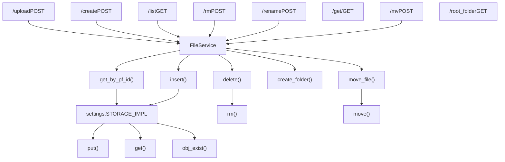
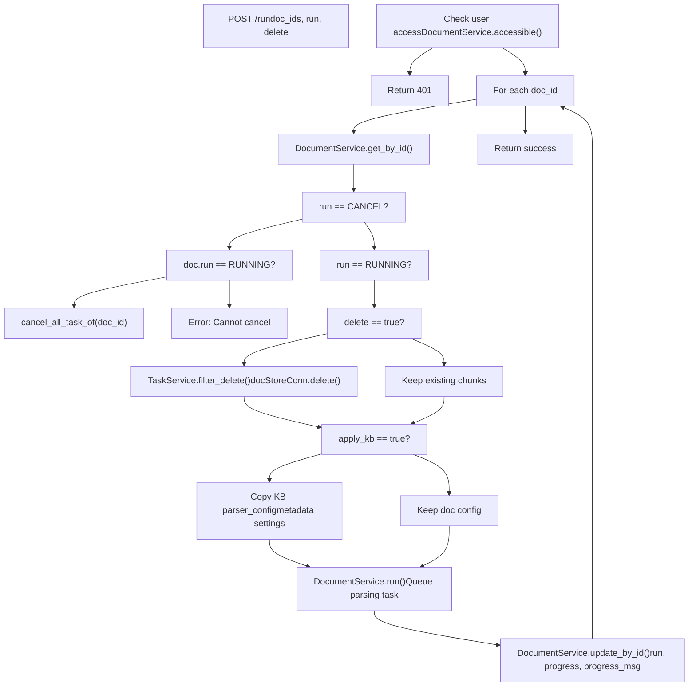
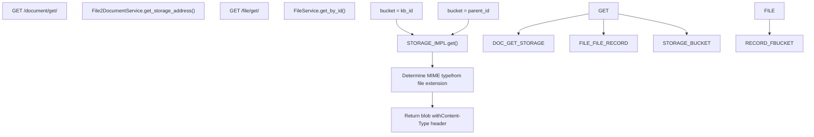
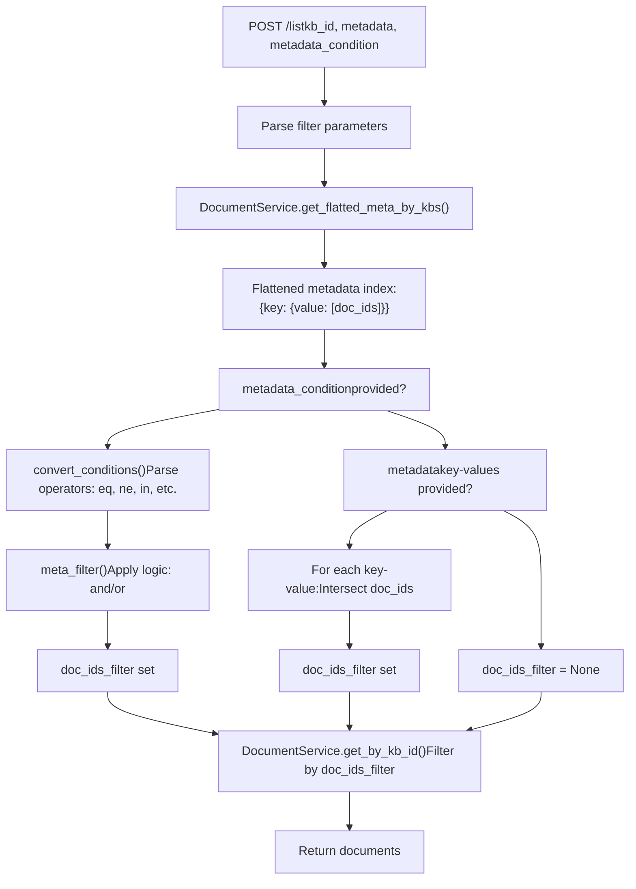
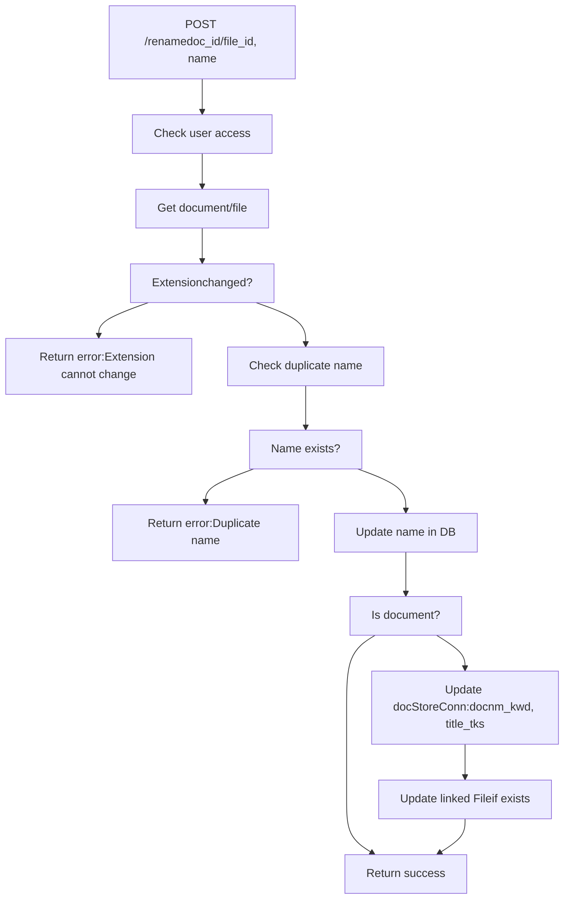

# Document and File Management APIs

Relevant source files

-   [agent/tools/retrieval.py](https://github.com/infiniflow/ragflow/blob/80a16e71/agent/tools/retrieval.py)
-   [api/apps/chunk\_app.py](https://github.com/infiniflow/ragflow/blob/80a16e71/api/apps/chunk_app.py)
-   [api/apps/conversation\_app.py](https://github.com/infiniflow/ragflow/blob/80a16e71/api/apps/conversation_app.py)
-   [api/apps/document\_app.py](https://github.com/infiniflow/ragflow/blob/80a16e71/api/apps/document_app.py)
-   [api/apps/file2document\_app.py](https://github.com/infiniflow/ragflow/blob/80a16e71/api/apps/file2document_app.py)
-   [api/apps/file\_app.py](https://github.com/infiniflow/ragflow/blob/80a16e71/api/apps/file_app.py)
-   [api/apps/kb\_app.py](https://github.com/infiniflow/ragflow/blob/80a16e71/api/apps/kb_app.py)
-   [api/apps/sdk/chat.py](https://github.com/infiniflow/ragflow/blob/80a16e71/api/apps/sdk/chat.py)
-   [api/apps/sdk/dataset.py](https://github.com/infiniflow/ragflow/blob/80a16e71/api/apps/sdk/dataset.py)
-   [api/apps/sdk/dify\_retrieval.py](https://github.com/infiniflow/ragflow/blob/80a16e71/api/apps/sdk/dify_retrieval.py)
-   [api/apps/sdk/doc.py](https://github.com/infiniflow/ragflow/blob/80a16e71/api/apps/sdk/doc.py)
-   [api/apps/sdk/session.py](https://github.com/infiniflow/ragflow/blob/80a16e71/api/apps/sdk/session.py)
-   [api/db/db\_models.py](https://github.com/infiniflow/ragflow/blob/80a16e71/api/db/db_models.py)
-   [api/db/services/canvas\_service.py](https://github.com/infiniflow/ragflow/blob/80a16e71/api/db/services/canvas_service.py)
-   [api/db/services/conversation\_service.py](https://github.com/infiniflow/ragflow/blob/80a16e71/api/db/services/conversation_service.py)
-   [api/db/services/dialog\_service.py](https://github.com/infiniflow/ragflow/blob/80a16e71/api/db/services/dialog_service.py)
-   [api/db/services/document\_service.py](https://github.com/infiniflow/ragflow/blob/80a16e71/api/db/services/document_service.py)
-   [api/db/services/file\_service.py](https://github.com/infiniflow/ragflow/blob/80a16e71/api/db/services/file_service.py)
-   [api/db/services/knowledgebase\_service.py](https://github.com/infiniflow/ragflow/blob/80a16e71/api/db/services/knowledgebase_service.py)
-   [api/db/services/task\_service.py](https://github.com/infiniflow/ragflow/blob/80a16e71/api/db/services/task_service.py)
-   [api/utils/api\_utils.py](https://github.com/infiniflow/ragflow/blob/80a16e71/api/utils/api_utils.py)
-   [docs/references/http\_api\_reference.md](https://github.com/infiniflow/ragflow/blob/80a16e71/docs/references/http_api_reference.md)
-   [docs/references/python\_api\_reference.md](https://github.com/infiniflow/ragflow/blob/80a16e71/docs/references/python_api_reference.md)
-   [docs/release\_notes.md](https://github.com/infiniflow/ragflow/blob/80a16e71/docs/release_notes.md)
-   [rag/advanced\_rag/\_\_init\_\_.py](https://github.com/infiniflow/ragflow/blob/80a16e71/rag/advanced_rag/__init__.py)
-   [rag/benchmark.py](https://github.com/infiniflow/ragflow/blob/80a16e71/rag/benchmark.py)
-   [rag/nlp/search.py](https://github.com/infiniflow/ragflow/blob/80a16e71/rag/nlp/search.py)
-   [rag/svr/task\_executor.py](https://github.com/infiniflow/ragflow/blob/80a16e71/rag/svr/task_executor.py)
-   [sdk/python/ragflow\_sdk/modules/chat.py](https://github.com/infiniflow/ragflow/blob/80a16e71/sdk/python/ragflow_sdk/modules/chat.py)
-   [sdk/python/ragflow\_sdk/ragflow.py](https://github.com/infiniflow/ragflow/blob/80a16e71/sdk/python/ragflow_sdk/ragflow.py)

This section documents the API endpoints and services for managing documents and files within RAGFlow datasets. These APIs handle file uploads, document lifecycle management, metadata operations, and the coordination between the file storage layer and document processing pipeline.

For dataset-level operations (creation, configuration, retrieval), see [Dataset and Knowledge Base APIs](/infiniflow/ragflow/8.3-dataset-and-knowledge-base-apis). For chunk-level operations on parsed content, see page [8.5](/infiniflow/ragflow/8.5-chat-and-conversation-apis). For the document processing and parsing system, see [Document Processing Pipeline](/infiniflow/ragflow/6-document-processing-pipeline).

## Overview

RAGFlow maintains a dual-layer architecture for content management:

1.  **File Layer**: Physical file storage managed by `FileService`, organized in a hierarchical folder structure with storage via `settings.STORAGE_IMPL` (typically MinIO)
2.  **Document Layer**: Logical document records managed by `DocumentService`, linked to datasets (`Knowledgebase`), with parsing status, chunks, and metadata

The `File2Document` model creates a many-to-many relationship between these layers, allowing multiple datasets to reference the same physical file. Document APIs (`/v1/document/*`) operate on the logical layer with dataset context, while File APIs (`/v1/file/*`) operate on the physical storage layer with folder context.

## API Architecture

### Document Management Routes

The `document_app.py` module [api/apps/document\_app.py1-1000](https://github.com/infiniflow/ragflow/blob/80a16e71/api/apps/document_app.py#L1-L1000) exposes REST endpoints under the `/v1/document` prefix for document-centric operations:

```mermaid
flowchart TD
    UPLOAD["/uploadPOST"]
    WEBCRAWL["/web_crawlPOST"]
    CREATE["/createPOST"]
    LIST["/listPOST"]
    FILTER["/filterPOST"]
    THUMBNAILS["/thumbnailsGET"]
    CHANGESTATUS["/change_statusPOST"]
    RM["/rmPOST"]
    RUN["/runPOST"]
    RENAME["/renamePOST"]
    GET["/get/<doc_id>GET"]
    CHANGEPARSER["/change_parserPOST"]
    PARSE["/parsePOST"]
    SETMETA["/set_metaPOST"]
    METASUMMARY["/metadata/summaryPOST"]
    METAUPDATE["/metadata/updatePOST"]
    DOCSVC["DocumentService"]
    FILESVC["FileService"]
    F2DSVC["File2DocumentService"]
    KBSVC["KnowledgebaseService"]
    TASKSVC["TaskService"]
    MYSQL["MySQLMetadata"]
    MINIO["MinIOObject Storage"]
    DOCSTORE["Document EngineChunks & Vectors"]

    UPLOAD --> FILESVC
    UPLOAD --> DOCSVC
    WEBCRAWL --> DOCSVC
    CREATE --> DOCSVC
    LIST --> DOCSVC
    FILTER --> DOCSVC
    RM --> DOCSVC
    RM --> FILESVC
    RUN --> DOCSVC
    RUN --> TASKSVC
    RENAME --> DOCSVC
    CHANGEPARSER --> DOCSVC
    SETMETA --> DOCSVC
    METASUMMARY --> DOCSVC
    METAUPDATE --> DOCSVC
    FILESVC --> MINIO
    DOCSVC --> MYSQL
    DOCSVC --> DOCSTORE
    F2DSVC --> MYSQL
```


**Sources**: [api/apps/document\_app.py52-866](https://github.com/infiniflow/ragflow/blob/80a16e71/api/apps/document_app.py#L52-L866)

### File Management Routes

The `file_app.py` module [api/apps/file\_app.py1-467](https://github.com/infiniflow/ragflow/blob/80a16e71/api/apps/file_app.py#L1-L467) provides folder-based file operations under `/v1/file`:


**Sources**: [api/apps/file\_app.py39-467](https://github.com/infiniflow/ragflow/blob/80a16e71/api/apps/file_app.py#L39-L467) [api/db/services/file\_service.py43-647](https://github.com/infiniflow/ragflow/blob/80a16e71/api/db/services/file_service.py#L43-L647)

### File-Document Relationship Management

The `File2DocumentService` [api/db/services/file2document\_service.py](https://github.com/infiniflow/ragflow/blob/80a16e71/api/db/services/file2document_service.py) maintains the linkage between physical files and logical documents:

| Operation | Endpoint | Purpose |
| --- | --- | --- |
| Convert File to Documents | `POST /v1/file2document/convert` | Link existing files to one or more datasets |
| Remove File-Document Links | `POST /v1/file2document/rm` | Unlink files from datasets and delete documents |

**Sources**: [api/apps/file2document\_app.py31-133](https://github.com/infiniflow/ragflow/blob/80a16e71/api/apps/file2document_app.py#L31-L133)

## Core Data Models

### Document Model

The `Document` model [api/db/db\_models.py730-776](https://github.com/infiniflow/ragflow/blob/80a16e71/api/db/db_models.py#L730-L776) represents a logical document within a dataset:

```
# Key fields from Document model
id: str                    # Unique document identifier
kb_id: str                 # Parent dataset (Knowledgebase) ID
name: str                  # Document name
type: FileType             # DOCUMENT, VISUAL, AURAL, VIRTUAL, etc.
parser_id: ParserType      # Parser type: naive, book, pdf, etc.
pipeline_id: str           # Data flow pipeline ID (optional)
parser_config: dict        # Parser configuration JSON
location: str              # Storage path in object storage
size: int                  # File size in bytes
thumbnail: str             # Thumbnail image path
chunk_num: int             # Number of parsed chunks
token_num: int             # Total token count
progress: float            # Parsing progress (0-1)
progress_msg: str          # Status message
run: TaskStatus            # UNSTART, RUNNING, CANCEL, DONE, FAIL
status: int                # Enable/disable status
meta_fields: dict          # User-defined metadata JSON
source_type: str           # local, s3, notion, github, etc.
suffix: str                # File extension
process_duration: float    # Total processing time
```
**Sources**: [api/db/db\_models.py730-776](https://github.com/infiniflow/ragflow/blob/80a16e71/api/db/db_models.py#L730-L776)

### File Model

The `File` model [api/db/db\_models.py668-684](https://github.com/infiniflow/ragflow/blob/80a16e71/api/db/db_models.py#L668-L684) manages the physical file storage hierarchy:

```
# Key fields from File model
id: str                    # Unique file identifier
parent_id: str             # Parent folder ID (self-reference for root)
tenant_id: str             # Owner tenant/user ID
name: str                  # File or folder name
type: FileType             # DOCUMENT, FOLDER, VISUAL, AURAL, etc.
location: str              # Storage path within parent bucket
size: int                  # File size in bytes
source_type: FileSource    # KNOWLEDGEBASE, LOCAL, etc.
created_by: str            # Creator user ID
```
**Sources**: [api/db/db\_models.py668-684](https://github.com/infiniflow/ragflow/blob/80a16e71/api/db/db_models.py#L668-L684)

### File2Document Relationship

The `File2Document` junction table [api/db/db\_models.py686-689](https://github.com/infiniflow/ragflow/blob/80a16e71/api/db/db_models.py#L686-L689) creates a many-to-many relationship:

```
id: str           # Relationship ID
file_id: str      # Foreign key to File.id
document_id: str  # Foreign key to Document.id
```
This allows:

-   A single file to be added to multiple datasets (sharing physical storage)
-   Multiple versions of a document to reference the same file
-   Folder operations to work independently of dataset operations

**Sources**: [api/db/db\_models.py686-689](https://github.com/infiniflow/ragflow/blob/80a16e71/api/db/db_models.py#L686-L689)

## Document Lifecycle

### Upload and Creation Flow

> **[Mermaid sequence]**
> *(图表结构无法解析)*

**Sources**: [api/apps/document\_app.py52-86](https://github.com/infiniflow/ragflow/blob/80a16e71/api/apps/document_app.py#L52-L86) [api/db/services/file\_service.py431-488](https://github.com/infiniflow/ragflow/blob/80a16e71/api/db/services/file_service.py#L431-L488) [api/db/services/document\_service.py331-336](https://github.com/infiniflow/ragflow/blob/80a16e71/api/db/services/document_service.py#L331-L336)

### Document Parsing Control

The `/run` endpoint [api/apps/document\_app.py573-629](https://github.com/infiniflow/ragflow/blob/80a16e71/api/apps/document_app.py#L573-L629) controls document processing:

| `run` Parameter | Action |
| --- | --- |
| `TaskStatus.RUNNING` | Start or restart parsing. If `delete=true`, clear existing chunks |
| `TaskStatus.CANCEL` | Cancel running task |
| Other values | Update status without action |

**Run Endpoint Logic**:


**Sources**: [api/apps/document\_app.py573-629](https://github.com/infiniflow/ragflow/blob/80a16e71/api/apps/document_app.py#L573-L629)

### Document Deletion Flow

> **[Mermaid sequence]**
> *(图表结构无法解析)*

**Sources**: [api/db/services/file\_service.py554-595](https://github.com/infiniflow/ragflow/blob/80a16e71/api/db/services/file_service.py#L554-L595) [api/db/services/document\_service.py340-365](https://github.com/infiniflow/ragflow/blob/80a16e71/api/db/services/document_service.py#L340-L365)

## File Upload and Storage

### File Upload to Folder

The file upload endpoint [api/apps/file\_app.py39-129](https://github.com/infiniflow/ragflow/blob/80a16e71/api/apps/file_app.py#L39-L129) supports hierarchical folder structures with path preservation:

**Upload Process**:

1.  Parse file path from `file_obj.filename` (e.g., `folder1/folder2/file.pdf`)
2.  Resolve or create folder hierarchy using `FileService.get_id_list_by_id()` and `FileService.create_folder()`
3.  Check for name conflicts via `duplicate_name()`
4.  Store blob in MinIO under `{parent_folder_id}/{location}`
5.  Insert `File` record with `parent_id` pointing to containing folder

**Sources**: [api/apps/file\_app.py66-121](https://github.com/infiniflow/ragflow/blob/80a16e71/api/apps/file_app.py#L66-L121)

### Storage Implementation

RAGFlow abstracts storage via `settings.STORAGE_IMPL` [common/settings.py](https://github.com/infiniflow/ragflow/blob/80a16e71/common/settings.py) typically MinIO. Key operations:

| Method | Purpose | Parameters |
| --- | --- | --- |
| `put(bucket, name, blob)` | Store object | `bucket`: folder/kb ID, `name`: file path, `blob`: bytes |
| `get(bucket, name)` | Retrieve object | Returns bytes or raises exception |
| `rm(bucket, name)` | Delete object | Silent if not exists |
| `move(old_bucket, old_name, new_bucket, new_name)` | Move object | Used by file move operation |
| `obj_exist(bucket, name)` | Check existence | Returns boolean |

**Bucket Organization**:

-   **File Layer**: Each folder ID becomes a bucket, files stored at `{folder_id}/{filename}`
-   **Document Layer**: Each dataset ID becomes a bucket, documents stored at `{kb_id}/{location}`
-   **Thumbnails**: Stored in document bucket as `thumbnail_{doc_id}.png`
-   **Chunk Images**: Stored in document bucket as `{chunk_id}.png`

**Sources**: [api/db/services/file\_service.py431-488](https://github.com/infiniflow/ragflow/blob/80a16e71/api/db/services/file_service.py#L431-L488) [api/apps/file\_app.py100-108](https://github.com/infiniflow/ragflow/blob/80a16e71/api/apps/file_app.py#L100-L108)

### Document Download

Both document and file download endpoints stream content with appropriate MIME types:


**MIME Type Mapping** [api/utils/web\_utils.py](https://github.com/infiniflow/ragflow/blob/80a16e71/api/utils/web_utils.py#LNaN-LNaN):

-   PDF: `application/pdf`
-   Images: `image/jpeg`, `image/png`, etc.
-   Office: `application/vnd.openxmlformats-officedocument.*`
-   Text: `text/plain`, `text/html`, `text/markdown`

**Sources**: [api/apps/document\_app.py683-707](https://github.com/infiniflow/ragflow/blob/80a16e71/api/apps/document_app.py#L683-L707) [api/apps/file\_app.py350-376](https://github.com/infiniflow/ragflow/blob/80a16e71/api/apps/file_app.py#L350-L376)

## Metadata Management

### Document Metadata Schema

Documents support flexible JSON metadata in the `meta_fields` column [api/db/db\_models.py751](https://github.com/infiniflow/ragflow/blob/80a16e71/api/db/db_models.py#L751-L751) Common patterns:

```
{
  "author": "John Doe",
  "category": "Technical",
  "tags": ["python", "api", "documentation"],
  "department": "Engineering",
  "confidential": false,
  "version": "1.2"
}
```
Metadata can be:

-   Set via `/set_meta` endpoint [api/apps/document\_app.py868-920](https://github.com/infiniflow/ragflow/blob/80a16e71/api/apps/document_app.py#L868-L920)
-   Configured as default for dataset via `/update_metadata_setting` [api/apps/kb\_app.py166-178](https://github.com/infiniflow/ragflow/blob/80a16e71/api/apps/kb_app.py#L166-L178)
-   Batch updated via `/metadata/update` [api/apps/document\_app.py414-471](https://github.com/infiniflow/ragflow/blob/80a16e71/api/apps/document_app.py#L414-L471)
-   Used for filtering via `/list` endpoint [api/apps/document\_app.py211-340](https://github.com/infiniflow/ragflow/blob/80a16e71/api/apps/document_app.py#L211-L340)

**Sources**: [api/apps/document\_app.py868-920](https://github.com/infiniflow/ragflow/blob/80a16e71/api/apps/document_app.py#L868-L920)

### Metadata Filtering System

The `/list` endpoint supports advanced metadata filtering:


**Metadata Condition Operators** [common/metadata\_utils.py](https://github.com/infiniflow/ragflow/blob/80a16e71/common/metadata_utils.py#LNaN-LNaN):

-   `eq`: Equals
-   `ne`: Not equals
-   `gt`, `gte`: Greater than (or equal)
-   `lt`, `lte`: Less than (or equal)
-   `in`: Value in list
-   `not_in`: Value not in list
-   `is_null`, `is_not_null`: Null checks
-   `contains`, `not_contains`: String contains
-   `regex`: Regular expression match

**Sources**: [api/apps/document\_app.py268-304](https://github.com/infiniflow/ragflow/blob/80a16e71/api/apps/document_app.py#L268-L304) [common/metadata\_utils.py23-95](https://github.com/infiniflow/ragflow/blob/80a16e71/common/metadata_utils.py#L23-L95)

### Batch Metadata Update

The `/metadata/update` endpoint [api/apps/document\_app.py414-471](https://github.com/infiniflow/ragflow/blob/80a16e71/api/apps/document_app.py#L414-L471) performs bulk metadata operations:

**Request Schema**:

```
{
  "kb_id": "kb123",
  "selector": {
    "document_ids": ["doc1", "doc2"],
    "metadata_condition": {
      "logic": "and",
      "conditions": [
        {"key": "status", "operator": "eq", "value": "draft"}
      ]
    }
  },
  "updates": [
    {"key": "status", "value": "published"},
    {"key": "tags", "value": "reviewed", "match": "draft"}
  ],
  "deletes": [
    {"key": "temporary_flag"}
  ]
}
```
**Update Semantics** [api/db/services/document\_service.py779-880](https://github.com/infiniflow/ragflow/blob/80a16e71/api/db/services/document_service.py#L779-L880):

-   **Scalar values**: Direct replacement
-   **List values without `match`**: Append to existing list with deduplication
-   **List values with `match`**: Replace specific list element
-   **Deletes**: Remove key or specific list element

**Sources**: [api/apps/document\_app.py414-471](https://github.com/infiniflow/ragflow/blob/80a16e71/api/apps/document_app.py#L414-L471) [api/db/services/document\_service.py779-880](https://github.com/infiniflow/ragflow/blob/80a16e71/api/db/services/document_service.py#L779-L880)

### Metadata Summary

The `/metadata/summary` endpoint [api/apps/document\_app.py392-411](https://github.com/infiniflow/ragflow/blob/80a16e71/api/apps/document_app.py#L392-L411) aggregates metadata across a dataset:

```
# Example response
{
  "summary": {
    "category": [
      ["Technical", 45],      # 45 documents
      ["Business", 32],
      ["Legal", 18]
    ],
    "tags": [
      ["python", 67],
      ["api", 54],
      ["documentation", 43]
    ],
    "author": [
      ["Alice", 28],
      ["Bob", 21]
    ]
  }
}
```
The summary is sorted by frequency (descending) for each metadata key, enabling faceted search UI.

**Sources**: [api/apps/document\_app.py392-411](https://github.com/infiniflow/ragflow/blob/80a16e71/api/apps/document_app.py#L392-L411) [api/db/services/document\_service.py754-777](https://github.com/infiniflow/ragflow/blob/80a16e71/api/db/services/document_service.py#L754-L777)

## Advanced Operations

### Web Crawling

The `/web_crawl` endpoint [api/apps/document\_app.py88-152](https://github.com/infiniflow/ragflow/blob/80a16e71/api/apps/document_app.py#L88-L152) converts web pages to PDF documents:

> **[Mermaid sequence]**
> *(图表结构无法解析)*

**Sources**: [api/apps/document\_app.py88-152](https://github.com/infiniflow/ragflow/blob/80a16e71/api/apps/document_app.py#L88-L152) [api/utils/web\_utils.py](https://github.com/infiniflow/ragflow/blob/80a16e71/api/utils/web_utils.py#LNaN-LNaN)

### Document Parsing

The `/parse` endpoint [api/apps/document\_app.py813-866](https://github.com/infiniflow/ragflow/blob/80a16e71/api/apps/document_app.py#L813-L866) provides on-demand parsing without persistence:

**URL Parsing**:

```
POST /parse
{
  "url": "https://example.com/page"
}
```
-   Uses Selenium WebDriver with headless Chrome
-   Attempts to detect downloadable files via response headers
-   Falls back to HTML parsing with `RAGFlowHtmlParser`
-   Returns plain text content

**File Upload Parsing**:

```
POST /parse
Content-Type: multipart/form-data
file: <uploaded_file>
```
-   Calls `FileService.parse(filename, blob)`
-   Uses appropriate parser based on file type
-   Returns concatenated chunk content
-   Does not create document records

**Sources**: [api/apps/document\_app.py813-866](https://github.com/infiniflow/ragflow/blob/80a16e71/api/apps/document_app.py#L813-L866) [api/db/services/file\_service.py514-528](https://github.com/infiniflow/ragflow/blob/80a16e71/api/db/services/file_service.py#L514-L528)

### Parser Configuration Update

The `/change_parser` endpoint [api/apps/document\_app.py724-777](https://github.com/infiniflow/ragflow/blob/80a16e71/api/apps/document_app.py#L724-L777) allows switching parsers:

**Request**:

```
{
  "doc_id": "doc123",
  "parser_id": "book",
  "parser_config": {
    "chunk_token_num": 512,
    "layout_recognize": "DeepDOC"
  }
}
```
**Behavior**:

1.  If `pipeline_id` provided: Switch to data flow pipeline, reset document state
2.  If `parser_id` same as current: Only update `parser_config` if provided
3.  If `parser_id` different: Validate file type compatibility, update parser, reset state

**State Reset** [api/apps/document\_app.py737-752](https://github.com/infiniflow/ragflow/blob/80a16e71/api/apps/document_app.py#L737-L752):

-   Set `progress = 0`, `run = UNSTART`
-   Decrement KB chunk/token counts
-   Delete existing chunks from document store
-   Delete chunk images from storage
-   Clear tasks

**Sources**: [api/apps/document\_app.py724-777](https://github.com/infiniflow/ragflow/blob/80a16e71/api/apps/document_app.py#L724-L777)

### Status Management

The `/change_status` endpoint [api/apps/document\_app.py512-550](https://github.com/infiniflow/ragflow/blob/80a16e71/api/apps/document_app.py#L512-L550) enables/disables documents in retrieval:

```
POST /change_status
{
  "doc_ids": ["doc1", "doc2"],
  "status": "1"  # "0" = disabled, "1" = enabled
}
```
**Effect**:

-   Updates `Document.status` in MySQL
-   Updates `available_int` field in document store (Elasticsearch/OpenSearch/Infinity)
-   Disabled documents (`status=0`) are excluded from retrieval queries

This allows temporary document deactivation without deletion, useful for:

-   A/B testing different document versions
-   Seasonal content management
-   Content review workflows

**Sources**: [api/apps/document\_app.py512-550](https://github.com/infiniflow/ragflow/blob/80a16e71/api/apps/document_app.py#L512-L550)

### Rename Operations

Both document and file rename endpoints enforce extension preservation:


**Document Rename**: Updates `Document.name`, tokenizes new name for search, and updates linked `File.name` via `File2Document` [api/apps/document\_app.py631-681](https://github.com/infiniflow/ragflow/blob/80a16e71/api/apps/document_app.py#L631-L681)

**File Rename**: Updates `File.name` and propagates to linked documents [api/apps/file\_app.py310-348](https://github.com/infiniflow/ragflow/blob/80a16e71/api/apps/file_app.py#L310-L348)

**Sources**: [api/apps/document\_app.py631-681](https://github.com/infiniflow/ragflow/blob/80a16e71/api/apps/document_app.py#L631-L681) [api/apps/file\_app.py310-348](https://github.com/infiniflow/ragflow/blob/80a16e71/api/apps/file_app.py#L310-L348)

### Thumbnail Management

The `/thumbnails` endpoint [api/apps/document\_app.py493-510](https://github.com/infiniflow/ragflow/blob/80a16e71/api/apps/document_app.py#L493-L510) retrieves document preview images:

```
GET /thumbnails?doc_ids=doc1,doc2,doc3

# Response
{
  "data": {
    "doc1": "/v1/document/image/kb123-thumbnail_doc1.png",
    "doc2": "data:image/png;base64,iVBORw0KG...",
    "doc3": "/v1/document/image/kb123-thumbnail_doc3.png"
  }
}
```
**Thumbnail Generation** [api/db/services/file\_service.py461-464](https://github.com/infiniflow/ragflow/blob/80a16e71/api/db/services/file_service.py#L461-L464):

-   Generated during upload via `thumbnail_img(filename, blob)`
-   Stored as `thumbnail_{doc_id}.png` in dataset bucket
-   Base64-encoded thumbnails (starting with `data:image/`) returned directly
-   Path-based thumbnails returned as URL to `/image` endpoint

**Sources**: [api/apps/document\_app.py493-510](https://github.com/infiniflow/ragflow/blob/80a16e71/api/apps/document_app.py#L493-L510) [api/utils/file\_utils.py](https://github.com/infiniflow/ragflow/blob/80a16e71/api/utils/file_utils.py#LNaN-LNaN)

### Image Serving

The `/image/<image_id>` endpoint [api/apps/document\_app.py779-793](https://github.com/infiniflow/ragflow/blob/80a16e71/api/apps/document_app.py#L779-L793) serves thumbnails and chunk images:

```
GET /document/image/{kb_id}-{image_name}
```
**Image ID Format**: `{kb_id}-{image_name}` where:

-   `kb_id`: Dataset bucket identifier
-   `image_name`: Thumbnail path or chunk image ID

Returns JPEG content with appropriate `Content-Type` header. Used for:

-   Document thumbnails in list views
-   Chunk images in retrieval results
-   Dataset avatars

**Sources**: [api/apps/document\_app.py779-793](https://github.com/infiniflow/ragflow/blob/80a16e71/api/apps/document_app.py#L779-L793)

## Summary Table: Key Endpoints

| Endpoint | Method | Purpose | Key Parameters |
| --- | --- | --- | --- |
| `/upload` | POST | Upload files to dataset | `kb_id`, `file` (multipart) |
| `/web_crawl` | POST | Create document from URL | `kb_id`, `name`, `url` |
| `/create` | POST | Create virtual document | `kb_id`, `name` |
| `/list` | POST | List documents with filters | `kb_id`, `page`, `metadata`, `run_status`, `types` |
| `/filter` | POST | Get filter aggregations | `kb_id`, `keywords`, `run_status`, `types` |
| `/metadata/summary` | POST | Aggregate metadata statistics | `kb_id` |
| `/metadata/update` | POST | Batch update metadata | `kb_id`, `selector`, `updates`, `deletes` |
| `/rm` | POST | Delete documents | `doc_id` (array) |
| `/run` | POST | Control document parsing | `doc_ids`, `run`, `delete`, `apply_kb` |
| `/change_status` | POST | Enable/disable documents | `doc_ids`, `status` ("0"/"1") |
| `/rename` | POST | Rename document | `doc_id`, `name` |
| `/change_parser` | POST | Change parser/pipeline | `doc_id`, `parser_id`, `parser_config`, `pipeline_id` |
| `/set_meta` | POST | Set document metadata | `doc_id`, `meta` (JSON string) |
| `/get/<doc_id>` | GET | Download document | `doc_id` (path param) |
| `/download/<attachment_id>` | GET | Download attachment | `attachment_id`, `ext` (query) |
| `/thumbnails` | GET | Get document thumbnails | `doc_ids` (array) |
| `/image/<image_id>` | GET | Serve thumbnail/chunk image | `image_id` (format: `kb_id-name`) |
| `/parse` | POST | Parse URL or file ad-hoc | `url` OR `file` (multipart) |
| `/upload_and_parse` | POST | Upload for chat (temp) | `conversation_id`, `file` |

**Sources**: [api/apps/document\_app.py52-920](https://github.com/infiniflow/ragflow/blob/80a16e71/api/apps/document_app.py#L52-L920)
