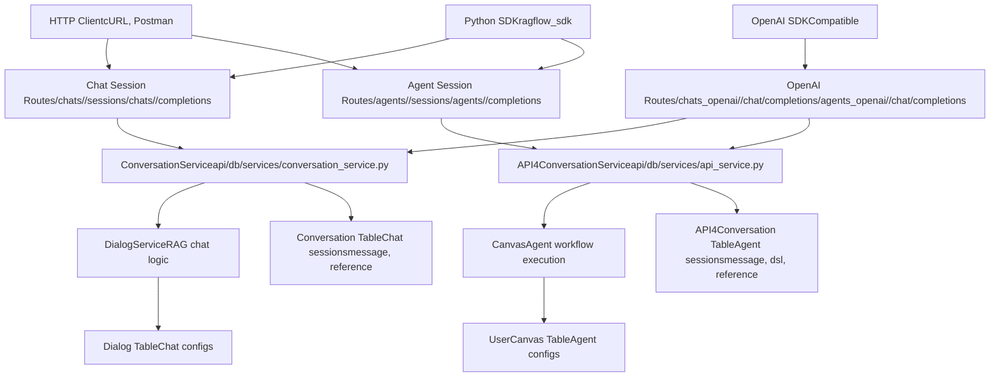

# Chat and Conversation APIs

Relevant source files

-   [agent/tools/retrieval.py](https://github.com/infiniflow/ragflow/blob/80a16e71/agent/tools/retrieval.py)
-   [api/apps/sdk/chat.py](https://github.com/infiniflow/ragflow/blob/80a16e71/api/apps/sdk/chat.py)
-   [api/apps/sdk/dataset.py](https://github.com/infiniflow/ragflow/blob/80a16e71/api/apps/sdk/dataset.py)
-   [api/apps/sdk/dify\_retrieval.py](https://github.com/infiniflow/ragflow/blob/80a16e71/api/apps/sdk/dify_retrieval.py)
-   [api/apps/sdk/doc.py](https://github.com/infiniflow/ragflow/blob/80a16e71/api/apps/sdk/doc.py)
-   [api/apps/sdk/session.py](https://github.com/infiniflow/ragflow/blob/80a16e71/api/apps/sdk/session.py)
-   [api/db/services/canvas\_service.py](https://github.com/infiniflow/ragflow/blob/80a16e71/api/db/services/canvas_service.py)
-   [api/db/services/conversation\_service.py](https://github.com/infiniflow/ragflow/blob/80a16e71/api/db/services/conversation_service.py)
-   [api/utils/api\_utils.py](https://github.com/infiniflow/ragflow/blob/80a16e71/api/utils/api_utils.py)
-   [docs/references/http\_api\_reference.md](https://github.com/infiniflow/ragflow/blob/80a16e71/docs/references/http_api_reference.md)
-   [docs/references/python\_api\_reference.md](https://github.com/infiniflow/ragflow/blob/80a16e71/docs/references/python_api_reference.md)
-   [docs/release\_notes.md](https://github.com/infiniflow/ragflow/blob/80a16e71/docs/release_notes.md)
-   [rag/advanced\_rag/\_\_init\_\_.py](https://github.com/infiniflow/ragflow/blob/80a16e71/rag/advanced_rag/__init__.py)
-   [rag/benchmark.py](https://github.com/infiniflow/ragflow/blob/80a16e71/rag/benchmark.py)
-   [sdk/python/ragflow\_sdk/modules/chat.py](https://github.com/infiniflow/ragflow/blob/80a16e71/sdk/python/ragflow_sdk/modules/chat.py)
-   [sdk/python/ragflow\_sdk/ragflow.py](https://github.com/infiniflow/ragflow/blob/80a16e71/sdk/python/ragflow_sdk/ragflow.py)

This document details the chat completion and conversation management APIs in RAGFlow, covering both native and OpenAI-compatible endpoints. These APIs enable RAG-based question answering with knowledge base retrieval, automatic citation insertion, and multi-turn conversation tracking.

For general API authentication and structure, see [8.1 API Architecture and SDK](/infiniflow/ragflow/8.1-api-architecture-and-sdk). For dataset and retrieval configuration, see [8.3 Dataset and Knowledge Base APIs](/infiniflow/ragflow/8.3-dataset-and-knowledge-base-apis).

## Overview

RAGFlow provides two types of conversational interfaces:

-   **Chat Assistants** (`Dialog` model): RAG-based question answering that retrieves knowledge from datasets, generates responses with LLMs, and inserts citations. Conversations are tracked via `Conversation` sessions.
-   **Agent Workflows** (`UserCanvas` model): Multi-step reasoning workflows that execute component graphs (see [9 Agent and Workflow System](/infiniflow/ragflow/9-agent-and-workflow-system)). Conversations are tracked via `API4Conversation` sessions.

Both interfaces support streaming responses, session persistence, and OpenAI-compatible endpoints for seamless integration with existing tools.

Sources: [api/apps/sdk/session.py1-1028](https://github.com/infiniflow/ragflow/blob/80a16e71/api/apps/sdk/session.py#L1-L1028) [api/db/services/dialog\_service.py1-846](https://github.com/infiniflow/ragflow/blob/80a16e71/api/db/services/dialog_service.py#L1-L846)

## Chat Completion Flow

### End-to-End RAG Pipeline

**RAG Chat Completion Request-to-Response Flow**

```mermaid
flowchart TD
    REQ["POST /api/v1/chats/{chat_id}/completions"]
    REQ_VALIDATE["@token_requiredsession.py:125"]
    REQ_GET_JSON["get_request_json()"]
    DIALOG_QUERY["DialogService.query(tenant_id, id, status)"]
    CONV_QUERY["ConversationService.query(id, dialog_id)"]
    DIALOG_GET["DialogService.get_by_id(chat_id)"]
    RAG_COMP["rag_completionconversation_service.py:93"]
    CALL_CHAT["dialog_service.chat(dialog, messages, stream)"]
    CHAT_FUNC["chat()dialog_service.py:351"]
    CHECK_KB["dialog.kb_ids?"]
    CHAT_SOLO["chat_solo()dialog_service.py:181"]
    GET_MODELS["get_models(dialog)Returns: embd_mdl, chat_mdl,rerank_mdl, tts_mdl"]
    REFINE_MT["prompt_config.get('refine_multiturn')?"]
    FULL_Q["full_question()prompts/generator.py"]
    CROSS_LANG["prompt_config.get('cross_languages')?"]
    TRANSLATE["cross_languages()prompts/generator.py"]
    KEYWORD["prompt_config.get('keyword')?"]
    EXTRACT_KW["keyword_extraction()prompts/generator.py"]
    RETRIEVAL["settings.retriever.retrievalrag/nlp/search.py:359"]
    DEALER_SEARCH["Dealer.searchsearch.py:73"]
    GET_VEC["Dealer.get_vectorsearch.py:52"]
    HYBRID["docStoreConn.search(MatchText, MatchDense, FusionExpr)"]
    RERANK_CHK["rerank_mdl?"]
    RERANK_MODEL["rerank_by_modelsearch.py:330"]
    RERANK_BASE["reranksearch.py:291"]
    KB_PROMPT["kb_prompt(kbinfos, max_tokens)prompts/generator.py"]
    BUILD_MSG["msg[0] = system promptmsg.extend(messages)"]
    MSG_FIT["message_fit_in(msg, max_tokens*0.95)"]
    STREAM_LOOP["chat_mdl.chat_streamly(prompt, msg[1:], gen_conf)"]
    TOKEN_CHK["num_tokens_from_string(delta) >= 16?"]
    YIELD_CHUNK["yield chunk withaudio_binary from tts()"]
    FINAL_ANS["Last answer chunk"]
    DECORATE["decorate_answer(answer)"]
    CITATION_CHK["[ID:n] pattern found?"]
    AUTO_CITE["retriever.insert_citationssearch.py:175"]
    REPAIR_CITE["repair_bad_citation_formatsdialog_service.py:250"]
    SSE_RESP["Response(mimetype='text/event-stream')"]
    CONV_APPEND["ConversationService.append_message()"]

    REQ --> REQ_VALIDATE
    REQ --> VALIDATE_REQ_GET_JSON
    REQ --> GET_JSON_DIALOG_QUERY
    DIALOG --> QUERY_CONV_QUERY
    CONV --> QUERY_DIALOG_GET
    DIALOG --> GET_RAG_COMP
    RAG --> COMP_CALL_CHAT
    CALL --> CHAT_CHAT_FUNC
    CHAT --> FUNC_CHECK_KB
    CHECK --> KB_CHAT_SOLO
    CHECK --> KB_GET_MODELS
    GET --> MODELS_REFINE_MT
    REFINE --> MT_FULL_Q
    REFINE --> MT_CROSS_LANG
    FULL --> Q_CROSS_LANG
    CROSS --> LANG_TRANSLATE
    CROSS --> LANG_KEYWORD
    TRANSLATE --> KEYWORD
    KEYWORD --> EXTRACT_KW
    KEYWORD --> RETRIEVAL
    EXTRACT --> KW_RETRIEVAL
    RETRIEVAL --> DEALER_SEARCH
    DEALER --> SEARCH_GET_VEC
    GET --> VEC_HYBRID
    HYBRID --> RERANK_CHK
    RERANK --> CHK_RERANK_MODEL
    RERANK --> CHK_RERANK_BASE
    RERANK --> MODEL_KB_PROMPT
    RERANK --> BASE_KB_PROMPT
    KB --> PROMPT_BUILD_MSG
    BUILD --> MSG_MSG_FIT
    MSG --> FIT_STREAM_LOOP
    STREAM --> LOOP_TOKEN_CHK
    TOKEN --> CHK_STREAM_LOOP
    TOKEN --> CHK_YIELD_CHUNK
    YIELD --> CHUNK_STREAM_LOOP
    STREAM --> LOOP_FINAL_ANS
    FINAL --> ANS_DECORATE
    DECORATE --> CITATION_CHK
    CITATION --> CHK_AUTO_CITE
    CITATION --> CHK_REPAIR_CITE
    AUTO --> CITE_REPAIR_CITE
    REPAIR --> CITE_SSE_RESP
    SSE --> RESP_CONV_APPEND
    CHAT --> SOLO_SSE_RESP
```


Sources: [api/apps/sdk/session.py124-173](https://github.com/infiniflow/ragflow/blob/80a16e71/api/apps/sdk/session.py#L124-L173) [api/db/services/conversation\_service.py93-147](https://github.com/infiniflow/ragflow/blob/80a16e71/api/db/services/conversation_service.py#L93-L147) [api/db/services/dialog\_service.py281-563](https://github.com/infiniflow/ragflow/blob/80a16e71/api/db/services/dialog_service.py#L281-L563) [api/db/services/dialog\_service.py182-216](https://github.com/infiniflow/ragflow/blob/80a16e71/api/db/services/dialog_service.py#L182-L216) [api/db/services/dialog\_service.py219-241](https://github.com/infiniflow/ragflow/blob/80a16e71/api/db/services/dialog_service.py#L219-L241) [rag/nlp/search.py360-424](https://github.com/infiniflow/ragflow/blob/80a16e71/rag/nlp/search.py#L360-L424) [rag/nlp/search.py74-170](https://github.com/infiniflow/ragflow/blob/80a16e71/rag/nlp/search.py#L74-L170)

### Retrieval Pipeline Integration

The chat API integrates with RAGFlow's hybrid search system documented in [10 Retrieval and RAG System](/infiniflow/ragflow/10-retrieval-and-rag-system). Key retrieval parameters from the `Dialog` model:

| Parameter | Type | Default | Purpose | Code Location |
| --- | --- | --- | --- | --- |
| `kb_ids` | list\[str\] | \[\] | Knowledge base IDs to search | [api/db/db\_models.py540-577](https://github.com/infiniflow/ragflow/blob/80a16e71/api/db/db_models.py#L540-L577) |
| `top_n` | int | 6 | Chunks to retrieve before reranking | [api/db/services/dialog\_service.py404](https://github.com/infiniflow/ragflow/blob/80a16e71/api/db/services/dialog_service.py#L404-L404) |
| `top_k` | int | 1024 | Top results in initial search | [api/db/services/dialog\_service.py408](https://github.com/infiniflow/ragflow/blob/80a16e71/api/db/services/dialog_service.py#L408-L408) |
| `similarity_threshold` | float | 0.2 | Minimum cosine similarity score | [api/db/services/dialog\_service.py405](https://github.com/infiniflow/ragflow/blob/80a16e71/api/db/services/dialog_service.py#L405-L405) |
| `vector_similarity_weight` | float | 0.3 | Vector vs keyword weight (0-1) | [api/db/services/dialog\_service.py406](https://github.com/infiniflow/ragflow/blob/80a16e71/api/db/services/dialog_service.py#L406-L406) |
| `rerank_id` | str | None | Optional reranking model ID | [api/db/services/dialog\_service.py236-237](https://github.com/infiniflow/ragflow/blob/80a16e71/api/db/services/dialog_service.py#L236-L237) |
| `do_refer` | bool | True | Enable/disable citation insertion | [api/db/db\_models.py540-577](https://github.com/infiniflow/ragflow/blob/80a16e71/api/db/db_models.py#L540-L577) |

**Retrieval Function Call** [api/db/services/dialog\_service.py398-412](https://github.com/infiniflow/ragflow/blob/80a16e71/api/db/services/dialog_service.py#L398-L412):

```
kbinfos = retriever.retrieval(
    " ".join(questions),               # Concatenated query questions
    embd_mdl,                          # LLMBundle with EMBEDDING type
    tenant_ids,                        # List of tenant IDs from kbs
    dialog.kb_ids,                     # Knowledge base IDs
    1,                                 # page (always 1 for chat)
    dialog.top_n,                      # Number of chunks to retrieve
    dialog.similarity_threshold,       # Minimum similarity threshold
    dialog.vector_similarity_weight,   # Vector vs text weight
    doc_ids=attachments,               # Optional document ID filtering
    top=dialog.top_k,                  # Search breadth parameter
    aggs=False,                        # Don't aggregate by document
    rerank_mdl=rerank_mdl,            # Optional reranking model
    rank_feature=label_question(" ".join(questions), kbs)  # Tag-based ranking
)
```
**Retrieval Implementation in** `Dealer.retrieval()` [rag/nlp/search.py359-424](https://github.com/infiniflow/ragflow/blob/80a16e71/rag/nlp/search.py#L359-L424):

1.  **Request Assembly** [rag/nlp/search.py382-392](https://github.com/infiniflow/ragflow/blob/80a16e71/rag/nlp/search.py#L382-L392):

    ```
    req = {
        "kb_ids": kb_ids,
        "doc_ids": doc_ids,
        "page": math.ceil(page_size * page / RERANK_LIMIT),
        "size": RERANK_LIMIT,  # Multiple of page_size for reranking
        "question": question,
        "vector": True,
        "topk": top,
        "similarity": similarity_threshold,
        "available_int": 1,
    }
    ```

2.  **Index Name Resolution** [rag/nlp/search.py397](https://github.com/infiniflow/ragflow/blob/80a16e71/rag/nlp/search.py#L397-L397): Converts `tenant_ids` to index names via `[index_name(tid) for tid in tenant_ids]` where `index_name(uid)` returns `f"ragflow_{uid}"` [rag/nlp/search.py33](https://github.com/infiniflow/ragflow/blob/80a16e71/rag/nlp/search.py#L33-L33)

3.  **Hybrid Search via** `Dealer.search()` [rag/nlp/search.py73-169](https://github.com/infiniflow/ragflow/blob/80a16e71/rag/nlp/search.py#L73-L169):

    -   Generates query vector via `Dealer.get_vector()` [rag/nlp/search.py52-60](https://github.com/infiniflow/ragflow/blob/80a16e71/rag/nlp/search.py#L52-L60) which calls `embd_mdl.encode_queries(txt)`
    -   Constructs `MatchDenseExpr` with vector column name `f"q_{len(embedding_data)}_vec"`
    -   Builds `MatchText` expression via `FulltextQueryer.question()` [rag/nlp/query.py](https://github.com/infiniflow/ragflow/blob/80a16e71/rag/nlp/query.py)
    -   Creates `FusionExpr` with `"weighted_sum"` fusion method and weights `"0.05,0.95"` (5% text, 95% vector)
    -   Executes `docStoreConn.search()` with filters, match expressions, and ordering
4.  **Reranking** [rag/nlp/search.py399-423](https://github.com/infiniflow/ragflow/blob/80a16e71/rag/nlp/search.py#L399-L423):

    -   If `rerank_mdl` exists: calls `rerank_by_model()` [rag/nlp/search.py330-351](https://github.com/infiniflow/ragflow/blob/80a16e71/rag/nlp/search.py#L330-L351) for LLM-based scoring
    -   Else: calls `rerank()` [rag/nlp/search.py291-328](https://github.com/infiniflow/ragflow/blob/80a16e71/rag/nlp/search.py#L291-L328) for hybrid similarity using token and vector weights
5.  **TOC Enhancement** (optional) [api/db/services/dialog\_service.py486-489](https://github.com/infiniflow/ragflow/blob/80a16e71/api/db/services/dialog_service.py#L486-L489): If `prompt_config.get("toc_enhance")`, calls `retriever.retrieval_by_toc()` to expand with table-of-contents context

6.  **Knowledge Graph** (optional) [api/db/services/dialog\_service.py496-500](https://github.com/infiniflow/ragflow/blob/80a16e71/api/db/services/dialog_service.py#L496-L500): If `prompt_config.get("use_kg")`, calls `settings.kg_retriever.retrieval()` to add graph entities


**Return Value**: `kbinfos` dict [rag/nlp/search.py375-377](https://github.com/infiniflow/ragflow/blob/80a16e71/rag/nlp/search.py#L375-L377):

```
{
    "total": int,              # Total matching chunks
    "chunks": list[dict],      # Ranked chunk objects with content_with_weight, doc_id, similarity scores, vector
    "doc_aggs": list[dict]     # Document aggregations with doc_id, doc_name, count
}
```
Sources: [api/db/services/dialog\_service.py398-427](https://github.com/infiniflow/ragflow/blob/80a16e71/api/db/services/dialog_service.py#L398-L427) [rag/nlp/search.py360-424](https://github.com/infiniflow/ragflow/blob/80a16e71/rag/nlp/search.py#L360-L424) [rag/nlp/search.py74-170](https://github.com/infiniflow/ragflow/blob/80a16e71/rag/nlp/search.py#L74-L170) [rag/nlp/search.py53-61](https://github.com/infiniflow/ragflow/blob/80a16e71/rag/nlp/search.py#L53-L61) [rag/nlp/search.py34](https://github.com/infiniflow/ragflow/blob/80a16e71/rag/nlp/search.py#L34-L34) [rag/nlp/search.py292-352](https://github.com/infiniflow/ragflow/blob/80a16e71/rag/nlp/search.py#L292-L352)

## Session Architecture

### System Architecture


Sources: [api/apps/sdk/session.py1-1028](https://github.com/infiniflow/ragflow/blob/80a16e71/api/apps/sdk/session.py#L1-L1028) [api/db/services/conversation\_service.py1-287](https://github.com/infiniflow/ragflow/blob/80a16e71/api/db/services/conversation_service.py#L1-L287) [api/db/services/canvas\_service.py1-280](https://github.com/infiniflow/ragflow/blob/80a16e71/api/db/services/canvas_service.py#L1-L280)

### Chat Data Models

**Database Schema and Response Structure**


Sources: [api/db/db\_models.py540-577](https://github.com/infiniflow/ragflow/blob/80a16e71/api/db/db_models.py#L540-L577) [api/db/db\_models.py404-421](https://github.com/infiniflow/ragflow/blob/80a16e71/api/db/db_models.py#L404-L421) [api/db/services/conversation\_service.py93-147](https://github.com/infiniflow/ragflow/blob/80a16e71/api/db/services/conversation_service.py#L93-L147) [api/db/services/dialog\_service.py528-604](https://github.com/infiniflow/ragflow/blob/80a16e71/api/db/services/dialog_service.py#L528-L604)

## Chat Completion APIs

### RAGFlow Native Format

**Endpoint**: `POST /api/v1/chats/<chat_id>/completions`

Executes RAG-based chat completion with RAGFlow's native streaming format.

**Route Handler**: [api/apps/sdk/session.py124-172](https://github.com/infiniflow/ragflow/blob/80a16e71/api/apps/sdk/session.py#L124-L172)

**Request Parameters**:

```
{
  "session_id": "optional_session_id",
  "question": "User question",
  "stream": true,
  "quote": true,
  "doc_ids": "comma-separated doc IDs for filtering"
}
```
| Parameter | Type | Required | Default | Description |
| --- | --- | --- | --- | --- |
| `session_id` | string | No | Creates new | Existing conversation session ID |
| `question` | string | Yes | \- | User's question |
| `stream` | boolean | No | true | Enable SSE streaming |
| `quote` | boolean | No | true | Enable citation insertion |
| `doc_ids` | string | No | null | Comma-separated document IDs to filter retrieval |

**Streaming Response (SSE)** [api/db/services/conversation\_service.py116-137](https://github.com/infiniflow/ragflow/blob/80a16e71/api/db/services/conversation_service.py#L116-L137):

Intermediate chunks:

```
data:{"code":0,"data":{"answer":"Response chunk","reference":{},"audio_binary":""}}

data:{"code":0,"data":{"answer":"More content","reference":{}}}
```
Final chunk with complete metadata:

```
data:{"code":0,"data":{"answer":"Final answer","reference":{"chunks":[{"id":"abc123","content":"...","doc_id":"doc1","similarity":0.85}],"doc_aggs":[{"doc_id":"doc1","doc_name":"file.pdf","count":3}]},"prompt":"## Time elapsed:\n  - Total: 2543.1ms\n  - Retrieval: 678.9ms\n  - Generate answer: 1234.5ms","created_at":1234567890}}
```
**Implementation Flow** [api/apps/sdk/session.py124-172](https://github.com/infiniflow/ragflow/blob/80a16e71/api/apps/sdk/session.py#L124-L172):

1.  Validates `Dialog` ownership via `DialogService.query(tenant_id, id, status)`
2.  Validates `Conversation` if `session_id` provided via `ConversationService.query(id, dialog_id)`
3.  Delegates to `rag_completion()` [api/db/services/conversation\_service.py93-147](https://github.com/infiniflow/ragflow/blob/80a16e71/api/db/services/conversation_service.py#L93-L147)
4.  Returns SSE `Response` with `mimetype='text/event-stream'` and CORS headers

**Response Fields**:

| Field | Type | Description | Present In |
| --- | --- | --- | --- |
| `answer` | string | Generated response (partial or complete) | All chunks |
| `reference` | dict | Retrieved chunks and doc aggregations | Final chunk only |
| `audio_binary` | string | Base64 encoded audio if TTS enabled | All chunks |
| `prompt` | string | System prompt with timing metrics | Final chunk only |
| `created_at` | integer | Unix timestamp | Final chunk only |

**Citation Format**: Citations are inserted as `[ID:0]`, `[ID:1]`, etc., linking to indices in the `reference.chunks` array. See `insert_citations()` [rag/nlp/search.py175-262](https://github.com/infiniflow/ragflow/blob/80a16e71/rag/nlp/search.py#L175-L262) and `repair_bad_citation_formats()` [api/db/services/dialog\_service.py250-276](https://github.com/infiniflow/ragflow/blob/80a16e71/api/db/services/dialog_service.py#L250-L276)

Sources: [api/apps/sdk/session.py124-172](https://github.com/infiniflow/ragflow/blob/80a16e71/api/apps/sdk/session.py#L124-L172) [api/db/services/conversation\_service.py93-147](https://github.com/infiniflow/ragflow/blob/80a16e71/api/db/services/conversation_service.py#L93-L147) [api/db/services/dialog\_service.py281-563](https://github.com/infiniflow/ragflow/blob/80a16e71/api/db/services/dialog_service.py#L281-L563) [rag/nlp/search.py176-263](https://github.com/infiniflow/ragflow/blob/80a16e71/rag/nlp/search.py#L176-L263)

### OpenAI-Compatible Format

**Endpoint**: `POST /api/v1/chats_openai/<chat_id>/chat/completions`

OpenAI SDK-compatible chat completion endpoint matching [OpenAI's API format](https://platform.openai.com/docs/api-reference/chat/create).

**Route Handler**: [api/apps/sdk/session.py175-443](https://github.com/infiniflow/ragflow/blob/80a16e71/api/apps/sdk/session.py#L175-L443)

**Request Parameters**:

```
{
  "model": "model_name",
  "messages": [
    {"role": "system", "content": "System prompt"},
    {"role": "user", "content": "Question"}
  ],
  "stream": true,
  "reference": true
}
```
The `reference` parameter is passed via OpenAI SDK's `extra_body` parameter:

```
completion = client.chat.completions.create(
    model=model,
    messages=messages,
    stream=True,
    extra_body={"reference": True}
)
```
**Implementation Details**:

**Message Processing** [api/apps/sdk/session.py287-294](https://github.com/infiniflow/ragflow/blob/80a16e71/api/apps/sdk/session.py#L287-L294):

```
# Filter system and non-sense assistant messages
msg = []
for m in messages:
    if m["role"] == "system":
        continue
    if m["role"] == "assistant" and not msg:
        continue
    msg.append(m)
```
-   **System Message Filtering**: System messages are excluded to avoid conflicts with `Dialog.prompt_config["system"]` which is already injected by the RAG pipeline
-   **Leading Assistant Filtering**: Assistant messages at the start are filtered to ensure conversations begin with user input

**Streaming Response Generator** [api/apps/sdk/session.py305-392](https://github.com/infiniflow/ragflow/blob/80a16e71/api/apps/sdk/session.py#L305-L392):

```
def streamed_response_generator(chat_id, dia, msg):
    token_used = 0
    answer_cache = ""
    reasoning_cache = ""
    last_ans = {}

    response = {
        "id": f"chatcmpl-{chat_id}",
        "choices": [{
            "delta": {
                "content": "",
                "role": "assistant",
                "function_call": None,
                "tool_calls": None,
                "reasoning_content": "",
            },
            "finish_reason": None,
            "index": 0,
            "logprobs": None,
        }],
        "created": int(time.time()),
        "model": "model",
        "object": "chat.completion.chunk",
        "system_fingerprint": "",
        "usage": None,
    }

    try:
        for ans in chat(dia, msg, True, toolcall_session=toolcall_session,
                       tools=tools, quote=need_reference):
            last_ans = ans
            answer = ans["answer"]

            # Extract reasoning from  tags
            reasoning_match = re.search(r"", answer, flags=re.DOTALL)
            if reasoning_match:
                reasoning_part = reasoning_match.group(1)
                content_part = answer[reasoning_match.end():]
            else:
                reasoning_part = ""
                content_part = answer

            # Calculate incremental chunks
            reasoning_incremental = ""
            if reasoning_part:
                if reasoning_part.startswith(reasoning_cache):
                    reasoning_incremental = reasoning_part.replace(reasoning_cache, "", 1)
                else:
                    reasoning_incremental = reasoning_part
                reasoning_cache = reasoning_part

            content_incremental = ""
            if content_part:
                if content_part.startswith(answer_cache):
                    content_incremental = content_part.replace(answer_cache, "", 1)
            else:
                content_incremental = content_part
            answer_cache = content_part

            token_used += len(reasoning_incremental) + len(content_incremental)

            if not any([reasoning_incremental, content_incremental]):
                continue

            # Build response chunk
            response["choices"][0]["delta"]["reasoning_content"] = reasoning_incremental or None
            response["choices"][0]["delta"]["content"] = content_incremental or None

            yield f"data:{json.dumps(response, ensure_ascii=False)}\n\n"

    except Exception as e:
        response["choices"][0]["delta"]["content"] = "**ERROR**: " + str(e)
        yield f"data:{json.dumps(response, ensure_ascii=False)}\n\n"
```
**Key Behaviors**:

-   **Reasoning Extraction**: Parses \`\` tags for chain-of-thought content
-   **Incremental Delta**: Computes delta by comparing with cached previous content
-   **Token Counting**: Tracks token usage for final usage statistics
-   **Error Handling**: Catches exceptions and streams error messages

**Response Format** (streaming):

Intermediate chunks:

```
{
  "id": "chatcmpl-{chat_id}",
  "object": "chat.completion.chunk",
  "created": 1755084508,
  "model": "model",
  "choices": [{
    "delta": {
      "content": "Token chunk",
      "role": "assistant",
      "reasoning_content": "Optional thinking process"
    },
    "finish_reason": null,
    "index": 0
  }],
  "usage": null
}
```
Final chunk [api/apps/sdk/session.py382-391](https://github.com/infiniflow/ragflow/blob/80a16e71/api/apps/sdk/session.py#L382-L391):

```
{
  "choices": [{
    "delta": {
      "content": null,
      "reasoning_content": null,
      "reference": {"chunks": [...], "doc_aggs": [...]},
      "final_content": "Complete answer"
    },
    "finish_reason": "stop"
  }],
  "usage": {
    "prompt_tokens": 5,
    "completion_tokens": 188,
    "total_tokens": 193
  }
}
```
**Non-streaming Response** [api/apps/sdk/session.py402-440](https://github.com/infiniflow/ragflow/blob/80a16e71/api/apps/sdk/session.py#L402-L440):

```
for ans in chat(dia, msg, False, quote=need_reference):
    answer = ans
    break

response = {
    "choices": [{
        "message": {
            "role": "assistant",
            "content": answer["answer"],
        },
        "finish_reason": "stop"
    }],
    "usage": {
        "prompt_tokens": len(prompt),
        "completion_tokens": len(answer["answer"]),
        "total_tokens": len(prompt) + len(answer["answer"]),
        "completion_tokens_details": {
            "reasoning_tokens": context_token_used,
            "accepted_prediction_tokens": len(answer["answer"]),
            "rejected_prediction_tokens": 0
        }
    }
}

if need_reference:
    response["choices"][0]["message"]["reference"] = chunks_format(answer.get("reference", []))
```
**Reference Formatting**: When `reference=true`, the final response includes a `reference` field formatted via `chunks_format()` from [rag/prompts/generator.py](https://github.com/infiniflow/ragflow/blob/80a16e71/rag/prompts/generator.py#LNaN-LNaN) which restructures the chunks dict into OpenAI-compatible format with keys like `content`, `document_id`, `document_name`, `dataset_id`, `similarity`, etc.

Sources: [api/apps/sdk/session.py175-443](https://github.com/infiniflow/ragflow/blob/80a16e71/api/apps/sdk/session.py#L175-L443) [docs/references/http\_api\_reference.md28-173](https://github.com/infiniflow/ragflow/blob/80a16e71/docs/references/http_api_reference.md#L28-L173)

### Streaming Response Mechanism

> **[Mermaid sequence]**
> *(图表结构无法解析)*

**Token Threshold Logic** [api/db/services/dialog\_service.py547-549](https://github.com/infiniflow/ragflow/blob/80a16e71/api/db/services/dialog_service.py#L547-L549):

```
delta_ans = ans[len(last_ans):]
if num_tokens_from_string(delta_ans) < 16:
    continue
```
Chunks are only yielded when accumulated new tokens exceed 16 to reduce HTTP overhead and improve client-side rendering performance. This batching strategy reduces the number of SSE events sent to the client.

**Citation Insertion Flow** [api/db/services/dialog\_service.py466-483](https://github.com/infiniflow/ragflow/blob/80a16e71/api/db/services/dialog_service.py#L466-L483):

1.  **Check Existing Citations** [api/db/services/dialog\_service.py468](https://github.com/infiniflow/ragflow/blob/80a16e71/api/db/services/dialog_service.py#L468-L468):

    ```
    if embd_mdl and not re.search(r"\[ID:([0-9]+)\]", answer):
    ```

    If no `[ID:n]` patterns found, proceed to auto-insertion

2.  **Auto-Insert Citations** [api/db/services/dialog\_service.py469-476](https://github.com/infiniflow/ragflow/blob/80a16e71/api/db/services/dialog_service.py#L469-L476):

    ```
    answer, idx = retriever.insert_citations(
        answer,
        [ck["content_ltks"] for ck in kbinfos["chunks"]],
        [ck["vector"] for ck in kbinfos["chunks"]],
        embd_mdl,
        tkweight=1 - dialog.vector_similarity_weight,
        vtweight=dialog.vector_similarity_weight,
    )
    ```

    **insert\_citations Implementation** [rag/nlp/search.py176-263](https://github.com/infiniflow/ragflow/blob/80a16e71/rag/nlp/search.py#L176-L263):

    -   Splits answer into sentences using regex `r"([^\|][；。？!！\n]|[a-z][.?;!][ \n])"`
    -   Filters sentences with length >= 5 characters
    -   Embeds each sentence via `embd_mdl.encode(pieces_)`
    -   Computes hybrid similarity between sentences and chunks using `qryr.hybrid_similarity()`
    -   Inserts `[ID:n]` markers where similarity exceeds threshold (starts at 0.63, decreases iteratively to 0.3)
    -   Returns modified answer and set of cited chunk indices
3.  **Extract Manual Citations** [api/db/services/dialog\_service.py477-481](https://github.com/infiniflow/ragflow/blob/80a16e71/api/db/services/dialog_service.py#L477-L481):

    ```
    else:
        for match in re.finditer(r"\[ID:([0-9]+)\]", answer):
            i = int(match.group(1))
            if i < len(kbinfos["chunks"]):
                idx.add(i)
    ```

    Parse existing `[ID:n]` patterns to populate `idx` set with chunk indices

4.  **Repair Bad Citation Formats** [api/db/services/dialog\_service.py483](https://github.com/infiniflow/ragflow/blob/80a16e71/api/db/services/dialog_service.py#L483-L483):

    ```
    answer, idx = repair_bad_citation_formats(answer, kbinfos, idx)
    ```

    **repair\_bad\_citation\_formats** [api/db/services/dialog\_service.py252-278](https://github.com/infiniflow/ragflow/blob/80a16e71/api/db/services/dialog_service.py#L252-L278) converts:

    -   `(ID: 12)` → `[ID:12]`
    -   `[ID: 12]` → `[ID:12]`
    -   `【ID: 12】` → `[ID:12]`
    -   `ref12` → `[ID:12]` (case insensitive)

Sources: [api/db/services/dialog\_service.py466-483](https://github.com/infiniflow/ragflow/blob/80a16e71/api/db/services/dialog_service.py#L466-L483) [rag/nlp/search.py176-263](https://github.com/infiniflow/ragflow/blob/80a16e71/rag/nlp/search.py#L176-L263) [api/db/services/dialog\_service.py252-278](https://github.com/infiniflow/ragflow/blob/80a16e71/api/db/services/dialog_service.py#L252-L278)

## Session Management

### Session Lifecycle

### Create Session

**Endpoint**: `POST /api/v1/chats/<chat_id>/sessions`

Creates a new conversation session for a chat assistant. The session is initialized with a prologue message from the assistant's prompt configuration.

**Route Handler**: [api/apps/sdk/session.py49-75](https://github.com/infiniflow/ragflow/blob/80a16e71/api/apps/sdk/session.py#L49-L75)

**Request Parameters**:

```
{
  "name": "Session name",
  "user_id": "optional_user_identifier"
}
```
| Parameter | Type | Required | Description |
| --- | --- | --- | --- |
| `name` | string | No | Session display name (default: "New session") |
| `user_id` | string | No | User identifier for tracking |

**Implementation Flow** [api/apps/sdk/session.py49-75](https://github.com/infiniflow/ragflow/blob/80a16e71/api/apps/sdk/session.py#L49-L75):

```
@manager.route("/chats/<chat_id>/sessions", methods=["POST"])
@token_required
async def create(tenant_id, chat_id):
    req = await get_request_json()
    req["dialog_id"] = chat_id

    # Validate ownership
    dia = DialogService.query(
        tenant_id=tenant_id,
        id=req["dialog_id"],
        status=StatusEnum.VALID.value
    )
    if not dia:
        return get_error_data_result(message="You do not own the assistant.")

    # Build session object with prologue
    conv = {
        "id": get_uuid(),
        "dialog_id": req["dialog_id"],
        "name": req.get("name", "New session"),
        "message": [{
            "role": "assistant",
            "content": dia[0].prompt_config.get("prologue")
        }],
        "user_id": req.get("user_id", ""),
        "reference": [{}],
    }

    # Validate and save
    if not conv.get("name"):
        return get_error_data_result(message="`name` can not be empty.")
    ConversationService.save(**conv)

    # Retrieve saved record and format response
    e, conv = ConversationService.get_by_id(conv["id"])
    if not e:
        return get_error_data_result(message="Fail to create a session!")
    conv = conv.to_dict()
    conv["messages"] = conv.pop("message")
    conv["chat_id"] = conv.pop("dialog_id")
    del conv["reference"]
    return get_result(data=conv)
```
**Response**:

```
{
  "code": 0,
  "data": {
    "id": "session_uuid",
    "chat_id": "chat_id",
    "name": "Session name",
    "messages": [
      {
        "role": "assistant",
        "content": "Prologue message from Dialog.prompt_config['prologue']"
      }
    ],
    "user_id": "user_id"
  }
}
```
**Database Schema**: The `Conversation` model [api/db/db\_models.py404-421](https://github.com/infiniflow/ragflow/blob/80a16e71/api/db/db_models.py#L404-L421) stores:

| Field | Type | Nullable | Description |
| --- | --- | --- | --- |
| `id` | String(UUID) | No | Primary key |
| `dialog_id` | String | No | Foreign key to Dialog.id |
| `message` | JSONField | Yes | List of message dicts with role, content, id |
| `reference` | JSONField | Yes | List of reference dicts for each assistant message |
| `user_id` | String | Yes | User identifier for tracking |
| `name` | String | Yes | Session display name |
| `source` | String | Yes | Session source (e.g., "agent" for Canvas) |

Sources: [api/apps/sdk/session.py49-75](https://github.com/infiniflow/ragflow/blob/80a16e71/api/apps/sdk/session.py#L49-L75) [api/db/services/conversation\_service.py18-28](https://github.com/infiniflow/ragflow/blob/80a16e71/api/db/services/conversation_service.py#L18-L28) [api/db/db\_models.py404-421](https://github.com/infiniflow/ragflow/blob/80a16e71/api/db/db_models.py#L404-L421)

### Update Session

**Endpoint**: `PUT /api/v1/chats/<chat_id>/sessions/<session_id>`

Updates session metadata. Message content and references cannot be modified through this endpoint.

**Route Handler**: [api/apps/sdk/session.py102-121](https://github.com/infiniflow/ragflow/blob/80a16e71/api/apps/sdk/session.py#L102-L121)

**Request**:

```
{
  "name": "Updated session name"
}
```
**Validation**:

-   Rejects updates to `message` or `reference` fields
-   Validates `name` is not empty
-   Verifies tenant ownership of both chat and session

Sources: [api/apps/sdk/session.py102-121](https://github.com/infiniflow/ragflow/blob/80a16e71/api/apps/sdk/session.py#L102-L121)

### List Sessions

**Endpoint**: `GET /api/v1/chats/<chat_id>/sessions`

Retrieves paginated list of sessions for a chat assistant with optional filtering.

**Route Handler**: [api/apps/sdk/session.py661-714](https://github.com/infiniflow/ragflow/blob/80a16e71/api/apps/sdk/session.py#L661-L714)

**Query Parameters**:

| Parameter | Type | Default | Description |
| --- | --- | --- | --- |
| `id` | string | null | Filter by session ID |
| `name` | string | null | Filter by session name |
| `user_id` | string | null | Filter by user ID |
| `page` | integer | 1 | Page number |
| `page_size` | integer | 30 | Items per page |
| `orderby` | string | "create\_time" | Sort field |
| `desc` | boolean | true | Sort descending |

**Implementation** [api/apps/sdk/session.py661-714](https://github.com/infiniflow/ragflow/blob/80a16e71/api/apps/sdk/session.py#L661-L714):

```
@manager.route("/chats/<chat_id>/sessions", methods=["GET"])
@token_required
def list_session(tenant_id, chat_id):
    # Validate ownership
    if not DialogService.query(tenant_id=tenant_id, id=chat_id, status=StatusEnum.VALID.value):
        return get_error_data_result(message=f"You don't own the assistant {chat_id}.")

    # Parse query parameters
    id = request.args.get("id")
    name = request.args.get("name")
    page_number = int(request.args.get("page", 1))
    items_per_page = int(request.args.get("page_size", 30))
    orderby = request.args.get("orderby", "create_time")
    user_id = request.args.get("user_id")
    desc = request.args.get("desc", "true").lower() != "false"

    # Query sessions
    convs = ConversationService.get_list(
        chat_id, page_number, items_per_page, orderby, desc, id, name, user_id
    )

    # Process each conversation
    for conv in convs:
        # Merge references with messages
        messages = conv["message"]
        references = conv.get("reference", [])

        for i, message in enumerate(messages):
            if message["role"] == "assistant" and i < len(references):
                reference = references[i]
                if not isinstance(reference, dict) or not reference:
                    continue

                # Map chunk fields
                chunks = reference.get("chunks", [])
                mapped_chunks = []
                for chunk in chunks:
                    mapped_chunk = {
                        "id": chunk.get("chunk_id") or chunk.get("id"),
                        "content": chunk.get("content_with_weight") or chunk.get("content_ltks") or chunk.get("content"),
                        "document_id": chunk.get("doc_id"),
                        "document_name": chunk.get("docnm_kwd"),
                        "dataset_id": chunk.get("kb_id")[0] if isinstance(chunk.get("kb_id"), list) else chunk.get("kb_id"),
                        "image_id": chunk.get("img_id", ""),
                        "similarity": chunk.get("similarity", 0.0),
                        "term_similarity": chunk.get("term_similarity", 0.0),
                        "vector_similarity": chunk.get("vector_similarity", 0.0),
                        "positions": chunk.get("positions", [])
                    }
                    mapped_chunks.append(mapped_chunk)

                message["reference"] = mapped_chunks

        conv["messages"] = messages
        conv["chat_id"] = conv.pop("dialog_id")
        del conv["message"]
        del conv["reference"]

    return get_result(data=convs)
```
**Response Format**:

```
{
  "code": 0,
  "data": [
    {
      "id": "session_id",
      "chat_id": "chat_id",
      "name": "Session name",
      "messages": [
        {
          "role": "user",
          "content": "Question"
        },
        {
          "role": "assistant",
          "content": "Answer with [ID:0] citation",
          "reference": [
            {
              "id": "chunk_id",
              "content": "chunk content text",
              "document_id": "doc_id",
              "document_name": "document.pdf",
              "dataset_id": "kb_id",
              "image_id": "",
              "similarity": 0.85,
              "term_similarity": 0.75,
              "vector_similarity": 0.92,
              "positions": [[1, 100, 200, 300, 400]]
            }
          ]
        }
      ]
    }
  ]
}
```
**Reference Chunk Field Mapping** [api/apps/sdk/session.py684-705](https://github.com/infiniflow/ragflow/blob/80a16e71/api/apps/sdk/session.py#L684-L705):

| Internal Field | API Field | Type | Description |
| --- | --- | --- | --- |
| `chunk_id` or `id` | `id` | string | Chunk unique identifier |
| `content_with_weight` or `content_ltks` or `content` | `content` | string | Chunk text content |
| `doc_id` | `document_id` | string | Parent document ID |
| `docnm_kwd` | `document_name` | string | Document filename |
| `kb_id[0]` if list else `kb_id` | `dataset_id` | string | Knowledge base ID (extracts first if list) |
| `img_id` | `image_id` | string | Associated image ID (default: "") |
| `similarity` | `similarity` | float | Combined similarity score (default: 0.0) |
| `term_similarity` | `term_similarity` | float | Keyword match score (default: 0.0) |
| `vector_similarity` | `vector_similarity` | float | Vector cosine similarity (default: 0.0) |
| `positions` | `positions` | list\[list\[int\]\] | Bounding boxes `[page, x, y, w, h]` (default: \[\]) |

Sources: [api/apps/sdk/session.py661-714](https://github.com/infiniflow/ragflow/blob/80a16e71/api/apps/sdk/session.py#L661-L714) [api/db/services/conversation\_service.py34-49](https://github.com/infiniflow/ragflow/blob/80a16e71/api/db/services/conversation_service.py#L34-L49)

### Delete Sessions

**Endpoint**: `DELETE /api/v1/chats/<chat_id>/sessions`

Deletes one or more sessions. Supports bulk deletion with error handling for partial failures.

**Route Handler**: [api/apps/sdk/session.py780-828](https://github.com/infiniflow/ragflow/blob/80a16e71/api/apps/sdk/session.py#L780-L828)

**Request**:

```
{
  "ids": ["session_id_1", "session_id_2"]
}
```
If `ids` is `null`, all sessions for the chat are deleted. If `ids` is an empty array, no sessions are deleted.

**Response** (partial success):

```
{
  "code": 0,
  "data": {
    "success_count": 1,
    "errors": ["Session session_id_2 not found"]
  },
  "message": "Partially deleted 1 sessions with 1 errors"
}
```
Sources: [api/apps/sdk/session.py780-828](https://github.com/infiniflow/ragflow/blob/80a16e71/api/apps/sdk/session.py#L780-L828)

## Agent Session APIs

### Create Agent Session

**Endpoint**: `POST /api/v1/agents/<agent_id>/sessions`

Creates a new session for an agent (Canvas workflow). Initializes the Canvas state machine and stores the DSL.

**Route Handler**: [api/apps/sdk/session.py78-99](https://github.com/infiniflow/ragflow/blob/80a16e71/api/apps/sdk/session.py#L78-L99)

**Query Parameters**:

-   `user_id`: Optional user identifier (defaults to `tenant_id`)

**Implementation** [api/apps/sdk/session.py78-99](https://github.com/infiniflow/ragflow/blob/80a16e71/api/apps/sdk/session.py#L78-L99):

```
@manager.route("/agents/<agent_id>/sessions", methods=["POST"])
@token_required
def create_agent_session(tenant_id, agent_id):
    user_id = request.args.get("user_id", tenant_id)

    # Load agent configuration
    e, cvs = UserCanvasService.get_by_id(agent_id)
    if not e:
        return get_error_data_result("Agent not found.")

    # Validate ownership
    if not UserCanvasService.query(user_id=tenant_id, id=agent_id):
        return get_error_data_result("You cannot access the agent.")

    # Ensure DSL is string format
    if not isinstance(cvs.dsl, str):
        cvs.dsl = json.dumps(cvs.dsl, ensure_ascii=False)

    # Initialize Canvas state machine
    session_id = get_uuid()
    canvas = Canvas(cvs.dsl, tenant_id, agent_id)
    canvas.reset()

    # Create session record
    cvs.dsl = json.loads(str(canvas))
    conv = {
        "id": session_id,
        "dialog_id": cvs.id,
        "user_id": user_id,
        "message": [{"role": "assistant", "content": canvas.get_prologue()}],
        "source": "agent",
        "dsl": cvs.dsl
    }
    API4ConversationService.save(**conv)

    conv["agent_id"] = conv.pop("dialog_id")
    return get_result(data=conv)
```
**Canvas Initialization**:

-   `Canvas(cvs.dsl, tenant_id, agent_id)`: Parses DSL JSON and builds component graph
-   `canvas.reset()`: Initializes component states and variables
-   `canvas.get_prologue()`: Retrieves welcome message from Begin component's `prologue` parameter

**Response**:

```
{
  "code": 0,
  "data": {
    "id": "session_id",
    "agent_id": "agent_id",
    "user_id": "user_id",
    "message": [
      {
        "role": "assistant",
        "content": "Welcome message from Begin component"
      }
    ],
    "source": "agent",
    "dsl": {
      "components": {...},
      "history": [...],
      "path": [...],
      ...
    }
  }
}
```
**DSL Structure**: The `dsl` field contains the complete Canvas workflow definition:

-   `components`: Dict mapping component IDs to component definitions with `obj_name`, `params`, `downstream`
-   `history`: List of execution history entries
-   `path`: List of component IDs in execution order
-   `messages`: List of conversation messages

**Database Schema**: The `API4Conversation` model extends `Conversation` with:

-   `source`: String indicating origin ("agent" for Canvas workflows)
-   `dsl`: JSON field storing Canvas workflow state

Sources: [api/apps/sdk/session.py78-99](https://github.com/infiniflow/ragflow/blob/80a16e71/api/apps/sdk/session.py#L78-L99) [agent/canvas.py](https://github.com/infiniflow/ragflow/blob/80a16e71/agent/canvas.py) [api/db/services/api\_service.py](https://github.com/infiniflow/ragflow/blob/80a16e71/api/db/services/api_service.py)

### List Agent Sessions

**Endpoint**: `GET /api/v1/agents/<agent_id>/sessions`

Retrieves agent sessions with optional DSL filtering.

**Route Handler**: [api/apps/sdk/session.py717-777](https://github.com/infiniflow/ragflow/blob/80a16e71/api/apps/sdk/session.py#L717-L777)

**Query Parameters**:

-   `id`: Filter by session ID
-   `user_id`: Filter by user ID
-   `page`: Page number (default: 1)
-   `page_size`: Items per page (default: 30)
-   `orderby`: Sort field (default: "update\_time")
-   `desc`: Sort descending (default: true)
-   `dsl`: Include DSL in response (default: true, set to "False"/"false" to exclude)

**DSL Filtering**: The `dsl` parameter controls whether the full workflow DSL is included in the response. This is useful for reducing payload size when listing many sessions.

**Reference Processing**: Similar to chat sessions, references are merged with assistant messages and field names are normalized. Additional type checking prevents errors when reference data is malformed.

Sources: [api/apps/sdk/session.py717-777](https://github.com/infiniflow/ragflow/blob/80a16e71/api/apps/sdk/session.py#L717-L777) [api/db/services/api\_service.py](https://github.com/infiniflow/ragflow/blob/80a16e71/api/db/services/api_service.py)

### Delete Agent Sessions

**Endpoint**: `DELETE /api/v1/agents/<agent_id>/sessions`

Deletes agent sessions with the same bulk operation semantics as chat sessions.

**Route Handler**: [api/apps/sdk/session.py831-883](https://github.com/infiniflow/ragflow/blob/80a16e71/api/apps/sdk/session.py#L831-L883)

Sources: [api/apps/sdk/session.py831-883](https://github.com/infiniflow/ragflow/blob/80a16e71/api/apps/sdk/session.py#L831-L883)

## Advanced Features

### Query Refinement

The chat system supports several query preprocessing strategies configured in `Dialog.prompt_config`:

**Multi-turn Query Refinement** (`refine_multiturn=true`):

-   Calls `full_question()` [rag/prompts/generator.py](https://github.com/infiniflow/ragflow/blob/80a16e71/rag/prompts/generator.py#LNaN-LNaN) to rewrite the current question incorporating previous conversation context
-   Uses the chat LLM to generate a standalone question
-   Enabled by default for multi-turn conversations [api/db/services/dialog\_service.py399-402](https://github.com/infiniflow/ragflow/blob/80a16e71/api/db/services/dialog_service.py#L399-L402)

**Cross-language Search** (`cross_languages` list):

-   Translates the query to multiple languages for multilingual retrieval
-   Calls `cross_languages()` [rag/prompts/generator.py](https://github.com/infiniflow/ragflow/blob/80a16e71/rag/prompts/generator.py#LNaN-LNaN)
-   Example: `["Chinese", "Japanese"]` [api/db/services/dialog\_service.py405-406](https://github.com/infiniflow/ragflow/blob/80a16e71/api/db/services/dialog_service.py#L405-L406)

**Keyword Enhancement** (`keyword=true`):

-   Extracts additional search keywords using LLM
-   Calls `keyword_extraction()` [rag/prompts/generator.py](https://github.com/infiniflow/ragflow/blob/80a16e71/rag/prompts/generator.py#LNaN-LNaN)
-   Appends extracted keywords to the query [api/db/services/dialog\_service.py420-421](https://github.com/infiniflow/ragflow/blob/80a16e71/api/db/services/dialog_service.py#L420-L421)

Sources: [api/db/services/dialog\_service.py343-363](https://github.com/infiniflow/ragflow/blob/80a16e71/api/db/services/dialog_service.py#L343-L363)

### Metadata Filtering

The chat API supports filtering retrieved chunks by metadata fields:

**Auto Filtering** (`meta_data_filter.method="auto"`):

-   Uses LLM to generate filter conditions from the user query
-   Calls `gen_meta_filter()` [rag/prompts/generator.py](https://github.com/infiniflow/ragflow/blob/80a16e71/rag/prompts/generator.py#LNaN-LNaN)
-   Applies filters via `meta_filter()` [api/db/services/dialog\_service.py410-413](https://github.com/infiniflow/ragflow/blob/80a16e71/api/db/services/dialog_service.py#L410-L413)

**Manual Filtering** (`meta_data_filter.method="manual"`):

-   Applies pre-configured filter conditions
-   Supports operators: `=`, `≠`, `>`, `<`, `≥`, `≤`, `contains`, `start with`, `end with`, `empty`, `not empty`
-   See `convert_conditions()` [api/db/services/dialog\_service.py273-288](https://github.com/infiniflow/ragflow/blob/80a16e71/api/db/services/dialog_service.py#L273-L288)

**Filter Structure**:

```
{
  "method": "manual",
  "manual": [
    {"key": "author", "op": "=", "value": "John"},
    {"key": "year", "op": ">", "value": "2020"}
  ]
}
```
Sources: [api/db/services/dialog\_service.py351-360](https://github.com/infiniflow/ragflow/blob/80a16e71/api/db/services/dialog_service.py#L351-L360)

### Citation Mechanisms

The system supports automatic citation insertion with multiple fallback strategies:

**Primary Strategy - Semantic Citation**:

-   If no `[ID:n]` patterns exist in the LLM response, calls `retriever.insert_citations()` [rag/nlp/search.py174-262](https://github.com/infiniflow/ragflow/blob/80a16e71/rag/nlp/search.py#L174-L262)
-   Computes hybrid similarity between answer sentences and retrieved chunks
-   Inserts citation markers at optimal positions based on similarity threshold (0.63, decreases to 0.3)
-   Uses both token similarity (TF-IDF) and vector similarity [rag/nlp/search.py229-243](https://github.com/infiniflow/ragflow/blob/80a16e71/rag/nlp/search.py#L229-L243)

**Citation Repair**:

-   Detects malformed citation formats with patterns defined in `BAD_CITATION_PATTERNS` [api/db/services/dialog\_service.py236-241](https://github.com/infiniflow/ragflow/blob/80a16e71/api/db/services/dialog_service.py#L236-L241):
    -   `(ID: 12)` → `[ID:12]`
    -   `【ID: 12】` → `[ID:12]`
    -   `ref12` → `[ID:12]`
-   Converts to standard `[ID:n]` format via `repair_bad_citation_formats()` [api/db/services/dialog\_service.py244-271](https://github.com/infiniflow/ragflow/blob/80a16e71/api/db/services/dialog_service.py#L244-L271)

**Citation Validation**:

-   Validates citation indices are within bounds of `kbinfos["chunks"]`
-   Filters document aggregations to only cited documents [api/db/services/dialog\_service.py541-545](https://github.com/infiniflow/ragflow/blob/80a16e71/api/db/services/dialog_service.py#L541-L545)

Sources: [api/db/services/dialog\_service.py466-494](https://github.com/infiniflow/ragflow/blob/80a16e71/api/db/services/dialog_service.py#L466-L494) [rag/nlp/search.py176-263](https://github.com/infiniflow/ragflow/blob/80a16e71/rag/nlp/search.py#L176-L263)

### SQL-based Retrieval

For datasets with field mappings, the system can use SQL queries instead of vector search:

**Activation**: Checks `KnowledgebaseService.get_field_map(dialog.kb_ids)` [api/db/services/dialog\_service.py382-389](https://github.com/infiniflow/ragflow/blob/80a16e71/api/db/services/dialog_service.py#L382-L389)

**SQL Generation**:

-   LLM generates SQL based on field schema and question
-   Applies refinement if database returns errors (max 2 retries)
-   See `use_sql()` [api/db/services/dialog\_service.py621-743](https://github.com/infiniflow/ragflow/blob/80a16e71/api/db/services/dialog_service.py#L621-L743)

**Response Format**:

-   Returns Markdown table with rows and source citations
-   Each row has a `##n$$` marker for citation linkage [api/db/services/dialog\_service.py709-723](https://github.com/infiniflow/ragflow/blob/80a16e71/api/db/services/dialog_service.py#L709-L723)

Sources: [api/db/services/dialog\_service.py326-333](https://github.com/infiniflow/ragflow/blob/80a16e71/api/db/services/dialog_service.py#L326-L333) [api/db/services/dialog\_service.py567-690](https://github.com/infiniflow/ragflow/blob/80a16e71/api/db/services/dialog_service.py#L567-L690)

### Empty Response Handling

When no chunks are retrieved (e.g., no matching documents), the system returns a configured empty response:

**Configuration**: Set in `Dialog.prompt_config["empty_response"]`

**Behavior**: If `knowledges` list is empty and `empty_response` is configured, returns the empty message without calling the LLM [api/db/services/dialog\_service.py491-495](https://github.com/infiniflow/ragflow/blob/80a16e71/api/db/services/dialog_service.py#L491-L495)

Sources: [api/db/services/dialog\_service.py434-438](https://github.com/infiniflow/ragflow/blob/80a16e71/api/db/services/dialog_service.py#L434-L438)

### Reasoning Mode

The chat system supports reasoning mode for deep research tasks:

**Activation**: Set `prompt_config["reasoning"]=true`

**Implementation**:

-   Uses `DeepResearcher` from `agentic_reasoning` [api/db/services/dialog\_service.py432-453](https://github.com/infiniflow/ragflow/blob/80a16e71/api/db/services/dialog_service.py#L432-L453)
-   Performs iterative retrieval and reasoning
-   Streams thinking process to client [api/db/services/dialog\_service.py448-453](https://github.com/infiniflow/ragflow/blob/80a16e71/api/db/services/dialog_service.py#L448-L453)

Sources: [api/db/services/dialog\_service.py373-394](https://github.com/infiniflow/ragflow/blob/80a16e71/api/db/services/dialog_service.py#L373-L394)

## Agent Completions

Agent completion endpoints execute Canvas workflows. These are documented separately in [8 Agent and Workflow System](/infiniflow/ragflow/8-backend-api-system).

**Endpoints**:

-   `POST /api/v1/agents/<agent_id>/completions` - RAGFlow native format
-   `POST /api/v1/agents_openai/<agent_id>/chat/completions` - OpenAI-compatible format

**Key Differences from Chat**:

-   Executes component DAGs instead of RAG pipeline
-   Stores workflow state in `API4Conversation.dsl`
-   Supports multi-step reasoning with tool calling
-   Returns structured event streams

For detailed documentation, see [9 Agent and Workflow System](/infiniflow/ragflow/9-agent-and-workflow-system) and [api/db/services/canvas\_service.py140-280](https://github.com/infiniflow/ragflow/blob/80a16e71/api/db/services/canvas_service.py#L140-L280)

Sources: [api/apps/sdk/session.py446-658](https://github.com/infiniflow/ragflow/blob/80a16e71/api/apps/sdk/session.py#L446-L658) [api/db/services/canvas\_service.py179-278](https://github.com/infiniflow/ragflow/blob/80a16e71/api/db/services/canvas_service.py#L179-L278)

## Performance Optimizations

### Token Budgeting

The chat system implements sophisticated token management to fit within LLM context windows:

**Message Fitting**: `message_fit_in()` [rag/prompts/generator.py](https://github.com/infiniflow/ragflow/blob/80a16e71/rag/prompts/generator.py#LNaN-LNaN) truncates message history to fit in `max_tokens * 0.95`:

1.  Prioritizes system prompt (always included)
2.  Keeps most recent messages
3.  Truncates older messages if needed
4.  Ensures at least 2 messages (system + user) [api/db/services/dialog\_service.py505-506](https://github.com/infiniflow/ragflow/blob/80a16e71/api/db/services/dialog_service.py#L505-L506)

**Context Selection**: `kb_prompt()` [rag/prompts/generator.py](https://github.com/infiniflow/ragflow/blob/80a16e71/rag/prompts/generator.py#LNaN-LNaN) formats retrieved chunks to fit in available tokens:

-   Truncates each chunk to fit
-   Stops adding chunks when token limit reached
-   Returns formatted strings for insertion in prompt

**Dynamic max\_tokens**: If generation config includes `max_tokens`, it's reduced by used\_token\_count to prevent overflow [api/db/services/dialog\_service.py509-511](https://github.com/infiniflow/ragflow/blob/80a16e71/api/db/services/dialog_service.py#L509-L511)

Sources: [api/db/services/dialog\_service.py449-454](https://github.com/infiniflow/ragflow/blob/80a16e71/api/db/services/dialog_service.py#L449-L454)

### Timing Metrics

Each response includes detailed timing breakdown in the `prompt` field:

```
## Time elapsed:
  - Total: 2543.1ms
  - Check LLM: 123.4ms
  - Check Langfuse tracer: 45.2ms
  - Bind models: 67.8ms
  - Query refinement(LLM): 234.5ms
  - Retrieval: 678.9ms
  - Generate answer: 1234.5ms

## Token usage:
  - Generated tokens(approximately): 156
  - Token speed: 126/s
```
**Instrumentation Points**:

-   `check_llm_ts`: LLM config validation [api/db/services/dialog\_service.py297](https://github.com/infiniflow/ragflow/blob/80a16e71/api/db/services/dialog_service.py#L297-L297)
-   `check_langfuse_tracer_ts`: Langfuse tracer initialization [api/db/services/dialog\_service.py309](https://github.com/infiniflow/ragflow/blob/80a16e71/api/db/services/dialog_service.py#L309-L309)
-   `bind_models_ts`: Model loading [api/db/services/dialog\_service.py314](https://github.com/infiniflow/ragflow/blob/80a16e71/api/db/services/dialog_service.py#L314-L314)
-   `refine_question_ts`: Query preprocessing [api/db/services/dialog\_service.py364](https://github.com/infiniflow/ragflow/blob/80a16e71/api/db/services/dialog_service.py#L364-L364)
-   `retrieval_ts`: Retrieval pipeline [api/db/services/dialog\_service.py433](https://github.com/infiniflow/ragflow/blob/80a16e71/api/db/services/dialog_service.py#L433-L433)
-   `finish_chat_ts`: Response generation [api/db/services/dialog\_service.py498](https://github.com/infiniflow/ragflow/blob/80a16e71/api/db/services/dialog_service.py#L498-L498)

Sources: [api/db/services/dialog\_service.py500-523](https://github.com/infiniflow/ragflow/blob/80a16e71/api/db/services/dialog_service.py#L500-L523)

### Langfuse Integration

The chat system supports LLM call tracing via [Langfuse](https://langfuse.com/):

**Activation**: Configure Langfuse credentials in `TenantLangfuseService` [api/db/services/dialog\_service.py301-308](https://github.com/infiniflow/ragflow/blob/80a16e71/api/db/services/dialog_service.py#L301-L308)

**Traced Operations**:

-   Prompt text and token counts [api/db/services/dialog\_service.py534-536](https://github.com/infiniflow/ragflow/blob/80a16e71/api/db/services/dialog_service.py#L534-L536)
-   Generation parameters and model config
-   Response output and timing [api/db/services/dialog\_service.py526-530](https://github.com/infiniflow/ragflow/blob/80a16e71/api/db/services/dialog_service.py#L526-L530)

**Trace Context**: Each chat creates a trace with unique `trace_id` for request tracking [api/db/services/dialog\_service.py306-307](https://github.com/infiniflow/ragflow/blob/80a16e71/api/db/services/dialog_service.py#L306-L307)

Sources: [api/db/services/dialog\_service.py301-536](https://github.com/infiniflow/ragflow/blob/80a16e71/api/db/services/dialog_service.py#L301-L536)

## Error Handling

### Validation Errors

Common validation failures and error codes:

| Error Code | Scenario | Message |
| --- | --- | --- |
| 102 | User doesn't own chat/agent | "You do not own the assistant/agent" |
| 102 | Session not found | "Session does not exist" |
| 102 | Last message not from user | "The last content of this conversation is not from user." |
| 101 | Empty name | "`name` can not be empty." |

**Error Response Format**:

```
{
  "code": 102,
  "message": "Error description"
}
```
Sources: [api/apps/sdk/session.py56](https://github.com/infiniflow/ragflow/blob/80a16e71/api/apps/sdk/session.py#L56-L56) [api/apps/sdk/session.py110-112](https://github.com/infiniflow/ragflow/blob/80a16e71/api/apps/sdk/session.py#L110-L112) [api/apps/sdk/session.py259-261](https://github.com/infiniflow/ragflow/blob/80a16e71/api/apps/sdk/session.py#L259-L261)

### Duplicate ID Handling

Session deletion operations use `check_duplicate_ids()` to detect and filter duplicate session IDs in bulk delete requests, returning informative messages about duplicates while still deleting unique sessions.

Sources: [api/apps/sdk/session.py802-826](https://github.com/infiniflow/ragflow/blob/80a16e71/api/apps/sdk/session.py#L802-L826)

## Session Query and Filtering

The session listing endpoints support flexible querying via `ConversationService.get_list()` and `API4ConversationService.get_list()`:

**Filtering**:

-   By ID: Direct session lookup
-   By name: Exact name match
-   By user\_id: Filter sessions for specific user

**Pagination**:

-   Offset-based pagination with `page` and `page_size`
-   Default: page=1, page\_size=30

**Sorting**:

-   Chat sessions: Default sort by `create_time`
-   Agent sessions: Default sort by `update_time`
-   `desc` parameter controls ascending/descending order

Sources: [api/db/services/conversation\_service.py34-49](https://github.com/infiniflow/ragflow/blob/80a16e71/api/db/services/conversation_service.py#L34-L49) [api/apps/sdk/session.py495-546](https://github.com/infiniflow/ragflow/blob/80a16e71/api/apps/sdk/session.py#L495-L546)
