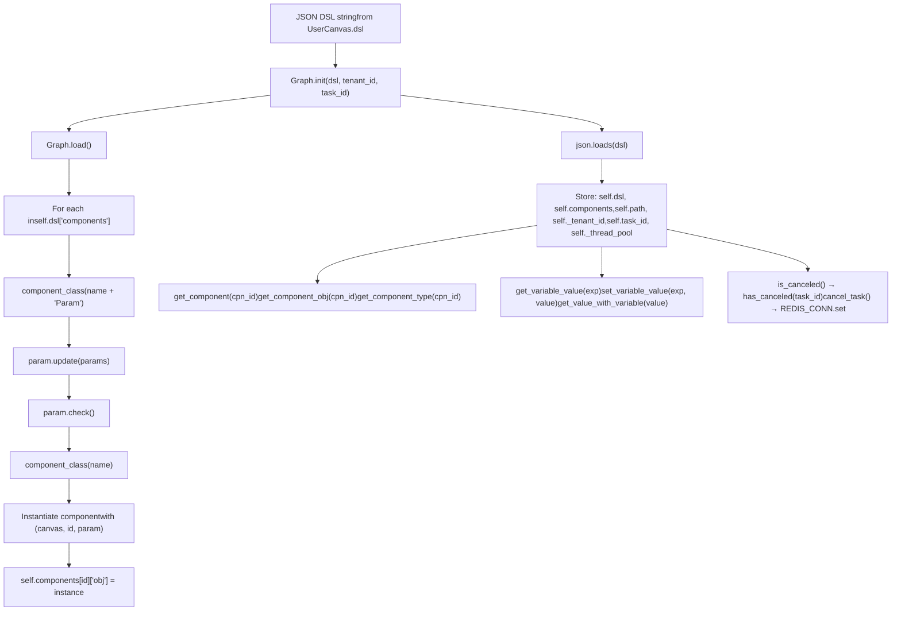
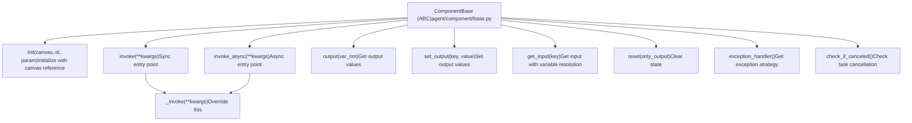
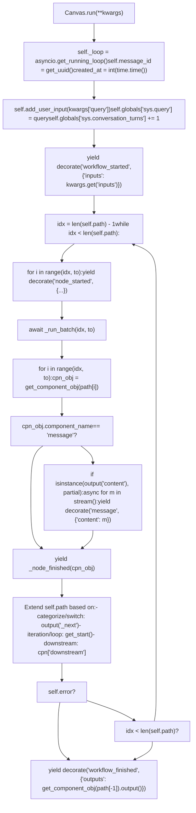
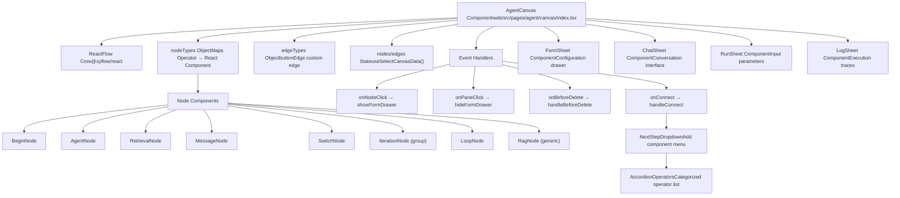
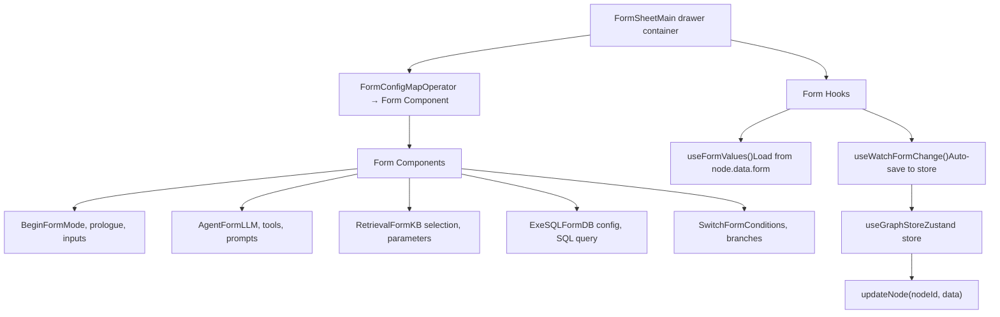
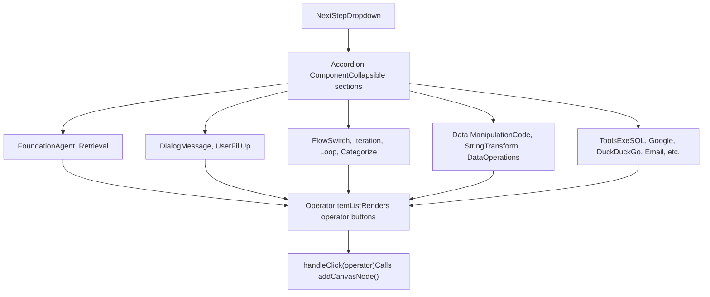
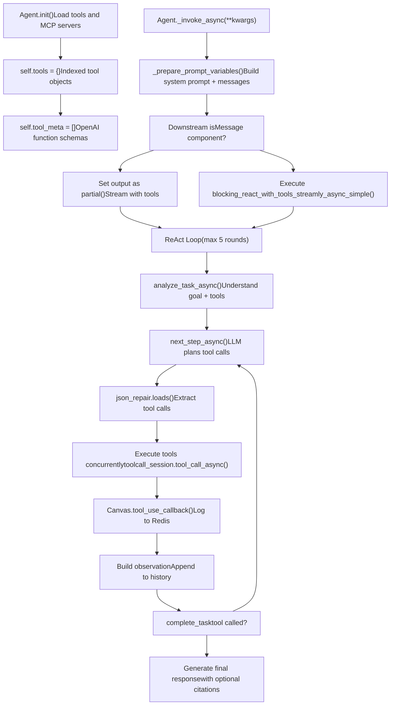
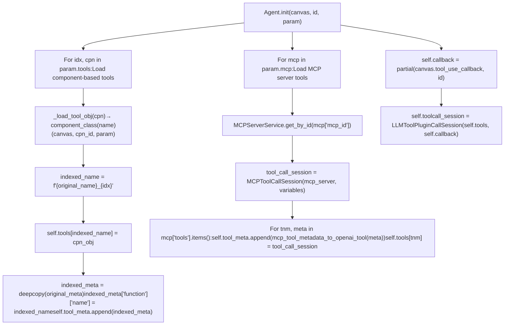

# Agent and Workflow System

Relevant source files

-   [agent/canvas.py](https://github.com/infiniflow/ragflow/blob/80a16e71/agent/canvas.py)
-   [agent/component/agent\_with\_tools.py](https://github.com/infiniflow/ragflow/blob/80a16e71/agent/component/agent_with_tools.py)
-   [agent/component/base.py](https://github.com/infiniflow/ragflow/blob/80a16e71/agent/component/base.py)
-   [agent/component/categorize.py](https://github.com/infiniflow/ragflow/blob/80a16e71/agent/component/categorize.py)
-   [agent/component/llm.py](https://github.com/infiniflow/ragflow/blob/80a16e71/agent/component/llm.py)
-   [agent/tools/base.py](https://github.com/infiniflow/ragflow/blob/80a16e71/agent/tools/base.py)
-   [agent/tools/retrieval.py](https://github.com/infiniflow/ragflow/blob/80a16e71/agent/tools/retrieval.py)
-   [api/apps/api\_app.py](https://github.com/infiniflow/ragflow/blob/80a16e71/api/apps/api_app.py)
-   [api/apps/canvas\_app.py](https://github.com/infiniflow/ragflow/blob/80a16e71/api/apps/canvas_app.py)
-   [api/apps/sdk/chat.py](https://github.com/infiniflow/ragflow/blob/80a16e71/api/apps/sdk/chat.py)
-   [api/apps/sdk/dataset.py](https://github.com/infiniflow/ragflow/blob/80a16e71/api/apps/sdk/dataset.py)
-   [api/apps/sdk/dify\_retrieval.py](https://github.com/infiniflow/ragflow/blob/80a16e71/api/apps/sdk/dify_retrieval.py)
-   [api/apps/sdk/doc.py](https://github.com/infiniflow/ragflow/blob/80a16e71/api/apps/sdk/doc.py)
-   [api/apps/sdk/session.py](https://github.com/infiniflow/ragflow/blob/80a16e71/api/apps/sdk/session.py)
-   [api/db/services/canvas\_service.py](https://github.com/infiniflow/ragflow/blob/80a16e71/api/db/services/canvas_service.py)
-   [api/db/services/conversation\_service.py](https://github.com/infiniflow/ragflow/blob/80a16e71/api/db/services/conversation_service.py)
-   [api/utils/api\_utils.py](https://github.com/infiniflow/ragflow/blob/80a16e71/api/utils/api_utils.py)
-   [docs/references/http\_api\_reference.md](https://github.com/infiniflow/ragflow/blob/80a16e71/docs/references/http_api_reference.md)
-   [docs/references/python\_api\_reference.md](https://github.com/infiniflow/ragflow/blob/80a16e71/docs/references/python_api_reference.md)
-   [docs/release\_notes.md](https://github.com/infiniflow/ragflow/blob/80a16e71/docs/release_notes.md)
-   [rag/advanced\_rag/\_\_init\_\_.py](https://github.com/infiniflow/ragflow/blob/80a16e71/rag/advanced_rag/__init__.py)
-   [rag/benchmark.py](https://github.com/infiniflow/ragflow/blob/80a16e71/rag/benchmark.py)
-   [rag/prompts/generator.py](https://github.com/infiniflow/ragflow/blob/80a16e71/rag/prompts/generator.py)
-   [sdk/python/ragflow\_sdk/modules/chat.py](https://github.com/infiniflow/ragflow/blob/80a16e71/sdk/python/ragflow_sdk/modules/chat.py)
-   [sdk/python/ragflow\_sdk/ragflow.py](https://github.com/infiniflow/ragflow/blob/80a16e71/sdk/python/ragflow_sdk/ragflow.py)
-   [web/src/components/knowledge-base-item.tsx](https://github.com/infiniflow/ragflow/blob/80a16e71/web/src/components/knowledge-base-item.tsx)
-   [web/src/interfaces/request/flow.ts](https://github.com/infiniflow/ragflow/blob/80a16e71/web/src/interfaces/request/flow.ts)

The Agent and Workflow System provides a visual, DSL-based orchestration engine for building complex AI workflows. It enables users to compose multi-step processes by connecting components (LLM, Retrieval, Agent, Categorize, etc.) into directed graphs that execute asynchronously with state management, variable resolution, and streaming output. This system powers RAGFlow's agent capabilities and custom workflow automation.

For document retrieval functionality integrated with workflows, see [Retrieval and RAG System](/infiniflow/ragflow/9-agent-and-workflow-system). For LLM provider integration used by components, see [LLM Integration System](/infiniflow/ragflow/5-llm-integration-system).

---

## Canvas and Graph Architecture

The workflow system is built around two core classes: `Graph` (base orchestrator) and `Canvas` (agent-specific extension).

### DSL Structure

Workflows are defined as JSON DSL containing components, connections, and state. The DSL is stored in the `dsl` field of `UserCanvas` database records and loaded by the `Graph` and `Canvas` classes.

```
{
  "components": {
    "begin": {
      "obj": {
        "component_name": "Begin",
        "params": {}
      },
      "downstream": ["retrieval_0"],
      "upstream": []
    },
    "retrieval_0": {
      "obj": {
        "component_name": "Retrieval",
        "params": {"kb_ids": ["kb-123"]}
      },
      "downstream": ["generate_0"],
      "upstream": ["begin"]
    }
  },
  "history": [],
  "path": ["begin"],
  "retrieval": {"chunks": {}, "doc_aggs": {}},
  "globals": {
    "sys.query": "",
    "sys.user_id": "tenant_id",
    "sys.conversation_turns": 0,
    "sys.files": []
  },
  "variables": {
    "api_key": {"type": "string", "value": ""},
    "threshold": {"type": "number", "value": 0.8}
  },
  "memory": []
}
```
**DSL Lifecycle:**

-   **Storage**: `UserCanvas.dsl` field in MySQL (JSON or serialized string)
-   **Loading**: `Graph.__init__(dsl: str)` → `json.loads(dsl)` → `Graph.load()`
-   **Component Instantiation**: `component_class(name)` factory function
-   **Serialization**: `Graph.__str__()` → `json.dumps(dsl)` → saved back to database

**Sources:** [agent/canvas.py42-79](https://github.com/infiniflow/ragflow/blob/80a16e71/agent/canvas.py#L42-L79) [agent/canvas.py81-89](https://github.com/infiniflow/ragflow/blob/80a16e71/agent/canvas.py#L81-L89) [agent/canvas.py107-126](https://github.com/infiniflow/ragflow/blob/80a16e71/agent/canvas.py#L107-L126) [api/apps/canvas\_app.py140-145](https://github.com/infiniflow/ragflow/blob/80a16e71/api/apps/canvas_app.py#L140-L145)

### Graph Class

The `Graph` class (`agent/canvas.py`) provides core workflow orchestration:


**Key Methods (Graph class):**

-   `__init__(dsl: str, tenant_id, task_id)` - Parses `json.loads(dsl)`, stores in `self.dsl`, creates `ThreadPoolExecutor(max_workers=5)`
-   `load()` - Iterates `self.dsl["components"]`, instantiates via `component_class()`, validates with `param.check()`
-   `__str__()` - Serializes to JSON via `json.dumps()`, calls `str(cpn["obj"])` for each component
-   `get_component(cpn_id)` - Returns `self.components[cpn_id]` dict with `obj`, `upstream`, `downstream`
-   `get_component_obj(cpn_id)` - Returns `self.components[cpn_id]["obj"]` (ComponentBase instance)
-   `get_variable_value(exp)` - Resolves `{sys.*}`, `{env.*}`, or `{cpn_id@var}` expressions
-   `is_canceled()` - Checks `has_canceled(self.task_id)` via Redis lookup
-   `cancel_task()` - Sets `REDIS_CONN.set(f"{self.task_id}-cancel", "x")`

**Thread Pool:** `self._thread_pool = ThreadPoolExecutor(max_workers=5)` created in `__init__`, used for concurrent component execution

**Sources:** [agent/canvas.py40-89](https://github.com/infiniflow/ragflow/blob/80a16e71/agent/canvas.py#L40-L89) [agent/canvas.py91-105](https://github.com/infiniflow/ragflow/blob/80a16e71/agent/canvas.py#L91-L105) [agent/canvas.py107-126](https://github.com/infiniflow/ragflow/blob/80a16e71/agent/canvas.py#L107-L126) [agent/canvas.py147-161](https://github.com/infiniflow/ragflow/blob/80a16e71/agent/canvas.py#L147-L161) [agent/canvas.py189-277](https://github.com/infiniflow/ragflow/blob/80a16e71/agent/canvas.py#L189-L277)

### Canvas Class

`Canvas` extends `Graph` with agent-specific state management and execution logic:

```
class Canvas(Graph):
    def __init__(self, dsl: str, tenant_id, task_id, canvas_id):
        self.globals = {
            "sys.query": "",
            "sys.user_id": tenant_id,
            "sys.conversation_turns": 0,
            "sys.files": []
        }
        self.variables = {}  # User-defined env.* variables from DSL
        super().__init__(dsl, tenant_id, task_id)
        self._id = canvas_id
```
**Additional State (Canvas-specific):**

| Attribute | Type | Purpose | Loaded From |
| --- | --- | --- | --- |
| `self.history` | `list[(role, content)]` | Conversation history tuples | `self.dsl["history"]` |
| `self.retrieval` | `list[dict]` | Retrieved chunks/docs per turn | `self.dsl["retrieval"]` |
| `self.memory` | `list[(user, assist, summ)]` | Episodic memory tuples | `self.dsl.get("memory", [])` |
| `self.globals` | `dict` | System variables (`sys.*`) and env variables (`env.*`) | `self.dsl.get("globals", {})` |
| `self.variables` | `dict` | Variable definitions (type, value, description) | `self.dsl.get("variables", {})` |
| `self.message_id` | `str` | Current message UUID (set in `run()`) | Generated with `get_uuid()` |
| `self._loop` | `asyncio.EventLoop` | Current event loop | `asyncio.get_running_loop()` |

**Key Canvas Methods:**

-   `load()` - Extends `Graph.load()` to load `history`, `retrieval`, `memory`, `globals`, `variables`
-   `reset(mem=False)` - Clears state; if `mem=True`, preserves `history`, `retrieval`, `memory`
-   `run(**kwargs)` - Main async execution engine (see Execution Engine section)
-   `add_user_input(question)` - Appends to `self.history`
-   `get_history(window_size)` - Returns last N conversation turns
-   `add_reference(chunks, doc_infos)` - Appends to `self.retrieval[-1]`
-   `get_reference()` - Returns `self.retrieval[-1]` for citation
-   `tool_use_callback(agent_id, func_name, params, result)` - Logs to Redis at key `f"{task_id}-{message_id}-logs"`
-   `get_files_async(files)` - Converts file metadata to base64 images or parsed text
-   `tts(tts_mdl, text)` - Generates audio binary with optional TTS model

**Sources:** [agent/canvas.py279-310](https://github.com/infiniflow/ragflow/blob/80a16e71/agent/canvas.py#L279-L310) [agent/canvas.py318-360](https://github.com/infiniflow/ragflow/blob/80a16e71/agent/canvas.py#L318-L360) [agent/canvas.py705-810](https://github.com/infiniflow/ragflow/blob/80a16e71/agent/canvas.py#L705-L810)

---

## Component System

### ComponentBase Abstract Class

All workflow components inherit from `ComponentBase`:


**Core Lifecycle:**

1.  **Initialization** - `__init__(canvas, id, param)` stores canvas reference, component ID, and parameters
2.  **Invocation** - `invoke()` or `invoke_async()` wrap `_invoke()` with timing and error handling
3.  **Execution** - `_invoke(**kwargs)` is overridden by subclasses to implement component logic
4.  **Output** - Results stored in `self._param.outputs`, accessed via `output(var_nm)`

**Sources:** [agent/component/base.py361-580](https://github.com/infiniflow/ragflow/blob/80a16e71/agent/component/base.py#L361-L580)

### ComponentParamBase

Parameter objects define component configuration and I/O schema:

```
class ComponentParamBase(ABC):
    def __init__(self):
        self.message_history_window_size = 13
        self.inputs = {}   # Input schema with values
        self.outputs = {}  # Output values by key
        self.description = ""
        self.max_retries = 0
        self.delay_after_error = 2.0
        self.exception_method = None
        self.exception_default_value = None
        self.exception_goto = None
        self.debug_inputs = {}

    def check(self):
        raise NotImplementedError("Parameter Object should be checked.")

    def update(self, conf, allow_redundant=False):
        # Recursively updates parameters from config dict

    def as_dict(self):
        # Serializes to JSON-compatible dict
```
**Parameter Validation:**

-   `check()` - Must be implemented by subclasses to validate configuration
-   `check_positive_integer()`, `check_decimal_float()`, etc. - Built-in validators
-   Raises `ValueError` with descriptive messages on validation failure

**Sources:** [agent/component/base.py36-359](https://github.com/infiniflow/ragflow/blob/80a16e71/agent/component/base.py#L36-L359)

### Component Lifecycle Diagram

> **[Mermaid sequence]**
> *(图表结构无法解析)*

**Sources:** [agent/component/base.py402-443](https://github.com/infiniflow/ragflow/blob/80a16e71/agent/component/base.py#L402-L443) [agent/component/llm.py263-342](https://github.com/infiniflow/ragflow/blob/80a16e71/agent/component/llm.py#L263-L342) [agent/component/agent\_with\_tools.py176-251](https://github.com/infiniflow/ragflow/blob/80a16e71/agent/component/agent_with_tools.py#L176-L251)

---

## Variable Resolution System

The workflow system supports three variable types:

### Variable Types

| Prefix | Description | Example | Resolution |
| --- | --- | --- | --- |
| `sys.*` | System variables | `sys.query`, `sys.user_id`, `sys.conversation_turns`, `sys.files` | Stored in `Canvas.globals` |
| `env.*` | Environment/user variables | `env.api_key`, `env.threshold` | Defined in `Canvas.variables`, resolved to `globals["env.*"]` |
| `{cpn_id}@{field}` | Component outputs | `retrieval_0@content`, `agent@use_tools` | Retrieved from component output |

### Variable Resolution Pattern

Variables are resolved using regex pattern matching:

```
# Pattern in ComponentBase
variable_ref_patt = r"\{* *\{([a-zA-Z:0-9]+@[A-Za-z0-9_.-]+|sys\.[A-Za-z0-9_.]+|env\.[A-Za-z0-9_.]+)\} *\}*"

# Resolution in Graph.get_value_with_variable()
def get_value_with_variable(self, value: str) -> Any:
    pat = re.compile(r"\{* *\{([a-zA-Z:0-9]+@[A-Za-z0-9_.-]+|sys\.[A-Za-z0-9_.]+|env\.[A-Za-z0-9_.]+)\} *\}*")
    out_parts = []
    for m in pat.finditer(value):
        key = m.group(1)
        v = self.get_variable_value(key)
        # Handle partial (streaming), str, or complex objects
        if isinstance(v, partial):
            buf = []
            for chunk in v():
                buf.append(chunk)
            rep = "".join(buf)
        elif isinstance(v, str):
            rep = v
        else:
            rep = json.dumps(v, ensure_ascii=False)
        out_parts.append(rep)
    return "".join(out_parts)
```
**Sources:** [agent/canvas.py162-188](https://github.com/infiniflow/ragflow/blob/80a16e71/agent/canvas.py#L162-L188) [agent/component/base.py364](https://github.com/infiniflow/ragflow/blob/80a16e71/agent/component/base.py#L364-L364)

### Nested Path Resolution

Component outputs can be accessed with dot notation:

```
# Example: {retrieval_0@chunks.0.content}
def get_variable_param_value(self, obj: Any, path: str) -> Any:
    cur = obj
    for key in path.split('.'):
        if isinstance(cur, dict):
            cur = cur.get(key)
        elif isinstance(cur, (list, tuple)):
            idx = int(key)
            cur = cur[idx]
        else:
            cur = getattr(cur, key, None)
    return cur
```
**Sources:** [agent/canvas.py206-233](https://github.com/infiniflow/ragflow/blob/80a16e71/agent/canvas.py#L206-L233)

---

## Execution Engine

### Async Batch Execution

The `Canvas.run(**kwargs)` method orchestrates asynchronous component execution with streaming SSE events:


**Key Execution Steps:**

1.  **Initialization** (lines 361-390):

    -   `self._loop = asyncio.get_running_loop()` - Capture event loop
    -   `self.message_id = get_uuid()` - Generate message ID for tracing
    -   Update `self.globals` with `kwargs` (query, user\_id, files)
    -   Increment `self.globals["sys.conversation_turns"]`
    -   Append `"begin"` to `self.path` if empty
2.  **Batch Execution** (lines 414-458):

    -   `_run_batch(from_idx, to_idx)` - Execute components concurrently
    -   Uses `loop.run_in_executor(self._thread_pool, ...)` for parallel invocation
    -   Checks `invoke_async()` availability, falls back to `invoke()`
3.  **Post-Processing** (lines 488-610):

    -   Handle `Message` component streaming with `partial` generators
    -   Emit `node_finished` events with inputs, outputs, elapsed time
    -   Apply exception handlers if errors occur
    -   Extend path based on component type (categorize, iteration, loop, standard)
4.  **Streaming Support** (lines 494-550):

    -   `partial` function output streams via `async for m in stream()`
    -   Special handling for `<think>` tags (`start_to_think`, `end_to_think` flags)
    -   Optional TTS conversion with `self.tts(tts_mdl, buff_m)`
    -   Citation detection with `re.search(r"\[ID:[ 0-9]+\]", content)`

**Cancellation Checks:** `self.is_canceled()` called at multiple points; raises `TaskCanceledException` if Redis flag set

**Sources:** [agent/canvas.py361-406](https://github.com/infiniflow/ragflow/blob/80a16e71/agent/canvas.py#L361-L406) [agent/canvas.py414-458](https://github.com/infiniflow/ragflow/blob/80a16e71/agent/canvas.py#L414-L458) [agent/canvas.py471-614](https://github.com/infiniflow/ragflow/blob/80a16e71/agent/canvas.py#L471-L614) [agent/canvas.py632-649](https://github.com/infiniflow/ragflow/blob/80a16e71/agent/canvas.py#L632-L649)

### Concurrent Component Execution

The `_run_batch(f, t)` nested function (inside `Canvas.run()`) executes components in parallel:

```
async def _run_batch(f, t):
    """Execute components from index f to t concurrently"""
    if self.is_canceled():
        msg = f"Task {self.task_id} has been canceled during batch execution."
        logging.info(msg)
        raise TaskCanceledException(msg)

    loop = asyncio.get_running_loop()
    tasks = []

    def _run_async_in_thread(coro_func, **call_kwargs):
        """Helper to run coroutine in thread pool"""
        return asyncio.run(coro_func(**call_kwargs))

    i = f
    while i < t:
        cpn = self.get_component_obj(self.path[i])
        task_fn = None
        call_kwargs = None

        # Prepare inputs
        if cpn.component_name.lower() in ["begin", "userfillup"]:
            call_kwargs = {"inputs": kwargs.get("inputs", {})}
            task_fn = cpn.invoke
            i += 1
        else:
            # Check if upstream dependencies are satisfied
            for _, ele in cpn.get_input_elements().items():
                if isinstance(ele, dict) and ele.get("_cpn_id") and \
                   ele.get("_cpn_id") not in self.path[:i]:
                    self.path.pop(i)  # Skip component
                    t -= 1
                    break
            else:
                call_kwargs = cpn.get_input()
                task_fn = cpn.invoke
                i += 1

        if task_fn is None:
            continue

        # Execute async if available
        invoke_async = getattr(cpn, "invoke_async", None)
        if invoke_async and asyncio.iscoroutinefunction(invoke_async):
            tasks.append(loop.run_in_executor(
                self._thread_pool,
                partial(_run_async_in_thread, invoke_async, **(call_kwargs or {}))
            ))
        else:
            tasks.append(loop.run_in_executor(
                self._thread_pool,
                partial(task_fn, **(call_kwargs or {}))
            ))

    if tasks:
        await asyncio.gather(*tasks)
```
**Execution Strategy:**

-   **Thread Pool**: `self._thread_pool = ThreadPoolExecutor(max_workers=5)` created in `Graph.__init__()`
-   **Concurrency**: All components in batch range `<FileRef file-url="https://github.com/infiniflow/ragflow/blob/80a16e71/f, t)` execute in parallel via `asyncio.gather(*tasks)`\\n- **Async Support**#LNaN-LNaN" NaN file-path="f, t)`execute in parallel via`asyncio.gather(\*tasks)\`\\n- **Async Support**">Hii

### Path Management

The execution path dynamically extends based on component logic:

```
# After component execution
if cpn_obj.component_name.lower() in ["categorize", "switch"]:
    # Conditional branching
    _extend_path(cpn_obj.output("_next"))
elif cpn_obj.component_name.lower() in ("iteration", "loop"):
    # Loop entry
    _append_path(cpn_obj.get_start())
elif cpn_obj.component_name.lower() == "exitloop":
    # Loop exit
    _extend_path(self.get_component(cpn["parent_id"])["downstream"])
else:
    # Standard flow
    _extend_path(cpn["downstream"])
```
**Sources:** [agent/canvas.py596-609](https://github.com/infiniflow/ragflow/blob/80a16e71/agent/canvas.py#L596-L609)

---

## Built-in Components Overview

### Component Registry and Discovery

Components are auto-discovered and registered via the factory pattern in `agent/component/__init__.py`:

```
# Auto-import all component modules
_package_path = os.path.dirname(__file__)
__all_classes: Dict[str, Type] = {}

def _import_submodules():
    """Auto-import all .py files in agent/component/"""
    for filename in os.listdir(_package_path):
        if filename.startswith("__") or not filename.endswith(".py"):
            continue
        module_name = filename[:-3]
        module = importlib.import_module(f".{module_name}", package=__name__)
        _extract_classes_from_module(module)

def component_class(class_name):
    """Factory function to resolve class by name"""
    for module_name in ["agent.component", "agent.tools", "rag.flow"]:
        try:
            return getattr(importlib.import_module(module_name), class_name)
        except Exception:
            pass
    assert False, f"Can't import {class_name}"
```
**Sources:** [agent/component/\_\_init\_\_.py22-58](https://github.com/infiniflow/ragflow/blob/80a16e71/agent/component/__init__.py#L22-L58)

### Component Type Registry

The frontend defines the complete operator enumeration in `Operator` enum:

| Operator | Category | Description | Node Type | Form Component |
| --- | --- | --- | --- | --- |
| `Begin` | Workflow Control | Entry point with prologue | `beginNode` | `BeginForm` |
| `Message` | Dialog | Display message to user | `messageNode` | `MessageForm` |
| `UserFillUp` | Dialog | Request user input mid-workflow | `ragNode` | `UserFillUpForm` |
| `Retrieval` | Foundation | Knowledge base retrieval | `retrievalNode` | `RetrievalForm` |
| `Agent` | Foundation | ReAct agent with tools | `agentNode` | `AgentForm` |
| `Categorize` | Flow Control | Intent classification router | `categorizeNode` | `CategorizeForm` |
| `Switch` | Flow Control | Conditional branching | `switchNode` | `SwitchForm` |
| `Iteration` | Flow Control | Loop over array | `group` | `IterationForm` |
| `Loop` | Flow Control | Conditional loop | `loopNode` | `LoopForm` |
| `ExitLoop` | Flow Control | Break from loop | `exitLoopNode` | N/A |
| `RewriteQuestion` | LLM | Query reformulation | `rewriteNode` | `RewriteQuestionForm` |
| `Code` | Data Manipulation | Execute Python/JS | `ragNode` | `CodeForm` |
| `StringTransform` | Data Manipulation | String merge/split | `ragNode` | `StringTransformForm` |
| `DataOperations` | Data Manipulation | JSON object operations | `dataOperationsNode` | `DataOperationsForm` |
| `ListOperations` | Data Manipulation | Array filtering/sorting | `listOperationsNode` | `ListOperationsForm` |
| `VariableAssigner` | Data Manipulation | Variable assignment | `variableAssignerNode` | `VariableAssignerForm` |
| `VariableAggregator` | Data Manipulation | Aggregate variables | `variableAggregatorNode` | `VariableAggregatorForm` |
| `ExeSQL` | Tools | SQL query execution | `ragNode` | `ExeSQLForm` |
| `DuckDuckGo` | Tools | Web search | `ragNode` | `DuckDuckGoForm` |
| `Wikipedia` | Tools | Wikipedia search | `ragNode` | `WikipediaForm` |
| `PubMed` | Tools | PubMed literature search | `ragNode` | `PubMedForm` |
| `ArXiv` | Tools | ArXiv paper search | `ragNode` | `ArXivForm` |
| `Google` | Tools | Google search | `ragNode` | `GoogleForm` |
| `Bing` | Tools | Bing search | `ragNode` | `BingForm` |
| `GoogleScholar` | Tools | Google Scholar search | `ragNode` | `GoogleScholarForm` |
| `GitHub` | Tools | GitHub search | `ragNode` | `GithubForm` |
| `TavilySearch` | Tools | Tavily AI search | `ragNode` | `TavilyForm` |
| `TavilyExtract` | Tools | Tavily content extract | `ragNode` | `TavilyExtractForm` |
| `SearXNG` | Tools | SearXNG metasearch | `ragNode` | `SearXNGForm` |
| `WenCai` | Tools | WenCai financial data | `ragNode` | `WenCaiForm` |
| `YahooFinance` | Tools | Yahoo Finance data | `ragNode` | `YahooFinanceForm` |
| `Invoke` | Tools | HTTP request | `ragNode` | `InvokeForm` |
| `Email` | Tools | Send email | `ragNode` | `EmailForm` |
| `Crawler` | Tools | Web crawler | `ragNode` | `CrawlerForm` |
| `PDFGenerator` | Tools | Generate PDF documents | `ragNode` | `PDFGeneratorForm` |
| `ExcelProcessor` | Tools | Excel file operations | `ragNode` | N/A |
| `Note` | Utility | Visual notes on canvas | `noteNode` | N/A |
| `Tool` | Utility | Tool placeholder for Agent | `toolNode` | `ToolForm` |
| `Parser` | Pipeline | Document parser (DataFlow) | `parserNode` | `ParserForm` |
| `Tokenizer` | Pipeline | Text tokenization (DataFlow) | `tokenizerNode` | `TokenizerForm` |
| `Splitter` | Pipeline | Text chunking (DataFlow) | `splitterNode` | `SplitterForm` |
| `HierarchicalMerger` | Pipeline | Hierarchical merger (DataFlow) | `splitterNode` | `HierarchicalMergerForm` |
| `Extractor` | Pipeline | Content extraction (DataFlow) | `contextNode` | `ExtractorForm` |
| `File` | Pipeline | File input (DataFlow) | `fileNode` | N/A |

**Component Instantiation Flow:**

1.  `Graph.load()` calls `component_class(cpn["obj"]["component_name"] + "Param")` to get param class
2.  Create param instance: `param = ParamClass()`
3.  Update with DSL config: `param.update(cpn["obj"]["params"])`
4.  Validate: `param.check()` (raises `ValueError` on validation failure)
5.  Get component class: `component_class(cpn["obj"]["component_name"])`
6.  Instantiate: `ComponentClass(canvas, component_id, param)`
7.  Store in registry: `self.components[component_id]["obj"] = instance`

**Sources:** [agent/canvas.py91-103](https://github.com/infiniflow/ragflow/blob/80a16e71/agent/canvas.py#L91-L103) [web/src/constants/agent.tsx71-120](https://github.com/infiniflow/ragflow/blob/80a16e71/web/src/constants/agent.tsx#L71-L120) [web/src/pages/agent/constant/index.tsx52-67](https://github.com/infiniflow/ragflow/blob/80a16e71/web/src/pages/agent/constant/index.tsx#L52-L67) [web/src/pages/agent/form-sheet/form-config-map.tsx44-184](https://github.com/infiniflow/ragflow/blob/80a16e71/web/src/pages/agent/form-sheet/form-config-map.tsx#L44-L184)

---

## Frontend Canvas UI

### ReactFlow-Based Visual Editor

The agent canvas UI is implemented using ReactFlow in `web/src/pages/agent/canvas/index.tsx`:


**Core UI Components:**

| Component | Purpose | File Path |
| --- | --- | --- |
| `AgentCanvas` | Main canvas container | `web/src/pages/agent/canvas/index.tsx` |
| `BeginNode` | Entry point node | `web/src/pages/agent/canvas/node/begin-node.tsx` |
| `AgentNode` | Agent with tools node | `web/src/pages/agent/canvas/node/agent-node.tsx` |
| `RetrievalNode` | Knowledge base retrieval | `web/src/pages/agent/canvas/node/retrieval-node.tsx` |
| `MessageNode` | Message display | `web/src/pages/agent/canvas/node/message-node.tsx` |
| `SwitchNode` | Conditional branching | `web/src/pages/agent/canvas/node/switch-node.tsx` |
| `IterationNode` | Loop container (group) | `web/src/pages/agent/canvas/node/iteration-node.tsx` |
| `LoopNode` | Conditional loop | `web/src/pages/agent/canvas/node/loop-node.tsx` |
| `RagNode` | Generic node for tools | `web/src/pages/agent/canvas/node/index.tsx` |
| `NextStepDropdown` | Component palette | `web/src/pages/agent/canvas/node/dropdown/next-step-dropdown.tsx` |
| `FormSheet` | Configuration drawer | `web/src/pages/agent/form-sheet/next.tsx` |

**Sources:** [web/src/pages/agent/canvas/index.tsx80-108](https://github.com/infiniflow/ragflow/blob/80a16e71/web/src/pages/agent/canvas/index.tsx#L80-L108) [web/src/pages/agent/canvas/index.tsx119-260](https://github.com/infiniflow/ragflow/blob/80a16e71/web/src/pages/agent/canvas/index.tsx#L119-L260)

### Node Addition and Connection System

The workflow for adding nodes uses placeholder-based connection dragging:

> **[Mermaid sequence]**
> *(图表结构无法解析)*

**Key Hooks:**

| Hook | Purpose | File Path |
| --- | --- | --- |
| `useAddNode` | Node creation logic | `web/src/pages/agent/hooks/use-add-node.ts:353-506` |
| `useConnectionDrag` | Connection drag handling | `web/src/pages/agent/hooks/use-connection-drag.ts` |
| `usePlaceholderManager` | Placeholder lifecycle | `web/src/pages/agent/hooks/use-placeholder-manager.ts` |
| `useValidateConnection` | Connection validation | `web/src/pages/agent/hooks/use-validate-connection.ts` |

**Sources:** [web/src/pages/agent/hooks/use-add-node.ts353-506](https://github.com/infiniflow/ragflow/blob/80a16e71/web/src/pages/agent/hooks/use-add-node.ts#L353-L506) [web/src/pages/agent/canvas/node/dropdown/next-step-dropdown.tsx17-117](https://github.com/infiniflow/ragflow/blob/80a16e71/web/src/pages/agent/canvas/node/dropdown/next-step-dropdown.tsx#L17-L117)

### Form Configuration System

Each operator has a dedicated form component mapped in `FormConfigMap`:


**Form System Flow:**

1.  User clicks node → `onNodeClick()` → `setClickedNodeId()` → `showFormDrawer()`
2.  `FormSheet` renders, looks up operator type in `FormConfigMap`
3.  Form component loads via `useFormValues(initialValues, node)` → reads `node.data.form`
4.  Form renders with `react-hook-form` + `zod` validation
5.  User edits → `useWatchFormChange()` watches all fields
6.  On change → debounced `updateNode(nodeId, { form: values })` → Zustand store
7.  Store update → Canvas re-renders → Node displays updated data

**Sources:** [web/src/pages/agent/form-sheet/form-config-map.tsx1-184](https://github.com/infiniflow/ragflow/blob/80a16e71/web/src/pages/agent/form-sheet/form-config-map.tsx#L1-L184) [web/src/pages/agent/hooks/use-form-values.ts](https://github.com/infiniflow/ragflow/blob/80a16e71/web/src/pages/agent/hooks/use-form-values.ts) [web/src/pages/agent/hooks/use-watch-form-change.ts](https://github.com/infiniflow/ragflow/blob/80a16e71/web/src/pages/agent/hooks/use-watch-form-change.ts)

### Operator Palette Organization

The NextStepDropdown organizes operators into categories:


**Operator Categories:**

1.  **Foundation**: `Agent`, `Retrieval`
2.  **Dialog**: `Message`, `UserFillUp`
3.  **Flow**: `Switch`, `Iteration`, `Loop`, `ExitLoop`, `Categorize`
4.  **Data Manipulation**: `Code`, `StringTransform`, `DataOperations`, `VariableAssigner`, `ListOperations`, `VariableAggregator`
5.  **Tools**: `TavilySearch`, `TavilyExtract`, `ExeSQL`, `Google`, `YahooFinance`, `Email`, `DuckDuckGo`, `Wikipedia`, `GoogleScholar`, `ArXiv`, `PubMed`, `GitHub`, `Invoke`, `WenCai`, `SearXNG`, `PDFGenerator`

**Pipeline-Specific Categories (DataFlow mode):**

-   **Processors**: `Parser`, `Tokenizer`, `Extractor`
-   **Chunker**: `Splitter`, `HierarchicalMerger`

**Sources:** [web/src/pages/agent/canvas/node/dropdown/accordion-operators.tsx29-133](https://github.com/infiniflow/ragflow/blob/80a16e71/web/src/pages/agent/canvas/node/dropdown/accordion-operators.tsx#L29-L133) [web/src/pages/agent/canvas/node/dropdown/accordion-operators.tsx156-222](https://github.com/infiniflow/ragflow/blob/80a16e71/web/src/pages/agent/canvas/node/dropdown/accordion-operators.tsx#L156-L222)

---

## Agent Component and ReAct Loop

### Agent Architecture

The `Agent` component implements ReAct (Reasoning + Acting) for tool orchestration:


**Sources:** [agent/component/agent\_with\_tools.py81-251](https://github.com/infiniflow/ragflow/blob/80a16e71/agent/component/agent_with_tools.py#L81-L251)

### Tool Loading and MCP Integration

The `Agent` component loads tools from two sources: component-based tools and MCP (Model Context Protocol) servers:


**Component-Based Tools:**

```
def _load_tool_obj(self, cpn: dict) -> object:
    """Load tool from component definition"""
    tool_name = cpn["component_name"]
    param = component_class(tool_name + "Param")()
    param.update(cpn["params"])
    param.check()

    # Create nested component ID: agent_id-->tool_name
    cpn_id = f"{self._id}-->" + cpn.get("name", "").replace(" ", "_")
    return component_class(cpn["component_name"])(self._canvas, cpn_id, param)

# Example: Retrieval tool
self.tools["retrieval_0"] = Retrieval(canvas, "agent_0-->retrieval_0", param)
```
**MCP (Model Context Protocol) Tools:**

MCP servers provide external tools via standardized protocol:

```
# Load MCP server configuration
_, mcp_server = MCPServerService.get_by_id(mcp["mcp_id"])
# mcp_server.command: e.g., "npx -y @modelcontextprotocol/server-github"
# mcp_server.variables: JSON dict of env vars

# Create MCP session
tool_call_session = MCPToolCallSession(mcp_server, mcp_server.variables)

# Register each tool from MCP server
for tnm, meta in mcp["tools"].items():
    # Convert MCP metadata to OpenAI format
    self.tool_meta.append(mcp_tool_metadata_to_openai_tool(meta))
    # Store session (multiple tools share same session)
    self.tools[tnm] = tool_call_session
```
**MCP Server Types:**

-   **GitHub MCP**: `@modelcontextprotocol/server-github` - Repository operations
-   **Filesystem MCP**: `@modelcontextprotocol/server-filesystem` - File system access
-   **Custom MCP**: User-defined servers following MCP protocol

**Tool Invocation Routing:**

```
# In LLMToolPluginCallSession.tool_call_async()
async def tool_call_async(self, name: str, arguments: dict) -> Any:
    tool_obj = self.tools_map[name]

    if isinstance(tool_obj, MCPToolCallSession):
        # MCP tool: Call via MCP protocol with timeout
        resp = await asyncio.to_thread(tool_obj.tool_call, name, arguments, 60)
    else:
        # Component tool: Direct invocation
        if hasattr(tool_obj, "invoke_async") and asyncio.iscoroutinefunction(tool_obj.invoke_async):
            resp = await tool_obj.invoke_async(**arguments)
        else:
            resp = await asyncio.to_thread(tool_obj.invoke, **arguments)

    # Log to Redis
    self.callback(name, arguments, resp, elapsed_time=timer()-st)
    return resp
```
**Sources:** [agent/component/agent\_with\_tools.py84-128](https://github.com/infiniflow/ragflow/blob/80a16e71/agent/component/agent_with_tools.py#L84-L128) [agent/tools/base.py46-70](https://github.com/infiniflow/ragflow/blob/80a16e71/agent/tools/base.py#L46-L70) [common/mcp\_tool\_call\_conn.py1-100](https://github.com/infiniflow/ragflow/blob/80a16e71/common/mcp_tool_call_conn.py#L1-L100) (referenced for MCP integration)

### ReAct Loop Implementation

```
async def _react_with_tools_streamly_async_simple(self, prompt, history, use_tools, user_defined_prompt, schema_prompt=""):
    hist = deepcopy(history)

    # Optimize multi-turn conversations
    if len(hist) > 3:
        user_request = await full_question(messages=history, chat_mdl=self.chat_mdl)
    else:
        user_request = history[-1]["content"]

    # Build task description
    task_desc = build_task_desc(prompt, user_request, user_defined_prompt)
    self.callback("analyze_task", {}, task_desc, elapsed_time=...)

    # ReAct loop (max 5 rounds)
    for _ in range(self._param.max_rounds + 1):
        # Step 1: Plan next action
        response, tk = await next_step_async(self.chat_mdl, hist, tool_metas, task_desc, user_defined_prompt)
        hist.append({"role": "assistant", "content": response})

        # Step 2: Parse tool calls
        functions = json_repair.loads(re.sub(r"```.*", "", response))

        # Step 3: Execute tools concurrently
        tool_tasks = []
        for func in functions:
            name = func["name"]
            args = func["arguments"]

            if name == COMPLETE_TASK:
                # Generate final answer
                async for txt, tkcnt in complete():
                    yield txt, tkcnt
                return

            tool_tasks.append(asyncio.create_task(use_tool_async(name, args)))

        results = await asyncio.gather(*tool_tasks) if tool_tasks else []

        # Step 4: Build observation and continue
        reflection = build_observation(results)
        append_user_content(hist, reflection)
        self.callback("reflection", {}, str(reflection), elapsed_time=...)

    # Max rounds exceeded - force completion
    final_instruction = "Provide comprehensive final answer based on gathered information..."
    append_user_content(hist, final_instruction)
    async for txt, tkcnt in complete():
        yield txt, tkcnt
```
**Key Prompts:**

-   `analyze_task_async()` - Understands goal and available tools
-   `next_step_async()` - Plans which tool(s) to call next
-   `build_observation()` - Formats tool results for reflection
-   `COMPLETE_TASK` - Special function name signaling workflow completion

**Sources:** [agent/component/agent\_with\_tools.py275-433](https://github.com/infiniflow/ragflow/blob/80a16e71/agent/component/agent_with_tools.py#L275-L433) [rag/prompts/generator.py360-397](https://github.com/infiniflow/ragflow/blob/80a16e71/rag/prompts/generator.py#L360-L397)

### Tool System Architecture

Tools extend from `ToolBase` (which extends `ComponentBase`) and expose metadata in OpenAI function calling format:

```mermaid
flowchart TD
    ToolParamBase["ToolParamBase"]
    ToolBase["ToolBase"]
    ComponentBase["ComponentBase"]
    ComponentParamBase["ComponentParamBase"]
    MetaAttr["self.meta: ToolMeta{name, description, parameters}"]
    InitInputs["_init_inputs()self.inputs from meta['parameters']"]
    InitAttrs["_init_attr_by_meta()setattr for each parameter"]
    GetMeta["get_meta() → OpenAI function schema"]
    Invoke["invoke(**kwargs)Call _invoke with error handling"]
    InvokeAsync["invoke_async(**kwargs)Async wrapper"]
    RetrieveChunks["_retrieve_chunks(res_list, ...)Format results as chunksCall canvas.add_reference()"]
    LLMToolSession["LLMToolPluginCallSession"]
    ToolsMap["self.tools_map:Dict[str, ComponentBase | MCPToolCallSession]"]
    ToolCall["tool_call(name, arguments)→ asyncio.run(tool_call_async)"]
    ToolCallAsync["tool_call_async(name, arguments)→ tool_obj.invoke_async or tool_obj.invoke"]
    Callback["self.callback(name, arguments, resp, elapsed_time)→ canvas.tool_use_callback()"]

    ToolParamBase --> ComponentParamBase
    ToolBase --> ComponentBase
    ToolParamBase --> MetaAttr
    ToolParamBase --> InitInputs
    ToolParamBase --> InitAttrs
    ToolParamBase --> GetMeta
    ToolBase --> Invoke
    ToolBase --> InvokeAsync
    ToolBase --> RetrieveChunks
    LLMToolSession --> ToolsMap
    LLMToolSession --> ToolCall
    LLMToolSession --> ToolCallAsync
    ToolCallAsync --> Callback
```


**Tool Metadata Structure (ToolMeta TypedDict):**

```
class ToolMeta(TypedDict):
    name: str                      # Tool function name
    displayName: str               # UI display name
    description: str               # Tool purpose description
    displayDescription: str        # UI description
    parameters: dict[str, ToolParameter]  # Parameter schemas

class ToolParameter(TypedDict):
    type: str                      # "string", "number", "boolean", "object", "array"
    description: str               # Parameter description
    displayDescription: str        # UI description
    enum: List[str]                # Allowed values (optional)
    required: bool                 # Is required
```
**OpenAI Function Schema Format:**

```
# Output of ToolParamBase.get_meta()
{
    "type": "function",
    "function": {
        "name": "exesql",  # From self.meta["name"] or self.function_name
        "description": "Execute SQL query against database",
        "parameters": {
            "type": "object",
            "properties": {
                "sql": {
                    "type": "string",
                    "description": "SQL query to execute"
                }
            },
            "required": ["sql"]
        }
    }
}
```
**Tool Execution Flow:**

1.  **Agent Preparation**: `Agent.__init__()` loads tools from `self._param.tools` and `self._param.mcp`
2.  **Indexing**: Tools stored in `self.tools` dict with indexed names (e.g., `retrieval_0`, `retrieval_1`)
3.  **Session Creation**: `LLMToolPluginCallSession(self.tools, self.callback)` wraps tool execution
4.  **LLM Planning**: `next_step_async()` returns JSON tool call list
5.  **Concurrent Execution**: `asyncio.gather(*[use_tool_async(name, args) for ...])`
6.  **Invocation**: `tool_call_async(name, args)` calls `tool_obj.invoke_async()` or `tool_obj.invoke()`
7.  **Callback Logging**: `self.callback(name, args, result, elapsed_time)` logs to Redis
8.  **Result Formatting**: `_retrieve_chunks()` for search tools, formats as knowledge base chunks

**Sources:** [agent/tools/base.py29-68](https://github.com/infiniflow/ragflow/blob/80a16e71/agent/tools/base.py#L29-L68) [agent/tools/base.py73-119](https://github.com/infiniflow/ragflow/blob/80a16e71/agent/tools/base.py#L73-L119) [agent/tools/base.py122-211](https://github.com/infiniflow/ragflow/blob/80a16e71/agent/tools/base.py#L122-L211) [agent/component/agent\_with\_tools.py84-113](https://github.com/infiniflow/ragflow/blob/80a16e71/agent/component/agent_with_tools.py#L84-L113)

---

## LLM Component

### Basic LLM Invocation

The `LLM` component provides basic language model interaction:

```
class LLM(ComponentBase):
    component_name = "LLM"

    def __init__(self, canvas, component_id, param: ComponentParamBase):
        super().__init__(canvas, component_id, param)
        self.chat_mdl = LLMBundle(
            self._canvas.get_tenant_id(),
            TenantLLMService.llm_id2llm_type(self._param.llm_id),
            self._param.llm_id,
            max_retries=self._param.max_retries,
            retry_interval=self._param.delay_after_error
        )
        self.imgs = []
```
**Sources:** [agent/component/llm.py82-91](https://github.com/infiniflow/ragflow/blob/80a16e71/agent/component/llm.py#L82-L91)

### Prompt Preparation

```
def _prepare_prompt_variables(self):
    # Handle visual files
    if self._param.visual_files_var:
        self.imgs = self._canvas.get_variable_value(self._param.visual_files_var)
        self.imgs = [img for img in self.imgs if img[:len("data:image/")] == "data:image/"]

    # Resolve all input variables
    args = {}
    vars = self.get_input_elements() if not self._param.debug_inputs else self._param.debug_inputs
    for k, o in vars.items():
        args[k] = o["value"]
        if not isinstance(args[k], str):
            args[k] = json.dumps(args[k], ensure_ascii=False)
        self.set_input_value(k, args[k])

    # Build message history with system prompt
    msg, sys_prompt = self._sys_prompt_and_msg(
        self._canvas.get_history(self._param.message_history_window_size)[:-1],
        args
    )

    # Extract user-defined prompts
    user_defined_prompt, sys_prompt = self._extract_prompts(sys_prompt)

    # Add citation prompt if needed
    if self._param.cite and self._canvas.get_reference()["chunks"]:
        sys_prompt += citation_prompt(user_defined_prompt)

    return sys_prompt, msg, user_defined_prompt
```
**Sources:** [agent/component/llm.py128-157](https://github.com/infiniflow/ragflow/blob/80a16e71/agent/component/llm.py#L128-L157)

### Streaming vs Blocking Execution

```
async def _invoke_async(self, **kwargs):
    prompt, msg, _ = self._prepare_prompt_variables()

    # Check if downstream is Message component
    downstreams = self._canvas.get_component(self._id)["downstream"]
    ex = self.exception_handler()

    if any([self._canvas.get_component_obj(cid).component_name.lower() == "message"
            for cid in downstreams]) and not (ex and ex["goto"]):
        # Stream output
        self.set_output("content", partial(self._stream_output_async, prompt, deepcopy(msg)))
        return

    # Blocking execution
    _, msg_fit = message_fit_in(
        [{"role": "system", "content": prompt}, *deepcopy(msg)],
        int(self.chat_mdl.max_length * 0.97)
    )
    ans = await self._generate_async(msg_fit)
    self.set_output("content", ans)
```
**Streaming Logic:** If downstream component is `Message`, output is a `partial` generator that streams tokens

**Sources:** [agent/component/llm.py263-342](https://github.com/infiniflow/ragflow/blob/80a16e71/agent/component/llm.py#L263-L342)

### Structured Output

LLM components support JSON schema-constrained generation:

```
output_structure = self._param.outputs["structured"]
if output_structure and isinstance(output_structure, dict) and output_structure.get("properties"):
    schema = json.dumps(output_structure, ensure_ascii=False, indent=2)
    prompt_with_schema = prompt + structured_output_prompt(schema)

    for _ in range(self._param.max_retries + 1):
        ans = await self._generate_async(msg_fit)
        try:
            self.set_output("structured", json_repair.loads(clean_formated_answer(ans)))
            return
        except Exception:
            msg_fit.append({"role": "user", "content": "The answer can't not be parsed as JSON"})
```
**Sources:** [agent/component/llm.py276-306](https://github.com/infiniflow/ragflow/blob/80a16e71/agent/component/llm.py#L276-L306)

---

## Categorize Component

The `Categorize` component performs intent classification and routing:

```
class Categorize(LLM):
    component_name = "Categorize"

    def __init__(self):
        self.category_description = {
            "Category1": {
                "description": "Description of when to use this category",
                "examples": ["Example query 1", "Example query 2"],
                "to": ["component_id_1", "component_id_2"]  # Downstream components
            },
            "Category2": {
                "description": "...",
                "examples": [...],
                "to": [...]
            }
        }
```
**Prompt Generation:**

```
def update_prompt(self):
    self.sys_prompt = """
You are an advanced classification system that categorizes user questions into specific types.
Analyze the input question and classify it into ONE of the following categories:
{}

Here's description of each category:
 - {}

---- Instructions ----
 - Consider both explicit mentions and implied context
 - Prioritize the most specific applicable category
 - Return only the category name without explanations
 - Use "Other" only when no other category fits
""".format(
        "\n - ".join(list(self.category_description.keys())),
        "\n".join(descriptions)
    )
```
**Execution:**

```
async def _invoke_async(self, **kwargs):
    msg = self._canvas.get_history(self._param.message_history_window_size)
    ans = await chat_mdl.async_chat(self._param.sys_prompt, msg, self._param.gen_conf())

    # Count category mentions in response
    category_counts = {}
    for c in self._param.category_description.keys():
        category_counts[c] = ans.lower().count(c.lower())

    # Select category with highest count
    max_category = max(category_counts.items(), key=lambda x: x[1])[0]
    cpn_ids = self._param.category_description[max_category]["to"]

    # Set next components in path
    self.set_output("category_name", max_category)
    self.set_output("_next", cpn_ids)
```
**Sources:** [agent/component/categorize.py29-154](https://github.com/infiniflow/ragflow/blob/80a16e71/agent/component/categorize.py#L29-L154)

---

## Canvas API Endpoints

### Completion Endpoint

**Route:** `POST /canvas/completion`

**Request:**

```
{
  "id": "canvas-id",
  "query": "User question",
  "files": [{"id": "file-id", "mime_type": "image/png", ...}],
  "inputs": {"var1": "value1"},
  "user_id": "user-id"
}
```
**Response:** Server-Sent Events (SSE) stream

```
@manager.route('/completion', methods=['POST'])
@validate_request("id")
@login_required
async def run():
    req = await get_request_json()
    e, cvs = await asyncio.to_thread(UserCanvasService.get_by_id, req["id"])

    canvas = Canvas(cvs.dsl, current_user.id, canvas_id=cvs.id)

    async def sse():
        async for ans in canvas.run(query=query, files=files, user_id=user_id, inputs=inputs):
            yield "data:" + json.dumps(ans, ensure_ascii=False) + "\n\n"

        # Update DSL with new state
        cvs.dsl = json.loads(str(canvas))
        UserCanvasService.update_by_id(req["id"], cvs.to_dict())

    resp = Response(sse(), mimetype="text/event-stream")
    resp.headers.add_header("Cache-control", "no-cache")
    resp.headers.add_header("Connection", "keep-alive")
    resp.headers.add_header("X-Accel-Buffering", "no")
    return resp
```
**Sources:** [api/apps/canvas\_app.py126-180](https://github.com/infiniflow/ragflow/blob/80a16e71/api/apps/canvas_app.py#L126-L180)

### SSE Event Types

| Event Type | Description | Data Fields |
| --- | --- | --- |
| `workflow_started` | Workflow begins | `inputs` |
| `node_started` | Component begins execution | `component_id`, `component_name`, `component_type`, `thoughts` |
| `node_finished` | Component completes | `component_id`, `inputs`, `outputs`, `error`, `elapsed_time` |
| `message` | Streaming text chunk | `content`, `audio_binary` (optional), `start_to_think`/`end_to_think` flags |
| `message_end` | Message component completes | `status`, `attachment`, `reference` |
| `workflow_finished` | Workflow completes | `inputs`, `outputs`, `elapsed_time` |
| `user_inputs` | Mid-workflow user input required | `inputs`, `tips` |

**Event Structure:**

```
{
  "event": "node_finished",
  "message_id": "msg-uuid",
  "created_at": 1234567890,
  "task_id": "task-uuid",
  "data": {
    "component_id": "retrieval_0",
    "component_name": "Retrieval",
    "component_type": "Retrieval",
    "inputs": {...},
    "outputs": {...},
    "error": null,
    "elapsed_time": 1.23
  }
}
```
**Sources:** [agent/canvas.py391-649](https://github.com/infiniflow/ragflow/blob/80a16e71/agent/canvas.py#L391-L649)

### Debug Endpoint

**Route:** `POST /canvas/debug`

**Purpose:** Test individual components in isolation

```
@manager.route('/debug', methods=['POST'])
@validate_request("id", "component_id", "params")
@login_required
async def debug():
    req = await get_request_json()
    e, user_canvas = UserCanvasService.get_by_id(req["id"])
    canvas = Canvas(json.dumps(user_canvas.dsl), current_user.id, canvas_id=user_canvas.id)
    canvas.reset()

    component = canvas.get_component(req["component_id"])["obj"]
    component.reset()

    if isinstance(component, LLM):
        component.set_debug_inputs(req["params"])

    component.invoke(**{k: o["value"] for k,o in req["params"].items()})
    outputs = component.output()

    # Resolve streaming outputs
    for k in outputs.keys():
        if isinstance(outputs[k], partial):
            txt = ""
            iter_obj = outputs<FileRef file-url="https://github.com/infiniflow/ragflow/blob/80a16e71/k" undefined  file-path="k">Hii</FileRef>
            if inspect.isasyncgen(iter_obj):
                async for c in iter_obj:
                    txt += c
            else:
                for c in iter_obj:
                    txt += c
            outputs[k] = txt

    return get_json_result(data=outputs)
```
**Sources:** [api/apps/canvas\_app.py279-313](https://github.com/infiniflow/ragflow/blob/80a16e71/api/apps/canvas_app.py#L279-L313)

### Other Endpoints

| Route | Method | Purpose |
| --- | --- | --- |
| `/canvas/set` | POST | Create or update canvas |
| `/canvas/get/<canvas_id>` | GET | Retrieve canvas configuration |
| `/canvas/rm` | POST | Delete canvases by IDs |
| `/canvas/reset` | POST | Reset canvas state (clear history) |
| `/canvas/cancel/<task_id>` | PUT | Cancel running task |
| `/canvas/trace` | GET | Get tool execution trace logs |
| `/canvas/<canvas_id>/sessions` | GET | List conversation sessions |
| `/canvas/input_form` | GET | Get component input form schema |

**Sources:** [api/apps/canvas\_app.py47-559](https://github.com/infiniflow/ragflow/blob/80a16e71/api/apps/canvas_app.py#L47-L559)

---

## State Management

### Conversation History

History is stored as `(role, content)` tuples:

```
class Canvas(Graph):
    def load(self):
        self.history = self.dsl["history"]  # [(role, content), ...]

    def add_user_input(self, question):
        self.history.append(("user", question))

    def get_history(self, window_size):
        convs = []
        if window_size <= 0:
            return convs
        for role, obj in self.history[window_size * -2:]:
            if isinstance(obj, dict):
                convs.append({"role": role, "content": obj.get("content", "")})
            else:
                convs.append({"role": role, "content": str(obj)})
        return convs
```
**Window Size:** Controlled by `message_history_window_size` parameter (default 13)

**Sources:** [agent/canvas.py292-317](https://github.com/infiniflow/ragflow/blob/80a16e71/agent/canvas.py#L292-L317) [agent/canvas.py705-717](https://github.com/infiniflow/ragflow/blob/80a16e71/agent/canvas.py#L705-L717)

### Retrieval State

Retrieved chunks and document aggregations are stored per turn:

```
self.retrieval = [
    {
        "chunks": {
            "chunk_id_hash": {
                "id": "chunk-uuid",
                "content": "...",
                "document_name": "...",
                "similarity": 0.95
            }
        },
        "doc_aggs": {
            "doc_name": {
                "doc_id": "...",
                "count": 5,
                "url": "..."
            }
        }
    }
]

def add_reference(self, chunks, doc_infos):
    if not self.retrieval:
        self.retrieval = [{"chunks": {}, "doc_aggs": {}}]

    r = self.retrieval[-1]
    for ck in chunks_format({"chunks": chunks}):
        cid = hash_str2int(ck["id"], 500)
        if cid not in r:
            r["chunks"][cid] = ck

    for doc in doc_infos:
        if doc["doc_name"] not in r:
            r["doc_aggs"][doc["doc_name"]] = doc
```
**Citation Support:** Components can access `self._canvas.get_reference()` to inject `[ID:x]` markers

**Sources:** [agent/canvas.py786-804](https://github.com/infiniflow/ragflow/blob/80a16e71/agent/canvas.py#L786-L804)

### Memory System

The memory system stores episodic summaries:

```
self.memory = []  # List of (user, assist, summary) tuples

def add_memory(self, user: str, assist: str, summ: str):
    self.memory.append((user, assist, summ))

def get_memory(self) -> list[Tuple]:
    return self.memory
```
**Note:** Full memory implementation (4 types: raw, semantic, episodic, procedural) is referenced in architecture diagrams but not fully implemented in current codebase

**Sources:** [agent/canvas.py806-810](https://github.com/infiniflow/ragflow/blob/80a16e71/agent/canvas.py#L806-L810)

### Global Variables

System and environment variables:

```
self.globals = {
    "sys.query": "",
    "sys.user_id": tenant_id,
    "sys.conversation_turns": 0,
    "sys.files": []
}

def reset(self, mem=False):
    for k in self.globals.keys():
        if k.startswith("sys."):
            # Reset to default type values
            if isinstance(self.globals[k], str):
                self.globals[k] = ""
            elif isinstance(self.globals[k], int):
                self.globals[k] = 0
            # ...
        if k.startswith("env."):
            # Restore from variables definition
            key = k[4:]
            if key in self.variables:
                variable = self.variables[key]
                self.globals[k] = variable["value"]
```
**Sources:** [agent/canvas.py282-360](https://github.com/infiniflow/ragflow/blob/80a16e71/agent/canvas.py#L282-L360)

### Task Cancellation

Tasks can be canceled via Redis flag:

```
def is_canceled(self) -> bool:
    return has_canceled(self.task_id)

def cancel_task(self) -> bool:
    try:
        REDIS_CONN.set(f"{self.task_id}-cancel", "x")
    except Exception as e:
        logging.exception(e)
        return False
    return True

# Checked throughout execution
if self.is_canceled():
    msg = f"Task {self.task_id} has been canceled"
    logging.info(msg)
    raise TaskCanceledException(msg)
```
**Endpoint:** `PUT /canvas/cancel/<task_id>`

**Sources:** [agent/canvas.py267-277](https://github.com/infiniflow/ragflow/blob/80a16e71/agent/canvas.py#L267-L277) [api/apps/canvas\_app.py211-218](https://github.com/infiniflow/ragflow/blob/80a16e71/api/apps/canvas_app.py#L211-L218)

---

## Tool Execution Tracing

### Callback Mechanism

Tool calls are logged to Redis for debugging:

```
def tool_use_callback(self, agent_id: str, func_name: str, params: dict, result: Any, elapsed_time=None):
    agent_ids = agent_id.split("-->")
    agent_name = self.get_component_name(agent_ids[0])
    path = agent_name if len(agent_ids) < 2 else agent_name+"-->"+"-->".join(agent_ids[1:])

    try:
        bin = REDIS_CONN.get(f"{self.task_id}-{self.message_id}-logs")
        if bin:
            obj = json.loads(bin.encode("utf-8"))
            if obj[-1]["component_id"] == agent_ids[0]:
                obj[-1]["trace"].append({
                    "path": path,
                    "tool_name": func_name,
                    "arguments": params,
                    "result": result,
                    "elapsed_time": elapsed_time
                })
            else:
                obj.append({
                    "component_id": agent_ids[0],
                    "trace": [...]
                })
        else:
            obj = [{...}]

        REDIS_CONN.set_obj(f"{self.task_id}-{self.message_id}-logs", obj, 60*10)
    except Exception as e:
        logging.exception(e)
```
**TTL:** Trace logs expire after 10 minutes

**Sources:** [agent/canvas.py762-784](https://github.com/infiniflow/ragflow/blob/80a16e71/agent/canvas.py#L762-L784)

### Trace Retrieval

Tool execution traces are stored in Redis and can be retrieved via the trace endpoint:

**Route:** `GET /canvas/trace?canvas_id=<id>&message_id=<id>`

```
@manager.route('/trace', methods=['GET'])
def trace():
    cvs_id = request.args.get("canvas_id")
    msg_id = request.args.get("message_id")

    # Redis key format: "{task_id}-{message_id}-logs"
    binary = REDIS_CONN.get(f"{cvs_id}-{msg_id}-logs")
    if not binary:
        return get_json_result(data={})

    return get_json_result(data=json.loads(binary.encode("utf-8")))
```
**Trace Storage (Canvas.tool\_use\_callback):**

```
def tool_use_callback(self, agent_id: str, func_name: str, params: dict, result: Any, elapsed_time=None):
    """Called after each tool execution to log trace"""
    agent_ids = agent_id.split("-->")
    agent_name = self.get_component_name(agent_ids[0])

    # Build hierarchical path: "Agent-->Retrieval" or "Agent-->SubAgent-->Tool"
    path = agent_name if len(agent_ids) < 2 else agent_name+"-->"+"-->".join(agent_ids[1:])

    # Load existing trace log from Redis
    bin = REDIS_CONN.get(f"{self.task_id}-{self.message_id}-logs")
    if bin:
        obj = json.loads(bin.encode("utf-8"))
        # Append to existing component's trace
        if obj[-1]["component_id"] == agent_ids[0]:
            obj[-1]["trace"].append({
                "path": path,
                "tool_name": func_name,
                "arguments": params,
                "result": result,
                "elapsed_time": elapsed_time
            })
        # Or create new component entry
        else:
            obj.append({"component_id": agent_ids[0], "trace": [...]})
    else:
        obj = [{"component_id": agent_ids[0], "trace": [...]}]

    # Save with 10 minute TTL
    REDIS_CONN.set_obj(f"{self.task_id}-{self.message_id}-logs", obj, 60*10)
```
**Response Format:**

```
[
  {
    "component_id": "agent_0",
    "trace": [
      {
        "path": "Agent-->wikipedia_0",
        "tool_name": "wikipedia_0",
        "arguments": {"query": "Python programming"},
        "result": "Python is a high-level programming language...",
        "elapsed_time": 1.23
      },
      {
        "path": "Agent-->retrieval_0",
        "tool_name": "retrieval_0",
        "arguments": {"query": "Python examples", "kb_ids": ["kb-123"]},
        "result": "...",
        "elapsed_time": 0.87
      }
    ]
  }
]
```
**Trace Events Logged:**

-   `analyze_task` - Task analysis prompt and response
-   `Multi-turn conversation optimization` - Full question reconstruction
-   Tool calls (e.g., `wikipedia_0`, `retrieval_0`, `exesql_0`)
-   `reflection` - Observation formatting after tool execution
-   `gen_citations` - Citation generation

**Redis Key TTL:** 10 minutes (`60*10` seconds)

**Sources:** [agent/canvas.py762-784](https://github.com/infiniflow/ragflow/blob/80a16e71/agent/canvas.py#L762-L784) [api/apps/canvas\_app.py495-507](https://github.com/infiniflow/ragflow/blob/80a16e71/api/apps/canvas_app.py#L495-L507)

---

## Component Registration and Discovery

Components are automatically discovered and registered via dynamic module loading in `agent/component/__init__.py`:

```
import os
import importlib
import inspect
from typing import Dict, Type

_package_path = os.path.dirname(__file__)
__all_classes: Dict[str, Type] = {}

def _import_submodules() -> None:
    """Auto-import all .py files in agent/component/ directory"""
    for filename in os.listdir(_package_path):
        if filename.startswith("__") or not filename.endswith(".py") or filename.startswith("base"):
            continue
        module_name = filename[:-3]

        try:
            module = importlib.import_module(f".{module_name}", package=__name__)
            _extract_classes_from_module(module)
        except ImportError as e:
            print(f"Warning: Failed to import module {module_name}: {str(e)}")

def _extract_classes_from_module(module: ModuleType) -> None:
    """Extract all classes from module and register in __all_classes"""
    for name, obj in inspect.getmembers(module):
        if (inspect.isclass(obj) and
            obj.__module__ == module.__name__ and
            not name.startswith("_")):
            __all_classes[name] = obj
            globals()[name] = obj

# Execute at module load time
_import_submodules()

def component_class(class_name):
    """Factory function to resolve component/tool class by name"""
    for module_name in ["agent.component", "agent.tools", "rag.flow"]:
        try:
            return getattr(importlib.import_module(module_name), class_name)
        except Exception:
            pass
    assert False, f"Can't import {class_name}"
```
**Discovery Flow:**

1.  **Auto-Import**: `_import_submodules()` scans `agent/component/` directory at module load time
2.  **Class Extraction**: `_extract_classes_from_module()` uses `inspect.getmembers()` to find all classes
3.  **Registration**: Classes stored in `__all_classes` dict and added to module `globals()`
4.  **Factory Resolution**: `component_class(name)` searches `agent.component`, `agent.tools`, `rag.flow` modules

**Usage in Graph.load():**

```
def load(self):
    """Load and instantiate components from DSL"""
    self.components = self.dsl["components"]
    for k, cpn in self.components.items():
        cpn_nms.add(cpn["obj"]["component_name"])

        # 1. Get parameter class (e.g., "LLMParam")
        param = component_class(cpn["obj"]["component_name"] + "Param")()

        # 2. Update with DSL configuration
        param.update(cpn["obj"]["params"])

        # 3. Validate parameters
        try:
            param.check()
        except Exception as e:
            raise ValueError(self.get_component_name(k) + f": {e}")

        # 4. Get component class (e.g., "LLM")
        # 5. Instantiate component
        cpn["obj"] = component_class(cpn["obj"]["component_name"])(self, k, param)
```
**Component Resolution Order:**

1.  Check `agent.component` module (built-in components)
2.  Check `agent.tools` module (tool components)
3.  Check `rag.flow` module (pipeline components)
4.  Raise `AssertionError` if not found

**Sources:** [agent/component/\_\_init\_\_.py16-58](https://github.com/infiniflow/ragflow/blob/80a16e71/agent/component/__init__.py#L16-L58) [agent/canvas.py29](https://github.com/infiniflow/ragflow/blob/80a16e71/agent/canvas.py#L29-L29) [agent/canvas.py91-103](https://github.com/infiniflow/ragflow/blob/80a16e71/agent/canvas.py#L91-L103)

---

## Summary

The Agent and Workflow System provides a flexible, DSL-based orchestration engine with the following key characteristics:

**Architecture:**

-   `Graph` base class with `Canvas` agent extension
-   JSON DSL defining components, connections, and state
-   Factory-based component registration

**Execution:**

-   Asynchronous batch execution with `ThreadPoolExecutor` + `asyncio.gather`
-   Dynamic path extension based on component logic (branching, loops)
-   Server-Sent Events streaming for real-time progress

**Components:**

-   Abstract `ComponentBase` with lifecycle (`invoke`, `_invoke`, `reset`, `output`)
-   Built-in components: LLM, Agent, Retrieval, Categorize, Message, etc.
-   Tool-based components for external integrations

**Agent System:**

-   ReAct algorithm with multi-round tool orchestration
-   Concurrent tool execution with reflection
-   MCP server integration for external tools

**State Management:**

-   Conversation history with window size control
-   Retrieval state (chunks + doc aggregations)
-   Global variables (`sys.*`, `env.*`) and component outputs
-   Memory system for episodic summaries

**Variable Resolution:**

-   Pattern-based resolution: `{sys.query}`, `{env.key}`, `{cpn_id@field}`
-   Nested path support: `{retrieval_0@chunks.0.content}`
-   Streaming output via `partial` generators

**Sources:** [agent/canvas.py](https://github.com/infiniflow/ragflow/blob/80a16e71/agent/canvas.py) [agent/component/base.py](https://github.com/infiniflow/ragflow/blob/80a16e71/agent/component/base.py) [agent/component/agent\_with\_tools.py](https://github.com/infiniflow/ragflow/blob/80a16e71/agent/component/agent_with_tools.py) [agent/component/llm.py](https://github.com/infiniflow/ragflow/blob/80a16e71/agent/component/llm.py) [api/apps/canvas\_app.py](https://github.com/infiniflow/ragflow/blob/80a16e71/api/apps/canvas_app.py)
