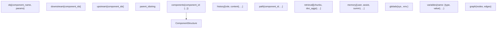
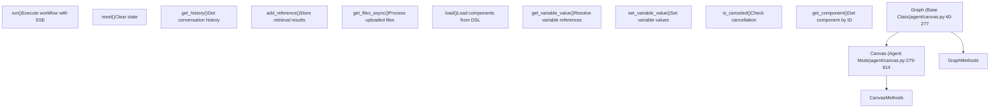
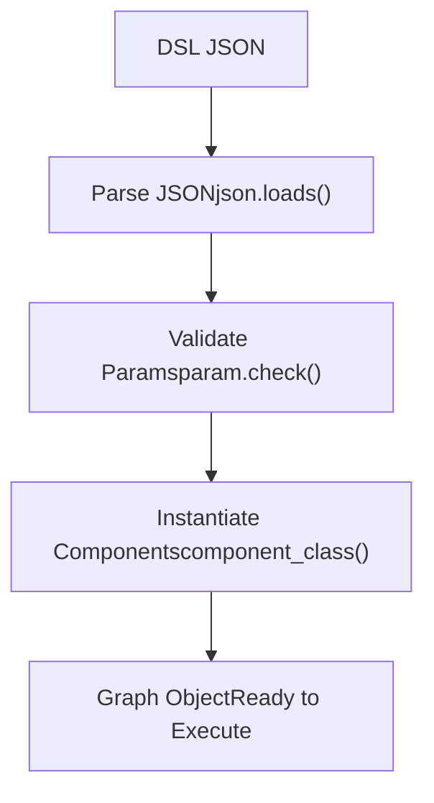
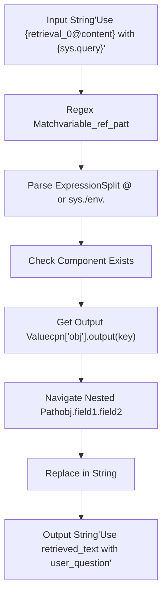
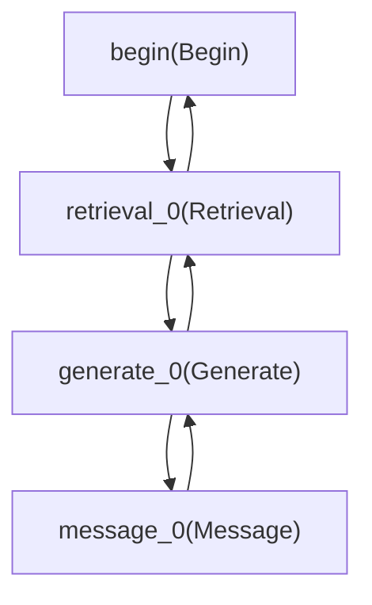
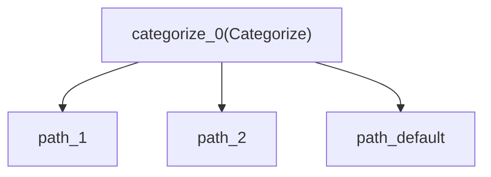
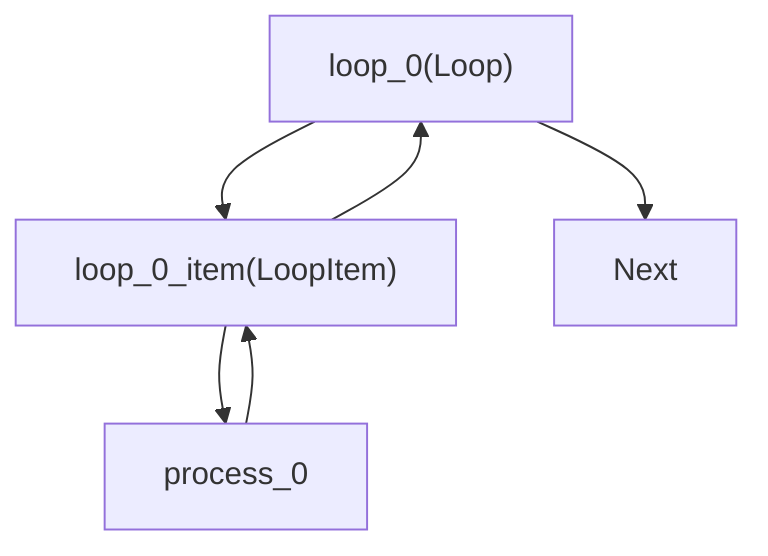

# Canvas Engine and DSL

Relevant source files

-   [agent/canvas.py](https://github.com/infiniflow/ragflow/blob/80a16e71/agent/canvas.py)
-   [agent/component/agent\_with\_tools.py](https://github.com/infiniflow/ragflow/blob/80a16e71/agent/component/agent_with_tools.py)
-   [agent/component/base.py](https://github.com/infiniflow/ragflow/blob/80a16e71/agent/component/base.py)
-   [agent/component/categorize.py](https://github.com/infiniflow/ragflow/blob/80a16e71/agent/component/categorize.py)
-   [agent/component/llm.py](https://github.com/infiniflow/ragflow/blob/80a16e71/agent/component/llm.py)
-   [agent/tools/base.py](https://github.com/infiniflow/ragflow/blob/80a16e71/agent/tools/base.py)
-   [api/apps/api\_app.py](https://github.com/infiniflow/ragflow/blob/80a16e71/api/apps/api_app.py)
-   [api/apps/canvas\_app.py](https://github.com/infiniflow/ragflow/blob/80a16e71/api/apps/canvas_app.py)
-   [rag/prompts/generator.py](https://github.com/infiniflow/ragflow/blob/80a16e71/rag/prompts/generator.py)
-   [web/src/components/knowledge-base-item.tsx](https://github.com/infiniflow/ragflow/blob/80a16e71/web/src/components/knowledge-base-item.tsx)
-   [web/src/interfaces/request/flow.ts](https://github.com/infiniflow/ragflow/blob/80a16e71/web/src/interfaces/request/flow.ts)

This document describes the Canvas workflow engine and its JSON-based Domain-Specific Language (DSL). The Canvas engine orchestrates multi-step AI agent workflows by executing components defined in a directed graph structure.

For component implementation details, see [Component System Architecture](/infiniflow/ragflow/9.2-component-system-architecture). For built-in components, see [Built-in Components](/infiniflow/ragflow/9.3-built-in-components). For execution details and streaming, see [Workflow Execution and Streaming](/infiniflow/ragflow/9.4-workflow-execution-and-streaming). For variable management, see [State and Variable Management](/infiniflow/ragflow/9.5-state-and-variable-management). For Canvas APIs, see [Canvas API and Management](/infiniflow/ragflow/9.6-agent-tools-and-react-loop). For the frontend workflow editor, see [Agent Canvas UI](/infiniflow/ragflow/9.7-canvas-api-and-management).

## Overview

The Canvas engine enables users to build complex AI workflows by connecting components in a graph structure. Each workflow is defined as a JSON DSL document that specifies:

-   Components and their configurations
-   Execution flow between components
-   Global variables and state
-   Conversation history and retrieval results

The engine supports two modes:

1.  **Agent Mode** (`Canvas` class): Interactive conversational workflows with history tracking
2.  **DataFlow Mode** (`Graph` class base): Document processing pipelines

Sources: [agent/canvas.py1-814](https://github.com/infiniflow/ragflow/blob/80a16e71/agent/canvas.py#L1-L814)

## DSL Structure

### Complete DSL Schema

The DSL is a JSON object with the following top-level structure:

```
{
  "components": {},
  "history": [],
  "path": [],
  "retrieval": {},
  "memory": [],
  "globals": {},
  "variables": {},
  "graph": {}
}
```
#### DSL Structure Diagram


Sources: [agent/canvas.py42-78](https://github.com/infiniflow/ragflow/blob/80a16e71/agent/canvas.py#L42-L78)

### Components Field

The `components` field is a dictionary mapping component IDs to component definitions:

```
{
  "components": {
    "begin": {
      "obj": {
        "component_name": "Begin",
        "params": {
          "prologue": "How can I help you?",
          "mode": "Dialog",
          "inputs": {}
        }
      },
      "downstream": ["retrieval_0"],
      "upstream": []
    },
    "retrieval_0": {
      "obj": {
        "component_name": "Retrieval",
        "params": {
          "kb_ids": ["kb123"],
          "similarity_threshold": 0.2,
          "top_n": 6
        }
      },
      "downstream": ["generate_0"],
      "upstream": ["begin"]
    },
    "generate_0": {
      "obj": {
        "component_name": "Generate",
        "params": {
          "llm_id": "model123",
          "temperature": 0.1,
          "cite": true
        }
      },
      "downstream": ["answer_0"],
      "upstream": ["retrieval_0"]
    }
  }
}
```
**Field Descriptions:**

| Field | Type | Description |
| --- | --- | --- |
| `obj.component_name` | string | Component type identifier (e.g., "Begin", "Retrieval", "Generate") |
| `obj.params` | object | Component-specific configuration parameters |
| `downstream` | string\[\] | List of component IDs to execute after this component |
| `upstream` | string\[\] | List of component IDs that execute before this component |
| `parent_id` | string (optional) | Parent component ID for nested components (Loop/Iteration items) |

Sources: [agent/canvas.py42-68](https://github.com/infiniflow/ragflow/blob/80a16e71/agent/canvas.py#L42-L68) [agent/canvas.py91-105](https://github.com/infiniflow/ragflow/blob/80a16e71/agent/canvas.py#L91-L105)

### State Fields

#### History Field

Stores conversation turns as a list of tuples:

```
{
  "history": [
    ["user", "What is RAGFlow?"],
    ["assistant", {"content": "RAGFlow is...", "attachment": {}}]
  ]
}
```
Sources: [agent/canvas.py294](https://github.com/infiniflow/ragflow/blob/80a16e71/agent/canvas.py#L294-L294) [agent/canvas.py705-714](https://github.com/infiniflow/ragflow/blob/80a16e71/agent/canvas.py#L705-L714)

#### Path Field

Records the execution path as an ordered list of component IDs:

```
{
  "path": ["begin", "retrieval_0", "generate_0", "answer_0"]
}
```
The path is built dynamically during execution and determines which components have already run.

Sources: [agent/canvas.py70](https://github.com/infiniflow/ragflow/blob/80a16e71/agent/canvas.py#L70-L70) [agent/canvas.py105](https://github.com/infiniflow/ragflow/blob/80a16e71/agent/canvas.py#L105-L105)

#### Retrieval Field

Stores retrieved document chunks and aggregations for each execution round:

```
{
  "retrieval": [
    {
      "chunks": {
        "123": {"content": "...", "doc_id": "doc1"},
        "456": {"content": "...", "doc_id": "doc2"}
      },
      "doc_aggs": {
        "document1.pdf": {"doc_name": "document1.pdf", "doc_id": "doc1"}
      }
    }
  ]
}
```
Sources: [agent/canvas.py71](https://github.com/infiniflow/ragflow/blob/80a16e71/agent/canvas.py#L71-L71) [agent/canvas.py309](https://github.com/infiniflow/ragflow/blob/80a16e71/agent/canvas.py#L309-L309) [agent/canvas.py786-804](https://github.com/infiniflow/ragflow/blob/80a16e71/agent/canvas.py#L786-L804)

#### Memory Field

Long-term memory storage for multi-turn conversations:

```
{
  "memory": [
    ["user question", "assistant response", "summary"]
  ]
}
```
Sources: [agent/canvas.py310](https://github.com/infiniflow/ragflow/blob/80a16e71/agent/canvas.py#L310-L310) [agent/canvas.py806-810](https://github.com/infiniflow/ragflow/blob/80a16e71/agent/canvas.py#L806-L810)

### Globals Field

System and environment variables accessible throughout the workflow:

```
{
  "globals": {
    "sys.query": "What is RAGFlow?",
    "sys.user_id": "tenant123",
    "sys.conversation_turns": 3,
    "sys.files": [],
    "env.api_key": "sk-xxx",
    "env.custom_var": "value"
  }
}
```
**System Variables** (`sys.*`):

-   `sys.query`: Current user query
-   `sys.user_id`: Tenant/user identifier
-   `sys.conversation_turns`: Number of conversation rounds
-   `sys.files`: Uploaded files (images, documents)

**Environment Variables** (`env.*`): User-defined variables that persist across workflow executions.

Sources: [agent/canvas.py72-77](https://github.com/infiniflow/ragflow/blob/80a16e71/agent/canvas.py#L72-L77) [agent/canvas.py282-287](https://github.com/infiniflow/ragflow/blob/80a16e71/agent/canvas.py#L282-L287) [agent/canvas.py295-307](https://github.com/infiniflow/ragflow/blob/80a16e71/agent/canvas.py#L295-L307)

### Variables Field

Variable definitions with type information:

```
{
  "variables": {
    "api_endpoint": {
      "type": "string",
      "value": "https://api.example.com"
    },
    "max_retries": {
      "type": "number",
      "value": 3
    },
    "enabled": {
      "type": "boolean",
      "value": true
    }
  }
}
```
Sources: [agent/canvas.py304-307](https://github.com/infiniflow/ragflow/blob/80a16e71/agent/canvas.py#L304-L307) [agent/canvas.py339-359](https://github.com/infiniflow/ragflow/blob/80a16e71/agent/canvas.py#L339-L359)

### Graph Field

Frontend visualization metadata (nodes and edges for ReactFlow):

```
{
  "graph": {
    "nodes": [
      {
        "id": "begin",
        "type": "beginNode",
        "data": {"name": "Start", "params": {}},
        "position": {"x": 100, "y": 100}
      }
    ],
    "edges": [
      {
        "id": "e1",
        "source": "begin",
        "target": "retrieval_0"
      }
    ]
  }
}
```
This field is used by the frontend canvas editor and not directly by the execution engine.

Sources: [agent/canvas.py139-142](https://github.com/infiniflow/ragflow/blob/80a16e71/agent/canvas.py#L139-L142)

## Graph and Canvas Classes

### Class Hierarchy


Sources: [agent/canvas.py40-277](https://github.com/infiniflow/ragflow/blob/80a16e71/agent/canvas.py#L40-L277) [agent/canvas.py279-814](https://github.com/infiniflow/ragflow/blob/80a16e71/agent/canvas.py#L279-L814)

### Graph Class

The `Graph` class provides the base workflow orchestration functionality:

**Constructor:**

```
def __init__(self, dsl: str, tenant_id=None, task_id=None)
```
**Key Attributes:**

-   `self.components`: Dictionary of component instances
-   `self.path`: Execution path (list of component IDs)
-   `self.dsl`: Parsed DSL dictionary
-   `self.task_id`: Unique task identifier
-   `self._tenant_id`: Tenant identifier
-   `self._thread_pool`: ThreadPoolExecutor for parallel execution

**Core Methods:**

| Method | Description |
| --- | --- |
| `load()` | Parse DSL, instantiate components, validate parameters |
| `get_component(cpn_id)` | Get component dictionary by ID |
| `get_component_obj(cpn_id)` | Get ComponentBase instance by ID |
| `get_variable_value(exp)` | Resolve variable expressions like `{cpn_id@output}` |
| `set_variable_value(exp, value)` | Set variable values |
| `is_canceled()` | Check if task has been canceled via Redis |
| `cancel_task()` | Mark task as canceled |

Sources: [agent/canvas.py40-277](https://github.com/infiniflow/ragflow/blob/80a16e71/agent/canvas.py#L40-L277)

### Canvas Class

The `Canvas` class extends `Graph` for conversational agent workflows:

**Constructor:**

```
def __init__(self, dsl: str, tenant_id=None, task_id=None, canvas_id=None)
```
**Additional State:**

-   `self.globals`: System and environment variables
-   `self.variables`: Variable definitions
-   `self.history`: Conversation history
-   `self.retrieval`: Retrieved chunks per round
-   `self.memory`: Long-term memory
-   `self.message_id`: Current message identifier
-   `self._id`: Canvas identifier

**Key Methods:**

| Method | Description |
| --- | --- |
| `run(**kwargs)` | Execute workflow, yielding SSE events |
| `reset(mem=False)` | Clear state, optionally preserve memory |
| `get_history(window_size)` | Get last N conversation turns |
| `add_user_input(question)` | Append user message to history |
| `add_reference(chunks, doc_infos)` | Store retrieval results |
| `get_files_async(files)` | Process uploaded files (images, documents) |
| `tool_use_callback(...)` | Log tool invocations |

Sources: [agent/canvas.py279-814](https://github.com/infiniflow/ragflow/blob/80a16e71/agent/canvas.py#L279-L814)

## Component Loading and Instantiation

### Component Loading Process


The `load()` method performs component instantiation:

1.  **Parse Components:** Iterate through `dsl["components"]` dictionary
2.  **Get Parameter Class:** Use `component_class(component_name + "Param")`
3.  **Update Parameters:** Call `param.update(cpn["obj"]["params"])`
4.  **Validate:** Call `param.check()` to validate configuration
5.  **Instantiate Component:** Use `component_class(component_name)(canvas, id, param)`
6.  **Store Instance:** Replace `cpn["obj"]` with the instantiated component

Sources: [agent/canvas.py91-105](https://github.com/infiniflow/ragflow/blob/80a16e71/agent/canvas.py#L91-L105)

```
# Example from canvas.py
def load(self):
    self.components = self.dsl["components"]
    for k, cpn in self.components.items():
        # Get parameter class
        param = component_class(cpn["obj"]["component_name"] + "Param")()
        # Update with DSL params
        param.update(cpn["obj"]["params"])
        # Validate
        try:
            param.check()
        except Exception as e:
            raise ValueError(self.get_component_name(k) + f": {e}")
        # Instantiate component
        cpn["obj"] = component_class(cpn["obj"]["component_name"])(self, k, param)
```
Sources: [agent/canvas.py91-105](https://github.com/infiniflow/ragflow/blob/80a16e71/agent/canvas.py#L91-L105)

## Variable Reference Syntax

Variables in the DSL use a special syntax for referencing component outputs and global variables:

### Variable Expression Format

| Pattern | Description | Example |
| --- | --- | --- |
| `{component_id@output_name}` | Component output | `{retrieval_0@content}` |
| `{sys.variable_name}` | System variable | `{sys.query}` |
| `{env.variable_name}` | Environment variable | `{env.api_key}` |
| `{component_id@output.field}` | Nested field access | `{retrieval_0@result.score}` |
| `{component_id@output.0}` | Array index | `{retrieval_0@chunks.0}` |

### Variable Resolution Process


Sources: [agent/canvas.py162-233](https://github.com/infiniflow/ragflow/blob/80a16e71/agent/canvas.py#L162-L233)

### Variable Resolution Implementation

The `get_variable_value()` method resolves variable expressions:

```
def get_variable_value(self, exp: str) -> Any:
    exp = exp.strip("{").strip("}").strip(" ")

    # Global variable (sys.* or env.*)
    if exp.find("@") < 0:
        return self.globals[exp]

    # Component output
    cpn_id, var_nm = exp.split("@")
    cpn = self.get_component(cpn_id)
    if not cpn:
        raise Exception(f"Can't find variable: '{cpn_id}@{var_nm}'")

    # Handle nested paths (e.g., output.field.subfield)
    parts = var_nm.split(".", 1)
    root_key = parts[0]
    rest = parts[1] if len(parts) > 1 else ""
    root_val = cpn["obj"].output(root_key)

    if not rest:
        return root_val
    return self.get_variable_param_value(root_val, rest)
```
Sources: [agent/canvas.py189-233](https://github.com/infiniflow/ragflow/blob/80a16e71/agent/canvas.py#L189-L233)

### Variable Substitution in Strings

The `get_value_with_variable()` method substitutes variables in strings:

```
def get_value_with_variable(self, value: str) -> Any:
    pat = re.compile(r"\{* *\{([a-zA-Z:0-9]+@[A-Za-z0-9_.-]+|sys\.[A-Za-z0-9_.]+|env\.[A-Za-z0-9_.]+)\} *\}*")
    out_parts = []
    last = 0

    for m in pat.finditer(value):
        out_parts.append(value[last:m.start()])
        key = m.group(1)
        v = self.get_variable_value(key)

        # Handle different value types
        if v is None:
            rep = ""
        elif isinstance(v, partial):
            # Stream chunks
            buf = []
            for chunk in v():
                buf.append(chunk)
            rep = "".join(buf)
        elif isinstance(v, str):
            rep = v
        else:
            rep = json.dumps(v, ensure_ascii=False)

        out_parts.append(rep)
        last = m.end()

    out_parts.append(value[last:])
    return "".join(out_parts)
```
Sources: [agent/canvas.py162-187](https://github.com/infiniflow/ragflow/blob/80a16e71/agent/canvas.py#L162-L187)

## Component Graph Structure

### Execution Flow Definition

Components are connected through `downstream` and `upstream` arrays:


**Example DSL:**

```
{
  "components": {
    "begin": {
      "downstream": ["retrieval_0"],
      "upstream": []
    },
    "retrieval_0": {
      "downstream": ["generate_0"],
      "upstream": ["begin"]
    },
    "generate_0": {
      "downstream": ["message_0"],
      "upstream": ["retrieval_0"]
    },
    "message_0": {
      "downstream": [],
      "upstream": ["generate_0"]
    }
  }
}
```
Sources: [agent/canvas.py42-68](https://github.com/infiniflow/ragflow/blob/80a16e71/agent/canvas.py#L42-L68)

### Control Flow Components

Special components modify the execution path:

#### Switch/Categorize

Conditional branching based on LLM classification:


The component sets `_next` output to determine which downstream components execute.

Sources: [agent/canvas.py600-601](https://github.com/infiniflow/ragflow/blob/80a16e71/agent/canvas.py#L600-L601) [agent/component/categorize.py1-164](https://github.com/infiniflow/ragflow/blob/80a16e71/agent/component/categorize.py#L1-L164)

#### Loop/Iteration

Repeat execution over items:


Loop components have nested item components with `parent_id` references.

Sources: [agent/canvas.py596-609](https://github.com/infiniflow/ragflow/blob/80a16e71/agent/canvas.py#L596-L609)

### Nested Components

Loop and Iteration components have child item components:

```
{
  "loop_0": {
    "obj": {"component_name": "Loop", "params": {"items": [1,2,3]}},
    "downstream": ["next_0"]
  },
  "loop_0_item": {
    "obj": {"component_name": "LoopItem", "params": {}},
    "parent_id": "loop_0",
    "downstream": ["process_0"]
  },
  "process_0": {
    "parent_id": "loop_0",
    "downstream": []
  }
}
```
Sources: [agent/canvas.py596-609](https://github.com/infiniflow/ragflow/blob/80a16e71/agent/canvas.py#L596-L609)

## DSL Serialization

### Converting Graph to DSL

The `__str__()` method serializes the Graph back to JSON:

```
def __str__(self):
    self.dsl["path"] = self.path
    self.dsl["task_id"] = self.task_id
    dsl = {"components": {}}

    # Copy non-component fields
    for k in self.dsl.keys():
        if k in ["components"]:
            continue
        dsl[k] = deepcopy(self.dsl[k])

    # Serialize components
    for k, cpn in self.components.items():
        if k not in dsl["components"]:
            dsl["components"][k] = {}
        for c in cpn.keys():
            if c == "obj":
                # Serialize component to JSON
                dsl["components"][k][c] = json.loads(str(cpn["obj"]))
                continue
            dsl["components"][k][c] = deepcopy(cpn[c])

    return json.dumps(dsl, ensure_ascii=False)
```
Sources: [agent/canvas.py107-126](https://github.com/infiniflow/ragflow/blob/80a16e71/agent/canvas.py#L107-L126)

### Canvas-Specific Serialization

The Canvas class adds history, retrieval, and memory:

```
def __str__(self):
    self.dsl["history"] = self.history
    self.dsl["retrieval"] = self.retrieval
    self.dsl["memory"] = self.memory
    return super().__str__()
```
Sources: [agent/canvas.py312-316](https://github.com/infiniflow/ragflow/blob/80a16e71/agent/canvas.py#L312-L316)

## Task Management

### Task Identification

Each workflow execution has a unique task ID:

```
def __init__(self, dsl: str, tenant_id=None, task_id=None):
    # ...
    self.task_id = task_id if task_id else get_uuid()
```
The task ID is used for:

-   Cancellation via Redis: `{task_id}-cancel`
-   Logging: `{task_id}-{message_id}-logs`
-   Progress tracking

Sources: [agent/canvas.py81-88](https://github.com/infiniflow/ragflow/blob/80a16e71/agent/canvas.py#L81-L88)

### Cancellation Mechanism

Tasks can be canceled through Redis:

```
def is_canceled(self) -> bool:
    return has_canceled(self.task_id)

def cancel_task(self) -> bool:
    try:
        REDIS_CONN.set(f"{self.task_id}-cancel", "x")
    except Exception as e:
        logging.exception(e)
        return False
    return True
```
The execution loop checks cancellation status before each batch and raises `TaskCanceledException` if canceled.

Sources: [agent/canvas.py267-276](https://github.com/infiniflow/ragflow/blob/80a16e71/agent/canvas.py#L267-L276) [agent/canvas.py406-409](https://github.com/infiniflow/ragflow/blob/80a16e71/agent/canvas.py#L406-L409)

## State Management

### State Reset

The `reset()` method clears execution state:

**Graph Reset:**

```
def reset(self):
    self.path = []
    for k, cpn in self.components.items():
        self.components[k]["obj"].reset()
    try:
        REDIS_CONN.delete(f"{self.task_id}-logs")
        REDIS_CONN.delete(f"{self.task_id}-cancel")
    except Exception as e:
        logging.exception(e)
```
**Canvas Reset:**

```
def reset(self, mem=False):
    super().reset()
    if not mem:
        self.history = []
        self.retrieval = []
        self.memory = []

    # Reset system variables
    for k in self.globals.keys():
        if k.startswith("sys."):
            if isinstance(self.globals[k], str):
                self.globals[k] = ""
            elif isinstance(self.globals[k], int):
                self.globals[k] = 0
            # ... other types

        # Reset environment variables from definitions
        if k.startswith("env."):
            key = k[4:]
            if key in self.variables:
                variable = self.variables[key]
                self.globals[k] = variable["value"] or default_value
```
Sources: [agent/canvas.py128-136](https://github.com/infiniflow/ragflow/blob/80a16e71/agent/canvas.py#L128-L136) [agent/canvas.py318-360](https://github.com/infiniflow/ragflow/blob/80a16e71/agent/canvas.py#L318-L360)

## Integration with Components

### Component Interface

Components access the Canvas through their `_canvas` attribute:

```
class ComponentBase(ABC):
    def __init__(self, canvas, id, param: ComponentParamBase):
        from agent.canvas import Graph
        assert isinstance(canvas, Graph), "canvas must be an instance of Canvas"
        self._canvas = canvas
        self._id = id
        self._param = param
```
Components can:

-   Get variable values: `self._canvas.get_variable_value("{cpn_id@output}")`
-   Set outputs: `self.set_output(key, value)`
-   Access history: `self._canvas.get_history(window_size)`
-   Add references: `self._canvas.add_reference(chunks, doc_infos)`

Sources: [agent/component/base.py380-386](https://github.com/infiniflow/ragflow/blob/80a16e71/agent/component/base.py#L380-L386)

### Input Resolution

Components use `get_input_elements_from_text()` to find variable references in their parameters:

```
def get_input_elements_from_text(self, txt: str) -> dict[str, dict[str, str]]:
    res = {}
    for r in re.finditer(self.variable_ref_patt, txt, flags=re.IGNORECASE | re.DOTALL):
        exp = r.group(1)
        cpn_id, var_nm = exp.split("@") if exp.find("@") > 0 else ("", exp)
        res[exp] = {
            "name": (self._canvas.get_component_name(cpn_id) + f"@{var_nm}") if cpn_id else exp,
            "value": self._canvas.get_variable_value(exp),
            "_retrieval": self._canvas.get_variable_value(f"{cpn_id}@_references") if cpn_id else None,
            "_cpn_id": cpn_id
        }
    return res
```
Sources: [agent/component/base.py495-506](https://github.com/infiniflow/ragflow/blob/80a16e71/agent/component/base.py#L495-L506)

## Example Workflow DSL

### Simple RAG Workflow

```
{
  "components": {
    "begin": {
      "obj": {
        "component_name": "Begin",
        "params": {
          "prologue": "How can I help you today?",
          "mode": "Dialog"
        }
      },
      "downstream": ["retrieval_0"],
      "upstream": []
    },
    "retrieval_0": {
      "obj": {
        "component_name": "Retrieval",
        "params": {
          "kb_ids": ["kb_abc123"],
          "similarity_threshold": 0.2,
          "top_n": 6,
          "query": "{sys.query}"
        }
      },
      "downstream": ["generate_0"],
      "upstream": ["begin"]
    },
    "generate_0": {
      "obj": {
        "component_name": "Generate",
        "params": {
          "llm_id": "gpt-4",
          "temperature": 0.1,
          "prompt": "Based on these documents:\n{retrieval_0@content}\n\nAnswer: {sys.query}",
          "cite": true
        }
      },
      "downstream": ["message_0"],
      "upstream": ["retrieval_0"]
    },
    "message_0": {
      "obj": {
        "component_name": "Message",
        "params": {
          "content": "{generate_0@content}"
        }
      },
      "downstream": [],
      "upstream": ["generate_0"]
    }
  },
  "history": [],
  "path": ["begin"],
  "retrieval": [{"chunks": {}, "doc_aggs": {}}],
  "globals": {
    "sys.query": "",
    "sys.user_id": "tenant_123",
    "sys.conversation_turns": 0,
    "sys.files": []
  }
}
```
### Conditional Workflow with Categorize

```
{
  "components": {
    "begin": {
      "obj": {"component_name": "Begin", "params": {}},
      "downstream": ["categorize_0"],
      "upstream": []
    },
    "categorize_0": {
      "obj": {
        "component_name": "Categorize",
        "params": {
          "query": "{sys.query}",
          "category_description": {
            "Technical": {
              "description": "Technical questions about the system",
              "examples": ["How do I deploy?", "What's the API?"],
              "to": ["retrieval_tech"]
            },
            "General": {
              "description": "General questions",
              "examples": ["What is this?"],
              "to": ["retrieval_general"]
            }
          }
        }
      },
      "downstream": [],
      "upstream": ["begin"]
    },
    "retrieval_tech": {
      "obj": {
        "component_name": "Retrieval",
        "params": {"kb_ids": ["kb_technical"]}
      },
      "downstream": ["generate_0"],
      "upstream": []
    },
    "retrieval_general": {
      "obj": {
        "component_name": "Retrieval",
        "params": {"kb_ids": ["kb_general"]}
      },
      "downstream": ["generate_0"],
      "upstream": []
    },
    "generate_0": {
      "obj": {"component_name": "Generate", "params": {}},
      "downstream": ["message_0"],
      "upstream": []
    }
  }
}
```
Sources: [agent/canvas.py42-78](https://github.com/infiniflow/ragflow/blob/80a16e71/agent/canvas.py#L42-L78) [agent/component/categorize.py29-95](https://github.com/infiniflow/ragflow/blob/80a16e71/agent/component/categorize.py#L29-L95)

## API Integration

### Canvas Completion Endpoint

The Canvas API receives requests and instantiates the Canvas:

```
@manager.route('/completion', methods=['POST'])
@validate_request("id")
@login_required
async def run():
    req = await get_request_json()
    query = req.get("query", "")
    files = req.get("files", [])
    inputs = req.get("inputs", {})

    e, cvs = await asyncio.to_thread(UserCanvasService.get_by_id, req["id"])
    if not isinstance(cvs.dsl, str):
        cvs.dsl = json.dumps(cvs.dsl, ensure_ascii=False)

    try:
        canvas = Canvas(cvs.dsl, current_user.id, canvas_id=cvs.id)
    except Exception as e:
        return server_error_response(e)

    async def sse():
        try:
            async for ans in canvas.run(query=query, files=files, user_id=user_id, inputs=inputs):
                yield "data:" + json.dumps(ans, ensure_ascii=False) + "\n\n"

            cvs.dsl = json.loads(str(canvas))
            UserCanvasService.update_by_id(req["id"], cvs.to_dict())
        except Exception as e:
            logging.exception(e)
            canvas.cancel_task()
            yield "data:" + json.dumps({"code": 500, "message": str(e)}, ensure_ascii=False) + "\n\n"

    resp = Response(sse(), mimetype="text/event-stream")
    return resp
```
Sources: [api/apps/canvas\_app.py126-180](https://github.com/infiniflow/ragflow/blob/80a16e71/api/apps/canvas_app.py#L126-L180)

### Saving Canvas DSL

```
@manager.route('/set', methods=['POST'])
@validate_request("dsl", "title")
@login_required
async def save():
    req = await get_request_json()
    if not isinstance(req["dsl"], str):
        req["dsl"] = json.dumps(req["dsl"], ensure_ascii=False)
    req["dsl"] = json.loads(req["dsl"])

    if "id" not in req:
        req["id"] = get_uuid()
        if not UserCanvasService.save(**req):
            return get_data_error_result(message="Fail to save canvas.")
    else:
        UserCanvasService.update_by_id(req["id"], req)

    return get_json_result(data=req)
```
Sources: [api/apps/canvas\_app.py67-92](https://github.com/infiniflow/ragflow/blob/80a16e71/api/apps/canvas_app.py#L67-L92)

## Summary

The Canvas Engine and DSL provide:

1.  **Flexible Workflow Definition**: JSON-based DSL describes component graphs with parameters
2.  **Variable System**: Reference component outputs and global variables using `{expr}` syntax
3.  **Execution Orchestration**: Graph traversal with dynamic path building and control flow
4.  **State Management**: History, retrieval results, memory, and variables
5.  **Task Control**: Cancellation, logging, and progress tracking via Redis
6.  **Component Integration**: Components access Canvas through well-defined interfaces

The DSL separates workflow definition from execution, enabling:

-   Visual workflow editors (ReactFlow-based UI)
-   Workflow templates and versioning
-   API-driven workflow creation and execution
-   State persistence across executions

For execution details, see [Workflow Execution and Streaming](/infiniflow/ragflow/9.4-workflow-execution-and-streaming). For variable resolution details, see [State and Variable Management](/infiniflow/ragflow/9.5-state-and-variable-management).

Sources: [agent/canvas.py1-814](https://github.com/infiniflow/ragflow/blob/80a16e71/agent/canvas.py#L1-L814) [api/apps/canvas\_app.py1-559](https://github.com/infiniflow/ragflow/blob/80a16e71/api/apps/canvas_app.py#L1-L559) [agent/component/base.py361-580](https://github.com/infiniflow/ragflow/blob/80a16e71/agent/component/base.py#L361-L580)
