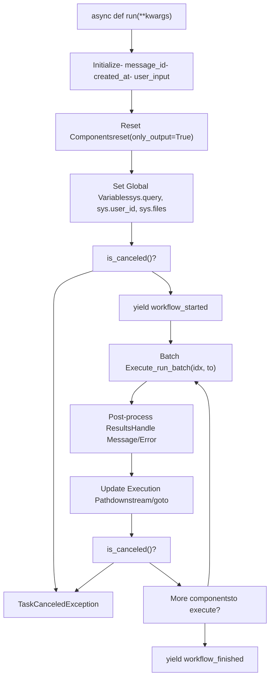
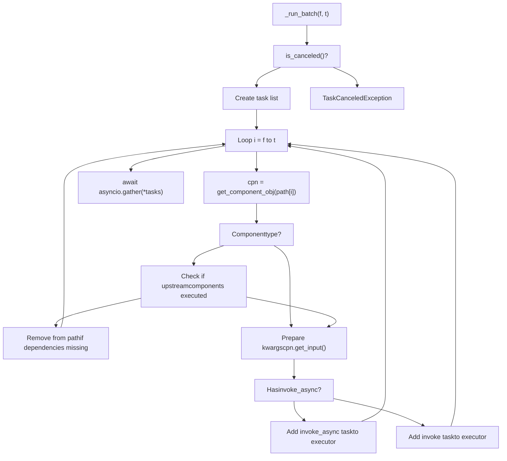
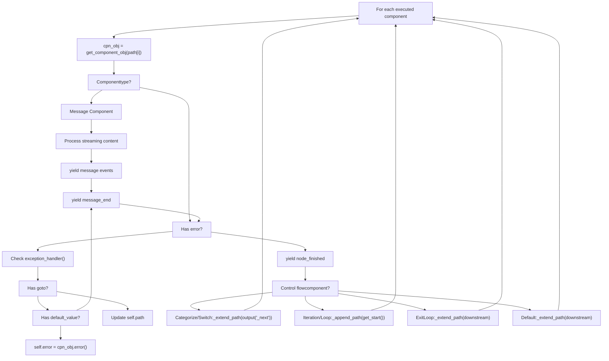
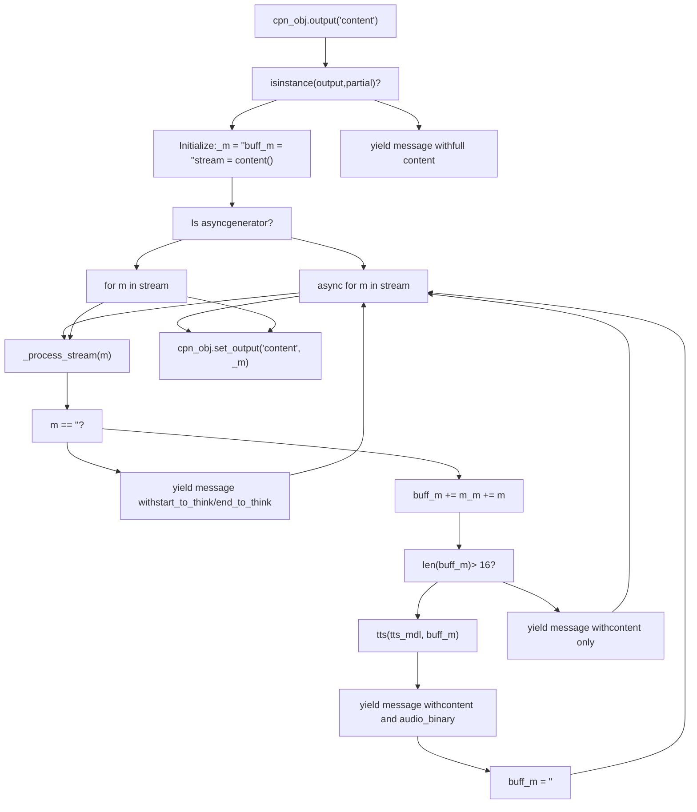
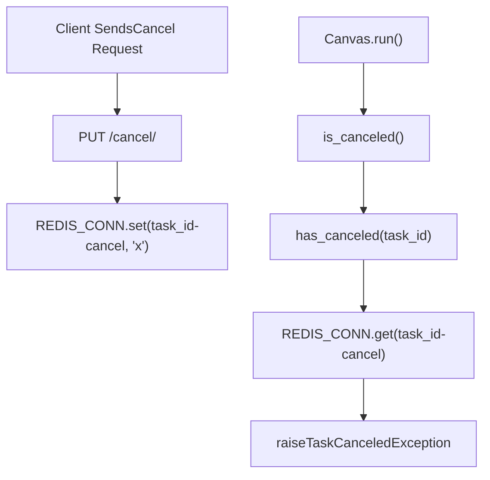
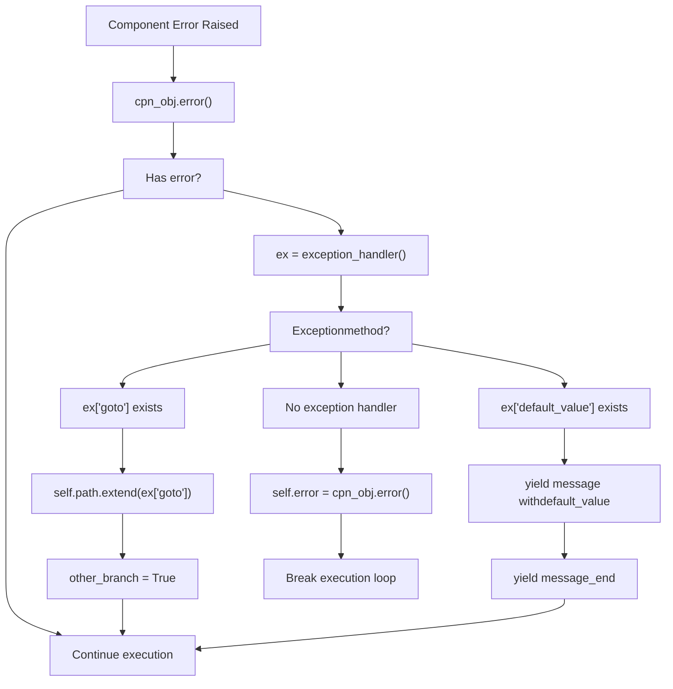
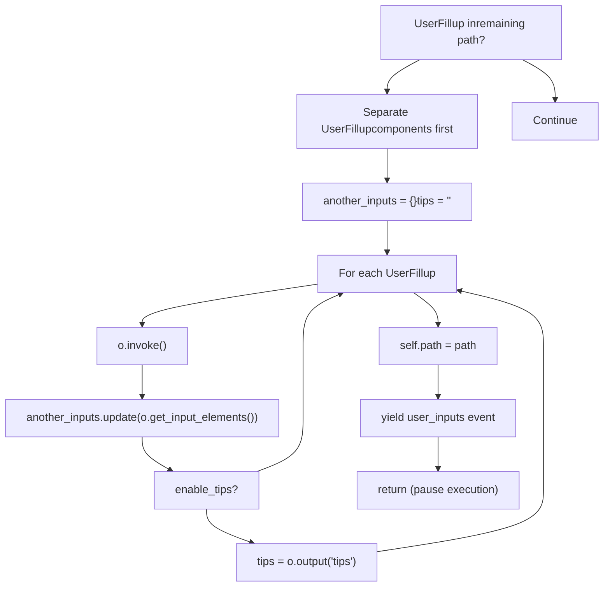

# Workflow Execution and Streaming

Relevant source files

-   [agent/canvas.py](https://github.com/infiniflow/ragflow/blob/80a16e71/agent/canvas.py)
-   [agent/component/agent\_with\_tools.py](https://github.com/infiniflow/ragflow/blob/80a16e71/agent/component/agent_with_tools.py)
-   [agent/component/base.py](https://github.com/infiniflow/ragflow/blob/80a16e71/agent/component/base.py)
-   [agent/component/categorize.py](https://github.com/infiniflow/ragflow/blob/80a16e71/agent/component/categorize.py)
-   [agent/component/llm.py](https://github.com/infiniflow/ragflow/blob/80a16e71/agent/component/llm.py)
-   [agent/tools/base.py](https://github.com/infiniflow/ragflow/blob/80a16e71/agent/tools/base.py)
-   [agent/tools/retrieval.py](https://github.com/infiniflow/ragflow/blob/80a16e71/agent/tools/retrieval.py)
-   [api/apps/api\_app.py](https://github.com/infiniflow/ragflow/blob/80a16e71/api/apps/api_app.py)
-   [api/apps/canvas\_app.py](https://github.com/infiniflow/ragflow/blob/80a16e71/api/apps/canvas_app.py)
-   [api/apps/sdk/chat.py](https://github.com/infiniflow/ragflow/blob/80a16e71/api/apps/sdk/chat.py)
-   [api/apps/sdk/dataset.py](https://github.com/infiniflow/ragflow/blob/80a16e71/api/apps/sdk/dataset.py)
-   [api/apps/sdk/dify\_retrieval.py](https://github.com/infiniflow/ragflow/blob/80a16e71/api/apps/sdk/dify_retrieval.py)
-   [api/apps/sdk/doc.py](https://github.com/infiniflow/ragflow/blob/80a16e71/api/apps/sdk/doc.py)
-   [api/apps/sdk/session.py](https://github.com/infiniflow/ragflow/blob/80a16e71/api/apps/sdk/session.py)
-   [api/db/services/canvas\_service.py](https://github.com/infiniflow/ragflow/blob/80a16e71/api/db/services/canvas_service.py)
-   [api/db/services/conversation\_service.py](https://github.com/infiniflow/ragflow/blob/80a16e71/api/db/services/conversation_service.py)
-   [api/utils/api\_utils.py](https://github.com/infiniflow/ragflow/blob/80a16e71/api/utils/api_utils.py)
-   [docs/references/http\_api\_reference.md](https://github.com/infiniflow/ragflow/blob/80a16e71/docs/references/http_api_reference.md)
-   [docs/references/python\_api\_reference.md](https://github.com/infiniflow/ragflow/blob/80a16e71/docs/references/python_api_reference.md)
-   [docs/release\_notes.md](https://github.com/infiniflow/ragflow/blob/80a16e71/docs/release_notes.md)
-   [rag/advanced\_rag/\_\_init\_\_.py](https://github.com/infiniflow/ragflow/blob/80a16e71/rag/advanced_rag/__init__.py)
-   [rag/benchmark.py](https://github.com/infiniflow/ragflow/blob/80a16e71/rag/benchmark.py)
-   [rag/prompts/generator.py](https://github.com/infiniflow/ragflow/blob/80a16e71/rag/prompts/generator.py)
-   [sdk/python/ragflow\_sdk/modules/chat.py](https://github.com/infiniflow/ragflow/blob/80a16e71/sdk/python/ragflow_sdk/modules/chat.py)
-   [sdk/python/ragflow\_sdk/ragflow.py](https://github.com/infiniflow/ragflow/blob/80a16e71/sdk/python/ragflow_sdk/ragflow.py)
-   [web/src/components/knowledge-base-item.tsx](https://github.com/infiniflow/ragflow/blob/80a16e71/web/src/components/knowledge-base-item.tsx)
-   [web/src/interfaces/request/flow.ts](https://github.com/infiniflow/ragflow/blob/80a16e71/web/src/interfaces/request/flow.ts)

This page documents the **Canvas workflow execution engine**, which orchestrates asynchronous component execution and streams real-time events via Server-Sent Events (SSE). The Canvas class implements a graph-based execution model with support for cancellation, error recovery, and dynamic path planning.

For information about the Canvas DSL structure, see [Canvas Engine and DSL](/infiniflow/ragflow/9.1-canvas-engine-and-dsl). For details on component lifecycle and base classes, see [Component System Architecture](/infiniflow/ragflow/9.2-component-system-architecture). For built-in components, see [Built-in Components](/infiniflow/ragflow/9.3-built-in-components). For state management, see [State and Variable Management](/infiniflow/ragflow/9.5-state-and-variable-management).

---

## Workflow Execution Overview

### Canvas.run() Method

The `Canvas.run()` async generator is the primary execution engine for agent workflows:

[agent/canvas.py361-640](https://github.com/infiniflow/ragflow/blob/80a16e71/agent/canvas.py#L361-L640)

**Execution model:**


**Key characteristics:**

-   **Async generator:** Yields SSE events for real-time updates
-   **Path-driven:** Executes components in `self.path` order
-   **Batch execution:** Runs independent components concurrently
-   **Error resilient:** Handles exceptions with goto or default values

**Sources:** [agent/canvas.py361-640](https://github.com/infiniflow/ragflow/blob/80a16e71/agent/canvas.py#L361-L640)

### Initialization and State Setup

Before execution begins, the Canvas initializes state variables:

[agent/canvas.py362-390](https://github.com/infiniflow/ragflow/blob/80a16e71/agent/canvas.py#L362-L390)

**Initialization steps:**

| Step | Code Location | Purpose |
| --- | --- | --- |
| Event loop | `self._loop = asyncio.get_running_loop()` | Store loop for sync file access |
| Message ID | `self.message_id = get_uuid()` | Unique ID for this execution |
| Timestamp | `created_at = int(time.time())` | Execution start time |
| User input | `self.add_user_input(kwargs.get("query"))` | Add to history |
| Component reset | `self.components[k]["obj"].reset(True)` | Clear outputs only |
| Webhook handling | Check `Begin` component mode | Set webhook payload |
| Global variables | `self.globals[f"sys.{k}"] = kwargs[k]` | Set sys.\* variables |
| Conversation turns | `self.globals["sys.conversation_turns"] += 1` | Increment counter |

**File processing:** If `sys.files` is provided, files are processed asynchronously:

[agent/canvas.py384](https://github.com/infiniflow/ragflow/blob/80a16e71/agent/canvas.py#L384-L384)

This calls `get_files_async()` which handles both image files (converted to base64) and document files (parsed):

[agent/canvas.py737-750](https://github.com/infiniflow/ragflow/blob/80a16e71/agent/canvas.py#L737-L750)

**Sources:** [agent/canvas.py362-390](https://github.com/infiniflow/ragflow/blob/80a16e71/agent/canvas.py#L362-L390) [agent/canvas.py737-750](https://github.com/infiniflow/ragflow/blob/80a16e71/agent/canvas.py#L737-L750)

---

## SSE Event Streaming

### Event Types and Structure

The Canvas yields SSE events as JSON objects with a consistent structure:

[agent/canvas.py391-400](https://github.com/infiniflow/ragflow/blob/80a16e71/agent/canvas.py#L391-L400)

**Event decorator function:**

```
def decorate(event, dt):
    return {
        "event": event,
        "message_id": self.message_id,
        "created_at": created_at,
        "task_id": self.task_id,
        "data": dt
    }
```
**Event types:**

| Event Type | Trigger | Data Fields |
| --- | --- | --- |
| `workflow_started` | Before execution begins | `inputs` |
| `node_started` | Before component execution | `component_id`, `component_name`, `component_type`, `thoughts` |
| `node_finished` | After component execution | `inputs`, `outputs`, `error`, `elapsed_time` |
| `message` | During Message component streaming | `content`, `audio_binary`, `start_to_think`, `end_to_think` |
| `message_end` | After Message component | `status`, `attachment`, `reference` |
| `workflow_finished` | After successful completion | `inputs`, `outputs`, `elapsed_time` |
| `user_inputs` | When UserFillup encountered | `inputs`, `tips` |

**Sources:** [agent/canvas.py391-400](https://github.com/infiniflow/ragflow/blob/80a16e71/agent/canvas.py#L391-L400) [agent/canvas.py411](https://github.com/infiniflow/ragflow/blob/80a16e71/agent/canvas.py#L411-L411) [agent/canvas.py478-484](https://github.com/infiniflow/ragflow/blob/80a16e71/agent/canvas.py#L478-L484) [agent/canvas.py459-469](https://github.com/infiniflow/ragflow/blob/80a16e71/agent/canvas.py#L459-L469) [agent/canvas.py633-648](https://github.com/infiniflow/ragflow/blob/80a16e71/agent/canvas.py#L633-L648)

### SSE Endpoint Implementation

The `/completion` endpoint in the Canvas API wraps the Canvas execution:

[api/apps/canvas\_app.py126-180](https://github.com/infiniflow/ragflow/blob/80a16e71/api/apps/canvas_app.py#L126-L180)

**SSE response flow:**

> **[Mermaid sequence]**
> *(图表结构无法解析)*

**Response headers:**

[api/apps/canvas\_app.py174-178](https://github.com/infiniflow/ragflow/blob/80a16e71/api/apps/canvas_app.py#L174-L178)

**Sources:** [api/apps/canvas\_app.py126-180](https://github.com/infiniflow/ragflow/blob/80a16e71/api/apps/canvas_app.py#L126-L180) [api/apps/canvas\_app.py174-178](https://github.com/infiniflow/ragflow/blob/80a16e71/api/apps/canvas_app.py#L174-L178)

---

## Async Component Execution

### Batch Execution Model

The `_run_batch()` function executes multiple components concurrently:

[agent/canvas.py414-457](https://github.com/infiniflow/ragflow/blob/80a16e71/agent/canvas.py#L414-L457)

**Batch execution diagram:**


**Key features:**

1.  **Cancellation check:** Before batch execution starts
2.  **Dependency validation:** Components with missing upstream dependencies are skipped
3.  **Async detection:** Uses `invoke_async` if available, otherwise `invoke` in thread
4.  **ThreadPoolExecutor:** Max 5 concurrent workers for sync components
5.  **Async coordination:** Uses `asyncio.gather()` to await all tasks

**Thread pool executor:**

[agent/canvas.py88](https://github.com/infiniflow/ragflow/blob/80a16e71/agent/canvas.py#L88-L88)

**Async invocation wrapper:**

[agent/canvas.py423-424](https://github.com/infiniflow/ragflow/blob/80a16e71/agent/canvas.py#L423-L424)

This wraps coroutine functions in a thread executor using `asyncio.run()`.

**Sources:** [agent/canvas.py414-457](https://github.com/infiniflow/ragflow/blob/80a16e71/agent/canvas.py#L414-L457) [agent/canvas.py88](https://github.com/infiniflow/ragflow/blob/80a16e71/agent/canvas.py#L88-L88) [agent/canvas.py423-424](https://github.com/infiniflow/ragflow/blob/80a16e71/agent/canvas.py#L423-L424)

### Component Input Resolution

Before invoking a component, the Canvas resolves variable references in inputs:

[agent/canvas.py437-445](https://github.com/infiniflow/ragflow/blob/80a16e71/agent/canvas.py#L437-L445)

**Input resolution process:**

1.  **Get input elements:** `cpn.get_input_elements()` returns dict of input variables
2.  **Check dependencies:** If input references upstream component not yet executed, skip
3.  **Resolve variables:** Call `cpn.get_input()` which:
    -   Gets parameter value via `get_param(var)`
    -   Checks if it's a variable reference with `is_reff(v)`
    -   Resolves via `get_variable_value(v)` if needed
    -   Sets resolved value with `set_input_value(var, value)`

**Variable reference detection:**

[agent/canvas.py650-659](https://github.com/infiniflow/ragflow/blob/80a16e71/agent/canvas.py#L650-L659)

This checks if expression matches the pattern `{component_id@variable}` or `{sys.*}` or `{env.*}`.

**Sources:** [agent/canvas.py437-445](https://github.com/infiniflow/ragflow/blob/80a16e71/agent/canvas.py#L437-L445) [agent/canvas.py650-659](https://github.com/infiniflow/ragflow/blob/80a16e71/agent/canvas.py#L650-L659) [agent/component/base.py473-487](https://github.com/infiniflow/ragflow/blob/80a16e71/agent/component/base.py#L473-L487)

### Post-Processing and Path Updates

After batch execution, the Canvas processes results and determines the next path:

[agent/canvas.py488-609](https://github.com/infiniflow/ragflow/blob/80a16e71/agent/canvas.py#L488-L609)

**Post-processing flow:**


**Control flow logic:**

[agent/canvas.py596-609](https://github.com/infiniflow/ragflow/blob/80a16e71/agent/canvas.py#L596-L609)

**Path update methods:**

| Component Type | Path Update Logic |
| --- | --- |
| `Categorize`, `Switch` | Extend path with `output("_next")` components |
| `Iteration`, `Loop` | Append path with `get_start()` (first child) |
| `IterationItem`, `LoopItem` | Extend with parent's downstream if iteration ended |
| `ExitLoop` | Extend with parent Loop's downstream |
| Default | Extend with component's downstream |

**Sources:** [agent/canvas.py488-609](https://github.com/infiniflow/ragflow/blob/80a16e71/agent/canvas.py#L488-L609) [agent/canvas.py596-609](https://github.com/infiniflow/ragflow/blob/80a16e71/agent/canvas.py#L596-L609) [agent/canvas.py581-594](https://github.com/infiniflow/ragflow/blob/80a16e71/agent/canvas.py#L581-L594)

---

## Message Component Streaming

### Streaming Content Processing

When a Message component outputs streaming content, the Canvas processes it chunk by chunk:

[agent/canvas.py491-550](https://github.com/infiniflow/ragflow/blob/80a16e71/agent/canvas.py#L491-L550)

**Streaming detection:**

The component's `content` output is a `functools.partial` object that yields chunks:

[agent/canvas.py494](https://github.com/infiniflow/ragflow/blob/80a16e71/agent/canvas.py#L494-L494)

**Streaming workflow:**


**TTS integration:**

If `auto_play` is enabled on the Message component, text is converted to speech:

[agent/canvas.py492-493](https://github.com/infiniflow/ragflow/blob/80a16e71/agent/canvas.py#L492-L493)

The `tts()` method handles:

-   Text cleaning (emojis, control characters, length limits)
-   LLMBundle TTS invocation
-   Binary to hex conversion for transmission

[agent/canvas.py662-703](https://github.com/infiniflow/ragflow/blob/80a16e71/agent/canvas.py#L662-L703)

**Think tags:**

Special markers \`\` indicate reasoning steps:

[agent/canvas.py502-506](https://github.com/infiniflow/ragflow/blob/80a16e71/agent/canvas.py#L502-L506)

These are sent as separate events with `start_to_think` or `end_to_think` flags.

**Sources:** [agent/canvas.py491-550](https://github.com/infiniflow/ragflow/blob/80a16e71/agent/canvas.py#L491-L550) [agent/canvas.py662-703](https://github.com/infiniflow/ragflow/blob/80a16e71/agent/canvas.py#L662-L703) [agent/canvas.py502-506](https://github.com/infiniflow/ragflow/blob/80a16e71/agent/canvas.py#L502-L506)

### Reference and Citation Handling

After a Message component completes, the Canvas adds references if citations are present:

[agent/canvas.py538-549](https://github.com/infiniflow/ragflow/blob/80a16e71/agent/canvas.py#L538-L549)

**Reference generation:**

The `get_reference()` method returns the most recent retrieval data:

[agent/canvas.py801-804](https://github.com/infiniflow/ragflow/blob/80a16e71/agent/canvas.py#L801-L804)

**Citation detection:**

[agent/canvas.py538-541](https://github.com/infiniflow/ragflow/blob/80a16e71/agent/canvas.py#L538-L541)

If the content contains citation markers like `[ID:123]`, the references are included in the `message_end` event.

**Reference storage:**

The `add_reference()` method stores chunks and document metadata:

[agent/canvas.py786-799](https://github.com/infiniflow/ragflow/blob/80a16e71/agent/canvas.py#L786-L799)

This is called by Retrieval components and maintains a history of retrievals per execution round.

**Sources:** [agent/canvas.py538-549](https://github.com/infiniflow/ragflow/blob/80a16e71/agent/canvas.py#L538-L549) [agent/canvas.py786-804](https://github.com/infiniflow/ragflow/blob/80a16e71/agent/canvas.py#L786-L804)

---

## Cancellation Mechanism

### Redis-Based Cancellation

Task cancellation is implemented using Redis key-value storage:

[agent/canvas.py267-276](https://github.com/infiniflow/ragflow/blob/80a16e71/agent/canvas.py#L267-L276)

**Cancellation workflow:**


**Cancellation check points:**

[agent/canvas.py406-409](https://github.com/infiniflow/ragflow/blob/80a16e71/agent/canvas.py#L406-L409) [agent/canvas.py415-418](https://github.com/infiniflow/ragflow/blob/80a16e71/agent/canvas.py#L415-L418)

The Canvas checks for cancellation:

1.  **Before workflow starts:** Prevents execution of canceled tasks
2.  **Before each batch:** Stops execution between component batches

**Component-level checks:**

Individual components can also check cancellation:

[agent/component/base.py388-400](https://github.com/infiniflow/ragflow/blob/80a16e71/agent/component/base.py#L388-L400)

The `check_if_canceled()` method:

-   Returns `True` if canceled
-   Logs cancellation message with task ID
-   Sets `_ERROR` output to "Task has been canceled"

**API endpoint:**

[api/apps/canvas\_app.py211-218](https://github.com/infiniflow/ragflow/blob/80a16e71/api/apps/canvas_app.py#L211-L218)

**Sources:** [agent/canvas.py267-276](https://github.com/infiniflow/ragflow/blob/80a16e71/agent/canvas.py#L267-L276) [agent/canvas.py406-418](https://github.com/infiniflow/ragflow/blob/80a16e71/agent/canvas.py#L406-L418) [agent/component/base.py388-400](https://github.com/infiniflow/ragflow/blob/80a16e71/agent/component/base.py#L388-L400) [api/apps/canvas\_app.py211-218](https://github.com/infiniflow/ragflow/blob/80a16e71/api/apps/canvas_app.py#L211-L218)

### Cleanup on Reset

The `reset()` method clears Redis keys for cancellation and logs:

[agent/canvas.py128-136](https://github.com/infiniflow/ragflow/blob/80a16e71/agent/canvas.py#L128-L136)

**Reset behavior:**

| Action | Purpose |
| --- | --- |
| Clear `self.path` | Reset execution path |
| Call `component.reset()` | Clear component state |
| Delete `{task_id}-logs` | Remove execution logs |
| Delete `{task_id}-cancel` | Remove cancellation flag |

This is called before each new execution via the `/reset` endpoint:

[api/apps/canvas\_app.py221-241](https://github.com/infiniflow/ragflow/blob/80a16e71/api/apps/canvas_app.py#L221-L241)

**Sources:** [agent/canvas.py128-136](https://github.com/infiniflow/ragflow/blob/80a16e71/agent/canvas.py#L128-L136) [api/apps/canvas\_app.py221-241](https://github.com/infiniflow/ragflow/blob/80a16e71/api/apps/canvas_app.py#L221-L241)

---

## Error Handling and Recovery

### Exception Handler Pattern

Components can define exception handlers for error recovery:

[agent/component/base.py562-568](https://github.com/infiniflow/ragflow/blob/80a16e71/agent/component/base.py#L562-L568)

**Exception methods:**

| Method | Type | Behavior |
| --- | --- | --- |
| `exception_goto` | list\[str\] | Redirect to alternative path |
| `exception_default_value` | str | Return default value |
| `exception_method` | str | `"goto"` or `"comment"` |

**Error processing in Canvas:**

[agent/canvas.py560-569](https://github.com/infiniflow/ragflow/blob/80a16e71/agent/canvas.py#L560-L569)

**Error flow:**


**Error output:**

Components set errors via the `_ERROR` output key:

[agent/component/base.py407-410](https://github.com/infiniflow/ragflow/blob/80a16e71/agent/component/base.py#L407-L410)

**Sources:** [agent/component/base.py407-410](https://github.com/infiniflow/ragflow/blob/80a16e71/agent/component/base.py#L407-L410) [agent/component/base.py562-568](https://github.com/infiniflow/ragflow/blob/80a16e71/agent/component/base.py#L562-L568) [agent/canvas.py560-569](https://github.com/infiniflow/ragflow/blob/80a16e71/agent/canvas.py#L560-L569)

### Workflow Error Output

When an error occurs and no exception handler is defined, the workflow terminates:

[agent/canvas.py611-614](https://github.com/infiniflow/ragflow/blob/80a16e71/agent/canvas.py#L611-L614)

**Workflow finished event:**

If the workflow completes successfully:

[agent/canvas.py632-640](https://github.com/infiniflow/ragflow/blob/80a16e71/agent/canvas.py#L632-L640)

If canceled:

[agent/canvas.py641-648](https://github.com/infiniflow/ragflow/blob/80a16e71/agent/canvas.py#L641-L648)

**Error vs cancellation:**

-   **Error:** `self.error` is set, no `workflow_finished` event
-   **Cancellation:** `TaskCanceledException` raised, `workflow_finished` with "Task has been canceled" output
-   **Success:** `workflow_finished` with last component's output

**Sources:** [agent/canvas.py611-648](https://github.com/infiniflow/ragflow/blob/80a16e71/agent/canvas.py#L611-L648)

---

## UserFillup Handling

### Multi-Step User Input

The `UserFillup` component pauses execution to collect additional inputs:

[agent/canvas.py616-630](https://github.com/infiniflow/ragflow/blob/80a16e71/agent/canvas.py#L616-L630)

**UserFillup workflow:**


**user\_inputs event structure:**

```
{
  "event": "user_inputs",
  "data": {
    "inputs": {
      "field1": {"type": "text", "required": true},
      "field2": {"type": "number", "required": false}
    },
    "tips": "Please provide additional information..."
  }
}
```
**Resumption:**

When the user provides inputs, a new execution starts with:

-   The `UserFillup` component already in the path
-   Inputs passed via the `inputs` parameter
-   Execution continues from where it paused

**Sources:** [agent/canvas.py616-630](https://github.com/infiniflow/ragflow/blob/80a16e71/agent/canvas.py#L616-L630)

---

## Tool Callback and Tracing

### Tool Usage Logging

The Canvas maintains tool execution logs in Redis for observability:

[agent/canvas.py762-784](https://github.com/infiniflow/ragflow/blob/80a16e71/agent/canvas.py#L762-L784)

**Callback structure:**

```
[
  {
    "component_id": "agent_0",
    "trace": [
      {
        "path": "Agent-->TavilySearch",
        "tool_name": "TavilySearch",
        "arguments": {"query": "...", "max_results": 5},
        "result": "...",
        "elapsed_time": 1.234
      }
    ]
  }
]
```
**Storage:** `{task_id}-{message_id}-logs` in Redis with 10-minute TTL

**Path hierarchy:**

For nested agents, the path shows the execution chain:

-   Top-level: `"Agent"` (component name from `agent_id="agent_0"`)
-   Nested: `"Agent-->SubAgent-->Tool"` (from `agent_id="agent_0-->agent_1"`)

**Trace retrieval endpoint:**

[api/apps/canvas\_app.py495-506](https://github.com/infiniflow/ragflow/blob/80a16e71/api/apps/canvas_app.py#L495-L506)

This endpoint is used by the frontend debug panel to display tool invocation history.

**Sources:** [agent/canvas.py762-784](https://github.com/infiniflow/ragflow/blob/80a16e71/agent/canvas.py#L762-L784) [api/apps/canvas\_app.py495-506](https://github.com/infiniflow/ragflow/blob/80a16e71/api/apps/canvas_app.py#L495-L506)

### Memory Management

The Canvas supports memory for conversation summarization:

[agent/canvas.py806-810](https://github.com/infiniflow/ragflow/blob/80a16e71/agent/canvas.py#L806-L810)

**Memory structure:**

Each memory entry is a tuple: `(user_message, assistant_message, summary)`

The `add_memory()` method is called by components that perform summarization:

[agent/canvas.py806-807](https://github.com/infiniflow/ragflow/blob/80a16e71/agent/canvas.py#L806-L807)

This allows long-running conversations to maintain context while reducing token usage.

**Sources:** [agent/canvas.py806-810](https://github.com/infiniflow/ragflow/blob/80a16e71/agent/canvas.py#L806-L810)

---

## Multi-turn Conversation Optimization

For conversations longer than 3 turns, the Agent optimizes the user request:

[agent/component/agent\_with\_tools.py272-277](https://github.com/infiniflow/ragflow/blob/80a16e71/agent/component/agent_with_tools.py#L272-L277)

The `full_question` function consolidates multi-turn context into a single clear request:

[rag/prompts/generator.py203-234](https://github.com/infiniflow/ragflow/blob/80a16e71/rag/prompts/generator.py#L203-L234)

**Optimization template:** `FULL_QUESTION_PROMPT_TEMPLATE` includes:

-   Today's date, yesterday, tomorrow (for temporal references)
-   Full conversation history with roles
-   Instruction to reformulate as standalone question

This consolidated request is used for task analysis rather than the raw last message.

**Sources:** [agent/component/agent\_with\_tools.py272-277](https://github.com/infiniflow/ragflow/blob/80a16e71/agent/component/agent_with_tools.py#L272-L277) [rag/prompts/generator.py203-234](https://github.com/infiniflow/ragflow/blob/80a16e71/rag/prompts/generator.py#L203-L234)

---

## Reset and Cleanup

The Agent overrides the base `reset()` method to clean up tool state:

[agent/component/agent\_with\_tools.py405-419](https://github.com/infiniflow/ragflow/blob/80a16e71/agent/component/agent_with_tools.py#L405-L419)

**Reset behavior:**

1.  Clear all output values
2.  Call `reset()` on each tool if the method exists
3.  Optionally clear input values and debug inputs

This is particularly important for:

-   **MCPToolCallSession:** Prevents connection errors on reuse
-   **Stateful tools:** Ensures clean state between runs

**Sources:** [agent/component/agent\_with\_tools.py405-419](https://github.com/infiniflow/ragflow/blob/80a16e71/agent/component/agent_with_tools.py#L405-L419)
