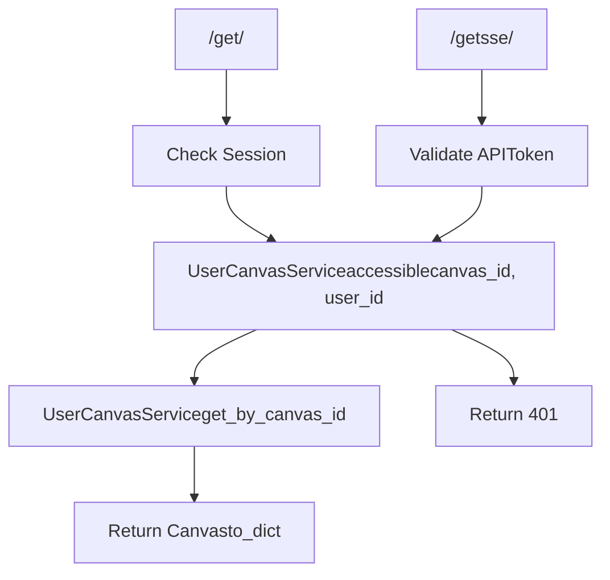
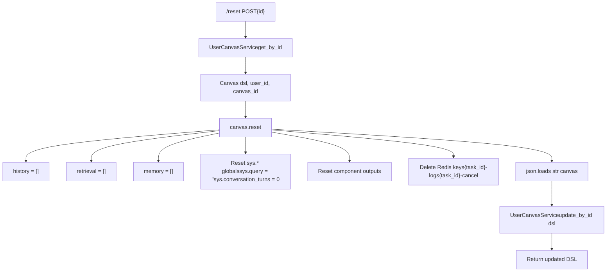
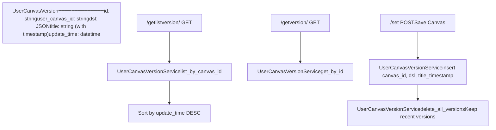
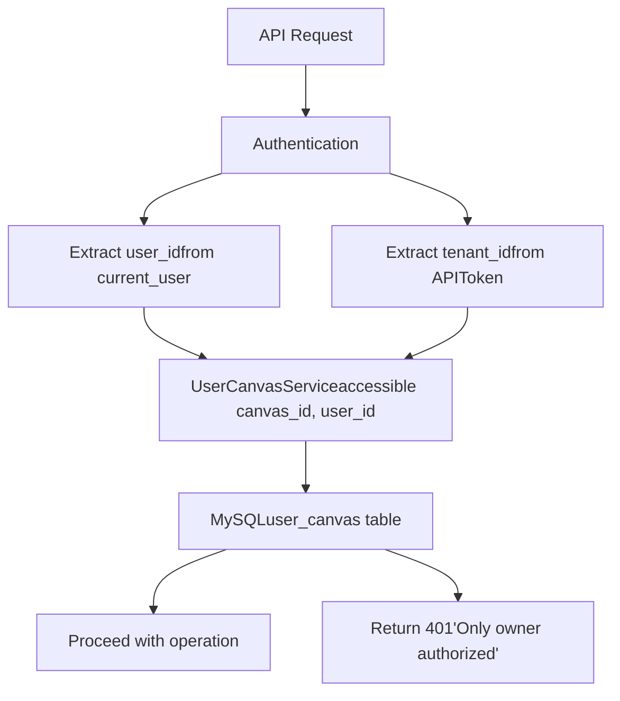

# Canvas API and Management

Relevant source files

-   [agent/canvas.py](https://github.com/infiniflow/ragflow/blob/80a16e71/agent/canvas.py)
-   [agent/component/agent\_with\_tools.py](https://github.com/infiniflow/ragflow/blob/80a16e71/agent/component/agent_with_tools.py)
-   [agent/component/base.py](https://github.com/infiniflow/ragflow/blob/80a16e71/agent/component/base.py)
-   [agent/component/categorize.py](https://github.com/infiniflow/ragflow/blob/80a16e71/agent/component/categorize.py)
-   [agent/component/llm.py](https://github.com/infiniflow/ragflow/blob/80a16e71/agent/component/llm.py)
-   [agent/tools/base.py](https://github.com/infiniflow/ragflow/blob/80a16e71/agent/tools/base.py)
-   [agent/tools/retrieval.py](https://github.com/infiniflow/ragflow/blob/80a16e71/agent/tools/retrieval.py)
-   [api/apps/api\_app.py](https://github.com/infiniflow/ragflow/blob/80a16e71/api/apps/api_app.py)
-   [api/apps/canvas\_app.py](https://github.com/infiniflow/ragflow/blob/80a16e71/api/apps/canvas_app.py)
-   [api/apps/sdk/chat.py](https://github.com/infiniflow/ragflow/blob/80a16e71/api/apps/sdk/chat.py)
-   [api/apps/sdk/dataset.py](https://github.com/infiniflow/ragflow/blob/80a16e71/api/apps/sdk/dataset.py)
-   [api/apps/sdk/dify\_retrieval.py](https://github.com/infiniflow/ragflow/blob/80a16e71/api/apps/sdk/dify_retrieval.py)
-   [api/apps/sdk/doc.py](https://github.com/infiniflow/ragflow/blob/80a16e71/api/apps/sdk/doc.py)
-   [api/apps/sdk/session.py](https://github.com/infiniflow/ragflow/blob/80a16e71/api/apps/sdk/session.py)
-   [api/db/services/canvas\_service.py](https://github.com/infiniflow/ragflow/blob/80a16e71/api/db/services/canvas_service.py)
-   [api/db/services/conversation\_service.py](https://github.com/infiniflow/ragflow/blob/80a16e71/api/db/services/conversation_service.py)
-   [api/utils/api\_utils.py](https://github.com/infiniflow/ragflow/blob/80a16e71/api/utils/api_utils.py)
-   [docs/references/http\_api\_reference.md](https://github.com/infiniflow/ragflow/blob/80a16e71/docs/references/http_api_reference.md)
-   [docs/references/python\_api\_reference.md](https://github.com/infiniflow/ragflow/blob/80a16e71/docs/references/python_api_reference.md)
-   [docs/release\_notes.md](https://github.com/infiniflow/ragflow/blob/80a16e71/docs/release_notes.md)
-   [rag/advanced\_rag/\_\_init\_\_.py](https://github.com/infiniflow/ragflow/blob/80a16e71/rag/advanced_rag/__init__.py)
-   [rag/benchmark.py](https://github.com/infiniflow/ragflow/blob/80a16e71/rag/benchmark.py)
-   [rag/prompts/generator.py](https://github.com/infiniflow/ragflow/blob/80a16e71/rag/prompts/generator.py)
-   [sdk/python/ragflow\_sdk/modules/chat.py](https://github.com/infiniflow/ragflow/blob/80a16e71/sdk/python/ragflow_sdk/modules/chat.py)
-   [sdk/python/ragflow\_sdk/ragflow.py](https://github.com/infiniflow/ragflow/blob/80a16e71/sdk/python/ragflow_sdk/ragflow.py)
-   [web/src/components/knowledge-base-item.tsx](https://github.com/infiniflow/ragflow/blob/80a16e71/web/src/components/knowledge-base-item.tsx)
-   [web/src/interfaces/request/flow.ts](https://github.com/infiniflow/ragflow/blob/80a16e71/web/src/interfaces/request/flow.ts)

This page documents the HTTP API endpoints for managing and executing Canvas workflows. Canvas API provides RESTful endpoints for CRUD operations, execution control, debugging, version management, and session tracking. For information about the Canvas DSL format and execution engine, see [Canvas Engine and DSL](/infiniflow/ragflow/9.1-canvas-engine-and-dsl). For details on state and variable management during execution, see [State and Variable Management](/infiniflow/ragflow/9.5-state-and-variable-management).

---

## API Endpoint Organization

The Canvas API is implemented in `api/apps/canvas_app.py` and provides endpoints organized by functional domain:

**Canvas API Endpoint Groups**


**Sources:** [api/apps/canvas\_app.py47-559](https://github.com/infiniflow/ragflow/blob/80a16e71/api/apps/canvas_app.py#L47-L559)

---

## Canvas CRUD Operations

### Creating and Updating Canvases

The `/set` endpoint handles both canvas creation and updates using a unified interface. Canvas data includes the DSL definition, metadata, and versioning information.

**Canvas Save/Update Flow**

> **[Mermaid sequence]**
> *(图表结构无法解析)*

The DSL field must be a JSON object or serialized JSON string conforming to the Canvas DSL schema. The system automatically creates version snapshots with timestamp-based naming.

**Sources:** [api/apps/canvas\_app.py67-93](https://github.com/infiniflow/ragflow/blob/80a16e71/api/apps/canvas_app.py#L67-L93)

### Retrieving Canvases

Two retrieval endpoints support different authentication patterns:

| Endpoint | Authentication | Use Case |
| --- | --- | --- |
| `GET /get/<canvas_id>` | Session-based (cookie) | Web UI access |
| `GET /getsse/<canvas_id>` | Token-based (header) | API/SDK access |

**Access Control Logic**


**Sources:** [api/apps/canvas\_app.py95-124](https://github.com/infiniflow/ragflow/blob/80a16e71/api/apps/canvas_app.py#L95-L124)

### Listing Canvases

The `/list` endpoint supports multi-tenant queries with filtering, pagination, and ordering:

```
GET /list?keywords=search&page=0&page_size=10&orderby=create_time&desc=true&canvas_category=Agent&owner_ids=user1,user2
```
**Query Parameters:**

-   `keywords`: Full-text search across canvas titles
-   `page`, `page_size`: Pagination controls
-   `orderby`: Sort field (`create_time`, `update_time`, `title`)
-   `desc`: Sort direction (`true`/`false`)
-   `canvas_category`: Filter by category (Agent, DataFlow)
-   `owner_ids`: Filter by owner tenant IDs (comma-separated)

If `owner_ids` is not specified, the system queries all tenants the current user has joined plus their own canvases.

**Sources:** [api/apps/canvas\_app.py441-467](https://github.com/infiniflow/ragflow/blob/80a16e71/api/apps/canvas_app.py#L441-L467)

### Deleting Canvases

The `/rm` endpoint supports batch deletion:

```
POST /rm
{
  "canvas_ids": ["canvas_id_1", "canvas_id_2", "canvas_id_3"]
}
```
Authorization is checked for each canvas before deletion. Only canvas owners can delete their canvases.

**Sources:** [api/apps/canvas\_app.py53-64](https://github.com/infiniflow/ragflow/blob/80a16e71/api/apps/canvas_app.py#L53-L64)

---

## Canvas Execution API

### Streaming Execution via SSE

The `/completion` endpoint executes canvases with Server-Sent Events (SSE) streaming for real-time progress updates.

**Canvas Execution Flow**

> **[Mermaid sequence]**
> *(图表结构无法解析)*

**Event Types:**

| Event | Data Fields | Description |
| --- | --- | --- |
| `workflow_started` | `inputs` | Execution begins |
| `node_started` | `component_id`, `component_name`, `component_type`, `thoughts` | Component execution starts |
| `message` | `content`, `audio_binary?`, `start_to_think?`, `end_to_think?` | Streaming content output |
| `message_end` | `status?`, `attachment?`, `reference?` | Content output complete |
| `node_finished` | `inputs`, `outputs`, `component_id`, `error`, `elapsed_time` | Component execution complete |
| `user_inputs` | `inputs`, `tips` | Workflow paused for user input |
| `workflow_finished` | `inputs`, `outputs`, `elapsed_time` | Execution complete |

**Sources:** [api/apps/canvas\_app.py126-181](https://github.com/infiniflow/ragflow/blob/80a16e71/api/apps/canvas_app.py#L126-L181) [agent/canvas.py361-649](https://github.com/infiniflow/ragflow/blob/80a16e71/agent/canvas.py#L361-L649)

### Request Parameters

```
interface CompletionRequest {
  id: string;              // Canvas ID
  query?: string;          // User query (mapped to sys.query)
  files?: FileInfo[];      // File attachments
  inputs?: Record<string, any>;  // Preset input values
  user_id?: string;        // Override user context
}
```
The `inputs` parameter allows pre-filling component input values for parameterized canvas execution.

**Sources:** [api/apps/canvas\_app.py130-134](https://github.com/infiniflow/ragflow/blob/80a16e71/api/apps/canvas_app.py#L130-L134)

---

## State Management

### Resetting Canvas State

The `/reset` endpoint clears execution history, retrieval context, and memory while preserving the DSL definition:


**Global Variables Reset:**

-   String variables → `""`
-   Numeric variables → `0`
-   List variables → `[]`
-   Dict variables → `{}`
-   Environment variables (`env.*`) → Reset to configured values or defaults

**Sources:** [api/apps/canvas\_app.py221-242](https://github.com/infiniflow/ragflow/blob/80a16e71/api/apps/canvas_app.py#L221-L242) [agent/canvas.py318-360](https://github.com/infiniflow/ragflow/blob/80a16e71/agent/canvas.py#L318-L360)

### Canceling Execution

The `/cancel/<task_id>` endpoint sets a Redis cancellation flag checked throughout execution:

```
PUT /cancel/550e8400-e29b-41d4-a716-446655440000
```
Components check cancellation status via `canvas.is_canceled()` which queries Redis key `{task_id}-cancel`. When detected, components raise `TaskCanceledException`.

**Sources:** [api/apps/canvas\_app.py211-219](https://github.com/infiniflow/ragflow/blob/80a16e71/api/apps/canvas_app.py#L211-L219) [agent/canvas.py267-277](https://github.com/infiniflow/ragflow/blob/80a16e71/agent/canvas.py#L267-L277)

---

## Debugging and Testing

### Component Debugging

The `/debug` endpoint executes a single component in isolation with provided test inputs:

**Debug Execution Flow**

> **[Mermaid sequence]**
> *(图表结构无法解析)*

**Debug Request Structure:**

```
interface DebugRequest {
  id: string;              // Canvas ID
  component_id: string;    // Component to debug
  params: {
    [key: string]: {
      value: any;          // Test value for input
    }
  }
}
```
For streaming outputs (generators/async generators), the system fully consumes the stream before returning the complete text.

**Sources:** [api/apps/canvas\_app.py279-314](https://github.com/infiniflow/ragflow/blob/80a16e71/api/apps/canvas_app.py#L279-L314)

### Database Connection Testing

The `/test_db_connect` endpoint validates database credentials before saving them in components:

**Supported Database Types:**

| Type | Implementation | Test Query |
| --- | --- | --- |
| `mysql`, `mariadb` | `MySQLDatabase` | Connection test |
| `postgres` | `PostgresqlDatabase` | Connection test |
| `mssql` | `pyodbc` | `SELECT 1` |
| `IBM DB2` | `ibm_db` | `SELECT 1 FROM sysibm.sysdummy1` |
| `trino` | `trino.dbapi` | `SELECT 1` |

**Trino Configuration:**

-   Database format: `catalog.schema` or `catalog/schema`
-   HTTP scheme: `https` if `TRINO_USE_TLS=1`, else `http`
-   Authentication: Basic auth for HTTPS connections

**Sources:** [api/apps/canvas\_app.py316-416](https://github.com/infiniflow/ragflow/blob/80a16e71/api/apps/canvas_app.py#L316-L416)

---

## Version Management

The system automatically creates version snapshots when canvases are saved. Versions enable rollback and audit trails.

**Version Management Architecture**


**Version Title Format:** `{canvas_title}_{YYYY_MM_DD_HH_MM_SS}`

Example: `Customer_Support_Agent_2024_03_15_14_23_45`

**Sources:** [api/apps/canvas\_app.py90-91](https://github.com/infiniflow/ragflow/blob/80a16e71/api/apps/canvas_app.py#L90-L91) [api/apps/canvas\_app.py418-439](https://github.com/infiniflow/ragflow/blob/80a16e71/api/apps/canvas_app.py#L418-L439)

---

## Session Management

The `/sessions` endpoint retrieves execution history for a canvas, enabling conversation tracking and analytics.

**Session Query Parameters:**

```
GET /<canvas_id>/sessions?user_id=user123&page=1&page_size=30&keywords=search&from_date=2024-01-01&to_date=2024-12-31&orderby=update_time&desc=true&dsl=true
```
| Parameter | Type | Default | Description |
| --- | --- | --- | --- |
| `user_id` | string | \- | Filter by specific user |
| `page` | integer | 1 | Page number |
| `page_size` | integer | 30 | Items per page |
| `keywords` | string | \- | Search in session content |
| `from_date` | string | \- | Start date filter (ISO format) |
| `to_date` | string | \- | End date filter (ISO format) |
| `orderby` | string | `update_time` | Sort field |
| `desc` | boolean | `true` | Sort descending |
| `dsl` | boolean | `true` | Include DSL in response |

**Response Structure:**

```
interface SessionsResponse {
  total: number;
  sessions: Array<{
    id: string;
    canvas_id: string;
    user_id: string;
    create_time: string;
    update_time: string;
    dsl?: object;        // If dsl=true
    // ... other session fields
  }>;
}
```
**Sources:** [api/apps/canvas\_app.py509-537](https://github.com/infiniflow/ragflow/blob/80a16e71/api/apps/canvas_app.py#L509-L537)

---

## Supporting Endpoints

### Canvas Templates

The `/templates` endpoint returns predefined canvas templates for quick starting points:

```
GET /templates
```
Returns all entries from `CanvasTemplateService` with template metadata including DSL structure, category, and description.

**Sources:** [api/apps/canvas\_app.py47-51](https://github.com/infiniflow/ragflow/blob/80a16e71/api/apps/canvas_app.py#L47-L51)

### File Operations

**Upload Files:**

```
POST /upload/<canvas_id>
Content-Type: multipart/form-data

file: <binary>
url: <optional URL to download>
```
Returns file metadata: `{id, name, size, mime_type, created_by, url}` via `FileService.upload_info()`.

**Download Files:**

```
GET /download?id=file_id&created_by=user_id
```
Returns file binary content as response body.

**Sources:** [api/apps/canvas\_app.py244-257](https://github.com/infiniflow/ragflow/blob/80a16e71/api/apps/canvas_app.py#L244-L257) [api/apps/canvas\_app.py553-559](https://github.com/infiniflow/ragflow/blob/80a16e71/api/apps/canvas_app.py#L553-L559)

### Execution Trace Logs

The `/trace` endpoint retrieves detailed tool execution logs stored in Redis:

```
GET /trace?canvas_id=canvas_id&message_id=msg_id
```
**Trace Log Structure:**

```
interface TraceLog {
  component_id: string;
  trace: Array<{
    path: string;              // "AgentName-->ToolName"
    tool_name: string;
    arguments: Record<string, any>;
    result: any;
    elapsed_time: number;      // Seconds
  }>;
}
```
Logs are stored in Redis with key format `{canvas_id}-{message_id}-logs` and expire after 10 minutes.

**Sources:** [api/apps/canvas\_app.py495-507](https://github.com/infiniflow/ragflow/blob/80a16e71/api/apps/canvas_app.py#L495-L507) [agent/canvas.py762-785](https://github.com/infiniflow/ragflow/blob/80a16e71/agent/canvas.py#L762-L785)

### System Prompts

The `/prompts` endpoint exposes system prompt templates used internally:

```
GET /prompts
```
**Returned Prompts:**

| Key | Prompt Template | Purpose |
| --- | --- | --- |
| `task_analysis` | `ANALYZE_TASK_SYSTEM` + `ANALYZE_TASK_USER` | Agent task decomposition |
| `plan_generation` | `NEXT_STEP` | Agent next-step planning |
| `reflection` | `REFLECT` | Agent self-reflection |
| `citation_guidelines` | `CITATION_PROMPT_TEMPLATE` | Citation formatting rules |

These prompts can be overridden in canvas configurations using XML-style tags (e.g., `<TASK_ANALYSIS>custom prompt</TASK_ANALYSIS>`).

**Sources:** [api/apps/canvas\_app.py539-551](https://github.com/infiniflow/ragflow/blob/80a16e71/api/apps/canvas_app.py#L539-L551) [rag/prompts/generator.py166-174](https://github.com/infiniflow/ragflow/blob/80a16e71/rag/prompts/generator.py#L166-L174)

---

## Access Control and Multi-Tenancy

All canvas operations enforce ownership-based access control through `UserCanvasService.accessible()`:


**Multi-Tenant List Query:**

When listing canvases without explicit `owner_ids`, the system queries:

1.  User's own canvases (`user_id = current_user.id`)
2.  Canvases from joined tenants (`TenantService.get_joined_tenants_by_user_id()`)

This enables team collaboration where users can view canvases from organizations they belong to.

**Sources:** [api/apps/canvas\_app.py59-62](https://github.com/infiniflow/ragflow/blob/80a16e71/api/apps/canvas_app.py#L59-L62) [api/apps/canvas\_app.py84-88](https://github.com/infiniflow/ragflow/blob/80a16e71/api/apps/canvas_app.py#L84-L88) [api/apps/canvas\_app.py454-461](https://github.com/infiniflow/ragflow/blob/80a16e71/api/apps/canvas_app.py#L454-L461)

---

## Canvas Settings Management

The `/setting` endpoint updates canvas metadata without modifying the DSL:

```
POST /setting
{
  "id": "canvas_id",
  "title": "New Title",
  "description": "Updated description",
  "permission": "private",
  "avatar": "base64_image_data"
}
```
**Updatable Fields:**

-   `title`: Canvas display name
-   `description`: Canvas documentation
-   `permission`: Access level (`private`, `team`, `public`)
-   `avatar`: Base64-encoded image

The DSL and execution state remain unchanged.

**Sources:** [api/apps/canvas\_app.py469-493](https://github.com/infiniflow/ragflow/blob/80a16e71/api/apps/canvas_app.py#L469-L493)
