# 概览

相关源文件

-   [README.md](https://github.com/infiniflow/ragflow/blob/80a16e71/README.md)
-   [README\_id.md](https://github.com/infiniflow/ragflow/blob/80a16e71/README_id.md)
-   [README\_ja.md](https://github.com/infiniflow/ragflow/blob/80a16e71/README_ja.md)
-   [README\_ko.md](https://github.com/infiniflow/ragflow/blob/80a16e71/README_ko.md)
-   [README\_pt\_br.md](https://github.com/infiniflow/ragflow/blob/80a16e71/README_pt_br.md)
-   [README\_tzh.md](https://github.com/infiniflow/ragflow/blob/80a16e71/README_tzh.md)
-   [README\_zh.md](https://github.com/infiniflow/ragflow/blob/80a16e71/README_zh.md)
-   [api/apps/chunk\_app.py](https://github.com/infiniflow/ragflow/blob/80a16e71/api/apps/chunk_app.py)
-   [api/apps/conversation\_app.py](https://github.com/infiniflow/ragflow/blob/80a16e71/api/apps/conversation_app.py)
-   [api/apps/document\_app.py](https://github.com/infiniflow/ragflow/blob/80a16e71/api/apps/document_app.py)
-   [api/apps/file2document\_app.py](https://github.com/infiniflow/ragflow/blob/80a16e71/api/apps/file2document_app.py)
-   [api/apps/file\_app.py](https://github.com/infiniflow/ragflow/blob/80a16e71/api/apps/file_app.py)
-   [api/apps/kb\_app.py](https://github.com/infiniflow/ragflow/blob/80a16e71/api/apps/kb_app.py)
-   [api/apps/llm\_app.py](https://github.com/infiniflow/ragflow/blob/80a16e71/api/apps/llm_app.py)
-   [api/db/db\_models.py](https://github.com/infiniflow/ragflow/blob/80a16e71/api/db/db_models.py)
-   [api/db/init\_data.py](https://github.com/infiniflow/ragflow/blob/80a16e71/api/db/init_data.py)
-   [api/db/services/dialog\_service.py](https://github.com/infiniflow/ragflow/blob/80a16e71/api/db/services/dialog_service.py)
-   [api/db/services/document\_service.py](https://github.com/infiniflow/ragflow/blob/80a16e71/api/db/services/document_service.py)
-   [api/db/services/file\_service.py](https://github.com/infiniflow/ragflow/blob/80a16e71/api/db/services/file_service.py)
-   [api/db/services/knowledgebase\_service.py](https://github.com/infiniflow/ragflow/blob/80a16e71/api/db/services/knowledgebase_service.py)
-   [api/db/services/llm\_service.py](https://github.com/infiniflow/ragflow/blob/80a16e71/api/db/services/llm_service.py)
-   [api/db/services/task\_service.py](https://github.com/infiniflow/ragflow/blob/80a16e71/api/db/services/task_service.py)
-   [conf/llm\_factories.json](https://github.com/infiniflow/ragflow/blob/80a16e71/conf/llm_factories.json)
-   [docker/.env](https://github.com/infiniflow/ragflow/blob/80a16e71/docker/.env)
-   [docker/README.md](https://github.com/infiniflow/ragflow/blob/80a16e71/docker/README.md)
-   [docs/configurations.md](https://github.com/infiniflow/ragflow/blob/80a16e71/docs/configurations.md)
-   [docs/guides/manage\_files.md](https://github.com/infiniflow/ragflow/blob/80a16e71/docs/guides/manage_files.md)
-   [docs/guides/upgrade\_ragflow.mdx](https://github.com/infiniflow/ragflow/blob/80a16e71/docs/guides/upgrade_ragflow.mdx)
-   [docs/quickstart.mdx](https://github.com/infiniflow/ragflow/blob/80a16e71/docs/quickstart.mdx)
-   [docs/references/supported\_models.mdx](https://github.com/infiniflow/ragflow/blob/80a16e71/docs/references/supported_models.mdx)
-   [rag/llm/\_\_init\_\_.py](https://github.com/infiniflow/ragflow/blob/80a16e71/rag/llm/__init__.py)
-   [rag/llm/chat\_model.py](https://github.com/infiniflow/ragflow/blob/80a16e71/rag/llm/chat_model.py)
-   [rag/llm/cv\_model.py](https://github.com/infiniflow/ragflow/blob/80a16e71/rag/llm/cv_model.py)
-   [rag/llm/embedding\_model.py](https://github.com/infiniflow/ragflow/blob/80a16e71/rag/llm/embedding_model.py)
-   [rag/llm/rerank\_model.py](https://github.com/infiniflow/ragflow/blob/80a16e71/rag/llm/rerank_model.py)
-   [rag/llm/sequence2txt\_model.py](https://github.com/infiniflow/ragflow/blob/80a16e71/rag/llm/sequence2txt_model.py)
-   [rag/llm/tts\_model.py](https://github.com/infiniflow/ragflow/blob/80a16e71/rag/llm/tts_model.py)
-   [rag/nlp/search.py](https://github.com/infiniflow/ragflow/blob/80a16e71/rag/nlp/search.py)
-   [rag/svr/task\_executor.py](https://github.com/infiniflow/ragflow/blob/80a16e71/rag/svr/task_executor.py)
-   [web/src/assets/svg/llm/n1n.svg](https://github.com/infiniflow/ragflow/blob/80a16e71/web/src/assets/svg/llm/n1n.svg)
-   [web/src/constants/llm.ts](https://github.com/infiniflow/ragflow/blob/80a16e71/web/src/constants/llm.ts)
-   [web/src/pages/user-setting/setting-model/constant.ts](https://github.com/infiniflow/ragflow/blob/80a16e71/web/src/pages/user-setting/setting-model/constant.ts)
-   [web/src/utils/common-util.ts](https://github.com/infiniflow/ragflow/blob/80a16e71/web/src/utils/common-util.ts)

## 目的与范围

RAGFlow 是一款开源的检索增强生成（Retrieval-Augmented Generation, RAG）引擎，它结合了深度文档理解与 Agent 能力，为大语言模型（LLM）提供生产级的上下文层。本文档全面概述了 RAGFlow 的架构、核心子系统以及系统设计原则。

本概览从高层级覆盖了整个系统。有关特定子系统的详细信息，请参阅：

-   部署指南：参见 [Docker Compose 部署](/infiniflow/ragflow/2.1-docker-compose-deployment)
-   文档处理流水线：参见 [文档处理流水线](/infiniflow/ragflow/6-document-processing-pipeline)
-   LLM 集成：参见 [LLM 集成系统](/infiniflow/ragflow/5-llm-integration-system)
-   Agent 工作流：参见 [Agent 与工作流系统](/infiniflow/ragflow/9-agent-and-workflow-system)
-   API 架构：参见 [后端 API 系统](/infiniflow/ragflow/8-backend-api-system)

数据源：[README.md73-75](https://github.com/infiniflow/ragflow/blob/80a16e71/README.md#L73-L75) [README\_zh.md75-76](https://github.com/infiniflow/ragflow/blob/80a16e71/README_zh.md#L75-L76)

## 系统架构

RAGFlow 采用 6 层模块化架构，旨在处理从文档摄取到具有 Agent 能力的上下文感知响应生成的完整 RAG 生命周期。

### 整体系统架构

**六层架构概览：**

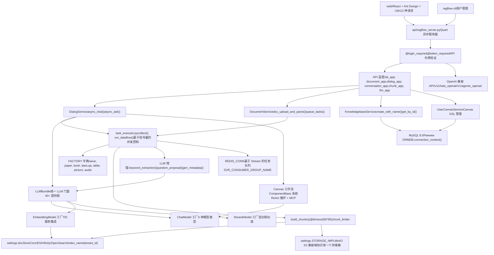

**关键架构模式：**

| 模式 | 实现 | 目的 |
| --- | --- | --- |
| 工厂模式 (Factory Pattern) | [rag/svr/task\_executor.py83-100](https://github.com/infiniflow/ragflow/blob/80a16e71/rag/svr/task_executor.py#L83-L100) 中的 `FACTORY` 字典 | 基于 `ParserType` 动态选择解析器 |
| 门面模式 (Facade Pattern) | [api/db/services/llm\_service.py](https://github.com/infiniflow/ragflow/blob/80a16e71/api/db/services/llm_service.py) 中的 `LLMBundle` 类 | 40+ LLM 提供商的统一接口 |
| 服务层 (Service Layer) | 继承自 `CommonService` 的 `*Service` 类 | 使用 Peewee ORM 封装业务逻辑 |
| 生产者-消费者模式 (Producer-Consumer) | 使用 `queue_producer()` / `queue_consumer()` 的 Redis Streams | 解耦的异步任务处理 |
| 仓库模式 (Repository Pattern) | `CommonService.model` 属性模式 | 通用 CRUD 操作 |
| 策略模式 (Strategy Pattern) | 包含 `invoke()` / `invoke_async()` 的 `ComponentBase` | 可插拔的 Agent 组件 |

**层与代码映射：**

| 层 | 主要模块 | 关键类/函数 |
| --- | --- | --- |
| 前端 (Frontend) | `web/src/` | React 组件，用于 i18n 的 `locales/` |
| API 网关 (API Gateway) | `api/apps/*.py`, `api/ragflow_server.py` | `@manager.route()` 蓝图，Quart 应用 |
| 应用层 (Application) | `api/db/services/*_service.py` | `DialogService`, `DocumentService`, `KnowledgebaseService` |
| 处理层 (Processing) | `rag/svr/task_executor.py`, `rag/app/` | `collect()`, `build_chunks()`, 解析器模块 |
| 智能层 (Intelligence) | `rag/llm/`, `agent/` | `LLMBundle`, `ChatModel`, `Canvas` |
| 存储层 (Storage) | `common/settings.py`, `api/db/db_models.py` | `docStoreConn`, `STORAGE_IMPL`, `REDIS_CONN` |

数据源：[rag/svr/task\_executor.py83-100](https://github.com/infiniflow/ragflow/blob/80a16e71/rag/svr/task_executor.py#L83-L100) [api/db/services/dialog\_service.py50-52](https://github.com/infiniflow/ragflow/blob/80a16e71/api/db/services/dialog_service.py#L50-L52) [api/db/services/llm\_service.py](https://github.com/infiniflow/ragflow/blob/80a16e71/api/db/services/llm_service.py) [api/ragflow\_server.py](https://github.com/infiniflow/ragflow/blob/80a16e71/api/ragflow_server.py) [README.md137-141](https://github.com/infiniflow/ragflow/blob/80a16e71/README.md#L137-L141) [common/settings.py](https://github.com/infiniflow/ragflow/blob/80a16e71/common/settings.py)

### 应用引导与服务发现

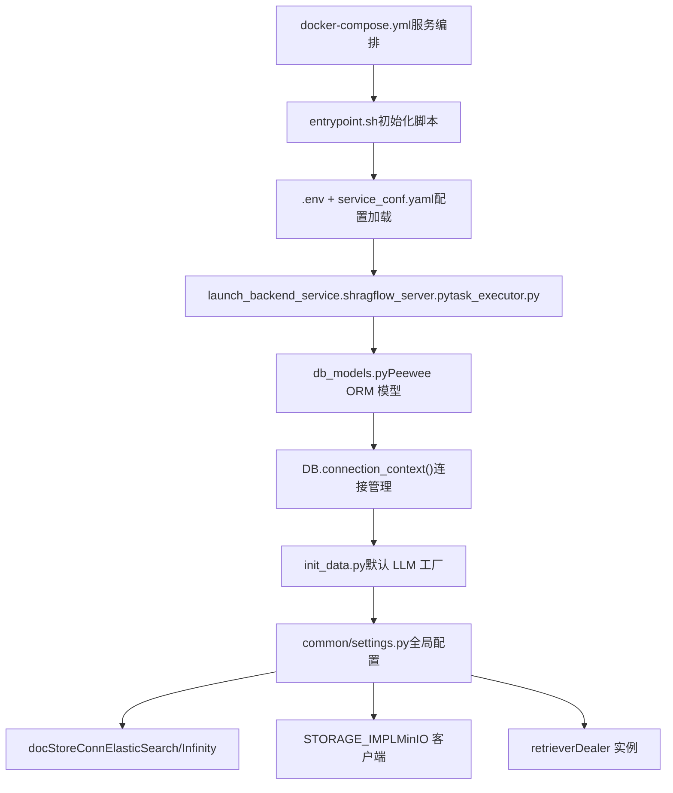

系统通过多阶段过程进行引导：

1.  **Docker Compose** 使用 `docker-compose.yml` 及 `.env` 中的环境变量编排服务启动。
2.  **引导脚本** (`entrypoint.sh`) 初始化运行时环境并等待依赖项就绪。
3.  **配置加载** 将 `.env` 变量合并到 `service_conf.yaml.template` 中。
4.  **数据库模型** 通过 `DB.connection_context()` 建立到 MySQL 的 Peewee ORM 连接。
5.  **服务发现** 将全局可访问的服务连接填充到 `common/settings.py` 中。

数据源：[docker/docker-compose.yml](https://github.com/infiniflow/ragflow/blob/80a16e71/docker/docker-compose.yml) [docker/.env1-20](https://github.com/infiniflow/ragflow/blob/80a16e71/docker/.env#L1-L20) [api/db/db\_models.py30-43](https://github.com/infiniflow/ragflow/blob/80a16e71/api/db/db_models.py#L30-L43) [common/settings.py](https://github.com/infiniflow/ragflow/blob/80a16e71/common/settings.py)

## 核心数据流

### 文档摄取与索引流水线

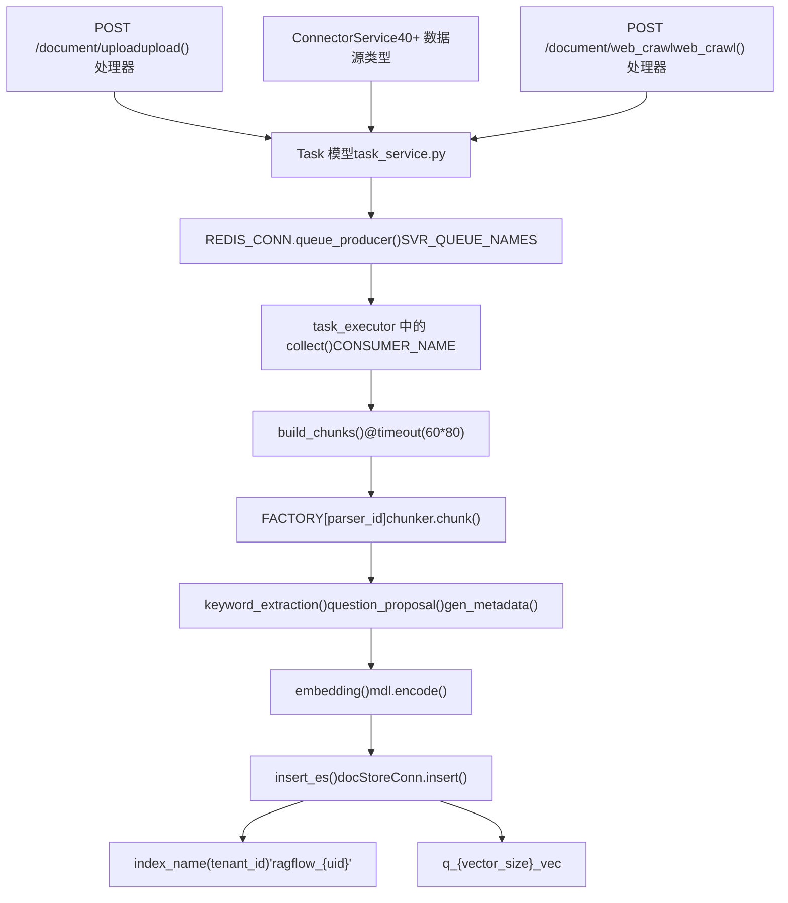

**处理阶段：**

| 阶段 | 功能 | 并发控制 | 超时 |
| --- | --- | --- | --- |
| 切片构建 (Chunk Building) | `build_chunks()` | `chunk_limiter` (信号量) | 80 分钟 |
| 向量化 (Embedding) | `embedding()` | `embed_limiter` (信号量) | 60 秒 |
| MinIO 上传 | `upload_to_minio()` | `minio_limiter` (信号量) | 60 秒 |
| LLM 增强 (LLM Enhancement) | `keyword_extraction()` | `chat_limiter` (信号量) | 可配置 |

数据源：[rag/svr/task\_executor.py238-283](https://github.com/infiniflow/ragflow/blob/80a16e71/rag/svr/task_executor.py#L238-L283) [rag/svr/task\_executor.py564-615](https://github.com/infiniflow/ragflow/blob/80a16e71/rag/svr/task_executor.py#L564-L615) [rag/svr/task\_executor.py836-879](https://github.com/infiniflow/ragflow/blob/80a16e71/rag/svr/task_executor.py#L836-L879) [api/apps/document\_app.py52-96](https://github.com/infiniflow/ragflow/blob/80a16e71/api/apps/document_app.py#L52-L96)

### 查询处理与响应生成

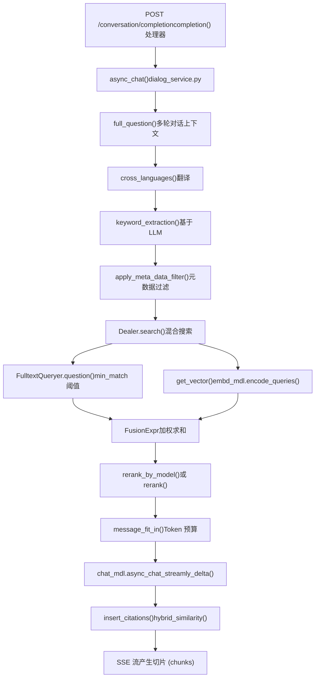

**检索配置：**

检索系统使用具有可配置权重的混合搜索：

-   **向量相似度权重** (`vector_similarity_weight`)：默认 0.3
-   **Token 权重** (`tkweight`)：文本匹配默认 0.3
-   **相似度阈值** (`similarity_threshold`)：默认 0.2
-   **Top-K** (`top_k`)：重排序前检索的切片数量
-   **Top-N** (`top_n`)：重排序后的最终切片数量

数据源：[api/db/services/dialog\_service.py276-281](https://github.com/infiniflow/ragflow/blob/80a16e71/api/db/services/dialog_service.py#L276-L281) [api/db/services/dialog\_service.py342-362](https://github.com/infiniflow/ragflow/blob/80a16e71/api/db/services/dialog_service.py#L342-L362) [rag/nlp/search.py75-172](https://github.com/infiniflow/ragflow/blob/80a16e71/rag/nlp/search.py#L75-L172) [rag/nlp/search.py295-355](https://github.com/infiniflow/ragflow/blob/80a16e71/rag/nlp/search.py#L295-L355)

## 存储与持久化

### 数据库模式组织

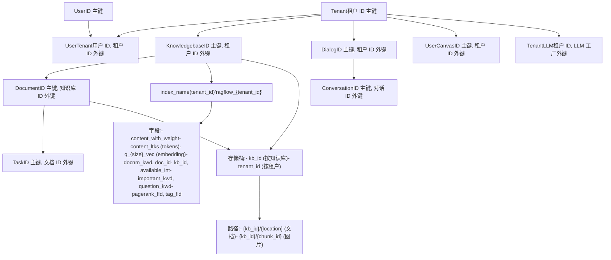

**关键数据库模型：**

| 模型 | 主键 | 关键字段 | 目的 |
| --- | --- | --- | --- |
| `Knowledgebase` | `id` | `tenant_id`, `parser_id`, `embd_id` | 数据集配置 |
| `Document` | `id` | `kb_id`, `parser_config`, `chunk_num` | 文件元数据 |
| `Task` | `id` | `doc_id`, `progress`, `from_page`, `to_page` | 处理状态 |
| `Dialog` | `id` | `kb_ids[]`, `llm_id`, `prompt_config` | 对话助手配置 |
| `TenantLLM` | `(tenant_id, llm_factory, llm_name)` | `api_key`, `model_type` | LLM 凭证 |

数据源：[api/db/db\_models.py354-461](https://github.com/infiniflow/ragflow/blob/80a16e71/api/db/db_models.py#L354-L461) [rag/nlp/search.py34](https://github.com/infiniflow/ragflow/blob/80a16e71/rag/nlp/search.py#L34-L34) [common/settings.py](https://github.com/infiniflow/ragflow/blob/80a16e71/common/settings.py)

### 文档存储抽象

RAGFlow 通过 `DocStoreConnection` 抽象支持多个向量数据库后端：

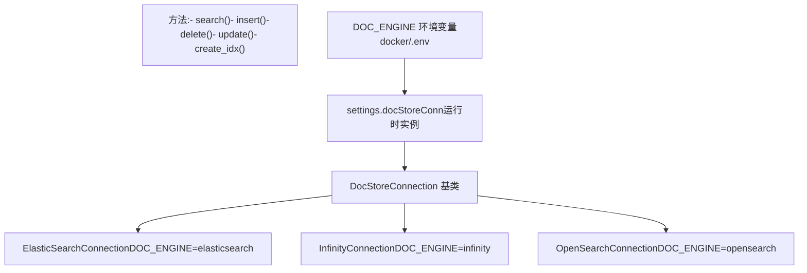

**后端选择：**

文档引擎在启动时通过 `.env` 中的 `DOC_ENGINE` 环境变量选择：

-   `elasticsearch` (默认)：通过 Elasticsearch 8.11.3 进行全文 + 向量搜索。
-   `infinity`：高性能向量数据库。
-   `opensearch`：AWS OpenSearch 兼容。

数据源：[docker/.env13-19](https://github.com/infiniflow/ragflow/blob/80a16e71/docker/.env#L13-L19) [common/doc\_store/doc\_store\_base.py](https://github.com/infiniflow/ragflow/blob/80a16e71/common/doc_store/doc_store_base.py) [README.md273-295](https://github.com/infiniflow/ragflow/blob/80a16e71/README.md#L273-L295)

## LLM 集成架构

### LLMBundle 门面与多提供商系统

**通过工厂模式集成 40+ 提供商：**

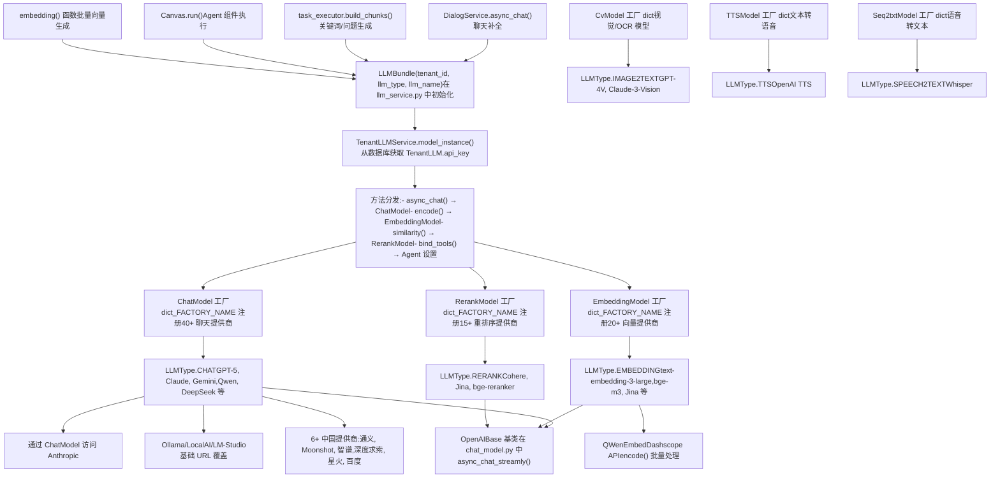

**错误处理与重试逻辑：**

[rag/llm/chat\_model.py65-244](https://github.com/infiniflow/ragflow/blob/80a16e71/rag/llm/chat_model.py#L65-L244) 中的 `Base` 类实现了复杂的错误处理：

| 错误类型 | `LLMErrorCode` | 重试？ | 退避策略 |
| --- | --- | --- | --- |
| 速率限制 (429) | `ERROR_RATE_LIMIT` | 是 | 指数退避加抖动 |
| 服务器错误 (5xx) | `ERROR_SERVER` | 是 | 指数退避加抖动 |
| 认证错误 (401) | `ERROR_AUTHENTICATION` | 否 | 立即失败 |
| 无效请求 (400) | `ERROR_INVALID_REQUEST` | 否 | 立即失败 |
| 超时 | `ERROR_TIMEOUT` | 否 | 立即失败 |
| 超过最大重试次数 | `ERROR_MAX_RETRIES` | 否 | 5 次尝试后失败 |

**关键实现细节：**

-   **重试配置**：`max_retries=5`，`base_delay=2.0` 秒（可通过 `LLM_MAX_RETRIES`、`LLM_BASE_DELAY` 环境变量配置）。
-   **超时**：每个请求默认 600 秒 (`LLM_TIMEOUT_SECONDS` 环境变量)。
-   **工具调用 (Tool Calling)**：`bind_tools()` 启用支持函数调用的 ReAct Agent 工作流。
-   **流式处理 (Streaming)**：`async_chat_streamly_delta()` 通过 SSE 产生增量 Token。
-   **Token 追踪**：`increase_usage()` 更新 `TenantLLM` 表中每个租户的消耗情况。

**工厂注册模式：**

每个提供商模块都定义了一个用于自动注册的 `_FACTORY_NAME` 类属性：

```
# 摘自 rag/llm/chat_model.py 的示例
class OpenAI_APIChat(Base):
    _FACTORY_NAME = ["VLLM", "OpenAI-API-Compatible"]

class QWenEmbed(Base):
    _FACTORY_NAME = "Tongyi-Qianwen"
```

`rag/llm/__init__.py` 模块通过 `MODULE_MAPPING` 动态构建工厂字典。

数据源：[api/db/services/llm\_service.py](https://github.com/infiniflow/ragflow/blob/80a16e71/api/db/services/llm_service.py) [rag/llm/chat\_model.py40-244](https://github.com/infiniflow/ragflow/blob/80a16e71/rag/llm/chat_model.py#L40-L244) [rag/llm/\_\_init\_\_.py25-145](https://github.com/infiniflow/ragflow/blob/80a16e71/rag/llm/__init__.py#L25-L145) [rag/llm/embedding\_model.py37-90](https://github.com/infiniflow/ragflow/blob/80a16e71/rag/llm/embedding_model.py#L37-L90) [api/db/services/tenant\_llm\_service.py](https://github.com/infiniflow/ragflow/blob/80a16e71/api/db/services/tenant_llm_service.py)

### 模型配置与初始化

系统在数据库设置期间从 `llm_factories.json` 初始化 LLM 工厂：

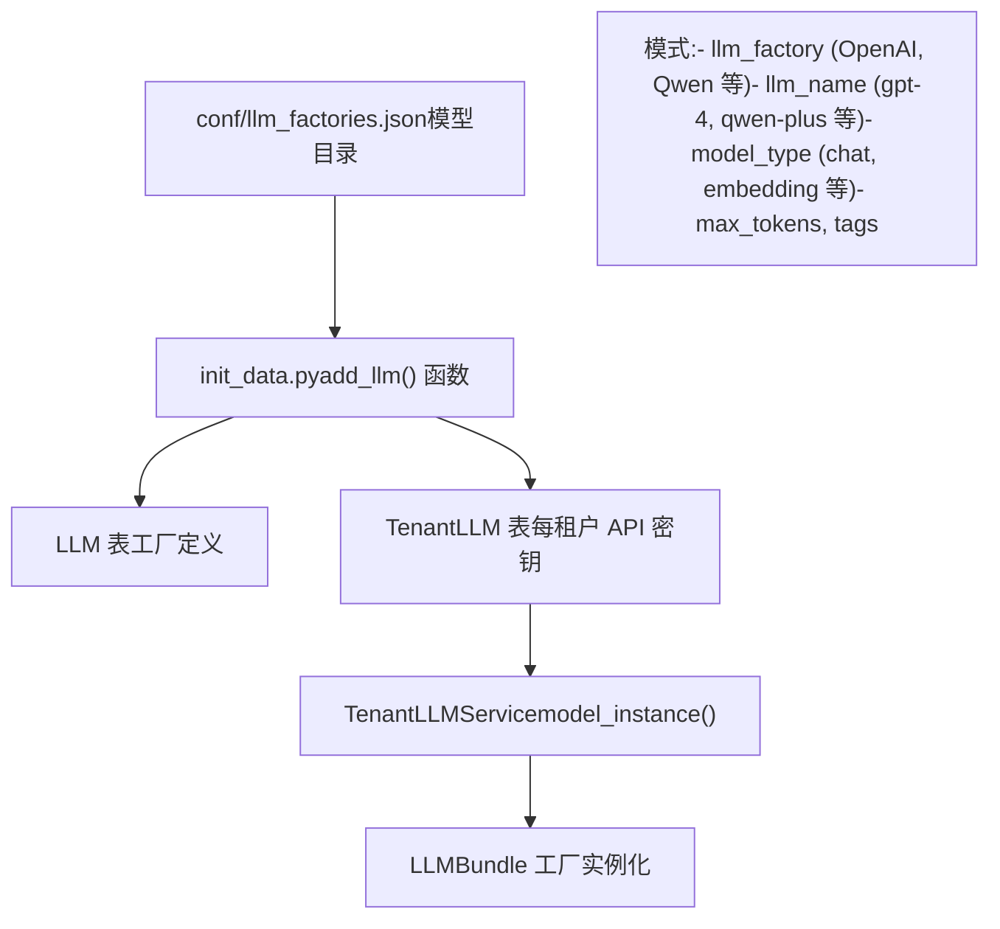

数据源：[conf/llm\_factories.json](https://github.com/infiniflow/ragflow/blob/80a16e71/conf/llm_factories.json) [api/db/init\_data.py](https://github.com/infiniflow/ragflow/blob/80a16e71/api/db/init_data.py) [api/db/services/tenant\_llm\_service.py](https://github.com/infiniflow/ragflow/blob/80a16e71/api/db/services/tenant_llm_service.py)

## 异步任务处理

### 基于 Redis 的任务队列

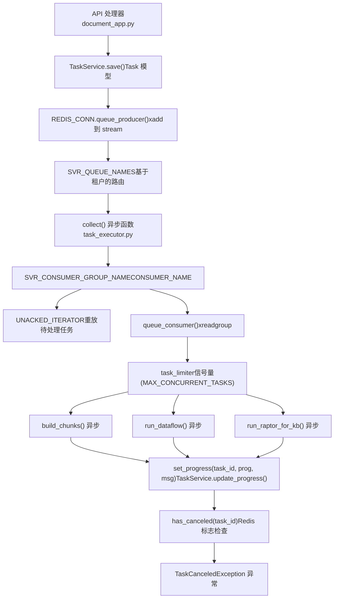

**任务类型与路由：**

| 任务类型 | 队列名称 | 处理器函数 | 目的 |
| --- | --- | --- | --- |
| `dataflow` | `PipelineTaskType.PARSE` | `run_dataflow()` | 自定义流水线执行 |
| `raptor` | `PipelineTaskType.RAPTOR` | `run_raptor_for_kb()` | 分层摘要 |
| `graphrag` | `PipelineTaskType.GRAPH_RAG` | `run_graphrag_for_kb()` | 知识图谱提取 |
| `mindmap` | `PipelineTaskType.MINDMAP` | `gen_mindmap()` | 思维导图生成 |
| `memory` | `PipelineTaskType.MEMORY` | `handle_save_to_memory_task()` | 对话记忆 |

数据源：[rag/svr/task\_executor.py98-104](https://github.com/infiniflow/ragflow/blob/80a16e71/rag/svr/task_executor.py#L98-L104) [rag/svr/task\_executor.py169-230](https://github.com/infiniflow/ragflow/blob/80a16e71/rag/svr/task_executor.py#L169-L230) [rag/svr/task\_executor.py118-127](https://github.com/infiniflow/ragflow/blob/80a16e71/rag/svr/task_executor.py#L118-L127) [api/db/services/task\_service.py](https://github.com/infiniflow/ragflow/blob/80a16e71/api/db/services/task_service.py)

### 并发控制与资源管理

任务执行器实现了细粒度的并发控制：

```
# 基于信号量的速率限制
task_limiter = asyncio.Semaphore(MAX_CONCURRENT_TASKS)  # 默认: 5
chunk_limiter = asyncio.Semaphore(MAX_CONCURRENT_CHUNK_BUILDERS)  # 默认: 1
embed_limiter = asyncio.Semaphore(MAX_CONCURRENT_CHUNK_BUILDERS)  # 默认: 1
minio_limiter = asyncio.Semaphore(MAX_CONCURRENT_MINIO)  # 默认: 10
kg_limiter = asyncio.Semaphore(2)  # 知识图谱操作
chat_limiter = asyncio.Semaphore(...)  # LLM API 调用

# 在异步任务中使用
async with chunk_limiter:
    chunks = await asyncio.to_thread(chunker.chunk, ...)

async with embed_limiter:
    vectors, count = await asyncio.to_thread(mdl.encode, texts)
```

数据源：[rag/svr/task\_executor.py118-125](https://github.com/infiniflow/ragflow/blob/80a16e71/rag/svr/task_executor.py#L118-L125) [rag/svr/task\_executor.py264-276](https://github.com/infiniflow/ragflow/blob/80a16e71/rag/svr/task_executor.py#L264-L276) [rag/svr/task\_executor.py591-592](https://github.com/infiniflow/ragflow/blob/80a16e71/rag/svr/task_executor.py#L591-L592)

## 部署与基础设施

### Docker Compose 服务拓扑

**多 Profile 容器编排：**

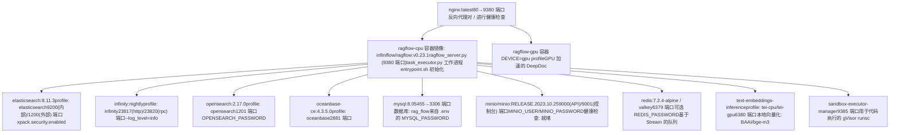

**基于 Profile 的服务选择：**

[docker/.env13-28](https://github.com/infiniflow/ragflow/blob/80a16e71/docker/.env#L13-L28) 中的 `COMPOSE_PROFILES` 环境变量决定了启动哪些服务：

```
# docker/.env 配置
DOC_ENGINE=${DOC_ENGINE:-elasticsearch}  # elasticsearch|infinity|opensearch|oceanbase
DEVICE=${DEVICE:-cpu}                    # cpu|gpu
COMPOSE_PROFILES=${DOC_ENGINE},${DEVICE} # 以逗号分隔的活动 Profile
```

**服务依赖与健康检查：**

| 服务 | 依赖于 | 健康检查 | 挂载卷 |
| --- | --- | --- | --- |
| `ragflow` | `mysql`, `redis`, `${DOC_ENGINE}`, `minio` | `/` 接口 | `./conf`, `./rag`, `./api` |
| `elasticsearch` | 无 | `curl -s http://localhost:9200` | `./es/data`, `./es/plugins` |
| `mysql` | 无 | `mysqladmin ping -h localhost` | `./mysql/data`, `./mysql/conf` |
| `minio` | 无 | `curl -f http://localhost:9000/minio/health/ready` | `./minio/data` |
| `redis` | 无 | `redis-cli ping` | `./redis/data` |

### 构建流水线与多阶段 Docker

**三阶段构建过程：**

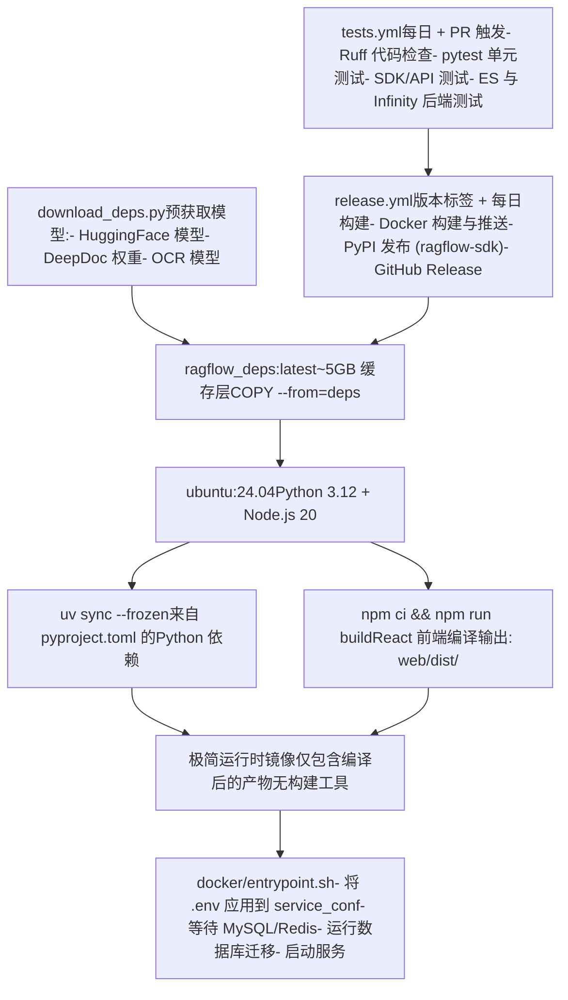

**关键构建优化：**

-   **依赖缓存**：`download_deps.py` 创建一个包含所有预获取模型的 `ragflow_deps:latest` 镜像，避免重复下载。
-   **层复用**：多阶段构建将编译时依赖与运行时分离。
-   **镜像源支持**：对于中国境内的部署，使用 `HF_ENDPOINT=https://hf-mirror.com` 重定向 HuggingFace 下载。
-   **平台针对性**：`--platform linux/amd64` 确保 x86 兼容性（ARM64 需要手动构建）。

**Dockerfile 结构：**

1.  **FROM deps**：拷贝缓存的模型和二进制文件。
2.  **RUN uv sync**：通过 `uv`（比 pip 更快）安装 Python 依赖。
3.  **RUN npm ci**：从锁定文件安装确切的前端依赖。
4.  **RUN npm run build**：使用 Vite 捆绑器编译 React 应用。
5.  **COPY**：仅将运行时文件拷贝到最终阶段。
6.  **ENTRYPOINT**：执行 `entrypoint.sh` 初始化脚本。

数据源：[docker/docker-compose.yml](https://github.com/infiniflow/ragflow/blob/80a16e71/docker/docker-compose.yml) [docker/.env13-28](https://github.com/infiniflow/ragflow/blob/80a16e71/docker/.env#L13-L28) [Dockerfile](https://github.com/infiniflow/ragflow/blob/80a16e71/Dockerfile) [docker/entrypoint.sh](https://github.com/infiniflow/ragflow/blob/80a16e71/docker/entrypoint.sh) [.github/workflows/tests.yml](https://github.com/infiniflow/ragflow/blob/80a16e71/.github/workflows/tests.yml) [.github/workflows/release.yml](https://github.com/infiniflow/ragflow/blob/80a16e71/.github/workflows/release.yml) [download\_deps.py](https://github.com/infiniflow/ragflow/blob/80a16e71/download_deps.py)

### 配置层级

RAGFlow 使用三层配置系统：

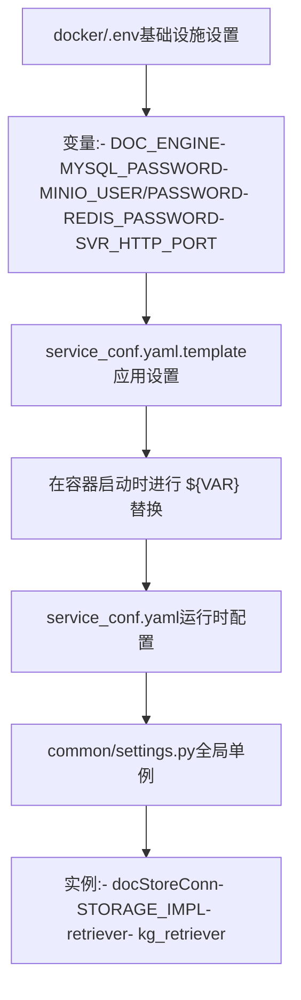

**配置更新工作流：**

1.  修改基础设施变更的 `.env`（端口、密码）。
2.  更新应用设置的 `service_conf.yaml.template`（LLM 默认值、切片设置）。
3.  重启容器：`docker compose -f docker-compose.yml up -d`。
4.  `settings.py` 中的更改需要重新加载应用代码。

数据源：[docker/.env1-10](https://github.com/infiniflow/ragflow/blob/80a16e71/docker/.env#L1-L10) [docker/service\_conf.yaml.template](https://github.com/infiniflow/ragflow/blob/80a16e71/docker/service_conf.yaml.template) [docker/README.md40-149](https://github.com/infiniflow/ragflow/blob/80a16e71/docker/README.md#L40-L149) [README.md252-271](https://github.com/infiniflow/ragflow/blob/80a16e71/README.md#L252-L271)

## 关键技术与集成

### 技术栈摘要

**完整技术矩阵：**

| 层 | 技术 | 关键库/版本 | 代码位置 |
| --- | --- | --- | --- |
| **前端 (Frontend)** | React 18.3, TypeScript, Vite 6.0 | Ant Design 5.22, Tailwind CSS 3.4, i18next (12 种语言) | `web/src/`, `web/locales/` |
| **后端框架 (Backend Framework)** | Python 3.12, Quart 0.20.0 (异步 Flask) | Peewee 3.18 ORM, asyncio 事件循环 | `api/ragflow_server.py`, `api/apps/` |
| **任务处理 (Task Processing)** | Redis 7.2.4 Streams, asyncio.Semaphore | 消费者组, concurrent.futures.ThreadPoolExecutor | `rag/svr/task_executor.py`, `rag/utils/redis_conn.py` |
| **LLM 集成** | 跨 6 种模型类型的 40+ 提供商 | OpenAI SDK, httpx, litellm 路由 | `rag/llm/*.py`, `conf/llm_factories.json` |
| **文档解析 (Document Parsing)** | 12 种专业解析策略 | DeepDoc (PyTorch), PaddleOCR, python-docx, pdfplumber | `rag/app/`, `deepdoc/` |
| **向量化与检索** | Text Embeddings Inference (TEI), FAISS | sentence-transformers, bge-m3 模型 | `rag/llm/embedding_model.py`, `rag/nlp/search.py` |
| **向量数据库 (Vector Database)** | Elasticsearch 8.11.3 / Infinity / OpenSearch 2.17 | 通过 `DocStoreConnection` 接口可插拔 | `common/doc_store/` |
| **对象存储 (Object Storage)** | MinIO (S3 兼容) | boto3 客户端, 分片上传 | `common/settings.py`, `STORAGE_IMPL` |
| **数据库 (Database)** | MySQL 8.0 (Peewee ORM) | 连接池, 迁移支持 | `api/db/db_models.py` |
| **Agent 框架** | Canvas DSL 执行器, 20+ 组件 | ReAct 循环, 支持 MCP 协议 | `agent/`, `rag/flow/` |
| **可观测性 (Observability)** | Langfuse 追踪 | 兼容 OpenTelemetry | `api/db/services/langfuse_service.py` |
| **部署 (Deployment)** | Docker Compose, Kubernetes Helm charts | 多阶段构建, 基于 Profile 的编排 | `docker/`, `helm/` |

**版本兼容性：**

-   **Python**：3.12+（使用了来自 3.11+ 的 `asyncio` 特性）。
-   **Node.js**：20.x LTS（用于网页前端构建）。
-   **Docker**：24.0.0+ 配合 Compose v2.26.1+。
-   **gVisor**：仅在启用沙盒代码执行功能时需要。

数据源：[README.md108-136](https://github.com/infiniflow/ragflow/blob/80a16e71/README.md#L108-L136) [web/package.json](https://github.com/infiniflow/ragflow/blob/80a16e71/web/package.json) [pyproject.toml](https://github.com/infiniflow/ragflow/blob/80a16e71/pyproject.toml) [docker/docker-compose.yml](https://github.com/infiniflow/ragflow/blob/80a16e71/docker/docker-compose.yml) [README.md145-151](https://github.com/infiniflow/ragflow/blob/80a16e71/README.md#L145-L151)

### 外部服务集成

RAGFlow 在多个维度上集成外部服务：

**数据源 (40+ 连接器)：**

-   云存储：S3, R2, GCS, Azure Blob, Box, Dropbox。
-   协作工具：Confluence, Notion, Discord, Slack, Google Drive。
-   开发工具：GitHub, GitLab, Jira, Bitbucket。
-   邮件：Gmail, IMAP。
-   其他：Airtable, Asana, Zendesk, WebDAV。

**AI 服务：**

-   向量化提供商：OpenAI, Voyage, Cohere, Jina 等。
-   LLM API：GPT-4, Claude, Gemini, Qwen, DeepSeek 等。
-   重排序：Cohere, Jina, Voyage, BGE。
-   本地推理：Ollama, Xinference, LocalAI。

**可观测性：**

-   集成 Langfuse 进行 LLM 追踪。
-   按租户进行 Token 使用情况追踪。
-   通过 Redis 进行进度监控。

数据源：[api/db/services/connector\_service.py](https://github.com/infiniflow/ragflow/blob/80a16e71/api/db/services/connector_service.py) [conf/llm\_factories.json](https://github.com/infiniflow/ragflow/blob/80a16e71/conf/llm_factories.json) [api/db/services/langfuse\_service.py](https://github.com/infiniflow/ragflow/blob/80a16e71/api/db/services/langfuse_service.py)

### 文档解析器生态系统

RAGFlow 通过 [rag/svr/task\_executor.py83-100](https://github.com/infiniflow/ragflow/blob/80a16e71/rag/svr/task_executor.py#L83-L100) 中的 `FACTORY` 字典映射，实现了 **12 种策略的基于模板的切片系统**：

**解析器类型系统：**

| 解析器类型 | 模块 | `ParserType` 枚举 | 最适用于 | 核心方法 |
| --- | --- | --- | --- | --- |
| `naive` | `rag.app.naive` | `NAIVE` | 纯文本, 简单 PDF | `chunk(binary, lang)` |
| `paper` | `rag.app.paper` | `PAPER` | 学术论文 | 章节检测, 公式处理 |
| `book` | `rag.app.book` | `BOOK` | 书籍, 长篇内容 | 章节检测, 通过 `build_TOC()` 构建目录 |
| `presentation` | `rag.app.presentation` | `PRESENTATION` | PPT, PPTX, Keynote | 逐页解析 |
| `manual` | `rag.app.manual` | `MANUAL` | 技术手册 | 层级结构 |
| `laws` | `rag.app.laws` | `LAWS` | 法律文档 | 条款/条款编号 |
| `qa` | `rag.app.qa` | `QA` | 常见问题解答, Q&A 对 | 问答对提取 |
| `table` | `rag.app.table` | `TABLE` | 电子表格, CSV | 结构化数据提取 |
| `resume` | `rag.app.resume` | `RESUME` | 个人简历 | 实体提取（技能, 经验） |
| `picture` | `rag.app.picture` | `PICTURE` | 图片 | 通过 `CvModel` 进行 OCR + 视觉模型处理 |
| `one` | `rag.app.one` | `ONE` | OneNote | 笔记本章节解析 |
| `audio` | `rag.app.audio` | `AUDIO` | MP3, WAV | 通过 `Seq2txtModel` 进行 ASR 处理 |
| `email` | `rag.app.email` | `EMAIL` | EML 文件 | 邮件头 + 正文解析 |
| `tag` | `rag.app.tag` | `TAG` | 自动打标签 | 通过 `label_question()` 进行分类 |

**布局识别后端：**

每个解析器都通过 [rag/llm/cv\_model.py](https://github.com/infiniflow/ragflow/blob/80a16e71/rag/llm/cv_model.py) 中的 `CvModel` 工厂利用视觉模型：

| 后端 | 实现 | 目的 | 配置 |
| --- | --- | --- | --- |
| **DeepDoc** | 自研视觉模型 | 默认布局分析 | `deepdoc/` 模块 |
| **MinerU** | 外部布局模型 | 高精度提取 | `parser_config.layout_recognize` |
| **Docling** | IBM 研究院分析器 | PDF 文档理解 | MinerU 后端选项 |
| **PaddleOCR** | 百度 OCR 引擎 | 文本检测/识别 | `TextDetector`, `TextRecognizer` |
| **视觉 LLM (Vision LLM)** | GPT-4V, Claude-3-Vision | 图片描述 | 通过 `vision_llm_describe_prompt()` 调用 `CvModel.describe()` |

**切片策略：**

系统在解析器实现中使用了三种文本合并算法：

-   **`naive_merge()`**：简单的标记限制连接。
-   **`hierarchical_merge()`**：基于布局特征的 XGBoost 模型引导合并。
-   **`tree_merge()`**：基于层级树的切片组装。

数据源：[rag/svr/task\_executor.py83-100](https://github.com/infiniflow/ragflow/blob/80a16e71/rag/svr/task_executor.py#L83-L100) [common/constants.py](https://github.com/infiniflow/ragflow/blob/80a16e71/common/constants.py) [rag/llm/cv\_model.py42-57](https://github.com/infiniflow/ragflow/blob/80a16e71/rag/llm/cv_model.py#L42-L57) [deepdoc/README.md](https://github.com/infiniflow/ragflow/blob/80a16e71/deepdoc/README.md) [rag/app/](https://github.com/infiniflow/ragflow/blob/80a16e71/rag/app/)

## 系统伸缩性与性能

### 水平伸缩策略

RAGFlow 通过多种机制支持水平伸缩：

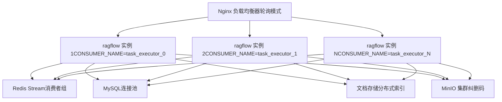

**伸缩考量：**

-   **无状态 API 服务器**：负载均衡器后的多个 `ragflow_server.py` 实例。
-   **消费者组协调**：Redis Streams 通过 `SVR_CONSUMER_GROUP_NAME` 确保每个任务仅被处理一次。
-   **数据库连接池**：使用 `PooledMySQLDatabase` / `PooledPostgresqlDatabase` 的 Peewee。
-   **文档存储分片**：每租户一个索引的模式 (`ragflow_{tenant_id}`) 实现了水平分区。
-   **对象存储**：具有纠删码的 MinIO 分布式模式。

数据源：[rag/svr/task\_executor.py108-109](https://github.com/infiniflow/ragflow/blob/80a16e71/rag/svr/task_executor.py#L108-L109) [api/db/db\_models.py32](https://github.com/infiniflow/ragflow/blob/80a16e71/api/db/db_models.py#L32-L32) [rag/nlp/search.py34](https://github.com/infiniflow/ragflow/blob/80a16e71/rag/nlp/search.py#L34-L34) [docker/README.md](https://github.com/infiniflow/ragflow/blob/80a16e71/docker/README.md)

### 性能优化技术

**批量处理：**

-   向量化批次：`EMBEDDING_BATCH_SIZE` 个切片一起处理。
-   文档存储批量插入：用于批量索引的 `DOC_BULK_SIZE`。
-   并发上传：`minio_limiter` 允许并行的对象存储操作。

**缓存：**

-   LLM 响应缓存：用于关键词提取、问题的 `get_llm_cache()` / `set_llm_cache()`。
-   标签缓存：用于内容打标签的 `get_tags_from_cache()` / `set_tags_to_cache()`。
-   基于 Redis：在多个消费者实例之间共享。

**资源限制：**

-   超时装饰器：关键函数的 `@timeout(seconds)`。
-   内存限制：Docker Compose 中的 `MEM_LIMIT`。
-   Token 预算：`message_fit_in()` 截断上下文以适应模型限制。

数据源：[rag/svr/task\_executor.py77](https://github.com/infiniflow/ragflow/blob/80a16e71/rag/svr/task_executor.py#L77-L77) [rag/svr/task\_executor.py341-348](https://github.com/infiniflow/ragflow/blob/80a16e71/rag/svr/task_executor.py#L341-L348) [api/db/services/dialog\_service.py458](https://github.com/infiniflow/ragflow/blob/80a16e71/api/db/services/dialog_service.py#L458-L458) [docker/.env63-64](https://github.com/infiniflow/ragflow/blob/80a16e71/docker/.env#L63-L64)
