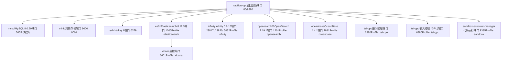
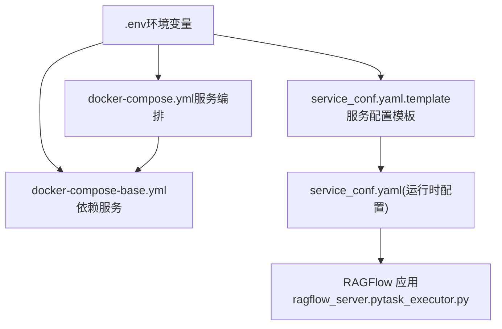
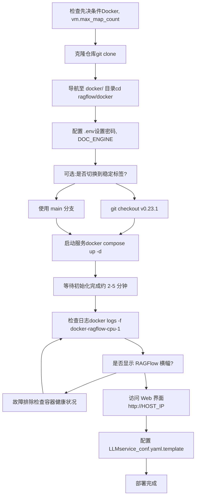
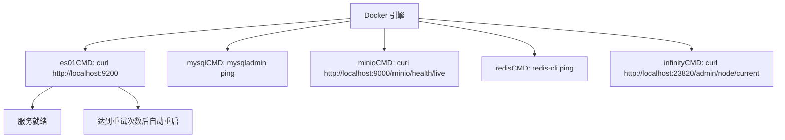

# Docker Compose 部署

相关源文件

-   [.github/workflows/release.yml](https://github.com/infiniflow/ragflow/blob/80a16e71/.github/workflows/release.yml)
-   [.github/workflows/tests.yml](https://github.com/infiniflow/ragflow/blob/80a16e71/.github/workflows/tests.yml)
-   [Dockerfile](https://github.com/infiniflow/ragflow/blob/80a16e71/Dockerfile)
-   [Dockerfile.deps](https://github.com/infiniflow/ragflow/blob/80a16e71/Dockerfile.deps)
-   [README.md](https://github.com/infiniflow/ragflow/blob/80a16e71/README.md)
-   [README\_id.md](https://github.com/infiniflow/ragflow/blob/80a16e71/README_id.md)
-   [README\_ja.md](https://github.com/infiniflow/ragflow/blob/80a16e71/README_ja.md)
-   [README\_ko.md](https://github.com/infiniflow/ragflow/blob/80a16e71/README_ko.md)
-   [README\_pt\_br.md](https://github.com/infiniflow/ragflow/blob/80a16e71/README_pt_br.md)
-   [README\_tzh.md](https://github.com/infiniflow/ragflow/blob/80a16e71/README_tzh.md)
-   [README\_zh.md](https://github.com/infiniflow/ragflow/blob/80a16e71/README_zh.md)
-   [api/db/runtime\_config.py](https://github.com/infiniflow/ragflow/blob/80a16e71/api/db/runtime_config.py)
-   [docker/.env](https://github.com/infiniflow/ragflow/blob/80a16e71/docker/.env)
-   [docker/README.md](https://github.com/infiniflow/ragflow/blob/80a16e71/docker/README.md)
-   [docs/configurations.md](https://github.com/infiniflow/ragflow/blob/80a16e71/docs/configurations.md)
-   [docs/guides/manage\_files.md](https://github.com/infiniflow/ragflow/blob/80a16e71/docs/guides/manage_files.md)
-   [docs/guides/upgrade\_ragflow.mdx](https://github.com/infiniflow/ragflow/blob/80a16e71/docs/guides/upgrade_ragflow.mdx)
-   [docs/quickstart.mdx](https://github.com/infiniflow/ragflow/blob/80a16e71/docs/quickstart.mdx)
-   [download\_deps.py](https://github.com/infiniflow/ragflow/blob/80a16e71/download_deps.py)

本文档涵盖了使用 Docker Compose 部署 RAGFlow 的相关内容，包括先决条件、配置管理、服务编排以及多引擎 Profile 选择。有关 Kubernetes 部署，请参见 [2.3](/infiniflow/ragflow/2.3-document-engine-selection)。有关 Docker 环境变量之外的配置细节，请参见 [配置管理](/infiniflow/ragflow/2.2-configuration-management)。有关文档引擎的对比，请参见 [文档引擎选择](/infiniflow/ragflow/2.3-document-engine-selection)。

---

## 目的与范围

Docker Compose 提供了 RAGFlow 的标准部署方法，将所有必需的服务作为容器在单个宿主机上进行编排。此部署方法支持：

-   用于开发、测试以及中小规模生产工作负载的 **单服务器部署**。
-   通过 Docker Compose Profile 支持 **多种文档引擎后端** (Elasticsearch, Infinity, OpenSearch, OceanBase)。
-   **可选服务**，包括 GPU 加速的嵌入推理 (TEI)、代码执行沙箱 (gVisor) 以及监控 (Kibana)。
-   适用于各种硬件配置的 **可配置资源限制** 和端口映射。

本文档假设使用 x86\_64 架构。对于 ARM64 平台，您必须按照 [构建系统与 CI/CD](/infiniflow/ragflow/2.4-build-system-and-cicd) 在本地构建 Docker 镜像。

---

## 先决条件

### 硬件要求

| 资源 | 最低要求 | 推荐要求 |
| --- | --- | --- |
| CPU | 4 核 (x86\_64) | 8 核以上 |
| 内存 (RAM) | 16 GB | 32 GB 以上 |
| 磁盘 | 50 GB | 100 GB 以上 SSD |

### 软件要求

-   **Docker** >= 24.0.0
-   **Docker Compose** >= v2.26.1
-   **gVisor** (可选，仅沙箱/代码执行功能需要)

Docker 安装必须支持 Compose V2 插件（即 `docker compose` 命令，而非 `docker-compose`）。

**数据源：** [README.md146-151](https://github.com/infiniflow/ragflow/blob/80a16e71/README.md#L146-L151) [docs/quickstart.mdx30-38](https://github.com/infiniflow/ragflow/blob/80a16e71/docs/quickstart.mdx#L30-L38)

---

## 系统内存配置

### vm.max\_map\_count 要求

RAGFlow 的文档引擎 (Elasticsearch, Infinity) 要求 `vm.max_map_count` >= 262144。该内核参数控制一个进程可以分配的最大内存映射区域数量。默认值 (65530) 对于 Elasticsearch 的运行来说是不够的。

**验证：**

```bash
sysctl vm.max_map_count
```

**临时配置（重启后重置）：**

```bash
sudo sysctl -w vm.max_map_count=262144
```

**永久配置：**

在 `/etc/sysctl.conf` 中添加或更新：

```bash
vm.max_map_count=262144
```

#### 平台特定说明

**带有 Docker Desktop 的 macOS：**

```bash
docker run --rm --privileged --pid=host alpine sysctl -w vm.max_map_count=262144
```

如需持久化，请创建具有适当设置的 `/Library/LaunchDaemons/com.user.vmmaxmap.plist`。

**带有 Docker Desktop WSL2 的 Windows：**

```bash
wsl -d docker-desktop -u root
sysctl -w vm.max_map_count=262144
```

如需持久化，请在 `%USERPROFILE%\.wslconfig` 中添加：

```ini
[wsl2]
kernelCommandLine = "sysctl.vm.max_map_count=262144"
```

**数据源：** [README.md158-178](https://github.com/infiniflow/ragflow/blob/80a16e71/README.md#L158-L178) [docs/quickstart.mdx45-183](https://github.com/infiniflow/ragflow/blob/80a16e71/docs/quickstart.mdx#L45-L183)

---

## Docker Compose 架构

### 服务拓扑

下图展示了由 Docker Compose 管理的完整服务架构，包括核心服务、可选服务及其 Profile。



### 服务定义

**核心服务 (docker-compose.yml)：**

-   `ragflow-cpu`：主应用容器，运行 API 服务器和任务执行器。
-   `mysql`：用于元数据（用户、租户、数据集、文档）的关系型数据库。
-   `minio`：用于文件二进制对象的 S3 兼容对象存储。
-   `redis`：缓存和任务队列（128MB LRU 缓存，任务消息）。

**文档引擎服务 (docker-compose-base.yml，通过 Profile 激活)：**

-   `es01`：用于全文和向量存储的 Elasticsearch。
-   `infinity`：高性能向量数据库（由 Infiniflow 开发）。
-   `opensearch01`：Elasticsearch 的兼容替代方案。
-   `oceanbase`：具有向量能力的分布式关系型数据库。

**可选服务 (docker-compose-base.yml，通过 Profile 激活)：**

-   `tei-cpu`/`tei-gpu`：用于本地嵌入生成的 Text Embeddings Inference。
-   `sandbox-executor-manager`：使用 gVisor 的隔离代码执行环境。
-   `kibana`：Elasticsearch 监控和管理界面。

**数据源：** [docker/docker-compose-base.yml1-220](https://github.com/infiniflow/ragflow/blob/80a16e71/docker/docker-compose-base.yml#L1-L220) [README.md186-206](https://github.com/infiniflow/ragflow/blob/80a16e71/README.md#L186-L206)

---

## 配置文件

### 文件层级与处理



### 配置文件说明

| 文件 | 目的 | 范围 |
| --- | --- | --- |
| `docker/.env` | Docker 环境变量、密码、端口、镜像标签 | Docker Compose |
| `docker/service_conf.yaml.template` | 带有 `${VAR}` 占位符的后端服务配置模板 | RAGFlow 应用 |
| `docker/docker-compose.yml` | 主服务定义 (ragflow-cpu) | Docker Compose |
| `docker/docker-compose-base.yml` | 依赖服务定义 | Docker Compose |
| `docker/infinity_conf.toml` | Infinity 特定配置 | Infinity 服务 |
| `docker/entrypoint.sh` | 容器启动脚本（生成 service\_conf.yaml） | RAGFlow 容器 |

### 环境变量处理流程

当 RAGFlow 容器启动时，`entrypoint.sh` 脚本会执行环境变量替换：

1.  读取 `service_conf.yaml.template`。
2.  将 `${VARIABLE_NAME}` 占位符替换为来自环境（`.env` 文件）的值。
3.  写入最终的 `service_conf.yaml`。
4.  使用生成的配置启动 `ragflow_server.py` 和 `task_executor.py`。

**示例：**

模板内容：

```yaml
mysql:
  host: ${MYSQL_HOST:-mysql}
  password: ${MYSQL_PASSWORD}
```

替换后（假设 `MYSQL_HOST=mysql`, `MYSQL_PASSWORD=infini_rag_flow`）：

```yaml
mysql:
  host: mysql
  password: infini_rag_flow
```

**数据源：** [docker/README.md16-19](https://github.com/infiniflow/ragflow/blob/80a16e71/docker/README.md#L16-L19) [README.md254-262](https://github.com/infiniflow/ragflow/blob/80a16e71/README.md#L254-L262) [docs/configurations.md14-31](https://github.com/infiniflow/ragflow/blob/80a16e71/docs/configurations.md#L14-L31)

---

## 关键环境变量

### 文档引擎选择

`DOC_ENGINE` 变量控制通过 Docker Compose Profile 激活哪个文档存储后端：

```env
# docker/.env
DOC_ENGINE=${DOC_ENGINE:-elasticsearch}
```

**可用选项：**

-   `elasticsearch` (默认)：Elasticsearch 8.11.3。
-   `infinity`：Infinity 0.6.15（高性能向量数据库）。
-   `opensearch`：OpenSearch 2.19.1（Elasticsearch 分支）。
-   `oceanbase`：OceanBase 4.4.1（支持向量的分布式 RDBMS）。

`COMPOSE_PROFILES` 变量会自动构建：

```env
COMPOSE_PROFILES=${DOC_ENGINE},${DEVICE}
```

其中 `DEVICE` 默认为 `cpu`，或为 `gpu` 以用于 DeepDoc 推理加速。

**数据源：** [docker/.env13-27](https://github.com/infiniflow/ragflow/blob/80a16e71/docker/.env#L13-L27)

### 关键连接参数

| 变量 | 默认值 | 说明 |
| --- | --- | --- |
| `MYSQL_HOST` | `mysql` | MySQL 主机名（Docker 网络中的服务名） |
| `MYSQL_PORT` | `5455` | 外部 MySQL 端口（内部：3306） |
| `MYSQL_PASSWORD` | `infini_rag_flow` | MySQL root 密码 |
| `MYSQL_DBNAME` | `rag_flow` | 主数据库名称 |
| `MINIO_HOST` | `minio` | MinIO 主机名 |
| `MINIO_PORT` | `9000` | MinIO API 端口 |
| `MINIO_USER` | `rag_flow` | MinIO root 用户 |
| `MINIO_PASSWORD` | `infini_rag_flow` | MinIO root 密码 |
| `REDIS_HOST` | `redis` | Redis 主机名 |
| `REDIS_PORT` | `6379` | Redis 端口 |
| `REDIS_PASSWORD` | `infini_rag_flow` | Redis 密码 |
| `ES_HOST` | `es01` | Elasticsearch 主机名 |
| `ES_PORT` | `1200` | 外部 Elasticsearch 端口（内部：9200） |
| `ELASTIC_PASSWORD` | `infini_rag_flow` | Elasticsearch 密码 |
| `INFINITY_HOST` | `infinity` | Infinity 主机名 |
| `INFINITY_THRIFT_PORT` | `23817` | Infinity Thrift API 端口 |
| `INFINITY_HTTP_PORT` | `23820` | Infinity HTTP API 端口 |

**安全警告：**

默认密码 (`infini_rag_flow`) 对于生产部署是 **不安全** 的。在部署到非本地环境之前，请更改所有密码：

```bash
# 生成安全密码
openssl rand -hex 32
```

**数据源：** [docker/.env1-258](https://github.com/infiniflow/ragflow/blob/80a16e71/docker/.env#L1-L258) [docker/README.md23-64](https://github.com/infiniflow/ragflow/blob/80a16e71/docker/README.md#L23-L64)

### 服务端口

| 服务 | 内部端口 | 外部端口 (默认) | 环境变量 |
| --- | --- | --- | --- |
| RAGFlow HTTP | 80 | 80 | `SVR_WEB_HTTP_PORT` |
| RAGFlow HTTPS | 443 | 443 | `SVR_WEB_HTTPS_PORT` |
| RAGFlow API | 9380 | 9380 | `SVR_HTTP_PORT` |
| MySQL | 3306 | 5455 | `MYSQL_PORT` |
| MinIO API | 9000 | 9000 | `MINIO_PORT` |
| MinIO 控制台 | 9001 | 9001 | `MINIO_CONSOLE_PORT` |
| Redis | 6379 | 6379 | `REDIS_PORT` |
| Elasticsearch | 9200 | 1200 | `ES_PORT` |
| OpenSearch | 9201 | 1201 | `OS_PORT` |
| Infinity Thrift | 23817 | 23817 | `INFINITY_THRIFT_PORT` |
| Infinity HTTP | 23820 | 23820 | `INFINITY_HTTP_PORT` |
| Kibana | 5601 | 6601 | `KIBANA_PORT` |
| TEI | 80 | 6380 | `TEI_PORT` |
| Sandbox 管理器 | 9385 | 9385 | `SANDBOX_EXECUTOR_MANAGER_PORT` |

**数据源：** [docker/.env131-237](https://github.com/infiniflow/ragflow/blob/80a16e71/docker/.env#L131-L237) [docker/README.md49-83](https://github.com/infiniflow/ragflow/blob/80a16e71/docker/README.md#L49-83)

---

## Docker Compose Profile

### Profile 选择机制

Docker Compose Profile 根据配置启用/禁用服务组。`COMPOSE_PROFILES` 环境变量决定启动哪些服务。

**Profile 组成：**

```env
# 来自 docker/.env
DOC_ENGINE=${DOC_ENGINE:-elasticsearch}
DEVICE=${DEVICE:-cpu}
COMPOSE_PROFILES=${DOC_ENGINE},${DEVICE}
```

**配置示例：**

| DOC\_ENGINE | DEVICE | COMPOSE\_PROFILES | 活动服务 |
| --- | --- | --- | --- |
| `elasticsearch` | `cpu` | `elasticsearch,cpu` | es01, mysql, minio, redis, ragflow-cpu |
| `infinity` | `cpu` | `infinity,cpu` | infinity, mysql, minio, redis, ragflow-cpu |
| `opensearch` | `cpu` | `opensearch,cpu` | opensearch01, mysql, minio, redis, ragflow-cpu |
| `elasticsearch` | `gpu` | `elasticsearch,gpu` | es01, mysql, minio, redis, ragflow-gpu |

### 添加可选服务

通过向 `COMPOSE_PROFILES` 追加内容来启用可选服务：

**启用 TEI CPU：**

```env
# docker/.env
COMPOSE_PROFILES=${COMPOSE_PROFILES},tei-cpu
```

**启用 Sandbox：**

```env
# docker/.env
SANDBOX_ENABLED=1
COMPOSE_PROFILES=${COMPOSE_PROFILES},sandbox
```

**启用 Kibana：**

```env
# docker/.env
COMPOSE_PROFILES=${COMPOSE_PROFILES},kibana
```

可以组合多个可选 Profile：

```env
COMPOSE_PROFILES=${DOC_ENGINE},${DEVICE},tei-cpu,sandbox
```

**数据源：** [docker/.env12-27](https://github.com/infiniflow/ragflow/blob/80a16e71/docker/.env#L12-L27) [docker/.env151-153](https://github.com/infiniflow/ragflow/blob/80a16e71/docker/.env#L151-L153) [docker/.env219-221](https://github.com/infiniflow/ragflow/blob/80a16e71/docker/.env#L219-L221) [docker/README.md84-125](https://github.com/infiniflow/ragflow/blob/80a16e71/docker/README.md#L84-125)

### 服务 Profile 定义

摘自 [docker/docker-compose-base.yml1-267](https://github.com/infiniflow/ragflow/blob/80a16e71/docker/docker-compose-base.yml#L1-L267)：

| 服务 | Profile | 行号 | 目的 |
| --- | --- | --- | --- |
| `es01` | `elasticsearch` | 2-34 | Elasticsearch 文档引擎 |
| `opensearch01` | `opensearch` | 36-70 | OpenSearch 文档引擎 |
| `infinity` | `infinity` | 72-97 | Infinity 向量数据库 |
| `oceanbase` | `oceanbase` | 99-122 | OceanBase 分布式数据库 |
| `sandbox-executor-manager` | `sandbox` | 124-150 | 代码执行沙箱 |
| `tei-cpu` | `tei-cpu` | 220-231 | 基于 CPU 的嵌入推理 |
| `tei-gpu` | `tei-gpu` | 234-252 | GPU 加速的嵌入推理 |
| `kibana` | `kibana` | 255-267 | Elasticsearch 监控 |
| `mysql` | (始终启用) | 152-178 | 关系型数据库 |
| `minio` | (始终启用) | 180-199 | 对象存储 |
| `redis` | (始终启用) | 201-217 | 缓存与队列 |

---

## 部署流程

### 标准部署工作流



### 分步指南

#### 1. 系统准备

设置 `vm.max_map_count`（参见上文 [系统内存配置](https://github.com/infiniflow/ragflow/blob/80a16e71/System Memory Configuration)）。

#### 2. 克隆仓库

```bash
git clone https://github.com/infiniflow/ragflow.git
cd ragflow/docker
```

**可选：使用稳定发布版本**

```bash
git checkout v0.23.1
```

这确保了 `entrypoint.sh` 脚本与 Docker 镜像版本匹配。

**数据源：** [README.md180-199](https://github.com/infiniflow/ragflow/blob/80a16e71/README.md#L180-L199) [docs/quickstart.mdx187-193](https://github.com/infiniflow/ragflow/blob/80a16e71/docs/quickstart.mdx#L187-L193)

#### 3. 配置环境

编辑 `docker/.env`：

```env
# 更改密码（生产环境必须修改）
MYSQL_PASSWORD=your_secure_password_here
MINIO_PASSWORD=your_secure_password_here
REDIS_PASSWORD=your_secure_password_here
ELASTIC_PASSWORD=your_secure_password_here

# 选择文档引擎
DOC_ENGINE=elasticsearch  # 或 infinity, opensearch, oceanbase

# 可选：启用服务
# COMPOSE_PROFILES=${COMPOSE_PROFILES},tei-cpu
# SANDBOX_ENABLED=1
# COMPOSE_PROFILES=${COMPOSE_PROFILES},sandbox
```

**中国镜像站点（如果无法访问 Docker Hub）：**

```env
# 华为云
RAGFLOW_IMAGE=swr.cn-north-4.myhuaweicloud.com/infiniflow/ragflow:v0.23.1

# 阿里云
RAGFLOW_IMAGE=registry.cn-hangzhou.aliyuncs.com/infiniflow/ragflow:v0.23.1
```

**数据源：** [docker/.env1-6](https://github.com/infiniflow/ragflow/blob/80a16e71/docker/.env#L1-L6) [README\_zh.md218-221](https://github.com/infiniflow/ragflow/blob/80a16e71/README_zh.md#L218-L221) [docker/.env140-148](https://github.com/infiniflow/ragflow/blob/80a16e71/docker/.env#L140-L148)

#### 4. 启动服务

```bash
docker compose -f docker-compose.yml up -d
```

此命令将：

-   下载所需的 Docker 镜像（约 2 GB 压缩大小，解压后约 7 GB）。
-   为持久化数据创建 Docker 卷。
-   按依赖顺序启动服务。
-   立即返回控制权（脱离模式）。

**GPU 加速（可选）：**

```bash
# 为 DeepDoc 任务启用 GPU
sed -i '1i DEVICE=gpu' .env
docker compose -f docker-compose.yml up -d
```

**数据源：** [README.md194-206](https://github.com/infiniflow/ragflow/blob/80a16e71/README.md#L194-L206) [docs/quickstart.mdx197-200](https://github.com/infiniflow/ragflow/blob/80a16e71/docs/quickstart.mdx#L197-L200)

#### 5. 验证启动状态

监视主容器日志：

```bash
docker logs -f docker-ragflow-cpu-1
```

**成功启动标志：**

```
     ____   ___    ______ ______ __
    / __ \ /   |  / ____// ____// /____  _      __
   / /_/ // /| | / / __ / /_   / // __ \| | /| / /
  / _, _// ___ |/ /_/ // __/  / // /_/ /| |/ |/ /
 /_/ |_|/_/  |_|\____//_/    /_/ \____/ |__/|__/

 * Running on all addresses (0.0.0.0)
```

**典型启动时间：** 2-5 分钟（取决于硬件和文档引擎）。

**数据源：** [README.md220-235](https://github.com/infiniflow/ragflow/blob/80a16e71/README.md#L220-L235) [docs/quickstart.mdx220-238](https://github.com/infiniflow/ragflow/blob/80a16e71/docs/quickstart.mdx#L220-L238)

#### 6. 访问 Web 界面

打开浏览器访问：

```
http://<YOUR_SERVER_IP>
```

默认省略 80 端口。如需自定义端口，请参见 [更改 HTTP 端口](https://github.com/infiniflow/ragflow/blob/80a16e71/Changing the HTTP Port)。

**警告：** 在日志中看到启动横幅之前，请勿访问界面。应用可能尚未完全初始化，从而导致“network abnormal”错误。

**数据源：** [README.md239-245](https://github.com/infiniflow/ragflow/blob/80a16e71/README.md#L239-L245) [docs/quickstart.mdx242-245](https://github.com/infiniflow/ragflow/blob/80a16e71/docs/quickstart.mdx#L242-L245)

#### 7. 配置 LLM

在使用 RAGFlow 之前，请配置至少一个 LLM 提供商：

1.  在 Web 界面中访问 **设置 (Settings)** > **模型提供商 (Model Providers)**。
2.  为您选择的提供商（OpenAI, Anthropic, Google 等）添加 API 密钥。
3.  在 **系统模型设置 (System Model Settings)** 中设置默认模型。

或者，在启动前编辑 `docker/service_conf.yaml.template`：

```yaml
user_default_llm:
  "OpenAI-API-Compatible":
    api_key: "your-api-key-here"
```

修改后重启容器：

```bash
docker compose -f docker-compose.yml down
docker compose -f docker-compose.yml up -d
```

**数据源：** [README.md244-248](https://github.com/infiniflow/ragflow/blob/80a16e71/README.md#L244-L248) [docs/quickstart.mdx247-269](https://github.com/infiniflow/ragflow/blob/80a16e71/docs/quickstart.mdx#L247-L269)

---

## 切换文档引擎

### 流程

更改文档引擎 **需要删除数据**，因为不同的引擎使用不兼容的存储格式和索引结构。

**步骤：**

1.  **停止所有容器并移除卷：**

    ```bash
    docker compose -f docker-compose.yml down -v
    ```

    **警告：** `-v` 标志会删除所有 Docker 卷，永久移除已上传的文件、解析的文档和向量嵌入。

2.  **更新 docker/.env 中的 DOC\_ENGINE：**

    ```env
    # 切换到 Infinity
    DOC_ENGINE=infinity
    ```

3.  **重启服务：**

    ```bash
    docker compose -f docker-compose.yml up -d
    ```

**数据源：** [README.md273-291](https://github.com/infiniflow/ragflow/blob/80a16e71/README.md#L273-L291) [docs/quickstart.mdx273-291](https://github.com/infiniflow/ragflow/blob/80a16e71/docs/quickstart.mdx#L273-L291)

### 文档引擎特性

| 引擎 | 类型 | 优势 | 局限性 |
| --- | --- | --- | --- |
| Elasticsearch | 全文 + 向量 | 成熟、功能全、工具链丰富 | 内存占用较高 (~8GB) |
| Infinity | 向量优化 | 高性能、资源占用低 | 较新、工具链较少 |
| OpenSearch | 全文 + 向量 | Elasticsearch 兼容、开放治理 | 资源需求与 ES 类似 |
| OceanBase | 关系 + 向量 | ACID 事务、分布式架构 | 设置复杂、主要面向中国市场 |

有关详细对比，请参见 [文档引擎选择](/infiniflow/ragflow/2.3-document-engine-selection)。

**数据源：** [docker/.env13-19](https://github.com/infiniflow/ragflow/blob/80a16e71/docker/.env#L13-L19) [docker/README.md24-37](https://github.com/infiniflow/ragflow/blob/80a16e71/docker/README.md#L24-L37)

---

## 资源管理

### 内存限制

Docker Compose 实施内存限制以防止容器过度消耗：

```env
# docker/.env
MEM_LIMIT=8073741824  # 8 GB (字节为单位)
```

此限制适用于：

-   Elasticsearch (`es01`)
-   OpenSearch (`opensearch01`)
-   Infinity (`infinity`)
-   OceanBase (`oceanbase`)

**docker-compose-base.yml 中的配置：**

```yaml
es01:
  mem_limit: ${MEM_LIMIT}
  ulimits:
    memlock:
      soft: -1
      hard: -1
```

**根据可用内存进行调整：**

根据系统总 RAM 更新 `MEM_LIMIT`：

| 系统内存 | 推荐 MEM\_LIMIT |
| --- | --- |
| 16 GB | 8 GB (8073741824) |
| 32 GB | 16 GB (17179869184) |
| 64 GB | 32 GB (34359738368) |

**数据源：** [docker/.env63-64](https://github.com/infiniflow/ragflow/blob/80a16e71/docker/.env#L63-L64) [docker/docker-compose-base.yml22](https://github.com/infiniflow/ragflow/blob/80a16e71/docker/docker-compose-base.yml#L22-L22) [docker/README.md46-48](https://github.com/infiniflow/ragflow/blob/80a16e71/docker/README.md#L46-L48)

### 磁盘水位线 (Elasticsearch/OpenSearch)

Elasticsearch 和 OpenSearch 使用磁盘水位线阈值来防止磁盘耗尽：

```yaml
environment:
  - cluster.routing.allocation.disk.watermark.low=5gb
  - cluster.routing.allocation.disk.watermark.high=3gb
  - cluster.routing.allocation.disk.watermark.flood_stage=2gb
```

-   **低水位线 (5GB)：** 不向该节点分配新分片。
-   **高水位线 (3GB)：** 将分片迁移到其他节点。
-   **泛滥阶段 (2GB)：** 索引变为只读。

请确保至少有 10GB 的空闲磁盘空间供文档引擎运行。

**数据源：** [docker/docker-compose-base.yml19-21](https://github.com/infiniflow/ragflow/blob/80a16e71/docker/docker-compose-base.yml#L19-L21) [docker/docker-compose-base.yml54-56](https://github.com/infiniflow/ragflow/blob/80a16e71/docker/docker-compose-base.yml#L54-L56)

---

## 健康检查

### 容器健康监控

所有关键服务都定义了 Docker 监视的健康检查命令：



### 健康检查配置

摘自 [docker/docker-compose-base.yml27-33](https://github.com/infiniflow/ragflow/blob/80a16e71/docker/docker-compose-base.yml#L27-L33)：

```yaml
healthcheck:
  test: ["CMD-SHELL", "curl http://localhost:9200"]
  interval: 10s
  timeout: 10s
  retries: 120
```

**参数：**

-   `interval`：检查频率（10 秒）。
-   `timeout`：最大检查持续时间（10 秒）。
-   `retries`：标记为不健康之前的连续失败次数（120 次 = 20 分钟）。

### 检查服务健康状况

**查看所有容器状态：**

```bash
docker compose ps
```

输出内容包含健康状态（healthy / unhealthy / starting）。

**检查特定服务：**

```bash
docker inspect docker-es01-1 | grep -A 10 Health
```

**常用健康检查命令：**

| 服务 | 健康检查命令 |
| --- | --- |
| Elasticsearch | `curl http://localhost:9200` |
| OpenSearch | `curl http://localhost:9201` |
| Infinity | `curl http://localhost:23820/admin/node/current` |
| MySQL | `mysqladmin ping -uroot -p${MYSQL_PASSWORD}` |
| MinIO | `curl -f http://localhost:9000/minio/health/live` |
| Redis | `redis-cli -a ${REDIS_PASSWORD} ping` |
| Sandbox | `curl http://localhost:9385/healthz` |

**数据源：** [docker/docker-compose-base.yml27-217](https://github.com/infiniflow/ragflow/blob/80a16e71/docker/docker-compose-base.yml#L27-L217)

---

## 网络配置

### Docker 网络拓扑

所有服务都通过名为 `ragflow` 的专用 Docker 桥接网络进行通信：

```yaml
networks:
  ragflow:
    name: ragflow
    driver: bridge
```

服务之间通过容器名称（如 `mysql`, `minio`, `es01`）相互引用，Docker DNS 会在网络内部进行解析。

### 更改 HTTP 端口

如需更改 RAGFlow 的外部 HTTP 端口（默认 80）：

**编辑 docker/docker-compose.yml：**

```yaml
services:
  ragflow:
    ports:
      - "${SVR_WEB_HTTP_PORT}:80"  # 仅更改冒号左侧
```

**更新 docker/.env：**

```env
SVR_WEB_HTTP_PORT=8080  # 设置新的外部端口
```

**重启：**

```bash
docker compose -f docker-compose.yml up -d
```

访问地址为 `http://<HOST_IP>:8080`。

**警告：** 内部端口（冒号右侧的 `80`）必须保持不变。仅可更改外部端口（左侧）。

**数据源：** [README.md264-266](https://github.com/infiniflow/ragflow/blob/80a16e71/README.md#L264-L266) [docs/configurations.md20-22](https://github.com/infiniflow/ragflow/blob/80a16e71/docs/configurations.md#L20-L22)

### 开发环境的主机名解析

在从源码运行 RAGFlow（而非通过 Docker）时，请将服务主机名添加到 `/etc/hosts`：

```text
127.0.0.1  es01 infinity opensearch01 mysql minio redis sandbox-executor-manager oceanbase
```

这允许 RAGFlow 应用解析 `service_conf.yaml` 中配置的服务名称。

**数据源：** [README.md337-341](https://github.com/infiniflow/ragflow/blob/80a16e71/README.md#L337-L341)

---

## 数据持久化

### Docker 卷

持久化数据存储在命名的 Docker 卷中：

| 卷名称 | 服务 | 存储的数据 |
| --- | --- | --- |
| `esdata01` | Elasticsearch | 索引、文档、向量 |
| `osdata01` | OpenSearch | 索引、文档、向量 |
| `infinity_data` | Infinity | 向量数据库文件 |
| `mysql_data` | MySQL | 关系表、元数据 |
| `minio_data` | MinIO | 上传的文件、对象 |
| `redis_data` | Redis | 缓存、任务队列消息 |

**列出所有卷：**

```bash
docker volume ls | grep ragflow
```

**检查卷的物理路径：**

```bash
docker volume inspect docker_mysql_data
```

**备份考量：**

-   **MySQL：** 使用 `mysqldump` 或对 `mysql_data` 卷进行快照。
-   **MinIO：** 使用 `mc mirror` 或对 `minio_data` 卷进行快照。
-   **文档引擎：** 导出索引或对数据卷进行快照。

**警告：** `docker compose down -v` 会删除所有卷。请使用 `docker compose down`（不带 `-v`）以在重启之间保留数据。

**数据源：** [docker/docker-compose-base.yml6-209](https://github.com/infiniflow/ragflow/blob/80a16e71/docker/docker-compose-base.yml#L6-L209)

---

## 故障排除

### 容器启动失败

**检查容器日志：**

```bash
docker logs docker-ragflow-cpu-1
docker logs docker-es01-1
docker logs docker-mysql-1
```

**常见问题：**

1.  **vm.max\_map\_count 过低：**
    -   症状：`max virtual memory areas vm.max_map_count [65530] is too low, increase to at least [262144]`
    -   解决：设置 `vm.max_map_count=262144`（参见 [系统内存配置](https://github.com/infiniflow/ragflow/blob/80a16e71/System Memory Configuration)）。
2.  **内存不足：**
    -   症状：Elasticsearch / Infinity 容器立即退出。
    -   解决：在 `.env` 中调大 `MEM_LIMIT`，或减少其他容器的内存占用。
3.  **端口冲突：**
    -   症状：`bind: address already in use`
    -   解决：在 `.env` 中更改冲突的端口（如 `MYSQL_PORT`, `ES_PORT`）。

**数据源：** [docs/quickstart.mdx73-76](https://github.com/infiniflow/ragflow/blob/80a16e71/docs/quickstart.mdx#L73-L76) [docs/quickstart.mdx157-159](https://github.com/infiniflow/ragflow/blob/80a16e71/docs/quickstart.mdx#L157-L159)

### 无法连接文档引擎

**错误：** `Can't connect to ES cluster` 或类似提示。

**检查项：**

1.  **验证服务健康状况：**
    ```bash
    docker compose ps
    ```
2.  **检查文档引擎日志：**
    ```bash
    docker logs docker-es01-1
    # 或
    docker logs docker-infinity-1
    ```
3.  **验证 DOC\_ENGINE 与运行的服务是否匹配：**
    ```bash
    grep DOC_ENGINE .env
    docker ps | grep -E 'es01|infinity|opensearch|oceanbase'
    ```
4.  **从 RAGFlow 容器测试连通性：**
    ```bash
    docker exec docker-ragflow-cpu-1 curl http://es01:9200
    # 或
    docker exec docker-ragflow-cpu-1 curl http://infinity:23820/admin/node/current
    ```

**数据源：** [docs/quickstart.mdx73-76](https://github.com/infiniflow/ragflow/blob/80a16e71/docs/quickstart.mdx#L73-L76)

### 文档解析停滞

**症状：** 解析进度卡在 <1% 或接近完成。

**潜在原因：**

1.  **Redis 队列问题：** 重启 Redis 容器。
2.  **任务执行器未运行：** 检查 `docker logs docker-ragflow-cpu-1 | grep task_executor`。
3.  **文档引擎过载：** 检查内存占用和磁盘空间。

**解决：**

```bash
# 重启所有服务
docker compose -f docker-compose.yml restart

# 检查任务执行器状态
docker exec docker-ragflow-cpu-1 ps aux | grep task_executor
```

**数据源：** [docs/quickstart.mdx298-301](https://github.com/infiniflow/ragflow/blob/80a16e71/docs/quickstart.mdx#L298-L301)

### 权限被拒绝 (Permission Denied) 错误

**症状：** 访问卷时提示 `Permission denied`。

**解决：**

确保 Docker 有权访问卷挂载点。在 Linux 上可能需要执行：

```bash
sudo chown -R $(id -u):$(id -g) docker/
```

或者使用 `sudo` 运行 Docker 命令。

---

## 升级 RAGFlow

### 升级流程

升级到 RAGFlow 新版本：

1.  **停止服务：**
    ```bash
    docker compose -f docker-compose.yml down
    ```
2.  **拉取最新代码：**
    ```bash
    git pull
    ```
3.  **更新 .env 中的镜像标签：**
    ```env
    RAGFLOW_IMAGE=infiniflow/ragflow:v0.24.0  # 示例
    ```
4.  **重启服务：**
    ```bash
    docker compose -f docker-compose.yml up -d
    ```

**重要：** 除非您打算删除所有数据，否则请勿在 `down` 命令中使用 `-v` 标志。

有关特定版本的升级注意事项，请参见 [升级](https://github.com/infiniflow/ragflow/blob/80a16e71/Upgrading)。

**数据源：** [docs/guides/upgrade\_ragflow.mdx14-30](https://github.com/infiniflow/ragflow/blob/80a16e71/docs/guides/upgrade_ragflow.mdx#L14-L30)

---

## 高级配置

### 启用可选服务

**TEI 嵌入服务 (CPU)：**

```env
# docker/.env
COMPOSE_PROFILES=${COMPOSE_PROFILES},tei-cpu
TEI_MODEL=BAAI/bge-small-en-v1.5  # 可选：更改模型
```

**Sandbox 代码执行：**

```env
# docker/.env
SANDBOX_ENABLED=1
COMPOSE_PROFILES=${COMPOSE_PROFILES},sandbox

# 首先拉取基础镜像
# docker pull infiniflow/sandbox-base-python:latest
# docker pull infiniflow/sandbox-base-nodejs:latest
```

**数据源：** [docker/.env151-240](https://github.com/infiniflow/ragflow/blob/80a16e71/docker/.env#L151-L240)

### 存储后端替代方案

**AWS S3：**

```env
# docker/.env
STORAGE_IMPL=S3
AWS_ACCESS_KEY=your_access_key
AWS_SECRET_KEY=your_secret_key
AWS_REGION=us-east-1
AWS_BUCKET=ragflow-data
```

**阿里云 OSS：**

```env
# docker/.env
STORAGE_IMPL=OSS
ACCESS_KEY=your_access_key
SECRET_KEY=your_secret_key
ENDPOINT=http://oss-cn-hangzhou.aliyuncs.com
REGION=cn-hangzhou
BUCKET=ragflow65536
```

**数据源：** [docker/.env206-212](https://github.com/infiniflow/ragflow/blob/80a16e71/docker/.env#L206-L212)

### 自定义 Docker 网络

如需将 RAGFlow 与现有的 Docker 基础设施集成，请使用外部网络：

```yaml
# docker-compose.yml
networks:
  ragflow:
    external: true
    name: my-existing-network
```

确保所有依赖服务（MySQL, MinIO, Redis, 文档引擎）都在同一个网络中。

---

## 数据源摘要

**主要配置文件：**

-   [docker/.env1-258](https://github.com/infiniflow/ragflow/blob/80a16e71/docker/.env#L1-L258) - 环境变量及默认值。
-   [docker/docker-compose-base.yml1-267](https://github.com/infiniflow/ragflow/blob/80a16e71/docker/docker-compose-base.yml#L1-L267) - 依赖服务定义。
-   [docker/README.md1-264](https://github.com/infiniflow/ragflow/blob/80a16e71/docker/README.md#L1-L264) - Docker 配置文档。
-   [docker/infinity\_conf.toml1-40](https://github.com/infiniflow/ragflow/blob/80a16e71/docker/infinity_conf.toml#L1-L40) - Infinity 服务配置。

**部署文档：**

-   [README.md143-291](https://github.com/infiniflow/ragflow/blob/80a16e71/README.md#L143-L291) - 主要部署说明。
-   [README\_zh.md143-293](https://github.com/infiniflow/ragflow/blob/80a16e71/README_zh.md#L143-L293) - 中文部署指南。
-   [docs/quickstart.mdx1-363](https://github.com/infiniflow/ragflow/blob/80a16e71/docs/quickstart.mdx#L1-L363) - 详细的快速入门指南。
-   [docs/configurations.md1-280](https://github.com/infiniflow/ragflow/blob/80a16e71/docs/configurations.md#L1-L280) - 配置参考。
-   [docs/guides/upgrade\_ragflow.mdx1-89](https://github.com/infiniflow/ragflow/blob/80a16e71/docs/guides/upgrade_ragflow.mdx#L1-L89) - 升级流程。

**架构参考：**

-   [pyproject.toml1-9](https://github.com/infiniflow/ragflow/blob/80a16e71/pyproject.toml#L1-L9) - RAGFlow 版本及元数据。
-   [helm/values.yaml1-185](https://github.com/infiniflow/ragflow/blob/80a16e71/helm/values.yaml#L1-L185) - 对应的 Kubernetes 配置。
-   [common/constants.py1-201](https://github.com/infiniflow/ragflow/blob/80a16e71/common/constants.py#L1-L201) - 系统常量及枚举。
-   [common/data\_source/config.py1-186](https://github.com/infiniflow/ragflow/blob/80a16e71/common/data_source/config.py#L1-L186) - 数据源配置。
