# 系统架构 (System Architecture)

相关源文件：

-   [README.md](https://github.com/infiniflow/ragflow/blob/80a16e71/README.md)
-   [README_id.md](https://github.com/infiniflow/ragflow/blob/80a16e71/README_id.md)
-   [README_ja.md](https://github.com/infiniflow/ragflow/blob/80a16e71/README_ja.md)
-   [README_ko.md](https://github.com/infiniflow/ragflow/blob/80a16e71/README_ko.md)
-   [README_pt_br.md](https://github.com/infiniflow/ragflow/blob/80a16e71/README_pt_br.md)
-   [README_tzh.md](https://github.com/infiniflow/ragflow/blob/80a16e71/README_tzh.md)
-   [README_zh.md](https://github.com/infiniflow/ragflow/blob/80a16e71/README_zh.md)
-   [admin/client/README.md](https://github.com/infiniflow/ragflow/blob/80a16e71/admin/client/README.md)
-   [admin/client/http_client.py](https://github.com/infiniflow/ragflow/blob/80a16e71/admin/client/http_client.py)
-   [admin/client/parser.py](https://github.com/infiniflow/ragflow/blob/80a16e71/admin/client/parser.py)
-   [admin/client/pyproject.toml](https://github.com/infiniflow/ragflow/blob/80a16e71/admin/client/pyproject.toml)
-   [admin/client/ragflow_cli.py](https://github.com/infiniflow/ragflow/blob/80a16e71/admin/client/ragflow_cli.py)
-   [admin/client/ragflow_client.py](https://github.com/infiniflow/ragflow/blob/80a16e71/admin/client/ragflow_client.py)
-   [admin/client/user.py](https://github.com/infiniflow/ragflow/blob/80a16e71/admin/client/user.py)
-   [admin/server/admin_server.py](https://github.com/infiniflow/ragflow/blob/80a16e71/admin/server/admin_server.py)
-   [admin/server/auth.py](https://github.com/infiniflow/ragflow/blob/80a16e71/admin/server/auth.py)
-   [admin/server/config.py](https://github.com/infiniflow/ragflow/blob/80a16e71/admin/server/config.py)
-   [admin/server/routes.py](https://github.com/infiniflow/ragflow/blob/80a16e71/admin/server/routes.py)
-   [admin/server/services.py](https://github.com/infiniflow/ragflow/blob/80a16e71/admin/server/services.py)
-   [api/apps/chunk_app.py](https://github.com/infiniflow/ragflow/blob/80a16e71/api/apps/chunk_app.py)
-   [api/apps/conversation_app.py](https://github.com/infiniflow/ragflow/blob/80a16e71/api/apps/conversation_app.py)
-   [api/apps/document_app.py](https://github.com/infiniflow/ragflow/blob/80a16e71/api/apps/document_app.py)
-   [api/apps/file2document_app.py](https://github.com/infiniflow/ragflow/blob/80a16e71/api/apps/file2document_app.py)
-   [api/apps/file_app.py](https://github.com/infiniflow/ragflow/blob/80a16e71/api/apps/file_app.py)
-   [api/apps/kb_app.py](https://github.com/infiniflow/ragflow/blob/80a16e71/api/apps/kb_app.py)
-   [api/constants.py](https://github.com/infiniflow/ragflow/blob/80a16e71/api/constants.py)
-   [api/db/db_models.py](https://github.com/infiniflow/ragflow/blob/80a16e71/api/db/db_models.py)
-   [api/db/services/dialog_service.py](https://github.com/infiniflow/ragflow/blob/80a16e71/api/db/services/dialog_service.py)
-   [api/db/services/document_service.py](https://github.com/infiniflow/ragflow/blob/80a16e71/api/db/services/document_service.py)
-   [api/db/services/file_service.py](https://github.com/infiniflow/ragflow/blob/80a16e71/api/db/services/file_service.py)
-   [api/db/services/knowledgebase_service.py](https://github.com/infiniflow/ragflow/blob/80a16e71/api/db/services/knowledgebase_service.py)
-   [api/db/services/system_settings_service.py](https://github.com/infiniflow/ragflow/blob/80a16e71/api/db/services/system_settings_service.py)
-   [api/db/services/task_service.py](https://github.com/infiniflow/ragflow/blob/80a16e71/api/db/services/task_service.py)
-   [api/ragflow_server.py](https://github.com/infiniflow/ragflow/blob/80a16e71/api/ragflow_server.py)
-   [api/utils/configs.py](https://github.com/infiniflow/ragflow/blob/80a16e71/api/utils/configs.py)
-   [api/utils/health_utils.py](https://github.com/infiniflow/ragflow/blob/80a16e71/api/utils/health_utils.py)
-   [common/connection_utils.py](https://github.com/infiniflow/ragflow/blob/80a16e71/common/connection_utils.py)
-   [conf/system_settings.json](https://github.com/infiniflow/ragflow/blob/80a16e71/conf/system_settings.json)
-   [docker/.env](https://github.com/infiniflow/ragflow/blob/80a16e71/docker/.env)
-   [docker/README.md](https://github.com/infiniflow/ragflow/blob/80a16e71/docker/README.md)
-   [docs/configurations.md](https://github.com/infiniflow/ragflow/blob/80a16e71/docs/configurations.md)
-   [docs/guides/manage_files.md](https://github.com/infiniflow/ragflow/blob/80a16e71/docs/guides/manage_files.md)
-   [docs/guides/upgrade_ragflow.mdx](https://github.com/infiniflow/ragflow/blob/80a16e71/docs/guides/upgrade_ragflow.mdx)
-   [docs/quickstart.mdx](https://github.com/infiniflow/ragflow/blob/80a16e71/docs/quickstart.mdx)
-   [rag/nlp/search.py](https://github.com/infiniflow/ragflow/blob/80a16e71/rag/nlp/search.py)
-   [rag/svr/task_executor.py](https://github.com/infiniflow/ragflow/blob/80a16e71/rag/svr/task_executor.py)

## 目的与范围 (Purpose and Scope)

本文档描述了 RAGFlow 的整体系统架构，包括核心服务层、存储架构和数据流模式。它提供了主要组件如何交互以提供 RAG（检索增强生成）能力的技术概览。

有关特定子系统的详细信息，请参阅：

-   核心应用服务 (Core application services) (`ragflow_server`, `task_executor` 等)：参见 [核心应用服务 (Core Application Services)](/zh/3-system-architecture/3.1-core-application-services)
-   存储后端配置：参见 [数据存储架构 (Data Storage Architecture)](/zh/3-system-architecture/3.2-data-storage-architecture)
-   异步任务处理：参见 [任务执行与队列系统 (Task Execution and Queue System)](/zh/3-system-architecture/3.3-task-execution-and-queue-system)
-   文档处理流水线：参见 [文档处理流水线 (Document Processing Pipeline)](/zh/6-document-processing-pipeline)
-   LLM 集成：参见 [LLM 集成系统 (LLM Integration System)](/zh/5-llm-integration-system)
-   Agent 工作流：参见 [Agent 与工作流系统 (Agent and Workflow System)](/zh/9-agent-and-workflow-system)

## 架构分层 (Architectural Layers)

RAGFlow 被组织成六个不同的架构层，以实现关注点分离，并支持独立扩展和部署：

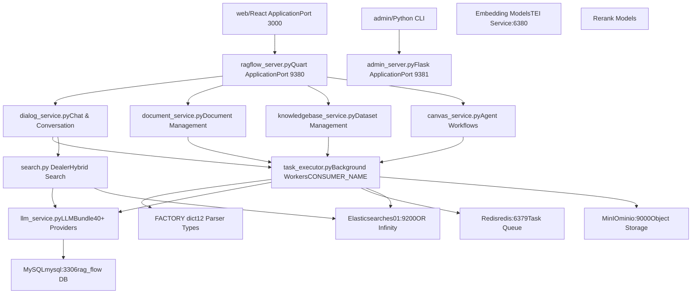
**数据源：** [README.md:137-141](https://github.com/infiniflow/ragflow/blob/80a16e71/README.md#L137-L141) [api/ragflow_server.py:1-144](https://github.com/infiniflow/ragflow/blob/80a16e71/api/ragflow_server.py#L1-L144) [rag/svr/task_executor.py:1-100](https://github.com/infiniflow/ragflow/blob/80a16e71/rag/svr/task_executor.py#L1-L100) [docker/.env:1-199](https://github.com/infiniflow/ragflow/blob/80a16e71/docker/.env#L1-L199)

## 服务组件与初始化 (Service Components and Initialization)

### 主服务器进程 (Main Server Processes)

RAGFlow 运行三个主要服务器进程，分别处理不同的职责：

| 进程 | 文件 | 端口 | 框架 | 用途 |
| --- | --- | --- | --- | --- |
| **RAGFlow Server** | `api/ragflow_server.py` | 9380 | Quart (async) | HTTP API 端点、聊天、数据集管理 |
| **Admin Server** | `admin/admin_server.py` | 9381 | Flask | 用户管理、服务监控、RBAC |
| **Task Executor** | `rag/svr/task_executor.py` | N/A | asyncio | 后台文档处理工作线程 |

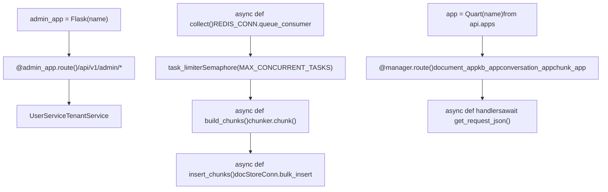
**数据源：** [api/ragflow_server.py:1-144](https://github.com/infiniflow/ragflow/blob/80a16e71/api/ragflow_server.py#L1-L144) [rag/svr/task_executor.py:110-131](https://github.com/infiniflow/ragflow/blob/80a16e71/rag/svr/task_executor.py#L110-L131) [admin/server/routes.py:1-600](https://github.com/infiniflow/ragflow/blob/80a16e71/admin/server/routes.py#L1-L600)

### 服务器初始化序列 (Server Initialization Sequence)

`ragflow_server.py` 的初始化遵循以下序列：

> **[Mermaid sequence]**
> *(图表结构无法解析)*

[api/ragflow_server.py:40-144](https://github.com/infiniflow/ragflow/blob/80a16e71/api/ragflow_server.py#L40-L144) 中的关键初始化代码：

-   `init_web_db()`：创建 MySQL 数据库表
-   `init_web_data()`：播种初始配置数据
-   `RuntimeConfig.load()`：加载运行时设置
-   `app.run(host="0.0.0.0", port=9380)`：启动 Quart 服务器

**数据源：** [api/ragflow_server.py:40-144](https://github.com/infiniflow/ragflow/blob/80a16e71/api/ragflow_server.py#L40-L144) [api/db/db_models.py:1-600](https://github.com/infiniflow/ragflow/blob/80a16e71/api/db/db_models.py#L1-L600) [docker/.env:149-154](https://github.com/infiniflow/ragflow/blob/80a16e71/docker/.env#L149-L154)

## 数据流架构 (Data Flow Architecture)

### 文档摄取流 (Document Ingestion Flow)

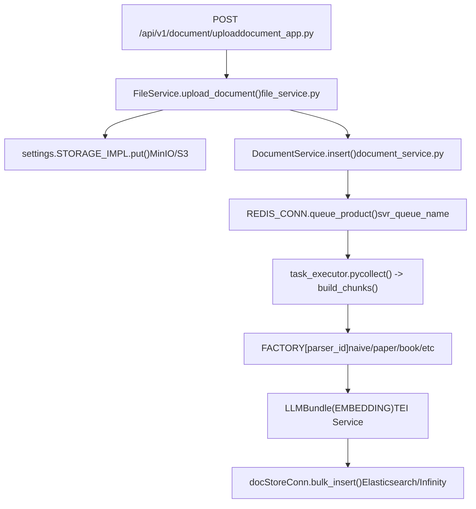
**关键常量：**

-   `BATCH_SIZE = 64` [rag/svr/task_executor.py:81](https://github.com/infiniflow/ragflow/blob/80a16e71/rag/svr/task_executor.py#L81-L81)
-   `MAX_CONCURRENT_TASKS = 5` [rag/svr/task_executor.py:122](https://github.com/infiniflow/ragflow/blob/80a16e71/rag/svr/task_executor.py#L122-L122)
-   `MAX_CONCURRENT_CHUNK_BUILDERS = 1` [rag/svr/task_executor.py:123](https://github.com/infiniflow/ragflow/blob/80a16e71/rag/svr/task_executor.py#L123-L123)

**数据源：** [api/apps/document_app.py:52-98](https://github.com/infiniflow/ragflow/blob/80a16e71/api/apps/document_app.py#L52-L98) [rag/svr/task_executor.py:242-514](https://github.com/infiniflow/ragflow/blob/80a16e71/rag/svr/task_executor.py#L242-L514) [api/db/services/file_service.py:1-800](https://github.com/infiniflow/ragflow/blob/80a16e71/api/db/services/file_service.py#L1-L800)

### 聊天/RAG 查询流 (Chat/RAG Query Flow)

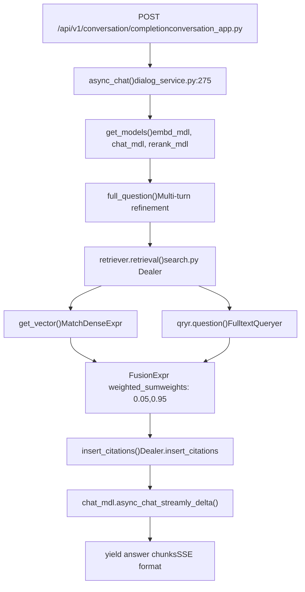
**关键查询处理函数：**

-   `async_chat()` [api/db/services/dialog_service.py:275-580](https://github.com/infiniflow/ragflow/blob/80a16e71/api/db/services/dialog_service.py#L275-L580)
-   `Dealer.search()` [rag/nlp/search.py:75-172](https://github.com/infiniflow/ragflow/blob/80a16e71/rag/nlp/search.py#L75-L172)
-   `insert_citations()` [rag/nlp/search.py:178-266](https://github.com/infiniflow/ragflow/blob/80a16e71/rag/nlp/search.py#L178-L266)

**数据源：** [api/apps/conversation_app.py:1-600](https://github.com/infiniflow/ragflow/blob/80a16e71/api/apps/conversation_app.py#L1-L600) [api/db/services/dialog_service.py:275-580](https://github.com/infiniflow/ragflow/blob/80a16e71/api/db/services/dialog_service.py#L275-L580) [rag/nlp/search.py:37-266](https://github.com/infiniflow/ragflow/blob/80a16e71/rag/nlp/search.py#L37-L266)

## 存储架构细节 (Storage Architecture Detail)

### 数据库模式组织 (Database Schema Organization)

RAGFlow 使用 MySQL 进行元数据存储，包含以下关键表：


**主要模型：**

-   `Tenant` [api/db/db_models.py:400-450](https://github.com/infiniflow/ragflow/blob/80a16e71/api/db/db_models.py#L400-L450)
-   `Knowledgebase` [api/db/db_models.py:500-550](https://github.com/infiniflow/ragflow/blob/80a16e71/api/db/db_models.py#L500-L550)
-   `Document` [api/db/db_models.py:600-700](https://github.com/infiniflow/ragflow/blob/80a16e71/api/db/db_models.py#L600-L700)
-   `Task` [api/db/db_models.py:800-850](https://github.com/infiniflow/ragflow/blob/80a16e71/api/db/db_models.py#L800-L850)
-   `Dialog` [api/db/db_models.py:900-950](https://github.com/infiniflow/ragflow/blob/80a16e71/api/db/db_models.py#L900-L950)

**数据源：** [api/db/db_models.py:1-1500](https://github.com/infiniflow/ragflow/blob/80a16e71/api/db/db_models.py#L1-L1500) [docker/.env:109-123](https://github.com/infiniflow/ragflow/blob/80a16e71/docker/.env#L109-L123)

### 文档存储配置 (Document Store Configuration)

文档存储是可插拔的，通过 `DOC_ENGINE` 环境变量进行配置：

| 引擎 | 主机:端口 | 向量索引 | 全文检索 | 配置 |
| --- | --- | --- | --- | --- |
| **Elasticsearch** | `es01:9200` | ✅ 余弦相似度 | ✅ BM25 | `DOC_ENGINE=elasticsearch` |
| **Infinity** | `infinity:23817` | ✅ 余弦相似度 | ✅ 全文检索 | `DOC_ENGINE=infinity` |
| **OpenSearch** | `opensearch01:9201` | ✅ HNSW | ✅ BM25 | `DOC_ENGINE=opensearch` |
| **OceanBase** | `oceanbase:2881` | ✅ 向量扩展 | ✅ SQL | `DOC_ENGINE=oceanbase` |

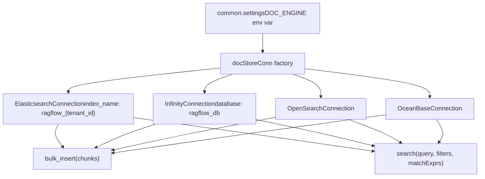
**索引结构：**

-   索引名称：`ragflow_{tenant_id}` [rag/nlp/search.py:34](https://github.com/infiniflow/ragflow/blob/80a16e71/rag/nlp/search.py#L34-L34)
-   向量字段：`q_{dimension}_vec` (例如 `q_768_vec`)
-   文本字段：`content_ltks`, `title_tks`, `question_tks`
-   元数据字段：`docnm_kwd`, `kb_id`, `doc_id`, `page_num_int`

**数据源：** [docker/.env:13-20](https://github.com/infiniflow/ragflow/blob/80a16e71/docker/.env#L13-L20) [rag/nlp/search.py:34-62](https://github.com/infiniflow/ragflow/blob/80a16e71/rag/nlp/search.py#L34-L62) [common/doc_store/doc_store_base.py:1-300](https://github.com/infiniflow/ragflow/blob/80a16e71/common/doc_store/doc_store_base.py#L1-L300)

### Redis 队列架构 (Redis Queue Architecture)

Redis 有两个用途：缓存和任务队列管理。

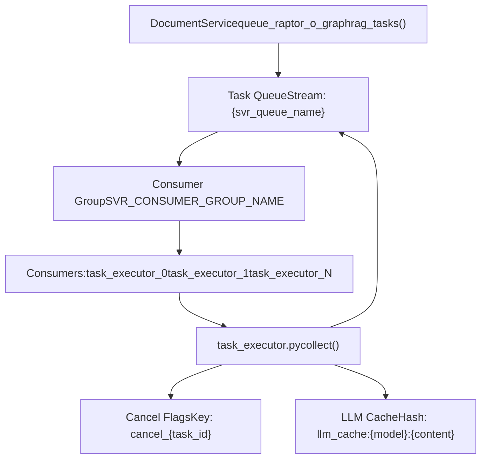
**队列配置：**

-   Stream 名称：通过 `settings.get_svr_queue_names()` 可配置 [rag/svr/task_executor.py:177](https://github.com/infiniflow/ragflow/blob/80a16e71/rag/svr/task_executor.py#L177-L177)
-   消费者组：`SVR_CONSUMER_GROUP_NAME` [common/constants.py:79](https://github.com/infiniflow/ragflow/blob/80a16e71/common/constants.py#L79-L79)
-   消费者名称：`task_executor_{CONSUMER_NO}` [rag/svr/task_executor.py:113](https://github.com/infiniflow/ragflow/blob/80a16e71/rag/svr/task_executor.py#L113-L113)

**任务消息格式：**

```
{
    "id": "task_id",
    "doc_id": "document_id",
    "task_type": "dataflow|raptor|graphrag|mindmap|memory",
    "tenant_id": "tenant_id",
    "kb_id": "kb_id"
}
```
**数据源：** [rag/svr/task_executor.py:173-234](https://github.com/infiniflow/ragflow/blob/80a16e71/rag/svr/task_executor.py#L173-L234) [api/db/services/document_service.py:400-500](https://github.com/infiniflow/ragflow/blob/80a16e71/api/db/services/document_service.py#L400-L500) [rag/utils/redis_conn.py:1-300](https://github.com/infiniflow/ragflow/blob/80a16e71/rag/utils/redis_conn.py#L1-L300)

## 并发控制 (Concurrency Control)

### 基于信号量的速率限制 (Semaphore-Based Rate Limiting)

任务执行器使用 asyncio 信号量来限制并发操作：

```mermaid
flowchart TD
    TaskLim["task_limiterSemaphore(MAX_CONCURRENT_TASKS=5)"]
    ChunkLim["chunk_limiterSemaphore(MAX_CONCURRENT_CHUNK_BUILDERS=1)"]
    EmbedLim["embed_limiterSemaphore(MAX_CONCURRENT_CHUNK_BUILDERS=1)"]
    MinioLim["minio_limiterSemaphore(MAX_CONCURRENT_MINIO=10)"]
    KGLim["kg_limiterSemaphore(2)"]
    ChatLim["chat_limiterSemaphore(10)"]
    TaskLoop["async for task in collect()"]
    ChunkBuild["build_chunks()Document parsing"]
    EmbedGen["embedding()Vector generation"]
    MinioOp["upload_to_minio()Image storage"]
    KGExtract["run_graphrag_for_kb()Knowledge graph"]
    LLMCall["keyword_extraction()question_proposal()"]

    TaskLoop --> TaskLim
    ChunkBuild --> ChunkLim
    EmbedGen --> EmbedLim
    MinioOp --> MinioLim
    KGExtract --> KGLim
    LLMCall --> ChatLim
```
**通过环境变量配置：**

-   `MAX_CONCURRENT_TASKS`：总任务并发数 [rag/svr/task_executor.py:122](https://github.com/infiniflow/ragflow/blob/80a16e71/rag/svr/task_executor.py#L122-L122)
-   `MAX_CONCURRENT_CHUNK_BUILDERS`：解析并发数 [rag/svr/task_executor.py:123](https://github.com/infiniflow/ragflow/blob/80a16e71/rag/svr/task_executor.py#L123-L123)
-   `MAX_CONCURRENT_MINIO`：存储操作并发数 [rag/svr/task_executor.py:124](https://github.com/infiniflow/ragflow/blob/80a16e71/rag/svr/task_executor.py#L124-L124)

**数据源：** [rag/svr/task_executor.py:122-129](https://github.com/infiniflow/ragflow/blob/80a16e71/rag/svr/task_executor.py#L122-L129) [graphrag/utils.py:1-100](https://github.com/infiniflow/ragflow/blob/80a16e71/graphrag/utils.py#L1-L100)

### 任务取消机制 (Task Cancellation Mechanism)

> **[Mermaid sequence]**
> *(图表结构无法解析)*

**实现细节：**

-   检查：`has_canceled(task_id)` [api/db/services/task_service.py:100-120](https://github.com/infiniflow/ragflow/blob/80a16e71/api/db/services/task_service.py#L100-L120)
-   抛出：`TaskCanceledException` [common/exceptions.py:20-30](https://github.com/infiniflow/ragflow/blob/80a16e71/common/exceptions.py#L20-L30)
-   调用位置：`set_progress()` [rag/svr/task_executor.py:141-171](https://github.com/infiniflow/ragflow/blob/80a16e71/rag/svr/task_executor.py#L141-L171)

**数据源：** [rag/svr/task_executor.py:141-171](https://github.com/infiniflow/ragflow/blob/80a16e71/rag/svr/task_executor.py#L141-L171) [api/db/services/task_service.py:100-120](https://github.com/infiniflow/ragflow/blob/80a16e71/api/db/services/task_service.py#L100-L120) [common/exceptions.py:1-50](https://github.com/infiniflow/ragflow/blob/80a16e71/common/exceptions.py#L1-L50)

## 请求处理模式 (Request Processing Patterns)

### 异步请求处理 (Async Request Handling)

RAGFlow 服务器使用 Quart（异步 Flask）进行并发请求处理：

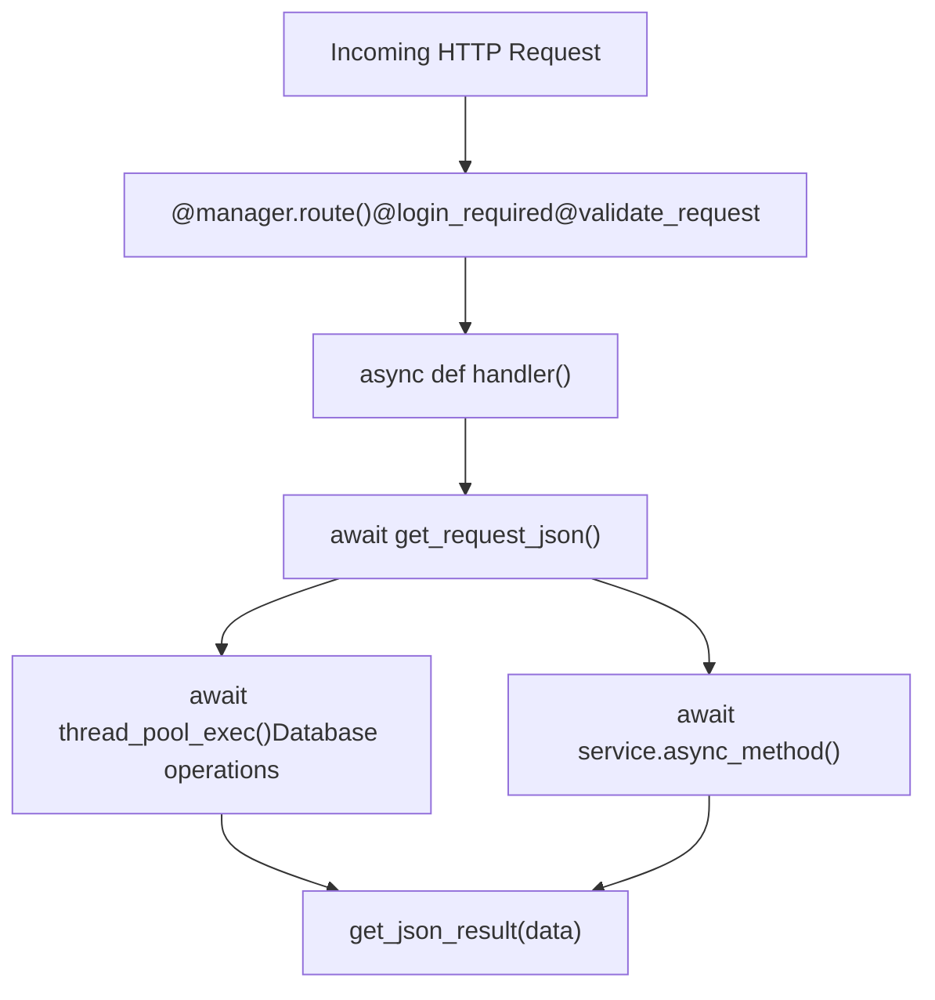
**关键模式：**

-   `@manager.route()`：路由注册 [api/apps/document_app.py:52](https://github.com/infiniflow/ragflow/blob/80a16e71/api/apps/document_app.py#L52-L52)
-   `@login_required`：认证装饰器 [api/apps/__init__.py:50-80](https://github.com/infiniflow/ragflow/blob/80a16e71/api/apps/__init__.py#L50-L80)
-   `@validate_request()`：请求校验 [api/utils/api_utils.py:100-150](https://github.com/infiniflow/ragflow/blob/80a16e71/api/utils/api_utils.py#L100-L150)
-   `await get_request_json()`：解析 JSON 正文 [api/utils/api_utils.py:50-70](https://github.com/infiniflow/ragflow/blob/80a16e71/api/utils/api_utils.py#L50-L70)
-   `await thread_pool_exec()`：在线程池中运行阻塞代码 [common/misc_utils.py:30-60](https://github.com/infiniflow/ragflow/blob/80a16e71/common/misc_utils.py#L30-L60)

**数据源：** [api/apps/document_app.py:52-98](https://github.com/infiniflow/ragflow/blob/80a16e71/api/apps/document_app.py#L52-L98) [api/utils/api_utils.py:1-200](https://github.com/infiniflow/ragflow/blob/80a16e71/api/utils/api_utils.py#L1-L200) [common/misc_utils.py:1-100](https://github.com/infiniflow/ragflow/blob/80a16e71/common/misc_utils.py#L1-L100)

### 流式响应模式 (Streaming Response Pattern)

对于实时聊天响应，RAGFlow 使用服务器发送事件 (SSE)：

> **[Mermaid sequence]**
> *(图表结构无法解析)*

**实现细节：**

-   生成器：`async_chat()` 生成字典 [api/db/services/dialog_service.py:275-580](https://github.com/infiniflow/ragflow/blob/80a16e71/api/db/services/dialog_service.py#L275-L580)
-   格式：每个分块为 `{"answer": str, "reference": dict, "final": bool}`
-   流式 LLM：`async_chat_streamly_delta()` [api/db/services/llm_service.py:200-300](https://github.com/infiniflow/ragflow/blob/80a16e71/api/db/services/llm_service.py#L200-L300)

**数据源：** [api/db/services/dialog_service.py:275-580](https://github.com/infiniflow/ragflow/blob/80a16e71/api/db/services/dialog_service.py#L275-L580) [api/apps/conversation_app.py:200-400](https://github.com/infiniflow/ragflow/blob/80a16e71/api/apps/conversation_app.py#L200-L400)

## 配置管理 (Configuration Management)

### 多级配置 (Multi-Tier Configuration)

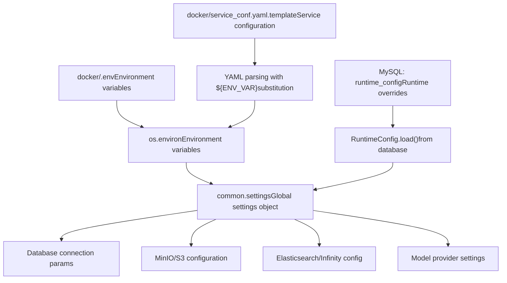
**关键配置文件：**

-   `.env`：基础设施设置 [docker/.env:1-199](https://github.com/infiniflow/ragflow/blob/80a16e71/docker/.env#L1-L199)
    -   `DOC_ENGINE`, `MYSQL_HOST`, `REDIS_HOST`, `MINIO_HOST`
-   `service_conf.yaml.template`：服务默认值 [docker/service_conf.yaml.template:1-300](https://github.com/infiniflow/ragflow/blob/80a16e71/docker/service_conf.yaml.template#L1-L300)
    -   LLM 提供商、嵌入模型、解析器配置
-   `RuntimeConfig` 表：每个租户的运行时设置 [api/db/runtime_config.py:1-100](https://github.com/infiniflow/ragflow/blob/80a16e71/api/db/runtime_config.py#L1-L100)

**环境变量替换：**

```
# service_conf.yaml.template
mysql:
  host: ${MYSQL_HOST}  # 替换为来自 .env 的值
  port: ${MYSQL_PORT}
  db: ${MYSQL_DBNAME}
```
**数据源：** [docker/.env:1-199](https://github.com/infiniflow/ragflow/blob/80a16e71/docker/.env#L1-L199) [docker/README.md:1-300](https://github.com/infiniflow/ragflow/blob/80a16e71/docker/README.md#L1-L300) [api/db/runtime_config.py:1-100](https://github.com/infiniflow/ragflow/blob/80a16e71/api/db/runtime_config.py#L1-L100) [common/settings.py:1-200](https://github.com/infiniflow/ragflow/blob/80a16e71/common/settings.py#L1-L200)

## 部署架构 (Deployment Architecture)

### Docker Compose 服务拓扑 (Docker Compose Service Topology)

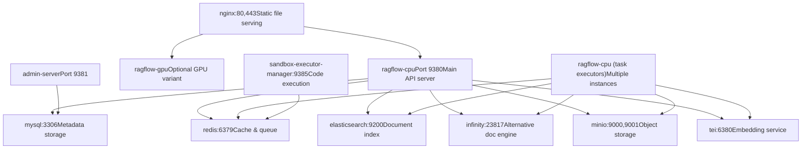
**服务配置文件：**

-   基础配置文件：`elasticsearch,cpu` [docker/.env:28](https://github.com/infiniflow/ragflow/blob/80a16e71/docker/.env#L28-L28)
-   GPU 变体：`elasticsearch,gpu`
-   备选引擎：`infinity,cpu` 或 `opensearch,cpu`

**端口映射：**

-   HTTP API：`80:80` (nginx) → `9380` (ragflow-cpu) [docker/.env:150-152](https://github.com/infiniflow/ragflow/blob/80a16e71/docker/.env#L150-L152)
-   Admin API：`9381:9381` [docker/.env:153](https://github.com/infiniflow/ragflow/blob/80a16e71/docker/.env#L153-L153)
-   MySQL：`5455:3306` (外部访问) [docker/.env:121](https://github.com/infiniflow/ragflow/blob/80a16e71/docker/.env#L121-L121)
-   Redis：`6379:6379` [docker/.env:144](https://github.com/infiniflow/ragflow/blob/80a16e71/docker/.env#L144-L144)

**数据源：** [docker/docker-compose.yml:1-500](https://github.com/infiniflow/ragflow/blob/80a16e71/docker/docker-compose.yml#L1-L500) [docker/.env:1-199](https://github.com/infiniflow/ragflow/blob/80a16e71/docker/.env#L1-L199) [docker/README.md:13-100](https://github.com/infiniflow/ragflow/blob/80a16e71/docker/README.md#L13-L100)

## 关键架构模式 (Key Architectural Patterns)

### 文档解析器工厂模式 (Factory Pattern for Document Parsers)

系统使用工厂字典来动态选择文档解析器：

```python
# rag/svr/task_executor.py:83-100
FACTORY = {
    "general": naive,
    ParserType.NAIVE.value: naive,
    ParserType.PAPER.value: paper,
    ParserType.BOOK.value: book,
    ParserType.PRESENTATION.value: presentation,
    ParserType.MANUAL.value: manual,
    ParserType.LAWS.value: laws,
    ParserType.QA.value: qa,
    ParserType.TABLE.value: table,
    ParserType.RESUME.value: resume,
    ParserType.PICTURE.value: picture,
    ParserType.ONE.value: one,
    ParserType.AUDIO.value: audio,
    ParserType.EMAIL.value: email,
    ParserType.KG.value: naive,
    ParserType.TAG.value: tag
}

# 在 build_chunks() 中的用法
chunker = FACTORY[task["parser_id"].lower()]
cks = await thread_pool_exec(
    chunker.chunk,
    task["name"],
    binary=binary,
    ...
)
```
**数据源：** [rag/svr/task_executor.py:83-100](https://github.com/infiniflow/ragflow/blob/80a16e71/rag/svr/task_executor.py#L83-L100) [rag/svr/task_executor.py:248](https://github.com/infiniflow/ragflow/blob/80a16e71/rag/svr/task_executor.py#L248-L248)

### 服务层模式 (Service Layer Pattern)

数据库操作被封装在服务类中：

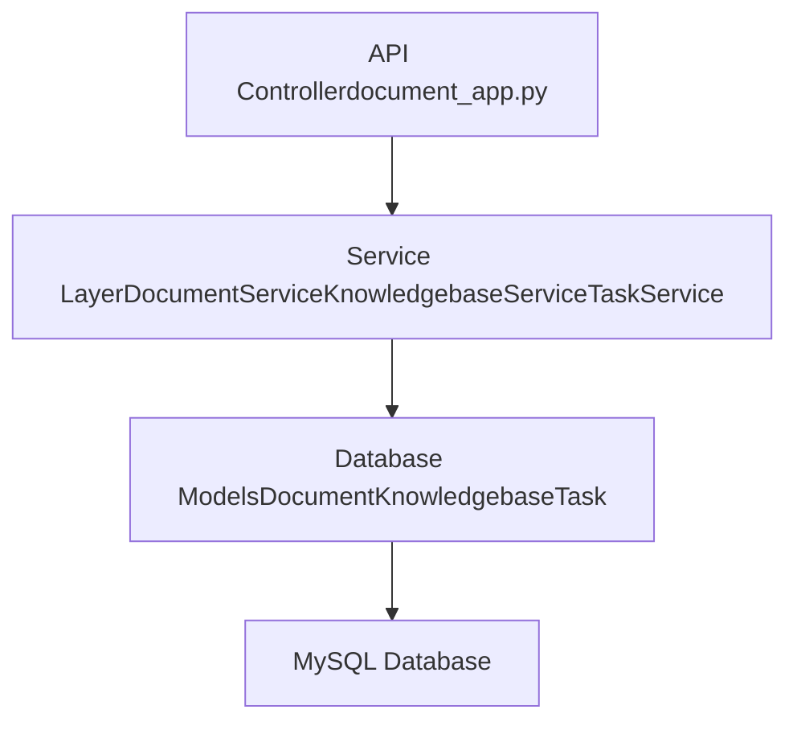
**通用服务模式：**

```python
class DocumentService(CommonService):
    model = Document

    @classmethod
    @DB.connection_context()
    def get_by_kb_id(cls, kb_id, page, size, ...):
        docs = cls.model.select().where(
            cls.model.kb_id == kb_id
        )
        return list(docs.dicts()), count
```
**关键服务：**

-   `DocumentService` [api/db/services/document_service.py:46-1000](https://github.com/infiniflow/ragflow/blob/80a16e71/api/db/services/document_service.py#L46-L1000)
-   `KnowledgebaseService` [api/db/services/knowledgebase_service.py:1-600](https://github.com/infiniflow/ragflow/blob/80a16e71/api/db/services/knowledgebase_service.py#L1-L600)
-   `DialogService` [api/db/services/dialog_service.py:50-1000](https://github.com/infiniflow/ragflow/blob/80a16e71/api/db/services/dialog_service.py#L50-L1000)
-   `TaskService` [api/db/services/task_service.py:1-500](https://github.com/infiniflow/ragflow/blob/80a16e71/api/db/services/task_service.py#L1-L500)

**数据源：** [api/db/services/document_service.py:46-150](https://github.com/infiniflow/ragflow/blob/80a16e71/api/db/services/document_service.py#L46-L150) [api/db/services/common_service.py:1-100](https://github.com/infiniflow/ragflow/blob/80a16e71/api/db/services/common_service.py#L1-L100)

### 混合检索的 Dealer 模式 (Dealer Pattern for Hybrid Search)

`Dealer` 类抽象了跨不同文档引擎的检索操作：

```python
# rag/nlp/search.py:37-172
class Dealer:
    def __init__(self, dataStore: DocStoreConnection):
        self.qryr = query.FulltextQueryer()
        self.dataStore = dataStore

    async def search(self, req, idx_names, kb_ids, emb_mdl=None, ...):
        # 关键词检索
        matchText, keywords = self.qryr.question(qst, min_match=0.3)

        # 向量检索
        matchDense = await self.get_vector(qst, emb_mdl, topk, ...)$

        # 融合
        fusionExpr = FusionExpr("weighted_sum", topk,
                               {"weights": "0.05,0.95"})

        res = await thread_pool_exec(
            self.dataStore.search,
            src, highlightFields, filters,
            [matchText, matchDense, fusionExpr],
            ...
        )
        return self.SearchResult(total=total, ids=ids, ...)
```
**数据源：** [rag/nlp/search.py:37-172](https://github.com/infiniflow/ragflow/blob/80a16e71/rag/nlp/search.py#L37-L172)

这种架构使 RAGFlow 能够处理复杂的 RAG 工作负载，具有清晰的关注点分离、可扩展的处理能力和灵活的部署选项。
