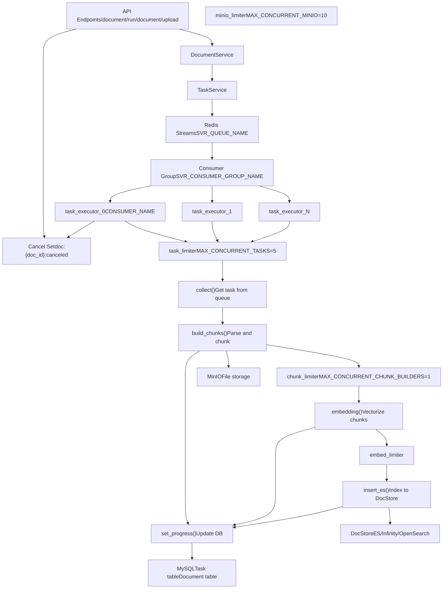
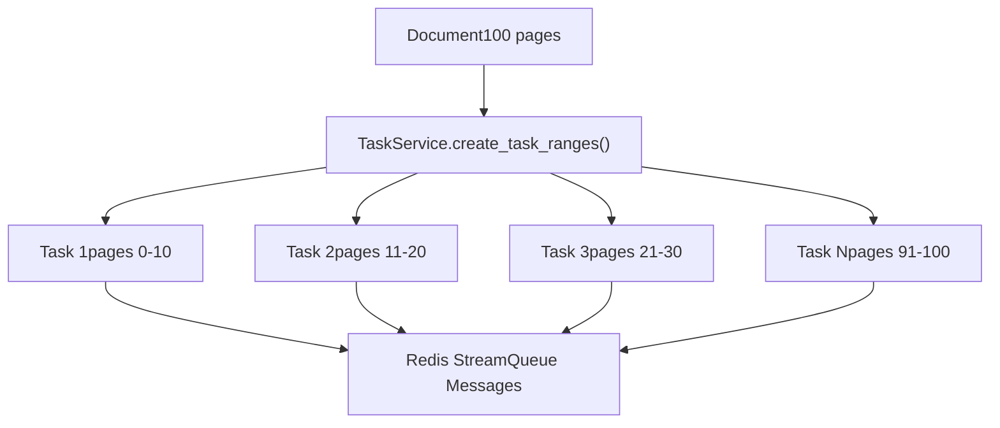
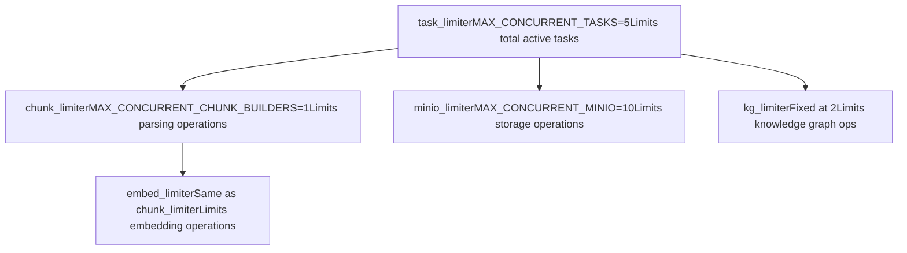
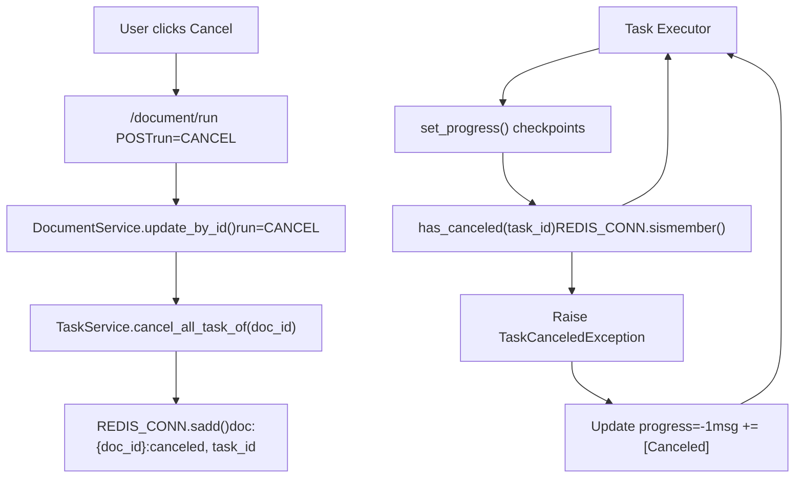
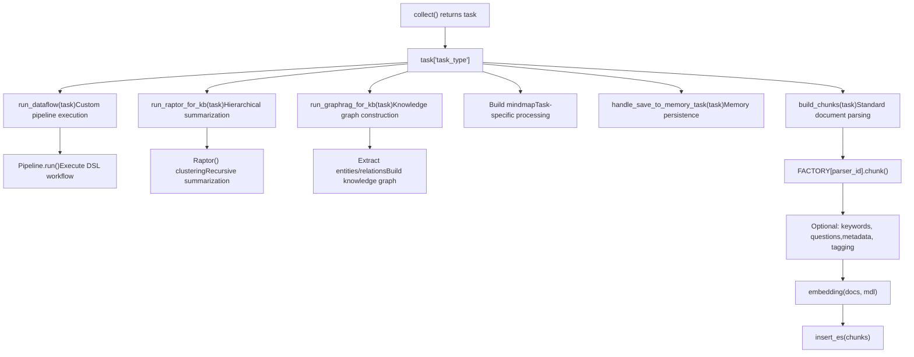

# 任务执行与队列系统

相关源文件

-   [api/apps/chunk_app.py](https://github.com/infiniflow/ragflow/blob/80a16e71/api/apps/chunk_app.py)
-   [api/apps/connector_app.py](https://github.com/infiniflow/ragflow/blob/80a16e71/api/apps/connector_app.py)
-   [api/apps/conversation_app.py](https://github.com/infiniflow/ragflow/blob/80a16e71/api/apps/conversation_app.py)
-   [api/apps/document_app.py](https://github.com/infiniflow/ragflow/blob/80a16e71/api/apps/document_app.py)
-   [api/apps/file2document_app.py](https://github.com/infiniflow/ragflow/blob/80a16e71/api/apps/file2document_app.py)
-   [api/apps/file_app.py](https://github.com/infiniflow/ragflow/blob/80a16e71/api/apps/file_app.py)
-   [api/apps/kb_app.py](https://github.com/infiniflow/ragflow/blob/80a16e71/api/apps/kb_app.py)
-   [api/db/db_models.py](https://github.com/infiniflow/ragflow/blob/80a16e71/api/db/db_models.py)
-   [api/db/services/connector_service.py](https://github.com/infiniflow/ragflow/blob/80a16e71/api/db/services/connector_service.py)
-   [api/db/services/dialog_service.py](https://github.com/infiniflow/ragflow/blob/80a16e71/api/db/services/dialog_service.py)
-   [api/db/services/document_service.py](https://github.com/infiniflow/ragflow/blob/80a16e71/api/db/services/document_service.py)
-   [api/db/services/file_service.py](https://github.com/infiniflow/ragflow/blob/80a16e71/api/db/services/file_service.py)
-   [api/db/services/knowledgebase_service.py](https://github.com/infiniflow/ragflow/blob/80a16e71/api/db/services/knowledgebase_service.py)
-   [api/db/services/task_service.py](https://github.com/infiniflow/ragflow/blob/80a16e71/api/db/services/task_service.py)
-   [api/utils/common.py](https://github.com/infiniflow/ragflow/blob/80a16e71/api/utils/common.py)
-   [common/constants.py](https://github.com/infiniflow/ragflow/blob/80a16e71/common/constants.py)
-   [common/data_source/__init__.py](https://github.com/infiniflow/ragflow/blob/80a16e71/common/data_source/__init__.py)
-   [common/data_source/config.py](https://github.com/infiniflow/ragflow/blob/80a16e71/common/data_source/config.py)
-   [docker/docker-compose-base.yml](https://github.com/infiniflow/ragflow/blob/80a16e71/docker/docker-compose-base.yml)
-   [docker/infinity_conf.toml](https://github.com/infiniflow/ragflow/blob/80a16e71/docker/infinity_conf.toml)
-   [helm/values.yaml](https://github.com/infiniflow/ragflow/blob/80a16e71/helm/values.yaml)
-   [pyproject.toml](https://github.com/infiniflow/ragflow/blob/80a16e71/pyproject.toml)
-   [rag/nlp/search.py](https://github.com/infiniflow/ragflow/blob/80a16e71/rag/nlp/search.py)
-   [rag/svr/sync_data_source.py](https://github.com/infiniflow/ragflow/blob/80a16e71/rag/svr/sync_data_source.py)
-   [rag/svr/task_executor.py](https://github.com/infiniflow/ragflow/blob/80a16e71/rag/svr/task_executor.py)
-   [sdk/python/pyproject.toml](https://github.com/infiniflow/ragflow/blob/80a16e71/sdk/python/pyproject.toml)
-   [sdk/python/uv.lock](https://github.com/infiniflow/ragflow/blob/80a16e71/sdk/python/uv.lock)
-   [uv.lock](https://github.com/infiniflow/ragflow/blob/80a16e71/uv.lock)
-   [web/src/pages/user-setting/data-source/constant/index.tsx](https://github.com/infiniflow/ragflow/blob/80a16e71/web/src/pages/user-setting/data-source/constant/index.tsx)

## 目的与范围

本文档介绍了 RAGFlow 用于文档处理的异步任务执行系统，该系统负责解析、分块、嵌入以及 RAPTOR 和 GraphRAG 等高级操作。系统使用 Redis Streams 作为任务队列，通过多个工作进程并发地消费任务。有关文档处理流水线本身（解析策略、分块方法）的信息，请参阅[文档处理流水线](/infiniflow/ragflow/6-document-processing-pipeline)。有关触发任务执行的 API 端点，请参阅[文档与文件管理 API](/infiniflow/ragflow/8.4-document-and-file-management-apis)。

---

## 系统架构概述


**来源**: [rag/svr/task_executor.py1-124](https://github.com/infiniflow/ragflow/blob/80a16e71/rag/svr/task_executor.py#L1-L124) [api/db/services/task_service.py1-70](https://github.com/infiniflow/ragflow/blob/80a16e71/api/db/services/task_service.py#L1-L70) [api/db/services/document_service.py623-748](https://github.com/infiniflow/ragflow/blob/80a16e71/api/db/services/document_service.py#L623-L748)

---

## Redis 队列基础设施

任务队列系统使用 **Redis Streams** 通过消费者组进行可靠的消息传递。每个任务执行器（task executor）工作线程都注册为共享消费者组中的一个消费者，从而实现自动负载均衡和容错。

### 队列配置

| 常量 | 值 | 描述 |
| --- | --- | --- |
| `SVR_CONSUMER_GROUP_NAME` | 来自设置 | 所有工作线程的消费者组名称 |
| `CONSUMER_NAME` | `task_executor_{N}` | 每个工作进程的唯一名称 |
| `BOOT_AT` | ISO 时间戳 | 工作线程启动时间 |
| `WORKER_HEARTBEAT_TIMEOUT` | 120 秒 | 工作线程健康检查超时时间 |

**来源**: [common/constants.py1-100](https://github.com/infiniflow/ragflow/blob/80a16e71/common/constants.py#L1-L100) [rag/svr/task_executor.py105-111](https://github.com/infiniflow/ragflow/blob/80a16e71/rag/svr/task_executor.py#L105-L111)

### 消息结构

任务作为 JSON 消息排队，结构如下：

```
{
    "id": "task_uuid",
    "doc_id": "document_uuid",
    "task_type": "dataflow" | "raptor" | "graphrag" | "mindmap" | "memory",
    "tenant_id": "tenant_uuid",
    "kb_id": "knowledgebase_uuid",
    "dataflow_id": "pipeline_uuid",  # 用于 dataflow 任务
    "doc_ids": [],  # 用于 raptor/graphrag 任务
}
```
**来源**: [rag/svr/task_executor.py166-228](https://github.com/infiniflow/ragflow/blob/80a16e71/rag/svr/task_executor.py#L166-L228) [api/db/services/document_service.py623-748](https://github.com/infiniflow/ragflow/blob/80a16e71/api/db/services/document_service.py#L623-L748)

### 任务收集算法

> **[Mermaid sequence]**
> *(图表结构无法解析)*

**来源**: [rag/svr/task_executor.py166-228](https://github.com/infiniflow/ragflow/blob/80a16e71/rag/svr/task_executor.py#L166-L228)

`collect()` 函数实现了两阶段检索策略：

1.  **未确认迭代器（Unacked Iterator）**: 首先检查之前已被消费但未确认的消息（崩溃的工作线程恢复）
2.  **消费者组读取（Consumer Group Read）**: 如果没有未确认的消息，则从消费者组执行阻塞读取

**来源**: [rag/svr/task_executor.py166-184](https://github.com/infiniflow/ragflow/blob/80a16e71/rag/svr/task_executor.py#L166-L184)

---

## 任务创建与分发

### 文档解析任务创建

当文档被上传或重新运行时，系统会创建页码范围任务以进行并行处理：


**来源**: [api/db/services/task_service.py283-401](https://github.com/infiniflow/ragflow/blob/80a16e71/api/db/services/task_service.py#L283-L401)

### 任务范围计算

对于 PDF 文档，系统按页码范围拆分：

```
# 来自 TaskService.create_task_ranges()
ranges = []
page_size = 10  # 每个任务默认页数

for i in range(0, total_pages, page_size):
    ranges.append({
        "from_page": i,
        "to_page": min(i + page_size, total_pages)
    })
```
对于其他文件类型（Excel、非分页格式），将创建一个 `from_page=0` 且 `to_page=-1` 的单个任务。

**来源**: [api/db/services/task_service.py283-401](https://github.com/infiniflow/ragflow/blob/80a16e71/api/db/services/task_service.py#L283-L401)

### 特殊任务类型

除了文档解析外，系统还支持具有不同分发逻辑的特殊任务类型：

| 任务类型 | 用途 | doc_id | 分发逻辑 |
| --- | --- | --- | --- |
| `dataflow` | 自定义流水线执行 | 普通或 `CANVAS_DEBUG_DOC_ID` | 每个文档一个任务 |
| `raptor` | 分层摘要 | `GRAPH_RAPTOR_FAKE_DOC_ID` | 每个知识库（KB）一个任务 |
| `graphrag` | 知识图谱构建 | `GRAPH_RAPTOR_FAKE_DOC_ID` | 每个知识库一个任务 |
| `mindmap` | 脑图生成 | `GRAPH_RAPTOR_FAKE_DOC_ID` | 每个知识库一个任务 |
| `memory` | 记忆持久化 | 变化 | 每个记忆操作一个任务 |

**来源**: [rag/svr/task_executor.py95-101](https://github.com/infiniflow/ragflow/blob/80a16e71/rag/svr/task_executor.py#L95-L101) [api/db/services/task_service.py38-39](https://github.com/infiniflow/ragflow/blob/80a16e71/api/db/services/task_service.py#L38-L39)

---

## 任务执行器工作模式

### 工作线程生命周期

> **[Mermaid stateDiagram]**
> *(图表结构无法解析)*

**来源**: [rag/svr/task_executor.py127-164](https://github.com/infiniflow/ragflow/blob/80a16e71/rag/svr/task_executor.py#L127-L164)

### 主事件循环

工作线程运行一个异步事件循环，不断收集并处理任务：

```
# 从 task_executor.py 主循环简化
async def main():
    while not stop_event.is_set():
        redis_msg, task = await collect()

        if not task:
            continue

        try:
            await process_task(task)
            redis_msg.ack()
        except Exception as e:
            logging.exception(f"Task {task['id']} failed: {e}")
            # 下一个收集周期处理重试
```
**来源**: [rag/svr/task_executor.py1000-1100](https://github.com/infiniflow/ragflow/blob/80a16e71/rag/svr/task_executor.py#L1000-L1100)

### 信号处理

工作线程注册信号处理器以便优雅停机：

```
def signal_handler(sig, frame):
    logging.info("Received interrupt signal, shutting down...")
    stop_event.set()
    time.sleep(1)
    sys.exit(0)

signal.signal(signal.SIGINT, signal_handler)
signal.signal(signal.SIGTERM, signal_handler)
```
**来源**: [rag/svr/task_executor.py127-131](https://github.com/infiniflow/ragflow/blob/80a16e71/rag/svr/task_executor.py#L127-L131)

---

## 并发控制

系统使用 **asyncio 信号量（Semaphores）** 来限制并发操作并防止资源耗尽：

### 信号量配置


**来源**: [rag/svr/task_executor.py115-122](https://github.com/infiniflow/ragflow/blob/80a16e71/rag/svr/task_executor.py#L115-L122)

### 信号量使用模式

```
# 来自 build_chunks()
async def build_chunks(task, progress_callback):
    # 受 minio_limiter 限制的文件检索（隐式）
    binary = await get_storage_binary(bucket, name)

    # 受 chunk_limiter 限制的分块操作
    async with chunk_limiter:
        chunks = await asyncio.to_thread(
            chunker.chunk,
            task["name"],
            binary=binary,
            ...
        )

    # 受 embed_limiter 限制的嵌入操作
    async with embed_limiter:
        vectors, token_count = await asyncio.to_thread(
            mdl.encode,
            texts
        )
```
**来源**: [rag/svr/task_executor.py234-608](https://github.com/infiniflow/ragflow/blob/80a16e71/rag/svr/task_executor.py#L234-L608)

### 环境变量配置

| 变量 | 默认值 | 用途 |
| --- | --- | --- |
| `MAX_CONCURRENT_TASKS` | 5 | 同时处理的任务总数 |
| `MAX_CONCURRENT_CHUNK_BUILDERS` | 1 | 解析操作（CPU 密集型） |
| `MAX_CONCURRENT_MINIO` | 10 | MinIO I/O 操作 |
| `WORKER_HEARTBEAT_TIMEOUT` | 120 | 工作线程健康检查超时（秒） |

**来源**: [rag/svr/task_executor.py115-123](https://github.com/infiniflow/ragflow/blob/80a16e71/rag/svr/task_executor.py#L115-L123) [pyproject.toml1-278](https://github.com/infiniflow/ragflow/blob/80a16e71/pyproject.toml#L1-L278)

---

## 进度跟踪与更新

### 进度更新机制

> **[Mermaid sequence]**
> *(图表结构无法解析)*

**来源**: [rag/svr/task_executor.py134-164](https://github.com/infiniflow/ragflow/blob/80a16e71/rag/svr/task_executor.py#L134-L164)

### 进度阶段

文档解析任务流经以下阶段：

| 进度 | 阶段 | 描述 |
| --- | --- | --- |
| 0.0 - 0.1 | 已接收 | 已从队列中获取任务 |
| 0.1 - 0.7 | 解析中 | 正在分块文档内容 |
| 0.7 - 0.9 | 嵌入中 | 正在生成向量嵌入 |
| 0.9 - 1.0 | 索引中 | 正在插入到 DocStore |
| 1.0 | 已完成 | 任务成功完成 |
| \-1.0 | 已失败 | 发生错误或已取消 |

**来源**: [rag/svr/task_executor.py234-280](https://github.com/infiniflow/ragflow/blob/80a16e71/rag/svr/task_executor.py#L234-L280) [rag/svr/task_executor.py556-608](https://github.com/infiniflow/ragflow/blob/80a16e71/rag/svr/task_executor.py#L556-L608)

### 进度消息格式

```
# 带有时间戳的进度消息示例
"08:15:23 Task has been received."
"08:15:25 Page(0~10): Start to parse."
"08:15:30 Page(0~10): Parsing completed."
"08:15:32 Start to generate keywords for every chunk ..."
"08:15:40 Keywords generation 156 chunks completed in 8.12s"
"08:15:45 Indexing done (5.23s). Task done (22.45s)"
```
**来源**: [rag/svr/task_executor.py134-164](https://github.com/infiniflow/ragflow/blob/80a16e71/rag/svr/task_executor.py#L134-L164)

### 重试逻辑

任务在失败时最多可重试 3 次：

```
# 来自 TaskService.get_task()
if docs[0]["retry_count"] >= 3:
    msg = "\nERROR: Task is abandoned after 3 times attempts."
    prog = -1
    # 更新并返回 None 以跳过处理

# 增加重试计数
cls.model.update(
    retry_count=docs[0]["retry_count"] + 1,
    progress_msg=cls.model.progress_msg + msg,
    progress=prog
).where(cls.model.id == docs[0]["id"]).execute()
```
**来源**: [api/db/services/task_service.py74-149](https://github.com/infiniflow/ragflow/blob/80a16e71/api/db/services/task_service.py#L74-L149)

---

## 任务取消

### 取消流程


**来源**: [api/db/services/task_service.py427-447](https://github.com/infiniflow/ragflow/blob/80a16e71/api/db/services/task_service.py#L427-L447) [rag/svr/task_executor.py134-164](https://github.com/infiniflow/ragflow/blob/80a16e71/rag/svr/task_executor.py#L134-L164)

### 取消状态存储

系统使用 Redis Sets 跟踪已取消的任务：

```
# 来自 TaskService.cancel_all_task_of()
def cancel_all_task_of(doc_id: str):
    tasks = Task.select().where(Task.doc_id == doc_id)

    for task in tasks:
        # 添加到 Redis 取消集合
        REDIS_CONN.sadd(
            f"doc:{doc_id}:canceled",
            task.id
        )
        # 设置过期时间
        REDIS_CONN.expire(f"doc:{doc_id}:canceled", 3600)

# 在工作线程中检查取消状态
def has_canceled(task_id: str) -> bool:
    return REDIS_CONN.sismember(
        f"doc:{task.doc_id}:canceled",
        task_id
    )
```
**来源**: [api/db/services/task_service.py427-447](https://github.com/infiniflow/ragflow/blob/80a16e71/api/db/services/task_service.py#L427-L447)

### 取消状态检查点

工作线程在多个点检查取消状态：

1.  **任务收集**: 开始处理前 [rag/svr/task_executor.py209](https://github.com/infiniflow/ragflow/blob/80a16e71/rag/svr/task_executor.py#L209-L209)
2.  **进度更新**: 每次 `set_progress()` 调用 [rag/svr/task_executor.py138-158](https://github.com/infiniflow/ragflow/blob/80a16e71/rag/svr/task_executor.py#L138-L158)
3.  **分块处理**: 在解析每个页码范围后 [rag/svr/task_executor.py335-337](https://github.com/infiniflow/ragflow/blob/80a16e71/rag/svr/task_executor.py#L335-L337)
4.  **关键词生成**: 在每次 LLM 调用前 [rag/svr/task_executor.py368-370](https://github.com/infiniflow/ragflow/blob/80a16e71/rag/svr/task_executor.py#L368-L370)
5.  **嵌入批次**: 在向量化过程中 [rag/svr/task_executor.py854-857](https://github.com/infiniflow/ragflow/blob/80a16e71/rag/svr/task_executor.py#L854-L857)

**来源**: [rag/svr/task_executor.py134-900](https://github.com/infiniflow/ragflow/blob/80a16e71/rag/svr/task_executor.py#L134-L900)

---

## 任务类型与处理

### 任务类型分发


**来源**: [rag/svr/task_executor.py95-101](https://github.com/infiniflow/ragflow/blob/80a16e71/rag/svr/task_executor.py#L95-L101) [rag/svr/task_executor.py610-1000](https://github.com/infiniflow/ragflow/blob/80a16e71/rag/svr/task_executor.py#L610-L1000)

### 标准文档解析流水线

标准解析流水线 (`build_chunks()`) 遵循以下步骤：

1.  **文件检索**: 从 MinIO 获取二进制文件 [rag/svr/task_executor.py234-259](https://github.com/infiniflow/ragflow/blob/80a16e71/rag/svr/task_executor.py#L234-L259)
2.  **分块**: 使用适当的解析器进行解析 [rag/svr/task_executor.py260-280](https://github.com/infiniflow/ragflow/blob/80a16e71/rag/svr/task_executor.py#L260-L280)
3.  **图像上传**: 将分块图像上传到 MinIO [rag/svr/task_executor.py291-326](https://github.com/infiniflow/ragflow/blob/80a16e71/rag/svr/task_executor.py#L291-L326)
4.  **关键词提取** (可选): 基于 LLM 的关键词 [rag/svr/task_executor.py327-358](https://github.com/infiniflow/ragflow/blob/80a16e71/rag/svr/task_executor.py#L327-L358)
5.  **问题生成** (可选): 合成问答对 [rag/svr/task_executor.py360-390](https://github.com/infiniflow/ragflow/blob/80a16e71/rag/svr/task_executor.py#L360-L390)
6.  **元数据提取** (可选): 结构化元数据 [rag/svr/task_executor.py392-435](https://github.com/infiniflow/ragflow/blob/80a16e71/rag/svr/task_executor.py#L392-L435)
7.  **内容打标签** (可选): 从知识库（KB）分配标签 [rag/svr/task_executor.py437-500](https://github.com/infiniflow/ragflow/blob/80a16e71/rag/svr/task_executor.py#L437-L500)
8.  **目录生成** (可选): 生成目录（TOC）结构 [rag/svr/task_executor.py505-548](https://github.com/infiniflow/ragflow/blob/80a16e71/rag/svr/task_executor.py#L505-L548)

**来源**: [rag/svr/task_executor.py234-502](https://github.com/infiniflow/ragflow/blob/80a16e71/rag/svr/task_executor.py#L234-L502)

### Dataflow 任务执行

Dataflow 任务执行在画布（Canvas）DSL 中定义的自定义流水线：

```
# 来自 run_dataflow()
async def run_dataflow(task: dict):
    # 加载流水线 DSL
    e, cvs = UserCanvasService.get_by_id(dataflow_id)
    dsl = cvs.dsl

    # 创建流水线实例
    pipeline = Pipeline(dsl, tenant_id, doc_id, task_id, flow_id)

    # 执行流水线
    chunks = await pipeline.run(file=task["file"])

    # 如果分块中没有向量，则生成嵌入
    if not any(re.match(r"q_[0-9]+_vec", k) for o in chunks for k in o.keys()):
        # 批量嵌入分块
        for i in range(0, len(texts), EMBEDDING_BATCH_SIZE):
            vects, token_count = await asyncio.to_thread(
                embedding_model.encode,
                texts[i:i+EMBEDDING_BATCH_SIZE]
            )
        # 为分块分配向量

    # 索引到 DocStore
    await insert_es(task_id, tenant_id, kb_id, chunks, progress_callback)
```
**来源**: [rag/svr/task_executor.py610-749](https://github.com/infiniflow/ragflow/blob/80a16e71/rag/svr/task_executor.py#L610-L749)

### RAPTOR 任务执行

RAPTOR 任务在文档分块之间执行分层聚类和摘要：

```
# 来自 run_raptor_for_kb()
async def run_raptor_for_kb(row, kb_parser_config, chat_mdl, embd_mdl, vector_size):
    raptor_config = kb_parser_config.get("raptor", {})

    # 检索文档的所有分块
    chunks = []
    for doc_id in doc_ids:
        for chunk in retriever.chunk_list(doc_id, tenant_id, [kb_id]):
            chunks.append((chunk["content"], np.array(chunk["q_vec"])))

    # 创建 RAPTOR 实例
    raptor = Raptor(
        max_cluster=raptor_config.get("max_cluster", 64),
        chat_mdl,
        embd_mdl,
        prompt=raptor_config["prompt"],
        max_token=raptor_config["max_token"],
        threshold=raptor_config["threshold"]
    )

    # 生成分层摘要
    new_chunks = await raptor(chunks, random_seed, callback, task_id)

    # 使用特殊标记索引摘要分块
    for content, vector in new_chunks[original_length:]:
        chunk = {
            "id": xxhash.xxh64(content + GRAPH_RAPTOR_FAKE_DOC_ID).hexdigest(),
            "raptor_kwd": "raptor",  # 特殊标记
            "content_with_weight": content,
            "q_vec": vector.tolist()
        }
        results.append(chunk)
```
**来源**: [rag/svr/task_executor.py751-816](https://github.com/infiniflow/ragflow/blob/80a16e71/rag/svr/task_executor.py#L751-L816)

### 任务性能指标

系统在任务执行期间跟踪各种指标：

| 指标 | 存储位置 | 用途 |
| --- | --- | --- |
| `progress` | Task 表 | 当前完成百分比 |
| `progress_msg` | Task 表 | 带有时间戳的日志消息 |
| `retry_count` | Task 表 | 重试尝试次数 |
| `chunk_num` | Document 表 | 创建的分块总数 |
| `token_num` | Document 表 | 嵌入令牌（token）总数 |
| `process_duration` | Document 表 | 总处理时间（秒） |
| `digest` | Task 表 | 分块 ID 的哈希，用于验证 |

**来源**: [api/db/db_models.py555-750](https://github.com/infiniflow/ragflow/blob/80a16e71/api/db/db_models.py#L555-L750) [api/db/services/document_service.py432-464](https://github.com/infiniflow/ragflow/blob/80a16e71/api/db/services/document_service.py#L432-L464)

---

## 工作线程监控与统计

### 工作线程统计

每个工作线程都维护着通过全局变量公开的运行时统计信息：

```
# 来自 task_executor.py
CONSUMER_NAME = "task_executor_" + CONSUMER_NO
BOOT_AT = datetime.now().isoformat()
PENDING_TASKS = 0      # 队列中的任务
LAG_TASKS = 0          # 积压大小
DONE_TASKS = 0         # 成功完成的任务
FAILED_TASKS = 0       # 失败或已取消的任务
CURRENT_TASKS = {}     # 当前正在处理的任务
```
**来源**: [rag/svr/task_executor.py105-113](https://github.com/infiniflow/ragflow/blob/80a16e71/rag/svr/task_executor.py#L105-L113)

### 健康监测

工作线程可以通过以下方式进行监测：

1.  **Redis 消费者组信息**: 显示活跃的消费者及其挂起的（pending）消息
2.  **Task 表查询**: 显示任务进度和失败率
3.  **工作线程心跳**: `WORKER_HEARTBEAT_TIMEOUT` 检测崩溃的工作线程
4.  **进程监控**: 标准的进程管理工具

**来源**: [rag/svr/task_executor.py115-124](https://github.com/infiniflow/ragflow/blob/80a16e71/rag/svr/task_executor.py#L115-L124) [common/constants.py1-150](https://github.com/infiniflow/ragflow/blob/80a16e71/common/constants.py#L1-L150)

---

**来源**: [rag/svr/task_executor.py1-1200](https://github.com/infiniflow/ragflow/blob/80a16e71/rag/svr/task_executor.py#L1-L1200) [api/db/services/task_service.py1-500](https://github.com/infiniflow/ragflow/blob/80a16e71/api/db/services/task_service.py#L1-L500) [api/db/services/document_service.py1-1000](https://github.com/infiniflow/ragflow/blob/80a16e71/api/db/services/document_service.py#L1-L1000) [api/apps/document_app.py573-630](https://github.com/infiniflow/ragflow/blob/80a16e71/api/apps/document_app.py#L573-L630) [common/constants.py1-200](https://github.com/infiniflow/ragflow/blob/80a16e71/common/constants.py#L1-L200) [pyproject.toml1-278](https://github.com/infiniflow/ragflow/blob/80a16e71/pyproject.toml#L1-L278)
