# 前端应用 (Frontend Application)

相关源文件：

-   [web/src/locales/de.ts](https://github.com/infiniflow/ragflow/blob/80a16e71/web/src/locales/de.ts)
-   [web/src/locales/en.ts](https://github.com/infiniflow/ragflow/blob/80a16e71/web/src/locales/en.ts)
-   [web/src/locales/es.ts](https://github.com/infiniflow/ragflow/blob/80a16e71/web/src/locales/es.ts)
-   [web/src/locales/fr.ts](https://github.com/infiniflow/ragflow/blob/80a16e71/web/src/locales/fr.ts)
-   [web/src/locales/id.ts](https://github.com/infiniflow/ragflow/blob/80a16e71/web/src/locales/id.ts)
-   [web/src/locales/it.ts](https://github.com/infiniflow/ragflow/blob/80a16e71/web/src/locales/it.ts)
-   [web/src/locales/ja.ts](https://github.com/infiniflow/ragflow/blob/80a16e71/web/src/locales/ja.ts)
-   [web/src/locales/pt-br.ts](https://github.com/infiniflow/ragflow/blob/80a16e71/web/src/locales/pt-br.ts)
-   [web/src/locales/ru.ts](https://github.com/infiniflow/ragflow/blob/80a16e71/web/src/locales/ru.ts)
-   [web/src/locales/vi.ts](https://github.com/infiniflow/ragflow/blob/80a16e71/web/src/locales/vi.ts)
-   [web/src/locales/zh-traditional.ts](https://github.com/infiniflow/ragflow/blob/80a16e71/web/src/locales/zh-traditional.ts)
-   [web/src/locales/zh.ts](https://github.com/infiniflow/ragflow/blob/80a16e71/web/src/locales/zh.ts)

## 目的与范围 (Purpose and Scope)

前端应用是一个基于 React 的 Web 界面，为用户提供对 RAGFlow 所有功能的访问。它实现了一个支持 12 种语言的多页面应用，提供数据集管理、对话聊天、Agent 工作流创建、文件组织和系统配置的界面。本文档涵盖了应用结构、路由、国际化系统和主要 UI 组件。有关前端使用的后端 API 端点，请参阅 [后端 API 系统 (Backend API System)](/zh/8-backend-api-system)。有关 Agent/Flow 可视化生成器的实现细节，请参阅 [Agent 与工作流系统 (Agent and Workflow System)](/zh/9-agent-and-workflow-system)。

---

## 技术栈与构建配置 (Technology Stack and Build Configuration)

前端采用现代 Web 技术构建：

-   **核心框架**：React（根据 `.ts` 文件扩展名，可能使用了 TypeScript）
-   **国际化**：使用 `i18next` 库，采用基于命名空间的翻译组织方式
-   **支持的语言**：12 种语言，包括英语、中文（简体/繁体）、越南语、日语、德语、印尼语、葡萄牙语（巴西）、俄语、西班牙语、法语、意大利语

应用遵循标准的 React 项目结构，源文件位于 `web/src/`，本地化资源位于 `web/src/locales/`。

**数据源**：[web/src/locales/en.ts:1-100](https://github.com/infiniflow/ragflow/blob/80a16e71/web/src/locales/en.ts#L1-L100) [web/src/locales/zh.ts:1-100](https://github.com/infiniflow/ragflow/blob/80a16e71/web/src/locales/zh.ts#L1-L100) High-level Diagram 3

---

## 应用架构概览 (Application Architecture Overview)

```mermaid
flowchart TD
    Router["React Router"]
    I18n["i18nextTranslation Engine"]
    StateManagement["State Management(Context/Redux)"]
    LoginPage["Login/Register Pagelogin.*"]
    DatasetList["Dataset ListknowledgeList.*"]
    DatasetDetail["Dataset DetailknowledgeDetails.*"]
    ChunkView["Chunk Managementchunk.*"]
    ChatInterface["Chat Interfacechat.*"]
    AgentFlow["Agent/Flow Builderflow.*"]
    FileManager["File ManagerfileManager.*"]
    Settings["Settings Pagessetting.*"]
    MemorySystem["Memory Systemmemories.,memory."]
    Header["Header Componentheader.*"]
    Common["Common Componentscommon.*"]
    DatasetAPI["/api/v1/datasets"]
    ChatAPI["/api/v1/chats"]
    AgentAPI["/api/v1/agents"]
    FileAPI["/api/v1/files"]

    Router --> LoginPage
    Router --> DatasetList
    Router --> DatasetDetail
    Router --> ChunkView
    Router --> ChatInterface
    Router --> AgentFlow
    Router --> FileManager
    Router --> Settings
    Router --> MemorySystem
    I18n --> LoginPage
    I18n --> DatasetList
    I18n --> DatasetDetail
    I18n --> ChunkView
    I18n --> ChatInterface
    I18n --> AgentFlow
    I18n --> FileManager
    I18n --> Settings
    I18n --> MemorySystem
    I18n --> Header
    I18n --> Common
    StateManagement --> LoginPage
    StateManagement --> DatasetList
    StateManagement --> DatasetDetail
    StateManagement --> ChunkView
    StateManagement --> ChatInterface
    StateManagement --> AgentFlow
    LoginPage --> DatasetAPI
    DatasetList --> DatasetAPI
    DatasetDetail --> DatasetAPI
    ChunkView --> DatasetAPI
    ChatInterface --> ChatAPI
    AgentFlow --> AgentAPI
    FileManager --> FileAPI
```


**图表：前端应用架构**

应用采用模块化组件结构，每个主要功能对应一个翻译命名空间，并且可能对应一个专用的 React 组件树。i18next 引擎根据用户语言偏好动态加载翻译，所有组件通过 HTTP 请求调用后端 API。

**数据源**：[web/src/locales/en.ts:1-100](https://github.com/infiniflow/ragflow/blob/80a16e71/web/src/locales/en.ts#L1-L100) [web/src/locales/zh.ts:1-100](https://github.com/infiniflow/ragflow/blob/80a16e71/web/src/locales/zh.ts#L1-L100) High-level Diagram 3

---

## 国际化系统 (Internationalization System)

### 支持的语言与翻译文件

应用支持 12 种语言，并提供专用的翻译文件：

| 语言 | 文件 | 关键统计数据 |
| --- | --- | --- |
| 英语 | `web/src/locales/en.ts` | 主要翻译文件，约 788 行 |
| 中文（简体） | `web/src/locales/zh.ts` | 约 897 行 |
| 中文（繁体） | `web/src/locales/zh-traditional.ts` | 约 611 行 |
| 越南语 | `web/src/locales/vi.ts` | 约 224 行 |
| 日语 | `web/src/locales/ja.ts` | 约 260 行 |
| 德语 | `web/src/locales/de.ts` | 约 412 行 |
| 印尼语 | `web/src/locales/id.ts` | 约 168 行 |
| 葡萄牙语（巴西） | `web/src/locales/pt-br.ts` | 约 178 行 |
| 俄语 | `web/src/locales/ru.ts` | 约 330 行 |
| 西班牙语 | `web/src/locales/es.ts` | 约 199 行 |
| 法语 | `web/src/locales/fr.ts` | 约 177 行 |
| 意大利语 | (隐含但未在提供的文件中) | \- |

**数据源**：提供的文件列表，[web/src/locales/en.ts:1](https://github.com/infiniflow/ragflow/blob/80a16e71/web/src/locales/en.ts#L1-L1) [web/src/locales/zh.ts:1](https://github.com/infiniflow/ragflow/blob/80a16e71/web/src/locales/zh.ts#L1-L1)

### 翻译命名空间结构

```mermaid
flowchart TD
    TranslationRoot["translation"]
    Common["commonShared UI elements"]
    Login["loginAuthentication flows"]
    Header["headerNavigation bar"]
    Memories["memoriesMemory list view"]
    Memory["memoryMemory detail/config"]
    KnowledgeList["knowledgeListDataset list view"]
    KnowledgeDetails["knowledgeDetailsDataset files/parsing"]
    KnowledgeConfig["knowledgeConfigurationDataset settings"]
    Chunk["chunkChunk management"]
    Chat["chatChat interface"]
    Setting["settingUser/system settings"]
    Flow["flowAgent workflow builder"]
    FileManager["fileManagerFile organization"]

    TranslationRoot --> Common
    TranslationRoot --> Login
    TranslationRoot --> Header
    TranslationRoot --> Memories
    TranslationRoot --> Memory
    TranslationRoot --> KnowledgeList
    TranslationRoot --> KnowledgeDetails
    TranslationRoot --> KnowledgeConfig
    TranslationRoot --> Chunk
    TranslationRoot --> Chat
    TranslationRoot --> Setting
    TranslationRoot --> Flow
    TranslationRoot --> FileManager
```


**图表：翻译命名空间层级**

每个命名空间对应一个主要的 UI 区域。例如，`translation.knowledgeDetails.*` 包含数据集详情页的所有字符串，包括文件上传、解析配置和分块查看。

**数据源**：[web/src/locales/en.ts:1-100](https://github.com/infiniflow/ragflow/blob/80a16e71/web/src/locales/en.ts#L1-L100) [web/src/locales/zh.ts:1-100](https://github.com/infiniflow/ragflow/blob/80a16e71/web/src/locales/zh.ts#L1-L100)

### 关键翻译模式

翻译文件遵循一致的命名约定：

**通用元素** (`translation.common.*`)：

-   动作动词：`delete` (删除), `save` (保存), `create` (创建), `edit` (编辑), `upload` (上传), `download` (下载), `search` (搜索)
-   模态框标题：`deleteModalTitle` (删除确认), `confirm` (确认), `cancel` (取消)
-   表单占位符：`namePlaceholder`, `selectPlaceholder`, `pleaseInput`, `pleaseSelect`
-   语言名称：`english`, `chinese`, `spanish` 等。

**页面特定元素**：

-   页面标题和描述：`*.welcome`, `*.description`, `*.title`
-   表单字段：`*Label`, `*Placeholder`, `*Message`, `*Tip`
-   状态指示器：`runningStatus0`, `runningStatus1`, `enabled`, `disabled`
-   错误消息：`*Error`, `*Warning`, `*Required`

**数据集详情示例** ([web/src/locales/en.ts:174-412](https://github.com/infiniflow/ragflow/blob/80a16e71/web/src/locales/en.ts#L174-L412))：

```typescript
knowledgeDetails: {
  dataset: 'Dataset',
  testing: 'Retrieval testing',
  files: 'files',
  configuration: 'Configuration',
  knowledgeGraph: 'Knowledge graph',
  addFile: 'Add file',
  searchFiles: 'Search your files',
  chunkMethod: 'Chunking method',
  parsingStatus: 'Parsing status',
  parsingStatusTip: 'Document parsing time varies...',
  // ... 还有数百个键
}
```
**数据源**：[web/src/locales/en.ts:2-65](https://github.com/infiniflow/ragflow/blob/80a16e71/web/src/locales/en.ts#L2-L65) [web/src/locales/en.ts:174-412](https://github.com/infiniflow/ragflow/blob/80a16e71/web/src/locales/en.ts#L174-L412) [web/src/locales/zh.ts:2-65](https://github.com/infiniflow/ragflow/blob/80a16e71/web/src/locales/zh.ts#L2-L65)

---

## 主要应用区域 (Main Application Sections)

### 1. 登录与认证 (Login and Authentication)

```mermaid
flowchart TD
    LoginPage["Login/Register Page"]
    EmailInput["Email Inputtranslation.login.emailLabel"]
    PasswordInput["Password Inputtranslation.login.passwordLabel"]
    RememberMe["Remember Me Checkboxtranslation.login.rememberMe"]
    LoginButton["Sign In Buttontranslation.login.login"]
    SignUpLink["Sign Up Linktranslation.login.signUpTip"]
    OAuth["OAuth OptionsGitHub/Google/OIDC"]
    SignUpPage["Registration Page"]
    NicknameInput["Nickname Inputtranslation.login.nicknameLabel"]
    EmailInputReg["Email Input"]
    PasswordInputReg["Password Input"]
    RegisterButton["Create Account Buttontranslation.login.register"]

    LoginPage --> EmailInput
    LoginPage --> PasswordInput
    LoginPage --> RememberMe
    LoginPage --> LoginButton
    LoginPage --> SignUpLink
    LoginPage --> OAuth
    SignUpPage --> NicknameInput
    SignUpPage --> EmailInputReg
    SignUpPage --> PasswordInputReg
    SignUpPage --> RegisterButton
```


**图表：登录与认证 UI 组件**

登录界面提供传统的邮箱/密码认证和 OAuth 集成。翻译键显示支持以下功能：

-   带有“记住我”选项的邮箱/密码登录
-   带有昵称字段的新用户注册
-   OAuth 提供商（高层图表中提到了 GitHub、Google、OIDC）
-   登录时的语言选择

**可本地化元素**：

-   页面标题：`loginTitle`, `signUpTitle`
-   表单标签：`emailLabel`, `passwordLabel`, `nicknameLabel`
-   动作按钮：`login`, `signUp`, `register`, `continue`
-   帮助文本：`signInTip`, `signUpTip`, `loginDescription`, `registerDescription`

**数据源**：[web/src/locales/en.ts:65-88](https://github.com/infiniflow/ragflow/blob/80a16e71/web/src/locales/en.ts#L65-L88) [web/src/locales/zh.ts:60-83](https://github.com/infiniflow/ragflow/blob/80a16e71/web/src/locales/zh.ts#L60-L83) High-level Diagram 3

### 2. 页眉与导航 (Header and Navigation)

页眉组件提供跨所有认证页面的全局导航：

**导航项** ([web/src/locales/en.ts:89-103](https://github.com/infiniflow/ragflow/blob/80a16e71/web/src/locales/en.ts#L89-L103))：

-   `header.dataset` / `header.knowledgeBase` - 导航到数据集列表
-   `header.chat` - 导航到聊天界面
-   `header.flow` - 导航到 Agent/工作流生成器
-   `header.fileManager` - 导航到文件管理
-   `header.memories` - 导航到记忆系统
-   `header.search` - 全局搜索功能
-   `header.setting` - 用户设置
-   `header.logout` - 退出登录

**数据源**：[web/src/locales/en.ts:89-103](https://github.com/infiniflow/ragflow/blob/80a16e71/web/src/locales/en.ts#L89-L103) [web/src/locales/zh.ts:84-98](https://github.com/infiniflow/ragflow/blob/80a16e71/web/src/locales/zh.ts#L84-L98)

### 3. 数据集管理界面 (Dataset Management Interface)

数据集管理部分是前端最复杂的部分之一，跨越多个子页面：

#### 3.1 数据集列表页

**关键特性** ([web/src/locales/en.ts:174-184](https://github.com/infiniflow/ragflow/blob/80a16e71/web/src/locales/en.ts#L174-L184))：

-   欢迎消息：`knowledgeList.welcome`, `knowledgeList.description`
-   创建按钮：`knowledgeList.createKnowledgeBase`
-   搜索输入框：`knowledgeList.searchKnowledgePlaceholder`
-   列表列：`name` (名称), `doc` (文档数量)
-   空状态：`knowledgeList.noMoreData`

#### 3.2 数据集详情页

**子导航选项卡**：

1.  **文件选项卡** (`knowledgeDetails.files`)
    -   文件操作：`addFile` (添加文件), `searchFiles` (搜索文件), `upload` (上传), `run` (解析)
    -   上传方法：`localFiles` (本地文件), `emptyFiles` (空文件), `webCrawl` (网页爬取)
    -   文件元数据：`fileName` (文件名), `fileSize` (文件大小), `fileType` (文件类型), `uploadDate` (上传日期), `uploadedBy` (上传者)
    -   解析状态：`parsingStatus`, `runningStatus0-4` (等待中/解析中/已取消/成功/失败)
2.  **解析配置**
    -   方法选择：`chunkMethod` (分块方法), `chunkMethodPlaceholder`
    -   PDF 选项：`layoutRecognize` (布局识别), `pageRanges` (页码范围), `taskPageSize`
    -   文本处理：`delimiter` (分隔符), `html4excel`, `autoKeywords` (自动关键词), `autoQuestions` (自动问题)
    -   重排序设置：`rerankModel` (重排序模型), `topK`
3.  **测试选项卡** (`knowledgeDetails.testing`)
    -   测试输入：`testText`, `testTextPlaceholder`
    -   检索参数：`similarityThreshold` (相似度阈值), `vectorSimilarityWeight` (向量相似度权重), `keywordSimilarityWeight` (关键词相似度权重), `topN`
    -   结果显示：`similarity`, `termSimilarity`, `vectorSimilarity`, `hits`
4.  **配置选项卡** (`knowledgeConfiguration.*`)
    -   基本信息：`name`, `description`, `language`, `permissions` (仅我/团队)
    -   模型选择：`embeddingModel` (嵌入模型), `chunkTokenNumber`
    -   高级设置：`autoMetadata`, `imageTableContextWindow`, `pageRank`, `tagSet`
5.  **知识图谱选项卡**
    -   生成：`generateKnowledgeGraph`, `useGraphRag`
    -   方法：`graphRagMethod` (轻量/通用)
    -   选项：`resolution`, `community`, `entityTypes`

**数据源**：[web/src/locales/en.ts:174-411](https://github.com/infiniflow/ragflow/blob/80a16e71/web/src/locales/en.ts#L174-L411) [web/src/locales/en.ts:412-671](https://github.com/infiniflow/ragflow/blob/80a16e71/web/src/locales/en.ts#L412-L671) [web/src/locales/zh.ts:165-381](https://github.com/infiniflow/ragflow/blob/80a16e71/web/src/locales/zh.ts#L165-L381) [web/src/locales/zh.ts:382-643](https://github.com/infiniflow/ragflow/blob/80a16e71/web/src/locales/zh.ts#L382-L643)

#### 3.3 分块管理视图

**特性** ([web/src/locales/en.ts:672-705](https://github.com/infiniflow/ragflow/blob/80a16e71/web/src/locales/en.ts#L672-L705))：

-   批量操作：`chunk.selectAll`, `chunk.enabledSelected`, `chunk.disabledSelected`, `chunk.deleteSelected`
-   过滤器：`chunk.all`, `chunk.enabled`, `chunk.disabled`
-   搜索：`chunk.search`
-   元数据字段：`chunk.keyword`, `chunk.question`, `chunk.function`
-   显示模式：`chunk.full`, `chunk.ellipse`
-   可视化：`chunk.graph` (知识图谱), `chunk.mind` (思维导图)
-   图像分块：`chunk.image`, `chunk.imageUploaderTitle`

**数据源**：[web/src/locales/en.ts:672-705](https://github.com/infiniflow/ragflow/blob/80a16e71/web/src/locales/en.ts#L672-L705) [web/src/locales/zh.ts:644-669](https://github.com/infiniflow/ragflow/blob/80a16e71/web/src/locales/zh.ts#L644-L669)

### 4. 聊天界面 (Chat Interface)


**图表：聊天界面组件**

聊天界面高度可配置，包含多个用于创建助手、模型微调和分析的面板。关键特性：

**助手配置**：
-   名称、头像、描述、开场白
-   知识库选择（支持多个知识库）
-   支持变量替换的系统提示词（例如 `{knowledge}`）
-   空回答回退
-   语言选择

**模型参数** ([web/src/locales/en.ts:721-756](https://github.com/infiniflow/ragflow/blob/80a16e71/web/src/locales/en.ts#L721-L756))：
-   模型选择：`model`, `modelMessage`
-   自由度预设：`precise` (精确), `balance` (平衡), `improvise` (创新), `custom` (自定义)
-   精细调节：`temperature`, `topP`, `presencePenalty`, `frequencyPenalty`, `maxTokens`
-   工具启用：`modelEnabledTools`

**检索配置**：
-   `topN` - 检索的分块数量
-   `similarityThreshold` - 最小分块相似度
-   `vectorSimilarityWeight`, `keywordSimilarityWeight` - 混合检索权重
-   `rerankModel` - 可选的重排序模型

**高级特性**：
-   `quote` - 在回答中显示引用
-   `useKnowledgeGraph` - 包含图谱实体/关系
-   `keyword` - 基于 LLM 的查询关键词提取
-   `reasoning` - 启用推理工作流（如 o1/R1）
-   `multiTurn` - 上下文感知的查询优化
-   `crossLanguage` - 跨语言搜索
-   `metadata` - 带有条件的元数据过滤
-   `tocEnhance` - 目录增强

**API 集成**：
-   嵌入聊天：`embedIntoSite`, `embedModalTitle`
-   API 访问：`apiKey`, `serviceApiEndpoint`, `apiReference`
-   嵌入模式：`fullScreenTitle` (全屏), `partialTitle` (部分), `extensionTitle` (扩展)

**数据源**：[web/src/locales/en.ts:670-836](https://github.com/infiniflow/ragflow/blob/80a16e71/web/src/locales/en.ts#L670-L836) [web/src/locales/zh.ts:670-836](https://github.com/infiniflow/ragflow/blob/80a16e71/web/src/locales/zh.ts#L670-836)

### 5. Agent/Flow 生成器 (Agent/Flow Builder)

Agent/Flow 界面提供可视化的工作流创建：

**核心组件** ([web/src/locales/en.ts:837-1100](https://github.com/infiniflow/ragflow/blob/80a16e71/web/src/locales/en.ts#L837-L1100))：
-   画布编辑器：`flow.canvas`, `flow.canvasScale`
-   组件库：`flow.begin`, `flow.generate`, `flow.retrieval`, `flow.categorize`, `flow.rewrite`, `flow.switch`, `flow.iterate`, `flow.message`, `flow.agent`
-   配置：特定组件设置，如 `flow.prompt`, `flow.model`, `flow.temperature`
-   测试：`flow.debug`, `flow.run`
-   变量：用于组件间数据流的 `flow.variables`

**数据源**：High-level Diagram 6, 翻译文件结构 (flow.*)

### 6. 记忆系统 (Memory System)

记忆系统管理持久化的 Agent 记忆：

**记忆列表** ([web/src/locales/en.ts:104-129](https://github.com/infiniflow/ragflow/blob/80a16e71/web/src/locales/en.ts#L104-L129))：
-   `memories.memory` - 列表视图
-   `memories.createMemory` - 创建新记忆
-   `memories.memoryType` - 类型选择（原始/语义/情景/程序）
-   `memories.embeddingModel` - 用于向量化的模型
-   `memories.llm` - 用于记忆提取的 LLM

**记忆配置** ([web/src/locales/en.ts:130-173](https://github.com/infiniflow/ragflow/blob/80a16e71/web/src/locales/en.ts#L130-L173))：
-   `memory.config.avatar`, `memory.config.description`
-   `memory.config.memorySize` - 存储限制
-   `memory.config.permission` - 访问控制（仅我/团队）
-   `memory.config.forgetPolicy` - 保留策略
-   `memory.config.systemPrompt`, `memory.config.userPrompt` - 记忆提取提示词

**消息管理** ([web/src/locales/en.ts:131-149](https://github.com/infiniflow/ragflow/blob/80a16e71/web/src/locales/en.ts#L131-L149))：
-   `memory.messages.content` - 消息内容
-   `memory.messages.forget` - 删除/忘记消息
-   `memory.messages.sessionId`, `memory.messages.agent` - 消息元数据
-   `memory.messages.validDate`, `memory.messages.forgetAt` - 时间信息

**数据源**：[web/src/locales/en.ts:104-173](https://github.com/infiniflow/ragflow/blob/80a16e71/web/src/locales/en.ts#L104-L173) [web/src/locales/zh.ts:99-164](https://github.com/infiniflow/ragflow/blob/80a16e71/web/src/locales/zh.ts#L99-L164)

### 7. 文件管理器 (File Manager)

文件管理器提供层级化的文件组织：

**特性**（从翻译结构推断）：
-   文件/文件夹创建、重命名、删除、移动
-   预览支持
-   搜索功能
-   元数据显示（大小、类型、上传日期）

**数据源**：High-level Diagram 3, [web/src/locales/en.ts:97](https://github.com/infiniflow/ragflow/blob/80a16e71/web/src/locales/en.ts#L97-L97) (页眉引用)

### 8. 设置与配置 (Settings and Configuration)

设置区域包含多个配置页面：

#### 8.1 用户个人资料 ([web/src/locales/en.ts:1330](https://github.com/infiniflow/ragflow/blob/80a16e71/web/src/locales/en.ts#L1330-L1330))：
-   `setting.profile`, `setting.avatar`, `setting.username`, `setting.email`
-   `setting.password`, `setting.currentPassword`, `setting.newPassword`
-   `setting.timezone`, `setting.colorSchema` (明亮/黑暗主题)

#### 8.2 模型提供商 ([web/src/locales/en.ts:1420](https://github.com/infiniflow/ragflow/blob/80a16e71/web/src/locales/en.ts#L1420-L1420))：
-   `setting.model`, `setting.modelDescription`
-   每个提供商的配置（API 密钥、端点）
-   模型类型管理（聊天/嵌入/重排序/视觉/TTS/STT）

#### 8.3 团队管理：
-   `setting.team`
-   团队成员管理
-   基于角色的权限

#### 8.4 数据源连接器：
-   15+ 个连接器的配置
-   同步设置和调度
-   认证（OAuth、API 密钥、凭据）

**数据源**：翻译文件结构 (setting.*), High-level Diagram 3

---

## 元数据管理 UI (Metadata Management UI)

前端提供了复杂的元数据编辑能力：

### 元数据类型

**内置元数据** ([web/src/locales/en.ts:186-232](https://github.com/infiniflow/ragflow/blob/80a16e71/web/src/locales/en.ts#L186-L232))：
-   系统属性：`systemAttribute`, `fileSize`, `fileType`, `uploadedBy`
-   自动提取字段：`builtIn` 类型

**生成的元数据**：
-   LLM 提取字段：`generation` 类型
-   配置通过：`metadataGenerationSettings`, `toMetadataSetting`
-   字段定义：`fieldName`, `description`, `restrictDefinedValues` (限制定义的值)

### 元数据操作

**字段管理**：
-   创建：`manageMetadata`, `fieldSetting`
-   编辑：`editMetadata`, `editMetadataForDataset`
-   删除：`deleteWarn`, `deleteManageFieldAllWarn`, `deleteSettingFieldWarn`
-   校验：`fieldNameInvalid`, `fieldExists`

**值管理**：
-   添加/编辑值：`values`, `value`
-   枚举模式：`restrictDefinedValuesTip`
-   合并重复项：`valueExists`, `valueSingleExists`

### 元数据 UI 警告

系统针对不同场景提供详细警告：
-   影响所有文件：`deleteManageFieldAllWarn`, `deleteManageValueAllWarn`
-   影响单个文件：`deleteManageFieldSingleWarn`, `deleteManageValueSingleWarn`
-   仅设置变更：`deleteSettingFieldWarn`, `deleteSettingValueWarn`
-   解析时提示：`changesAffectNewParses` (变更将影响新的解析)

**数据源**：[web/src/locales/en.ts:186-232](https://github.com/infiniflow/ragflow/blob/80a16e71/web/src/locales/en.ts#L186-L232) [web/src/locales/zh.ts:177-216](https://github.com/infiniflow/ragflow/blob/80a16e71/web/src/locales/zh.ts#L177-L216)

---

## 错误处理与用户反馈 (Error Handling and User Feedback)

前端实现了全面的错误消息和用户反馈：

### 状态消息

**上传与处理**：
-   `searching` (搜索中), `parsing` (解析中), `uploading` (上传中), `uploadFailed` (上传失败) ([web/src/locales/en.ts:785-788](https://github.com/infiniflow/ragflow/blob/80a16e71/web/src/locales/en.ts#L785-L788))
-   解析状态：`runningStatus0` (等待中), `runningStatus1` (解析中), `runningStatus2` (已取消), `runningStatus3` (成功), `runningStatus4` (失败)

**空状态**：
-   `noResults`, `noDataFound`, `noData` ([web/src/locales/en.ts:6-54](https://github.com/infiniflow/ragflow/blob/80a16e71/web/src/locales/en.ts#L6-L54))
-   `noTestResultsForRuned`, `noTestResultsForNotRuned` ([web/src/locales/en.ts:308-311](https://github.com/infiniflow/ragflow/blob/80a16e71/web/src/locales/en.ts#L308-L311))
-   `emptyMetadata` ([web/src/locales/en.ts:237](https://github.com/infiniflow/ragflow/blob/80a16e71/web/src/locales/en.ts#L237-L237))

### 校验消息

**必填字段**：
-   模式：`*Message` 后缀，例如 `nameMessage`, `emailMessage`, `passwordMessage`
-   示例：`assistantNameMessage`, `modelMessage`, `temperatureMessage`

**表单校验**：
-   输入提示：`*Placeholder` 键
-   错误条件：`*Error`, `*Warning`, `*Required` 后缀
-   示例：`fieldNameInvalid`, `parserRequired`, `tokenError`, `betaError`

### 确认对话框

**删除确认**：
-   通用：`deleteModalTitle`, `deleteThem`
-   上下文相关：`deleteDocumentConfirmContent`, `delMemoryWarn`, `delMessageWarn`
-   带有后果的提示：`redo` (清除分块), `parseFileTip` (重新解析)

**数据源**：[web/src/locales/en.ts:1-65](https://github.com/infiniflow/ragflow/blob/80a16e71/web/src/locales/en.ts#L1-L65) [web/src/locales/en.ts:174-411](https://github.com/infiniflow/ragflow/blob/80a16e71/web/src/locales/en.ts#L174-L411)

---

## 响应式设计与可访问性 (Responsive Design and Accessibility)

虽然翻译文件中没有显式说明，但 UI 结构暗示了响应式设计：

**布局模式**：
-   模态对话框：`*ModalTitle`, `*ModalContent` 键
-   工具提示：`*Tip` 后缀用于上下文帮助
-   占位符：`*Placeholder` 用于输入引导
-   动作按钮：一致的动词（创建、编辑、删除、保存、取消）

**帮助文本**：
-   行内提示：广泛使用 `*Tip` 键（如 `layoutRecognizeTip`, `embeddingModelTip`）
-   描述：`*Description` 键用于页面/区域解释
-   示例：`methodExamples`, `dialogueExamplesTitle`

**数据源**：各语言本地化文件中的翻译键命名模式

---

## 数据源连接器 UI (Data Source Connector UI)

前端支持 15+ 个数据源连接器的配置：

### 连接器分类

**云存储** ([web/src/locales/en.ts:866-878](https://github.com/infiniflow/ragflow/blob/80a16e71/web/src/locales/en.ts#L866-L878))：
-   S3：`s3Description`, `s3PrefixTip`
-   Google Cloud Storage：`google_cloud_storageDescription`
-   OCI Storage：`oci_storageDescription`
-   Dropbox：`dropboxDescription`
-   Box：`boxDescription`

**协作平台**：
-   Confluence：`confluenceDescription`, `confluenceWikiBaseUrlTip`, `confluenceSpaceKeyTip`, `confluenceIsCloudTip`
-   Notion：`notionDescription`
-   Slack：（从高层文档推断）
-   Discord：`discordDescription`

**生产力工具**：
-   Google Drive：`google_driveDescription`, `google_driveTokenTip`, `google_drivePrimaryAdminTip`
-   Gmail：`gmailDescription`, `gmailTokenTip`, `gmailPrimaryAdminTip`
-   Jira：（从高层文档推断）

**开发平台**：
-   GitHub：`githubDescription` (隐含)
-   GitLab：`gitlabDescription`
-   Bitbucket：`bitbucketDescription`, `bitbucketTopWorkspaceTip`

### 通用连接器配置

**认证字段**：
-   API URL：`*ApiUrl`, `*ApiUrlTip`, `*ApiUrlPlaceholder`
-   访问令牌：`*AccessToken`, `*AccessTokenTip`, `*AccessTokenPlaceholder`
-   OAuth 令牌：`*Token`, `*TokenTip`（带有上传说明）
-   凭据：用户名/密码、API 密钥

**同步设置**：
-   连接器名称：`connectorNameTip`
-   过滤器模式：`fileFilter`, `fileFilterTip`
-   范围选择：文件夹、仓库、空间
-   自动同步：`dataPipeline` 设置

**数据源**：[web/src/locales/en.ts:848-900](https://github.com/infiniflow/ragflow/blob/80a16e71/web/src/locales/en.ts#L848-L900) High-level Diagram 7

---

## 详细的分块方法文档 UI (Detailed Chunk Method Documentation UI)

前端在 UI 内部提供了每种分块方法的详细文档：

### 方法描述

每种分块方法在翻译中都内置了全面的帮助文本：

**通用/朴素 (General/Naive)** ([web/src/locales/en.ts:535-539](https://github.com/infiniflow/ragflow/blob/80a16e71/web/src/locales/en.ts#L535-L539))：
```text
支持格式：MD, MDX, DOCX, XLSX, XLS, PPTX, PDF, TXT,
  JPEG, JPG, PNG, TIF, GIF, CSV, JSON, EML, HTML
使用视觉检测模型将文本切分为片段
合并相邻片段，直到超过 token 计数阈值
```

**图书 (Book)** ([web/src/locales/en.ts:525-526](https://github.com/infiniflow/ragflow/blob/80a16e71/web/src/locales/en.ts#L525-L526))：
```text
支持格式：DOCX, PDF, TXT
设置页码范围以删除无关信息并缩短分析时间
```

**法律 (Laws)** ([web/src/locales/en.ts:527-531](https://github.com/infiniflow/ragflow/blob/80a16e71/web/src/locales/en.ts#L527-L531))：
```text
支持格式：DOCX, PDF, TXT
使用文本特征识别切分点
分块粒度与“条款”一致
所有上层文本都包含在块中
```

**论文 (Paper)** ([web/src/locales/en.ts:540-543](https://github.com/infiniflow/ragflow/blob/80a16e71/web/src/locales/en.ts#L540-L543))：
```text
支持格式：仅 PDF
按章节（摘要, 1.1, 1.2 等）切分
更适合 LLM 总结
增加上下文和计算成本 - 考虑减少 topN
```

**问答 (Q&A)** ([web/src/locales/en.ts:547-564](https://github.com/infiniflow/ragflow/blob/80a16e71/web/src/locales/en.ts#L547-L564))：
```text
支持格式：XLSX, CSV/TXT
XLSX：两列，无表头（问题, 回答）
CSV/TXT：UTF-8 编码，使用制表符 (TAB) 分隔
每个问答对是一个独立的分块
```

**表格 (Table)** ([web/src/locales/en.ts:570-583](https://github.com/infiniflow/ragflow/blob/80a16e71/web/src/locales/en.ts#L570-L583))：
```text
支持格式：XLSX, CSV/TXT
第一行必须是列标题
标题应该是具有实际意义的词项，便于 LLM 理解
使用“/”表示同义词，括号表示枚举值
每一行成为一个分块
```

**知识图谱 (Knowledge Graph)** ([web/src/locales/en.ts:597-601](https://github.com/infiniflow/ragflow/blob/80a16e71/web/src/locales/en.ts#L597-L601))：
```text
支持格式：DOCX, EXCEL, PPT, IMAGE, PDF, TXT, MD, JSON, EML
使用“朴素”方法进行分块
分块输入 LLM 以提取实体和关系
必须设置实体类型
```

**标签 (Tag)** ([web/src/locales/en.ts:602-610](https://github.com/infiniflow/ragflow/blob/80a16e71/web/src/locales/en.ts#L602-L610))：
```text
作为其他知识库的标签集
不直接参与 RAG 过程
每个分块是一个描述-标签对
XLSX：两列（描述, 标签名称）
CSV/TXT：TAB 分隔的 UTF-8
标签列中可包含以逗号分隔的多个标签
```

### 视觉示例

UI 包含视觉文档：
-   `methodExamples`, `methodExamplesDescription` - 截图示例
-   `dialogueExamplesTitle` - 对话示例
-   `view` - 查看示例的链接
-   `learnMore` - 详细文档链接

**数据源**：[web/src/locales/en.ts:518-610](https://github.com/infiniflow/ragflow/blob/80a16e71/web/src/locales/en.ts#L518-L610) [web/src/locales/zh.ts:481-610](https://github.com/infiniflow/ragflow/blob/80a16e71/web/src/locales/zh.ts#L481-L610)

---

## 总结：翻译键统计数据 (Summary: Translation Key Statistics)

英语翻译文件结构揭示了应用的复杂度：

| 命名空间 | 约略键数 | 主要用途 |
| --- | --- | --- |
| `common` | ~70 | 共享 UI 元素、动作、标签 |
| `login` | ~25 | 认证流程 |
| `header` | ~15 | 导航菜单 |
| `memories` | ~15 | 记忆列表管理 |
| `memory` | ~25 | 记忆配置与消息 |
| `knowledgeList` | ~10 | 数据集列表视图 |
| `knowledgeDetails` | ~230 | 文件管理、解析、测试、元数据 |
| `knowledgeConfiguration` | ~150 | 数据集设置、分块方法、RAPTOR、图谱 |
| `chunk` | ~30 | 分块查看与编辑 |
| `chat` | ~120 | 聊天界面、助手配置、模型设置 |
| `setting` | ~200+ | 用户资料、模型、团队、连接器 |
| `flow` | ~100+ | Agent 工作流生成器 |
| `fileManager` | ~50+ | 文件组织 |

**总计**：仅英语文件中就有约 1000+ 个翻译键，其他语言也有类似的覆盖率。

**数据源**：[web/src/locales/en.ts:1-788](https://github.com/infiniflow/ragflow/blob/80a16e71/web/src/locales/en.ts#L1-L788) 翻译文件分析

---

## 结论 (Conclusion)

前端应用是一个全面的基于 React 的界面，提供 12 种语言的本地化访问，涵盖 RAGFlow 的所有能力。其基于命名空间翻译的模块化结构在支持数据集管理、对话式 AI、Agent 创建和系统配置等复杂工作流的同时，实现了可维护的国际化。大量的行内文档（通过工具提示和帮助文本）和响应式错误处理，尽管系统技术复杂，仍创造了用户友好的体验。

有关此前端使用的后端 API 详情，请参阅 [后端 API 系统 (Backend API System)](/zh/8-backend-api-system)。有关驱动 Flow 生成器的 Agent 工作流执行引擎，请参阅 [Agent 与工作流系统 (Agent and Workflow System)](/zh/9-agent-and-workflow-system)。
