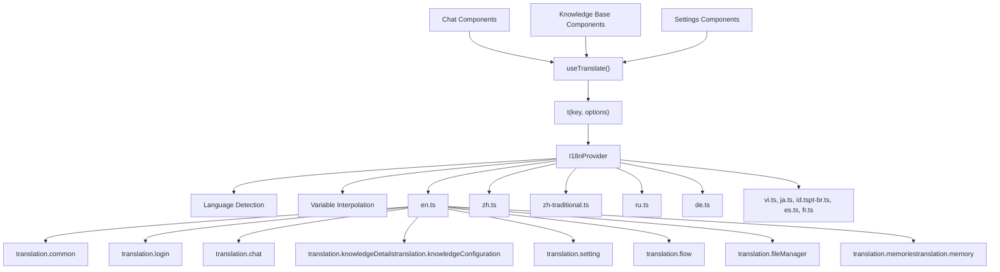

# 国际化系统 (Internationalization System)

相关源文件：

-   [web/src/locales/de.ts](https://github.com/infiniflow/ragflow/blob/80a16e71/web/src/locales/de.ts)
-   [web/src/locales/en.ts](https://github.com/infiniflow/ragflow/blob/80a16e71/web/src/locales/en.ts)
-   [web/src/locales/es.ts](https://github.com/infiniflow/ragflow/blob/80a16e71/web/src/locales/es.ts)
-   [web/src/locales/fr.ts](https://github.com/infiniflow/ragflow/blob/80a16e71/web/src/locales/fr.ts)
-   [web/src/locales/id.ts](https://github.com/infiniflow/ragflow/blob/80a16e71/web/src/locales/id.ts)
-   [web/src/locales/it.ts](https://github.com/infiniflow/ragflow/blob/80a16e71/web/src/locales/it.ts)
-   [web/src/locales/ja.ts](https://github.com/infiniflow/ragflow/blob/80a16e71/web/src/locales/ja.ts)
-   [web/src/locales/pt-br.ts](https://github.com/infiniflow/ragflow/blob/80a16e71/web/src/locales/pt-br.ts)
-   [web/src/locales/ru.ts](https://github.com/infiniflow/ragflow/blob/80a16e71/web/src/locales/ru.ts)
-   [web/src/locales/vi.ts](https://github.com/infiniflow/ragflow/blob/80a16e71/web/src/locales/vi.ts)
-   [web/src/locales/zh-traditional.ts](https://github.com/infiniflow/ragflow/blob/80a16e71/web/src/locales/zh-traditional.ts)
-   [web/src/locales/zh.ts](https://github.com/infiniflow/ragflow/blob/80a16e71/web/src/locales/zh.ts)

## 目的与范围 (Purpose and Scope)

本文档描述了 RAGFlow 的前端国际化 (i18n) 系统，该系统为 Web 应用程序提供多语言支持。系统管理 12 种语言的翻译，涵盖了所有面向用户的功能，包括知识库管理、聊天界面、智能体工作流和管理设置。

有关后端 API 的国际化和错误消息本地化，请参阅后端 API 系统文档 [8.1](/zh/8-backend-api-system/8.1-api-architecture-and-sdk)。有关前端应用路由和组件架构，请参阅 [4.2](/zh/4-frontend-application/4.2-application-structure-and-ui-features)。

---

## 架构概览 (Architecture Overview)

RAGFlow 使用 `react-i18next` 实现国际化，翻译文件位于 `web/src/locales/`，采用 TypeScript 格式。每个语言环境在 `translation` 命名空间下导出嵌套的对象结构，按功能领域进行组织。

### 系统架构


**数据源**：[web/src/locales/en.ts:1-10](https://github.com/infiniflow/ragflow/blob/80a16e71/web/src/locales/en.ts#L1-L10) [web/src/locales/zh.ts:1-10](https://github.com/infiniflow/ragflow/blob/80a16e71/web/src/locales/zh.ts#L1-L10)

---

## 翻译键层级 (Translation Key Hierarchy)

翻译系统将键组织成三级层级：**命名空间 (namespace)** → **功能 (feature)** → **键 (key)**。所有翻译都嵌套在 `translation` 命名空间下，然后按功能领域进行组织。

### 主要命名空间

| 命名空间 | 用途 | 键数量 | 示例键 |
| --- | --- | --- | --- |
| `translation.common` | 共享 UI 元素 | ~70 | `delete`, `save`, `cancel`, `confirm`, `copy`, `selectPlaceholder` |
| `translation.login` | 认证与注册 | ~20 | `loginTitle`, `emailLabel`, `passwordPlaceholder`, `signUp` |
| `translation.header` | 顶部导航栏 | ~10 | `knowledgeBase`, `chat`, `setting`, `logout`, `dataset` |
| `translation.memories` | 记忆系统配置 | ~15 | `llmTooltip`, `embeddingModel`, `memoryType`, `createMemory` |
| `translation.memory` | 记忆详情页 (嵌套) | ~30 | `messages.forget`, `config.avatar`, `sideBar.configuration` |
| `translation.knowledgeList` | 知识库列表 | ~10 | `welcome`, `createKnowledgeBase`, `searchKnowledgePlaceholder` |
| `translation.knowledgeDetails` | 数据集文件管理 (嵌套) | ~100 | `addFile`, `chunkNumber`, `parsingStatus`, `metadata.fieldName` |
| `translation.knowledgeConfiguration` | 知识库设置 | ~80 | `embeddingModel`, `chunkMethod`, `methodTitle`, `useRaptor` |
| `translation.chunk` | 分块管理 UI | ~25 | `enabled`, `disabled`, `keyword`, `question`, `chunkResult` |
| `translation.chat` | 聊天界面 | ~120 | `newConversation`, `system`, `model`, `temperature`, `metadata` |
| `translation.setting` | 用户设置 | ~200 | `profile`, `password`, `model`, `team`, `api`, 数据源配置 |
| `translation.fileManager` | 文件操作 | ~30 | `folder`, `uploadFile`, `linkToKnowledge`, `createFolder` |
| `translation.flow` | 智能体工作流画布 | ~150 | `canvas`, `nodes`, `agent`, `tools`, 特定组件键 |

**数据源**：[web/src/locales/en.ts:2-90](https://github.com/infiniflow/ragflow/blob/80a16e71/web/src/locales/en.ts#L2-L90) [web/src/locales/en.ts:104-173](https://github.com/infiniflow/ragflow/blob/80a16e71/web/src/locales/en.ts#L104-L173) [web/src/locales/en.ts:174-666](https://github.com/infiniflow/ragflow/blob/80a16e71/web/src/locales/en.ts#L174-L666) [web/src/locales/en.ts:663-826](https://github.com/infiniflow/ragflow/blob/80a16e71/web/src/locales/en.ts#L663-L826) [web/src/locales/en.ts:828-1005](https://github.com/infiniflow/ragflow/blob/80a16e71/web/src/locales/en.ts#L828-L1005) [web/src/locales/en.ts:1006-1050](https://github.com/infiniflow/ragflow/blob/80a16e71/web/src/locales/en.ts#L1006-L1050) [web/src/locales/en.ts:1051-1300](https://github.com/infiniflow/ragflow/blob/80a16e71/web/src/locales/en.ts#L1051-L1300)

---

## 翻译文件结构 (Translation File Structure)

每个本地化文件遵循一致的结构，通过嵌套对象进行功能分组：

```typescript
export default {
  translation: {
    common: {
      confirm: 'Confirm',
      cancel: 'Cancel',
      delete: 'Delete',
      // ... 更多通用键
    },
    login: {
      loginTitle: 'Sign in to your account',
      emailLabel: 'Email',
      // ... 更多登录键
    },
    knowledgeDetails: {
      metadata: {
        toMetadataSetting: 'Generation settings',
        fieldName: 'Field name',
        // ... 嵌套的元数据键
      },
      addFile: 'Add file',
      parsingStatus: 'Parsing status',
      // ... 更多知识库键
    }
    // ... 更多命名空间
  }
}
```

### 嵌套键导航 (Nested Key Navigation)

组件使用点符号访问嵌套键：

-   `t('common.delete')` → "删除"
-   `t('knowledgeDetails.metadata.fieldName')` → "字段名称"
-   `t('chat.model')` → "模型"

**数据源**：[web/src/locales/en.ts:1-20](https://github.com/infiniflow/ragflow/blob/80a16e71/web/src/locales/en.ts#L1-L20) [web/src/locales/en.ts:186-228](https://github.com/infiniflow/ragflow/blob/80a16e71/web/src/locales/en.ts#L186-L228)

---

## 支持的语言 (Supported Languages)

RAGFlow 提供 12 种语言的翻译。英语 (`en.ts`) 作为主要参考，具有最全面的键覆盖率。

### 语言文件映射

| 语言 | 代码 | 文件路径 | 文件大小 (行) |
| --- | --- | --- | --- |
| 英语 | `en` | `web/src/locales/en.ts` | ~1900 (主要参考) |
| 简体中文 | `zh` | `web/src/locales/zh.ts` | ~1850 |
| 繁体中文 | `zh-traditional` | `web/src/locales/zh-traditional.ts` | ~950 |
| 俄语 | `ru` | `web/src/locales/ru.ts` | ~1300 |
| 德语 | `de` | `web/src/locales/de.ts` | ~1400 |
| 越南语 | `vi` | `web/src/locales/vi.ts` | ~900 |
| 日语 | `ja` | `web/src/locales/ja.ts` | ~850 |
| 印度尼西亚语 | `id` | `web/src/locales/id.ts` | ~800 |
| 葡萄牙语 (巴西) | `pt-br` | `web/src/locales/pt-br.ts` | ~750 |
| 西班牙语 | `es` | `web/src/locales/es.ts` | ~650 |
| 法语 | `fr` | `web/src/locales/fr.ts` | ~600 |

### 语言名称键 (Language Name Keys)

每个语言环境文件都在 `translation.common` 中包含自引用的语言名称键：

```typescript
// en.ts
common: {
  english: 'English',
  chinese: 'Simplified Chinese',
  traditionalChinese: 'Traditional Chinese',
  russian: 'Russian',
  german: 'German',
  vietnamese: 'Vietnamese',
  japanese: 'Japanese',
  spanish: 'Spanish',
  portugueseBr: 'Portuguese (Brazil)',
  french: 'French',
  // ...
}
```

**数据源**：[web/src/locales/en.ts:25-30](https://github.com/infiniflow/ragflow/blob/80a16e71/web/src/locales/en.ts#L25-L30) [web/src/locales/zh.ts:25-32](https://github.com/infiniflow/ragflow/blob/80a16e71/web/src/locales/zh.ts#L25-L32) [web/src/locales/de.ts:26-32](https://github.com/infiniflow/ragflow/blob/80a16e71/web/src/locales/de.ts#L26-L32) [web/src/locales/vi.ts:37-39](https://github.com/infiniflow/ragflow/blob/80a16e71/web/src/locales/vi.ts#L37-L39) [web/src/locales/ja.ts:38](https://github.com/infiniflow/ragflow/blob/80a16e71/web/src/locales/ja.ts#L38-L38) [web/src/locales/es.ts:17-18](https://github.com/infiniflow/ragflow/blob/80a16e71/web/src/locales/es.ts#L17-L18)

---

## 关键翻译模式 (Key Translation Patterns)

### 命名约定 (Naming Conventions)

系统对相关功能使用一致的后缀和模式：

```mermaid
flowchart TD
    chunk_methods["分块方法键:naive, book, paperqa, laws, manual, presentationtable, picture, one, knowledgeGraph"]
    model_keys["模型配置:embeddingModelrerankModelllm, temperature, topP"]
    parser_keys["解析器配置:layoutRecognizetaskPageSizepageRanges"]
    running_status["处理状态:runningStatus0='PENDING'runningStatus1='PARSING'runningStatus2='CANCELED'runningStatus3='SUCCESS'runningStatus4='FAIL'"]
    toggle_states["切换状态:enabled, disabledenable, disable"]
    crud_actions["CRUD 操作:create, edit, deletesave, cancel, confirm"]
    nav_actions["导航:next, backpreviousPage, nextPage"]
    select_actions["选择:selectAll, selectedpleaseSelect, pleaseInput"]
    modal_keys["模态对话框键:deleteModalTitledeleteModalContentxxxModalConfirmText"]
    tooltip_keys["工具提示键:embeddingModelTipchunkMethodTipxxxTooltip"]
    placeholder_keys["输入占位符键:namePlaceholderemailPlaceholderxxxPlaceholder"]
    validation_keys["验证键:nameMessagepasswordMessagexxxError"]
    description_keys["描述键:testingDescriptionchatConfigurationDescription"]
```



### 插值变量 (Interpolation Variables)

翻译字符串使用 `{{variable}}` 语法进行动态内容替换。react-i18next 的 `t()` 函数在运行时处理变量替换。

#### 常见变量模式

| 变量模式 | 示例键 | 翻译字符串 |
| --- | --- | --- |
| `{{chunkNum}}` | `knowledgeDetails.redo` | `Do you want to clear the existing {{chunkNum}} chunks?` |
| `{{field}}` | `knowledgeDetails.metadata.deleteWarn` | `This {{field}} will be removed from all associated files` |
| `{{type}}` | `knowledgeConfiguration.deleteGenerateModalContent` | `Deleting the generated <strong>{{type}}</strong> results...` |
| `{{name}}` | `setting.addDataSourceModalTitle` | `Create your {{name}} link` |

#### 在组件中的用法

```javascript
// 组件用法示例
t('knowledgeDetails.redo', { chunkNum: 150 })
// 渲染结果: "Do you want to clear the existing 150 chunks?"

t('knowledgeDetails.metadata.deleteWarn', { field: 'author' })
// 渲染结果: "This author will be removed from all associated files"
```

**数据源**：[web/src/locales/en.ts:380-381](https://github.com/infiniflow/ragflow/blob/80a16e71/web/src/locales/en.ts#L380-L381) [web/src/locales/en.ts:217](https://github.com/infiniflow/ragflow/blob/80a16e71/web/src/locales/en.ts#L217-L217) [web/src/locales/en.ts:455-461](https://github.com/infiniflow/ragflow/blob/80a16e71/web/src/locales/en.ts#L455-L461)

---

## 专门的翻译领域 (Specialized Translation Domains)

### 知识库配置方法

`translation.knowledgeConfiguration` 命名空间包含 13 种分块方法的 HTML 格式文档。每个方法键映射到一个采用 `<p>` 和 `<li>` 格式的字符串，描述支持的文件格式和解析行为。

#### 分块方法翻译键

```mermaid
flowchart TD
    knowledgeConfiguration["translation.knowledgeConfiguration"]
    naive["naiveLine 530-534"]
    book["bookLine 520-522"]
    paper["paperLine 535-538"]
    qa["qaLine 542-559"]
    laws["lawsLine 522-526"]
    manual["manualLine 527-529"]
    presentation["presentationLine 539-541"]
    table["tableLine 565-578"]
    picture["pictureLine 579-584"]
    one["oneLine 585-591"]
    knowledgeGraph["knowledgeGraphLine 592-596"]
    tag["tagLine 597-605"]
    resume["resumeLine 560-564"]
    naive_desc["支持: MD, MDX, DOCX, XLSXXLS, PPTX, PDF, TXT, JPEGJPG, PNG, TIF, GIF, CSVJSON, EML, HTML"]
    book_desc["支持: DOCX, PDF, TXT需要页码范围"]
    paper_desc["支持: 仅 PDF基于章节的切分"]
    qa_desc["支持: XLSX, CSV/TXT问答对格式"]

    knowledgeConfiguration --> naive
    knowledgeConfiguration --> book
    knowledgeConfiguration --> paper
    knowledgeConfiguration --> qa
    knowledgeConfiguration --> laws
    knowledgeConfiguration --> manual
    knowledgeConfiguration --> presentation
    knowledgeConfiguration --> table
    knowledgeConfiguration --> picture
    knowledgeConfiguration --> one
    knowledgeConfiguration --> knowledgeGraph
    knowledgeConfiguration --> tag
    knowledgeConfiguration --> resume
    naive --> naive_desc
    book --> book_desc
    paper --> paper_desc
    qa --> qa_desc
```


每个方法键都包含 HTML 标记，如 `<p>`, `<b>`, `<i>`, `<li>`, `<ul>`, 和 `<code>` 标签，以便在 UI 中进行富文本格式化。

**数据源**：[web/src/locales/en.ts:520-605](https://github.com/infiniflow/ragflow/blob/80a16e71/web/src/locales/en.ts#L520-L605)

---

## 聊天配置翻译 (Chat Configuration Translations)

`translation.chat` 命名空间提供约 120 个用于聊天助手配置的键，包括 LLM 参数、知识库集成和高级 RAG 特性。

### 聊天翻译键结构

```mermaid
flowchart TD
    chat_namespace["translation.chat"]
    model_params["Model ParametersLine 718-750"]
    freedom_presets["Freedom PresetsLine 724-729"]
    knowledge_integration["Knowledge IntegrationLine 696-713"]
    advanced_features["Advanced FeaturesLine 752-829"]
    temperature["temperaturetemperatureTiptemperatureMessage"]
    topP["topPtopPTiptopPMessage"]
    presencePenalty["presencePenaltypresencePenaltyTip"]
    frequencyPenalty["frequencyPenaltyfrequencyPenaltyTip"]
    maxTokens["maxTokensmaxTokensTipmaxTokensMessage"]
    precise["preciseimprovisebalancecustomfreedomTip"]
    knowledgeBases["knowledgeBasesknowledgeBasesTip"]
    system_prompt["systemsystemTipsystemInitialValue"]
    topN["topNtopNTip"]
    variable["variablevariableTip"]
    quote["quotequoteTip"]
    selfRag["selfRagselfRagTip"]
    useKnowledgeGraph["useKnowledgeGraphuseKnowledgeGraphTip"]
    keyword["keywordkeywordTip"]
    reasoning["reasoningreasoningTip"]
    metadata["metadatametadataTipmetadataKeys"]

    chat_namespace --> model_params
    chat_namespace --> freedom_presets
    chat_namespace --> knowledge_integration
    chat_namespace --> advanced_features
```



### 系统提示词默认值

`translation.chat.systemInitialValue` 键提供了一个多行的默认提示词模板：

```text
systemInitialValue: `You are an intelligent assistant, please summarize the content from the knowledge base to answer the question, please list the data in the knowledge base and answer in detail. When all knowledge base content is irrelevant to the question, your answer must include the sentence "The answer you are looking for is not found in the knowledge base!". Answers need to consider chat history.
Here is the knowledge base:
{knowledge}
The above is the knowledge base.`
```

**数据源**：[web/src/locales/en.ts:701-704](https://github.com/infiniflow/ragflow/blob/80a16e71/web/src/locales/en.ts#L701-L704) [web/src/locales/en.ts:718-829](https://github.com/infiniflow/ragflow/blob/80a16e71/web/src/locales/en.ts#L718-L829)

---

## 设置与模型提供商翻译 (Settings and Model Provider Translations)

`translation.setting` 命名空间包含约 200 个用于用户设置、模型提供商配置和数据源连接器的键。由于集成了 40 多个数据源，它是最大的命名空间。

### 设置翻译键结构

```mermaid
flowchart TD
    setting_namespace["translation.setting"]
    profile_section["Profile SectionLine 831-839"]
    password_section["Password SectionLine 584-609"]
    model_section["Model Provider SectionLine 586-591"]
    datasource_section["Data Source SectionLine 842-900"]
    team_api_section["Team & API SectionLine 588-591"]
    profile_keys["profileavatarusernamephotophotoDescription"]
    password_keys["passwordcurrentPasswordnewPasswordconfirmPasswordchangePassword"]
    model_keys["modelmodelDescriptionconfigureModelTitledeleteModelmodelEmptyTip"]
    modal_keys["addDataSourceModalTitledeleteSourceModalTitledeleteSourceModalContent"]
    confluence_keys["confluenceDescriptionconfluenceIsCloudTipconfluenceWikiBaseUrlTip"]
    s3_keys["s3Descriptions3PrefixTip"]
    google_keys["google_driveDescriptiongoogle_driveTokenTipgmailDescriptiongmailTokenTip"]
    github_keys["githubDescriptionbitbucketDescriptiongitlabDescription"]
    other_keys["notionDescriptionjiraDescriptiondropboxDescriptionboxDescriptionairtableDescription"]
    team_api_keys["teamteamDescriptionapiapiKeyapiReference"]

    setting_namespace --> profile_section
    setting_namespace --> password_section
    setting_namespace --> model_section
    setting_namespace --> datasource_section
    setting_namespace --> team_api_section
```



### 数据源连接器模式 (Data Source Connector Pattern)

每个数据源遵循一致的命名模式：

-   `{connectorName}Description`：连接器的简要描述
-   `{connectorName}{Field}Tip`：特定配置字段的工具提示
-   `{connectorName}{Field}Placeholder`：输入字段的占位符文本

Confluence 示例：
-   `confluenceDescription`: "Connect your Confluence workspace..."
-   `confluenceIsCloudTip`: "Check this if it is a Confluence Cloud instance..."
-   `confluenceWikiBaseUrlTip`: "Confluence Wiki's base URL..."

**数据源**：[web/src/locales/en.ts:831-839](https://github.com/infiniflow/ragflow/blob/80a16e71/web/src/locales/en.ts#L831-L839) [web/src/locales/en.ts:842-900](https://github.com/infiniflow/ragflow/blob/80a16e71/web/src/locales/en.ts#L842-L900)

---

## 记忆系统翻译 (Memory System Translations)

`memories` 和 `memory` 命名空间支持记忆管理功能：

| 键分类 | 示例键 | 用途 |
| --- | --- | --- |
| 记忆类型 | `raw`, `semantic`, `episodic`, `procedural` | 记忆内容的分类 |
| 配置 | `llmTooltip`, `embeddingModelTooltip`, `memoryType` | 设置向导 |
| 消息 | `forget`, `forgetMessageTip`, `delMessageWarn` | 消息操作 |
| 配置细节 | `avatar`, `description`, `memorySize`, `forgetPolicy` | 记忆设置 |
| 侧边栏 | `messages`, `configuration` | 导航 |

**数据源**：[web/src/locales/en.ts:104-173](https://github.com/infiniflow/ragflow/blob/80a16e71/web/src/locales/en.ts#L104-L173)

---

## 文件管理器翻译 (File Manager Translations)

`fileManager` 命名空间处理文件操作和文件夹管理。

**数据源**：[web/src/locales/en.ts:1006-1050](https://github.com/infiniflow/ragflow/blob/80a16e71/web/src/locales/en.ts#L1006-L1050)

---

## 智能体工作流 (Flow) 翻译 (Agent Workflow (Flow) Translations)

`flow` 命名空间包含基于画布的智能体工作流系统的翻译。

**数据源**：[web/src/locales/en.ts:1051-1200](https://github.com/infiniflow/ragflow/blob/80a16e71/web/src/locales/en.ts#L1051-L1200)

---

## 添加新语言 (Adding New Languages)

向 RAGFlow 添加新语言的步骤：

### 1. 创建翻译文件

创建 `web/src/locales/{languageCode}.ts`，遵循 TypeScript 导出结构。

### 2. 注册语言名称

在所有现有的本地化文件的 `translation.common` 中添加该语言标识符。

### 3. 翻译优先级

按 UI 影响程度顺序翻译命名空间：
1.  **关键**：`common`, `login`, `header` - 核心 UI 导航
2.  **高**：`chat`, `knowledgeDetails`, `knowledgeConfiguration` - 主要工作流
3.  **中**：`setting`, `fileManager`, `flow`, `memories` - 高级功能
4.  **低**：工具提示细节、HTML 描述、示例 - 帮助文本

### 4. 变量与 HTML 保留

保留所有的插值变量和 HTML 标签。

**数据源**：[web/src/locales/en.ts:1-30](https://github.com/infiniflow/ragflow/blob/80a16e71/web/src/locales/en.ts#L1-L30) [web/src/locales/zh.ts:1-30](https://github.com/infiniflow/ragflow/blob/80a16e71/web/src/locales/zh.ts#L1-L30)

---

## 翻译字符串中的 HTML 格式 (HTML Formatting in Translation Strings)

翻译字符串经常包含 HTML 标记，以便在 UI 中进行富文本格式化。这些字符串使用 `dangerouslySetInnerHTML` 或类似的 React 机制进行渲染。

### HTML 标签使用模式

| HTML 元素 | 用途 | 示例键 |
| --- | --- | --- |
| `<p>` | 段落块 | `knowledgeConfiguration.naive`, `book`, `paper` |
| `<b>`, `<strong>` | 加粗强调 | 文件格式列表: `<b>PDF</b>`, `<b>DOCX</b>` |
| `<i>`, `<em>` | 斜体强调 | 使用说明: `<i>page ranges</i>` |
| `<ul>`, `<li>` | 无序列表 | `knowledgeConfiguration.table` 中的要求 |
| `<ol>`, `<li>` | 有序列表 | 分步操作说明 |
| `<code>` | 行内代码 | `knowledgeDetails.documentMetaTips` 中的 JSON 示例 |
| `<br>`, `<br/>` | 换行 | 多行描述 |

**数据源**：[web/src/locales/en.ts:383-401](https://github.com/infiniflow/ragflow/blob/80a16e71/web/src/locales/en.ts#L383-L401) [web/src/locales/en.ts:455-461](https://github.com/infiniflow/ragflow/blob/80a16e71/web/src/locales/en.ts#L455-L461) [web/src/locales/en.ts:520-605](https://github.com/infiniflow/ragflow/blob/80a16e71/web/src/locales/en.ts#L520-L605)

---

## 翻译一致性指南 (Translation Consistency Guidelines)

### 术语标准化

| 英语术语 | 翻译方法 | 备注 |
| --- | --- | --- |
| "Knowledge Base" | 使用领域合适的术语 | 中文用“知识库”，法语用“Base de connaissances” |
| "Chunk" | 技术术语，可能需要解释 | 中文用“分块”，西班牙语用“Fragmento” |
| "Embedding Model" | 技术术语，保持一致 | 中文用“嵌入模型”，法语用“Modèle d'embedding” |
| "Parse/Parsing" | 使用合适的动词形式 | 中文用“解析”，法语用“Analyse” |
| "Agent" | 视语境而定 (AI agent) | 中文用“智能体”，法语用“Agent” |

### 工具提示与 Tip 后缀

以 `Tip` 或 `Tooltip` 结尾的键提供上下文帮助：
-   简短、可操作的指导 (1-2 句)
-   可能包含技术细节或文档链接
-   应与英语版本保持一致的格式
-   示例：`embeddingModelTip` 解释了切换嵌入模型的逻辑

**数据源**：[web/src/locales/en.ts:495-497](https://github.com/infiniflow/ragflow/blob/80a16e71/web/src/locales/en.ts#L495-L497) [web/src/locales/zh.ts:457-459](https://github.com/infiniflow/ragflow/blob/80a16e71/web/src/locales/zh.ts#L457-L459)
