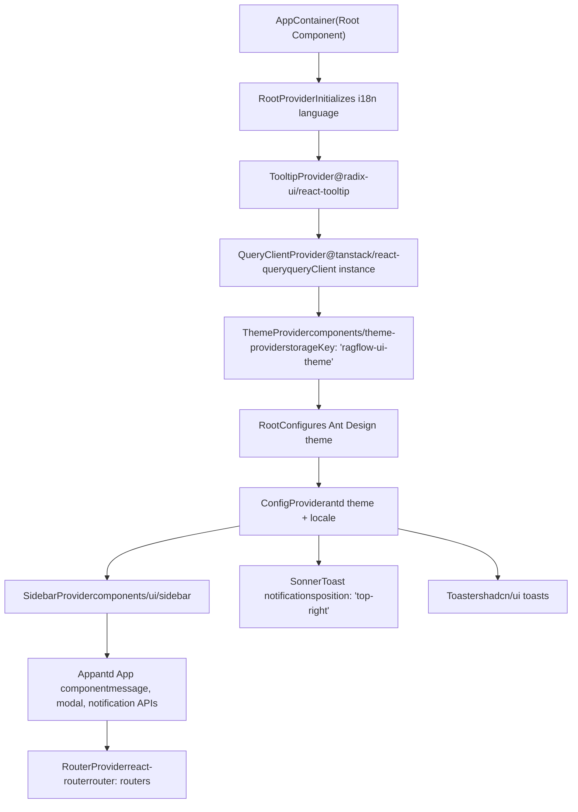
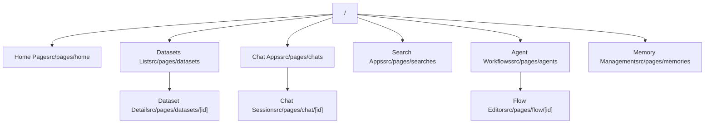
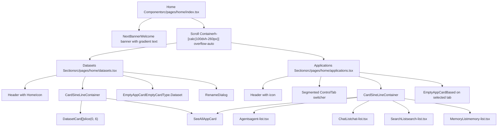

# 应用结构与路由 (Application Structure and Routing)

相关源文件：

-   [web/src/locales/de.ts](https://github.com/infiniflow/ragflow/blob/80a16e71/web/src/locales/de.ts)
-   [web/src/locales/en.ts](https://github.com/infiniflow/ragflow/blob/80a16e71/web/src/locales/en.ts)
-   [web/src/locales/es.ts](https://github.com/infiniflow/ragflow/blob/80a16e71/web/src/locales/es.ts)
-   [web/src/locales/fr.ts](https://github.com/infiniflow/ragflow/blob/80a16e71/web/src/locales/fr.ts)
-   [web/src/locales/id.ts](https://github.com/infiniflow/ragflow/blob/80a16e71/web/src/locales/id.ts)
-   [web/src/locales/it.ts](https://github.com/infiniflow/ragflow/blob/80a16e71/web/src/locales/it.ts)
-   [web/src/locales/ja.ts](https://github.com/infiniflow/ragflow/blob/80a16e71/web/src/locales/ja.ts)
-   [web/src/locales/pt-br.ts](https://github.com/infiniflow/ragflow/blob/80a16e71/web/src/locales/pt-br.ts)
-   [web/src/locales/ru.ts](https://github.com/infiniflow/ragflow/blob/80a16e71/web/src/locales/ru.ts)
-   [web/src/locales/vi.ts](https://github.com/infiniflow/ragflow/blob/80a16e71/web/src/locales/vi.ts)
-   [web/src/locales/zh-traditional.ts](https://github.com/infiniflow/ragflow/blob/80a16e71/web/src/locales/zh-traditional.ts)
-   [web/src/locales/zh.ts](https://github.com/infiniflow/ragflow/blob/80a16e71/web/src/locales/zh.ts)

本文档描述了 RAGFlow Web 界面的前端应用结构、路由配置和组件层级。内容涵盖了 React 应用设置、Provider 架构、路由定义以及页面组织模式。

有关状态管理和 API 集成模式的信息，请参阅 [状态管理与 API 集成 (#4.3)](#4.3)。有关国际化系统的详情，请参阅 [国际化系统 (Internationalization System)](/zh/4-frontend-application/4.1-internationalization-system)。有关主题配置，请参阅 [主题系统与样式 (#4.5)](#4.5)。

## 应用概览 (Application Overview)

RAGFlow 前端是一个使用 TypeScript 构建的 React 18 单页面应用 (SPA)，使用 Vite 作为构建工具，并使用 React Router v7 进行导航。该应用遵循基于 Provider 的架构，多个 Context Provider 包裹着核心应用，以提供全局功能。

**数据源**：[web/package.json:1-195](https://github.com/infiniflow/ragflow/blob/80a16e71/web/package.json#L1-L195) [web/src/app.tsx:1-162](https://github.com/infiniflow/ragflow/blob/80a16e71/web/src/app.tsx#L1-L162)

---

## Provider 层级 (Provider Hierarchy)

应用使用嵌套的 Provider 架构，在整个组件树中提供全局状态和功能。每个 Provider 都有特定用途，并按特定顺序组合，以确保正确初始化。

### Provider 堆栈图


**数据源**：[web/src/app.tsx:84-162](https://github.com/infiniflow/ragflow/blob/80a16e71/web/src/app.tsx#L84-L162)

### Provider 职责

| Provider | 用途 | 配置 |
| --- | --- | --- |
| `RootProvider` | 从 localStorage 初始化 i18n 语言 | 通过 `storage.getLanguage()` 读取语言 |
| `TooltipProvider` | 在整个应用中启用 Radix UI 工具提示 | 默认配置 |
| `QueryClientProvider` | 使用 React Query 进行服务器状态管理 | `queryClient` 实例 |
| `ThemeProvider` | 深色/浅色主题管理 | 存储键：`'ragflow-ui-theme'`，默认：`ThemeEnum.Dark` |
| `ConfigProvider` | Ant Design 主题设置与本地化 | 根据 i18n 语言动态更新语言环境 |
| `SidebarProvider` | 侧边栏状态管理 | `className="h-full"` |
| `App` | Ant Design 组件 API (message, modal) | `className="w-full h-dvh relative"` |
| `RouterProvider` | React Router v7 导航 | `router={routers}` |

**数据源**：[web/src/app.tsx:121-161](https://github.com/infiniflow/ragflow/blob/80a16e71/web/src/app.tsx#L121-L161)

### Ant Design 语言环境配置

应用通过 Ant Design 语言包支持多种语言：

```javascript
const AntLanguageMap = {
  en: enUS,
  zh: zhCN,
  'zh-TRADITIONAL': zh_HK,
  ru: ru_RU,
  vi: vi_VN,
  'pt-BR': pt_BR,
  de: deDE,
};
```
当 i18n 语言通过事件监听器改变时，语言环境会动态更新：

```javascript
i18n.on('languageChanged', function (lng: string) {
  storage.setLanguage(lng);
  setLocal(getLocale(lng));
});
```
**数据源**：[web/src/app.tsx:50-94](https://github.com/infiniflow/ragflow/blob/80a16e71/web/src/app.tsx#L50-L94)

---

## 路由架构 (Routing Architecture)

应用使用带有集中路由配置的 React Router v7。路由在 `routers` 对象中实例化，并通过 `RouterProvider` 提供给应用。

### 路由结构


**数据源**：[web/src/app.tsx:28](https://github.com/infiniflow/ragflow/blob/80a16e71/web/src/app.tsx#L28-L28) [web/src/pages/home/applications.tsx:6-21](https://github.com/infiniflow/ragflow/blob/80a16e71/web/src/pages/home/applications.tsx#L6-L21)

### 路由常量

根据应用代码，路由系统使用 `Routes` 枚举中定义的路由常量：

```typescript
// 应用中使用的路由常量
Routes.Chats      // "/chats" - 聊天应用列表
Routes.Searches   // "/searches" - 搜索应用列表
Routes.Agents     // "/agents" - 智能体工作流列表
Routes.Memories   // "/memories" - 记忆管理
```
这些常量用于整个应用中的导航和路由匹配。

**数据源**：[web/src/pages/home/applications.tsx:16-21](https://github.com/infiniflow/ragflow/blob/80a16e71/web/src/pages/home/applications.tsx#L16-L21)

---

## 页面组织 (Page Organization)

页面组织在 `src/pages/` 下，具有镜像路由层级的层级结构。每个主要部分都有自己的目录和相关组件。

### 页面目录结构

```text
src/pages/
├── home/
│   ├── index.tsx              # 主首页组件
│   ├── banner.tsx             # 欢迎横幅组件
│   ├── datasets.tsx           # 首页中的数据集部分
│   ├── applications.tsx       # 带有选项卡的应用程序部分
│   ├── agent-list.tsx         # 智能体卡片显示
│   ├── chat-list.tsx          # 聊天应用卡片显示
│   ├── search-list.tsx        # 搜索应用卡片显示
│   ├── memory-list.tsx        # 记忆卡片显示
│   └── application-card.tsx   # 可复用的卡片组件
├── datasets/
│   ├── dataset-card.tsx       # 数据集卡片组件
│   ├── dataset-dropdown.tsx   # 数据集操作菜单
│   └── use-rename-dataset.tsx # 重命名数据集的 Hook
└── [其他页面目录...]
```
**数据源**：[web/src/pages/home/index.tsx:1-18](https://github.com/infiniflow/ragflow/blob/80a16e71/web/src/pages/home/index.tsx#L1-L18) [web/src/pages/home/datasets.tsx:1-80](https://github.com/infiniflow/ragflow/blob/80a16e71/web/src/pages/home/datasets.tsx#L1-L80) [web/src/pages/home/applications.tsx:1-125](https://github.com/infiniflow/ragflow/blob/80a16e71/web/src/pages/home/applications.tsx#L1-L125)

### 首页组件层级


**数据源**：[web/src/pages/home/index.tsx:5-17](https://github.com/infiniflow/ragflow/blob/80a16e71/web/src/pages/home/index.tsx#L5-L17) [web/src/pages/home/datasets.tsx:14-79](https://github.com/infiniflow/ragflow/blob/80a16e71/web/src/pages/home/datasets.tsx#L14-L79) [web/src/pages/home/applications.tsx:30-124](https://github.com/infiniflow/ragflow/blob/80a16e71/web/src/pages/home/applications.tsx#L30-L124)

---

## 首页详解 (Home Page Deep Dive)

首页作为主要的入口点和仪表盘，通过选项卡界面显示对数据集和应用程序的快速访问。

### 首页布局

首页由三个主要部分组成：

1.  **横幅部分** (`NextBanner`)：带有渐变 RAGFlow 品牌标识的欢迎消息
2.  **数据集部分**：最多显示 6 个最近的数据集，并带有一个“查看全部”卡片
3.  **应用程序部分**：聊天、搜索、智能体和记忆的选项卡界面

**数据源**：[web/src/pages/home/index.tsx:5-17](https://github.com/infiniflow/ragflow/blob/80a16e71/web/src/pages/home/index.tsx#L5-L17)

### 横幅组件 (Banner Component)

`NextBanner` 组件显示带有品牌样式的欢迎消息：

```javascript
// 从青色 (#40EBE3) 到蓝色 (#4A51FF) 的渐变文本
<span className="text-transparent bg-clip-text bg-gradient-to-l from-[#40EBE3] to-[#4A51FF]">
  RAGFlow
</span>
```
布局：`text-5xl pt-10 pb-14 font-bold px-10`

**数据源**：[web/src/pages/home/banner.tsx:42-52](https://github.com/infiniflow/ragflow/blob/80a16e71/web/src/pages/home/banner.tsx#L42-L52)

### 数据集部分 (Datasets Section)

数据集部分显示具有以下特性的数据集卡片：

-   **数据获取**：使用 `useFetchNextKnowledgeListByPage()` Hook
-   **加载状态**：在获取数据期间显示 `CardSkeleton`
-   **卡片显示**：通过 `kbs?.slice(0, 6)` 显示最多 6 个数据集
-   **空状态**：当不存在数据集时显示 `EmptyAppCard`
-   **动作**：通过 `useRenameDataset()` Hook 实现重命名功能

来自 `useNavigatePage()` 的关键导航方法：

-   `navigateToDatasetList({ isCreate: boolean })` - 导航到完整的数据集列表
-   `navigateToDataset(datasetId)` - 导航到特定的数据集详情

**数据源**：[web/src/pages/home/datasets.tsx:14-79](https://github.com/infiniflow/ragflow/blob/80a16e71/web/src/pages/home/datasets.tsx#L14-L79)

### 带有选项卡的应用程序部分 (Applications Section with Tabs)

应用程序部分使用 `Segmented` 控件在四个选项卡之间切换：

| 选项卡 | 路由 | 组件 | 空状态类型 |
| --- | --- | --- | --- |
| 聊天应用 (Chat Apps) | `Routes.Chats` | `ChatList` | `EmptyCardType.Chat` |
| 搜索应用 (Search Apps) | `Routes.Searches` | `SearchList` | `EmptyCardType.Search` |
| 智能体工作流 (Agent Workflows) | `Routes.Agents` | `Agents` | `EmptyCardType.Agent` |
| 记忆 (Memory) | `Routes.Memories` | `MemoryList` | `EmptyCardType.Memory` |

**选项卡切换逻辑**：

```javascript
const handleChange = (path: SegmentedValue) => {
  setVal(path as Routes);
  setListLength(0);
  setLoading(true);
};
```
**导航**：

```javascript
const handleNavigate = ({ isCreate }: { isCreate?: boolean }) => {
  if (isCreate) {
    navigate(val + '?isCreate=true');
  } else {
    navigate(val);
  }
};
```
每个列表组件接收回调以更新父组件的状态：

-   `setListLength(length: number)` - 更新计数以显示“查看全部”卡片
-   `setLoading(loading: boolean)` - 更新加载状态

**数据源**：[web/src/pages/home/applications.tsx:16-124](https://github.com/infiniflow/ragflow/blob/80a16e71/web/src/pages/home/applications.tsx#L16-L124)

---

## 组件复用模式 (Component Reusability Patterns)

该应用采用多种可复用的组件模式，以保持页面间的一致性。

### 卡片组件 (Card Components)

#### DatasetCard

显示带有操作的数据集信息：

```typescript
interface DatasetCardProps {
  dataset: IKnowledge;
  showDatasetRenameModal: (dataset: IKnowledge) => void;
}
```
特性：
-   使用 `HomeCard` 基础组件
-   描述：`${dataset.doc_num} ${t('knowledgeDetails.files')}`
-   下拉菜单：带有 `MoreButton` 的 `DatasetDropdown`
-   徽标：显示 `dataset.nickname` 的 `SharedBadge`
-   点击：`navigateToDataset(dataset.id)`

**数据源**：[web/src/pages/datasets/dataset-card.tsx:12-40](https://github.com/infiniflow/ragflow/blob/80a16e71/web/src/pages/datasets/dataset-card.tsx#L12-L40)

#### CardSineLineContainer

在响应式网格中显示卡片的 Flex 容器：

```javascript
// 用于包裹多个卡片
<CardSineLineContainer>
  {items.map(item => <Card key={item.id} {...item} />)}
  <SeeAllCard />
</CardSineLineContainer>
```
**数据源**：[web/src/pages/home/datasets.tsx:42-57](https://github.com/infiniflow/ragflow/blob/80a16e71/web/src/pages/home/datasets.tsx#L42-L57)

#### SeeAllAppCard

标准化的带有 V 型图标的“查看全部”卡片：

```javascript
<SeeAllAppCard click={() => navigateToFunction()} />
```
显示：“查看全部”文本和 `ChevronRight` 图标

**数据源**：[web/src/pages/home/applications.tsx:109-113](https://github.com/infiniflow/ragflow/blob/80a16e71/web/src/pages/home/applications.tsx#L109-L113)

#### EmptyAppCard

当某个部分没有项目时显示：

```javascript
<EmptyAppCard
  type={EmptyCardType.Dataset | Chat | Search | Agent | Memory}
  onClick={() => navigateToCreate()}
/>
```
**数据源**：[web/src/pages/home/datasets.tsx:60-64](https://github.com/infiniflow/ragflow/blob/80a16e71/web/src/pages/home/datasets.tsx#L60-L64) [web/src/pages/home/applications.tsx:115-120](https://github.com/infiniflow/ragflow/blob/80a16e71/web/src/pages/home/applications.tsx#L115-L120)

### 图标系统 (Icon System)

应用使用自定义的 `HomeIcon` 组件以实现图标的一致性：

```javascript
<HomeIcon name="datasets" width="32" />
<HomeIcon name="chats" width="32" />
<HomeIcon name="searches" width="32" />
<HomeIcon name="agents" width="32" />
<HomeIcon name="memory" width="32" />
```
图标名称映射到路由类型，以实现视觉一致性。

**数据源**：[web/src/pages/home/datasets.tsx:31](https://github.com/infiniflow/ragflow/blob/80a16e71/web/src/pages/home/datasets.tsx#L31-L31) [web/src/pages/home/applications.tsx:68-71](https://github.com/infiniflow/ragflow/blob/80a16e71/web/src/pages/home/applications.tsx#L68-L71)

---

## UI 组件库 (UI Component Library)

应用结合使用多种 UI 库以实现一致的样式：

### 核心 UI 库

| 库 | 用途 | 用法 |
| --- | --- | --- |
| Ant Design v5 | 企业级 UI 组件 | ConfigProvider, message, modal API |
| Radix UI | 无样式基础组件 | Dialog, Dropdown, Select, Tooltip 等 |
| Tailwind CSS | 实用优先的样式 | 所有自定义组件 |
| class-variance-authority | 基于变体的组件样式 | Button 变体, Badge 变体 |
| Lucide React | 图标库 | 整个应用中的图标 |

**数据源**：[web/package.json:25-132](https://github.com/infiniflow/ragflow/blob/80a16e71/web/package.json#L25-L132)

### Shadcn/ui 组件

应用实现了 shadcn/ui 组件模式并带有自定义样式：

-   **Button**：多种变体 (default, outline, ghost, destructive 等)
-   **Badge**：基于变体的徽标 (default, secondary, success, destructive)
-   **Card**：带有 CardContent 的容器组件
-   **Segmented**：用于选项卡导航的自定义分段控制组件
-   **Skeleton**：加载状态占位符

**数据源**：[web/src/components/ui/button.tsx:8-142](https://github.com/infiniflow/ragflow/blob/80a16e71/web/src/components/ui/button.tsx#L8-L142) [web/src/components/ui/badge.tsx:6-38](https://github.com/infiniflow/ragflow/blob/80a16e71/web/src/components/ui/badge.tsx#L6-L38) [web/src/components/ui/segmented.tsx:1-122](https://github.com/infiniflow/ragflow/blob/80a16e71/web/src/components/ui/segmented.tsx#L1-L122)

---

## 导航模式 (Navigation Patterns)

### 导航 Hook

应用使用自定义的 `useNavigatePage()` Hook 进行类型安全的导航：

```javascript
const {
  navigateToDatasetList,
  navigateToDataset,
  // ... 其他导航方法
} = useNavigatePage();
```
导航方法支持可选参数：

-   `navigateToDatasetList({ isCreate: boolean })` - 带有创建标志的导航
-   `navigateToDataset(datasetId)` - 导航到特定资源

**数据源**：[web/src/pages/home/datasets.tsx:25](https://github.com/infiniflow/ragflow/blob/80a16e71/web/src/pages/home/datasets.tsx#L25-L25) [web/src/pages/datasets/dataset-card.tsx:20](https://github.com/infiniflow/ragflow/blob/80a16e71/web/src/pages/datasets/dataset-card.tsx#L20-L20)

### 查询参数处理 (Query Parameter Handling)

路由支持查询参数以实现状态初始化：

-   `?isCreate=true` - 在页面加载时打开创建对话框
-   用于数据集列表、聊天列表、搜索列表和智能体列表

带有创建标志的导航示例：

```javascript
if (isCreate) {
  navigate(val + '?isCreate=true');
} else {
  navigate(val);
}
```
**数据源**：[web/src/pages/home/applications.tsx:38-45](https://github.com/infiniflow/ragflow/blob/80a16e71/web/src/pages/home/applications.tsx#L38-L45)

---

## 响应式设计配置 (Responsive Design Configuration)

应用使用 `ahooks` 并配合自定义断点进行响应式设计：

```javascript
configResponsive({
  sm: 640,
  md: 768,
  lg: 1024,
  xl: 1280,
  '2xl': 1536,
  '3xl': 1780,
  '4xl': 1980,
});
```
这些断点与 `tailwind.config.js` 中定义的 Tailwind CSS 配置相匹配。

**数据源**：[web/src/app.tsx:33-41](https://github.com/infiniflow/ragflow/blob/80a16e71/web/src/app.tsx#L33-L41) [web/tailwind.config.js:20-28](https://github.com/infiniflow/ragflow/blob/80a16e71/web/tailwind.config.js#L20-L28)

---

## 开发工具 (Development Tools)

### Why Did You Render (仅开发环境)

应用在开发环境中条件性地加载性能调试工具：

```javascript
if (process.env.NODE_ENV === 'development') {
  import('@welldone-software/why-did-you-render').then(
    (whyDidYouRenderModule) => {
      const whyDidYouRender = whyDidYouRenderModule.default;
      whyDidYouRender(React, {
        trackAllPureComponents: true,
        trackExtraHooks: [],
        logOnDifferentValues: true,
      });
    },
  );
}
```
**数据源**：[web/src/app.tsx:68-79](https://github.com/infiniflow/ragflow/blob/80a16e71/web/src/app.tsx#L68-L79)

### React Query DevTools

React Query DevTools 在生产环境中可用但被注释掉了：

```javascript
// <ReactQueryDevtools buttonPosition={'top-left'} initialIsOpen={false} />
```
**数据源**：[web/src/app.tsx:116](https://github.com/infiniflow/ragflow/blob/80a16e71/web/src/app.tsx#L116-L116)

---

## 样式系统集成 (Styling System Integration)

应用使用多种样式方法：

1.  **Tailwind CSS**：主要的样式系统，带有自定义设计令牌
2.  **CSS 变量**：在 `tailwind.css` 中定义的主题感知颜色
3.  **Ant Design 主题**：遵循深色/浅色模式的算法化主题设置
4.  **Class Variance Authority**：类型安全的基于变体的组件

主题集成示例：

```javascript
<ConfigProvider
  theme={{
    token: { fontFamily: 'Inter' },
    algorithm: themeragflow === 'dark'
      ? theme.darkAlgorithm
      : theme.defaultAlgorithm,
  }}
  locale={locale}
>
```
**数据源**：[web/src/app.tsx:98-109](https://github.com/infiniflow/ragflow/blob/80a16e71/web/src/app.tsx#L98-L109) [web/tailwind.css:1-323](https://github.com/infiniflow/ragflow/blob/80a16e71/web/tailwind.css#L1-L323) [web/tailwind.config.js:1-229](https://github.com/infiniflow/ragflow/blob/80a16e71/web/tailwind.config.js#L1-L229)
