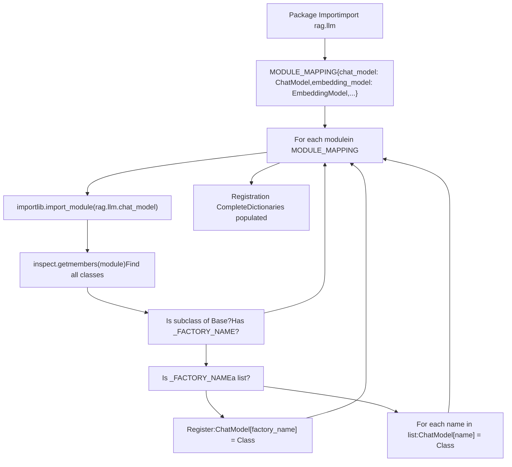

# 模型工厂模式与注册 (Model Factory Pattern and Registration)

相关源文件：

-   [api/apps/llm_app.py](https://github.com/infiniflow/ragflow/blob/80a16e71/api/apps/llm_app.py)
-   [api/db/init_data.py](https://github.com/infiniflow/ragflow/blob/80a16e71/api/db/init_data.py)
-   [api/db/services/llm_service.py](https://github.com/infiniflow/ragflow/blob/80a16e71/api/db/services/llm_service.py)
-   [conf/llm_factories.json](https://github.com/infiniflow/ragflow/blob/80a16e71/conf/llm_factories.json)
-   [docs/references/supported_models.mdx](https://github.com/infiniflow/ragflow/blob/80a16e71/docs/references/supported_models.mdx)
-   [rag/llm/__init__.py](https://github.com/infiniflow/ragflow/blob/80a16e71/rag/llm/__init__.py)
-   [rag/llm/chat_model.py](https://github.com/infiniflow/ragflow/blob/80a16e71/rag/llm/chat_model.py)
-   [rag/llm/cv_model.py](https://github.com/infiniflow/ragflow/blob/80a16e71/rag/llm/cv_model.py)
-   [rag/llm/embedding_model.py](https://github.com/infiniflow/ragflow/blob/80a16e71/rag/llm/embedding_model.py)
-   [rag/llm/rerank_model.py](https://github.com/infiniflow/ragflow/blob/80a16e71/rag/llm/rerank_model.py)
-   [rag/llm/sequence2txt_model.py](https://github.com/infiniflow/ragflow/blob/80a16e71/rag/llm/sequence2txt_model.py)
-   [rag/llm/tts_model.py](https://github.com/infiniflow/ragflow/blob/80a16e71/rag/llm/tts_model.py)
-   [web/src/assets/svg/llm/n1n.svg](https://github.com/infiniflow/ragflow/blob/80a16e71/web/src/assets/svg/llm/n1n.svg)
-   [web/src/constants/llm.ts](https://github.com/infiniflow/ragflow/blob/80a16e71/web/src/constants/llm.ts)
-   [web/src/pages/user-setting/setting-model/constant.ts](https://github.com/infiniflow/ragflow/blob/80a16e71/web/src/pages/user-setting/setting-model/constant.ts)
-   [web/src/utils/common-util.ts](https://github.com/infiniflow/ragflow/blob/80a16e71/web/src/utils/common-util.ts)

本页面记录了 RAGFlow 中用于注册和实例化 LLM 提供商的动态工厂模式。该系统通过集中注册机制，在运行时自动发现并映射提供商实现，从而支持 6 种模型类型下的 40 多个提供商。

有关特定提供商实现的详细信息，请参阅 [提供商实现 (Provider Implementations)](/zh/5-llm-integration-system/5.2-provider-implementations)。有关租户如何配置模型以及模型在应用中如何使用的细节，请参阅 [租户配置与用量追踪 (Tenant Configuration and Usage Tracking)](/zh/5-llm-integration-system/5.4-tenant-configuration-and-usage-tracking)。

---

## 目的与架构 (Purpose and Architecture)

RAGFlow 中的工厂模式支持可插拔的 LLM 提供商，无需硬编码依赖。每个提供商类通过 `_FACTORY_NAME` 属性声明其工厂名称，而 `__init__.py` 模块在导入时会自动发现这些类并将其注册到特定类型的字典中。

**核心优势：**

-   **零样板代码 (Zero boilerplate)**：添加新提供商只需实现一个带有 `_FACTORY_NAME` 的类。
-   **多别名支持 (Multi-alias support)**：提供商可以使用多个名称进行注册（例如 "VLLM" 和 "OpenAI-API-Compatible"）。
-   **类型安全**：为每种模型类型（聊天、嵌入、重排序等）提供独立的字典。
-   **运行时检查**：使用 Python 的 `inspect` 模块扫描提供商类。

**模型类型字典** (定义于 [rag/llm/__init__.py:126-143](https://github.com/infiniflow/ragflow/blob/80a16e71/rag/llm/__init__.py#L126-L143))：

| 字典名称 | 模型类型 | 用途 |
| --- | --- | --- |
| `ChatModel` | LLM 聊天补全 | 带有对话历史记录的文本生成 |
| `EmbeddingModel` | 文本嵌入 | 文本的向量表示 |
| `RerankModel` | 文档重排序 | 搜索结果的相关性评分 |
| `CvModel` | 图像转文本 | 视觉模型描述 |
| `Seq2txtModel` | 语音转文本 | 音频转录 |
| `TTSModel` | 文本转语音 | 音频合成 |
| `OcrModel` | OCR | 从图像中提取文本 |

**数据源**：[rag/llm/__init__.py:1-186](https://github.com/infiniflow/ragflow/blob/80a16e71/rag/llm/__init__.py#L1-L186) [rag/llm/chat_model.py:1-100](https://github.com/infiniflow/ragflow/blob/80a16e71/rag/llm/chat_model.py#L1-L100) [api/db/services/llm_service.py:32-34](https://github.com/infiniflow/ragflow/blob/80a16e71/api/db/services/llm_service.py#L32-L34)

---

## 工厂注册流程 (Factory Registration Flow)

注册过程在导入 `rag.llm` 包时自动发生，使用模块自省技术来发现所有提供商类。


**注册算法** (摘自 [rag/llm/__init__.py:147-175](https://github.com/infiniflow/ragflow/blob/80a16e71/rag/llm/__init__.py#L147-L175))：

1.  遍历 `MODULE_MAPPING` 条目（例如，`"chat_model"` -> `ChatModel` 字典）。
2.  导入完整的模块路径（例如，`rag.llm.chat_model`）。
3.  使用 `inspect.getmembers()` 找到 `Base` 抽象类。
4.  扫描模块中满足以下条件的类：
    -   继承自 `Base`（但不是 `Base` 类本身）。
    -   定义了 `_FACTORY_NAME` 属性。
5.  检查 `_FACTORY_NAME` 是字符串还是列表：
    -   **字符串**：注册为 `mapping_dict[factory_name] = Class`。
    -   **列表**：将每个名称注册为 `mapping_dict[name] = Class`。
6.  对所有 7 种模块类型重复此操作。

**数据源**：[rag/llm/__init__.py:135-175](https://github.com/infiniflow/ragflow/blob/80a16e71/rag/llm/__init__.py#L135-L175)

---

## 工厂名称属性 (Factory Name Attribute)

`_FACTORY_NAME` 类属性标识了提供商类应如何注册。它可以是单个字符串或字符串列表（用于支持多别名）。

### 单一工厂名称

大多数提供商使用单一工厂名称：

```python
# 来自 chat_model.py
class XinferenceChat(Base):
    _FACTORY_NAME = "Xinference"

    def __init__(self, key, model_name, base_url, **kwargs):
        # 实现代码
```
结果：`ChatModel["Xinference"] = XinferenceChat`

### 多个工厂名称 (别名)

支持多种模式的提供商可以使用多个名称进行注册：

```python
# 来自 chat_model.py
class OpenAI_APIChat(Base):
    _FACTORY_NAME = ["VLLM", "OpenAI-API-Compatible"]

    def __init__(self, key, model_name, base_url, **kwargs):
        # 实现代码
```
结果：
-   `ChatModel["VLLM"] = OpenAI_APIChat`
-   `ChatModel["OpenAI-API-Compatible"] = OpenAI_APIChat`

---

## 模块映射结构 (Module Mapping Structure)

`MODULE_MAPPING` 常量定义了哪些模块包含哪些模型类型。它驱动着注册循环。

[rag/llm/__init__.py:135-143](https://github.com/infiniflow/ragflow/blob/80a16e71/rag/llm/__init__.py#L135-L143) 中的定义：

```python
MODULE_MAPPING = {
    "chat_model": ChatModel,
    "cv_model": CvModel,
    "embedding_model": EmbeddingModel,
    "rerank_model": RerankModel,
    "sequence2txt_model": Seq2txtModel,
    "tts_model": TTSModel,
    "ocr_model": OcrModel,
}
```
每个键都是模块名称（不带 `rag.llm.` 前缀），每个值都是指向将要填充注册类的全局字典的引用。

**数据源**：[rag/llm/__init__.py:126-143](https://github.com/infiniflow/ragflow/blob/80a16e71/rag/llm/__init__.py#L126-L143)

---

## 基类要求 (Base Class Requirements)

所有提供商实现必须继承自其各自的 `Base` 抽象类。每个基类定义了提供商必须实现的接口。

### 聊天模型基类 (Chat Model Base)

**抽象方法** ([rag/llm/chat_model.py:65-78](https://github.com/infiniflow/ragflow/blob/80a16e71/rag/llm/chat_model.py#L65-L78))：
-   `async_chat(system, history, gen_conf, **kwargs)` - 异步聊天补全
-   `async_chat_streamly(system, history, gen_conf, **kwargs)` - 流式聊天
-   `bind_tools(toolcall_session, tools)` - 工具/函数调用（可选）

### 嵌入模型基类 (Embedding Model Base)

[rag/llm/embedding_model.py:37-51](https://github.com/infiniflow/ragflow/blob/80a16e71/rag/llm/embedding_model.py#L37-L51) 定义了 `encode()` 和 `encode_queries()` 方法。

### 重排序模型基类 (Rerank Model Base)

[rag/llm/rerank_model.py:28-54](https://github.com/infiniflow/ragflow/blob/80a16e71/rag/llm/rerank_model.py#L28-L54) 定义了 `similarity()` 方法。

**数据源**：[rag/llm/chat_model.py:65-78](https://github.com/infiniflow/ragflow/blob/80a16e71/rag/llm/chat_model.py#L65-L78) [rag/llm/embedding_model.py:37-51](https://github.com/infiniflow/ragflow/blob/80a16e71/rag/llm/embedding_model.py#L37-L51) [rag/llm/rerank_model.py:28-54](https://github.com/infiniflow/ragflow/blob/80a16e71/rag/llm/rerank_model.py#L28-L54)

---

## 注册检测逻辑 (Registration Detection Logic)

注册循环使用 Python 的 `inspect` 模块识别应被注册的类。本节详述被检查的确切条件。

**代码实现** ([rag/llm/__init__.py:167-175](https://github.com/infiniflow/ragflow/blob/80a16e71/rag/llm/__init__.py#L167-L175))：

```python
if base_class is not None:
    for _, obj in inspect.getmembers(module):
        if inspect.isclass(obj) and issubclass(obj, base_class) and obj is not base_class and hasattr(obj, "_FACTORY_NAME"):
            if isinstance(obj._FACTORY_NAME, list):
                for factory_name in obj._FACTORY_NAME:
                    mapping_dict[factory_name] = obj
            else:
                mapping_dict[obj._FACTORY_NAME] = obj
```
**注册条件：**

1.  `inspect.isclass(obj)` - 必须是一个类。
2.  `issubclass(obj, base_class)` - 必须继承自 `Base`。
3.  `obj is not base_class` - 不能是 `Base` 类本身。
4.  `hasattr(obj, "_FACTORY_NAME")` - 必须定义了 `_FACTORY_NAME` 属性。

**数据源**：[rag/llm/__init__.py:147-175](https://github.com/infiniflow/ragflow/blob/80a16e71/rag/llm/__init__.py#L147-L175)

---

## LiteLLM 集成 (LiteLLM Integration)

某些提供商通过一个特殊的 `LiteLLMBase` 类进行注册，该类使用 `litellm` 库实现统一的 API 访问。这些提供商遵循略有不同的注册模式。

**LiteLLM 配置** ([rag/llm/__init__.py:62-124](https://github.com/infiniflow/ragflow/blob/80a16e71/rag/llm/__init__.py#L62-L124)) 定义了 `FACTORY_DEFAULT_BASE_URL` 和 `LITELLM_PROVIDER_PREFIX`。

注册循环会同时检查 `Base` 和 `LiteLLMBase` 类。这使得 `LiteLLMBase` 能够注册那些利用 `litellm` 库进行统一多提供商支持的提供商。

**数据源**：[rag/llm/__init__.py:62-124](https://github.com/infiniflow/ragflow/blob/80a16e71/rag/llm/__init__.py#L62-L124) [rag/llm/__init__.py:152-166](https://github.com/infiniflow/ragflow/blob/80a16e71/rag/llm/__init__.py#L152-L166)

---

## 使用模式：模型实例化 (Usage Pattern: Model Instantiation)

提供商注册后，应用代码可以通过使用工厂名称作为索引来访问相应的字典并实例化模型。

### 直接实例化示例 (API 层)

```python
# 实例化一个嵌入模型
factory = req["llm_factory"]  # 例如 "OpenAI"
assert factory in EmbeddingModel, f"尚未支持来自 {factory} 的嵌入模型。"
mdl = EmbeddingModel[factory](key, model_name, base_url)
```

### 通过 LLMBundle 包装器

`LLMBundle` 类提供了一个更高层次的界面，负责处理租户配置和使用情况跟踪。它内部根据租户配置的模型工厂名称从 `ChatModel`、`EmbeddingModel` 等字典中获取对应的类并实例化。

**数据源**：[api/apps/llm_app.py:69-76](https://github.com/infiniflow/ragflow/blob/80a16e71/api/apps/llm_app.py#L69-L76) [api/db/services/llm_service.py:85-118](https://github.com/infiniflow/ragflow/blob/80a16e71/api/db/services/llm_service.py#L85-L118)

---

## 配置与初始化 (Configuration and Initialization)

提供商元数据存储在 `conf/llm_factories.json` 中，并在系统初始化期间加载到数据库中。

### 工厂配置格式

[conf/llm_factories.json:1-200](https://github.com/infiniflow/ragflow/blob/80a16e71/conf/llm_factories.json#L1-L200) 中的字段包括：
-   `name`: 工厂名称（与代码中的 `_FACTORY_NAME` 匹配）。
-   `tags`: 支持的模型类型。
-   `llm[]`: 该工厂下的具体模型数组。

### 数据库初始化

`init_llm_factory()` 函数负责读取 JSON 文件，并向 `LLMFactories` 和 `LLM` 表中插入记录。API 层随后会查询这些表，以校验给定工厂的可用模型。

**数据源**：[conf/llm_factories.json:1-200](https://github.com/infiniflow/ragflow/blob/80a16e71/conf/llm_factories.json#L1-L200) [api/db/init_data.py:96-145](https://github.com/infiniflow/ragflow/blob/80a16e71/api/db/init_data.py#L96-L145)

---

## 添加新提供商的步骤 (Adding a New Provider)

1.  **创建提供商类**：在适当的模型模块中创建一个继承自 `Base` 的新类，定义 `_FACTORY_NAME` 并实现抽象方法。
2.  **添加工厂配置**：在 `conf/llm_factories.json` 中添加相应条目。
3.  **无需编写注册代码**：工厂模式会在模块导入时自动发现并注册你的类。
4.  **更新文档**：将新提供商添加到支持模型列表中。

**数据源**：[rag/llm/chat_model.py:65-78](https://github.com/infiniflow/ragflow/blob/80a16e71/rag/llm/chat_model.py#L65-L78) [conf/llm_factories.json:1-50](https://github.com/infiniflow/ragflow/blob/80a16e71/conf/llm_factories.json#L1-L50) [docs/references/supported_models.mdx:1-90](https://github.com/infiniflow/ragflow/blob/80a16e71/docs/references/supported_models.mdx#L1-L90)
