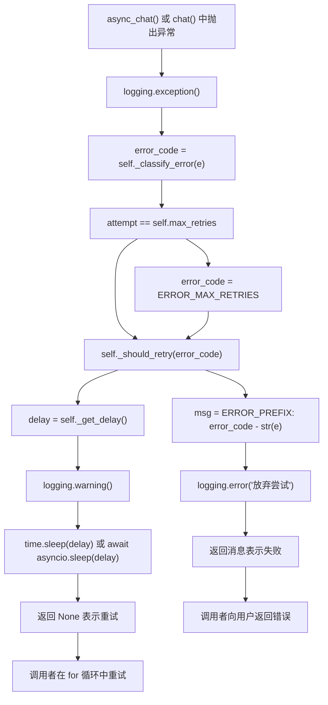
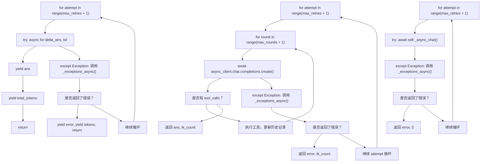
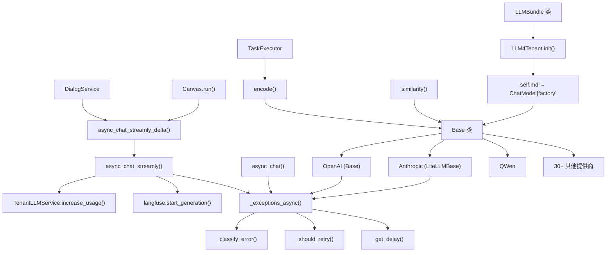
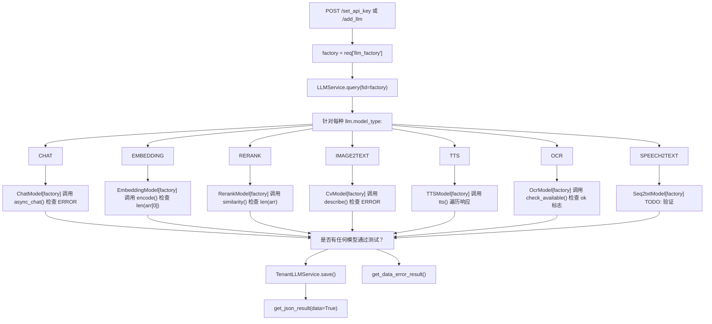
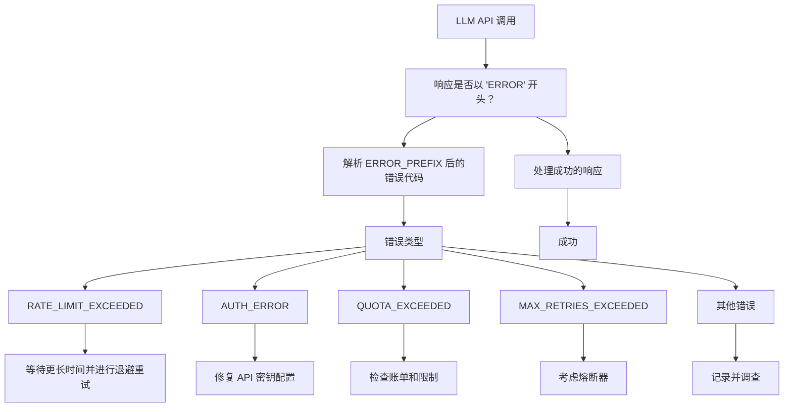

```mermaid
flowchart TD
    Error["异常 e"]
    ToString["str(e).lower()"]
    Regex["使用关键词模式进行 re.search()"]
    Pattern1["quota|capacity|credit|billing|欠费"]
    Pattern2["rate limit|429|tpm limit|too many requests"]
    Pattern3["auth|key|apikey|401|forbidden|permission"]
    Pattern4["invalid|bad request|400|format|malformed"]
    Pattern5["server|503|502|504|500|unavailable"]
    Pattern6["timeout|timed out"]
    Pattern7["connect|network|unreachable|dns"]
    Pattern8["filter|content|policy|blocked|safety"]
    Pattern9["model|not found|does not exist"]
    Pattern10["max rounds"]
    NoMatch["未匹配到模式"]
    Code1["LLMErrorCode.ERROR_QUOTA"]
    Code2["LLMErrorCode.ERROR_RATE_LIMIT⚠️ 可重试"]
    Code3["LLMErrorCode.ERROR_AUTHENTICATION"]
    Code4["LLMErrorCode.ERROR_INVALID_REQUEST"]
    Code5["LLMErrorCode.ERROR_SERVER⚠️ 可重试"]
    Code6["LLMErrorCode.ERROR_TIMEOUT"]
    Code7["LLMErrorCode.ERROR_CONNECTION"]
    Code8["LLMErrorCode.ERROR_CONTENT_FILTER"]
    Code9["LLMErrorCode.ERROR_MODEL"]
    Code10["LLMErrorCode.ERROR_MODEL"]
    Code11["LLMErrorCode.ERROR_GENERIC"]

    Error --> ToString
    ToString --> Regex
    Regex --> Pattern1
    Regex --> Pattern2
    Regex --> Pattern3
    Regex --> Pattern4
    Regex --> Pattern5
    Regex --> Pattern6
    Regex --> Pattern7
    Regex --> Pattern8
    Regex --> Pattern9
    Regex --> Pattern10
    Regex --> NoMatch
    Pattern1 --> Code1
    Pattern2 --> Code2
    Pattern3 --> Code3
    Pattern4 --> Code4
    Pattern5 --> Code5
    Pattern6 --> Code6
    Pattern7 --> Code7
    Pattern8 --> Code8
    Pattern9 --> Code9
    Pattern10 --> Code10
    NoMatch --> Code11
```

# 错误处理与重试逻辑 (Error Handling and Retry Logic)

相关源文件：

-   [api/apps/llm_app.py](https://github.com/infiniflow/ragflow/blob/80a16e71/api/apps/llm_app.py)
-   [api/db/init_data.py](https://github.com/infiniflow/ragflow/blob/80a16e71/api/db/init_data.py)
-   [api/db/services/llm_service.py](https://github.com/infiniflow/ragflow/blob/80a16e71/api/db/services/llm_service.py)
-   [conf/llm_factories.json](https://github.com/infiniflow/ragflow/blob/80a16e71/conf/llm_factories.json)
-   [docs/references/supported_models.mdx](https://github.com/infiniflow/ragflow/blob/80a16e71/docs/references/supported_models.mdx)
-   [rag/llm/__init__.py](https://github.com/infiniflow/ragflow/blob/80a16e71/rag/llm/__init__.py)
-   [rag/llm/chat_model.py](https://github.com/infiniflow/ragflow/blob/80a16e71/rag/llm/chat_model.py)
-   [rag/llm/cv_model.py](https://github.com/infiniflow/ragflow/blob/80a16e71/rag/llm/cv_model.py)
-   [rag/llm/embedding_model.py](https://github.com/infiniflow/ragflow/blob/80a16e71/rag/llm/embedding_model.py)
-   [rag/llm/rerank_model.py](https://github.com/infiniflow/ragflow/blob/80a16e71/rag/llm/rerank_model.py)
-   [rag/llm/sequence2txt_model.py](https://github.com/infiniflow/ragflow/blob/80a16e71/rag/llm/sequence2txt_model.py)
-   [rag/llm/tts_model.py](https://github.com/infiniflow/ragflow/blob/80a16e71/rag/llm/tts_model.py)
-   [web/src/assets/svg/llm/n1n.svg](https://github.com/infiniflow/ragflow/blob/80a16e71/web/src/assets/svg/llm/n1n.svg)
-   [web/src/constants/llm.ts](https://github.com/infiniflow/ragflow/blob/80a16e71/web/src/constants/llm.ts)
-   [web/src/pages/user-setting/setting-model/constant.ts](https://github.com/infiniflow/ragflow/blob/80a16e71/web/src/pages/user-setting/setting-model/constant.ts)
-   [web/src/utils/common-util.ts](https://github.com/infiniflow/ragflow/blob/80a16e71/web/src/utils/common-util.ts)

本文档描述了 RAGFlow 的 LLM 集成层中实现的错误处理和重试机制。这些机制通过自动对错误进行分类，并使用指数退避 (exponential backoff) 重试暂时性故障，确保了与外部 LLM 提供商之间的弹性通信。

**范围**：本页面涵盖了与 LLM API 通信时使用的错误分类、重试策略和退避算法。有关 LLM 提供商配置的信息，请参阅 [提供商实现 (Provider Implementations)](/zh/5-llm-integration-system/5.2-provider-implementations)。有关租户特定 API 密钥管理的信息，请参阅 [租户配置与用量追踪 (Tenant Configuration and Usage Tracking)](/zh/5-llm-integration-system/5.4-tenant-configuration-and-usage-tracking)。

---

## 错误分类系统 (Error Classification System)

RAGFlow 实现了一个全面的错误分类系统，用以在调用 LLM API 时区分可重试和不可重试的故障。

### 错误代码类型

`LLMErrorCode` 枚举定义了标准化的错误类型，抽象了提供商特定的错误消息：

| 错误代码 | 描述 | 是否可重试 |
| --- | --- | --- |
| `ERROR_RATE_LIMIT` | 超出 API 速率限制 (HTTP 429) | 是 |
| `ERROR_SERVER` | 服务器错误 (HTTP 500-504) | 是 |
| `ERROR_AUTHENTICATION` | 无效的 API 密钥或身份验证失败 | 否 |
| `ERROR_INVALID_REQUEST` | 请求格式错误或参数无效 | 否 |
| `ERROR_TIMEOUT` | 请求超时 | 否 |
| `ERROR_CONNECTION` | 网络连接问题 | 否 |
| `ERROR_MODEL` | 模型未找到或不可用 | 否 |
| `ERROR_CONTENT_FILTER` | 内容被安全策略过滤 | 否 |
| `ERROR_QUOTA` | API 配额或账单问题 | 否 |
| `ERROR_MAX_RETRIES` | 超出最大重试次数 | 否 |
| `ERROR_GENERIC` | 未分类错误 | 否 |

### 分类算法

`Base` 类中的 `_classify_error(self, error)` 方法使用基于正则表达式的关键词匹配来对异常进行分类：

**方法签名**：`_classify_error(self, error) -> LLMErrorCode`

**图表：Base._classify_error() 模式匹配逻辑**



**图表：Base._classify_error() 模式匹配逻辑**



```mermaid
flowchart TD
    Error["异常 e"]
    ToString["str(e).lower()"]
    Regex["re.search() 查找关键词模式"]
    Pattern1["模式: quota|capacity|credit|billing"]
    Pattern2["模式: rate limit|429|tpm limit"]
    Pattern3["模式: auth|key|apikey|401|forbidden"]
    Pattern4["模式: invalid|bad request|400"]
    Pattern5["模式: server|503|502|504|500"]
    Pattern6["模式: timeout|timed out"]
    Pattern7["模式: connect|network|unreachable"]
    Pattern8["模式: filter|content|policy|blocked"]
    Pattern9["模式: model|not found|does not exist"]
    Pattern10["模式: max rounds"]
    NoMatch["未匹配到模式"]
    Code1["LLMErrorCode.ERROR_QUOTA"]
    Code2["LLMErrorCode.ERROR_RATE_LIMIT 可重试"]
    Code3["LLMErrorCode.ERROR_AUTHENTICATION"]
    Code4["LLMErrorCode.ERROR_INVALID_REQUEST"]
    Code5["LLMErrorCode.ERROR_SERVER 可重试"]
    Code6["LLMErrorCode.ERROR_TIMEOUT"]
    Code7["LLMErrorCode.ERROR_CONNECTION"]
    Code8["LLMErrorCode.ERROR_CONTENT_FILTER"]
    Code9["LLMErrorCode.ERROR_MODEL"]
    Code10["LLMErrorCode.ERROR_MODEL"]
    Code11["LLMErrorCode.ERROR_GENERIC"]

    Error --> ToString
    ToString --> Regex
    Regex --> Pattern1
    Regex --> Pattern2
    Regex --> Pattern3
    Regex --> Pattern4
    Regex --> Pattern5
    Regex --> Pattern6
    Regex --> Pattern7
    Regex --> Pattern8
    Regex --> Pattern9
    Regex --> Pattern10
    Regex --> NoMatch
    Pattern1 --> Code1
    Pattern2 --> Code2
    Pattern3 --> Code3
    Pattern4 --> Code4
    Pattern5 --> Code5
    Pattern6 --> Code6
    Pattern7 --> Code7
    Pattern8 --> Code8
    Pattern9 --> Code9
    Pattern10 --> Code10
    NoMatch --> Code11
```

**实现细节**：

-   模式使用 `re.search()` 进行顺序检查，匹配不区分大小写。
-   第一个匹配到的模式决定错误代码。
-   第 84-95 行的 `keywords_mapping` 列表定义了所有模式。
-   只有 `ERROR_RATE_LIMIT` 和 `ERROR_SERVER` 是可重试的。

**数据源**：[rag/llm/chat_model.py:81-100](https://github.com/infiniflow/ragflow/blob/80a16e71/rag/llm/chat_model.py#L81-L100)

---

## 重试策略 (Retry Strategy)

RAGFlow 实现了选择性的重试逻辑，仅重试那些在后续尝试中可能成功的暂时性故障。

### 可重试错误集

`_retryable_errors` 属性定义了哪些错误应触发重试尝试：

```python
@property
def _retryable_errors(self) -> set[str]:
    return {
        LLMErrorCode.ERROR_RATE_LIMIT,
        LLMErrorCode.ERROR_SERVER,
    }
```

仅速率限制错误和服务器错误被视为可重试，因为这些代表了临时的服务中断。

### 重试决策流程

**图表：Base._exceptions() 和 Base._exceptions_async() 流程**



**核心方法签名**：

-   `_exceptions(self, e, attempt) -> str | None` - 同步版本
-   `async _exceptions_async(self, e, attempt)` - 异步版本
-   `_should_retry(self, error_code: str) -> bool` - 重试检查
-   `_get_delay(self) -> float` - 延迟计算

**数据源**：[rag/llm/chat_model.py:203-227](https://github.com/infiniflow/ragflow/blob/80a16e71/rag/llm/chat_model.py#L203-L227) [rag/llm/chat_model.py:229-243](https://github.com/infiniflow/ragflow/blob/80a16e71/rag/llm/chat_model.py#L229-L243) [rag/llm/chat_model.py:209-210](https://github.com/infiniflow/ragflow/blob/80a16e71/rag/llm/chat_model.py#L209-L210)

---

## 带抖动的指数退避 (Exponential Backoff with Jitter)

RAGFlow 实现了随机化的指数退避，以防止在多个请求同时失败时出现“惊群效应” (thundering herd problems)。

### 延迟计算

`_get_delay(self)` 方法计算带有随机抖动的重试延迟：

**方法实现**：

```python
def _get_delay(self):
    return self.base_delay * random.uniform(10, 150)
```

**公式**：`delay = base_delay × random(10, 150)`

**延迟范围示例**：

-   使用默认 `base_delay=2.0`：20 到 300 秒
-   使用 `base_delay=1.0`：10 到 150 秒
-   使用 `base_delay=5.0`：50 到 750 秒

**设计理念**：

-   **大范围的随机因子 (10-150x)** 可防止多个客户端同时重试时的惊群效应。
-   **非指数退避**：每次重试都会获得一个新的随机延迟，而不是指数级增加的延迟。
-   **适用于受速率限制的 API**：这类 API 在重试之间通常需要较长的退避时间。
-   **抖动防止同步**：随机延迟确保重试不会以可预测的时间间隔聚集。

**权衡**：

-   保守的方法优先考虑 API 的稳定性而非重试速度。
-   在使用默认设置时，最大延迟（最高 300 秒）可能会影响用户体验。
-   对于低延迟敏感型应用且 API 较为可靠的情况，可以考虑降低 `base_delay`。

### 配置参数

重试行为在 `Base.__init__()` 构造函数中配置：

| 参数 | 环境变量 | 默认值 | 代码引用 | 描述 |
| --- | --- | --- | --- | --- |
| `max_retries` | `LLM_MAX_RETRIES` | 5 | Line 72 | 放弃尝试前的最大重试次数 |
| `base_delay` | `LLM_BASE_DELAY` | 2.0 | Line 73 | 抖动计算的基础延迟（实际延迟 = base × random(10-150)） |
| `timeout` | `LLM_TIMEOUT_SECONDS` | 600 | Line 67 | OpenAI 客户端请求的 HTTP 超时时间（秒） |
| `max_rounds` | N/A | 5 | Line 74 | 智能体工作流中的最大工具调用轮数 |

**配置优先级**：

1.  显式的 `kwargs` 参数（最高优先级）
2.  环境变量
3.  硬编码默认值（最低优先级）

**示例**：设置 `LLM_MAX_RETRIES=3` 且 `LLM_BASE_DELAY=1.0` 时，系统将：

-   在初始失败后尝试最多 3 次重试（共 4 次尝试）。
-   每次重试使用 10-150 秒之间的延迟。
-   在 3 次重试失败后放弃并返回 `ERROR_MAX_RETRIES_EXCEEDED`。

**数据源**：[rag/llm/chat_model.py:66-74](https://github.com/infiniflow/ragflow/blob/80a16e71/rag/llm/chat_model.py#L66-L74)

---

## 在不同模型类型中的实现

错误处理在所有模型类型中实现方式一致，并根据同步与异步模式略有差异。

### 聊天模型错误处理

**图表：聊天方法中的基类错误处理**



**核心方法签名**：

-   `async def async_chat(self, system, history, gen_conf={}, **kwargs)` - Line 474
-   `async def async_chat_streamly(self, system, history, gen_conf: dict = {}, **kwargs)` - Line 174
-   `async def async_chat_with_tools(self, system: str, history: list, gen_conf: dict = {})` - Line 279
-   `async def async_chat_streamly_with_tools(self, system: str, history: list, gen_conf: dict = {})` - Line 333

**重试模式代码**：

标准异步聊天重试循环：

```python
for attempt in range(self.max_retries + 1):
    try:
        return await self._async_chat(history, gen_conf, **kwargs)
    except Exception as e:
        e = await self._exceptions_async(e, attempt)
        if e:
            return e, 0
```

流式重试循环：

```python
for attempt in range(self.max_retries + 1):
    try:
        async for delta_ans, tol in self._async_chat_streamly(history, gen_conf, **kwargs):
            ans = delta_ans
            total_tokens += tol
            yield ans
        yield total_tokens
        return
    except Exception as e:
        e = await self._exceptions_async(e, attempt)
        if e:
            yield e
            yield total_tokens
            return
```

**数据源**：[rag/llm/chat_model.py:174-195](https://github.com/infiniflow/ragflow/blob/80a16e71/rag/llm/chat_model.py#L174-L195) [rag/llm/chat_model.py:474-486](https://github.com/infiniflow/ragflow/blob/80a16e71/rag/llm/chat_model.py#L474-L486) [rag/llm/chat_model.py:279-330](https://github.com/infiniflow/ragflow/blob/80a16e71/rag/llm/chat_model.py#L279-L330) [rag/llm/chat_model.py:333-442](https://github.com/infiniflow/ragflow/blob/80a16e71/rag/llm/chat_model.py#L333-L442)

### 嵌入模型错误处理

嵌入模型使用更简单的重试逻辑，侧重于 API 可用性：

**QWenEmbed 重试模式**：

```python
retry_max = 5
resp = dashscope.TextEmbedding.call(...)
while (resp["output"] is None or resp["output"].get("embeddings") is None) and retry_max > 0:
    time.sleep(10)
    resp = dashscope.TextEmbedding.call(...)
    retry_max -= 1
if retry_max == 0:
    # 记录异常并抛出
```

**MistralEmbed 重试模式**：

```python
retry_max = 5
while retry_max > 0:
    try:
        res = self.client.embeddings(...)
        ress.extend([d.embedding for d in res.data])
        token_count += total_token_count_from_response(res)
        break
    except Exception as _e:
        if retry_max == 1:
            log_exception(_e)
        delay = random.uniform(20, 60)
        time.sleep(delay)
        retry_max -= 1
```

**核心差异**：

-   固定重试次数（5 次）。
-   固定或随机的延迟间隔。
-   不进行错误分类（重试所有异常）。
-   专注于可用性的简化错误处理。

**数据源**：[rag/llm/embedding_model.py:190-202](https://github.com/infiniflow/ragflow/blob/80a16e71/rag/llm/embedding_model.py#L190-L202) [rag/llm/embedding_model.py:429-442](https://github.com/infiniflow/ragflow/blob/80a16e71/rag/llm/embedding_model.py#L429-L442)

### 视觉模型错误处理

视觉模型（CV 模型）继承了重试配置，但通常在 API 调用级别处理错误：

```python
async def async_chat(self, system, history, gen_conf, images=None, **kwargs):
    try:
        response = await self.async_client.chat.completions.create(...)
        return response.choices[0].message.content.strip(), response.usage.total_tokens
    except Exception as e:
        return "**ERROR**: " + str(e), 0
```

视觉模型通常直接返回错误消息而不进行重试，依靠更高层的编排来实现重试逻辑。

**数据源**：[rag/llm/cv_model.py:79-88](https://github.com/infiniflow/ragflow/blob/80a16e71/rag/llm/cv_model.py#L79-L88)

---

## 错误消息格式 (Error Message Format)

返回给调用者的所有错误消息都遵循一致的格式，以便实现程序化检测：

### 错误前缀常量

```python
ERROR_PREFIX = "**ERROR**"
```

### 错误消息结构

失败的 API 调用会返回格式化的错误字符串：

```python
msg = f"{ERROR_PREFIX}: {error_code} - {str(e)}"
```

**示例错误消息**：

-   `"**ERROR**: RATE_LIMIT_EXCEEDED - API rate limit exceeded, please retry later"`
-   `"**ERROR**: MAX_RETRIES_EXCEEDED - Maximum retry attempts exceeded after 5 tries"`
-   `"**ERROR**: AUTH_ERROR - Invalid API key provided"`

这种格式允许调用代码通过以下方式检查错误：

```python
if response.startswith("**ERROR**:"):
    # 处理错误
```

**数据源**：[rag/llm/chat_model.py:59](https://github.com/infiniflow/ragflow/blob/80a16e71/rag/llm/chat_model.py#L59-L59) [rag/llm/chat_model.py:225-227](https://github.com/infiniflow/ragflow/blob/80a16e71/rag/llm/chat_model.py#L225-L227) [rag/llm/chat_model.py:241-243](https://github.com/infiniflow/ragflow/blob/80a16e71/rag/llm/chat_model.py#L241-L243)

---

## 长度限制处理 (Length Limitation Handling)

RAGFlow 针对因上下文长度限制而被截断的回答包含了特殊处理逻辑：

### 长度通知常量

```python
LENGTH_NOTIFICATION_CN = "······\n由于大模型的上下文窗口大小限制，回答已经被大模型截断。"
LENGTH_NOTIFICATION_EN = "...\nThe answer is truncated by your chosen LLM due to its limitation on context length."
```

### 完成原因检测

当对话以 `finish_reason == "length"` 完成时，会追加相应的通知：

```python
if resp.choices[0].finish_reason == "length":
    if is_chinese(ans):
        ans += LENGTH_NOTIFICATION_CN
    else:
        ans += LENGTH_NOTIFICATION_EN
```

这向用户提供了关于回答被截断的反馈，而不会将其视为错误。

**数据源**：[rag/llm/chat_model.py:60-61](https://github.com/infiniflow/ragflow/blob/80a16e71/rag/llm/chat_model.py#L60-L61) [rag/llm/chat_model.py:167-171](https://github.com/infiniflow/ragflow/blob/80a16e71/rag/llm/chat_model.py#L167-L171) [rag/llm/chat_model.py:197-200](https://github.com/infiniflow/ragflow/blob/80a16e71/rag/llm/chat_model.py#L197-L200)

---

## 与 LLMBundle 的集成

`api/db/services/llm_service.py` 中的 `LLMBundle` 类封装了提供商特定的模型实例，在增加用量追踪的同时，将错误处理委托给底层 `Base` 类的方法。

**图表：LLMBundle 与基类错误处理的集成**



**核心集成点**：

1.  **LLMBundle 初始化**：
    -   `LLMBundle` 继承自 `LLM4Tenant` 类。
    -   在初始化期间，调用模型工厂来实例化提供商特定的模型。
    -   提供商模型继承自具有内置重试逻辑的 `Base` 类。
2.  **方法委托**：
    -   `LLMBundle.async_chat_streamly_delta()` 直接调用 `self.mdl.async_chat_streamly()`。
    -   所有重试逻辑都在提供商的 `Base` 类方法中执行。
    -   `LLMBundle` 接收成功的响应或格式化的错误消息。
3.  **用量追踪**：
    -   仅在成功完成之后才调用 `TenantLLMService.increase_usage(tenant_id, llm_type, used_tokens)`。
    -   失败的请求（即使经过重试）不会增加用量计数。
    -   防止因失败的 API 调用而向用户计费。
4.  **错误透明度**：
    -   `Base` 类中的重试逻辑对 `LLMBundle` 层完全透明。
    -   `LLMBundle` 永远不会看到重试成功的暂时性故障。
    -   仅接收最终成功的响应或超出最大重试次数后的错误消息。
    -   实现了重试逻辑与用量追踪之间的清晰关注点分离。
5.  **可观测性**：
    -   Langfuse 集成使用 `generation.start()` 和 `generation.end()` 封装了整个模型调用。
    -   捕获成功的响应和最终的错误（经过所有重试后）。
    -   不捕获单个重试尝试（隐藏在 `Base` 类中）。
    -   提供包括所有重试延迟在内的端到端延迟信息。

**错误流示例**：

```text
用户请求 → LLMBundle.async_chat_streamly_delta()
            → Base.async_chat_streamly() [尝试 1: 速率限制错误]
            → sleep(随机 20-300 秒)
            → Base.async_chat_streamly() [尝试 2: 成功]
            → 返回响应
            → TenantLLMService.increase_usage()
            → 向用户 yield 响应
```

**数据源**：[api/db/services/llm_service.py:85-387](https://github.com/infiniflow/ragflow/blob/80a16e71/api/db/services/llm_service.py#L85-L387) [api/db/services/tenant_llm_service.py:1-300](https://github.com/infiniflow/ragflow/blob/80a16e71/api/db/services/tenant_llm_service.py#L1-L300) [rag/llm/chat_model.py:65-486](https://github.com/infiniflow/ragflow/blob/80a16e71/rag/llm/chat_model.py#L65-L486)

---

## 配置与环境变量

错误处理行为可以通过环境变量进行微调：

### 环境变量

| 变量 | 类型 | 默认值 | 描述 |
| --- | --- | --- | --- |
| `LLM_MAX_RETRIES` | int | 5 | 放弃尝试前的最大重试次数 |
| `LLM_BASE_DELAY` | float | 2.0 | 指数退避的基础延迟（秒） |
| `LLM_TIMEOUT_SECONDS` | int | 600 | LLM API 调用的 HTTP 请求超时时间 |

### 代码中的使用

配置在模型初始化期间应用：

```python
def __init__(self, key, model_name, base_url, **kwargs):
    timeout = int(os.environ.get("LLM_TIMEOUT_SECONDS", 600))
    self.client = OpenAI(api_key=key, base_url=base_url, timeout=timeout)
    self.max_retries = kwargs.get("max_retries", int(os.environ.get("LLM_MAX_RETRIES", 5)))
    self.base_delay = kwargs.get("retry_interval", float(os.environ.get("LLM_BASE_DELAY", 2.0)))
    self.max_rounds = kwargs.get("max_rounds", 5)
```

**数据源**：[rag/llm/chat_model.py:65-73](https://github.com/infiniflow/ragflow/blob/80a16e71/rag/llm/chat_model.py#L65-L73)

---

## API 验证与测试 (API Validation and Testing)

在存储 LLM 配置之前，RAGFlow 通过在 `api/apps/llm_app.py` 中进行测试调用来验证 API 凭据。

**图表：LLM 配置验证流程**



**验证代码示例**：

聊天模型：

```python
mdl = ChatModel(factory)
m, tc = await mdl.async_chat(None, [{"role": "user", "content": "Hello! How are you doing!"}],
                             {"temperature": 0.9})
if not tc and m.find("**ERROR**:") >= 0:
    raise Exception(m)
```

嵌入模型：

```python
mdl = EmbeddingModel(factory)
arr, tc = mdl.encode(["Test if the api key is available"])
if len(arr[0]) == 0:
    raise Exception("Fail")
```

重排序模型：

```python
mdl = RerankModel(factory)
arr, tc = mdl.similarity("Hello~ RAGFlower!", ["Hi, there!", "Ohh, my friend!"])
if len(arr) == 0:
    raise Exception("Not known.")
```

**核心点**：

-   验证在配置期间同步进行。
-   至少必须有一种模型类型通过验证。
-   失败的验证会在 `msg` 变量中累积错误消息。
-   成功的验证会将配置保存到 `tenant_llm` 表中。
-   `Base` 类中的重试逻辑同样适用于验证测试。

**数据源**：[api/apps/llm_app.py:58-125](https://github.com/infiniflow/ragflow/blob/80a16e71/api/apps/llm_app.py#L58-L125) [api/apps/llm_app.py:128-297](https://github.com/infiniflow/ragflow/blob/80a16e71/api/apps/llm_app.py#L128-L297)

---

## 最佳实践 (Best Practices)

### 对于系统管理员

1.  **监控重试率**：高重试率表明存在速率限制或服务不稳定。
2.  **调整基础延迟**：在受速率限制的情况下，增加 `LLM_BASE_DELAY`。
3.  **设置合适的超时时间**：在响应速度与允许长时间运行的请求之间取得平衡。
4.  **配置最大重试次数**：对于成本敏感型部署可以减少次数，对于可靠性要求高的可以增加。

### 对于开发人员

1.  **检查错误前缀**：在处理响应前，始终检查其是否以 `**ERROR**` 开头。
2.  **实现熔断器**：考虑在应用层增加额外的熔断器模式。
3.  **记录错误代码**：跟踪每个提供商最常出现的错误代码。
4.  **处理流式错误**：流式响应可能会在流的中间产生错误消息。

### 错误处理核对清单



**数据源**：[rag/llm/chat_model.py:38-61](https://github.com/infiniflow/ragflow/blob/80a16e71/rag/llm/chat_model.py#L38-L61) [rag/llm/chat_model.py:203-243](https://github.com/infiniflow/ragflow/blob/80a16e71/rag/llm/chat_model.py#L203-L243)
