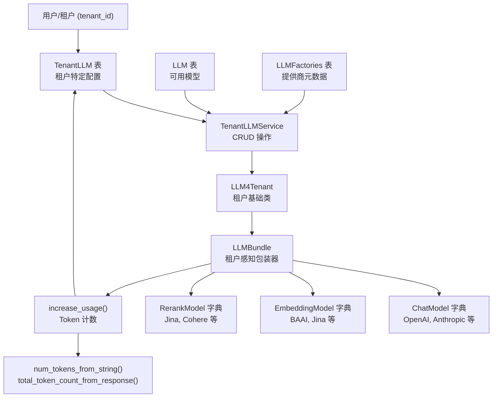
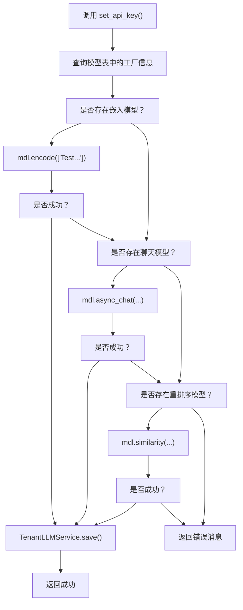
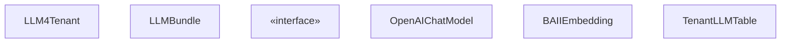
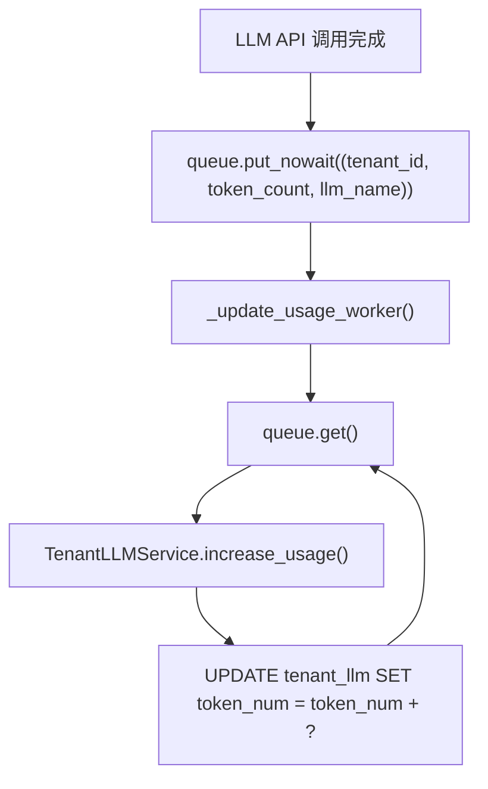
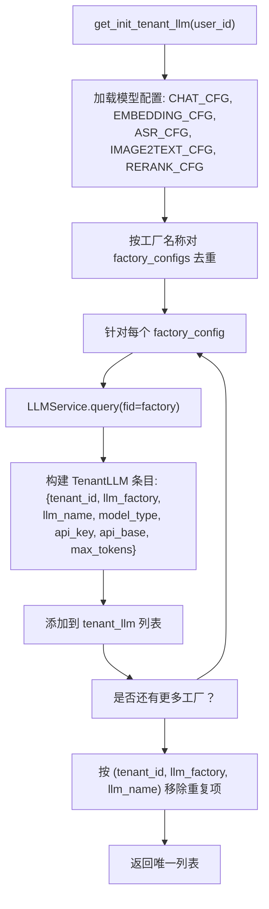
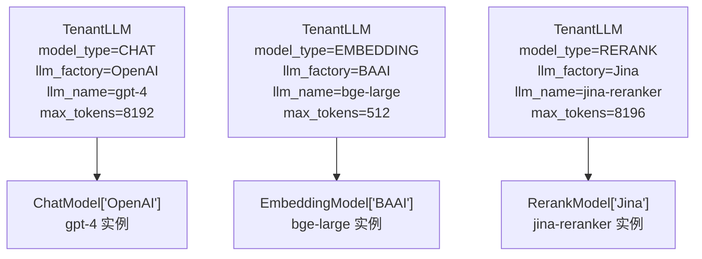

# 租户配置与用量追踪 (Tenant Configuration and Usage Tracking)

相关源文件：

-   [agent/tools/retrieval.py](https://github.com/infiniflow/ragflow/blob/80a16e71/agent/tools/retrieval.py)
-   [api/apps/llm_app.py](https://github.com/infiniflow/ragflow/blob/80a16e71/api/apps/llm_app.py)
-   [api/apps/sdk/chat.py](https://github.com/infiniflow/ragflow/blob/80a16e71/api/apps/sdk/chat.py)
-   [api/apps/sdk/dataset.py](https://github.com/infiniflow/ragflow/blob/80a16e71/api/apps/sdk/dataset.py)
-   [api/apps/sdk/dify_retrieval.py](https://github.com/infiniflow/ragflow/blob/80a16e71/api/apps/sdk/dify_retrieval.py)
-   [api/apps/sdk/doc.py](https://github.com/infiniflow/ragflow/blob/80a16e71/api/apps/sdk/doc.py)
-   [api/apps/sdk/session.py](https://github.com/infiniflow/ragflow/blob/80a16e71/api/apps/sdk/session.py)
-   [api/db/init_data.py](https://github.com/infiniflow/ragflow/blob/80a16e71/api/db/init_data.py)
-   [api/db/services/canvas_service.py](https://github.com/infiniflow/ragflow/blob/80a16e71/api/db/services/canvas_service.py)
-   [api/db/services/conversation_service.py](https://github.com/infiniflow/ragflow/blob/80a16e71/api/db/services/conversation_service.py)
-   [api/db/services/llm_service.py](https://github.com/infiniflow/ragflow/blob/80a16e71/api/db/services/llm_service.py)
-   [api/utils/api_utils.py](https://github.com/infiniflow/ragflow/blob/80a16e71/api/utils/api_utils.py)
-   [conf/llm_factories.json](https://github.com/infiniflow/ragflow/blob/80a16e71/conf/llm_factories.json)
-   [docs/references/http_api_reference.md](https://github.com/infiniflow/ragflow/blob/80a16e71/docs/references/http_api_reference.md)
-   [docs/references/python_api_reference.md](https://github.com/infiniflow/ragflow/blob/80a16e71/docs/references/python_api_reference.md)
-   [docs/references/supported_models.mdx](https://github.com/infiniflow/ragflow/blob/80a16e71/docs/references/supported_models.mdx)
-   [docs/release_notes.md](https://github.com/infiniflow/ragflow/blob/80a16e71/docs/release_notes.md)
-   [rag/advanced_rag/__init__.py](https://github.com/infiniflow/ragflow/blob/80a16e71/rag/advanced_rag/__init__.py)
-   [rag/benchmark.py](https://github.com/infiniflow/ragflow/blob/80a16e71/rag/benchmark.py)
-   [rag/llm/__init__.py](https://github.com/infiniflow/ragflow/blob/80a16e71/rag/llm/__init__.py)
-   [rag/llm/chat_model.py](https://github.com/infiniflow/ragflow/blob/80a16e71/rag/llm/chat_model.py)
-   [rag/llm/cv_model.py](https://github.com/infiniflow/ragflow/blob/80a16e71/rag/llm/cv_model.py)
-   [rag/llm/embedding_model.py](https://github.com/infiniflow/ragflow/blob/80a16e71/rag/llm/embedding_model.py)
-   [rag/llm/rerank_model.py](https://github.com/infiniflow/ragflow/blob/80a16e71/rag/llm/rerank_model.py)
-   [rag/llm/sequence2txt_model.py](https://github.com/infiniflow/ragflow/blob/80a16e71/rag/llm/sequence2txt_model.py)
-   [rag/llm/tts_model.py](https://github.com/infiniflow/ragflow/blob/80a16e71/rag/llm/tts_model.py)
-   [sdk/python/ragflow_sdk/modules/chat.py](https://github.com/infiniflow/ragflow/blob/80a16e71/sdk/python/ragflow_sdk/modules/chat.py)
-   [sdk/python/ragflow_sdk/ragflow.py](https://github.com/infiniflow/ragflow/blob/80a16e71/sdk/python/ragflow_sdk/ragflow.py)
-   [web/src/assets/svg/llm/n1n.svg](https://github.com/infiniflow/ragflow/blob/80a16e71/web/src/assets/svg/llm/n1n.svg)
-   [web/src/constants/llm.ts](https://github.com/infiniflow/ragflow/blob/80a16e71/web/src/constants/llm.ts)
-   [web/src/pages/user-setting/setting-model/constant.ts](https://github.com/infiniflow/ragflow/blob/80a16e71/web/src/pages/user-setting/setting-model/constant.ts)
-   [web/src/utils/common-util.ts](https://github.com/infiniflow/ragflow/blob/80a16e71/web/src/utils/common-util.ts)

## 目的与范围

本文档描述了 RAGFlow 的多租户 LLM 配置系统，该系统允许每个租户（用户）维护自己的 API 密钥、模型偏好以及 LLM 服务用量统计。内容涵盖了 `TenantLLM` 数据库表、`LLMBundle` 包装类、Token 用量追踪机制以及 API 密钥验证工作流。

有关 LLM 模型工厂模式和提供商实现的更多信息，请参阅 [模型工厂模式与注册 (Model Factory Pattern and Registration)](/zh/5-llm-integration-system/5.1-model-factory-pattern-and-registration) 和 [提供商实现 (Provider Implementations)](/zh/5-llm-integration-system/5.2-provider-implementations)。有关错误处理和重试逻辑，请参阅 [错误处理与重试逻辑 (Error Handling and Retry Logic)](/zh/5-llm-integration-system/5.3-error-handling-and-retry-logic)。有关工具调用功能，请参阅 [工具调用与函数使用 (Tool Calling and Function Use)](/zh/5-llm-integration-system/5.5-tool-calling-and-function-use)。

---

## 架构概览


**图表：租户 LLM 配置架构**

系统采用了三层架构：存储在 `TenantLLM` 中的租户特定配置、用于 CRUD 操作的服务层，以及在基础模型类上添加了租户上下文和用量追踪的 `LLMBundle` 包装器。

数据源：[api/db/services/llm_service.py:85-91](https://github.com/infiniflow/ragflow/blob/80a16e71/api/db/services/llm_service.py#L85-L91) [api/db/init_data.py:36-83](https://github.com/infiniflow/ragflow/blob/80a16e71/api/db/init_data.py#L36-L83) [api/apps/llm_app.py:58-126](https://github.com/infiniflow/ragflow/blob/80a16e71/api/apps/llm_app.py#L58-L126)

---

## TenantLLM 表结构

`TenantLLM` 数据库表存储了每个租户的 LLM 配置。每一行代表一个租户针对某一特定模型的配置。

| 字段 | 类型 | 描述 |
| --- | --- | --- |
| `tenant_id` | String | 用户/租户标识符（外键） |
| `llm_factory` | String | 提供商名称（例如 "OpenAI", "Anthropic"） |
| `llm_name` | String | 具体模型名称（例如 "gpt-4", "claude-3"） |
| `model_type` | Enum | 类型：`CHAT`, `EMBEDDING`, `RERANK`, `IMAGE2TEXT`, `SPEECH2TEXT`, `TTS`, `OCR` |
| `api_key` | String | 加密的 API 密钥或 JSON 配置 |
| `api_base` | String | 自定义基础 URL（覆盖工厂默认值） |
| `max_tokens` | Integer | 最大上下文窗口大小 |

**表：TenantLLM 架构字段**

对于需要复杂身份验证的提供商（如 AWS Bedrock, Azure OpenAI, 火山引擎），`api_key` 字段可能存储简单的 API 密钥字符串或 JSON 对象。

数据源：[api/db/services/llm_service.py:36-83](https://github.com/infiniflow/ragflow/blob/80a16e71/api/db/services/llm_service.py#L36-L83) [api/apps/llm_app.py:128-210](https://github.com/infiniflow/ragflow/blob/80a16e71/api/apps/llm_app.py#L128-L210)

---

## 租户配置流程

**图表：API 密钥验证与存储流程**

当用户通过 [api/apps/llm_app.py:58-126](https://github.com/infiniflow/ragflow/blob/80a16e71/api/apps/llm_app.py#L58-L126) 设置 API 密钥时，系统在存储配置之前，会通过向提供商发起测试调用来对其进行验证。

数据源：[api/apps/llm_app.py:58-126](https://github.com/infiniflow/ragflow/blob/80a16e71/api/apps/llm_app.py#L58-L126) [api/apps/llm_app.py:128-294](https://github.com/infiniflow/ragflow/blob/80a16e71/api/apps/llm_app.py#L128-L294)

---

## API 密钥验证过程

API 密钥验证过程在将凭据持久化到数据库之前，会针对实际的 LLM 提供商端点测试提供的凭据。

### 验证逻辑

对于每个 `llm_factory`，系统会测试最多三种模型类型，直到其中一种成功为止：

1.  **嵌入模型测试**：调用 `encode(["Test if the api key is available"])` 并验证结果非空。
2.  **聊天模型测试**：调用 `async_chat()` 进行简单的问候并检查响应是否有效。
3.  **重排序模型测试**：使用测试查询和文档调用 `similarity()`。


**图表：API 密钥验证流程**

数据源：[api/apps/llm_app.py:58-126](https://github.com/infiniflow/ragflow/blob/80a16e71/api/apps/llm_app.py#L58-L126)

### 特殊身份验证格式

某些提供商要求使用 JSON 编码的身份验证参数，而不是简单的 API 密钥：

| 提供商 | JSON 字段 | 存储格式 |
| --- | --- | --- |
| **火山引擎** | `ark_api_key`, `endpoint_id` | `{"ark_api_key": "...", "endpoint_id": "..."}` |
| **腾讯混元** | `hunyuan_sid`, `hunyuan_sk` | `{"hunyuan_sid": "...", "hunyuan_sk": "..."}` |
| **Bedrock** | `auth_mode`, `bedrock_ak`, `bedrock_sk`, `bedrock_region`, `aws_role_arn` | `{"auth_mode": "...", "bedrock_ak": "...", ...}` |
| **Azure-OpenAI** | `api_key`, `api_version` | `{"api_key": "...", "api_version": "2024-02-01"}` |
| **百度一言** | `yiyan_ak`, `yiyan_sk` | `{"yiyan_ak": "...", "yiyan_sk": "..."}` |
| **Fish Audio** | `fish_audio_ak`, `fish_audio_refid` | `{"fish_audio_ak": "...", "fish_audio_refid": "..."}` |

**表：提供商特定的身份验证格式**

[api/apps/llm_app.py:140-142](https://github.com/infiniflow/ragflow/blob/80a16e71/api/apps/llm_app.py#L140-L142) 中的 `apikey_json()` 辅助函数从请求参数中构造这些 JSON 字符串。

数据源：[api/apps/llm_app.py:128-210](https://github.com/infiniflow/ragflow/blob/80a16e71/api/apps/llm_app.py#L128-210) [rag/llm/chat_model.py:655-667](https://github.com/infiniflow/ragflow/blob/80a16e71/rag/llm/chat_model.py#L655-L667) [rag/llm/embedding_model.py:461-503](https://github.com/infiniflow/ragflow/blob/80a16e71/rag/llm/embedding_model.py#L461-L503)

---

## LLMBundle：租户感知包装器

`LLMBundle` 类扩展了 `LLM4Tenant`，为 LLM 模型提供租户感知接口。它封装了来自工厂注册表的基础模型类，并添加了用量追踪。

### 类层次结构


**图表：LLMBundle 类层次结构**

数据源：[api/db/services/llm_service.py:85-233](https://github.com/infiniflow/ragflow/blob/80a16e71/api/db/services/llm_service.py#L85-L233)

### 初始化流程

当 `LLMBundle` 被实例化时，它会：

1.  查询 `TenantLLM` 表以获取租户特定的配置。
2.  如果不存在租户配置，则回退到 `service_conf.yaml` 中的系统默认值。
3.  从动态模型注册表中查找工厂类。
4.  使用租户的 `api_key` 和 `base_url` 实例化基础模型。
5.  将模型实例存储在 `self._mdl` 中。

```python
# 摘自 api/db/services/llm_service.py:85-91
class LLMBundle(LLM4Tenant):
    def __init__(self, tenant_id, llm_type, llm_name=None, lang="Chinese", **kwargs):
        super().__init__(tenant_id, llm_type, llm_name, lang, **kwargs)
```

父类 `LLM4Tenant.__init__()` 通过调用租户 LLM 服务中定义的方法来执行模型实例化。

数据源：[api/db/services/llm_service.py:85-91](https://github.com/infiniflow/ragflow/blob/80a16e71/api/db/services/llm_service.py#L85-L91)

---

## Token 用量追踪

Token 用量追踪通过 `increase_usage()` 方法实现，该方法在每次 LLM 调用后增加 `TenantLLM` 表中的 Token 计数器。

### 用量追踪流程

**图表：Token 用量追踪序列**

数据源：[api/db/services/llm_service.py:144-233](https://github.com/infiniflow/ragflow/blob/80a16e71/api/db/services/llm_service.py#L144-L233)

### Token 计数实现

Token 计数方式因模型类型而异：

| 模型类型 | 计数方法 | 位置 |
| --- | --- | --- |
| **聊天** | `total_token_count_from_response(response)` 从 API 响应中提取 | [rag/llm/chat_model.py:163-173](https://github.com/infiniflow/ragflow/blob/80a16e71/rag/llm/chat_model.py#L163-L173) |
| **嵌入** | `total_token_count_from_response(response)` 或回退到 `num_tokens_from_string()` | [rag/llm/embedding_model.py:100-114](https://github.com/infiniflow/ragflow/blob/80a16e71/rag/llm/embedding_model.py#L100-L114) |
| **重排序** | 对查询和文档计算 `num_tokens_from_string(query) + sum(...)` | [rag/llm/rerank_model.py:167-182](https://github.com/infiniflow/ragflow/blob/80a16e71/rag/llm/rerank_model.py#L167-L182) |
| **视觉** | `total_token_count_from_response(response)` | [rag/llm/cv_model.py:89-91](https://github.com/infiniflow/ragflow/blob/80a16e71/rag/llm/cv_model.py#L89-L91) |

**表：按模型类型划分的 Token 计数**

工具函数定义在 `common/token_utils.py` 中：

-   `num_tokens_from_string(text)`：使用 tiktoken 计算字符串中的 Token 数量。
-   `total_token_count_from_response(response)`：从 API 响应中提取 `usage.total_tokens`。

数据源：[rag/llm/chat_model.py:163-173](https://github.com/infiniflow/ragflow/blob/80a16e71/rag/llm/chat_model.py#L163-L173) [rag/llm/embedding_model.py:100-114](https://github.com/infiniflow/ragflow/blob/80a16e71/rag/llm/embedding_model.py#L100-L114) [rag/llm/rerank_model.py:167-182](https://github.com/infiniflow/ragflow/blob/80a16e71/rag/llm/rerank_model.py#L167-L182)

### increase_usage() 实现

`increase_usage()` 方法实现为基于队列的异步更新器，以避免阻塞主线程：


**图表：异步用量更新架构**

后台工作线程持续处理来自队列的用量更新，防止数据库操作阻塞 LLM API 调用。

数据源：[api/db/services/llm_service.py:144-233](https://github.com/infiniflow/ragflow/blob/80a16e71/api/db/services/llm_service.py#L144-L233)

---

## 默认模型初始化

当创建一个新租户（用户）时，系统会自动根据 `service_conf.yaml` 设置配置默认的 LLM。

### get_init_tenant_llm() 函数

[api/db/services/llm_service.py:36-83](https://github.com/infiniflow/ragflow/blob/80a16e71/api/db/services/llm_service.py#L36-L83) 函数为新用户生成默认的 `TenantLLM` 条目：


**图表：默认租户 LLM 初始化**

该函数确保每个新租户都能访问来自已配置默认工厂的所有可用模型。

数据源：[api/db/services/llm_service.py:36-83](https://github.com/infiniflow/ragflow/blob/80a16e71/api/db/services/llm_service.py#L36-L83) [api/db/init_data.py:44-83](https://github.com/infiniflow/ragflow/blob/80a16e71/api/db/init_data.py#L44-L83)

### 配置来源

默认配置来自多个渠道：

1.  **环境变量**：`LLM_TIMEOUT_SECONDS`, `LLM_MAX_RETRIES`, `LLM_BASE_DELAY`
2.  **service_conf.yaml**：工厂名称、基础 URL、系统默认 API 密钥。
3.  **LLM 表**：包含 `max_tokens` 和 `model_type` 元数据的可用模型。
4.  **LLMFactories 表**：工厂元数据，如名称、标签、状态。

[api/db/init_data.py:44-83](https://github.com/infiniflow/ragflow/blob/80a16e71/api/db/init_data.py#L44-L83) 中的初始化逻辑在创建第一个超级用户账户时会合并这些来源。

数据源：[api/db/init_data.py:44-83](https://github.com/infiniflow/ragflow/blob/80a16e71/api/db/init_data.py#L44-L83) [api/db/services/llm_service.py:36-83](https://github.com/infiniflow/ragflow/blob/80a16e71/api/db/services/llm_service.py#L36-L83)

---

## 多模型类型支持

RAGFlow 支持七种不同的模型类型，每种类型都有不同的接口和使用模式：

| 模型类型 | 基类 | 核心方法 | Token 计数 | 用例 |
| --- | --- | --- | --- | --- |
| `CHAT` | `Base` (chat_model) | `async_chat()`, `async_chat_streamly()` | `total_token_count_from_response()` | 对话式 AI, RAG 回答 |
| `EMBEDDING` | `Base` (embedding_model) | `encode()`, `encode_queries()` | `total_token_count_from_response()` | 文档向量化 |
| `RERANK` | `Base` (rerank_model) | `similarity()` | `num_tokens_from_string()` | 结果重排序 |
| `IMAGE2TEXT` | `Base` (cv_model) | `describe()`, `describe_with_prompt()` | `total_token_count_from_response()` | OCR, 图像描述 |
| `SPEECH2TEXT` | `Base` (sequence2txt_model) | `speech2text()` | 基于音频时长 | ASR, 转录 |
| `TTS` | `Base` (tts_model) | `tts()` | 基于文本长度 | 文本转语音 |
| `OCR` | `Base` (ocr_model) | 各种 OCR 方法 | 不适用 | 文档布局分析 |

**表：支持的模型类型与接口**

每种模型类型都在 [rag/llm/__init__.py:135-143](https://github.com/infiniflow/ragflow/blob/80a16e71/rag/llm/__init__.py#L135-L143) 的 `MODULE_MAPPING` 字典中注册，并经由工厂模式动态加载。

数据源：[rag/llm/__init__.py:126-143](https://github.com/infiniflow/ragflow/blob/80a16e71/rag/llm/__init__.py#L126-L143) [rag/llm/chat_model.py:40-52](https://github.com/infiniflow/ragflow/blob/80a16e71/rag/llm/chat_model.py#L40-L52) [rag/llm/embedding_model.py:37-51](https://github.com/infiniflow/ragflow/blob/80a16e71/rag/llm/embedding_model.py#L37-L51) [rag/llm/rerank_model.py:28-38](https://github.com/infiniflow/ragflow/blob/80a16e71/rag/llm/rerank_model.py#L28-L38)

### 按类型配置

同一个租户下的每种模型类型可以有不同的配置：


**图表：按类型配置模型**

租户可以为不同的模型类型使用不同的提供商（例如，使用 OpenAI 进行聊天，使用 BAAI 进行嵌入，使用 Jina 进行重排序）。

数据源：[api/db/services/llm_service.py:36-83](https://github.com/infiniflow/ragflow/blob/80a16e71/api/db/services/llm_service.py#L36-L83) [api/apps/llm_app.py:128-294](https://github.com/infiniflow/ragflow/blob/80a16e71/api/apps/llm_app.py#L128-L294)

---

## 用量统计与限制

### 当前实现

目前的实现会追踪 `TenantLLM` 表中的累计 Token 用量，但不会强制执行硬性限制。用量统计存储在：

-   **`token_num` 字段**：该模型所有调用的累计 Token 计数。
-   **按请求追踪**：每次 LLM 调用返回 `(response, token_count)` 元组。

### 未来的配额系统

虽然目前尚未强制执行，但架构支持添加配额限制：

1.  向 `TenantLLM` 表**添加 `quota` 字段**。
2.  **在 API 调用前检查**：在 `LLMBundle.__init__()` 中将 `token_num` 与 `quota` 进行对比。
3.  **超出则拒绝**：返回错误代码 `ERROR_QUOTA`（定义在 [rag/llm/chat_model.py:50](https://github.com/infiniflow/ragflow/blob/80a16e71/rag/llm/chat_model.py#L50-L50)）。
4.  **管理员覆盖**：允许超级用户绕过限制。

错误分类系统已经包含了针对提供商端配额错误的 `ERROR_QUOTA` 检测（见 [rag/llm/chat_model.py:86](https://github.com/infiniflow/ragflow/blob/80a16e71/rag/llm/chat_model.py#L86-L86)）。

数据源：[rag/llm/chat_model.py:40-52](https://github.com/infiniflow/ragflow/blob/80a16e71/rag/llm/chat_model.py#L40-L52) [rag/llm/chat_model.py:82-101](https://github.com/infiniflow/ragflow/blob/80a16e71/rag/llm/chat_model.py#L82-L101) [api/db/services/llm_service.py:144-233](https://github.com/infiniflow/ragflow/blob/80a16e71/api/db/services/llm_service.py#L144-L233)

---

## 配置相关的 API 端点

### 设置 API 密钥

**POST** `/api/v1/llm/set_api_key`

设置或更新特定 LLM 工厂的 API 密钥。在保存前会测试该密钥。

**请求正文：**

```json
{
  "llm_factory": "OpenAI",
  "api_key": "sk-...",
  "base_url": "https://api.openai.com/v1"
}
```

**实现**：[api/apps/llm_app.py:58-126](https://github.com/infiniflow/ragflow/blob/80a16e71/api/apps/llm_app.py#L58-L126)

### 添加自定义 LLM

**POST** `/api/v1/llm/add_llm`

添加自定义 LLM 配置（例如本地模型、自定义端点）。

**请求正文：**

```json
{
  "llm_factory": "OpenAI-API-Compatible",
  "llm_name": "my-local-model___OpenAI-API",
  "model_type": "chat",
  "api_key": "x",
  "api_base": "http://localhost:8000/v1",
  "max_tokens": 4096
}
```

**实现**：[api/apps/llm_app.py:128-294](https://github.com/infiniflow/ragflow/blob/80a16e71/api/apps/llm_app.py#L128-L294)

### 列出工厂

**GET** `/api/v1/llm/factories`

返回带有支持模型类型的可用 LLM 工厂。

**响应：**

```json
{
  "data": [
    {
      "name": "OpenAI",
      "model_types": ["chat", "embedding", "speech2text", "tts"],
      "status": "1",
      "logo": "...",
      "tags": "LLM,TEXT EMBEDDING,TTS,SPEECH2TEXT"
    }
  ]
}
```

**实现**：[api/apps/llm_app.py:31-55](https://github.com/infiniflow/ragflow/blob/80a16e71/api/apps/llm_app.py#L31-L55)

数据源：[api/apps/llm_app.py:31-294](https://github.com/infiniflow/ragflow/blob/80a16e71/api/apps/llm_app.py#L31-L294) [docs/references/http_api_reference.md:1-200](https://github.com/infiniflow/ragflow/blob/80a16e71/docs/references/http_api_reference.md#L1-L200)

---

## 代码实体引用

### 核心类与函数

| 实体 | 文件 | 用途 |
| --- | --- | --- |
| `TenantLLM` | `api/db/db_models.py` | 租户 LLM 配置的数据库模型 |
| `TenantLLMService` | `api/db/services/tenant_llm_service.py` | TenantLLM 的 CRUD 服务 |
| `LLM4Tenant` | `api/db/services/tenant_llm_service.py` | 租户感知 LLM 的基类 |
| `LLMBundle` | `api/db/services/llm_service.py` | 带有用量追踪的包装器 |
| `get_init_tenant_llm()` | `api/db/services/llm_service.py:36-83` | 生成默认配置 |
| `increase_usage()` | `api/db/services/llm_service.py` | 更新 Token 用量 |
| `set_api_key()` | `api/apps/llm_app.py:58-126` | 密钥验证的 API 端点 |
| `add_llm()` | `api/apps/llm_app.py:128-294` | 自定义模型的 API 端点 |
| `num_tokens_from_string()` | `common/token_utils.py` | Token 计数工具 |
| `total_token_count_from_response()` | `common/token_utils.py` | 从 API 响应中提取 Token 计数 |

**表：核心代码实体**

数据源：[api/db/services/llm_service.py:1-233](https://github.com/infiniflow/ragflow/blob/80a16e71/api/db/services/llm_service.py#L1-L233) [api/apps/llm_app.py:1-294](https://github.com/infiniflow/ragflow/blob/80a16e71/api/apps/llm_app.py#L1-L294)

---

## 配置文件格式

`conf/llm_factories.json` 文件定义了可用模型及其能力：

```json
{
  "factory_llm_infos": [
    {
      "name": "OpenAI",
      "tags": "LLM,TEXT EMBEDDING,TTS,TEXT RE-RANK,SPEECH2TEXT",
      "llm": [
        {
          "llm_name": "gpt-4o",
          "tags": "LLM,CHAT,128K,IMAGE2TEXT",
          "max_tokens": 128000,
          "model_type": "chat",
          "is_tools": true
        }
      ]
    }
  ]
}
```

该配置在系统初始化期间会被加载到 `LLM` 和 `LLMFactories` 表中（见 [api/db/init_data.py:74-156](https://github.com/infiniflow/ragflow/blob/80a16e71/api/db/init_data.py#L74-L156)）。

数据源：[conf/llm_factories.json:1-200](https://github.com/infiniflow/ragflow/blob/80a16e71/conf/llm_factories.json#L1-L200) [api/db/init_data.py:74-156](https://github.com/infiniflow/ragflow/blob/80a16e71/api/db/init_data.py#L74-L156)
