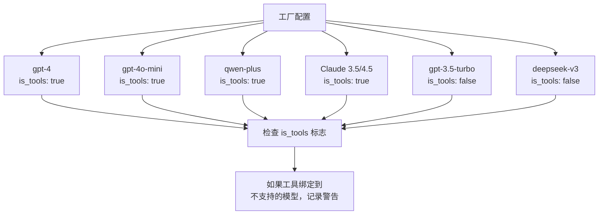
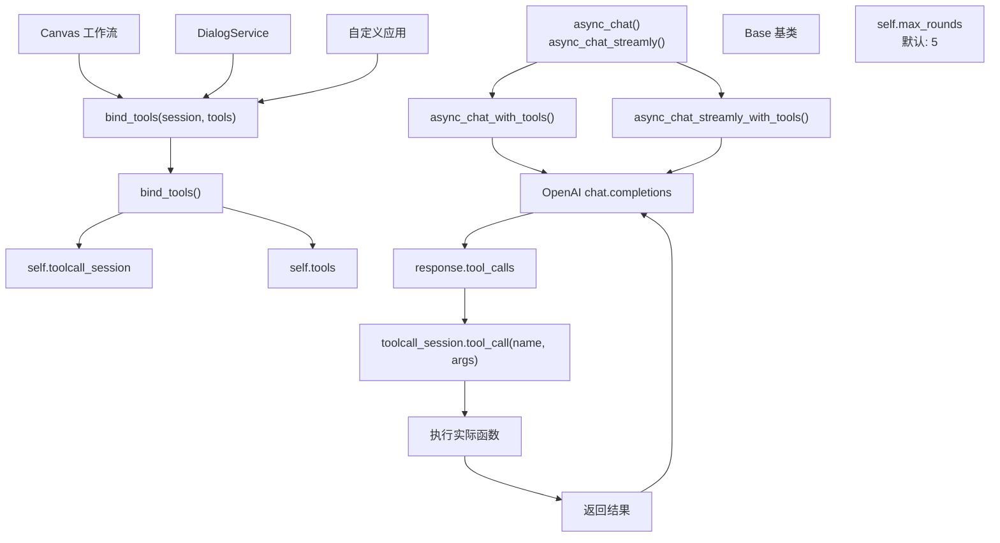
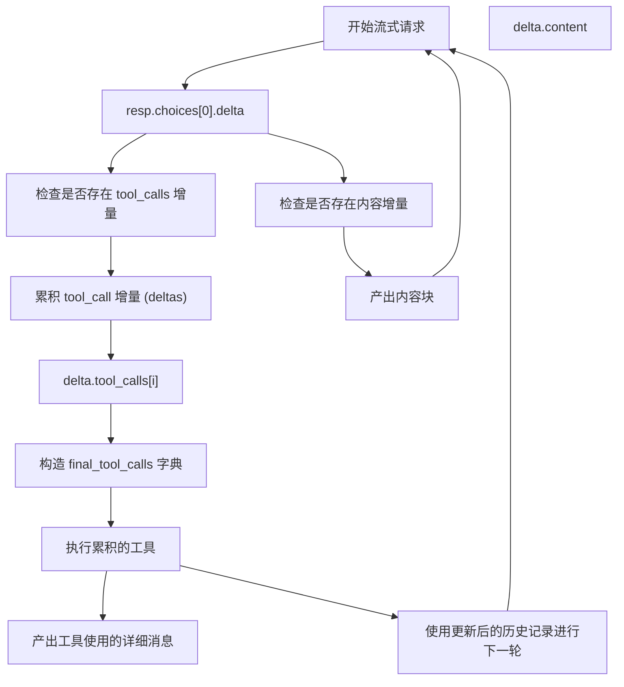
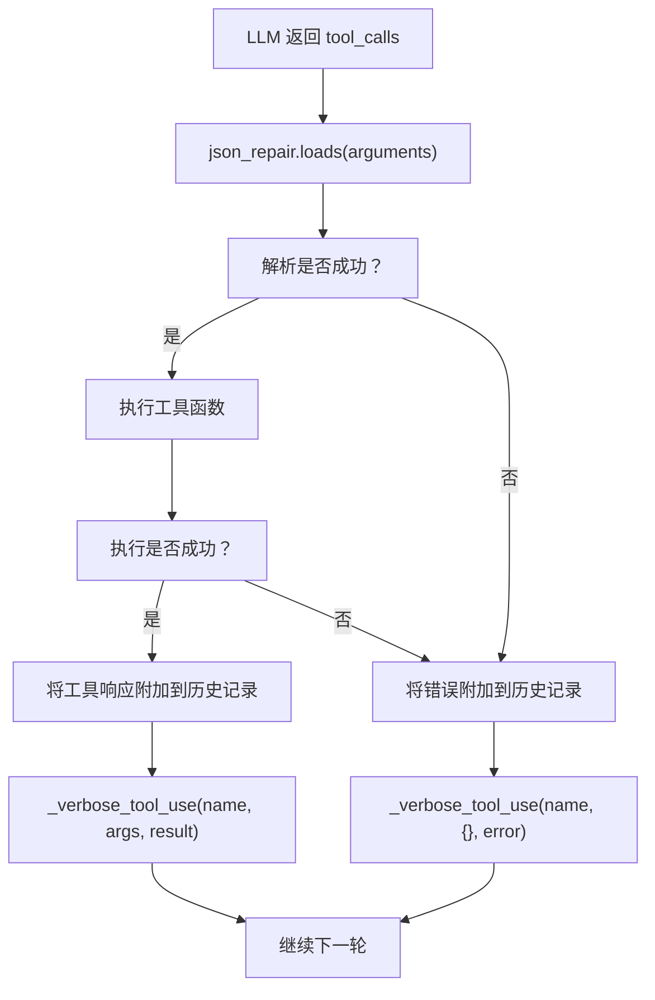
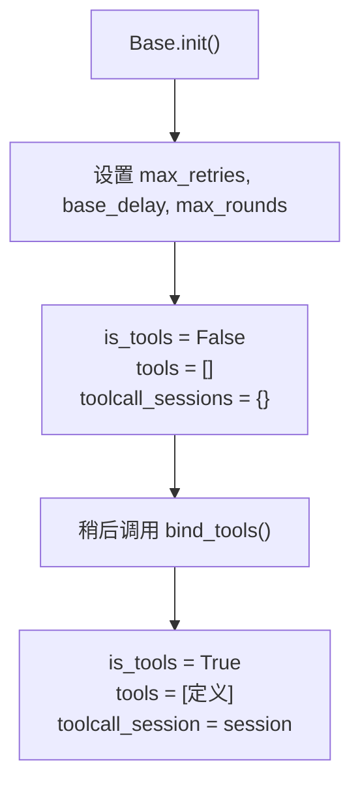

# 工具调用与函数使用 (Tool Calling and Function Use)

相关源文件：

-   [agent/canvas.py](https://github.com/infiniflow/ragflow/blob/80a16e71/agent/canvas.py)
-   [agent/component/agent_with_tools.py](https://github.com/infiniflow/ragflow/blob/80a16e71/agent/component/agent_with_tools.py)
-   [agent/component/base.py](https://github.com/infiniflow/ragflow/blob/80a16e71/agent/component/base.py)
-   [agent/component/categorize.py](https://github.com/infiniflow/ragflow/blob/80a16e71/agent/component/categorize.py)
-   [agent/component/llm.py](https://github.com/infiniflow/ragflow/blob/80a16e71/agent/component/llm.py)
-   [agent/tools/base.py](https://github.com/infiniflow/ragflow/blob/80a16e71/agent/tools/base.py)
-   [api/apps/api_app.py](https://github.com/infiniflow/ragflow/blob/80a16e71/api/apps/api_app.py)
-   [api/apps/canvas_app.py](https://github.com/infiniflow/ragflow/blob/80a16e71/api/apps/canvas_app.py)
-   [api/apps/llm_app.py](https://github.com/infiniflow/ragflow/blob/80a16e71/api/apps/llm_app.py)
-   [api/db/init_data.py](https://github.com/infiniflow/ragflow/blob/80a16e71/api/db/init_data.py)
-   [api/db/services/llm_service.py](https://github.com/infiniflow/ragflow/blob/80a16e71/api/db/services/llm_service.py)
-   [conf/llm_factories.json](https://github.com/infiniflow/ragflow/blob/80a16e71/conf/llm_factories.json)
-   [docs/references/supported_models.mdx](https://github.com/infiniflow/ragflow/blob/80a16e71/docs/references/supported_models.mdx)
-   [rag/llm/__init__.py](https://github.com/infiniflow/ragflow/blob/80a16e71/rag/llm/__init__.py)
-   [rag/llm/chat_model.py](https://github.com/infiniflow/ragflow/blob/80a16e71/rag/llm/chat_model.py)
-   [rag/llm/cv_model.py](https://github.com/infiniflow/ragflow/blob/80a16e71/rag/llm/cv_model.py)
-   [rag/llm/embedding_model.py](https://github.com/infiniflow/ragflow/blob/80a16e71/rag/llm/embedding_model.py)
-   [rag/llm/rerank_model.py](https://github.com/infiniflow/ragflow/blob/80a16e71/rag/llm/rerank_model.py)
-   [rag/llm/sequence2txt_model.py](https://github.com/infiniflow/ragflow/blob/80a16e71/rag/llm/sequence2txt_model.py)
-   [rag/llm/tts_model.py](https://github.com/infiniflow/ragflow/blob/80a16e71/rag/llm/tts_model.py)
-   [rag/prompts/generator.py](https://github.com/infiniflow/ragflow/blob/80a16e71/rag/prompts/generator.py)
-   [web/src/assets/svg/llm/n1n.svg](https://github.com/infiniflow/ragflow/blob/80a16e71/web/src/assets/svg/llm/n1n.svg)
-   [web/src/components/knowledge-base-item.tsx](https://github.com/infiniflow/ragflow/blob/80a16e71/web/src/components/knowledge-base-item.tsx)
-   [web/src/constants/llm.ts](https://github.com/infiniflow/ragflow/blob/80a16e71/web/src/constants/llm.ts)
-   [web/src/interfaces/request/flow.ts](https://github.com/infiniflow/ragflow/blob/80a16e71/web/src/interfaces/request/flow.ts)
-   [web/src/pages/user-setting/setting-model/constant.ts](https://github.com/infiniflow/ragflow/blob/80a16e71/web/src/pages/user-setting/setting-model/constant.ts)
-   [web/src/utils/common-util.ts](https://github.com/infiniflow/ragflow/blob/80a16e71/web/src/utils/common-util.ts)

本文档描述了 RAGFlow 的工具调用 (tool calling) 与函数调用 (function invocation) 系统。该系统使 LLM 模型能够执行外部函数，并将其结果集成到对话响应中。工具调用允许模型在生成过程中访问外部 API、数据库或自定义函数，使其具备生成文本之外的操作能力。

有关模型提供商配置和 API 密钥管理的信息，请参阅 [租户配置与用量追踪 (Tenant Configuration and Usage Tracking)](/zh/5-llm-integration-system/5.4-tenant-configuration-and-usage-tracking)。有关更广泛的 LLM 抽象层的详细信息，请参阅 [模型工厂模式与注册 (Model Factory Pattern and Registration)](/zh/5-llm-integration-system/5.1-model-factory-pattern-and-registration)。

## 目的与范围

工具调用系统提供以下功能：

-   **工具绑定 (Tool Binding)**：将函数定义附加到 LLM 实例的机制。
-   **多轮执行 (Multi-Round Execution)**：自动处理带有结果反馈的迭代式工具调用。
-   **流式支持 (Streaming Support)**：在流式响应期间进行实时工具执行。
-   **错误弹性 (Error Resilience)**：针对工具故障的 JSON 修复、异常处理和重试逻辑。
-   **提供商兼容性 (Provider Compatibility)**：跨 OpenAI 兼容工具调用 API 的统一接口。

## 支持工具调用的模型

并非所有 LLM 模型都支持工具调用。RAGFlow 通过模型定义中的 `is_tools` 标志来跟踪此项能力。

### 支持模型的配置

配置文件 [conf/llm_factories.json](https://github.com/infiniflow/ragflow/blob/80a16e71/conf/llm_factories.json) 定义了哪些模型支持工具调用：



**启用工具调用的模型示例**：

-   OpenAI：`gpt-4o`, `gpt-4o-mini`, `gpt-4-turbo`, `gpt-5` 系列。
-   Anthropic：Claude 系列模型。
-   通义千问：`qwen-plus`, `qwen-max`, `qwen-turbo`。
-   xAI：`grok-3`, `grok-4`。
-   智谱 AI：`glm-4`, `glm-4.5`, `glm-4.5-x`。

**数据源**：[conf/llm_factories.json:1-200](https://github.com/infiniflow/ragflow/blob/80a16e71/conf/llm_factories.json#L1-L200)

## 核心架构

### 工具调用组件



**数据源**：[rag/llm/chat_model.py:64-77](https://github.com/infiniflow/ragflow/blob/80a16e71/rag/llm/chat_model.py#L64-L77) [rag/llm/chat_model.py:272-277](https://github.com/infiniflow/ragflow/blob/80a16e71/rag/llm/chat_model.py#L272-L277) [api/db/services/llm_service.py:85-93](https://github.com/infiniflow/ragflow/blob/80a16e71/api/db/services/llm_service.py#L85-L93)

### 核心数据结构

工具调用系统使用由 OpenAI API 格式定义的特定数据结构：

| 结构 | 用途 | 核心字段 |
| --- | --- | --- |
| `tools` 列表 | 发送给 LLM 的函数定义 | `type`, `function`（包含 `name`, `description`, `parameters`） |
| `tool_call` | LLM 执行函数的请求 | `index`, `id`, `function.name`, `function.arguments` |
| 工具响应消息 | 返回给 LLM 的结果 | `role: "tool"`, `tool_call_id`, `content` |
| `toolcall_session` | 执行上下文 | 具有 `tool_call(name, args)` 方法的对象 |

**数据源**：[rag/llm/chat_model.py:248-270](https://github.com/infiniflow/ragflow/blob/80a16e71/rag/llm/chat_model.py#L248-L270)

## 工具绑定 (Tool Binding)

### 将工具绑定到模型

工具绑定将函数定义和执行会话附加到 LLM 实例：

**实现细节**：

1.  **LLMBundle 层** [api/db/services/llm_service.py:89-93](https://github.com/infiniflow/ragflow/blob/80a16e71/api/db/services/llm_service.py#L89-L93)：
    -   检查模型配置中的 `self.is_tools` 标志。
    -   如果将工具绑定到不支持的模型，记录警告。
    -   委托给底层模型的 `bind_tools()` 方法。
2.  **基础模型层** [rag/llm/chat_model.py:272-277](https://github.com/infiniflow/ragflow/blob/80a16e71/rag/llm/chat_model.py#L272-L277)：
    -   验证是否同时提供了 `toolcall_session` 和 `tools`。
    -   绑定成功时设置 `self.is_tools = True`。
    -   存储会话和工具，以便后续在生成期间使用。

**数据源**：[rag/llm/chat_model.py:272-277](https://github.com/infiniflow/ragflow/blob/80a16e71/rag/llm/chat_model.py#L272-L277) [api/db/services/llm_service.py:89-93](https://github.com/infiniflow/ragflow/blob/80a16e71/api/db/services/llm_service.py#L89-L93)

## 工具执行流程（非流式）

### 多轮工具调用

`async_chat_with_tools()` 方法实现了一个多轮工具执行循环：

**执行步骤**：

1.  **初始请求** [rag/llm/chat_model.py:292](https://github.com/infiniflow/ragflow/blob/80a16e71/rag/llm/chat_model.py#L292-L292)：
    -   发送带有 `tools=self.tools` 和 `tool_choice="auto"` 的消息。
    -   LLM 根据上下文决定是否使用工具。
2.  **工具调用检测** [rag/llm/chat_model.py:297-305](https://github.com/infiniflow/ragflow/blob/80a16e71/rag/llm/chat_model.py#L297-L305)：
    -   检查是否存在 `response.choices[0].message.tool_calls`。
    -   如果不存在，直接返回生成的内容。
    -   如果存在，进入工具执行循环。
3.  **工具执行** [rag/llm/chat_model.py:307-318](https://github.com/infiniflow/ragflow/blob/80a16e71/rag/llm/chat_model.py#L307-L318)：
    -   提取 `tool_call.function.name` 和 `tool_call.function.arguments`。
    -   使用 `json_repair.loads()` 处理格式错误的 JSON。
    -   通过 `asyncio.to_thread()` 调用 `self.toolcall_session.tool_call(name, args)`。
    -   处理异常并将错误消息附加到历史记录中。
4.  **历史记录更新** [rag/llm/chat_model.py:248-270](https://github.com/infiniflow/ragflow/blob/80a16e71/rag/llm/chat_model.py#L248-L270)：
    -   附加带有 `tool_calls` 数组的助手消息。
    -   附加带有 `role: "tool"` 和 `tool_call_id` 的工具消息。
    -   详细输出包括 `<tool_call>` XML 标签，以提高可读性。
5.  **迭代** [rag/llm/chat_model.py:290](https://github.com/infiniflow/ragflow/blob/80a16e71/rag/llm/chat_model.py#L290-L290)：
    -   最多重复 `self.max_rounds` 次（默认 5 次）。
    -   每次迭代都可以触发额外的工具调用。
    -   当 LLM 返回不带 `tool_calls` 的内容时停止。
6.  **最大轮数处理** [rag/llm/chat_model.py:320-325](https://github.com/infiniflow/ragflow/blob/80a16e71/rag/llm/chat_model.py#L320-L325)：
    -   如果超过限制，附加解释性消息。
    -   进行最后一次 LLM 调用以生成最终答案。
    -   返回累积的响应。

**数据源**：[rag/llm/chat_model.py:279-331](https://github.com/infiniflow/ragflow/blob/80a16e71/rag/llm/chat_model.py#L279-L331) [rag/llm/chat_model.py:248-270](https://github.com/infiniflow/ragflow/blob/80a16e71/rag/llm/chat_model.py#L248-L270)

## 流式工具执行

### 带流式传输的实时工具调用

`async_chat_streamly_with_tools()` 方法提供了流式支持：



**流式实现细节**：

1.  **增量累积** [rag/llm/chat_model.py:360-369](https://github.com/infiniflow/ragflow/blob/80a16e71/rag/llm/chat_model.py#L360-L369)：
    -   维护以工具索引为键的 `final_tool_calls` 字典。
    -   跨多个增量累积 `function.arguments`。
    -   处理部分 JSON 片段。
2.  **内容流式传输** [rag/llm/chat_model.py:371-384](https://github.com/infiniflow/ragflow/blob/80a16e71/rag/llm/chat_model.py#L371-L384)：
    -   在内容增量到达时立即产出。
    -   从响应元数据中累积 Token 计数。
    -   处理带有 `<think>` 标签的推理内容。
3.  **流结束后的工具执行** [rag/llm/chat_model.py:400-411](https://github.com/infiniflow/ragflow/blob/80a16e71/rag/llm/chat_model.py#L400-L411)：
    -   在执行前等待完整的 `tool_calls`。
    -   在执行前产出 "Begin to call..." 消息。
    -   对于同步工具函数使用 `asyncio.to_thread()`。
    -   执行完成后产出最终结果。
4.  **多轮流式传输** [rag/llm/chat_model.py:345-432](https://github.com/infiniflow/ragflow/blob/80a16e71/rag/llm/chat_model.py#L345-L432)：
    -   每一轮工具执行都会触发新的流式请求。
    -   持续进行直到 LLM 返回不带 `tool_calls` 的内容。
    -   最大轮数限制防止无限循环。
5.  **错误处理** [rag/llm/chat_model.py:434-440](https://github.com/infiniflow/ragflow/blob/80a16e71/rag/llm/chat_model.py#L434-L440)：
    -   在流中产出错误消息。
    -   允许流在发生可恢复错误后继续。
    -   在发生异常时返回累积的 Token 计数。

**数据源**：[rag/llm/chat_model.py:333-442](https://github.com/infiniflow/ragflow/blob/80a16e71/rag/llm/chat_model.py#L333-L442)

## 错误处理与弹性

### JSON 修复与异常处理

工具调用包含了多层错误处理：

| 错误类型 | 处理机制 | 位置 |
| --- | --- | --- |
| 格式错误的 JSON | `json_repair.loads()` | [rag/llm/chat_model.py:311, 403](https://github.com/infiniflow/ragflow/blob/80a16e71/rag/llm/chat_model.py#L311) |
| 工具执行失败 | 捕获异常，并附加到历史记录 | [rag/llm/chat_model.py:315-318, 408-411](https://github.com/infiniflow/ragflow/blob/80a16e71/rag/llm/chat_model.py#L315) |
| 超过最大轮数 | 记录警告，进行最终生成 | [rag/llm/chat_model.py:320-325, 413-432](https://github.com/infiniflow/ragflow/blob/80a16e71/rag/llm/chat_model.py#L320) |
| 缺少 tool_calls 结构 | 优雅地回退到内容生成 | [rag/llm/chat_model.py:297-305](https://github.com/infiniflow/ragflow/blob/80a16e71/rag/llm/chat_model.py#L297) |
| 提供商 API 错误 | 基础类提供的重试逻辑 | [rag/llm/chat_model.py:326-330](https://github.com/infiniflow/ragflow/blob/80a16e71/rag/llm/chat_model.py#L326) |

### 错误恢复流程



**核心错误处理特性**：

1.  **JSON 修复** [rag/llm/chat_model.py:311](https://github.com/infiniflow/ragflow/blob/80a16e71/rag/llm/chat_model.py#L311-L311)：
    -   使用 `json_repair` 库修复常见的 JSON 格式问题。
    -   处理多余的逗号、缺失的引号以及不完整的结构。
    -   提高生成不完美 JSON 的模型的可靠性。
2.  **异常传播** [rag/llm/chat_model.py:316-318](https://github.com/infiniflow/ragflow/blob/80a16e71/rag/llm/chat_model.py#L316-L318)：
    -   捕获工具执行期间的异常。
    -   使用 `logging.exception()` 记录完整异常。
    -   将错误消息附加到对话历史记录中。
    -   允许 LLM 看到错误，并可能进行重试或调整。
3.  **优雅降级** [rag/llm/chat_model.py:320-325](https://github.com/infiniflow/ragflow/blob/80a16e71/rag/llm/chat_model.py#L320-L325)：
    -   超过最大轮数不被视为失败。
    -   系统进行最后一次生成尝试。
    -   返回最佳可用响应。

**数据源**：[rag/llm/chat_model.py:307-331](https://github.com/infiniflow/ragflow/blob/80a16e71/rag/llm/chat_model.py#L307-L331) [rag/llm/chat_model.py:400-411](https://github.com/infiniflow/ragflow/blob/80a16e71/rag/llm/chat_model.py#L400-L411)

## 工具响应格式

### 工具使用的详细输出

系统以结构化格式封装工具调用，以提高可读性：

**格式实现** [rag/llm/chat_model.py:245-246](https://github.com/infiniflow/ragflow/blob/80a16e71/rag/llm/chat_model.py#L245-L246)：

```xml
<tool_call>
{
  "name": "function_name",
  "args": {"param1": "value1", "param2": "value2"},
  "result": "执行结果或错误消息"
}
</tool_call>
```

此格式：
-   使工具使用在对话输出中可见。
-   有助于调试和可观测性。
-   保留了调用/结果配对。
-   使用 JSON 表示结构化数据。

**历史消息格式** [rag/llm/chat_model.py:248-270](https://github.com/infiniflow/ragflow/blob/80a16e71/rag/llm/chat_model.py#L248-L270)：

系统维护 OpenAI 兼容的历史结构：

1.  **带有 tool_calls 的助手消息**：

```json
{
    "role": "assistant",
    "tool_calls": [
        {
            "index": 0,
            "id": "call_abc123",
            "function": {
                "name": "function_name",
                "arguments": "{\"param\": \"value\"}"
            },
            "type": "function"
        }
    ]
}
```

2.  **工具响应消息**：

```json
{
    "role": "tool",
    "tool_call_id": "call_abc123",
    "content": "result_string"
}
```

**数据源**：[rag/llm/chat_model.py:245-270](https://github.com/infiniflow/ragflow/blob/80a16e71/rag/llm/chat_model.py#L245-L270)

## 配置与限制

### 工具调用参数

以下参数控制工具调用行为：

| 参数 | 位置 | 默认值 | 用途 |
| --- | --- | --- | --- |
| `max_rounds` | [rag/llm/chat_model.py:73](https://github.com/infiniflow/ragflow/blob/80a16e71/rag/llm/chat_model.py#L73-L73) | 5 | 最大工具调用迭代次数 |
| `max_retries` | [rag/llm/chat_model.py:71](https://github.com/infiniflow/ragflow/blob/80a16e71/rag/llm/chat_model.py#L71-L71) | 5（来自环境） | 发生错误时的 API 重试尝试次数 |
| `base_delay` | [rag/llm/chat_model.py:72](https://github.com/infiniflow/ragflow/blob/80a16e71/rag/llm/chat_model.py#L72-L72) | 2.0 秒 | 带有抖动的初始重试延迟 |
| `tool_choice` | [rag/llm/chat_model.py:292](https://github.com/infiniflow/ragflow/blob/80a16e71/rag/llm/chat_model.py#L292-L292) | "auto" | LLM 的工具选择策略 |

### 初始化

工具调用支持在模型实例化期间初始化：



**数据源**：[rag/llm/chat_model.py:64-77](https://github.com/infiniflow/ragflow/blob/80a16e71/rag/llm/chat_model.py#L64-L77) [rag/llm/chat_model.py:272-277](https://github.com/infiniflow/ragflow/blob/80a16e71/rag/llm/chat_model.py#L272-L277)

### 环境变量

工具调用行为可以通过环境变量进行配置：

-   `LLM_MAX_RETRIES`：API 调用的重试尝试次数（默认：5）。
-   `LLM_BASE_DELAY`：指数退避的初始延迟（秒）（默认：2.0）。
-   `LLM_TIMEOUT_SECONDS`：LLM API 调用的超时时间（默认：600）。

这些变量在模型初始化期间被读取 [rag/llm/chat_model.py:66-73](https://github.com/infiniflow/ragflow/blob/80a16e71/rag/llm/chat_model.py#L66-L73)。

**数据源**：[rag/llm/chat_model.py:66-73](https://github.com/infiniflow/ragflow/blob/80a16e71/rag/llm/chat_model.py#L66-L73)

## 集成示例

### 在 Canvas 工作流中的使用

Canvas 工作流系统将工具调用用于智能体组件。工具通过组件的会话进行绑定：

1.  智能体组件准备函数定义。
2.  调用 `llm_bundle.bind_tools(session, tools)`。
3.  调用 `async_chat()` 或 `async_chat_streamly()`。
4.  在生成期间自动执行工具。

有关 Canvas 智能体架构的详细信息，请参阅 [Canvas 引擎与 DSL (Canvas Engine and DSL)](/zh/9.1-canvas-engine-and-dsl) 和 [内置组件 (Built-in Components)](/zh/9.3-built-in-components)。

### 在对话服务 (Dialog Service) 中的使用

对话服务可以将工具调用用于增强 RAG 的对话，其中 LLM 需要查询外部数据源或执行操作：

1.  对话服务准备对话历史记录。
2.  绑定可用工具（如数据库查询、API 调用）。
3.  在工具支持下调用 LLM。
4.  工具结果被合并到响应中。

有关对话服务架构的详细信息，请参阅 [核心应用服务 (Core Application Services)](/zh/3.1-core-application-services)。

**数据源**：[api/db/services/llm_service.py:89-93](https://github.com/infiniflow/ragflow/blob/80a16e71/api/db/services/llm_service.py#L89-L93)
