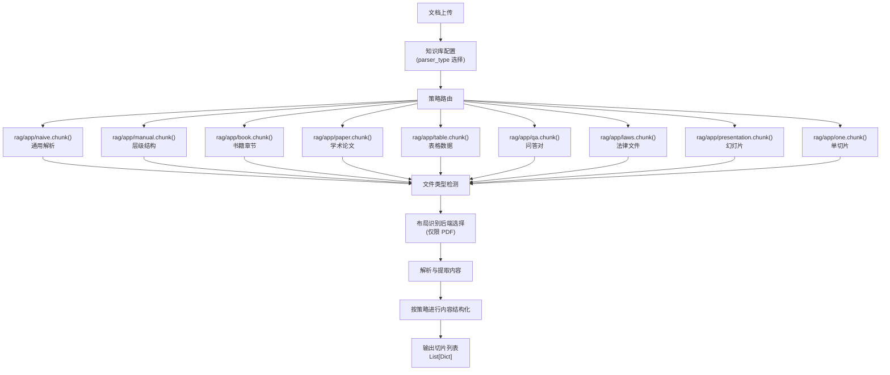
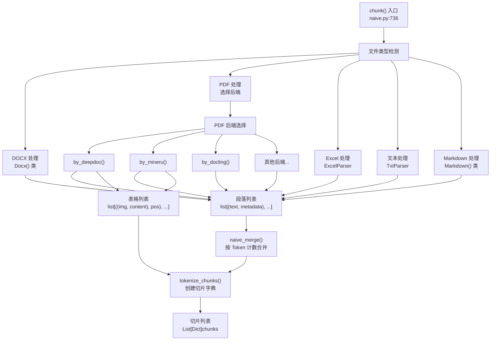
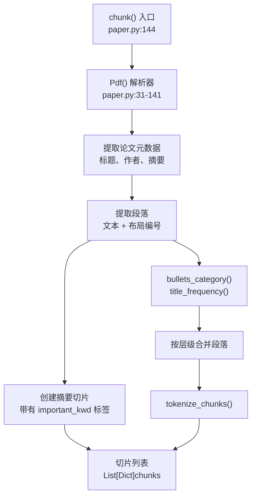
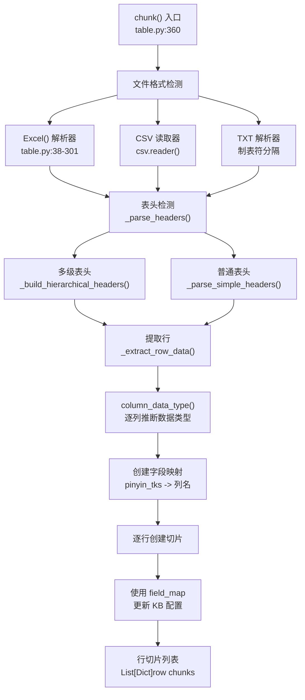
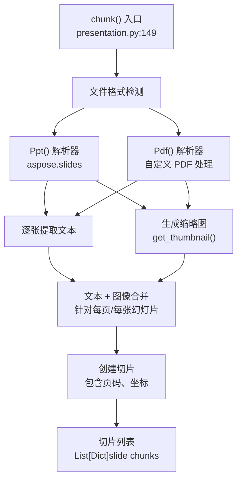
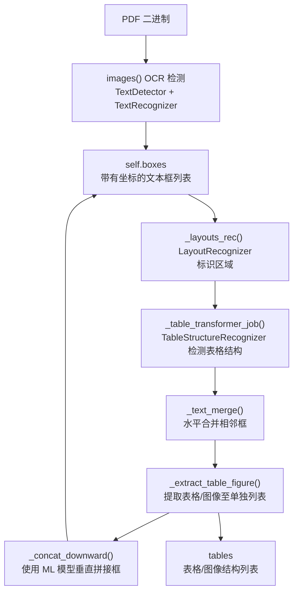
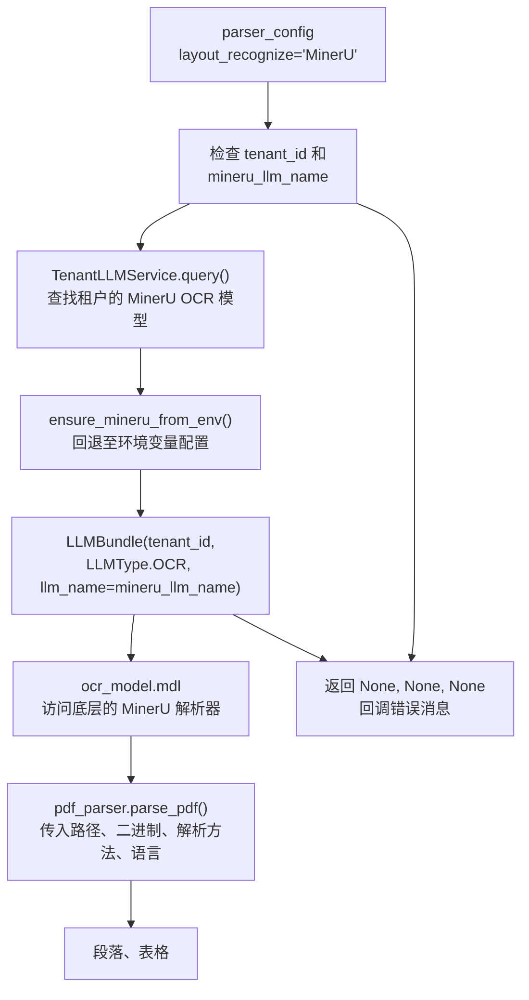
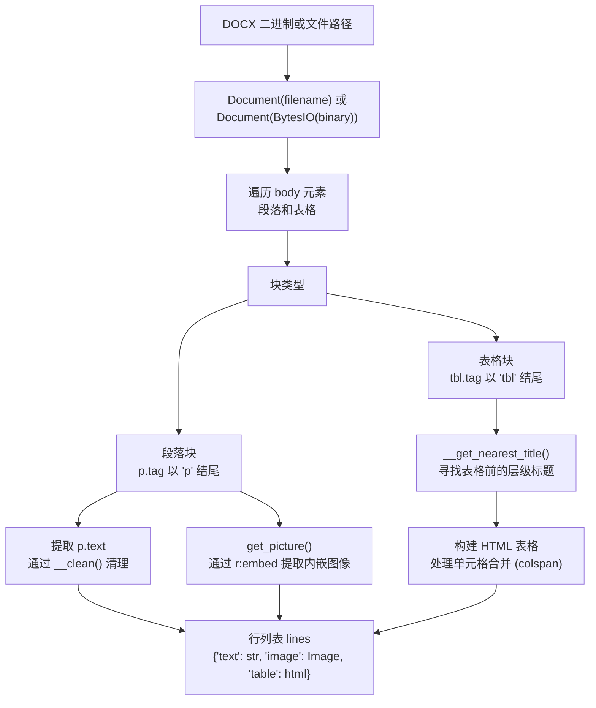
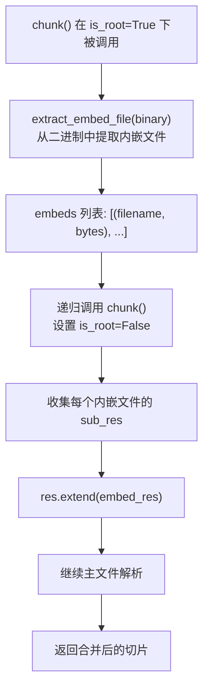

# 文档解析策略 (Document Parsing Strategies)

相关源文件：

-   [api/apps/chunk_app.py](https://github.com/infiniflow/ragflow/blob/80a16e71/api/apps/chunk_app.py)
-   [api/apps/conversation_app.py](https://github.com/infiniflow/ragflow/blob/80a16e71/api/apps/conversation_app.py)
-   [api/apps/document_app.py](https://github.com/infiniflow/ragflow/blob/80a16e71/api/apps/document_app.py)
-   [api/apps/file2document_app.py](https://github.com/infiniflow/ragflow/blob/80a16e71/api/apps/file2document_app.py)
-   [api/apps/file_app.py](https://github.com/infiniflow/ragflow/blob/80a16e71/api/apps/file_app.py)
-   [api/apps/kb_app.py](https://github.com/infiniflow/ragflow/blob/80a16e71/api/apps/kb_app.py)
-   [api/db/db_models.py](https://github.com/infiniflow/ragflow/blob/80a16e71/api/db/db_models.py)
-   [api/db/services/dialog_service.py](https://github.com/infiniflow/ragflow/blob/80a16e71/api/db/services/dialog_service.py)
-   [api/db/services/document_service.py](https://github.com/infiniflow/ragflow/blob/80a16e71/api/db/services/document_service.py)
-   [api/db/services/file_service.py](https://github.com/infiniflow/ragflow/blob/80a16e71/api/db/services/file_service.py)
-   [api/db/services/knowledgebase_service.py](https://github.com/infiniflow/ragflow/blob/80a16e71/api/db/services/knowledgebase_service.py)
-   [api/db/services/task_service.py](https://github.com/infiniflow/ragflow/blob/80a16e71/api/db/services/task_service.py)
-   [deepdoc/parser/excel_parser.py](https://github.com/infiniflow/ragflow/blob/80a16e71/deepdoc/parser/excel_parser.py)
-   [rag/app/book.py](https://github.com/infiniflow/ragflow/blob/80a16e71/rag/app/book.py)
-   [rag/app/laws.py](https://github.com/infiniflow/ragflow/blob/80a16e71/rag/app/laws.py)
-   [rag/app/manual.py](https://github.com/infiniflow/ragflow/blob/80a16e71/rag/app/manual.py)
-   [rag/app/naive.py](https://github.com/infiniflow/ragflow/blob/80a16e71/rag/app/naive.py)
-   [rag/app/one.py](https://github.com/infiniflow/ragflow/blob/80a16e71/rag/app/one.py)
-   [rag/app/paper.py](https://github.com/infiniflow/ragflow/blob/80a16e71/rag/app/paper.py)
-   [rag/app/presentation.py](https://github.com/infiniflow/ragflow/blob/80a16e71/rag/app/presentation.py)
-   [rag/app/qa.py](https://github.com/infiniflow/ragflow/blob/80a16e71/rag/app/qa.py)
-   [rag/app/table.py](https://github.com/infiniflow/ragflow/blob/80a16e71/rag/app/table.py)
-   [rag/nlp/__init__.py](https://github.com/infiniflow/ragflow/blob/80a16e71/rag/nlp/__init__.py)
-   [rag/nlp/search.py](https://github.com/infiniflow/ragflow/blob/80a16e71/rag/nlp/search.py)
-   [rag/svr/task_executor.py](https://github.com/infiniflow/ragflow/blob/80a16e71/rag/svr/task_executor.py)

## 目的与范围

本文档详细介绍了 RAGFlow 的**解析策略** —— 针对不同文档类型，用于提取和结构化内容的专门方法。RAGFlow 提供了 9 种以上针对特定文档结构（书籍、论文、问答对、表格、法律文件等）进行了优化的解析策略，此外还提供了一个通用的 Naive（朴素）解析器。

解析阶段是文档处理流水线的第一步，负责：

-   通过文件名模式检测文件类型。
-   根据用户配置选择合适的解析策略。
-   提取原始文本、布局信息、表格和图像。
-   根据文档固有的组织方式对内容进行结构化。

**关键区别**：解析策略（定义在 `rag/app/*.py` 中）决定了文档*如何*被切分和结构化；而布局识别后端（DeepDOC, MinerU 等）则是策略内部使用的*工具*，用于从 PDF 中提取布局。

有关解析之后的操作（切分、增强、嵌入）的信息，请参阅 [切分方法 (Chunking Methods)](/zh/6-document-processing-pipeline/6.2-chunking-methods)。有关布局识别和 OCR 内部机制的详情，请参阅 [布局识别与 OCR (Layout Recognition and OCR)](/zh/6-document-processing-pipeline/6.4-layout-recognition-and-ocr)。

**数据源**：[rag/app/naive.py:1-932](https://github.com/infiniflow/ragflow/blob/80a16e71/rag/app/naive.py#L1-L932) [rag/app/manual.py:1-338](https://github.com/infiniflow/ragflow/blob/80a16e71/rag/app/manual.py#L1-L338) [rag/app/book.py:1-187](https://github.com/infiniflow/ragflow/blob/80a16e71/rag/app/book.py#L1-L187)

---

## 文件类型检测

RAGFlow 在每个解析策略的 `chunk()` 函数中，通过对文件名进行正则表达式匹配来检测文件类型。每种策略都处理一组特定的文件格式。

**文件类型检测模式**：

| 模式 | 文件类型 | 示例策略 |
| --- | --- | --- |
| `r"\.pdf$"` | PDF 文档 | naive, manual, book, paper, laws, presentation, one |
| `r"\.docx?$"` | Word 文档 | naive, manual, book, laws, qa, one |
| `r"\.xlsx?$"` | Excel 表格 | naive, table |
| `r"\.(csv)$"` | CSV 文件 | table, qa |
| `r"\.(txt|py|js|java|c|cpp|h|php|go|ts|sh|cs|kt|sql)$"` | 纯文本与代码 | naive, book, laws, one |
| `r"\.(md|markdown|mdx)$"` | Markdown 文件 | naive, laws, qa, one |
| `r"\.(htm|html)$"` | HTML 文件 | book, laws, one |
| `r"\.pptx?$"` | PowerPoint 演示文稿 | presentation |
| `r"\.doc$"` | 旧版 Word 文档 | book, laws, one |

**检测实现示例**：

```python
# 摘自 rag/app/naive.py:789-823
if re.search(r"\.docx$", filename, re.IGNORECASE):
    # DOCX 解析逻辑...
elif re.search(r"\.pdf$", filename, re.IGNORECASE):
    # PDF 解析逻辑...
elif re.search(r"\.(csv|xlsx?)$", filename, re.IGNORECASE):
    # Excel/CSV 解析逻辑...
```

文件类型检测不区分大小写，发生在每种策略 `chunk()` 函数的开头。如果所选策略不支持某种文件类型，系统将抛出 `NotImplementedError`。

**数据源**：[rag/app/naive.py:789-932](https://github.com/infiniflow/ragflow/blob/80a16e71/rag/app/naive.py#L789-L932) [rag/app/table.py:360-430](https://github.com/infiniflow/ragflow/blob/80a16e71/rag/app/table.py#L360-L430) [rag/app/qa.py:319-472](https://github.com/infiniflow/ragflow/blob/80a16e71/rag/app/qa.py#L319-L472)

---

## 解析策略架构

RAGFlow 使用 9 种以上专门的解析策略，每种都针对不同的文档结构进行了优化。策略在 `rag/app/` 中作为模块实现，并在用户配置知识库时被选中。

**解析策略选择流程**



每种策略都实现了一个 `chunk()` 函数，其签名为：

```python
def chunk(filename, binary=None, from_page=0, to_page=100000,
          lang="Chinese", callback=None, **kwargs):
    """
    返回: List[Dict] - 切片字典列表
    """
```

**数据源**：[rag/app/naive.py:736-932](https://github.com/infiniflow/ragflow/blob/80a16e71/rag/app/naive.py#L736-L932) [rag/app/manual.py:176-329](https://github.com/infiniflow/ragflow/blob/80a16e71/rag/app/manual.py#L176-L329) [rag/app/book.py:61-178](https://github.com/infiniflow/ragflow/blob/80a16e71/rag/app/book.py#L61-L178)

---

## 解析策略概览

下表总结了 RAGFlow 的解析策略及其特点：

| 策略 | 模块 | 支持格式 | 主要用例 | 切分方法 |
| --- | --- | --- | --- | --- |
| **Naive (朴素)** | `naive.py` | PDF, DOCX, Excel, TXT, MD, 代码 | 通用文档 | 基于 Token 并通过分隔符拆分 |
| **Manual (手册)** | `manual.py` | PDF, DOCX | 技术手册、结构化文档 | 基于标题的层级章节 |
| **Book (书籍)** | `book.py` | PDF, DOCX, TXT, HTML | 书籍、长篇内容 | 章节/段落层级 |
| **Paper (论文)** | `paper.py` | PDF | 学术论文 | 标题/摘要/正文结构 |
| **Table (表格)** | `table.py` | Excel, CSV, TXT | 电子表格、表格数据 | 逐行或基于列 |
| **Q&A (问答)** | `qa.py` | Excel, CSV, TXT, PDF, DOCX, MD | 问答对文档 | 提取 Q&A 对 |
| **Laws (法律)** | `laws.py` | PDF, DOCX, TXT, HTML, DOC | 法律条文、规章制度 | 层级法律结构 |
| **Presentation (演示)** | `presentation.py` | PDF, PPTX | 演示文稿、幻灯片 | 每张幻灯片一个切片 |
| **One (单切片)** | `one.py` | PDF, DOCX, Excel, TXT, HTML, DOC | 短文档 | 整个文档作为一个切片 |

**数据源**：[rag/app/naive.py:1-15](https://github.com/infiniflow/ragflow/blob/80a16e71/rag/app/naive.py#L1-L15) [rag/app/manual.py:1-15](https://github.com/infiniflow/ragflow/blob/80a16e71/rag/app/manual.py#L1-L15) [rag/app/table.py:1-15](https://github.com/infiniflow/ragflow/blob/80a16e71/rag/app/table.py#L1-L15) [rag/app/qa.py:1-15](https://github.com/infiniflow/ragflow/blob/80a16e71/rag/app/qa.py#L1-L15) [rag/app/laws.py:1-15](https://github.com/infiniflow/ragflow/blob/80a16e71/rag/app/laws.py#L1-L15) [rag/app/presentation.py:1-15](https://github.com/infiniflow/ragflow/blob/80a16e71/rag/app/presentation.py#L1-L15) [rag/app/book.py:1-15](https://github.com/infiniflow/ragflow/blob/80a16e71/rag/app/book.py#L1-L15) [rag/app/paper.py:1-15](https://github.com/infiniflow/ragflow/blob/80a16e71/rag/app/paper.py#L1-L15) [rag/app/one.py:1-15](https://github.com/infiniflow/ragflow/blob/80a16e71/rag/app/one.py#L1-L15)

---

## Naive (朴素) 解析策略

**Naive 解析器**是大多数文档的默认通用策略。它执行基于 Token 的切分，支持可配置的分隔符，并支持最广泛的文件格式。

**Naive 解析器特点**：

-   **支持格式**：PDF, DOCX, Excel, TXT, Markdown, 代码文件。
-   **切分方法**：按分隔符拆分文本，合并至目标 Token 数量。
-   **布局保留**：可选（可配置）。
-   **超链接提取**：可选（当 `analyze_hyperlink=True` 时）。
-   **嵌入文件提取**：针对根文档自动提取。

**Naive 解析器流程**：



**关键实现细节**：

-   入口点：[rag/app/naive.py:736](https://github.com/infiniflow/ragflow/blob/80a16e71/rag/app/naive.py#L736-L736)
-   DOCX 解析器：[rag/app/naive.py:231-541](https://github.com/infiniflow/ragflow/blob/80a16e71/rag/app/naive.py#L231-L541)
-   PDF 后端选择：[rag/app/naive.py:825-862](https://github.com/infiniflow/ragflow/blob/80a16e71/rag/app/naive.py#L825-L862)
-   文本合并：[rag/nlp/__init__.py:1015-1116](https://github.com/infiniflow/ragflow/blob/80a16e71/rag/nlp/__init__.py#L1015-L1116)

**数据源**：[rag/app/naive.py:736-932](https://github.com/infiniflow/ragflow/blob/80a16e71/rag/app/naive.py#L736-L932) [rag/app/naive.py:231-541](https://github.com/infiniflow/ragflow/blob/80a16e71/rag/app/naive.py#L231-L541) [rag/nlp/__init__.py:1015-1116](https://github.com/infiniflow/ragflow/blob/80a16e71/rag/nlp/__init__.py#L1015-L1116)

---

## Manual (手册) 解析策略

**Manual 解析器**专为技术手册和具有清晰层级标题的结构化文档设计。它保留了章节结构，并将每个主要章节视为一个切片。

**Manual 解析器特点**：

-   **支持格式**：PDF, DOCX。
-   **切分方法**：基于标题/大纲的层级章节。
-   **结构保留**：高（维护文档层级）。
-   **适用对象**：用户手册、技术文档、结构化报告。

**实现**：

```python
# 摘自 rag/app/manual.py:176-329
def chunk(filename, binary=None, from_page=0, to_page=100000,
          lang="Chinese", callback=None, **kwargs):
    """
    仅支持 PDF 和 DOCX。
    基于层级结构进行切分。
    """
```

Manual 解析器：

1.  提取带有布局编号（针对 PDF）或标题样式（针对 DOCX）的章节。
2.  使用 `bullets_category()` 和 `title_frequency()` 标识层级。
3.  合并每个主要章节内的内容。
4.  保留位置元数据以用于引用。

**核心类**：

-   `Pdf` 类，位于 [rag/app/manual.py:33-68](https://github.com/infiniflow/ragflow/blob/80a16e71/rag/app/manual.py#L33-L68) —— 扩展了 `PdfParser`，增加了针对手册的布局处理。
-   `Docx` 类，位于 [rag/app/manual.py:70-174](https://github.com/infiniflow/ragflow/blob/80a16e71/rag/app/manual.py#L70-L174) —— 提取层级问答结构。

**数据源**：[rag/app/manual.py:176-329](https://github.com/infiniflow/ragflow/blob/80a16e71/rag/app/manual.py#L176-L329) [rag/app/manual.py:33-68](https://github.com/infiniflow/ragflow/blob/80a16e71/rag/app/manual.py#L33-L68) [rag/app/manual.py:70-174](https://github.com/infiniflow/ragflow/blob/80a16e71/rag/app/manual.py#L70-L174)

---

## Book (书籍) 解析策略

**Book 解析器**处理书籍等长篇内容，这些内容通常按章和节组织。

**Book 解析器特点**：

-   **支持格式**：PDF, DOCX, TXT, HTML, DOC。
-   **切分方法**：带有列表检测的章节/段落层级。
-   **结构保留**：高（维护章节结构）。
-   **适用对象**：书籍、长篇文章、论文文档。

**实现细节**：

-   通过 `remove_contents_table()` 自动移除目录。
-   使用 `bullets_category()` 标识章节/段落标记。
-   使用 `hierarchical_merge()` 或 `naive_merge()` 进行层级合并。
-   支持用于书籍图像的视觉图片解析器。

**核心函数**：

-   入口点：[rag/app/book.py:61-178](https://github.com/infiniflow/ragflow/blob/80a16e71/rag/app/book.py#L61-L178)
-   内容清理：[rag/nlp/__init__.py:847-876](https://github.com/infiniflow/ragflow/blob/80a16e71/rag/nlp/__init__.py#L847-L876)
-   层级合并：[rag/nlp/__init__.py:1118-1194](https://github.com/infiniflow/ragflow/blob/80a16e71/rag/nlp/__init__.py#L1118-L1194)

**数据源**：[rag/app/book.py:61-178](https://github.com/infiniflow/ragflow/blob/80a16e71/rag/app/book.py#L61-L178) [rag/nlp/__init__.py:847-876](https://github.com/infiniflow/ragflow/blob/80a16e71/rag/nlp/__init__.py#L847-L876) [rag/nlp/__init__.py:1118-1194](https://github.com/infiniflow/ragflow/blob/80a16e71/rag/nlp/__init__.py#L1118-L1194)

---

## Paper (论文) 解析策略

**Paper 解析器**专门针对学术论文，提取标题、作者、摘要和章节。

**Paper 解析器特点**：

-   **支持格式**：仅限 PDF。
-   **切分方法**：论文结构（摘要作为独立切片，随后是各章节）。
-   **结构保留**：非常高（论文专用结构）。
-   **适用对象**：学术论文、研究文章。

**Paper 解析流程**：



**核心特性**：

-   摘要切片标记有 `important_kwd: ["abstract", "summary", ...]`。
-   针对学术论文的双栏布局检测。
-   从首页自动提取标题/作者。
-   基于出现频率最高的标题级别进行段落合并。

**数据源**：[rag/app/paper.py:144-256](https://github.com/infiniflow/ragflow/blob/80a16e71/rag/app/paper.py#L144-L256) [rag/app/paper.py:31-141](https://github.com/infiniflow/ragflow/blob/80a16e71/rag/app/paper.py#L31-L141)

---

## Table (表格) 解析策略

**Table 解析器**专门针对电子表格和表格数据，将每一行视为一个切片。

**Table 解析器特点**：

-   **支持格式**：Excel (.xlsx, .xls), CSV, TXT (制表符分隔)。
-   **切分方法**：逐行处理。
-   **数据类型推断**：自动（int, float, text, datetime, bool, keyword）。
-   **适用对象**：电子表格、数据库、结构化表格。

**Table 解析架构**：



**数据类型推断**：Table 解析器在 [rag/app/table.py:319-357](https://github.com/infiniflow/ragflow/blob/80a16e71/rag/app/table.py#L319-L357) 处自动推断列类型：

-   **int**：纯整数（无前导零）。
-   **float**：十进制数值。
-   **bool**：`true/false`, `yes/no`, 打勾标记。
-   **datetime**：可解析的日期/时间字符串。
-   **text**：默认回退类型。

中文字段名被标准化为拼音，并带有类型指示后缀（`_tks`, `_long`, `_flt`, `_dt`, `_kwd`）。

**数据源**：[rag/app/table.py:360-483](https://github.com/infiniflow/ragflow/blob/80a16e71/rag/app/table.py#L360-L483) [rag/app/table.py:38-301](https://github.com/infiniflow/ragflow/blob/80a16e71/rag/app/table.py#L38-L301) [rag/app/table.py:319-357](https://github.com/infiniflow/ragflow/blob/80a16e71/rag/app/table.py#L319-L357)

---

## Q&A (问答) 解析策略

**Q&A 解析器**从各种格式中提取问答对，将每一对视为一个切片。

**Q&A 解析器特点**：

-   **支持格式**：Excel, CSV, TXT, PDF, DOCX, Markdown。
-   **切分方法**：每个问答对一个切片。
-   **结构检测**：通过模式匹配自动进行。
-   **适用对象**：FAQ 文档、问答库、培训材料。

**问答检测模式**：该解析器使用 [rag/nlp/__init__.py:151-166](https://github.com/infiniflow/ragflow/blob/80a16e71/rag/nlp/__init__.py#L151-L166) 中的 `qbullets_category()` 来检测问答模式：

-   中文：`第[一二三...]问`, `第[0-9]+问`, `(一)`, `(1)`
-   英文：`QUESTION ONE`, `QUESTION (I)`, `QUESTION [0-9]+`

**特定格式处理**：

| 格式 | 问答检测 | 实现 |
| --- | --- | --- |
| **Excel** | 第 1 列 = 问题，第 2 列 = 答案 | [rag/app/qa.py:36-76](https://github.com/infiniflow/ragflow/blob/80a16e71/rag/app/qa.py#L36-L76) |
| **CSV/TXT** | 分隔符分隔（`,` 或 `\t`） | [rag/app/qa.py:383-413](https://github.com/infiniflow/ragflow/blob/80a16e71/rag/app/qa.py#L383-L413) |
| **PDF** | 基于模式的问题检测 | [rag/app/qa.py:79-189](https://github.com/infiniflow/ragflow/blob/80a16e71/rag/app/qa.py#L79-L189) |
| **DOCX** | 基于标题的层级结构 | [rag/app/qa.py:191-265](https://github.com/infiniflow/ragflow/blob/80a16e71/rag/app/qa.py#L191-L265) |
| **Markdown** | 基于标题 (`#` 标记) | [rag/app/qa.py:424-459](https://github.com/infiniflow/ragflow/blob/80a16e71/rag/app/qa.py#L424-L459) |

**数据源**：[rag/app/qa.py:319-472](https://github.com/infiniflow/ragflow/blob/80a16e71/rag/app/qa.py#L319-L472) [rag/app/qa.py:79-189](https://github.com/infiniflow/ragflow/blob/80a16e71/rag/app/qa.py#L79-L189) [rag/nlp/__init__.py:151-166](https://github.com/infiniflow/ragflow/blob/80a16e71/rag/nlp/__init__.py#L151-L166)

---

## Laws (法律) 解析策略

**Laws 解析器**处理具有层级条款/章节结构的法律文件。

**Laws 解析器特点**：

-   **支持格式**：PDF, DOCX, TXT, HTML, DOC。
-   **切分方法**：具有条款/章节的层级树结构。
-   **结构保留**：非常高（法律层级）。
-   **适用对象**：法律、法规、法律文书、合同。

**层级树构建**：Laws 解析器使用 `tree_merge()` 来构建层级树：

1.  通过 `bullets_category()` 检测列表项模式。
2.  使用 `Node` 类构建树结构。
3.  在合适的层级合并内容。
4.  保留法律条款引用。

**实现细节**：

-   入口点：[rag/app/laws.py:120-217](https://github.com/infiniflow/ragflow/blob/80a16e71/rag/app/laws.py#L120-217)
-   DOCX 树构建：[rag/app/laws.py:31-94](https://github.com/infiniflow/ragflow/blob/80a16e71/rag/app/laws.py#L31-L94)
-   使用 `docx_question_level()` 检测标题级别。
-   自动移除目录。

**数据源**：[rag/app/laws.py:120-217](https://github.com/infiniflow/ragflow/blob/80a16e71/rag/app/laws.py#L120-217) [rag/app/laws.py:31-94](https://github.com/infiniflow/ragflow/blob/80a16e71/rag/app/laws.py#L31-L94)

---

## Presentation (演示) 解析策略

**Presentation 解析器**将每张幻灯片视为一个带缩略图的独立切片。

**Presentation 解析器特点**：

-   **支持格式**：PDF, PPTX。
-   **切分方法**：每张幻灯片/页面一个切片。
-   **图像保留**：高（每张幻灯片的缩略图）。
-   **适用对象**：演示文稿、幻灯片。

**Presentation 解析流程**：



**核心特性**：

-   PPTX：使用 [rag/app/presentation.py:32-53](https://github.com/infiniflow/ragflow/blob/80a16e71/rag/app/presentation.py#L32-L53) 处的 `aspose.slides` 库。
-   PDF：自定义解析器在 [rag/app/presentation.py:56-137](https://github.com/infiniflow/ragflow/blob/80a16e71/rag/app/presentation.py#L56-L137) 处重新组装页面内容。
-   每个切片包含缩略图作为 `image` 字段。
-   标记为 `doc_type_kwd: "image"`。

**数据源**：[rag/app/presentation.py:149-220](https://github.com/infiniflow/ragflow/blob/80a16e71/rag/app/presentation.py#L149-L220) [rag/app/presentation.py:32-53](https://github.com/infiniflow/ragflow/blob/80a16e71/rag/app/presentation.py#L32-L53) [rag/app/presentation.py:56-137](https://github.com/infiniflow/ragflow/blob/80a16e71/rag/app/presentation.py#L56-L137)

---

## One (单切片) 解析策略

**One 解析器**将整个文档视为单个切片，适用于短文档。

**One 解析器特点**：

-   **支持格式**：PDF, DOCX, Excel, TXT, Markdown, HTML, DOC。
-   **切分方法**：整个文档 = 一个切片。
-   **结构保留**：无（扁平化）。
-   **适用对象**：短文档、摘要、简述。

**实现**：

```python
# 摘自 rag/app/one.py:58-167
def chunk(filename, binary=None, from_page=0, to_page=100000,
          lang="Chinese", callback=None, **kwargs):
    """
    单个文件形成一个切片，保留原始文本顺序。
    """
```

One 解析器：

1.  使用相应格式的解析器解析文档。
2.  使用 `\n` 分隔符拼接所有段落。
3.  创建一个单切片字典。
4.  保留原始文本顺序。

**数据源**：[rag/app/one.py:58-167](https://github.com/infiniflow/ragflow/blob/80a16e71/rag/app/one.py#L58-L167) [rag/app/one.py:1-176](https://github.com/infiniflow/ragflow/blob/80a16e71/rag/app/one.py#L1-L176)

---

## 布局识别后端 (PDF)

对于 PDF 解析，几种策略（naive, manual, book, paper, laws, presentation, one）支持可配置的**布局识别后端**。这些后端是用于从 PDF 中提取布局的工具，通过 `layout_recognize` 参数选择。

**PDF 后端注册表**

[rag/app/naive.py:221-228](https://github.com/infiniflow/ragflow/blob/80a16e71/rag/app/naive.py#L221-L228) 中的 `PARSERS` 字典将配置名称映射到解析器工厂函数：

| 解析器键 | 函数 | 主要用例 | OCR 支持 | 布局分析 |
| --- | --- | --- | --- | --- |
| `deepdoc` | `by_deepdoc()` | 带布局识别的默认 PDF 解析 | ✓ (DeepDOC OCR) | ✓ (LayoutRecognizer) |
| `mineru` | `by_mineru()` | 通过 MinerU 库进行高级 PDF 解析 | ✓ (租户可配置) | ✓ (MinerU 内置) |
| `docling` | `by_docling()` | 使用 Docling 的替代解析器 | ✓ (Docling 内置) | ✓ (Docling 内置) |
| `tcadp` | `by_tcadp()` | 基于腾讯云 API 的解析 | ✓ (云端 API) | ✓ (云端 API) |
| `paddleocr` | `by_paddleocr()` | 基于 PaddleOCR 的文本提取 | ✓ (PaddleOCR) | ✓ (租户可配置) |
| `plaintext` | `by_plaintext()` | 无布局的简单文本提取 | ✗ (仅限 PyPDF2) | 可选 (VisionParser) |

后端选择使用 `parser_config` 中的 `layout_recognize` 参数，该参数通过 [common/parser_config_utils.py](https://github.com/infiniflow/ragflow/blob/80a16e71/common/parser_config_utils.py) 中的 `normalize_layout_recognizer()` 进行标准化。

**数据源**：[rag/app/naive.py:221-228](https://github.com/infiniflow/ragflow/blob/80a16e71/rag/app/naive.py#L221-L228) [rag/app/naive.py:57-69](https://github.com/infiniflow/ragflow/blob/80a16e71/rag/app/naive.py#L57-L69) [rag/app/naive.py:72-118](https://github.com/infiniflow/ragflow/blob/80a16e71/rag/app/naive.py#L72-L118) [rag/app/naive.py:121-137](https://github.com/infiniflow/ragflow/blob/80a16e71/rag/app/naive.py#L121-L137) [rag/app/naive.py:140-148](https://github.com/infiniflow/ragflow/blob/80a16e71/rag/app/naive.py#L140-L148) [rag/app/naive.py:151-198](https://github.com/infiniflow/ragflow/blob/80a16e71/rag/app/naive.py#L151-L198) [rag/app/naive.py:201-218](https://github.com/infiniflow/ragflow/blob/80a16e71/rag/app/naive.py#L201-L218)

---

## PDF 后端实现

### DeepDOC 解析器 (默认)

DeepDOC 解析器利用 RAGFlow 的专有模型提供全面的 PDF 处理，包含布局分析、OCR 和表格检测。

**DeepDOC 处理流水线**



**关键类与方法**：

-   `Pdf` 类，位于 [rag/app/naive.py:543-579](https://github.com/infiniflow/ragflow/blob/80a16e71/rag/app/naive.py#L543-L579) —— `PdfParser` 的包装器。
-   `RAGFlowPdfParser` 基类，位于 [deepdoc/parser/pdf_parser.py:51-104](https://github.com/infiniflow/ragflow/blob/80a16e71/deepdoc/parser/pdf_parser.py#L51-L104) —— 包含 OCR 和布局识别。
-   `__images__()` 方法，位于 [deepdoc/parser/pdf_parser.py:281-344](https://github.com/infiniflow/ragflow/blob/80a16e71/deepdoc/parser/pdf_parser.py#L281-L344) —— 对 PDF 页面执行 OCR。
-   `_layouts_rec()` 方法，位于 [deepdoc/parser/pdf_parser.py:346-352](https://github.com/infiniflow/ragflow/blob/80a16e71/deepdoc/parser/pdf_parser.py#L346-L352) —— 运行布局识别。
-   `_table_transformer_job()` 方法，位于 [deepdoc/parser/pdf_parser.py:195-237](https://github.com/infiniflow/ragflow/blob/80a16e71/deepdoc/parser/pdf_parser.py#L195-L237) —— 检测表格组件。
-   `_text_merge()` 方法，位于 [deepdoc/parser/pdf_parser.py:440-476](https://github.com/infiniflow/ragflow/blob/80a16e71/deepdoc/parser/pdf_parser.py#L440-L476) —— 合并水平相邻的文本框。
-   `_concat_downward()` 方法，位于 [deepdoc/parser/pdf_parser.py:581-683](https://github.com/infiniflow/ragflow/blob/80a16e71/deepdoc/parser/pdf_parser.py#L581-L683) —— 使用 XGBoost 模型进行垂直拼接。

DeepDOC 解析器使用三个专门的模型：

1.  **OCR** (`deepdoc/vision/ocr.py`)：文本检测与识别。
2.  **LayoutRecognizer** (`deepdoc/vision/layout_recognizer.py`)：将区域分类为文本、标题、图像、表格等。
3.  **TableStructureRecognizer** (`deepdoc/vision/table_structure_recognizer.py`)：标识表格行、列、表头。

**数据源**：[rag/app/naive.py:543-579](https://github.com/infiniflow/ragflow/blob/80a16e71/rag/app/naive.py#L543-L579) [deepdoc/parser/pdf_parser.py:51-104](https://github.com/infiniflow/ragflow/blob/80a16e71/deepdoc/parser/pdf_parser.py#L51-L104) [deepdoc/parser/pdf_parser.py:195-237](https://github.com/infiniflow/ragflow/blob/80a16e71/deepdoc/parser/pdf_parser.py#L195-L237) [deepdoc/parser/pdf_parser.py:346-352](https://github.com/infiniflow/ragflow/blob/80a16e71/deepdoc/parser/pdf_parser.py#L346-L352) [deepdoc/parser/pdf_parser.py:440-476](https://github.com/infiniflow/ragflow/blob/80a16e71/deepdoc/parser/pdf_parser.py#L440-L476) [deepdoc/parser/pdf_parser.py:581-683](https://github.com/infiniflow/ragflow/blob/80a16e71/deepdoc/parser/pdf_parser.py#L581-L683)

### MinerU 解析器

MinerU 解析器集成了 MinerU 库进行高级 PDF 解析。它需要租户特定的 LLM 配置来提供 OCR 能力。

**MinerU 集成流程**



关键实现细节：

-   MinerU 模型在租户的 LLM 配置中被注册为 `LLMType.OCR`。
-   [rag/app/naive.py:72-118](https://github.com/infiniflow/ragflow/blob/80a16e71/rag/app/naive.py#L72-L118) 处的解析器工厂处理租户查找和回退。
-   支持多种 `parse_method` 值：`"raw"` 或自定义方法。
-   输出目录由 `MINERU_OUTPUT_DIR` 环境变量控制。
-   清理工作由 `MINERU_DELETE_OUTPUT` 环境变量控制。

**数据源**：[rag/app/naive.py:72-118](https://github.com/infiniflow/ragflow/blob/80a16e71/rag/app/naive.py#L72-L118) [api/db/services/tenant_llm_service.py](https://github.com/infiniflow/ragflow/blob/80a16e71/api/db/services/tenant_llm_service.py)

---

## 格式专用解析组件

虽然解析策略决定了文档*如何*被切分，但格式专用解析组件负责处理每种文件类型的底层提取。这些组件在策略内部被使用。

### DOCX 解析组件

DOCX 解析器使用 `python-docx` 库处理 Microsoft Word 文档，提取文本、图像和表格，同时保留层级结构。

**DOCX 解析架构**



**关键方法**：

-   `__call__()` 方法，位于 [rag/app/naive.py:384-497](https://github.com/infiniflow/ragflow/blob/80a16e71/rag/app/naive.py#L384-L497) —— 主解析循环。
-   `get_picture()` 方法，位于 [rag/app/naive.py:235-273](https://github.com/infiniflow/ragflow/blob/80a16e71/rag/app/naive.py#L235-L273) —— 通过关系 ID 从段落中提取图像。
-   `__get_nearest_title()` 方法，位于 [rag/app/naive.py:279-382](https://github.com/infiniflow/ragflow/blob/80a16e71/rag/app/naive.py#L279-L382) —— 寻找表格前的层级标题结构。

**特殊处理**：

-   **图像拼接**：相邻图像使用 [rag/nlp/__init__.py](https://github.com/infiniflow/ragflow/blob/80a16e71/rag/nlp/__init__.py) 中的 `concat_img()` 进行合并。
-   **标题 (Caption) 检测**：带有 `Caption` 样式的段落会与前面的图像关联。
-   **换页检测**：通过 `lastRenderedPageBreak` 和 `w:br` XML 元素追踪页码。
-   **表格上下文**：通过 `<caption>` 标签将层级位置添加到表格 HTML 中。

**数据源**：[rag/app/naive.py:231-541](https://github.com/infiniflow/ragflow/blob/80a16e71/rag/app/naive.py#L231-L541) [rag/app/naive.py:384-497](https://github.com/infiniflow/ragflow/blob/80a16e71/rag/app/naive.py#L384-L497) [rag/app/naive.py:235-273](https://github.com/infiniflow/ragflow/blob/80a16e71/rag/app/naive.py#L235-L273) [rag/app/naive.py:279-382](https://github.com/infiniflow/ragflow/blob/80a16e71/rag/app/naive.py#L279-L382)

### Markdown 解析组件

Markdown 解析组件在多种策略（naive, laws, qa, one）中被使用，用以处理 `.md`, `.markdown`, 和 `.mdx` 文件，支持内嵌图像和表格提取。

**关键特性**：

-   **图像提取**：位于 [rag/app/naive.py:604-678](https://github.com/infiniflow/ragflow/blob/80a16e71/rag/app/naive.py#L604-L678)。
    -   支持 Markdown 格式：``。
    -   支持 HTML 格式：``。
    -   使用 BeautifulSoup 处理跨行 HTML 标签。
    -   追踪行号以将图像与段落关联。
    -   缓存下载的图像以避免重复获取。
-   **表格提取**：位于 [deepdoc/parser/markdown_parser.py](https://github.com/infiniflow/ragflow/blob/80a16e71/deepdoc/parser/markdown_parser.py)。
    -   使用正则识别 Markdown 表格。
    -   使用带有 `tables` 扩展的 Python `markdown` 库转换为 HTML。
-   **元素提取**：位于 [deepdoc/parser/markdown_parser.py](https://github.com/infiniflow/ragflow/blob/80a16e71/deepdoc/parser/markdown_parser.py)。
    -   `MarkdownElementExtractor` 按结构化元素拆分文本。
    -   包含用于追踪的元数据（起始行、结束行）。

**数据源**：[rag/app/naive.py:582-717](https://github.com/infiniflow/ragflow/blob/80a16e71/rag/app/naive.py#L582-L717) [rag/app/naive.py:604-678](https://github.com/infiniflow/ragflow/blob/80a16e71/rag/app/naive.py#L604-L678) [rag/app/naive.py:650-678](https://github.com/infiniflow/ragflow/blob/80a16e71/rag/app/naive.py#L650-L678) [deepdoc/parser/markdown_parser.py](https://github.com/infiniflow/ragflow/blob/80a16e71/deepdoc/parser/markdown_parser.py)

---

## 解析器接口与输出格式

所有解析器都返回一个标准化的元组结构，供切分方法使用。

**标准解析器输出**：

```python
# PDF 解析器 (DeepDOC, MinerU, Docling, TCADP, PaddleOCR, PlainText)
sections, tables, pdf_parser = parser(
    filename=filename,
    binary=binary,
    from_page=from_page,
    to_page=to_page,
    lang=lang,
    callback=callback,
    **kwargs
)

# sections 格式因解析器而异：
# - DeepDOC/PlainText: [(text, position_tag), ...]
# - Manual 解析器: [(text, layoutno, positions), ...]

# tables 格式：
# [((image, content), positions), ...]
# 其中：
#   image: PIL.Image 或 None
#   content: str (HTML) 或 list[str] (行列表)
#   positions: [(page, left, right, top, bottom), ...]
```

**位置标签格式**：支持位置追踪的解析器（主要是 PDF 解析器）使用一种标签格式：

```text
@@{page}\t{left}\t{right}\t{top}\t{bottom}##
```

对于跨越多个位置的文本，可以拼接多个位置标签：

```text
@@1\t100.0\t500.0\t50.0\t100.0##@@1\t100.0\t500.0\t150.0\t200.0##
```

该格式由 [deepdoc/parser/pdf_parser.py](https://github.com/infiniflow/ragflow/blob/80a16e71/deepdoc/parser/pdf_parser.py) 中的 `PdfParser.extract_positions()` 解析，并用于：

-   从 PDF 页面裁剪图像。
-   维护切片的溯源。
-   支持检索中的引用功能。

**数据源**：[rag/app/naive.py:57-69](https://github.com/infiniflow/ragflow/blob/80a16e71/rag/app/naive.py#L57-L69) [rag/app/naive.py:384-497](https://github.com/infiniflow/ragflow/blob/80a16e71/rag/app/naive.py#L384-L497) [deepdoc/parser/pdf_parser.py](https://github.com/infiniflow/ragflow/blob/80a16e71/deepdoc/parser/pdf_parser.py)

---

## 嵌入文件提取 (Embedded File Extraction)

RAGFlow 支持提取并解析文档中嵌入的文件（例如 PDF 中的附件、Word 中的内嵌 OLE 对象）。

**内嵌文件处理流程**：



[rag/utils/file_utils.py](https://github.com/infiniflow/ragflow/blob/80a16e71/rag/utils/file_utils.py) 中的 `extract_embed_file()` 函数：

-   使用 PyPDF2 扫描 PDF 中的嵌入文件。
-   从 Office 文档中提取 OLE 对象。
-   返回 (文件名, 二进制数据) 元组列表。
-   支持嵌套提取（嵌入件中的嵌入件）。

**数据源**：[rag/app/naive.py:767-788](https://github.com/infiniflow/ragflow/blob/80a16e71/rag/app/naive.py#L767-L788) [rag/utils/file_utils.py](https://github.com/infiniflow/ragflow/blob/80a16e71/rag/utils/file_utils.py)

---

## 超链接提取与处理

当 `parser_config` 中的 `analyze_hyperlink=True` 时，RAGFlow 会提取并解析文档中的超链接内容。

**超链接处理流程**：

1.  提取超链接：使用 [rag/utils/file_utils.py](https://github.com/infiniflow/ragflow/blob/80a16e71/rag/utils/file_utils.py) 中的函数（如 `extract_links_from_docx()`）。
2.  下载内容：使用 `extract_html()` 下载网页并转换为可解析格式。
3.  递归解析：将下载的内容以 `is_root=False` 递归传递给 `chunk()`。
4.  合并结果：与主文档的切片合并，并作为同一文档的一部分进行索引。

**数据源**：[rag/app/naive.py:789-823](https://github.com/infiniflow/ragflow/blob/80a16e71/rag/app/naive.py#L789-L823) [rag/app/naive.py:828-829](https://github.com/infiniflow/ragflow/blob/80a16e71/rag/app/naive.py#L828-L829) [rag/utils/file_utils.py](https://github.com/infiniflow/ragflow/blob/80a16e71/rag/utils/file_utils.py)
