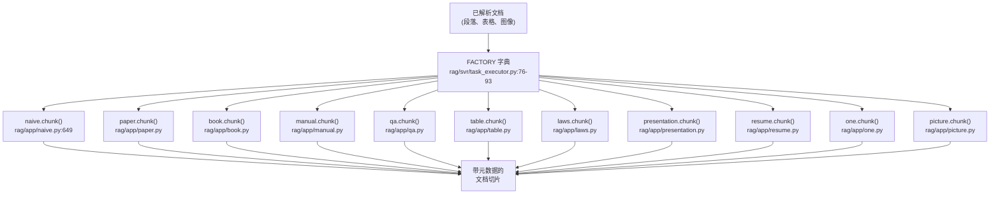
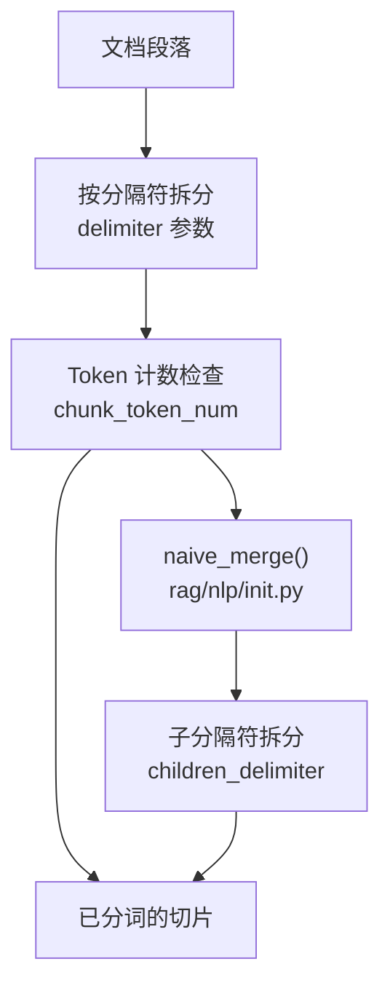
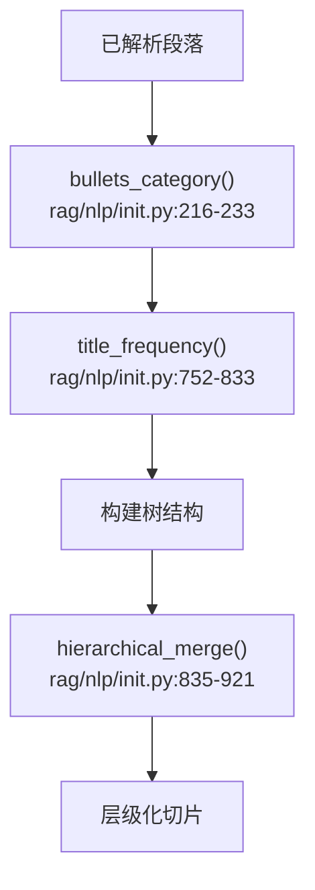
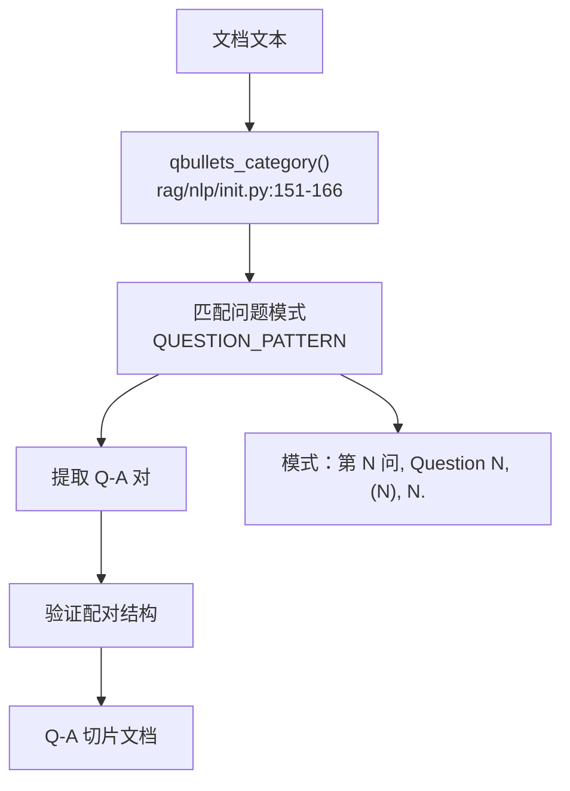
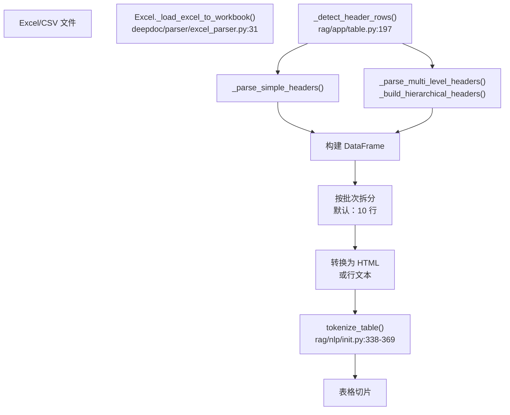

# 切分方法 (Chunking Methods)

相关源文件：

-   [deepdoc/parser/excel_parser.py](https://github.com/infiniflow/ragflow/blob/80a16e71/deepdoc/parser/excel_parser.py)
-   [rag/app/book.py](https://github.com/infiniflow/ragflow/blob/80a16e71/rag/app/book.py)
-   [rag/app/laws.py](https://github.com/infiniflow/ragflow/blob/80a16e71/rag/app/laws.py)
-   [rag/app/manual.py](https://github.com/infiniflow/ragflow/blob/80a16e71/rag/app/manual.py)
-   [rag/app/naive.py](https://github.com/infiniflow/ragflow/blob/80a16e71/rag/app/naive.py)
-   [rag/app/one.py](https://github.com/infiniflow/ragflow/blob/80a16e71/rag/app/one.py)
-   [rag/app/paper.py](https://github.com/infiniflow/ragflow/blob/80a16e71/rag/app/paper.py)
-   [rag/app/presentation.py](https://github.com/infiniflow/ragflow/blob/80a16e71/rag/app/presentation.py)
-   [rag/app/qa.py](https://github.com/infiniflow/ragflow/blob/80a16e71/rag/app/qa.py)
-   [rag/app/table.py](https://github.com/infiniflow/ragflow/blob/80a16e71/rag/app/table.py)
-   [rag/nlp/__init__.py](https://github.com/infiniflow/ragflow/blob/80a16e71/rag/nlp/__init__.py)

## 目的与范围

本文档描述了 RAGFlow 中可用的切分 (chunking) 方法，用于将文档拆分为可检索的切片。切分是将解析后的文档分解为具有语义含义的片段的过程，这些片段可以在 RAG 操作期间被索引和检索。

有关切分之前的文档解析策略的信息，请参阅 [文档解析策略 (Document Parsing Strategies)](/zh/6-document-processing-pipeline/6.1-document-parsing-strategies)。有关切分之后的嵌入生成，请参阅 [内容增强与嵌入 (Content Enhancement and Embedding)](/zh/6-document-processing-pipeline/6.3-content-enhancement-and-embedding)。

---

## 概览

RAGFlow 实现了 **8 种核心切分策略**，每种都针对不同的文档类型和结构模式进行了优化。系统根据 `parser_id` 字段将文档路由到适当的切分策略，应用复杂的文本合并算法（包括栏目检测、垂直合并和阅读顺序分析），并生成带有位置元数据的已索引切片。

切分过程发生在文档解析之后、嵌入生成之前的 `TaskExecutor` 中，如下系统架构图所示：


**数据源：** [rag/svr/task_executor.py:76-93](https://github.com/infiniflow/ragflow/blob/80a16e71/rag/svr/task_executor.py#L76-L93) [rag/app/naive.py:649](https://github.com/infiniflow/ragflow/blob/80a16e71/rag/app/naive.py#L649-L649)

---

## 核心切分策略

系统维护了一个工厂字典，将解析器标识符映射到具体的切分实现：

| 解析器 ID | 模块 | 主要用例 | 合并策略 | 核心算法 |
| --- | --- | --- | --- | --- |
| `naive` | `rag.app.naive` | 通用文档 (PDF, DOCX, TXT, Markdown) | 基于 Token 并通过分隔符拆分 | `naive_merge()` 或 `naive_merge_docx()` |
| `paper` | `rag.app.paper` | 带有章节的学术论文 | 按章节标题分层，保留摘要 | 带有栏目检测的 `hierarchical_merge()` |
| `book` | `rag.app.book` | 带有章节的长篇书籍 | 按书籍结构分层，移除目录 | `hierarchical_merge()` |
| `manual` | `rag.app.manual` | 技术手册、用户指南 | 按带有章节 ID 的大纲级别分层 | 基于章节的拼接 |
| `qa` | `rag.app.qa` | 问答对 | 基于模式的 Q&A 提取与配对 | `qbullets_category()` + 配对 |
| `laws` | `rag.app.laws` | 带有条款的法律文件 | 尊重条/款层级的树状合并 | `tree_merge()` |
| `presentation` | `rag.app.presentation` | PowerPoint、幻灯片 | 逐张幻灯片，按阅读顺序排序 | 逐页并按坐标排序 |
| `one` | `rag.app.one` | 单切片文档 | 整个文档作为一个切片，保留顺序 | 拼接所有段落 |

**附加方法：** 系统还支持针对 `table`（结构化数据）、`resume`（简历解析）、`picture`（仅图像）、`audio`（转录）和 `email`（邮件链）的专门方法，不过这些被视为 8 种核心策略的辅助手段。

**数据源：** [rag/svr/task_executor.py:76-93](https://github.com/infiniflow/ragflow/blob/80a16e71/rag/svr/task_executor.py#L76-L93) [rag/app/naive.py](https://github.com/infiniflow/ragflow/blob/80a16e71/rag/app/naive.py) [rag/app/paper.py](https://github.com/infiniflow/ragflow/blob/80a16e71/rag/app/paper.py) [rag/app/book.py](https://github.com/infiniflow/ragflow/blob/80a16e71/rag/app/book.py) [rag/app/manual.py](https://github.com/infiniflow/ragflow/blob/80a16e71/rag/app/manual.py) [rag/app/qa.py](https://github.com/infiniflow/ragflow/blob/80a16e71/rag/app/qa.py) [rag/app/laws.py](https://github.com/infiniflow/ragflow/blob/80a16e71/rag/app/laws.py) [rag/app/presentation.py](https://github.com/infiniflow/ragflow/blob/80a16e71/rag/app/presentation.py) [rag/app/one.py](https://github.com/infiniflow/ragflow/blob/80a16e71/rag/app/one.py)

---

## 配置参数

所有的切分方法都接受一个包含以下参数的 `parser_config` 字典：

### 核心参数

```python
parser_config = {
    "chunk_token_num": 128,              # 每个切片的最大 Token 数量
    "delimiter": "\n!?。；！？",           # 主要分隔符字符
    "children_delimiter": "",             # 嵌套分隔符模式
    "layout_recognize": "DeepDOC",       # 布局识别方法
    "filename_embd_weight": 0.1,         # 文件名在嵌入中的权重
}
```
**数据源：** [rag/app/naive.py:660-662](https://github.com/infiniflow/ragflow/blob/80a16e71/rag/app/naive.py#L660-L662)

### 高级参数

```python
parser_config = {
    "auto_keywords": 0,                  # 每个切片提取的关键词数量
    "auto_questions": 0,                 # 每个切片生成的提问数量
    "enable_metadata": False,            # 提取结构化元数据
    "metadata": {...},                   # 元数据架构定义
    "table_context_size": 0,             # 表格周围的上下文 Token 数
    "image_context_size": 0,             # 图像周围的上下文 Token 数
    "analyze_hyperlink": False,          # 提取并处理超链接
}
```
**数据源：** [rag/svr/task_executor.py:327-435](https://github.com/infiniflow/ragflow/blob/80a16e71/rag/svr/task_executor.py#L327-L435) [rag/nlp/__init__.py:372-539](https://github.com/infiniflow/ragflow/blob/80a16e71/rag/nlp/__init__.py#L372-L539)

---

## 切分工作流

从文档上传到生成已索引切片的完整切分工作流：

1.  **文件解析**：提取原始文本块、表格和图像。
2.  **合并/切分**：应用特定策略（如 `naive` 或 `hierarchical`）。
3.  **上下文附加**：为媒体块（图像/表格）寻找最近的文本上下文。
4.  **内容增强**：生成关键词、提问或元数据（可选）。
5.  **分词**：为检索准备细粒度分词。

**数据源：** [rag/svr/task_executor.py:234-502](https://github.com/infiniflow/ragflow/blob/80a16e71/rag/svr/task_executor.py#L234-L502) [rag/app/naive.py:649-800](https://github.com/infiniflow/ragflow/blob/80a16e71/rag/app/naive.py#L649-L800) [rag/nlp/__init__.py:290-369](https://github.com/infiniflow/ragflow/blob/80a16e71/rag/nlp/__init__.py#L290-L369)

---

## 详细方法描述

### Naive (朴素) 方法

**目的：** 针对非结构化文档的通用切分。

**算法：**

1.  解析文档以提取段落和表格。
2.  使用可配置的分隔符进行基于 Token 的拆分。
3.  合并相邻段落，直到达到 `chunk_token_num` 阈值。
4.  通过位置元数据保留文档结构。



**核心函数：**

-   `naive_merge(sections, token_num, delimiter)` - [rag/nlp/__init__.py:1024-1084](https://github.com/infiniflow/ragflow/blob/80a16e71/rag/nlp/__init__.py#L1024-L1084)
-   `tokenize_chunks(chunks, doc, eng)` - [rag/nlp/__init__.py:291-316](https://github.com/infiniflow/ragflow/blob/80a16e71/rag/nlp/__init__.py#L291-L316)

**配置示例：**

```python
parser_config = {
    "chunk_token_num": 512,
    "delimiter": "\n!?。；！？",
    "children_delimiter": "|`heading`|`subheading`",
}
```
**数据源：** [rag/app/naive.py:649-800](https://github.com/infiniflow/ragflow/blob/80a16e71/rag/app/naive.py#L649-L800) [rag/nlp/__init__.py:1024-1084](https://github.com/infiniflow/ragflow/blob/80a16e71/rag/nlp/__init__.py#L1024-L1084)

---

### 层级方法 (Paper, Book, Manual, Laws)

**目的：** 为具有章节、条款等结构的结构化文档维护层级关系。

**通用算法：**

1.  使用 `bullets_category()` 检测列表项/标题模式。
2.  使用 `title_frequency()` 计算标题级别。
3.  构建层级树状结构。
4.  在各层级内合并内容，并尊重 Token 限制。



**方法变体：**

| 方法 | 列表项模式 | 典型结构 |
| --- | --- | --- |
| `paper` | 章节标题 (1., 1.1, I, II) | 摘要 → 章节 → 子章节 |
| `book` | 章节标记 | 卷 → 章 → 节 |
| `manual` | 数字列表、大纲格式 | 章 → 主题 → 步骤 |
| `laws` | 条/款编号 | 章 → 节 → 条 → 款 |

**列表项模式检测：**

系统在 [rag/nlp/__init__.py:169-201](https://github.com/infiniflow/ragflow/blob/80a16e71/rag/nlp/__init__.py#L169-L201) 中维护了多个列表项模式类别，包括中文正式结构、数字结构、混合结构、英文正式结构以及 Markdown 标题。

**核心函数：**

-   `bullets_category(sections)`：检测哪个模式类别与段落最匹配。
-   `title_frequency(bullet_cat, sections)`：计算标题级别分布。
-   `hierarchical_merge(sections, max_token)`：在层级边界内合并段落。

**数据源：** [rag/app/paper.py:74-167](https://github.com/infiniflow/ragflow/blob/80a16e71/rag/app/paper.py#L74-L167) [rag/app/book.py:69-159](https://github.com/infiniflow/ragflow/blob/80a16e71/rag/app/book.py#L69-L159) [rag/app/manual.py:185-278](https://github.com/infiniflow/ragflow/blob/80a16e71/rag/app/manual.py#L185-L278) [rag/app/laws.py:130-187](https://github.com/infiniflow/ragflow/blob/80a16e71/rag/app/laws.py#L130-L187)

---

### QA 方法

**目的：** 从 FAQ 文档或访谈录中提取问答对。

**算法：**

1.  使用 `qbullets_category()` 检测问答模式。
2.  识别问题列表项（如 "Q1:", "问题1："）。
3.  将后续文本关联为答案，直到遇到下一个问题。
4.  创建成对的 Q→A 切片。



**支持的问题模式：** 系统在 [rag/nlp/__init__.py:75-87](https://github.com/infiniflow/ragflow/blob/80a16e71/rag/nlp/__init__.py#L75-L87) 中维护了全面的问题模式列表，涵盖了中英文的多种表达方式。

**数据源：** [rag/app/qa.py:186-320](https://github.com/infiniflow/ragflow/blob/80a16e71/rag/app/qa.py#L186-L320) [rag/nlp/__init__.py:75-87](https://github.com/infiniflow/ragflow/blob/80a16e71/rag/nlp/__init__.py#L75-L87) [rag/nlp/__init__.py:151-166](https://github.com/infiniflow/ragflow/blob/80a16e71/rag/nlp/__init__.py#L151-L166)

---

### Table (表格) 方法

**目的：** 具有行/列感知能力的电子表格和表格数据处理。

**算法：**

1.  将 Excel/CSV 解析为 DataFrame。
2.  检测表头行（普通或多级）。
3.  如果存在合并单元格，构建层级列标题。
4.  按行批次切分，默认 `batch_size=10`。
5.  转换为 HTML 或行文本表示形式。



**数据源：** [rag/app/table.py:38-336](https://github.com/infiniflow/ragflow/blob/80a16e71/rag/app/table.py#L38-L336) [deepdoc/parser/excel_parser.py:29-169](https://github.com/infiniflow/ragflow/blob/80a16e71/deepdoc/parser/excel_parser.py#L29-L169) [rag/nlp/__init__.py:338-369](https://github.com/infiniflow/ragflow/blob/80a16e71/rag/nlp/__init__.py#L338-L369)

---

### Presentation (演示) 方法

**目的：** 以幻灯片为粒度进行切分，包含缩略图，并确保正确的阅读顺序。

**算法：**

1.  使用 `PptParser` 或基于 PDF 的解析提取幻灯片文本。
2.  捕获幻灯片缩略图。
3.  对于 PDF 演示文稿，按阅读顺序重新组装页面内容（按纵向坐标 `top` 排序，其次按横向坐标 `x0` 排序）。
4.  每张幻灯片创建一个包含关联图像的切片。

**数据源：** [rag/app/presentation.py:56-136](https://github.com/infiniflow/ragflow/blob/80a16e71/rag/app/presentation.py#L56-L136) [rag/app/presentation.py:149-217](https://github.com/infiniflow/ragflow/blob/80a16e71/rag/app/presentation.py#L149-217)

---

## 文本合并算法

### 阅读顺序确定 (_concat_downward)

**目的：** 为文本框建立正确的阅读顺序，这在布局分析之后尤为重要，因为分析可能会按任意顺序检测到框。

**算法：**

1.  **初始排序**：首先按页码排序，其次按纵坐标 `top`，最后按横坐标 `x0`。
2.  **向下拼接**：识别应该被顺序读取的框。寻找位于当前框下方、具有水平重叠且垂直距离相近的框。
3.  **特殊处理**：通过感知列的排序来处理多栏布局；绕过浮动元素（表格、图像）；保留列表和代码块的缩进。

**数据源：** [deepdoc/parser/pdf_parser.py](https://github.com/infiniflow/ragflow/blob/80a16e71/deepdoc/parser/pdf_parser.py) [rag/app/paper.py:63](https://github.com/infiniflow/ragflow/blob/80a16e71/rag/app/paper.py#L63-L63)

---

## 高级特性

### 媒体上下文附加 (Context Attachment)

**函数：** `attach_media_context(chunks, table_context_size, image_context_size)`

将周围的文本上下文附加到表格和图像切片中，以实现更好的语义理解。该算法利用空间关系和位置元数据来寻找最相关的上下文。

**算法概览：**

1.  **基于位置的排序**：优先考虑空间临近度。
2.  **文本边界提取**：提取每个文本切片在各页的边界框。
3.  **寻找最近文本**：对于每个媒体块，在同页寻找垂直范围重叠且中点距离最短的文本切片。
4.  **基于句子的上下文收集**：在选中的文本切片中，从靠近中点的句子边界开始，向前后收集符合 Token 预算的句子。
5.  **上下文组装**：拼接 `前序上下文 + 媒体内容 + 后续上下文`。

**数据源：** [rag/nlp/__init__.py:409-704](https://github.com/infiniflow/ragflow/blob/80a16e71/rag/nlp/__init__.py#L409-L704)

### 子分隔符模式 (Child Delimiter Pattern)

支持使用正则模式和转义字面量进行嵌套切分。该特性允许先按主分隔符拆分父切片，再按子分隔符进一步拆分。

**语法规则：**

1.  **正则模式**：直接使用由 `|` 分隔的正则表达式。
2.  **转义字面量**：将字面量字符串括在反引号 `` `...` `` 中。

**示例：** `children_delimiter = r"|\n##\s|`Section:`|`Chapter:`"`

**数据源：** [rag/app/naive.py:749-756](https://github.com/infiniflow/ragflow/blob/80a16e71/rag/app/naive.py#L749-L756) [rag/nlp/__init__.py:276-327](https://github.com/infiniflow/ragflow/blob/80a16e71/rag/nlp/__init__.py#L276-L327)

---

## 方法选择指南

根据文档特点选择切分方法：

| 文档类型 | 推荐方法 | 核心特性 | 合并算法 |
| --- | --- | --- | --- |
| 通用文档 | `naive` | 基于 Token 拆分，感知分隔符 | `naive_merge()` |
| 研究论文 | `paper` | 保留摘要，支持多栏 | 带栏目检测的 `hierarchical_merge()` |
| 长篇书籍 | `book` | 章节层级，移除目录 | `hierarchical_merge()` |
| 技术手册 | `manual` | 基于大纲，追踪章节 | 带章节 ID 的 `hierarchical_merge()` |
| FAQ 文档 | `qa` | 问答配对 | 模式匹配 + 配对 |
| 法律文件 | `laws` | 条/款树状结构 | `tree_merge()` |
| 演示文稿 | `presentation` | 逐张幻灯片，阅读顺序排序 | 逐页并基于位置排序 |
| 短文档 | `one` | 整个文档作为单切片 | 不合并（直接拼接） |

**选择因素：**

1.  **文档结构**：层级结构（`paper`, `book`, `manual`, `laws`）对比扁平结构（`naive`, `one`）。
2.  **长度**：短文档（< 1000 tokens）选 `one`；普通长度选 `naive`；超长文档选感知结构的方法。
3.  **布局复杂度**：多栏选 `paper`；复杂表格选 `manual` 或带上下文的 `naive`。

**数据源：** [rag/svr/task_executor.py:76-93](https://github.com/infiniflow/ragflow/blob/80a16e71/rag/svr/task_executor.py#L76-L93) [rag/app/naive.py](https://github.com/infiniflow/ragflow/blob/80a16e71/rag/app/naive.py) [rag/app/paper.py](https://github.com/infiniflow/ragflow/blob/80a16e71/rag/app/paper.py) [rag/app/book.py](https://github.com/infiniflow/ragflow/blob/80a16e71/rag/app/book.py) [rag/app/manual.py](https://github.com/infiniflow/ragflow/blob/80a16e71/rag/app/manual.py) [rag/app/qa.py](https://github.com/infiniflow/ragflow/blob/80a16e71/rag/app/qa.py) [rag/app/laws.py](https://github.com/infiniflow/ragflow/blob/80a16e71/rag/app/laws.py) [rag/app/presentation.py](https://github.com/infiniflow/ragflow/blob/80a16e71/rag/app/presentation.py) [rag/app/one.py](https://github.com/infiniflow/ragflow/blob/80a16e71/rag/app/one.py)
