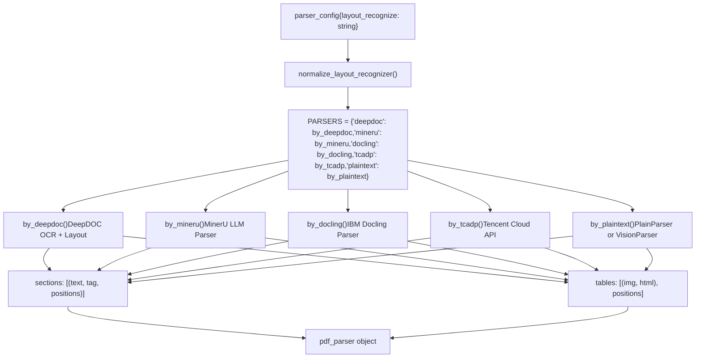
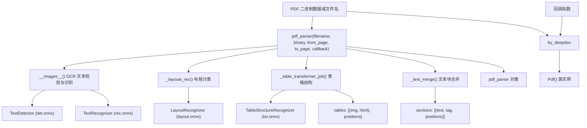
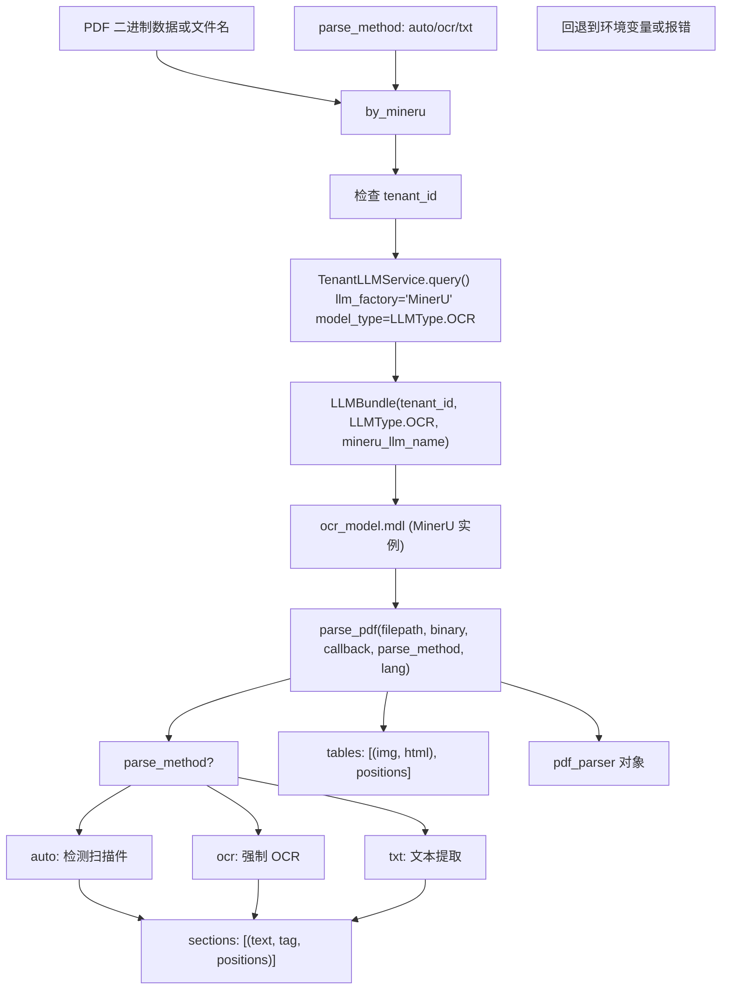
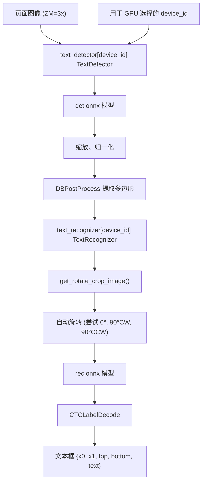

# 6.4 布局识别与 OCR (Layout Recognition and OCR)

相关源文件：

- [api/utils/file_utils.py](https://github.com/infiniflow/ragflow/blob/80a16e71/api/utils/file_utils.py)
- [common/file_utils.py](https://github.com/infiniflow/ragflow/blob/80a16e71/common/file_utils.py)
- [deepdoc/parser/pdf_parser.py](https://github.com/infiniflow/ragflow/blob/80a16e71/deepdoc/parser/pdf_parser.py)
- [deepdoc/parser/ppt_parser.py](https://github.com/infiniflow/ragflow/blob/80a16e71/deepdoc/parser/ppt_parser.py)
- [deepdoc/vision/__init__.py](https://github.com/infiniflow/ragflow/blob/80a16e71/deepdoc/vision/__init__.py)
- [deepdoc/vision/layout_recognizer.py](https://github.com/infiniflow/ragflow/blob/80a16e71/deepdoc/vision/layout_recognizer.py)
- [deepdoc/vision/ocr.py](https://github.com/infiniflow/ragflow/blob/80a16e71/deepdoc/vision/ocr.py)
- [deepdoc/vision/operators.py](https://github.com/infiniflow/ragflow/blob/80a16e71/deepdoc/vision/operators.py)
- [deepdoc/vision/postprocess.py](https://github.com/infiniflow/ragflow/blob/80a16e71/deepdoc/vision/postprocess.py)
- [deepdoc/vision/recognizer.py](https://github.com/infiniflow/ragflow/blob/80a16e71/deepdoc/vision/recognizer.py)
- [deepdoc/vision/t_ocr.py](https://github.com/infiniflow/ragflow/blob/80a16e71/deepdoc/vision/t_ocr.py)
- [deepdoc/vision/t_recognizer.py](https://github.com/infiniflow/ragflow/blob/80a16e71/deepdoc/vision/t_recognizer.py)
- [deepdoc/vision/table_structure_recognizer.py](https://github.com/infiniflow/ragflow/blob/80a16e71/deepdoc/vision/table_structure_recognizer.py)
- [rag/settings.py](https://github.com/infiniflow/ragflow/blob/80a16e71/rag/settings.py)

## 目的与范围 (Purpose and Scope)

本文档介绍了 RAGFlow 的 OCR（光学字符识别，Optical Character Recognition）和布局识别（Layout Recognition）系统的技术实现。这些组件是 DeepDOC 解析器的一部分，而 DeepDOC 是 RAGFlow 中可用的几种解析后端之一（参见 6.1 节了解解析器选择）。

OCR 流水线包含两个阶段：

1.  **文本检测 (Text Detection)**：使用基于 DBNet 的检测技术在文档图像中定位文本区域。
2.  **文本识别 (Text Recognition)**：使用基于 CTC 的识别技术将检测到的区域转换为文本。

布局识别系统用于识别文档的结构元素（文本、标题、图表、表格、标题说明、页眉、页脚、参考文献、公式）并确定阅读顺序。表格结构识别用于检测表格内部组件（行、列、表头、跨单元格），以实现精确的表格提取。

这些系统在 `RAGFlowPdfParser` 类中协同工作，将 PDF 页面转换为结构化内容。输出随后由切片策略处理（参见 6.2 节），以创建最终的文档切片（Chunks）。

**范围**：本页面涵盖基于视觉的 OCR 和布局识别实现。有关替代解析器（MinerU、Docling、TCADP）的信息，请参阅 6.1 节。

## 布局识别选项 (Layout Recognition Options)

RAGFlow 提供了四种主要的布局识别方法，每种方法在 `rag/app/naive.py` 中实现为一个解析器函数。解析器的选择通过 `normalize_layout_recognizer()` 函数进行，该函数将面向用户的布局名称转换为解析器函数引用。

**布局识别架构**



### 解析器字典与选择 (Parser Dictionary and Selection)

`rag/app/naive.py:175-181` 中的 `PARSERS` 字典将布局识别器名称映射到解析器函数：

```python
PARSERS = {
    "deepdoc": by_deepdoc,
    "mineru": by_mineru,
    "docling": by_docling,
    "tcadp": by_tcadp,
    "plaintext": by_plaintext,  # 默认
}
```

`chunk()` 函数使用 `normalize_layout_recognizer()` 来解析用户提供的 `layout_recognize` 字符串：

```python
layout_recognizer, parser_model_name = normalize_layout_recognizer(
    parser_config.get("layout_recognize", "DeepDOC")
)

if isinstance(layout_recognizer, bool):
    layout_recognizer = "DeepDOC" if layout_recognizer else "Plain Text"

name = layout_recognizer.strip().lower()
parser = PARSERS.get(name, by_plaintext)
```

## DeepDOC 布局识别 (DeepDOC Layout Recognition)

DeepDOC 是 RAGFlow 内置的布局识别系统，结合了基于深度学习的 OCR、布局分析和表格结构识别。它使用 ONNX 模型进行文本检测、识别、布局分类和表格结构检测。

**DeepDOC 流水线**



### DeepDOC 实现 (DeepDOC Implementation)

`rag/app/naive.py:46-61` 中的 `by_deepdoc()` 函数创建并调用 `Pdf()` 解析器实例：

```python
def by_deepdoc(filename, binary=None, from_page=0, to_page=100000, lang="Chinese",
               callback=None, pdf_cls=None, **kwargs):
    callback = callback
    binary = binary
    pdf_parser = pdf_cls() if pdf_cls else Pdf()
    sections, tables = pdf_parser(
        filename if not binary else binary,
        from_page=from_page,
        to_page=to_page,
        callback=callback
    )

    tables = vision_figure_parser_pdf_wrapper(tbls=tables,
                                              callback=callback,
                                              **kwargs)
    return sections, tables, pdf_parser
```

`deepdoc/parser/pdf_parser.py` 中的 `Pdf` 类继承自 `PdfParser` 并实现了核心 OCR 和布局识别逻辑：

1.  **OCR 阶段** (`__images__()` 方法)：检测并识别文本框。
2.  **布局识别** (`_layouts_rec()` 方法)：将区域分类为文本、标题、表格、图表等。
3.  **表格分析** (`_table_transformer_job()` 方法)：检测表格结构。
4.  **文本合并** (`_text_merge()` 方法)：合并相邻的文本框。

视觉模型初始化发生在 `RAGFlowPdfParser.__init__()` 中，会创建 `OCR`、`LayoutRecognizer` 和 `TableStructureRecognizer` 的实例。

### DeepDOC 模型文件 (DeepDOC Model Files)

DeepDOC 使用存储在 `rag/res/deepdoc/` 目录下的 ONNX 模型：

| 模型 | 文件 | 用途 |
| --- | --- | --- |
| 文本检测 | `det.onnx` | 使用 DBNet 定位文本边界框 |
| 文本识别 | `rec.onnx`, `ocr.res` | 识别字符及字符字典 |
| 布局分类 | `layout.onnx` | 识别文档结构区域 |
| 表格结构 | `tsr.onnx` | 检测表格行、列、表头 |

如果模型文件不存在，系统会自动从 HuggingFace 仓库 `InfiniFlow/deepdoc` 下载。

## MinerU 布局识别 (MinerU Layout Recognition)

MinerU 是一款基于大语言模型（LLM）的 PDF 解析器，利用 LLM 进行 OCR 和布局理解。它通过模型类型为 `LLMType.OCR` 的 `LLMBundle` 系统集成。

**MinerU 集成流程**



### MinerU 实现 (MinerU Implementation)

`rag/app/naive.py:64-110` 中的 `by_mineru()` 函数负责 MinerU 的初始化和调用。

### MinerU 配置 (MinerU Configuration)

MinerU 支持三种可通过 `parser_config` 配置的解析方法：

| 方法 | 描述 | 使用场景 |
| --- | --- | --- |
| `auto` | 自动检测文档是否为扫描件 | 默认值，处理原生及扫描 PDF |
| `ocr` | 强制进行 OCR 处理 | 扫描文档、图像 |
| `txt` | 仅进行文本提取 | 包含嵌入文本的原生 PDF |

## Docling 布局识别 (Docling Layout Recognition)

Docling 是 IBM 的文档解析库，为 PDF 提供无 OCR 的布局分析。它通过 `DoclingParser` 类集成。

### Docling 实现 (Docling Implementation)

`rag/app/naive.py:113-130` 中的 `by_docling()` 函数负责 Docling 的初始化。

### Docling 配置 (Docling Configuration)

Docling 使用环境变量进行配置：

| 变量 | 默认值 | 用途 |
| --- | --- | --- |
| `MINERU_OUTPUT_DIR` | `""` | 中间文件输出目录 |
| `MINERU_DELETE_OUTPUT` | `1` | 处理后删除输出文件 |

## TCADP 布局识别 (TCADP Layout Recognition)

TCADP (腾讯云高级文档处理，Tencent Cloud Advanced Document Processing) 是一种基于云端的文档解析 API，提供 OCR 和布局分析。

### TCADP 实现 (TCADP Implementation)

`rag/app/naive.py:133-147` 中的 `by_tcadp()` 函数负责 TCADP 的初始化。

### TCADP 配置 (TCADP Configuration)

TCADP 需要通过环境变量配置腾讯云 API 凭据。`check_installation()` 方法会验证 API 配置。

## 纯文本解析器 (Plain Text Parser)

纯文本解析器为没有复杂布局的 PDF 或禁用布局识别时提供回退选项。它支持两种模式：纯文本提取和基于视觉的处理。

### 纯文本实现 (Plain Text Implementation)

`rag/app/naive.py:150-172` 中的 `by_plaintext()` 函数在 `PlainParser` 和 `VisionParser` 之间进行选择。

### PlainParser
`PlainParser` 使用 pdfplumber 提取文本，不涉及 OCR 或布局分类。适用于文本类 PDF。

### VisionParser
`VisionParser` 使用视觉模型进行 OCR 和可选的图像描述。适用于扫描文档。

## OCR 流水线 (OCR Pipeline)

OCR 流水线通过两个阶段从文档图像中提取文本：文本检测和文本识别。DeepDOC 和纯文本解析器均使用此系统提取文本内容。

**OCR 架构**



### OCR 类结构 (OCR Class Structure)

`deepdoc/vision/ocr.py` 中的 `OCR` 类管理文本检测和识别。

### 文本检测 (Text Detection)

`TextDetector` 使用基于 DBNet 的模型查找文本区域。
检测预处理步骤包括：缩放到最大 960px、归一化、转换为 CHW 格式、使用 `det.onnx` 推理以及应用 DBPostProcess 提取多边形。

### 文本识别 (Text Recognition)

`TextRecognizer` 将检测到的框转换为文本：
1.  **裁剪 (Cropping)**：提取图像切片。
2.  **旋转修正 (Rotation Correction)**：尝试不同角度以处理垂直文本。
3.  **批量处理 (Batch Processing)**：按长宽比分组，每 16 个一组进行处理。
4.  **识别 (Recognition)**：运行 `rec.onnx` 模型。
5.  **CTC 解码 (CTC Decoding)**：使用 `ocr.res` 字典转换预测结果。
6.  **过滤 (Filtering)**：移除置信度低于 0.5 的结果。

### 多 GPU 支持 (Multi-GPU Support)

当 `settings.PARALLEL_DEVICES > 1` 时，OCR 类会为每个 GPU 创建独立的检测器和识别器实例，从而实现多页面的并行处理。

## 配置与环境变量 (Configuration and Environment Variables)

视觉流水线的行为受环境变量和配置设置控制：

| 变量 | 默认值 | 用途 |
| --- | --- | --- |
| `LAYOUT_RECOGNIZER_TYPE` | `"onnx"` | 布局识别器类型：`"onnx"` 或 `"ascend"` |
| `TABLE_STRUCTURE_RECOGNIZER_TYPE` | `"onnx"` | TSR 类型：`"onnx"` 或 `"ascend"` |
| `ASCEND_LAYOUT_RECOGNIZER_DEVICE_ID` | `0` | 布局识别的昇腾 NPU 设备 ID |
| `OCR_GPU_MEM_LIMIT_MB` | `2048` | 每个 OCR 模型最大 GPU 显存 (MB) |
| `OCR_ARENA_EXTEND_STRATEGY` | `"kNextPowerOfTwo"` | CUDA 内存分配策略 |
| `HF_ENDPOINT` | \- | 用于模型下载的 HuggingFace 镜像地址 |
| `PARALLEL_DEVICES` | \- | 用于并行 OCR 处理的 GPU 数量 |

### 昇腾 NPU 配置 (Ascend NPU Configuration)

要启用昇腾 NPU 加速：
1.  设置环境变量（如 `LAYOUT_RECOGNIZER_TYPE=ascend`）。
2.  确保 `rag/res/deepdoc/` 中存在 `.om` 模型文件。
3.  安装昇腾 CANN 工具包和 `ais_bench` 推理库。
