# 7.1 连接器架构 (Connector Architecture)

相关源文件：

- [api/apps/connector_app.py](https://github.com/infiniflow/ragflow/blob/80a16e71/api/apps/connector_app.py)
- [api/db/services/connector_service.py](https://github.com/infiniflow/ragflow/blob/80a16e71/api/db/services/connector_service.py)
- [api/utils/common.py](https://github.com/infiniflow/ragflow/blob/80a16e71/api/utils/common.py)
- [common/constants.py](https://github.com/infiniflow/ragflow/blob/80a16e71/common/constants.py)
- [common/data_source/__init__.py](https://github.com/infiniflow/ragflow/blob/80a16e71/common/data_source/__init__.py)
- [common/data_source/config.py](https://github.com/infiniflow/ragflow/blob/80a16e71/common/data_source/config.py)
- [rag/svr/sync_data_source.py](https://github.com/infiniflow/ragflow/blob/80a16e71/rag/svr/sync_data_source.py)
- [web/src/pages/user-setting/data-source/constant/index.tsx](https://github.com/infiniflow/ragflow/blob/80a16e71/web/src/pages/user-setting/data-source/constant/index.tsx)

本文档描述了 RAGFlow 数据源连接器系统的架构。该系统支持从 40 多个外部平台同步文档，涵盖了 `SyncBase` 抽象类、连接器继承模式、配置模型、任务执行流程以及前端配置与后端处理之间的关系。

## 概述与核心抽象 (Overview and Core Abstraction)

连接器系统围绕 `SyncBase` 抽象类构建，该类为所有数据源集成定义了统一的接口。每个具体的连接器实现都继承自 `SyncBase`，并实现针对特定源的文档检索逻辑。

**核心连接器架构图**

```mermaid
flowchart TD
    SyncBase["SyncBase (抽象基类)"]
    BlobLikeBase["_BlobLikeBase (对象存储基类)"]
    S3["S3"]
    R2["R2"]
    OCI["OCI_STORAGE"]
    GCS["GOOGLE_CLOUD_STORAGE"]
    Confluence["Confluence"]
    Notion["Notion"]
    Discord["Discord"]
    Gmail["Gmail"]
    GoogleDrive["GoogleDrive"]
    Dropbox["Dropbox"]
    Jira["Jira"]
    Moodle["Moodle"]
    Box["Box"]
    Airtable["Airtable"]
    Asana["Asana"]
    GitHub["GitHub"]
    GitLab["GitLab"]
    IMAP["IMAP"]
    Bitbucket["Bitbucket"]
    Zendesk["Zendesk"]

    SyncBase --> BlobLikeBase
    SyncBase --> Confluence
    SyncBase --> Notion
    SyncBase --> Discord
    SyncBase --> Gmail
    SyncBase --> GoogleDrive
    SyncBase --> Dropbox
    SyncBase --> Jira
    SyncBase --> Moodle
    SyncBase --> Box
    SyncBase --> Airtable
    SyncBase --> Asana
    SyncBase --> GitHub
    SyncBase --> GitLab
    SyncBase --> IMAP
    SyncBase --> Bitbucket
    SyncBase --> Zendesk
    BlobLikeBase --> S3
    BlobLikeBase --> R2
    BlobLikeBase --> OCI
    BlobLikeBase --> GCS
```

## SyncBase 抽象类 (SyncBase Abstract Class)

`SyncBase` 类为所有连接器提供了基础结构，定义了任务执行生命周期、错误处理和文档处理流水线。

### 核心方法与属性

| 属性/方法 | 用途 |
| --- | --- |
| `SOURCE_NAME` | 标识连接器类型的类属性（例如 `FileSource.S3`） |
| `__init__(conf: dict)` | 接收连接器配置的构造函数 |
| `__call__(task: dict)` | 异步任务执行的入口点 |
| `_run_task_logic(task: dict)` | 核心文档处理逻辑 |
| `_generate(task: dict)` | 返回文档批处理生成器的抽象方法 |

### 关键实现细节

-   **并发控制**：系统使用 `asyncio.Semaphore` 将同时运行的连接器任务限制为 `MAX_CONCURRENT_TASKS`（默认 5）。
-   **超时管理**：每个任务都有可配置的超时时间，通过 `asyncio.wait_for` 强制执行。
-   **文档去重**：使用 `hash128` 对文档 ID 进行哈希，防止跨同步任务产生重复。

## 文档批处理 (Document Batch Processing)

`_run_task_logic` 方法负责协调从连接器生成器获取文档、格式转换到最终存储的整个过程。

### 处理流水线

1.  **生成器**：调用 `_generate()` 获取文档流。
2.  **转换**：将 `Document` 对象转换为字典格式。
3.  **去重与解析**：调用 `SyncLogsService.duplicate_and_parse()`。
4.  **存储与更新**：存储文档并更新同步进度日志。

## 连接器配置模型 (Connector Configuration Model)

每个连接器实例的配置以字典结构存储在数据库中，包含凭据、连接参数和同步选项。前端表单字段与后端配置路径直接映射。

## 同步模式 (Synchronization Modes)

连接器支持两种同步模式：
-   **全量重索引 (Full Reindex)**：当 `reindex` 标志为 `"1"` 或 `poll_range_start` 为空时触发。
-   **增量轮询 (Incremental Polling)**：基于 `poll_range_start` 时间戳，仅获取在该时间之后修改的文档。

## 基于检查点的连接器 (Checkpoint-Based Connectors)

对于大规模数据同步，部分连接器（如 Confluence、Google Drive）实现了基于检查点的分页机制，确保在处理海量文档时可以恢复进度。

## 错误处理与重试逻辑 (Error Handling and Retry Logic)

系统实现了多层级的错误处理：
-   **任务级错误**：如超时或未捕获的异常，会导致任务标记为失败。
-   **批次级错误**：如数据库排序冲突（Collation conflict），系统会跳过该批次并继续处理。
-   **文档级错误**：连接器内部的单个文档获取失败会被记录为警告而不中断同步。

## 环境配置 (Environment Configuration)

可以通过环境变量微调连接器行为：
-   `MAX_CONCURRENT_TASKS`: 最大并行任务数。
-   `INDEX_BATCH_SIZE`: 每个批次的文档数量。
-   `REQUEST_TIMEOUT_SECONDS`: 默认 HTTP 请求超时时间。
