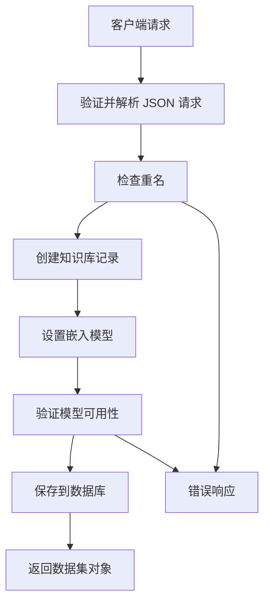

# 8.3 数据集与知识库 API (Dataset and Knowledge Base APIs)

相关源文件：

- [agent/tools/retrieval.py](https://github.com/infiniflow/ragflow/blob/80a16e71/agent/tools/retrieval.py)
- [api/apps/sdk/chat.py](https://github.com/infiniflow/ragflow/blob/80a16e71/api/apps/sdk/chat.py)
- [api/apps/sdk/dataset.py](https://github.com/infiniflow/ragflow/blob/80a16e71/api/apps/sdk/dataset.py)
- [api/apps/sdk/doc.py](https://github.com/infiniflow/ragflow/blob/80a16e71/api/apps/sdk/doc.py)
- [api/db/services/knowledgebase_service.py](https://github.com/infiniflow/ragflow/blob/80a16e71/api/db/services/knowledgebase_service.py)
- [api/utils/api_utils.py](https://github.com/infiniflow/ragflow/blob/80a16e71/api/utils/api_utils.py)
- [docs/references/http_api_reference.md](https://github.com/infiniflow/ragflow/blob/80a16e71/docs/references/http_api_reference.md)
- [sdk/python/ragflow_sdk/ragflow.py](https://github.com/infiniflow/ragflow/blob/80a16e71/sdk/python/ragflow_sdk/ragflow.py)

本文档介绍了用于在 RAGFlow 中创建、配置和管理数据集（知识库）的 HTTP API 端点。这些端点处理数据集的生命周期操作、解析器配置、嵌入模型选择，以及知识图谱和 RAPTOR 等高级 RAG 特性。

**范围**：本页面涵盖数据集级别的操作。有关数据集中文档上传和切片管理，请参阅[文档与文件管理 API](/zh/8-backend-api-system/8.4-document-and-file-management-apis)。有关在聊天对话中使用数据集，请参阅[聊天与对话 API](/zh/8-backend-api-system/8.5-chat-and-conversation-apis)。

---

## 身份验证 (Authentication)

所有数据集 API 端点都需要通过 `Authorization` 标头进行 API 令牌验证：

```text
Authorization: Bearer <YOUR_API_KEY>
```

`@token_required` 装饰器会验证令牌并提取 `tenant_id` 用于后续所有操作。详情请参阅[身份验证与授权](/zh/8-backend-api-system/8.2-authentication-and-authorization)。

---

## 数据集生命周期操作 (Dataset Lifecycle Operations)

### 创建数据集 (Create Dataset)

**端点**: `POST /api/v1/datasets`

使用指定配置创建新数据集。系统支持两种互斥的摄取方式：

1.  **内置切片方法**：使用预定义的解析器（`naive`, `book`, `paper` 等）。
2.  **摄取流水线**：使用基于画布（Canvas）的自定义数据处理工作流。

#### 请求流程 (Request Flow)



#### 请求参数 (Request Parameters)

| 参数 | 类型 | 必填 | 描述 |
| --- | --- | --- | --- |
| `name` | string | 是 | 唯一的数据集名称（最长 128 字符，不区分大小写） |
| `avatar` | string | 否 | Base64 编码的头像 |
| `description` | string | 否 | 数据集描述 |
| `embedding_model` | string | 否 | 格式：`model_name@model_factory` |
| `permission` | enum | 否 | `\"me\"`（默认）或 `\"team\"` |
| `chunk_method` | enum | 否 | 切片方法（默认：`\"naive\"`） |
| `parser_config` | object | 否 | 特定解析器的配置 |

**切片方法 (Chunk Methods)**：
支持 `naive`（通用）、`book`（图书）、`paper`（论文）、`qa`（问答对）、`table`（表格）、`laws`（法律）、`presentation`（演示文稿）、`email`（电子邮件）等。

---

### 列出数据集 (List Datasets)

**端点**: `GET /api/v1/datasets`

通过分页、过滤和排序检索数据集列表。

**查询参数**：`page`, `page_size`, `orderby` (create_time/update_time), `desc`, `name`, `id`。

---

### 更新数据集 (Update Dataset)

**端点**: `PUT /api/v1/datasets/{dataset_id}`

更新数据集配置。

**关键约束**：
- **嵌入模型限制**：如果数据集已存在切片（`chunk_count > 0`），则不允许更改 `embedding_model`，以防止向量维度不匹配。
- **配置深合并**：更新 `parser_config` 时，系统执行深度合并（Deep Merge），保留未指定的现有字段。

---

### 删除数据集 (Delete Datasets)

**端点**: `DELETE /api/v1/datasets`

删除一个或多个数据集及其关联的所有文档和切片。

**级联删除流程**：
1. 从向量数据库（Elasticsearch/Infinity）中删除文档切片。
2. 从 MySQL `File` 表中移除文件记录。
3. 清除文件与文档的映射关系。
4. 从存储系统（MinIO 等）中移除文件夹结构。
5. 最后删除数据集记录。

---

## 高级 RAG 特性 (Advanced RAG Features)

### 知识图谱管理 (Knowledge Graph Management)

RAGFlow 支持使用 GraphRAG 进行实体提取和关系映射。

- **构建图谱**: `POST /api/v1/datasets/{dataset_id}/run_graphrag`（异步操作）。
- **获取进度**: `GET /api/v1/datasets/{dataset_id}/trace_graphrag`。
- **获取图谱数据**: `GET /api/v1/datasets/{dataset_id}/knowledge_graph`，返回节点（nodes）和边（edges）结构。

### RAPTOR 分层摘要 (RAPTOR Hierarchical Summarization)

RAPTOR 通过构建多级文档摘要来改进长文本检索。

- **构建 RAPTOR**: `POST /api/v1/datasets/{dataset_id}/run_raptor`。
- **配置参数**: 在 `parser_config.raptor` 中设置 `threshold`（聚类阈值）、`max_cluster`（最大聚类数）和 `prompt`（摘要提示词）。

---

## 请求校验与错误处理 (Request Validation and Error Handling)

系统使用 **Pydantic** 模型进行请求校验。所有 API 响应遵循统一格式：

- **成功**: `{"code": 0, "data": ...}`
- **参数错误 (101)**: `{"code": 101, "message": "..."}`
- **权限不足 (103)**: `{"code": 103, "message": "..."}`

---

## Python SDK 接口 (Python SDK Interface)

Python SDK 提供了围绕 HTTP API 的面向对象封装：

```python
from ragflow_sdk import RAGFlow

rag = RAGFlow(api_key="<YOUR_API_KEY>", base_url="http://localhost:9380")

# 创建数据集
dataset = rag.create_dataset(name="tech_docs", chunk_method="naive")

# 更新配置
dataset.update({"parser_config": {"graphrag": {"use_graphrag": True}}})

# 列出数据集
for ds in rag.list_datasets():
    print(f"{ds.name}: {ds.chunk_count} chunks")
```

---

## 总结 (Summary)

数据集与知识库 API 提供了全面的 CRUD 操作，具备以下特点：
- **灵活的摄取方式**：支持内置解析器或自定义画布流水线。
- **高级 RAG 支持**：内置 GraphRAG 知识图谱和 RAPTOR 分层摘要构建。
- **类型安全**：使用 Pydantic 进行严格的参数校验和字段转换。
- **异步处理**：利用 Redis 任务队列处理耗时的图谱和摘要构建任务。
- **一致性检查**：在多数据集操作中强制执行嵌入模型的一致性。
