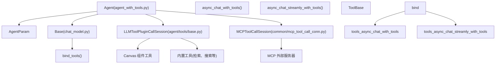
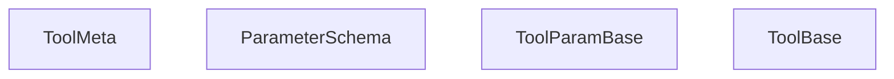
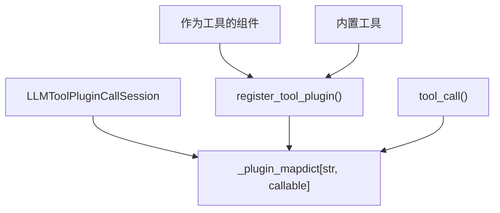
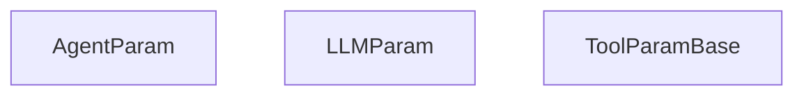
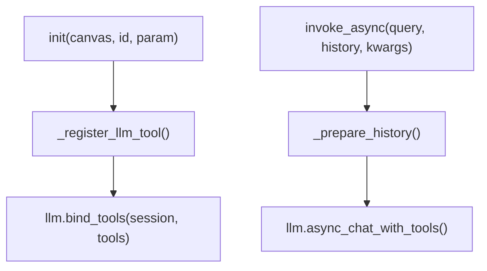
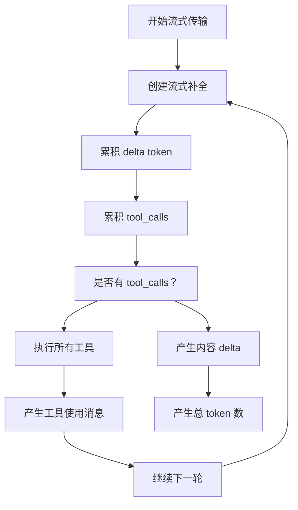
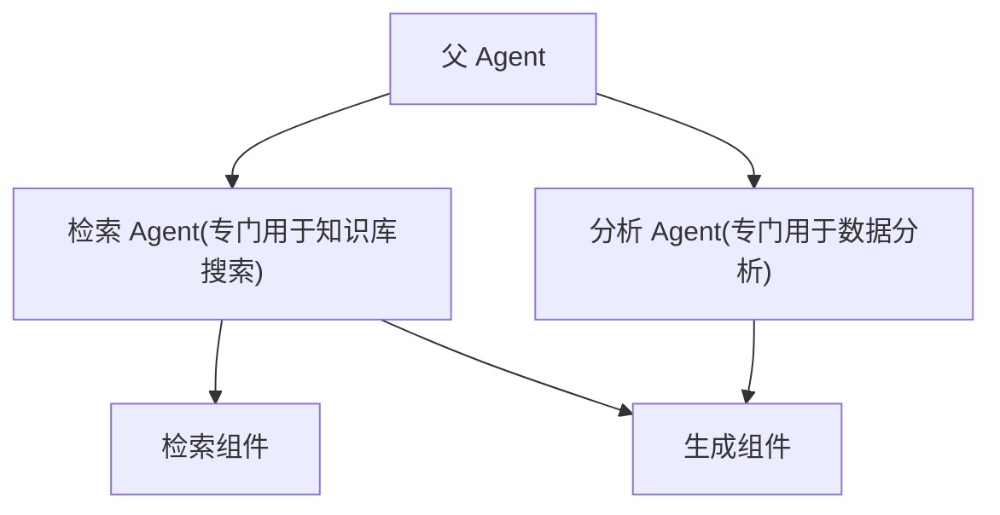
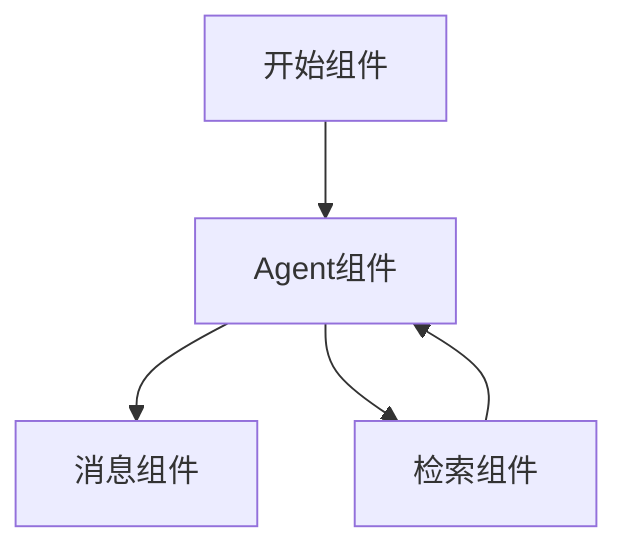

# Agent 工具与 ReAct 循环

相关源文件

-   [agent/canvas.py](https://github.com/infiniflow/ragflow/blob/80a16e71/agent/canvas.py)
-   [agent/component/agent\_with\_tools.py](https://github.com/infiniflow/ragflow/blob/80a16e71/agent/component/agent_with_tools.py)
-   [agent/component/base.py](https://github.com/infiniflow/ragflow/blob/80a16e71/agent/component/base.py)
-   [agent/component/categorize.py](https://github.com/infiniflow/ragflow/blob/80a16e71/agent/component/categorize.py)
-   [agent/component/llm.py](https://github.com/infiniflow/ragflow/blob/80a16e71/agent/component/llm.py)
-   [agent/tools/base.py](https://github.com/infiniflow/ragflow/blob/80a16e71/agent/tools/base.py)
-   [api/apps/api\_app.py](https://github.com/infiniflow/ragflow/blob/80a16e71/api/apps/api_app.py)
-   [api/apps/canvas\_app.py](https://github.com/infiniflow/ragflow/blob/80a16e71/api/apps/canvas_app.py)
-   [api/apps/llm\_app.py](https://github.com/infiniflow/ragflow/blob/80a16e71/api/apps/llm_app.py)
-   [api/db/init\_data.py](https://github.com/infiniflow/ragflow/blob/80a16e71/api/db/init_data.py)
-   [api/db/services/llm\_service.py](https://github.com/infiniflow/ragflow/blob/80a16e71/api/db/services/llm_service.py)
-   [conf/llm\_factories.json](https://github.com/infiniflow/ragflow/blob/80a16e71/conf/llm_factories.json)
-   [docs/references/supported\_models.mdx](https://github.com/infiniflow/ragflow/blob/80a16e71/docs/references/supported_models.mdx)
-   [rag/llm/\_\_init\_\_.py](https://github.com/infiniflow/ragflow/blob/80a16e71/rag/llm/__init__.py)
-   [rag/llm/chat\_model.py](https://github.com/infiniflow/ragflow/blob/80a16e71/rag/llm/chat_model.py)
-   [rag/llm/cv\_model.py](https://github.com/infiniflow/ragflow/blob/80a16e71/rag/llm/cv_model.py)
-   [rag/llm/embedding\_model.py](https://github.com/infiniflow/ragflow/blob/80a16e71/rag/llm/embedding_model.py)
-   [rag/llm/rerank\_model.py](https://github.com/infiniflow/ragflow/blob/80a16e71/rag/llm/rerank_model.py)
-   [rag/llm/sequence2txt\_model.py](https://github.com/infiniflow/ragflow/blob/80a16e71/rag/llm/sequence2txt_model.py)
-   [rag/llm/tts\_model.py](https://github.com/infiniflow/ragflow/blob/80a16e71/rag/llm/tts_model.py)
-   [rag/prompts/generator.py](https://github.com/infiniflow/ragflow/blob/80a16e71/rag/prompts/generator.py)
-   [web/src/assets/svg/llm/n1n.svg](https://github.com/infiniflow/ragflow/blob/80a16e71/web/src/assets/svg/llm/n1n.svg)
-   [web/src/components/knowledge-base-item.tsx](https://github.com/infiniflow/ragflow/blob/80a16e71/web/src/components/knowledge-base-item.tsx)
-   [web/src/constants/llm.ts](https://github.com/infiniflow/ragflow/blob/80a16e71/web/src/constants/llm.ts)
-   [web/src/interfaces/request/flow.ts](https://github.com/infiniflow/ragflow/blob/80a16e71/web/src/interfaces/request/flow.ts)
-   [web/src/pages/user-setting/setting-model/constant.ts](https://github.com/infiniflow/ragflow/blob/80a16e71/web/src/pages/user-setting/setting-model/constant.ts)
-   [web/src/utils/common-util.ts](https://github.com/infiniflow/ragflow/blob/80a16e71/web/src/utils/common-util.ts)

本文档介绍了 Agent 组件的工具调用能力以及支持迭代使用工具的 ReAct (Reasoning and Acting) 循环。Agent 组件扩展了基础 LLM 生成组件 ([9.3](/infiniflow/ragflow/9.3-built-in-components))，使其能够调用工具、观察结果并继续推理直到任务完成。这实现了复杂的多步工作流，其中 LLM 可以与外部系统交互、检索信息或调用其他 Canvas 组件。

有关不带工具的基础 LLM 文本生成信息，请参阅 [LLM 组件](/infiniflow/ragflow/9.3-built-in-components)。有关更广泛的 Canvas 执行系统，请参阅 [Canvas 引擎与 DSL](/infiniflow/ragflow/9.1-canvas-engine-and-dsl)。

## 系统架构

工具调用系统由三层组成：编排工具使用的 Agent 组件、实现 OpenAI 兼容工具调用的底层聊天模型，以及管理实际工具调用的工具执行会话。


**来源：** [agent/component/agent\_with\_tools.py1-100](https://github.com/infiniflow/ragflow/blob/80a16e71/agent/component/agent_with_tools.py#L1-L100) [rag/llm/chat\_model.py273-332](https://github.com/infiniflow/ragflow/blob/80a16e71/rag/llm/chat_model.py#L273-L332) [agent/tools/base.py1-50](https://github.com/infiniflow/ragflow/blob/80a16e71/agent/tools/base.py#L1-L50)

## 工具元数据与基类

系统中的所有工具都符合基于 OpenAI 函数调用格式的标准元数据结构。该元数据描述了工具的名称、描述以及带有类型信息的参数。

### ToolMeta 结构


`ToolMeta` TypedDict 定义了标准结构：

```
ToolMeta = TypedDict('ToolMeta', {
    'name': str,
    'description': str,
    'parameters': dict  # JSON Schema 格式
})
```
`parameters` 中的每个参数都遵循包含以下字段的 JSON Schema：`type`、`description`、`default` 和 `required`。

**来源：** [agent/tools/base.py23-35](https://github.com/infiniflow/ragflow/blob/80a16e71/agent/tools/base.py#L23-L35) [agent/component/base.py1-50](https://github.com/infiniflow/ragflow/blob/80a16e71/agent/component/base.py#L1-L50)

## 工具会话管理

工具执行通过会话对象进行管理，这些对象处理从工具名称到实际可执行函数的映射。主要有两种会话类型：一种用于 Canvas 组件工具和内置工具，另一种用于 MCP 外部服务器。

### LLMToolPluginCallSession


会话维护一个 `_plugin_map` 字典，将工具名称映射到可调用函数。工具通过 `register_tool_plugin(name, func, meta)` 自行注册。

当 LLM 调用工具时，`tool_call(name, args)` 在 `_plugin_map` 中查找函数并使用提供的参数执行它。

**关键方法：**

-   `register_tool_plugin(name: str, func: callable, meta: ToolMeta)` - 注册工具
-   `tool_call(name: str, kwargs: dict) -> any` - 按名称执行工具
-   `get_tools() -> list[dict]` - 返回 OpenAI 格式的工具定义

**来源：** [agent/tools/base.py38-100](https://github.com/infiniflow/ragflow/blob/80a16e71/agent/tools/base.py#L38-L100)

### MCPToolCallSession

模型上下文协议 (MCP) 允许外部服务器提供工具。`MCPToolCallSession` 管理与 MCP 服务器的连接，并在 MCP 工具元数据和 OpenAI 工具格式之间进行转换。

> **[Mermaid 序列]**
> *(图表结构无法解析)*

MCP 服务器通过 `MCPServerService` 数据库表进行配置。会话处理：

1.  服务器连接与初始化
2.  工具元数据检索与格式转换
3.  通过 RPC 进行异步工具调用
4.  错误处理与重连

**来源：** [common/mcp\_tool\_call\_conn.py1-200](https://github.com/infiniflow/ragflow/blob/80a16e71/common/mcp_tool_call_conn.py#L1-L200) [agent/component/agent\_with\_tools.py115-140](https://github.com/infiniflow/ragflow/blob/80a16e71/agent/component/agent_with_tools.py#L115-L140)

## Agent 组件与参数

`Agent` 组件扩展了 `LLM` 和 `ToolBase`，以在 Canvas 工作流系统中提供工具调用能力。

### AgentParam


`AgentParam` 同时继承自 `LLMParam`（用于 LLM 配置）和 `ToolParamBase`（用于工具配置）。关键参数：

-   **`tools`**: 可供使用的 Canvas 组件 ID 或内置工具名称列表
-   **`mcp`**: 要连接的 MCP 服务器 ID 列表
-   **`max_rounds`**: 工具调用迭代的最大轮数（默认：5）
-   **`function_name`**: 当此 Agent 被父 Agent 作为工具使用时的名称
-   **`meta`**: 描述此 Agent 作为工具被调用时的接口元数据

**来源：** [agent/component/agent\_with\_tools.py38-79](https://github.com/infiniflow/ragflow/blob/80a16e71/agent/component/agent_with_tools.py#L38-L79)

### Agent 组件生命周期


在初始化期间，Agent 执行以下操作：

1.  调用 `LLM.__init__()` 设置 LLM 捆绑包
2.  初始化工具会话 (`LLMToolPluginCallSession` 和 `MCPToolCallSession`)
3.  从 `tools` 参数注册工具
4.  从 `mcp` 参数连接到 MCP 服务器
5.  调用 `llm.bind_tools()` 将工具会话附加到聊天模型

**来源：** [agent/component/agent\_with\_tools.py81-186](https://github.com/infiniflow/ragflow/blob/80a16e71/agent/component/agent_with_tools.py#L81-L186)

## ReAct 循环实现

ReAct 循环在 `Base` 类的 `async_chat_with_tools` 方法中实现。它迭代地调用带有工具定义的 LLM，执行任何请求的工具，并继续直到 LLM 返回最终答案。

### ReAct 循环流程

> **[Mermaid 序列]**
> *(图表结构无法解析)*

**来源：** [rag/llm/chat\_model.py280-332](https://github.com/infiniflow/ragflow/blob/80a16e71/rag/llm/chat_model.py#L280-L332)

### 核心 ReAct 循环代码

该循环位于 [rag/llm/chat\_model.py291-326](https://github.com/infiniflow/ragflow/blob/80a16e71/rag/llm/chat_model.py#L291-L326)：

```
for _ in range(self.max_rounds + 1):
    response = await self.async_client.chat.completions.create(
        model=self.model_name,
        messages=history,
        tools=self.tools,
        tool_choice="auto",
        **gen_conf
    )

    # 检查 LLM 是否进行了工具调用
    if not hasattr(response.choices[0].message, "tool_calls") or \
       not response.choices[0].message.tool_calls:
        # 无工具调用 - 返回最终答案
        ans += response.choices[0].message.content
        return ans, tk_count

    # 执行每个工具调用
    for tool_call in response.choices[0].message.tool_calls:
        name = tool_call.function.name
        args = json_repair.loads(tool_call.function.arguments)
        tool_response = await thread_pool_exec(
            self.toolcall_session.tool_call, name, args
        )
        # 将工具调用和响应附加到历史记录中
        history = self._append_history(history, tool_call, tool_response)
        ans += self._verbose_tool_use(name, args, tool_response)
```
**关键方面：**

1.  每次迭代都会调用带有完整对话历史记录的 LLM
2.  `tools` 参数以 OpenAI 格式提供工具定义
3.  `tool_choice="auto"` 让 LLM 决定何时使用工具
4.  工具响应以标准化格式附加到历史记录中
5.  当 LLM 返回不带 `tool_calls` 的内容时，循环退出
6.  超过 `max_rounds` 后，强制生成不带工具的最终答案

**来源：** [rag/llm/chat\_model.py280-332](https://github.com/infiniflow/ragflow/blob/80a16e71/rag/llm/chat_model.py#L280-L332)

### 流式 ReAct 循环

流式版本 (`async_chat_streamly_with_tools`) 遵循相同的逻辑，但产生增量结果：


流式版本累积来自 delta 块的 `tool_calls`，因为 OpenAI 将它们增量地流式传输为 `delta.tool_calls[0].function.arguments` 片段。

**来源：** [rag/llm/chat\_model.py334-443](https://github.com/infiniflow/ragflow/blob/80a16e71/rag/llm/chat_model.py#L334-L443)

## 基础聊天模型中的工具调用

[rag/llm/chat\_model.py](https://github.com/infiniflow/ragflow/blob/80a16e71/rag/llm/chat_model.py) 中的 `Base` 类为所有聊天模型实现继承的工具调用提供了基础。

### bind\_tools 方法

```
def bind_tools(self, toolcall_session, tools):
    if not (toolcall_session and tools):
        return
    self.is_tools = True
    self.toolcall_session = toolcall_session
    self.tools = tools
```
此方法将工具会话和工具定义附加到模型实例。`tools` 列表采用 OpenAI 函数调用格式：

```
[
  {
    "type": "function",
    "function": {
      "name": "retrieval",
      "description": "搜索知识库",
      "parameters": {
        "type": "object",
        "properties": {
          "query": {
            "type": "string",
            "description": "搜索查询"
          }
        },
        "required": ["query"]
      }
    }
  }
]
```
**来源：** [rag/llm/chat\_model.py273-278](https://github.com/infiniflow/ragflow/blob/80a16e71/rag/llm/chat_model.py#L273-L278)

### 工具调用历史格式

工具交互以标准的 OpenAI 格式附加到对话历史记录中：

1.  **带有 tool\_calls 的 Assistant 消息：**

```
{
    "role": "assistant",
    "tool_calls": [{
        "index": 0,
        "id": "call_abc123",
        "function": {
            "name": "retrieval",
            "arguments": '{"query": "量子计算"}'
        },
        "type": "function"
    }]
}
```
2.  **工具响应消息：**

```
{
    "role": "tool",
    "tool_call_id": "call_abc123",
    "content": "搜索结果：..."
}
```
`_append_history` 方法在 [rag/llm/chat\_model.py249-271](https://github.com/infiniflow/ragflow/blob/80a16e71/rag/llm/chat_model.py#L249-L271) 中处理此格式化。

**来源：** [rag/llm/chat\_model.py249-271](https://github.com/infiniflow/ragflow/blob/80a16e71/rag/llm/chat_model.py#L249-L271) [rag/llm/chat\_model.py308-319](https://github.com/infiniflow/ragflow/blob/80a16e71/rag/llm/chat_model.py#L308-L319)

### 工具调用中的错误处理

工具执行错误得到妥善处理：

```
try:
    args = json_repair.loads(tool_call.function.arguments)
    tool_response = await thread_pool_exec(
        self.toolcall_session.tool_call, name, args
    )
    history = self._append_history(history, tool_call, tool_response)
except Exception as e:
    history.append({
        "role": "tool",
        "tool_call_id": tool_call.id,
        "content": f"工具调用错误：\n{tool_call}\n异常：\n" + str(e)
    })
```
这确保了 LLM 能够接收有关工具失败的反馈并调整其策略。

**来源：** [rag/llm/chat\_model.py311-319](https://github.com/infiniflow/ragflow/blob/80a16e71/rag/llm/chat_model.py#L311-L319)

## 工具类型

Agent 系统支持三种类型的工具：Canvas 组件工具、MCP 外部服务器工具和内置工具。

### 组件工具

其他 Canvas 组件可以作为工具被调用。这实现了递归 Agent 架构，其中一个 Agent 委派给专门的子 Agent。


当一个组件被注册为工具时，将调用其 `execute_tool` 方法：

```
async def execute_tool(self, function_name, **kwargs):
    # 组件实现此方法以将其自身暴露为工具
    # 返回组件的输出
    return await self.invoke_async(**kwargs)
```
**来源：** [agent/tools/base.py151-159](https://github.com/infiniflow/ragflow/blob/80a16e71/agent/tools/base.py#L151-L159) [agent/component/agent\_with\_tools.py112-140](https://github.com/infiniflow/ragflow/blob/80a16e71/agent/component/agent_with_tools.py#L112-L140)

### MCP (模型上下文协议) 工具

MCP 服务器提供外部能力，如文件访问、API 集成或数据库查询。Agent 连接到数据库中配置的 MCP 服务器。

> **[Mermaid 序列]**
> *(图表结构无法解析)*

MCP 工具元数据由 `mcp_tool_metadata_to_openai_tool()` 转换为 OpenAI 格式。

**来源：** [common/mcp\_tool\_call\_conn.py1-200](https://github.com/infiniflow/ragflow/blob/80a16e71/common/mcp_tool_call_conn.py#L1-L200) [agent/component/agent\_with\_tools.py162-186](https://github.com/infiniflow/ragflow/blob/80a16e71/agent/component/agent_with_tools.py#L162-L186)

### 内置工具

内置工具作为方法或函数实现并直接注册：

```
def register_builtin_tools(self, session: LLMToolPluginCallSession):
    # 检索工具
    session.register_tool_plugin(
        "retrieval",
        self._retrieval,
        {
            "name": "retrieval",
            "description": "搜索知识库",
            "parameters": {...}
        }
    )

    # 网页搜索工具
    session.register_tool_plugin(
        "web_search",
        self._web_search,
        {...}
    )
```
内置工具包括：

-   **检索**: 搜索知识库（当 Agent 配置了知识库访问权限时）
-   **网页搜索**: 外部搜索引擎
-   **代码执行**: 沙盒代码执行
-   **文件操作**: 在系统中读/写文件

**来源：** [agent/component/agent\_with\_tools.py187-250](https://github.com/infiniflow/ragflow/blob/80a16e71/agent/component/agent_with_tools.py#L187-L250)

## 与 Canvas 工作流集成

Agent 组件集成到 Canvas 工作流系统中，接收来自上游组件的输入并将输出传递给下游组件。

### 作为 Canvas 组件的 Agent


Agent 接收来自 Canvas 全局变量和上游组件输出的变量。它可以引用：

-   `sys.query` - 当前用户查询
-   `sys.user_id` - 用户/租户标识符
-   `cpn_id@output_key` - 其他组件的输出

**来源：** [agent/canvas.py162-234](https://github.com/infiniflow/ragflow/blob/80a16e71/agent/canvas.py#L162-L234) [agent/component/agent\_with\_tools.py251-350](https://github.com/infiniflow/ragflow/blob/80a16e71/agent/component/agent_with_tools.py#L251-L350)

### 从 Canvas 组件注册工具

初始化时，Agent 将其他 Canvas 组件注册为工具：

```
def _register_llm_tool(self):
    for cpn_id in self._param.tools:
        cpn = self._canvas.get_component_obj(cpn_id)
        if isinstance(cpn, ToolBase):
            # 将组件注册为工具
            tool_name = cpn._param.function_name or cpn_id
            self._llm_tool_plugin_call_session.register_tool_plugin(
                tool_name,
                partial(cpn.execute_tool, function_name=tool_name),
                cpn._param.meta
            )
```
这允许 Agent 在 ReAct 循环期间将工作流中的其他组件作为工具调用。

**来源：** [agent/component/agent\_with\_tools.py112-140](https://github.com/infiniflow/ragflow/blob/80a16e71/agent/component/agent_with_tools.py#L112-L140)

### 工具参数中的变量解析

工具参数可以使用 `{variable}` 语法引用 Canvas 变量：

```
# Agent 参数配置
{
    "tools": ["retrieval_0"],
    "prompts": [{
        "role": "user",
        "content": "搜索：{sys.query}"
    }]
}
```
Canvas 的 `get_value_with_variable()` 方法在运行时解析这些变量，然后再传递给 LLM。

**来源：** [agent/canvas.py162-188](https://github.com/infiniflow/ragflow/blob/80a16e71/agent/canvas.py#L162-L188) [agent/component/agent\_with\_tools.py251-300](https://github.com/infiniflow/ragflow/blob/80a16e71/agent/component/agent_with_tools.py#L251-L300)

## 工具调用详细程度与输出

工具调用及其结果经过格式化，以便在对话中可见：

```
def _verbose_tool_use(self, name, args, res):
    return "<tool_call>" + json.dumps({
        "name": name,
        "args": args,
        "result": res
    }, ensure_ascii=False, indent=2) + "</tool_call>"
```
这种类似 XML 的格式使工具交互在对话历史记录和流式传输给用户的输出中可见。

示例输出：

```
<tool_call>{
  "name": "retrieval",
  "args": {
    "query": "量子计算基础"
  },
  "result": "量子计算使用量子比特..."
}</tool_call>
```
**来源：** [rag/llm/chat\_model.py246-247](https://github.com/infiniflow/ragflow/blob/80a16e71/rag/llm/chat_model.py#L246-L247) [rag/llm/chat\_model.py315-319](https://github.com/infiniflow/ragflow/blob/80a16e71/rag/llm/chat_model.py#L315-L319) [rag/llm/chat\_model.py405-412](https://github.com/infiniflow/ragflow/blob/80a16e71/rag/llm/chat_model.py#L405-L412)

## 最大轮数与终止

ReAct 循环具有最大迭代限制 (`max_rounds`)，以防止无限循环。当超过限制时，系统会强制给出最终答案：

```
if iteration > self.max_rounds:
    logging.warning(f"超过最大轮数：{self.max_rounds}")
    history.append({
        "role": "user",
        "content": f"超过最大轮数：{self.max_rounds}"
    })
    # 强制生成不带工具的最终答案
    response, token_count = await self._async_chat(history, gen_conf)
    return response, token_count
```
这确保了 Agent 始终产生输出，即使任务未完全完成。

**来源：** [rag/llm/chat\_model.py321-326](https://github.com/infiniflow/ragflow/blob/80a16e71/rag/llm/chat_model.py#L321-L326) [rag/llm/chat\_model.py414-433](https://github.com/infiniflow/ragflow/blob/80a16e71/rag/llm/chat_model.py#L414-L433)

## 总结

Agent 工具与 ReAct 循环系统实现了复杂的、多步骤的推理：

| 组件 | 文件 | 用途 |
| --- | --- | --- |
| `Agent` | `agent/component/agent_with_tools.py` | 具有工具调用能力的 Canvas 组件 |
| `Base.bind_tools()` | `rag/llm/chat_model.py:273-278` | 将工具附加到聊天模型 |
| `Base.async_chat_with_tools()` | `rag/llm/chat_model.py:280-332` | ReAct 循环实现 |
| `LLMToolPluginCallSession` | `agent/tools/base.py:38-100` | 工具注册与执行 |
| `MCPToolCallSession` | `common/mcp_tool_call_conn.py` | MCP 服务器工具集成 |
| `ToolBase` | `agent/tools/base.py:120-170` | 工具组件接口 |

ReAct 循环迭代地：

1.  调用带有工具定义和对话历史记录的 LLM
2.  执行任何请求的工具
3.  将工具结果附加到历史记录中
4.  重复直到 LLM 返回最终答案或达到 `max_rounds`

这种架构实现了复杂的工作流，其中 Agent 可以搜索知识库、调用外部 API、调用专门的子 Agent，并结合结果来回答用户查询。

**来源：** [rag/llm/chat\_model.py1-488](https://github.com/infiniflow/ragflow/blob/80a16e71/rag/llm/chat_model.py#L1-L488) [agent/component/agent\_with\_tools.py1-700](https://github.com/infiniflow/ragflow/blob/80a16e71/agent/component/agent_with_tools.py#L1-L700) [agent/tools/base.py1-200](https://github.com/infiniflow/ragflow/blob/80a16e71/agent/tools/base.py#L1-L200) [common/mcp\_tool\_call\_conn.py1-300](https://github.com/infiniflow/ragflow/blob/80a16e71/common/mcp_tool_call_conn.py#L1-L300)
