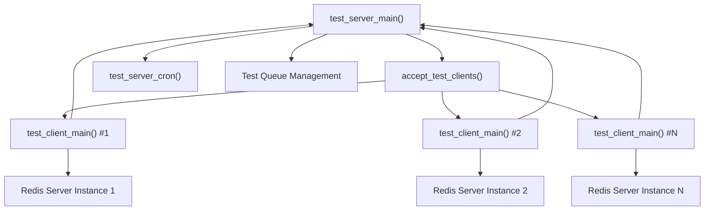
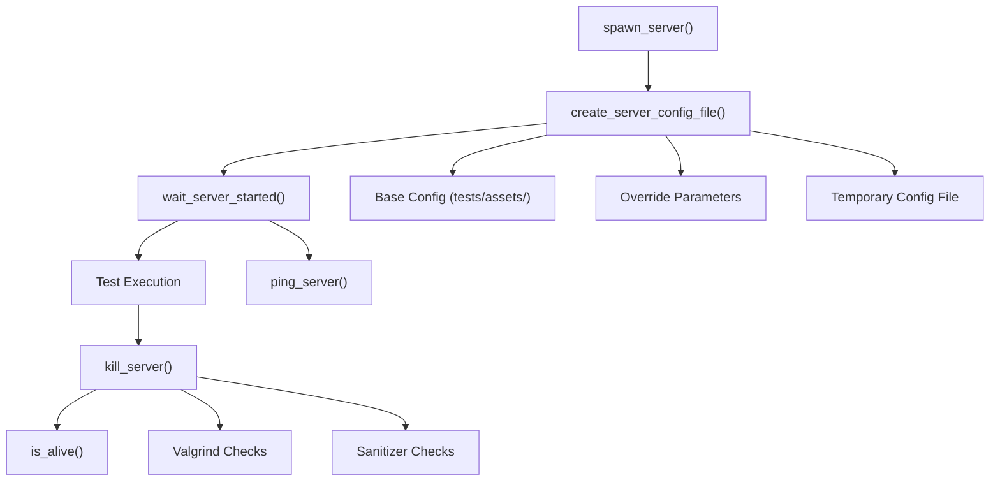

# Development and Testing

Relevant source files

-   [.github/workflows/ci.yml](https://github.com/redis/redis/blob/8ad54215/.github/workflows/ci.yml)
-   [.github/workflows/daily.yml](https://github.com/redis/redis/blob/8ad54215/.github/workflows/daily.yml)
-   [.gitignore](https://github.com/redis/redis/blob/8ad54215/.gitignore)
-   [Makefile](https://github.com/redis/redis/blob/8ad54215/Makefile)
-   [deps/Makefile](https://github.com/redis/redis/blob/8ad54215/deps/Makefile)
-   [deps/fast\_float/Makefile](https://github.com/redis/redis/blob/8ad54215/deps/fast_float/Makefile)
-   [deps/fast\_float/README.md](https://github.com/redis/redis/blob/8ad54215/deps/fast_float/README.md)
-   [deps/fast\_float/fast\_float.h](https://github.com/redis/redis/blob/8ad54215/deps/fast_float/fast_float.h)
-   [deps/fast\_float/fast\_float\_strtod.cpp](https://github.com/redis/redis/blob/8ad54215/deps/fast_float/fast_float_strtod.cpp)
-   [deps/fast\_float/fast\_float\_strtod.h](https://github.com/redis/redis/blob/8ad54215/deps/fast_float/fast_float_strtod.h)
-   [src/redis-check-aof.c](https://github.com/redis/redis/blob/8ad54215/src/redis-check-aof.c)
-   [tests/integration/aof-multi-part.tcl](https://github.com/redis/redis/blob/8ad54215/tests/integration/aof-multi-part.tcl)
-   [tests/integration/aof-race.tcl](https://github.com/redis/redis/blob/8ad54215/tests/integration/aof-race.tcl)
-   [tests/integration/aof.tcl](https://github.com/redis/redis/blob/8ad54215/tests/integration/aof.tcl)
-   [tests/integration/replication.tcl](https://github.com/redis/redis/blob/8ad54215/tests/integration/replication.tcl)
-   [tests/support/aofmanifest.tcl](https://github.com/redis/redis/blob/8ad54215/tests/support/aofmanifest.tcl)
-   [tests/support/server.tcl](https://github.com/redis/redis/blob/8ad54215/tests/support/server.tcl)
-   [tests/support/test.tcl](https://github.com/redis/redis/blob/8ad54215/tests/support/test.tcl)
-   [tests/support/util.tcl](https://github.com/redis/redis/blob/8ad54215/tests/support/util.tcl)
-   [tests/test\_helper.tcl](https://github.com/redis/redis/blob/8ad54215/tests/test_helper.tcl)
-   [tests/unit/other.tcl](https://github.com/redis/redis/blob/8ad54215/tests/unit/other.tcl)

This page documents Redis's development infrastructure, testing framework, and build system. It covers the test execution architecture, build process, continuous integration workflows, and development tools used for maintaining code quality and reliability.

For information about specific testing of individual subsystems, see the respective subsystem pages. For build configuration details, see [Build System and Dependencies](/redis/redis/10.1-build-system-and-dependencies).

## Test Framework Architecture

Redis uses a sophisticated distributed testing framework built in Tcl that enables parallel test execution across multiple Redis instances. The framework follows a server-client architecture where a test server coordinates multiple test clients.

### Distributed Test Execution Model

The test server manages a pool of test clients and distributes test units among them. Each client spawns its own Redis server instances and reports results back to the server.

Sources: [tests/test\_helper.tcl266-305](https://github.com/redis/redis/blob/8ad54215/tests/test_helper.tcl#L266-L305) [tests/test\_helper.tcl514-531](https://github.com/redis/redis/blob/8ad54215/tests/test_helper.tcl#L514-L531)

### Test Client-Server Communication

> **[Mermaid sequence]**
> *(图表结构无法解析)*

Test clients communicate with the server using a custom protocol that sends status packets including test results, server spawning events, and completion notifications.

Sources: [tests/test\_helper.tcl344-411](https://github.com/redis/redis/blob/8ad54215/tests/test_helper.tcl#L344-L411) [tests/test\_helper.tcl533-538](https://github.com/redis/redis/blob/8ad54215/tests/test_helper.tcl#L533-L538)

### Server Instance Management

The testing framework includes sophisticated Redis server lifecycle management:

Sources: [tests/support/server.tcl288-320](https://github.com/redis/redis/blob/8ad54215/tests/support/server.tcl#L288-L320) [tests/support/server.tcl436-500](https://github.com/redis/redis/blob/8ad54215/tests/support/server.tcl#L436-L500) [tests/support/server.tcl45-131](https://github.com/redis/redis/blob/8ad54215/tests/support/server.tcl#L45-L131)

## Test Assertion Framework

Redis provides a comprehensive assertion framework with various assertion types and utilities:

| Assertion Type | Function | Purpose |
| --- | --- | --- |
| Basic Assertions | `assert`, `assert_equal`, `assert_not_equal` | Value comparisons |
| Numeric Comparisons | `assert_lessthan`, `assert_morethan`, `assert_range` | Numeric validations |
| Pattern Matching | `assert_match`, `assert_no_match` | String pattern validation |
| Error Handling | `assert_error` | Exception testing |
| Redis Specific | `assert_encoding`, `assert_type`, `assert_refcount` | Redis object validation |
| Conditional Waiting | `wait_for_condition` | Asynchronous condition polling |

Sources: [tests/support/test.tcl13-143](https://github.com/redis/redis/blob/8ad54215/tests/support/test.tcl#L13-L143)

## Build System Architecture

Redis uses a hierarchical Make-based build system that manages both the main codebase and its dependencies.

### Build Hierarchy

```mermaid
flowchart TD
    MAIN_MAKE["Makefile (root)"]
    SRC_MAKE["src/Makefile"]
    REDIS_SERVER["redis-server"]
    REDIS_CLI["redis-cli"]
    REDIS_TOOLS["redis-check-*"]
    DEPS_MAKE["deps/Makefile"]
    JEMALLOC["jemalloc"]
    LUA["lua"]
    HIREDIS["hiredis"]
    HDR_HIST["hdr_histogram"]
    FAST_FLOAT["fast_float"]
    LINENOISE["linenoise"]
    FPCONV["fpconv"]
    MOD_MAKE["modules/Makefile"]
    TLS_MODULE["redis-tls.so"]

    MAIN --> MAKE_SRC_MAKE
    MAIN --> MAKE_DEPS_MAKE
    MAIN --> MAKE_MOD_MAKE
    SRC --> MAKE_REDIS_SERVER
    SRC --> MAKE_REDIS_CLI
    SRC --> MAKE_REDIS_TOOLS
    DEPS --> MAKE_JEMALLOC
    DEPS --> MAKE_LUA
    DEPS --> MAKE_HIREDIS
    DEPS --> MAKE_HDR_HIST
    DEPS --> MAKE_FAST_FLOAT
    DEPS --> MAKE_LINENOISE
    DEPS --> MAKE_FPCONV
```

The top-level Makefile orchestrates builds across subdirectories, while each component manages its own specific build requirements.

Sources: [Makefile1-17](https://github.com/redis/redis/blob/8ad54215/Makefile#L1-L17) [deps/Makefile32-145](https://github.com/redis/redis/blob/8ad54215/deps/Makefile#L32-L145)

### Dependency Management

Dependencies are built with careful handling of compiler flags and cross-platform considerations:

-   **Conditional builds**: TLS support, sanitizers, platform-specific optimizations
-   **Flag propagation**: `DEPS_CFLAGS` and `DEPS_LDFLAGS` passed to dependencies
-   **Clean tracking**: Build flags cached to trigger rebuilds when changed

Sources: [deps/Makefile15-53](https://github.com/redis/redis/blob/8ad54215/deps/Makefile#L15-L53) [deps/Makefile67-144](https://github.com/redis/redis/blob/8ad54215/deps/Makefile#L67-L144)

## Continuous Integration Pipeline

Redis maintains comprehensive CI/CD pipelines through GitHub Actions with both quick feedback and extensive daily testing.

### CI Workflow Structure

```mermaid
flowchart TD
    UBUNTU_TESTS["Multiple Ubuntu Variants"]
    PLATFORM_TESTS["Multi-Platform Testing"]
    FORTIFY["Fortify Testing"]
    TLS_TESTS["TLS Testing"]
    IO_THREADS["IO Threads Testing"]
    VALGRIND_TESTS["Valgrind Testing"]
    PR["Pull Request"]
    PUSH["Push to Branch"]
    UBUNTU_BASIC["test-ubuntu-latest"]
    SANITIZER["test-sanitizer-address"]
    DEBIAN_OLD["build-debian-old"]
    MACOS["build-macos-latest"]
    BUILD_32["build-32bit"]
    LIBC_MALLOC["build-libc-malloc"]
    CENTOS["build-centos-jemalloc"]
    OLD_CHAIN["build-old-chain-jemalloc"]

    PR --> UBUNTU_BASIC
    PR --> SANITIZER
    PR --> DEBIAN_OLD
    PR --> MACOS
    PUSH --> UBUNTU_BASIC
    UBUNTU --> BASIC_BUILD_32
    BUILD --> 32_LIBC_MALLOC
    LIBC --> MALLOC_CENTOS
    PLATFORM --> TESTS_UBUNTU_TESTS
    UBUNTU --> TESTS_FORTIFY
    FORTIFY --> TLS_TESTS
    TLS --> TESTS_IO_THREADS
```

Sources: [.github/workflows/ci.yml1-103](https://github.com/redis/redis/blob/8ad54215/.github/workflows/ci.yml#L1-L103) [.github/workflows/daily.yml1-50](https://github.com/redis/redis/blob/8ad54215/.github/workflows/daily.yml#L1-L50)

### Test Matrix Configuration

The daily workflow runs an extensive test matrix with different configurations:

| Configuration | Purpose | Key Parameters |
| --- | --- | --- |
| Ubuntu Standard | Basic functionality | jemalloc, standard flags |
| Fortify | Security hardening | `-D_FORTIFY_SOURCE=3` |
| LibC Malloc | Alternative allocator | `MALLOC=libc` |
| 32-bit Build | Architecture compatibility | `32bit` target |
| TLS Enabled | Secure connections | `BUILD_TLS=yes` |
| IO Threads | Multi-threading | `--config io-threads 4` |
| Valgrind | Memory debugging | Valgrind wrapper |
| Address Sanitizer | Memory safety | `SANITIZER=address` |

Sources: [.github/workflows/daily.yml34-329](https://github.com/redis/redis/blob/8ad54215/.github/workflows/daily.yml#L34-L329)

## Test Categories and Organization

Redis organizes tests into several categories based on functionality and execution requirements:

### Test Directory Structure

```mermaid
flowchart TD
    TESTS_ROOT["tests/"]
    UNIT["unit/"]
    INTEGRATION["integration/"]
    SUPPORT["support/"]
    ASSETS["assets/"]
    MODULES["modules/"]
    BASIC["basic.tcl"]
    TYPES["type/*.tcl"]
    OTHER["other.tcl"]
    MODULEAPI["moduleapi/*.tcl"]
    CLUSTER_UNIT["cluster/*.tcl"]
    REPLICATION["replication.tcl"]
    AOF["aof*.tcl"]
    RDB["rdb*.tcl"]
    PSYNC["psync*.tcl"]
    TEST_HELPER["test_helper.tcl"]
    SERVER_SUPPORT["server.tcl"]
    TEST_FRAMEWORK["test.tcl"]
    UTILITIES["util.tcl"]

    TESTS --> ROOT_UNIT
    TESTS --> ROOT_INTEGRATION
    TESTS --> ROOT_SUPPORT
    UNIT --> BASIC
    UNIT --> TYPES
    UNIT --> OTHER
    UNIT --> MODULEAPI
    UNIT --> CLUSTER_UNIT
    INTEGRATION --> REPLICATION
    INTEGRATION --> AOF
    INTEGRATION --> RDB
    INTEGRATION --> PSYNC
    SUPPORT --> TEST_HELPER
    SUPPORT --> SERVER_SUPPORT
    SUPPORT --> TEST_FRAMEWORK
    SUPPORT --> UTILITIES
```

Sources: [tests/test\_helper.tcl24-30](https://github.com/redis/redis/blob/8ad54215/tests/test_helper.tcl#L24-L30) [tests/test\_helper.tcl32-38](https://github.com/redis/redis/blob/8ad54215/tests/test_helper.tcl#L32-L38)

### Test Execution Flow

Tests are executed through standardized runner scripts:

-   **`runtest`**: Main test runner for unit and integration tests
-   **`runtest-cluster`**: Cluster-specific test execution
-   **`runtest-sentinel`**: Sentinel high-availability tests

These scripts support various options for filtering, debugging, and configuration.

Sources: [tests/test\_helper.tcl540-582](https://github.com/redis/redis/blob/8ad54215/tests/test_helper.tcl#L540-L582)

## Development Tools and Utilities

Redis includes several development and debugging utilities built into the codebase:

### Redis Check Utilities

```mermaid
flowchart TD
    CHECK_AOF["redis-check-aof"]
    CHECK_RDB["redis-check-rdb"]
    PARSE_RESP["processRESP()"]
    MULTI_CHECK["MULTI/EXEC Validation"]
    TIMESTAMP["processAnnotations()"]
    TRUNCATE_FIX["--fix Truncation Repair"]
    FORMAT_CHECK["Format Validation"]
    INTEGRITY_CHECK["Integrity Checking"]
    REPAIR_OPS["Repair Operations"]

    CHECK --> AOF_PARSE_RESP
    CHECK --> AOF_MULTI_CHECK
    CHECK --> AOF_TIMESTAMP
    CHECK --> AOF_TRUNCATE_FIX
    PARSE --> RESP_FORMAT_CHECK
    MULTI --> CHECK_INTEGRITY_CHECK
    TRUNCATE --> FIX_REPAIR_OPS
```

The `redis-check-aof` utility provides comprehensive AOF file validation and repair capabilities, including transaction boundary checking and format validation.

Sources: [src/redis-check-aof.c138-165](https://github.com/redis/redis/blob/8ad54215/src/redis-check-aof.c#L138-L165) [src/redis-check-aof.c176-205](https://github.com/redis/redis/blob/8ad54215/src/redis-check-aof.c#L176-L205)

### Test Execution Options

The test framework supports extensive configuration options:

| Option Category | Examples | Purpose |
| --- | --- | --- |
| Test Selection | `--single`, `--only`, `--skip-till` | Control test execution scope |
| Debugging | `--verbose`, `--dump-logs`, `--stop` | Debug test failures |
| Sanitization | `--valgrind`, `--tsan` | Memory and thread safety |
| Network | `--tls`, `--host`, `--port` | Connection configuration |
| Performance | `--accurate`, `--clients N` | Test thoroughness and parallelization |

Sources: [tests/test\_helper.tcl540-582](https://github.com/redis/redis/blob/8ad54215/tests/test_helper.tcl#L540-L582) [tests/test\_helper.tcl584-718](https://github.com/redis/redis/blob/8ad54215/tests/test_helper.tcl#L584-L718)

The Redis development and testing infrastructure provides a robust foundation for maintaining code quality through comprehensive testing, flexible build configuration, and extensive CI/CD coverage. The distributed test architecture enables efficient parallel testing while maintaining isolation between test cases.
