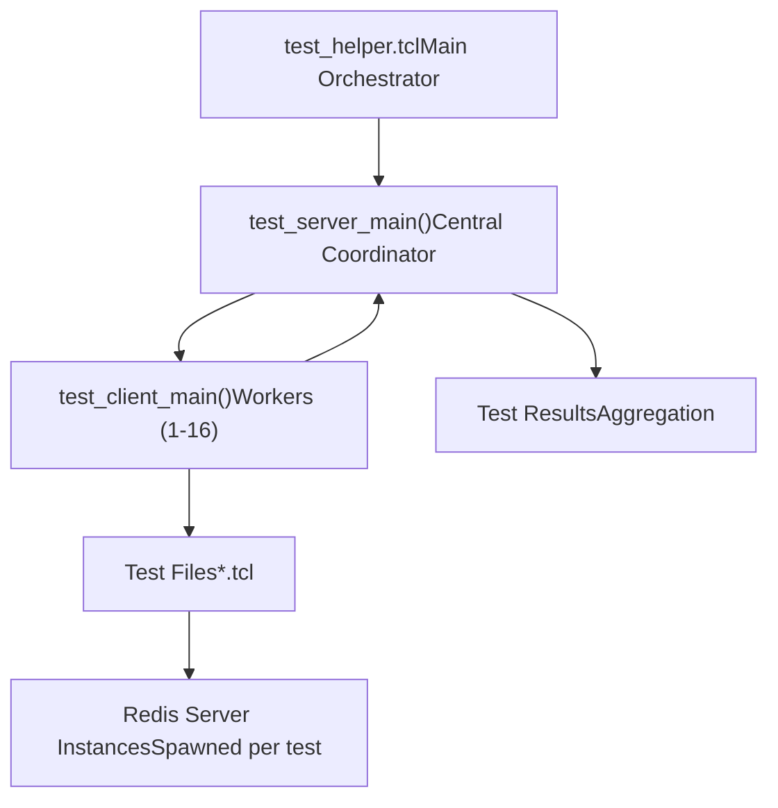
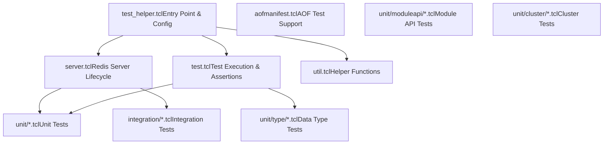
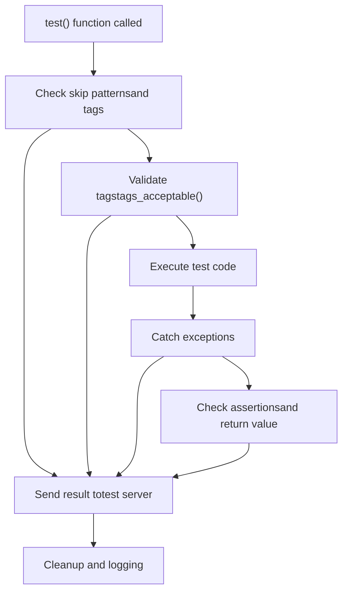
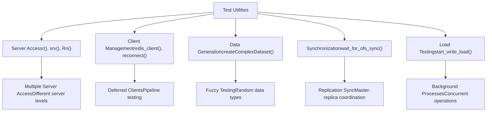
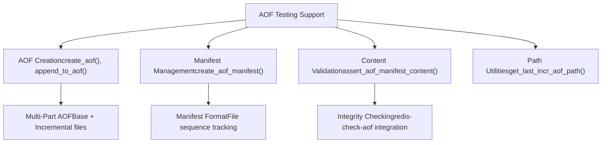
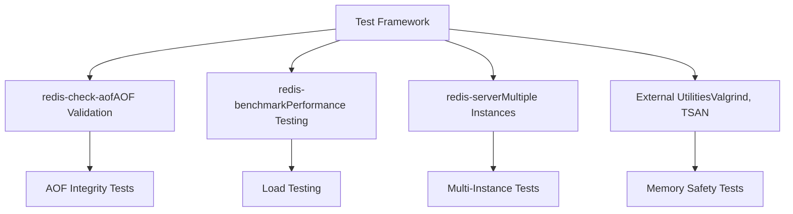

# Testing Framework

Relevant source files

-   [src/redis-check-aof.c](https://github.com/redis/redis/blob/8ad54215/src/redis-check-aof.c)
-   [tests/integration/aof-multi-part.tcl](https://github.com/redis/redis/blob/8ad54215/tests/integration/aof-multi-part.tcl)
-   [tests/integration/aof-race.tcl](https://github.com/redis/redis/blob/8ad54215/tests/integration/aof-race.tcl)
-   [tests/integration/aof.tcl](https://github.com/redis/redis/blob/8ad54215/tests/integration/aof.tcl)
-   [tests/integration/replication.tcl](https://github.com/redis/redis/blob/8ad54215/tests/integration/replication.tcl)
-   [tests/support/aofmanifest.tcl](https://github.com/redis/redis/blob/8ad54215/tests/support/aofmanifest.tcl)
-   [tests/support/server.tcl](https://github.com/redis/redis/blob/8ad54215/tests/support/server.tcl)
-   [tests/support/test.tcl](https://github.com/redis/redis/blob/8ad54215/tests/support/test.tcl)
-   [tests/support/util.tcl](https://github.com/redis/redis/blob/8ad54215/tests/support/util.tcl)
-   [tests/test\_helper.tcl](https://github.com/redis/redis/blob/8ad54215/tests/test_helper.tcl)
-   [tests/unit/other.tcl](https://github.com/redis/redis/blob/8ad54215/tests/unit/other.tcl)

The Redis testing framework provides a comprehensive test suite infrastructure for validating Redis functionality across unit tests, integration tests, and various deployment scenarios. The framework uses a distributed server-client architecture to run tests in parallel, with sophisticated server lifecycle management and extensive assertion utilities.

For information about the build system that compiles the test infrastructure, see [Build System and Dependencies](/redis/redis/10.1-build-system-and-dependencies).

## Architecture Overview

The testing framework implements a server-client model where a central test server coordinates multiple test client processes that execute individual test files concurrently.

### Test Orchestration Architecture


Sources: [tests/test\_helper.tcl266-305](https://github.com/redis/redis/blob/8ad54215/tests/test_helper.tcl#L266-L305) [tests/test\_helper.tcl514-531](https://github.com/redis/redis/blob/8ad54215/tests/test_helper.tcl#L514-L531)

### Core Framework Components


Sources: [tests/test\_helper.tcl13-19](https://github.com/redis/redis/blob/8ad54215/tests/test_helper.tcl#L13-L19) [tests/test\_helper.tcl24-30](https://github.com/redis/redis/blob/8ad54215/tests/test_helper.tcl#L24-L30)

## Test Server-Client Communication

The framework uses a TCP-based communication protocol between the test server and clients for coordination and result reporting.

### Communication Protocol

> **[Mermaid sequence]**
> *(图表结构无法解析)*

Sources: [tests/test\_helper.tcl344-411](https://github.com/redis/redis/blob/8ad54215/tests/test_helper.tcl#L344-L411) [tests/test\_helper.tcl522-530](https://github.com/redis/redis/blob/8ad54215/tests/test_helper.tcl#L522-L530)

The communication uses structured packets with status codes:

-   `ready`: Client ready for work
-   `testing`: Test started
-   `ok`: Test passed
-   `err`: Test failed
-   `done`: Test file completed
-   `run`: Server assigns test to client

## Server Management

The testing framework provides sophisticated Redis server lifecycle management through `server.tcl`.

### Server Lifecycle

> **[Mermaid stateDiagram]**
> *(图表结构无法解析)*

Sources: [tests/support/server.tcl288-320](https://github.com/redis/redis/blob/8ad54215/tests/support/server.tcl#L288-L320) [tests/support/server.tcl322-349](https://github.com/redis/redis/blob/8ad54215/tests/support/server.tcl#L322-L349) [tests/support/server.tcl45-131](https://github.com/redis/redis/blob/8ad54215/tests/support/server.tcl#L45-L131)

Key server management functions:

| Function | Purpose | Key Features |
| --- | --- | --- |
| `start_server()` | Main server startup | Config parsing, port allocation, TLS support |
| `spawn_server()` | Process creation | Valgrind support, environment setup |
| `kill_server()` | Cleanup | Memory leak checking, graceful shutdown |
| `server_is_up()` | Health check | PING-based connectivity verification |

## Test Framework Core

The test execution engine in `test.tcl` provides the fundamental test running and assertion capabilities.

### Test Execution Flow


Sources: [tests/support/test.tcl164-276](https://github.com/redis/redis/blob/8ad54215/tests/support/test.tcl#L164-L276)

### Assertion System

The framework provides comprehensive assertion functions:

| Assertion | Purpose | Example Usage |
| --- | --- | --- |
| `assert` | Basic condition check | `assert {$val > 0}` |
| `assert_equal` | Value equality | `assert_equal $expected $actual` |
| `assert_match` | Pattern matching | `assert_match "*error*" $msg` |
| `assert_error` | Exception validation | `assert_error "*WRONGTYPE*" {r lpush string val}` |
| `assert_encoding` | Object encoding check | `assert_encoding ziplist mylist` |
| `wait_for_condition` | Polling until condition | `wait_for_condition 50 100 {$ready}` |

Sources: [tests/support/test.tcl13-142](https://github.com/redis/redis/blob/8ad54215/tests/support/test.tcl#L13-L142)

## Configuration and Execution Options

The testing framework supports extensive configuration through command-line options and global variables.

### Key Configuration Variables

```mermaid
flowchart TD
    Config["Configuration Options"]
    Execution["Execution Control"]
    Filtering["Test Filtering"]
    Environment["Environment"]
    Debug["Debug/Analysis"]
    NumClients["::numclientsParallel workers (16)"]
    Loop["::loopRepeat tests"]
    Timeout["::timeoutMax execution time"]
    SingleTests["::single_testsRun specific units"]
    OnlyTests["::only_testsPattern matching"]
    SkipTests["::skiptestsSkip patterns"]
    Tags["::allowtags/::denytagsTag-based filtering"]
    External["::externalExternal server mode"]
    TLS["::tlsTLS testing"]
    Cluster["::cluster_modeCluster protocol"]
    Valgrind["::valgrindMemory checking"]
    Verbose["::verboseOutput level"]
    DumpLogs["::dump_logsServer logs on failure"]

    Config --> Execution
    Config --> Filtering
    Config --> Environment
    Config --> Debug
    Execution --> NumClients
    Execution --> Loop
    Execution --> Timeout
    Filtering --> SingleTests
    Filtering --> OnlyTests
    Filtering --> SkipTests
    Filtering --> Tags
    Environment --> External
    Environment --> TLS
    Environment --> Cluster
    Debug --> Valgrind
    Debug --> Verbose
    Debug --> DumpLogs
```


Sources: [tests/test\_helper.tcl42-86](https://github.com/redis/redis/blob/8ad54215/tests/test_helper.tcl#L42-L86) [tests/test\_helper.tcl584-718](https://github.com/redis/redis/blob/8ad54215/tests/test_helper.tcl#L584-L718)

## Test Organization and Categories

Tests are organized in a hierarchical directory structure with specific purposes:

### Test Directory Structure

| Directory | Purpose | Example Tests |
| --- | --- | --- |
| `unit/` | Core functionality tests | Basic commands, data structures |
| `unit/type/` | Data type specific tests | Strings, lists, sets, streams |
| `unit/moduleapi/` | Module API validation | Module loading, API functions |
| `unit/cluster/` | Cluster functionality | Slot management, node communication |
| `integration/` | System integration tests | Replication, AOF, persistence |

Sources: [tests/test\_helper.tcl24-30](https://github.com/redis/redis/blob/8ad54215/tests/test_helper.tcl#L24-L30)

### Test Tagging System

Tests use a tagging system for categorization and filtering:

```
test {Test name} {
    # test code
} {} {tags {slow external:skip}}
```
Common tags include:

-   `slow`: Long-running tests
-   `external:skip`: Skip when testing external server
-   `needs:debug`: Requires debug build
-   `cluster:skip`: Skip in cluster mode
-   `tls:skip`: Skip in TLS mode

Sources: [tests/support/server.tcl186-256](https://github.com/redis/redis/blob/8ad54215/tests/support/server.tcl#L186-L256) [tests/support/test.tcl164-186](https://github.com/redis/redis/blob/8ad54215/tests/support/test.tcl#L164-L186)

## Specialized Test Utilities

The framework includes specialized utilities for complex testing scenarios.

### Redis Server Interaction Utilities


Sources: [tests/test\_helper.tcl121-161](https://github.com/redis/redis/blob/8ad54215/tests/test_helper.tcl#L121-L161) [tests/support/util.tcl588-632](https://github.com/redis/redis/blob/8ad54215/tests/support/util.tcl#L588-L632) [tests/support/util.tcl312-416](https://github.com/redis/redis/blob/8ad54215/tests/support/util.tcl#L312-L416)

### AOF and Persistence Testing

The framework includes specialized support for testing AOF (Append Only File) functionality:


Sources: [tests/support/aofmanifest.tcl129-174](https://github.com/redis/redis/blob/8ad54215/tests/support/aofmanifest.tcl#L129-L174) [tests/integration/aof-multi-part.tcl26-52](https://github.com/redis/redis/blob/8ad54215/tests/integration/aof-multi-part.tcl#L26-L52)

## External Tools Integration

The testing framework integrates with external Redis tools for comprehensive validation.

### Tool Integration Architecture


Sources: [tests/integration/aof.tcl107-130](https://github.com/redis/redis/blob/8ad54215/tests/integration/aof.tcl#L107-L130) [tests/integration/aof-race.tcl11](https://github.com/redis/redis/blob/8ad54215/tests/integration/aof-race.tcl#L11-L11) [tests/support/server.tcl295-309](https://github.com/redis/redis/blob/8ad54215/tests/support/server.tcl#L295-L309)

The `redis-check-aof` tool is extensively tested for AOF file validation and repair:

```
int checkSingleAof(char *aof_filename, char *aof_filepath, int last_file, int fix, int preamble)
```
This function validates AOF file integrity and supports both old-style and multi-part AOF formats.

Sources: [src/redis-check-aof.c223-333](https://github.com/redis/redis/blob/8ad54215/src/redis-check-aof.c#L223-L333)
