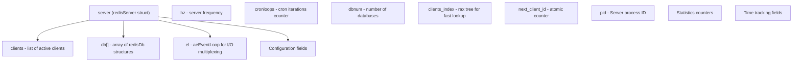
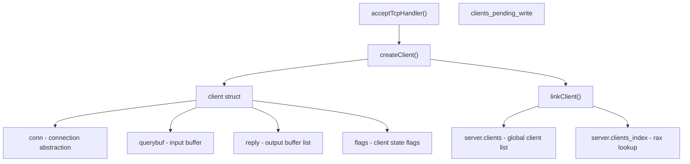
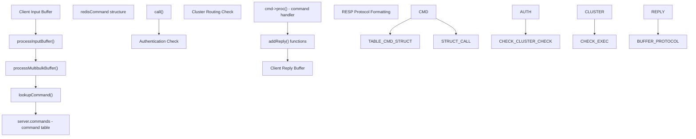
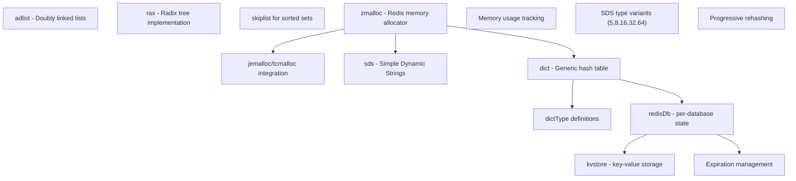
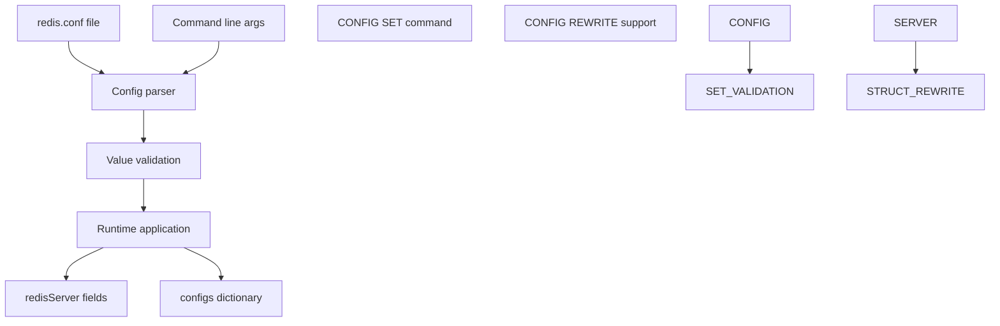

# Redis Core

Relevant source files

-   [redis.conf](https://github.com/redis/redis/blob/8ad54215/redis.conf)
-   [src/aof.c](https://github.com/redis/redis/blob/8ad54215/src/aof.c)
-   [src/config.c](https://github.com/redis/redis/blob/8ad54215/src/config.c)
-   [src/db.c](https://github.com/redis/redis/blob/8ad54215/src/db.c)
-   [src/debug.c](https://github.com/redis/redis/blob/8ad54215/src/debug.c)
-   [src/module.c](https://github.com/redis/redis/blob/8ad54215/src/module.c)
-   [src/networking.c](https://github.com/redis/redis/blob/8ad54215/src/networking.c)
-   [src/object.c](https://github.com/redis/redis/blob/8ad54215/src/object.c)
-   [src/rdb.c](https://github.com/redis/redis/blob/8ad54215/src/rdb.c)
-   [src/replication.c](https://github.com/redis/redis/blob/8ad54215/src/replication.c)
-   [src/server.c](https://github.com/redis/redis/blob/8ad54215/src/server.c)
-   [src/server.h](https://github.com/redis/redis/blob/8ad54215/src/server.h)
-   [tests/unit/introspection.tcl](https://github.com/redis/redis/blob/8ad54215/tests/unit/introspection.tcl)

## Purpose and Scope

This document covers the core server architecture of Redis, focusing on the fundamental components that enable Redis to function as a high-performance in-memory database server. This includes the global server state management, client connection handling, networking layer, command processing pipeline, and the integration points for extensions.

For information about specific data types and storage mechanisms, see [Data Storage and Management](/redis/redis/3-data-storage-and-management). For high availability features, see [High Availability and Distribution](/redis/redis/6-high-availability-and-distribution). For persistence mechanisms, see [Persistence and Replication](/redis/redis/7-persistence-and-replication).

## Global Server State

The heart of Redis is the global `redisServer` structure defined in [src/server.h1259-1884](https://github.com/redis/redis/blob/8ad54215/src/server.h#L1259-L1884) which maintains all server state in a single global instance called `server`. This structure contains over 600 fields that control every aspect of Redis operation, from basic configuration to advanced features.

Sources: [src/server.h1259-1884](https://github.com/redis/redis/blob/8ad54215/src/server.h#L1259-L1884) [src/server.c80](https://github.com/redis/redis/blob/8ad54215/src/server.c#L80-L80)

## Server Initialization and Lifecycle

The server initialization follows a well-defined sequence managed by functions in `server.c`. The main entry point establishes the global state and initializes all subsystems.

### Server Startup Flow

The `initServer()` function in [src/server.c3456-3719](https://github.com/redis/redis/blob/8ad54215/src/server.c#L3456-L3719) performs critical initialization including:

-   Signal handler setup for graceful shutdown
-   Shared object creation for commonly used values
-   Event loop initialization via `aeCreateEventLoop()`
-   Network socket creation and binding
-   Database initialization
-   Periodic task scheduling

Sources: [src/server.c3456-3719](https://github.com/redis/redis/blob/8ad54215/src/server.c#L3456-L3719) [src/server.c1451-1700](https://github.com/redis/redis/blob/8ad54215/src/server.c#L1451-L1700)

## Client Connection Architecture

Redis manages client connections through a sophisticated system that handles both the networking layer and client state management.

### Client Structure and Lifecycle

Each client connection is represented by a `client` structure defined in [src/server.h1023-1258](https://github.com/redis/redis/blob/8ad54215/src/server.h#L1023-L1258) The client lifecycle includes creation, authentication, command processing, and cleanup.

The `createClient()` function in [src/networking.c121-235](https://github.com/redis/redis/blob/8ad54215/src/networking.c#L121-L235) initializes:

-   Connection abstraction layer (`connection`)
-   Input/output buffers for protocol handling
-   Authentication state and user context
-   Command parsing state
-   Memory usage tracking

Sources: [src/networking.c121-235](https://github.com/redis/redis/blob/8ad54215/src/networking.c#L121-L235) [src/networking.c92-100](https://github.com/redis/redis/blob/8ad54215/src/networking.c#L92-L100)

### Networking and Event Handling

Redis uses an event-driven architecture built on top of the `ae` (Asynchronous Events) library. The networking layer handles both TCP and Unix socket connections with configurable I/O threading.

```mermaid
flowchart TD
    AE["ae.c event loop"]
    FILE_EVENTS["File Events (I/O)"]
    TIME_EVENTS["Time Events (periodic)"]
    CONN_TCP["TCP Connections"]
    CONN_UNIX["Unix Socket Connections"]
    CONN_TLS["TLS Connections (optional)"]
    READ_HANDLER["readQueryFromClient()"]
    WRITE_HANDLER["sendReplyToClient()"]
    ACCEPT_HANDLER["acceptTcpHandler()"]
    PROTO["RESP Protocol Parser"]
    CMD_QUEUE["Command Queue"]
    REPLY_QUEUE["Reply Queue"]

    AE --> FILE_EVENTS
    AE --> TIME_EVENTS
    FILE --> EVENTS_ACCEPT_HANDLER
    FILE --> EVENTS_READ_HANDLER
    FILE --> EVENTS_WRITE_HANDLER
    ACCEPT --> HANDLER_CONN_TCP
    ACCEPT --> HANDLER_CONN_UNIX
    READ --> HANDLER_PROTO
    PROTO --> CMD_QUEUE
    WRITE --> HANDLER_REPLY_QUEUE
```

The networking layer implements several key functions:

-   `acceptTcpHandler()` in \[src/networking.c\] for new connections
-   `readQueryFromClient()` in [src/networking.c2178-2276](https://github.com/redis/redis/blob/8ad54215/src/networking.c#L2178-L2276) for reading data
-   `sendReplyToClient()` in [src/networking.c1378-1502](https://github.com/redis/redis/blob/8ad54215/src/networking.c#L1378-L1502) for writing responses

Sources: [src/networking.c2178-2276](https://github.com/redis/redis/blob/8ad54215/src/networking.c#L2178-L2276) [src/networking.c1378-1502](https://github.com/redis/redis/blob/8ad54215/src/networking.c#L1378-L1502) [src/server.c1451-1700](https://github.com/redis/redis/blob/8ad54215/src/server.c#L1451-L1700)

## Command Processing Pipeline

Redis implements a multi-stage command processing pipeline that handles protocol parsing, command lookup, execution, and response generation.

### Command Processing Flow

The command processing involves several key components:

-   **Protocol Parsing**: RESP (Redis Serialization Protocol) parsing in `processInputBuffer()`
-   **Command Lookup**: Hash table lookup in `server.commands` using `lookupCommand()`
-   **Execution Context**: The `call()` function manages the execution environment
-   **Response Formatting**: Various `addReply*()` functions format responses

Sources: [src/networking.c2178-2276](https://github.com/redis/redis/blob/8ad54215/src/networking.c#L2178-L2276) [src/server.c3938-4162](https://github.com/redis/redis/blob/8ad54215/src/server.c#L3938-L4162)

## Core Data Structures and Memory Management

Redis Core relies on several fundamental data structures that support the higher-level Redis data types.

### Core Infrastructure Data Structures

Key data structures include:

-   **SDS (Simple Dynamic Strings)**: Redis' string implementation with multiple size classes
-   **dict**: Generic hash table with progressive rehashing capabilities
-   **kvstore**: Database-level key-value storage abstraction
-   **rax**: Radix tree for prefix operations and indexing

Sources: [src/server.h48-66](https://github.com/redis/redis/blob/8ad54215/src/server.h#L48-L66) [src/sds.h](https://github.com/redis/redis/blob/8ad54215/src/sds.h) [src/dict.h](https://github.com/redis/redis/blob/8ad54215/src/dict.h) [src/kvstore.h](https://github.com/redis/redis/blob/8ad54215/src/kvstore.h)

## Configuration System

Redis configuration is managed through a flexible system that supports both static configuration files and runtime updates via the `CONFIG` command.

### Configuration Architecture

The configuration system in [src/config.c](https://github.com/redis/redis/blob/8ad54215/src/config.c) provides:

-   **Static Configuration**: Redis.conf file parsing during startup
-   **Runtime Configuration**: `CONFIG SET`/`CONFIG GET` commands for live updates
-   **Validation Framework**: Type-specific validation for configuration values
-   **Configuration Persistence**: `CONFIG REWRITE` to update configuration files

Sources: [src/config.c432-503](https://github.com/redis/redis/blob/8ad54215/src/config.c#L432-L503) [redis.conf1-2000](https://github.com/redis/redis/blob/8ad54215/redis.conf#L1-L2000)

## Module System Integration

Redis Core provides a comprehensive module API that allows extending Redis functionality while maintaining performance and stability.

### Module Integration Points

```mermaid
flowchart TD
    MODULE_API["RedisModule API"]
    MODULE_CTX["RedisModuleCtx"]
    MODULE_DICT["modules dictionary"]
    CMD_REGISTRATION["Command registration"]
    TYPE_REGISTRATION["Data type registration"]
    EVENT_HOOKS["Event notifications"]
    THREAD_SAFETY["Thread-safe contexts"]
    MEMORY_MGMT["Module memory management"]
    AUTO_MEMORY["Automatic cleanup"]
    CALL_REPLIES["RM_Call() infrastructure"]

    MODULE --> API_MODULE_CTX
    MODULE --> API_CMD_REGISTRATION
    MODULE --> API_TYPE_REGISTRATION
    MODULE --> CTX_MEMORY_MGMT
    MODULE --> CTX_AUTO_MEMORY
    CMD --> REGISTRATION_CALL_REPLIES
    EVENT --> HOOKS_THREAD_SAFETY
```

The module system provides:

-   **API Layer**: Over 500 functions for module development
-   **Memory Management**: Automatic cleanup and pool allocation
-   **Command Integration**: Seamless integration with Redis command processing
-   **Thread Safety**: Safe contexts for multi-threaded modules

Sources: [src/module.c527-6000](https://github.com/redis/redis/blob/8ad54215/src/module.c#L527-L6000) [src/module.c131-157](https://github.com/redis/redis/blob/8ad54215/src/module.c#L131-L157)

## Event Loop and Periodic Tasks

Redis uses a single-threaded event loop for its core operations, with periodic maintenance tasks managed by the `serverCron()` function.

### Event Loop Structure

```mermaid
flowchart TD
    MAIN["aeMain() - event loop"]
    BEFORE_SLEEP["beforeSleep()"]
    PROCESS_EVENTS["aeProcessEvents()"]
    AFTER_SLEEP["afterSleep()"]
    ACCEPT["Connection acceptance"]
    READ["Client data reading"]
    WRITE["Client data writing"]
    SERVER_CRON["serverCron() - periodic tasks"]
    CLIENT_CRON["Client maintenance"]
    DB_CRON["Database maintenance"]

    MAIN --> BEFORE_SLEEP
    BEFORE --> SLEEP_PROCESS_EVENTS
    PROCESS --> EVENTS_AFTER_SLEEP
    AFTER --> SLEEP_MAIN
    PROCESS --> EVENTS_ACCEPT
    PROCESS --> EVENTS_READ
    PROCESS --> EVENTS_WRITE
    PROCESS --> EVENTS_SERVER_CRON
    SERVER --> CRON_CLIENT_CRON
    SERVER --> CRON_DB_CRON
```

The `serverCron()` function in [src/server.c1451-1700](https://github.com/redis/redis/blob/8ad54215/src/server.c#L1451-L1700) performs critical maintenance:

-   Client timeout and cleanup
-   Database expiration processing
-   Memory usage monitoring
-   Replication health checks
-   Statistical updates

Sources: [src/server.c1451-1700](https://github.com/redis/redis/blob/8ad54215/src/server.c#L1451-L1700) [src/server.c1245-1449](https://github.com/redis/redis/blob/8ad54215/src/server.c#L1245-L1449)

This architecture enables Redis to achieve high performance while maintaining consistency and providing a rich set of features through its modular design.
