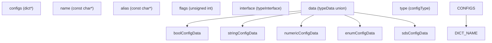
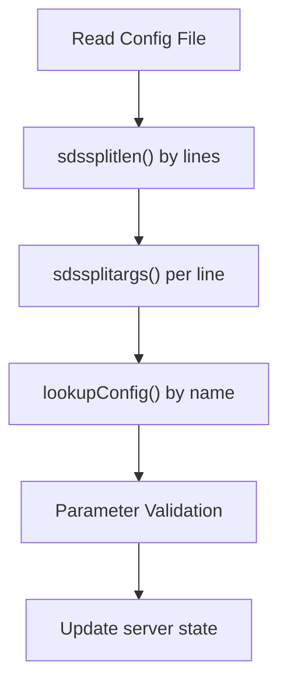
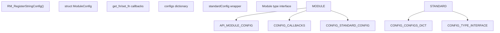

# Configuration Management

Relevant source files

-   [redis.conf](https://github.com/redis/redis/blob/8ad54215/redis.conf)
-   [src/aof.c](https://github.com/redis/redis/blob/8ad54215/src/aof.c)
-   [src/config.c](https://github.com/redis/redis/blob/8ad54215/src/config.c)
-   [src/db.c](https://github.com/redis/redis/blob/8ad54215/src/db.c)
-   [src/debug.c](https://github.com/redis/redis/blob/8ad54215/src/debug.c)
-   [src/module.c](https://github.com/redis/redis/blob/8ad54215/src/module.c)
-   [src/networking.c](https://github.com/redis/redis/blob/8ad54215/src/networking.c)
-   [src/object.c](https://github.com/redis/redis/blob/8ad54215/src/object.c)
-   [src/rdb.c](https://github.com/redis/redis/blob/8ad54215/src/rdb.c)
-   [src/replication.c](https://github.com/redis/redis/blob/8ad54215/src/replication.c)
-   [src/server.c](https://github.com/redis/redis/blob/8ad54215/src/server.c)
-   [src/server.h](https://github.com/redis/redis/blob/8ad54215/src/server.h)
-   [tests/unit/introspection.tcl](https://github.com/redis/redis/blob/8ad54215/tests/unit/introspection.tcl)

This document covers Redis's configuration management system, which handles server settings, runtime parameter management, and configuration persistence. It includes the parsing of configuration files, the `CONFIG` command interface, parameter validation, and the underlying data structures that store configuration state.

For information about command processing and validation, see [Command Processing Pipeline](/redis/redis/2.3-command-processing-pipeline). For details about server initialization and lifecycle, see [Server Architecture and Lifecycle](/redis/redis/2.1-server-architecture-and-lifecycle).

## Architecture Overview

Redis configuration management operates through a multi-layered system that handles configuration from various sources and provides runtime access through commands.

### Configuration System Components

```mermaid
flowchart TD
    CONF_FILE["redis.conf"]
    CLI_ARGS["Command Line Arguments"]
    CONFIG_CMD["CONFIG SET Commands"]
    MODULE_CONFIG["Module Configurations"]
    PARSER["loadServerConfigFromString()"]
    VALIDATOR["Configuration Validators"]
    TYPE_INTERFACE["typeInterface"]
    SERVER_STRUCT["server (global state)"]
    CONFIGS_DICT["configs (dict)"]
    STANDARD_CONFIG["standardConfig structures"]
    CONFIG_GET["CONFIG GET"]
    CONFIG_SET["CONFIG SET"]
    CONFIG_REWRITE["CONFIG REWRITE"]
    INFO_CMD["INFO command"]

    CONF --> FILE_PARSER
    CLI --> ARGS_PARSER
    CONFIG --> CMD_TYPE_INTERFACE
    MODULE --> CONFIG_CONFIGS_DICT
    PARSER --> VALIDATOR
    VALIDATOR --> SERVER_STRUCT
    TYPE --> INTERFACE_VALIDATOR
    SERVER --> STRUCT_CONFIGS_DICT
    CONFIGS --> DICT_STANDARD_CONFIG
    CONFIG --> GET_CONFIGS_DICT
    CONFIG --> SET_TYPE_INTERFACE
    CONFIG --> REWRITE_STANDARD_CONFIG
    INFO --> CMD_SERVER_STRUCT
```


Sources: [src/config.c432-503](https://github.com/redis/redis/blob/8ad54215/src/config.c#L432-L503) [src/server.h79-80](https://github.com/redis/redis/blob/8ad54215/src/server.h#L79-L80) [src/server.c80](https://github.com/redis/redis/blob/8ad54215/src/server.c#L80-L80)

## Configuration Storage

### Global Server State

The primary configuration storage is the global `server` structure defined in `server.h`. This structure contains hundreds of configuration parameters organized by functionality.

```mermaid
flowchart TD
    BASIC["Basic Settingsport, bind_addrdaemonize, pidfile"]
    MEMORY["Memory Managementmaxmemorymaxmemory_policymaxmemory_samples"]
    PERSISTENCE["Persistencesaveparamsaof_staterdb_filename"]
    REPLICATION["Replicationmasterhost, masterportrepl_backlog_sizerepl_timeout"]
    CLUSTER["Clusteringcluster_enabledcluster_config_filecluster_node_timeout"]
    SECURITY["Securityrequirepassprotected_modeacl_filename"]
    SERVER_GLOBAL["extern struct redisServer server"]

    SERVER --> GLOBAL_BASIC
    SERVER --> GLOBAL_MEMORY
    SERVER --> GLOBAL_PERSISTENCE
    SERVER --> GLOBAL_REPLICATION
    SERVER --> GLOBAL_CLUSTER
    SERVER --> GLOBAL_SECURITY
```


Sources: [src/server.h1700-2800](https://github.com/redis/redis/blob/8ad54215/src/server.h#L1700-L2800) [src/server.c80](https://github.com/redis/redis/blob/8ad54215/src/server.c#L80-L80)

### Configuration Dictionary

The `configs` dictionary provides a unified interface for configuration access, mapping configuration names to `standardConfig` structures.


Sources: [src/config.c261-269](https://github.com/redis/redis/blob/8ad54215/src/config.c#L261-L269) [src/config.c271](https://github.com/redis/redis/blob/8ad54215/src/config.c#L271-L271) [src/config.c233-239](https://github.com/redis/redis/blob/8ad54215/src/config.c#L233-L239)

## Configuration Processing Pipeline

### Configuration Loading Process

> **[Mermaid sequence]**
> *(图表结构无法解析)*

Sources: [src/config.c432-503](https://github.com/redis/redis/blob/8ad54215/src/config.c#L432-L503) [src/config.c274-278](https://github.com/redis/redis/blob/8ad54215/src/config.c#L274-L278)

### Configuration Type System

Redis supports several configuration data types, each with specific validation and conversion logic:

| Type | Structure | Purpose | Examples |
| --- | --- | --- | --- |
| `boolConfigData` | Boolean values | Yes/no settings | `daemonize`, `protected-mode` |
| `stringConfigData` | String values | File paths, addresses | `logfile`, `bind` |
| `numericConfigData` | Integer values | Ports, timeouts, limits | `port`, `timeout`, `maxmemory` |
| `enumConfigData` | Enumerated values | Predefined options | `loglevel`, `maxmemory-policy` |
| `sdsConfigData` | SDS string values | Dynamic strings | `save`, `client-output-buffer-limit` |

Sources: [src/config.c170-231](https://github.com/redis/redis/blob/8ad54215/src/config.c#L170-L231)

## Runtime Configuration Management

### CONFIG Commands Implementation

```mermaid
flowchart TD
    CONFIG_CMD["CONFIG Command"]
    GET_HANDLER["configGetCommand()"]
    SET_HANDLER["configSetCommand()"]
    REWRITE_HANDLER["configRewriteCommand()"]
    GET_FUNC["interface.get()"]
    SET_FUNC["interface.set()"]
    REWRITE_FUNC["interface.rewrite()"]
    APPLY_FUNC["interface.apply()"]
    LOOKUP["lookupConfig()"]
    VALIDATE["Parameter Validation"]
    UPDATE["server.* Updates"]

    CONFIG --> CMD_GET_HANDLER
    CONFIG --> CMD_SET_HANDLER
    CONFIG --> CMD_REWRITE_HANDLER
    GET --> HANDLER_GET_FUNC
    SET --> HANDLER_SET_FUNC
    SET --> HANDLER_APPLY_FUNC
    REWRITE --> HANDLER_REWRITE_FUNC
    GET --> FUNC_LOOKUP
    SET --> FUNC_VALIDATE
    VALIDATE --> UPDATE
```


Sources: [src/config.c3500-3600](https://github.com/redis/redis/blob/8ad54215/src/config.c#L3500-L3600) [src/config.c3800-3900](https://github.com/redis/redis/blob/8ad54215/src/config.c#L3800-L3900) [src/config.c244-259](https://github.com/redis/redis/blob/8ad54215/src/config.c#L244-L259)

### Configuration Validation

Each configuration type implements validation through function pointers:

```
typedef struct numericConfigData {
    // ... fields ...
    int (*is_valid_fn)(long long val, const char **err);
} numericConfigData;
```
Common validation patterns include:

-   **Range checking**: Ensuring numeric values fall within acceptable bounds
-   **File path validation**: Verifying file paths are accessible
-   **Enum validation**: Checking values against predefined sets
-   **Format validation**: Ensuring strings match expected patterns

Sources: [src/config.c212-231](https://github.com/redis/redis/blob/8ad54215/src/config.c#L212-L231) [src/config.c167-174](https://github.com/redis/redis/blob/8ad54215/src/config.c#L167-L174)

## Configuration File Processing

### File Format and Parsing

The configuration file format supports:

-   Key-value pairs: `parameter value`
-   Multi-line values with quotes
-   Include directives: `include /path/to/other.conf`
-   Comments starting with `#`
-   Deprecated parameter handling


Sources: [src/config.c447-503](https://github.com/redis/redis/blob/8ad54215/src/config.c#L447-L503) [redis.conf1-50](https://github.com/redis/redis/blob/8ad54215/redis.conf#L1-L50)

## Module Configuration Extensions

Redis modules can register their own configuration parameters through the module API, extending the core configuration system.


Sources: [src/module.c451-475](https://github.com/redis/redis/blob/8ad54215/src/module.c#L451-L475) [src/config.c268](https://github.com/redis/redis/blob/8ad54215/src/config.c#L268-L268)

## Configuration Persistence

### CONFIG REWRITE Implementation

The `CONFIG REWRITE` command regenerates the configuration file with current runtime values, preserving comments and structure while updating changed parameters.

Key features:

-   Preserves original file structure and comments
-   Updates only modified parameters
-   Handles complex multi-value configurations
-   Maintains backup of original file

Sources: [src/config.c4200-4400](https://github.com/redis/redis/blob/8ad54215/src/config.c#L4200-L4400) [src/config.c258](https://github.com/redis/redis/blob/8ad54215/src/config.c#L258-L258)

The configuration management system provides a robust foundation for Redis's extensive configurability while maintaining backward compatibility and extensibility for modules and future enhancements.
