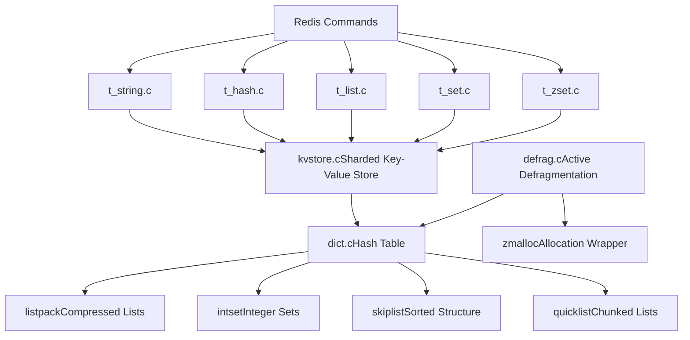
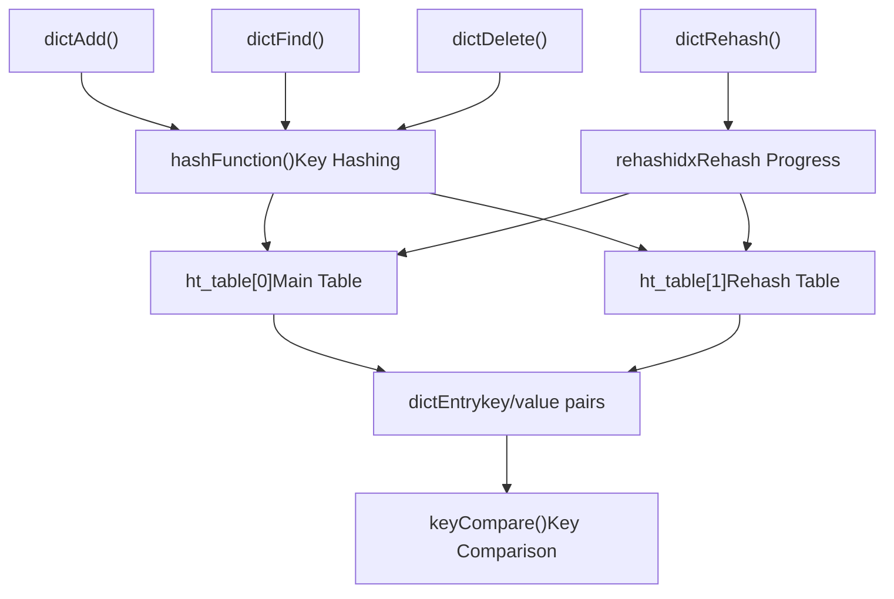

# Data Storage and Management

Relevant source files

-   [src/defrag.c](https://github.com/redis/redis/blob/8ad54215/src/defrag.c)
-   [src/dict.c](https://github.com/redis/redis/blob/8ad54215/src/dict.c)
-   [src/dict.h](https://github.com/redis/redis/blob/8ad54215/src/dict.h)
-   [src/iothread.c](https://github.com/redis/redis/blob/8ad54215/src/iothread.c)
-   [src/kvstore.c](https://github.com/redis/redis/blob/8ad54215/src/kvstore.c)
-   [src/kvstore.h](https://github.com/redis/redis/blob/8ad54215/src/kvstore.h)
-   [src/t\_hash.c](https://github.com/redis/redis/blob/8ad54215/src/t_hash.c)
-   [src/t\_list.c](https://github.com/redis/redis/blob/8ad54215/src/t_list.c)
-   [src/t\_set.c](https://github.com/redis/redis/blob/8ad54215/src/t_set.c)
-   [src/t\_string.c](https://github.com/redis/redis/blob/8ad54215/src/t_string.c)
-   [src/t\_zset.c](https://github.com/redis/redis/blob/8ad54215/src/t_zset.c)
-   [tests/README.md](https://github.com/redis/redis/blob/8ad54215/tests/README.md)
-   [tests/unit/info-keysizes.tcl](https://github.com/redis/redis/blob/8ad54215/tests/unit/info-keysizes.tcl)
-   [tests/unit/info.tcl](https://github.com/redis/redis/blob/8ad54215/tests/unit/info.tcl)
-   [tests/unit/keyspace.tcl](https://github.com/redis/redis/blob/8ad54215/tests/unit/keyspace.tcl)
-   [tests/unit/memefficiency.tcl](https://github.com/redis/redis/blob/8ad54215/tests/unit/memefficiency.tcl)
-   [tests/unit/networking.tcl](https://github.com/redis/redis/blob/8ad54215/tests/unit/networking.tcl)
-   [tests/unit/obuf-limits.tcl](https://github.com/redis/redis/blob/8ad54215/tests/unit/obuf-limits.tcl)
-   [tests/unit/shutdown.tcl](https://github.com/redis/redis/blob/8ad54215/tests/unit/shutdown.tcl)
-   [tests/unit/type/hash.tcl](https://github.com/redis/redis/blob/8ad54215/tests/unit/type/hash.tcl)
-   [tests/unit/type/incr.tcl](https://github.com/redis/redis/blob/8ad54215/tests/unit/type/incr.tcl)
-   [tests/unit/type/list.tcl](https://github.com/redis/redis/blob/8ad54215/tests/unit/type/list.tcl)
-   [tests/unit/type/set.tcl](https://github.com/redis/redis/blob/8ad54215/tests/unit/type/set.tcl)
-   [tests/unit/type/string.tcl](https://github.com/redis/redis/blob/8ad54215/tests/unit/type/string.tcl)
-   [tests/unit/type/zset.tcl](https://github.com/redis/redis/blob/8ad54215/tests/unit/type/zset.tcl)

This document provides an overview of Redis's core data storage architecture, focusing on the fundamental mechanisms and abstractions that underlie all data operations. It covers the key-value storage infrastructure, data type encoding strategies, and memory management approaches that enable Redis's high-performance data handling.

For detailed implementation of specific data types (strings, hashes, lists, sets, sorted sets), see [Core Data Types Implementation](/redis/redis/3.1-core-data-types-implementation). For memory-efficient encoding details, see [Memory-Efficient Data Structures](/redis/redis/3.4-memory-efficient-data-structures). For the underlying dictionary implementation, see [Dictionary and Key-Value Store](/redis/redis/3.5-dictionary-and-key-value-store).

## Storage Architecture Overview

Redis implements a layered storage architecture where multiple encoding strategies are used to optimize memory usage and performance for different data patterns. The core principle is to use the most memory-efficient encoding possible for each data structure based on size and content characteristics.

**Core Storage Architecture**

Sources: [src/t\_string.c1-1000](https://github.com/redis/redis/blob/8ad54215/src/t_string.c#L1-L1000) [src/t\_hash.c1-1000](https://github.com/redis/redis/blob/8ad54215/src/t_hash.c#L1-L1000) [src/t\_list.c1-1000](https://github.com/redis/redis/blob/8ad54215/src/t_list.c#L1-L1000) [src/t\_set.c1-1000](https://github.com/redis/redis/blob/8ad54215/src/t_set.c#L1-L1000) [src/t\_zset.c1-1000](https://github.com/redis/redis/blob/8ad54215/src/t_zset.c#L1-L1000) [src/kvstore.c1-100](https://github.com/redis/redis/blob/8ad54215/src/kvstore.c#L1-L100) [src/dict.c1-100](https://github.com/redis/redis/blob/8ad54215/src/dict.c#L1-L100) [src/defrag.c1-100](https://github.com/redis/redis/blob/8ad54215/src/defrag.c#L1-L100)

## Core Storage Abstractions

### Dictionary Infrastructure

The `dict` structure serves as the fundamental hash table implementation underlying most Redis data structures. It provides O(1) average-case operations with incremental rehashing to maintain performance.

**Dictionary Operations Flow**

Sources: [src/dict.c190-500](https://github.com/redis/redis/blob/8ad54215/src/dict.c#L190-L500) [src/dict.h53-120](https://github.com/redis/redis/blob/8ad54215/src/dict.h#L53-L120)

### KV Store Sharding

The `kvstore` abstraction provides an array of dictionaries to enable efficient sharding of keys. This is particularly useful for Redis Cluster where keys are distributed across hash slots.

| Component | Purpose | Key Functions |
| --- | --- | --- |
| `kvstore` | Sharded key-value store | `kvstoreAdd()`, `kvstoreFind()`, `kvstoreDelete()` |
| `kvstoreDictIterator` | Iterator across shards | `kvstoreDictIteratorStart()`, `kvstoreDictIteratorNext()` |
| `kvstoreIterator` | Key-level iteration | `kvstoreIteratorInit()`, `kvstoreIteratorNext()` |

Sources: [src/kvstore.c37-100](https://github.com/redis/redis/blob/8ad54215/src/kvstore.c#L37-L100) [src/kvstore.h15-50](https://github.com/redis/redis/blob/8ad54215/src/kvstore.h#L15-L50)

## Data Type Encoding Strategies

Redis employs multiple encoding strategies per data type, automatically selecting the most memory-efficient option based on data characteristics:

**Encoding Selection Matrix**

```mermaid
flowchart TD
    STR_RAW["OBJ_ENCODING_RAWsds string"]
    STR_INT["OBJ_ENCODING_INTlong integer"]
    STR_EMBSTR["OBJ_ENCODING_EMBSTRembedded string"]
    HASH_LISTPACK["OBJ_ENCODING_LISTPACKCompact key-value pairs"]
    HASH_HT["OBJ_ENCODING_HTdict hash table"]
    HASH_LISTPACK_EX["OBJ_ENCODING_LISTPACK_EXWith field expiration"]
    LIST_LISTPACK["OBJ_ENCODING_LISTPACKSingle compressed node"]
    LIST_QUICKLIST["OBJ_ENCODING_QUICKLISTLinked listpack nodes"]
    SET_INTSET["OBJ_ENCODING_INTSETInteger-only sets"]
    SET_LISTPACK["OBJ_ENCODING_LISTPACKSmall string sets"]
    SET_HT["OBJ_ENCODING_HTHash table"]
    ZSET_LISTPACK["OBJ_ENCODING_LISTPACKSmall sorted sets"]
    ZSET_SKIPLIST["OBJ_ENCODING_SKIPLISTskiplist + dict"]
    SIZE_LIMIT["Size Thresholdsmax-*-entries"]
    VALUE_LIMIT["Value Thresholdsmax-*-value"]
    TYPE_CONSTRAINT["Type Constraintsintegers only"]

    SIZE --> LIMIT_HASH_LISTPACK
    SIZE --> LIMIT_LIST_LISTPACK
    SIZE --> LIMIT_SET_LISTPACK
    SIZE --> LIMIT_ZSET_LISTPACK
    VALUE --> LIMIT_HASH_LISTPACK
    VALUE --> LIMIT_LIST_LISTPACK
    VALUE --> LIMIT_SET_LISTPACK
    VALUE --> LIMIT_ZSET_LISTPACK
    TYPE --> CONSTRAINT_STR_INT
    TYPE --> CONSTRAINT_SET_INTSET
```

Sources: [src/t\_hash.c606-635](https://github.com/redis/redis/blob/8ad54215/src/t_hash.c#L606-L635) [src/t\_list.c40-55](https://github.com/redis/redis/blob/8ad54215/src/t_list.c#L40-L55) [src/t\_set.c31-52](https://github.com/redis/redis/blob/8ad54215/src/t_set.c#L31-L52) [src/t\_zset.c20-42](https://github.com/redis/redis/blob/8ad54215/src/t_zset.c#L20-L42)

## Memory Management and Optimization

### Active Defragmentation

Redis includes an active defragmentation system that relocates memory allocations to reduce external fragmentation. The defragmentation process operates in stages with bounded latency.

**Defragmentation Process Flow**

Sources: [src/defrag.c25-75](https://github.com/redis/redis/blob/8ad54215/src/defrag.c#L25-L75) [src/defrag.c140-170](https://github.com/redis/redis/blob/8ad54215/src/defrag.c#L140-L170) [src/defrag.c325-400](https://github.com/redis/redis/blob/8ad54215/src/defrag.c#L325-L400)

### Encoding Conversion Triggers

Data structures automatically convert between encodings when thresholds are exceeded:

| Data Type | Small Encoding | Large Encoding | Conversion Trigger |
| --- | --- | --- | --- |
| Hash | `OBJ_ENCODING_LISTPACK` | `OBJ_ENCODING_HT` | `hash-max-listpack-entries`/`hash-max-listpack-value` |
| List | `OBJ_ENCODING_LISTPACK` | `OBJ_ENCODING_QUICKLIST` | `list-max-listpack-size` |
| Set | `OBJ_ENCODING_INTSET`/`OBJ_ENCODING_LISTPACK` | `OBJ_ENCODING_HT` | `set-max-intset-entries`/`set-max-listpack-entries` |
| ZSet | `OBJ_ENCODING_LISTPACK` | `OBJ_ENCODING_SKIPLIST` | `zset-max-listpack-entries`/`zset-max-listpack-value` |

Sources: [src/t\_hash.c606-635](https://github.com/redis/redis/blob/8ad54215/src/t_hash.c#L606-L635) [src/t\_list.c23-56](https://github.com/redis/redis/blob/8ad54215/src/t_list.c#L23-L56) [src/t\_set.c46-52](https://github.com/redis/redis/blob/8ad54215/src/t_set.c#L46-L52) [tests/unit/type/zset.tcl100-117](https://github.com/redis/redis/blob/8ad54215/tests/unit/type/zset.tcl#L100-L117)

## Key-Value Operations

### Operation Dispatch

Redis commands are dispatched through the data type implementation files, which handle encoding-specific operations:

**Command Processing Flow**

Sources: [src/t\_hash.c1200-1300](https://github.com/redis/redis/blob/8ad54215/src/t_hash.c#L1200-L1300) [src/t\_list.c364-385](https://github.com/redis/redis/blob/8ad54215/src/t_list.c#L364-L385) [src/t\_set.c100-120](https://github.com/redis/redis/blob/8ad54215/src/t_set.c#L100-L120) [src/t\_zset.c1200-1400](https://github.com/redis/redis/blob/8ad54215/src/t_zset.c#L1200-L1400)

### Storage Efficiency

The layered encoding approach provides significant memory savings. For example, hash fields can be stored in listpack format with only 2 bytes overhead per field when no TTL is set, compared to the full `dictEntry` structure overhead in hash table encoding.

Memory efficiency testing shows that Redis achieves 75-82% efficiency for larger values (1-16KB range), demonstrating the effectiveness of the encoding strategy optimizations.

Sources: [tests/unit/memefficiency.tcl15-51](https://github.com/redis/redis/blob/8ad54215/tests/unit/memefficiency.tcl#L15-L51) [src/t\_hash.c295-310](https://github.com/redis/redis/blob/8ad54215/src/t_hash.c#L295-L310)
