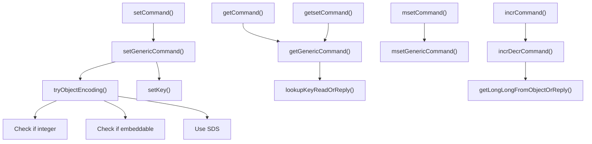
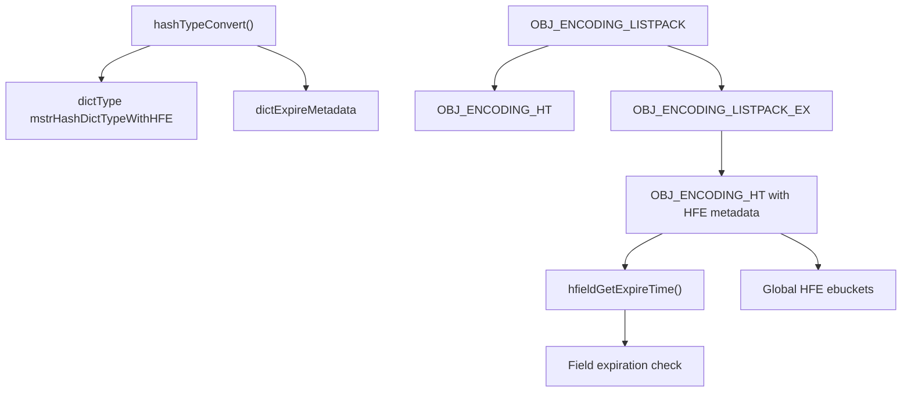
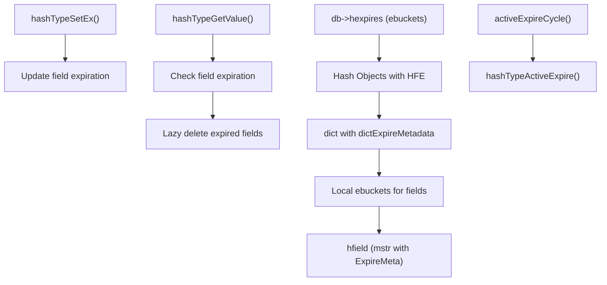
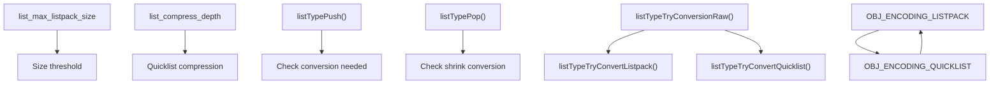
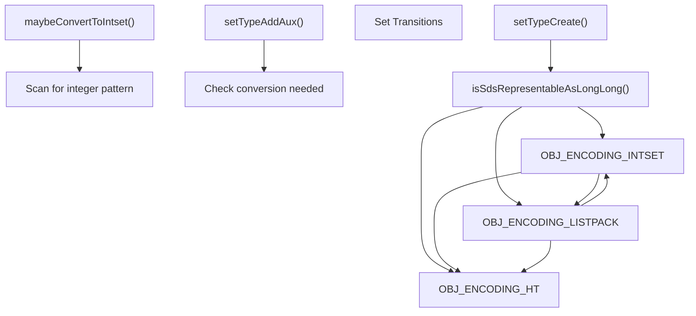
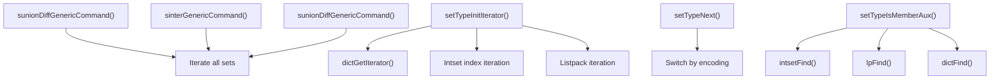
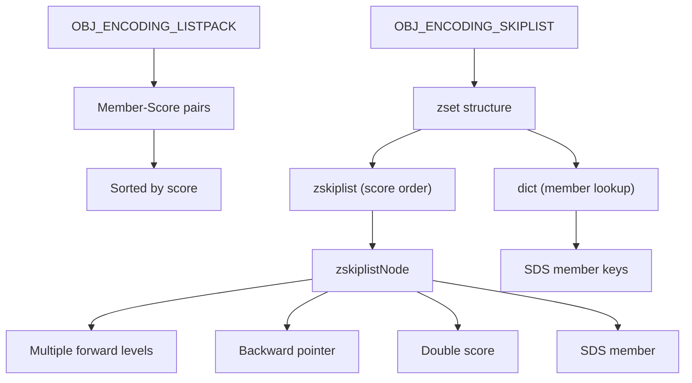
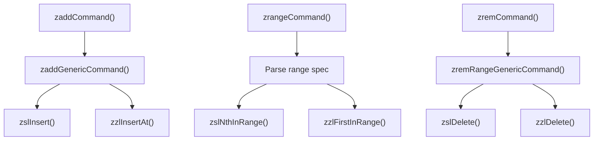
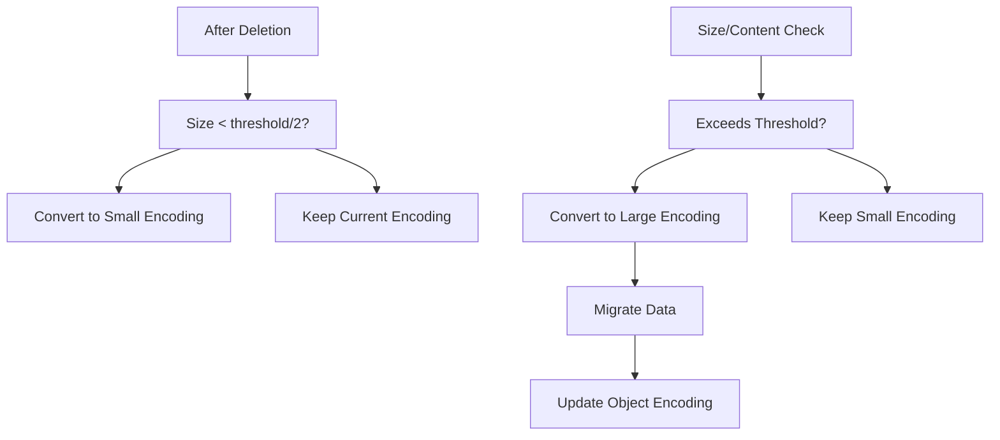

# Core Data Types Implementation

Relevant source files

-   [src/t\_hash.c](https://github.com/redis/redis/blob/8ad54215/src/t_hash.c)
-   [src/t\_list.c](https://github.com/redis/redis/blob/8ad54215/src/t_list.c)
-   [src/t\_set.c](https://github.com/redis/redis/blob/8ad54215/src/t_set.c)
-   [src/t\_string.c](https://github.com/redis/redis/blob/8ad54215/src/t_string.c)
-   [src/t\_zset.c](https://github.com/redis/redis/blob/8ad54215/src/t_zset.c)
-   [tests/README.md](https://github.com/redis/redis/blob/8ad54215/tests/README.md)
-   [tests/unit/keyspace.tcl](https://github.com/redis/redis/blob/8ad54215/tests/unit/keyspace.tcl)
-   [tests/unit/type/hash.tcl](https://github.com/redis/redis/blob/8ad54215/tests/unit/type/hash.tcl)
-   [tests/unit/type/incr.tcl](https://github.com/redis/redis/blob/8ad54215/tests/unit/type/incr.tcl)
-   [tests/unit/type/list.tcl](https://github.com/redis/redis/blob/8ad54215/tests/unit/type/list.tcl)
-   [tests/unit/type/set.tcl](https://github.com/redis/redis/blob/8ad54215/tests/unit/type/set.tcl)
-   [tests/unit/type/string.tcl](https://github.com/redis/redis/blob/8ad54215/tests/unit/type/string.tcl)
-   [tests/unit/type/zset.tcl](https://github.com/redis/redis/blob/8ad54215/tests/unit/type/zset.tcl)

This document covers the implementation details of Redis's five core data types: strings, hashes, lists, sets, and sorted sets (ZSETs). It focuses on the internal encodings, memory optimization strategies, and conversion mechanisms that allow each data type to efficiently handle both small and large datasets.

For information about memory management and eviction policies, see [Memory Management](/redis/redis/4-memory-management). For details about the underlying memory-efficient structures like listpack and intset, see [Memory-Efficient Data Structures](/redis/redis/3.4-memory-efficient-data-structures).

## Overview and Encoding Strategy

Redis implements each core data type using multiple internal encodings that are transparently switched based on size thresholds and content characteristics. This dual-encoding approach optimizes memory usage for small collections while maintaining performance for larger ones.

### Core Data Type Encodings

```mermaid
flowchart TD
    ZSET["OBJ_ZSET"]
    ZSET_LP["OBJ_ENCODING_LISTPACK"]
    ZSET_SKIPLIST["OBJ_ENCODING_SKIPLIST"]
    SET["OBJ_SET"]
    SET_INTSET["OBJ_ENCODING_INTSET"]
    SET_LP["OBJ_ENCODING_LISTPACK"]
    SET_HT["OBJ_ENCODING_HT"]
    LIST["OBJ_LIST"]
    LIST_LP["OBJ_ENCODING_LISTPACK"]
    LIST_QL["OBJ_ENCODING_QUICKLIST"]
    HASH["OBJ_HASH"]
    HASH_LP["OBJ_ENCODING_LISTPACK"]
    HASH_LPEX["OBJ_ENCODING_LISTPACK_EX"]
    HASH_HT["OBJ_ENCODING_HT"]
    STR["OBJ_STRING"]
    STR_RAW["OBJ_ENCODING_RAW"]
    STR_INT["OBJ_ENCODING_INT"]
    STR_EMBSTR["OBJ_ENCODING_EMBSTR"]

    ZSET --> ZSET_LP
    ZSET --> ZSET_SKIPLIST
    SET --> SET_INTSET
    SET --> SET_LP
    SET --> SET_HT
    LIST --> LIST_LP
    LIST --> LIST_QL
    HASH --> HASH_LP
    HASH --> HASH_LPEX
    HASH --> HASH_HT
    STR --> STR_RAW
    STR --> STR_INT
    STR --> STR_EMBSTR
```

Sources: [src/t\_string.c1-700](https://github.com/redis/redis/blob/8ad54215/src/t_string.c#L1-L700) [src/t\_hash.c1-150](https://github.com/redis/redis/blob/8ad54215/src/t_hash.c#L1-L150) [src/t\_list.c1-100](https://github.com/redis/redis/blob/8ad54215/src/t_list.c#L1-L100) [src/t\_set.c1-50](https://github.com/redis/redis/blob/8ad54215/src/t_set.c#L1-L50) [src/t\_zset.c1-100](https://github.com/redis/redis/blob/8ad54215/src/t_zset.c#L1-L100)

## String Implementation

Redis strings support three encodings optimized for different use cases:

-   **`OBJ_ENCODING_INT`**: For integers that fit in a `long`
-   **`OBJ_ENCODING_EMBSTR`**: For short strings embedded in the object structure
-   **`OBJ_ENCODING_RAW`**: For longer strings using SDS (Simple Dynamic Strings)

### String Command Processing

The `setGenericCommand()` function handles SET variants with options like NX/XX, EX/PX for expiration, and GET for atomic get-and-set operations.

Sources: [src/t\_string.c73-149](https://github.com/redis/redis/blob/8ad54215/src/t_string.c#L73-L149) [src/t\_string.c294-305](https://github.com/redis/redis/blob/8ad54215/src/t_string.c#L294-L305) [src/t\_string.c322-334](https://github.com/redis/redis/blob/8ad54215/src/t_string.c#L322-L334)

## Hash Implementation

Hash tables in Redis use a sophisticated multi-encoding approach with support for Hash Field Expiration (HFE):

### Hash Encoding Transitions

The `listpackEx` structure extends regular listpack encoding to support per-field TTL values, maintaining field ordering by expiration time for efficient cleanup.

### Hash Field Expiration Architecture

Sources: [src/t\_hash.c116-130](https://github.com/redis/redis/blob/8ad54215/src/t_hash.c#L116-L130) [src/t\_hash.c181-230](https://github.com/redis/redis/blob/8ad54215/src/t_hash.c#L181-L230) [src/t\_hash.c299-436](https://github.com/redis/redis/blob/8ad54215/src/t_hash.c#L299-L436)

## List Implementation

Lists use two encodings based on size and configuration:

-   **`OBJ_ENCODING_LISTPACK`**: Memory-efficient for small lists
-   **`OBJ_ENCODING_QUICKLIST`**: Hybrid structure of listpacks for larger lists

### List Conversion Strategy

The conversion system uses different strategies for growing vs. shrinking to avoid oscillation between encodings.

Sources: [src/t\_list.c23-56](https://github.com/redis/redis/blob/8ad54215/src/t_list.c#L23-L56) [src/t\_list.c67-95](https://github.com/redis/redis/blob/8ad54215/src/t_list.c#L67-L95) [src/t\_list.c112-139](https://github.com/redis/redis/blob/8ad54215/src/t_list.c#L112-L139)

## Set Implementation

Sets employ three encodings optimized for different data patterns:

### Set Encoding Selection

The `maybeConvertToIntset()` function can convert hash table or listpack sets back to intsets if all elements are discovered to be integers.

### Set Operations Implementation

Sources: [src/t\_set.c31-52](https://github.com/redis/redis/blob/8ad54215/src/t_set.c#L31-L52) [src/t\_set.c110-215](https://github.com/redis/redis/blob/8ad54215/src/t_set.c#L110-L215) [src/t\_set.c311-382](https://github.com/redis/redis/blob/8ad54215/src/t_set.c#L311-L382)

## Sorted Set (ZSet) Implementation

Sorted sets use dual data structures for different access patterns:

### ZSet Dual Structure Design

The skiplist implementation provides O(log N) operations while maintaining the same SDS strings in both dict and skiplist for memory efficiency.

### ZSet Operations Flow

Sources: [src/t\_zset.c20-42](https://github.com/redis/redis/blob/8ad54215/src/t_zset.c#L20-L42) [src/t\_zset.c58-177](https://github.com/redis/redis/blob/8ad54215/src/t_zset.c#L58-L177) [src/t\_zset.c769-1300](https://github.com/redis/redis/blob/8ad54215/src/t_zset.c#L769-L1300)

## Encoding Conversion Mechanisms

All data types implement threshold-based conversion systems that monitor size and content to determine optimal encoding:

### Conversion Decision Matrix

| Data Type | Small Encoding | Threshold Configs | Large Encoding | Trigger Conditions |
| --- | --- | --- | --- | --- |
| String | `INT`/`EMBSTR` | `N/A` | `RAW` | Length, numeric content |
| Hash | `LISTPACK` | `hash_max_listpack_entries/value` | `HT` | Entry count, field size |
| List | `LISTPACK` | `list_max_listpack_size` | `QUICKLIST` | Total size, entry count |
| Set | `INTSET`/`LISTPACK` | `set_max_intset_entries`, `set_max_listpack_entries` | `HT` | Entry count, content type |
| ZSet | `LISTPACK` | `zset_max_listpack_entries/value` | `SKIPLIST` | Entry count, member size |

### Common Conversion Pattern

The shrinking threshold is typically half the growing threshold to prevent oscillation between encodings due to frequent size changes around the boundary.

Sources: [src/t\_hash.c606-635](https://github.com/redis/redis/blob/8ad54215/src/t_hash.c#L606-L635) [src/t\_list.c67-95](https://github.com/redis/redis/blob/8ad54215/src/t_list.c#L67-L95) [src/t\_set.c46-67](https://github.com/redis/redis/blob/8ad54215/src/t_set.c#L46-L67)
