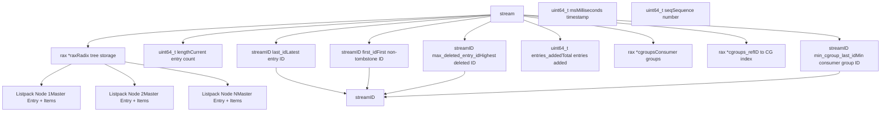
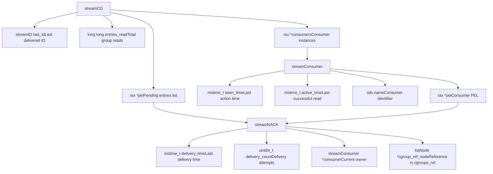
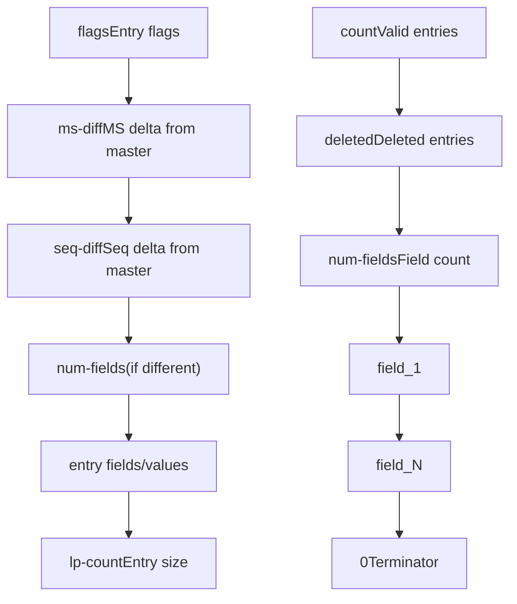
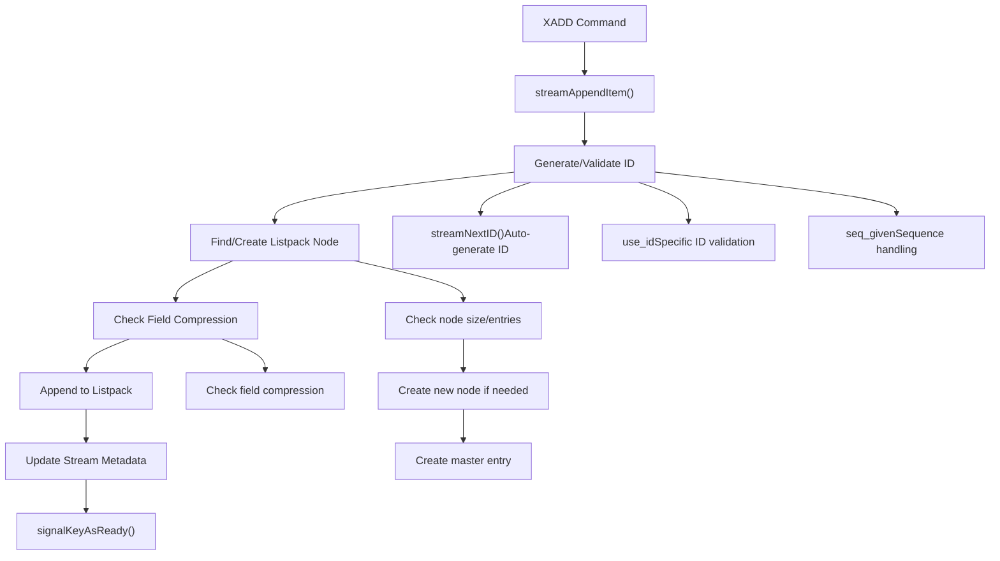
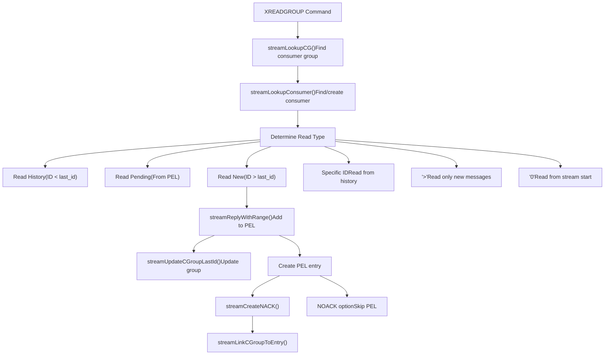
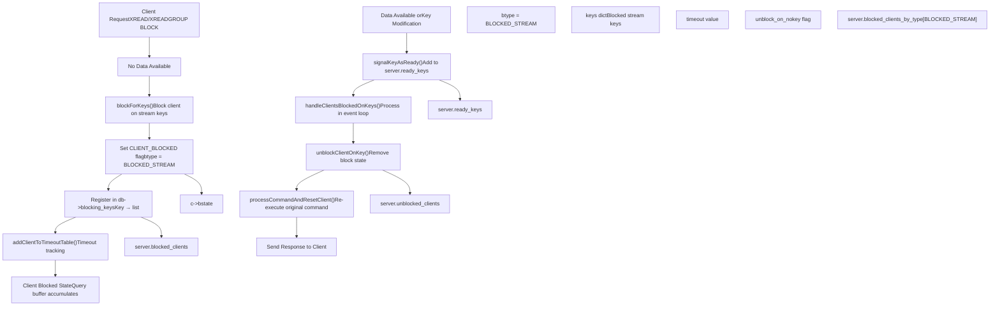
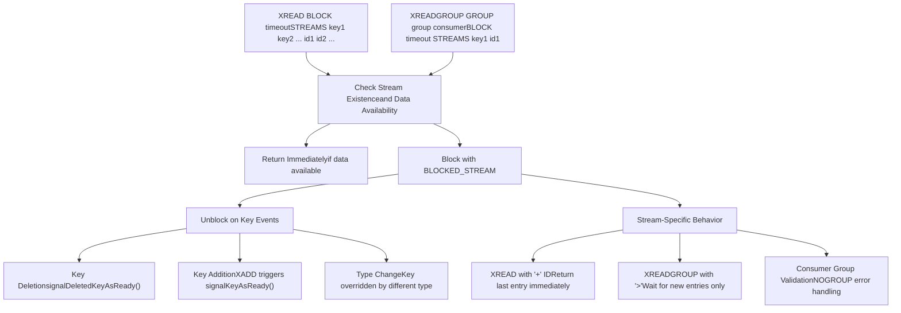
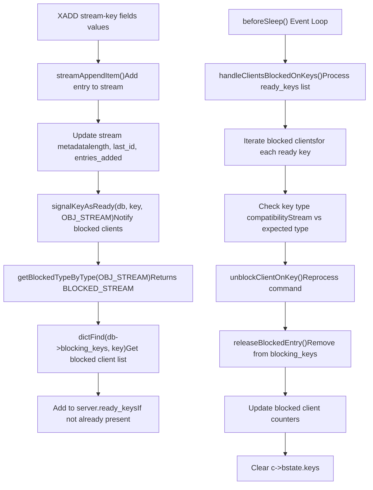
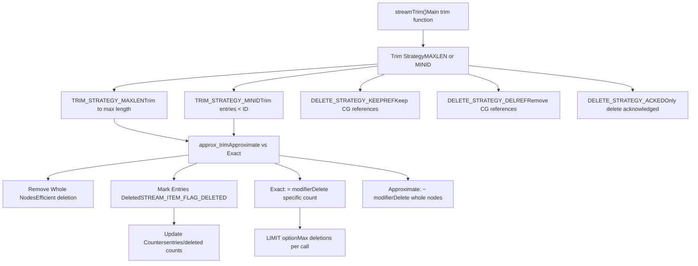
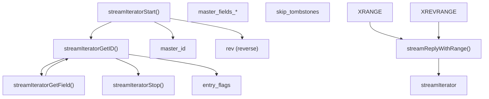

# Streams and Blocking Operations

Relevant source files

-   [src/blocked.c](https://github.com/redis/redis/blob/8ad54215/src/blocked.c)
-   [src/stream.h](https://github.com/redis/redis/blob/8ad54215/src/stream.h)
-   [src/t\_stream.c](https://github.com/redis/redis/blob/8ad54215/src/t_stream.c)
-   [tests/unit/type/stream-cgroups.tcl](https://github.com/redis/redis/blob/8ad54215/tests/unit/type/stream-cgroups.tcl)
-   [tests/unit/type/stream.tcl](https://github.com/redis/redis/blob/8ad54215/tests/unit/type/stream.tcl)

Streams are a Redis data type that implements an append-only log with consumer group capabilities and sophisticated blocking operation support. They provide time-series-like functionality with efficient range queries, message delivery guarantees, and client blocking mechanisms that enable real-time data processing. The implementation combines a radix tree (`rax`) with compressed listpacks for efficient storage, integrated with Redis's generic blocking client system for responsive event-driven operations.

The blocking operations system allows clients to efficiently wait for new data across multiple stream keys, with automatic unblocking when entries are added, keys are deleted, or timeouts occur. This integration enables Redis streams to serve as both a persistent log and a real-time message delivery system.

For information about other data types like lists and sorted sets, see page 3.1. For details about persistence of stream data, see page 7.

## Core Architecture and Data Structures

### Stream Data Structure Overview

Sources: [src/stream.h16-27](https://github.com/redis/redis/blob/8ad54215/src/stream.h#L16-L27) [src/stream.h11-14](https://github.com/redis/redis/blob/8ad54215/src/stream.h#L11-L14) [src/t\_stream.c51-68](https://github.com/redis/redis/blob/8ad54215/src/t_stream.c#L51-L68)

The `stream` structure uses a radix tree (`rax`) to store entries in listpacks, providing efficient range queries and memory compression. Each stream maintains metadata about its boundaries (`first_id`, `last_id`), deletion state (`max_deleted_entry_id`), and consumer group tracking. The `streamID` is a 128-bit identifier composed of a millisecond timestamp and a sequence number.

### Consumer Group Architecture

Sources: [src/stream.h57-76](https://github.com/redis/redis/blob/8ad54215/src/stream.h#L57-L76) [src/stream.h78-92](https://github.com/redis/redis/blob/8ad54215/src/stream.h#L78-L92) [src/stream.h95-101](https://github.com/redis/redis/blob/8ad54215/src/stream.h#L95-L101)

Consumer groups enable multiple consumers to process stream entries with delivery guarantees. The Pending Entries List (PEL) tracks unacknowledged messages at both group and consumer levels. Each `streamNACK` represents a message delivered but not yet acknowledged, with tracking for delivery time, count, and consumer ownership. The `cgroup_ref_node` provides a reference to the entry in the stream's `cgroups_ref` index for efficient lookup.

## Stream Entry Storage and Compression

### Listpack Encoding Structure

Sources: [src/t\_stream.c14-19](https://github.com/redis/redis/blob/8ad54215/src/t_stream.c#L14-L19) [src/t\_stream.c490-520](https://github.com/redis/redis/blob/8ad54215/src/t_stream.c#L490-L520) [src/t\_stream.c601-652](https://github.com/redis/redis/blob/8ad54215/src/t_stream.c#L601-L652)

Stream entries are stored in listpacks with compression. Each listpack node contains:

1.  A master entry that defines common fields for all entries in the node
2.  Multiple stream entries that store deltas from the master entry

The entry flags include:

-   `STREAM_ITEM_FLAG_NONE` (0): No special flags
-   `STREAM_ITEM_FLAG_DELETED` (1<<0): Entry is deleted (tombstone)
-   `STREAM_ITEM_FLAG_SAMEFIELDS` (1<<1): Entry has the same fields as the master entry

When the `SAMEFIELDS` flag is set, the entry omits the field names and field count, storing only values, which provides significant memory savings when entries have consistent schemas.

## Core Stream Operations

### Stream Addition Flow (XADD)

Sources: [src/t\_stream.c420-662](https://github.com/redis/redis/blob/8ad54215/src/t_stream.c#L420-L662) [src/t\_stream.c130-139](https://github.com/redis/redis/blob/8ad54215/src/t_stream.c#L130-L139)

The `streamAppendItem()` function (called by `XADD`) handles:

1.  ID generation or validation:

    -   Auto-generated IDs via `streamNextID()`
    -   User-provided IDs with validation
    -   Sequence number handling with `seq_given` flag
2.  Listpack node management:

    -   Checks if current node can fit new entry based on `stream_node_max_bytes` and `stream_node_max_entries`
    -   Creates new nodes when needed with master entry
3.  Field compression:

    -   Checks if entry fields match master entry fields
    -   Sets `STREAM_ITEM_FLAG_SAMEFIELDS` flag for compression
4.  Stream metadata updates:

    -   Updates `length`, `entries_added`, `first_id`, and `last_id`
    -   Signals blocked clients via `signalKeyAsReady()`

### Consumer Group Read Flow (XREADGROUP)

Sources: [src/t\_stream.c3000-3300](https://github.com/redis/redis/blob/8ad54215/src/t_stream.c#L3000-L3300) [tests/unit/type/stream-cgroups.tcl46-74](https://github.com/redis/redis/blob/8ad54215/tests/unit/type/stream-cgroups.tcl#L46-L74) [tests/unit/type/stream-cgroups.tcl180-204](https://github.com/redis/redis/blob/8ad54215/tests/unit/type/stream-cgroups.tcl#L180-L204)

The `XREADGROUP` command implements consumer group reads with three main scenarios:

1.  **New Messages (ID = `>`)**:

    -   Reads messages newer than the group's `last_id`
    -   Adds entries to the Pending Entries List (PEL)
    -   Updates the consumer group's `last_id`
2.  **History (Specific ID)**:

    -   Reads messages from a specific point in the stream
    -   Useful for replaying history or recovering from failures
3.  **Pending Messages (From PEL)**:

    -   Retrieves messages already delivered but not yet acknowledged
    -   Allows consumers to reprocess messages they failed to handle

The `NOACK` option can be used to skip adding entries to the PEL, which is useful for read-only operations or when acknowledgment isn't needed.

## Client Blocking Operations System

### Blocking Client Lifecycle

Sources: [src/blocked.c17-46](https://github.com/redis/redis/blob/8ad54215/src/blocked.c#L17-L46) [src/blocked.c61-86](https://github.com/redis/redis/blob/8ad54215/src/blocked.c#L61-L86) [src/blocked.c387-437](https://github.com/redis/redis/blob/8ad54215/src/blocked.c#L387-L437) [src/blocked.c659-700](https://github.com/redis/redis/blob/8ad54215/src/blocked.c#L659-L700)

The blocking operations system enables efficient waiting for stream data through a sophisticated client state management system:

1.  **Blocking Registration**:

    -   `blockForKeys()` registers clients on specific stream keys with `BLOCKED_STREAM` type
    -   Clients are added to per-database `blocking_keys` dictionary for efficient lookup
    -   Global counters track blocked client statistics by type
2.  **State Management**:

    -   `CLIENT_BLOCKED` flag prevents command processing during blocked state
    -   Query buffer accumulates commands while blocked
    -   Timeout management through `addClientToTimeoutTable()`
3.  **Unblocking Process**:

    -   Stream modifications trigger `signalKeyAsReady()` to queue keys in `server.ready_keys`
    -   `handleClientsBlockedOnKeys()` processes ready keys in the event loop
    -   Commands are reprocessed atomically with `CLIENT_REEXECUTING_COMMAND` flag

### Stream-Specific Blocking Features

Sources: [tests/unit/type/stream-cgroups.tcl221-285](https://github.com/redis/redis/blob/8ad54215/tests/unit/type/stream-cgroups.tcl#L221-L285) [tests/unit/type/stream.tcl422-480](https://github.com/redis/redis/blob/8ad54215/tests/unit/type/stream.tcl#L422-L480) [src/blocked.c570-576](https://github.com/redis/redis/blob/8ad54215/src/blocked.c#L570-L576)

Stream blocking operations have specialized behavior:

1.  **Key State Changes**:

    -   `unblock_on_nokey` flag enables unblocking when keys are deleted or change type
    -   XREADGROUP operations unblock with `NOGROUP` error when groups are destroyed
    -   Type changes (e.g., SET overriding stream) trigger `WRONGTYPE` errors
2.  **Stream-Specific IDs**:

    -   `XREAD` with `+` ID returns the last entry immediately if stream is non-empty
    -   `XREADGROUP` with `>` ID waits only for new entries beyond the group's `last_id`
    -   Consumer group validation occurs during unblocking
3.  **Error Handling**:

    -   Blocked clients can be unblocked with errors (timeout, key deletion, type change)
    -   `updateStatsOnUnblock()` ensures command statistics are properly recorded

### Integration with Stream Operations

Sources: [src/blocked.c475-522](https://github.com/redis/redis/blob/8ad54215/src/blocked.c#L475-L522) [src/blocked.c535-568](https://github.com/redis/redis/blob/8ad54215/src/blocked.c#L535-L568) [src/blocked.c581-616](https://github.com/redis/redis/blob/8ad54215/src/blocked.c#L581-L616) [src/t\_stream.c420-662](https://github.com/redis/redis/blob/8ad54215/src/t_stream.c#L420-L662)

Stream operations integrate seamlessly with the blocking system:

1.  **Signal Generation**:

    -   `XADD` operations call `signalKeyAsReady()` after successful entry addition
    -   `signalDeletedKeyAsReady()` handles key deletion scenarios
    -   Type checking ensures only appropriate clients are unblocked
2.  **Client Processing**:

    -   `handleClientsBlockedOnKeys()` runs in `beforeSleep()` for efficient batch processing
    -   Fairness is maintained by processing clients in FIFO order per key
    -   Recursive unblocking is prevented with `in_handling_blocked_clients` flag
3.  **State Cleanup**:

    -   `releaseBlockedEntry()` removes clients from blocking key mappings
    -   Reference counting ensures proper cleanup of `blocking_keys_unblock_on_nokey`
    -   Statistics are updated to reflect unblocked client state changes

This integrated system enables Redis streams to provide responsive, event-driven data processing while maintaining consistency and performance across concurrent operations.

## Stream Management and Maintenance

### Trimming and Memory Management

Sources: [src/t\_stream.c686-699](https://github.com/redis/redis/blob/8ad54215/src/t_stream.c#L686-L699) [src/t\_stream.c724-914](https://github.com/redis/redis/blob/8ad54215/src/t_stream.c#L724-L914) [src/t\_stream.c917-939](https://github.com/redis/redis/blob/8ad54215/src/t_stream.c#L917-L939)

Stream trimming is implemented through the `streamTrim()` function with several key features:

1.  **Trim Strategies**:

    -   `TRIM_STRATEGY_MAXLEN`: Trim to a maximum number of entries
    -   `TRIM_STRATEGY_MINID`: Remove entries with IDs less than a specified ID
2.  **Precision Modes**:

    -   Exact (`=` modifier): Precisely trim to the specified count
    -   Approximate (`~` modifier): Only remove complete nodes for efficiency
3.  **Delete Strategies**:

    -   `DELETE_STRATEGY_KEEPREF`: Keep consumer group references (default)
    -   `DELETE_STRATEGY_DELREF`: Remove consumer group references
    -   `DELETE_STRATEGY_ACKED`: Only delete entries acknowledged by all groups
4.  **Performance Controls**:

    -   `LIMIT` option: Limit the number of entries processed per call
    -   Node-level optimization: Remove entire nodes when possible
    -   Entry flagging: Mark entries as deleted with `STREAM_ITEM_FLAG_DELETED`

The implementation balances memory efficiency with performance, allowing applications to control the trade-off through the various options.

### Iterator and Range Query System

Sources: [src/stream.h32-52](https://github.com/redis/redis/blob/8ad54215/src/stream.h#L32-L52) [src/stream.h119-124](https://github.com/redis/redis/blob/8ad54215/src/stream.h#L119-L124)

The `streamIterator` provides a unified interface for traversing stream entries in forward or reverse order, handling compression and tombstone filtering automatically.

This stream system enables Redis to serve as both a simple message queue and a sophisticated event streaming platform with consumer group semantics, durable message delivery, and efficient range queries over time-ordered data.
