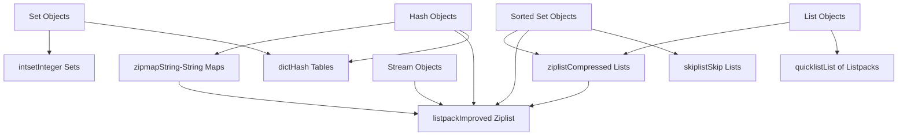
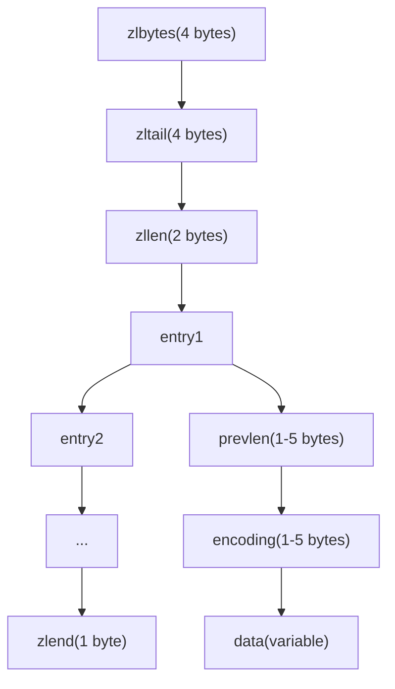
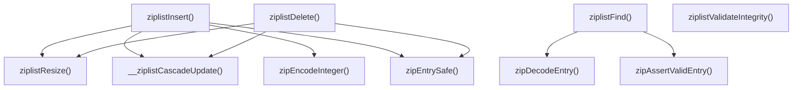
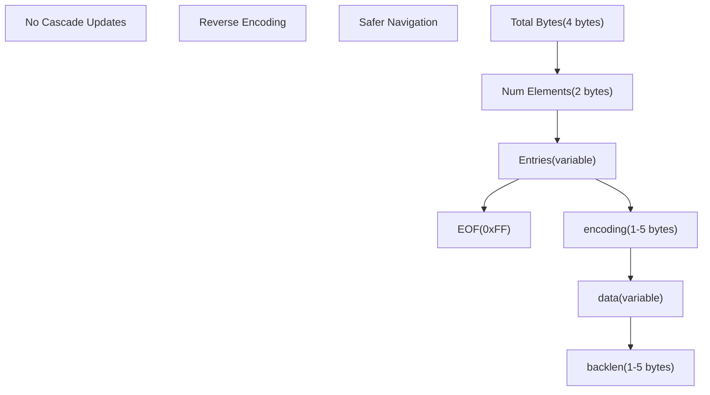
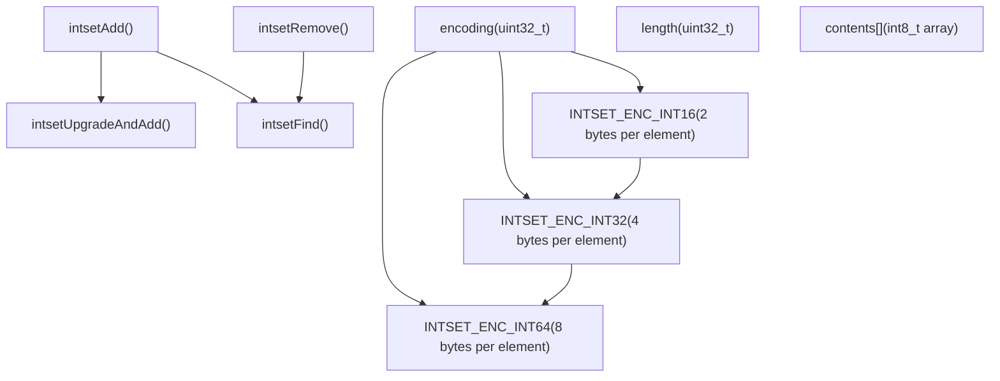
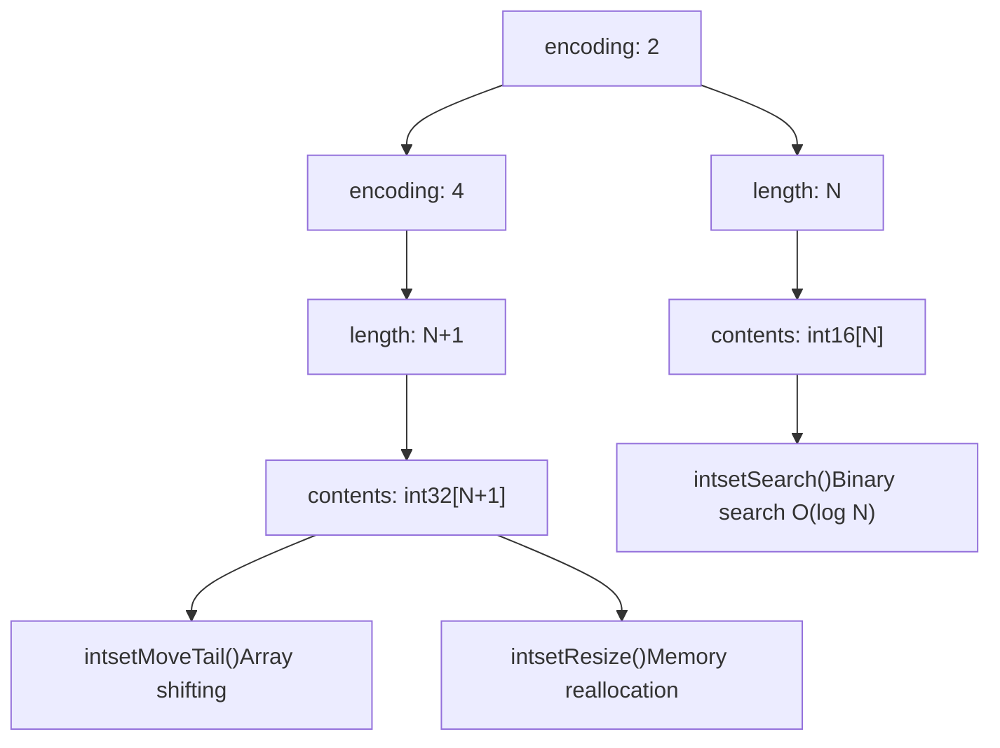
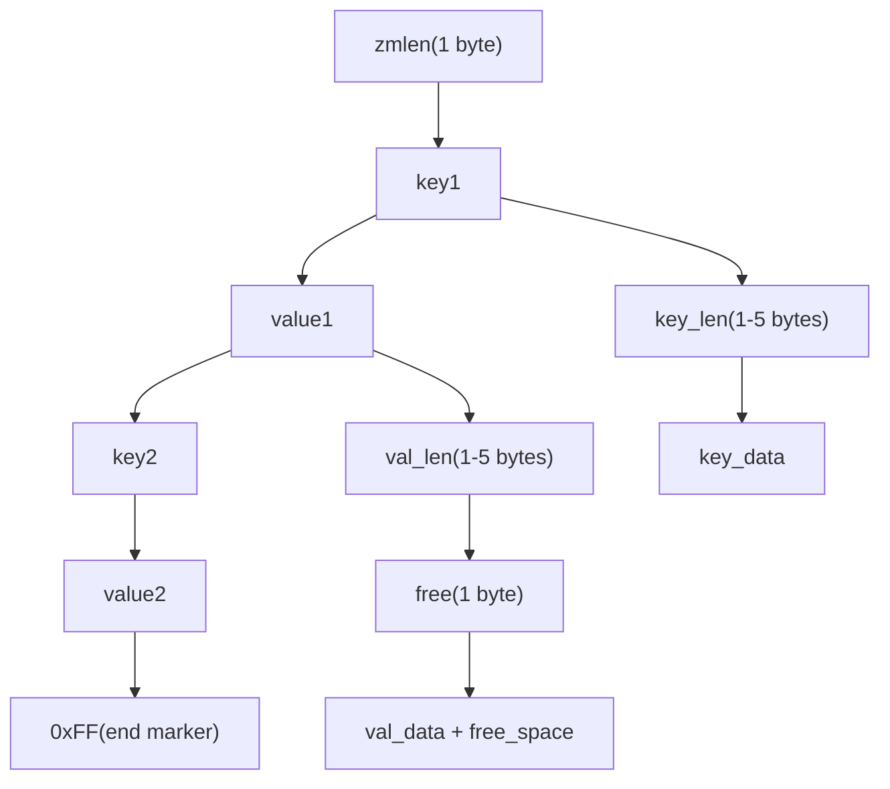
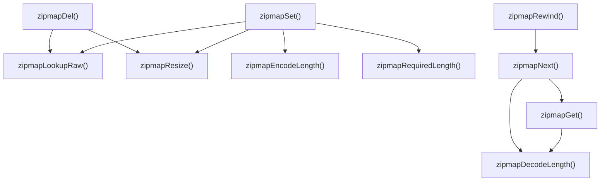
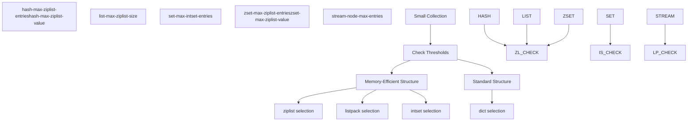
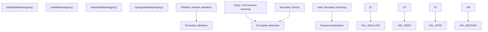

# Memory-Efficient Data Structures

Relevant source files

-   [src/intset.c](https://github.com/redis/redis/blob/8ad54215/src/intset.c)
-   [src/intset.h](https://github.com/redis/redis/blob/8ad54215/src/intset.h)
-   [src/listpack.c](https://github.com/redis/redis/blob/8ad54215/src/listpack.c)
-   [src/listpack.h](https://github.com/redis/redis/blob/8ad54215/src/listpack.h)
-   [src/ziplist.c](https://github.com/redis/redis/blob/8ad54215/src/ziplist.c)
-   [src/ziplist.h](https://github.com/redis/redis/blob/8ad54215/src/ziplist.h)
-   [src/zipmap.c](https://github.com/redis/redis/blob/8ad54215/src/zipmap.c)
-   [src/zipmap.h](https://github.com/redis/redis/blob/8ad54215/src/zipmap.h)
-   [tests/integration/corrupt-dump-fuzzer.tcl](https://github.com/redis/redis/blob/8ad54215/tests/integration/corrupt-dump-fuzzer.tcl)
-   [tests/integration/corrupt-dump.tcl](https://github.com/redis/redis/blob/8ad54215/tests/integration/corrupt-dump.tcl)

This document covers Redis's memory-efficient data structures that provide compact representations for small collections. These structures automatically switch from memory-optimized encodings to more general-purpose data structures when size thresholds are exceeded.

For information about the core data type implementations that use these structures, see [Core Data Types Implementation](/redis/redis/3.1-core-data-types-implementation). For details about the dictionary and key-value store architecture, see [Dictionary and Key-Value Store](/redis/redis/3.5-dictionary-and-key-value-store).

## Overview

Redis employs several specialized data structures to minimize memory usage for small collections. These structures trade some operational complexity for significant memory savings by using compact binary encodings and avoiding pointer overhead.

**Memory-Efficient Structure Selection Criteria:**

| Structure | Used For | Threshold Configuration | Memory Benefit |
| --- | --- | --- | --- |
| `ziplist` | Lists, Hashes, Sorted Sets | `*-max-ziplist-entries/value` | 50-80% reduction |
| `listpack` | Streams, newer Hashes | `*-max-listpack-entries` | Similar to ziplist, better design |
| `intset` | Integer-only Sets | `set-max-intset-entries` | 90%+ reduction for integers |
| `zipmap` | Small Hashes (legacy) | Fixed small sizes | 60-70% reduction |

Sources: [src/ziplist.c1-180](https://github.com/redis/redis/blob/8ad54215/src/ziplist.c#L1-L180) [src/listpack.c1-30](https://github.com/redis/redis/blob/8ad54215/src/listpack.c#L1-L30) [src/intset.c39-53](https://github.com/redis/redis/blob/8ad54215/src/intset.c#L39-L53) [src/zipmap.c1-70](https://github.com/redis/redis/blob/8ad54215/src/zipmap.c#L1-L70)

## Ziplist Implementation

The `ziplist` is a compressed doubly-linked list that stores both strings and integers in a compact binary format. It was the primary memory-efficient structure before being superseded by `listpack` in newer versions.

### Ziplist Structure Layout

**Key Functions:**

-   `ziplistNew()` - Creates empty ziplist
-   `ziplistPush()` - Adds elements at head/tail
-   `ziplistInsert()` - Inserts at arbitrary position
-   `__ziplistCascadeUpdate()` - Handles chain updates when entry sizes change

**Encoding Types:**

-   **Strings**: 6-bit (≤63 bytes), 14-bit (≤16383 bytes), 32-bit (≤2^32 bytes)
-   **Integers**: 4-bit immediate (0-12), 8-bit, 16-bit, 24-bit, 32-bit, 64-bit

Sources: [src/ziplist.c11-151](https://github.com/redis/redis/blob/8ad54215/src/ziplist.c#L11-L151) [src/ziplist.h37-44](https://github.com/redis/redis/blob/8ad54215/src/ziplist.h#L37-L44)

### Ziplist Entry Operations

The ziplist supports efficient operations through careful memory management and encoding optimizations:

**Critical Implementation Details:**

-   **Cascade Updates**: When an entry changes size, subsequent entries may need `prevlen` field updates
-   **Safety Checks**: `zipEntrySafe()` validates entries against buffer boundaries
-   **Integer Optimization**: Small integers (0-12) encoded in the encoding byte itself

Sources: [src/ziplist.c750-850](https://github.com/redis/redis/blob/8ad54215/src/ziplist.c#L750-L850) [src/ziplist.c628-688](https://github.com/redis/redis/blob/8ad54215/src/ziplist.c#L628-L688) [src/ziplist.c521-575](https://github.com/redis/redis/blob/8ad54215/src/ziplist.c#L521-L575)

## Listpack Implementation

The `listpack` is the modern replacement for `ziplist`, designed to eliminate cascade update issues while maintaining memory efficiency.

### Listpack Structure Design

**Encoding Optimizations:**

-   **7-bit unsigned integers**: Single byte (0-127)
-   **13-bit signed integers**: Two bytes (-4096 to 4095)
-   **String lengths**: 6-bit, 12-bit, or 32-bit length prefixes
-   **Backward length**: Reverse-encoded for efficient backward traversal

**Core Functions:**

-   `lpNew()` - Creates empty listpack
-   `lpInsertString()` / `lpInsertInteger()` - Insertion operations
-   `lpDelete()` - Removes entries
-   `lpNext()` / `lpPrev()` - Navigation without cascade issues

Sources: [src/listpack.c27-130](https://github.com/redis/redis/blob/8ad54215/src/listpack.c#L27-L130) [src/listpack.c250-334](https://github.com/redis/redis/blob/8ad54215/src/listpack.c#L250-L334) [src/listpack.h28-35](https://github.com/redis/redis/blob/8ad54215/src/listpack.h#L28-L35)

### Listpack vs Ziplist Comparison

| Feature | Ziplist | Listpack |
| --- | --- | --- |
| **Cascade Updates** | Required when `prevlen` changes | Eliminated by design |
| **Entry Navigation** | Forward via `prevlen`, backward complex | Both directions via `backlen` |
| **Memory Overhead** | Slightly lower | Slightly higher due to `backlen` |
| **Operational Complexity** | O(N²) worst case for updates | O(N) for all operations |
| **Usage** | Legacy, still used in lists | Primary choice for new implementations |

Sources: [src/listpack.c395-408](https://github.com/redis/redis/blob/8ad54215/src/listpack.c#L395-L408) [src/ziplist.c730-850](https://github.com/redis/redis/blob/8ad54215/src/ziplist.c#L730-L850)

## Intset Implementation

The `intset` provides memory-efficient storage for sets containing only integers by using a sorted array with automatic encoding upgrades.

### Intset Structure and Encoding

**Key Implementation Features:**

-   **Automatic Upgrades**: When adding value requiring larger encoding, entire intset upgrades
-   **Binary Search**: `intsetSearch()` provides O(log N) lookups in sorted array
-   **Memory Efficiency**: No pointers, direct array storage with minimal overhead
-   **Endianness**: Proper byte order handling via `memrev16ifbe()` functions

**Upgrade Process:**

1.  Determine required encoding for new value
2.  Allocate new memory for upgraded encoding
3.  Copy existing values from back to front to avoid overwrites
4.  Insert new value at appropriate position
5.  Update encoding and length fields

Sources: [src/intset.c35-53](https://github.com/redis/redis/blob/8ad54215/src/intset.c#L35-L53) [src/intset.c158-182](https://github.com/redis/redis/blob/8ad54215/src/intset.c#L158-L182) [src/intset.c113-156](https://github.com/redis/redis/blob/8ad54215/src/intset.c#L113-L156)

### Intset Memory Layout

Sources: [src/intset.c105-111](https://github.com/redis/redis/blob/8ad54215/src/intset.c#L105-L111) [src/intset.c184-203](https://github.com/redis/redis/blob/8ad54215/src/intset.c#L184-L203) [src/intset.c294-297](https://github.com/redis/redis/blob/8ad54215/src/intset.c#L294-L297)

## Zipmap Implementation

The `zipmap` provides a memory-efficient string-to-string mapping for small hash objects using a linear layout with length-prefixed entries.

### Zipmap Memory Layout

**Zipmap Characteristics:**

-   **Linear Search**: O(N) lookups but very cache-friendly for small sizes
-   **Free Space Management**: Values can have trailing free bytes to reduce reallocations
-   **Length Encoding**: Lengths < 254 use 1 byte, others use 5 bytes (1 + 4-byte length)
-   **Memory Efficiency**: No pointers, continuous memory layout

**Core Operations:**

-   `zipmapSet()` - Insert/update key-value pairs with free space management
-   `zipmapGet()` - Linear search for key retrieval
-   `zipmapDel()` - Remove entries and compact memory
-   `zipmapNext()` - Iterator support for traversal

Sources: [src/zipmap.c23-56](https://github.com/redis/redis/blob/8ad54215/src/zipmap.c#L23-L56) [src/zipmap.c76-115](https://github.com/redis/redis/blob/8ad54215/src/zipmap.c#L76-L115) [src/zipmap.c193-283](https://github.com/redis/redis/blob/8ad54215/src/zipmap.c#L193-L283)

### Zipmap Operations Flow

Sources: [src/zipmap.c117-151](https://github.com/redis/redis/blob/8ad54215/src/zipmap.c#L117-L151) [src/zipmap.c285-316](https://github.com/redis/redis/blob/8ad54215/src/zipmap.c#L285-L316) [src/zipmap.c335-357](https://github.com/redis/redis/blob/8ad54215/src/zipmap.c#L335-L357)

## Memory Optimization Strategies

Redis's memory-efficient structures employ several key strategies to minimize memory usage while maintaining acceptable performance for small collections.

### Encoding Selection and Thresholds

**Memory Savings Analysis:**

| Structure | Pointer Overhead Eliminated | Encoding Efficiency | Total Savings |
| --- | --- | --- | --- |
| **ziplist** vs linked list | 16 bytes per node | Integer compression | 50-80% |
| **intset** vs hash table | Hash table + pointer overhead | Native integer storage | 85-95% |
| **listpack** vs dict | Dict entry + pointer overhead | String length optimization | 60-75% |
| **zipmap** vs dict | Dict entry overhead | Linear layout | 60-70% |

Sources: [src/ziplist.c269-277](https://github.com/redis/redis/blob/8ad54215/src/ziplist.c#L269-L277) [src/intset.c302-343](https://github.com/redis/redis/blob/8ad54215/src/intset.c#L302-L343) [src/listpack.c123-129](https://github.com/redis/redis/blob/8ad54215/src/listpack.c#L123-L129)

### Integrity Validation and Corruption Detection

All memory-efficient structures include comprehensive validation to detect corruption and ensure data integrity:

**Validation Features:**

-   **Boundary Validation**: All entry access validated against structure bounds
-   **Encoding Validation**: Entry encodings checked for consistency
-   **Size Consistency**: Header sizes matched against actual content
-   **Corruption Detection**: Fuzzing and integrity tests detect malformed data

Sources: [src/ziplist.c628-708](https://github.com/redis/redis/blob/8ad54215/src/ziplist.c#L628-L708) [src/listpack.c1139-1203](https://github.com/redis/redis/blob/8ad54215/src/listpack.c#L1139-L1203) [src/intset.c299-343](https://github.com/redis/redis/blob/8ad54215/src/intset.c#L299-L343) [src/zipmap.c359-424](https://github.com/redis/redis/blob/8ad54215/src/zipmap.c#L359-L424)
