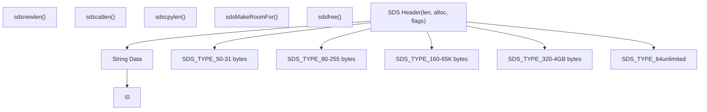
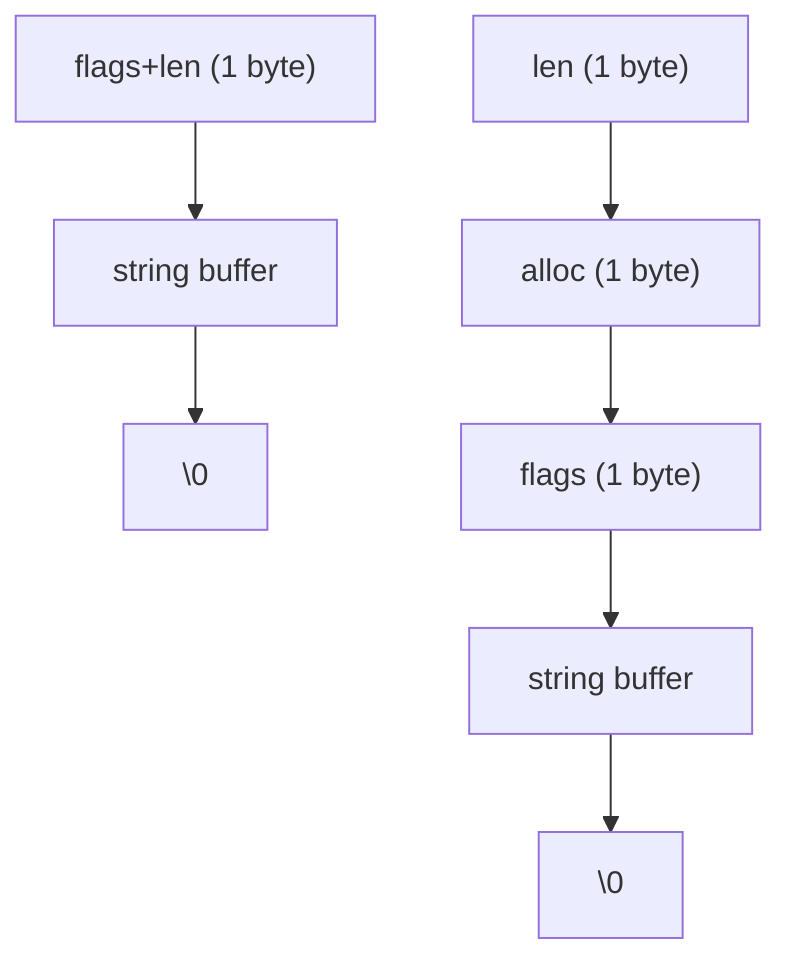
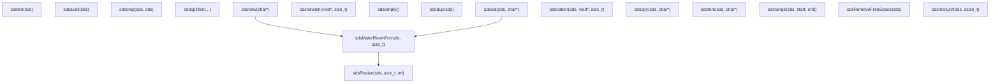
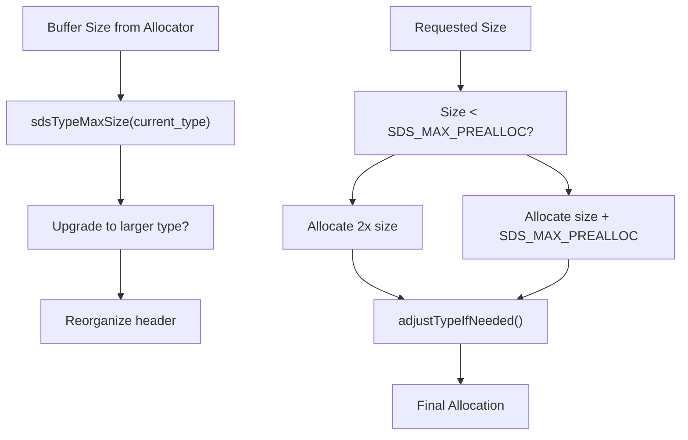
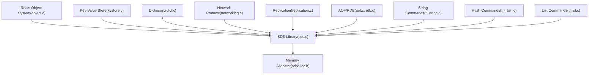
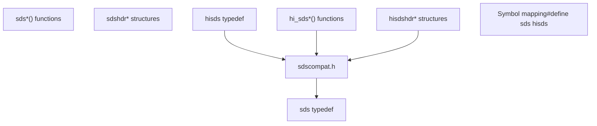

# Dynamic String Library

Relevant source files

-   [deps/hiredis/hiredis\_ssl.h](https://github.com/redis/redis/blob/8ad54215/deps/hiredis/hiredis_ssl.h)
-   [deps/hiredis/sds.c](https://github.com/redis/redis/blob/8ad54215/deps/hiredis/sds.c)
-   [deps/hiredis/sds.h](https://github.com/redis/redis/blob/8ad54215/deps/hiredis/sds.h)
-   [deps/hiredis/sdsalloc.h](https://github.com/redis/redis/blob/8ad54215/deps/hiredis/sdsalloc.h)
-   [deps/hiredis/sdscompat.h](https://github.com/redis/redis/blob/8ad54215/deps/hiredis/sdscompat.h)
-   [deps/hiredis/ssl.c](https://github.com/redis/redis/blob/8ad54215/deps/hiredis/ssl.c)
-   [src/sds.c](https://github.com/redis/redis/blob/8ad54215/src/sds.c)
-   [src/sds.h](https://github.com/redis/redis/blob/8ad54215/src/sds.h)

The Dynamic String Library (SDS) is Redis's custom string implementation that provides efficient, binary-safe string handling with automatic memory management. SDS replaces standard C strings throughout Redis to enable O(1) length operations, reduce memory allocations, and support binary data storage.

For information about higher-level data type implementations that use SDS, see [Core Data Types Implementation](/redis/redis/3.1-core-data-types-implementation). For memory allocation strategies, see [Memory Allocators and Build System](/redis/redis/4.2-memory-allocators-and-build-system).

## SDS Architecture Overview

SDS uses a header-prefixed design where metadata is stored immediately before the string data, allowing the string pointer to be used directly as a C string while maintaining length and allocation information.

**SDS Architecture Diagram**

Sources: [src/sds.h28-55](https://github.com/redis/redis/blob/8ad54215/src/sds.h#L28-L55) [src/sds.c33-43](https://github.com/redis/redis/blob/8ad54215/src/sds.c#L33-L43)

## Memory Layout and Type System

SDS implements five different header types to minimize memory overhead based on string size. Each type uses packed structures to eliminate padding.

| Type | Size Range | Header Size | Fields |
| --- | --- | --- | --- |
| SDS\_TYPE\_5 | 0-31 bytes | 1 byte | flags only (length in upper 5 bits) |
| SDS\_TYPE\_8 | 0-255 bytes | 3 bytes | len, alloc, flags (uint8\_t) |
| SDS\_TYPE\_16 | 0-65K bytes | 5 bytes | len, alloc, flags (uint16\_t) |
| SDS\_TYPE\_32 | 0-4GB bytes | 9 bytes | len, alloc, flags (uint32\_t) |
| SDS\_TYPE\_64 | unlimited | 17 bytes | len, alloc, flags (uint64\_t) |

**SDS Memory Layout by Type**

The `sdsReqType()` function determines the appropriate type based on string length, while `adjustTypeIfNeeded()` handles cases where the allocator returns more memory than requested.

Sources: [src/sds.h28-55](https://github.com/redis/redis/blob/8ad54215/src/sds.h#L28-L55) [src/sds.c33-83](https://github.com/redis/redis/blob/8ad54215/src/sds.c#L33-L83)

## Core SDS Operations

SDS provides a comprehensive API for string creation, manipulation, and memory management. The library maintains C string compatibility while adding length tracking and automatic resizing.

**SDS Operations Flow**

Key implementation details:

-   **String Creation**: `sdsnewlen()` is the fundamental creation function, with others being convenience wrappers [src/sds.c98-190](https://github.com/redis/redis/blob/8ad54215/src/sds.c#L98-L190)
-   **Concatenation**: `sdscatlen()` automatically grows the buffer using `sdsMakeRoomFor()` [src/sds.c532-541](https://github.com/redis/redis/blob/8ad54215/src/sds.c#L532-L541)
-   **Memory Growth**: Uses exponential growth strategy up to `SDS_MAX_PREALLOC` (1MB), then linear growth [src/sds.c280-285](https://github.com/redis/redis/blob/8ad54215/src/sds.c#L280-L285)
-   **Length Access**: All length operations are O(1) through header access [src/sds.h73-86](https://github.com/redis/redis/blob/8ad54215/src/sds.h#L73-L86)

Sources: [src/sds.c188-587](https://github.com/redis/redis/blob/8ad54215/src/sds.c#L188-L587) [src/sds.h213-287](https://github.com/redis/redis/blob/8ad54215/src/sds.h#L213-L287)

## Memory Management Strategy

SDS implements sophisticated memory management to balance performance and memory efficiency. The system uses greedy and non-greedy allocation strategies based on usage patterns.

**SDS Memory Management Flow**

The memory management system handles several key scenarios:

-   **Greedy Growth**: `sdsMakeRoomFor()` pre-allocates extra space to reduce future reallocations [src/sds.c264-329](https://github.com/redis/redis/blob/8ad54215/src/sds.c#L264-L329)
-   **Non-Greedy Growth**: `sdsMakeRoomForNonGreedy()` allocates exactly what's needed [src/sds.c332-334](https://github.com/redis/redis/blob/8ad54215/src/sds.c#L332-L334)
-   **Type Promotion**: `adjustTypeIfNeeded()` upgrades SDS type when allocator returns more memory than the current type can address [src/sds.c75-83](https://github.com/redis/redis/blob/8ad54215/src/sds.c#L75-L83)
-   **Memory Compaction**: `sdsRemoveFreeSpace()` shrinks allocation to exact size [src/sds.c342-344](https://github.com/redis/redis/blob/8ad54215/src/sds.c#L342-L344)

Sources: [src/sds.c264-425](https://github.com/redis/redis/blob/8ad54215/src/sds.c#L264-L425) [src/sds.h17](https://github.com/redis/redis/blob/8ad54215/src/sds.h#L17-L17)

## Integration with Redis Core Systems

SDS serves as the fundamental string type throughout Redis, used in data structures, protocol handling, and internal operations.

**SDS Integration in Redis Architecture**

Key integration points:

-   **Redis Objects**: String objects use SDS for value storage with encoding optimizations
-   **Protocol Processing**: RESP protocol parsing and generation uses SDS for command and reply buffers
-   **Key Storage**: Dictionary keys are stored as SDS strings for efficient operations
-   **Replication**: Command propagation uses SDS for buffering and transmission
-   **Persistence**: AOF commands and RDB string values utilize SDS encoding

Sources: [src/sds.c1-26](https://github.com/redis/redis/blob/8ad54215/src/sds.c#L1-L26) integration patterns throughout Redis codebase

## SDS Variants and Compatibility

Redis includes two SDS implementations: the main version and a hiredis-specific variant with different naming conventions and slight behavioral differences.

**SDS Variants and Compatibility**

The hiredis version includes:

-   Prefixed function names (`hi_sds*`) to avoid symbol conflicts [deps/hiredis/sds.h49](https://github.com/redis/redis/blob/8ad54215/deps/hiredis/sds.h#L49-L49)
-   Slightly different type selection logic [deps/hiredis/sds.c59-69](https://github.com/redis/redis/blob/8ad54215/deps/hiredis/sds.c#L59-L69)
-   Compatibility header for symbol mapping [deps/hiredis/sdscompat.h45-93](https://github.com/redis/redis/blob/8ad54215/deps/hiredis/sdscompat.h#L45-L93)

Sources: [deps/hiredis/sds.c1-40](https://github.com/redis/redis/blob/8ad54215/deps/hiredis/sds.c#L1-L40) [deps/hiredis/sds.h49](https://github.com/redis/redis/blob/8ad54215/deps/hiredis/sds.h#L49-L49) [deps/hiredis/sdscompat.h42-94](https://github.com/redis/redis/blob/8ad54215/deps/hiredis/sdscompat.h#L42-L94)

## Performance Characteristics

SDS provides several performance advantages over standard C strings:

-   **O(1) Length Operations**: Length stored in header eliminates `strlen()` calls
-   **Reduced Allocations**: Greedy growth strategy minimizes reallocation frequency
-   **Cache-Friendly Layout**: Contiguous memory layout improves cache performance
-   **Binary Safety**: Embedded length enables handling of binary data with null bytes
-   **Memory Efficiency**: Type system minimizes header overhead for different string sizes

The library includes specialized functions like `sdscatfmt()` for fast formatting without `sprintf()` overhead [src/sds.c672-765](https://github.com/redis/redis/blob/8ad54215/src/sds.c#L672-L765) and `sdsIncrLen()` for efficient length adjustments during direct buffer manipulation [src/sds.c469-507](https://github.com/redis/redis/blob/8ad54215/src/sds.c#L469-L507)

Sources: [src/sds.c672-765](https://github.com/redis/redis/blob/8ad54215/src/sds.c#L672-L765) [src/sds.c469-507](https://github.com/redis/redis/blob/8ad54215/src/sds.c#L469-L507) [src/sds.h88-111](https://github.com/redis/redis/blob/8ad54215/src/sds.h#L88-L111)
