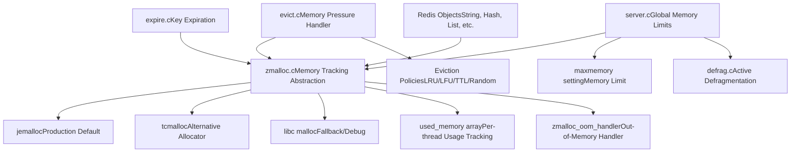
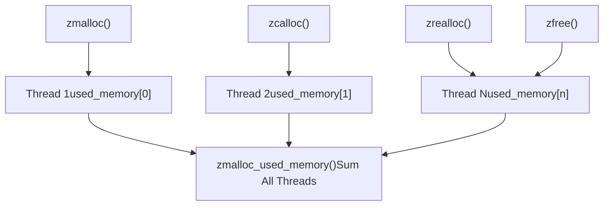
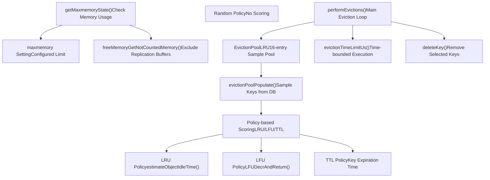
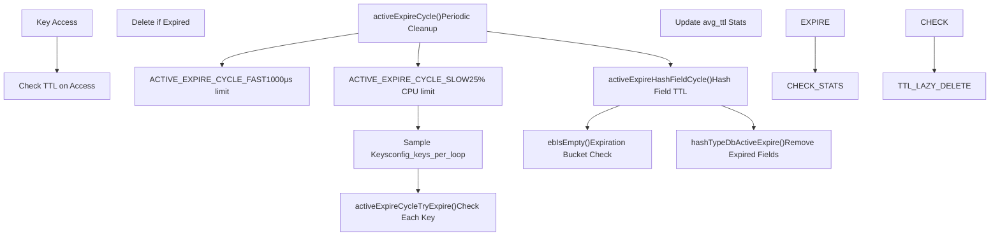
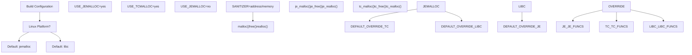
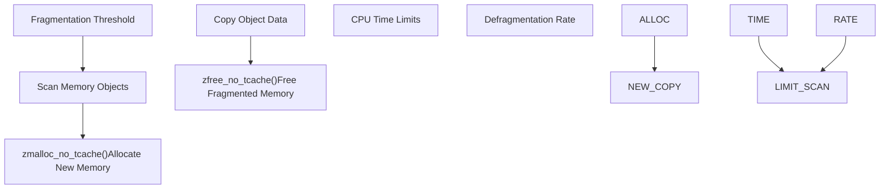

# Memory Management

Relevant source files

-   [deps/jemalloc/include/jemalloc/internal/jemalloc\_internal\_externs.h](https://github.com/redis/redis/blob/8ad54215/deps/jemalloc/include/jemalloc/internal/jemalloc_internal_externs.h)
-   [deps/jemalloc/include/jemalloc/internal/jemalloc\_internal\_inlines\_c.h](https://github.com/redis/redis/blob/8ad54215/deps/jemalloc/include/jemalloc/internal/jemalloc_internal_inlines_c.h)
-   [deps/jemalloc/include/jemalloc/jemalloc\_macros.h.in](https://github.com/redis/redis/blob/8ad54215/deps/jemalloc/include/jemalloc/jemalloc_macros.h.in)
-   [deps/jemalloc/src/jemalloc.c](https://github.com/redis/redis/blob/8ad54215/deps/jemalloc/src/jemalloc.c)
-   [deps/jemalloc/src/jemalloc\_cpp.cpp](https://github.com/redis/redis/blob/8ad54215/deps/jemalloc/src/jemalloc_cpp.cpp)
-   [src/Makefile](https://github.com/redis/redis/blob/8ad54215/src/Makefile)
-   [src/config.h](https://github.com/redis/redis/blob/8ad54215/src/config.h)
-   [src/evict.c](https://github.com/redis/redis/blob/8ad54215/src/evict.c)
-   [src/expire.c](https://github.com/redis/redis/blob/8ad54215/src/expire.c)
-   [src/zmalloc.c](https://github.com/redis/redis/blob/8ad54215/src/zmalloc.c)
-   [src/zmalloc.h](https://github.com/redis/redis/blob/8ad54215/src/zmalloc.h)
-   [tests/unit/expire.tcl](https://github.com/redis/redis/blob/8ad54215/tests/unit/expire.tcl)
-   [tests/unit/maxmemory.tcl](https://github.com/redis/redis/blob/8ad54215/tests/unit/maxmemory.tcl)

Redis memory management encompasses allocation tracking, eviction policies, key expiration, and memory optimization strategies. This system ensures Redis operates efficiently within memory constraints while providing predictable performance characteristics.

For information about data structure memory optimization, see [Memory-Efficient Data Structures](/redis/redis/3.4-memory-efficient-data-structures). For eviction and expiration policy details, see [Eviction and Expiration Policies](/redis/redis/4.1-eviction-and-expiration-policies). For memory allocator build configuration, see [Memory Allocators and Build System](/redis/redis/4.2-memory-allocators-and-build-system).

## Memory Allocation Architecture

Redis implements a multi-layered memory management architecture built on top of pluggable allocators with comprehensive tracking and control mechanisms.

Sources: [src/zmalloc.c1-1030](https://github.com/redis/redis/blob/8ad54215/src/zmalloc.c#L1-L1030) [src/zmalloc.h1-164](https://github.com/redis/redis/blob/8ad54215/src/zmalloc.h#L1-L164) [src/Makefile79-106](https://github.com/redis/redis/blob/8ad54215/src/Makefile#L79-L106)

## Memory Tracking and Statistics

The `zmalloc` layer provides comprehensive memory usage tracking with thread-safe per-thread counters and detailed allocator statistics.

### Thread-Safe Usage Tracking

Redis tracks memory usage across multiple threads using cache-line aligned per-thread counters to avoid contention:

Sources: [src/zmalloc.c85-109](https://github.com/redis/redis/blob/8ad54215/src/zmalloc.c#L85-L109) [src/zmalloc.c503-516](https://github.com/redis/redis/blob/8ad54215/src/zmalloc.c#L503-L516)

### Allocator-Specific Statistics

When using jemalloc, Redis exposes detailed memory statistics including fragmentation metrics:

| Function | Purpose | Key Metrics |
| --- | --- | --- |
| `zmalloc_get_allocator_info()` | Global allocator stats | allocated, active, resident, fragmentation |
| `zmalloc_get_allocator_info_by_arena()` | Per-arena stats | arena-specific allocation patterns |
| `zmalloc_get_frag_smallbins()` | Fragmentation analysis | small bin fragmentation bytes |
| `zmalloc_get_rss()` | OS memory usage | resident set size from OS |

Sources: [src/zmalloc.c799-845](https://github.com/redis/redis/blob/8ad54215/src/zmalloc.c#L799-L845) [src/zmalloc.c852-891](https://github.com/redis/redis/blob/8ad54215/src/zmalloc.c#L852-L891)

## Eviction System Architecture

The eviction system maintains memory usage within configured limits through multiple eviction policies and sampling strategies.

Sources: [src/evict.c104-116](https://github.com/redis/redis/blob/8ad54215/src/evict.c#L104-L116) [src/evict.c126-215](https://github.com/redis/redis/blob/8ad54215/src/evict.c#L126-L215) [src/evict.c510-700](https://github.com/redis/redis/blob/8ad54215/src/evict.c#L510-L700)

### Eviction Pool Strategy

Redis uses a sampling-based eviction pool to approximate optimal eviction policies efficiently:

-   **Pool Size**: 16 entries (`EVPOOL_SIZE`)
-   **Sampling**: Keys sampled from random dictionary slots
-   **Scoring**: Policy-specific scoring (idle time for LRU, inverted frequency for LFU)
-   **Selection**: Highest scoring key selected for eviction

Sources: [src/evict.c34-42](https://github.com/redis/redis/blob/8ad54215/src/evict.c#L34-L42) [src/evict.c163-214](https://github.com/redis/redis/blob/8ad54215/src/evict.c#L163-L214)

## Key Expiration Management

Redis implements both passive and active expiration strategies to ensure expired keys are removed efficiently.

Sources: [src/expire.c187-408](https://github.com/redis/redis/blob/8ad54215/src/expire.c#L187-L408) [src/expire.c38-51](https://github.com/redis/redis/blob/8ad54215/src/expire.c#L38-L51) [src/expire.c144-185](https://github.com/redis/redis/blob/8ad54215/src/expire.c#L144-L185)

### Active Expiration Parameters

| Parameter | Fast Cycle | Slow Cycle | Purpose |
| --- | --- | --- | --- |
| Time Limit | 1000μs | 25% CPU | Prevent blocking |
| Keys per Loop | 20 + effort | 20 + effort | Sampling size |
| Acceptable Stale | 10% - effort | 10% - effort | Continue threshold |
| Database Coverage | All DBs | CRON\_DBS\_PER\_CALL | Coverage strategy |

Sources: [src/expire.c93-98](https://github.com/redis/redis/blob/8ad54215/src/expire.c#L93-L98) [src/expire.c191-200](https://github.com/redis/redis/blob/8ad54215/src/expire.c#L191-L200)

## Memory Allocator Integration

Redis supports multiple memory allocators configured at build time, with jemalloc as the production default.

### Allocator Selection Logic

Sources: [src/Makefile79-106](https://github.com/redis/redis/blob/8ad54215/src/Makefile#L79-L106) [src/zmalloc.c56-80](https://github.com/redis/redis/blob/8ad54215/src/zmalloc.c#L56-L80)

### jemalloc Redis Integration

Redis uses a customized jemalloc with Redis-specific features:

-   **Fragmentation Hints**: `JEMALLOC_FRAG_HINT` enables defragmentation support
-   **Usable Size**: `JEMALLOC_ALLOC_WITH_USIZE` provides allocation size feedback
-   **Background Threads**: `set_jemalloc_bg_thread()` controls async purging
-   **Arena Management**: Per-arena statistics and control

Sources: [deps/jemalloc/include/jemalloc/jemalloc\_macros.h.in152-156](https://github.com/redis/redis/blob/8ad54215/deps/jemalloc/include/jemalloc/jemalloc_macros.h.in#L152-L156) [src/zmalloc.c894-912](https://github.com/redis/redis/blob/8ad54215/src/zmalloc.c#L894-L912)

## Memory Optimization Strategies

### Active Defragmentation

When enabled with supported allocators, Redis performs active defragmentation to reduce memory fragmentation:

Sources: [src/zmalloc.c242-256](https://github.com/redis/redis/blob/8ad54215/src/zmalloc.c#L242-L256)

### Memory Usage Exclusions

Redis excludes certain memory usage from eviction calculations to prevent feedback loops:

-   **Replication Buffers**: Exclude output buffers beyond backlog size
-   **AOF Buffers**: Exclude append-only file write buffers
-   **Client Buffers**: Configurable client memory limits

Sources: [src/evict.c308-343](https://github.com/redis/redis/blob/8ad54215/src/evict.c#L308-L343) [src/evict.c369-420](https://github.com/redis/redis/blob/8ad54215/src/evict.c#L369-L420)

### RSS and Memory Reporting

Redis provides multiple memory usage metrics for monitoring and debugging:

| Metric | Function | Purpose |
| --- | --- | --- |
| Used Memory | `zmalloc_used_memory()` | Total allocated by Redis |
| RSS | `zmalloc_get_rss()` | OS resident set size |
| Private Dirty | `zmalloc_get_private_dirty()` | Process-private dirty pages |
| Peak Memory | Server stats | Historical maximum usage |

Sources: [src/zmalloc.c607-728](https://github.com/redis/redis/blob/8ad54215/src/zmalloc.c#L607-L728) [src/zmalloc.c1024-1060](https://github.com/redis/redis/blob/8ad54215/src/zmalloc.c#L1024-L1060)
